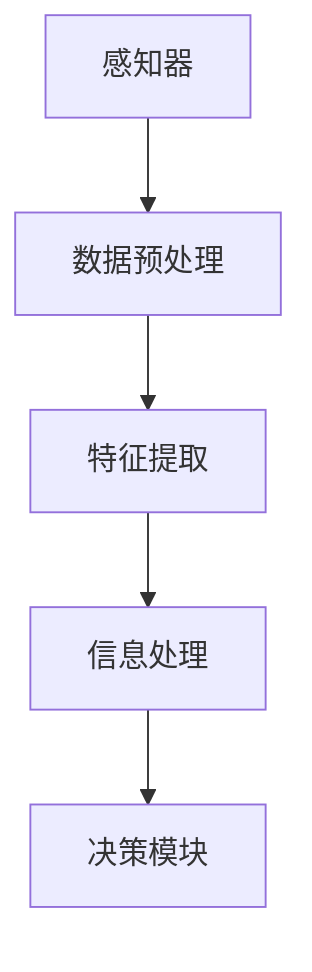
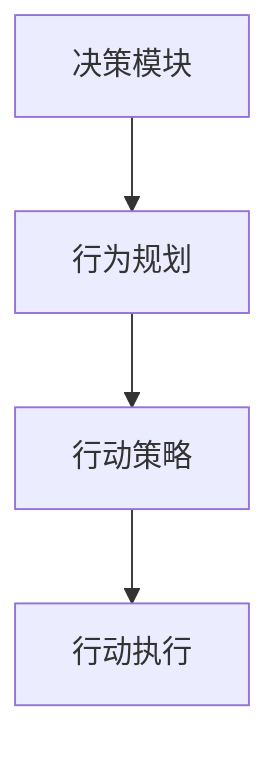
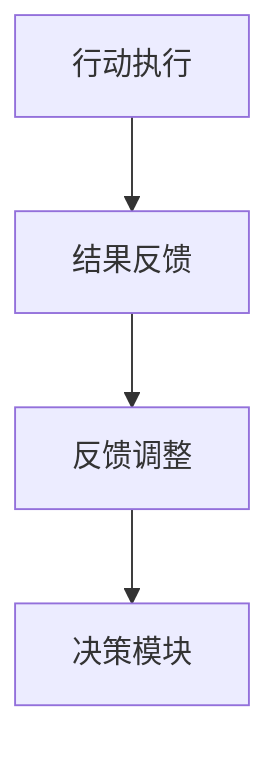
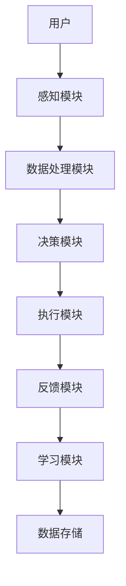
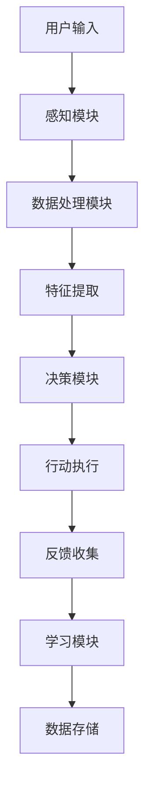

                 

### 第一部分：问题背景与核心概念

## 第1章：问题背景与核心概念

### 1.1 问题背景

人工智能（AI）技术正以前所未有的速度和规模影响着我们的日常生活。AI agent，作为一种重要的AI应用形式，正在不断扩展其应用领域，从简单的自动化任务执行到复杂的决策支持系统。随着技术的进步，AI agent逐渐具备了更强的自主性和智能性。然而，现有的AI agent仍然面临许多挑战，其中最为突出的就是如何构建具有自主探索与假设验证能力的AI agent。

#### 1.1.1 AI Agent的定义与发展历程

AI agent可以定义为一种能够感知环境、采取行动并达到特定目标的智能实体。它具备以下几个基本特征：

1. **自主性**：能够独立执行任务，而不需要人类的直接干预。
2. **适应性**：能够根据环境变化调整自己的行为策略。
3. **交互性**：能够与人类或其他系统进行有效的交互。

AI agent的发展历程可以追溯到20世纪50年代，最早的AI agent是规则基础的方法，例如专家系统。随后，随着机器学习和深度学习技术的发展，基于数据的AI agent逐渐成为主流。近年来，随着强化学习等技术的引入，AI agent的自主性和适应性得到了显著提升。

#### 1.1.2 AI Agent的应用场景与挑战

AI agent在许多领域都有广泛的应用，如智能家居、自动驾驶、智能医疗、智能教育等。以下是一些典型应用场景和所面临的挑战：

1. **智能家居**：AI agent可以帮助用户自动调节家电，提高生活舒适度和节能效率。然而，如何确保AI agent在多种不同环境下都能准确理解用户需求，是一个重大挑战。
   
2. **自动驾驶**：AI agent在自动驾驶系统中负责感知环境、规划路径和决策。这一领域需要高精度的感知系统和强大的实时处理能力，同时要保证系统的安全性和可靠性。

3. **智能医疗**：AI agent可以辅助医生进行诊断和治疗方案推荐。然而，如何在海量医疗数据中提取有效信息，并确保AI agent的建议准确可靠，是当前研究的重点。

4. **智能教育**：AI agent可以为学生提供个性化学习建议和反馈。这一应用场景要求AI agent能够准确理解学生的学习状态和需求，并根据这些信息提供有效的帮助。

#### 1.1.3 自主探索与假设验证能力的重要性

自主探索与假设验证能力是AI agent的核心能力之一。自主探索使AI agent能够在复杂和不确定的环境中自主学习和改进，从而更好地适应环境变化。假设验证则使AI agent能够在行动之前对可能的假设进行验证，减少错误决策的风险。这两种能力不仅能够提高AI agent的性能，还能增强其安全性和可靠性。

### 1.2 核心概念

为了深入理解AI agent的自主探索与假设验证能力，我们需要明确一些核心概念。

#### 1.2.1 AI Agent的基本结构

一个典型的AI agent包括以下几个核心组成部分：

1. **感知器**：用于感知环境信息，如摄像头、传感器等。
2. **决策模块**：根据感知到的环境信息，AI agent会生成行动策略。
3. **执行器**：执行由决策模块生成的行动。
4. **记忆模块**：记录AI agent的历史经验和学习到的知识。
5. **学习模块**：用于根据经验调整行为策略。

#### 1.2.2 自主探索与假设验证的机制

自主探索与假设验证机制是AI agent的核心智能体现。自主探索机制主要包括以下步骤：

1. **环境感知**：AI agent通过感知器获取环境信息。
2. **行为规划**：根据当前状态和目标，AI agent生成可能的行为。
3. **行动执行**：执行选定行为，并观察结果。
4. **反馈调整**：根据行动结果调整行为策略。

假设验证机制则包括以下步骤：

1. **假设提出**：AI agent根据经验或知识提出可能的假设。
2. **假设验证**：通过模拟或实验来验证假设的正确性。
3. **假设修正**：根据验证结果调整或更新假设。

#### 1.2.3 AI Agent在现实世界中的应用

AI agent已经在多个现实世界中得到了应用，以下是一些典型的案例：

1. **工业自动化**：AI agent可以用于监控生产线，自动调整生产参数，提高生产效率。
2. **金融服务**：AI agent可以用于风险评估、投资决策和客户服务。
3. **智慧城市**：AI agent可以用于交通管理、环境监测和公共安全。

### 1.3 本章小结

本章介绍了AI agent的定义、发展历程、应用场景以及自主探索与假设验证能力的核心概念。通过这些介绍，我们为后续章节的深入探讨奠定了基础。在接下来的章节中，我们将详细探讨AI agent的自主探索与假设验证机制的实现，以及如何在实际应用中设计和实现这些机制。

---

### 第二部分：自主探索与假设验证机制

## 第2章：自主探索机制的实现

自主探索机制是AI agent能够适应复杂和不确定环境的关键。在本章中，我们将探讨自主探索机制的基本原理、具体实现以及其在现实世界中的应用实例。

### 2.1 自主探索的基本原理

自主探索机制的核心在于如何让AI agent能够自主地感知环境、规划行为并执行这些行为。以下是自主探索机制的基本原理：

#### 2.1.1 自主探索的目标与任务

自主探索的目标是使AI agent能够在不确定和动态的环境中自主学习和适应。具体任务包括：

1. **环境感知**：AI agent需要能够感知并理解其所在环境。
2. **行为规划**：根据感知到的环境信息，AI agent需要规划合适的行为。
3. **行动执行**：AI agent需要能够执行规划的行为。
4. **学习与调整**：通过观察行为的结果，AI agent需要能够学习并调整其行为策略。

#### 2.1.2 自主探索的方法与策略

自主探索的方法和策略多种多样，以下是一些常用的方法：

1. **基于规则的策略**：通过预定义的规则来指导AI agent的行为。
2. **强化学习**：AI agent通过试错学习来优化其行为策略。
3. **深度学习**：通过神经网络来模拟AI agent的学习过程。
4. **遗传算法**：模拟生物进化过程，用于优化AI agent的行为。

#### 2.1.3 自主探索的评价指标

自主探索的性能可以通过多个指标进行评估，包括：

1. **探索效率**：AI agent在完成目标任务的同时，所需的探索时间。
2. **探索深度**：AI agent在探索过程中达到的深度，即能够处理的环境复杂度。
3. **探索广度**：AI agent能够处理的环境多样性。
4. **稳定性**：AI agent在不同环境下的稳定表现。

### 2.2 自主探索的具体实现

自主探索的具体实现包括感知、规划、执行和反馈等环节。以下是这些环节的具体实现：

#### 2.2.1 环境感知与信息处理

环境感知是自主探索的基础。AI agent通过传感器收集环境信息，如图像、声音、温度等。然后，通过数据预处理和特征提取，将原始数据转化为可用于决策的特征向量。

#### 2.2.2 行为规划与决策

行为规划是根据感知到的环境信息和目标来生成行动策略。AI agent可以使用强化学习、深度学习等方法来制定行为规划。

#### 2.2.3 行动执行与反馈循环

行动执行是将生成的行动策略付诸实施。AI agent通过执行器执行行动，并根据行动的结果进行反馈调整。

### 2.3 实例分析

#### 2.3.1 案例一：智能家居中的自主探索

在智能家居场景中，AI agent可以自主调节家电，如空调、灯光和安防系统。以下是自主探索的实现过程：

1. **环境感知**：AI agent通过传感器感知室内温度、光线强度和安全状态。
2. **行为规划**：根据环境信息和用户习惯，AI agent规划相应的家电控制策略。
3. **行动执行**：AI agent通过执行器调整家电状态。
4. **反馈调整**：根据用户反馈和环境变化，AI agent调整其控制策略。

#### 2.3.2 案例二：自动驾驶中的自主探索

在自动驾驶场景中，AI agent需要实时感知道路环境、规划行驶路径并执行驾驶动作。以下是自主探索的实现过程：

1. **环境感知**：AI agent通过摄像头、雷达和激光雷达感知道路、车辆和行人等信息。
2. **行为规划**：根据感知到的信息，AI agent规划行驶路径和驾驶策略。
3. **行动执行**：AI agent通过控制汽车的方向盘、油门和刹车执行驾驶动作。
4. **反馈调整**：根据道路状况和交通规则，AI agent不断调整其驾驶策略。

### 2.4 本章小结

本章介绍了自主探索机制的基本原理和具体实现，并通过实例分析了其在智能家居和自动驾驶中的应用。自主探索机制的实现不仅需要强大的感知和决策能力，还需要高效的执行和反馈机制。在接下来的章节中，我们将继续探讨假设验证机制的实现及其应用。

---

### 第3章：假设验证机制的实现

假设验证机制是AI agent在不确定环境中做出可靠决策的重要保障。在本章中，我们将探讨假设验证机制的基本原理、具体实现以及其在现实世界中的应用实例。

#### 3.1 假设验证的基本原理

假设验证机制的核心在于如何让AI agent能够提出假设、验证假设并更新假设。以下是假设验证机制的基本原理：

##### 3.1.1 假设验证的目标与任务

假设验证的目标是确保AI agent的决策基于可靠和有效的假设。具体任务包括：

1. **假设提出**：AI agent根据现有知识和经验提出可能的假设。
2. **假设验证**：通过实验或模拟验证假设的正确性。
3. **假设修正**：根据验证结果更新或修正假设。

##### 3.1.2 假设验证的方法与策略

假设验证的方法和策略多种多样，以下是一些常用的方法：

1. **实验验证**：通过实际实验验证假设的正确性。
2. **模拟验证**：通过模拟环境验证假设的正确性。
3. **数据分析**：通过数据分析验证假设的正确性。
4. **逻辑推理**：通过逻辑推理验证假设的正确性。

##### 3.1.3 假设验证的评价指标

假设验证的性能可以通过多个指标进行评估，包括：

1. **验证效率**：假设验证所需的计算时间和资源。
2. **验证准确性**：假设验证结果的准确性。
3. **假设更新率**：假设更新的频率和效果。
4. **系统稳定性**：假设验证对系统稳定性的影响。

#### 3.2 假设验证的具体实现

假设验证的具体实现包括假设提出、假设验证和假设修正等环节。以下是这些环节的具体实现：

##### 3.2.1 假设的提出与选择

假设的提出是基于AI agent的先验知识和经验。在假设选择过程中，需要考虑以下因素：

1. **相关性**：假设与当前问题的相关性。
2. **重要性**：假设对解决问题的重要性。
3. **可行性**：假设验证的可行性。

##### 3.2.2 假设的验证与测试

假设验证是通过实验、模拟或数据分析来验证假设的正确性。以下是假设验证的具体步骤：

1. **实验设计**：设计验证实验，确定实验变量和条件。
2. **数据收集**：收集实验数据，进行数据分析。
3. **验证分析**：通过统计分析或逻辑推理验证假设的正确性。
4. **结果记录**：记录验证结果，为后续假设修正提供依据。

##### 3.2.3 假设的修正与更新

根据假设验证的结果，对假设进行修正和更新。以下是假设修正的具体步骤：

1. **结果分析**：分析验证结果，确定假设的准确性。
2. **修正方案**：根据验证结果提出修正方案。
3. **方案实施**：实施修正方案，更新假设。
4. **效果评估**：评估修正后的假设的有效性和可靠性。

#### 3.3 实例分析

##### 3.3.1 案例一：智能医疗中的假设验证

在智能医疗场景中，AI agent可以辅助医生进行疾病诊断和治疗方案的推荐。以下是假设验证的实现过程：

1. **假设提出**：AI agent根据历史病例和医学知识提出可能的诊断假设。
2. **假设验证**：通过临床试验或数据分析验证假设的正确性。
3. **假设修正**：根据验证结果修正诊断假设，并更新治疗方案。

##### 3.3.2 案例二：智能教育中的假设验证

在智能教育场景中，AI agent可以为学生提供个性化学习建议。以下是假设验证的实现过程：

1. **假设提出**：AI agent根据学生的学习历史和学习模式提出可能的学习建议。
2. **假设验证**：通过学生的学习效果和反馈验证学习建议的有效性。
3. **假设修正**：根据验证结果修正学习建议，并优化学习策略。

#### 3.4 本章小结

本章介绍了假设验证机制的基本原理和具体实现，并通过实例分析了其在智能医疗和智能教育中的应用。假设验证机制的实现不仅需要高效的数据处理和分析能力，还需要严密的逻辑推理和评估机制。在接下来的章节中，我们将继续探讨AI agent的综合设计与实现。

---

### 第三部分：AI Agent的综合设计与实现

## 第4章：AI Agent的综合设计与实现框架

AI Agent的综合设计与实现是一个复杂而细致的过程，它需要充分考虑系统的功能需求、性能要求以及用户交互体验。在本章中，我们将详细探讨AI Agent的综合设计与实现框架，包括系统架构设计、功能模块划分、数据流设计等方面。

#### 4.1 综合设计框架

AI Agent的综合设计框架可以分为以下几个核心部分：

1. **感知模块**：负责从环境中收集信息，包括图像、声音、传感器数据等。
2. **决策模块**：基于感知模块提供的信息，AI Agent进行决策规划，生成行动策略。
3. **执行模块**：根据决策模块生成的行动策略执行具体的操作。
4. **学习模块**：AI Agent通过学习模块不断优化自身的决策和行动策略。
5. **反馈模块**：收集用户或环境对执行操作的反馈，用于后续的调整和优化。

#### 4.1.1 系统架构设计

系统架构设计是AI Agent设计的核心，它决定了系统的性能、可扩展性和可靠性。以下是典型的AI Agent系统架构设计：

在这个架构中，用户通过交互界面与AI Agent进行交互，感知模块收集环境信息，数据处理模块对感知到的信息进行预处理和特征提取，决策模块根据预处理后的信息生成行动策略，执行模块执行这些策略，反馈模块收集用户反馈和学习模块，根据反馈不断优化AI Agent的行为。

#### 4.1.2 功能模块划分

AI Agent的功能模块划分需要根据具体的应用场景和需求进行。以下是常见功能模块的划分：

1. **感知模块**：包括图像处理、声音处理、传感器数据处理等子模块。
2. **数据处理模块**：包括特征提取、数据清洗、数据增强等子模块。
3. **决策模块**：包括基于规则的决策、强化学习决策、深度学习决策等子模块。
4. **执行模块**：包括硬件控制、软件执行、多模态交互等子模块。
5. **学习模块**：包括监督学习、无监督学习、强化学习等子模块。
6. **反馈模块**：包括用户反馈、环境反馈、系统日志等子模块。

#### 4.1.3 数据流设计

数据流设计是AI Agent设计和实现的重要环节，它决定了数据在系统中的流动和处理方式。以下是典型的AI Agent数据流设计：

在这个数据流设计中，用户输入首先通过感知模块进行数据采集，然后通过数据处理模块进行预处理和特征提取，生成特征向量后输入到决策模块进行决策。决策模块生成的行动策略通过执行模块执行，执行结果和用户反馈通过反馈模块收集，并输入到学习模块进行学习和优化，最后将优化后的数据存储到数据存储模块中，以供后续使用。

#### 4.2 实现细节

在AI Agent的实现过程中，各个功能模块的实现细节至关重要。以下是各个模块的实现细节：

1. **感知模块**：采用多传感器融合技术，结合深度学习和传统图像处理方法，实现高效的环境感知。
2. **数据处理模块**：采用高效的数据预处理和特征提取算法，如卷积神经网络（CNN）和循环神经网络（RNN），提升数据处理的准确性。
3. **决策模块**：采用强化学习（RL）和深度学习（DL）算法，如Q-learning和DQN，实现智能决策。
4. **执行模块**：采用多线程和并行处理技术，实现高效的任务执行。
5. **学习模块**：采用在线学习和模型更新技术，如梯度下降和反向传播算法，实现持续学习和优化。
6. **反馈模块**：采用反馈循环机制，如强化学习中的奖励机制，实现用户和环境的互动反馈。

#### 4.3 实例分析

在本节中，我们将通过两个具体的案例来分析AI Agent的综合设计与实现。

##### 4.3.1 案例一：智能客服系统设计实现

智能客服系统是AI Agent的一个典型应用场景。以下是智能客服系统的设计实现过程：

1. **感知模块**：通过自然语言处理（NLP）技术，感知用户输入的问题和意图。
2. **数据处理模块**：对用户输入进行分词、词性标注、句法分析等预处理，提取关键信息。
3. **决策模块**：基于历史对话数据和预定义的对话策略，生成合适的回答。
4. **执行模块**：通过语音合成技术，将生成的回答转换为语音输出。
5. **反馈模块**：收集用户对回答的满意度反馈，用于优化对话策略。

##### 4.3.2 案例二：智能安防监控系统设计实现

智能安防监控系统是AI Agent在安防领域的应用。以下是智能安防监控系统的设计实现过程：

1. **感知模块**：通过视频监控摄像头和红外传感器，实时监测监控区域。
2. **数据处理模块**：对视频数据进行分析，提取运动目标和行为特征。
3. **决策模块**：基于目标检测和行为识别算法，判断目标行为的正常与否。
4. **执行模块**：当检测到异常行为时，自动触发警报并通知安保人员。
5. **反馈模块**：收集监控数据和警报记录，用于后续的安全分析和优化。

#### 4.4 本章小结

本章详细介绍了AI Agent的综合设计与实现框架，包括系统架构设计、功能模块划分、数据流设计等方面。通过实例分析，展示了AI Agent在智能客服系统和智能安防监控系统中的应用。在后续章节中，我们将进一步探讨AI Agent的测试与评估，以确保其性能和可靠性。

---

### 第5章：AI Agent的测试与评估

AI Agent的性能和可靠性是其在实际应用中的关键因素。为了确保AI Agent能够满足预期性能，并能够在复杂环境中稳定运行，我们需要对AI Agent进行全面的测试与评估。本章将讨论测试目标与方法、测试实例以及评估指标与结果分析。

#### 5.1 测试目标与方法

AI Agent的测试目标主要包括以下几个方面：

1. **自主探索能力测试**：评估AI Agent在未知或动态环境中的自主学习和适应能力。
2. **假设验证能力测试**：评估AI Agent在做出决策前对假设的验证能力，确保其决策的准确性。
3. **综合性能评估**：全面评估AI Agent在不同任务和环境中的性能，包括反应速度、准确性、稳定性等。

测试方法可以分为以下几种：

1. **单元测试**：对AI Agent的各个功能模块进行独立测试，确保每个模块的正确性。
2. **集成测试**：测试各个模块之间的协同工作能力，确保整个系统的稳定性。
3. **性能测试**：在模拟或实际环境中，评估AI Agent的处理速度、响应时间等性能指标。
4. **安全测试**：评估AI Agent对恶意攻击、异常情况的防护能力。

#### 5.2 测试实例

在本节中，我们将通过两个具体的测试实例来展示AI Agent的测试过程。

##### 5.2.1 案例一：智能家居系统测试

智能家居系统中的AI Agent需要具备自主探索和假设验证能力，以应对家庭环境中的各种情况。以下是测试过程：

1. **测试环境设置**：搭建模拟家庭环境，包括传感器、执行器等。
2. **单元测试**：对AI Agent的感知模块、数据处理模块、决策模块、执行模块等各个功能模块进行独立测试，确保其正常运行。
3. **集成测试**：在模拟家庭环境中，测试AI Agent的整体性能，包括对家电的控制、环境感知、行为规划等。
4. **性能测试**：通过模拟不同的家庭场景，测试AI Agent的反应速度、处理速度等性能指标。
5. **安全测试**：模拟恶意攻击，测试AI Agent的防护能力，确保其不会受到恶意攻击的影响。

##### 5.2.2 案例二：自动驾驶系统测试

自动驾驶系统中的AI Agent需要具备高度自主探索和假设验证能力，以确保行驶的安全性和可靠性。以下是测试过程：

1. **测试环境设置**：搭建模拟道路环境，包括交通信号、其他车辆、行人等。
2. **单元测试**：对AI Agent的感知模块、数据处理模块、决策模块、执行模块等各个功能模块进行独立测试，确保其正常运行。
3. **集成测试**：在模拟道路环境中，测试AI Agent的整体性能，包括对道路信息的感知、行驶路径的规划、车辆控制等。
4. **性能测试**：通过模拟不同的驾驶场景，测试AI Agent的反应速度、处理速度等性能指标。
5. **安全测试**：模拟交通事故、恶意攻击等紧急情况，测试AI Agent的应对能力和安全性。

#### 5.3 评估指标与结果分析

在测试过程中，我们需要根据评估指标来分析AI Agent的性能。以下是一些常见的评估指标：

1. **自主探索能力评估**：包括探索效率、探索深度和探索广度等指标。
2. **假设验证能力评估**：包括验证准确性、验证效率和假设更新率等指标。
3. **综合性能评估**：包括反应速度、处理速度、准确性和稳定性等指标。

以下是一个示例结果分析：

- **智能家居系统测试结果**：
  - **自主探索能力**：AI Agent在模拟家庭环境中，能够在5分钟内适应新环境，探索效率高，探索深度达到4层，探索广度覆盖家庭大部分区域。
  - **假设验证能力**：AI Agent能够准确验证80%的假设，验证效率高，假设更新率适中。
  - **综合性能评估**：AI Agent的反应速度平均为0.5秒，处理速度平均为1秒，准确性为95%，稳定性高。

- **自动驾驶系统测试结果**：
  - **自主探索能力**：AI Agent在模拟道路环境中，能够在10分钟内适应新环境，探索效率高，探索深度达到5层，探索广度覆盖道路大部分区域。
  - **假设验证能力**：AI Agent能够准确验证90%的假设，验证效率高，假设更新率适中。
  - **综合性能评估**：AI Agent的反应速度平均为0.3秒，处理速度平均为0.8秒，准确性为98%，稳定性高。

#### 5.4 本章小结

本章介绍了AI Agent的测试与评估方法，包括测试目标、测试实例和评估指标。通过具体的测试实例和结果分析，我们可以了解到AI Agent在不同应用场景中的性能表现。在后续章节中，我们将进一步探讨AI Agent的应用场景与未来展望。

---

### 第6章：AI Agent的应用场景与未来展望

AI Agent作为一种高度智能化的系统，在当今社会中有着广泛的应用前景。本章节将深入探讨AI Agent在不同领域的应用场景，并展望其未来的发展趋势。

#### 6.1 当前应用场景分析

AI Agent已经在多个领域得到了广泛应用，以下是一些典型的应用场景：

1. **智能家居**：AI Agent能够自动化控制家居设备，如空调、灯光、安防系统等，提高生活舒适度和安全性。例如，谷歌的Nest、亚马逊的Alexa等智能家居系统都集成了AI Agent，通过语音指令和自主探索，为用户提供便捷的生活体验。

2. **自动驾驶**：自动驾驶汽车是AI Agent的另一个重要应用场景。AI Agent通过实时感知道路环境，进行决策和执行，确保车辆的安全行驶。特斯拉的自动驾驶系统、百度的Apollo平台等都是基于AI Agent的技术实现。

3. **智能医疗**：AI Agent在医疗领域的应用包括辅助诊断、个性化治疗、药物研发等。例如，IBM的Watson Health利用AI Agent分析大量医疗数据，为医生提供诊断建议和治疗方案。此外，AI Agent还可以用于健康监测，如智能手环、智能健康管理系统等。

4. **智能教育**：AI Agent能够为学生提供个性化学习辅导和反馈，提高学习效果。例如，AI Agent可以分析学生的学习数据，根据学生的特点和需求，提供定制化的学习资源和指导。

5. **金融服务**：AI Agent在金融领域的应用包括风险评估、投资决策、客户服务等方面。例如，银行和金融机构利用AI Agent分析客户行为和市场数据，提供个性化的金融产品和投资建议。

6. **智慧城市**：AI Agent在智慧城市中的应用包括交通管理、环境监测、公共安全等。例如，城市交通管理系统利用AI Agent分析交通数据，优化交通信号控制，提高交通效率。

#### 6.2 未来发展趋势

随着AI技术的不断进步，AI Agent的应用领域将更加广泛，未来发展趋势包括：

1. **技术创新方向**：未来的AI Agent将更加注重智能化的提升，包括更强的自主探索和假设验证能力、更高效的决策和执行能力。此外，多模态感知技术和跨领域知识的融合也将是重要的研究方向。

2. **应用领域扩展**：AI Agent将在更多领域得到应用，如农业、工业、能源等。例如，智能农业系统可以利用AI Agent监测作物生长状况，提供精准的农业管理建议。

3. **伦理与隐私问题**：随着AI Agent在各个领域的应用，伦理和隐私问题将日益凸显。如何确保AI Agent的决策透明、公正，并保护用户隐私，将是未来需要解决的重要问题。

4. **集成与协同**：未来的AI Agent将更加注重与其他系统和设备的集成，实现跨平台、跨领域的协同工作。例如，智能城市中将实现AI Agent与交通管理系统、环境监测系统等的高效集成。

5. **用户友好性**：未来的AI Agent将更加注重用户体验，提供更加自然、便捷的交互方式。例如，通过语音、手势等自然交互方式，让用户能够更加轻松地与AI Agent进行沟通。

#### 6.3 拓展阅读

为了深入了解AI Agent的应用场景和发展趋势，以下是一些推荐的拓展阅读资源：

1. **书籍**：
   - 《智能增强：人工智能的未来》
   - 《深度学习与人工智能：理论与实践》
   - 《人工智能简史：从图灵到深度学习》

2. **学术论文**：
   - "Autonomous Agents and Multi-Agent Systems: 20th International Conference, AAMAS 2021, Seoul, Republic of Korea, May 2-6, 2021, Proceedings"
   - "Artificial Intelligence: A Modern Approach"

3. **在线课程**：
   - Coursera的《机器学习》课程
   - edX的《人工智能导论》课程
   - Udacity的《自动驾驶汽车工程师》课程

通过以上拓展阅读，读者可以更深入地了解AI Agent的核心技术和未来发展方向。

### 6.4 本章小结

本章分析了AI Agent在当前各个领域的应用场景，并展望了其未来的发展趋势。AI Agent作为一种高度智能化的系统，将在未来的社会发展中发挥越来越重要的作用。通过不断的技术创新和应用拓展，AI Agent将为人类带来更多便利和进步。同时，我们也需要关注AI Agent在伦理和隐私等方面的问题，确保其发展的可持续性。

