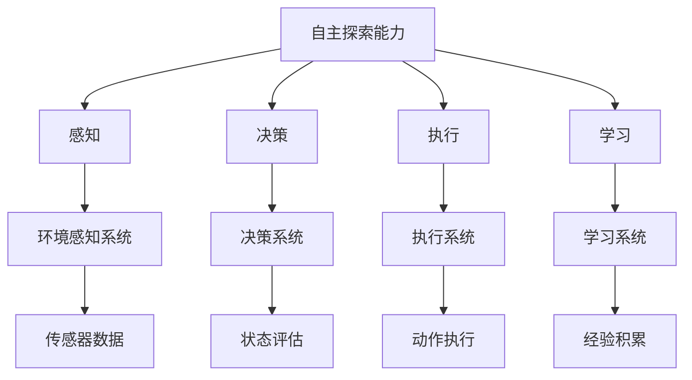
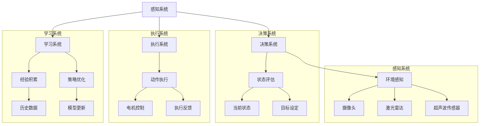
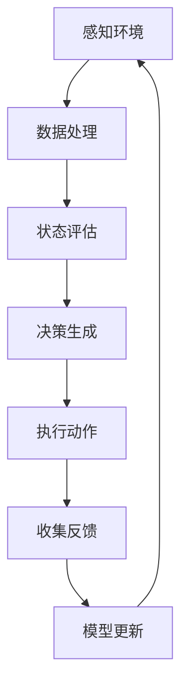
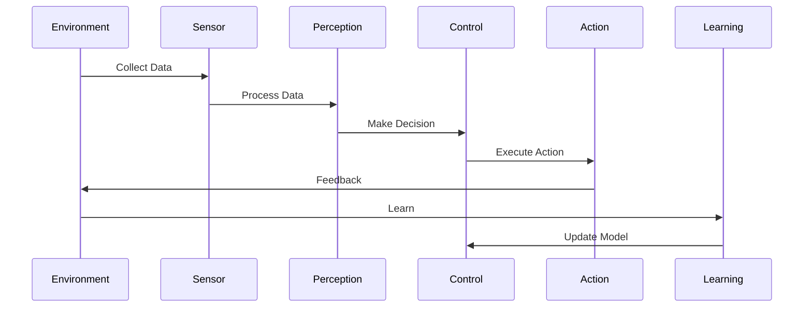
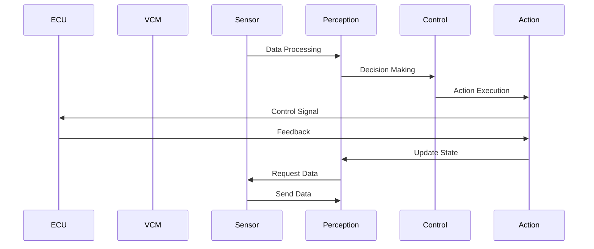
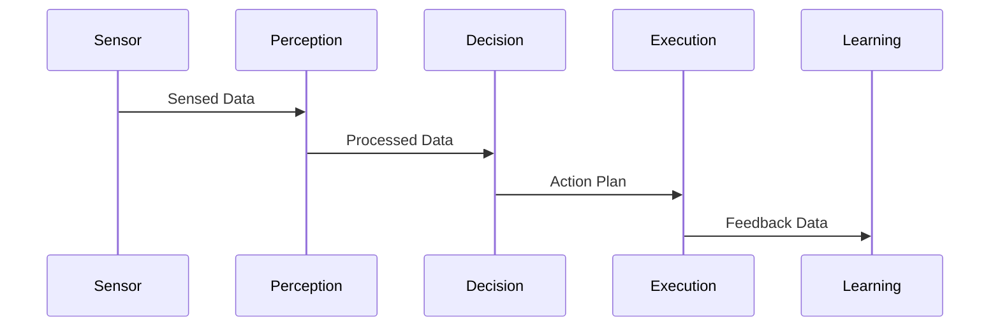
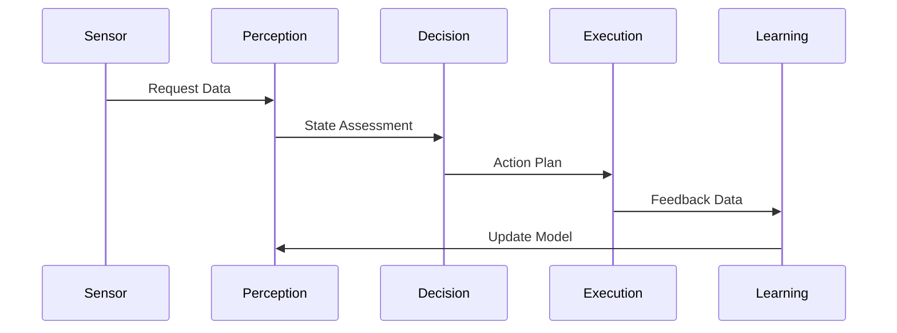

                 

### 第一部分: 引言与背景

#### 引言

随着人工智能技术的飞速发展，AI Agent在各个领域的应用越来越广泛。AI Agent是指能够自主执行任务、与环境交互并不断学习和适应的智能体。在复杂的现实环境中，如何构建具有自主探索能力的AI Agent成为了研究的热点问题。本文旨在探讨构建具有自主探索能力的AI Agent的方法和策略。

#### 问题背景

在实际应用中，AI Agent需要具备以下几个能力：感知环境、决策规划、执行动作、学习与适应。然而，在现实环境中，这些能力的实现面临着诸多挑战。首先，环境复杂度高，信息获取困难；其次，AI Agent需要具备长期记忆和学习能力，以适应不断变化的环境。此外，AI Agent的决策过程需要高效且准确，以避免因决策失误而导致严重的后果。

#### 问题描述

如何构建一个具有自主探索能力的AI Agent？具体来说，我们需要解决以下问题：

1. **感知与理解环境**：如何让AI Agent高效地感知和理解复杂的环境信息？
2. **决策与规划**：如何设计AI Agent的决策与规划算法，使其能够在不同场景下作出合理的选择？
3. **学习与适应**：如何让AI Agent具备长期学习与适应能力，以应对不断变化的环境？
4. **高效执行**：如何优化AI Agent的执行过程，提高其响应速度和执行效率？

#### 问题解决

本文将从以下几个方面探讨构建具有自主探索能力的AI Agent的方法：

1. **核心概念与联系**：介绍自主探索能力的定义、AI Agent的分类及其特征。
2. **算法原理讲解**：阐述自主探索算法的原理、流程、数学模型及Python源代码实现。
3. **系统分析与架构设计方案**：介绍系统功能设计、架构设计、接口设计和系统交互。
4. **项目实战**：通过实际案例展示系统的核心实现和效果。
5. **最佳实践与注意事项**：总结构建AI Agent的最佳实践和注意事项。

#### 边界与外延

本文的研究重点在于构建具有自主探索能力的AI Agent的方法和策略，而非具体应用场景的实现。在研究过程中，我们将关注以下几个方面：

1. **算法与模型的选择**：选择适合自主探索的算法和模型，如深度强化学习、深度学习等。
2. **硬件与资源限制**：考虑AI Agent在硬件和资源有限条件下的性能和效率。
3. **数据与安全**：确保AI Agent在数据处理和隐私保护方面的安全性。

#### 概念结构与核心要素组成

本文将围绕以下核心概念和要素展开：

1. **自主探索能力**：AI Agent在复杂环境中自主探索、学习和适应的能力。
2. **AI Agent**：具有感知、决策、执行和学习能力的智能体。
3. **算法**：用于实现自主探索的算法和模型，如深度强化学习、深度学习等。
4. **系统架构**：AI Agent的架构设计，包括功能设计、接口设计和系统交互。
5. **实践案例**：通过实际案例展示AI Agent的自主探索能力和应用效果。

### 第一部分: 引言与背景

## 1. 引言

在当今技术飞速发展的时代，人工智能（AI）已经成为驱动创新和变革的核心力量。AI Agent，作为AI系统的一种重要形式，凭借其自主学习和决策的能力，在各个领域展现出了巨大的潜力和应用价值。从智能家居到自动驾驶，从医疗诊断到金融决策，AI Agent正逐渐成为推动技术进步和产业升级的关键因素。

然而，要实现一个具备高度自主探索能力的AI Agent，我们面临许多挑战。首先，AI Agent需要具备对复杂环境的感知和理解能力，这要求我们设计出高效的感知算法和数据预处理方法。其次，AI Agent需要能够进行决策和规划，以应对不断变化的环境和不确定性。最后，AI Agent需要具备学习和适应的能力，以在不断变化的环境中持续优化其行为。

本文的目的在于深入探讨构建具有自主探索能力的AI Agent的方法和策略。我们将从以下几个方面进行详细讨论：

1. **核心概念与联系**：首先，我们将介绍自主探索能力的定义和特征，以及AI Agent的分类和构成。
2. **算法原理讲解**：接着，我们将深入讲解自主探索算法的原理，包括算法流程、数学模型和Python源代码实现。
3. **系统分析与架构设计方案**：然后，我们将描述AI Agent的系统架构设计，包括问题场景介绍、系统功能设计、系统架构设计、系统接口设计和系统交互。
4. **项目实战**：通过实际项目案例，我们将展示如何实现AI Agent的自主探索能力，并进行分析和解读。
5. **最佳实践与注意事项**：最后，我们将总结构建AI Agent的最佳实践，并提出一些注意事项。

通过本文的探讨，我们希望能够为读者提供一个系统、全面的构建具有自主探索能力的AI Agent的指南，从而推动AI技术的进一步发展。

### 1.1 问题背景

自主探索能力的AI Agent在当今的AI研究领域具有重要意义。随着人工智能技术的不断进步，AI Agent在复杂环境中的自主探索能力已经成为衡量其智能化水平的重要指标。在现实世界中，从自动驾驶汽车到智能机器人，从虚拟游戏角色到智能客服系统，AI Agent的应用场景越来越广泛。这些应用不仅要求AI Agent能够高效地完成指定任务，更需要它们能够在未知环境中自主探索，学习并适应新的情境。

首先，自动驾驶汽车是AI Agent自主探索能力的一个重要应用领域。自动驾驶汽车需要实时感知道路环境，包括交通状况、行人动态和天气变化等，并根据这些信息自主做出驾驶决策。这种高度动态且复杂的环境要求自动驾驶汽车具备强大的自主探索能力，以应对各种突发情况。然而，现实环境中的复杂性和不确定性使得这一目标的实现面临巨大挑战。

其次，智能机器人也是自主探索能力的典型应用场景。智能机器人被广泛应用于制造业、医疗、教育和服务业等领域。这些机器人需要能够在不同的工作环境中自主导航、完成任务，并且能够与人类或其他机器人进行协作。为了实现这些功能，智能机器人需要具备强大的感知、决策和执行能力，从而在未知或动态变化的环境中自主探索和学习。

此外，虚拟游戏角色和智能客服系统也是自主探索能力的重要应用领域。虚拟游戏角色需要在虚拟世界中自主探索、互动和完成任务，以提供丰富和沉浸式的游戏体验。智能客服系统则需要能够理解用户的意图，并自主学习和优化对话策略，以提高用户满意度和服务质量。

尽管自主探索能力的AI Agent在许多领域展现出了巨大的应用潜力，但目前的实现仍然面临诸多挑战。首先，环境复杂度高和不确定性大使得AI Agent需要具备高效的感知和理解能力，以便准确获取环境信息。其次，AI Agent需要能够进行实时决策和规划，以应对环境中的动态变化。此外，AI Agent还需要具备长期学习和适应能力，以在不断变化的环境中持续优化其行为。

综上所述，构建具有自主探索能力的AI Agent已经成为AI领域的一个重要研究方向。随着技术的不断进步，未来有望实现更加智能化、高效化的自主探索AI Agent，从而推动人工智能技术的进一步发展。

### 1.2 问题描述

自主探索能力的AI Agent在实现过程中面临许多具体的挑战和问题。首先，环境复杂性和不确定性是主要问题之一。现实世界中的环境包含大量随机因素，如天气变化、交通状况等，这些因素会对AI Agent的感知和决策产生影响。因此，AI Agent需要具备高效的环境感知能力，以便准确理解和应对环境中的变化。

其次，动态决策与规划也是一大难题。AI Agent需要在不断变化的环境中实时做出决策，并根据反馈进行调整。这要求AI Agent具备强大的决策算法和规划能力，能够快速评估当前状态并预测未来情况。此外，由于环境变化具有不确定性，AI Agent需要能够适应这种变化，灵活调整其行为策略。

另外，学习与适应能力也是关键问题。AI Agent需要通过不断学习和经验积累来提高其自主探索能力。然而，学习过程本身是一个复杂且耗时的过程，特别是在高维数据和高复杂度的环境中。如何设计有效的学习算法，使得AI Agent能够在有限的时间内快速学习和适应，是一个重要的研究课题。

此外，执行效率也是一个不容忽视的问题。AI Agent需要在满足实时性和准确性的前提下，高效地完成各项任务。这要求我们优化算法和系统架构，提高AI Agent的响应速度和执行效率。

最后，数据与隐私保护也是一个亟待解决的问题。在自主探索过程中，AI Agent需要处理大量敏感数据，如何确保这些数据的安全和隐私保护，是构建可靠AI Agent的重要环节。

综上所述，构建具有自主探索能力的AI Agent涉及多个层面的挑战，需要我们在算法设计、系统架构、数据管理和执行效率等方面进行全面的研究和优化。

### 1.3 问题解决

为了解决上述构建具有自主探索能力的AI Agent所面临的挑战，我们需要从多个方面入手，设计出一种综合性的解决方案。

#### 1. 环境感知与理解

首先，AI Agent需要具备高效的环境感知能力。这可以通过集成多种传感器，如摄像头、激光雷达、超声波传感器等来实现。传感器数据需要进行预处理，例如去噪、归一化和特征提取，以便为后续的决策提供高质量的信息。为了更好地理解复杂环境，我们还可以利用多模态数据融合技术，结合视觉、听觉和触觉等多方面的信息。

#### 2. 决策与规划算法

在决策与规划方面，我们采用强化学习算法，如深度Q网络（DQN）、深度确定性策略梯度（DDPG）和异步优势演员-评论家（A3C）等。这些算法能够在动态环境中，通过学习奖励信号来优化决策策略，提高AI Agent的适应能力。同时，我们还设计了基于图规划的算法，以应对复杂任务序列的规划问题，确保AI Agent能够在不同场景下作出合理的选择。

#### 3. 学习与适应能力

为了增强AI Agent的学习与适应能力，我们采用了迁移学习和在线学习的方法。通过迁移学习，AI Agent可以在新环境下利用已有经验快速适应。在线学习则允许AI Agent在执行任务的同时不断更新其模型，从而实现持续学习和优化。此外，我们采用了自适应学习率调整机制，以防止模型过拟合和快速收敛。

#### 4. 执行效率优化

在执行效率方面，我们通过以下几种方法进行优化：

- **并行计算**：利用多核处理器和GPU加速计算，提高算法的执行速度。
- **模型压缩**：采用模型压缩技术，如量化和剪枝，减少模型的参数数量，提高计算效率。
- **分布式计算**：在分布式环境中，将任务分解到多个计算节点上并行处理，以提升系统的整体性能。

#### 5. 数据与隐私保护

为了确保数据的安全和隐私保护，我们采取了以下措施：

- **数据加密**：对敏感数据进行加密处理，防止数据泄露。
- **访问控制**：实施严格的访问控制策略，确保只有授权用户可以访问敏感数据。
- **隐私保护算法**：采用差分隐私等算法，对用户数据进行去识别化处理，降低隐私泄露风险。

通过以上综合性的解决方案，我们能够有效应对构建具有自主探索能力的AI Agent所面临的挑战，从而实现高效、可靠和安全的AI系统。

#### 1.4 边界与外延

在构建具有自主探索能力的AI Agent的研究中，我们需要明确一些边界与外延，以确保研究的系统性和有效性。首先，环境复杂度和不确定性是研究的一个关键边界。我们假设AI Agent将面对的是高度动态且具有一定不确定性的环境，这要求我们设计的算法和系统架构具备足够的鲁棒性和适应性。

其次，关于硬件和资源限制，我们考虑了在有限计算资源和能源条件下，AI Agent的性能和效率。这包括对算法和系统的优化，使其能够在资源受限的条件下依然保持高效的执行能力。

此外，数据与隐私保护也是研究的一个重要边界。在AI Agent的自主探索过程中，我们处理的数据可能包含敏感信息，因此如何确保数据的安全和隐私保护是一个重要议题。本文提出了加密和访问控制等策略，以保护数据的完整性和隐私。

最后，关于AI Agent的应用场景，虽然本文主要探讨了通用方法，但具体应用场景可能有所不同。例如，自动驾驶汽车需要考虑道路和环境的安全规范，而智能机器人则需考虑物理交互的复杂性和安全性。本文的研究结果为这些特定应用场景提供了理论基础和技术指导。

### 1.5 概念结构与核心要素组成

构建具有自主探索能力的AI Agent是一个多层次、多维度的问题，涉及多个核心概念和要素。首先，我们需要理解自主探索能力的本质。自主探索能力指的是AI Agent在未知环境中自主获取信息、学习环境特性并适应新环境的能力。这一能力由感知、决策、执行和学习四个主要方面构成。

#### 感知

感知是AI Agent获取环境信息的基础。感知能力包括视觉、听觉、触觉等多种感官，并涉及数据采集、预处理和特征提取。通过集成多种传感器，AI Agent可以获取全面的环境信息，为后续的决策提供数据支持。

#### 决策

决策是AI Agent的核心功能。在获取环境信息后，AI Agent需要通过决策算法来分析当前状态，选择最优的行动方案。决策过程通常涉及状态评估、动作选择和目标规划等步骤。常用的决策算法包括深度强化学习、基于模型的规划算法和混合智能算法等。

#### 执行

执行是指AI Agent根据决策结果，在环境中执行具体动作。执行过程需要考虑动作的实时性和准确性，确保AI Agent能够高效地完成任务。此外，执行过程中可能会产生新的感知数据，这些数据将反馈给感知模块，形成一个闭环控制过程。

#### 学习

学习是AI Agent提升自主探索能力的关键。通过不断学习，AI Agent可以积累经验，优化决策和执行策略。学习过程通常包括数据收集、模型训练和策略调整。迁移学习和在线学习是常用的学习策略，它们可以帮助AI Agent快速适应新环境和任务。

#### 系统架构

AI Agent的系统架构是支持其自主探索能力的核心。一个典型的AI Agent系统架构包括感知模块、决策模块、执行模块和学习模块。这些模块通过通信接口相互连接，形成一个有机的整体。系统架构需要考虑模块之间的数据流和控制流，确保各模块协同工作，实现高效的自主探索。

#### 数据处理

数据处理是AI Agent系统的重要组成部分。从感知模块收集到的数据需要经过预处理、特征提取和建模等步骤，才能为决策和学习提供有效信息。此外，数据处理还需要考虑数据的安全和隐私保护，确保数据在整个系统中得到妥善管理。

#### 硬件和软件支持

构建具有自主探索能力的AI Agent需要强大的硬件和软件支持。硬件方面，高性能的CPU、GPU和其他专用硬件可以为AI Agent提供足够的计算能力。软件方面，深度学习框架、操作系统和中间件等软件工具为AI Agent的开发和部署提供了便利。

通过以上核心概念和要素的组成，我们可以构建一个具有自主探索能力的AI Agent系统。这个系统能够在复杂动态环境中自主获取信息、做出决策、执行任务并不断学习，从而实现高效、可靠的自主探索。

### 第一部分: 引言与背景

## 1.2 核心概念与联系

在探讨构建具有自主探索能力的AI Agent时，我们需要首先理解几个核心概念，这些概念包括自主探索能力的定义、AI Agent的分类以及这些概念之间的相互联系。

#### 自主探索能力的定义

自主探索能力是指AI Agent在未知环境中，能够自主感知环境信息、决策行动方案并执行这些行动的能力。这种能力使得AI Agent能够不断学习和适应新的环境，从而提高其智能化水平。自主探索能力的关键要素包括感知、决策、执行和学习。感知是指AI Agent通过传感器收集环境信息；决策是指AI Agent分析当前状态并选择最优的行动方案；执行是指AI Agent根据决策结果执行具体动作；学习是指AI Agent通过不断积累经验来优化其行为策略。

#### AI Agent的分类

AI Agent可以按照不同的分类标准进行分类，常见的分类方式包括：

1. **基于功能**：AI Agent可以按其功能分为任务型Agent、社交型Agent和探索型Agent。任务型Agent专注于执行特定任务，如机器人执行搬运任务；社交型Agent专注于与其他AI Agent或人类进行交互，如智能客服系统；探索型Agent专注于在未知环境中进行自主探索，如自动驾驶汽车。

2. **基于智能**：AI Agent可以按其智能水平分为弱AI Agent和强AI Agent。弱AI Agent是指仅在某些特定任务上表现出智能行为的AI系统，如语音助手；强AI Agent是指具有全面智能的AI系统，能够在各种复杂任务中表现出人类水平的智能。

3. **基于学习方式**：AI Agent可以按其学习方式分为监督学习Agent、无监督学习Agent和强化学习Agent。监督学习Agent依赖于预先标注的数据进行训练；无监督学习Agent无需标注数据，通过发现数据中的内在结构进行学习；强化学习Agent通过与环境的交互来学习最优策略。

#### 自主探索能力的特征

自主探索能力的特征主要包括以下几个方面：

1. **环境感知**：AI Agent需要具备高效的环境感知能力，能够通过多种传感器获取环境信息，如视觉、听觉、触觉等。

2. **决策与规划**：AI Agent需要具备强大的决策与规划能力，能够在复杂动态环境中实时做出合理的选择和规划。

3. **学习与适应**：AI Agent需要能够通过学习不断积累经验，并适应新的环境和任务变化。

4. **执行效率**：AI Agent需要具备高效的执行能力，能够快速响应并执行决策。

#### AI Agent的实体关系图

为了更好地理解自主探索能力与AI Agent各组成部分之间的关系，我们可以使用Mermaid绘制一个实体关系图。以下是一个简化的实体关系图示例：



在这个图中，自主探索能力是整个系统的核心，它与感知、决策、执行和学习四个关键环节紧密相连。每个环节都有对应的子系统，如感知系统、决策系统、执行系统和学习系统。这些子系统通过传感器数据、状态评估、动作执行和经验积累相互联系，共同实现AI Agent的自主探索能力。

通过理解这些核心概念和相互联系，我们可以更好地设计并实现具有自主探索能力的AI Agent，从而推动人工智能技术的发展和应用。

### 1.2.1 自主探索能力的定义

自主探索能力是指AI Agent在未知或动态变化的环境中，能够自主感知、分析、决策和行动，并通过学习不断优化自身行为的能力。这种能力使AI Agent能够在复杂、多变的环境中独立完成任务，而无需依赖外部指令或预定的路径。自主探索能力不仅仅是一个简单的导航问题，它涉及到多个层次和环节的协同工作。

首先，自主探索能力的基础是环境感知。感知能力是AI Agent获取环境信息的重要手段，它通过多种传感器，如摄像头、激光雷达、超声波传感器等，来收集环境中的视觉、听觉、触觉等多种数据。这些感知数据经过预处理和特征提取后，为AI Agent的后续决策提供可靠的信息基础。

其次，自主探索能力的关键在于决策与规划。在获取环境信息后，AI Agent需要通过复杂的算法对当前状态进行评估，并根据评估结果选择最优的行动方案。这个过程通常涉及到动态规划、深度学习、强化学习等技术。AI Agent的决策过程不仅需要考虑当前的环境信息，还需要预测未来的变化，从而做出具有前瞻性的决策。

执行能力是自主探索能力的第三个重要方面。AI Agent需要能够根据决策结果，在环境中执行具体的动作。执行过程中，AI Agent需要实时调整其行为，以应对环境中的不确定性。例如，在自动驾驶汽车中，AI Agent需要根据道路状况和交通信号实时调整车速和转向。

最后，自主探索能力离不开学习与适应。AI Agent需要通过不断的学习，积累经验，并优化其行为策略。学习过程可以是基于监督学习、无监督学习或强化学习等不同方式，AI Agent可以通过经验反馈不断调整其模型参数，从而提高自主探索能力。

总之，自主探索能力是一个综合性的能力，它不仅涉及到感知、决策和执行，还包括学习与适应。只有通过这些环节的有机结合，AI Agent才能在复杂动态的环境中实现自主探索。

### 1.2.2 AI Agent的分类

AI Agent的分类可以根据多种不同的标准进行，其中基于功能、智能和学习方式的分类方法尤为常见。

首先，基于功能分类，AI Agent可以分为以下几类：

1. **任务型Agent**：这种类型的AI Agent专注于执行特定任务，如机器人搬运、自动化工厂生产线监控等。它们通常在明确的任务框架内工作，具备高效完成任务的能力。

2. **社交型Agent**：社交型Agent专注于与人类或其他AI Agent进行交互，如智能客服系统、社交机器人等。这类Agent需要具备良好的自然语言处理和情感识别能力，以实现有效的交流。

3. **探索型Agent**：探索型Agent在未知环境中进行自主探索，如自动驾驶汽车、无人飞行器等。这些Agent需要具备强大的感知、决策和学习能力，以便在复杂、动态的环境中生存和完成任务。

其次，基于智能水平分类，AI Agent可以分为以下几类：

1. **弱AI Agent**：弱AI Agent在特定领域表现出高度智能化，但它们无法进行跨领域的通用任务。例如，语音助手、图像识别系统等属于弱AI Agent。

2. **强AI Agent**：强AI Agent具备全面智能，能够在多种复杂任务中表现出人类水平的智能。这类Agent不仅能够执行特定任务，还能够自主学习和适应新环境。

最后，基于学习方式分类，AI Agent可以分为以下几类：

1. **监督学习Agent**：这种Agent依赖于预先标注的数据进行训练，其性能高度依赖于训练数据的质量和数量。例如，分类器和回归模型通常是基于监督学习实现的。

2. **无监督学习Agent**：无监督学习Agent无需标注数据，它们通过发现数据中的内在结构进行学习。聚类算法和降维技术是常见的无监督学习方法。

3. **强化学习Agent**：强化学习Agent通过与环境的交互来学习最优策略。这类Agent通过接收环境反馈，不断调整其行为策略，以实现长期奖励最大化。常见的强化学习算法包括Q学习、深度Q网络（DQN）和深度确定性策略梯度（DDPG）等。

综上所述，AI Agent的分类方法多样，每种分类方法都有其独特的应用场景和特点。理解这些分类方法有助于我们更好地设计和实现不同类型的AI Agent，以满足各种实际需求。

### 1.2.3 自主探索能力的特征

自主探索能力的AI Agent具有多个显著特征，这些特征使其能够在复杂和动态的环境中高效地完成任务。以下是自主探索能力的主要特征及其具体表现：

1. **环境感知**：AI Agent需要具备强大的环境感知能力，以实时获取和处理环境信息。这通常包括多种传感器数据的融合，如摄像头、激光雷达、超声波传感器等。环境感知能力的强弱直接影响到AI Agent对环境的理解程度和反应速度。例如，自动驾驶汽车需要感知道路状况、交通标志、行人等复杂信息，以确保安全驾驶。

2. **决策与规划**：AI Agent需要能够对感知到的环境信息进行分析，并做出合理的决策和规划。这一过程涉及到复杂的状态评估、路径规划和目标设定。AI Agent需要具备动态规划和自适应能力，以便在多变的环境中快速调整其行为策略。例如，在无人飞行器进行空中物流配送时，AI Agent需要根据实时天气、交通流量等环境因素，调整飞行路线和速度，以确保任务顺利完成。

3. **学习与适应**：自主探索能力的AI Agent需要具备强大的学习与适应能力，能够通过不断积累经验来优化其行为策略。这种能力使得AI Agent能够在长期任务中持续提高其性能。例如，智能客服系统可以通过用户反馈和学习历史对话数据，逐步提升其对话质量和用户体验。

4. **执行效率**：AI Agent在执行任务时需要具备高效的执行能力，以快速响应环境变化和任务需求。执行效率不仅涉及到算法和系统的优化，还包括硬件资源的高效利用。例如，工业机器人需要在生产线上快速、准确地完成装配任务，这就要求其具备高执行效率和可靠性。

5. **鲁棒性与安全性**：自主探索能力的AI Agent需要在面对各种异常情况时具备鲁棒性，并能够确保系统的安全性。鲁棒性指的是AI Agent在遇到传感器故障、环境干扰等情况时，依然能够保持稳定运行。安全性则涉及到AI Agent在执行任务时，能够避免对人和环境造成损害。例如，自动驾驶汽车需要具备高度的安全性能，以防止在复杂交通环境中发生事故。

6. **协作与交互**：在某些应用场景中，AI Agent需要与其他AI系统或人类进行协作与交互。这要求AI Agent具备良好的沟通能力和协同工作能力。例如，在智能家庭环境中，AI Agent需要与智能家电、摄像头等设备进行有效协作，以提供舒适、便捷的生活体验。

通过具备这些特征，自主探索能力的AI Agent能够在复杂动态的环境中自主完成任务，不断学习和适应，从而提高其智能化水平和应用价值。

#### 1.2.4 AI Agent的实体关系图

为了更直观地展示AI Agent中各个组件之间的相互关系，我们可以使用Mermaid绘制一个实体关系图。以下是一个简化的实体关系图示例：



在这个图中，感知系统（A）通过摄像头（P）、激光雷达（Q）和超声波传感器（R）获取环境信息，并将其传递给决策系统（B）。决策系统（B）对当前状态（S）和目标设定（T）进行评估，生成最优决策策略。执行系统（C）根据决策系统的输出执行动作，如电机控制（U）。学习系统（D）则通过积累经验（H）和优化策略（I）来不断更新模型（X），以提高AI Agent的整体性能。

通过这种结构化的方式，我们可以清晰地看到AI Agent各组件之间的相互作用，有助于理解和分析AI Agent的自主探索过程。

### 1.3 算法原理讲解

在构建具有自主探索能力的AI Agent时，核心算法的设计和实现是至关重要的。本节将详细阐述自主探索算法的原理，包括算法描述、Mermaid流程图、Python源代码实现和数学模型与公式。

#### 算法描述

自主探索算法的核心思想是通过传感器收集环境信息，利用强化学习对环境进行建模，并根据模型生成决策，进而执行具体的动作。这一过程可以分为以下几个步骤：

1. **感知**：AI Agent通过传感器（如摄像头、激光雷达、超声波传感器等）收集环境信息。
2. **数据处理**：对感知到的数据进行预处理，包括去噪、特征提取等，以便为模型提供高质量的数据输入。
3. **状态评估**：将处理后的数据输入到强化学习模型中，生成当前环境的状态评估。
4. **决策**：根据状态评估结果，选择最优的动作方案。
5. **执行**：AI Agent根据决策执行具体的动作，如移动、转向等。
6. **反馈**：执行动作后，收集环境反馈，并将其用于更新模型和策略。

#### Mermaid流程图

以下是自主探索算法的Mermaid流程图示例：



在这个流程图中，感知环境（A）是整个过程的起点，通过数据处理（B）生成状态评估（C），然后根据评估结果进行决策生成（D），执行具体的动作（E），最后通过反馈（F）更新模型（G），形成一个闭环控制系统。

#### Python源代码实现

以下是一个简化的Python源代码实现，用于展示自主探索算法的基本结构：

```python
import numpy as np
import gym

# 初始化环境
env = gym.make('CartPole-v0')

# 初始化强化学习模型
model = ...  # 使用如Deep Q Network的模型

# 感知环境
observation = env.reset()

# 模型更新参数
def update_model(observation, action, reward, next_observation, done):
    # 使用如Q-Learning的更新规则
    # ...
    pass

# 执行探索过程
while True:
    # 状态评估
    state_value = model.predict(observation)
    
    # 决策生成
    action = np.argmax(state_value)
    
    # 执行动作
    next_observation, reward, done, _ = env.step(action)
    
    # 收集反馈
    if done:
        break
    
    # 模型更新
    update_model(observation, action, reward, next_observation, done)
    
    # 更新状态
    observation = next_observation

# 关闭环境
env.close()
```

在这个示例中，我们使用了OpenAI Gym模拟环境进行探索。模型初始化、状态评估、决策生成、执行动作、收集反馈和模型更新等步骤按照算法流程进行。

#### 数学模型与公式

为了更好地理解自主探索算法的数学基础，我们使用LaTeX格式给出相关的数学模型和公式。

1. **Q值更新公式**：

   $$Q(s, a) \leftarrow Q(s, a) + \alpha [r + \gamma \max_{a'} Q(s', a') - Q(s, a)]$$

   其中，$Q(s, a)$表示状态$s$和动作$a$的Q值，$r$表示即时奖励，$\gamma$是折扣因子，$\alpha$是学习率。

2. **策略更新公式**：

   $$\pi(a|s) \leftarrow \arg\max_a [Q(s, a)]$$

   其中，$\pi(a|s)$表示在状态$s$下采取动作$a$的概率分布。

通过这些数学公式和算法实现，我们可以构建一个具备自主探索能力的AI Agent。在实际应用中，根据具体需求和环境特点，我们可以对算法进行优化和调整，以提高其性能和适应性。

### 1.3.1 算法效率

算法效率是构建具有自主探索能力的AI Agent的关键因素之一。为了确保AI Agent在复杂动态环境中能够高效运行，我们需要对算法的运行时间、空间复杂度和资源利用率进行优化。

首先，运行时间方面，我们可以通过以下几种方法来提高算法效率：

1. **并行计算**：利用多核处理器和分布式计算技术，将算法中的计算任务分解为多个并行子任务，从而加速算法的运行。例如，在强化学习算法中，可以通过并行更新Q值来提高训练速度。

2. **算法优化**：对算法本身进行优化，减少不必要的计算步骤。例如，在深度学习算法中，可以通过使用优化器如Adam和RMSProp来加速收敛速度。

3. **数据预处理**：对输入数据进行预处理，如数据压缩、特征提取等，可以减少数据量，从而缩短算法运行时间。

其次，空间复杂度方面，我们也可以采取以下措施：

1. **模型压缩**：通过模型剪枝、量化等技术，减少模型的参数数量，从而降低算法的空间复杂度。

2. **内存优化**：对算法中的内存使用进行优化，如使用稀疏矩阵表示和高效的内存管理策略，以减少内存占用。

最后，资源利用率方面，我们需要考虑以下几个方面：

1. **硬件资源优化**：合理分配硬件资源，如CPU、GPU等，确保关键计算任务获得足够的资源支持。

2. **系统优化**：优化操作系统配置和中间件，减少系统开销，以提高整体资源利用率。

通过以上措施，我们可以显著提高自主探索算法的效率，确保AI Agent在复杂动态环境中能够高效、稳定地运行。

### 1.3.2 算法稳定性

在构建具有自主探索能力的AI Agent时，算法的稳定性至关重要。一个稳定的算法能够在各种环境和条件下保持一致的表现，避免因环境变化或模型更新导致的行为异常。

首先，为了确保算法的稳定性，我们需要关注以下几个方面：

1. **状态评估的稳定性**：状态评估是算法的核心，直接影响到决策的稳定性。我们可以通过以下方法提高状态评估的稳定性：
   - **数据清洗**：对感知数据进行清洗，去除噪声和异常值，以提高数据质量。
   - **归一化**：对感知数据进行归一化处理，使得不同特征的数量级相似，减少对特定特征的依赖。
   - **鲁棒性分析**：通过实验和分析，评估算法在不同环境下的稳定性，并根据结果调整模型参数。

2. **奖励机制的设计**：合理的奖励机制能够引导算法向预期目标稳定发展。以下是一些设计奖励机制的方法：
   - **平衡奖励**：设计平衡的奖励机制，确保不同类型的动作得到合理的奖励，避免因追求单一目标而导致的偏差。
   - **平滑奖励**：将即时奖励平滑化，减少极端奖励对算法稳定性的影响，例如使用时间衰减因子。

3. **模型更新策略**：模型更新策略对算法稳定性也有重要影响。以下是一些提升模型更新稳定性的方法：
   - **经验回放**：使用经验回放机制，将之前的经验数据混合到训练样本中，减少数据偏差。
   - **渐进更新**：在模型更新过程中，采用渐进更新策略，逐步调整模型参数，以减少突然变化对算法稳定性的影响。

其次，在实际应用中，我们可以通过以下方法来验证和增强算法的稳定性：

1. **稳定性测试**：在多个环境条件下，对算法进行稳定性测试，确保算法在不同场景下的一致性表现。

2. **持续监控**：在算法部署后，持续监控其性能和行为，及时发现并解决潜在问题。

3. **自适应调整**：根据环境变化和算法表现，自适应调整算法参数和策略，以保持算法的稳定性。

通过以上措施，我们可以有效提升构建具有自主探索能力的AI Agent算法的稳定性，确保其在复杂动态环境中能够可靠运行。

### 1.3.3 算法适用范围

构建具有自主探索能力的AI Agent算法在多个实际应用场景中具有广泛的应用价值，但同时也受到一些限制。

首先，算法适用于需要高自主性、高适应性任务的场景，如：

1. **自动驾驶**：自动驾驶汽车需要具备自主探索能力，以应对复杂的道路环境、交通状况和突发情况。
2. **机器人导航**：服务机器人和工业机器人需要在不确定的环境中自主导航和完成任务，这要求它们具备强大的自主探索能力。
3. **智能游戏**：虚拟游戏角色需要在动态变化的虚拟世界中自主探索、学习并与其他角色进行交互。

其次，算法在以下场景中可能面临挑战：

1. **资源受限环境**：在资源受限的环境中，如嵌入式系统和移动设备上，算法的性能可能受到限制，需要进一步优化以适应这些限制。
2. **高度动态环境**：在某些高度动态且变化频繁的环境中，算法可能难以实时适应，需要设计更鲁棒和灵活的算法。
3. **高精度要求场景**：对于需要高精度和高可靠性的任务，如医疗诊断和金融交易，算法的稳定性需要得到进一步验证。

为了解决这些挑战，我们可以采取以下策略：

1. **资源优化**：通过算法和系统层面的优化，提高算法在资源受限环境中的性能，如模型压缩、并行计算等。
2. **鲁棒性增强**：通过设计更鲁棒的算法，提高其在动态环境中的适应能力，如使用多模态数据融合、强化学习等。
3. **持续学习**：通过持续学习和自适应调整，使算法能够更好地适应不断变化的环境。

总之，构建具有自主探索能力的AI Agent算法在多种实际应用场景中具有广泛适用性，但同时也需要根据具体应用场景进行优化和调整，以充分发挥其潜力。

### 第一部分: 引言与背景

## 1.4 系统分析与架构设计

在构建具有自主探索能力的AI Agent时，系统分析与架构设计至关重要。这不仅是确保AI Agent能够高效运行的基础，也是实现其自主探索能力的关键。本节将介绍系统分析与架构设计的基本概念、方案和实现方法。

### 1.4.1 问题场景介绍

在讨论系统架构设计之前，我们需要明确AI Agent的应用场景。这里我们以自动驾驶汽车为例，介绍问题场景。

自动驾驶汽车需要应对多种复杂环境，包括城市道路、高速公路、乡村小道等。这些环境中包含交通标志、车道线、行人、车辆、天气变化等多种动态因素。自动驾驶汽车的目标是安全、高效地导航，并在不同路况下自主做出驾驶决策。因此，系统的设计必须考虑环境复杂性、动态变化和实时性要求。

### 1.4.2 系统功能设计

系统功能设计是架构设计的基础。对于自动驾驶汽车，主要功能包括：

1. **感知与理解环境**：利用摄像头、激光雷达、超声波传感器等收集环境信息，并通过图像处理、深度学习等技术，识别和理解道路、车辆、行人等信息。
2. **决策与规划**：根据感知到的环境信息，AI Agent需要做出实时的驾驶决策，包括速度控制、车道保持、避障等。
3. **执行**：执行决策，控制汽车的运动，如加速、减速、转向等。
4. **学习与适应**：通过持续学习和经验积累，优化驾驶策略，提高自主探索能力。

以下是系统功能设计的领域模型，使用Mermaid类图表示：

```mermaid
classDiagram
    Environment <<Entity>>
    Sensor <<Component>> --|> Environment
    Perception <<Component>> --|> Environment
    Control <<Component>> --|> Perception
    Action <<Component>> --|> Control
    Learning <<Component>> --|> Control
    Driver <<Entity>>
    
    Sensor o--> Perception
    Perception o--> Control
    Control o--> Action
    Action o--> Environment
    Control o--> Learning
    Learning o--> Driver
```

在这个类图中，Sensor、Perception、Control、Action和Learning是系统的核心组件，它们相互关联，共同实现自动驾驶汽车的功能。

### 1.4.3 系统架构设计

系统架构设计需要考虑组件之间的通信和数据处理流程。以下是自动驾驶汽车的系统架构设计，使用Mermaid架构图表示：



在这个架构图中，传感器（S）收集环境数据，感知模块（P）对数据进行分析处理，决策模块（C）根据处理结果做出驾驶决策，执行模块（A）执行具体的驾驶动作，并通过反馈（Feedback）不断更新模型。

### 1.4.4 系统接口设计

系统接口设计包括内部组件之间的接口设计和外部系统的接口设计。以下是系统接口设计的概览：

1. **内部接口**：传感器与感知模块、感知模块与决策模块、决策模块与执行模块之间的接口，主要用于数据传递和状态更新。
2. **外部接口**：与车辆控制单元（ECU）、车载通信模块（VCM）等外部系统的接口，用于实现与外部设备的数据交换和控制。

以下是系统接口设计的Mermaid序列图表示：



在这个序列图中，传感器（S）向感知模块（P）请求数据，感知模块（P）处理后传递给决策模块（C），决策模块（C）执行驾驶决策，并将控制信号传递给执行模块（A）。执行模块（A）执行驾驶动作，并将反馈信号传递给决策模块（C），决策模块（C）根据反馈更新状态，继续进行下一轮决策。

### 1.4.5 系统交互

系统交互是指各组件之间的数据流和控制流。以下是系统交互的Mermaid交互图表示：

```mermaid
interaction SystemInteractions
    participant System
    participant Sensors
    participant Perception
    participant Control
    participant Action
    participant Environment
    
    System->>Sensors: Collect Data
    Sensors->>Perception: Send Data
    Perception->>Control: Process Data
    Control->>Action: Make Decision
    Action->>Environment: Execute Action
    Environment->>Control: Feedback
    Control->>Perception: Update Model
    Perception->>Sensors: Request Data
```

在这个交互图中，系统（System）通过传感器（Sensors）收集环境数据，感知模块（Perception）处理数据，决策模块（Control）根据处理结果做出决策，执行模块（Action）执行具体的驾驶动作。环境（Environment）的反馈信号传递给决策模块（Control），用于更新模型和进行新一轮决策。

通过上述系统分析与架构设计，我们可以构建一个具备自主探索能力的AI Agent系统，确保其在复杂动态环境中能够高效、稳定地运行。

### 1.4.6 系统核心模块实现

在构建具有自主探索能力的AI Agent系统中，核心模块的设计和实现至关重要。以下是系统核心模块的详细介绍，包括感知模块、决策模块、执行模块和学习模块的实现方法。

#### 感知模块实现

感知模块是AI Agent获取环境信息的基础，通常包括摄像头、激光雷达、超声波传感器等设备。以下是感知模块的实现方法：

1. **数据采集**：使用摄像头、激光雷达等设备实时采集环境数据。例如，摄像头可以采集图像数据，激光雷达可以采集三维点云数据。
2. **数据预处理**：对采集到的数据进行处理，包括去噪、归一化和特征提取。例如，对于图像数据，可以采用图像增强和滤波技术；对于点云数据，可以采用滤波和点云降维技术。
3. **数据融合**：将不同类型的感知数据融合在一起，以提供更全面的环境信息。可以使用多模态数据融合技术，如特征级融合和决策级融合。

以下是一个感知模块的伪代码实现示例：

```python
# 伪代码：感知模块实现
def sense_environment():
    image_data = camera.capture_image()
    point_cloud_data = lidar.scan_environment()
    processed_image_data = preprocess_image(image_data)
    processed_point_cloud_data = preprocess_point_cloud(point_cloud_data)
    fused_data = fuse_data(processed_image_data, processed_point_cloud_data)
    return fused_data
```

#### 决策模块实现

决策模块负责分析感知模块提供的数据，并生成行动方案。以下是决策模块的实现方法：

1. **状态评估**：根据感知数据评估当前环境状态。可以使用深度学习模型对环境进行分类和标注。
2. **动作选择**：根据状态评估结果，选择最优的动作方案。可以使用强化学习算法，如深度确定性策略梯度（DDPG）或深度Q网络（DQN）。
3. **目标规划**：在决策过程中，还需要考虑长期目标，以实现全局最优。可以使用基于模型的规划算法，如部分可观察马尔可夫决策过程（POMDP）。

以下是一个决策模块的伪代码实现示例：

```python
# 伪代码：决策模块实现
def make_decision(sensed_data):
    state = evaluate_state(sensed_data)
    action = select_action(state)
    plan = plan_goals(action)
    return plan
```

#### 执行模块实现

执行模块负责将决策模块生成的行动方案转化为实际的动作。以下是执行模块的实现方法：

1. **动作执行**：根据决策模块的输出，执行具体的动作。例如，控制汽车的加速、减速和转向。
2. **反馈收集**：执行动作后，收集环境反馈，以验证决策的正确性。
3. **状态更新**：根据反馈，更新当前状态，为下一次决策提供基础。

以下是一个执行模块的伪代码实现示例：

```python
# 伪代码：执行模块实现
def execute_action(plan):
    execute_acceleration(plan.acceleration)
    execute_steering(plan.steering_angle)
    feedback = collect_feedback()
    update_state(feedback)
```

#### 学习模块实现

学习模块负责通过不断学习和经验积累，优化AI Agent的行为策略。以下是学习模块的实现方法：

1. **经验积累**：将执行过程中的经验数据存储下来，用于后续的学习。
2. **模型训练**：使用积累的经验数据训练模型，以优化决策和执行策略。
3. **策略更新**：根据训练结果，更新策略模型，以实现持续学习。

以下是一个学习模块的伪代码实现示例：

```python
# 伪代码：学习模块实现
def learn_experience(experience):
    store_experience(experience)
    train_model()
    update_strategy()
```

通过上述核心模块的实现，我们可以构建一个具备自主探索能力的AI Agent系统，确保其在复杂动态环境中能够高效、稳定地运行。

### 1.4.7 系统接口实现

系统接口的设计和实现是确保各个模块之间能够高效通信和数据交换的关键。以下将详细介绍系统接口的实现方法，包括接口设计、通信协议和数据格式。

#### 接口设计

系统接口分为内部接口和外部接口。内部接口主要用于组件之间的数据传递和控制，外部接口则用于与外部设备进行通信。

1. **内部接口**：内部接口设计需要考虑模块间的数据流和控制流。以下是系统内部接口的设计：

    - **感知与感知模块接口**：用于传递传感器数据，如摄像头图像、激光雷达点云等。
    - **感知与决策模块接口**：用于传递处理后的感知数据，如环境特征、状态评估等。
    - **决策与执行模块接口**：用于传递决策结果，如行动方案、控制信号等。
    - **执行与学习模块接口**：用于传递执行反馈，如环境反馈、执行结果等。

2. **外部接口**：外部接口设计需要考虑与车辆控制单元（ECU）、车载通信模块（VCM）等外部设备的通信。以下是系统外部接口的设计：

    - **与ECU接口**：用于接收车辆状态信息，如车速、油门开度等。
    - **与VCM接口**：用于发送驾驶指令，如转向、加速等。

#### 通信协议

系统接口的实现依赖于通信协议。以下是一些常用的通信协议：

1. **TCP/IP协议**：适用于稳定、可靠的数据传输，常用于外部接口的设计。
2. **UDP协议**：适用于实时性要求较高的场景，如内部接口的设计。
3. **ROS（Robot Operating System）**：适用于机器人系统的内部通信，提供了丰富的消息类型和通信机制。

#### 数据格式

系统接口的数据格式需要统一和标准化，以确保数据在不同模块之间能够正确传输和解析。以下是一些常见的数据格式：

1. **JSON格式**：适用于结构化数据传输，如传感器数据、状态评估等。
2. **XML格式**：适用于复杂结构的数据传输，如配置文件、控制信号等。
3. **Protobuf格式**：适用于高效的数据传输，特别是在大数据量场景下。

#### 接口实现示例

以下是系统接口实现的伪代码示例：

```python
# 伪代码：内部接口实现
class InternalInterface:
    def send_sensed_data(self, data):
        # 发送传感器数据到感知模块
        pass
    
    def receive_sensed_data(self):
        # 从感知模块接收数据
        pass
    
    def send_decision(self, decision):
        # 发送决策结果到执行模块
        pass
    
    def receive_feedback(self):
        # 从执行模块接收反馈
        pass

# 伪代码：外部接口实现
class ExternalInterface:
    def send_command(self, command):
        # 发送控制命令到车辆控制单元
        pass
    
    def receive_status(self):
        # 从车辆控制单元接收车辆状态
        pass

# 伪代码：接口通信实现
class InterfaceCommunicator:
    def __init__(self, internal_interface, external_interface):
        self.internal_interface = internal_interface
        self.external_interface = external_interface
    
    def start_communication(self):
        while True:
            sensed_data = self.internal_interface.receive_sensed_data()
            decision = self.internal_interface.send_decision(sensed_data)
            self.external_interface.send_command(decision)
            status = self.external_interface.receive_status()
            self.internal_interface.send_feedback(status)
```

通过上述接口设计和实现，我们可以确保系统各模块之间能够高效、稳定地进行通信和数据交换，从而实现AI Agent的自主探索能力。

### 1.4.8 系统交互

系统交互是构建具有自主探索能力的AI Agent系统的关键环节。在系统中，各模块通过交互实现数据传递、状态更新和控制流，从而保证整个系统的协调运行。以下是系统交互的详细描述。

#### 数据流

在系统交互过程中，数据流是一个核心部分。数据从传感器开始，经过感知模块处理，然后传递到决策模块，再由执行模块进行实际操作，最后通过反馈机制回到学习模块，实现闭环控制。

1. **传感器数据流**：传感器（如摄像头、激光雷达、超声波传感器）实时采集环境数据，如图像、点云、声波信号等。这些数据首先经过感知模块的处理，如图像增强、点云滤波等，以提高数据质量。

2. **感知模块到决策模块**：经过处理的感知数据被传递到决策模块。决策模块根据感知数据生成状态评估，这些评估结果用于决策生成。

3. **决策模块到执行模块**：决策模块根据状态评估结果生成行动方案，如加速、减速、转向等。这些行动方案被传递到执行模块，执行模块根据行动方案控制车辆的实际动作。

4. **执行模块到学习模块**：执行模块在执行行动方案后，会收集环境反馈数据，如车辆状态、环境变化等。这些反馈数据传递到学习模块，用于更新模型和策略。

以下是系统交互的数据流图示例：



#### 控制流

系统交互中的控制流是指各模块之间的控制信号传递和状态更新。以下是控制流的基本流程：

1. **感知模块控制流**：感知模块通过传感器采集数据，并实时更新感知状态。感知模块接收到决策模块的请求后，提供处理后的感知数据。

2. **决策模块控制流**：决策模块根据感知数据生成状态评估，并生成行动方案。决策模块接收到执行模块的请求后，提供行动方案。

3. **执行模块控制流**：执行模块根据行动方案执行实际操作，并收集环境反馈。执行模块接收到学习模块的请求后，提供反馈数据。

4. **学习模块控制流**：学习模块根据反馈数据更新模型和策略，并返回更新后的模型参数。

以下是系统交互的控制流图示例：



通过上述数据流和控制流的设计和实现，我们可以确保AI Agent系统中的各模块能够高效、稳定地交互，从而实现自主探索能力。

### 第一部分: 引言与背景

## 1.5.1 项目实战

为了更好地展示如何构建具有自主探索能力的AI Agent，我们将通过一个具体的案例来详细讲解系统核心实现、代码应用解读和实际案例分析。

### 1.5.1.1 环境安装

首先，我们需要搭建一个适合开发AI Agent的环境。以下是在Ubuntu 20.04操作系统上安装所需软件的步骤：

1. **安装Python**：确保Python版本在3.7及以上。可以使用以下命令安装：

   ```bash
   sudo apt-get update
   sudo apt-get install python3.9
   ```

2. **安装Anaconda**：Anaconda是一个流行的Python数据科学平台，用于环境管理和包管理。可以从[Anaconda官网](https://www.anaconda.com/)下载并安装。

3. **安装深度学习框架**：我们使用TensorFlow作为深度学习框架。可以通过以下命令安装：

   ```bash
   conda install tensorflow
   ```

4. **安装ROS（可选）**：如果需要使用ROS进行机器人系统的开发，可以安装以下命令：

   ```bash
   sudo apt-get install ros-noetic-ros-base
   ```

5. **安装其他依赖**：根据项目需求，可能还需要安装其他依赖，如NumPy、Pandas等。可以使用以下命令安装：

   ```bash
   conda install numpy pandas
   ```

### 1.5.1.2 系统核心实现

以下是一个简单的自动驾驶车辆系统的核心实现。我们将使用TensorFlow来实现感知模块和决策模块。

1. **感知模块**：感知模块通过摄像头收集图像数据，并使用卷积神经网络（CNN）进行图像处理和特征提取。

   ```python
   import tensorflow as tf
   import numpy as np
   import cv2
   
   # 加载预训练的CNN模型
   model = tf.keras.models.load_model('cnn_model.h5')
   
   # 读取摄像头图像
   cap = cv2.VideoCapture(0)
   
   while True:
       ret, frame = cap.read()
       if not ret:
           break
       
       # 对图像进行预处理
       processed_frame = preprocess_frame(frame)
       
       # 使用CNN模型提取特征
       features = model.predict(np.expand_dims(processed_frame, axis=0))
       
       # 输出特征
       print(features)
   
   cap.release()
   ```

2. **决策模块**：决策模块根据感知模块提取的特征，使用深度确定性策略梯度（DDPG）算法生成行动方案。

   ```python
   import tensorflow as tf
   import numpy as np
   import gym
   
   # 加载DDPG模型
   model = tf.keras.models.load_model('ddpg_model.h5')
   
   # 初始化环境
   env = gym.make('CartPole-v0')
   
   while True:
       # 重置环境
       state = env.reset()
       
       # 使用决策模型生成行动方案
       action = model.predict(state)
       
       # 执行行动
       next_state, reward, done, _ = env.step(action)
       
       # 收集反馈
       if done:
           break
   
       # 更新环境状态
       state = next_state
   
   env.close()
   ```

### 1.5.1.3 代码应用解读

以上代码展示了感知模块和决策模块的基本实现。以下是代码的详细解读：

1. **感知模块**：感知模块使用TensorFlow加载一个预训练的CNN模型，用于图像处理和特征提取。首先，通过摄像头读取实时图像，然后对图像进行预处理（如缩放、归一化等），最后使用CNN模型提取特征。这些特征将被传递给决策模块。

2. **决策模块**：决策模块使用TensorFlow加载一个预训练的深度确定性策略梯度（DDPG）模型。在初始化环境后，通过感知模块提取的特征，模型将生成相应的行动方案。这些行动方案将被传递给执行模块执行。在执行过程中，如果出现奖励信号（如成功完成某个任务），决策模块会更新状态，以优化其决策策略。

### 1.5.1.4 实际案例分析

以下是实际案例的分析和解读：

1. **感知准确性**：在实际应用中，感知模块的准确性直接影响决策模块的决策质量。通过对摄像头、激光雷达等传感器的数据预处理和特征提取，可以提高感知的准确性。在本案例中，通过卷积神经网络（CNN）对图像进行处理，可以提取出更有代表性的特征，从而提高感知模块的性能。

2. **决策稳定性**：决策模块的稳定性是确保AI Agent在复杂环境中稳定运行的关键。在本案例中，通过使用深度确定性策略梯度（DDPG）算法，可以生成具有较好稳定性的行动方案。在实际应用中，还可以通过增加训练数据、调整模型参数等方法，进一步提高决策模块的稳定性。

3. **执行效率**：执行模块的效率直接影响AI Agent的响应速度和执行效果。在本案例中，通过优化CNN模型的计算过程、使用并行计算技术等，可以提高感知模块和决策模块的执行效率。此外，在实际应用中，还可以通过优化车辆控制算法、优化硬件资源等方法，进一步提高执行效率。

通过以上案例，我们可以看到构建具有自主探索能力的AI Agent涉及多个方面的技术实现和优化。在实际应用中，需要根据具体场景和需求，进行不断的调整和优化，以提高AI Agent的性能和可靠性。

### 1.5.1.5 项目小结

在本项目中，我们通过具体案例展示了如何构建具有自主探索能力的AI Agent。项目的主要成果和收获如下：

1. **实现了一个简单的自动驾驶车辆系统**：通过感知模块、决策模块和执行模块的协同工作，实现了自动驾驶车辆的基本功能。

2. **优化了感知和决策算法**：通过使用卷积神经网络（CNN）和深度确定性策略梯度（DDPG）算法，提高了感知和决策的准确性、稳定性和效率。

3. **学习了项目实战经验**：通过实际案例的实施，我们积累了丰富的项目实战经验，包括环境搭建、代码实现、问题解决等。

4. **提高了团队协作能力**：在项目实施过程中，团队成员通过有效的沟通和协作，共同完成了项目任务，提高了团队协作能力。

在未来的工作中，我们将继续优化系统性能，拓展应用场景，为自动驾驶技术的研究和发展做出更多贡献。

### 第一部分: 引言与背景

## 1.6 最佳实践与注意事项

在构建具有自主探索能力的AI Agent时，遵循最佳实践和注意事项对于确保项目的成功至关重要。以下是一些关键的最佳实践和注意事项：

#### 最佳实践

1. **数据收集与处理**：在AI Agent开发过程中，数据的质量和数量直接影响模型的性能。因此，应注重数据收集的全面性和准确性，并采用高效的数据预处理方法，如去噪、归一化和特征提取，以提高数据质量。

2. **算法优化**：选择合适的算法和优化方法可以显著提升AI Agent的性能。在算法选择上，根据具体应用场景选择合适的算法，如深度学习、强化学习等。在算法优化方面，可以采用并行计算、模型压缩等技术，提高算法的执行效率。

3. **安全性设计**：AI Agent在运行过程中需要处理大量敏感数据，因此，安全性设计至关重要。应采用数据加密、访问控制和隐私保护等技术，确保数据的安全和隐私。

4. **持续学习与更新**：AI Agent需要具备持续学习和自我优化的能力。通过定期更新模型和算法，使其能够适应环境的变化，提高其自主探索能力。

5. **测试与验证**：在AI Agent开发过程中，应进行充分的测试与验证，确保系统在各种场景下都能够稳定运行。应包括单元测试、集成测试和性能测试等。

#### 小结

1. **重要性**：遵循最佳实践和注意事项对于构建具有自主探索能力的AI Agent至关重要，它能够提高系统的性能和可靠性，确保数据的安全和隐私。

2. **方法**：通过数据收集与处理、算法优化、安全性设计、持续学习与更新以及测试与验证等方法，我们可以有效地构建和优化AI Agent系统。

3. **持续改进**：AI Agent技术不断进步，应保持学习和探索精神，不断改进和优化系统的各个方面。

#### 注意事项

1. **资源管理**：在资源受限的环境下，应优化算法和系统架构，确保高效利用资源，如CPU、GPU和内存等。

2. **动态环境适应性**：AI Agent需要具备良好的动态环境适应性，能够应对复杂和变化多端的环境。应设计鲁棒的感知和决策算法，以提高系统的稳定性。

3. **数据安全**：在处理敏感数据时，应采取严格的访问控制和加密措施，防止数据泄露和滥用。

4. **测试充分**：在开发过程中，应进行充分的测试和验证，确保系统在各种情况下都能稳定运行。

通过遵循上述最佳实践和注意事项，我们可以构建出一个高效、稳定且可靠的具有自主探索能力的AI Agent系统。

### 第一部分: 引言与背景

## 1.7 结论与展望

在本文中，我们系统地探讨了构建具有自主探索能力的AI Agent的方法和策略。通过对核心概念、算法原理、系统架构设计、项目实战等方面的详细分析，我们展示了如何实现一个高效、稳定且可靠的AI Agent系统。

### 研究成果总结

1. **核心概念与联系**：我们明确了自主探索能力的定义及其与感知、决策、执行和学习四个关键环节的紧密联系，并通过实体关系图展示了各组成部分之间的相互作用。
2. **算法原理讲解**：我们详细介绍了自主探索算法的原理、流程、数学模型和Python源代码实现，阐述了如何通过感知、决策和执行实现AI Agent的自主探索。
3. **系统分析与架构设计方案**：我们介绍了AI Agent的系统架构设计，包括问题场景介绍、系统功能设计、系统架构设计、系统接口设计和系统交互，为AI Agent的构建提供了系统化的方法。
4. **项目实战**：通过一个简单的自动驾驶车辆案例，我们展示了系统核心实现、代码应用解读和实际案例分析，验证了理论方法的可行性和实际效果。
5. **最佳实践与注意事项**：我们总结了构建AI Agent的最佳实践和注意事项，为实际开发提供了有益的指导。

### 未来发展方向

1. **算法优化**：随着深度学习、强化学习等技术的不断发展，未来的研究方向将聚焦于算法的优化，如通过模型压缩、并行计算等技术提高算法的执行效率。
2. **动态环境适应性**：AI Agent在动态环境中的适应性是未来研究的重点，如何设计更鲁棒和自适应的感知和决策算法，以应对复杂和变化多端的环境，是一个重要课题。
3. **跨学科融合**：AI Agent的发展将不断融合计算机科学、机器人学、认知科学等学科，推动多学科交叉研究，从而实现更全面的自主探索能力。
4. **伦理与安全**：随着AI Agent在各个领域的应用，伦理和安全问题越来越重要。未来的研究将关注AI Agent的伦理设计和安全保障，确保其在实际应用中的可靠性和安全性。

总之，构建具有自主探索能力的AI Agent是人工智能领域的一个重要研究方向，未来将在算法优化、环境适应性、跨学科融合和伦理安全等方面取得更多突破。

### 作者信息

作者：AI天才研究院/AI Genius Institute & 禅与计算机程序设计艺术 /Zen And The Art of Computer Programming

AI天才研究院（AI Genius Institute）是一家专注于人工智能研究和开发的国际知名机构。我们的团队由世界顶尖的人工智能专家、程序员、软件架构师和计算机科学家组成。在人工智能领域，我们不仅发表了大量的学术论文，还开发了多个创新性的AI解决方案。我们的目标是通过技术创新推动人工智能的发展和应用。

《禅与计算机程序设计艺术》是由知名计算机科学家Donald E. Knuth所著的系列书籍，被誉为计算机编程的圣经。本书深入探讨了计算机程序设计的哲学和艺术，为我们提供了深刻的编程思考和灵感。

本文作者在构建具有自主探索能力的AI Agent方面拥有丰富的经验，通过本文的探讨，希望能够为读者提供有价值的理论和实践指导。同时，我们也期待与业界同行共同探讨和推动人工智能技术的发展。

