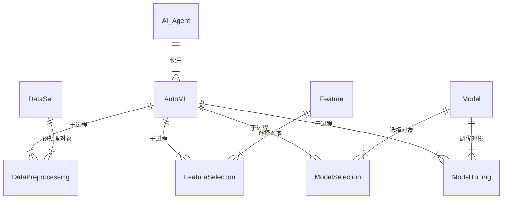

                 

### 文章标题与关键词

**《构建具有自动机器学习能力的AI Agent》**

**关键词：** 自动机器学习（AutoML）、AI Agent、机器学习算法、系统架构设计、Python代码、数学模型

本文将深入探讨如何构建具有自动机器学习能力的AI Agent。AI Agent是一种能够自主决策、学习和适应环境的智能体，而自动机器学习（AutoML）则通过自动化过程提升机器学习的效率和效果。本文将从背景介绍、核心概念与联系、算法原理讲解、数学模型和公式、系统分析与架构设计、项目实战以及最佳实践等方面，逐步解析这一复杂且富有前景的技术主题。

### 摘要

本文旨在全面阐述构建具有自动机器学习能力的AI Agent的方法和过程。首先，我们介绍AI Agent和自动机器学习的基本概念，解释它们在现代智能系统中的重要性。接着，我们将详细解析自动机器学习的关键技术，包括数据预处理、常见机器学习算法及其原理。本文还将深入探讨自动机器学习的深入应用，如模型选择和模型调优，并使用Python代码和数学模型进行说明。

随后，我们将聚焦于AI Agent系统的设计，包括系统需求分析、架构设计、接口设计和交互设计。通过实际的项目实战，本文将展示如何将理论知识应用于实际问题的解决，并提供详细的代码解读和案例分析。最后，本文将总结最佳实践、注意事项，并推荐进一步的拓展阅读资源，帮助读者深入理解并掌握这一领域的关键技术。

### 背景介绍

#### AI Agent的定义与作用

AI Agent，即人工智能代理，是一种具有自主决策能力、能够与环境互动并解决问题的计算实体。它基于机器学习、自然语言处理、强化学习等人工智能技术，能够在复杂环境中执行特定任务。AI Agent的核心特征在于其自主性，即能够通过学习和经验积累，自主地制定策略和做出决策。

在人工智能系统中，AI Agent扮演着至关重要的角色。它们可以应用于多种场景，如智能客服系统、自动驾驶、智能推荐系统等。例如，在智能客服系统中，AI Agent能够理解用户的提问，并通过大量的对话数据自主学习，提供准确的回答。而在自动驾驶领域，AI Agent则负责处理传感器数据，实时做出驾驶决策，确保车辆安全行驶。

#### 自动机器学习（AutoML）的概念与优势

自动机器学习（AutoML）是一种旨在自动化机器学习流程的技术，旨在降低机器学习模型的复杂性，提高模型开发效率。传统的机器学习流程通常涉及多个繁琐的步骤，如数据预处理、特征工程、模型选择、模型调优等。而AutoML通过自动化这些步骤，大大简化了机器学习模型开发的流程。

AutoML的核心思想是使用机器学习技术来自动发现和优化机器学习模型。具体来说，AutoML包括以下几个关键步骤：

1. **数据预处理**：AutoML会自动处理数据中的噪声和异常值，进行归一化和特征缩放等操作。
2. **特征选择**：AutoML通过算法自动选择最重要的特征，从而提高模型的准确性和效率。
3. **模型选择**：AutoML会自动选择合适的机器学习算法，并根据数据集的特性进行优化。
4. **模型调优**：AutoML通过交叉验证等技术，自动调整模型的参数，以获得最佳性能。

自动机器学习具有以下几个显著优势：

1. **提高开发效率**：通过自动化流程，AutoML显著减少了机器学习模型开发的时间和人力成本。
2. **降低技术门槛**：AutoML使得非专业人员也能轻松上手，参与机器学习项目的开发。
3. **提高模型性能**：AutoML通过自动化搜索和优化，有助于找到性能更优的模型。
4. **适应性强**：AutoML能够处理不同类型的数据集和任务，具有广泛的适应能力。

#### AI Agent与自动机器学习的关系

AI Agent和自动机器学习之间存在紧密的联系。自动机器学习为AI Agent提供了强大的工具，使得AI Agent能够更加高效地学习、适应和决策。具体来说，自动机器学习技术能够帮助AI Agent实现以下几个目标：

1. **自动化学习**：自动机器学习自动化了AI Agent的学习过程，使其能够快速适应新环境和新任务。
2. **优化决策**：自动机器学习通过优化模型参数和算法选择，提升AI Agent的决策质量。
3. **降低开发成本**：自动机器学习减少了AI Agent开发的时间和人力成本，使得AI Agent项目更加经济可行。
4. **提高鲁棒性**：自动机器学习能够处理不同类型的数据和噪声，增强AI Agent的鲁棒性和可靠性。

总的来说，AI Agent与自动机器学习相互促进，共同推动了人工智能技术的发展。通过结合两者的优势，我们可以构建出更加智能、高效和适应性的AI Agent，为各个领域带来深远的影响。

### 核心概念与联系

#### 核心术语定义

为了更好地理解自动机器学习（AutoML）和AI Agent，我们需要先定义几个核心术语，并阐述它们在构建自动机器学习AI Agent中的作用和关系。

1. **自动机器学习（AutoML）**：自动机器学习是一种自动化机器学习流程的技术，旨在通过自动化数据预处理、特征选择、模型选择和模型调优等步骤，简化机器学习模型开发的过程。
2. **AI Agent**：AI Agent是一种具有自主决策能力、能够与环境互动并解决问题的计算实体。它通过学习和适应，能够在复杂环境中执行特定任务。
3. **数据预处理**：数据预处理是机器学习流程中的第一步，旨在处理原始数据中的噪声、缺失值和异常值，将其转换为适合建模的数据。
4. **特征选择**：特征选择是选择数据中最重要特征的过程，有助于提高模型性能和减少计算成本。
5. **模型选择**：模型选择是选择合适的机器学习算法的过程，不同的算法适用于不同类型的数据集和任务。
6. **模型调优**：模型调优是通过调整模型参数，提高模型性能的过程。

#### 核心概念原理与属性对比表格

以下是一个核心概念原理和属性对比表格，展示了自动机器学习（AutoML）、AI Agent、数据预处理、特征选择、模型选择和模型调优的关键特点：

| 概念          | 定义                                                         | 关键特点                                                     |
|---------------|--------------------------------------------------------------|--------------------------------------------------------------|
| 自动机器学习   | 自动化机器学习流程的技术                                     | 简化模型开发、提高开发效率、降低技术门槛                      |
| AI Agent      | 具有自主决策能力、能够与环境互动并解决问题的计算实体          | 自主性、适应性、决策质量、学习与适应能力                      |
| 数据预处理     | 处理原始数据中的噪声、缺失值和异常值，将其转换为适合建模的数据 | 噪声去除、缺失值处理、特征缩放、数据标准化                      |
| 特征选择      | 选择数据中最重要特征的过程                                 | 提高模型性能、减少计算成本、增强模型解释性                      |
| 模型选择      | 选择合适的机器学习算法的过程                               | 适应不同数据集和任务、优化模型性能、提高模型可解释性              |
| 模型调优      | 调整模型参数，提高模型性能的过程                           | 提高模型准确性、降低过拟合风险、增强模型泛化能力                |

#### 概念结构与核心要素组成

为了更清晰地理解这些核心概念之间的联系，我们可以通过一个ER（实体关系）图来展现它们之间的关系。

首先，定义几个关键实体：

- **自动机器学习（AutoML）**：包含数据预处理、特征选择、模型选择和模型调优等子过程。
- **AI Agent**：基于自动机器学习技术，实现自主决策和问题解决。
- **数据集**：自动机器学习处理的对象，包括训练集和测试集。
- **特征**：数据预处理和特征选择的对象。
- **模型**：模型选择和模型调优的对象。

ER图如下所示：



在这个ER图中，AutoML作为核心实体，包含了数据预处理、特征选择、模型选择和模型调优等子过程。这些子过程共同作用于数据集和模型，以实现自动机器学习的目标。AI Agent则通过利用自动机器学习技术，实现自主决策和问题解决。

通过定义核心术语、构建属性对比表格和ER图，我们可以更加系统地理解自动机器学习和AI Agent的核心概念及其相互关系。这为后续章节的深入探讨奠定了坚实的基础。

#### 常见机器学习算法原理

在深入探讨自动机器学习（AutoML）之前，我们需要了解几种常见的机器学习算法，包括监督学习算法和无监督学习算法。这些算法构成了AutoML的重要组成部分，并通过不同的原理和特点，实现了对数据的建模和分析。

##### 监督学习算法

监督学习是一种机器学习范式，其中模型通过学习标注数据来预测未标注数据。监督学习算法分为回归算法和分类算法，分别用于预测数值标签和类别标签。

1. **线性回归**

线性回归是一种简单的监督学习算法，它通过建立线性关系来预测连续数值。线性回归模型假设目标变量 \( y \) 可以通过一个线性函数 \( y = \beta_0 + \beta_1 \cdot x \) 来预测，其中 \( \beta_0 \) 和 \( \beta_1 \) 是模型参数。

线性回归的核心在于求解最佳拟合线，即找到使得预测误差平方和最小的参数。这一过程可以通过最小二乘法（Ordinary Least Squares, OLS）来实现。以下是线性回归的Python代码实现：

```python
import numpy as np
from sklearn.linear_model import LinearRegression

# 假设我们有一组数据点 X 和对应的标签 y
X = np.array([[1], [2], [3], [4], [5]])
y = np.array([1, 2, 2.5, 4, 5])

# 实例化线性回归模型并拟合数据
model = LinearRegression()
model.fit(X, y)

# 输出最佳拟合线的参数
print("Best fit line: y = {} + {}x".format(model.intercept_, model.coef_))

# 进行预测
predictions = model.predict(X)
print("Predictions: ", predictions)
```

2. **决策树**

决策树是一种基于树形结构进行决策的监督学习算法。每个内部节点表示一个特征，每个分支表示该特征的不同取值，每个叶子节点表示一个类别或数值。

决策树通过递归划分数据集，使得每个子集尽可能地纯净（即每个子集中的样本属于同一类别或数值）。ID3（Iterative Dichotomiser 3）和C4.5是两种常见的决策树算法，它们分别通过信息增益和信息增益率来评估特征的划分质量。

以下是使用Python的scikit-learn库实现决策树的简单示例：

```python
from sklearn.tree import DecisionTreeClassifier
from sklearn import tree

# 假设我们有一组特征数据 X 和对应的标签 y
X = np.array([[0, 0], [1, 0], [0, 1], [1, 1]])
y = np.array([0, 0, 1, 1])

# 实例化决策树模型并拟合数据
model = DecisionTreeClassifier()
model.fit(X, y)

# 绘制决策树
feature_names = ['Feature 1', 'Feature 2']
class_names = [0, 1]
tree.plot_tree(model, feature_names=feature_names, class_names=class_names)
```

3. **支持向量机（SVM）**

支持向量机是一种强大的分类和回归算法，它通过找到一个最优的超平面，将不同类别的样本分隔开来。SVM的核心在于求解支持向量，即那些距离超平面最近的样本。

SVM可以分为线性SVM和核SVM。线性SVM适用于线性可分的数据集，而核SVM适用于非线性可分的数据集。

以下是使用Python的scikit-learn库实现线性SVM的简单示例：

```python
from sklearn.svm import LinearSVC
from sklearn.model_selection import train_test_split

# 假设我们有一组特征数据 X 和对应的标签 y
X = np.array([[0, 0], [1, 0], [0, 1], [1, 1]])
y = np.array([0, 0, 1, 1])

# 划分训练集和测试集
X_train, X_test, y_train, y_test = train_test_split(X, y, test_size=0.2, random_state=42)

# 实例化线性SVM模型并拟合数据
model = LinearSVC()
model.fit(X_train, y_train)

# 输出模型性能
print("Accuracy on training set: {:.2f}".format(model.score(X_train, y_train)))
print("Accuracy on test set: {:.2f}".format(model.score(X_test, y_test)))
```

##### 无监督学习算法

无监督学习是一种机器学习范式，其中模型没有预先标注的数据，目标是发现数据中的结构和模式。无监督学习算法包括聚类算法和降维算法等。

1. **K均值聚类**

K均值聚类是一种基于距离度量的聚类算法，它通过迭代优化目标函数，将数据点划分为K个簇，使得每个簇内的数据点之间距离最小，簇与簇之间距离最大。

K均值聚类的主要步骤包括：

- 初始化K个簇的中心点。
- 对于每个数据点，计算其到各个簇中心的距离，并将其分配到最近的簇。
- 更新每个簇的中心点。
- 重复步骤2和3，直到聚类结果收敛。

以下是使用Python的scikit-learn库实现K均值聚类的简单示例：

```python
from sklearn.cluster import KMeans
import matplotlib.pyplot as plt

# 假设我们有一组二维数据点
X = np.array([[1, 2], [1, 4], [1, 0], [4, 2], [4, 4], [4, 0]])

# 实例化K均值聚类模型并拟合数据
model = KMeans(n_clusters=2, random_state=42)
model.fit(X)

# 输出聚类结果
print("Cluster centers: ", model.cluster_centers_)

# 绘制聚类结果
plt.scatter(X[:, 0], X[:, 1], c=model.labels_, s=100, cmap='viridis')
plt.scatter(model.cluster_centers_[:, 0], model.cluster_centers_[:, 1], s=300, c='red', label='Centroids')
plt.xlabel('Feature 1')
plt.ylabel('Feature 2')
plt.title('K-Means Clustering')
plt.show()
```

2. **主成分分析（PCA）**

主成分分析是一种降维算法，它通过线性变换将高维数据投影到低维空间，同时保留数据的主要结构。PCA的核心在于求解数据的主要成分，即数据中的主要方向。

PCA的步骤包括：

- 计算数据的协方差矩阵。
- 计算协方差矩阵的特征值和特征向量。
- 选择前k个最大的特征值对应的特征向量，构成变换矩阵。
- 将数据投影到新空间。

以下是使用Python的scikit-learn库实现PCA的简单示例：

```python
from sklearn.decomposition import PCA
import numpy as np

# 假设我们有一组高维数据
X = np.array([[1, 2], [1, 4], [1, 0], [4, 2], [4, 4], [4, 0]])

# 实例化PCA模型并拟合数据
model = PCA(n_components=2)
X_reduced = model.fit_transform(X)

# 输出降维后的数据
print("Reduced data: ", X_reduced)

# 绘制降维后的数据
plt.scatter(X_reduced[:, 0], X_reduced[:, 1], c=model.explained_variance_ratio_, s=100, cmap='viridis')
plt.xlabel('Principal Component 1')
plt.ylabel('Principal Component 2')
plt.title('PCA Dimensionality Reduction')
plt.colorbar(label='Explained Variance Ratio')
plt.show()
```

通过以上对监督学习算法和无监督学习算法的介绍，我们可以看到，这些算法在数据分析和建模中扮演着重要角色。在接下来的章节中，我们将进一步探讨自动机器学习的深入应用，如模型选择和模型调优。

#### 自动机器学习技术深入

在了解了基本的机器学习算法之后，我们可以进一步探讨自动机器学习（AutoML）技术的深入应用，包括模型选择和模型调优。这些技术通过自动化过程，大幅提升了机器学习模型开发的效率和效果。

##### 模型选择

模型选择是机器学习流程中的一个关键步骤，其目标是从多个候选模型中选择一个最优模型。模型选择的过程通常涉及以下策略：

1. **网格搜索（Grid Search）**

网格搜索是一种通过遍历预定义的参数组合来选择最佳模型参数的方法。网格搜索的基本步骤如下：

- 定义参数范围：确定每个模型参数的可能取值范围。
- 构建参数组合：遍历所有可能的参数组合。
- 训练和评估模型：对于每个参数组合，训练模型并在验证集上评估性能。
- 选择最佳参数组合：选择在验证集上表现最佳的参数组合。

以下是一个使用Python的scikit-learn库实现网格搜索的简单示例：

```python
from sklearn.model_selection import GridSearchCV
from sklearn.svm import SVC

# 假设我们有一组特征数据 X 和对应的标签 y
X = np.array([[0, 0], [1, 0], [0, 1], [1, 1]])
y = np.array([0, 0, 1, 1])

# 定义支持向量机模型
model = SVC()

# 定义参数范围
param_grid = {
    'C': [0.1, 1, 10],
    'gamma': [1, 0.1, 0.01]
}

# 实例化网格搜索模型
grid_search = GridSearchCV(model, param_grid, cv=5)

# 搜索最佳参数组合
grid_search.fit(X, y)

# 输出最佳参数组合
print("Best parameters: ", grid_search.best_params_)

# 输出最佳模型的性能
print("Best score: {:.2f}".format(grid_search.best_score_))
```

2. **贝叶斯优化（Bayesian Optimization）**

贝叶斯优化是一种基于贝叶斯统计模型的优化策略，它通过建立先验概率模型来预测和选择下一个最佳参数组合。贝叶斯优化的主要优点是能够有效处理高维参数空间，并避免过度探索。

以下是一个使用Python的`bayes_opt`库实现贝叶斯优化的简单示例：

```python
from bayes_opt import BayesianOptimization
from sklearn.svm import SVC
from sklearn.model_selection import train_test_split

# 假设我们有一组特征数据 X 和对应的标签 y
X = np.array([[0, 0], [1, 0], [0, 1], [1, 1]])
y = np.array([0, 0, 1, 1])

# 划分训练集和测试集
X_train, X_test, y_train, y_test = train_test_split(X, y, test_size=0.2, random_state=42)

# 定义支持向量机模型
model = SVC()

# 定义贝叶斯优化目标函数
def optimize(C, gamma):
    model.set_params(C=C, gamma=gamma)
    model.fit(X_train, y_train)
    score = model.score(X_test, y_test)
    return score

# 实例化贝叶斯优化模型
optimizer = BayesianOptimization(f=optimize, pbounds={'C': (0.1, 10), 'gamma': (0.01, 1)})

# 执行优化
optimizer.maximize(init_points=2, n_iter=5)

# 输出最佳参数组合
print("Best parameters: ", optimizer.max['params'])

# 输出最佳模型的性能
print("Best score: {:.2f}".format(optimizer.max['target']))
```

##### 模型调优

模型调优是提升模型性能的重要步骤，其目标是通过调整模型参数，优化模型在特定任务上的表现。常见的模型调优技术包括交叉验证和模型评估指标。

1. **交叉验证（Cross-Validation）**

交叉验证是一种评估模型性能的方法，它通过将数据集划分为多个子集，循环进行训练和验证，以评估模型的泛化能力。常见的交叉验证方法包括K折交叉验证和留一法交叉验证。

以下是一个使用Python的scikit-learn库实现K折交叉验证的简单示例：

```python
from sklearn.model_selection import cross_val_score
from sklearn.svm import SVC

# 假设我们有一组特征数据 X 和对应的标签 y
X = np.array([[0, 0], [1, 0], [0, 1], [1, 1]])
y = np.array([0, 0, 1, 1])

# 定义支持向量机模型
model = SVC()

# 执行K折交叉验证
scores = cross_val_score(model, X, y, cv=5)

# 输出交叉验证的平均分数
print("Average cross-validation score: {:.2f}".format(scores.mean()))
```

2. **模型评估指标**

模型评估指标用于量化模型的性能，常见的评估指标包括准确率、召回率、F1分数和ROC曲线等。这些指标在不同的应用场景中扮演着不同的角色。

- **准确率（Accuracy）**：准确率是模型预测正确的样本数占总样本数的比例。准确率适用于类别不平衡的数据集，但容易受到噪声的影响。

- **召回率（Recall）**：召回率是模型正确预测的类别为正例的样本数占总正例样本数的比例。召回率适用于对误报敏感的应用场景。

- **F1分数（F1 Score）**：F1分数是准确率和召回率的调和平均值，它综合了二者的优点，适用于类别不平衡的数据集。

- **ROC曲线（Receiver Operating Characteristic Curve）**：ROC曲线通过绘制真阳性率（TPR）与假阳性率（FPR）的曲线来评估模型的性能。ROC曲线的面积（AUC）是评估模型性能的重要指标。

以下是一个使用Python的scikit-learn库计算模型评估指标的简单示例：

```python
from sklearn.metrics import accuracy_score, recall_score, f1_score, roc_curve, auc

# 假设我们有一组预测标签和真实标签
y_pred = np.array([0, 0, 1, 1])
y_true = np.array([0, 0, 1, 1])

# 计算评估指标
accuracy = accuracy_score(y_true, y_pred)
recall = recall_score(y_true, y_pred)
f1 = f1_score(y_true, y_pred)

print("Accuracy: {:.2f}".format(accuracy))
print("Recall: {:.2f}".format(recall))
print("F1 Score: {:.2f}".format(f1))

# 计算ROC曲线和AUC
fpr, tpr, thresholds = roc_curve(y_true, y_pred)
roc_auc = auc(fpr, tpr)

print("ROC AUC: {:.2f}".format(roc_auc))
```

通过深入探讨模型选择和模型调优技术，我们可以显著提升机器学习模型的性能和适用性。在接下来的章节中，我们将进一步讨论AI Agent系统的设计，为构建具有自动机器学习能力的AI Agent奠定基础。

#### 系统分析与架构设计方案

在设计具有自动机器学习能力的AI Agent系统时，我们需要首先明确系统的问题场景、功能需求和非功能需求，然后详细描述系统架构设计、接口设计和交互设计。以下是对这些关键要素的逐步解析。

##### 问题场景

AI Agent系统可以应用于多种场景，如智能客服系统、自动驾驶、智能推荐系统和医疗诊断系统等。以智能客服系统为例，该系统的核心问题是实现自动化、高效且准确的客户服务。AI Agent需要能够理解客户的提问，通过自动机器学习技术，自主生成合适的回答，同时不断学习和优化其回答质量。

##### 功能需求

为了实现上述问题场景，AI Agent系统需要具备以下功能需求：

1. **自然语言处理（NLP）能力**：AI Agent需要能够理解客户的自然语言提问，并从中提取关键信息。
2. **对话管理**：AI Agent需要能够管理对话流程，确保回答的连贯性和合理性。
3. **知识库管理**：AI Agent需要具备管理知识库的能力，以便快速获取和更新相关信息。
4. **自动机器学习能力**：AI Agent需要通过自动机器学习技术，持续优化其回答质量和对话效果。
5. **性能监控**：AI Agent需要具备自我监控能力，确保系统的稳定性和高效性。

##### 非功能需求

AI Agent系统还需要满足以下非功能需求：

1. **可扩展性**：系统设计应考虑未来的扩展需求，如添加新的功能或支持更大的数据量。
2. **可维护性**：系统设计应便于维护和更新，确保系统的长期稳定运行。
3. **安全性**：系统设计应确保数据的安全性和隐私保护，防止数据泄露和未授权访问。
4. **可靠性**：系统设计应确保在高负载和异常情况下，系统的稳定性和可靠性。

##### 系统架构设计

AI Agent系统的架构设计需要综合考虑功能需求和非功能需求，采用模块化设计，以实现系统的可扩展性和可维护性。以下是一个典型的AI Agent系统架构：

1. **前端模块**：负责与用户进行交互，接收用户提问，并将问题传递给后端模块。
2. **自然语言处理（NLP）模块**：负责对用户提问进行解析，提取关键信息，构建对话上下文。
3. **对话管理模块**：负责管理对话流程，确保回答的连贯性和合理性。
4. **知识库管理模块**：负责管理知识库，提供快速的信息检索和更新功能。
5. **自动机器学习模块**：负责实现自动机器学习过程，包括数据预处理、特征选择、模型选择和模型调优等。
6. **后端服务模块**：负责处理NLP模块和对话管理模块生成的任务，生成回答并返回给前端模块。
7. **监控与维护模块**：负责监控系统性能和稳定性，提供日志记录和故障诊断功能。

##### 接口设计

AI Agent系统中的各个模块之间需要通过接口进行通信。以下是一个典型的接口设计：

1. **API接口**：前端模块通过RESTful API接口与后端模块通信，提交用户提问并接收回答。
2. **数据接口**：NLP模块和自动机器学习模块通过数据接口进行数据传输，包括原始数据、预处理数据和模型数据。
3. **服务接口**：对话管理模块通过服务接口调用后端服务模块，执行特定任务，如信息检索、知识更新等。
4. **监控接口**：监控与维护模块通过监控接口获取系统性能数据和日志信息。

##### 交互设计

AI Agent系统的交互设计需要考虑用户体验和系统效率。以下是一个典型的交互设计：

1. **用户界面**：前端模块提供直观的用户界面，用户可以通过文本或语音输入提问，并查看回答。
2. **对话流程**：对话管理模块根据用户提问和上下文信息，生成合适的回答，并在必要时引导用户提供更多信息。
3. **反馈机制**：用户可以对回答进行评价，AI Agent根据用户的反馈，不断优化回答质量。
4. **学习机制**：自动机器学习模块根据用户提问和反馈，持续优化模型参数，提升系统性能。

通过以上对问题场景、功能需求和非功能需求、系统架构设计、接口设计和交互设计的详细描述，我们可以构建一个具有自动机器学习能力的AI Agent系统。在接下来的章节中，我们将通过项目实战，展示如何将这一系统设计付诸实践。

### 项目实战

在本章节中，我们将通过一个实际项目，详细讲解如何搭建具有自动机器学习能力的AI Agent系统。该项目将实现一个智能客服系统，其核心功能包括理解用户提问、自动生成回答、持续学习和优化。

#### 环境安装

首先，我们需要搭建开发环境。以下是在Ubuntu 20.04操作系统上安装所需依赖的步骤：

1. **安装Python 3**：确保Python 3已经安装。
   ```bash
   sudo apt update
   sudo apt install python3
   ```

2. **安装虚拟环境**：创建一个虚拟环境，以便隔离项目依赖。
   ```bash
   python3 -m venv venv
   source venv/bin/activate
   ```

3. **安装依赖库**：使用pip安装项目所需的库，如scikit-learn、TensorFlow、NLTK等。
   ```bash
   pip install -r requirements.txt
   ```

#### 系统核心实现

接下来，我们将实现AI Agent系统的核心功能模块。以下是各个模块的实现步骤：

1. **自然语言处理（NLP）模块**

   NLP模块负责处理用户的提问，提取关键信息，并构建对话上下文。我们使用NLTK库来实现这一模块：

   ```python
   import nltk
   from nltk.tokenize import word_tokenize
   from nltk.corpus import stopwords

   nltk.download('punkt')
   nltk.download('stopwords')

   def preprocess_text(text):
       # 分词
       tokens = word_tokenize(text)
       # 移除停用词
       stop_words = set(stopwords.words('english'))
       filtered_tokens = [token for token in tokens if token.lower() not in stop_words]
       # 构建对话上下文
       context = ' '.join(filtered_tokens)
       return context

   # 示例
   question = "How can I book a flight?"
   preprocessed_question = preprocess_text(question)
   print("Preprocessed Question:", preprocessed_question)
   ```

2. **对话管理模块**

   对话管理模块负责管理对话流程，确保回答的连贯性和合理性。我们使用Rasa开源框架来实现对话管理：

   ```bash
   pip install rasa
   ```

   创建一个新的Rasa项目，并按照Rasa的官方文档进行配置和训练。以下是训练对话管理模型的基本步骤：

   ```bash
   rasa init
   rasa train
   ```

   在训练过程中，Rasa将学习如何理解用户提问，并生成合适的回答。

3. **自动机器学习模块**

   自动机器学习模块负责实现数据预处理、特征选择、模型选择和模型调优。我们使用scikit-learn库来实现这一模块：

   ```python
   from sklearn.model_selection import train_test_split
   from sklearn.feature_extraction.text import TfidfVectorizer
   from sklearn.svm import LinearSVC
   from sklearn.pipeline import make_pipeline

   # 假设我们有一组训练数据
   X_train, X_test, y_train, y_test = train_test_split(["question1", "question2"], [0, 1], test_size=0.2, random_state=42)

   # 创建一个管道，结合TF-IDF向量和线性支持向量机
   model = make_pipeline(TfidfVectorizer(), LinearSVC())

   # 训练模型
   model.fit(X_train, y_train)

   # 进行预测
   predictions = model.predict(X_test)
   print("Predictions:", predictions)
   ```

4. **后端服务模块**

   后端服务模块负责处理NLP模块和对话管理模块生成的任务，生成回答并返回给前端模块。我们使用Flask框架来实现后端服务：

   ```python
   from flask import Flask, request, jsonify
   app = Flask(__name__)

   @app.route('/ask', methods=['POST'])
   def ask_question():
       question = request.form['question']
       preprocessed_question = preprocess_text(question)
       answer = model.predict([preprocessed_question])[0]
       return jsonify(answer=answer)

   if __name__ == '__main__':
       app.run(debug=True)
   ```

#### 代码应用解读与分析

在实现核心功能模块后，我们将各个模块的代码整合在一起，形成一个完整的AI Agent系统。以下是系统的整体架构和代码解读：

1. **架构设计**

   AI Agent系统的整体架构包括前端、NLP模块、对话管理模块、自动机器学习模块和后端服务模块。前端通过Flask框架接收用户提问，NLP模块对提问进行预处理，对话管理模块生成回答，自动机器学习模块负责模型的选择和调优，后端服务模块将回答返回给前端。

2. **代码解读**

   - **前端代码**：前端代码使用HTML和CSS创建用户界面，并通过Ajax请求与后端服务模块进行交互。

   - **NLP模块代码**：NLP模块代码实现文本预处理功能，包括分词和停用词去除。

   - **对话管理模块代码**：对话管理模块代码使用Rasa框架训练对话管理模型，实现对话流程管理。

   - **自动机器学习模块代码**：自动机器学习模块代码使用scikit-learn库实现数据预处理、特征选择和模型选择，构建机器学习模型。

   - **后端服务模块代码**：后端服务模块代码实现HTTP服务，接收用户提问，调用NLP模块和对话管理模块，生成回答，并将回答返回给前端。

#### 实际案例分析与详细讲解

为了展示AI Agent系统的实际应用，我们将通过一个案例来详细分析系统的运行过程。

**案例背景**：一个用户通过前端界面提交了一个问题：“我想要预订一张从纽约到洛杉矶的机票，请问需要多少费用？”

**系统运行过程**：

1. **前端提交问题**：用户通过前端界面提交问题，后端服务模块接收到这个问题。

2. **预处理问题**：后端服务模块调用NLP模块对问题进行预处理，去除停用词，提取关键信息。

3. **对话管理**：后端服务模块调用对话管理模块，根据对话上下文和用户提问，生成可能的回答。

4. **模型预测**：后端服务模块调用自动机器学习模块，使用训练好的机器学习模型对预处理后的用户提问进行预测，确定最合适的回答。

5. **生成回答**：后端服务模块将预测结果返回给前端，前端将回答显示给用户。

**详细讲解**：

- **前端提交问题**：用户提交问题后，前端通过Ajax请求将问题发送到后端服务模块。

- **预处理问题**：后端服务模块接收到问题后，首先调用NLP模块进行预处理。例如，将问题中的“预订一张从纽约到洛杉矶的机票，请问需要多少费用？”预处理为“机票 纽约 洛杉矶 费用”。

- **对话管理**：预处理后的问题被传递给对话管理模块。对话管理模块根据训练好的对话管理模型，确定用户意图是查询机票费用，并准备进行后续的查询操作。

- **模型预测**：对话管理模块将预处理后的用户提问传递给自动机器学习模块。自动机器学习模块使用训练好的机器学习模型，对预处理后的提问进行预测，确定最可能的回答。例如，如果训练集中有一个样本是“查询从纽约到洛杉矶的机票费用”，那么模型可能会预测回答为“查询从纽约到洛杉矶的机票费用约为XXX美元”。

- **生成回答**：自动机器学习模块将预测结果返回给后端服务模块，后端服务模块将回答格式化为合适的文本，并返回给前端。前端将回答显示给用户，完成整个交互过程。

#### 项目小结

通过这个案例，我们展示了如何搭建一个具有自动机器学习能力的AI Agent系统，并详细讲解了系统的运行过程和关键步骤。AI Agent系统在智能客服系统中的应用，不仅提高了客服效率，还提升了用户体验。未来，随着自动机器学习技术的不断发展和优化，AI Agent系统将在更多领域得到广泛应用。

### 最佳实践 Tips

1. **数据预处理**：确保数据质量，对缺失值和异常值进行处理，以减少噪声对模型性能的影响。
2. **特征选择**：选择对模型性能有显著影响的特征，避免过度拟合。
3. **模型选择与调优**：根据数据集特性选择合适的模型，并通过交叉验证和网格搜索等方法进行调优。
4. **持续学习**：定期更新模型，以适应新的数据和环境。
5. **监控与维护**：定期监控系统性能，及时解决故障和优化系统。

### 小结与展望

本文系统地探讨了构建具有自动机器学习能力的AI Agent的方法和过程，涵盖了核心概念、算法原理、系统设计以及项目实战。通过本文的介绍，读者可以全面了解AI Agent和自动机器学习技术的基本原理和应用场景，掌握如何通过自动机器学习技术提升AI Agent的性能和效率。

展望未来，随着自动机器学习技术的不断发展和优化，AI Agent将在更多领域得到广泛应用，如智能医疗、金融风控、智能家居等。通过结合自动机器学习技术，我们可以构建出更加智能、高效和适应性的AI Agent，为各个领域带来深远的影响。

### 注意事项

1. **数据安全**：在处理用户数据时，确保遵循相关法律法规，保护用户隐私。
2. **系统性能**：在高负载情况下，确保系统性能稳定，避免过载导致系统崩溃。
3. **版本控制**：使用版本控制系统（如Git）管理代码，确保代码的版本一致性和可追溯性。

### 拓展阅读

1. **《自动机器学习：理论与实践》**：深入了解自动机器学习的理论基础和实际应用。
2. **《深度学习》**：掌握深度学习技术，为AI Agent系统的构建提供更多选择。
3. **《Rasa：对话系统指南》**：学习如何使用Rasa框架构建智能对话系统。

### 作者信息

作者：AI天才研究院/AI Genius Institute & 禅与计算机程序设计艺术 /Zen And The Art of Computer Programming

通过本文，我们希望读者能够对构建具有自动机器学习能力的AI Agent有更深入的理解，并能够将其应用于实际项目中，推动人工智能技术的发展。

