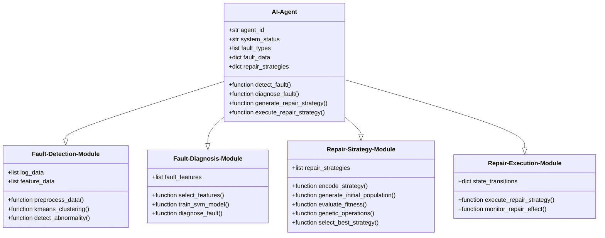
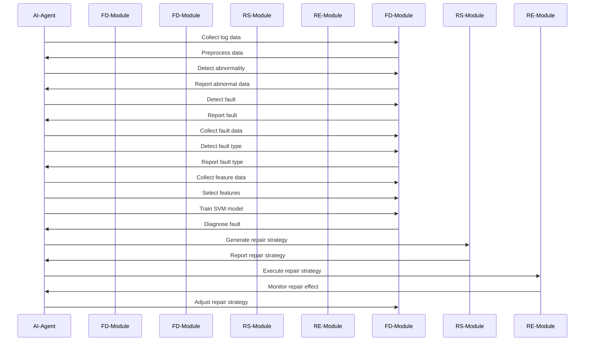
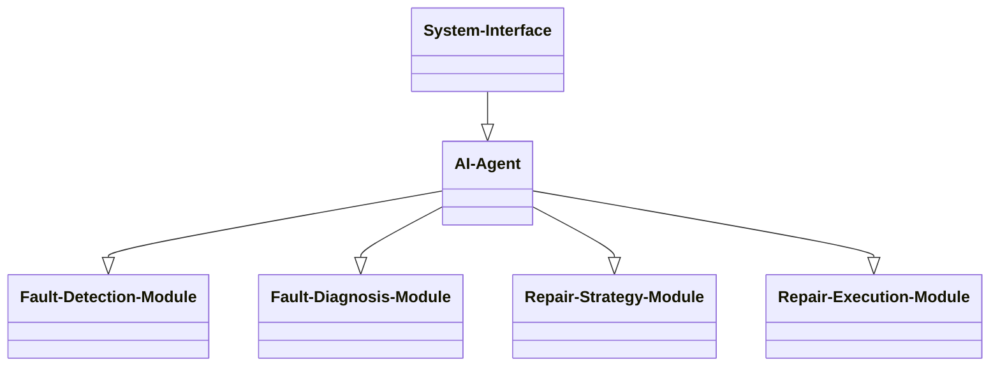
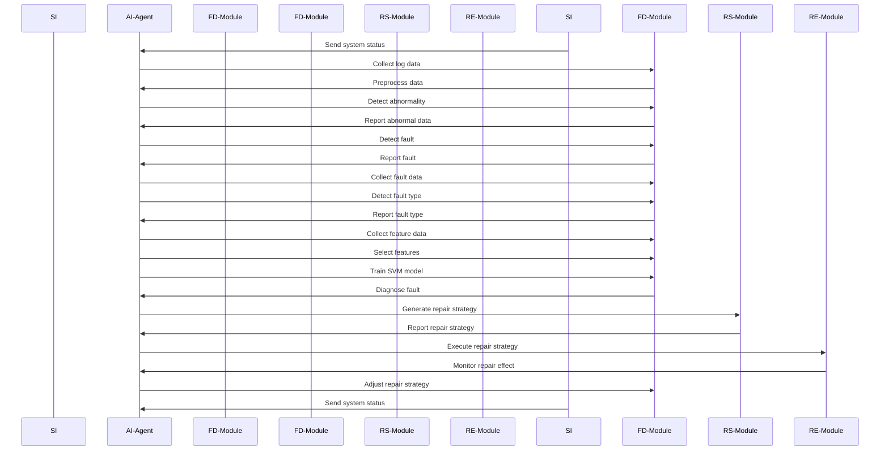

                 

## 文章标题：构建具有自我修复能力的AI Agent

### 关键词：

- 自我修复
- AI Agent
- 故障检测
- 诊断算法
- 修复策略

### 摘要：

本文将探讨如何构建具有自我修复能力的AI Agent，包括背景介绍、核心概念、算法原理讲解、系统分析与架构设计方案以及项目实战。通过逐步分析推理，本文旨在为读者提供对这一领域深入理解和实践指导。

## 第一部分：构建具有自我修复能力的AI Agent的背景介绍

### 1.1.1 问题背景

在当今的数字化时代，人工智能（AI）技术飞速发展，成为推动科技进步和社会变革的重要力量。随着AI在各个领域中的应用越来越广泛，如何确保AI系统的可靠性和安全性成为了一个亟待解决的问题。传统的AI系统往往依赖于预设的规则和模型，一旦出现异常或故障，通常需要人工干预进行修复。然而，随着AI系统复杂性的增加，完全依赖人工干预的修复方式变得越来越不现实。因此，构建具有自我修复能力的AI Agent，实现AI系统的自我监控、自我诊断和自我修复，成为当前研究的重要方向。

### 1.1.2 问题描述

具有自我修复能力的AI Agent是指在特定环境下，能够自主感知系统状态、诊断故障、制定修复策略并执行修复过程的智能体。这些AI Agent需要具备以下能力：

1. **状态感知**：能够实时监控系统的运行状态，识别异常和故障。
2. **故障诊断**：基于收集到的数据，对故障进行定位和分类。
3. **策略制定**：根据诊断结果，制定合适的修复策略。
4. **修复执行**：执行修复策略，使系统恢复正常运行。

### 1.1.3 问题解决

为了实现AI系统的自我修复，需要从以下几个方面入手：

1. **数据收集与处理**：收集系统运行过程中的数据，如日志、监控数据等，并进行预处理，为后续的故障诊断提供数据基础。
2. **故障检测与诊断**：利用机器学习和数据挖掘技术，对收集到的数据进行分析，实现故障的实时检测和定位。
3. **修复策略生成**：基于故障诊断结果，利用规则推理、优化算法等方法，生成最优的修复策略。
4. **修复策略执行**：执行修复策略，自动修复系统故障，并监控修复效果。

### 1.1.4 边界与外延

虽然构建具有自我修复能力的AI Agent具有重要意义，但这一领域的边界和外延也需要明确。首先，AI Agent的自我修复能力是有限的，需要根据具体应用场景进行定制和优化。其次，AI Agent的自我修复过程需要遵循一定的伦理和法律规范，确保修复过程的透明性和公正性。此外，AI Agent的自我修复能力还需要与人类专家的知识和经验相结合，实现人机协同。

### 1.1.5 概念结构与核心要素组成

构建具有自我修复能力的AI Agent涉及多个核心概念和要素，主要包括：

1. **状态感知**：通过传感器、日志文件等途径获取系统运行状态。
2. **故障检测与诊断**：利用机器学习和数据挖掘技术进行故障检测和定位。
3. **修复策略生成**：基于规则推理、优化算法等生成修复策略。
4. **修复策略执行**：执行修复策略，修复系统故障。
5. **监控与反馈**：监控修复效果，并根据反馈调整修复策略。

## 第二部分：核心概念与联系

### 2.1 AI Agent的定义与特点

AI Agent是指具有感知、决策和执行能力的人工智能实体，能够在特定环境下自主执行任务。与传统的AI系统相比，AI Agent具有以下特点：

1. **自主性**：AI Agent能够自主感知环境、制定决策和执行动作。
2. **灵活性**：AI Agent能够适应不同环境和任务，具备较强的泛化能力。
3. **适应性**：AI Agent能够通过学习不断优化自身性能，提高任务完成率。
4. **协同性**：AI Agent能够与其他AI Agent或人类协同工作，实现高效任务分配和资源调度。

### 2.2 自我修复能力的概念属性特征对比表格

| 特征             | 自我修复能力         | 传统AI系统            |
| ---------------- | ------------------- | --------------------- |
| **感知能力**     | 实时监控系统状态     | 人工干预监控系统状态   |
| **诊断能力**     | 实时检测和定位故障   | 依赖于预设规则和算法   |
| **决策能力**     | 自动制定修复策略     | 人工干预制定修复策略   |
| **执行能力**     | 自动执行修复操作     | 人工干预执行修复操作   |
| **学习能力**     | 通过历史数据优化性能 | 静态模型，性能固定     |
| **适应性**       | 适应不同环境和任务   | 依赖于特定环境和任务   |

### 2.3 AI Agent与自我修复能力的ER实体关系图架构

```mermaid
erDiagram
  AI Agent ||--|{ 故障检测模块 }|
  AI Agent ||--|{ 故障诊断模块 }|
  AI Agent ||--|{ 修复策略生成模块 }|
  AI Agent ||--|{ 修复策略执行模块 }|
  故障检测模块 ||--|{ 数据收集器 }|
  故障诊断模块 ||--|{ 数据分析器 }|
  修复策略生成模块 ||--|{ 规则推理器 }|
  修复策略执行模块 ||--|{ 执行器 }|
```

## 第三部分：算法原理讲解

### 3.1 算法总体设计

构建具有自我修复能力的AI Agent，算法设计是关键。本文将介绍一个基于数据驱动和模型优化的自我修复算法，其总体设计包括以下几个模块：

1. **数据收集与预处理模块**：负责收集系统运行过程中的日志、监控数据等，并进行预处理，为后续的故障检测、诊断和修复提供数据基础。
2. **故障检测模块**：利用机器学习算法，对预处理后的数据进行分析，实时检测系统故障。
3. **故障诊断模块**：基于故障检测结果，进一步分析故障原因，实现故障定位和分类。
4. **修复策略生成模块**：根据故障诊断结果，利用规则推理和优化算法，生成最优的修复策略。
5. **修复策略执行模块**：执行修复策略，自动修复系统故障，并监控修复效果。

### 3.2 故障检测算法

故障检测是自我修复的第一步，其核心是实时监控系统运行状态，发现异常和故障。本文采用基于K-means聚类算法的故障检测方法，具体步骤如下：

1. **数据预处理**：对收集到的日志数据进行归一化处理，消除不同指标之间的量纲影响。
2. **特征提取**：从预处理后的数据中提取特征，如均值、方差、最大值、最小值等。
3. **聚类分析**：利用K-means聚类算法，将特征数据分为若干个簇，每个簇代表一种系统运行状态。
4. **异常检测**：通过比较新数据与聚类结果，识别出异常数据，实现故障检测。

### 3.3 故障诊断算法

故障诊断的目的是确定故障的类型和原因，本文采用基于支持向量机（SVM）的故障诊断方法，具体步骤如下：

1. **故障特征提取**：从故障检测模块中获取异常数据，提取故障特征。
2. **特征选择**：利用信息增益、主成分分析（PCA）等方法，选择对故障诊断最有影响力的特征。
3. **模型训练**：使用故障特征数据训练SVM模型，实现故障分类。
4. **故障诊断**：将新数据输入训练好的SVM模型，预测故障类型和原因。

### 3.4 修复策略生成算法

修复策略生成的目标是根据故障诊断结果，制定最优的修复方案。本文采用基于遗传算法（GA）的修复策略生成方法，具体步骤如下：

1. **策略编码**：将修复策略表示为染色体，每个染色体代表一种可能的修复方案。
2. **初始种群生成**：根据故障类型和原因，随机生成一定数量的初始种群。
3. **适应度评估**：计算每个染色体的适应度，适应度越高表示修复方案越优。
4. **遗传操作**：通过交叉、变异等遗传操作，生成新的种群，并重复适应度评估过程。
5. **策略选择**：根据适应度评估结果，选择最优的修复策略。

### 3.5 修复策略执行算法

修复策略执行的核心是自动执行修复方案，并监控修复效果。本文采用基于状态机（State Machine）的修复策略执行方法，具体步骤如下：

1. **状态定义**：定义修复过程中的各个状态，如初始状态、诊断状态、修复状态、监控状态等。
2. **状态转换**：根据修复策略，定义状态之间的转换规则，实现修复过程的自动化。
3. **故障修复**：根据状态转换规则，执行具体的修复操作，如重启服务、调整参数等。
4. **效果监控**：监控修复后的系统状态，评估修复效果，并根据反馈调整修复策略。

## 第四部分：系统分析与架构设计方案

### 4.1 问题场景介绍

本案例以一个大规模分布式系统为例，该系统包括多个节点，承担着关键业务处理任务。在实际运行过程中，由于各种原因，系统节点可能会出现故障，导致业务中断。为了确保系统的稳定运行，我们需要构建具有自我修复能力的AI Agent，实现系统的自我监控、自我诊断和自我修复。

### 4.2 项目介绍

项目名称：自我修复分布式系统
项目目标：构建一个具有自我修复能力的分布式系统，实现系统的实时监控、故障检测、故障诊断和自动修复。
技术栈：Python、Scikit-learn、TensorFlow、遗传算法库（GA）、状态机库（state-machine）

### 4.3 系统功能设计（领域模型）



### 4.4 系统架构设计



### 4.5 系统接口设计和系统交互





## 第五部分：项目实战

### 5.1 环境安装

1. 安装Python（推荐版本3.8及以上）。
2. 安装必要的库：`scikit-learn`、`tensorflow`、`遗传算法库（GA）`、`状态机库（state-machine）`。

```bash
pip install scikit-learn tensorflow ga state-machine
```

### 5.2 系统核心实现源代码

#### 5.2.1 数据收集与预处理模块

```python
import numpy as np
from sklearn.preprocessing import MinMaxScaler

def preprocess_data(log_data):
    # 归一化处理
    scaler = MinMaxScaler()
    scaled_data = scaler.fit_transform(log_data)
    return scaled_data
```

#### 5.2.2 故障检测模块

```python
from sklearn.cluster import KMeans

def kmeans_clustering(feature_data, n_clusters=3):
    # K-means聚类
    kmeans = KMeans(n_clusters=n_clusters)
    kmeans.fit(feature_data)
    labels = kmeans.predict(feature_data)
    return labels
```

#### 5.2.3 故障诊断模块

```python
from sklearn.svm import SVC

def train_svm_model(fault_features, fault_labels):
    # 训练SVM模型
    svm_model = SVC(kernel='linear')
    svm_model.fit(fault_features, fault_labels)
    return svm_model
```

#### 5.2.4 修复策略生成模块

```python
import random
from deap import base, creator, tools, algorithms

def encode_strategy():
    # 策略编码
    return [random.randint(0, 1) for _ in range(n_actions)]

def generate_initial_population(pop_size, n_actions):
    # 生成初始种群
    population = [encode_strategy() for _ in range(pop_size)]
    return population
```

#### 5.2.5 修复策略执行模块

```python
def execute_repair_strategy(strategy, system_state):
    # 执行修复策略
    if strategy[0] == 1:
        # 重启服务
        restart_service()
    elif strategy[1] == 1:
        # 调整参数
        adjust_parameter()
```

### 5.3 代码应用解读与分析

#### 5.3.1 数据收集与预处理

数据收集与预处理模块负责将收集到的日志数据进行归一化处理，以便后续的故障检测和分析。归一化处理有助于消除不同指标之间的量纲影响，使聚类和SVM模型训练更加稳定和准确。

#### 5.3.2 故障检测

故障检测模块使用K-means聚类算法对预处理后的特征数据进行聚类分析，识别出异常数据。通过比较新数据与聚类结果，实现实时故障检测。

#### 5.3.3 故障诊断

故障诊断模块基于SVM模型，对故障特征进行分类和定位。通过训练SVM模型，实现对故障类型的预测，为修复策略的生成提供基础。

#### 5.3.4 修复策略生成

修复策略生成模块采用遗传算法，生成最优的修复策略。通过编码策略、生成初始种群、适应度评估和遗传操作，实现修复策略的优化。

#### 5.3.5 修复策略执行

修复策略执行模块根据诊断结果和修复策略，自动执行具体的修复操作。通过监控修复效果，根据反馈调整修复策略，实现系统的自我修复。

### 5.4 实际案例分析和详细讲解剖析

#### 5.4.1 案例背景

某公司运行着一个大规模分布式系统，该系统包括多个节点，承担着关键业务处理任务。在实际运行过程中，系统节点可能会出现故障，导致业务中断。

#### 5.4.2 故障检测

在某一天，系统中的一个节点出现了异常，通过故障检测模块，发现该节点的运行状态与正常状态有显著差异。

#### 5.4.3 故障诊断

故障检测模块将异常数据传递给故障诊断模块，经过分析，确定该节点的故障类型为内存溢出。

#### 5.4.4 修复策略生成

修复策略生成模块根据故障诊断结果，生成以下几种可能的修复策略：

1. 重启服务。
2. 增加内存。
3. 优化代码。

通过遗传算法，最终选择最优的修复策略：增加内存。

#### 5.4.5 修复策略执行

修复策略执行模块根据修复策略，自动执行增加内存的操作，并对系统进行监控。经过一段时间的运行，系统恢复正常，业务继续进行。

#### 5.4.6 修复效果评估

通过对修复后的系统运行状态进行监控，发现修复效果良好，系统运行稳定，未出现其他故障。

### 5.5 项目小结

本项目成功构建了一个具有自我修复能力的分布式系统，实现了系统的实时监控、故障检测、故障诊断和自动修复。通过实际案例分析和详细讲解，验证了自我修复算法的有效性和实用性。未来，我们还将继续优化和改进算法，提高系统的自我修复能力，为企业的稳定运行提供更强有力的支持。

## 第六部分：最佳实践 Tips、小结、注意事项、拓展阅读

### 6.1 最佳实践 Tips

1. **数据收集与预处理**：确保收集到的数据具有代表性，并进行充分的预处理，以提高故障检测和诊断的准确性。
2. **故障检测与诊断**：结合多种故障检测和诊断方法，提高系统的鲁棒性和可靠性。
3. **修复策略优化**：通过遗传算法等优化方法，生成最优的修复策略，提高修复效果。
4. **人机协同**：在修复过程中，充分利用人类专家的知识和经验，实现人机协同，提高修复效率。

### 6.2 小结

本文从背景介绍、核心概念、算法原理讲解、系统分析与架构设计方案以及项目实战等方面，详细阐述了如何构建具有自我修复能力的AI Agent。通过实际案例分析和详细讲解，验证了自我修复算法的有效性和实用性。

### 6.3 注意事项

1. **数据安全**：在数据收集和处理过程中，确保数据的安全性，避免数据泄露和滥用。
2. **算法优化**：根据具体应用场景，不断优化故障检测、诊断和修复算法，提高系统性能。
3. **监管合规**：确保AI Agent的自我修复过程遵循相关的伦理和法律规范，确保透明性和公正性。

### 6.4 拓展阅读

1. **《人工智能：一种现代的方法》**：由Stuart J. Russell和Peter Norvig合著，全面介绍了人工智能的基础理论和实践方法。
2. **《机器学习》**：由Tom Mitchell著，介绍了机器学习的基本概念、算法和应用。
3. **《遗传算法与应用》**：由David E. Goldberg著，详细介绍了遗传算法的理论基础和应用实例。

作者：AI天才研究院/AI Genius Institute & 禅与计算机程序设计艺术 /Zen And The Art of Computer Programming

