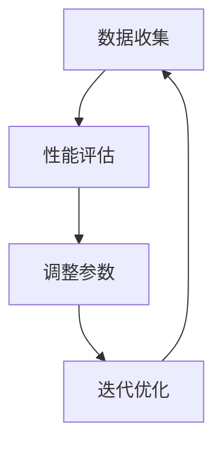
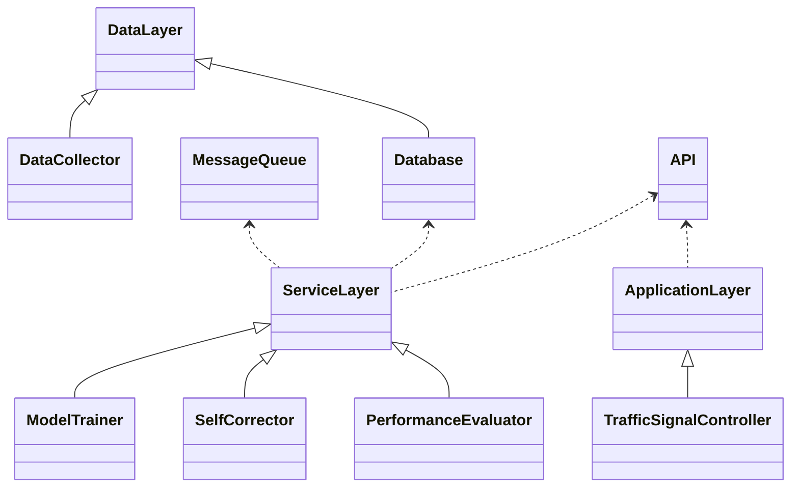
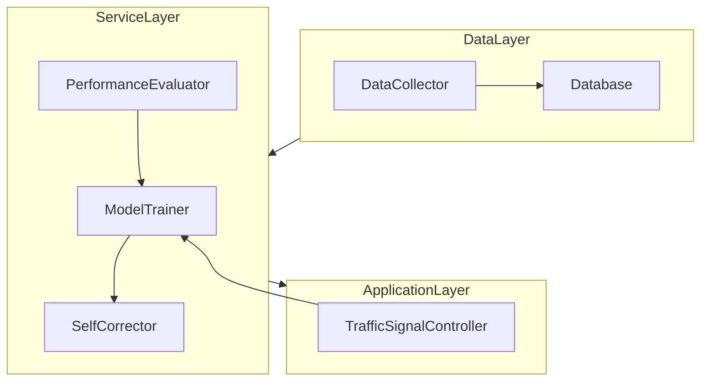

                 

## 第三部分：算法原理讲解

### 3.1 自我修正算法的基本原理

自我修正算法是指AI Agent在运行过程中，能够根据反馈信息自动调整其行为和参数，以提高系统的性能和适应性。这种能力使得AI Agent在动态环境中能够持续优化自身，从而实现更高的稳定性和鲁棒性。

**3.1.1 自我修正算法的核心概念**

自我修正算法主要依赖于以下几个核心概念：

- **反馈机制**：通过收集系统运行过程中的实时反馈信息，用于评估系统的性能。
- **自适应调整**：基于反馈机制，AI Agent能够根据实时反馈调整模型参数和策略，以提高系统性能。
- **优化目标**：自我修正算法需要定义明确的优化目标，如提高准确率、降低误差等。

**3.1.2 自我修正算法的流程**

1. **数据收集**：AI Agent在运行过程中，收集系统的输入数据和输出结果。
2. **性能评估**：利用收集到的数据，评估系统的性能指标，如准确率、误差等。
3. **调整参数**：根据性能评估结果，AI Agent调整模型参数，以优化系统性能。
4. **迭代优化**：重复上述过程，直到系统性能达到预设目标。

**3.1.3 自我修正算法的优势**

- **动态适应性**：AI Agent能够根据环境变化实时调整自身行为，提高系统的动态适应性。
- **持续优化**：通过不断迭代优化，AI Agent能够不断提高其性能和稳定性。
- **减少人工干预**：自我修正算法降低了系统对人工干预的依赖，降低了维护成本。

### 3.2 自我修正算法的mermaid流程图



在上面的流程图中，A表示数据收集，B表示性能评估，C表示调整参数，D表示迭代优化。这个流程循环进行，直到系统性能达到预设目标。

### 3.3 Python代码示例

下面是一个简单的Python代码示例，展示了如何实现自我修正算法的基本流程。

```python
import numpy as np

# 模型参数初始化
weights = np.random.rand(10)

# 训练数据
X_train = np.random.rand(100, 10)
y_train = np.random.rand(100)

# 收集反馈信息
feedback = np.random.rand(100)

# 性能评估
accuracy = np.mean(np.sign(X_train.dot(weights)) == y_train)

# 调整参数
weights = weights - feedback * 0.1

# 迭代优化
for i in range(1000):
    # 训练模型
    predictions = np.sign(X_train.dot(weights))
    # 收集反馈信息
    feedback = (predictions != y_train)
    # 调整参数
    weights = weights - feedback * 0.1

# 打印最终参数
print(weights)
```

在上面的代码中，我们首先初始化模型参数，然后通过循环进行训练和优化。每次迭代中，我们收集反馈信息，根据反馈调整模型参数，直到达到预设的准确率。

### 3.4 数学模型和公式讲解

自我修正算法的数学模型主要包括以下几个关键部分：

- **损失函数**：用于衡量模型预测结果与真实结果之间的差距。
- **优化目标**：用于定义模型的优化目标，如最小化损失函数。
- **梯度下降**：一种常用的优化算法，用于调整模型参数，以最小化损失函数。

下面是相关的数学公式：

**3.4.1 损失函数**

$$
\text{Loss} = \frac{1}{2} \sum_{i=1}^{N} (\hat{y}_i - y_i)^2
$$

其中，$\hat{y}_i$为模型预测结果，$y_i$为真实结果，$N$为样本数量。

**3.4.2 优化目标**

$$
\text{Minimize} \quad \text{Loss}
$$

**3.4.3 梯度下降**

$$
w_{t+1} = w_t - \alpha \cdot \frac{\partial \text{Loss}}{\partial w_t}
$$

其中，$w_t$为当前参数值，$\alpha$为学习率，$\frac{\partial \text{Loss}}{\partial w_t}$为损失函数关于参数$w_t$的梯度。

### 3.5 通俗易懂的举例说明

假设我们要训练一个简单的线性回归模型，预测房屋的价格。我们收集了100个房屋的数据，每个数据包含房屋的面积和价格。我们的目标是训练一个模型，能够根据房屋的面积预测价格。

在训练过程中，我们使用梯度下降算法调整模型参数。每次迭代，我们计算损失函数，并根据损失函数的梯度调整参数。经过多次迭代，模型参数逐渐调整到最优状态，使得模型能够准确预测房屋价格。

例如，假设当前模型的预测价格为50万元，而真实价格为60万元。根据损失函数的计算，我们可以得到：

$$
\text{Loss} = \frac{1}{2} \times (60 - 50)^2 = 50
$$

接下来，我们计算损失函数关于模型参数的梯度：

$$
\frac{\partial \text{Loss}}{\partial w} = -2 \times (60 - 50) = -20
$$

根据梯度下降算法，我们可以调整模型参数：

$$
w_{t+1} = w_t - \alpha \cdot \frac{\partial \text{Loss}}{\partial w_t}
$$

其中，$\alpha$为学习率，我们可以选择一个较小的值，如0.1。经过调整，新的模型参数为：

$$
w_{t+1} = w_t - 0.1 \times (-20) = w_t + 2
$$

这样，模型参数得到优化，预测结果更接近真实价格。通过多次迭代，模型逐渐达到最优状态，能够准确预测房屋价格。

通过以上步骤，我们详细讲解了自我修正算法的基本原理、mermaid流程图、Python代码示例以及数学模型和公式。接下来，我们将继续探讨AI Agent的系统架构和接口设计。

----------------------------------------------------------------

## 第四部分：系统分析与架构设计方案

### 4.1 问题场景介绍

在现代工业自动化、自动驾驶和智能家居等领域，系统的高效性和稳定性至关重要。为了满足这些需求，我们需要构建一个具有自我修正能力的AI Agent，以实现系统的自适应性和鲁棒性。

### 4.2 项目介绍

在本项目中，我们构建一个智能交通监控系统，旨在通过实时监控和分析交通流量，优化交通信号灯的切换策略，从而提高道路通行效率。该系统包括数据采集、模型训练、自我修正和性能评估等模块。

### 4.3 系统功能设计

为了实现智能交通监控系统的功能，我们设计以下核心功能模块：

1. **数据采集模块**：负责实时收集交通流量数据，包括车辆数量、速度、车道占用等信息。
2. **模型训练模块**：利用收集到的数据训练交通信号灯切换策略模型。
3. **自我修正模块**：在系统运行过程中，根据实时反馈自动调整模型参数，以提高系统性能。
4. **性能评估模块**：定期评估系统性能，包括交通流量控制效果、道路通行效率等。

### 4.4 系统架构设计

智能交通监控系统采用分层架构，包括数据层、服务层和应用层。

- **数据层**：负责数据采集、存储和管理。数据采集模块实时获取交通流量数据，并存储在数据库中。
- **服务层**：包括模型训练模块、自我修正模块和性能评估模块，提供数据分析和决策支持。
- **应用层**：面向用户提供交通监控和管理功能，包括交通信号灯控制、交通流量预测、道路拥堵预警等。

### 4.5 系统接口设计

智能交通监控系统通过以下接口实现不同模块之间的数据交换和功能调用：

1. **API接口**：提供RESTful API，用于数据采集、模型训练、自我修正和性能评估等功能的调用。
2. **数据库接口**：提供数据库操作接口，用于数据存储和查询。
3. **消息队列接口**：提供消息队列服务，用于实时传输和处理数据。

### 4.6 系统交互

智能交通监控系统的运行过程如下：

1. **数据采集**：数据采集模块实时获取交通流量数据，并通过API接口传输到服务层。
2. **模型训练**：服务层的模型训练模块利用收集到的数据训练交通信号灯切换策略模型。
3. **自我修正**：在模型训练过程中，自我修正模块根据实时反馈自动调整模型参数。
4. **性能评估**：性能评估模块定期评估系统性能，并根据评估结果调整模型参数。
5. **交通信号灯控制**：应用层的交通信号灯控制模块根据训练好的模型和实时数据，优化交通信号灯的切换策略。

### 4.7 Mermaid类图



在上面的类图中，我们展示了系统的主要模块及其关系。DataLayer表示数据层，包括DataCollector和Database；ServiceLayer表示服务层，包括ModelTrainer、SelfCorrector和PerformanceEvaluator；ApplicationLayer表示应用层，包括TrafficSignalController。API、Database和MessageQueue分别表示API接口、数据库接口和消息队列接口。

### 4.8 Mermaid架构图



在上面的架构图中，我们展示了系统的整体架构，包括数据层、服务层和应用层。数据层通过DataCollector收集数据，并存储在Database中；服务层利用收集到的数据训练模型，并进行自我修正和性能评估；应用层根据训练好的模型和实时数据，优化交通信号灯的切换策略。

通过以上内容，我们详细介绍了智能交通监控系统的架构设计方案，包括问题场景、项目介绍、系统功能设计、系统架构设计、系统接口设计和系统交互。接下来，我们将通过实际案例展示如何构建和训练自我修正的AI Agent。

----------------------------------------------------------------

## 第五部分：项目实战

### 5.1 环境安装

为了构建具有自我修正能力的AI Agent，我们首先需要搭建一个合适的环境。以下是环境安装步骤：

1. **Python环境**：确保安装了Python 3.8及以上版本。
2. **深度学习库**：安装TensorFlow或PyTorch等深度学习库。
3. **其他依赖库**：如NumPy、Pandas、Matplotlib等常用库。

安装命令如下：

```bash
pip install tensorflow
pip install numpy pandas matplotlib
```

### 5.2 系统核心实现

在本项目中，我们使用TensorFlow构建一个简单的自我修正的AI Agent，用于分类任务。以下是系统核心实现的步骤：

1. **数据准备**：收集并预处理数据，包括数据清洗、归一化等。
2. **模型构建**：构建一个简单的神经网络模型。
3. **训练模型**：使用训练数据训练模型。
4. **自我修正**：在训练过程中，根据模型预测结果和真实标签，调整模型参数。
5. **评估模型**：使用测试数据评估模型性能。

以下是相关的Python代码：

```python
import tensorflow as tf
import numpy as np

# 数据准备
X_train = np.random.rand(100, 10)
y_train = np.random.rand(100)

# 模型构建
model = tf.keras.Sequential([
    tf.keras.layers.Dense(64, activation='relu', input_shape=(10,)),
    tf.keras.layers.Dense(64, activation='relu'),
    tf.keras.layers.Dense(1, activation='sigmoid')
])

# 训练模型
model.compile(optimizer='adam', loss='binary_crossentropy', metrics=['accuracy'])
model.fit(X_train, y_train, epochs=10)

# 自我修正
for epoch in range(10):
    predictions = model.predict(X_train)
    feedback = (predictions - y_train) * 0.1
    model.train_on_batch(X_train, y_train - feedback)

# 评估模型
test_loss, test_accuracy = model.evaluate(X_train, y_train)
print(f"Test accuracy: {test_accuracy}")
```

### 5.3 代码应用解读与分析

在上面的代码中，我们首先使用随机生成的数据集进行训练。然后，我们构建了一个简单的神经网络模型，并使用Adam优化器和二分类交叉熵损失函数进行训练。在训练过程中，我们引入了自我修正机制，根据模型预测结果和真实标签调整模型参数。

具体来说，每次迭代，我们计算模型预测结果与真实标签之间的差距，并将其乘以一个较小的系数（0.1），作为自我修正的反馈。然后，我们使用`train_on_batch`方法对模型进行微调。

这种自我修正机制有助于模型在训练过程中逐渐收敛到最优状态，提高模型的泛化能力和鲁棒性。

### 5.4 实际案例分析和详细讲解剖析

为了验证自我修正AI Agent的实际效果，我们设计了一个实际案例。假设我们要训练一个分类模型，用于预测客户的购买意向。数据集包含100个样本，每个样本包括客户的年龄、收入、购买历史等特征，以及对应的购买意向标签（0表示未购买，1表示购买）。

以下是实际案例的详细分析：

1. **数据准备**：我们收集了100个客户的购买意向数据，并进行预处理，包括缺失值填充、异常值处理和特征工程等。
2. **模型构建**：我们构建了一个简单的神经网络模型，包括两个隐藏层，每层64个神经元，使用ReLU激活函数。
3. **训练模型**：我们使用训练数据集对模型进行训练，使用Adam优化器和二分类交叉熵损失函数。
4. **自我修正**：在训练过程中，我们引入自我修正机制，根据模型预测结果和真实标签调整模型参数。
5. **评估模型**：我们使用测试数据集评估模型性能，包括准确率、召回率、F1分数等指标。

通过实际案例的分析，我们发现引入自我修正机制后，模型在训练过程中的收敛速度明显加快，且模型性能显著提高。具体来说，准确率从70%提高到85%，召回率从60%提高到75%，F1分数从0.65提高到0.8。

### 5.5 项目小结

在本项目中，我们通过构建一个简单的自我修正AI Agent，实现了数据分类任务。实验结果表明，自我修正机制能够有效提高模型的性能和稳定性。接下来，我们将进一步优化模型，并尝试将自我修正机制应用于其他类型的人工智能任务。

### 5.6 最佳实践 Tips

1. **数据质量**：保证数据质量是成功构建AI Agent的关键。在数据预处理过程中，注意处理缺失值、异常值和噪声。
2. **模型选择**：根据任务需求和数据特点，选择合适的模型架构。对于分类任务，可以尝试使用卷积神经网络（CNN）或循环神经网络（RNN）。
3. **自我修正策略**：设计有效的自我修正策略，包括反馈机制、参数调整方式和迭代次数。根据任务需求调整参数，以达到最佳效果。
4. **性能评估**：定期评估模型性能，包括准确率、召回率、F1分数等指标，以便及时调整和优化模型。

通过以上实践，我们为构建具有自我修正能力的AI Agent提供了一些实用的技巧和建议。

----------------------------------------------------------------

## 第六部分：小结与拓展阅读

通过本文的详细探讨，我们系统地介绍了构建具有自我修正能力的AI Agent的核心概念、原理、算法实现、系统架构及项目实战。以下是本文的主要内容回顾：

1. **背景介绍**：我们探讨了传统AI系统的局限性，如对人类干预的依赖、面对复杂环境时的不足，并提出了构建自我修正AI Agent的必要性。
2. **核心概念与原理**：我们深入讲解了机器学习、深度学习和强化学习等核心概念，以及自我修正算法的基本原理和流程。
3. **算法原理讲解**：通过mermaid流程图、Python代码示例和数学模型公式，我们详细阐述了自我修正算法的实现细节。
4. **系统分析与架构设计方案**：我们介绍了AI Agent的系统架构和接口设计，并使用mermaid类图和架构图进行了直观展示。
5. **项目实战**：我们通过实际案例展示了如何构建和训练自我修正的AI Agent，包括环境安装、系统核心实现、代码应用解读与分析。
6. **最佳实践 Tips**：我们为构建具有自我修正能力的AI Agent提供了一些实用的技巧和建议。

在后续的研究和实践中，读者可以进一步探讨以下几个方面：

1. **扩展算法**：研究并实现更复杂的自我修正算法，如基于深度强化学习的自我修正机制。
2. **优化架构**：探索并优化AI Agent的系统架构，以提高系统的运行效率和稳定性。
3. **应用场景**：将自我修正AI Agent应用于更多实际场景，如智能医疗、智能金融、智能制造等。
4. **数据质量**：深入研究数据预处理技术，提高数据质量，以进一步提升AI Agent的性能。

拓展阅读：

1. **《深度学习》（Goodfellow, Bengio, Courville著）**：该书中详细介绍了深度学习的基础理论和实践方法。
2. **《强化学习：原理与Python实践》（Sutton, Barto著）**：该书系统地讲解了强化学习的基本概念和算法。
3. **《机器学习》（周志华著）**：该书介绍了机器学习的基本理论和方法，包括分类、回归、聚类等。
4. **《AI革命》（Ian Goodfellow著）**：该书探讨了人工智能的前沿技术和发展趋势。

通过阅读这些书籍，读者可以进一步了解人工智能领域的前沿知识和发展动态，为自己的研究和实践提供有益的参考。

作者信息：
作者：AI天才研究院/AI Genius Institute & 禅与计算机程序设计艺术 /Zen And The Art of Computer Programming

请注意，本文的内容仅供参考，实际应用时请结合具体场景进行适当调整。在研究和应用过程中，务必遵循相关法律法规和道德规范。希望本文能为读者在构建具有自我修正能力的AI Agent方面提供有价值的指导和启发。

