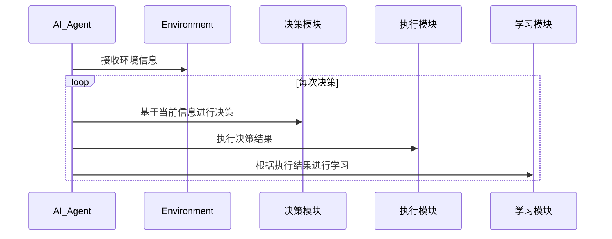
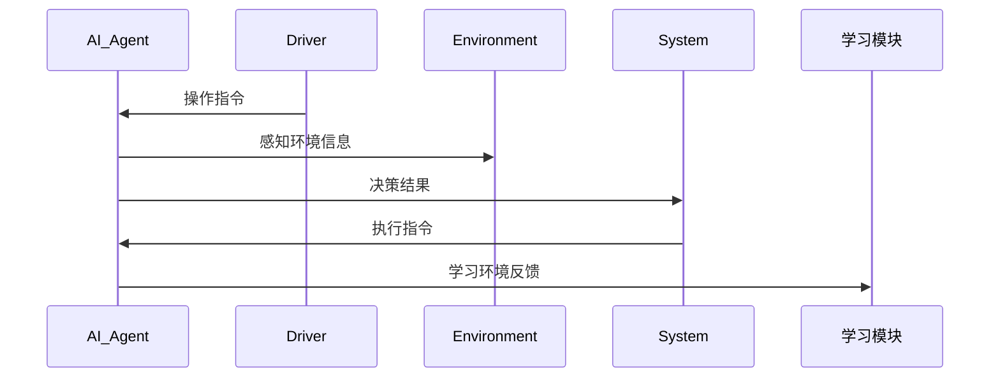
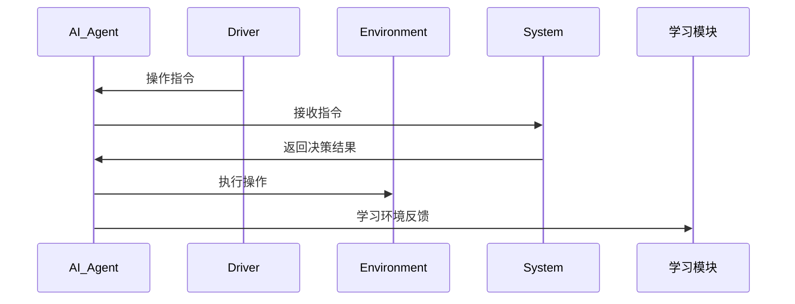

                 

## 构建具有自我进化能力的AI Agent系统

### 关键词
- AI Agent
- 自我进化
- 人工智能系统
- 算法设计
- 软件架构

### 摘要
本文旨在探讨如何构建具有自我进化能力的AI Agent系统。我们将从背景介绍、核心概念与联系、算法原理讲解、系统分析与架构设计、项目实战以及最佳实践等方面，详细阐述构建这一系统的方法和步骤。本文的目标是帮助读者理解AI Agent系统的基本原理，并掌握构建自我进化AI Agent系统的技术和实践。

---

### 背景介绍

#### 核心概念术语说明
- **AI Agent**：具有自主性、适应性、交互性的计算机程序，可以在特定环境中执行任务。
- **自我进化**：AI Agent通过自我学习和调整，以适应环境变化和任务需求。
- **AI Agent系统**：由多个AI Agent组成的系统，能够协同工作，实现复杂任务的自动化。

#### 问题背景
在人工智能技术快速发展的今天，传统的人工智能系统面临许多挑战。它们通常依赖于大量预先设定的规则和模型，难以适应动态和复杂的环境。而AI Agent作为一种具有高度自主性和交互性的智能体，能够在不断变化的环境中自主学习和进化，从而提高系统的适应性和智能化水平。

#### 问题描述
如何构建一个具有自我进化能力的AI Agent系统，使其能够适应不同的环境和任务需求？这涉及到算法设计、系统架构、以及实际的工程实践等多个方面。

#### 问题解决
通过设计一种自我进化的机制，使得AI Agent能够不断地从环境中学习，并优化自己的行为。这将有助于提高系统的自适应性和智能化水平，从而解决传统人工智能系统面临的问题。

#### 边界与外延
自我进化AI Agent系统的研究和应用不仅局限于特定领域，如机器人、自动驾驶、智能家居等，还可以扩展到更多领域，如金融、医疗、教育等。

#### 概念结构与核心要素组成
自我进化AI Agent系统主要由以下核心要素组成：
1. **感知模块**：用于接收外部环境的信息。
2. **决策模块**：根据感知到的信息，进行决策和行为规划。
3. **学习模块**：通过历史数据和经验，优化自身行为。
4. **执行模块**：执行决策模块生成的行为计划。

---

### 核心概念与联系

#### 自我进化的核心概念
- **适应性**：AI Agent能够根据环境变化，调整自己的行为。
- **学习**：AI Agent通过历史数据和经验，优化自身行为。
- **进化**：AI Agent通过遗传算法、神经网络等机制，实现自我优化和进化。

#### 概念属性特征对比表格
| 特征         | 自我进化        | 传统AI        |  
| ------------ | -------------- | -------------- |  
| 学习机制     | 基于数据的进化  | 预先设定的规则 |  
| 适应性       | 高适应性       | 依赖环境固定   |  
| 进化速度     | 快速进化       | 慢速更新       |  
| 智能化水平   | 高智能化水平   | 中等智能化水平 |

#### ER实体关系图架构的 Mermaid 流程图
```mermaid
erDiagram
  AI_Agent ||--|{ 感知模块 }
  AI_Agent ||--|{ 决策模块 }
  AI_Agent ||--|{ 学习模块 }
  AI_Agent ||--|{ 执行模块 }
```

---

### 算法原理讲解

#### 自我进化算法的 Mermaid 流程图


#### 算法原理的数学模型和公式
- **适应性函数**：用于评估AI Agent在特定环境中的适应度。
  $$ fitness = f(\text{环境状态}, \text{行为结果}) $$
- **学习算法**：用于优化AI Agent的行为。
  $$ \text{学习算法} = \frac{\text{历史数据}}{\text{当前环境}} $$
- **进化算法**：通过遗传操作，实现AI Agent的进化。
  $$ \text{进化算法} = \text{交叉} \cup \text{变异} \cup \text{选择} $$

#### 算法原理的通俗易懂举例说明
假设一个AI Agent在一个游戏中进行训练。每次游戏结束后，AI Agent会根据游戏的结果和学习算法调整自己的策略。经过多次训练后，AI Agent会逐渐学会如何在游戏中取得胜利。这个过程就是自我进化的体现。

---

### 系统分析与架构设计

#### 问题场景介绍
以自动驾驶为例，介绍如何构建一个具有自我进化能力的AI Agent系统。

#### 项目介绍
自动驾驶系统是一个复杂的多模块系统，需要处理感知、决策、执行等多个方面的问题。为了实现自我进化，我们将引入多个AI Agent，使其能够协同工作，提高系统的智能化水平。

#### 系统功能设计（领域模型Mermaid类图）
```mermaid
classDiagram
  AI_Agent <<class>> { 感知模块，决策模块，学习模块，执行模块 }
  Driver <<class>> { 操控车辆的用户 }
  Environment <<class>> { 道路环境 }
  System <<class>> { 系统控制模块 }
  
  Driver o-- AI_Agent
  AI_Agent o-- Environment
  System o-- AI_Agent
```

#### 系统架构设计（Mermaid架构图）


#### 系统接口设计（Mermaid序列图）


---

### 项目实战

#### 环境安装
确保安装了Python环境和相关依赖，如TensorFlow、Keras等。

#### 系统核心实现源代码
```python
# 感知模块
class PerceptionModule:
    def sense_environment(self):
        # 传感器数据处理
        pass

# 决策模块
class DecisionModule:
    def make_decision(self, environment_info):
        # 基于感知信息的决策
        pass

# 学习模块
class LearningModule:
    def learn_from_experience(self, experience):
        # 经验学习
        pass

# 执行模块
class ExecutionModule:
    def execute_decision(self, decision):
        # 执行决策
        pass

# AI Agent
class AI_Agent:
    def __init__(self):
        self.perception_module = PerceptionModule()
        self.decision_module = DecisionModule()
        self.learning_module = LearningModule()
        self.execution_module = ExecutionModule()

    def run(self):
        environment_info = self.perception_module.sense_environment()
        decision = self.decision_module.make_decision(environment_info)
        self.execution_module.execute_decision(decision)
        self.learning_module.learn_from_experience(experience)
```

#### 代码应用解读与分析
- **感知模块**：通过传感器数据感知环境信息。
- **决策模块**：基于感知到的信息进行决策。
- **学习模块**：通过历史数据和经验，优化自身行为。
- **执行模块**：执行决策模块生成的行为计划。

#### 实际案例分析和详细讲解剖析
以自动驾驶为例，展示如何实现AI Agent的自我进化。通过不断的学习和调整，AI Agent能够在不同环境中适应和优化自己的行为。

#### 项目小结
通过项目实战，我们展示了如何构建具有自我进化能力的AI Agent系统。这个系统不仅能够感知和决策，还能够通过学习和进化，提高其在复杂环境中的适应性和智能化水平。

---

### 最佳实践 Tips

1. **数据质量**：确保用于训练的数据质量高，有助于AI Agent更好地学习和进化。
2. **算法选择**：根据具体应用场景选择合适的自我进化算法，如遗传算法、神经网络等。
3. **系统优化**：不断优化系统架构和算法，提高AI Agent的性能和适应性。
4. **安全性**：考虑AI Agent系统的安全性，防止恶意攻击和数据泄露。

### 小结

本文详细阐述了构建具有自我进化能力的AI Agent系统的方法和步骤。通过理解核心概念、算法原理、系统架构和实际应用，读者可以掌握构建这一系统所需的知识和技能。

### 注意事项

1. **逐步优化**：在构建AI Agent系统时，要逐步优化每个模块，确保系统整体性能。
2. **持续学习**：随着技术的发展，AI Agent系统需要不断更新和进化，以适应新的挑战。

### 拓展阅读

1. 《强化学习：原理、算法与Python实现》
2. 《深度学习：从入门到专业》
3. 《机器人：从基础到应用》

---

### 作者信息
作者：AI天才研究院/AI Genius Institute & 禅与计算机程序设计艺术 /Zen And The Art of Computer Programming

