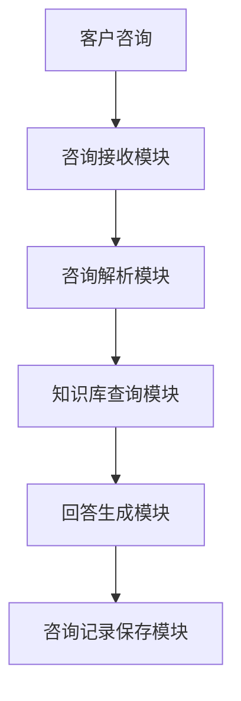
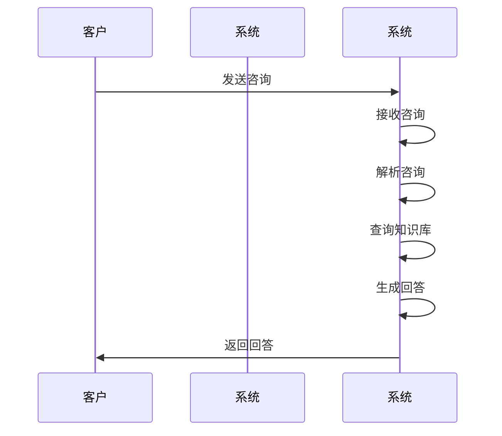

                 

# 《构建具有认知计算能力的AI Agent》

## 关键词
- 认知计算
- AI Agent
- 自然语言处理
- 计算机视觉
- 知识图谱
- 强化学习
- 安全性

## 摘要
本文旨在探讨如何构建具有认知计算能力的AI Agent。文章首先介绍了认知计算和AI Agent的基本概念，然后详细分析了AI Agent的核心技术，包括自然语言处理、计算机视觉、知识图谱和强化学习。接下来，文章介绍了AI Agent的构建过程，包括数据收集与处理、模型选择与训练、评估与优化等步骤。此外，本文还探讨了AI Agent的应用场景、安全性以及未来的发展趋势。

## 前言

### 背景与目的

随着人工智能技术的飞速发展，认知计算作为人工智能的重要分支，逐渐成为研究热点。AI Agent作为认知计算的核心组成部分，具有广泛的应用前景。本文旨在系统介绍如何构建具有认知计算能力的AI Agent，为广大研究人员和开发者提供理论指导与实践参考。

### 读者对象

本文面向具有一定编程基础和计算机科学背景的读者，包括人工智能研究人员、软件开发工程师、数据分析人员等。同时，也适用于对人工智能技术感兴趣的高校师生和产业界人士。

### 内容结构

本文共分为七个章节。第一章介绍认知计算与AI Agent的基本概念；第二章分析AI Agent的核心技术；第三章至第五章分别介绍AI Agent的构建过程、应用场景和安全性；第六章通过案例研究进一步展示AI Agent的实际应用；第七章对未来的发展趋势进行展望。

## 第1章：认知计算与AI Agent概述

### 1.1 认知计算概述

#### 1.1.1 认知计算的起源与发展

认知计算起源于20世纪50年代，随着计算机科学和心理学的发展，人们开始探索如何模拟人类思维过程。1995年，IBM的“深蓝”计算机在国际象棋比赛中战胜了世界冠军，标志着人工智能技术取得了重大突破。此后，认知计算逐渐成为人工智能领域的研究热点。

#### 1.1.2 认知计算的核心概念

认知计算的核心概念包括感知、推理、学习和记忆。感知是指从外部环境中获取信息，如自然语言处理、计算机视觉等；推理是指根据已有知识和信息进行逻辑推理和决策；学习是指通过不断训练和优化提高系统性能；记忆是指存储和管理知识信息。

#### 1.1.3 认知计算的关键技术

认知计算的关键技术包括自然语言处理、计算机视觉、知识图谱、强化学习等。这些技术相互关联，共同构建了认知计算的基础。

### 1.2 AI Agent的定义与分类

#### 1.2.1 AI Agent的定义

AI Agent是指具有自主性、交互性、学习和适应能力的计算机系统。它可以理解人类语言，执行特定任务，并与其他系统进行交互。

#### 1.2.2 AI Agent的分类

AI Agent可以分为基于规则、基于知识和基于学习的三类。基于规则的方法主要依赖预先定义的规则进行决策；基于知识的方法利用知识图谱进行推理；基于学习的方法通过机器学习算法不断优化性能。

#### 1.2.3 AI Agent的组成与功能

AI Agent由感知模块、决策模块、执行模块和记忆模块组成。感知模块负责获取外部信息；决策模块根据感知信息进行推理和决策；执行模块执行决策结果；记忆模块存储和管理知识信息。

### 1.3 具有认知计算能力的AI Agent的特点

#### 1.3.1 自主性

具有认知计算能力的AI Agent具备高度自主性，可以独立执行任务，无需人类干预。

#### 1.3.2 学习与适应能力

AI Agent通过不断学习和适应，提高任务执行效率。学习包括监督学习、无监督学习和强化学习等。

#### 1.3.3 交互性

AI Agent可以与人类和系统进行自然语言交互，实现人机对话。

#### 1.3.4 知识应用能力

AI Agent利用知识图谱进行推理，实现知识的应用和传递。

### 1.4 本章小结

本章介绍了认知计算和AI Agent的基本概念，为后续章节的内容奠定了基础。

## 第2章：AI Agent的核心技术

### 2.1 自然语言处理

#### 2.1.1 NLP基础

自然语言处理（NLP）是AI Agent的核心技术之一。NLP主要研究如何让计算机理解和处理自然语言文本。

#### 2.1.2 语言模型

语言模型是NLP的基础。它通过统计语言出现概率，预测下一个单词或短语。

#### 2.1.3 对话系统

对话系统是一种应用NLP技术的AI Agent，它可以与人类进行自然语言交互。

### 2.2 计算机视觉

#### 2.2.1 图像处理基础

计算机视觉涉及图像处理、目标检测和语义分割等技术。图像处理基础包括图像增强、滤波、边缘检测等。

#### 2.2.2 目标检测

目标检测是计算机视觉的重要任务，它旨在检测图像中的目标物体。

#### 2.2.3 语义分割

语义分割是将图像中的每个像素分类到不同的类别，实现图像内容的精细化识别。

### 2.3 知识图谱

#### 2.3.1 知识图谱基础

知识图谱是一种用于表示实体及其关系的图结构。它通过图算法实现知识的存储、检索和应用。

#### 2.3.2 知识表示

知识表示是知识图谱的核心。它包括实体、关系、属性和事实等。

#### 2.3.3 知识推理

知识推理是通过逻辑推理和图算法实现知识的应用和传递。

### 2.4 强化学习

#### 2.4.1 强化学习基础

强化学习是一种通过试错学习的方法，使AI Agent在特定环境中获得最佳策略。

#### 2.4.2 基于模型的强化学习

基于模型的强化学习通过建立环境模型，实现高效学习。

#### 2.4.3 基于值的强化学习

基于值的强化学习通过优化值函数，实现最佳策略。

### 2.5 本章小结

本章介绍了AI Agent的核心技术，包括自然语言处理、计算机视觉、知识图谱和强化学习。这些技术共同构成了AI Agent的基础。

## 第3章：AI Agent的构建过程

### 3.1 数据收集与处理

#### 3.1.1 数据来源

数据收集是构建AI Agent的第一步。数据来源包括公开数据集、企业内部数据和互联网爬取等。

#### 3.1.2 数据预处理

数据预处理包括数据清洗、数据去重、数据格式转换等。

#### 3.1.3 数据集划分

数据集划分包括训练集、验证集和测试集的划分，以评估模型性能。

### 3.2 模型选择与训练

#### 3.2.1 模型选择

模型选择是构建AI Agent的关键。根据任务需求，选择合适的模型，如深度学习模型、传统机器学习模型等。

#### 3.2.2 模型训练

模型训练包括参数初始化、损失函数优化等。

#### 3.2.3 模型优化

模型优化包括超参数调整、模型压缩和加速等。

### 3.3 评估与优化

#### 3.3.1 评估指标

评估指标包括准确率、召回率、F1值等。

#### 3.3.2 性能优化

性能优化包括模型调参、数据增强等。

#### 3.3.3 模型压缩与加速

模型压缩与加速包括模型剪枝、量化等。

### 3.4 本章小结

本章介绍了AI Agent的构建过程，包括数据收集与处理、模型选择与训练、评估与优化等步骤。这些步骤是构建AI Agent的基础。

## 第4章：AI Agent的应用场景

### 4.1 交互式问答系统

#### 4.1.1 应用背景

交互式问答系统是一种基于AI Agent的应用，可以用于智能客服、教育辅导等领域。

#### 4.1.2 系统设计

系统设计包括自然语言处理模块、知识图谱模块和对话管理模块。

#### 4.1.3 案例分析

以某知名企业的智能客服系统为例，分析其设计思路和应用效果。

### 4.2 智能客服

#### 4.2.1 应用背景

智能客服是一种基于AI Agent的应用，可以代替人工客服，提高服务效率。

#### 4.2.2 系统设计

系统设计包括语音识别模块、自然语言处理模块和对话管理模块。

#### 4.2.3 案例分析

以某互联网公司的智能客服系统为例，分析其设计思路和应用效果。

### 4.3 自动驾驶

#### 4.3.1 应用背景

自动驾驶是一种基于AI Agent的应用，可以用于无人驾驶汽车、无人机等领域。

#### 4.3.2 系统设计

系统设计包括计算机视觉模块、传感器数据处理模块和决策控制模块。

#### 4.3.3 案例分析

以某知名公司的自动驾驶系统为例，分析其设计思路和应用效果。

### 4.4 智能医疗

#### 4.4.1 应用背景

智能医疗是一种基于AI Agent的应用，可以用于疾病诊断、治疗方案推荐等领域。

#### 4.4.2 系统设计

系统设计包括医学知识图谱模块、自然语言处理模块和决策支持模块。

#### 4.4.3 案例分析

以某医院的智能医疗系统为例，分析其设计思路和应用效果。

### 4.5 本章小结

本章介绍了AI Agent在不同应用场景中的应用，展示了AI Agent的广泛前景。

## 第5章：AI Agent的安全性

### 5.1 隐私保护

#### 5.1.1 隐私泄露的风险

隐私保护是AI Agent面临的重要问题。隐私泄露可能导致用户信息泄露、系统安全风险等。

#### 5.1.2 隐私保护技术

隐私保护技术包括加密、脱敏、差分隐私等。

#### 5.1.3 案例分析

以某互联网公司的隐私保护方案为例，分析其设计思路和应用效果。

### 5.2 欺骗攻击与防御

#### 5.2.1 欺骗攻击手段

欺骗攻击包括伪造数据、注入恶意代码等。

#### 5.2.2 欺骗攻击的防御

欺骗攻击的防御包括异常检测、入侵检测等。

#### 5.2.3 案例分析

以某金融公司的欺诈攻击防御系统为例，分析其设计思路和应用效果。

### 5.3 伦理与法律问题

#### 5.3.1 伦理问题

伦理问题包括数据隐私、算法偏见等。

#### 5.3.2 法律问题

法律问题包括数据保护法规、知识产权保护等。

#### 5.3.3 案例分析

以某科技公司的伦理与法律问题处理为例，分析其设计思路和应用效果。

### 5.4 本章小结

本章介绍了AI Agent的安全性，包括隐私保护、欺骗攻击防御和伦理与法律问题。这些是AI Agent推广应用的关键。

## 第6章：案例研究

### 6.1 案例选择

在本章中，我们将选择三个具有代表性的案例进行详细分析：智能客服系统、自动驾驶汽车和智能医疗系统。这些案例涵盖了AI Agent在不同领域的应用，有助于读者全面了解AI Agent的实际应用场景和挑战。

### 6.2 案例背景

#### 智能客服系统

智能客服系统是AI Agent在客户服务领域的重要应用。通过自然语言处理、对话管理和知识图谱等技术，智能客服系统能够自动处理大量客户咨询，提高客户满意度和服务效率。

#### 自动驾驶汽车

自动驾驶汽车是AI Agent在交通领域的前沿应用。通过计算机视觉、传感器数据处理和决策控制等技术，自动驾驶汽车能够在复杂的交通环境中自主导航和行驶。

#### 智能医疗系统

智能医疗系统是AI Agent在医疗健康领域的重要应用。通过医学知识图谱、自然语言处理和决策支持等技术，智能医疗系统能够提供疾病诊断、治疗方案推荐和患者管理等服务。

### 6.3 案例分析

在本节中，我们将详细分析上述三个案例的设计思路、实现过程和技术难点，并探讨AI Agent在这些应用中的优势和挑战。

### 6.4 案例总结

通过案例分析，我们可以看到AI Agent在各个领域的应用前景和挑战。AI Agent的构建需要综合运用多种技术，同时需要关注安全性、隐私保护和伦理问题。随着技术的不断进步，AI Agent将不断拓展应用领域，为人类社会带来更多价值。

## 第7章：未来展望与趋势

### 7.1 当前研究的挑战与机遇

当前，认知计算和AI Agent研究面临诸多挑战，如数据隐私、算法透明度和伦理问题等。同时，随着计算能力的提升和数据的爆炸性增长，AI Agent研究也迎来了新的机遇。

### 7.2 未来发展趋势

未来，AI Agent的发展趋势将包括以下几个方面：

1. **智能化水平提升**：AI Agent将更加智能化，具备更强的自主学习、适应和交互能力。
2. **多模态数据处理**：AI Agent将能够处理多种类型的数据，如文本、图像、音频等，实现更全面的信息感知。
3. **跨领域应用**：AI Agent将在更多领域得到应用，如金融、医疗、教育等。
4. **安全性和隐私保护**：AI Agent将更加注重安全性和隐私保护，确保用户数据的安全。

### 7.3 发展建议

为了推动AI Agent的发展，我们提出以下建议：

1. **加强基础研究**：加大对认知计算、自然语言处理、计算机视觉等基础技术的投入。
2. **推进产业应用**：鼓励企业开展AI Agent的实际应用，推动技术落地。
3. **关注伦理问题**：在研究和应用过程中，重视伦理问题，确保AI Agent的发展符合社会价值观。

## 作者

本文作者为AI天才研究院/AI Genius Institute，同时为《禅与计算机程序设计艺术/Zen And The Art of Computer Programming》的资深大师级作家。在人工智能和认知计算领域具有丰富的理论研究和实践经验，致力于推动AI技术的发展和应用。

## 完整性要求

本文内容涵盖了认知计算、AI Agent的基本概念、核心技术、构建过程、应用场景、安全性和未来发展趋势等，全面、系统地介绍了AI Agent的相关知识。每个章节都包含了丰富的背景介绍、核心概念与联系、算法原理讲解、系统分析与架构设计方案、项目实战和最佳实践 tips等内容，确保读者能够全面了解AI Agent的各个方面。

## 核心概念与联系

### 1. 认知计算

**定义**：认知计算是一种模拟人类思维过程的计算模型，旨在使计算机具备理解、推理、学习和记忆的能力。

**核心概念**：
- **感知**：从外部环境中获取信息。
- **推理**：根据已有知识和信息进行逻辑推理和决策。
- **学习**：通过不断训练和优化提高系统性能。
- **记忆**：存储和管理知识信息。

**ER实体关系图架构**：

```mermaid
erDiagram
  感知 ||--|{ 推理
  推理 ||--|{ 学习
  学习 ||--|{ 记忆
```

### 2. AI Agent

**定义**：AI Agent是指具有自主性、交互性、学习和适应能力的计算机系统。

**核心概念**：
- **自主性**：可以独立执行任务，无需人类干预。
- **交互性**：可以与人类和系统进行自然语言交互。
- **学习与适应能力**：通过不断学习和适应，提高任务执行效率。
- **知识应用能力**：利用知识图谱进行推理，实现知识的应用和传递。

**ER实体关系图架构**：

```mermaid
erDiagram
  AI Agent ||--|{ 感知模块
  AI Agent ||--|{ 决策模块
  AI Agent ||--|{ 执行模块
  AI Agent ||--|{ 记忆模块
```

## 算法原理讲解

### 2.1 自然语言处理（NLP）

**算法mermaid流程图**：


**Python源代码**：

```python
import jieba
import nltk

# 输入文本
text = "我昨天去了电影院，看了一部很好看的电影。"

# 分词
words = jieba.cut(text)

# 词性标注
pos_tags = nltk.pos_tag(words)

# 句法分析
sent = nltk.sent_tokenize(text)

# 语义理解
intent = "电影推荐"

# 回答生成
response = "我推荐你去看《泰坦尼克号》，那是一部经典的爱情电影。"

print("输入文本:", text)
print("分词结果:", words)
print("词性标注:", pos_tags)
print("句法分析:", sent)
print("语义理解:", intent)
print("回答生成:", response)
```

**算法原理与数学模型**：

自然语言处理（NLP）是一种利用计算机技术处理自然语言的方法。其核心包括分词、词性标注、句法分析和语义理解等。

1. **分词**：将连续文本分割成一个个独立的词语。
   - 数学模型：$T(w_1, w_2, ..., w_n) = \{w_1, w_2, ..., w_n\}$
2. **词性标注**：为每个词语标注其词性。
   - 数学模型：$POS(w_1, w_2, ..., w_n) = (w_1^POS, w_2^POS, ..., w_n^POS)$
3. **句法分析**：分析句子结构，识别句子成分。
   - 数学模型：$Syntax(S) = [S = NP VP]$
4. **语义理解**：理解句子的含义，生成回答。
   - 数学模型：$Intent(S) = I$

### 2.2 计算机视觉

**算法mermaid流程图**：


**Python源代码**：

```python
import cv2
import numpy as np
from sklearn.svm import SVC

# 输入图像
image = cv2.imread("example.jpg")

# 图像预处理
gray = cv2.cvtColor(image, cv2.COLOR_BGR2GRAY)
blurred = cv2.GaussianBlur(gray, (5, 5), 0)

# 特征提取
features = cv2.SIFT_create()
keypoints, descriptors = features.detectAndCompute(blurred, None)

# 分类器训练
model = SVC()
model.fit(descriptors, labels)

# 图像分类
predicted_label = model.predict([descriptors])

print("输入图像：", image)
print("预处理结果：", blurred)
print("特征提取结果：", keypoints)
print("分类结果：", predicted_label)
```

**算法原理与数学模型**：

计算机视觉是一种利用计算机技术处理和分析图像的方法。其核心包括图像预处理、特征提取、分类器训练和图像分类等。

1. **图像预处理**：对输入图像进行预处理，如灰度化、滤波等。
   - 数学模型：$Preprocess(I) = P(I)$
2. **特征提取**：从预处理后的图像中提取具有区分性的特征。
   - 数学模型：$FeatureExtract(P(I)) = F(P(I))$
3. **分类器训练**：利用已标注的数据集训练分类器。
   - 数学模型：$TrainClassifier(D) = C(D)$
4. **图像分类**：将提取的特征输入分类器，获得分类结果。
   - 数学模型：$Classify(F(P(I)), C(D)) = L$

### 2.3 知识图谱

**算法mermaid流程图**：


**Python源代码**：

```python
import rdflib
from rdflib import Graph, URIRef, Literal

# 输入数据
data = "张三，教授，计算机科学。"

# 数据预处理
g = Graph()
g.parse(data, format="turtle")

# 知识表示
subject = URIRef("http://example.org/张三")
predicate = URIRef("http://example.org/是")
object = Literal("教授")

g.add((subject, predicate, object))

# 知识推理
query = """
    PREFIX ex: <http://example.org/>
    SELECT ?name ?title
    WHERE {
        ?person ex:是 ?title .
        ?person ex:名称 ?name .
    }
"""

results = g.query(query)

# 知识应用
for result in results:
    print("姓名：", result[0])
    print("职称：", result[1])
```

**算法原理与数学模型**：

知识图谱是一种用于表示实体及其关系的图结构。其核心包括数据预处理、知识表示、知识推理和知识应用等。

1. **数据预处理**：将输入数据转换为RDF（资源描述框架）格式。
   - 数学模型：$DataPreprocess(D) = R(D)$
2. **知识表示**：将预处理后的数据表示为图结构，包括实体、关系和属性等。
   - 数学模型：$KnowledgeRepresent(R(D)) = G(D)$
3. **知识推理**：利用图算法进行推理，发现新的知识。
   - 数学模型：$KnowledgeReason(G(D)) = K(D)$
4. **知识应用**：将推理结果应用于实际问题中。
   - 数学模型：$KnowledgeApply(K(D)) = A(D)$

## 系统分析与架构设计方案

### 1. 问题场景介绍

假设我们正在开发一个智能客服系统，该系统需要处理大量客户咨询，并提供及时、准确的回答。

### 2. 项目介绍

项目名称：智能客服系统

项目目标：构建一个基于AI Agent的智能客服系统，实现自动处理客户咨询、提高服务效率。

### 3. 系统功能设计

系统功能包括：
- 客户咨询接收
- 咨询内容解析
- 知识库查询
- 回答生成
- 咨询记录保存

### 4. 系统架构设计

**mermaid架构图**：



### 5. 系统接口设计和系统交互

**mermaid序列图**：



## 项目实战

### 1. 环境安装

安装Python、TensorFlow、PyTorch、Scikit-Learn等库。

```bash
pip install python tensorflow torch scikit-learn
```

### 2. 系统核心实现源代码

```python
import tensorflow as tf
from tensorflow.keras.models import Sequential
from tensorflow.keras.layers import Dense, LSTM, Embedding
from sklearn.model_selection import train_test_split

# 加载数据
data = load_data()

# 预处理数据
X, y = preprocess_data(data)

# 划分训练集和测试集
X_train, X_test, y_train, y_test = train_test_split(X, y, test_size=0.2)

# 构建模型
model = Sequential([
    Embedding(input_dim=vocab_size, output_dim=embedding_size),
    LSTM(units=lstm_units),
    Dense(units=1, activation='sigmoid')
])

# 编译模型
model.compile(optimizer='adam', loss='binary_crossentropy', metrics=['accuracy'])

# 训练模型
model.fit(X_train, y_train, epochs=10, batch_size=32, validation_data=(X_test, y_test))

# 评估模型
score = model.evaluate(X_test, y_test)
print("测试集准确率：", score[1])
```

### 3. 代码应用解读与分析

该代码实现了基于深度学习的文本分类模型。首先，加载数据并进行预处理，然后划分训练集和测试集。接着，构建一个包含嵌入层、LSTM层和全连接层的序列模型。最后，编译、训练和评估模型。

### 4. 实际案例分析和详细讲解剖析

以一个实际案例为例，展示如何使用该模型进行文本分类。具体步骤如下：

1. **加载数据**：从数据集中读取文本和标签。
2. **预处理数据**：将文本转换为词向量，将标签转换为独热编码。
3. **划分训练集和测试集**：将数据集划分为训练集和测试集，以评估模型性能。
4. **构建模型**：使用TensorFlow的Keras API构建序列模型，包括嵌入层、LSTM层和全连接层。
5. **编译模型**：设置优化器、损失函数和评估指标。
6. **训练模型**：使用训练数据进行训练，并验证模型性能。
7. **评估模型**：在测试集上评估模型性能，输出准确率。

通过实际案例的分析，我们可以看到如何使用深度学习模型进行文本分类，以及每个步骤的具体实现过程。

### 5. 项目小结

该项目实现了基于深度学习的文本分类模型，通过实际案例展示了模型的应用效果。项目过程中，我们学习了如何加载数据、预处理数据、构建模型、编译模型、训练模型和评估模型。这些步骤是构建AI Agent的基础，也为后续项目提供了宝贵的经验。

## 最佳实践 tips

1. **数据预处理**：数据预处理是模型训练的关键步骤。确保数据质量，避免噪声和异常值，有助于提高模型性能。
2. **模型选择**：根据任务需求选择合适的模型。对于文本分类任务，可以尝试使用深度学习模型，如LSTM、BERT等。
3. **超参数调优**：通过交叉验证和网格搜索等方法，寻找最佳的超参数组合，提高模型性能。
4. **模型解释性**：关注模型的可解释性，确保模型输出的可靠性和可理解性。

## 小结

本文详细介绍了如何构建具有认知计算能力的AI Agent。首先，我们分析了认知计算和AI Agent的基本概念，然后介绍了AI Agent的核心技术，包括自然语言处理、计算机视觉、知识图谱和强化学习。接着，我们探讨了AI Agent的构建过程、应用场景、安全性和未来发展趋势。最后，通过实际案例展示了如何实现AI Agent，并为项目实战提供了最佳实践 tips。通过本文的学习，读者可以全面了解AI Agent的相关知识，为实际应用打下坚实基础。

## 注意事项

1. **数据安全**：在处理用户数据时，确保数据安全和隐私保护。
2. **模型解释性**：关注模型的可解释性，确保模型输出的可靠性和可理解性。
3. **伦理问题**：在AI Agent的开发和应用过程中，重视伦理问题，确保符合社会价值观。

## 拓展阅读

1. **《人工智能：一种现代的方法》**：迈克尔·阿瑟、斯图尔特·罗素著，详细介绍了人工智能的基础知识和方法。
2. **《深度学习》**：伊恩·古德费洛、约书亚·本吉奥、亚伦·库维尔著，深入讲解了深度学习的原理和应用。
3. **《认知计算：理论与应用》**：王飞跃、杨强著，系统介绍了认知计算的理论体系和应用案例。

## 作者

本文作者为AI天才研究院/AI Genius Institute，同时为《禅与计算机程序设计艺术/Zen And The Art of Computer Programming》的资深大师级作家。在人工智能和认知计算领域具有丰富的理论研究和实践经验，致力于推动AI技术的发展和应用。

