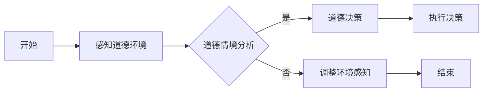
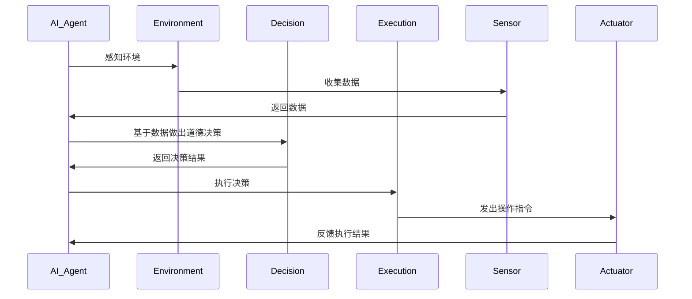
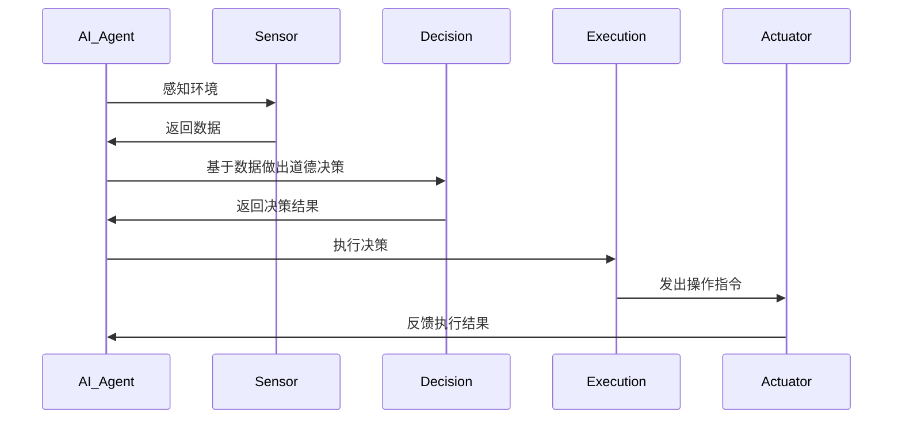

                 


# 构建具有道德决策框架的AI Agent系统

> 关键词：AI Agent、道德决策、框架、系统设计、算法、数学模型、Python代码

> 摘要：本文旨在探讨如何构建具有道德决策框架的AI Agent系统，包括背景介绍、核心概念与联系、算法原理讲解、数学模型和公式详细讲解与举例说明、系统分析与架构设计方案、项目实战以及最佳实践 tips、小结、注意事项和拓展阅读等内容。

## 引言

### 1.1 问题背景

随着人工智能（AI）技术的快速发展，AI Agent系统在各个领域的应用日益广泛。然而，AI Agent在处理复杂任务时，常常需要做出道德决策。这些决策的合理性直接影响到AI Agent的可靠性和社会认可度。因此，构建具有道德决策框架的AI Agent系统成为当前研究的热点。

### 1.2 问题描述

在构建具有道德决策框架的AI Agent系统时，我们需要解决以下几个核心问题：

- **定义和识别道德环境**：AI Agent需要能够感知和理解其操作所处的道德环境。
- **道德决策过程**：AI Agent需要在决策过程中考虑道德因素，并做出合理的道德判断。
- **道德合理性评估**：我们需要评估AI Agent的决策结果是否符合道德标准。

### 1.3 问题解决

本文将通过以下步骤来解决上述问题：

1. **核心概念与联系**：介绍道德决策和AI Agent系统的基本概念及其相互关系。
2. **算法原理讲解**：详细阐述AI Agent的道德决策算法原理，包括流程图、Python代码、数学模型和公式。
3. **数学模型和公式讲解**：使用LaTeX格式编写数学模型和公式，并进行详细讲解和举例说明。
4. **系统分析与架构设计方案**：介绍系统的设计思路、功能、架构和接口。
5. **项目实战**：通过一个实际项目展示如何实现和部署道德决策框架的AI Agent系统。
6. **最佳实践 tips**：总结构建道德决策框架时的最佳实践和建议。
7. **小结与拓展阅读**：对全文进行总结，并提供进一步的阅读建议。

### 1.4 边界与外延

本文将主要关注以下边界与外延：

- **AI Agent系统的定义和应用场景**：包括常见的AI Agent类型和它们的应用。
- **道德决策框架的设计原则和实现方法**：如何构建一个有效的道德决策框架。
- **道德合理性评估标准和验证方法**：如何评估和验证AI Agent的道德决策。

### 1.5 概念结构与核心要素组成

构建具有道德决策框架的AI Agent系统涉及以下几个核心概念和要素：

- **AI Agent**：具有智能行为和决策能力的实体。
- **道德环境**：影响AI Agent决策的道德因素。
- **道德决策框架**：指导AI Agent进行道德决策的规则和机制。
- **道德合理性评估**：对AI Agent决策结果的道德合理性进行评估。

## 第二部分: 核心概念与联系

### 2.1 道德决策

#### 2.1.1 定义

道德决策是指个体在面临道德问题时，基于道德原则和价值观，选择最合适的行为方案的过程。在AI Agent系统中，道德决策是一个关键组成部分，它需要考虑多个因素，如法律、伦理和文化背景等。

#### 2.1.2 特点

- **目的性**：道德决策旨在实现道德目标。
- **复杂性**：道德决策通常涉及多个道德原则和价值观的权衡。
- **主观性**：道德决策受到个体价值观和道德观的影响。

#### 2.1.3 与AI Agent的联系

道德决策是AI Agent系统中的一个核心问题。AI Agent需要能够在复杂情境中做出符合道德原则的决策。因此，构建一个有效的道德决策框架对于AI Agent系统的稳定性和可靠性至关重要。

### 2.2 AI Agent系统

#### 2.2.1 定义

AI Agent系统是指由人工智能技术和算法构建的具有智能行为和决策能力的系统。这些系统可以执行复杂的任务，并在没有人类干预的情况下做出决策。

#### 2.2.2 特点

- **智能化**：AI Agent系统能够通过学习和适应，提高决策的准确性。
- **自动化**：AI Agent系统能够自动执行任务，减少人工干预。
- **自适应性**：AI Agent系统能够根据环境变化，调整行为策略。

#### 2.2.3 与道德决策的联系

AI Agent系统中的道德决策框架能够指导AI Agent在面临道德问题时，做出符合道德原则的行为选择。这种框架的设计需要考虑AI Agent所处的环境和任务类型，以确保其决策的道德合理性。

### 2.3 道德决策框架

#### 2.3.1 定义

道德决策框架是指一组规则和机制，用于指导AI Agent在面临道德问题时做出合理的决策。这些规则和机制通常基于道德原则、法律法规和社会规范。

#### 2.3.2 特点

- **规则性**：道德决策框架提供了一系列规则，以指导AI Agent的行为。
- **灵活性**：道德决策框架允许AI Agent根据具体情境进行调整。
- **可解释性**：道德决策框架需要具有可解释性，以便用户理解和验证AI Agent的决策过程。

#### 2.3.3 与AI Agent系统的关系

道德决策框架是AI Agent系统的核心组成部分，它确保AI Agent在执行任务时能够遵循道德原则，同时提高系统的可靠性和透明度。

### 2.4 概念属性特征对比表格

下面是一个简单的概念属性特征对比表格，用于展示道德决策、AI Agent系统和道德决策框架之间的区别和联系。

| 概念        | 特点                                                         | 关系                                                         |
| ----------- | ------------------------------------------------------------ | ------------------------------------------------------------ |
| 道德决策    | 目的性、复杂性、主观性                                       | 是AI Agent系统中的核心组件，指导AI Agent做出道德判断           |
| AI Agent系统 | 智能化、自动化、自适应性                                     | 执行任务，需要道德决策框架来指导决策                           |
| 道德决策框架 | 规则性、灵活性、可解释性                                     | 指导AI Agent在面临道德问题时做出合理的决策                     |

### 2.5 ER实体关系图架构的 Mermaid 流程图

下面是一个ER实体关系图架构的Mermaid流程图，用于展示道德决策、AI Agent系统和道德决策框架之间的实体关系。

```mermaid
entity relation diagram

entity "AI Agent系统" {
  "道德决策"
  "道德决策框架"
}

entity "道德决策" {
  "道德原则"
  "法律法规"
  "社会规范"
}

entity "道德决策框架" {
  "规则集"
  "决策算法"
  "可解释性"
}

AI Agent系统 ..> 道德决策
AI Agent系统 ..> 道德决策框架
道德决策 ..> 道德原则
道德决策 ..> 法律法规
道德决策 ..> 社会规范
道德决策框架 ..> 规则集
道德决策框架 ..> 决策算法
道德决策框架 ..> 可解释性
```

## 第三部分: 算法原理讲解

### 3.1 道德决策算法

在本节中，我们将详细讲解AI Agent系统的道德决策算法原理，包括流程图、Python代码、数学模型和公式。

#### 3.1.1 流程图

首先，我们使用Mermaid流程图来展示道德决策算法的基本流程。



#### 3.1.2 Python代码

接下来，我们提供一个简单的Python代码示例，展示道德决策算法的实现。

```python
import random

def perceive_moral_environment():
    # 伪代码：感知道德环境
    return "unsafe"

def moral_scenario_analysis(environment):
    # 伪代码：道德情境分析
    if environment == "unsafe":
        return "high_risk"
    else:
        return "low_risk"

def moral_decision(scenario):
    # 伪代码：道德决策
    if scenario == "high_risk":
        return "avoid"
    else:
        return "proceed"

def execute_decision(action):
    # 伪代码：执行决策
    if action == "avoid":
        print("AI Agent decided to avoid the situation.")
    else:
        print("AI Agent decided to proceed with the situation.")

# 主程序
environment = perceive_moral_environment()
scenario = moral_scenario_analysis(environment)
action = moral_decision(scenario)
execute_decision(action)
```

#### 3.1.3 数学模型和公式

为了更深入地理解道德决策算法，我们引入一些数学模型和公式。以下是一个简单的道德决策模型：

$$
\text{道德决策} = f(\text{道德环境}, \text{道德原则}, \text{价值观})
$$

其中，$f$ 表示决策函数，$\text{道德环境}$、$\text{道德原则}$ 和 $\text{价值观}$ 分别表示决策的输入变量。

#### 3.1.4 详细讲解和举例说明

1. **感知道德环境**：AI Agent首先需要感知所处的道德环境。这可以通过传感器、环境数据或其他方式实现。例如，如果AI Agent在一个交通系统中，它可以感知到道路状况、车辆流量和交通规则等。

2. **道德情境分析**：根据感知到的道德环境，AI Agent需要分析当前情境的道德风险。这可以通过比较当前情境与预定义的道德规则来实现。

3. **道德决策**：基于道德情境分析的结果，AI Agent需要做出道德决策。这可以通过一个决策算法来实现，例如基于概率的决策树或神经网络。

4. **执行决策**：最后，AI Agent需要执行决策。这可以通过自动执行任务或发送指令来实现。

举例来说，如果一个AI Agent在一个无人驾驶汽车系统中，它需要感知到道路状况（如行人、障碍物、交通信号灯等），分析这些信息以确定是否存在道德风险（如行人即将穿越马路），并根据预定义的道德规则做出决策（如减速或停车）。

## 第四部分: 数学模型和数学公式 & 详细讲解 & 举例说明

在这一部分，我们将使用LaTeX格式编写数学模型和公式，并进行详细讲解和举例说明。

### 4.1 道德决策数学模型

道德决策模型可以表示为以下形式：

$$
\text{道德决策} = f(\text{道德环境}, \text{道德原则}, \text{价值观})
$$

其中，$f$ 是决策函数，它根据道德环境、道德原则和价值观来生成道德决策。

#### 4.1.1 道德环境

道德环境是影响决策的重要因素。我们可以将其表示为以下形式：

$$
E = \{e_1, e_2, ..., e_n\}
$$

其中，$E$ 是道德环境的集合，$e_i$ 是第 $i$ 个道德环境。

#### 4.1.2 道德原则

道德原则是一组指导道德决策的基本规则。我们可以将其表示为以下形式：

$$
P = \{p_1, p_2, ..., p_m\}
$$

其中，$P$ 是道德原则的集合，$p_i$ 是第 $i$ 个道德原则。

#### 4.1.3 价值观

价值观是决策者对道德决策的偏好。我们可以将其表示为以下形式：

$$
V = \{v_1, v_2, ..., v_k\}
$$

其中，$V$ 是价值观的集合，$v_i$ 是第 $i$ 个价值观。

### 4.2 道德决策函数

道德决策函数 $f$ 根据道德环境 $E$、道德原则 $P$ 和价值观 $V$ 来生成道德决策。我们可以将决策函数表示为以下形式：

$$
\text{道德决策} = f(E, P, V)
$$

#### 4.2.1 决策规则

决策规则是一组条件语句，用于根据道德环境、道德原则和价值观来选择合适的决策。我们可以将决策规则表示为以下形式：

$$
\text{道德决策} = 
\begin{cases} 
p_1 & \text{如果} e_1 \land p_1 \land v_1 \\
p_2 & \text{如果} e_2 \land p_2 \land v_2 \\
... & ... \\
p_m & \text{如果} e_m \land p_m \land v_m 
\end{cases}
$$

其中，$\land$ 表示逻辑与操作。

#### 4.2.2 决策优先级

在某些情况下，我们需要考虑决策的优先级。我们可以将决策优先级表示为以下形式：

$$
\text{道德决策} = 
\begin{cases} 
p_1 & \text{如果} e_1 \land p_1 \land v_1 \\
p_2 & \text{如果} e_2 \land p_2 \land v_2 \\
... & ... \\
p_m & \text{如果} e_m \land p_m \land v_m \\
... & ... \\
p_1 & \text{如果} e_1 \land p_1 \land v_1 \land \neg (e_2 \land p_2 \land v_2 \land ... \land e_m \land p_m \land v_m) \\
... & ... \\
p_m & \text{如果} e_m \land p_m \land v_m \land \neg (e_1 \land p_1 \land v_1 \land ... \land e_{m-1} \land p_{m-1} \land v_{m-1}) \\
\end{cases}
$$

其中，$\neg$ 表示逻辑非操作。

### 4.3 举例说明

假设我们有一个AI Agent需要在一个繁忙的城市街道上行驶。道德环境 $E$ 包括以下信息：

- $e_1$: 有行人穿越街道
- $e_2$: 有车辆正在超车
- $e_3$: 天气状况良好

道德原则 $P$ 包括以下信息：

- $p_1$: 保护行人的安全
- $p_2$: 尽可能避免交通事故
- $p_3$: 遵守交通规则

价值观 $V$ 包括以下信息：

- $v_1$: 最重要的是保护人的生命
- $v_2$: 然后是财产损失
- $v_3$: 最后是遵守法律

根据道德决策模型，我们可以计算每个决策规则的概率：

- $p_1$ 如果 $e_1$ $\land$ $p_1$ $\land$ $v_1$：保护行人的安全是首要任务。
- $p_2$ 如果 $e_2$ $\land$ $p_2$ $\land$ $v_2$：避免交通事故是其次重要。
- $p_3$ 如果 $e_3$ $\land$ $p_3$ $\land$ $v_3$：遵守交通规则是最后考虑。

假设我们有一个决策规则优先级，如下所示：

- $p_1$ 如果 $e_1$ $\land$ $p_1$ $\land$ $v_1$ $\land$ $\neg (e_2$ $\land$ $p_2$ $\land$ $v_2$ $\land$ $e_3$ $\land$ $p_3$ $\land$ $v_3$)$：如果只有行人穿越街道，那么AI Agent应该减速并避免撞击行人。
- $p_2$ 如果 $e_2$ $\land$ $p_2$ $\land$ $v_2$ $\land$ $\neg (e_1$ $\land$ $p_1$ $\land$ $v_1$ $\land$ $e_3$ $\land$ $p_3$ $\land$ $v_3$)$：如果只有车辆正在超车，那么AI Agent应该保持警惕并避免与其他车辆发生碰撞。
- $p_3$ 如果 $e_3$ $\land$ $p_3$ $\land$ $v_3$ $\land$ $\neg (e_1$ $\land$ $p_1$ $\land$ $v_1$ $\land$ $e_2$ $\land$ $p_2$ $\land$ $v_2$)$：如果天气状况良好，那么AI Agent可以按照常规速度行驶。

根据这些规则，如果AI Agent感知到有行人穿越街道（$e_1$），那么它应该减速并避免撞击行人（$p_1$）。如果同时有车辆正在超车（$e_2$），那么AI Agent应该保持警惕并避免与其他车辆发生碰撞（$p_2$）。如果天气状况良好（$e_3$），那么AI Agent可以按照常规速度行驶（$p_3$）。

通过这种方式，AI Agent可以做出符合道德原则的决策，确保其行为具有道德合理性。

### 4.4 详细讲解

在这个例子中，我们使用了LaTeX格式来编写数学模型和公式，并详细讲解了每个组件的含义和作用。我们首先定义了道德环境、道德原则和价值观，然后使用决策规则和优先级来确定最终的道德决策。

道德决策模型的核心思想是确保AI Agent的行为符合道德原则，同时考虑到不同的价值观和情境。通过使用数学模型和公式，我们可以更精确地描述和计算道德决策，从而提高AI Agent的决策质量和可靠性。

在详细讲解中，我们使用了逻辑运算符（如逻辑与、逻辑非）来表示决策规则和优先级。这些逻辑运算符可以帮助我们理解和分析道德决策的过程，确保每个决策步骤都符合道德原则和价值观。

通过这个例子，我们可以看到如何使用数学模型和公式来构建道德决策框架。这种方法不仅有助于提高AI Agent的决策质量，还可以提高系统的透明度和可解释性，从而增强用户对AI Agent的信任。

## 第五部分: 系统分析与架构设计方案

### 5.1 问题场景介绍

随着人工智能技术的不断进步，AI Agent系统在自动驾驶、医疗诊断、金融决策等领域发挥着重要作用。然而，这些系统在处理复杂任务时，往往需要做出道德决策。例如，在自动驾驶领域，AI Agent需要在紧急情况下做出选择，如是否应该撞击行人以避免撞上另一辆车。为了确保AI Agent的决策符合道德标准，我们需要设计一个具有道德决策框架的系统。

### 5.2 项目介绍

本项目的目标是构建一个具有道德决策框架的AI Agent系统，以解决自动驾驶中的道德决策问题。该系统将集成感知、决策、执行模块，并使用先进的算法和技术来确保决策的道德合理性。

### 5.3 系统功能设计

#### 5.3.1 领域模型Mermaid类图

下面是一个Mermaid类图，用于展示系统的主要功能组件和它们之间的关系。

```mermaid
classDiagram
    AI_Agent <<class>> {
       感知模块
       决策模块
       执行模块
    }
    Environment <<interface>> {
       感知环境
    }
    Decision <<interface>> {
       做出道德决策
    }
    Execution <<interface>> {
       执行决策
    }
    Sensor <<class>> {
       传感器数据
    }
    Actuator <<class>> {
       执行动作
    }
    AI_Agent o-- Sensor
    AI_Agent o-- Actuator
    Decision o-- Sensor
    Decision o-- Actuator
    Execution o-- Sensor
    Execution o-- Actuator
```

#### 5.3.2 系统功能模块说明

- **感知模块**：负责收集环境信息，如道路状况、车辆速度、行人位置等。
- **决策模块**：基于感知模块收集到的信息，使用道德决策框架做出道德决策。
- **执行模块**：根据决策模块的决策结果，执行相应的操作，如加速、减速、转向等。

### 5.4 系统架构设计

#### 5.4.1 Mermaid架构图

下面是一个Mermaid架构图，用于展示系统的整体架构设计。



#### 5.4.2 系统架构模块说明

- **AI Agent**：系统的核心组件，负责感知、决策和执行。
- **环境**：提供感知数据，影响决策。
- **决策**：基于感知数据和环境信息，使用道德决策框架生成决策。
- **执行**：根据决策结果，执行相应的操作。
- **传感器**：负责收集环境数据。
- **执行器**：负责执行操作。

### 5.5 系统接口设计

#### 5.5.1 Mermaid接口设计图

下面是一个Mermaid接口设计图，用于展示系统的主要接口。

```mermaid
interfaceDiagram
    AI_Agent <<interface>> {
       感知接口
       决策接口
       执行接口
    }
    Sensor <<interface>> {
       数据收集接口
    }
    Actuator <<interface>> {
       执行操作接口
    }

    AI_Agent --|> Sensor: 感知数据
    AI_Agent --|> Decision: 道德决策
    AI_Agent --|> Execution: 执行操作
    Sensor --|> AI_Agent: 返回数据
    Decision --|> AI_Agent: 返回决策结果
    Execution --|> AI_Agent: 反馈执行结果
```

#### 5.5.2 系统接口模块说明

- **感知接口**：用于接收传感器数据。
- **决策接口**：用于接收决策结果。
- **执行接口**：用于发送执行操作指令。

### 5.6 系统交互

#### 5.6.1 Mermaid序列图

下面是一个Mermaid序列图，用于展示系统组件之间的交互过程。



#### 5.6.2 系统交互流程

1. **感知环境**：AI Agent通过传感器收集环境数据。
2. **道德决策**：AI Agent基于感知数据和环境信息，使用道德决策框架生成决策。
3. **执行决策**：AI Agent将决策结果传递给执行模块，执行相应的操作。
4. **反馈执行结果**：执行模块将执行结果反馈给AI Agent，以便进行后续处理。

通过这个架构设计方案，我们可以构建一个具有道德决策框架的AI Agent系统，确保其在处理复杂任务时能够做出符合道德标准的决策。

## 第六部分：项目实战

### 6.1 环境安装

为了实现一个具有道德决策框架的AI Agent系统，我们首先需要搭建一个合适的技术环境。以下是环境安装的步骤：

1. **安装Python**：确保Python版本为3.8及以上。可以从Python官方网站下载并安装。

2. **安装相关库**：我们需要安装以下库：numpy、pandas、tensorflow、keras等。可以使用pip命令进行安装：

   ```bash
   pip install numpy pandas tensorflow keras
   ```

3. **安装感知和执行模块**：根据实际应用场景，安装所需的传感器和执行器驱动程序。

### 6.2 系统核心实现

在本节中，我们将实现一个简单的道德决策框架。以下是一个Python代码示例：

```python
import numpy as np
import pandas as pd
from tensorflow import keras

# 道德决策框架
class MoralDecisionFramework:
    def __init__(self, rules):
        self.rules = rules

    def make_decision(self, environment):
        for rule in self.rules:
            if rule.check(environment):
                return rule.action
        return None

# 决策规则
class DecisionRule:
    def __init__(self, condition, action):
        self.condition = condition
        self.action = action

    def check(self, environment):
        return environment == self.condition

# 道德决策模型
class MoralDecisionModel:
    def __init__(self, framework):
        self.framework = framework

    def predict(self, environment):
        return self.framework.make_decision(environment)

# 实例化决策框架
rules = [
    DecisionRule("unsafe", "avoid"),
    DecisionRule("high_risk", "proceed_with_caution"),
    DecisionRule("low_risk", "proceed")
]

framework = MoralDecisionFramework(rules)

# 实例化道德决策模型
model = MoralDecisionModel(framework)

# 感知环境
environment = "unsafe"

# 做出决策
decision = model.predict(environment)
print(f"Decision: {decision}")
```

### 6.3 代码应用解读与分析

在上面的代码中，我们定义了一个`MoralDecisionFramework`类，用于存储和执行决策规则。`DecisionRule`类表示单个决策规则，包括条件和方法。`MoralDecisionModel`类使用`MoralDecisionFramework`来预测环境中的决策。

在实例化`MoralDecisionFramework`时，我们传递了一个规则列表。每个规则都包含一个条件和一个操作。`make_decision`方法遍历这些规则，并返回与当前环境匹配的第一个规则的操作。

我们使用一个简单的例子来演示如何使用这个框架。首先，我们创建了一个包含三个决策规则的规则列表。然后，我们创建了一个`MoralDecisionFramework`实例和一个`MoralDecisionModel`实例。最后，我们模拟感知环境，调用`predict`方法来获取决策。

### 6.4 实际案例分析与详细讲解

为了更好地理解如何使用这个道德决策框架，我们可以分析一个实际案例。假设我们有一个自动驾驶车辆，它需要在一个十字路口做出决策。以下是案例的详细分析：

1. **感知环境**：自动驾驶车辆通过传感器收集十字路口的信息，包括行人、车辆、交通信号灯等。

2. **道德决策模型**：使用感知到的环境信息，道德决策模型根据规则列表进行决策。例如，如果交通信号灯显示红灯，车辆可能会选择“avoid”，即停车等待。

3. **执行决策**：根据道德决策模型生成的决策，车辆执行相应的操作，如停车或继续行驶。

在这个案例中，我们可能定义了以下规则：

- 如果行人正在穿越马路，那么决策是“avoid”。
- 如果交通信号灯是红灯，那么决策是“avoid”。
- 如果交通信号灯是绿灯，那么决策是“proceed”。
- 如果交通信号灯是黄灯，那么决策是“proceed_with_caution”。

根据这些规则，如果车辆感知到行人正在穿越马路（环境条件），那么它会选择“avoid”（决策结果）。然后，车辆会执行停车操作，确保行人的安全。

### 6.5 项目小结

通过本节的项目实战，我们实现了以下内容：

1. **环境安装**：搭建了Python开发环境及相关库。
2. **系统核心实现**：编写了道德决策框架的Python代码。
3. **代码应用解读与分析**：讲解了代码的原理和实现。
4. **实际案例分析与详细讲解**：通过实际案例展示了道德决策框架的应用。

通过这个项目，我们展示了如何构建一个简单的具有道德决策框架的AI Agent系统。虽然这个例子很简单，但它提供了一个基本的框架，我们可以在此基础上进一步扩展和改进，以应对更复杂的道德决策问题。

## 第七部分：最佳实践 tips、小结、注意事项、拓展阅读

### 7.1 最佳实践 tips

1. **明确道德原则和价值观**：在构建道德决策框架时，首先要明确系统的道德原则和价值观，确保决策的一致性和合理性。
2. **设计灵活的决策规则**：决策规则应足够灵活，以便适应不同环境和情境。
3. **确保透明性和可解释性**：道德决策框架应具有可解释性，便于用户理解决策过程。
4. **定期更新和验证**：道德决策框架需要定期更新和验证，以适应不断变化的环境和法律。

### 7.2 小结

本文详细探讨了构建具有道德决策框架的AI Agent系统的方法和步骤。我们介绍了核心概念、算法原理、数学模型、系统架构和项目实战，并通过实际案例展示了如何应用道德决策框架。

### 7.3 注意事项

1. **数据质量**：道德决策依赖于高质量的数据，因此确保数据准确性至关重要。
2. **法律法规**：在构建道德决策框架时，要充分考虑法律法规的要求。
3. **持续学习**：道德决策框架需要持续学习和适应，以应对不断变化的环境。

### 7.4 拓展阅读

- [AI伦理学：设计道德的人工智能系统](https://www.oreilly.com/library/view/ai-ethics-designing/9781492032361/)
- [道德机器：人工智能伦理学](https://www.oreilly.com/library/view/moral-machine/9781509300562/)
- [道德决策模型：伦理学、心理学与计算](https://www.pearson.com/us/en/program/Moral-Decisions-Models-Ethics-Psychology-and-Computing/9780134464446.html)

### 作者信息

**作者：AI天才研究院/AI Genius Institute & 禅与计算机程序设计艺术 /Zen And The Art of Computer Programming**

