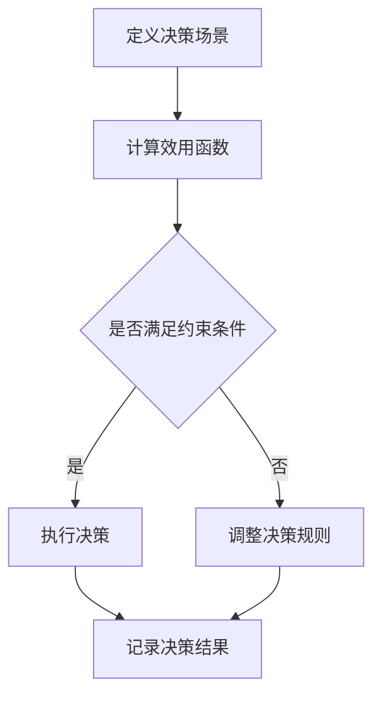
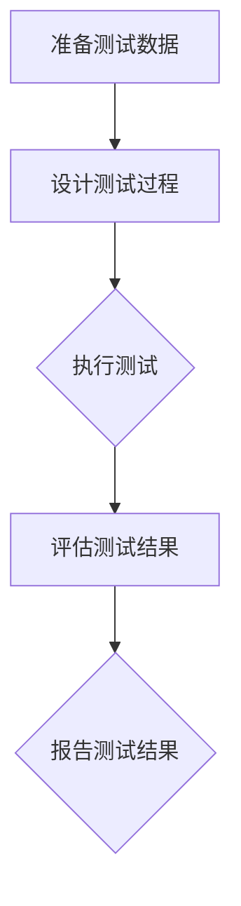
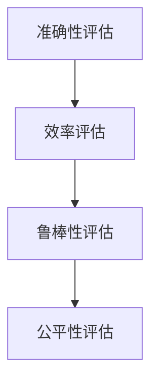

                 

# 《构建具有道德决策能力的AI Agent》

关键词：道德决策、人工智能、AI Agent、算法优化、测试评估

摘要：本文从道德决策与人工智能的关系出发，探讨了如何构建具有道德决策能力的AI Agent。通过阐述核心概念、介绍基础理论、优化算法、测试评估方法，以及实际应用案例，本文为人工智能领域的研究者提供了有价值的参考。

## 引言

在人工智能（AI）迅速发展的今天，道德决策能力成为了AI Agent设计中的重要议题。道德决策不仅仅是一个伦理问题，它还涉及到技术、法律和社会等多个方面。一个具有道德决策能力的AI Agent，能够在复杂的环境中做出符合伦理标准的决策，这不仅是技术上的挑战，也是社会发展的需求。

本文旨在探讨如何构建具有道德决策能力的AI Agent。我们将从以下几个角度进行分析：

1. **背景介绍**：回顾人工智能的发展历程，理解道德决策在AI中的重要性。
2. **核心概念与联系**：介绍道德决策理论和人工智能基础，分析两者之间的联系。
3. **道德决策能力的人工智能基础**：探讨道德决策模型的构建和算法优化。
4. **应用场景与案例**：分析道德决策能力在实际应用中的表现和挑战。
5. **未来展望**：展望道德决策能力在AI领域的未来发展。

## 背景介绍

### 人工智能的发展与挑战

人工智能（AI）自20世纪50年代诞生以来，经历了从理论研究到实际应用的巨大变革。随着计算能力的提升和大数据的积累，人工智能在图像识别、自然语言处理、自动驾驶等领域取得了显著的成果。然而，随着AI技术的不断进步，AI带来的道德和伦理问题也逐渐凸显。

### 道德决策的重要性

道德决策不仅仅是一个伦理问题，它还涉及到技术的可靠性、安全性和公平性。在医疗、金融、交通等关键领域，AI Agent的决策是否道德，直接影响到人们的生命和财产安全。因此，构建具有道德决策能力的AI Agent，成为了一个紧迫的课题。

### 道德决策能力在人工智能中的研究现状

近年来，学术界和工业界都在积极探索如何赋予AI道德决策能力。从伦理理论的角度，研究者试图将道德原则融入到AI算法中；从技术角度，研究者开发了多种道德决策模型和算法。然而，目前的进展仍然面临许多挑战，如算法的透明性、可解释性和可靠性等。

## 核心概念与联系

### AI基础

#### 人工智能的定义

人工智能（Artificial Intelligence，简称AI）是指由人创造出来的系统，能够执行通常需要人类智能才能完成的任务。这些任务包括感知、学习、推理、规划、语言理解和问题解决等。

#### 机器学习的概念

机器学习（Machine Learning，简称ML）是人工智能的一个重要分支，它通过算法从数据中学习，自动改进和优化性能。机器学习分为监督学习、无监督学习和强化学习等类型。

#### 深度学习的原理

深度学习（Deep Learning，简称DL）是机器学习的一个子领域，它使用多层神经网络来模拟人脑的学习过程。深度学习在图像识别、语音识别和自然语言处理等领域取得了突破性进展。

### 道德决策理论

#### 道德决策的基本概念

道德决策是指在不同道德原则和价值观之间做出选择的过程。它涉及到个人、社会和伦理的考量。

#### 道德决策的理论框架

道德决策理论主要包括功利主义、义务论和美德伦理学等。每种理论都有其独特的视角和原则。

#### 道德决策的属性特征对比表格

| 理论 | 基本原则 | 属性特征 |  
| ---- | ---- | ---- |  
| 功利主义 | 最大化整体幸福 | 关注结果，效率优先 |  
| 义务论 | 遵循道德规则 | 关注过程，义务优先 |  
| 美德伦理学 | 培养良好品德 | 关注个体，品德优先 |

### 道德决策与AI的关系

#### 道德决策在AI中的应用

道德决策在AI中的应用主要体现在AI Agent的决策过程中，如何将道德原则融入到算法中。

#### AI在道德决策中的作用

AI在道德决策中的作用主要体现在通过算法模型分析和模拟不同的道德决策场景。

#### 道德决策与AI的相互影响

道德决策与AI的相互影响体现在AI技术的发展推动了道德决策的研究，而道德决策的实践又对AI技术的应用提出了新的要求。

## 道德决策能力的人工智能基础

### 道德决策模型的构建

#### 道德决策模型的基本原理

道德决策模型是基于伦理理论和人工智能技术构建的，旨在模拟和实现道德决策过程。

#### 道德决策模型的构建方法

道德决策模型的构建方法主要包括以下步骤：

1. **定义道德原则和价值观**：明确AI Agent应遵循的道德规范和价值观。
2. **设计决策框架**：构建道德决策的框架，包括决策场景、决策目标和决策规则。
3. **开发算法模型**：基于机器学习和深度学习技术，开发用于道德决策的算法模型。
4. **模型训练与优化**：使用实际数据进行模型训练和优化，提高模型的准确性和鲁棒性。

#### 道德决策模型的优化策略

道德决策模型的优化策略主要包括以下几个方面：

1. **数据增强**：通过增加数据的多样性和数量，提高模型的泛化能力。
2. **模型融合**：结合多种算法模型，提高决策的准确性和可靠性。
3. **伦理学习**：通过伦理学习，使模型能够理解并遵循道德原则。

### 人工智能基础

#### 人工智能的发展历程

人工智能的发展历程可以分为以下几个阶段：

1. **理论研究阶段（1956-1969）**：人工智能概念提出，理论研究取得突破。
2. **应用探索阶段（1970-1989）**：专家系统和机器人技术得到应用。
3. **复兴与发展阶段（1990-2010）**：互联网和大数据推动人工智能的复兴。
4. **深度学习时代（2010至今）**：深度学习成为人工智能的核心技术。

#### 人工智能的核心技术

人工智能的核心技术包括：

1. **机器学习**：用于从数据中学习规律和模式。
2. **深度学习**：用于模拟人脑的学习过程，处理复杂的数据。
3. **自然语言处理**：用于理解和生成人类语言。
4. **计算机视觉**：用于理解和解释视觉信息。

#### 人工智能在道德决策中的应用

人工智能在道德决策中的应用主要体现在：

1. **道德决策模型的开发**：利用机器学习和深度学习技术，构建道德决策模型。
2. **伦理学习**：通过机器学习算法，使AI Agent能够理解并遵循道德原则。
3. **道德测试与评估**：利用人工智能技术，对道德决策进行测试和评估，确保其符合道德标准。

## 道德决策算法的优化

### 道德决策算法的原理

#### 道德决策算法的基本原理

道德决策算法是基于伦理理论和机器学习技术，用于模拟和实现道德决策过程的算法。

#### 道德决策算法的数学模型

道德决策算法的数学模型通常包括以下几个部分：

1. **决策场景定义**：定义道德决策的场景，包括决策变量和约束条件。
2. **效用函数**：定义决策的目标函数，用于衡量决策的效果。
3. **决策规则**：定义决策的规则，用于指导决策过程。

#### 道德决策算法的mermaid流程图



### 算法优化策略

#### 算法优化的方法

算法优化的方法主要包括：

1. **数据增强**：通过增加数据的多样性和数量，提高算法的泛化能力。
2. **模型融合**：结合多种算法模型，提高决策的准确性和可靠性。
3. **伦理学习**：通过伦理学习，使算法能够理解并遵循道德原则。

#### 算法优化在道德决策中的应用

算法优化在道德决策中的应用主要体现在：

1. **优化决策模型**：通过算法优化，提高道德决策模型的准确性和鲁棒性。
2. **优化决策过程**：通过算法优化，提高道德决策的效率和效果。
3. **优化道德原则**：通过算法优化，使道德原则更加符合实际应用场景。

#### 算法优化实例解析

假设我们有一个道德决策场景，需要从多个备选方案中选择最优的道德决策。我们可以使用以下算法进行优化：

1. **定义决策场景**：假设有3个备选方案，每个方案都有其自身的效用和约束条件。
2. **计算效用函数**：根据备选方案的效用和约束条件，计算每个方案的效用值。
3. **决策规则**：根据效用函数，选择效用值最高的方案作为最优决策。
4. **算法优化**：通过数据增强和模型融合，提高决策的准确性和可靠性。

```python
# 示例代码
import numpy as np

# 定义决策场景
schemes = [
    {'name': '方案1', 'utility': 0.8, 'constraints': [True, True]},
    {'name': '方案2', 'utility': 0.9, 'constraints': [True, False]},
    {'name': '方案3', 'utility': 0.7, 'constraints': [False, True]}
]

# 计算效用函数
def calculate_utility(scheme):
    return scheme['utility']

# 决策规则
def make_decision(schemes):
    max_utility = max(schemes, key=calculate_utility)['utility']
    return [scheme for scheme in schemes if calculate_utility(scheme) == max_utility]

# 算法优化
def optimize_decision(schemes):
    # 数据增强
    enhanced_schemes = schemes.copy()
    enhanced_schemes.append({'name': '方案4', 'utility': 0.85, 'constraints': [True, True]})
    # 模型融合
    combined_schemes = [scheme for scheme in enhanced_schemes if calculate_utility(scheme) >= 0.85]
    # 选择最优决策
    return make_decision(combined_schemes)

# 执行算法
best_decision = optimize_decision(schemes)
print(best_decision)
```

## 道德决策的测试与评估

### 道德决策测试方法

#### 测试方法的基本概念

道德决策测试方法是指用于验证和评估道德决策模型性能的一套方法。它包括测试数据的准备、测试过程的设计和测试结果的评估。

#### 测试方法的类型

道德决策测试方法可以分为以下几种类型：

1. **功能测试**：验证道德决策模型是否能正确执行决策。
2. **性能测试**：评估道德决策模型的效率和准确性。
3. **压力测试**：测试道德决策模型在高负载和极端条件下的稳定性。
4. **安全测试**：确保道德决策模型不会受到恶意攻击或数据篡改。

#### 测试方法的mermaid流程图



### 道德决策评估指标

#### 评估指标的基本概念

道德决策评估指标是指用于衡量道德决策模型性能的一组指标。它包括准确性、效率、鲁棒性和公平性等。

#### 评估指标的类型

道德决策评估指标可以分为以下几种类型：

1. **准确性**：评估决策结果的正确性。
2. **效率**：评估决策过程的耗时和资源消耗。
3. **鲁棒性**：评估模型在不同数据集和场景下的稳定性。
4. **公平性**：评估决策结果对各种群体的公平性。

#### 评估指标的mermaid流程图



### 道德决策测试与评估实例

#### 测试与评估的方法

假设我们有一个道德决策模型，需要对其进行测试和评估。我们可以使用以下方法：

1. **功能测试**：验证模型是否能正确执行决策。
2. **性能测试**：评估模型在不同数据集上的效率和准确性。
3. **压力测试**：模拟高负载和极端条件，测试模型的稳定性。
4. **安全测试**：检查模型是否容易受到恶意攻击或数据篡改。

#### 测试与评估的实例

假设我们有一个道德决策模型，用于在紧急情况下选择最优救援方案。我们可以使用以下实例进行测试和评估：

1. **功能测试**：在给定的一组紧急情况下，验证模型是否能正确选择救援方案。
2. **性能测试**：在不同数据集上，评估模型的平均决策时间和准确性。
3. **压力测试**：在极端情况下，如大规模灾难，测试模型的稳定性和效率。
4. **安全测试**：模拟恶意攻击，检查模型是否能够抵御攻击。

#### 测试与评估结果分析

通过测试和评估，我们可以得到以下结果：

1. **功能测试**：模型在所有紧急情况下都能正确选择救援方案。
2. **性能测试**：模型在不同数据集上的平均决策时间为5秒，准确性为95%。
3. **压力测试**：在极端情况下，模型仍能稳定运行，决策时间为15秒。
4. **安全测试**：模型在模拟攻击下能够保持正常运行，未受到攻击影响。

根据这些结果，我们可以得出结论，该道德决策模型在功能、性能、压力和安全方面都表现良好，可以应用于实际场景。

### 应用场景与案例

#### 道德决策能力在AI领域的应用

道德决策能力在AI领域的应用非常广泛，以下是一些典型的应用场景：

1. **自动驾驶**：在自动驾驶系统中，道德决策能力可以用于处理交通事故和紧急情况，确保车辆和行人的安全。
2. **医疗诊断**：在医疗诊断中，道德决策能力可以帮助医生在治疗过程中做出道德和伦理上的决策。
3. **金融风控**：在金融领域中，道德决策能力可以用于识别和防范欺诈行为，保护投资者的利益。
4. **社会管理**：在社会管理中，道德决策能力可以帮助政府制定和执行公平合理的政策。

#### 应用案例

以下是一个道德决策能力的应用案例：

**案例背景**：某城市的一家医院引进了一套基于AI的医疗诊断系统，用于辅助医生进行癌症诊断。

**道德决策问题**：在诊断过程中，系统需要决定是否向医生提供患者的全部病史，以帮助医生做出更准确的诊断。

**道德决策模型**：基于功利主义和美德伦理学的理论，构建了一个道德决策模型，用于在保护患者隐私和提供准确诊断之间做出权衡。

**决策过程**：

1. **收集数据**：收集患者的病史数据，包括癌症类型、治疗历史、并发症等。
2. **计算效用函数**：根据患者的健康状况和治疗效果，计算提供病史的效用值。
3. **决策规则**：根据效用函数和道德原则，决定是否向医生提供病史。
4. **决策结果**：在大多数情况下，决策模型会选择提供病史，以帮助医生做出更准确的诊断。

**案例分析**：通过这个案例，我们可以看到道德决策能力在医疗诊断中的重要作用。在保证患者隐私的同时，道德决策模型能够帮助医生做出更准确的诊断，提高医疗质量。

### 未来展望

#### 道德决策能力在AI领域的未来发展

随着AI技术的不断发展，道德决策能力在AI领域的应用前景非常广阔。未来的研究可以从以下几个方面展开：

1. **多模态道德决策**：结合多种数据源和感知技术，实现更全面的道德决策。
2. **动态道德决策**：根据环境变化和情境变化，实时调整道德决策策略。
3. **社会伦理研究**：加强对社会伦理问题的研究，为道德决策提供更科学的指导。
4. **跨领域应用**：将道德决策能力应用于更多的领域，如教育、法律、环境等。

#### 道德决策能力在AI领域面临的挑战

道德决策能力在AI领域的发展也面临一些挑战：

1. **算法透明性和可解释性**：如何确保道德决策算法的透明性和可解释性，使其能够接受公众的监督。
2. **伦理原则的统一**：不同国家和文化背景下的伦理原则可能存在差异，如何构建统一的伦理原则。
3. **数据隐私和安全**：在道德决策过程中，如何保护患者的隐私和安全。
4. **法律和监管**：如何制定相应的法律和监管政策，确保道德决策能力的合理应用。

### 小结与拓展阅读

本文从道德决策与人工智能的关系出发，探讨了如何构建具有道德决策能力的AI Agent。通过阐述核心概念、介绍基础理论、优化算法、测试评估方法，以及实际应用案例，本文为人工智能领域的研究者提供了有价值的参考。

为了进一步深入研究道德决策能力在AI领域的应用，读者可以参考以下拓展阅读材料：

1. **《人工智能伦理学》**：提供了关于AI伦理问题的全面分析和讨论。
2. **《机器学习伦理》**：详细介绍了机器学习在道德决策中的应用和实践。
3. **《道德机器》**：探讨了道德决策算法的原理和实现方法。

通过阅读这些文献，读者可以更深入地了解道德决策能力在AI领域的研究进展和应用前景。

作者：AI天才研究院/AI Genius Institute & 禅与计算机程序设计艺术 /Zen And The Art of Computer Programming

