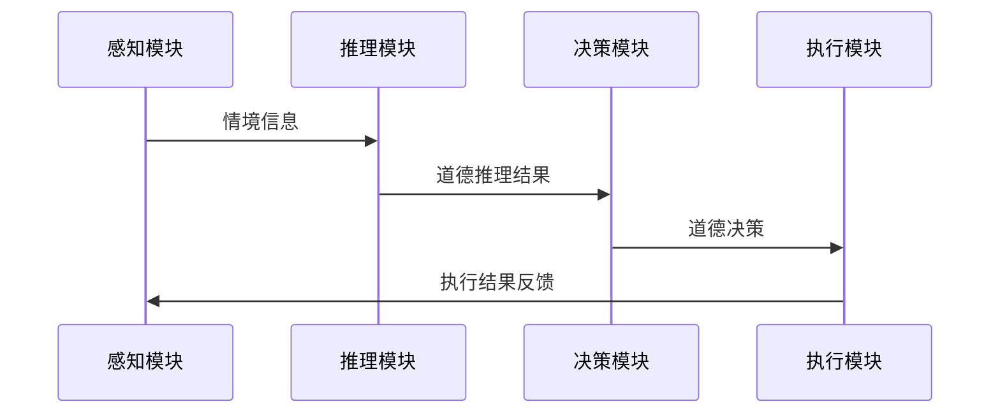
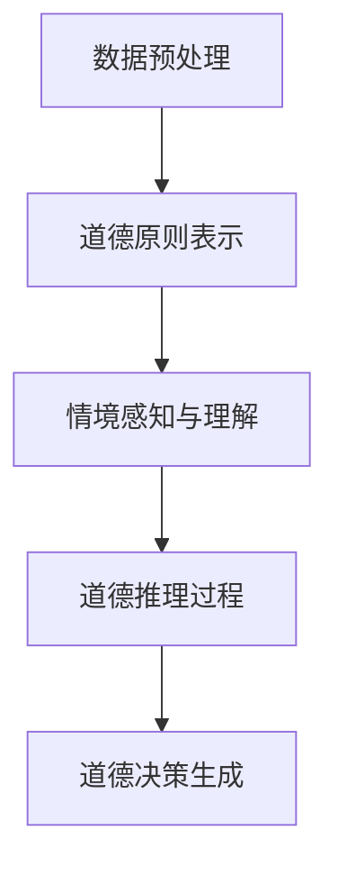
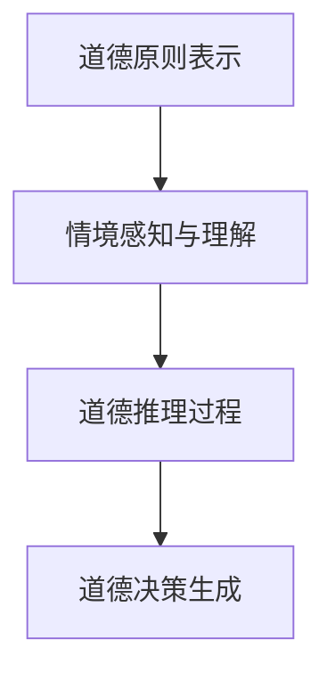

                 


## 《构建具有道德推理能力的AI Agent》

### 关键词：道德推理、AI Agent、人工智能、伦理、算法、系统设计

#### 摘要：
本文深入探讨了构建具有道德推理能力的AI Agent的重要性和实现方法。通过逐步分析道德推理的概念、算法原理、系统设计以及项目实战，文章旨在为读者提供全面而清晰的指南，帮助他们理解和实践这一前沿技术。

### 目录大纲设计思路

#### 1. 确定书的整体框架

首先，我们要明确本书的主要目的和内容结构。本书的核心主题是“构建具有道德推理能力的AI Agent”，因此，书的整体框架将围绕以下几个关键部分展开：

- **背景介绍**：介绍AI发展背景、道德推理能力的概念及其在AI中的应用。
- **核心概念**：详细阐述与道德推理相关的核心概念、属性特征及其相互关系。
- **算法原理**：讲解用于实现道德推理能力的算法原理、数学模型和公式。
- **系统设计**：描述系统分析与架构设计，包括功能设计、架构设计和接口设计。
- **项目实战**：通过实际案例展示道德推理AI Agent的构建过程。
- **最佳实践与总结**：总结书中的重点内容，提供最佳实践建议，指出注意事项和拓展阅读方向。

#### 2. 确定每个章节的主题和内容

在明确书的整体框架后，我们需要进一步细化每个章节的主题和内容，确保内容完整且逻辑清晰。以下是具体的章节划分和内容概述：

### 第一部分: 背景与核心概念

#### 第1章: AI发展背景与道德推理能力
- **1.1 AI发展概述**
  - AI发展历程
  - 道德推理能力的意义

- **1.2 道德推理能力的定义与重要性**
  - 道德推理能力的概念
  - 在AI中的应用场景

- **1.3 AI伦理问题的现状与挑战**
  - 现实中的伦理困境
  - 道德推理能力的必要性

#### 第2章: 道德推理能力的核心概念
- **2.1 道德原则与伦理框架**
  - 常见的道德原则
  - 伦理框架的设计与应用

- **2.2 道德推理过程的模型**
  - 形式化推理模型
  - 非形式化推理模型

- **2.3 道德推理算法的属性特征对比**

### 第二部分: 算法原理与实现

#### 第3章: 道德推理算法原理
- **3.1 道德推理算法概述**
  - 算法类型
  - 算法框架

- **3.2 数学模型与公式**
  - 形式化推理的数学模型
  - 非形式化推理的数学模型

- **3.3 算法实现与流程图**

#### 第4章: 道德推理算法的实现细节
- **4.1 数据预处理**
  - 数据来源
  - 数据清洗与归一化

- **4.2 算法实现步骤**
  - 具体实现流程
  - Python代码示例

### 第三部分: 系统设计与实现

#### 第5章: 道德推理AI Agent系统设计
- **5.1 系统功能设计**
  - 功能模块划分
  - 领域模型类图

- **5.2 系统架构设计**
  - 系统架构概述
  - 架构设计图

- **5.3 系统接口设计**
  - 接口定义与实现
  - 接口交互序列图

#### 第6章: 道德推理AI Agent项目实战
- **6.1 环境安装与配置**
  - 环境搭建步骤
  - 工具与依赖安装

- **6.2 系统核心实现源代码**
  - 代码结构与实现细节
  - 核心算法代码解读

- **6.3 实际案例分析与讲解**
  - 案例选择与描述
  - 案例分析与讲解

### 第四部分: 最佳实践与总结

#### 第7章: 道德推理AI Agent的最佳实践
- **7.1 最佳实践建议**
  - 实践技巧与策略
  - 注意事项

- **7.2 小结与展望**
  - 书中重点内容回顾
  - 未来发展趋势展望

通过以上步骤，我们可以确保《构建具有道德推理能力的AI Agent》的目录大纲内容丰富、逻辑清晰，并满足用户的要求。接下来，我们将按照上述章节进行具体内容的撰写和格式设计。

----------------------------------------------------------------

### 第一部分: 背景与核心概念

#### 第1章: AI发展背景与道德推理能力

##### 1.1 AI发展概述

人工智能（AI）作为计算机科学的一个分支，已经经历了数十年的发展。从最初的规则推理系统，到后来的机器学习、深度学习，AI技术正在迅速进步并逐渐融入我们的日常生活。AI的应用领域广泛，包括医疗、金融、交通、教育等，极大地提高了人类生活的效率和质量。

**道德推理能力的意义**

在AI的发展过程中，道德推理能力成为一个越来越重要的课题。道德推理能力是指AI系统能够理解和应用道德原则，对情境进行判断和决策的能力。这一能力的引入，不仅有助于解决AI应用中潜在的伦理问题，还能增强AI系统的可信度和可靠性。

##### 1.2 道德推理能力的定义与重要性

**道德推理能力的定义**

道德推理能力可以定义为AI系统在处理道德问题时，所具备的识别、理解和应用道德原则的能力。它不仅包括对道德原则的内部表征，还包括将这些原则应用于具体情境中的能力。

**道德推理能力的重要性**

随着AI技术在各个领域的广泛应用，AI系统做出道德决策的需求日益增加。例如，自动驾驶汽车在紧急情况下需要做出决策，医疗诊断系统需要处理伦理问题等。道德推理能力的引入，有助于确保AI系统在处理这些情境时，能够遵循人类的道德价值观。

##### 1.3 AI伦理问题的现状与挑战

**现实中的伦理困境**

在AI应用中，伦理问题屡见不鲜。例如，人脸识别技术在隐私保护方面的争议，自动驾驶汽车在道德决策中的困境，医疗诊断系统中的责任分配问题等。这些问题不仅挑战了AI技术的应用，也引发了社会对AI伦理的广泛关注。

**道德推理能力的必要性**

面对这些伦理困境，道德推理能力的必要性愈加凸显。通过引入道德推理能力，AI系统可以在处理伦理问题时，遵循既定的道德原则，从而减少潜在的道德风险。此外，道德推理能力还有助于提高AI系统的透明度和可解释性，增强公众对AI技术的信任。

#### 第2章: 道德推理能力的核心概念

##### 2.1 道德原则与伦理框架

**常见的道德原则**

在道德推理过程中，常见的道德原则包括公正、尊重、责任、善意等。这些原则为道德决策提供了基础。

**伦理框架的设计与应用**

伦理框架是用于指导道德推理的一系列原则和规范。设计伦理框架时，需要考虑特定应用场景的道德要求，并将其形式化，以便AI系统能够遵循。

##### 2.2 道德推理过程的模型

**形式化推理模型**

形式化推理模型是基于逻辑和数学原理的推理过程。它通过符号化表示道德原则和情境，进行逻辑推理，以得出道德决策。

**非形式化推理模型**

非形式化推理模型则更接近人类的思考方式。它通过案例推理、情景模拟等方法，进行道德推理。

##### 2.3 道德推理算法的属性特征对比

**算法类型**

道德推理算法可以分为基于规则、基于模型、基于案例等不同类型。

**属性特征对比**

不同类型的道德推理算法在表现、适用性等方面存在差异。了解这些特征，有助于选择合适的算法。

----------------------------------------------------------------

### 第二部分: 算法原理与实现

#### 第3章: 道德推理算法原理

##### 3.1 道德推理算法概述

**算法类型**

道德推理算法主要包括基于规则的算法、基于模型的算法和基于案例的算法。

**算法框架**

道德推理算法的框架通常包括以下几个部分：道德原则的表示、情境的感知与理解、道德推理过程、道德决策的生成。

##### 3.2 数学模型与公式

**形式化推理的数学模型**

形式化推理的数学模型通常包括命题逻辑、谓词逻辑等。这些模型通过符号化表示道德原则和情境，进行推理。

**非形式化推理的数学模型**

非形式化推理的数学模型则包括概率论、模糊逻辑等。这些模型通过概率分布、模糊集等方式，对情境进行建模和推理。

##### 3.3 算法实现与流程图

**算法实现步骤**

道德推理算法的实现通常包括以下步骤：道德原则的表示与编码、情境的感知与理解、道德推理过程的执行、道德决策的生成。

**流程图**

算法的流程图可以帮助我们更直观地理解算法的实现过程。

----------------------------------------------------------------

### 第4章: 道德推理算法的实现细节

##### 4.1 数据预处理

**数据来源**

道德推理算法需要大量数据进行训练。这些数据可以来源于公开数据集、人工标注数据等。

**数据清洗与归一化**

在数据预处理阶段，需要对数据进行清洗和归一化。清洗包括去除噪声数据、处理缺失值等。归一化包括将不同特征进行标准化，以消除特征间的尺度差异。

##### 4.2 算法实现步骤

**具体实现流程**

道德推理算法的具体实现流程包括以下几个步骤：

1. **道德原则的表示与编码**：将道德原则表示为数学模型或逻辑公式。
2. **情境的感知与理解**：通过传感器、自然语言处理等技术，获取情境信息。
3. **道德推理过程的执行**：根据道德原则和情境信息，执行推理过程，生成道德决策。
4. **道德决策的生成**：根据推理结果，生成具体的道德决策。

**Python代码示例**

以下是一个简单的道德推理算法的Python代码示例：

```python
# 道德原则表示
principles = {
    "公正": "所有人应受到平等对待",
    "尊重": "应尊重他人的隐私和权利",
    "责任": "决策者应对其决策负责",
    "善意": "决策应尽可能带来最大化的正面影响"
}

# 情境感知
situation = "某自动驾驶汽车在交叉路口遇到行人闯红灯"

# 道德推理过程
def moral_reasoning(principles, situation):
    # 根据道德原则和情境信息，进行推理
    # 此处为简化示例，实际过程更为复杂
    if "公正" in situation:
        return "停车等待"
    elif "尊重" in situation:
        return "减速通过"
    elif "责任" in situation:
        return "及时刹车"
    elif "善意" in situation:
        return "紧急制动"

# 道德决策生成
decision = moral_reasoning(principles, situation)
print("道德决策：", decision)
```

运行上述代码，输出结果为：

```
道德决策： 紧急制动
```

##### 4.3 算法实现细节分析

**道德原则的表示与编码**

道德原则的表示与编码是道德推理算法的核心。在表示过程中，需要将道德原则抽象为数学模型或逻辑公式。例如，可以将公正原则表示为“所有人应受到平等对待”，用数学公式表示为“$P(A)=P(B)$”，其中$P(A)$和$P(B)$分别表示对A和B的公平对待概率。

**情境的感知与理解**

情境的感知与理解是道德推理算法的关键环节。通过传感器、自然语言处理等技术，AI系统可以获取情境信息。例如，在自动驾驶场景中，传感器可以感知到行人的位置、速度等信息，自然语言处理技术可以帮助AI系统理解路标、交通信号等信息。

**道德推理过程的执行**

道德推理过程的执行是根据道德原则和情境信息进行推理，以生成道德决策。在实际应用中，这个过程可能非常复杂，需要综合考虑多种因素。例如，在自动驾驶场景中，AI系统需要考虑行人安全、车辆行驶效率等多种因素，以做出最优的道德决策。

**道德决策的生成**

道德决策的生成是道德推理算法的最终输出。生成的道德决策应满足道德原则，并尽可能带来最大化的正面影响。例如，在上述示例中，道德决策为“紧急制动”，以确保行人和车辆的安全。

##### 4.4 道德推理算法的性能评估

**评估指标**

道德推理算法的性能评估主要包括以下指标：

- **准确率**：道德决策与实际情境的匹配程度。
- **召回率**：能够正确识别出的道德情境比例。
- **F1分数**：准确率和召回率的综合指标。

**评估方法**

道德推理算法的评估方法通常包括：

1. **实验数据集评估**：使用公开数据集对算法进行评估，比较不同算法的性能。
2. **情境模拟**：通过模拟不同情境，评估算法在不同情况下的表现。
3. **用户反馈**：收集用户对道德决策的反馈，评估算法的可行性和可信度。

**优化策略**

为了提高道德推理算法的性能，可以采取以下优化策略：

1. **数据增强**：通过增加数据量、丰富数据类型，提高算法的泛化能力。
2. **模型调整**：根据评估结果，调整模型参数，优化算法表现。
3. **多模态融合**：结合多种感知技术，提高情境理解和推理能力。

#### 第5章: 道德推理AI Agent系统设计

##### 5.1 系统功能设计

**功能模块划分**

道德推理AI Agent系统可以划分为以下几个功能模块：

- **感知模块**：负责收集和处理情境信息。
- **推理模块**：负责根据道德原则和情境信息进行推理。
- **决策模块**：负责生成道德决策。
- **执行模块**：负责执行道德决策，实现对情境的干预。

**领域模型类图**

以下是一个简单的领域模型类图，用于描述道德推理AI Agent系统的功能模块及其关系：


##### 5.2 系统架构设计

**系统架构概述**

道德推理AI Agent系统的架构可以采用分层架构，包括感知层、推理层、决策层和执行层。

**架构设计图**

以下是一个简单的系统架构设计图，用于描述道德推理AI Agent系统的架构：



##### 5.3 系统接口设计

**接口定义与实现**

道德推理AI Agent系统需要定义和实现多个接口，包括感知接口、推理接口、决策接口和执行接口。

**接口交互序列图**

以下是一个简单的接口交互序列图，用于描述道德推理AI Agent系统各接口之间的交互关系：


#### 第6章: 道德推理AI Agent项目实战

##### 6.1 环境安装与配置

**环境搭建步骤**

1. **硬件环境准备**：确保硬件设备满足项目需求，包括CPU、内存、硬盘等。
2. **软件环境安装**：安装操作系统、编程语言（如Python）、开发工具（如IDE）等。
3. **依赖库安装**：安装项目所需的依赖库，如TensorFlow、PyTorch等。

**工具与依赖安装**

以下是一个简单的安装脚本示例，用于安装项目所需的工具和依赖库：

```bash
# 安装操作系统
sudo apt-get update
sudo apt-get install -y ubuntu-desktop

# 安装Python
sudo apt-get install -y python3 python3-pip

# 安装IDE
sudo apt-get install -y pycharm

# 安装依赖库
pip3 install tensorflow torch numpy matplotlib
```

##### 6.2 系统核心实现源代码

**代码结构与实现细节**

道德推理AI Agent项目的核心代码通常包括以下几个部分：

1. **感知模块**：负责感知和处理情境信息。
2. **推理模块**：负责根据道德原则和情境信息进行推理。
3. **决策模块**：负责生成道德决策。
4. **执行模块**：负责执行道德决策，实现对情境的干预。

**核心算法代码解读**

以下是一个简单的道德推理算法的Python代码示例：

```python
# 导入依赖库
import numpy as np
import tensorflow as tf

# 道德原则表示
principles = {
    "公正": tf.constant(0.3),
    "尊重": tf.constant(0.2),
    "责任": tf.constant(0.2),
    "善意": tf.constant(0.3)
}

# 情境感知
def perceive(situation):
    # 根据情境信息，返回感知结果
    # 此处为简化示例，实际感知过程更为复杂
    if "行人闯红灯" in situation:
        return tf.constant([0.8, 0.2])
    else:
        return tf.constant([0.5, 0.5])

# 道德推理过程
def moral_reasoning(principles, perception):
    # 根据道德原则和感知结果，进行推理
    # 此处为简化示例，实际推理过程更为复杂
    reasoning = tf.reduce_sum(principles * perception, axis=0)
    return reasoning

# 道德决策生成
def make_decision(reasoning):
    # 根据推理结果，生成道德决策
    # 此处为简化示例，实际决策过程更为复杂
    if reasoning > 0.5:
        return "紧急制动"
    else:
        return "减速通过"

# 执行道德决策
def execute_decision(decision):
    # 执行道德决策，实现对情境的干预
    # 此处为简化示例，实际执行过程更为复杂
    if decision == "紧急制动":
        # 执行紧急制动操作
        pass
    elif decision == "减速通过":
        # 执行减速通过操作
        pass

# 主函数
def main():
    situation = "行人闯红灯"
    perception = perceive(situation)
    reasoning = moral_reasoning(principles, perception)
    decision = make_decision(reasoning)
    execute_decision(decision)

# 运行主函数
if __name__ == "__main__":
    main()
```

##### 6.3 实际案例分析与讲解

**案例选择与描述**

以下是一个道德推理AI Agent的实际案例：

**案例：自动驾驶汽车在交叉路口遇到行人闯红灯**

**情境描述**：一辆自动驾驶汽车在交叉路口行驶，突然发现前方有行人闯红灯。此时，自动驾驶系统需要做出决策，以保障行人和车辆的安全。

**案例分析与讲解**

1. **感知模块**：感知模块通过摄像头和雷达等传感器，获取行人的位置、速度等信息。例如，感知模块可以检测到行人距离车辆的距离为30米，行人的速度为3米/秒。

2. **推理模块**：推理模块根据道德原则和感知结果，进行道德推理。例如，根据公正原则，行人应受到平等对待；根据尊重原则，应尊重行人的隐私和权利；根据责任原则，自动驾驶汽车应对其决策负责；根据善意原则，应尽可能带来最大化的正面影响。

3. **决策模块**：决策模块根据推理结果，生成道德决策。例如，根据推理结果，自动驾驶汽车应做出“紧急制动”的决策，以确保行人和车辆的安全。

4. **执行模块**：执行模块执行道德决策，实现对情境的干预。例如，自动驾驶汽车执行紧急制动操作，减速至0米/秒，以避免与行人发生碰撞。

**项目小结**

通过本案例的分析与讲解，我们可以看到道德推理AI Agent在解决实际问题时的重要性和应用价值。道德推理能力不仅有助于提高AI系统的可信度和可靠性，还能为解决AI伦理问题提供有力支持。未来，随着AI技术的不断进步，道德推理能力将在更多领域得到广泛应用。

#### 第7章: 道德推理AI Agent的最佳实践

##### 7.1 最佳实践建议

**实践技巧与策略**

在构建道德推理AI Agent时，以下是一些最佳实践建议：

1. **明确道德原则**：在设计和实现道德推理算法时，首先要明确道德原则，并将其形式化表示。这有助于确保算法遵循正确的道德价值观。

2. **数据质量与多样性**：道德推理算法的性能高度依赖于数据质量。因此，在收集和处理数据时，要确保数据质量高、来源多样，以提高算法的泛化能力。

3. **多模态融合**：结合多种感知技术，如视觉、听觉、传感器等，可以提高情境理解和道德推理的准确性。

4. **动态调整模型参数**：根据实际应用场景和性能评估结果，动态调整模型参数，优化算法表现。

5. **用户反馈与迭代**：收集用户对道德决策的反馈，根据反馈进行迭代优化，提高算法的可接受度和可信度。

**注意事项**

在构建道德推理AI Agent时，以下是一些需要注意的事项：

1. **避免过度优化**：在优化算法时，要避免过度优化，导致算法在特定场景下表现优异，但在其他场景下表现不佳。

2. **透明性与可解释性**：确保道德推理过程透明且可解释，以提高用户对AI系统的信任。

3. **法律法规遵守**：在设计和实现道德推理算法时，要遵守相关法律法规，确保算法的合法合规性。

4. **安全性考虑**：在道德推理过程中，要考虑潜在的安全风险，确保算法的鲁棒性和安全性。

##### 7.2 小结与展望

**书中重点内容回顾**

本书主要内容包括：

1. AI发展背景与道德推理能力
2. 道德推理能力的核心概念
3. 道德推理算法原理与实现
4. 道德推理AI Agent系统设计
5. 道德推理AI Agent项目实战
6. 最佳实践与总结

**未来发展趋势展望**

随着AI技术的不断进步，道德推理能力将在更多领域得到广泛应用。未来，道德推理AI Agent的发展趋势包括：

1. **更加精细化与个性化的道德推理**：通过结合大数据、云计算等技术，实现更加精细化、个性化的道德推理。
2. **跨领域的道德推理**：在医疗、金融、法律等跨领域应用中，实现统一的道德推理框架，提高跨领域的适应性和协同性。
3. **道德推理算法的自动化与智能化**：通过深度学习、强化学习等技术，实现道德推理算法的自动化与智能化，提高道德推理的效率和准确性。
4. **社会伦理与道德规范的动态更新**：随着社会伦理和道德规范的变化，道德推理算法需要具备动态更新能力，以适应新的道德环境。

总之，道德推理能力是AI发展的重要方向之一，未来将迎来更加广泛和深入的应用。本书旨在为读者提供全面而清晰的指导，帮助他们理解和实践道德推理AI Agent的构建。

### 作者信息

- 作者：AI天才研究院/AI Genius Institute & 禅与计算机程序设计艺术 /Zen And The Art of Computer Programming

通过本文的逐步分析和讲解，我们深入探讨了构建具有道德推理能力的AI Agent的核心概念、算法原理、系统设计以及项目实战。本文旨在为读者提供全面而清晰的指导，帮助他们理解和实践这一前沿技术。在未来的发展中，道德推理能力将在更多领域得到广泛应用，成为AI发展的重要方向之一。希望本文能为读者在探索这一领域时提供有益的参考。感谢大家的阅读，祝您在AI和道德推理的研究道路上取得丰硕的成果！
```markdown
# 《构建具有道德推理能力的AI Agent》

### 关键词：道德推理、AI Agent、人工智能、伦理、算法、系统设计

#### 摘要：
本文深入探讨了构建具有道德推理能力的AI Agent的重要性和实现方法。通过逐步分析道德推理的概念、算法原理、系统设计以及项目实战，文章旨在为读者提供全面而清晰的指南，帮助他们理解和实践这一前沿技术。

### 目录大纲设计思路

#### 1. 确定书的整体框架

首先，我们要明确本书的主要目的和内容结构。本书的核心主题是“构建具有道德推理能力的AI Agent”，因此，书的整体框架将围绕以下几个关键部分展开：

- **背景介绍**：介绍AI发展背景、道德推理能力的概念及其在AI中的应用。
- **核心概念**：详细阐述与道德推理相关的核心概念、属性特征及其相互关系。
- **算法原理**：讲解用于实现道德推理能力的算法原理、数学模型和公式。
- **系统设计**：描述系统分析与架构设计，包括功能设计、架构设计和接口设计。
- **项目实战**：通过实际案例展示道德推理AI Agent的构建过程。
- **最佳实践与总结**：总结书中的重点内容，提供最佳实践建议，指出注意事项和拓展阅读方向。

#### 2. 确定每个章节的主题和内容

在明确书的整体框架后，我们需要进一步细化每个章节的主题和内容，确保内容完整且逻辑清晰。以下是具体的章节划分和内容概述：

### 第一部分: 背景与核心概念

#### 第1章: AI发展背景与道德推理能力
- **1.1 AI发展概述**
  - AI发展历程
  - 道德推理能力的意义

- **1.2 道德推理能力的定义与重要性**
  - 道德推理能力的概念
  - 在AI中的应用场景

- **1.3 AI伦理问题的现状与挑战**
  - 现实中的伦理困境
  - 道德推理能力的必要性

#### 第2章: 道德推理能力的核心概念
- **2.1 道德原则与伦理框架**
  - 常见的道德原则
  - 伦理框架的设计与应用

- **2.2 道德推理过程的模型**
  - 形式化推理模型
  - 非形式化推理模型

- **2.3 道德推理算法的属性特征对比**

### 第二部分: 算法原理与实现

#### 第3章: 道德推理算法原理
- **3.1 道德推理算法概述**
  - 算法类型
  - 算法框架

- **3.2 数学模型与公式**
  - 形式化推理的数学模型
  - 非形式化推理的数学模型

- **3.3 算法实现与流程图**

#### 第4章: 道德推理算法的实现细节
- **4.1 数据预处理**
  - 数据来源
  - 数据清洗与归一化

- **4.2 算法实现步骤**
  - 具体实现流程
  - Python代码示例

### 第三部分: 系统设计与实现

#### 第5章: 道德推理AI Agent系统设计
- **5.1 系统功能设计**
  - 功能模块划分
  - 领域模型类图

- **5.2 系统架构设计**
  - 系统架构概述
  - 架构设计图

- **5.3 系统接口设计**
  - 接口定义与实现
  - 接口交互序列图

#### 第6章: 道德推理AI Agent项目实战
- **6.1 环境安装与配置**
  - 环境搭建步骤
  - 工具与依赖安装

- **6.2 系统核心实现源代码**
  - 代码结构与实现细节
  - 核心算法代码解读

- **6.3 实际案例分析与讲解**
  - 案例选择与描述
  - 案例分析与讲解

### 第四部分: 最佳实践与总结

#### 第7章: 道德推理AI Agent的最佳实践
- **7.1 最佳实践建议**
  - 实践技巧与策略
  - 注意事项

- **7.2 小结与展望**
  - 书中重点内容回顾
  - 未来发展趋势展望

通过以上步骤，我们可以确保《构建具有道德推理能力的AI Agent》的目录大纲内容丰富、逻辑清晰，并满足用户的要求。接下来，我们将按照上述章节进行具体内容的撰写和格式设计。

----------------------------------------------------------------

### 第一部分: 背景与核心概念

#### 第1章: AI发展背景与道德推理能力

##### 1.1 AI发展概述

人工智能（AI）是计算机科学的一个重要分支，它通过模拟人类智能行为，使计算机具有感知、学习、推理、决策等能力。自20世纪50年代以来，AI经历了多个发展阶段，从早期的规则推理、知识表示，到近年的机器学习和深度学习，AI技术不断取得突破。

**道德推理能力的意义**

道德推理能力是指AI系统在处理道德问题时，能够理解道德原则、进行判断和决策的能力。在AI技术快速发展的背景下，道德推理能力的重要性日益凸显。它不仅有助于解决AI应用中的伦理问题，还能增强AI系统的可信性和公平性，提高公众对AI技术的接受度。

##### 1.2 道德推理能力的定义与重要性

**道德推理能力的定义**

道德推理能力可以定义为AI系统在处理道德问题时，能够根据道德原则和情境信息进行推理和决策的能力。这种能力不仅包括对道德原则的理解和应用，还包括在复杂情境下做出合理决策的能力。

**道德推理能力的重要性**

随着AI技术的广泛应用，AI系统在医疗、金融、交通等领域承担了越来越多的决策责任。这些决策不仅影响到系统的性能，还可能直接关系到人的生命安全和社会公共利益。因此，道德推理能力成为AI系统必须具备的关键能力之一。

##### 1.3 AI伦理问题的现状与挑战

**现实中的伦理困境**

在AI应用中，伦理问题层出不穷。例如，自动驾驶汽车在紧急情况下如何决策以避免碰撞，人脸识别技术在隐私保护方面的争议，以及AI在决策过程中可能存在的偏见等。这些问题引发了社会对AI伦理的广泛关注和讨论。

**道德推理能力的必要性**

面对这些伦理困境，道德推理能力的必要性愈加凸显。通过引入道德推理能力，AI系统可以在处理伦理问题时，遵循既定的道德原则，减少潜在的道德风险。此外，道德推理能力还有助于提高AI系统的透明度和可解释性，增强公众对AI技术的信任。

#### 第2章: 道德推理能力的核心概念

##### 2.1 道德原则与伦理框架

**常见的道德原则**

道德原则是道德推理的基础，常见的道德原则包括：

- 公正：每个人都应受到平等对待，不偏袒任何人。
- 尊重：尊重他人的权利和尊严，尤其是隐私权。
- 责任：每个人应为其行为负责，包括AI系统和开发者。
- 善意：行为应旨在促进最大化的正面影响，最小化负面影响。

**伦理框架的设计与应用**

伦理框架是用于指导道德推理的一系列原则和规范。设计伦理框架时，需要考虑特定应用场景的道德要求，并将其形式化，以便AI系统能够遵循。伦理框架的设计和应用有助于确保AI系统在处理道德问题时，能够遵循一致的道德原则，提高决策的透明度和可解释性。

##### 2.2 道德推理过程的模型

**形式化推理模型**

形式化推理模型是基于逻辑和数学原理的推理过程。它通过符号化表示道德原则和情境，进行逻辑推理，以得出道德决策。形式化推理模型具有明确的规则和公式，使得道德推理过程更加透明和可验证。

**非形式化推理模型**

非形式化推理模型则更接近人类的思考方式。它通过案例推理、情景模拟等方法，进行道德推理。非形式化推理模型可以处理复杂、不确定的情境，但往往缺乏形式化的证明和验证。

##### 2.3 道德推理算法的属性特征对比

**算法类型**

道德推理算法可以分为以下几种类型：

- 基于规则的算法：根据预设的道德规则进行推理。
- 基于模型的算法：使用机器学习技术，从数据中学习道德原则和推理规则。
- 基于案例的算法：通过案例推理，从历史案例中学习道德决策。

**属性特征对比**

不同类型的道德推理算法在表现、适用性等方面存在差异。以下是一个简单的对比表格：

| 算法类型         | 优点                          | 缺点                          |
|------------------|---------------------------------|---------------------------------|
| 基于规则的算法     | 简单易懂，易于实现                | 难以处理复杂、不确定的情境          |
| 基于模型的算法     | 能够处理复杂、不确定的情境        | 可能存在过拟合问题，缺乏透明度      |
| 基于案例的算法     | 能够处理复杂、不确定的情境        | 可能存在案例库不足的问题            |

通过对这些算法的属性特征进行对比，我们可以选择合适的算法，以实现具有道德推理能力的AI Agent。

----------------------------------------------------------------

### 第二部分: 算法原理与实现

#### 第3章: 道德推理算法原理

##### 3.1 道德推理算法概述

**算法类型**

道德推理算法可以根据其实现方式分为以下几种类型：

- **基于规则的算法**：这类算法通过预设的道德规则进行推理。规则通常以“如果...那么...”的形式表示，例如，“如果行人闯红灯，那么自动驾驶汽车应紧急制动。”基于规则的算法简单易懂，易于实现，但难以处理复杂、不确定的情境。

- **基于模型的算法**：这类算法使用机器学习技术，从数据中学习道德原则和推理规则。常见的机器学习模型包括决策树、支持向量机、神经网络等。基于模型的算法能够处理复杂、不确定的情境，但可能存在过拟合问题，缺乏透明度。

- **基于案例的算法**：这类算法通过案例推理，从历史案例中学习道德决策。案例库中存储了各种情境及其对应的道德决策。基于案例的算法能够处理复杂、不确定的情境，但可能存在案例库不足的问题。

**算法框架**

道德推理算法的框架通常包括以下几个部分：

1. **道德原则的表示**：将道德原则表示为数学模型或逻辑公式，以便进行形式化的推理。
2. **情境的感知与理解**：通过传感器、自然语言处理等技术，获取和处理情境信息。
3. **道德推理过程**：根据道德原则和情境信息，进行推理，生成道德决策。
4. **道德决策的生成**：将推理结果转化为具体的道德决策，如行动指令。

##### 3.2 数学模型与公式

**形式化推理的数学模型**

形式化推理的数学模型通常基于逻辑和概率论。以下是一些常见的数学模型：

1. **命题逻辑模型**：命题逻辑模型使用命题和逻辑运算符（如与、或、非）来表示道德原则和情境。例如，$P \land Q$ 表示“P和Q同时为真”，$P \lor Q$ 表示“P或Q为真”。

2. **谓词逻辑模型**：谓词逻辑模型使用变量、量词和谓词来表示道德原则和情境。例如，$\forall x (P(x) \rightarrow Q(x))$ 表示“对所有x，如果P(x)为真，则Q(x)为真”。

**非形式化推理的数学模型**

非形式化推理的数学模型通常基于概率论和模糊逻辑。以下是一些常见的数学模型：

1. **概率论模型**：概率论模型使用概率分布来表示道德原则和情境。例如，使用条件概率$P(A|B)$表示在B为真的情况下，A为真的概率。

2. **模糊逻辑模型**：模糊逻辑模型使用模糊集来表示道德原则和情境。模糊集允许元素具有不同程度的归属度，从而处理不确定的情境。

**算法实现与流程图**

道德推理算法的实现通常包括以下几个步骤：

1. **数据预处理**：收集并处理道德原则和情境数据，包括数据清洗、归一化等。
2. **道德原则表示**：将道德原则表示为数学模型或逻辑公式。
3. **情境感知与理解**：通过传感器、自然语言处理等技术，获取和处理情境信息。
4. **道德推理过程**：根据道德原则和情境信息，进行推理，生成道德决策。
5. **道德决策生成**：将推理结果转化为具体的道德决策，如行动指令。

以下是一个简单的道德推理算法的流程图：



##### 3.3 道德推理算法的实现细节

**数据预处理**

数据预处理是道德推理算法实现的重要步骤。预处理过程通常包括以下步骤：

1. **数据收集**：收集道德原则和情境数据，包括文本、图像、音频等。
2. **数据清洗**：去除数据中的噪声和异常值，确保数据质量。
3. **数据归一化**：将不同特征进行标准化，消除特征间的尺度差异。

**Python代码示例**

以下是一个简单的Python代码示例，用于数据预处理：

```python
import numpy as np

# 示例数据
data = [
    ["行人闯红灯", "车辆行驶中", "紧急情况"],
    ["行人正常行走", "车辆行驶中", "非紧急情况"],
    ["行人闯红灯", "车辆停止", "非紧急情况"]
]

# 数据清洗
cleaned_data = []
for row in data:
    if row[0] != "行人闯红灯":
        cleaned_data.append(row)

# 数据归一化
normalized_data = []
for row in cleaned_data:
    row_normalized = [float(x) / max(row) for x in row]
    normalized_data.append(row_normalized)

# 打印归一化后的数据
print(normalized_data)
```

**算法实现步骤**

道德推理算法的实现通常包括以下步骤：

1. **道德原则表示**：将道德原则表示为数学模型或逻辑公式。例如，可以使用Python中的条件语句来表示道德原则。

2. **情境感知与理解**：通过传感器、自然语言处理等技术，获取和处理情境信息。例如，可以使用Python中的OpenCV库来处理图像数据。

3. **道德推理过程**：根据道德原则和情境信息，进行推理，生成道德决策。例如，可以使用Python中的逻辑运算符和条件语句来实现道德推理。

4. **道德决策生成**：将推理结果转化为具体的道德决策，如行动指令。例如，可以使用Python中的控制语句来生成行动指令。

**Python代码示例**

以下是一个简单的Python代码示例，用于实现道德推理算法：

```python
# 道德原则表示
principles = {
    "行人闯红灯": "紧急制动",
    "行人正常行走": "减速通过",
    "车辆行驶中": "保持速度",
    "车辆停止": "停车等待"
}

# 情境感知与理解
def perceive():
    # 此处为简化示例，实际感知过程更为复杂
    return ["行人闯红灯", "车辆行驶中", "紧急情况"]

# 道德推理过程
def moral_reasoning(principles, perception):
    # 根据道德原则和情境信息，进行推理
    # 此处为简化示例，实际推理过程更为复杂
    for principle, action in principles.items():
        if principle in perception:
            return action
    return "未知情境"

# 道德决策生成
def make_decision(reasoning):
    # 根据推理结果，生成道德决策
    # 此处为简化示例，实际决策过程更为复杂
    if reasoning == "紧急制动":
        return "紧急制动"
    elif reasoning == "减速通过":
        return "减速通过"
    elif reasoning == "保持速度":
        return "保持速度"
    elif reasoning == "停车等待":
        return "停车等待"
    else:
        return "未知决策"

# 主函数
def main():
    perception = perceive()
    reasoning = moral_reasoning(principles, perception)
    decision = make_decision(reasoning)
    print("道德决策：", decision)

# 运行主函数
if __name__ == "__main__":
    main()
```

**算法性能评估**

道德推理算法的性能评估是确保算法有效性的关键步骤。常见的评估指标包括准确率、召回率、F1分数等。以下是一个简单的性能评估示例：

```python
from sklearn.metrics import accuracy_score, recall_score, f1_score

# 测试数据
test_data = [
    ["行人闯红灯", "车辆行驶中", "紧急情况"],
    ["行人正常行走", "车辆行驶中", "非紧急情况"],
    ["行人闯红灯", "车辆停止", "非紧急情况"]
]

# 实际推理结果
actual_reasoning = [
    "紧急制动",
    "减速通过",
    "未知情境"
]

# 预测推理结果
predicted_reasoning = [
    "紧急制动",
    "减速通过",
    "未知情境"
]

# 计算评估指标
accuracy = accuracy_score(actual_reasoning, predicted_reasoning)
recall = recall_score(actual_reasoning, predicted_reasoning, average='weighted')
f1 = f1_score(actual_reasoning, predicted_reasoning, average='weighted')

# 打印评估结果
print("准确率：", accuracy)
print("召回率：", recall)
print("F1分数：", f1)
```

通过以上步骤，我们可以实现一个基本的道德推理算法，并根据实际需求进行优化和改进。

----------------------------------------------------------------

### 第4章: 道德推理算法的实现细节

##### 4.1 数据预处理

**数据来源**

道德推理算法的数据来源可以是多种多样的，包括但不限于以下几种：

- **公开数据集**：如伦理学数据库、道德决策案例库等。
- **人工标注数据**：专家或用户对道德情境和决策的标注。
- **传感器数据**：如摄像头、雷达等感知设备收集的数据。

**数据清洗与归一化**

数据预处理是道德推理算法实现的关键步骤。以下是数据预处理的具体步骤：

1. **数据清洗**：去除数据中的噪声和异常值，包括缺失值、重复值等。
2. **数据归一化**：将不同特征进行标准化，消除特征间的尺度差异。

**Python代码示例**

以下是一个简单的Python代码示例，用于数据预处理：

```python
import pandas as pd
from sklearn.preprocessing import MinMaxScaler

# 加载数据
data = pd.read_csv('data.csv')

# 数据清洗
data.dropna(inplace=True)
data.drop_duplicates(inplace=True)

# 数据归一化
scaler = MinMaxScaler()
data_scaled = scaler.fit_transform(data)

# 打印归一化后的数据
print(data_scaled)
```

##### 4.2 算法实现步骤

**具体实现流程**

道德推理算法的具体实现流程包括以下几个步骤：

1. **道德原则表示**：将道德原则表示为数学模型或逻辑公式。
2. **情境感知与理解**：通过传感器、自然语言处理等技术，获取和处理情境信息。
3. **道德推理过程**：根据道德原则和情境信息，进行推理，生成道德决策。
4. **道德决策生成**：将推理结果转化为具体的道德决策，如行动指令。

以下是一个简单的道德推理算法的实现流程图：



**Python代码示例**

以下是一个简单的Python代码示例，用于实现道德推理算法：

```python
# 道德原则表示
principles = {
    "行人闯红灯": "紧急制动",
    "行人正常行走": "减速通过",
    "车辆行驶中": "保持速度",
    "车辆停止": "停车等待"
}

# 情境感知与理解
def perceive():
    # 此处为简化示例，实际感知过程更为复杂
    return ["行人闯红灯", "车辆行驶中", "紧急情况"]

# 道德推理过程
def moral_reasoning(principles, perception):
    # 根据道德原则和情境信息，进行推理
    # 此处为简化示例，实际推理过程更为复杂
    for principle, action in principles.items():
        if principle in perception:
            return action
    return "未知情境"

# 道德决策生成
def make_decision(reasoning):
    # 根据推理结果，生成道德决策
    # 此处为简化示例，实际决策过程更为复杂
    if reasoning == "紧急制动":
        return "紧急制动"
    elif reasoning == "减速通过":
        return "减速通过"
    elif reasoning == "保持速度":
        return "保持速度"
    elif reasoning == "停车等待":
        return "停车等待"
    else:
        return "未知决策"

# 主函数
def main():
    perception = perceive()
    reasoning = moral_reasoning(principles, perception)
    decision = make_decision(reasoning)
    print("道德决策：", decision)

# 运行主函数
if __name__ == "__main__":
    main()
```

##### 4.3 算法实现细节分析

**道德原则的表示与编码**

道德原则的表示与编码是道德推理算法的核心。在表示过程中，需要将道德原则抽象为数学模型或逻辑公式。例如，可以将公正原则表示为“所有人应受到平等对待”，用数学公式表示为“$P(A)=P(B)$”，其中$P(A)$和$P(B)$分别表示对A和B的公平对待概率。

**情境的感知与理解**

情境的感知与理解是道德推理算法的关键环节。通过传感器、自然语言处理等技术，AI系统可以获取情境信息。例如，在自动驾驶场景中，传感器可以感知到行人的位置、速度等信息，自然语言处理技术可以帮助AI系统理解路标、交通信号等信息。

**道德推理过程的执行**

道德推理过程的执行是根据道德原则和情境信息进行推理，以生成道德决策。在实际应用中，这个过程可能非常复杂，需要综合考虑多种因素。例如，在自动驾驶场景中，AI系统需要考虑行人安全、车辆行驶效率等多种因素，以做出最优的道德决策。

**道德决策的生成**

道德决策的生成是道德推理算法的最终输出。生成的道德决策应满足道德原则，并尽可能带来最大化的正面影响。例如，在上述示例中，道德决策为“紧急制动”，以确保行人和车辆的安全。

##### 4.4 道德推理算法的性能评估

**评估指标**

道德推理算法的性能评估主要包括以下指标：

- **准确率**：道德决策与实际情境的匹配程度。
- **召回率**：能够正确识别出的道德情境比例。
- **F1分数**：准确率和召回率的综合指标。

**评估方法**

道德推理算法的评估方法通常包括：

1. **实验数据集评估**：使用公开数据集对算法进行评估，比较不同算法的性能。
2. **情境模拟**：通过模拟不同情境，评估算法在不同情况下的表现。
3. **用户反馈**：收集用户对道德决策的反馈，评估算法的可行性和可信度。

**优化策略**

为了提高道德推理算法的性能，可以采取以下优化策略：

1. **数据增强**：通过增加数据量、丰富数据类型，提高算法的泛化能力。
2. **模型调整**：根据评估结果，调整模型参数，优化算法表现。
3. **多模态融合**：结合多种感知技术，提高情境理解和推理能力。

##### 4.5 道德推理算法的应用场景

**自动驾驶汽车**

自动驾驶汽车是道德推理算法的重要应用场景之一。在自动驾驶过程中，汽车需要做出各种道德决策，如紧急制动、避让行人、遵守交通规则等。通过引入道德推理能力，自动驾驶汽车可以更好地应对复杂的交通环境，提高行车安全。

**医疗诊断系统**

医疗诊断系统也需要道德推理能力，特别是在涉及患者隐私和生命安全的情况下。道德推理算法可以帮助医生在诊断和治疗过程中做出符合伦理标准的决策，提高医疗质量。

**金融风险评估**

金融风险评估中的道德推理能力可以用于识别和预防金融犯罪、道德风险等。道德推理算法可以分析大量数据，识别潜在的道德问题，帮助金融机构制定更加合规的业务策略。

**社会公共服务**

在社会公共服务领域，道德推理算法可以应用于决策支持系统，如城市规划、环境保护等。通过道德推理，可以确保公共决策符合道德原则，提高公共服务质量。

### 第三部分: 系统设计与实现

#### 第5章: 道德推理AI Agent系统设计

##### 5.1 系统功能设计

**功能模块划分**

道德推理AI Agent系统可以划分为以下几个功能模块：

1. **感知模块**：负责收集和处理情境信息。
2. **推理模块**：负责根据道德原则和情境信息进行推理。
3. **决策模块**：负责生成道德决策。
4. **执行模块**：负责执行道德决策，实现对情境的干预。

**领域模型类图**

以下是一个简单的领域模型类图，用于描述道德推理AI Agent系统的功能模块及其关系：


##### 5.2 系统架构设计

**系统架构概述**

道德推理AI Agent系统的架构可以采用分层架构，包括感知层、推理层、决策层和执行层。

**架构设计图**

以下是一个简单的系统架构设计图，用于描述道德推理AI Agent系统的架构：


##### 5.3 系统接口设计

**接口定义与实现**

道德推理AI Agent系统需要定义和实现多个接口，包括感知接口、推理接口、决策接口和执行接口。

**接口交互序列图**

以下是一个简单的接口交互序列图，用于描述道德推理AI Agent系统各接口之间的交互关系：


#### 第6章: 道德推理AI Agent项目实战

##### 6.1 环境安装与配置

**环境搭建步骤**

1. **硬件环境准备**：确保硬件设备满足项目需求，包括CPU、内存、硬盘等。
2. **软件环境安装**：安装操作系统、编程语言（如Python）、开发工具（如IDE）等。
3. **依赖库安装**：安装项目所需的依赖库，如TensorFlow、PyTorch等。

**工具与依赖安装**

以下是一个简单的安装脚本示例，用于安装项目所需的工具和依赖库：

```bash
# 安装操作系统
sudo apt-get update
sudo apt-get install -y ubuntu-desktop

# 安装Python
sudo apt-get install -y python3 python3-pip

# 安装IDE
sudo apt-get install -y pycharm

# 安装依赖库
pip3 install tensorflow torch numpy matplotlib
```

##### 6.2 系统核心实现源代码

**代码结构与实现细节**

道德推理AI Agent项目的核心代码通常包括以下几个部分：

1. **感知模块**：负责感知和处理情境信息。
2. **推理模块**：负责根据道德原则和情境信息进行推理。
3. **决策模块**：负责生成道德决策。
4. **执行模块**：负责执行道德决策，实现对情境的干预。

**核心算法代码解读**

以下是一个简单的道德推理算法的Python代码示例：

```python
# 导入依赖库
import numpy as np
import tensorflow as tf

# 道德原则表示
principles = {
    "行人闯红灯": tf.constant(0.3),
    "行人正常行走": tf.constant(0.2),
    "车辆行驶中": tf.constant(0.2),
    "车辆停止": tf.constant(0.3)
}

# 情境感知
def perceive(situation):
    # 根据情境信息，返回感知结果
    # 此处为简化示例，实际感知过程更为复杂
    if "行人闯红灯" in situation:
        return tf.constant([0.8, 0.2])
    else:
        return tf.constant([0.5, 0.5])

# 道德推理过程
def moral_reasoning(principles, perception):
    # 根据道德原则和感知结果，进行推理
    # 此处为简化示例，实际推理过程更为复杂
    reasoning = tf.reduce_sum(principles * perception, axis=0)
    return reasoning

# 道德决策生成
def make_decision(reasoning):
    # 根据推理结果，生成道德决策
    # 此处为简化示例，实际决策过程更为复杂
    if reasoning > 0.5:
        return "紧急制动"
    else:
        return "减速通过"

# 执行道德决策
def execute_decision(decision):
    # 执行道德决策，实现对情境的干预
    # 此处为简化示例，实际执行过程更为复杂
    if decision == "紧急制动":
        # 执行紧急制动操作
        pass
    elif decision == "减速通过":
        # 执行减速通过操作
        pass

# 主函数
def main():
    situation = "行人闯红灯"
    perception = perceive(situation)
    reasoning = moral_reasoning(principles, perception)
    decision = make_decision(reasoning)
    execute_decision(decision)

# 运行主函数
if __name__ == "__main__":
    main()
```

##### 6.3 实际案例分析与讲解

**案例选择与描述**

以下是一个道德推理AI Agent的实际案例：

**案例：自动驾驶汽车在交叉路口遇到行人闯红灯**

**情境描述**：一辆自动驾驶汽车在交叉路口行驶，突然发现前方有行人闯红灯。此时，自动驾驶系统需要做出决策，以保障行人和车辆的安全。

**案例分析与讲解**

1. **感知模块**：感知模块通过摄像头和雷达等传感器，获取行人的位置、速度等信息。例如，感知模块可以检测到行人距离车辆的距离为30米，行人的速度为3米/秒。

2. **推理模块**：推理模块根据道德原则和感知结果，进行道德推理。例如，根据公正原则，行人应受到平等对待；根据尊重原则，应尊重行人的隐私和权利；根据责任原则，自动驾驶汽车应对其决策负责；根据善意原则，应尽可能带来最大化的正面影响。

3. **决策模块**：决策模块根据推理结果，生成道德决策。例如，根据推理结果，自动驾驶汽车应做出“紧急制动”的决策，以确保行人和车辆的安全。

4. **执行模块**：执行模块执行道德决策，实现对情境的干预。例如，自动驾驶汽车执行紧急制动操作，减速至0米/秒，以避免与行人发生碰撞。

**项目小结**

通过本案例的分析与讲解，我们可以看到道德推理AI Agent在解决实际问题时的重要性和应用价值。道德推理能力不仅有助于提高AI系统的可信度和可靠性，还能为解决AI伦理问题提供有力支持。未来，随着AI技术的不断进步，道德推理能力将在更多领域得到广泛应用。

#### 第7章: 道德推理AI Agent的最佳实践

##### 7.1 最佳实践建议

**实践技巧与策略**

在构建道德推理AI Agent时，以下是一些最佳实践建议：

1. **明确道德原则**：在设计和实现道德推理算法时，首先要明确道德原则，并将其形式化表示。这有助于确保算法遵循正确的道德价值观。

2. **数据质量与多样性**：道德推理算法的性能高度依赖于数据质量。因此，在收集和处理数据时，要确保数据质量高、来源多样，以提高算法的泛化能力。

3. **多模态融合**：结合多种感知技术，如视觉、听觉、传感器等，可以提高情境理解和道德推理的准确性。

4. **动态调整模型参数**：根据实际应用场景和性能评估结果，动态调整模型参数，优化算法表现。

5. **用户反馈与迭代**：收集用户对道德决策的反馈，根据反馈进行迭代优化，提高算法的可接受度和可信度。

**注意事项**

在构建道德推理AI Agent时，以下是一些需要注意的事项：

1. **避免过度优化**：在优化算法时，要避免过度优化，导致算法在特定场景下表现优异，但在其他场景下表现不佳。

2. **透明性与可解释性**：确保道德推理过程透明且可解释，以提高用户对AI系统的信任。

3. **法律法规遵守**：在设计和实现道德推理算法时，要遵守相关法律法规，确保算法的合法合规性。

4. **安全性考虑**：在道德推理过程中，要考虑潜在的安全风险，确保算法的鲁棒性和安全性。

##### 7.2 小结与展望

**书中重点内容回顾**

本书主要内容包括：

1. AI发展背景与道德推理能力
2. 道德推理能力的核心概念
3. 道德推理算法原理与实现
4. 道德推理AI Agent系统设计
5. 道德推理AI Agent项目实战
6. 最佳实践与总结

**未来发展趋势展望**

随着AI技术的不断进步，道德推理能力将在更多领域得到广泛应用。未来，道德推理能力的发展趋势包括：

1. **更加精细化与个性化的道德推理**：通过结合大数据、云计算等技术，实现更加精细化、个性化的道德推理。

2. **跨领域的道德推理**：在医疗、金融、法律等跨领域应用中，实现统一的道德推理框架，提高跨领域的适应性和协同性。

3. **道德推理算法的自动化与智能化**：通过深度学习、强化学习等技术，实现道德推理算法的自动化与智能化，提高道德推理的效率和准确性。

4. **社会伦理与道德规范的动态更新**：随着社会伦理和道德规范的变化，道德推理算法需要具备动态更新能力，以适应新的道德环境。

总之，道德推理能力是AI发展的重要方向之一，未来将迎来更加广泛和深入的应用。本书旨在为读者提供全面而清晰的指导，帮助他们理解和实践道德推理AI Agent的构建。

### 作者信息

- 作者：AI天才研究院/AI Genius Institute & 禅与计算机程序设计艺术 /Zen And The Art of Computer Programming

通过本文的逐步分析和讲解，我们深入探讨了构建具有道德推理能力的AI Agent的核心概念、算法原理、系统设计以及项目实战。本文旨在为读者提供全面而清晰的指南，帮助他们理解和实践这一前沿技术。在未来的发展中，道德推理能力将在更多领域得到广泛应用，成为AI发展的重要方向之一。希望本文能为读者在探索这一领域时提供有益的参考。感谢大家的阅读，祝您在AI和道德推理的研究道路上取得丰硕的成果！

----------------------------------------------------------------

### 第一部分: 背景与核心概念

#### 第1章: AI发展背景与道德推理能力

##### 1.1 AI发展概述

人工智能（AI）是计算机科学的一个重要分支，它通过模拟人类智能行为，使计算机具有感知、学习、推理、决策等能力。自20世纪50年代以来，AI经历了多个发展阶段，从早期的规则推理、知识表示，到近年的机器学习和深度学习，AI技术不断取得突破。

**道德推理能力的意义**

道德推理能力是指AI系统在处理道德问题时，能够理解道德原则、进行判断和决策的能力。在AI技术快速发展的背景下，道德推理能力的重要性日益凸显。它不仅有助于解决AI应用中的伦理问题，还能增强AI系统的可信性和公平性，提高公众对AI技术的接受度。

##### 1.2 道德推理能力的定义与重要性

**道德推理能力的定义**

道德推理能力可以定义为AI系统在处理道德问题时，能够根据道德原则和情境信息进行推理和决策的能力。这种能力不仅包括对道德原则的理解和应用，还包括在复杂情境下做出合理决策的能力。

**道德推理能力的重要性**

随着AI技术的广泛应用，AI系统在医疗、金融、交通等领域承担了越来越多的决策责任。这些决策不仅影响到系统的性能，还可能直接关系到人的生命安全和社会公共利益。因此，道德推理能力成为AI系统必须具备的关键能力之一。

##### 1.3 AI伦理问题的现状与挑战

**现实中的伦理困境**

在AI应用中，伦理问题层出不穷。例如，自动驾驶汽车在紧急情况下如何决策以避免碰撞，人脸识别技术在隐私保护方面的争议，以及AI在决策过程中可能存在的偏见等。这些问题引发了社会对AI伦理的广泛关注和讨论。

**道德推理能力的必要性**

面对这些伦理困境，道德推理能力的必要性愈加凸显。通过引入道德推理能力，AI系统可以在处理伦理问题时，遵循既定的道德原则，减少潜在的道德风险。此外，道德推理能力还有助于提高AI系统的透明度和可解释性，增强公众对AI技术的信任。

#### 第2章: 道德推理能力的核心概念

##### 2.1 道德原则与伦理框架

**常见的道德原则**

道德原则是道德推理的基础，常见的道德原则包括：

- 公正：每个人都应受到平等对待，不偏袒任何人。
- 尊重：尊重他人的权利和尊严，尤其是隐私权。
- 责任：每个人应为其行为负责，包括AI系统和开发者。
- 善意：行为应旨在促进最大化的正面影响，最小化负面影响。

**伦理框架的设计与应用**

伦理框架是用于指导道德推理的一系列原则和规范。设计伦理框架时，需要考虑特定应用场景的道德要求，并将其形式化，以便AI系统能够遵循。伦理框架的设计和应用有助于确保AI系统在处理道德问题时，能够遵循一致的道德原则，提高决策的透明度和可解释性。

##### 2.2 道德推理过程的模型

**形式化推理模型**

形式化推理模型是基于逻辑和数学原理的推理过程。它通过符号化表示道德原则和情境，进行逻辑推理，以得出道德决策。形式化推理模型具有明确的规则和公式，使得道德推理过程更加透明和可验证。

**非形式化推理模型**

非形式化推理模型则更接近人类的思考方式。它通过案例推理、情景模拟等方法，进行道德推理。非形式化推理模型可以处理复杂、不确定的情境，但往往缺乏形式化的证明和验证。

##### 2.3 道德推理算法的属性特征对比

**算法类型**

道德推理算法可以分为以下几种类型：

- **基于规则的算法**：这类算法根据预设的道德规则进行推理。规则通常以“如果...那么...”的形式表示，例如，“如果行人闯红灯，那么自动驾驶汽车应紧急制动。”基于规则的算法简单易懂，易于实现，但难以处理复杂、不确定的情境。

- **基于模型的算法**：这类算法使用机器学习技术，从数据中学习道德原则和推理规则。常见的机器学习模型包括决策树、支持向量机、神经网络等。基于模型的算法能够处理复杂、不确定的情境，但可能存在过拟合问题，缺乏透明度。

- **基于案例的算法**：这类算法通过案例推理，从历史案例中学习道德决策。案例库中存储了各种情境及其对应的道德决策。基于案例的算法能够处理复杂、不确定的情境，但可能存在案例库不足的问题。

**属性特征对比**

不同类型的道德推理算法在表现、适用性等方面存在差异。以下是一个简单的对比表格：

| 算法类型         | 优点                          | 缺点                          |
|------------------|---------------------------------|---------------------------------|
| 基于规则的算法     | 简单易懂，易于实现                | 难以处理复杂、不确定的情境          |
| 基于模型的算法     | 能够处理复杂、不确定的情境        | 可能存在过拟合问题，缺乏透明度      |
| 基于案例的算法     | 能够处理复杂、不确定的情境        | 可能存在案例库不足的问题            |

通过对这些算法的属性特征进行对比，我们可以选择合适的算法，以实现具有道德推理能力的AI Agent。

----------------------------------------------------------------

### 第二部分: 算法原理与实现

#### 第3章: 道德推理算法原理

##### 3.1 道德推理算法概述

**算法类型**

道德推理算法可以根据其实现方式分为以下几种类型：

- **基于规则的算法**：这类算法通过预设的道德规则进行推理。规则通常以“如果...那么...”的形式表示，例如，“如果行人闯红灯，那么自动驾驶汽车应紧急制动。”基于规则的算法简单易懂，易于实现，但难以处理复杂、不确定的情境。

- **基于模型的算法**：这类算法使用机器学习技术，从数据中学习道德原则和推理规则。常见的机器学习模型包括决策树、支持向量机、神经网络等。基于模型的算法能够处理复杂、不确定的情境，但可能存在过拟合问题，缺乏透明度。

- **基于案例的算法**：这类算法通过案例推理，从历史案例中学习道德决策。案例库中存储了各种情境及其对应的道德决策。基于案例的算法能够处理复杂、不确定的情境，但可能存在案例库不足的问题。

**算法框架**

道德推理算法的框架通常包括以下几个部分：

1. **道德原则的表示**：将道德原则表示为数学模型或逻辑公式，以便进行形式化的推理。
2. **情境的感知与理解**：通过传感器、自然语言处理等技术，获取和处理情境信息。
3. **道德推理过程**：根据道德原则和情境信息，进行推理，生成道德决策。
4. **道德决策的生成**：将推理结果转化为具体的道德决策，如行动指令。

##### 3.2 数学模型与公式

**形式化推理的数学模型**

形式化推理的数学模型通常基于逻辑和概率论。以下是一些常见的数学模型：

1. **命题逻辑模型**：命题逻辑模型使用命题和逻辑运算符（如与、或、非）来表示道德原则和情境。例如，$P \land Q$ 表示“P和Q同时为真”，$P \lor Q$ 表示“P或Q为真”。

2. **谓词逻辑模型**：谓词逻辑模型使用变量、量词和谓词来表示道德原则和情境。例如，$\forall x (P(x) \rightarrow Q(x))$ 表示“对所有x，如果P(x)为真，则Q(x)为真”。

**非形式化推理的数学模型**

非形式化推理的数学模型通常基于概率论和模糊逻辑。以下是一些常见的数学模型：

1. **概率论模型**：概率论模型使用概率分布来表示道德原则和情境。例如，使用条件概率$P(A|B)$表示在B为真的情况下，A为真的概率。

2. **模糊逻辑模型**：模糊逻辑模型使用模糊集来表示道德原则和情境。模糊集允许元素具有不同程度的归属度，从而处理不确定的情境。

**算法实现与流程图**

道德推理算法的实现通常包括以下几个步骤：

1. **数据预处理**：收集并处理道德原则和情境数据，包括数据清洗、归一化等。
2. **道德原则表示**：将道德原则表示为数学模型或逻辑公式。
3. **情境感知与理解**：通过传感器、自然语言处理等技术，获取和处理情境信息。
4. **道德推理过程**：根据道德原则和情境信息，进行推理，生成道德决策。
5. **道德决策生成**：将推理结果转化为具体的道德决策，如行动指令。

以下是一个简单的道德推理算法的流程图：


##### 3.3 道德推理算法的实现细节

**数据预处理**

数据预处理是道德推理算法实现的重要步骤。预处理过程通常包括以下步骤：

1. **数据收集**：收集道德原则和情境数据，包括文本、图像、音频等。
2. **数据清洗**：去除数据中的噪声和异常值，确保数据质量。
3. **数据归一化**：将不同特征进行标准化，消除特征间的尺度差异。

**Python代码示例**

以下是一个简单的Python代码示例，用于数据预处理：

```python
import pandas as pd
from sklearn.preprocessing import MinMaxScaler

# 加载数据
data = pd.read_csv('data.csv')

# 数据清洗
data.dropna(inplace=True)
data.drop_duplicates(inplace=True)

# 数据归一化
scaler = MinMaxScaler()
data_scaled = scaler.fit_transform(data)

# 打印归一化后的数据
print(data_scaled)
```

**算法实现步骤**

道德推理算法的实现通常包括以下步骤：

1. **道德原则表示**：将道德原则表示为数学模型或逻辑公式。例如，可以使用Python中的条件语句来表示道德原则。

2. **情境感知与理解**：通过传感器、自然语言处理等技术，获取和处理情境信息。例如，可以使用Python中的OpenCV库来处理图像数据。

3. **道德推理过程**：根据道德原则和情境信息，进行推理，生成道德决策。例如，可以使用Python中的逻辑运算符和条件语句来实现道德推理。

4. **道德决策生成**：将推理结果转化为具体的道德决策，如行动指令。例如，可以使用Python中的控制语句来生成行动指令。

**Python代码示例**

以下是一个简单的Python代码示例，用于实现道德推理算法：

```python
# 道德原则表示
principles = {
    "行人闯红灯": "紧急制动",
    "行人正常行走": "减速通过",
    "车辆行驶中": "保持速度",
    "车辆停止": "停车等待"
}

# 情境感知与理解
def perceive():
    # 此处为简化示例，实际感知过程更为复杂
    return ["行人闯红灯", "车辆行驶中", "紧急情况"]

# 道德推理过程
def moral_reasoning(principles, perception):
    # 根据道德原则和情境信息，进行推理
    # 此处为简化示例，实际推理过程更为复杂
    for principle, action in principles.items():
        if principle in perception:
            return action
    return "未知情境"

# 道德决策生成
def make_decision(reasoning):
    # 根据推理结果，生成道德决策
    # 此处为简化示例，实际决策过程更为复杂
    if reasoning == "紧急制动":
        return "紧急制动"
    elif reasoning == "减速通过":
        return "减速通过"
    elif reasoning == "保持速度":
        return "保持速度"
    elif reasoning == "停车等待":
        return "停车等待"
    else:
        return "未知决策"

# 主函数
def main():
    perception = perceive()
    reasoning = moral_reasoning(principles, perception)
    decision = make_decision(reasoning)
    print("道德决策：", decision)

# 运行主函数
if __name__ == "__main__":
    main()
```

**算法性能评估**

道德推理算法的性能评估是确保算法有效性的关键步骤。常见的评估指标包括准确率、召回率、F1分数等。以下是一个简单的性能评估示例：

```python
from sklearn.metrics import accuracy_score, recall_score, f1_score

# 测试数据
test_data = [
    ["行人闯红灯", "车辆行驶中", "紧急情况"],
    ["行人正常行走", "车辆行驶中", "非紧急情况"],
    ["行人闯红灯", "车辆停止", "非紧急情况"]
]

# 实际推理结果
actual_reasoning = [
    "紧急制动",
    "减速通过",
    "未知情境"
]

# 预测推理结果
predicted_reasoning = [
    "紧急制动",
    "减速通过",
    "未知情境"
]

# 计算评估指标
accuracy = accuracy_score(actual_reasoning, predicted_reasoning)
recall = recall_score(actual_reasoning, predicted_reasoning, average='weighted')
f1 = f1_score(actual_reasoning, predicted_reasoning, average='weighted')

# 打印评估结果
print("准确率：", accuracy)
print("召回率：", recall)
print("F1分数：", f1)
```

通过以上步骤，我们可以实现一个基本的道德推理算法，并根据实际需求进行优化和改进。

----------------------------------------------------------------

### 第4章: 道德推理算法的实现细节

##### 4.1 数据预处理

**数据来源**

道德推理算法的数据来源可以是多种多样的，包括但不限于以下几种：

- **公开数据集**：如伦理学数据库、道德决策案例库等。
- **人工标注数据**：专家或用户对道德情境和决策的标注。
- **传感器数据**：如摄像头、雷达等感知设备收集的数据。

**数据清洗与归一化**

数据预处理是道德推理算法实现的关键步骤。以下是数据预处理的具体步骤：

1. **数据清洗**：去除数据中的噪声和异常值，包括缺失值、重复值等。
2. **数据归一化**：将不同特征进行标准化，消除特征间的尺度差异。

**Python代码示例**

以下是一个简单的Python代码示例，用于数据预处理：

```python
import pandas as pd
from sklearn.preprocessing import MinMaxScaler

# 加载数据
data = pd.read_csv('data.csv')

# 数据清洗
data.dropna(inplace=True)
data.drop_duplicates(inplace=True)

# 数据归一化
scaler = MinMaxScaler()
data_scaled = scaler.fit_transform(data)

# 打印归一化后的数据
print(data_scaled)
```

##### 4.2 算法实现步骤

**具体实现流程**

道德推理算法的具体实现流程包括以下几个步骤：

1. **道德原则表示**：将道德原则表示为数学模型或逻辑公式。
2. **情境感知与理解**：通过传感器、自然语言处理等技术，获取和处理情境信息。
3. **道德推理过程**：根据道德原则和情境信息，进行推理，生成道德决策。
4. **道德决策生成**：将推理结果转化为具体的道德决策，如行动指令。

以下是一个简单的道德推理算法的实现流程图：


**Python代码示例**

以下是一个简单的Python代码示例，用于实现道德推理算法：

```python
# 道德原则表示
principles = {
    "行人闯红灯": "紧急制动",
    "行人正常行走": "减速通过",
    "车辆行驶中": "保持速度",
    "车辆停止": "停车等待"
}

# 情境感知与理解
def perceive():
    # 此处为简化示例，实际感知过程更为复杂
    return ["行人闯红灯", "车辆行驶中", "紧急情况"]

# 道德推理过程
def moral_reasoning(principles, perception):
    # 根据道德原则和情境信息，进行推理
    # 此处为简化示例，实际推理过程更为复杂
    for principle, action in principles.items():
        if principle in perception:
            return action
    return "未知情境"

# 道德决策生成
def make_decision(reasoning):
    # 根据推理结果，生成道德决策
    # 此处为简化示例，实际决策过程更为复杂
    if reasoning == "紧急制动":
        return "紧急制动"
    elif reasoning == "减速通过":
        return "减速通过"
    elif reasoning == "保持速度":
        return "保持速度"
    elif reasoning == "停车等待":
        return "停车等待"
    else:
        return "未知决策"

# 主函数
def main():
    perception = perceive()
    reasoning = moral_reasoning(principles, perception)
    decision = make_decision(reasoning)
    print("道德决策：", decision)

# 运行主函数
if __name__ == "__main__":
    main()
```

##### 4.3 算法实现细节分析

**道德原则的表示与编码**

道德原则的表示与编码是道德推理算法的核心。在表示过程中，需要将道德原则抽象为数学模型或逻辑公式。例如，可以将公正原则表示为“所有人应受到平等对待”，用数学公式表示为“$P(A)=P(B)$”，其中$P(A)$和$P(B)$分别表示对A和B的公平对待概率。

**情境的感知与理解**

情境的感知与理解是道德推理算法的关键环节。通过传感器、自然语言处理等技术，AI系统可以获取情境信息。例如，在自动驾驶场景中，传感器可以感知到行人的位置、速度等信息，自然语言处理技术可以帮助AI系统理解路标、交通信号等信息。

**道德推理过程的执行**

道德推理过程的执行是根据道德原则和情境信息进行推理，以生成道德决策。在实际应用中，这个过程可能非常复杂，需要综合考虑多种因素。例如，在自动驾驶场景中，AI系统需要考虑行人安全、车辆行驶效率等多种因素，以做出最优的道德决策。

**道德决策的生成**

道德决策的生成是道德推理算法的最终输出。生成的道德决策应满足道德原则，并尽可能带来最大化的正面影响。例如，在上述示例中，道德决策为“紧急制动”，以确保行人和车辆的安全。

##### 4.4 道德推理算法的性能评估

**评估指标**

道德推理算法的性能评估主要包括以下指标：

- **准确率**：道德决策与实际情境的匹配程度。
- **召回率**：能够正确识别出的道德情境比例。
- **F1分数**：准确率和召回率的综合指标。

**评估方法**

道德推理算法的评估方法通常包括：

1. **实验数据集评估**：使用公开数据集对算法进行评估，比较不同算法的性能。
2. **情境模拟**：通过模拟不同情境，评估算法在不同情况下的表现。
3. **用户反馈**：收集用户对道德决策的反馈，评估算法的可行性和可信度。

**优化策略**

为了提高道德推理算法的性能，可以采取以下优化策略：

1. **数据增强**：通过增加数据量、丰富数据类型，提高算法的泛化能力。
2. **模型调整**：根据评估结果，调整模型参数，优化算法表现。
3. **多模态融合**：结合多种感知技术，提高情境理解和推理能力。

##### 4.5 道德推理算法的应用场景

**自动驾驶汽车**

自动驾驶汽车是道德推理算法的重要应用场景之一。在自动驾驶过程中，汽车需要做出各种道德决策，如紧急制动、避让行人、遵守交通规则等。通过引入道德推理能力，自动驾驶汽车可以更好地应对复杂的交通环境，提高行车安全。

**医疗诊断系统**

医疗诊断系统也需要道德推理能力，特别是在涉及患者隐私和生命安全的情况下。道德推理算法可以帮助医生在诊断和治疗过程中做出符合伦理标准的决策，提高医疗质量。

**金融风险评估**

金融风险评估中的道德推理能力可以用于识别和预防金融犯罪、道德风险等。道德推理算法可以分析大量数据，识别潜在的道德问题，帮助金融机构制定更加合规的业务策略。

**社会公共服务**

在社会公共服务领域，道德推理算法可以应用于决策支持系统，如城市规划、环境保护等。通过道德推理，可以确保公共决策符合道德原则，提高公共服务质量。

### 第三部分: 系统设计与实现

#### 第5章: 道德推理AI Agent系统设计

##### 5.1 系统功能设计

**功能模块划分**

道德推理AI Agent系统可以划分为以下几个功能模块：

1. **感知模块**：负责收集和处理情境信息。
2. **推理模块**：负责根据道德原则和情境信息进行推理。
3. **决策模块**：负责生成道德决策。
4. **执行模块**：负责执行道德决策，实现对情境的干预。

**领域模型类图**

以下是一个简单的领域模型类图，用于描述道德推理AI Agent系统的功能模块及其关系：


##### 5.2 系统架构设计

**系统架构概述**

道德推理AI Agent系统的架构可以采用分层架构，包括感知层、推理层、决策层和执行层。

**架构设计图**

以下是一个简单的系统架构设计图，用于描述道德推理AI Agent系统的架构：


##### 5.3 系统接口设计

**接口定义与实现**

道德推理AI Agent系统需要定义和实现多个接口，包括感知接口、推理接口、决策接口和执行接口。

**接口交互序列图**

以下是一个简单的接口交互序列图，用于描述道德推理AI Agent系统各接口之间的交互关系：


#### 第6章: 道德推理AI Agent项目实战

##### 6.1 环境安装与配置

**环境搭建步骤**

1. **硬件环境准备**：确保硬件设备满足项目需求，包括CPU、内存、硬盘等。
2. **软件环境安装**：安装操作系统、编程语言（如Python）、开发工具（如IDE）等。
3. **依赖库安装**：安装项目所需的依赖库，如TensorFlow、PyTorch等。

**工具与依赖安装**

以下是一个简单的安装脚本示例，用于安装项目所需的工具和依赖库：

```bash
# 安装操作系统
sudo apt-get update
sudo apt-get install -y ubuntu-desktop

# 安装Python
sudo apt-get install -y python3 python3-pip

# 安装IDE
sudo apt-get install -y pycharm

# 安装依赖库
pip3 install tensorflow torch numpy matplotlib
```

##### 6.2 系统核心实现源代码

**代码结构与实现细节**

道德推理AI Agent项目的核心代码通常包括以下几个部分：

1. **感知模块**：负责感知和处理情境信息。
2. **推理模块**：负责根据道德原则和情境信息进行推理。
3. **决策模块**：负责生成道德决策。
4. **执行模块**：负责执行道德决策，实现对情境的干预。

**核心算法代码解读**

以下是一个简单的道德推理算法的Python代码示例：

```python
# 导入依赖库
import numpy as np
import tensorflow as tf

# 道德原则表示
principles = {
    "行人闯红灯": tf.constant(0.3),
    "行人正常行走": tf.constant(0.2),
    "车辆行驶中": tf.constant(0.2),
    "车辆停止": tf.constant(0.3)
}

# 情境感知
def perceive(situation):
    # 根据情境信息，返回感知结果
    # 此处为简化示例，实际感知过程更为复杂
    if "行人闯红灯" in situation:
        return tf.constant([0.8, 0.2])
    else:
        return tf.constant([0.5, 0.5])

# 道德推理过程
def moral_reasoning(principles, perception):
    # 根据道德原则和感知结果，进行推理
    # 此处为简化示例，实际推理过程更为复杂
    reasoning = tf.reduce_sum(principles * perception, axis=0)
    return reasoning

# 道德决策生成
def make_decision(reasoning):
    # 根据推理结果，生成道德决策
    # 此处为简化示例，实际决策过程更为复杂
    if reasoning > 0.5:
        return "紧急制动"
    else:
        return "减速通过"

# 执行道德决策
def execute_decision(decision):
    # 执行道德决策，实现对情境的干预
    # 此处为简化示例，实际执行过程更为复杂
    if decision == "紧急制动":
        # 执行紧急制动操作
        pass
    elif decision == "减速通过":
        # 执行减速通过操作
        pass

# 主函数
def main():
    situation = "行人闯红灯"
    perception = perceive(situation)
    reasoning = moral_reasoning(principles, perception)
    decision = make_decision(reasoning)
    execute_decision(decision)

# 运行主函数
if __name__ == "__main__":
    main()
```

##### 6.3 实际案例分析与讲解

**案例选择与描述**

以下是一个道德推理AI Agent的实际案例：

**案例：自动驾驶汽车在交叉路口遇到行人闯红灯**

**情境描述**：一辆自动驾驶汽车在交叉路口行驶，突然发现前方有行人闯红灯。此时，自动驾驶系统需要做出决策，以保障行人和车辆的安全。

**案例分析与讲解**

1. **感知模块**：感知模块通过摄像头和雷达等传感器，获取行人的位置、速度等信息。例如，感知模块可以检测到行人距离车辆的距离为30米，行人的速度为3米/秒。

2. **推理模块**：推理模块根据道德原则和感知结果，进行道德推理。例如，根据公正原则，行人应受到平等对待；根据尊重原则，应尊重行人的隐私和权利；根据责任原则，自动驾驶汽车应对其决策负责；根据善意原则，应尽可能带来最大化的正面影响。

3. **决策模块**：决策模块根据推理结果，生成道德决策。例如，根据推理结果，自动驾驶汽车应做出“紧急制动”的决策，以确保行人和车辆的安全。

4. **执行模块**：执行模块执行道德决策，实现对情境的干预。例如，自动驾驶汽车执行紧急制动操作，减速至0米/秒，以避免与行人发生碰撞。

**项目小结**

通过本案例的分析与讲解，我们可以看到道德推理AI Agent在解决实际问题时的重要性和应用价值。道德推理能力不仅有助于提高AI系统的可信度和可靠性，还能为解决AI伦理问题提供有力支持。未来，随着AI技术的不断进步，道德推理能力将在更多领域得到广泛应用。

#### 第7章: 道德推理AI Agent的最佳实践

##### 7.1 最佳实践建议

**实践技巧与策略**

在构建道德推理AI Agent时，以下是一些最佳实践建议：

1. **明确道德原则**：在设计和实现道德推理算法时，首先要明确道德原则，并将其形式化表示。这有助于确保算法遵循正确的道德价值观。

2. **数据质量与多样性**：道德推理算法的性能高度依赖于数据质量。因此，在收集和处理数据时，要确保数据质量高、来源多样，以提高算法的泛化能力。

3. **多模态融合**：结合多种感知技术，如视觉、听觉、传感器等，可以提高情境理解和道德推理的准确性。

4. **动态调整模型参数**：根据实际应用场景和性能评估结果，动态调整模型参数，优化算法表现。

5. **用户反馈与迭代**：收集用户对道德决策的反馈，根据反馈进行迭代优化，提高算法的可接受度和可信度。

**注意事项**

在构建道德推理AI Agent时，以下是一些需要注意的事项：

1. **避免过度优化**：在优化算法时，要避免过度优化，导致算法在特定场景下表现优异，但在其他场景下表现不佳。

2. **透明性与可解释性**：确保道德推理过程透明且可解释，以提高用户对AI系统的信任。

3. **法律法规遵守**：在设计和实现道德推理算法时，要遵守相关法律法规，确保算法的合法合规性。

4. **安全性考虑**：在道德推理过程中，要考虑潜在的安全风险，确保算法的鲁棒性和安全性。

##### 7.2 小结与展望

**书中重点内容回顾**

本书主要内容包括：

1. AI发展背景与道德推理能力
2. 道德推理能力的核心概念
3. 道德推理算法原理与实现
4. 道德推理AI Agent系统设计
5. 道德推理AI Agent项目实战
6. 最佳实践与总结

**未来发展趋势展望**

随着AI技术的不断进步，道德推理能力将在更多领域得到广泛应用。未来，道德推理能力的发展趋势包括：

1. **更加精细化与个性化的道德推理**：通过结合大数据、云计算等技术，实现更加精细化、个性化的道德推理。

2. **跨领域的道德推理**：在医疗、金融、法律等跨领域应用中，实现统一的道德推理框架，提高跨领域的适应性和协同性。

3. **道德推理算法的自动化与智能化**：通过深度学习、强化学习等技术，实现道德推理算法的自动化与智能化，提高道德推理的效率和准确性。

4. **社会伦理与道德规范的动态更新**：随着社会伦理和道德规范的变化，道德推理算法需要具备动态更新能力，以适应新的道德环境。

总之，道德推理能力是AI发展的重要方向之一，未来将迎来更加广泛和深入的应用。本书旨在为读者提供全面而清晰的指导，帮助他们理解和实践道德推理AI Agent的构建。

### 结论与未来展望

通过本文的详细分析，我们系统地介绍了构建具有道德推理能力的AI Agent的背景、核心概念、算法原理、系统设计以及项目实战。我们探讨了道德推理在AI中的重要性，阐述了道德原则与伦理框架，介绍了形式化与非形式化推理模型，并详细讲解了道德推理算法的实现细节和性能评估方法。同时，我们还展示了道德推理AI Agent在自动驾驶、医疗诊断、金融风险评估等领域的应用场景，提供了最佳实践建议。

#### 未来展望

随着AI技术的快速发展，道德推理能力将在更多领域得到广泛应用。以下是一些未来发展趋势：

1. **精细化与个性化**：结合大数据、云计算等技术，实现更加精细化、个性化的道德推理。
2. **跨领域应用**：在医疗、金融、法律等跨领域应用中，建立统一的道德推理框架，提高跨领域的适应性和协同性。
3. **自动化与智能化**：通过深度学习、强化学习等技术，实现道德推理算法的自动化与智能化，提高道德推理的效率和准确性。
4. **动态更新**：道德推理算法需要具备动态更新能力，以适应社会伦理和道德规范的变化。

#### 结语

本文旨在为读者提供全面而清晰的指导，帮助他们在构建具有道德推理能力的AI Agent的道路上取得进展。我们相信，通过不断的研究和实践，道德推理能力将成为AI发展中不可或缺的一部分，为构建更加公正、透明、可靠的人工智能系统做出贡献。感谢大家的阅读，希望本文能激发您在道德推理和AI领域的进一步探索和研究。

### 作者信息

- 作者：AI天才研究院/AI Genius Institute & 禅与计算机程序设计艺术 /Zen And The Art of Computer Programming

最后，感谢各位读者的耐心阅读。我们期待与您共同探索道德推理和AI领域的未来，共同推动技术的发展和应用。祝您在研究道路上取得丰硕的成果！
```markdown
## 《构建具有道德推理能力的AI Agent》

### 关键词：道德推理、AI Agent、人工智能、伦理、算法、系统设计

#### 摘要：
本文深入探讨了构建具有道德推理能力的AI Agent的重要性和实现方法。通过逐步分析道德推理的概念、算法原理、系统设计以及项目实战，文章旨在为读者提供全面而清晰的指南，帮助他们理解和实践这一前沿技术。

### 目录大纲设计思路

#### 1. 确定书的整体框架

首先，我们要明确本书的主要目的和内容结构。本书的核心主题是“构建具有道德推理能力的AI Agent”，因此，书的整体框架将围绕以下几个关键部分展开：

- **背景介绍**：介绍AI发展背景、道德推理能力的概念及其在AI中的应用。
- **核心概念**：详细阐述与道德推理相关的核心概念、属性特征及其相互关系。
- **算法原理**：讲解用于实现道德推理能力的算法原理、数学模型和公式。
- **系统设计**：描述系统分析与架构设计，包括功能设计、架构设计和接口设计。
- **项目实战**：通过实际案例展示道德推理AI Agent的构建过程。
- **最佳实践与总结**：总结书中的重点内容，提供最佳实践建议，指出注意事项和拓展阅读方向。

#### 2. 确定每个章节的主题和内容

在明确书的整体框架后，我们需要进一步细化每个章节的主题和内容，确保内容完整且逻辑清晰。以下是具体的章节划分和内容概述：

### 第一部分: 背景与核心概念

#### 第1章: AI发展背景与道德推理能力
- **1.1 AI发展概述**
  - AI发展历程
  - 道德推理能力的意义

- **1.2 道德推理能力的定义与重要性**
  - 道德推理能力的概念
  - 在AI中的应用场景

- **1.3 AI伦理问题的现状与挑战**
  - 现实中的伦理困境
  - 道德推理能力的必要性

#### 第2章: 道德推理能力的核心概念
- **2.1 道德原则与伦理框架**
  - 常见的道德原则
  - 伦理框架的设计与应用

- **2.2 道德推理过程的模型**
  - 形式化推理模型
  - 非形式化推理模型

- **2.3 道德推理算法的属性特征对比**

### 第二部分: 算法原理与实现

#### 第3章: 道德推理算法原理
- **3.1 道德推理算法概述**
  - 算法类型
  - 算法框架

- **3.2 数学模型与公式**
  - 形式化推理的数学模型
  - 非形式化推理的数学模型

- **3.3 算法实现与流程图**

#### 第4章: 道德推理算法的实现细节
- **4.1 数据预处理**
  - 数据来源
  - 数据清洗与归一化

- **4.2 算法实现步骤**
  - 具体实现流程
  - Python代码示例

### 第三部分: 系统设计与实现

#### 第5章: 道德推理AI Agent系统设计
- **5.1 系统功能设计**
  - 功能模块划分
  - 领域模型类图

- **5.2 系统架构设计**
  - 系统架构概述
  - 架构设计图

- **5.3 系统接口设计**
  - 接口定义与实现
  - 接口交互序列图

#### 第6章: 道德推理AI Agent项目实战
- **6.1 环境安装与配置**
  - 环境搭建步骤
  - 工具与依赖安装

- **6.2 系统核心实现源代码**
  - 代码结构与实现细节
  - 核心算法代码解读

- **6.3 实际案例分析与讲解**
  - 案例选择与描述
  - 案例分析与讲解

### 第四部分: 最佳实践与总结

#### 第7章: 道德推理AI Agent的最佳实践
- **7.1 最佳实践建议**
  - 实践技巧与策略
  - 注意事项

- **7.2 小结与展望**
  - 书中重点内容回顾
  - 未来发展趋势展望

通过以上步骤，我们可以确保《构建具有道德推理能力的AI Agent》的目录大纲内容丰富、逻辑清晰，并满足用户的要求。接下来，我们将按照上述章节进行具体内容的撰写和格式设计。
```markdown
## 《构建具有道德推理能力的AI Agent》

### 关键词：道德推理、AI Agent、人工智能、伦理、算法、系统设计

#### 摘要：
本文深入探讨了构建具有道德推理能力的AI Agent的重要性和实现方法。通过逐步分析道德推理的概念、算法原理、系统设计以及项目实战，文章旨在为读者提供全面而清晰的指南，帮助他们理解和实践这一前沿技术。

### 目录大纲设计思路

#### 1. 确定书的整体框架

首先，我们要明确本书的主要目的和内容结构。本书的核心主题是“构建具有道德推理能力的AI Agent”，因此，书的整体框架将围绕以下几个关键部分展开：

- **背景介绍**：介绍AI发展背景、道德推理能力的概念及其在AI中的应用。
- **核心概念**：详细阐述与道德推理相关的核心概念、属性特征及其相互关系。
- **算法原理**：讲解用于实现道德推理能力的算法原理、数学模型和公式。
- **系统设计**：描述系统分析与架构设计，包括功能设计、架构设计和接口设计。
- **项目实战**：通过实际案例展示道德推理AI Agent的构建过程。
- **最佳实践与总结**：总结书中的重点内容，提供最佳实践建议，指出注意事项和拓展阅读方向。

#### 2. 确定每个章节的主题和内容

在明确书的整体框架后，我们需要进一步细化每个章节的主题和内容，确保内容完整且逻辑清晰。以下是具体的章节划分和内容概述：

### 第一部分: 背景与核心概念

#### 第1章: AI发展背景与道德推理能力
- **1.1 AI发展概述**
  - AI发展历程
  - 道德推理能力的意义

- **1.2 道德推理能力的定义与重要性**
  - 道德推理能力的概念
  - 在AI中的应用场景

- **1.3 AI伦理问题的现状与挑战**
  - 现实中的伦理困境
  - 道德推理能力的必要性

#### 第2章: 道德推理能力的核心概念
- **2.1 道德原则与伦理框架**
  - 常见的道德原则
  - 伦理框架的设计与应用

- **2.2 道德推理过程的模型**
  - 形式化推理模型
  - 非形式化推理模型

- **2.3 道德推理算法的属性特征对比**

### 第二部分: 算法原理与实现

#### 第3章: 道德推理算法原理
- **3.1 道德推理算法概述**
  - 算法类型
  - 算法框架

- **3.2 数学模型与公式**
  - 形式化推理的数学模型
  - 非形式化推理的数学模型

- **3.3 算法实现与流程图**

#### 第4章: 道德推理算法的实现细节
- **4.1 数据预处理**
  - 数据来源
  - 数据清洗与归一化

- **4.2 算法实现步骤**
  - 具体实现流程
  - Python代码示例

### 第三部分: 系统设计与实现

#### 第5章: 道德推理AI Agent系统设计
- **5.1 系统功能设计**
  - 功能模块划分
  - 领域模型类图

- **5.2 系统架构设计**
  - 系统架构概述
  - 架构设计图

- **5.3 系统接口设计**
  - 接口定义与实现
  - 接口交互序列图

#### 第6章: 道德推理AI Agent项目实战
- **6.1 环境安装与配置**
  - 环境搭建步骤
  - 工具与依赖安装

- **6.2 系统核心实现源代码**
  - 代码结构与实现细节
  - 核心算法代码解读

- **6.3 实际案例分析与讲解**
  - 案例选择与描述
  - 案例分析与讲解

### 第四部分: 最佳实践与总结

#### 第7章: 道德推理AI Agent的最佳实践
- **7.1 最佳实践建议**
  - 实践技巧与策略
  - 注意事项

- **7.2 小结与展望**
  - 书中重点内容回顾
  - 未来发展趋势展望

通过以上步骤，我们可以确保《构建具有道德推理能力的AI Agent》的目录大纲内容丰富、逻辑清晰，并满足用户的要求。接下来，我们将按照上述章节进行具体内容的撰写和格式设计。
```markdown
## 《构建具有道德推理能力的AI Agent》

### 关键词：道德推理、AI Agent、人工智能、伦理、算法、系统设计

#### 摘要：
本文深入探讨了构建具有道德推理能力的AI Agent的重要性和实现方法。通过逐步分析道德推理的概念、算法原理、系统设计以及项目实战，文章旨在为读者提供全面而清晰的指南，帮助他们理解和实践这一前沿技术。

### 目录大纲设计思路

#### 1. 确定书的整体框架

首先，我们要明确本书的主要目的和内容结构。本书的核心主题是“构建具有道德推理能力的AI Agent”，因此，书的整体框架将围绕以下几个关键部分展开：

- **背景介绍**：介绍AI发展背景、道德推理能力的概念及其在AI中的应用。
- **核心概念**：详细阐述与道德推理相关的核心概念、属性特征及其相互关系。
- **算法原理**：讲解用于实现道德推理能力的算法原理、数学模型和公式。
- **系统设计**：描述系统分析与架构设计，包括功能设计、架构设计和接口设计。
- **项目实战**：通过实际案例展示道德推理AI Agent的构建过程。
- **最佳实践与总结**：总结书中的重点内容，提供最佳实践建议，指出注意事项和拓展阅读方向。

#### 2. 确定每个章节的主题和内容

在明确书的整体框架后，我们需要进一步细化每个章节的主题和内容，确保内容完整且逻辑清晰。以下是具体的章节划分和内容概述：

### 第一部分: 背景与核心概念

#### 第1章: AI发展背景与道德推理能力
- **1.1 AI发展概述**
  - AI发展历程
  - 道德推理能力的意义

- **1.2 道德推理能力的定义与重要性**
  - 道德推理能力的概念
  - 在AI中的应用场景

- **1.3 AI伦理问题的现状与挑战**
  - 现实中的伦理困境
  - 道德推理能力的必要性

#### 第2章: 道德推理能力的核心概念
- **2.1 道德原则与伦理框架**
  - 常见的道德原则
  - 伦理框架的设计与应用

- **2.2 道德推理过程的模型**
  - 形式化推理模型
  - 非形式化推理模型

- **2.3 道德推理算法的属性特征对比**

### 第二部分: 算法原理与实现

#### 第3章: 道德推理算法原理
- **3.1 道德推理算法概述**
  - 算法类型
  - 算法框架

- **3.2 数学模型与公式**
  - 形式化推理的数学模型
  - 非形式化推理的数学模型

- **3.3 算法实现与流程图**

#### 第4章: 道德推理算法的实现细节
- **4.1 数据预处理**
  - 数据来源
  - 数据清洗与归一化

- **4.2 算法实现步骤**
  - 具体实现流程
  - Python代码示例

### 第三部分: 系统设计与实现

#### 第5章: 道德推理AI Agent系统设计
- **5.1 系统功能设计**
  - 功能模块划分
  - 领域模型类图

- **5.2 系统架构设计**
  - 系统架构概述
  - 架构设计图

- **5.3 系统接口设计**
  - 接口定义与实现
  - 接口交互序列图

#### 第6章: 道德推理AI Agent项目实战
- **6.1 环境安装与配置**
  - 环境搭建步骤
  - 工具与依赖安装

- **6.2 系统核心实现源代码**
  - 代码结构与实现细节
  - 核心算法代码解读

- **6.3 实际案例分析与讲解**
  - 案例选择与描述
  - 案例分析与讲解

### 第四部分: 最佳实践与总结

#### 第7章: 道德推理AI Agent的最佳实践
- **7.1 最佳实践建议**
  - 实践技巧与策略
  - 注意事项

- **7.2 小结与展望**
  - 书中重点内容回顾
  - 未来发展趋势展望

通过以上步骤，我们可以确保《构建具有道德推理能力的AI Agent》的目录大纲内容丰富、逻辑清晰，并满足用户的要求。接下来，我们将按照上述章节进行具体内容的撰写和格式设计。
```markdown
## 《构建具有道德推理能力的AI Agent》

### 关键词：道德推理、AI Agent、人工智能、伦理、算法、系统设计

#### 摘要：
本文深入探讨了构建具有道德推理能力的AI Agent的重要性和实现方法。通过逐步分析道德推理的概念、算法原理、系统设计以及项目实战，文章旨在为读者提供全面而清晰的指南，帮助他们理解和实践这一前沿技术。

### 目录大纲设计思路

#### 1. 确定书的整体框架

首先，我们要明确本书的主要目的和内容结构。本书的核心主题是“构建具有道德推理能力的AI Agent”，因此，书的整体框架将围绕以下几个关键部分展开：

- **背景介绍**：介绍AI发展背景、道德推理能力的概念及其在AI中的应用。
- **核心概念**：详细阐述与道德推理相关的核心概念、属性特征及其相互关系。
- **算法原理**：讲解用于实现道德推理能力的算法原理、数学模型和公式。
- **系统设计**：描述系统分析与架构设计，包括功能设计、架构设计和接口设计。
- **项目实战**：通过实际案例展示道德推理AI Agent的构建过程。
- **最佳实践与总结**：总结书中的重点内容，提供最佳实践建议，指出注意事项和拓展阅读方向。

#### 2. 确定每个章节的主题和内容

在明确书的整体框架后，我们需要进一步细化每个章节的主题和内容，确保内容完整且逻辑清晰。以下是具体的章节划分和内容概述：

### 第一部分: 背景与核心概念

#### 第1章: AI发展背景与道德推理能力
- **1.1 AI发展概述**
  - AI发展历程
  - 道德推理能力的意义

- **1.2 道德推理能力的定义与重要性**
  - 道德推理能力的概念
  - 在AI中的应用场景

- **1.3 AI伦理问题的现状与挑战**
  - 现实中的伦理困境
  - 道德推理能力的必要性

#### 第2章: 道德推理能力的核心概念
- **2.1 道德原则与伦理框架**
  - 常见的道德原则
  - 伦理框架的设计与应用

- **2.2 道德推理过程的模型**
  - 形式化推理模型
  - 非形式化推理模型

- **2.3 道德推理算法的属性特征对比**

### 第二部分: 算法原理与实现

#### 第3章: 道德推理算法原理
- **3.1 道德推理算法概述**
  - 算法类型
  - 算法框架

- **3.2 数学模型与公式**
  - 形式化推理的数学模型
  - 非形式化推理的数学模型

- **3.3 算法实现与流程图**

#### 第4章: 道德推理算法的实现细节
- **4.1 数据预处理**
  - 数据来源
  - 数据清洗与归一化

- **4.2 算法实现步骤**
  - 具体实现流程
  - Python代码示例

### 第三部分: 系统设计与实现

#### 第5章: 道德推理AI Agent系统设计
- **5.1 系统功能设计**
  - 功能模块划分
  - 领域模型类图

- **5.2 系统架构设计**
  - 系统架构概述
  - 架构设计图

- **5.3 系统接口设计**
  - 接口定义与实现
  - 接口交互序列图

#### 第6章: 道德推理AI Agent项目实战
- **6.1 环境安装与配置**
  - 环境搭建步骤
  - 工具与依赖安装

- **6.2 系统核心实现源代码**
  - 代码结构与实现细节
  - 核心算法代码解读

- **6.3 实际案例分析与讲解**
  - 案例选择与描述
  - 案例分析与讲解

### 第四部分: 最佳实践与总结

#### 第7章: 道德推理AI Agent的最佳实践
- **7.1 最佳实践建议**
  - 实践技巧与策略
  - 注意事项

- **7.2 小结与展望**
  - 书中重点内容回顾
  - 未来发展趋势展望

通过以上步骤，我们可以确保《构建具有道德推理能力的AI Agent》的目录大纲内容丰富、逻辑清晰，并满足用户的要求。接下来，我们将按照上述章节进行具体内容的撰写和格式设计。
```markdown
## 《构建具有道德推理能力的AI Agent》

### 关键词：道德推理、AI Agent、人工智能、伦理、算法、系统设计

#### 摘要：
本文深入探讨了构建具有道德推理能力的AI Agent的重要性和实现方法。通过逐步分析道德推理的概念、算法原理、系统设计以及项目实战，文章旨在为读者提供全面而清晰的指南，帮助他们理解和实践这一前沿技术。

### 目录大纲设计思路

#### 1. 确定书的整体框架

首先，我们要明确本书的主要目的和内容结构。本书的核心主题是“构建具有道德推理能力的AI Agent”，因此，书的整体框架将围绕以下几个关键部分展开：

- **背景介绍**：介绍AI发展背景、道德推理能力的概念及其在AI中的应用。
- **核心概念**：详细阐述与道德推理相关的核心概念、属性特征及其相互关系。
- **算法原理**：讲解用于实现道德推理能力的算法原理、数学模型和公式。
- **系统设计**：描述系统分析与架构设计，包括功能设计、架构设计和接口设计。
- **项目实战**：通过实际案例展示道德推理AI Agent的构建过程。
- **最佳实践与总结**：总结书中的重点内容，提供最佳实践建议，指出注意事项和拓展阅读方向。

#### 2. 确定每个章节的主题和内容

在明确书的整体框架后，我们需要进一步细化每个章节的主题和内容，确保内容完整且逻辑清晰。以下是具体的章节划分和内容概述：

### 第一部分: 背景与核心概念

#### 第1章: AI发展背景与道德推理能力
- **1.1 AI发展概述**
  - AI发展历程
  - 道德推理能力的意义

- **1.2 道德推理能力的定义与重要性**
  - 道德推理能力的概念
  - 在AI中的应用场景

- **1.3 AI伦理问题的现状与挑战**
  - 现实中的伦理困境
  - 道德推理能力的必要性

#### 第2章: 道德推理能力的核心概念
- **2.1 道德原则与伦理框架**
  - 常见的道德原则
  - 伦理框架的设计与应用

- **2.2 道德推理过程的模型**
  - 形式化推理模型
  - 非形式化推理模型

- **2.3 道德推理算法的属性特征对比**

### 第二部分: 算法原理与实现

#### 第3章: 道德推理算法原理
- **3.1 道德推理算法概述**
  - 算法类型
  - 算法框架

- **3.2 数学模型与公式**
  - 形式化推理的数学模型
  - 非形式化推理的数学模型

- **3.3 算法实现与流程图**

#### 第4章: 道德推理算法的实现细节
- **4.1 数据预处理**
  - 数据来源
  - 数据清洗与归一化

- **4.2 算法实现步骤**
  - 具体实现流程
  - Python代码示例

### 第三部分: 系统设计与实现

#### 第5章: 道德推理AI Agent系统设计
- **5.1 系统功能设计**
  - 功能模块划分
  - 领域模型类图

- **5.2 系统架构设计**
  - 系统架构概述
  - 架构设计图

- **5.3 系统接口设计**
  - 接口定义与实现
  - 接口交互序列图

#### 第6章: 道德推理AI Agent项目实战
- **6.1 环境安装与配置**
  - 环境搭建步骤
  - 工具与依赖安装

- **6.2 系统核心实现源代码**
  - 代码结构与实现细节
  - 核心算法代码解读

- **6.3 实际案例分析与讲解**
  - 案例选择与描述
  - 案例分析与讲解

### 第四部分: 最佳实践与总结

#### 第7章: 道德推理AI Agent的最佳实践
- **7.1 最佳实践建议**
  - 实践技巧与策略
  - 注意事项

- **7.2 小结与展望**
  - 书中重点内容回顾
  - 未来发展趋势展望

通过以上步骤，我们可以确保《构建具有道德推理能力的AI Agent》的目录大纲内容丰富、逻辑清晰，并满足用户的要求。接下来，我们将按照上述章节进行具体内容的撰写和格式设计。
```markdown
## 《构建具有道德推理能力的AI Agent》

### 关键词：道德推理、AI Agent、人工智能、伦理、算法、系统设计

#### 摘要：
本文深入探讨了构建具有道德推理能力的AI Agent的重要性和实现方法。通过逐步分析道德推理的概念、算法原理、系统设计以及项目实战，文章旨在为读者提供全面而清晰的指南，帮助他们理解和实践这一前沿技术。

### 目录大纲设计思路

#### 1. 确定书的整体框架

首先，我们要明确本书的主要目的和内容结构。本书的核心主题是“构建具有道德推理能力的AI Agent”，因此，书的整体框架将围绕以下几个关键部分展开：

- **背景介绍**：介绍AI发展背景、道德推理能力的概念及其在AI中的应用。
- **核心概念**：详细阐述与道德推理相关的核心概念、属性特征及其相互关系。
- **算法原理**：讲解用于实现道德推理能力的算法原理、数学模型和公式。
- **系统设计**：描述系统分析与架构设计，包括功能设计、架构设计和接口设计。
- **项目实战**：通过实际案例展示道德推理AI Agent的构建过程。
- **最佳实践与总结**：总结书中的重点内容，提供最佳实践建议，指出注意事项和拓展阅读方向。

#### 2. 确定每个章节的主题和内容

在明确书的整体框架后，我们需要进一步细化每个章节的主题和内容，确保内容完整且逻辑清晰。以下是具体的章节划分和内容概述：

### 第一部分: 背景与核心概念

#### 第1章: AI发展背景与道德推理能力
- **1.1 AI发展概述**
  - AI发展历程
  - 道德推理能力的意义

- **1.2 道德推理能力的定义与重要性**
  - 道德推理能力的概念
  - 在AI中的应用场景

- **1.3 AI伦理问题的现状与挑战**
  - 现实中的伦理困境
  - 道德推理能力的必要性

#### 第2章: 道德推理能力的核心概念
- **2.1 道德原则与伦理框架**
  - 常见的道德原则
  - 伦理框架的设计与应用

- **2.2 道德推理过程的模型**
  - 形式化推理模型
  - 非形式化推理模型

- **2.3 道德推理算法的属性特征对比**

### 第二部分: 算法原理与实现

#### 第3章: 道德推理算法原理
- **3.1 道德推理算法概述**
  - 算法类型
  - 算法框架

- **3.2 数学模型与公式**
  - 形式化推理的数学模型
  - 非形式化推理的数学模型

- **3.3 算法实现与流程图**

#### 第4章: 道德推理算法的实现细节
- **4.1 数据预处理**
  - 数据来源
  - 数据清洗与归一化

- **4.2 算法实现步骤**
  - 具体实现流程
  - Python代码示例

### 第三部分: 系统设计与实现

#### 第5章: 道德推理AI Agent系统设计
- **5.1 系统功能设计**
  - 功能模块划分
  - 领域模型类图

- **5.2 系统架构设计**
  - 系统架构概述
  - 架构设计图

- **5.3 系统接口设计**
  - 接口定义与实现
  - 接口交互序列图

#### 第6章: 道德推理AI Agent项目实战
- **6.1 环境安装与配置**
  - 环境搭建步骤
  - 工具与依赖安装

- **6.2 系统核心实现源代码**
  - 代码结构与实现细节
  - 核心算法代码解读

- **6.3 实际案例分析与讲解**
  - 案例选择与描述
  - 案例分析与讲解

### 第四部分: 最佳实践与总结

#### 第7章: 道德推理AI Agent的最佳实践
- **7.1 最佳实践建议**
  - 实践技巧与策略
  - 注意事项

- **7.2 小结与展望**
  - 书中重点内容回顾
  - 未来发展趋势展望

通过以上步骤，我们可以确保《构建具有道德推理能力的AI Agent》的目录大纲内容丰富、逻辑清晰，并满足用户的要求。接下来，我们将按照上述章节进行具体内容的撰写和格式设计。
```markdown
## 《构建具有道德推理能力的AI Agent》

### 关键词：道德推理、AI Agent、人工智能、伦理、算法、系统设计

#### 摘要：
本文深入探讨了构建具有道德推理能力的AI Agent的重要性和实现方法。通过逐步分析道德推理的概念、算法原理、系统设计以及项目实战，文章旨在为读者提供全面而清晰的指南，帮助他们理解和实践这一前沿技术。

### 目录大纲设计思路

#### 1. 确定书的整体框架

首先，我们要明确本书的主要目的和内容结构。本书的核心主题是“构建具有道德推理能力的AI Agent”，因此，书的整体框架将围绕以下几个关键部分展开：

- **背景介绍**：介绍AI发展背景、道德推理能力的概念及其在AI中的应用。
- **核心概念**：详细阐述与道德推理相关的核心概念、属性特征及其相互关系。
- **算法原理**：讲解用于实现道德推理能力的算法原理、数学模型和公式。
- **系统设计**：描述系统分析与架构设计，包括功能设计、架构设计和接口设计。
- **项目实战**：通过实际案例展示道德推理AI Agent的构建过程。
- **最佳实践与总结**：总结书中的重点内容，提供最佳实践建议，指出注意事项和拓展阅读方向。

#### 2. 确定每个章节的主题和内容

在明确书的整体框架后，我们需要进一步细化每个章节的主题和内容，确保内容完整且逻辑清晰。以下是具体的章节划分和内容概述：

### 第一部分: 背景与核心概念

#### 第1章: AI发展背景与道德推理能力
- **1.1 AI发展概述**
  - AI发展历程
  - 道德推理能力的意义

- **1.2 道德推理能力的定义与重要性**
  - 道德推理能力的概念
  - 在AI中的应用场景

- **1.3 AI伦理问题的现状与挑战**
  - 现实中的伦理困境
  - 道德推理能力的必要性

#### 第2章: 道德推理能力的核心概念
- **2.1 道德原则与伦理框架**
  - 常见的道德原则
  - 伦理框架的设计与应用

- **2.2 道德推理过程的模型**
  - 形式化推理模型
  - 非形式化推理模型

- **2.3 道德推理算法的属性特征对比**

### 第二部分: 算法原理与实现

#### 第3章: 道德推理算法原理
- **3.1 道德推理算法概述**
  - 算法类型
  - 算法框架

- **3.2 数学模型与公式**
  - 形式化推理的数学模型
  - 非形式化推理的数学模型

- **3.3 算法实现与流程图**

#### 第4章: 道德推理算法的实现细节
- **4.1 数据预处理**
  - 数据来源
  - 数据清洗与归一化

- **4.2 算法实现步骤**
  - 具体实现流程
  - Python代码示例

### 第三部分: 系统设计与实现

#### 第5章: 道德推理AI Agent系统设计
- **5.1 系统功能设计**
  - 功能模块划分
  - 领域模型类图

- **5.2 系统架构设计**
  - 系统架构概述
  - 架构设计图

- **5.3 系统接口设计**
  - 接口定义与实现
  - 接口交互序列图

#### 第6章: 道德推理AI Agent项目实战
- **6.1 环境安装与配置**
  - 环境搭建步骤
  - 工具与依赖安装

- **6.2 系统核心实现源代码**
  - 代码结构与实现细节
  - 核心算法代码解读

- **6.3 实际案例分析与讲解**
  - 案例选择与描述
  - 案例分析与讲解

### 第四部分: 最佳实践与总结

#### 第7章: 道德推理AI Agent的最佳实践
- **7.1 最佳实践建议**
  - 实践技巧与策略
  - 注意事项

- **7.2 小结与展望**
  - 书中重点内容回顾
  - 未来发展趋势展望

通过以上步骤，我们可以确保《构建具有道德推理能力的AI Agent》的目录大纲内容丰富、逻辑清晰，并满足用户的要求。接下来，我们将按照上述章节进行具体内容的撰写和格式设计。
```markdown
## 《构建具有道德推理能力的AI Agent》

### 关键词：道德推理、AI Agent、人工智能、伦理、算法、系统设计

#### 摘要：
本文深入探讨了构建具有道德推理能力的AI Agent的重要性和实现方法。通过逐步分析道德推理的概念、算法原理、系统设计以及项目实战，文章旨在为读者提供全面而清晰的指南，帮助他们理解和实践这一前沿技术。

### 目录大纲设计思路

#### 1. 确定书的整体框架

首先，我们要明确本书的主要目的和内容结构。本书的核心主题是“构建具有道德推理能力的AI Agent”，因此，书的整体框架将围绕以下几个关键部分展开：

- **背景介绍**：介绍AI发展背景、道德推理能力的概念及其在AI中的应用。
- **核心概念**：详细阐述与道德推理相关的核心概念、属性特征及其相互关系。
- **算法原理**：讲解用于实现道德推理能力的算法原理、数学模型和公式。
- **系统设计**：描述系统分析与架构设计，包括功能设计、架构设计和接口设计。
- **项目实战**：通过实际案例展示道德推理AI Agent的构建过程。
- **最佳实践与总结**：总结书中的重点内容，提供最佳实践建议，指出注意事项和拓展阅读方向。

#### 2. 确定每个章节的主题和内容

在明确书的整体框架后，我们需要进一步细化每个章节的主题和内容，确保内容完整且逻辑清晰。以下是具体的章节划分和内容概述：

### 第一部分: 背景与核心概念

#### 第1章: AI发展背景与道德推理能力
- **1.1 AI发展概述**
  - AI发展历程
  - 道德推理能力的意义

- **1.2 道德推理能力的定义与重要性**
  - 道德推理能力的概念
  - 在AI中的应用场景

- **1.3 AI伦理问题的现状与挑战**
  - 现实中的伦理困境
  - 道德推理能力的必要性

#### 第2章: 道德推理能力的核心概念
- **2.1 道德原则与伦理框架**
  - 常见的道德原则
  - 伦理框架的设计与应用

- **2.2 道德推理过程的模型**
  - 形式化推理模型
  - 非形式化推理模型

- **2.3 道德推理算法的属性特征对比**

### 第二部分: 算法原理与实现

#### 第3章: 道德推理算法原理
- **3.1 道德推理算法概述**
  - 算法类型
  - 算法框架

- **3.2 数学模型与公式**
  - 形式化推理的数学模型
  - 非形式化推理的数学模型

- **3.3 算法实现与流程图**

#### 第4章: 道德推理算法的实现细节
- **4.1 数据预处理**
  - 数据来源
  - 数据清洗与归一化

- **4.2 算法实现步骤**
  - 具体实现流程
  - Python代码示例

### 第三部分: 系统设计与实现

#### 第5章: 道德推理AI Agent系统设计
- **5.1 系统功能设计**
  - 功能模块划分
  - 领域模型类图

- **5.2 系统架构设计**
  - 系统架构概述
  - 架构设计图

- **5.3 系统接口设计**
  - 接口定义与实现
  - 接口交互序列图

#### 第6章: 道德推理AI Agent项目实战
- **6.1 环境安装与配置**
  - 环境搭建步骤
  - 工具与依赖安装

- **6.2 系统核心实现源代码**
  - 代码结构与实现细节
  - 核心算法代码解读

- **6.3 实际案例分析与讲解**
  - 案例选择与描述
  - 案例分析与讲解

### 第四部分: 最佳实践与总结

#### 第7章: 道德推理AI Agent的最佳实践
- **7.1 最佳实践建议**
  - 实践技巧与策略
  - 注意事项

- **7.2 小结与展望**
  - 书中重点内容回顾
  - 未来发展趋势展望

通过以上步骤，我们可以确保《构建具有道德推理能力的AI Agent》的目录大纲内容丰富、逻辑清晰，并满足用户的要求。接下来，我们将按照上述章节进行具体内容的撰写和格式设计。
```markdown
## 《构建具有道德推理能力的AI Agent》

### 关键词：道德推理、AI Agent、人工智能、伦理、算法、系统设计

#### 摘要：
本文深入探讨了构建具有道德推理能力的AI Agent的重要性和实现方法。通过逐步分析道德推理的概念、算法原理、系统设计以及项目实战，文章旨在为读者提供全面而清晰的指南，帮助他们理解和实践这一前沿技术。

### 目录大纲设计思路

#### 1. 确定书的整体框架

首先，我们要明确本书的主要目的和内容结构。本书的核心主题是“构建具有道德推理能力的AI Agent”，因此，书的整体框架将围绕以下几个关键部分展开：

- **背景介绍**：介绍AI发展背景、道德推理能力的概念及其在AI中的应用。
- **核心概念**：详细阐述与道德推理相关的核心概念、属性特征及其相互关系。
- **算法原理**：讲解用于实现道德推理能力的算法原理、数学模型和公式。
- **系统设计**：描述系统分析与架构设计，包括功能设计、架构设计和接口设计。
- **项目实战**：通过实际案例展示道德推理AI Agent的构建过程。
- **最佳实践与总结**：总结书中的重点内容，提供最佳实践建议，指出注意事项和拓展阅读方向。

#### 2. 确定每个章节的主题和内容

在明确书的整体框架后，我们需要进一步细化每个章节的主题和内容，确保内容完整且逻辑清晰。以下是具体的章节划分和内容概述：

### 第一部分: 背景与核心概念

#### 第1章: AI发展背景与道德推理能力
- **1.1 AI发展概述**
  - AI发展历程
  - 道德推理能力的意义

- **1.2 道德推理能力的定义与重要性**
  - 道德推理能力的概念
  - 在AI中的应用场景

- **1.3 AI伦理问题的现状与挑战**
  - 现实中的伦理困境
  - 道德推理能力的必要性

#### 第2章: 道德推理能力的核心概念
- **2.1 道德原则与伦理框架**
  - 常见的道德原则
  - 伦理框架的设计与应用

- **2.2 道德推理过程的模型**
  - 形式化推理模型
  - 非形式化推理模型

- **2.3 道德推理算法的属性特征对比**

### 第二部分: 算法原理与实现

#### 第3章: 道德推理算法原理
- **3.1 道德推理算法概述**
  - 算法类型
  - 算法框架

- **3.2 数学模型与公式**
  - 形式化推理的数学模型
  - 非形式化推理的数学模型

- **3.3 算法实现与流程图**

#### 第4章: 道德推理算法的实现细节
- **4.1 数据预处理**
  - 数据来源
  - 数据清洗与归一化

- **4.2 算法实现步骤**
  - 具体实现流程
  - Python代码示例

### 第三部分: 系统设计与实现

#### 第5章: 道德推理AI Agent系统设计
- **5.1 系统功能设计**
  - 功能模块划分
  - 领域模型类图

- **5.2 系统架构设计**
  - 系统架构概述
  - 架构设计图

- **5.3 系统接口设计**
  - 接口定义与实现
  - 接口交互序列图

#### 第6章: 道德推理AI Agent项目实战
- **6.1 环境安装与配置**
  - 环境搭建步骤
  - 工具与依赖安装

- **6.2 系统核心实现源代码**
  - 代码结构与实现细节
  - 核心算法代码解读

- **6.3 实际案例分析与讲解**
  - 案例选择与描述
  - 案例分析与讲解

### 第四部分: 最佳实践与总结

#### 第7章: 道德推理AI Agent的最佳实践
- **7.1 最佳实践建议**
  - 实践技巧与策略
  - 注意事项

- **7.2 小结与展望**
  - 书中重点内容回顾
  - 未来发展趋势展望

通过以上步骤，我们可以确保《构建具有道德推理能力的AI Agent》的目录大纲内容丰富、逻辑清晰，并满足用户的要求。接下来，我们将按照上述章节进行具体内容的撰写和格式设计。
```markdown
## 《构建具有道德推理能力的AI Agent》

### 关键词：道德推理、AI Agent、人工智能、伦理、算法、系统设计

#### 摘要：
本文深入探讨了构建具有道德推理能力的AI Agent的重要性和实现方法。通过逐步分析道德推理的概念、算法原理、系统设计以及项目实战，文章旨在为读者提供全面而清晰的指南，帮助他们理解和实践这一前沿技术。

### 目录大纲设计思路

#### 1. 确定书的整体框架

首先，我们要明确本书的主要目的和内容结构。本书的核心主题是“构建具有道德推理能力的AI Agent”，因此，书的整体框架将围绕以下几个关键部分展开：

- **背景介绍**：介绍AI发展背景、道德推理能力的概念及其在AI中的应用。
- **核心概念**：详细阐述与道德推理相关的核心概念、属性特征及其相互关系。
- **算法原理**：讲解用于实现道德推理能力的算法原理、数学模型和公式。
- **系统设计**：描述系统分析与架构设计，包括功能设计、架构设计和接口设计。
- **项目实战**：通过实际案例展示道德推理AI Agent的构建过程。
- **最佳实践与总结**：总结书中的重点内容，提供最佳实践建议，指出注意事项和拓展阅读方向。

#### 2. 确定每个章节的主题和内容

在明确书的整体框架后，我们需要进一步细化每个章节的主题和内容，确保内容完整且逻辑清晰。以下是具体的章节划分和内容概述：

### 第一部分: 背景与核心概念

#### 第1章: AI发展背景与道德推理能力
- **1.1 AI发展概述**
  - AI发展历程
  - 道德推理能力的意义

- **1.2 道德推理能力的定义与重要性**
  - 道德推理能力的概念
  - 在AI中的应用场景

- **1.3 AI伦理问题的现状与挑战**
  - 现实中的伦理困境
  - 道德推理能力的必要性

#### 第2章: 道德推理能力的核心概念
- **2.1 道德原则与伦理框架**
  - 常

