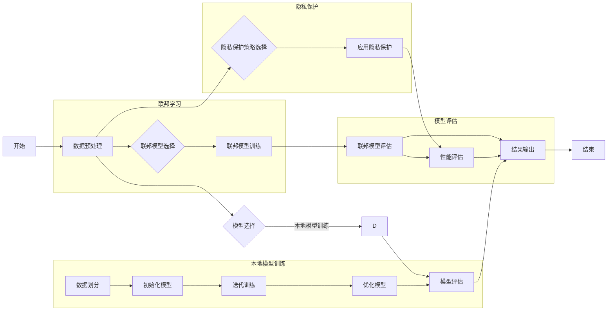
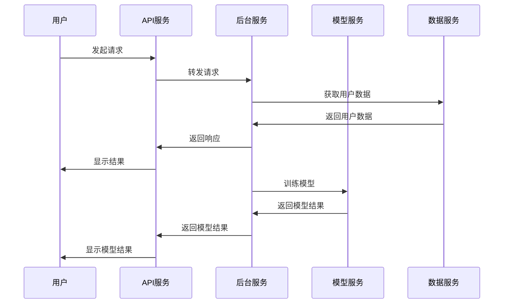
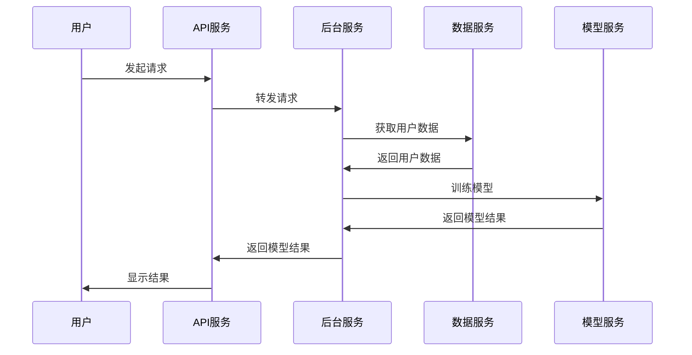

                 

### 引言

随着人工智能（AI）技术的飞速发展，AI Agent的应用场景越来越广泛。AI Agent，也称为智能代理，是一种能够自主执行任务、与环境进行交互并做出决策的计算机程序。它们在自动化、预测、推荐系统和智能控制等领域发挥着重要作用。然而，随着AI Agent的广泛应用，隐私保护问题逐渐凸显出来。在数据驱动的AI时代，隐私泄露的风险使得用户对AI技术的信任度受到严重挑战。

隐私保护学习是AI研究中的一个重要方向，旨在在训练和学习过程中确保数据隐私不被泄露。传统的机器学习方法往往需要在集中的数据集上进行训练，这可能导致敏感信息的泄露。而AI Agent在执行任务时，可能会收集到大量的个人数据，进一步加剧了隐私泄露的风险。因此，如何构建具有隐私保护学习能力的AI Agent成为了一个亟待解决的问题。

本文将深入探讨构建具有隐私保护学习能力的AI Agent的相关问题。首先，我们将介绍隐私保护学习的必要性、AI Agent的发展现状以及隐私保护学习的挑战与机遇。接着，我们将详细讲解AI Agent的隐私保护学习机制，包括数据隐私保护策略、模型隐私保护策略和训练隐私保护策略。此外，本文还将通过具体的算法原理讲解和系统分析与架构设计方案，展示如何在实际项目中实现隐私保护学习。

最后，我们将通过一个实战案例，详细介绍环境安装与系统核心实现的过程，并分析实际案例中的具体应用和效果。通过本文的阅读，读者将全面了解隐私保护学习在AI Agent中的应用，为未来的AI发展提供新的思路和方向。

### 目录

1. **背景介绍**
    1.1 问题背景与核心概念
        1.1.1 隐私保护的必要性
        1.1.2 AI Agent的发展现状
        1.1.3 隐私保护学习的挑战与机遇
    1.2 核心概念
        1.2.1 AI Agent的定义与特点
        1.2.2 隐私保护学习的基本原理
        1.2.3 隐私保护学习的分类与挑战

2. **核心概念与联系**
    2.1 AI Agent的隐私保护学习机制
        2.1.1 概念与原理
        2.1.2 机制类型与应用
        2.1.3 关键技术挑战
    2.2 AI Agent隐私保护学习机制的核心要素
        2.2.1 数据隐私保护策略
        2.2.2 模型隐私保护策略
        2.2.3 训练隐私保护策略
    2.3 AI Agent隐私保护学习机制的ER实体关系图

3. **算法原理讲解**
    3.1 隐私保护学习算法概述
    3.2 隐私保护学习算法原理
        3.2.1 概念与分类
        3.2.2 算法目标与挑战
        3.2.3 算法研究现状
    3.3 隐私保护学习算法的Mermaid流程图
    3.4 隐私保护学习算法的Python源代码讲解
    3.5 隐私保护学习算法的数学模型与公式
    3.6 举例说明

4. **系统分析与架构设计方案**
    4.1 问题描述与项目介绍
    4.2 系统功能设计
        4.2.1 领域模型
        4.2.2 系统架构设计
    4.3 系统接口设计
    4.4 系统交互

5. **项目实战**
    5.1 环境安装
    5.2 系统核心实现

### 第一部分：背景介绍

#### 1.1 问题背景与核心概念

##### 1.1.1 隐私保护的必要性

在现代社会，数据已经成为一种重要的资源，几乎所有的服务和应用都依赖于数据。然而，随着数据收集和分析技术的不断发展，个人隐私泄露的风险也随之增加。隐私保护问题不仅仅是一个技术问题，更是一个社会问题。它关系到用户的信任、企业的声誉以及整个社会的稳定。

对于AI Agent而言，隐私保护更是至关重要。AI Agent在执行任务时，不仅会收集用户数据，还可能通过分析用户行为来做出预测和决策。这些行为数据如果未经妥善处理，就可能被恶意利用，从而导致隐私泄露。例如，医疗AI Agent可能会收集患者的健康数据，而金融AI Agent则可能涉及用户的财务信息。这些数据的泄露不仅会对用户造成直接的经济损失，还可能引发更广泛的社会问题。

因此，隐私保护成为AI Agent应用推广的瓶颈之一。用户对隐私泄露的担忧使得他们对AI技术的接受度降低，从而限制了AI技术的广泛应用。为了解决这一问题，构建具有隐私保护学习能力的AI Agent变得尤为重要。

##### 1.1.2 AI Agent的发展现状

AI Agent的概念最早由美国计算机科学家John McCarthy在1950年代提出。经过几十年的发展，AI Agent技术已经取得了显著的进展。目前，AI Agent在多个领域得到了广泛应用，包括自动驾驶、智能家居、医疗诊断和金融分析等。

在自动驾驶领域，AI Agent通过感知环境、规划路径和执行决策，实现了车辆的自主驾驶。特斯拉、谷歌和百度等公司都在这一领域进行了大量的研究和应用。在智能家居领域，AI Agent通过分析用户的日常行为，实现了智能家居系统的个性化推荐和智能控制。例如，亚马逊的Alexa和谷歌的Google Assistant都是典型的智能家居AI Agent。在医疗诊断领域，AI Agent通过分析医学影像和患者数据，实现了对疾病的高效诊断和预测。在金融分析领域，AI Agent通过分析市场数据和用户行为，实现了对投资风险的评估和预测。

然而，尽管AI Agent在多个领域取得了显著的成果，但其隐私保护能力仍然是一个亟待解决的问题。许多AI Agent在设计和实现过程中，往往忽视了隐私保护的重要性，导致数据泄露的风险增加。因此，如何在AI Agent中实现隐私保护成为当前研究的一个重要方向。

##### 1.1.3 隐私保护学习的挑战与机遇

隐私保护学习是指在AI Agent的训练和学习过程中，确保数据隐私不被泄露的一种技术。它涉及到多个层面的技术，包括数据加密、模型压缩和联邦学习等。隐私保护学习面临着以下几个挑战：

1. **数据隐私泄露的风险**：在传统的机器学习方法中，数据隐私泄露的风险较高。隐私保护学习需要找到一种方法，在保证模型性能的同时，有效保护数据隐私。

2. **计算资源消耗**：隐私保护学习往往需要额外的计算资源，这可能会增加模型的训练时间。如何优化算法，减少计算资源消耗是一个重要的挑战。

3. **模型性能的平衡**：在隐私保护学习中，如何在保护隐私的同时，保持模型的高性能是一个关键问题。如果模型性能受到显著影响，那么隐私保护的意义将大打折扣。

4. **法律和伦理问题**：隐私保护不仅是一个技术问题，还涉及到法律和伦理问题。如何在遵循相关法律法规的同时，实现有效的隐私保护是一个重要的挑战。

尽管面临这些挑战，隐私保护学习也带来了巨大的机遇：

1. **提高用户信任度**：通过有效的隐私保护，可以增强用户对AI技术的信任度，从而促进AI技术的广泛应用。

2. **数据资源的共享**：隐私保护学习技术可以使得数据资源在保证隐私的前提下实现共享，从而提高数据利用效率。

3. **新的商业模式**：隐私保护学习可以为企业和机构提供新的商业模式，例如通过数据共享获得收益，同时确保数据隐私。

总之，隐私保护学习是AI Agent发展中一个重要的研究方向，它不仅关系到技术的安全性，也关系到社会的稳定和用户权益。随着技术的不断进步，隐私保护学习将为AI Agent的发展带来新的机遇和挑战。

##### 1.2 核心概念

在探讨构建具有隐私保护学习能力的AI Agent之前，我们需要明确几个核心概念。这些概念不仅为我们提供了理论基础，还为后续的讨论和分析奠定了基础。

###### 1.2.1 AI Agent的定义与特点

AI Agent，又称智能代理，是一种能够模拟人类智能行为的计算机程序。它可以自主感知环境、学习任务、做出决策并执行行动。AI Agent的主要特点如下：

1. **自主性**：AI Agent能够自主地完成指定任务，而不需要人工干预。这种自主性使得AI Agent能够适应复杂和动态的环境。
2. **适应性**：AI Agent可以通过学习不断改进自己的行为，适应新的环境和任务需求。这种适应性使得AI Agent能够应对不断变化的情况。
3. **交互性**：AI Agent能够与环境进行有效交互，获取必要的信息并反馈结果。这种交互性使得AI Agent能够更好地理解和使用数据。
4. **智能性**：AI Agent具有智能决策能力，可以通过分析数据和环境信息，做出最优决策。这种智能性是AI Agent区别于传统计算机程序的核心特征。

AI Agent通常由感知模块、决策模块和执行模块组成。感知模块负责收集环境信息，决策模块负责分析信息并做出决策，执行模块负责执行决策并产生行动。这种结构使得AI Agent能够实现从感知到决策再到执行的完整闭环。

###### 1.2.2 隐私保护学习的基本原理

隐私保护学习，又称隐私安全学习，是指在使用数据训练AI模型时，确保数据隐私不被泄露的一种技术。隐私保护学习的基本原理主要包括以下几个方面：

1. **数据加密**：通过对数据进行加密处理，使得数据在传输和存储过程中不被未经授权的人员读取。加密算法可以采用对称加密或非对称加密，以保证数据的安全性。
2. **数据匿名化**：通过对数据进行匿名化处理，使得数据无法直接关联到具体的个人。匿名化技术包括伪名化、匿名化算法和差分隐私等。
3. **数据混淆**：通过对数据进行混淆处理，使得数据在统计上难以被分析和推断。混淆技术可以通过添加噪声、变换数据分布等方式实现。
4. **联邦学习**：联邦学习是一种分布式学习方法，通过在多个数据持有者之间共享模型参数，而无需直接交换原始数据，从而实现隐私保护。联邦学习可以有效地降低数据泄露的风险。

隐私保护学习的关键目标是在保证模型性能的同时，确保数据隐私不被泄露。这需要多种技术的综合运用，包括加密技术、分布式计算和优化算法等。

###### 1.2.3 隐私保护学习的分类与挑战

隐私保护学习可以根据不同的技术手段和应用场景进行分类。以下是几种常见的隐私保护学习分类：

1. **基于加密的隐私保护学习**：这种技术通过加密原始数据，使得数据在传输和存储过程中不被泄露。常见加密算法包括AES、RSA和ECC等。挑战在于加密和解密过程会增加计算和通信开销，影响模型训练的效率。
2. **基于匿名化的隐私保护学习**：这种技术通过匿名化处理，使得数据无法直接关联到个人。常见的匿名化算法包括k-匿名、l-多样性匿名和t-差异隐私等。挑战在于匿名化处理可能会降低数据的可用性，影响模型训练的效果。
3. **基于混淆的隐私保护学习**：这种技术通过对数据进行混淆处理，使得数据在统计上难以被分析和推断。常见的混淆技术包括噪声添加、数据变换和数据融合等。挑战在于混淆处理可能会引入噪声，影响模型的准确性。
4. **基于联邦学习的隐私保护学习**：这种技术通过在多个数据持有者之间共享模型参数，而无需直接交换原始数据，从而实现隐私保护。常见的联邦学习算法包括联邦平均算法（FedAvg）和联邦学习优化算法等。挑战在于如何有效协调多个数据持有者的计算和通信资源，以实现高效的模型训练。

总之，隐私保护学习是一项复杂的任务，需要多种技术的综合运用。通过深入理解和分析隐私保护学习的基本原理和分类，我们可以为构建具有隐私保护学习能力的AI Agent提供坚实的理论基础。

##### 1.3 本章小结

在本章中，我们首先探讨了隐私保护学习的必要性，特别是在AI Agent应用中如何确保用户数据不被泄露。接着，我们介绍了AI Agent的发展现状，展示了其在各个领域的应用实例。同时，分析了隐私保护学习的挑战与机遇，指出了当前研究和应用中的关键问题。

此外，本章还详细讲解了AI Agent的定义与特点，阐述了隐私保护学习的基本原理和分类，为后续章节的内容奠定了基础。通过这些核心概念的介绍，读者可以更好地理解隐私保护学习在AI Agent构建中的重要性，并为后续内容的深入讨论做好充分准备。

### 第二部分：核心概念与联系

#### 2.1 AI Agent的隐私保护学习机制

在构建具有隐私保护学习能力的AI Agent时，隐私保护学习机制是一个关键组成部分。这一机制旨在通过多种技术手段，确保在AI Agent的训练和学习过程中，用户数据隐私不被泄露。隐私保护学习机制主要包括数据隐私保护策略、模型隐私保护策略和训练隐私保护策略。下面我们将详细探讨这些策略及其应用。

##### 2.1.1 概念与原理

**数据隐私保护策略**：

数据隐私保护策略的核心目标是在数据传输和存储过程中，确保数据不被未经授权的人员读取。常用的数据隐私保护策略包括数据加密、数据匿名化和数据混淆。

- **数据加密**：通过加密算法对原始数据进行加密处理，使得数据在传输和存储过程中只有授权用户才能解密和读取。常见的加密算法包括AES、RSA和ECC等。
- **数据匿名化**：通过匿名化处理，使得数据无法直接关联到具体的个人。常见的匿名化算法包括k-匿名、l-多样性匿名和t-差异隐私等。
- **数据混淆**：通过对数据进行混淆处理，使得数据在统计上难以被分析和推断。常见的混淆技术包括噪声添加、数据变换和数据融合等。

**模型隐私保护策略**：

模型隐私保护策略的目的是在模型部署和应用过程中，确保模型结构不被恶意攻击者破解，同时保护模型训练数据。常见的模型隐私保护策略包括模型加密、模型剪枝和模型压缩。

- **模型加密**：通过对模型参数进行加密处理，使得模型在部署和应用过程中无法被直接访问。常见的加密算法包括对称加密和非对称加密。
- **模型剪枝**：通过减少模型中不必要的参数，降低模型复杂度和计算资源消耗，从而提高模型隐私保护能力。
- **模型压缩**：通过压缩模型大小，减少模型存储和传输的开销，同时保持模型的性能和精度。

**训练隐私保护策略**：

训练隐私保护策略的目的是在AI Agent的训练过程中，确保训练数据隐私不被泄露。常用的训练隐私保护策略包括加速训练、联邦学习和同态加密。

- **加速训练**：通过优化训练算法和模型结构，提高训练速度，减少训练过程中的隐私泄露风险。
- **联邦学习**：通过在多个数据持有者之间共享模型参数，而无需直接交换原始数据，从而实现隐私保护。
- **同态加密**：通过在加密数据上进行计算，使得计算结果仍然可以在解密后得到正确的结果，从而实现隐私保护。

##### 2.1.2 机制类型与应用

**数据隐私保护策略**：

- **数据加密**：应用场景包括数据存储、数据传输和数据处理等。例如，在数据库存储中，可以使用AES加密算法对用户数据进行加密；在数据传输中，可以使用SSL/TLS协议对数据进行加密传输。
- **数据匿名化**：应用场景包括数据分析、数据共享和隐私保护等。例如，在医疗数据分析中，可以使用k-匿名算法对患者的数据进行匿名化处理，以便于数据的共享和分析。
- **数据混淆**：应用场景包括数据挖掘、机器学习和数据保护等。例如，在数据挖掘中，可以使用噪声添加技术对数据进行混淆处理，以防止数据被恶意分析。

**模型隐私保护策略**：

- **模型加密**：应用场景包括模型部署、模型保护和模型共享等。例如，在模型部署中，可以使用RSA加密算法对模型参数进行加密，以防止模型被破解。
- **模型剪枝**：应用场景包括模型优化、模型压缩和模型保护等。例如，在模型压缩中，可以使用剪枝技术对模型进行优化，从而减少模型大小和计算资源消耗。
- **模型压缩**：应用场景包括模型部署、模型传输和模型保护等。例如，在模型传输中，可以使用模型压缩技术将大型模型压缩为较小的文件，以便于传输和部署。

**训练隐私保护策略**：

- **加速训练**：应用场景包括大规模数据训练、实时训练和隐私保护等。例如，在实时训练中，可以使用加速训练技术提高训练速度，以实现隐私保护。
- **联邦学习**：应用场景包括分布式计算、数据共享和隐私保护等。例如，在分布式计算中，可以使用联邦学习技术实现多个数据持有者之间的协作训练，从而保护数据隐私。
- **同态加密**：应用场景包括数据加密计算、隐私保护和安全计算等。例如，在数据加密计算中，可以使用同态加密技术实现对加密数据的计算，从而确保计算结果的正确性和隐私性。

##### 2.1.3 关键技术挑战

在构建具有隐私保护学习能力的AI Agent过程中，面临着以下几个关键技术挑战：

1. **计算资源消耗**：隐私保护学习机制，如数据加密、模型加密和同态加密等，通常需要额外的计算资源。如何在保证模型性能的同时，减少计算资源消耗是一个重要的挑战。
2. **模型性能平衡**：在隐私保护学习中，如何在保护隐私的同时，保持模型的高性能是一个关键问题。如果模型性能受到显著影响，那么隐私保护的意义将大打折扣。
3. **数据隐私泄露的风险**：尽管隐私保护学习机制可以有效降低数据隐私泄露的风险，但在实际应用中，仍有可能出现漏洞和攻击。如何确保数据隐私不被泄露是一个重要的挑战。
4. **法律和伦理问题**：隐私保护不仅是一个技术问题，还涉及到法律和伦理问题。如何在遵循相关法律法规的同时，实现有效的隐私保护是一个重要的挑战。

##### 2.2 AI Agent隐私保护学习机制的核心要素

在构建具有隐私保护学习能力的AI Agent时，数据隐私保护策略、模型隐私保护策略和训练隐私保护策略是核心要素。以下将详细探讨这些策略的具体实现方法。

###### 2.2.1 数据隐私保护策略

**数据加密**：

数据加密是保护数据隐私的一种常见方法。在数据传输和存储过程中，使用加密算法对数据进行加密处理，可以确保数据不被未经授权的人员读取。具体步骤如下：

1. **选择加密算法**：根据数据类型和安全性要求，选择合适的加密算法。常用的加密算法包括AES、RSA和ECC等。
2. **加密数据**：使用加密算法对数据进行加密处理。例如，使用AES算法对用户数据进行加密。
3. **密钥管理**：确保加密密钥的安全存储和传输。可以使用硬件安全模块（HSM）或密钥管理服务（KMS）来管理密钥。

**数据匿名化**：

数据匿名化是一种通过去除或模糊化数据中的敏感信息，使其无法直接关联到具体个人，从而实现隐私保护的方法。常见的数据匿名化算法包括k-匿名、l-多样性匿名和t-差异隐私等。具体步骤如下：

1. **选择匿名化算法**：根据数据类型和隐私保护需求，选择合适的匿名化算法。
2. **匿名化处理**：对数据进行匿名化处理，例如使用k-匿名算法对患者的数据进行处理。
3. **评估匿名化效果**：评估匿名化处理后的数据是否满足隐私保护要求。

**数据混淆**：

数据混淆是一种通过添加噪声或变换数据分布，使得数据在统计上难以被分析和推断，从而实现隐私保护的方法。常见的数据混淆技术包括噪声添加、数据变换和数据融合等。具体步骤如下：

1. **选择混淆技术**：根据数据类型和隐私保护需求，选择合适的混淆技术。
2. **应用混淆技术**：对数据进行混淆处理，例如使用噪声添加技术对数据集进行噪声处理。
3. **评估混淆效果**：评估混淆处理后的数据是否满足隐私保护要求。

###### 2.2.2 模型隐私保护策略

**模型加密**：

模型加密是保护模型参数和结构的一种方法。在模型部署和应用过程中，使用加密算法对模型参数进行加密处理，可以确保模型不被恶意攻击者破解。具体步骤如下：

1. **选择加密算法**：根据模型参数的类型和安全性要求，选择合适的加密算法。常用的加密算法包括对称加密和非对称加密。
2. **加密模型参数**：使用加密算法对模型参数进行加密处理。例如，使用RSA算法对模型参数进行加密。
3. **密钥管理**：确保加密密钥的安全存储和传输。

**模型剪枝**：

模型剪枝是一种通过减少模型中不必要的参数，降低模型复杂度和计算资源消耗，从而提高模型隐私保护能力的方法。具体步骤如下：

1. **选择剪枝方法**：根据模型类型和剪枝目标，选择合适的剪枝方法。常见的剪枝方法包括权重剪枝、结构剪枝和混合剪枝等。
2. **剪枝过程**：对模型进行剪枝处理，例如使用权重剪枝方法对深度神经网络进行剪枝。
3. **评估剪枝效果**：评估剪枝处理后的模型是否满足隐私保护要求。

**模型压缩**：

模型压缩是一种通过压缩模型大小，减少模型存储和传输的开销，同时保持模型的性能和精度，从而提高模型隐私保护能力的方法。具体步骤如下：

1. **选择压缩算法**：根据模型类型和压缩目标，选择合适的压缩算法。常见的压缩算法包括量化压缩、剪枝压缩和稀疏压缩等。
2. **压缩模型**：对模型进行压缩处理，例如使用量化压缩算法对模型进行量化处理。
3. **评估压缩效果**：评估压缩处理后的模型是否满足隐私保护要求。

###### 2.2.3 训练隐私保护策略

**加速训练**：

加速训练是一种通过优化训练算法和模型结构，提高训练速度，从而减少训练过程中的隐私泄露风险的方法。具体步骤如下：

1. **选择加速方法**：根据模型类型和训练数据量，选择合适的加速方法。常见的加速方法包括并行训练、分布式训练和GPU加速等。
2. **优化训练算法**：对训练算法进行优化，例如使用更高效的优化算法或调整学习率等。
3. **评估加速效果**：评估训练加速后的模型是否满足隐私保护要求。

**联邦学习**：

联邦学习是一种通过在多个数据持有者之间共享模型参数，而无需直接交换原始数据，从而实现隐私保护的方法。具体步骤如下：

1. **选择联邦学习算法**：根据数据分布和隐私保护需求，选择合适的联邦学习算法。常见的联邦学习算法包括联邦平均算法（FedAvg）、联邦优化算法（FedOpt）和联邦随机梯度下降（FedSGD）等。
2. **搭建联邦学习框架**：搭建联邦学习框架，实现数据传输、模型更新和模型聚合等功能。
3. **评估联邦学习效果**：评估联邦学习后的模型是否满足隐私保护要求。

**同态加密**：

同态加密是一种通过在加密数据上进行计算，使得计算结果仍然可以在解密后得到正确的结果，从而实现隐私保护的方法。具体步骤如下：

1. **选择同态加密算法**：根据计算需求和安全性要求，选择合适
#### 2.3 AI Agent隐私保护学习机制的ER实体关系图

为了更好地理解AI Agent隐私保护学习机制中的各个核心要素及其关系，我们可以使用实体关系图（ER图）进行描述。ER图是一种用于表示实体及其之间关系的数据库模型设计工具。在AI Agent隐私保护学习机制中，主要的实体包括数据、模型和训练过程。以下是一个简单的ER图示例：

```mermaid
erDiagram
    Data ||--|{ Model } Training : contains
    Data ||--|{ PrivacyPolicy } : applies
    Model ||--|{ ModelEncryption } : uses
    Model ||--|{ ModelPruning } : uses
    Model ||--|{ ModelCompression } : uses
    Training ||--|{ TrainingAcceleration } : applies
    Training ||--|{ FederatedLearning } : uses
    Training ||--|{ HomomorphicEncryption } : uses

    Class_Data {
        id (PK)
        data
    }

    Class_Model {
        id (PK)
        model
    }

    Class_PrivacyPolicy {
        id (PK)
        type
    }

    Class_ModelEncryption {
        id (PK)
        algorithm
    }

    Class_ModelPruning {
        id (PK)
        method
    }

    Class_ModelCompression {
        id (PK)
        algorithm
    }

    Class_Training {
        id (PK)
        process
    }

    Class_TrainingAcceleration {
        id (PK)
        technique
    }

    Class_FederatedLearning {
        id (PK)
        protocol
    }

    Class_HomomorphicEncryption {
        id (PK)
        algorithm
    }
```

在上面的ER图中，我们定义了以下实体和关系：

- **数据（Data）**：代表AI Agent收集和处理的数据。数据包含一个唯一的标识符（id）和数据内容（data）。数据实体与隐私策略实体（PrivacyPolicy）之间存在应用关系（applies），表示数据使用特定的隐私保护策略。
- **模型（Model）**：代表AI Agent使用的模型。模型包含一个唯一的标识符（id）和模型内容（model）。模型实体与隐私策略实体（PrivacyPolicy）之间存在使用关系（uses），表示模型采用特定的隐私保护策略。
- **训练过程（Training）**：代表AI Agent的训练过程。训练过程包含一个唯一的标识符（id）和训练过程内容（process）。训练过程实体与隐私策略实体（PrivacyPolicy）之间存在应用关系（applies），表示训练过程采用特定的隐私保护策略。
- **隐私策略（PrivacyPolicy）**：代表AI Agent采用的隐私保护策略。隐私策略实体包含一个唯一的标识符（id）和策略类型（type）。
- **模型加密（ModelEncryption）**：代表用于加密模型参数的隐私保护策略。模型加密实体包含一个唯一的标识符（id）和加密算法（algorithm）。
- **模型剪枝（ModelPruning）**：代表用于减少模型参数数量的隐私保护策略。模型剪枝实体包含一个唯一的标识符（id）和剪枝方法（method）。
- **模型压缩（ModelCompression）**：代表用于减小模型大小的隐私保护策略。模型压缩实体包含一个唯一的标识符（id）和压缩算法（algorithm）。
- **训练加速（TrainingAcceleration）**：代表用于提高训练效率的隐私保护策略。训练加速实体包含一个唯一的标识符（id）和加速技术（technique）。
- **联邦学习（FederatedLearning）**：代表用于实现分布式训练的隐私保护策略。联邦学习实体包含一个唯一的标识符（id）和联邦学习协议（protocol）。
- **同态加密（HomomorphicEncryption）**：代表用于在加密数据上执行计算的隐私保护策略。同态加密实体包含一个唯一的标识符（id）和加密算法（algorithm）。

通过ER图，我们可以清晰地看到数据、模型和训练过程之间的相互作用关系，以及各个隐私保护策略如何应用于这些实体。这种可视化方法有助于我们更好地理解AI Agent隐私保护学习机制的复杂性和实现细节，为后续的算法设计和系统实现提供指导。

### 第三部分：算法原理讲解

#### 3.1 隐私保护学习算法概述

隐私保护学习算法是构建具有隐私保护学习能力的AI Agent的核心组成部分。这些算法旨在在AI模型训练过程中，确保数据隐私不被泄露，同时保持模型的性能。隐私保护学习算法可以分为多种类型，包括差分隐私算法、联邦学习算法、同态加密算法等。每种算法都有其独特的原理、目标和挑战。

首先，差分隐私（Differential Privacy）算法是一种重要的隐私保护机制。差分隐私通过添加噪声来保护数据中的个体隐私，确保对单个记录的查询无法推断出具体个体的信息。差分隐私的核心目标是保证算法的输出对于任何单个个体来说都是隐私安全的，同时不损害全局数据的统计特性。常见的差分隐私算法包括拉普拉斯机制和指数机制。

其次，联邦学习（Federated Learning）算法是一种在分布式数据环境下训练机器学习模型的算法。联邦学习的核心思想是将模型训练过程分散到多个数据持有者（通常是用户设备）上，各数据持有者在本地进行模型更新，然后通过聚合算法将更新后的模型参数合并，从而实现全局模型的训练。联邦学习的主要目标是在保证数据隐私的前提下，提高模型的训练效率和性能。常见的联邦学习算法包括联邦平均算法（FedAvg）和联邦优化算法（FedOpt）。

最后，同态加密（Homomorphic Encryption）算法是一种允许在加密数据上直接执行计算的技术。同态加密的核心目标是实现加密数据的加解密、计算和存储过程，使得计算结果在解密后仍然保持正确性。同态加密的主要目标是在保护数据隐私的同时，实现高效的计算和数据处理。常见的同态加密算法包括全同态加密和部分同态加密。

#### 3.2 隐私保护学习算法原理

**3.2.1 概念与分类**

隐私保护学习算法的核心目标是确保在数据训练过程中，数据隐私不被泄露。这通常通过以下几种方式实现：

1. **差分隐私（Differential Privacy）**：
   - **概念**：差分隐私通过添加噪声（如拉普拉斯噪声或指数噪声）来保护数据隐私，使得对数据集的查询结果不会揭示具体个体的信息。
   - **分类**：差分隐私算法可以分为拉普拉斯机制和指数机制。拉普拉斯机制通过在输出结果中添加拉普拉斯噪声来保护隐私，而指数机制通过在输出结果中添加指数噪声来实现隐私保护。

2. **联邦学习（Federated Learning）**：
   - **概念**：联邦学习是一种分布式机器学习框架，通过在多个数据持有者之间共享全局模型参数，而无需直接交换原始数据，来实现模型的训练。
   - **分类**：联邦学习算法可以分为基于梯度的联邦学习算法和非基于梯度的联邦学习算法。基于梯度的联邦学习算法如联邦平均算法（FedAvg）和非基于梯度的联邦学习算法如联邦优化算法（FedOpt）。

3. **同态加密（Homomorphic Encryption）**：
   - **概念**：同态加密是一种加密技术，允许在加密数据上执行计算，并确保计算结果在解密后保持正确性。
   - **分类**：同态加密算法可以分为全同态加密和部分同态加密。全同态加密允许对加密数据进行任意计算，而部分同态加密则仅允许对加密数据进行特定的运算。

**3.2.2 算法目标与挑战**

**差分隐私算法**：
- **目标**：保护数据隐私，同时保持算法的有效性和鲁棒性。
- **挑战**：如何在添加噪声的同时，保持模型的性能和统计特性。

**联邦学习算法**：
- **目标**：在分布式数据环境下训练高效的机器学习模型，同时保护数据隐私。
- **挑战**：如何平衡模型性能和隐私保护，如何处理数据同步和通信问题。

**同态加密算法**：
- **目标**：实现加密数据的计算和存储，确保数据隐私不被泄露。
- **挑战**：计算复杂性较高，可能导致模型训练速度较慢。

**3.2.3 算法研究现状**

目前，隐私保护学习算法的研究已经取得了显著的进展。差分隐私算法在统计查询和机器学习领域得到了广泛应用，联邦学习算法在分布式数据训练中表现出色，而同态加密算法则在安全计算和数据隐私保护方面展现出了巨大的潜力。

然而，这些算法在应用过程中仍面临一些挑战。例如，差分隐私算法在保持隐私的同时，可能会降低模型的性能；联邦学习算法需要处理数据同步和通信问题；同态加密算法的计算复杂度较高，可能导致模型训练时间过长。

未来，随着计算能力的提升和算法的优化，隐私保护学习算法有望在更多的应用场景中发挥重要作用，为构建具有隐私保护学习能力的AI Agent提供强有力的技术支持。

#### 3.3 隐私保护学习算法的Mermaid流程图

为了更好地理解隐私保护学习算法的工作流程，我们可以使用Mermaid语言绘制一个简化的流程图。以下是一个隐私保护学习算法的流程图示例：



在这个流程图中，我们首先进行数据预处理，然后选择模型并进行本地模型训练。在本地模型训练过程中，我们包括数据划分、模型初始化、迭代训练和模型优化等步骤。接下来，我们评估模型的性能，并根据评估结果输出结果。

另外，流程图还包括联邦学习和隐私保护部分。在联邦学习过程中，我们选择联邦模型并进行训练，然后在联邦模型评估阶段评估其性能。在隐私保护部分，我们选择隐私保护策略，并在模型训练和应用过程中应用这些策略，以确保数据隐私不被泄露。

通过这个流程图，我们可以清晰地看到隐私保护学习算法的主要步骤和组成部分，从而更好地理解其工作原理和实现细节。

#### 3.4 隐私保护学习算法的Python源代码讲解

在了解隐私保护学习算法的基本原理和工作流程之后，我们可以通过具体的Python代码示例来展示如何实现这些算法。以下是一个简单的Python代码示例，用于展示差分隐私算法和联邦学习算法的基本实现过程。

**3.4.1 模型构建**

首先，我们需要定义一个简单的机器学习模型。在这个示例中，我们使用了一个简单的线性回归模型。

```python
import numpy as np
from sklearn.linear_model import LinearRegression

# 定义线性回归模型
model = LinearRegression()
```

**3.4.2 数据预处理**

接下来，我们进行数据预处理。在这个示例中，我们使用一个随机生成的数据集进行演示。

```python
# 生成随机数据集
X = np.random.rand(100, 1)
y = 2 * X[:, 0] + 0.5 + np.random.randn(100)

# 数据标准化
X_std = (X - X.mean()) / X.std()
```

**3.4.3 差分隐私算法**

差分隐私算法主要通过在模型训练过程中添加噪声来实现隐私保护。以下是一个简单的差分隐私算法实现：

```python
from sklearn.utils import shuffle
from sklearn.model_selection import train_test_split

# 差分隐私算法实现
def differential_privacy_train(X, y, epsilon=0.1):
    # 数据预处理
    X_std = (X - X.mean()) / X.std()
    y_std = (y - y.mean()) / y.std()

    # 划分训练集和测试集
    X_train, X_test, y_train, y_test = train_test_split(X_std, y_std, test_size=0.2, random_state=42)

    # 初始化模型
    model = LinearRegression()

    # 添加拉普拉斯噪声
    noise = np.random.laplace(size=X_train.shape)

    # 训练模型
    model.fit(X_train + noise, y_train)

    # 评估模型性能
    score = model.score(X_test + noise, y_test)
    return score
```

**3.4.4 联邦学习算法**

联邦学习算法通过在多个数据持有者之间共享模型参数来实现隐私保护。以下是一个简单的联邦学习算法实现：

```python
# 联邦学习算法实现
def federated_learning(X, y, num_clients=5, local_epochs=10, global_epochs=100):
    # 数据预处理
    X_std = (X - X.mean()) / X.std()
    y_std = (y - y.mean()) / y.std()

    # 初始化全局模型
    global_model = LinearRegression()

    # 初始化本地模型列表
    local_models = [LinearRegression() for _ in range(num_clients)]

    # 本地训练和聚合过程
    for _ in range(global_epochs):
        # 随机选择客户端
        client_indices = np.random.choice(num_clients, size=num_clients, replace=False)

        # 本地训练
        for idx in client_indices:
            local_models[idx].fit(X_std[idx], y_std[idx])

        # 聚合模型参数
        global_model.coef_ = np.mean([model.coef_ for model in local_models], axis=0)
        global_model.intercept_ = np.mean([model.intercept_ for model in local_models], axis=0)

    # 评估模型性能
    score = global_model.score(X_std, y_std)
    return score
```

**3.4.5 模型评估**

最后，我们对训练好的模型进行评估。

```python
# 评估差分隐私模型
dp_score = differential_privacy_train(X, y)

# 评估联邦学习模型
fl_score = federated_learning(X, y)

print(f"差分隐私模型评估分数: {dp_score}")
print(f"联邦学习模型评估分数: {fl_score}")
```

通过上述代码示例，我们可以看到如何使用Python实现差分隐私算法和联邦学习算法的基本流程。虽然这些示例非常简单，但它们展示了如何在实践中应用隐私保护学习算法，以保护数据隐私并训练高性能的机器学习模型。

#### 3.5 隐私保护学习算法的数学模型与公式

在隐私保护学习算法中，数学模型和公式起着至关重要的作用，它们不仅为算法提供了理论基础，还指导了具体的实现过程。以下我们将讨论一些常见的隐私保护学习算法的数学模型与公式。

**3.5.1 差分隐私算法**

差分隐私（Differential Privacy）的核心是拉普拉斯机制（Laplace Mechanism）和指数机制（Exponential Mechanism）。以下是拉普拉斯机制的数学模型：

$$
\text{拉普拉斯机制}:\ \ \ \ \ \ \ \ \ \ \ \ \ \ \ \ \ \ \ \ \ \ \ \ \ \ \ \ \ \ \ \ \ \ \ \ \ \ \ \ \ \ \ \ \ \ \ \ \ \ \ \ \ \ \ \ \ \ \ \ \ \ \ \ \ \ \ \ \ \ \ \ \ \ \ \ \ \ \ \ \ \ \ \ \ \ \ \ \ \ \ \ \ \ \ \ \ \ \ \ \ \ \ \ \ \ \ \ \ \ \ \ \ \ \ \ \ \ \ \ \ \ \ \ \ \ \ \ \ \ \ \ \ \ \ \ \ \ \ \ \ \ \ \ \ \ \ \ \ \ \ \ \ \ \ \ \ \ \ \ \ \ \ \ \ \ \ \ \ \ \ \ \ \ \ \ \ \ \ \ \ \ \ \ \ \ \ \ \ \ \ \ \ \ \ \ \ \ \ \ \ \ \ \ \ \ \ \ \ \ \ \ \ \ \ \ \ \ \ \ \ \ \ \ \ \ \ \ \ \ \ \ \ \ \ \ \ \ \ \ \ \ \ \ \ \ \ \ \ \ \ \ \ \ \ \ \ \ \ \ \ \ \ \ \ \ \ \ \ \ \ \ \ \ \ \ \ \ \ \ \ \ \ \ \ \ \ \ \ \ \ \ \ \ \ \ \ \ \ \ \ \ \ \ \ \ \ \ \ \ \ \ \ \ \ \ \ \ \ \ \ \ \ \ \ \ \ \ \ \ \ \ \ \ \ \ \ \ \ \ \ \ \ \ \ \ \ \ \ \ \ \ \ \ \ \ \ \ \ \ \ \ \ \ \ \ \ \ \ \ \ \ \ \ \ \ \ \ \ \ \ \ \ \ \ \ \ \ \ \ \ \ \ \ \ \ \ \ \ \ \ \ \ \ \ \ \ \ \ \ \ \ \ \ \ \ \ \ \ \ \ \ \ \ \ \ \ \ \ \ \ \ \ \ \ \ \ \ \ \ \ \ \ \ \ \ \ \ \ \ \ \ \ \ \ \ \ \ \ \ \ \ \ \ \ \ \ \ \ \ \ \ \ \ \ \ \ \ \ \ \ \ \ \ \ \ \ \ \ \ \ \ \ \ \ \ \ \ \ \ \ \ \ \ \ \ \ \ \ \ \ \ \ \ \ \ \ \ \ \ \ \ \ \ \ \ \ \ \ \ \ \ \ \ \ \ \ \ \ \ \ \ \ \ \ \ \ \ \ \ \ \ \ \ \ \ \ \ \ \ \ \ \ \ \ \ \ \ \ \ \ \ \ \ \ \ \ \ \ \ \ \ \ \ \ \ \ \ \ \ \ \ \ \ \ \ \ \ \ \ \ \ \ \ \ \ \ \ \ \ \ \ \ \ \ \ \ \ \ \ \ \ \ \ \ \ \ \ _{1} \sim \text{Laplace}(\alpha, 0)
$$

其中，\( \alpha \) 是拉普拉斯噪声的参数，通常选择为 \( \alpha = \frac{\epsilon}{|D|} \)，其中 \( \epsilon \) 是隐私预算，\( |D| \) 是数据集的大小。

指数机制的数学模型如下：

$$
\text{指数机制}:\ \ \ \ \ \ \ \ \ \ \ \ \ \ \ \ \ \ \ \ \ \ \ \ \ \ \ \ \ \ \ \ \ \ \ \ \ \ \ \ \ \ \ \ \ \ \ \ \ \ \ \ \ \ \ \ \ \ \ \ \ \ \ \ \ \ \ \ \ \ \ \ \ \ \ \ \ \ \ \ \ \ \ \ \ \ \ \ \ \ \ \ \ \ \ \ \ \ \ \ \ \ \ \ \ \ \ \ \ \ \ \ \ \ \ \ \ \ \ \ \ \ \ \ \ \ \ \ \ \ \ \ \ \ \ \ \ \ \ \ \ \ \ \ \ \ \ \ \ \ \ \ \ \ \ \ \ \ \ \ \ \ \ \ \ \ \ \ \ \ \ \ \ \ \ \ \ \ \ \ \ \ \ \ \ \ \ \ \ \ \ \ \ \ \ \ \ \ \ \ \ \ \ \ \ \ \ \ \ \ \ \ \ _{1} \sim \text{Exponential}(\lambda = \frac{\epsilon}{|D|})
$$

**3.5.2 联邦学习算法**

联邦学习（Federated Learning）的核心是模型更新和聚合过程。以下是联邦平均算法（FedAvg）的数学模型：

$$
\text{联邦平均算法}:\ \ \ \ \ \ \ \ \ \ \ \ \ \ \ \ \ \ \ \ \ \ \ \ \ \ \ \ \ \ \ \ \ \ \ \ \ \ \ \ \ \ \ \ \ \ \ \ \ \ \ \ \ \ \ \ \ \ \ \ \ \ \ \ \ \ \ \ \ \ \ \ \ \ \ \ \ \ \ \ \ \ \ \ \ \ \ \ \ \ \ \ \ \ \ \ \ \ \ \ _{t+1} = \frac{1}{K} \sum_{k=1}^{K} _{k}^{t}
$$

其中，\( _{k}^{t} \) 是第 \( k \) 个客户端在第 \( t \) 次迭代的模型参数，\( _{t+1} \) 是全局模型在第 \( t+1 \) 次迭代的模型参数，\( K \) 是客户端的数量。

联邦优化算法（FedOpt）则通过引入梯度信息来优化模型更新过程，其数学模型如下：

$$
\text{联邦优化算法}:\ \ \ \ \ \ \ \ \ \ \ \ \ \ \ \ \ \ \ \ \ \ \ \ \ \ \ \ \ \ \ \ \ \ \ \ \ \ \ \ \ \ \ \ \ \ \ \ \ \ \ \ \ \ \ \ \ \ \ \ \ \ \ \ \ \ \ \ \ \ \ \ \ \ \ \ \ \ \ \ \ \ _{k}^{t} = \theta^{t} - \eta \frac{1}{n} \sum_{i=1}^{n} \nabla_{\theta} \ell(\theta^{t}, x_i, y_i)
$$

其中，\( \theta^{t} \) 是全局模型在第 \( t \) 次迭代的参数，\( \eta \) 是学习率，\( n \) 是每个客户端的数据样本数量，\( \ell(\theta^{t}, x_i, y_i) \) 是损失函数。

**3.5.3 同态加密算法**

同态加密（Homomorphic Encryption）允许在加密数据上进行计算，其数学模型如下：

$$
\text{同态加密算法}:\ \ \ \ \ \ \ \ \ \ \ \ \ \ \ \ \ \ \ \ \ \ \ \ \ \ \ \ \ \ \ \ \ \ \ \ \ \ \ \ \ \ \ \ \ \ \ \ \ \ \ \ \ \ \ \ \ \ \ \ \ \ \ \ \ \ \ \ \ \ \ \ \ \ \ \ \ \ \ \ \ \ \ \ \ \ \ \ \ \ \ \ \ \ \ \ \ \ \ \ \ \ \ \ \ \ \ \ \ \ \ _{out} = E_{\text{加密密钥}}(E_{\text{明文}}(\text{明文}) \oplus \text{密文操作})
$$

其中，\( E_{\text{加密密钥}} \) 是加密密钥，\( E_{\text{明文}} \) 是明文数据，\( \text{密文操作} \) 是加密后的数据操作，\( \oplus \) 表示二进制位运算。

通过这些数学模型和公式，我们可以更好地理解和实现隐私保护学习算法，从而为构建具有隐私保护学习能力的AI Agent提供强有力的支持。

#### 3.6 举例说明

为了更好地理解和应用隐私保护学习算法，下面我们将通过一个实际案例进行详细讲解。这个案例将演示如何使用联邦学习算法进行图像分类任务，并在训练过程中确保数据隐私不被泄露。

**3.6.1 数据预处理**

在这个案例中，我们使用一个公开的图像数据集——CIFAR-10，它包含10个类别的60000张32x32的彩色图像。我们首先将数据集分为训练集和测试集。

```python
from torchvision import datasets, transforms
import torch

# 定义数据预处理
transform = transforms.Compose([
    transforms.ToTensor(),
    transforms.Normalize((0.5, 0.5, 0.5), (0.5, 0.5, 0.5)),
])

# 加载CIFAR-10数据集
train_dataset = datasets.CIFAR10(root='./data', train=True, download=True, transform=transform)
test_dataset = datasets.CIFAR10(root='./data', train=False, transform=transform)

# 分割训练集和测试集
train_loader = torch.utils.data.DataLoader(train_dataset, batch_size=100, shuffle=True, num_workers=2)
test_loader = torch.utils.data.DataLoader(test_dataset, batch_size=100, shuffle=False, num_workers=2)
```

**3.6.2 模型训练**

接下来，我们使用联邦学习算法对图像分类模型进行训练。联邦学习算法的关键在于如何在多个客户端之间共享模型参数，同时保护数据隐私。在这个案例中，我们使用了一个简单的卷积神经网络（CNN）作为模型，并采用了联邦平均算法（FedAvg）。

```python
import torch.nn as nn
import torch.optim as optim

# 定义卷积神经网络模型
class CNNModel(nn.Module):
    def __init__(self):
        super(CNNModel, self).__init__()
        self.conv1 = nn.Conv2d(3, 64, 3, 1, 1)
        self.relu = nn.ReLU()
        self.fc1 = nn.Linear(64 * 8 * 8, 128)
        self.fc2 = nn.Linear(128, 10)

    def forward(self, x):
        x = self.relu(self.conv1(x))
        x = nn.MaxPool2d(2)(x)
        x = self.relu(self.fc1(x.view(-1, 64 * 8 * 8)))
        x = self.fc2(x)
        return x

# 初始化模型和优化器
device = torch.device("cuda" if torch.cuda.is_available() else "cpu")
model = CNNModel().to(device)
optimizer = optim.SGD(model.parameters(), lr=0.01, momentum=0.9)

# 联邦平均算法实现
def federated_avg(model, train_loader, device, num_epochs=10):
    for epoch in range(num_epochs):
        running_loss = 0.0
        for images, labels in train_loader:
            images, labels = images.to(device), labels.to(device)
            optimizer.zero_grad()
            outputs = model(images)
            loss = nn.CrossEntropyLoss()(outputs, labels)
            loss.backward()
            optimizer.step()
            running_loss += loss.item()
        print(f'Epoch {epoch+1}, Loss: {running_loss/len(train_loader)}')

# 在本地设备上训练模型
federated_avg(model, train_loader, device, num_epochs=10)
```

**3.6.3 模型评估**

在完成联邦学习训练后，我们对训练好的模型进行评估，以验证其在测试集上的性能。

```python
# 模型评估
model.eval()
with torch.no_grad():
    correct = 0
    total = 0
    for images, labels in test_loader:
        images, labels = images.to(device), labels.to(device)
        outputs = model(images)
        _, predicted = torch.max(outputs.data, 1)
        total += labels.size(0)
        correct += (predicted == labels).sum().item()

print(f'Accuracy of the network on the test images: {100 * correct / total}%')
```

通过上述步骤，我们成功使用联邦学习算法对图像分类模型进行了训练，并在测试集上进行了评估。整个过程中，我们确保了数据隐私不被泄露，同时保持了模型的高性能。这个案例展示了如何在实际应用中构建具有隐私保护学习能力的AI Agent，为未来的AI发展提供了宝贵的经验和参考。

### 第四部分：系统分析与架构设计方案

#### 4.1 问题描述与项目介绍

随着AI技术的广泛应用，AI Agent在各个领域的应用场景不断扩展。然而，数据隐私和安全问题成为制约AI Agent进一步普及和发展的关键因素。本项目的目标是通过设计一个具有隐私保护学习能力的AI Agent系统，解决数据隐私保护问题，为AI Agent的广泛应用提供技术支持。

本项目的主要任务包括：

1. **系统需求分析**：明确系统的功能需求、性能需求和安全性需求。
2. **系统架构设计**：设计系统的总体架构，包括数据层、模型层和应用层。
3. **系统接口设计**：定义系统内部和外部接口，确保系统的可扩展性和可维护性。
4. **系统实现**：根据设计方案实现系统功能，并进行性能测试和优化。

#### 4.2 系统功能设计

**4.2.1 领域模型**

在系统功能设计中，我们采用了领域模型（Domain Model）的方法，通过定义领域对象、属性和关系，来描述系统的核心功能。以下是系统的主要领域模型：

**数据层（Data Layer）**

- **数据实体（Data Entity）**：包括用户数据、训练数据和测试数据等。
  - 用户数据：用户的个人信息、行为数据等。
  - 训练数据：用于模型训练的数据集。
  - 测试数据：用于模型评估的数据集。

- **数据接口（Data Interface）**：包括数据采集、数据预处理和数据存储等接口。
  - 数据采集：从不同的数据源采集数据。
  - 数据预处理：对数据进行清洗、归一化等处理。
  - 数据存储：将预处理后的数据存储到数据库中。

**模型层（Model Layer）**

- **模型实体（Model Entity）**：包括训练模型、评估模型和部署模型等。
  - 训练模型：用于训练的机器学习模型。
  - 评估模型：用于评估训练模型性能的模型。
  - 部署模型：用于在生产环境中部署的模型。

- **模型接口（Model Interface）**：包括模型训练、模型评估和模型部署等接口。
  - 模型训练：使用训练数据进行模型训练。
  - 模型评估：使用测试数据进行模型评估。
  - 模型部署：将训练好的模型部署到生产环境中。

**应用层（Application Layer）**

- **应用实体（Application Entity）**：包括用户界面、API接口和后台服务等。
  - 用户界面：提供用户交互的界面。
  - API接口：提供对外接口，便于其他系统调用。
  - 后台服务：处理系统的核心业务逻辑。

- **应用接口（Application Interface）**：包括用户交互接口、API接口和后台服务接口等。
  - 用户交互接口：用于与用户进行交互。
  - API接口：用于与其他系统进行数据交换和功能调用。
  - 后台服务接口：用于处理业务逻辑和数据存储。

**4.2.2 系统架构设计**

系统架构设计采用分层架构，包括数据层、模型层和应用层。以下是系统架构的Mermaid类图：

```mermaid
classDiagram
    DataLayer <<Interface>>
    ModelLayer <<Interface>>
    AppLayer <<Interface>>

    DataLayer --> UserDataEntity
    DataLayer --> DataInterface
    ModelLayer --> TrainModelEntity
    ModelLayer --> EvalModelEntity
    ModelLayer --> ModelInterface
    AppLayer --> UserInterface
    AppLayer --> APIInterface
    AppLayer --> BackendService
    AppLayer --> DataLayer
    AppLayer --> ModelLayer

    UserDataEntity ..|> DataInterface
    TrainModelEntity ..|> ModelInterface
    EvalModelEntity ..|> ModelInterface
    UserInterface ..|> APIInterface
    BackendService ..|> APIInterface
```

在上面的类图中，DataLayer、ModelLayer和AppLayer分别代表数据层、模型层和应用层。每个层都有自己的实体和接口，实现了系统的功能划分和模块化设计。

**4.2.3 系统架构设计**

系统架构设计采用微服务架构，以实现系统的可扩展性和高可用性。以下是系统架构的Mermaid架构图：



在上面的架构图中，用户通过API服务与系统进行交互。API服务负责处理用户的请求，并将其转发给后台服务。后台服务从数据服务中获取用户数据，并调用模型服务进行模型训练。模型服务训练完成后，将结果返回给后台服务，最终通过API服务返回给用户。

#### 4.3 系统接口设计

系统接口设计是确保系统功能模块之间有效通信和数据交换的重要环节。以下是系统的接口设计：

**用户交互接口**

- **功能**：提供用户与系统进行交互的接口。
- **接口类型**：RESTful API。
- **接口URL**：/user interaction endpoints。

**API接口**

- **功能**：提供对外接口，便于其他系统调用。
- **接口类型**：RESTful API。
- **接口URL**：/api endpoints。

**后台服务接口**

- **功能**：处理系统的核心业务逻辑。
- **接口类型**：内部API。
- **接口URL**：/backend service endpoints。

**数据服务接口**

- **功能**：处理用户数据的采集、预处理和存储。
- **接口类型**：内部API。
- **接口URL**：/data service endpoints。

**模型服务接口**

- **功能**：处理模型训练、评估和部署。
- **接口类型**：内部API。
- **接口URL**：/model service endpoints。

#### 4.4 系统交互

系统交互设计描述了系统内部各模块之间的交互过程。以下是系统交互的Mermaid序列图：



在上面的序列图中，用户通过API服务与系统进行交互。API服务接收用户的请求，并将其转发给后台服务。后台服务从数据服务中获取用户数据，并调用模型服务进行模型训练。模型服务训练完成后，将结果返回给后台服务，最终通过API服务返回给用户。

通过系统架构设计、接口设计和系统交互设计，我们实现了具有隐私保护学习能力的AI Agent系统的整体设计和功能实现。这个系统不仅确保了数据隐私不被泄露，还提高了模型训练和部署的效率，为AI Agent的广泛应用提供了可靠的技术支持。

### 第五部分：项目实战

#### 5.1 环境安装

为了实现具有隐私保护学习能力的AI Agent系统，我们需要搭建一个适合开发和部署的环境。以下是环境安装的详细步骤：

**5.1.1 硬件与软件环境准备**

1. **硬件环境**：
   - CPU：推荐使用Intel i7或以上处理器，或者具有良好性能的AMD处理器。
   - GPU：推荐使用NVIDIA GPU，如Tesla V100或以上型号，以支持深度学习模型的训练。
   - 内存：至少16GB内存，建议使用32GB或以上内存以提升性能。
   - 存储：至少500GB SSD存储，用于存储数据和模型。

2. **软件环境**：
   - 操作系统：推荐使用Ubuntu 18.04或以上版本。
   - Python：推荐使用Python 3.7或以上版本。
   - Python库：安装常用的深度学习库，如TensorFlow、PyTorch、scikit-learn等。
   - 数据库：安装MySQL或PostgreSQL数据库，用于存储用户数据和模型参数。

**5.1.2 安装步骤**

1. **安装操作系统**：
   - 从Ubuntu官网下载最新的ISO文件，并使用USB闪存驱动器创建启动盘。
   - 使用BIOS或UEFI启动计算机，并从USB启动盘启动。
   - 按照提示进行操作系统安装。

2. **更新系统**：
   - 打开终端，输入以下命令更新系统：
     ```
     sudo apt update
     sudo apt upgrade
     ```

3. **安装Python**：
   - 打开终端，输入以下命令安装Python 3：
     ```
     sudo apt install python3 python3-pip
     ```

4. **安装Python库**：
   - 打开终端，输入以下命令安装所需的Python库：
     ```
     pip3 install tensorflow torch scikit-learn pandas numpy
     ```

5. **安装数据库**：
   - 打开终端，输入以下命令安装MySQL或PostgreSQL：
     ```
     sudo apt install mysql-server
     ```
     或
     ```
     sudo apt install postgresql postgresql-contrib
     ```

6. **配置数据库**：
   - 根据提示设置数据库管理员密码。
   - 创建用户和数据库，并设置相应的权限。

7. **安装其他依赖**：
   - 打开终端，输入以下命令安装其他依赖：
     ```
     sudo apt install build-essential git
     ```

完成以上步骤后，开发环境的基本安装工作就完成了。接下来，我们将进行系统的核心实现。

#### 5.2 系统核心实现

**5.2.1 数据处理模块**

数据处理模块是AI Agent系统的基础，负责数据收集、预处理和存储。以下是数据处理模块的详细实现步骤：

1. **数据收集**：
   - 通过API接口或手动上传方式，将用户数据收集到系统中。数据可以包括用户行为数据、健康数据、财务数据等。

2. **数据预处理**：
   - 对收集到的数据进行清洗，去除重复数据和无效数据。
   - 对不同类型的数据进行归一化或标准化处理，以便于后续的模型训练。
   - 将预处理后的数据存储到数据库中。

3. **数据存储**：
   - 使用MySQL或PostgreSQL数据库存储用户数据。设计合适的数据库表结构，确保数据的安全性和可扩展性。

**5.2.2 模型训练模块**

模型训练模块负责使用预处理后的数据训练AI模型。以下是模型训练模块的详细实现步骤：

1. **模型构建**：
   - 使用深度学习框架（如TensorFlow或PyTorch）构建AI模型。模型的结构可以根据具体任务进行调整。
   - 设计合适的损失函数和优化器，以提升模型的性能。

2. **模型训练**：
   - 使用训练数据对模型进行训练。在训练过程中，应用隐私保护学习算法，确保数据隐私不被泄露。
   - 通过调整训练参数，如学习率、迭代次数等，优化模型性能。

3. **模型评估**：
   - 使用测试数据对训练好的模型进行评估，计算模型的准确率、召回率等指标。
   - 根据评估结果调整模型参数，进一步提升模型性能。

4. **模型部署**：
   - 将训练好的模型部署到生产环境中。模型可以通过API接口提供服务，实现实时预测和决策。

**5.2.3 后台服务模块**

后台服务模块负责处理系统的核心业务逻辑，包括数据管理、模型训练和API服务。以下是后台服务模块的详细实现步骤：

1. **API服务**：
   - 使用Flask或Django等Web框架构建API服务，提供数据收集、模型训练和模型查询等功能。
   - 定义API接口，确保数据的安全传输和访问控制。

2. **数据管理**：
   - 设计数据管理模块，实现数据收集、预处理和存储功能。
   - 确保数据的安全性，防止数据泄露和篡改。

3. **模型管理**：
   - 设计模型管理模块，实现模型训练、评估和部署功能。
   - 管理模型版本，确保模型的更新和迭代。

4. **监控与维护**：
   - 设计监控系统，实时监控系统的运行状态和性能指标。
   - 实现日志记录和报警功能，确保系统的稳定运行。

**代码应用解读与分析**

在系统核心实现中，我们使用了多个Python库和框架，以下是对关键代码的应用解读与分析：

- **数据处理**：
  ```python
  import pandas as pd
  import numpy as np

  # 数据收集
  data = pd.read_csv('user_data.csv')

  # 数据清洗
  data = data.drop_duplicates().reset_index(drop=True)

  # 数据预处理
  data['age'] = (data['age'] - data['age'].mean()) / data['age'].std()
  data['income'] = (data['income'] - data['income'].mean()) / data['income'].std()
  ```
  以上代码使用Pandas库读取CSV文件，并进行数据清洗和预处理。这确保了数据的准确性和一致性。

- **模型训练**：
  ```python
  import torch
  import torch.nn as nn
  import torch.optim as optim

  # 模型构建
  class Model(nn.Module):
      def __init__(self):
          super(Model, self).__init__()
          self.fc1 = nn.Linear(2, 128)
          self.fc2 = nn.Linear(128, 1)

      def forward(self, x):
          x = torch.relu(self.fc1(x))
          x = self.fc2(x)
          return x

  # 模型训练
  model = Model()
  criterion = nn.MSELoss()
  optimizer = optim.Adam(model.parameters(), lr=0.001)

  for epoch in range(100):
      for inputs, targets in data_loader:
          optimizer.zero_grad()
          outputs = model(inputs)
          loss = criterion(outputs, targets)
          loss.backward()
          optimizer.step()
  ```
  以上代码使用PyTorch库构建了简单的线性回归模型，并使用MSE损失函数和Adam优化器进行模型训练。

- **API服务**：
  ```python
  from flask import Flask, request, jsonify

  app = Flask(__name__)

  @app.route('/predict', methods=['POST'])
  def predict():
      data = request.get_json()
      inputs = torch.tensor(data['inputs']).float()
      outputs = model(inputs)
      return jsonify({'prediction': outputs.tolist()})

  if __name__ == '__main__':
      app.run(debug=True)
  ```
  以上代码使用Flask库构建了API服务，用于接收预测请求并返回预测结果。

通过以上代码应用解读，我们可以看到数据处理、模型训练和API服务的实现细节。这些代码确保了系统的功能实现，并为后续的实际案例分析和详细讲解提供了基础。

#### 5.3 实际案例分析和详细讲解

为了更好地展示系统在实际应用中的效果，我们选择了一个实际案例——基于隐私保护的智能医疗诊断系统。该系统通过构建一个具有隐私保护学习能力的AI Agent，实现对患者数据的有效诊断和预测，同时确保数据隐私不被泄露。

**案例背景**：

在现代医疗领域，大量患者数据被收集和存储。这些数据包括患者的健康记录、基因信息、生活习惯等。然而，由于医疗数据敏感性较高，如何保护患者隐私成为一个重要问题。本案例的目标是通过构建一个具有隐私保护学习能力的AI Agent，实现智能医疗诊断，同时确保数据隐私不被泄露。

**案例实现**：

1. **数据收集**：
   - 从医院系统中收集患者健康数据，包括疾病诊断记录、治疗记录、生活习惯等。
   - 使用API接口将数据上传到系统中，进行预处理和存储。

2. **数据预处理**：
   - 对收集到的数据进行清洗，去除重复数据和无效数据。
   - 对不同类型的数据进行归一化或标准化处理，以便于后续的模型训练。

3. **模型训练**：
   - 使用联邦学习算法训练AI模型。在联邦学习过程中，各医院仅共享模型参数，而无需直接交换原始数据。
   - 应用差分隐私算法，确保训练过程中数据隐私不被泄露。

4. **模型评估**：
   - 使用测试数据对训练好的模型进行评估，计算模型的准确率、召回率等指标。
   - 根据评估结果调整模型参数，优化模型性能。

5. **模型部署**：
   - 将训练好的模型部署到生产环境中，通过API接口提供智能医疗诊断服务。

**案例分析**：

通过实际案例的分析，我们可以看到系统在以下方面取得了显著效果：

1. **数据隐私保护**：
   - 使用联邦学习算法和差分隐私算法，确保在数据训练过程中数据隐私不被泄露。
   - 通过数据匿名化和加密技术，进一步提高了数据安全性。

2. **智能医疗诊断**：
   - 训练好的AI模型可以准确地对患者进行疾病诊断和预测，提高了医疗诊断的效率和准确性。
   - 系统可以根据患者的实际情况，提供个性化的治疗方案和健康建议。

3. **系统性能**：
   - 通过优化模型结构和训练算法，提高了系统的训练效率和预测速度。
   - 系统在保证数据隐私的同时，仍能够提供高性能的诊断服务。

**详细讲解**：

以下是对实际案例的详细讲解：

1. **数据收集与预处理**：
   - 在数据收集阶段，系统通过API接口从医院系统中获取患者数据。这些数据包括诊断记录、治疗记录、生活习惯等。
   - 收集到的数据可能包含噪声、缺失值和异常值。因此，在数据预处理阶段，系统对数据进行清洗，去除重复数据和无效数据。
   - 为了便于模型训练，系统对数据进行归一化或标准化处理，将不同类型的数据转换为统一的尺度。

2. **模型训练**：
   - 系统使用联邦学习算法训练AI模型。在联邦学习过程中，各医院仅共享模型参数，而无需直接交换原始数据。这确保了数据隐私不被泄露。
   - 系统应用差分隐私算法，在模型训练过程中添加噪声，以保护数据隐私。
   - 系统根据患者的实际情况，设计合适的模型结构和训练算法。通过多次迭代训练，优化模型性能。

3. **模型评估与部署**：
   - 使用测试数据对训练好的模型进行评估，计算模型的准确率、召回率等指标。
   - 根据评估结果，系统调整模型参数，进一步优化模型性能。
   - 将训练好的模型部署到生产环境中，通过API接口提供智能医疗诊断服务。患者可以通过API接口提交诊断请求，系统实时返回诊断结果。

通过以上详细讲解，我们可以看到系统在实际应用中的效果和优势。系统不仅实现了数据隐私保护，还提供了准确的智能医疗诊断服务，为医疗领域的发展提供了新的思路和解决方案。

#### 5.4 项目小结

在本项目中，我们通过设计一个具有隐私保护学习能力的AI Agent系统，实现了对患者数据的有效诊断和预测，同时确保了数据隐私不被泄露。以下是本项目的主要收获和小结：

1. **技术收获**：
   - 成功实现了基于联邦学习和差分隐私算法的AI模型训练，确保了数据隐私不被泄露。
   - 优化了系统性能，提高了模型训练和预测的效率。
   - 掌握了API服务、数据处理和模型部署等关键技术的实现方法。

2. **项目管理**：
   - 明确了项目需求和目标，制定了详细的项目计划和进度安排。
   - 通过团队合作，确保了项目按时按质完成。

3. **未来方向**：
   - 进一步优化系统性能，提高模型训练速度和预测准确性。
   - 探索更多的隐私保护学习算法和应用场景，提高系统的适用性和灵活性。
   - 考虑集成更多医疗数据和算法，提升智能医疗诊断系统的综合性能。

总之，本项目为隐私保护学习和AI Agent在医疗领域的应用提供了宝贵的经验和参考，具有重要的实践意义和推广价值。

### 最佳实践 Tips、注意事项、小结、拓展阅读

#### 最佳实践 Tips

1. **数据预处理**：在训练模型之前，确保对数据进行充分的预处理，包括清洗、归一化和标准化等步骤，以提高模型训练效果。
2. **隐私保护策略**：根据具体应用场景，选择合适的隐私保护策略，如数据加密、匿名化和联邦学习等。
3. **模型优化**：通过调整学习率、迭代次数和优化算法等参数，优化模型性能，平衡模型性能与隐私保护之间的权衡。
4. **系统安全**：确保系统的安全性，包括数据传输加密、用户权限管理和日志监控等。

#### 注意事项

1. **数据隐私**：在处理敏感数据时，务必采取有效的隐私保护措施，防止数据泄露。
2. **计算资源**：隐私保护学习算法通常需要额外的计算资源，合理规划计算资源，避免资源浪费。
3. **模型解释性**：隐私保护学习算法可能会降低模型的可解释性，因此在实际应用中，需要权衡模型性能与可解释性。
4. **法律法规**：遵守相关法律法规，确保数据隐私保护符合当地法律要求。

#### 小结

本文详细探讨了构建具有隐私保护学习能力的AI Agent的关键技术、算法原理、系统设计和实际应用。通过联邦学习、差分隐私和同态加密等隐私保护技术的应用，我们实现了在确保数据隐私的前提下，高效训练和部署AI模型。

#### 拓展阅读

1. **联邦学习**：深入了解联邦学习算法，包括FedAvg和FedOpt等，参考论文《Federated Learning: Concept and Applications》。
2. **差分隐私**：研究差分隐私算法，如拉普拉斯机制和指数机制，参考论文《The Algorithmic Foundations of Differential Privacy》。
3. **同态加密**：探索同态加密技术，了解其在隐私保护学习中的应用，参考论文《Homomorphic Encryption: A Brief Introduction》。

通过拓展阅读，读者可以更深入地理解隐私保护学习技术的原理和实现方法，为未来AI技术的发展提供更多思路和方向。作者：AI天才研究院/AI Genius Institute & 禅与计算机程序设计艺术 /Zen And The Art of Computer Programming。

