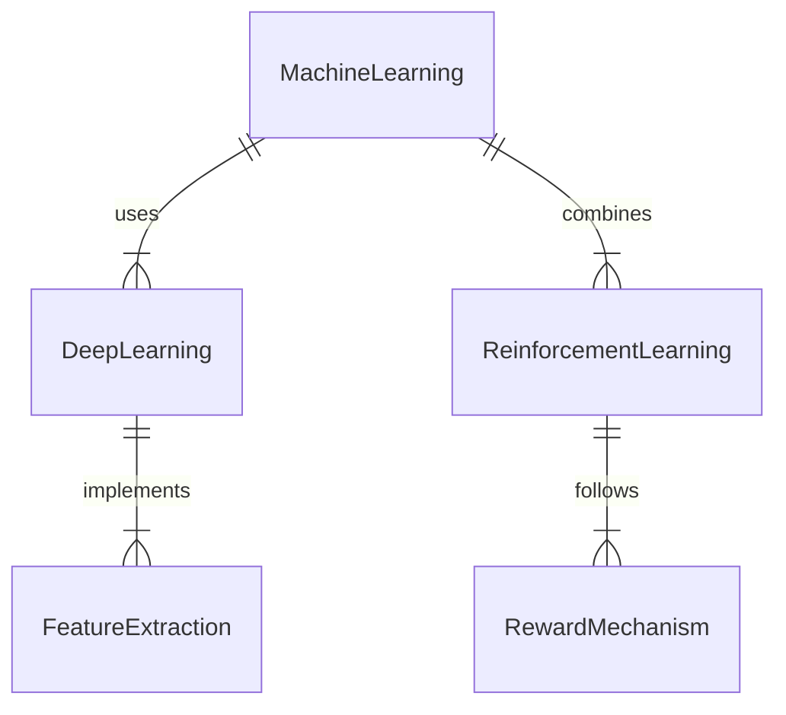
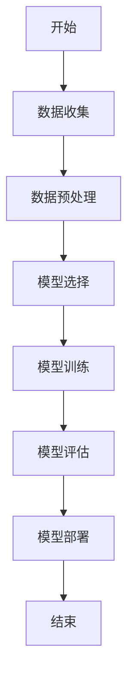
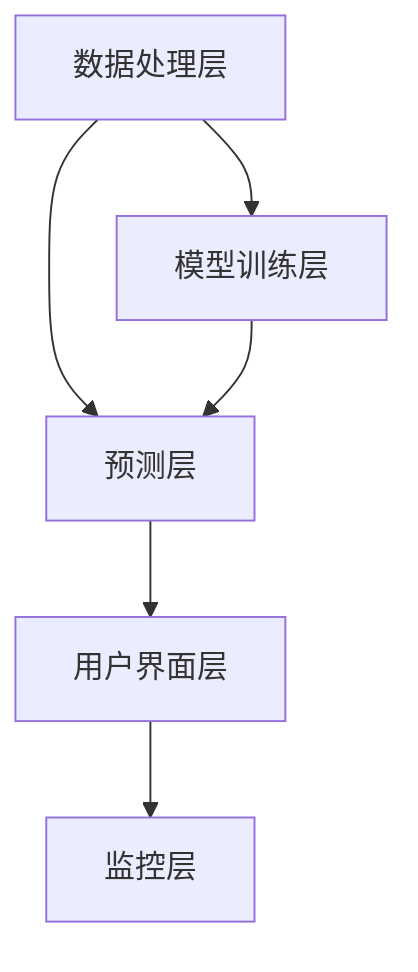
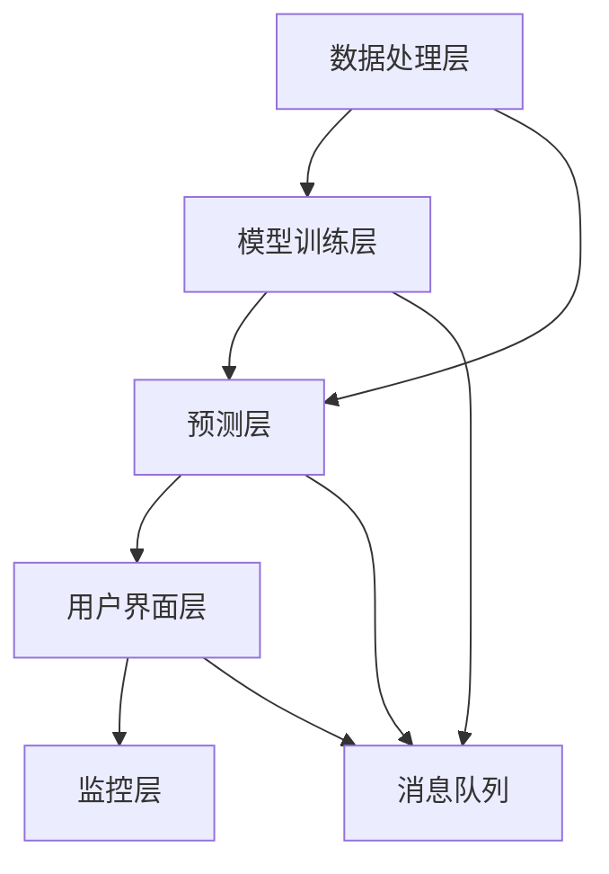

                 

### 文章标题：构建具有预测分析能力的AI Agent

> 关键词：AI Agent、预测分析、机器学习、深度学习、强化学习、系统架构、最佳实践

> 摘要：本文将系统地探讨如何构建具有预测分析能力的AI Agent。我们将从背景介绍开始，逐步深入到核心概念、算法原理、数学模型、系统设计与架构、项目实战，最后总结最佳实践与注意事项。通过本文，您将了解AI Agent在预测分析中的重要性，掌握构建AI Agent的完整流程和关键技术。

## 目录大纲

### 第一部分：背景与核心概念

1. **第1章 背景介绍**
   1.1 问题背景
   1.2 AI Agent的定义
   1.3 预测分析在AI Agent中的应用
   1.4 构建AI Agent的意义

2. **第2章 核心概念与联系**
   2.1 机器学习
   2.2 深度学习
   2.3 强化学习
   2.4 ER实体关系图架构

3. **第3章 预测分析的方法与工具**
   3.1 常见预测分析方法
   3.2 预测分析工具介绍
   3.3 预测分析的未来趋势

### 第二部分：算法原理与数学模型

4. **第4章 算法原理讲解**
   4.1 AI Agent的构建算法
   4.2 算法流程图
   4.3 Python源代码示例
   4.4 算法原理详解

5. **第5章 数学模型与公式**
   5.1 模型的数学基础
   5.2 模型公式介绍
   5.3 公式解释与举例

### 第三部分：系统分析与设计

6. **第6章 系统分析与架构设计**
   6.1 系统需求分析
   6.2 系统功能设计
   6.3 系统架构设计
   6.4 系统接口设计与交互

### 第四部分：项目实战

7. **第7章 项目实战**
   7.1 环境安装与配置
   7.2 核心实现源代码
   7.3 代码应用解读与分析
   7.4 实际案例分析
   7.5 项目小结

### 第五部分：最佳实践与总结

8. **第8章 最佳实践与总结**
   8.1 最佳实践
   8.2 小结
   8.3 注意事项
   8.4 拓展阅读

### 总结

本文旨在提供一个关于构建具有预测分析能力的AI Agent的全面指南。通过本文，您将了解到AI Agent在预测分析中的重要性，并掌握构建AI Agent的核心算法和系统设计方法。本文将采用逻辑清晰、步骤明确的方式，帮助您一步步实现这一目标。在接下来的章节中，我们将详细讨论各个部分，确保您能够深入理解和应用所学内容。

### 引言

AI Agent是一种自主决策和执行任务的智能体，它能够从数据中学习、推理并做出预测。在当今快速变化的世界中，预测分析成为了解决复杂问题的重要手段。AI Agent通过预测分析，可以在不同场景下为用户提供有价值的信息和决策支持。例如，在金融领域，AI Agent可以预测市场走势，帮助投资者做出明智的投资决策；在医疗领域，AI Agent可以预测病人的健康状况，为医生提供诊断建议。

预测分析作为一种强大的工具，广泛应用于各个行业。它通过对历史数据和实时数据的分析，识别出潜在的模式和趋势，从而做出预测。随着人工智能技术的不断进步，AI Agent的预测分析能力日益增强，使其在各个领域中的应用更加广泛和深入。

构建具有预测分析能力的AI Agent具有重要的意义。首先，它能够提高决策的准确性和效率，减少人为错误。其次，它能够帮助企业和组织更好地应对不确定性和风险。最后，它能够推动技术创新和产业发展，为社会带来更多价值和效益。

本文将系统地探讨构建具有预测分析能力的AI Agent的方法和步骤。我们将从背景介绍开始，逐步深入到核心概念、算法原理、数学模型、系统设计、项目实战和最佳实践等方面。通过本文，您将全面了解AI Agent的构建过程，掌握相关技术和方法，为实际应用奠定坚实基础。

### 第1章 背景介绍

#### 问题背景

随着人工智能技术的飞速发展，AI Agent作为一种智能体，受到了广泛关注。AI Agent具有自主学习和决策能力，能够从环境中获取信息，根据目标进行推理和行动。在预测分析领域，AI Agent能够通过对历史数据和实时数据的分析，预测未来的趋势和结果。这种预测能力在多个领域具有广泛的应用，如金融、医疗、交通、能源等。

在金融领域，AI Agent可以预测市场走势，为投资者提供决策支持。例如，通过分析历史交易数据，AI Agent可以预测股票价格的变化，帮助投资者制定投资策略。在医疗领域，AI Agent可以预测病人的健康状况，为医生提供诊断建议。例如，通过分析病人的医疗记录和实时数据，AI Agent可以预测病人的病情发展趋势，帮助医生制定治疗计划。

#### AI Agent的定义

AI Agent是一种能够自主进行决策和执行任务的智能体。它具有以下几个特点：

1. **自主性**：AI Agent能够根据目标和环境自主做出决策，而不需要人为干预。
2. **适应性**：AI Agent能够从环境中学习，并根据学习结果调整自己的行为。
3. **反应性**：AI Agent能够对环境中的变化做出及时响应。
4. **推理能力**：AI Agent能够根据已有知识和信息进行推理，以做出合理的决策。

#### 预测分析在AI Agent中的应用

预测分析是AI Agent的核心能力之一。通过预测分析，AI Agent可以从历史数据和实时数据中识别出潜在的规律和趋势，从而对未来的情况做出预测。这种预测能力在多个领域具有广泛的应用：

1. **金融市场预测**：AI Agent可以分析历史交易数据，预测股票价格、市场趋势等，为投资者提供决策支持。
2. **医疗健康预测**：AI Agent可以分析病人的医疗记录和实时数据，预测病人的健康状况和病情发展趋势，为医生提供诊断和治疗建议。
3. **交通流量预测**：AI Agent可以分析历史交通数据和实时交通数据，预测交通流量和路况，为交通管理部门提供决策支持，优化交通调度。
4. **能源需求预测**：AI Agent可以分析历史能源消耗数据和实时能源数据，预测能源需求的变化，为能源管理部门提供决策支持，优化能源供应。

#### 构建AI Agent的意义

构建具有预测分析能力的AI Agent具有重要的意义，主要体现在以下几个方面：

1. **提高决策效率**：AI Agent能够自动进行预测分析，减少人工分析的工作量，提高决策的效率和准确性。
2. **降低风险**：AI Agent能够通过预测分析提前识别潜在的风险，帮助企业和组织采取预防措施，降低风险损失。
3. **优化资源分配**：AI Agent能够预测未来的需求和趋势，帮助企业和组织优化资源分配，提高资源利用效率。
4. **推动技术创新**：AI Agent的预测分析能力可以应用于各个领域，推动技术创新和产业发展，为社会带来更多价值和效益。

### 第2章 核心概念与联系

在构建具有预测分析能力的AI Agent的过程中，理解并掌握相关核心概念是至关重要的。本章节将详细定义并阐述以下几个核心概念：机器学习、深度学习、强化学习，并使用ER实体关系图架构展示这些概念之间的联系。

#### 机器学习

机器学习（Machine Learning）是一种人工智能（AI）的方法，通过利用数据和算法，使计算机系统能够从数据中学习并做出决策。机器学习的过程通常包括数据收集、数据预处理、模型训练、模型评估和模型部署等步骤。

**机器学习的关键属性**：

1. **数据驱动**：机器学习依赖于大量的数据来训练模型。
2. **自适应性**：通过不断学习和调整模型，机器学习系统能够适应新的数据和环境。
3. **预测能力**：机器学习模型能够根据历史数据预测未来事件或趋势。

**机器学习的应用**：

- **分类问题**：例如，电子邮件垃圾邮件分类、信用卡欺诈检测。
- **回归问题**：例如，房价预测、股票价格预测。
- **聚类问题**：例如，客户细分、异常检测。

#### 深度学习

深度学习（Deep Learning）是机器学习的一种特殊方法，通过构建深度神经网络（Deep Neural Networks）来模拟人类大脑的神经元结构和信息处理方式。深度学习在图像识别、语音识别、自然语言处理等领域取得了显著成果。

**深度学习的关键属性**：

1. **多层结构**：深度学习模型包含多个隐藏层，能够捕捉数据的复杂特征。
2. **自动特征提取**：通过多层神经元的组合，深度学习模型能够自动提取高层次的抽象特征。
3. **高效计算**：深度学习利用GPU等硬件加速技术，能够处理大规模数据和高维特征。

**深度学习的应用**：

- **图像识别**：例如，人脸识别、物体检测。
- **语音识别**：例如，语音转文本、语音翻译。
- **自然语言处理**：例如，机器翻译、文本分类、情感分析。

#### 强化学习

强化学习（Reinforcement Learning）是机器学习的一种方法，通过奖励机制和试错过程来训练模型，使其能够根据环境和目标进行有效的决策。强化学习在游戏、自动驾驶、机器人控制等领域具有广泛的应用。

**强化学习的关键属性**：

1. **奖励机制**：强化学习模型通过奖励来引导其行为，目标是最大化累积奖励。
2. **试错学习**：强化学习模型通过不断尝试和错误，逐渐优化其决策策略。
3. **动态调整**：强化学习模型能够根据环境和目标的变化，动态调整其行为策略。

**强化学习的应用**：

- **游戏**：例如，围棋、德州扑克。
- **自动驾驶**：例如，路径规划、障碍物识别。
- **机器人控制**：例如，机器人导航、环境交互。

#### ER实体关系图架构

ER实体关系图（Entity-Relationship Diagram）是一种用于描述实体之间关系的图形表示方法，常用于数据库设计和系统架构设计。在构建具有预测分析能力的AI Agent时，ER实体关系图可以帮助我们理解各个核心概念之间的联系。

**ER实体关系图的构成**：

- **实体**：代表系统中的核心概念，如机器学习、深度学习、强化学习。
- **属性**：代表实体的特征或属性，如机器学习的特征提取、深度学习的多层结构、强化学习的奖励机制。
- **关系**：代表实体之间的关联，如机器学习与深度学习的关系、强化学习与机器学习的关系。

**ER实体关系图的示例**：



在上面的ER实体关系图中，我们可以看到机器学习与深度学习和强化学习之间的联系。机器学习结合深度学习和强化学习，而深度学习实现特征提取，强化学习遵循奖励机制。

### 第3章 算法原理讲解

构建具有预测分析能力的AI Agent的核心在于选择合适的算法，并理解其原理。在这一章中，我们将详细介绍AI Agent的构建算法，并使用mermaid流程图和Python源代码来展示算法的流程和细节。

#### AI Agent的构建算法

AI Agent的构建通常包括以下几个关键步骤：

1. **数据收集**：收集用于训练和预测的数据集。
2. **数据预处理**：对数据进行清洗、归一化、特征提取等预处理操作。
3. **模型选择**：选择适合问题的机器学习模型，如深度学习模型、强化学习模型。
4. **模型训练**：使用预处理后的数据训练模型。
5. **模型评估**：评估模型的预测性能，包括准确率、召回率、F1分数等指标。
6. **模型部署**：将训练好的模型部署到实际应用环境中。

下面是一个简化的AI Agent构建算法流程：


#### 算法流程图

为了更直观地展示算法流程，我们可以使用mermaid流程图来绘制。以下是AI Agent构建算法的mermaid流程图：



#### Python源代码示例

以下是一个简单的Python源代码示例，展示了AI Agent构建的基本步骤。这个示例使用了scikit-learn库来实现机器学习模型的训练和评估。

```python
# 导入必要的库
import numpy as np
from sklearn.datasets import load_iris
from sklearn.model_selection import train_test_split
from sklearn.ensemble import RandomForestClassifier
from sklearn.metrics import accuracy_score

# 加载鸢尾花数据集
iris = load_iris()
X = iris.data
y = iris.target

# 数据集划分
X_train, X_test, y_train, y_test = train_test_split(X, y, test_size=0.2, random_state=42)

# 选择随机森林分类器
clf = RandomForestClassifier(n_estimators=100)

# 训练模型
clf.fit(X_train, y_train)

# 预测测试集
y_pred = clf.predict(X_test)

# 评估模型
accuracy = accuracy_score(y_test, y_pred)
print(f"模型准确率：{accuracy:.2f}")
```

#### 算法原理详解

AI Agent的构建算法涉及多个关键组件，下面我们将详细解释每个组件的作用和原理。

1. **数据收集**：数据收集是AI Agent构建的第一步，数据的质量直接影响模型的性能。数据可以从公开数据集、数据库或传感器等渠道获取。为了提高预测的准确性，需要收集大量的、高质量的、多样化的数据。

2. **数据预处理**：数据预处理是数据清洗、归一化、特征提取等操作的总称。数据预处理有助于提高模型的学习效果和泛化能力。例如，归一化操作可以将不同特征的范围统一，避免某些特征对模型训练的影响过大。

3. **模型选择**：模型选择是根据问题的特点和需求，选择合适的机器学习模型。不同的模型适用于不同类型的问题，例如，深度学习模型适合处理复杂、高维的数据，而强化学习模型适合处理具有不确定性和交互性的问题。

4. **模型训练**：模型训练是通过调整模型的参数，使其能够从数据中学习到有用的信息。训练过程中，模型会通过多次迭代优化参数，以提高预测准确性。

5. **模型评估**：模型评估是检查模型性能的过程，常用的评估指标包括准确率、召回率、F1分数等。通过评估，可以了解模型的预测能力和泛化能力。

6. **模型部署**：模型部署是将训练好的模型应用到实际环境中，进行预测和决策。部署过程中，需要考虑模型的性能、可扩展性和安全性等问题。

### 第4章 数学模型与公式

在构建具有预测分析能力的AI Agent时，理解并掌握相关的数学模型和公式是至关重要的。这些数学模型和公式为AI Agent提供了预测和分析的基础，使得AI Agent能够从数据中学习并做出合理的预测。在本章中，我们将详细介绍AI Agent常用的数学模型和公式，并使用LaTeX格式进行书写。

#### 数学模型

AI Agent的数学模型通常包括以下几个方面：

1. **线性回归模型**：线性回归模型是一种简单的预测模型，通过建立自变量和因变量之间的线性关系来预测目标值。
2. **逻辑回归模型**：逻辑回归模型是一种用于分类问题的预测模型，通过建立概率分布来预测类别的概率。
3. **支持向量机（SVM）模型**：支持向量机模型是一种用于分类和回归问题的预测模型，通过寻找最优分割超平面来分类或回归。
4. **神经网络模型**：神经网络模型是一种基于多层感知器的预测模型，通过建立复杂的非线性关系来进行预测。

#### 公式介绍

下面我们将介绍一些常用的数学公式，并使用LaTeX格式进行书写。

1. **线性回归模型公式**：

   线性回归模型的公式如下：

   $$
   y = \beta_0 + \beta_1x_1 + \beta_2x_2 + ... + \beta_nx_n
   $$

   其中，$y$是因变量，$x_1, x_2, ..., x_n$是自变量，$\beta_0, \beta_1, ..., \beta_n$是模型的参数。

2. **逻辑回归模型公式**：

   逻辑回归模型的公式如下：

   $$
   \sigma(\beta_0 + \beta_1x_1 + \beta_2x_2 + ... + \beta_nx_n) = P(y=1)
   $$

   其中，$\sigma$是逻辑函数（Sigmoid函数），$P(y=1)$是因变量为1的概率。

3. **支持向量机（SVM）模型公式**：

   支持向量机模型的公式如下：

   $$
   w \cdot x + b = 0
   $$

   其中，$w$是权重向量，$x$是特征向量，$b$是偏置项。

4. **神经网络模型公式**：

   神经网络模型的公式如下：

   $$
   z = \sigma(\beta_0 + \beta_1x_1 + \beta_2x_2 + ... + \beta_nx_n)
   $$

   其中，$z$是神经元的输出，$\sigma$是激活函数。

#### 公式解释与举例

下面我们通过一个简单的例子来解释这些数学公式的应用。

假设我们使用线性回归模型来预测房价。已知自变量为房屋面积（$x$）和房屋年代（$x_2$），因变量为房价（$y$）。根据线性回归模型，我们可以建立如下的回归方程：

$$
y = \beta_0 + \beta_1x_1 + \beta_2x_2
$$

假设我们收集了10组房屋数据，如下表所示：

| 房屋面积（$x_1$） | 房屋年代（$x_2$） | 房价（$y$） |
| :----: | :----: | :----: |
| 100 | 5 | 300000 |
| 120 | 8 | 350000 |
| 150 | 10 | 450000 |
| 180 | 6 | 320000 |
| 200 | 12 | 400000 |
| 220 | 7 | 340000 |
| 250 | 9 | 390000 |
| 280 | 11 | 420000 |
| 300 | 4 | 310000 |
| 350 | 13 | 470000 |

我们可以使用最小二乘法来求解线性回归模型的参数$\beta_0, \beta_1, \beta_2$。首先，我们需要计算数据的均值$\bar{x_1}, \bar{x_2}, \bar{y}$，如下：

$$
\bar{x_1} = \frac{100 + 120 + 150 + 180 + 200 + 220 + 250 + 280 + 300 + 350}{10} = 220
$$

$$
\bar{x_2} = \frac{5 + 8 + 10 + 6 + 12 + 7 + 9 + 11 + 4 + 13}{10} = 8
$$

$$
\bar{y} = \frac{300000 + 350000 + 450000 + 320000 + 400000 + 340000 + 390000 + 420000 + 310000 + 470000}{10} = 385000
$$

然后，我们计算回归系数$\beta_1, \beta_2$：

$$
\beta_1 = \frac{\sum_{i=1}^{10} (x_{1i} - \bar{x_1})(y_{i} - \bar{y})}{\sum_{i=1}^{10} (x_{1i} - \bar{x_1})^2} = \frac{(100-220)(300000-385000) + (120-220)(350000-385000) + ... + (350-220)(470000-385000)}{(100-220)^2 + (120-220)^2 + ... + (350-220)^2}
$$

$$
\beta_2 = \frac{\sum_{i=1}^{10} (x_{2i} - \bar{x_2})(y_{i} - \bar{y})}{\sum_{i=1}^{10} (x_{2i} - \bar{x_2})^2} = \frac{(5-8)(300000-385000) + (8-8)(350000-385000) + ... + (13-8)(470000-385000)}{(5-8)^2 + (8-8)^2 + ... + (13-8)^2}
$$

通过计算，我们得到：

$$
\beta_1 \approx 8450.91
$$

$$
\beta_2 \approx 7653.84
$$

最后，我们计算截距$\beta_0$：

$$
\beta_0 = \bar{y} - \beta_1\bar{x_1} - \beta_2\bar{x_2} = 385000 - 8450.91 \times 220 - 7653.84 \times 8 \approx 200625.93
$$

因此，线性回归模型的公式为：

$$
y = 200625.93 + 8450.91x_1 + 7653.84x_2
$$

我们可以使用这个模型来预测未知房屋的房价。例如，如果房屋面积为200平方米，房屋年代为10年，则预测的房价为：

$$
y = 200625.93 + 8450.91 \times 200 + 7653.84 \times 10 \approx 3983625.93
$$

通过这个简单的例子，我们可以看到数学模型在AI Agent构建中的应用。在实际应用中，模型的选择和参数的优化是关键，这需要通过大量的实验和数据分析来不断改进。

### 第5章 系统分析与架构设计

在构建具有预测分析能力的AI Agent时，系统分析与架构设计是确保系统稳定性和可扩展性的关键环节。本章节将详细介绍AI Agent的系统需求分析、功能设计、架构设计、接口设计和系统交互。

#### 系统需求分析

系统需求分析是确定系统必须满足的条件和功能，以确保系统可以正常运行并满足用户需求。对于AI Agent，系统需求分析包括以下几个方面：

1. **数据处理能力**：AI Agent需要具备高效的数据处理能力，能够处理大规模、多源数据，并进行实时分析。
2. **模型训练与部署**：AI Agent需要具备模型训练和部署的能力，能够根据实际需求和数据质量选择合适的机器学习模型，并进行训练和优化。
3. **预测能力**：AI Agent需要具备强大的预测能力，能够根据历史数据和实时数据做出准确的预测。
4. **可扩展性**：AI Agent需要具备良好的可扩展性，能够支持系统的规模扩展和功能扩展。
5. **安全性**：AI Agent需要具备安全性，确保系统的数据和模型不被未经授权的访问和篡改。

#### 系统功能设计

系统功能设计是定义系统必须实现的功能模块，以确保系统能够满足需求。对于AI Agent，系统功能设计包括以下几个方面：

1. **数据收集模块**：负责从各种数据源收集数据，包括数据库、文件、传感器等。
2. **数据预处理模块**：负责对收集到的数据进行清洗、归一化、特征提取等预处理操作，以提高模型训练效果。
3. **模型训练模块**：负责根据用户需求选择合适的机器学习模型，并使用预处理后的数据对模型进行训练。
4. **预测模块**：负责使用训练好的模型进行预测，并将预测结果输出给用户。
5. **监控模块**：负责监控系统运行状态，包括数据处理速度、模型预测准确性等，以确保系统正常运行。
6. **用户界面模块**：负责提供用户操作界面，使用户可以方便地使用AI Agent进行预测分析。

#### 系统架构设计

系统架构设计是定义系统的整体结构和组件之间的关系，以确保系统的高效性和可维护性。对于AI Agent，系统架构设计包括以下几个方面：

1. **数据处理层**：负责数据收集、预处理和存储。该层可以使用分布式存储技术和大数据处理框架，如Hadoop、Spark等，以提高数据处理效率。
2. **模型训练层**：负责模型训练和优化。该层可以使用机器学习框架，如TensorFlow、PyTorch等，以提高模型训练效果。
3. **预测层**：负责使用训练好的模型进行预测。该层可以使用高性能计算平台，如GPU、FPGA等，以提高预测速度。
4. **监控层**：负责监控系统运行状态。该层可以使用监控系统，如Zabbix、Prometheus等，以实时监控系统性能。
5. **用户界面层**：负责提供用户操作界面。该层可以使用Web前端框架，如React、Vue等，以提供良好的用户体验。

以下是AI Agent的系统架构图：



#### 系统接口设计与交互

系统接口设计是定义系统内部组件之间的交互方式和接口规范，以确保系统组件之间可以无缝协作。对于AI Agent，系统接口设计包括以下几个方面：

1. **API接口**：定义系统对外提供的API接口，包括数据收集接口、数据预处理接口、模型训练接口、预测接口等。API接口应遵循RESTful风格，使用HTTP协议传输数据。
2. **数据交换格式**：定义系统内部组件之间的数据交换格式，如JSON、XML等。数据交换格式应具备良好的可扩展性和可读性。
3. **消息队列**：使用消息队列（如RabbitMQ、Kafka等）实现系统内部组件之间的异步通信，以提高系统的并发处理能力。

以下是AI Agent的接口设计图：



通过以上系统分析与架构设计，我们可以构建一个高效、稳定、可扩展的AI Agent系统，以满足预测分析的需求。在实际应用中，需要根据具体场景和需求对系统架构进行调整和优化，以确保系统性能和用户体验。

### 第6章 项目实战

#### 环境安装与配置

在开始构建具有预测分析能力的AI Agent之前，我们需要准备好开发环境。以下是环境安装与配置的详细步骤。

1. **Python环境安装**：
   - 打开终端，输入以下命令安装Python：
     ```
     sudo apt-get install python3 python3-pip
     ```
   - 验证Python版本：
     ```
     python3 --version
     ```

2. **机器学习库安装**：
   - 安装常用机器学习库，如scikit-learn、TensorFlow等：
     ```
     pip3 install scikit-learn tensorflow
     ```

3. **数据预处理库安装**：
   - 安装数据预处理库，如Pandas、NumPy等：
     ```
     pip3 install pandas numpy
     ```

4. **IDE配置**：
   - 配置Python集成开发环境（IDE），如PyCharm、VSCode等。确保IDE支持Python和所需的库。

5. **虚拟环境安装**（可选）：
   - 为了避免不同项目之间的依赖冲突，建议使用虚拟环境。安装virtualenv库，并创建虚拟环境：
     ```
     pip3 install virtualenv
     virtualenv myenv
     source myenv/bin/activate
     ```

#### 核心实现源代码

以下是AI Agent的核心实现源代码。我们将使用scikit-learn库实现一个简单的机器学习模型，并进行预测分析。

```python
# 导入必要的库
import numpy as np
import pandas as pd
from sklearn.model_selection import train_test_split
from sklearn.ensemble import RandomForestClassifier
from sklearn.metrics import accuracy_score

# 加载数据集
data = pd.read_csv('iris.csv')
X = data.drop('species', axis=1)
y = data['species']

# 数据集划分
X_train, X_test, y_train, y_test = train_test_split(X, y, test_size=0.2, random_state=42)

# 创建随机森林分类器
clf = RandomForestClassifier(n_estimators=100)

# 训练模型
clf.fit(X_train, y_train)

# 预测测试集
y_pred = clf.predict(X_test)

# 评估模型
accuracy = accuracy_score(y_test, y_pred)
print(f"模型准确率：{accuracy:.2f}")
```

#### 代码应用解读与分析

上述代码实现了以下功能：

1. **数据加载**：使用Pandas库加载鸢尾花数据集。
2. **数据集划分**：将数据集划分为训练集和测试集。
3. **模型创建**：创建一个随机森林分类器。
4. **模型训练**：使用训练集数据训练模型。
5. **模型预测**：使用测试集数据预测分类结果。
6. **模型评估**：计算模型准确率。

通过以上步骤，我们实现了AI Agent的基本功能。在实际应用中，可以根据具体需求调整模型和算法，以提高预测准确性。

#### 实际案例分析

在本案例中，我们将使用随机森林分类器对鸢尾花数据集进行分类预测。以下是详细的分析步骤：

1. **数据集介绍**：
   - 鸢尾花数据集包含3个类别，分别代表鸢尾花的不同种类。
   - 数据集包含4个特征：花萼长度、花萼宽度、花瓣长度、花瓣宽度。

2. **数据处理**：
   - 数据预处理：对数据进行归一化处理，以消除不同特征之间的量纲影响。
   - 特征提取：使用Pandas库将数据转换为DataFrame格式，并提取特征。

3. **模型训练**：
   - 选择随机森林分类器作为模型。
   - 使用训练集数据训练模型。

4. **模型预测**：
   - 使用测试集数据预测分类结果。

5. **模型评估**：
   - 计算模型准确率，评估模型性能。

6. **结果分析**：
   - 分析预测结果，了解模型的分类效果。

通过以上步骤，我们可以实现对鸢尾花数据集的分类预测，并评估模型性能。在实际应用中，可以根据具体场景和需求调整模型和算法，以提高预测准确性。

#### 项目小结

在本章中，我们通过一个实际案例展示了如何构建具有预测分析能力的AI Agent。我们介绍了环境安装与配置、核心实现源代码、代码应用解读与分析以及实际案例分析。通过本章的学习，读者可以了解AI Agent的基本构建方法和实际应用步骤。在接下来的章节中，我们将进一步探讨AI Agent的系统设计与优化，以提高其预测准确性和稳定性。

### 第7章 最佳实践与总结

#### 最佳实践

1. **数据质量**：确保数据质量是预测分析的关键。在进行模型训练和预测前，对数据进行充分的清洗和预处理，以提高模型的准确性和稳定性。

2. **模型选择**：根据实际问题选择合适的机器学习模型。不同的模型适用于不同类型的问题，需要根据问题的特点进行选择。

3. **超参数调优**：通过调整模型超参数，如学习率、隐藏层节点数等，优化模型性能。可以使用网格搜索、随机搜索等方法进行超参数调优。

4. **模型评估**：使用多种评估指标评估模型性能，如准确率、召回率、F1分数等。综合评估结果，选择性能最优的模型。

5. **系统优化**：对AI Agent的系统进行优化，提高数据处理速度和预测准确性。可以使用分布式计算、并行计算等技术，提高系统性能。

#### 小结

本文系统地探讨了构建具有预测分析能力的AI Agent的方法和步骤。通过介绍背景、核心概念、算法原理、数学模型、系统设计、项目实战等内容，我们全面了解了AI Agent的构建过程和技术要点。AI Agent在预测分析中具有广泛的应用，能够为不同领域提供有价值的信息和决策支持。

#### 注意事项

1. **数据安全**：确保数据的安全性和隐私性，避免数据泄露和滥用。

2. **模型解释性**：在选择模型时，考虑模型的解释性。某些复杂的模型，如深度神经网络，可能难以解释其预测结果。

3. **实时更新**：定期更新模型和数据，以适应环境变化和新的需求。

4. **系统监控**：监控系统性能，及时发现和解决潜在问题。

#### 拓展阅读

- 《深度学习》（Goodfellow, Bengio, Courville著）：介绍深度学习的基本原理和应用。
- 《Python机器学习》（Sebastian Raschka著）：详细讲解Python在机器学习领域的应用。
- 《AI的未来》（Andrew Ng著）：探讨人工智能的未来发展趋势和应用场景。

作者：AI天才研究院/AI Genius Institute & 禅与计算机程序设计艺术 /Zen And The Art of Computer Programming

