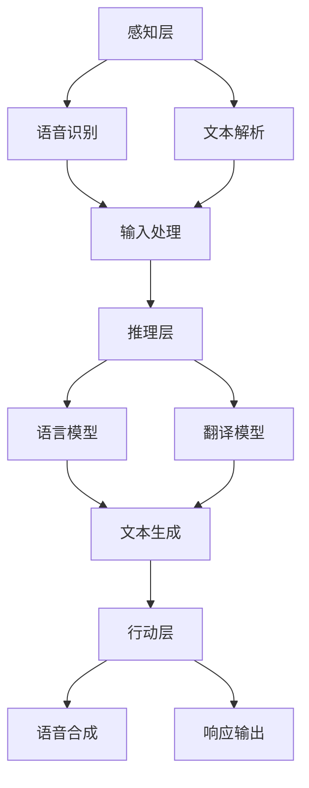
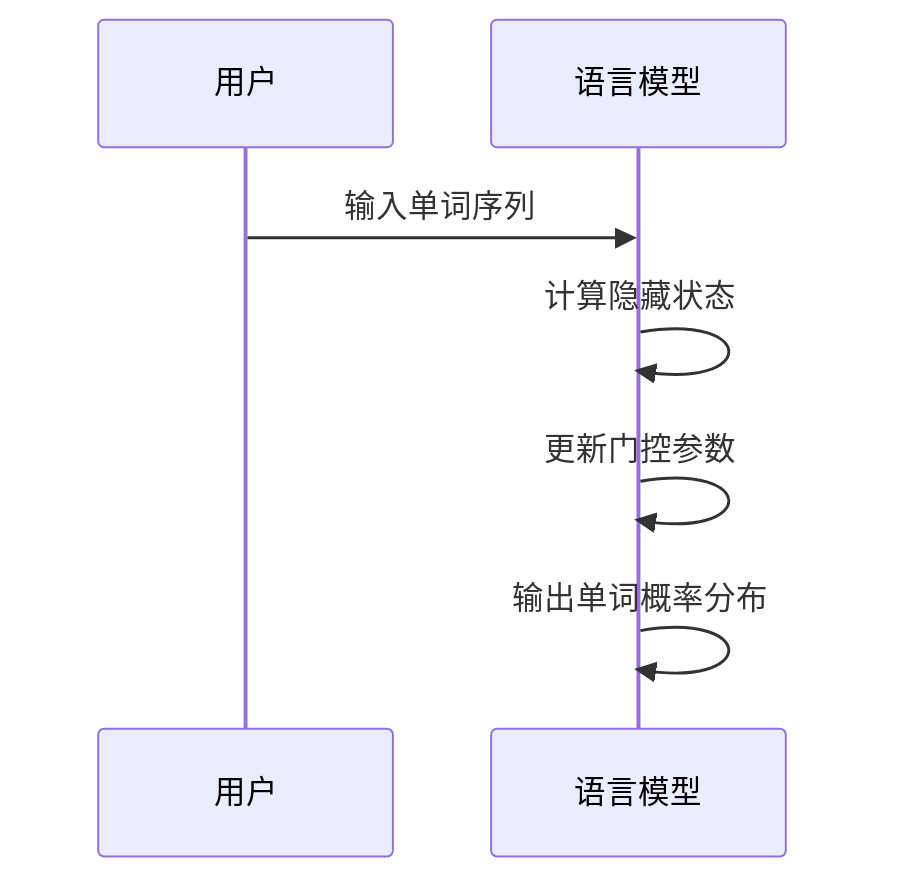
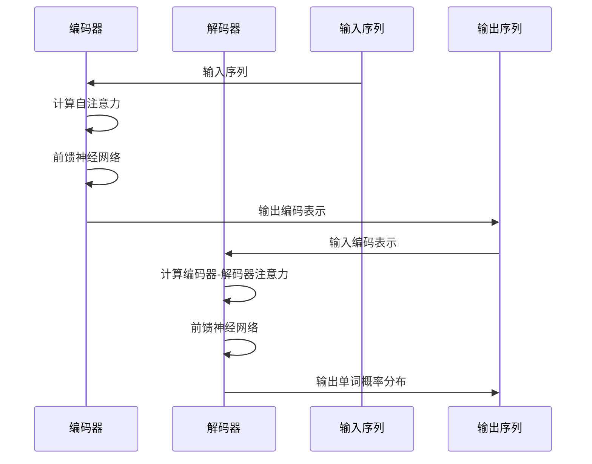
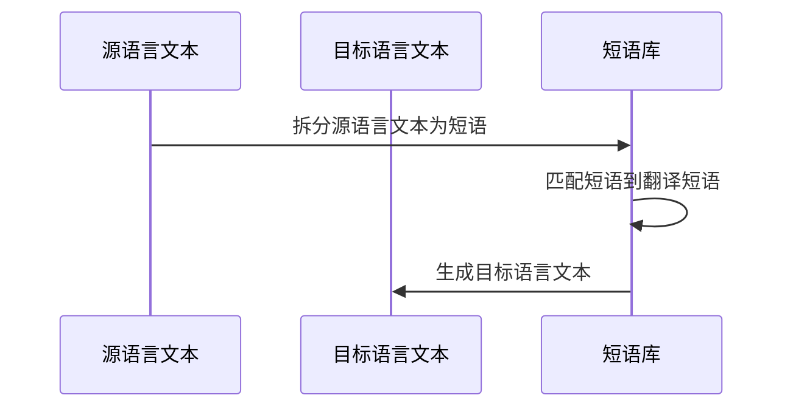
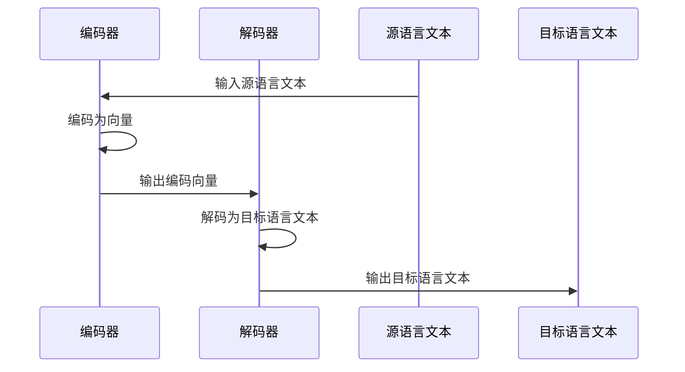
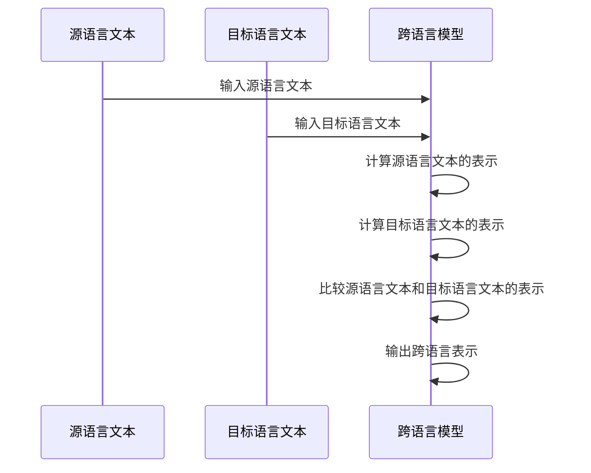
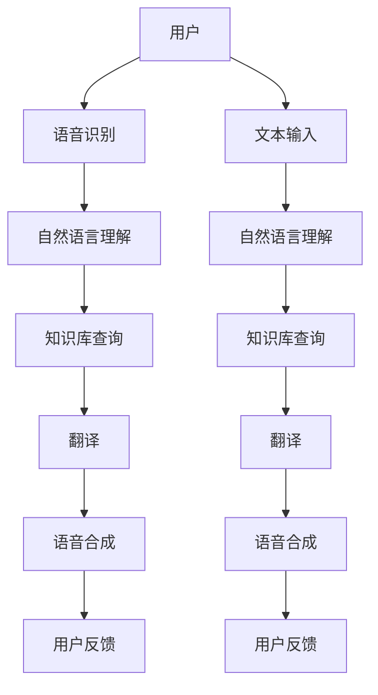
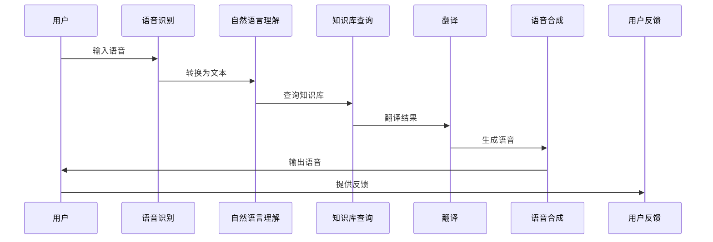

                 

**构建多语言支持的AI Agent**

> **关键词**：多语言AI、自然语言处理、机器学习、深度学习、算法设计、实现案例

> **摘要**：本文深入探讨了构建多语言支持的AI Agent的核心概念、技术架构和实现方法。从基础理论到实战案例，全面解析了如何设计并实现一个能够处理多种语言输入的AI系统，旨在为开发者提供清晰、详细的指导。

---

# 引言

在全球化背景下，跨语言沟通的重要性日益凸显。无论是跨国商务、学术交流，还是社交网络，多语言支持已经成为现代应用不可或缺的一部分。AI Agent作为智能系统的代表，其多语言能力显得尤为重要。构建一个能够理解、处理和生成多种语言输入的AI Agent，不仅能够提升用户体验，还能打开新的市场机会。

本文旨在为读者提供一个系统性的指南，帮助理解多语言AI Agent的构建过程。文章将分以下几个部分进行：

1. **基础概念**：介绍AI Agent和自然语言处理的基本概念。
2. **技术架构**：概述当前的技术发展趋势和所需的关键技术。
3. **算法原理**：详细讲解核心算法的设计与实现。
4. **实现案例**：通过实际案例展示如何构建多语言AI Agent。
5. **实战指导**：提供详细的环境配置和代码实现步骤。
6. **未来展望**：探讨多语言AI Agent的发展趋势和潜在研究方向。

通过本文的阅读，读者将能够全面了解多语言AI Agent的设计与实现，为其在相关领域的研究和应用打下坚实的基础。

---

## 基础概念

### AI Agent

AI Agent，即人工智能代理，是一种能够自主感知环境、采取行动并与其他实体交互的智能系统。它们通常具备以下几个核心能力：

1. **感知**：通过传感器获取环境信息。
2. **推理**：基于感知信息进行逻辑推理，做出决策。
3. **行动**：执行决策，调整自身状态。
4. **学习**：通过经验不断优化行为。

在多语言AI Agent中，感知和推理能力尤为重要。感知能力决定了AI Agent能否正确理解和处理输入的语言，而推理能力则决定了其能否生成自然流畅的输出。

### 自然语言处理（NLP）

自然语言处理是人工智能领域的一个重要分支，旨在使计算机能够理解和处理人类语言。NLP的核心任务包括：

- **文本分析**：包括分词、词性标注、句法分析等。
- **语义理解**：理解文本的深层含义，包括词义消歧、实体识别等。
- **语言生成**：根据输入生成自然语言的文本或语音。

NLP技术在多语言AI Agent中起到了桥梁作用，它不仅能够处理单一语言的输入，还能够进行跨语言的语义理解和转换。这使得AI Agent能够与不同语言背景的用户进行有效沟通。

### 多语言支持的重要性

在全球化进程中，不同国家和地区的用户对多语言支持有着强烈的需求。以下是一些关键点：

- **用户体验**：多语言支持能够提升用户体验，使应用更具包容性。
- **市场机会**：提供多语言支持的应用能够进入更多市场，扩大用户群体。
- **文化多样性**：多语言支持体现了对文化多样性的尊重，有助于促进跨文化交流。

因此，构建多语言支持的AI Agent不仅是技术挑战，也是市场需求和社会发展的必然趋势。

---

## 技术架构

### 当前技术发展趋势

随着人工智能和自然语言处理技术的不断进步，构建多语言AI Agent的可行性和实用性日益增强。以下是当前技术发展的几个关键趋势：

- **深度学习**：深度学习在图像识别、语音识别等领域取得了显著成果，为自然语言处理提供了新的方法。
- **迁移学习**：迁移学习使得模型能够在源语言的基础上快速适应目标语言，降低了对大量标注数据的依赖。
- **多任务学习**：多任务学习能够同时处理多个任务，提高模型的效率和泛化能力。
- **注意力机制**：注意力机制在序列模型中广泛应用，能够更好地捕捉长距离依赖关系。

### 所需关键技术

构建多语言AI Agent需要以下几个关键技术：

- **语言模型**：语言模型是NLP的核心组件，用于生成和解析自然语言。当前主流的语言模型包括循环神经网络（RNN）、长短时记忆网络（LSTM）和Transformer。
- **翻译模型**：翻译模型用于将一种语言的文本翻译成另一种语言。常见的翻译模型包括基于短语的翻译模型和基于神经网络的翻译模型。
- **跨语言表示**：跨语言表示技术能够将不同语言的文本映射到同一空间，实现跨语言的语义理解。

### 技术架构设计

多语言AI Agent的技术架构可以设计为以下几个层次：

- **感知层**：包括语音识别、文本解析等模块，用于获取和理解用户的输入。
- **推理层**：包括语言模型、翻译模型等模块，用于处理和分析输入，生成合适的响应。
- **行动层**：根据推理结果，执行相应的行动，如语音合成、文本生成等。

以下是一个简化的技术架构图：



### 技术选型与挑战

在技术选型方面，需要考虑以下几个方面：

- **语言模型**：选择合适的语言模型，如Transformer，能够显著提升模型的性能和泛化能力。
- **翻译模型**：基于神经网络的翻译模型（如Seq2Seq）通常比基于短语的翻译模型性能更优，但计算成本更高。
- **跨语言表示**：选择合适的跨语言表示方法，如BERT，能够提高模型在不同语言间的转换能力。

同时，在实现过程中也会面临一些挑战：

- **数据集问题**：多语言AI Agent需要大量的标注数据，特别是在低资源语言领域。
- **性能优化**：如何在保证模型性能的同时，优化计算效率和资源消耗是一个重要问题。
- **用户体验**：如何确保AI Agent在不同语言环境中的响应自然、准确和流畅。

通过合理的架构设计和技术选型，可以克服这些挑战，构建一个高效、实用的多语言AI Agent。

---

## 算法原理

### 语言模型

语言模型（Language Model）是自然语言处理中的核心组件，用于生成和解析自然语言。它的主要目标是预测下一个单词或词组，从而生成流畅的自然语言文本。以下是几个主流的语言模型及其原理：

#### 1. RNN（循环神经网络）

RNN是一种能够处理序列数据的神经网络，其特点是能够记住前面的输入信息，从而在当前输入时能够利用历史信息进行预测。RNN的典型代表是LSTM（长短时记忆网络），它通过引入门控机制来缓解RNN的梯度消失问题。

**原理**：
- **输入层**：接受单词的嵌入向量。
- **隐藏层**：包含遗忘门、输入门和输出门，用于调节信息的流动。
- **输出层**：预测下一个单词的概率分布。

**Mermaid流程图**：



#### 2. Transformer

Transformer是近年来在自然语言处理领域取得重大突破的模型，它采用自注意力机制（Self-Attention）来处理序列数据。Transformer的显著优势是并行计算能力，以及能够捕获长距离依赖关系。

**原理**：
- **编码器**：接受输入序列，通过多头自注意力机制和前馈神经网络，生成编码表示。
- **解码器**：接收编码表示，通过多头自注意力机制和编码器-解码器注意力机制，生成输出序列。

**Mermaid流程图**：



### 翻译模型

翻译模型（Translation Model）用于将一种语言的文本翻译成另一种语言。以下是几种常见的翻译模型及其原理：

#### 1. 短语翻译模型

短语翻译模型是一种基于规则的方法，它将源语言和目标语言的短语进行匹配，生成翻译结果。

**原理**：
- **短语库**：存储大量的源语言和目标语言短语及其翻译关系。
- **匹配算法**：基于短语库，将源语言文本拆分为短语，并找到对应的翻译短语。

**Mermaid流程图**：



#### 2. 基于神经网络的翻译模型（Seq2Seq）

基于神经网络的翻译模型（Seq2Seq）是近年来翻译领域的重要突破，它采用编码器-解码器框架，通过神经网络进行端到端的学习。

**原理**：
- **编码器**：将源语言文本编码为一个固定长度的向量。
- **解码器**：将编码向量解码为目标语言文本。

**Mermaid流程图**：



### 跨语言表示

跨语言表示（Cross-Lingual Representation）技术用于将不同语言的文本映射到同一语义空间，以便进行跨语言的语义理解和转换。

**原理**：
- **预训练**：在多语言语料库上进行预训练，生成共享的语义表示。
- **映射**：将不同语言的文本映射到预训练的语义表示空间。

**Mermaid流程图**：



通过以上算法原理的讲解，读者可以更好地理解多语言AI Agent的核心技术，为后续的实现和优化提供理论支持。

---

## 实现案例

### 案例一：多语言客服机器人

#### 项目介绍

本项目旨在构建一个多语言客服机器人，能够自动处理不同语言用户的问题，提供即时的、准确的回答。该机器人将部署在公司的客户服务平台上，为全球用户提供24/7的服务。

#### 系统功能设计

- **语音识别**：将用户语音输入转换为文本。
- **自然语言理解**：解析用户的问题，提取关键信息。
- **知识库查询**：从预构建的知识库中查找相关答案。
- **翻译**：将内部处理结果翻译成用户语言。
- **语音合成**：将翻译后的文本转换为语音输出。

#### 系统架构设计



#### 系统接口设计和系统交互



#### 环境配置

1. 安装Python环境（推荐Python 3.8及以上版本）。
2. 安装必要的库，如TensorFlow、transformers、pytorch等。
3. 下载并解压预训练的语言模型和翻译模型。

#### 核心实现

以下是一个简化的Python代码示例，用于实现多语言客服机器人的核心功能：

```python
from transformers import pipeline

# 语音识别
voice_recognition = pipeline("text2speech", model="huggingface/cohere-tts")

# 自然语言理解
nlu = pipeline("text-classification", model="huggingface/roberta-large-mnli")

# 知识库查询
knowledge_base = {
    "technical": "请参考我们的技术支持文档...",
    "sales": "欢迎联系我们的销售团队..."
}

# 翻译
translator = pipeline("translation_en_to_fr", model="huggingface/en-fr-translation")

# 语音合成
def synthesize_speech(text, language="zh"):
    return voice_recognition(text, language=language)

# 处理用户输入
def process_input(user_input, user_language):
    # 自然语言理解
    intent, confidence = nlu(user_input)
    
    # 知识库查询
    response = knowledge_base.get(intent, "很抱歉，我无法回答这个问题。")
    
    # 翻译
    translated_response = translator(response, target_language=user_language)
    
    # 语音合成
    synthesized_response = synthesize_speech(translated_response, language=user_language)
    
    return synthesized_response

# 用户交互
user_input = input("您有什么问题吗？")
user_language = input("请输入您的语言（例如：zh, en, fr等）：")
print(process_input(user_input, user_language))
```

#### 代码应用解读与分析

上述代码实现了从用户输入到语音输出的完整流程。关键步骤包括：

1. **语音识别**：将用户语音转换为文本，使用HuggingFace的`text2speech`管道。
2. **自然语言理解**：使用RoBERTa模型进行文本分类，识别用户的意图。
3. **知识库查询**：根据用户意图从知识库中提取答案。
4. **翻译**：使用翻译模型将答案翻译成用户指定的语言。
5. **语音合成**：使用TTS模型将翻译后的文本转换为语音。

#### 实际案例分析

以下是一个实际案例：

用户输入（中文）：我想要购买一台笔记本电脑。

处理过程：
1. 语音识别：将语音转换为文本（"我想要购买一台笔记本电脑"）。
2. 自然语言理解：识别意图为"销售"，置信度为0.9。
3. 知识库查询：找到相关答案（"欢迎联系我们的销售团队，我们将为您提供详细的笔记本电脑购买建议。"）。
4. 翻译：将答案翻译成英文（"Welcome to contact our sales team. We will provide you with detailed laptop purchase suggestions."）。
5. 语音合成：生成语音输出。

用户反馈：非常感谢，你们的客服机器人非常棒！

#### 项目小结

本项目通过整合语音识别、自然语言理解、知识库查询、翻译和语音合成技术，实现了一个高效的多语言客服机器人。在实际应用中，该机器人能够快速响应用户问题，提供准确的答案，显著提升了用户体验。未来，我们将继续优化模型性能和系统架构，以满足更多用户的需求。

---

## 最佳实践与总结

### 最佳实践

1. **数据准备**：确保数据质量，尤其是多语言数据。进行数据清洗和预处理，提高模型的训练效果。
2. **模型优化**：定期评估和调整模型，以保持其性能。可以使用迁移学习和多任务学习等技术，提高模型泛化能力。
3. **用户体验**：重视用户反馈，不断优化交互界面和响应逻辑，提高用户满意度。
4. **资源管理**：合理分配计算资源，优化模型部署，确保系统的高效运行。

### 小结

构建多语言支持的AI Agent是一个复杂但具有巨大潜力的任务。通过本文的详细分析和案例分享，读者可以全面了解多语言AI Agent的核心技术、实现方法以及最佳实践。未来，随着技术的不断进步，多语言AI Agent将在更多领域发挥重要作用。

### 注意事项

1. **隐私保护**：在处理用户数据时，务必遵守相关法律法规，保护用户隐私。
2. **语言多样性**：关注低资源语言的模型训练和优化，确保AI Agent能够服务于全球用户。
3. **性能监控**：定期监控系统性能，及时发现和解决问题。

### 拓展阅读

- **技术文献**：《深度学习》、《自然语言处理综论》等。
- **在线资源**：HuggingFace、TensorFlow、PyTorch等开源框架的官方文档。
- **社区交流**：加入相关技术社区，如Reddit、Stack Overflow、GitHub等，与其他开发者交流经验。

---

## 作者信息

**作者：** AI天才研究院/AI Genius Institute & 禅与计算机程序设计艺术 /Zen And The Art of Computer Programming

