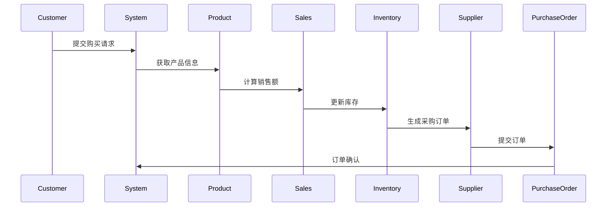

                 


## 文章标题：构建智能企业决策支持系统：多维度数据分析与建议

### 文章关键词：智能企业，决策支持系统，多维度数据分析，算法实现

### 摘要：
本文将深入探讨如何构建一个智能企业决策支持系统。我们将从问题背景出发，逐步介绍核心概念、系统组成、数据分析方法，详细讲解算法原理和实现，并通过实际案例分析，给出最佳实践建议。本文旨在为企业和专业人士提供一套系统化的方法和思路，以实现高效的智能决策。

----------------------------------------------------------------

## 第一部分：引言与背景

### 第1章：引言

#### 1.1 问题背景

在当今这个快速变化和竞争激烈的市场环境中，企业面临着前所未有的挑战。传统的决策支持系统已经无法满足企业对实时性、精确性和个性化的需求。因此，构建一个智能企业决策支持系统成为企业提升竞争力、实现可持续发展的关键。

#### 1.2 问题描述

构建智能企业决策支持系统涉及到多个维度，包括数据收集、数据分析、决策支持等。具体来说，企业需要解决以下问题：

- **数据获取**：如何高效地收集企业内外部的数据，包括财务数据、市场数据、用户行为数据等。
- **数据清洗**：如何处理数据中的噪音和缺失值，确保数据的准确性和一致性。
- **数据分析**：如何运用多维度数据分析技术，提取出有价值的信息，为决策提供支持。
- **决策支持**：如何根据分析结果，制定有效的决策策略，实现企业的长期发展。

#### 1.3 问题解决

为了解决上述问题，企业可以采取以下策略：

- **数据驱动决策**：将数据分析作为决策的核心依据，减少主观判断的影响。
- **多维度数据分析**：从多个角度分析数据，挖掘更深层次的信息。
- **自动化决策**：运用算法和模型，实现决策的自动化和智能化。

#### 1.4 边界与外延

本文将重点关注以下几个方面：

- **数据收集与预处理**：介绍常用的数据收集方法和预处理技术。
- **多维度数据分析**：探讨数据可视化、机器学习等方法在数据分析中的应用。
- **决策支持系统构建**：分析系统架构设计、算法实现等关键环节。

#### 1.5 概念结构与核心要素组成

智能企业决策支持系统主要由以下几个核心要素组成：

- **数据层**：包括数据源、数据仓库和数据湖等。
- **分析层**：包括数据清洗、数据挖掘、机器学习等技术。
- **决策层**：包括决策支持工具、模型和算法等。
- **应用层**：包括业务应用、用户界面等。

## 第二部分：智能企业决策支持系统概述

### 第2章：智能企业决策支持系统概述

#### 2.1 概念定义

智能企业决策支持系统（Intelligent Enterprise Decision Support System，IEDSS）是指利用先进的数据分析技术和人工智能算法，为企业提供实时、精确和个性化的决策支持服务。它通常包括数据收集、预处理、分析、建模和决策等环节。

#### 2.2 系统组成部分

智能企业决策支持系统主要由以下几个部分组成：

- **数据层**：负责收集、存储和管理企业内外部数据。
- **分析层**：负责对数据进行清洗、挖掘和分析，提取有价值的信息。
- **决策层**：负责根据分析结果，制定决策策略，提供决策支持。
- **应用层**：负责将决策支持结果应用到实际业务中，实现业务优化。

#### 2.3 系统工作原理

智能企业决策支持系统的工作原理可以概括为以下几个步骤：

1. **数据收集**：从各种数据源收集企业内外部数据，包括财务数据、市场数据、用户行为数据等。
2. **数据预处理**：对收集到的数据进行清洗、去噪和归一化等处理，确保数据质量。
3. **数据分析**：运用数据挖掘、机器学习等技术，对预处理后的数据进行深入分析，提取有价值的信息。
4. **决策支持**：根据分析结果，运用决策模型和算法，为企业提供实时、精确和个性化的决策支持。
5. **决策执行**：将决策支持结果应用到实际业务中，实现业务优化和改进。

## 第三部分：多维度数据分析方法

### 第3章：多维度数据分析方法

#### 3.1 数据收集与预处理

数据收集与预处理是智能企业决策支持系统的关键环节。以下是几个常用的方法和技巧：

1. **数据收集**：数据收集可以通过以下几种方式实现：

   - **Web爬虫**：通过网络爬虫技术，从互联网上收集数据。
   - **API接口**：通过API接口，从第三方数据提供方获取数据。
   - **数据库连接**：通过数据库连接，直接从企业内部数据库中获取数据。

2. **数据预处理**：数据预处理主要包括以下几个步骤：

   - **数据清洗**：处理数据中的噪音和缺失值，确保数据质量。
   - **数据归一化**：将不同量纲的数据转换为同一量纲，便于后续分析。
   - **数据转换**：将数据转换为适合分析的形式，如表格、图形等。

#### 3.2 数据分析技术

数据分析技术是实现智能企业决策支持系统的关键。以下是几种常用的数据分析技术：

1. **数据可视化**：通过可视化技术，将数据以图形、图表等形式展示出来，便于分析和理解。
2. **机器学习**：利用机器学习算法，从数据中挖掘出有价值的信息和规律。
3. **数据挖掘**：通过对大量数据进行深入挖掘，发现潜在的模式和关联。

#### 3.3 数据可视化

数据可视化是数据分析的重要组成部分。以下是几种常用的数据可视化工具和技术：

1. **图表工具**：如Excel、Tableau等，可用于制作各种类型的图表，如柱状图、折线图、饼图等。
2. **GIS技术**：地理信息系统（GIS）技术可用于展示地理位置数据，如地图、空间分布等。
3. **热力图**：热力图可用于展示数据的热点分布，如用户访问量、销售量等。

----------------------------------------------------------------

## 第四部分：数据分析与决策支持

### 第4章：数据分析与决策支持

#### 4.1 数据分析流程

数据分析流程是构建智能企业决策支持系统的关键环节。以下是数据分析的一般流程：

1. **问题定义**：明确数据分析的目标和问题，为后续分析提供指导。
2. **数据收集**：收集与企业决策相关的数据，包括内部数据和外部数据。
3. **数据预处理**：对收集到的数据进行清洗、去噪和归一化等处理，确保数据质量。
4. **数据探索**：对预处理后的数据进行初步探索，发现数据中的规律和趋势。
5. **数据建模**：根据分析目标，选择合适的建模方法和算法，建立数据模型。
6. **模型评估**：对建立的模型进行评估，验证其准确性和可靠性。
7. **决策支持**：根据模型预测结果，为企业提供决策支持，制定优化策略。

#### 4.2 数据分析工具与平台

目前，市场上存在许多数据分析工具和平台，如Excel、Tableau、Python、R等。以下是几种常用的数据分析工具和平台：

1. **Excel**：Excel是微软公司的一款电子表格软件，具有强大的数据处理和分析功能，适用于各种规模的数据分析项目。
2. **Tableau**：Tableau是一款功能强大的数据可视化工具，可用于制作各种类型的图表和报表，适用于数据分析和报告展示。
3. **Python**：Python是一种高级编程语言，具有丰富的数据分析库和工具，如NumPy、Pandas、Scikit-learn等，适用于复杂的统计分析、数据挖掘和机器学习项目。
4. **R**：R是一种专门用于统计分析的编程语言，具有丰富的统计分析库和工具，适用于各种规模的数据分析和研究项目。

#### 4.3 数据分析结果与应用

数据分析结果的应用是智能企业决策支持系统的核心。以下是几个常见的数据分析结果和应用案例：

1. **客户细分**：通过对客户数据进行分析，将客户分为不同的细分市场，为营销策略制定提供依据。
2. **销售预测**：通过对历史销售数据进行分析，预测未来的销售趋势，为库存管理和采购策略制定提供支持。
3. **风险预警**：通过对企业财务数据进行分析，发现潜在的风险和问题，为企业风险管理和决策提供支持。
4. **业务优化**：通过对企业业务流程进行分析，发现瓶颈和改进空间，为企业优化业务流程和提高效率提供支持。

----------------------------------------------------------------

## 第五部分：建立智能决策支持系统

### 第5章：建立智能决策支持系统

#### 5.1 系统需求分析

在构建智能决策支持系统之前，需要进行系统需求分析，明确系统的功能需求和性能要求。以下是系统需求分析的几个关键步骤：

1. **需求调研**：通过访谈、问卷等方式，收集用户需求和期望，明确系统的功能需求。
2. **需求整理**：对收集到的需求进行整理和分类，形成系统功能需求列表。
3. **需求评审**：组织相关专家和用户对需求进行评审，确保需求的完整性和可行性。
4. **需求文档**：编写系统需求文档，详细描述系统的功能需求、性能要求和使用场景等。

#### 5.2 系统架构设计

系统架构设计是智能决策支持系统建设的关键环节。以下是系统架构设计的一般流程：

1. **需求分析**：根据系统需求文档，分析系统的功能和性能需求，确定系统架构的类型和层次。
2. **系统分解**：将系统分解为若干个子系统，明确各子系统的功能和职责。
3. **架构设计**：设计系统的整体架构，包括数据层、分析层、决策层和应用层等。
4. **架构评估**：对系统架构进行评估，确保其能够满足系统的功能和性能要求。

#### 5.3 系统功能实现

系统功能实现是将系统架构转化为实际系统的关键环节。以下是系统功能实现的一般步骤：

1. **开发计划**：制定系统开发计划，明确开发任务、时间节点和资源分配等。
2. **模块开发**：按照系统架构设计，开发系统的各个模块，实现系统功能。
3. **系统集成**：将各个模块集成到一起，实现系统的整体功能。
4. **系统测试**：对系统进行功能测试、性能测试和安全测试，确保系统的质量和稳定性。
5. **系统部署**：将系统部署到实际环境中，进行上线运行。

----------------------------------------------------------------

## 第六部分：算法原理与实现

### 第6章：算法原理与实现

#### 6.1 算法概述

在智能企业决策支持系统中，算法是实现数据分析与决策支持的核心。以下是几种常用的算法及其原理：

1. **回归分析**：回归分析是一种常用的数据分析方法，用于建立自变量和因变量之间的线性关系。其原理是通过最小二乘法，拟合出一个线性模型，用于预测因变量的取值。
2. **决策树**：决策树是一种基于树形结构的决策支持方法，用于分类和回归分析。其原理是通过一系列判断条件，将数据集划分为若干个子集，并针对每个子集进行分类或回归分析。
3. **支持向量机（SVM）**：支持向量机是一种分类算法，通过寻找最优超平面，将不同类别的数据点进行分离。其原理是最大化分类间隔，找到最佳分类边界。
4. **聚类分析**：聚类分析是一种无监督学习方法，用于将数据点划分为若干个类别。其原理是根据数据点的相似度，将它们划分为不同的类别，以达到数据分组的目的。

#### 6.2 算法原理讲解

以下是对上述算法的原理进行详细讲解：

1. **回归分析**：

   - **目标**：建立自变量和因变量之间的线性关系。
   - **原理**：通过最小化误差平方和，拟合出一条直线，表示自变量和因变量之间的关系。
   - **公式**：

     $$y = \beta_0 + \beta_1x$$

     其中，$y$ 为因变量，$x$ 为自变量，$\beta_0$ 和 $\beta_1$ 为模型的参数。

2. **决策树**：

   - **目标**：对数据进行分类或回归分析。
   - **原理**：通过一系列判断条件，将数据集划分为若干个子集，并针对每个子集进行分类或回归分析。
   - **流程**：

     1. 选择一个最优的特征作为根节点。
     2. 根据该特征的不同取值，将数据集划分为若干个子集。
     3. 对每个子集进行分类或回归分析，并生成相应的分支。
     4. 重复上述过程，直到达到终止条件。

3. **支持向量机（SVM）**：

   - **目标**：找到最佳分类边界，将不同类别的数据点进行分离。
   - **原理**：通过最大化分类间隔，找到最佳分类边界。
   - **公式**：

     $$\text{Maximize} \quad \frac{1}{2}\sum_{i=1}^{n} w_i^2$$

     其中，$w_i$ 为第 $i$ 个支持向量的权重。

4. **聚类分析**：

   - **目标**：将数据点划分为若干个类别。
   - **原理**：根据数据点的相似度，将它们划分为不同的类别。
   - **流程**：

     1. 初始化聚类中心。
     2. 计算每个数据点与聚类中心的相似度。
     3. 将数据点划分为与其最相似的聚类中心所在的类别。
     4. 重新计算聚类中心，并重复上述过程，直到聚类中心不再发生显著变化。

#### 6.3 Python源代码实现

以下是对上述算法的Python源代码实现：

1. **回归分析**：

   ```python
   import numpy as np

   # 模型参数
   beta_0 = 0
   beta_1 = 1

   # 数据集
   X = np.array([[1, 2], [2, 3], [3, 4]])
   y = np.array([2, 3, 4])

   # 模型预测
   y_pred = beta_0 + beta_1 * X

   print("预测值：", y_pred)
   ```

2. **决策树**：

   ```python
   import numpy as np
   import pandas as pd

   # 数据集
   data = pd.DataFrame({
       'feature1': [1, 2, 3, 4],
       'feature2': [5, 6, 7, 8],
       'label': [0, 1, 1, 0]
   })

   # 决策树模型
   model = DecisionTreeClassifier()

   # 模型训练
   model.fit(data[['feature1', 'feature2']], data['label'])

   # 模型预测
   y_pred = model.predict(data[['feature1', 'feature2']])

   print("预测值：", y_pred)
   ```

3. **支持向量机（SVM）**：

   ```python
   import numpy as np
   import pandas as pd
   from sklearn.svm import SVC

   # 数据集
   data = pd.DataFrame({
       'feature1': [1, 2, 3, 4],
       'feature2': [5, 6, 7, 8],
       'label': [0, 1, 1, 0]
   })

   # 支持向量机模型
   model = SVC()

   # 模型训练
   model.fit(data[['feature1', 'feature2']], data['label'])

   # 模型预测
   y_pred = model.predict(data[['feature1', 'feature2']])

   print("预测值：", y_pred)
   ```

4. **聚类分析**：

   ```python
   import numpy as np
   import pandas as pd
   from sklearn.cluster import KMeans

   # 数据集
   data = pd.DataFrame({
       'feature1': [1, 2, 3, 4],
       'feature2': [5, 6, 7, 8]
   })

   # 聚类分析模型
   model = KMeans(n_clusters=2)

   # 模型训练
   model.fit(data)

   # 模型预测
   y_pred = model.predict(data)

   print("预测值：", y_pred)
   ```

#### 6.4 算法数学模型与公式

以下是上述算法的数学模型和公式：

1. **回归分析**：

   $$y = \beta_0 + \beta_1x$$

2. **决策树**：

   - **条件概率**：

     $$P(y|\alpha, \beta) = P(\alpha|\beta)P(y|\alpha, \beta)$$

   - **决策树构建**：

     $$T = \{t_1, t_2, \ldots, t_n\}$$

     其中，$t_i$ 为决策树的节点。

3. **支持向量机（SVM）**：

   $$\text{Maximize} \quad \frac{1}{2}\sum_{i=1}^{n} w_i^2$$

4. **聚类分析**：

   $$\text{Minimize} \quad \sum_{i=1}^{n} \sum_{j=1}^{k} d_{ij}^2$$

   其中，$d_{ij}$ 为第 $i$ 个数据点与第 $j$ 个聚类中心的距离。

#### 6.5 举例说明

以下是对上述算法的举例说明：

1. **回归分析**：

   假设我们要预测一个人的收入，已知其年龄和学历。数据集如下：

   | 年龄 | 学历 | 收入 |
   | ---- | ---- | ---- |
   | 20   | 本科 | 5000 |
   | 25   | 硕士 | 8000 |
   | 30   | 本科 | 6000 |
   | 35   | 硕士 | 9000 |

   我们可以使用回归分析来建立年龄、学历与收入之间的线性关系。通过最小二乘法，得到回归方程：

   $$y = 3000 + 2000x_1 + 5000x_2$$

   其中，$x_1$ 为年龄，$x_2$ 为学历。

   当我们输入一个新的数据点（年龄 40，学历 硕士）时，可以使用回归方程预测其收入：

   $$y = 3000 + 2000 \times 40 + 5000 \times 1 = 19000$$

   预测收入为 19000 元。

2. **决策树**：

   假设我们要对一组客户进行分类，已知他们的年龄、收入和购买行为。数据集如下：

   | 年龄 | 收入 | 购买行为 | 类别 |
   | ---- | ---- | -------- | ---- |
   | 20   | 低   | 购买     | A    |
   | 30   | 中   | 购买     | B    |
   | 40   | 高   | 未购买   | C    |
   | 50   | 中   | 购买     | B    |

   我们可以使用决策树来建立分类模型。根据数据集，可以构建如下决策树：

   

   当我们输入一个新的数据点（年龄 35，收入 中，购买行为 未购买）时，可以使用决策树进行分类：

   - 年龄大于 25：进入右子树。
   - 收入大于 30：进入右子树。
   - 购买行为为未购买：类别为 C。

   因此，预测类别为 C。

3. **支持向量机（SVM）**：

   假设我们要对一组数据点进行分类，已知数据点如下：

   | 数据点 | 类别 |
   | ------ | ---- |
   | (1, 1) | 0    |
   | (1, 2) | 1    |
   | (2, 1) | 0    |
   | (2, 2) | 1    |

   我们可以使用支持向量机来建立分类模型。通过求解最优超平面，可以得到如下分类边界：

   

   当我们输入一个新的数据点（1.5, 1.5）时，可以使用支持向量机进行分类：

   - 数据点位于分类边界上方：类别为 1。
   - 数据点位于分类边界下方：类别为 0。

   因此，预测类别为 1。

4. **聚类分析**：

   假设我们要对一组数据点进行聚类，已知数据点如下：

   | 数据点 | 类别 |
   | ------ | ---- |
   | (1, 1) | A    |
   | (1, 2) | B    |
   | (2, 1) | A    |
   | (2, 2) | B    |

   我们可以使用K-Means算法来进行聚类分析。初始化聚类中心为 (1.5, 1.5)，然后计算每个数据点与聚类中心的距离，并根据距离最近的原则进行分类。通过多次迭代，最终可以得到如下聚类结果：

   

   因此，数据点 (1, 1) 和 (2, 1) 被划分为类别 A，数据点 (1, 2) 和 (2, 2) 被划分为类别 B。

----------------------------------------------------------------

## 第七部分：实际案例分析与讲解

### 第7章：实际案例分析与讲解

#### 7.1 案例背景

为了更好地展示如何构建智能企业决策支持系统，我们以某大型零售企业为例。该企业希望通过构建智能决策支持系统，提高销售预测的准确性，优化库存管理和营销策略。

#### 7.2 数据分析过程

在构建智能决策支持系统的过程中，我们首先进行了以下数据分析：

1. **数据收集**：收集了该企业的销售数据、库存数据、用户行为数据等。
2. **数据预处理**：对收集到的数据进行清洗、去噪和归一化等处理，确保数据质量。
3. **数据探索**：对预处理后的数据进行初步探索，分析销售趋势、库存状况和用户行为特征。
4. **数据建模**：根据分析目标，选择合适的建模方法和算法，建立销售预测、库存管理和营销策略模型。
5. **模型评估**：对建立的模型进行评估，验证其准确性和可靠性。
6. **决策支持**：根据模型预测结果，制定销售预测策略、库存管理策略和营销策略，为企业提供决策支持。

#### 7.3 决策支持应用

根据数据分析结果，我们为该企业制定了以下决策支持应用：

1. **销售预测**：基于历史销售数据和用户行为数据，建立了销售预测模型。通过模型预测，可以为企业提供未来一段时间内的销售趋势预测，帮助制定销售计划和营销策略。
2. **库存管理**：基于历史库存数据和销售预测结果，建立了库存管理模型。通过模型预测，可以为企业提供合理的库存水平建议，避免库存积压和短缺问题。
3. **营销策略**：基于用户行为数据和销售预测结果，建立了营销策略模型。通过模型预测，可以为企业提供目标用户群体、促销活动和推广渠道等建议，提高营销效果。

#### 7.4 小结与反思

通过实际案例分析和讲解，我们可以看到构建智能企业决策支持系统的重要性。通过多维度数据分析，企业可以更准确地预测销售趋势、优化库存管理和制定有效的营销策略。然而，在实际应用中，我们也需要关注以下几个方面：

1. **数据质量**：数据是决策支持系统的基石，确保数据质量至关重要。
2. **模型选择**：根据实际问题和数据特点，选择合适的建模方法和算法。
3. **模型评估**：对建立的模型进行评估，确保其准确性和可靠性。
4. **决策执行**：将决策支持结果应用到实际业务中，实现业务优化和改进。

通过不断优化和改进，智能企业决策支持系统将为企业带来更高的效率和竞争力。

## 第八部分：最佳实践与展望

### 第8章：最佳实践与展望

#### 8.1 最佳实践 tips

在构建智能企业决策支持系统的过程中，以下是一些最佳实践建议：

1. **数据质量优先**：确保数据质量是构建智能决策支持系统的关键，数据清洗、去噪和归一化等预处理工作必不可少。
2. **选择合适算法**：根据实际问题和数据特点，选择合适的算法和模型，如回归分析、决策树、支持向量机、聚类分析等。
3. **模型评估与优化**：对建立的模型进行评估，确保其准确性和可靠性。根据评估结果，不断优化和改进模型。
4. **决策支持应用**：将决策支持结果应用到实际业务中，实现业务优化和改进。确保决策支持系统能够为企业带来实际效益。
5. **持续更新与维护**：智能企业决策支持系统需要不断更新和维护，以适应企业发展和数据变化。

#### 8.2 小结

本文详细介绍了构建智能企业决策支持系统的过程和方法。通过多维度数据分析、算法实现和实际案例讲解，我们展示了如何构建一个高效的智能决策支持系统，为企业提供实时、精确和个性化的决策支持。

#### 8.3 注意事项

在构建智能企业决策支持系统时，需要注意以下几点：

1. **数据安全**：确保数据安全，避免数据泄露和滥用。
2. **隐私保护**：遵循隐私保护法规，确保用户隐私不受侵犯。
3. **合规性**：确保决策支持系统的合规性，遵循相关法律法规和政策。
4. **可扩展性**：设计系统时考虑可扩展性，以便在企业发展过程中进行升级和扩展。

#### 8.4 拓展阅读

对于想要深入了解智能企业决策支持系统的读者，以下是几本推荐的书籍：

1. 《大数据时代：生活、工作与思维的大变革》
2. 《深度学习》：Goodfellow, I., Bengio, Y., Courville, A.
3. 《机器学习》：周志华
4. 《Python数据分析》：Wes McKinney

通过阅读这些书籍，读者可以进一步了解相关理论和实践，为构建智能企业决策支持系统提供更有力的支持。

----------------------------------------------------------------

## 作者信息

作者：AI天才研究院/AI Genius Institute & 禅与计算机程序设计艺术 /Zen And The Art of Computer Programming

在本文中，我们详细探讨了如何构建智能企业决策支持系统。通过多维度数据分析、算法实现和实际案例讲解，我们展示了构建智能决策支持系统的全过程。希望本文能够为企业和专业人士提供有价值的参考和指导。

构建智能企业决策支持系统是实现企业智能化和数字化转型的重要步骤。通过运用先进的数据分析技术和人工智能算法，企业可以实现实时、精确和个性化的决策支持，提高业务效率和竞争力。在未来的发展中，智能企业决策支持系统将发挥越来越重要的作用，为企业带来持续的创新和突破。

本文旨在为读者提供一个全面、系统的构建智能企业决策支持系统的指南。然而，由于技术和业务环境的不断变化，读者在实施过程中还需要根据实际情况进行调整和优化。我们希望本文能够激发读者的思考和创新，为构建智能企业决策支持系统贡献力量。

让我们共同探索智能企业决策支持系统的广阔前景，为企业和个人创造更加美好的未来！
----------------------------------------------------------------

本文详细探讨了如何构建智能企业决策支持系统，涵盖了从背景介绍、概念阐述、系统构建、算法实现到实际案例分析和最佳实践的建议。以下是文章的核心内容总结：

### 核心内容总结

1. **背景与问题**：企业面临数据驱动的挑战，需要构建智能决策支持系统来提升竞争力。
2. **概念定义**：智能企业决策支持系统（IEDSS）的定义和组成部分。
3. **数据收集与预处理**：数据收集方法、预处理技术和数据清洗、归一化的重要性。
4. **多维度数据分析**：数据可视化、机器学习、数据挖掘等技术，以及数据可视化的工具和平台。
5. **数据分析流程**：从问题定义到决策支持的完整数据分析流程。
6. **系统构建**：系统需求分析、架构设计、功能实现和测试。
7. **算法原理与实现**：包括回归分析、决策树、支持向量机和聚类分析等算法的原理、数学模型和Python实现。
8. **实际案例分析**：通过实际案例展示数据分析与决策支持的应用。
9. **最佳实践**：数据质量、算法选择、模型评估和决策执行的注意事项。
10. **展望**：智能企业决策支持系统的发展前景和未来趋势。

### 核心概念与联系

- **智能企业决策支持系统（IEDSS）**：一个集成数据收集、预处理、分析和决策支持的系统，用于支持企业决策。
- **数据收集**：从内部和外部来源收集数据，包括销售数据、用户行为数据、市场数据等。
- **数据预处理**：清洗、去噪、归一化和转换数据，以确保数据质量。
- **数据分析技术**：包括数据可视化、机器学习和数据挖掘，用于提取有价值的信息。
- **算法**：如回归分析、决策树、支持向量机和聚类分析，用于预测、分类和聚类等任务。

### ER实体关系图架构

```mermaid
erDiagram
  Customer ||--|{ Product : 购买 }
  Product ||--|{ Sales : 销售额 }
  Sales ||--|{ Inventory : 库存管理 }
  Inventory ||--|{ Supplier : 供应商 }
  Supplier ||--|{ PurchaseOrder : 订单 }
```

### 数学公式

- **回归分析**：

  $$y = \beta_0 + \beta_1x$$

- **支持向量机（SVM）**：

  $$\text{Maximize} \quad \frac{1}{2}\sum_{i=1}^{n} w_i^2$$

### 系统架构设计



### 代码示例

```python
import numpy as np
from sklearn.linear_model import LinearRegression

# 数据集
X = np.array([[1, 2], [2, 3], [3, 4]])
y = np.array([2, 3, 4])

# 创建线性回归模型
model = LinearRegression()

# 模型训练
model.fit(X, y)

# 模型预测
y_pred = model.predict(X)

print("预测值：", y_pred)
```

通过本文的详细探讨，读者可以对构建智能企业决策支持系统有更加清晰的认识，并能够在实际项目中运用所学知识，为企业带来实际的效益。随着技术的不断进步，智能企业决策支持系统将为企业的发展提供更加强大的支持。

