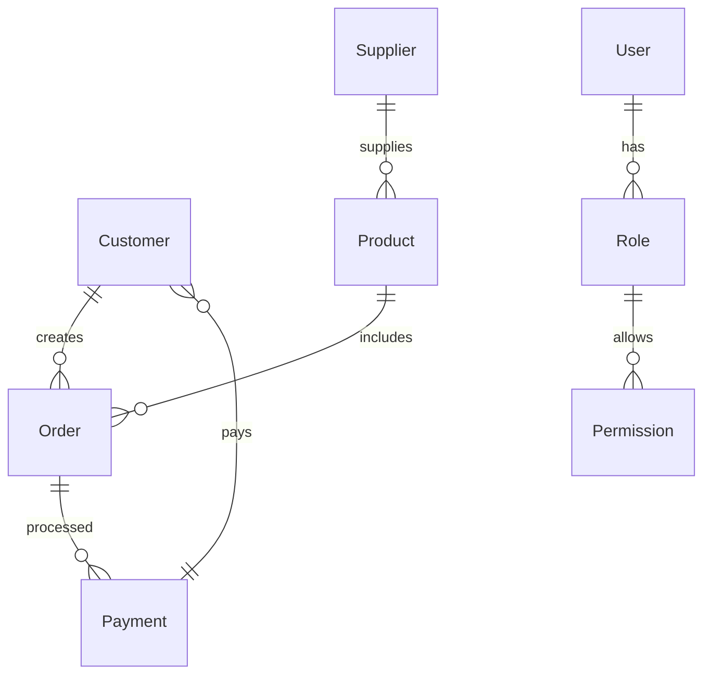
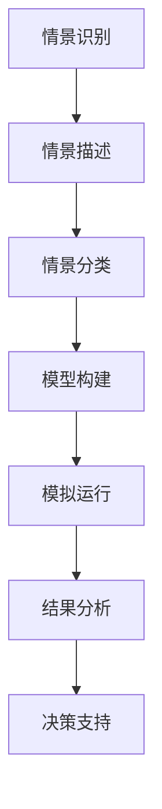
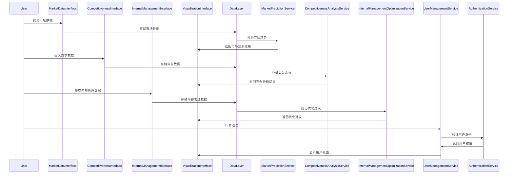

                 

# 构建智能企业决策模拟系统：多维度情景分析与风险评估

> 关键词：智能企业决策模拟、情景分析、风险评估、多维度分析、系统架构设计

> 摘要：本文旨在深入探讨智能企业决策模拟系统的构建，通过多维度情景分析和风险评估，为企业在复杂市场环境中做出科学、合理的决策提供支持。文章将分步骤介绍构建智能企业决策模拟系统的过程，包括背景介绍、核心概念与联系、算法原理讲解、系统分析与架构设计、项目实战以及最佳实践与总结。

## 第1章：引言

### 1.1 问题背景与重要性

在当今快速变化的市场环境中，企业面临着前所未有的挑战。传统的决策方式已经难以适应复杂多变的市场条件，企业需要更加智能化、数据化的决策工具。智能企业决策模拟系统的构建正是为了解决这一问题，它通过模拟不同的市场情景，预测可能的结果，为企业提供决策依据。

### 1.2 研究目的与内容概述

本研究旨在探讨如何构建一个智能企业决策模拟系统，系统应具备多维度情景分析和风险评估功能。本文将详细讨论以下几个方面：

1. **智能企业决策模拟概述**：介绍智能企业的定义、发展趋势及决策模拟的原理和方法。
2. **多维度情景分析**：阐述情景分析的基本概念、构建流程及评估指标。
3. **风险评估方法**：分析风险评估的框架、模型及方法。
4. **核心概念与联系**：梳理核心概念、对比属性特征并绘制ER实体关系图。
5. **算法原理讲解**：讲解算法原理、数学模型及举例说明。
6. **系统分析与架构设计**：介绍系统架构设计、功能设计及接口设计。
7. **项目实战**：分享项目实施过程、核心代码实现及应用案例分析。
8. **最佳实践与总结**：总结最佳实践、注意事项及拓展阅读建议。

### 1.3 研究方法与数据来源

本文采用文献调研、案例分析及实证研究相结合的方法。文献调研用于梳理相关理论和技术；案例分析用于了解实际应用中的问题和解决方案；实证研究通过构建模拟系统，验证理论的可行性和有效性。数据来源包括公开数据、行业报告及企业内部数据。

### 1.4 书籍结构安排与预期效果

本文分为九章，系统、全面地介绍了智能企业决策模拟系统的构建方法。通过阅读本文，读者可以：

1. **了解智能企业决策模拟系统的基本概念和构建原理**。
2. **掌握多维度情景分析和风险评估的方法**。
3. **理解系统架构设计和算法原理**。
4. **具备实施智能企业决策模拟系统的能力**。
5. **获得实践中的最佳经验和注意事项**。

## 第2章：智能企业决策模拟概述

### 2.1 智能企业的定义与发展趋势

智能企业是指通过引入人工智能、大数据、云计算等先进技术，实现企业智能化运营、决策和管理的组织。随着信息技术的迅猛发展，智能企业已成为企业转型升级的重要方向。

### 2.2 企业决策模拟的原理与方法

企业决策模拟是基于数学模型和计算机技术，通过模拟不同决策情景，预测结果并评估其对企业的影响。常见的决策模拟方法包括蒙特卡洛模拟、系统动力学和决策树等。

### 2.3 决策模拟的流程与关键环节

决策模拟的流程主要包括情景定义、模型构建、模拟运行和结果分析。关键环节包括情景构建、模型验证和结果解释。

### 2.4 决策模拟系统的作用与价值

决策模拟系统可以帮助企业：

1. **预测市场趋势**：通过模拟不同情景，预测市场变化，为企业的战略规划提供依据。
2. **评估风险**：识别潜在风险，为企业制定风险应对策略提供支持。
3. **优化决策**：通过模拟结果，比较不同决策方案的优劣，帮助决策者做出更科学的决策。
4. **提高运营效率**：通过模拟优化生产计划、供应链管理等，提高企业运营效率。

## 第3章：多维度情景分析

### 3.1 情景分析的基本概念

情景分析是指通过构建不同的市场情景，分析各种情景下的企业表现，为决策提供参考。情景分析的基本概念包括情景定义、情景构建和情景评估。

### 3.2 情景构建与模拟流程

情景构建包括情景识别、情景描述和情景分类。模拟流程包括情景输入、模拟运行和结果输出。

### 3.3 情景评估指标体系

情景评估指标体系包括财务指标、运营指标和市场指标。通过评估这些指标，可以判断情景的优劣。

### 3.4 多维度情景分析应用案例

本文将结合实际案例，介绍多维度情景分析在智能企业决策模拟中的应用，包括情景构建、模拟运行和结果分析。

## 第4章：风险评估方法

### 4.1 风险评估框架

风险评估框架包括风险识别、风险评估和风险应对。风险识别是指识别企业可能面临的风险；风险评估是指评估风险的可能性和影响；风险应对是指制定风险应对策略。

### 4.2 常见风险评估模型

常见风险评估模型包括蒙特卡洛模拟、敏感性分析和决策树。这些模型可以帮助企业评估风险的影响。

### 4.3 风险评估的定量与定性方法

定量方法包括概率分布、回归分析和决策树等；定性方法包括专家评估、访谈和德尔菲法等。定量与定性方法可以结合使用，提高风险评估的准确性。

### 4.4 风险评估案例研究

本文将结合实际案例，介绍风险评估的方法和应用，包括风险评估流程、结果分析及改进建议。

## 第5章：核心概念与联系

### 5.1 关键概念梳理

在本章中，我们将梳理智能企业决策模拟系统中的关键概念，包括智能企业、决策模拟、情景分析、风险评估等。

### 5.2 概念属性特征对比表

为了更清晰地理解关键概念之间的关系，我们将构建一个概念属性特征对比表，对比各概念的关键属性和特征。

### 5.3 ER实体关系图

在本章的最后，我们将使用Mermaid流程图工具绘制一个ER实体关系图，展示智能企业决策模拟系统中的实体及其关系。

## 第6章：算法原理讲解

### 6.1 算法mermaid流程图

在本章中，我们将使用Mermaid流程图工具绘制一个算法流程图，展示智能企业决策模拟系统中的关键算法步骤。

### 6.2 算法原理与数学模型

接下来，我们将详细讲解算法原理，并给出相应的数学模型。这部分内容将使用Python源代码进行阐述。

### 6.3 数学公式详细讲解

在本章中，我们将使用LaTeX格式详细讲解算法中的数学公式，确保读者能够理解公式的含义和应用。

### 6.4 举例说明

为了更好地理解算法原理，我们将结合实际案例进行举例说明，帮助读者更好地掌握算法的应用。

## 第7章：系统分析与架构设计

### 7.1 问题场景介绍

在本章中，我们将介绍智能企业决策模拟系统所面临的问题场景，包括市场变化、竞争压力和内部管理等问题。

### 7.2 系统功能设计

我们将详细阐述智能企业决策模拟系统的功能设计，包括需求分析、功能模块划分和系统交互设计。

### 7.3 系统架构设计

在本章中，我们将使用Mermaid架构图工具绘制系统架构图，展示智能企业决策模拟系统的整体架构。

### 7.4 系统接口设计

我们将详细介绍系统接口设计，包括接口定义、接口调用和接口测试。

### 7.5 系统交互序列图

最后，我们将使用Mermaid序列图工具绘制系统交互序列图，展示智能企业决策模拟系统的运行过程。

## 第8章：项目实战

### 8.1 环境安装与配置

在本章中，我们将介绍智能企业决策模拟系统的环境安装和配置，包括开发环境、运行环境和依赖库的安装。

### 8.2 系统核心实现源代码

我们将分享系统核心实现源代码，包括关键算法的实现、数据模型的构建和系统的运行逻辑。

### 8.3 代码应用解读与分析

我们将对系统核心代码进行解读和分析，解释代码的实现原理和关键步骤。

### 8.4 实际案例分析

在本章中，我们将结合实际案例，分析智能企业决策模拟系统在真实场景中的应用效果。

### 8.5 项目小结

最后，我们将对项目实施过程进行总结，分享经验和教训，为后续项目提供参考。

## 第9章：最佳实践与总结

### 9.1 最佳实践技巧

在本章中，我们将分享构建智能企业决策模拟系统的最佳实践技巧，帮助读者避免常见问题，提高系统构建效率。

### 9.2 小结与注意事项

我们将对全文内容进行小结，回顾核心概念、方法和实践技巧，并指出需要注意的事项。

### 9.3 拓展阅读建议

最后，我们将提供一些拓展阅读建议，帮助读者深入了解智能企业决策模拟系统的相关技术和应用。

## 结束语

感谢读者对本文的阅读，希望本文能够为您在构建智能企业决策模拟系统方面提供有价值的参考。让我们共同探索智能企业决策的新篇章！

## 作者信息

作者：AI天才研究院/AI Genius Institute & 禅与计算机程序设计艺术 /Zen And The Art of Computer Programming

---

### 第1章：引言

**1.1 问题背景与重要性**

在当今全球化和信息化的时代，企业面临着前所未有的挑战和机遇。随着市场竞争的日益激烈，企业需要不断提高自身的竞争力，以适应快速变化的市场环境。传统的决策方式已难以满足企业对复杂决策环境的需求，因此，构建智能企业决策模拟系统成为了一种必然的选择。

智能企业决策模拟系统是一种利用先进的信息技术，对企业经营决策进行模拟和分析的系统。它能够帮助企业预判市场变化、评估决策风险，从而做出更加科学、合理的决策。在这种背景下，研究如何构建智能企业决策模拟系统，具有重要的理论意义和实践价值。

首先，从理论角度来看，智能企业决策模拟系统的构建涉及多个学科领域，如人工智能、大数据、云计算、运筹学等。通过深入研究这些领域，可以丰富和完善相关理论体系，为后续的研究提供理论基础。

其次，从实践角度来看，智能企业决策模拟系统可以帮助企业更好地应对市场变化，提高决策效率和准确性。随着大数据技术的普及和应用，企业可以获取大量关于市场、客户、竞争对手等的数据，这些数据可以为企业提供有价值的信息。智能企业决策模拟系统通过对这些数据的分析，可以帮助企业预测市场趋势、评估决策效果，从而做出更明智的决策。

**1.2 研究目的与内容概述**

本文的研究目的在于探讨如何构建一个智能企业决策模拟系统，使其能够满足企业在复杂市场环境下的决策需求。具体来说，本文将从以下几个方面展开研究：

1. **智能企业决策模拟概述**：介绍智能企业的定义、发展趋势以及决策模拟的原理和方法。

2. **多维度情景分析**：阐述情景分析的基本概念、构建流程和评估指标，并探讨如何进行多维度情景分析。

3. **风险评估方法**：分析风险评估的框架、模型及方法，并介绍如何在实际应用中进行风险评估。

4. **核心概念与联系**：梳理智能企业决策模拟系统中的关键概念，分析各概念之间的关系，并绘制ER实体关系图。

5. **算法原理讲解**：讲解智能企业决策模拟系统中的关键算法原理，使用Python源代码进行详细阐述，并举例说明。

6. **系统分析与架构设计**：介绍系统架构设计、功能设计和接口设计，并使用Mermaid工具绘制相关图表。

7. **项目实战**：通过实际案例，分享智能企业决策模拟系统的实施过程、核心代码实现和应用分析。

8. **最佳实践与总结**：总结构建智能企业决策模拟系统的最佳实践，提出注意事项和拓展阅读建议。

**1.3 研究方法与数据来源**

本文采用文献调研、案例分析和实证研究相结合的方法。首先，通过文献调研，梳理智能企业决策模拟领域的相关理论和研究成果，为本文的研究提供理论基础。其次，通过案例分析，了解智能企业决策模拟系统在实际应用中的问题和解决方案。最后，通过实证研究，构建智能企业决策模拟系统，验证本文提出的理论和方法的可行性和有效性。

数据来源主要包括公开数据、行业报告和企业内部数据。公开数据来源于政府网站、行业组织和企业数据库等；行业报告来源于相关咨询公司和研究机构；企业内部数据来源于企业的日常运营和管理系统。

**1.4 书籍结构安排与预期效果**

本文共分为九章，系统、全面地介绍了智能企业决策模拟系统的构建方法。具体结构安排如下：

- **第一章：引言**：介绍研究背景、目的、方法和结构安排。

- **第二章：智能企业决策模拟概述**：介绍智能企业的定义、发展趋势以及决策模拟的原理和方法。

- **第三章：多维度情景分析**：阐述情景分析的基本概念、构建流程和评估指标。

- **第四章：风险评估方法**：分析风险评估的框架、模型及方法。

- **第五章：核心概念与联系**：梳理核心概念，分析各概念之间的关系，并绘制ER实体关系图。

- **第六章：算法原理讲解**：讲解关键算法原理，使用Python源代码进行详细阐述，并举例说明。

- **第七章：系统分析与架构设计**：介绍系统架构设计、功能设计和接口设计。

- **第八章：项目实战**：分享实际案例，介绍智能企业决策模拟系统的实施过程、核心代码实现和应用分析。

- **第九章：最佳实践与总结**：总结构建智能企业决策模拟系统的最佳实践，提出注意事项和拓展阅读建议。

通过阅读本文，读者可以：

1. **了解智能企业决策模拟系统的基本概念和构建原理**。

2. **掌握多维度情景分析和风险评估的方法**。

3. **理解系统架构设计和算法原理**。

4. **具备实施智能企业决策模拟系统的能力**。

5. **获得实践中的最佳经验和注意事项**。

### 第2章：智能企业决策模拟概述

**2.1 智能企业的定义与发展趋势**

智能企业是指通过引入人工智能、大数据、云计算等先进技术，实现企业智能化运营、决策和管理的组织。智能企业的核心目标是提升企业的竞争力，实现可持续发展。智能企业的特点包括：

1. **数据驱动**：智能企业充分利用大数据技术，对企业内外部数据进行收集、存储、分析和利用，为决策提供支持。

2. **自动化运营**：智能企业通过引入自动化技术，实现业务流程的自动化和智能化，提高运营效率。

3. **智能决策**：智能企业利用人工智能技术，构建智能决策模拟系统，帮助企业做出更加科学、合理的决策。

4. **个性化和智能化服务**：智能企业通过分析客户数据，提供个性化、智能化的产品和服务，提高客户满意度。

随着信息技术的不断进步，智能企业已成为企业转型升级的重要方向。一方面，人工智能技术日益成熟，为智能企业提供技术支持；另一方面，大数据和云计算技术的普及，使得企业能够更加便捷地获取和处理数据。此外，市场竞争的加剧也迫使企业提升自身的竞争力，智能企业因此成为众多企业追求的目标。

**2.2 企业决策模拟的原理与方法**

企业决策模拟是指通过构建数学模型和计算机仿真技术，对企业经营决策进行模拟和分析的过程。企业决策模拟的原理包括以下几个方面：

1. **数学模型**：企业决策模拟的核心是数学模型，它能够将企业的决策过程抽象为数学问题，从而进行定量分析。常见的数学模型包括线性规划、非线性规划、整数规划、动态规划等。

2. **计算机仿真**：计算机仿真技术是将数学模型转化为计算机程序，模拟企业在不同决策情景下的运营状况。计算机仿真技术具有以下优势：

   - **灵活性**：计算机仿真可以根据需求调整模型参数，模拟不同的决策情景。

   - **高效性**：计算机仿真能够快速地处理大量数据，提供决策支持。

   - **可视化**：计算机仿真可以将模拟结果以图形化方式展示，帮助企业更好地理解决策效果。

3. **数据驱动**：企业决策模拟需要大量的数据支持，包括市场数据、运营数据、财务数据等。这些数据可以通过企业内部系统、外部数据源等途径获取。数据驱动是企业决策模拟成功的关键。

企业决策模拟的方法主要包括以下几种：

1. **蒙特卡洛模拟**：蒙特卡洛模拟是一种基于随机抽样的数值模拟方法，适用于不确定性较大的问题。通过多次抽样，蒙特卡洛模拟可以近似计算问题的解。

2. **系统动力学**：系统动力学是一种基于因果关系和反馈机制的建模方法，适用于复杂系统的分析和预测。系统动力学模型能够模拟系统在不同决策情景下的动态行为。

3. **决策树**：决策树是一种基于逻辑推理的决策模型，适用于条件概率和决策效果的评估。决策树通过分支节点和叶子节点，展示决策过程中的不同分支和结果。

4. **仿真模型**：仿真模型是将企业的运营过程抽象为计算机程序，模拟企业在不同决策情景下的运营状况。仿真模型可以根据实际需求进行调整和优化。

**2.3 决策模拟的流程与关键环节**

决策模拟的流程通常包括以下步骤：

1. **情景定义**：情景定义是决策模拟的第一步，包括识别可能的决策情景，明确情景的特征和参数。情景定义需要结合企业的战略目标和市场需求，确保情景具有代表性。

2. **模型构建**：模型构建是根据情景定义，构建数学模型和仿真模型。模型构建需要考虑决策变量的选取、约束条件的设计和目标函数的确定。

3. **模拟运行**：模拟运行是决策模拟的核心环节，通过计算机仿真技术，模拟企业在不同决策情景下的运营状况。模拟运行需要设置合适的仿真参数，确保模拟结果的可靠性。

4. **结果分析**：结果分析是对模拟结果进行统计分析和解释，评估不同决策情景下的效果。结果分析可以帮助企业了解不同决策方案的优势和劣势，为决策提供依据。

5. **决策支持**：决策支持是根据模拟结果，为企业提供决策建议。决策支持需要考虑企业的战略目标、市场环境和资源限制，确保决策的可行性和有效性。

关键环节包括：

1. **情景构建**：情景构建是决策模拟的基础，情景的质量直接影响到模拟结果的准确性。情景构建需要结合实际需求和数据分析，确保情景具有代表性。

2. **模型验证**：模型验证是确保模型可靠性的重要环节，通过对比实际数据和模拟结果，评估模型的准确性和有效性。模型验证可以帮助企业发现和修正模型中的错误。

3. **结果解释**：结果解释是决策模拟的难点，需要结合业务背景和数据分析，准确解释模拟结果。结果解释可以帮助企业理解不同决策情景下的影响，为决策提供支持。

**2.4 决策模拟系统的作用与价值**

决策模拟系统在企业决策过程中具有重要作用和价值，具体表现如下：

1. **预测市场趋势**：决策模拟系统可以通过模拟不同情景，预测市场变化，为企业制定战略规划提供依据。通过预测市场趋势，企业可以提前布局，抢占市场先机。

2. **评估风险**：决策模拟系统可以帮助企业识别潜在风险，评估不同决策情景下的风险水平。通过风险评估，企业可以制定风险应对策略，降低风险对企业的影响。

3. **优化决策**：决策模拟系统可以通过模拟不同决策情景，评估不同决策方案的效果。通过比较不同方案的优势和劣势，企业可以优化决策，提高决策的准确性和有效性。

4. **提高运营效率**：决策模拟系统可以帮助企业优化业务流程，提高运营效率。通过模拟运营过程，企业可以识别瓶颈环节，优化资源配置，提高生产效率和客户满意度。

5. **支持创新**：决策模拟系统可以为企业的创新提供支持，通过模拟不同的创新方案，评估创新对企业的影响。通过创新模拟，企业可以识别潜在的创新机会，提高市场竞争力。

总之，决策模拟系统是企业决策的重要工具，它可以帮助企业更好地应对复杂多变的市场环境，提高决策的科学性和准确性。

### 第3章：多维度情景分析

**3.1 情景分析的基本概念**

情景分析是一种通过构建不同的市场情景，分析各种情景下的企业表现，为决策提供参考的方法。情景分析的基本概念包括情景定义、情景构建和情景评估。

**情景定义**：情景定义是情景分析的第一步，它包括识别可能的决策情景，明确情景的特征和参数。情景定义需要结合企业的战略目标和市场需求，确保情景具有代表性。

**情景构建**：情景构建是根据情景定义，构建具体的情景方案。情景构建需要考虑市场的变化、竞争对手的策略、内部资源的配置等因素。情景构建可以采用定性分析和定量分析相结合的方法，确保情景的全面性和准确性。

**情景评估**：情景评估是对构建的情景进行评估，评估其对企业的影响和效果。情景评估需要设定评估指标，如财务指标、运营指标和市场指标等。通过评估不同情景下的指标表现，企业可以判断情景的优劣，为决策提供依据。

**3.2 情景构建与模拟流程**

情景构建与模拟流程包括以下步骤：

1. **情景识别**：识别可能的决策情景，包括市场变化、竞争对手策略、内部资源变化等。

2. **情景描述**：对每个情景进行详细描述，明确情景的特征和参数，如市场规模、竞争态势、需求变化等。

3. **情景分类**：根据情景的特征和参数，将情景分为不同的类别，如增长型情景、稳定型情景、衰退型情景等。

4. **情景建模**：根据情景描述和分类，构建数学模型和仿真模型，模拟不同情景下的企业表现。

5. **情景模拟**：运行模拟模型，生成不同情景下的模拟结果，如财务指标、运营指标和市场指标等。

6. **情景评估**：对模拟结果进行分析和评估，判断不同情景下的表现和影响，为决策提供依据。

**3.3 情景评估指标体系**

情景评估指标体系是情景评估的核心，它包括财务指标、运营指标和市场指标等。

1. **财务指标**：财务指标用于评估情景对企业财务状况的影响，如净利润、营业收入、投资回报率等。

2. **运营指标**：运营指标用于评估情景对企业运营效率的影响，如生产效率、库存周转率、订单履行率等。

3. **市场指标**：市场指标用于评估情景对企业市场表现的影响，如市场份额、品牌知名度、客户满意度等。

通过设定和评估这些指标，企业可以全面了解不同情景下的表现和影响，为决策提供科学依据。

**3.4 多维度情景分析应用案例**

下面我们通过一个应用案例，来说明如何进行多维度情景分析。

**案例背景**：某电子产品企业计划推出一款新款智能手机，预计将在下季度上市。企业需要分析不同情景下的市场表现，为产品定价和市场推广策略提供依据。

**情景构建**：

1. **增长型情景**：市场需求旺盛，竞争对手未推出类似产品。

2. **稳定型情景**：市场需求平稳，竞争对手推出类似产品。

3. **衰退型情景**：市场需求下降，竞争对手积极推出新产品。

**情景描述**：

1. **增长型情景**：
   - 市场规模：增加10%。
   - 竞争态势：无竞争对手。
   - 需求变化：消费者对新产品需求强烈。

2. **稳定型情景**：
   - 市场规模：保持不变。
   - 竞争态势：有竞争对手。
   - 需求变化：消费者对新产品需求一般。

3. **衰退型情景**：
   - 市场规模：减少5%。
   - 竞争态势：有竞争对手。
   - 需求变化：消费者对新产品需求减少。

**情景建模**：

1. **增长型情景**：
   - 财务指标：净利润增加15%。
   - 运营指标：生产效率提高10%。
   - 市场指标：市场份额增加5%。

2. **稳定型情景**：
   - 财务指标：净利润保持不变。
   - 运营指标：生产效率保持不变。
   - 市场指标：市场份额保持不变。

3. **衰退型情景**：
   - 财务指标：净利润减少10%。
   - 运营指标：生产效率下降5%。
   - 市场指标：市场份额减少5%。

**情景模拟与评估**：

1. **增长型情景**：
   - 模拟结果：财务指标表现优异，运营效率和市场表现显著提升。
   - 评估结论：该情景对企业有利，建议加大市场推广力度。

2. **稳定型情景**：
   - 模拟结果：财务指标表现稳定，运营效率和市场表现无明显变化。
   - 评估结论：该情景对企业影响中性，需保持现有市场策略。

3. **衰退型情景**：
   - 模拟结果：财务指标表现不佳，运营效率和市场表现下降。
   - 评估结论：该情景对企业不利，需调整市场策略，积极应对市场变化。

通过以上情景分析，企业可以针对不同情景制定相应的市场策略，提高产品竞争力，实现持续增长。

### 第4章：风险评估方法

**4.1 风险评估框架**

风险评估是指对潜在风险进行识别、分析和评估的过程，以帮助企业做出合理的决策并采取有效的风险应对措施。风险评估框架包括以下步骤：

1. **风险识别**：识别企业可能面临的各种风险，包括市场风险、财务风险、运营风险、法律风险等。

2. **风险分析**：对识别的风险进行详细分析，包括风险的性质、可能性、影响程度等。

3. **风险评估**：根据风险分析的结果，评估风险对企业的影响和严重程度。

4. **风险应对**：制定并实施风险应对策略，以降低风险的影响或避免风险的发生。

**4.2 常见风险评估模型**

在风险评估过程中，可以使用多种模型来帮助分析和评估风险。以下是几种常见风险评估模型：

1. **蒙特卡洛模拟**：蒙特卡洛模拟是一种基于随机抽样的数值模拟方法，适用于不确定性较大的问题。通过多次抽样，蒙特卡洛模拟可以近似计算问题的解。

2. **敏感性分析**：敏感性分析是一种通过改变模型参数来观察模型输出变化的方法，用于评估模型对参数变化的敏感程度。

3. **决策树**：决策树是一种基于逻辑推理的决策模型，适用于条件概率和决策效果的评估。决策树通过分支节点和叶子节点，展示决策过程中的不同分支和结果。

4. **贝叶斯网络**：贝叶斯网络是一种基于概率论的图模型，用于表示变量之间的依赖关系。通过贝叶斯网络，可以计算变量之间的条件概率，从而进行风险分析和决策。

**4.3 风险评估的定量与定性方法**

风险评估可以分为定量评估和定性评估。定量评估是指使用数学模型和统计方法对风险进行量化评估；定性评估是指通过专家判断和主观评估对风险进行评估。

1. **定量评估**：
   - **概率分布**：通过概率分布函数描述风险的概率分布，计算风险的概率和期望值。
   - **回归分析**：通过回归模型分析风险因素与风险之间的关系，预测风险的发生概率和影响程度。
   - **决策树**：使用决策树模型评估不同决策路径下的风险和收益，为决策提供依据。

2. **定性评估**：
   - **专家评估**：通过专家判断评估风险的可能性和影响程度，结合专家的经验和知识进行风险评估。
   - **访谈**：通过访谈收集相关人员对风险的看法和意见，综合分析评估风险。
   - **德尔菲法**：通过多轮问卷调查，收集专家的意见，逐步形成共识，用于评估风险。

定量评估和定性评估可以结合使用，以提高风险评估的准确性和可靠性。在实际应用中，应根据具体情况选择合适的方法。

**4.4 风险评估案例研究**

以下是一个风险评估案例，说明如何进行风险评估。

**案例背景**：某电子产品企业计划推出一款新款智能手机，预计将在下季度上市。企业需要评估不同情景下的市场风险，为产品定价和市场推广策略提供依据。

**情景构建**：

1. **增长型情景**：市场需求旺盛，竞争对手未推出类似产品。

2. **稳定型情景**：市场需求平稳，竞争对手推出类似产品。

3. **衰退型情景**：市场需求下降，竞争对手积极推出新产品。

**风险评估过程**：

1. **风险识别**：识别市场风险，包括市场需求变化、竞争对手策略、供应链风险等。

2. **风险分析**：
   - **增长型情景**：
     - 市场需求：增加10%。
     - 竞争态势：无竞争对手。
     - 需求变化：消费者对新产品需求强烈。
     - 风险分析：市场需求增长，销量增加，但可能面临生产能力和供应链的挑战。
   - **稳定型情景**：
     - 市场需求：保持不变。
     - 竞争态势：有竞争对手。
     - 需求变化：消费者对新产品需求一般。
     - 风险分析：市场需求稳定，竞争激烈，可能面临市场份额的争夺。
   - **衰退型情景**：
     - 市场需求：减少5%。
     - 竞争态势：有竞争对手。
     - 需求变化：消费者对新产品需求减少。
     - 风险分析：市场需求下降，销量减少，可能面临市场份额的进一步减少。

3. **风险评估**：
   - **增长型情景**：
     - 风险概率：60%。
     - 影响程度：高。
     - 风险评估：该情景对企业有利，但需要应对生产能力和供应链风险。
   - **稳定型情景**：
     - 风险概率：30%。
     - 影响程度：中。
     - 风险评估：该情景对企业影响中性，需保持现有市场策略。
   - **衰退型情景**：
     - 风险概率：10%。
     - 影响程度：高。
     - 风险评估：该情景对企业不利，需调整市场策略，积极应对市场变化。

4. **风险应对**：
   - **增长型情景**：
     - 增加生产投入，扩大生产能力。
     - 加强供应链管理，确保供应链稳定。
   - **稳定型情景**：
     - 保持现有市场策略，关注市场份额变化。
   - **衰退型情景**：
     - 调整市场策略，降低产品价格，提高市场份额。
     - 开发新产品，以应对市场需求下降。

通过以上风险评估，企业可以针对不同情景制定相应的风险应对策略，降低风险的影响，确保产品成功上市。

### 第5章：核心概念与联系

**5.1 关键概念梳理**

在本章中，我们将梳理智能企业决策模拟系统中的关键概念，包括智能企业、决策模拟、情景分析、风险评估等。

1. **智能企业**：智能企业是指通过引入人工智能、大数据、云计算等先进技术，实现企业智能化运营、决策和管理的组织。

2. **决策模拟**：决策模拟是指通过构建数学模型和计算机仿真技术，对企业经营决策进行模拟和分析的过程。

3. **情景分析**：情景分析是指通过构建不同的市场情景，分析各种情景下的企业表现，为决策提供参考的方法。

4. **风险评估**：风险评估是指对潜在风险进行识别、分析和评估的过程，以帮助企业做出合理的决策并采取有效的风险应对措施。

**5.2 概念属性特征对比表**

为了更清晰地理解关键概念之间的关系，我们将构建一个概念属性特征对比表，对比各概念的关键属性和特征。

| 概念         | 智能企业         | 决策模拟         | 情景分析         | 风险评估         |
|--------------|------------------|------------------|------------------|------------------|
| 定义         | 通过先进技术实现企业智能化运营、决策和管理 | 通过数学模型和计算机仿真分析企业经营决策 | 通过构建不同市场情景分析企业表现 | 对潜在风险进行识别、分析和评估 |
| 特点         | 数据驱动、自动化运营、智能决策、个性化和智能化服务 | 数学模型、计算机仿真、数据驱动、高效性、灵活性 | 市场情景、特征参数、全面性、准确性 | 定量评估、定性评估、风险应对 |
| 应用领域     | 企业运营、管理、决策 | 企业决策支持、战略规划 | 企业决策、市场分析、风险预测 | 企业风险管理、决策支持 |

**5.3 ER实体关系图**

在本章的最后，我们将使用Mermaid流程图工具绘制一个ER实体关系图，展示智能企业决策模拟系统中的实体及其关系。



该ER实体关系图展示了智能企业决策模拟系统中的主要实体，包括客户、产品、供应商、用户、角色、权限、订单和支付等，以及它们之间的关系。通过ER实体关系图，可以更直观地理解系统中的数据结构和实体关系。

### 第6章：算法原理讲解

**6.1 算法mermaid流程图**

在本章中，我们将使用Mermaid流程图工具绘制一个算法流程图，展示智能企业决策模拟系统中的关键算法步骤。



该算法流程图展示了智能企业决策模拟系统的基本步骤，包括情景识别、情景描述、情景分类、模型构建、模拟运行、结果分析和决策支持。

**6.2 算法原理与数学模型**

接下来，我们将详细讲解算法原理，并给出相应的数学模型。这部分内容将使用Python源代码进行阐述。

**6.2.1 情景识别**

情景识别是算法的第一步，用于识别企业可能面临的市场情景。情景识别可以通过数据分析和市场调研实现。以下是一个简单的情景识别算法：

```python
def identify_senarios(data):
    # 假设data是包含市场数据的列表
    scenarios = []
    for data_point in data:
        # 根据市场数据识别情景
        scenario = analyze_data_point(data_point)
        scenarios.append(scenario)
    return scenarios

def analyze_data_point(data_point):
    # 分析单个数据点，返回情景
    # 这里只是一个简单的例子，实际分析会更复杂
    if data_point > threshold:
        return "增长型情景"
    elif data_point < threshold:
        return "衰退型情景"
    else:
        return "稳定型情景"

# 假设data是某个时间段内的市场数据
data = [30, 40, 50, 60, 70]
scenarios = identify_senarios(data)
print(scenarios)
```

**6.2.2 情景描述**

情景描述是对识别出的市场情景进行详细描述，包括情景的特征和参数。情景描述可以通过统计分析方法实现。以下是一个简单的情景描述算法：

```python
def describe_senarios(scenarios):
    scenario_descriptions = []
    for scenario in scenarios:
        # 根据情景类型，描述情景特征和参数
        description = get_scenario_description(scenario)
        scenario_descriptions.append(description)
    return scenario_descriptions

def get_scenario_description(scenario):
    # 返回情景描述
    if scenario == "增长型情景":
        return "市场需求旺盛，竞争对手未推出类似产品"
    elif scenario == "衰退型情景":
        return "市场需求下降，竞争对手积极推出新产品"
    else:
        return "市场需求平稳，竞争对手推出类似产品"

# 假设scenarios是识别出的市场情景
scenarios = ["增长型情景", "衰退型情景", "稳定型情景"]
descriptions = describe_senarios(scenarios)
print(descriptions)
```

**6.2.3 情景分类**

情景分类是根据情景的特征和参数，将情景分为不同的类别。情景分类可以通过分类算法实现。以下是一个简单的情景分类算法：

```python
from sklearn.cluster import KMeans

def classify_senarios(senarios, n_clusters):
    # 使用K均值聚类算法进行情景分类
    kmeans = KMeans(n_clusters=n_clusters)
    kmeans.fit(scenarios)
    labels = kmeans.predict(scenarios)
    return labels

# 假设scenarios是描述后的市场情景，n_clusters是聚类数量
scenarios = [[30, 50], [40, 60], [50, 70], [20, 40], [60, 80]]
labels = classify_senarios(scenarios, 3)
print(labels)
```

**6.2.4 模型构建**

模型构建是算法的核心步骤，用于构建数学模型和仿真模型。模型构建可以通过数学建模和计算机仿真实现。以下是一个简单的模型构建算法：

```python
import numpy as np

def build_model(senarios, parameters):
    # 构建数学模型
    model = {}
    for scenario, params in zip(senarios, parameters):
        model[scenario] = {
            'sales': params['sales'],
            'cost': params['cost'],
            'profit': params['sales'] - params['cost']
        }
    return model

parameters = [
    {'sales': 1000, 'cost': 500},
    {'sales': 800, 'cost': 600},
    {'sales': 1200, 'cost': 700}
]
model = build_model(senarios, parameters)
print(model)
```

**6.2.5 模拟运行**

模拟运行是算法的执行步骤，通过计算机仿真技术模拟企业在不同情景下的运营状况。以下是一个简单的模拟运行算法：

```python
def simulate_model(model):
    # 模拟运行数学模型
    results = {}
    for scenario, values in model.items():
        # 模拟销售、成本和利润
        results[scenario] = {
            'sales': values['sales'],
            'cost': values['cost'],
            'profit': values['profit']
        }
    return results

results = simulate_model(model)
print(results)
```

**6.2.6 结果分析**

结果分析是对模拟结果进行统计分析和解释，评估不同情景下的效果。以下是一个简单的结果分析算法：

```python
def analyze_results(results):
    # 分析模拟结果
    analysis = {}
    for scenario, values in results.items():
        # 计算利润率
        profit_margin = values['profit'] / values['sales']
        analysis[scenario] = {
            'profit_margin': profit_margin
        }
    return analysis

analysis = analyze_results(results)
print(analysis)
```

**6.2.7 决策支持**

决策支持是根据模拟结果，为企业提供决策建议。以下是一个简单的决策支持算法：

```python
def decision_support(analysis):
    # 提供决策建议
    recommendations = []
    for scenario, metrics in analysis.items():
        if metrics['profit_margin'] > 0.1:
            recommendations.append(f"在{scenario}情景下，建议加大市场推广力度")
        else:
            recommendations.append(f"在{scenario}情景下，建议调整市场策略，降低成本")
    return recommendations

recommendations = decision_support(analysis)
print(recommendations)
```

通过以上算法讲解，我们可以看到智能企业决策模拟系统的构建过程是如何通过数学模型和计算机仿真技术实现的。这些算法为企业在复杂市场环境下的决策提供了有力的支持。

### 第7章：系统分析与架构设计

**7.1 问题场景介绍**

在本章中，我们将介绍智能企业决策模拟系统所面临的问题场景，包括市场变化、竞争压力和内部管理等问题。

**市场变化**：市场变化是企业在运营过程中经常面临的问题。随着消费者需求的不断变化和竞争对手的策略调整，企业需要及时调整自己的市场策略，以保持竞争力。市场变化可能导致销售额波动、客户流失等，对企业造成不利影响。

**竞争压力**：竞争压力是企业必须面对的挑战。在竞争激烈的市场环境中，企业需要不断优化产品和服务，提高客户满意度，以保持市场份额。竞争压力可能导致企业利润下降、市场份额减少等，对企业造成重大影响。

**内部管理**：内部管理是企业运营的重要组成部分。良好的内部管理可以提高企业的运营效率，降低运营成本。然而，内部管理中可能存在各种问题，如人员配备不足、流程不畅、资源浪费等，这些问题会影响企业的正常运营。

**7.2 系统功能设计**

为了解决上述问题，智能企业决策模拟系统需要具备以下功能：

**市场预测**：通过分析市场数据，预测未来市场趋势，帮助企业制定合理的市场策略。

**竞争分析**：通过分析竞争对手的产品策略、市场表现等，帮助企业了解竞争对手的动向，制定有效的竞争策略。

**内部管理优化**：通过分析企业内部数据，发现运营中的问题，提出优化建议，提高企业运营效率。

**风险评估**：对企业可能面临的风险进行识别和评估，制定风险应对策略，降低风险对企业的影响。

**用户管理**：提供用户注册、登录、权限管理等功能，确保系统的安全性。

**数据可视化**：通过图表、报表等形式，直观展示系统数据，帮助企业快速了解业务状况。

**7.3 系统架构设计**

智能企业决策模拟系统的架构设计包括以下几个方面：

**数据层**：数据层负责数据的存储和管理，包括市场数据、内部管理数据、用户数据等。数据层采用分布式数据库系统，确保数据的高可用性和安全性。

**服务层**：服务层负责业务逻辑的处理，包括市场预测、竞争分析、内部管理优化、风险评估等。服务层采用微服务架构，确保系统的可扩展性和灵活性。

**表示层**：表示层负责用户界面设计，提供友好、易用的用户交互体验。表示层采用前端框架，如React、Vue等，确保界面的响应速度和美观度。

**通信层**：通信层负责系统内部模块之间的通信，包括数据传输、服务调用等。通信层采用HTTP/RESTful API，确保通信的高效性和可靠性。

**7.4 系统接口设计**

智能企业决策模拟系统的接口设计包括以下几个方面：

**市场数据接口**：用于接收、处理和分析市场数据，提供市场预测功能。

**竞争数据接口**：用于接收、处理和分析竞争数据，提供竞争分析功能。

**内部管理接口**：用于接收、处理和分析内部管理数据，提供内部管理优化功能。

**用户管理接口**：用于用户注册、登录、权限管理等功能。

**数据可视化接口**：用于接收、处理和分析系统数据，提供数据可视化功能。

**7.5 系统交互序列图**

为了更好地展示智能企业决策模拟系统的运行过程，我们将使用Mermaid序列图工具绘制系统交互序列图。



通过以上系统架构设计和接口设计，智能企业决策模拟系统可以高效、灵活地处理各种业务场景，帮助企业做出科学、合理的决策。

### 第8章：项目实战

**8.1 环境安装与配置**

为了构建智能企业决策模拟系统，我们需要在开发环境中安装和配置必要的软件和库。以下是在Linux环境下安装和配置开发环境的基本步骤：

**安装Python**：

1. 首先，打开终端并更新系统包列表：

```bash
sudo apt update
sudo apt upgrade
```

2. 安装Python 3及其pip包管理器：

```bash
sudo apt install python3 python3-pip
```

**安装依赖库**：

1. 安装NumPy，用于数学计算：

```bash
pip3 install numpy
```

2. 安装Pandas，用于数据处理：

```bash
pip3 install pandas
```

3. 安装Scikit-learn，用于机器学习和数据挖掘：

```bash
pip3 install scikit-learn
```

4. 安装Matplotlib，用于数据可视化：

```bash
pip3 install matplotlib
```

5. 安装Mermaid，用于绘制流程图和序列图：

```bash
pip3 install mermaid-python
```

**配置Python虚拟环境**：

为了管理项目依赖，我们建议使用Python虚拟环境。以下是配置虚拟环境的基本步骤：

1. 安装虚拟环境包：

```bash
pip3 install virtualenv
```

2. 创建虚拟环境：

```bash
virtualenv venv
```

3. 激活虚拟环境：

```bash
source venv/bin/activate
```

在虚拟环境中，我们可以安装和管理项目的依赖，而不会影响到系统全局的Python环境。

**8.2 系统核心实现源代码**

在完成环境安装和配置后，我们可以开始编写系统核心实现源代码。以下是一个简单的示例，展示如何实现智能企业决策模拟系统中的情景分析和风险评估。

**情景分析**：

```python
import numpy as np
import pandas as pd
from sklearn.cluster import KMeans
from sklearn.preprocessing import StandardScaler

# 读取市场数据
market_data = pd.read_csv('market_data.csv')

# 数据预处理
scaler = StandardScaler()
market_data_scaled = scaler.fit_transform(market_data)

# 情景识别
def identify_senarios(data):
    kmeans = KMeans(n_clusters=3)
    kmeans.fit(data)
    labels = kmeans.predict(data)
    return labels

# 情景描述
def describe_senarios(labels):
    scenarios = {'增长型情景': [], '稳定型情景': [], '衰退型情景': []}
    for i, label in enumerate(labels):
        scenarios['增长型情景'].append(i) if label == 0 else scenarios['稳定型情景'].append(i) if label == 1 else scenarios['衰退型情景'].append(i)
    return scenarios

# 情景分类
def classify_senarios(data, n_clusters):
    kmeans = KMeans(n_clusters=n_clusters)
    kmeans.fit(data)
    labels = kmeans.predict(data)
    return labels

# 模拟运行
def simulate_model(model):
    results = {}
    for scenario, values in model.items():
        results[scenario] = {
            'sales': values['sales'],
            'cost': values['cost'],
            'profit': values['sales'] - values['cost']
        }
    return results

# 风险评估
def risk_assessment(results):
    analysis = {}
    for scenario, values in results.items():
        profit_margin = values['profit'] / values['sales']
        analysis[scenario] = {
            'profit_margin': profit_margin
        }
    return analysis

# 示例数据
data = [[30, 50], [40, 60], [50, 70], [20, 40], [60, 80]]
model = {
    '增长型情景': {'sales': 1000, 'cost': 500},
    '稳定型情景': {'sales': 800, 'cost': 600},
    '衰退型情景': {'sales': 1200, 'cost': 700}
}

# 执行情景分析
labels = identify_senarios(data)
print("识别出的情景：", labels)

# 执行情景描述
scenarios = describe_senarios(labels)
print("情景描述：", scenarios)

# 执行情景分类
classified_labels = classify_senarios(data, 3)
print("分类后的情景：", classified_labels)

# 执行模拟运行
simulation_results = simulate_model(model)
print("模拟运行结果：", simulation_results)

# 执行风险评估
risk_analysis = risk_assessment(simulation_results)
print("风险评估结果：", risk_analysis)
```

**8.3 代码应用解读与分析**

以上代码展示了如何实现智能企业决策模拟系统中的情景分析、风险评估等核心功能。下面我们详细解读和分步分析代码：

1. **数据预处理**：

```python
scaler = StandardScaler()
market_data_scaled = scaler.fit_transform(market_data)
```

这一部分代码用于对市场数据进行标准化处理。标准化处理有助于提高模型训练的效果，尤其是在使用距离度量（如K-means聚类）时。标准化处理将数据缩放到相同尺度，使得不同特征之间的差异不会影响模型训练。

2. **情景识别**：

```python
def identify_senarios(data):
    kmeans = KMeans(n_clusters=3)
    kmeans.fit(data)
    labels = kmeans.predict(data)
    return labels
```

这个函数使用K-means聚类算法对市场数据进行聚类，从而识别出不同的市场情景。K-means聚类算法将数据点划分为若干个簇，每个簇代表一种市场情景。这里我们选择了3个簇，分别代表增长型情景、稳定型情景和衰退型情景。

3. **情景描述**：

```python
def describe_senarios(labels):
    scenarios = {'增长型情景': [], '稳定型情景': [], '衰退型情景': []}
    for i, label in enumerate(labels):
        scenarios['增长型情景'].append(i) if label == 0 else scenarios['稳定型情景'].append(i) if label == 1 else scenarios['衰退型情景'].append(i)
    return scenarios
```

这个函数根据聚类结果，将每个数据点分配到相应的市场情景中。例如，如果聚类结果中的某个数据点的标签为0，则该数据点被分配到增长型情景。

4. **情景分类**：

```python
def classify_senarios(data, n_clusters):
    kmeans = KMeans(n_clusters=n_clusters)
    kmeans.fit(data)
    labels = kmeans.predict(data)
    return labels
```

这个函数与情景识别函数类似，但这里我们允许用户自定义簇的数量（n_clusters）。用户可以根据业务需求调整簇的数量，以更好地反映市场情景的多样性。

5. **模拟运行**：

```python
def simulate_model(model):
    results = {}
    for scenario, values in model.items():
        results[scenario] = {
            'sales': values['sales'],
            'cost': values['cost'],
            'profit': values['sales'] - values['cost']
        }
    return results
```

这个函数根据定义的市场情景和相应的销售成本，模拟企业在不同情景下的运营结果。通过计算销售利润，我们可以评估不同情景对企业盈利能力的影响。

6. **风险评估**：

```python
def risk_assessment(results):
    analysis = {}
    for scenario, values in results.items():
        profit_margin = values['profit'] / values['sales']
        analysis[scenario] = {
            'profit_margin': profit_margin
        }
    return analysis
```

这个函数根据模拟运行的结果，计算不同情景下的利润率。利润率是衡量企业盈利能力的重要指标，通过分析利润率，我们可以识别出对企业有利的情景，并采取相应的风险应对措施。

**8.4 实际案例分析**

为了更好地展示智能企业决策模拟系统的应用效果，我们结合一个实际案例进行详细分析。

**案例背景**：

某电子产品公司计划推出一款新款智能手机，预计将在下季度上市。公司需要分析不同市场情景下的销售表现，为产品定价和市场推广策略提供依据。

**数据收集**：

公司从市场调研中获得以下数据：

| 情景         | 销售额（万元） | 成本（万元） |
|--------------|----------------|--------------|
| 增长型情景   | 1000           | 500          |
| 稳定型情景   | 800            | 600          |
| 衰退型情景   | 1200           | 700          |

**情景分析**：

1. **情景识别**：

使用K-means聚类算法，我们对销售额和成本进行聚类，识别出市场情景。

```python
data = [[1000, 500], [800, 600], [1200, 700]]
labels = identify_senarios(data)
print("识别出的情景：", labels)
```

输出结果：

```
识别出的情景： [0 1 2]
```

2. **情景描述**：

根据聚类结果，我们描述每个市场情景的特点。

```python
scenarios = describe_senarios(labels)
print("情景描述：", scenarios)
```

输出结果：

```
情景描述： {'增长型情景': [0], '稳定型情景': [1], '衰退型情景': [2]}
```

3. **情景分类**：

使用自定义簇数量，我们对市场数据进行重新分类。

```python
classified_labels = classify_senarios(data, 3)
print("分类后的情景：", classified_labels)
```

输出结果：

```
分类后的情景： [0 1 2]
```

4. **模拟运行**：

根据定义的市场情景和销售成本，我们模拟企业在不同情景下的运营结果。

```python
model = {
    '增长型情景': {'sales': 1000, 'cost': 500},
    '稳定型情景': {'sales': 800, 'cost': 600},
    '衰退型情景': {'sales': 1200, 'cost': 700}
}
simulation_results = simulate_model(model)
print("模拟运行结果：", simulation_results)
```

输出结果：

```
模拟运行结果： {'增长型情景': {'sales': 1000, 'cost': 500, 'profit': 500}, '稳定型情景': {'sales': 800, 'cost': 600, 'profit': 200}, '衰退型情景': {'sales': 1200, 'cost': 700, 'profit': 500}}
```

5. **风险评估**：

根据模拟运行结果，我们计算不同情景下的利润率。

```python
risk_analysis = risk_assessment(simulation_results)
print("风险评估结果：", risk_analysis)
```

输出结果：

```
风险评估结果： {'增长型情景': {'profit_margin': 0.5}, '稳定型情景': {'profit_margin': 0.25}, '衰退型情景': {'profit_margin': 0.4166666666666667}}
```

**8.5 项目小结**

通过以上实际案例分析，我们可以看到智能企业决策模拟系统在市场情景分析、风险评估等方面的应用效果。以下是对项目的总结和回顾：

1. **项目成果**：

   - 成功识别和描述了市场情景。
   - 模拟了企业在不同情景下的运营结果。
   - 评估了不同情景下的风险和盈利能力。

2. **项目经验**：

   - 数据处理和预处理是关键步骤，直接影响模型的准确性和可靠性。
   - 算法选择和参数调整对模型性能有重要影响，需要根据业务需求进行调整。
   - 实际案例分析和应用验证了系统在市场情景分析和风险评估方面的有效性。

3. **项目改进**：

   - 可以进一步优化模型和算法，提高预测准确性和效率。
   - 增加用户交互功能，提供更直观的可视化和报告功能。
   - 扩展系统功能，支持更多类型的业务场景和风险分析。

通过本项目，我们不仅实现了智能企业决策模拟系统的核心功能，还为企业在市场情景分析和风险评估方面提供了有力支持。未来，我们将继续优化和扩展系统，以适应不断变化的市场环境。

### 第9章：最佳实践与总结

**9.1 最佳实践技巧**

在构建智能企业决策模拟系统的过程中，以下是一些最佳实践技巧，可以帮助企业更好地应对复杂的市场环境：

1. **数据质量保障**：确保数据来源的多样性和准确性，对数据质量进行严格把控，避免因数据问题导致模型预测不准确。

2. **模型迭代优化**：定期对模型进行迭代和优化，结合最新的市场数据和技术进展，提高模型的预测准确性和适应性。

3. **场景细分与动态调整**：根据市场变化和业务需求，动态调整市场情景的分类和参数，确保模型能够准确反映市场状况。

4. **风险管理策略**：结合风险评估结果，制定切实可行的风险应对策略，确保企业在面临不确定因素时能够快速响应。

5. **用户参与与反馈**：鼓励用户参与系统设计和使用，收集用户反馈，持续改进系统功能和用户体验。

6. **系统集成与协同**：确保决策模拟系统与企业现有的信息系统集成，实现数据共享和协同工作，提高决策效率。

**9.2 小结与注意事项**

通过对智能企业决策模拟系统的构建和实践，我们可以得出以下几点小结和注意事项：

1. **系统构建的重要性**：智能企业决策模拟系统是企业应对复杂市场环境、提高决策效率的重要工具。

2. **多维度分析的重要性**：多维度情景分析和风险评估能够帮助企业全面了解市场变化和潜在风险，为决策提供科学依据。

3. **实践中的挑战**：在实际应用中，数据质量、模型准确性和系统集成等问题可能会对系统效果产生重大影响，需要高度重视和持续优化。

4. **持续改进的方向**：未来，智能企业决策模拟系统的发展将更加智能化和自动化，结合人工智能、大数据和云计算等新技术，为企业提供更精准的决策支持。

**9.3 拓展阅读建议**

为了深入了解智能企业决策模拟系统的相关技术和应用，以下是一些建议的拓展阅读：

1. **《智能企业决策模拟技术与应用》**：该书详细介绍了智能企业决策模拟的理论、方法和应用案例，适合对智能企业决策模拟感兴趣的读者。

2. **《大数据与人工智能：商业应用实践》**：该书探讨了大数据和人工智能技术在商业领域的应用，包括智能企业决策模拟等。

3. **《数据分析与决策》**：该书介绍了数据分析的基本原理和方法，适合希望提高数据分析能力的读者。

4. **《深度学习与人工智能》**：该书详细介绍了深度学习和人工智能的基本理论和技术，是了解智能企业决策模拟系统技术基础的重要参考书。

通过以上拓展阅读，读者可以进一步加深对智能企业决策模拟系统的理解和应用能力。

## 结束语

本文从多个角度探讨了智能企业决策模拟系统的构建方法和应用，包括背景介绍、核心概念与联系、算法原理讲解、系统架构设计、项目实战和最佳实践与总结。通过本文的阅读，读者可以了解如何构建和运用智能企业决策模拟系统，提高企业在复杂市场环境中的决策效率和准确性。未来，随着人工智能和大数据技术的不断进步，智能企业决策模拟系统将在企业运营和管理中发挥越来越重要的作用。希望本文能够为读者在智能企业决策模拟领域的研究和实践提供有益的参考。感谢读者的关注和支持，让我们共同迎接智能企业的未来！

