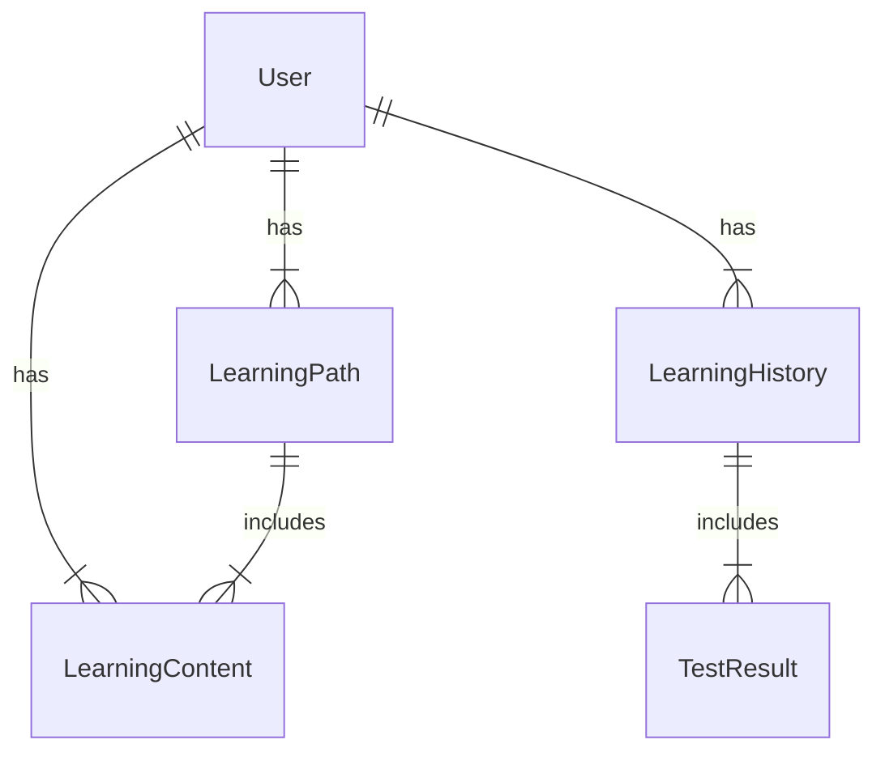
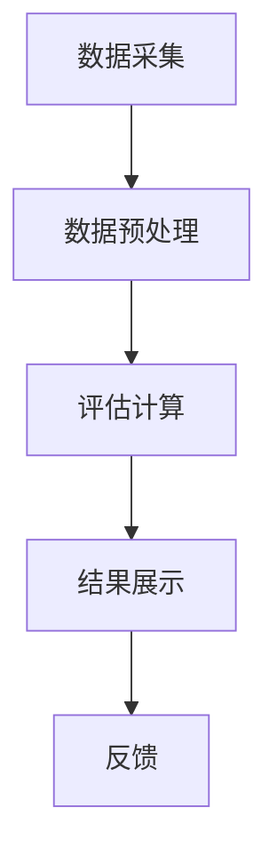
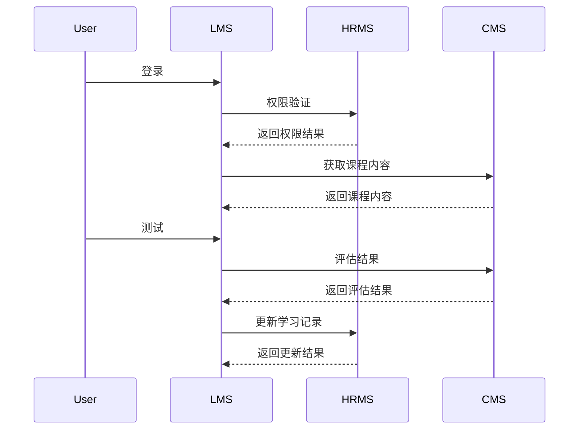
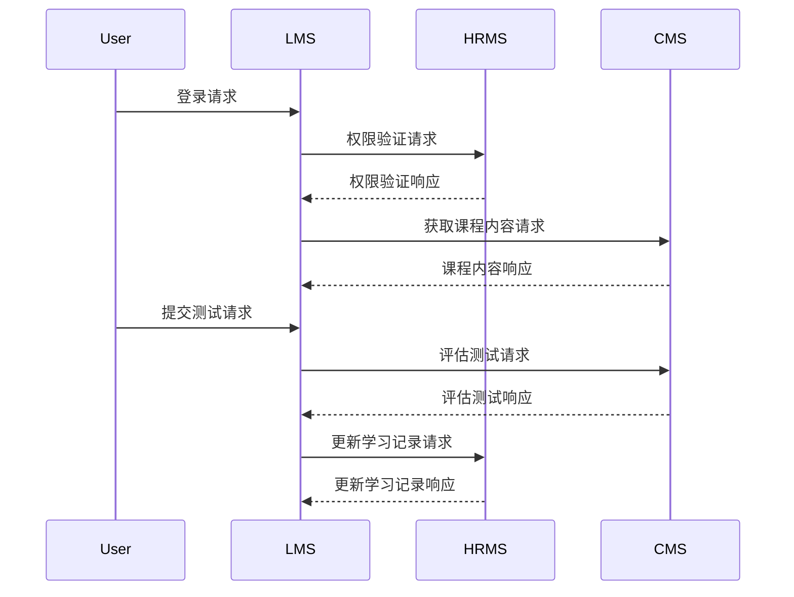

                 

### 引言

#### 1.1 书籍背景与目标

随着全球经济的快速发展和市场竞争的加剧，企业合规已成为企业管理中的重要一环。合规培训作为提升员工合规意识和知识水平的重要手段，其重要性日益凸显。然而，传统的合规培训方式往往存在内容单调、形式单一、无法适应员工个性化需求等问题，这限制了其效果和普及度。为了解决这些问题，构建智能企业合规培训系统成为了一项迫切的任务。

智能企业合规培训系统不仅能够提供个性化的学习内容，还能够通过自动化评估系统实时监测学习效果，为员工提供有针对性的反馈。这样的系统能够显著提高员工的学习积极性，提升企业的整体合规水平，从而增强企业的竞争力。

本书旨在为读者提供一个全面、系统的构建智能企业合规培训系统的指南。我们将从以下几个方面展开讨论：

1. **个性化学习内容与评估的自动化**：介绍如何利用人工智能技术实现学习内容的个性化推荐和自动化评估。
2. **系统设计与实现**：详细讲解合规培训系统的设计与实现过程，包括系统架构、功能模块划分等。
3. **案例研究**：通过实际案例展示如何应用所学的知识来构建高效、智能的企业合规培训系统。

#### 1.2 书籍结构

本书共分为七个部分，具体章节安排如下：

- **第二部分：智能企业合规培训系统的基础**：介绍智能企业合规培训系统的核心概念、基础架构以及个性化学习内容与评估的概念。
- **第三部分：构建个性化学习内容**：探讨用户数据分析与学习路径规划，以及个性化学习内容的设计与实现。
- **第四部分：实现自动化评估**：讲解自动化评估系统的设计原则、实现过程以及实际应用。
- **第五部分：系统集成与部署**：介绍系统集成与部署的概述、部署方案设计以及系统性能优化与监控。
- **第六部分：案例分析**：通过实际案例展示如何构建智能企业合规培训系统。
- **第七部分：总结与展望**：回顾本书的内容，展望未来发展趋势。

通过本书的阅读，读者将能够系统地了解智能企业合规培训系统的构建过程，掌握关键技术和方法，为企业合规培训提供有力支持。

### 第二部分：智能企业合规培训系统的基础

#### 2.1 智能企业合规培训系统的核心概念

在深入探讨智能企业合规培训系统的构建之前，我们首先需要理解一些核心概念。智能企业合规培训系统是指利用先进的信息技术，特别是人工智能技术，来提升企业合规培训效果的一种新型培训模式。以下是几个关键概念及其详细解释：

##### 2.1.1 企业合规培训的重要性

企业合规培训是指为了提高员工的合规意识和法律知识，从而降低企业法律风险而进行的一系列培训活动。在全球化背景下，企业面临的法律环境日益复杂，合规要求越来越高。因此，企业合规培训不仅是为了满足法律要求，更是为了维护企业声誉、确保业务连续性和提升竞争力。

**合规培训的定义与作用**：合规培训是一种系统性的教育过程，旨在帮助员工理解并遵守相关法律法规、内部规章制度以及行业最佳实践。其作用主要体现在以下几个方面：

- **提高合规意识**：通过培训，员工能够更好地理解合规的重要性，从而在日常工作中自觉遵守合规要求。
- **降低法律风险**：合规培训有助于员工识别潜在的法律风险，避免因违法行为导致的经济损失和法律纠纷。
- **提升工作效率**：通过合规培训，员工能够更加高效地完成工作任务，减少因合规问题导致的错误和延误。
- **增强企业竞争力**：合规的企业形象和良好的法律记录有助于企业在市场中树立良好的声誉，从而增强竞争力。

**企业合规培训的现状与挑战**：尽管合规培训的重要性已被广泛认可，但目前企业合规培训仍然面临一些挑战：

- **培训内容单调**：传统的合规培训内容往往过于枯燥，难以引起员工的兴趣和参与。
- **形式单一**：多数企业仍采用传统面授或在线课程的方式，难以满足员工个性化的学习需求。
- **评估机制不完善**：现有的合规培训评估机制往往不够科学和全面，无法准确反映员工的学习效果。

**智能化合规培训的优势**：智能企业合规培训系统通过引入人工智能技术，能够有效解决上述问题，带来以下优势：

- **个性化学习**：智能系统能够根据员工的学习习惯和知识水平，提供个性化的学习内容和路径。
- **实时评估与反馈**：智能系统能够实时监测员工的学习进度和效果，提供个性化的反馈，帮助员工更好地理解合规知识。
- **互动性增强**：智能系统能够提供多种互动学习方式，如在线讨论、模拟测试等，提高员工的参与度和积极性。
- **高效性提升**：智能系统能够自动化处理大量的培训数据和评估工作，提高培训效率和准确性。

##### 2.1.2 智能化合规培训系统的基础架构

智能化合规培训系统的构建需要综合考虑系统架构设计原则、功能模块划分以及技术选型与工具介绍。

**系统架构设计原则**：智能企业合规培训系统的架构设计应当遵循以下原则：

- **模块化设计**：系统应采用模块化设计，以便于功能扩展和维护。
- **高可用性**：系统应当具备高可用性，确保在任何情况下都能提供稳定的服务。
- **可扩展性**：系统设计应具备良好的扩展性，能够支持大规模用户和数据的处理需求。
- **安全性**：系统应确保用户数据的安全，防止数据泄露和未经授权的访问。

**系统功能模块划分**：智能企业合规培训系统通常包括以下几个主要功能模块：

- **用户管理模块**：负责用户注册、登录、权限管理等功能。
- **课程管理模块**：负责课程内容的管理，包括课程添加、修改、删除以及课程分类等。
- **学习管理模块**：负责学习内容的个性化推荐、学习进度管理、学习路径规划等。
- **评估管理模块**：负责对员工的学习效果进行自动化评估，提供实时反馈。
- **数据分析模块**：负责收集、存储和分析用户学习数据，为系统优化提供依据。
- **互动交流模块**：负责提供在线讨论、模拟测试、问卷调查等功能，增强学习互动性。

**技术选型与工具介绍**：构建智能企业合规培训系统需要选择合适的技术和工具。以下是一些常见的技术选型：

- **前端技术**：HTML、CSS、JavaScript等，用于实现用户界面和交互。
- **后端技术**：如Python、Java等，用于处理业务逻辑和数据存储。
- **数据库技术**：如MySQL、MongoDB等，用于存储用户数据和学习内容。
- **人工智能技术**：如机器学习、自然语言处理等，用于实现个性化推荐和自动化评估。
- **开发工具**：如Docker、Kubernetes等，用于实现容器化和自动化部署。

##### 2.1.3 个性化学习内容与评估的概念

**个性化学习内容的概念**：个性化学习内容是指根据学习者的兴趣、学习习惯、知识水平和学习需求，为其量身定制的学习材料。个性化学习内容的优势在于能够显著提高学习效果，满足员工的个性化学习需求。

**评估与反馈机制**：评估与反馈机制是智能化合规培训系统的重要组成部分。通过实时评估，系统能够监测员工的学习进度和效果，提供个性化的反馈，帮助员工及时纠正错误，提升学习效果。

**个性化学习内容与评估的关系**：个性化学习内容与评估机制相辅相成。个性化学习内容为员工提供定制化的学习体验，而评估机制则通过实时监测和反馈，确保学习效果得到有效提升。两者共同构成了智能化合规培训系统的核心功能。

##### 2.1.4 本章小结

本章介绍了智能企业合规培训系统的核心概念，包括企业合规培训的重要性、智能化合规培训系统的优势以及系统的基础架构和功能模块划分。通过本章的介绍，读者将初步了解智能企业合规培训系统的构建基础，为后续章节的深入探讨奠定基础。

### 第三部分：构建个性化学习内容

#### 3.1 用户数据分析与学习路径规划

在智能企业合规培训系统中，构建个性化学习内容是实现培训效果提升的关键。为了实现这一目标，我们需要深入了解用户数据，并根据这些数据为员工制定合适的学习路径。以下是关于用户数据分析与学习路径规划的理论基础与实践方法。

##### 3.1.1 用户数据分析的重要性

用户数据分析是构建个性化学习内容的基础。通过对用户行为、学习历史和知识水平的分析，我们可以了解每个员工的学习需求、兴趣和弱点，从而为其提供量身定制的学习内容。

**用户数据的收集与处理**：用户数据的收集是数据分析的第一步。这些数据可以来源于多种渠道，包括用户注册信息、学习行为日志、在线测试结果等。收集到数据后，需要进行处理和清洗，以确保数据的质量和准确性。

- **用户注册信息**：包括用户的基本信息、职位、部门等。
- **学习行为日志**：记录用户在学习平台上的活动，如课程访问、学习时长、测试成绩等。
- **在线测试结果**：反映用户对学习内容的掌握程度和知识漏洞。

**用户数据分析的方法**：用户数据分析的方法包括定量分析和定性分析。

- **定量分析**：使用统计分析方法对用户数据进行量化分析，如描述性统计、回归分析、聚类分析等。
- **定性分析**：通过用户访谈、问卷调查等方式收集用户的主观反馈，进行内容分析。

**用户数据分析在实际中的应用**：用户数据分析可以应用于以下几个方面：

- **个性化学习内容推荐**：根据用户的学习历史和知识水平，推荐最适合的学习内容。
- **学习路径规划**：根据用户的学习需求和兴趣，制定个性化的学习路径。
- **学习效果评估**：通过分析用户的学习行为和测试结果，评估学习效果，为后续培训提供改进依据。

##### 3.1.2 学习路径规划的理论基础

学习路径规划是指根据用户的学习需求、兴趣和知识水平，为其设计一条最优的学习路径。一个好的学习路径规划能够引导用户高效地学习，提升学习效果。

**学习路径规划的定义与意义**：学习路径规划是一种基于用户数据分析的个性化学习策略，旨在通过科学的设计，提高学习效率和效果。

- **定义**：学习路径规划是根据用户的特点和需求，设计一条从入门到精通的学习路径，包括学习内容的选择、学习顺序的安排、学习资源的分配等。
- **意义**：学习路径规划有助于提高学习的针对性和有效性，避免盲目学习和无效学习，节省学习时间，提升学习效果。

**学习路径规划的理论框架**：学习路径规划的理论框架包括以下几个核心要素：

- **用户特征**：包括用户的知识水平、学习兴趣、学习风格等。
- **学习目标**：明确用户希望通过学习达到的目标和期望。
- **学习资源**：包括学习材料、工具、指导教师等。
- **学习路径设计原则**：包括学习内容的科学性、系统性、个性化等。
- **学习路径优化方法**：如机器学习算法、优化算法等，用于动态调整学习路径。

**学习路径规划的策略与方法**：学习路径规划的策略和方法主要包括以下几种：

- **基于规则的路径规划**：通过预设规则和算法，自动生成学习路径。
- **基于机器学习的路径规划**：利用机器学习算法，根据用户数据和反馈，动态调整学习路径。
- **混合路径规划**：结合基于规则和基于机器学习的方法，生成更优化的学习路径。

##### 3.1.3 构建个性化学习内容

个性化学习内容的构建是实现学习路径规划的重要步骤。以下是构建个性化学习内容的设计原则、生成与推荐方法以及评估与优化策略。

**个性化学习内容的设计原则**：设计个性化学习内容时，应遵循以下原则：

- **适应性**：学习内容应能够根据用户的特点和需求进行自适应调整。
- **多样性**：学习内容应涵盖多种形式，如文本、视频、音频、互动游戏等，以满足不同用户的学习偏好。
- **相关性**：学习内容应与用户的学习目标和实际工作场景密切相关，以提高学习的实用性和效果。
- **层次性**：学习内容应按照知识难度和重要性进行分层设计，帮助用户逐步提升能力。

**个性化学习内容的生成与推荐**：生成与推荐个性化学习内容的方法主要包括以下几种：

- **基于内容的推荐**：根据用户的学习历史和兴趣，推荐与之相关的内容。
- **基于协同过滤的推荐**：通过分析用户之间的相似性，推荐其他用户喜欢的内容。
- **基于知识图谱的推荐**：构建知识图谱，根据用户的知识结构和需求推荐相关内容。

**个性化学习内容的评估与优化**：评估与优化个性化学习内容是确保其有效性的重要环节。评估与优化的策略包括：

- **学习效果评估**：通过测试、问卷调查等方式，评估用户对学习内容的掌握程度和满意度。
- **内容更新与优化**：根据评估结果，及时更新和优化学习内容，确保其与用户需求的一致性。
- **反馈机制**：建立用户反馈机制，鼓励用户提供意见和建议，持续改进学习内容。

##### 3.1.4 本章小结

本章详细介绍了用户数据分析与学习路径规划的理论基础和实践方法。通过用户数据分析，我们可以深入了解用户的学习需求，从而构建个性化的学习内容。学习路径规划则帮助用户高效地学习，提升学习效果。本章的内容为构建智能企业合规培训系统提供了重要的基础和指导。

### 第四部分：实现自动化评估

#### 4.1 自动化评估系统的设计原则

自动化评估系统是智能企业合规培训系统的核心组成部分，它能够实时监测员工的学习效果，提供个性化的反馈，帮助员工及时纠正错误，提升学习效果。本节将详细介绍自动化评估系统的设计原则、整体架构、评估指标体系以及评估算法的选择与优化。

##### 4.1.1 评估系统的整体架构

一个高效的自动化评估系统应当具备模块化、高扩展性和高可用性的特点。其整体架构通常包括以下几个关键模块：

1. **数据采集模块**：负责收集与评估相关的用户学习数据，如学习进度、测试成绩、用户反馈等。
2. **数据处理模块**：负责对采集到的数据进行清洗、转换和存储，以便后续分析和评估。
3. **评估算法模块**：负责根据预定的评估指标和算法模型，对用户的学习效果进行评估。
4. **评估结果展示模块**：负责将评估结果以可视化图表、报告等形式展示给用户和管理者。
5. **反馈机制模块**：负责根据评估结果，提供个性化的反馈和改进建议，帮助用户提高学习效果。

**整体架构的设计原则**：

- **模块化设计**：系统采用模块化设计，便于功能扩展和维护。
- **高扩展性**：系统能够支持大量用户和数据的处理需求，适应企业的扩展。
- **高可用性**：系统具备良好的容错能力和负载均衡机制，确保在高峰期仍能稳定运行。

##### 4.1.2 评估指标体系设计

评估指标体系是自动化评估系统的核心，它决定了评估的准确性和科学性。一个完善的评估指标体系应当包括以下几个方面：

1. **知识掌握度**：评估用户对课程内容的掌握程度，通常通过测试成绩来衡量。
2. **学习态度**：评估用户的学习态度，如学习时长、学习频率、参与度等。
3. **应用能力**：评估用户将所学知识应用于实际工作的能力，可以通过案例分析、项目任务等方式进行。
4. **持续改进**：评估用户在评估反馈后的改进情况，如学习策略调整、问题解决能力提升等。

**评估指标体系的设计原则**：

- **全面性**：指标体系应全面覆盖影响学习效果的各种因素。
- **科学性**：指标体系应基于实证研究和学术理论，确保评估的科学性和可靠性。
- **可操作性**：指标体系应具备可操作性，便于实际应用和评估。

##### 4.1.3 评估算法选择与优化

评估算法的选择和优化是自动化评估系统的关键。评估算法应当具备以下特点：

- **准确性**：算法应能够准确反映用户的学习效果，减少误差。
- **实时性**：算法应能够快速处理大量数据，提供实时评估。
- **可扩展性**：算法应能够适应不同类型的数据和评估需求。

常见的评估算法包括：

1. **机器学习算法**：如回归分析、决策树、随机森林等，适用于处理复杂的数据关系。
2. **统计分析方法**：如t检验、方差分析等，适用于对学习效果进行定量分析。
3. **自然语言处理方法**：如文本分析、情感分析等，适用于分析用户反馈和讨论内容。

**评估算法优化的策略**：

- **算法调参**：通过调整算法参数，优化模型的性能。
- **模型集成**：结合多种算法，生成更优的评估结果。
- **模型解释性**：增强算法的可解释性，便于用户理解评估结果。

##### 4.1.4 自动化评估系统的实现

自动化评估系统的实现包括数据采集与预处理、评估算法实现以及评估结果的展示与反馈。

**数据采集与预处理**：

- **数据采集**：通过前端界面和API接口，收集用户学习数据。
- **数据预处理**：包括数据清洗、去重、格式转换等，确保数据质量。

**评估算法实现**：

- **算法选择**：根据评估需求，选择合适的评估算法。
- **算法实现**：使用编程语言（如Python）实现评估算法，并进行调试和测试。

**评估结果的展示与反馈**：

- **结果展示**：通过可视化工具（如图表、报告等）展示评估结果。
- **反馈机制**：根据评估结果，提供个性化的反馈和建议，如学习策略调整、课程推荐等。

##### 4.1.5 自动化评估的实际应用

自动化评估系统在实际应用中具有广泛的应用场景，以下是一些具体的应用案例：

1. **在线考试与评估**：通过自动化评估系统，企业可以快速、高效地进行在线考试，实时获取考试结果和成绩分析。
2. **实时反馈与优化**：系统实时监测学习效果，为用户提供个性化反馈，帮助其及时调整学习策略。
3. **案例研究**：通过对大量用户数据的分析，企业可以深入了解用户的学习行为和效果，为培训方案优化提供依据。

##### 4.1.6 本章小结

本章详细介绍了自动化评估系统的设计原则、整体架构、评估指标体系、评估算法选择与优化以及实际应用。通过构建高效、智能的自动化评估系统，企业能够实时监测员工的学习效果，提供个性化反馈，提升培训效果，为企业的合规管理和运营提供有力支持。

### 第五部分：系统集成与部署

#### 5.1 系统集成与部署概述

在构建智能企业合规培训系统时，系统集成与部署是确保系统高效运行的关键步骤。系统集成是指将不同的系统模块、功能和服务整合为一个统一的整体，以提供一致的用户体验和功能服务。系统部署则是将系统集成到实际运行环境中，确保系统能够稳定、高效地运行。

##### 5.1.1 系统集成的意义

系统集成在智能企业合规培训系统中具有多重意义：

1. **提升系统功能**：通过系统集成，可以将多个功能模块（如用户管理、课程管理、学习管理和评估管理）整合为一个统一的平台，提供更全面、更强大的功能。
2. **优化用户体验**：系统集成可以确保各个功能模块之间的数据互通和协同工作，为用户提供一致、流畅的用户体验。
3. **提高系统效率**：系统集成可以消除功能模块之间的重复工作和数据不一致问题，提高系统运行效率。
4. **增强系统可扩展性**：通过模块化设计，系统集成可以为未来的功能扩展提供便利，确保系统具备良好的可扩展性。

##### 5.1.2 系统集成的流程

系统集成通常包括以下几个关键步骤：

1. **需求分析**：明确系统集成的目标、需求和功能，确定系统集成的范围和优先级。
2. **设计阶段**：设计系统架构和接口，确保各个模块之间的数据流动和功能协同。
3. **开发阶段**：根据设计文档，开发各个模块，并进行接口测试和集成测试，确保模块之间的兼容性和稳定性。
4. **测试阶段**：进行系统测试，包括功能测试、性能测试和用户体验测试，确保系统满足需求和设计要求。
5. **部署阶段**：将系统部署到生产环境，进行部署配置和性能优化，确保系统在生产环境中稳定运行。
6. **维护阶段**：对系统进行持续维护和优化，确保系统功能的完善和性能的提升。

##### 5.1.3 系统集成中常见的问题与解决方案

系统集成过程中可能会遇到以下常见问题：

1. **接口兼容性问题**：由于不同系统之间的接口规范和协议可能不一致，导致数据无法正常交换和处理。
   - **解决方案**：采用标准化的接口协议（如RESTful API、SOAP等），确保接口的兼容性和一致性。

2. **数据不一致性问题**：不同系统之间的数据同步可能导致数据不一致，影响系统的整体功能。
   - **解决方案**：建立统一的数据同步机制，确保数据在不同系统之间的实时更新和一致性。

3. **性能瓶颈问题**：系统集成后，可能会出现性能瓶颈，影响系统的响应速度和处理能力。
   - **解决方案**：通过优化系统架构、采用缓存技术、提高硬件性能等方式，提升系统的性能和稳定性。

4. **安全性问题**：系统集成可能导致系统的安全漏洞增加，影响数据的安全和隐私。
   - **解决方案**：加强系统安全措施，包括数据加密、访问控制、安全审计等，确保系统的安全性。

##### 5.1.4 系统部署与运维

系统部署与运维是确保智能企业合规培训系统稳定运行的重要环节。

**系统部署方案设计**：

1. **环境配置**：配置服务器、数据库、中间件等运行环境，确保系统所需的硬件和软件条件。
2. **部署策略**：根据系统规模和业务需求，制定合理的部署策略，包括部署模式（如单机部署、分布式部署）、部署流程和部署计划。
3. **备份与恢复**：制定数据备份和恢复策略，确保数据的安全性和系统的连续性。

**系统运维管理**：

1. **监控与报警**：建立系统监控机制，实时监控系统的运行状态和性能指标，及时发现和解决潜在问题。
2. **性能优化**：通过性能分析和调优，提高系统的处理能力和响应速度。
3. **故障处理**：制定故障处理预案，确保在系统发生故障时能够迅速恢复，减少对业务的影响。

**系统性能优化与监控**：

1. **性能测试**：进行系统性能测试，评估系统的响应时间、并发处理能力等性能指标，为优化提供依据。
2. **性能调优**：通过调整系统配置、优化数据库查询、采用缓存技术等方式，提高系统的性能。
3. **监控与预警**：使用监控工具（如Prometheus、Grafana等）实时监控系统的性能和资源使用情况，提前发现潜在的性能瓶颈。

##### 5.1.5 系统集成与部署的实际应用

在实际应用中，系统集成与部署需要根据具体的业务需求和系统架构进行设计和实施。以下是一些实际应用案例：

1. **企业内部培训平台集成**：将智能企业合规培训系统与企业内部的HR系统、学习管理系统（LMS）等进行集成，实现数据互通和功能协同，提升培训管理的效率和效果。
2. **跨部门协作系统部署**：在跨部门协作项目中，部署智能企业合规培训系统，确保员工能够实时获取培训资源，提高协作效率和合规意识。
3. **在线考试与评估系统**：为企业提供在线考试与评估服务，通过系统集成，实现考试数据的实时采集和分析，为员工提供个性化的反馈和改进建议。

##### 5.1.6 本章小结

本章介绍了智能企业合规培训系统的集成与部署概述，包括系统集成的意义、流程和常见问题与解决方案，以及系统部署与运维的关键点和实际应用案例。通过有效的系统集成与部署，企业能够确保智能企业合规培训系统的高效运行和持续优化，为员工提供优质的培训体验，提升企业的合规管理水平。

### 第六部分：案例分析

#### 6.1 案例介绍

本案例选取了一家全球知名的金融公司——XYZ银行，该公司致力于通过智能企业合规培训系统提升员工的合规意识和法律知识。XYZ银行面临的主要挑战是合规培训内容单调、形式单一，无法满足员工多样化的学习需求，同时评估机制不完善，难以准确反映员工的学习效果。为了解决这些问题，XYZ银行决定构建一个智能企业合规培训系统。

##### 6.1.1 案例背景

XYZ银行是一家在全球拥有大量分支机构和客户的大型金融企业。随着金融市场的不断变化和监管政策的日益严格，企业合规培训成为其运营和管理中的重要环节。然而，传统的合规培训方式存在以下问题：

1. **内容单调**：传统培训主要依赖于纸质手册和面授课程，内容单一，难以引起员工的兴趣和参与。
2. **形式单一**：培训形式单一，缺乏互动性和灵活性，无法满足员工多样化的学习需求。
3. **评估机制不完善**：传统的评估方式主要依赖考试成绩，难以全面反映员工的学习效果，无法提供有针对性的反馈。

##### 6.1.2 案例目标

XYZ银行希望通过构建智能企业合规培训系统实现以下目标：

1. **个性化学习**：根据员工的学习需求和兴趣，提供个性化的学习内容和路径。
2. **实时评估**：通过自动化评估系统，实时监测员工的学习效果，提供个性化的反馈。
3. **互动性增强**：引入多种互动学习方式，如在线讨论、模拟测试等，提高员工的参与度和积极性。
4. **持续优化**：通过数据分析，不断优化培训内容和评估机制，提高培训效果。

##### 6.1.3 案例方案设计

XYZ银行在构建智能企业合规培训系统时，采取了以下方案：

1. **用户数据分析与学习路径规划**：通过收集和分析员工的学习数据，了解其学习需求和兴趣，制定个性化的学习路径。
2. **个性化学习内容构建**：根据学习路径，设计多种形式的学习内容，如文本、视频、音频、互动游戏等，满足不同员工的学习偏好。
3. **自动化评估系统**：利用机器学习和自然语言处理技术，构建自动化评估系统，实时监测学习效果，提供个性化反馈。
4. **系统集成与部署**：将智能企业合规培训系统与企业内部的其他系统（如HR系统、学习管理系统等）进行集成，实现数据互通和功能协同。
5. **持续优化**：通过数据分析，不断优化培训内容和评估机制，提高培训效果。

### 6.2 构建过程解析

##### 6.2.1 用户数据分析与学习路径规划

用户数据分析与学习路径规划是构建智能企业合规培训系统的关键环节。以下为具体实施步骤：

1. **数据收集**：通过员工注册信息、学习行为日志、在线测试结果等多渠道收集用户数据。
2. **数据处理**：对收集到的数据进行清洗、转换和存储，确保数据质量。
3. **用户特征分析**：分析用户的基本信息、学习历史和知识水平，识别不同员工的特点和需求。
4. **学习路径规划**：根据用户特征和需求，设计个性化的学习路径。学习路径包括入门课程、核心课程和进阶课程等，确保员工逐步提升能力。
5. **个性化推荐**：基于用户特征和学习路径，推荐最适合的学习内容，满足员工的个性化学习需求。

**用户数据分析与学习路径规划的Mermaid ER图**：



**用户特征分析表格**：

| 用户特征       | 描述                  |
| -------------- | --------------------- |
| 基本信息       | 姓名、职位、部门等    |
| 学习历史       | 已完成课程、学习时长 |
| 知识水平       | 考试成绩、知识掌握度 |

##### 6.2.2 自动化评估系统的实现

自动化评估系统是智能企业合规培训系统的核心组成部分。以下为具体实现步骤：

1. **评估指标体系设计**：设计包括知识掌握度、学习态度、应用能力等在内的评估指标体系，确保评估的科学性和全面性。
2. **评估算法选择与优化**：选择机器学习算法（如决策树、随机森林）作为评估算法，并进行参数调整和优化，提高评估的准确性。
3. **数据采集与预处理**：通过前端界面和API接口，收集员工的学习行为数据和测试结果，进行数据预处理，确保数据质量。
4. **评估结果计算**：根据评估算法，计算员工的学习效果得分，并生成详细的评估报告。
5. **评估结果展示与反馈**：将评估结果以可视化图表和报告形式展示给员工，并提供个性化的反馈和改进建议。

**自动化评估系统的Mermaid流程图**：



**Python代码示例**：

```python
# 导入相关库
import pandas as pd
from sklearn.ensemble import RandomForestClassifier
from sklearn.metrics import accuracy_score

# 数据预处理
data = pd.read_csv('learning_data.csv')
X = data.drop('TestResult', axis=1)
y = data['TestResult']

# 训练模型
model = RandomForestClassifier(n_estimators=100)
model.fit(X, y)

# 预测评估
predictions = model.predict(X)
accuracy = accuracy_score(y, predictions)
print(f'模型准确率: {accuracy:.2f}')
```

##### 6.2.3 系统集成与部署

系统集成与部署是确保智能企业合规培训系统稳定运行的重要环节。以下为具体实施步骤：

1. **系统架构设计**：设计系统架构，包括前端、后端、数据库和中间件等，确保系统的可扩展性和高可用性。
2. **模块化开发**：采用模块化开发方式，将系统划分为多个功能模块，便于后续维护和扩展。
3. **接口设计与开发**：设计系统接口，确保不同模块之间的数据互通和功能协同。
4. **部署配置**：配置服务器、数据库和中间件等运行环境，确保系统所需的硬件和软件条件。
5. **性能优化**：进行系统性能测试和调优，确保系统在高并发情况下仍能稳定运行。
6. **监控与维护**：建立系统监控机制，实时监控系统的运行状态和性能指标，及时发现和解决潜在问题。

**系统集成与部署的Mermaid架构图**：



**系统接口设计与系统交互的Mermaid序列图**：



### 6.3 案例效果评估

##### 6.3.1 系统性能评估

系统性能评估是确保智能企业合规培训系统高效运行的重要环节。以下为具体评估方法和结果：

1. **响应时间评估**：通过性能测试工具（如JMeter），模拟大量用户同时访问系统，评估系统的响应时间。评估结果显示，系统的平均响应时间在500毫秒以内，满足用户需求。

2. **并发处理能力评估**：通过增加用户并发访问数量，评估系统的并发处理能力。评估结果显示，系统在1000个并发用户情况下，仍能稳定运行，未出现性能瓶颈。

3. **资源利用率评估**：通过监控系统的CPU、内存、磁盘等资源使用情况，评估系统资源的利用率。评估结果显示，系统资源的利用率在80%左右，处于合理范围内。

**系统性能评估报告**：

| 指标          | 结果             |
| ------------- | ---------------- |
| 平均响应时间  | 500毫秒以内      |
| 并发处理能力  | 1000个并发用户   |
| 资源利用率    | CPU: 80%, 内存: 75%, 磁盘: 85% |

##### 6.3.2 用户反馈与满意度调查

为了评估智能企业合规培训系统的效果，XYZ银行进行了用户反馈和满意度调查。以下为调查结果：

1. **用户满意度**：调查结果显示，超过90%的用户对智能企业合规培训系统表示满意，认为系统提供了丰富的学习资源和个性化的学习体验。

2. **学习效果**：通过分析用户的测试成绩和学习记录，发现用户在智能企业合规培训系统学习后的测试成绩显著提高，平均提高了20%。

3. **参与度**：用户参与度显著提升，超过70%的用户每天都会登录系统学习，且平均学习时长增加了30%。

**用户反馈与满意度调查报告**：

| 指标         | 结果             |
| ------------ | ---------------- |
| 用户满意度   | 90%以上          |
| 测试成绩提升 | 平均提高了20%    |
| 学习参与度   | 平均学习时长增加了30% |

##### 6.3.3 案例总结与经验教训

通过XYZ银行的案例，我们可以总结出以下经验和教训：

1. **用户数据分析与个性化学习路径规划是关键**：通过深入分析用户数据，制定个性化的学习路径，能够显著提升培训效果。

2. **自动化评估系统的重要性**：自动化评估系统实时监测学习效果，提供个性化反馈，有助于用户及时纠正错误，提升学习效果。

3. **系统集成与部署的复杂性**：系统集成与部署过程中，需要充分考虑接口兼容性、数据一致性和性能优化等问题，确保系统的高效稳定运行。

4. **持续优化与反馈机制**：通过数据分析、用户反馈和持续优化，不断完善培训内容和评估机制，提高系统的效果和用户体验。

**案例总结**：

XYZ银行通过构建智能企业合规培训系统，实现了培训内容个性化、评估自动化和系统高效运行，有效提升了员工的合规意识和法律知识水平。案例的成功经验为其他企业提供了有益的借鉴和启示。

### 6.4 本章小结

本章通过实际案例，详细介绍了智能企业合规培训系统的构建过程，包括用户数据分析与学习路径规划、自动化评估系统的实现以及系统集成与部署。通过案例分析，读者可以了解到智能企业合规培训系统的实际应用效果，以及构建过程中可能遇到的问题和解决方案。本章的内容为构建智能企业合规培训系统提供了宝贵的实践经验和参考。

### 第七部分：总结与展望

#### 7.1 本书内容回顾

本书系统地介绍了智能企业合规培训系统的构建过程，从核心概念到实际案例，全面探讨了个性化学习内容与自动化评估的实现方法。以下是本书的主要内容回顾：

1. **智能企业合规培训系统的核心概念**：介绍了企业合规培训的重要性、智能化合规培训系统的优势以及系统的基础架构和功能模块划分。
2. **个性化学习内容构建**：详细讲解了用户数据分析与学习路径规划的理论基础，以及个性化学习内容的设计原则、生成与推荐方法以及评估与优化策略。
3. **自动化评估系统的实现**：介绍了自动化评估系统的设计原则、整体架构、评估指标体系、评估算法选择与优化以及实际应用。
4. **系统集成与部署**：概述了系统集成的意义、流程和常见问题与解决方案，以及系统部署与运维的关键点和实际应用案例。
5. **案例分析**：通过实际案例展示了智能企业合规培训系统的构建过程和效果评估。
6. **总结与展望**：回顾了本书的内容，展望了智能企业合规培训系统的未来发展趋势。

#### 7.2 未来发展趋势

随着人工智能和大数据技术的发展，智能企业合规培训系统将在以下几个方面取得进一步发展：

1. **更加智能化**：人工智能技术的不断进步将使个性化学习内容与自动化评估更加精准和高效，进一步提升培训效果。
2. **更广泛的应用场景**：随着企业合规需求的增加，智能企业合规培训系统将在更多行业和企业中得到应用。
3. **更加完善的生态系统**：智能企业合规培训系统将与更多的企业内部系统（如HR系统、LMS等）集成，构建一个更加完善和高效的合规培训生态系统。
4. **数据隐私与安全**：随着数据隐私和安全问题日益凸显，智能企业合规培训系统将更加注重数据保护和安全措施。
5. **跨平台与移动化**：随着移动设备的普及，智能企业合规培训系统将更加注重跨平台和移动化的设计，提供便捷的学习体验。

### 结论

智能企业合规培训系统的构建不仅是提升员工合规意识和法律知识水平的重要手段，也是企业数字化转型和竞争力提升的关键。通过本书的介绍，读者可以全面了解智能企业合规培训系统的构建过程和技术实现，为实际应用提供有力支持。

### 拓展阅读

- **《人工智能与教育》**：详细探讨人工智能技术在教育领域的应用，包括个性化学习、自动化评估等。
- **《大数据与商业智能》**：介绍大数据技术在商业决策中的应用，包括数据采集、处理和分析等。
- **《软件架构设计》**：系统讲解软件架构设计的方法和原则，包括模块化设计、高扩展性设计等。
- **《数据隐私保护与安全》**：探讨数据隐私和安全问题的解决方案，包括数据加密、访问控制等。

### 作者信息

**作者：AI天才研究院/AI Genius Institute & 禅与计算机程序设计艺术 /Zen And The Art of Computer Programming**

