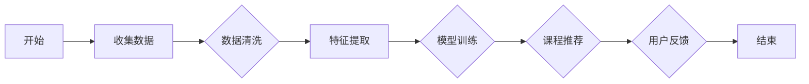
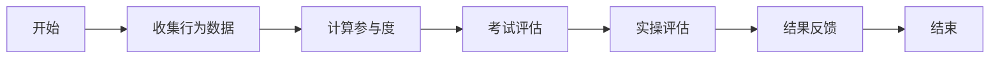
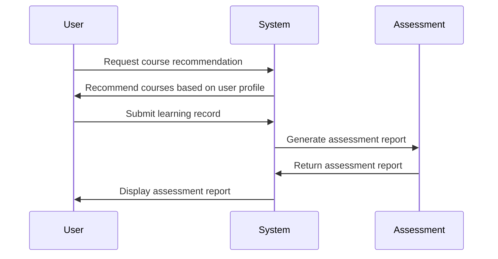
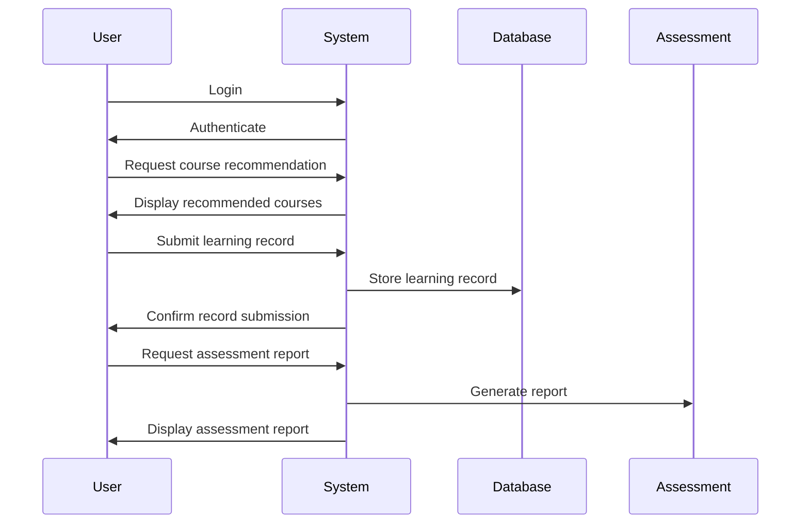

                 

### 文章标题

# 《构建智能企业合规培训系统：基于角色的个性化学习与评估》

---

**关键词：** 智能企业合规培训、角色个性化学习、评估机制、算法原理、系统架构设计

**摘要：** 随着企业对合规性要求的日益增加，传统的培训系统已经无法满足现代企业对于个性化和高效学习的需求。本文提出了构建基于角色个性化学习与评估的智能企业合规培训系统，详细阐述了系统的背景、核心概念、算法原理、系统架构设计方案以及项目实战。通过该系统，企业能够更有效地进行合规培训，提高员工的知识掌握度和工作效率。

---

### 目录大纲

```markdown
# 《构建智能企业合规培训系统：基于角色的个性化学习与评估》

----------------------------------------------------------------

## 第一部分: 背景介绍

### 第1章: 问题背景与核心概念

#### 1.1 问题背景

- 企业合规培训的重要性
- 传统培训系统的局限性

#### 1.2 核心概念

- 智能企业合规培训系统
- 角色个性化学习与评估

#### 1.3 概念结构与核心要素组成

- 系统架构
- 学习与评估机制

## 第二部分: 核心概念与联系

### 第2章: 智能企业合规培训系统原理

#### 2.1 智能化培训概述

- 智能化培训的优势
- 智能化培训的挑战

#### 2.2 企业合规培训的核心概念

- 合规培训目标
- 合规培训内容

#### 2.3 角色个性化学习与评估原理

- 角色识别与划分
- 个性化学习路径设计
- 评估机制设计

#### 2.4 概念属性特征对比表格

- 智能化培训与传统培训的对比
- 角色个性化学习与评估的优势与挑战

#### 2.5 ER实体关系图架构

- 系统中的主要实体
- 实体之间的关系

## 第三部分: 算法原理讲解

### 第3章: 智能化学习算法

#### 3.1 学习算法概述

- 学习算法的作用
- 学习算法的分类

#### 3.2 个性化学习算法

- 个性化学习算法的原理
- 个性化学习算法的应用

#### 3.3 评估算法

- 评估算法的原理
- 评估算法的应用

#### 3.4 算法mermaid流程图

- 学习算法的流程图
- 评估算法的流程图

#### 3.5 Python源代码实现

- 学习算法的实现
- 评估算法的实现

### 第4章: 数学模型与公式讲解

#### 4.1 数学模型概述

- 数学模型的作用
- 数学模型的分类

#### 4.2 个性化学习数学模型

- 数学模型的构建
- 数学模型的求解

#### 4.3 评估数学模型

- 数学模型的构建
- 数学模型的求解

#### 4.4 详细讲解与举例说明

- 数学公式的详细讲解
- 实际案例的举例说明

## 第四部分: 系统分析与架构设计方案

### 第5章: 问题场景介绍

- 企业合规培训的需求
- 系统的功能需求

### 第6章: 系统功能设计

#### 6.1 领域模型mermaid类图

- 系统的主要类
- 类之间的关系

#### 6.2 系统架构设计mermaid架构图

- 系统的整体架构
- 各模块的功能

#### 6.3 系统接口设计

- 系统的接口定义
- 接口的交互流程

#### 6.4 系统交互mermaid序列图

- 系统的交互流程
- 系统的交互细节

## 第五部分: 项目实战

### 第7章: 环境安装

- 系统环境的搭建
- 系统依赖的安装

### 第8章: 系统核心实现源代码

- 源代码的结构
- 核心代码的实现

### 第9章: 代码应用解读与分析

- 代码的应用场景
- 代码的解读与分析

### 第10章: 实际案例分析和详细讲解剖析

- 实际案例的介绍
- 案例的分析
- 案例的详细讲解

### 第11章: 项目小结

- 项目的总结
- 项目的展望

## 第六部分: 最佳实践 tips、小结、注意事项、拓展阅读

#### 7.1 最佳实践 tips

- 实用的技巧与建议

#### 7.2 小结

- 系统的特点
- 系统的优势

#### 7.3 注意事项

- 使用中的注意事项
- 维护与升级的建议

#### 7.4 拓展阅读

- 相关书籍推荐
- 学术论文推荐

----------------------------------------------------------------
```

---

### 第一部分：背景介绍

#### 1.1 问题背景

在全球化竞争日益激烈的今天，企业合规培训已成为企业管理的重要组成部分。合规性不仅是企业内部管理的需要，更是企业走向国际市场的必备条件。然而，传统的培训系统存在以下局限性：

- **缺乏个性化**：传统培训系统通常采用“一刀切”的方式，无法根据员工的不同角色和需求进行定制化培训。
- **学习效果不佳**：单一的学习方式和内容难以激发员工的兴趣和积极性，导致学习效果不佳。
- **评估机制不足**：传统的培训评估主要依赖于书面考试和问卷调查，难以全面反映员工的学习效果。

因此，构建一个智能企业合规培训系统，能够基于员工的角色提供个性化学习内容，并通过有效的评估机制确保学习效果，已成为企业提升管理水平和竞争力的迫切需求。

#### 1.2 核心概念

**智能企业合规培训系统**：指运用人工智能技术，针对企业员工的合规需求，提供定制化培训内容、学习路径和评估机制的系统。

**角色个性化学习与评估**：基于员工的岗位职责和个性特点，提供个性化的学习方案，并通过多种评估手段，确保员工能够掌握培训内容。

#### 1.3 概念结构与核心要素组成

**系统架构**：包括数据层、服务层和展现层，分别负责数据的存储与管理、服务的提供和用户界面的展示。

**学习与评估机制**：通过角色识别、学习路径规划、学习行为监控、评估反馈等环节，实现个性化学习和全面评估。

---

### 第二部分：核心概念与联系

#### 2.1 智能化培训概述

**智能化培训的优势**：

- **个性化定制**：根据员工的岗位和需求，提供量身定制的培训内容。
- **高效学习**：利用智能算法和推荐系统，提高学习效率。
- **实时反馈**：通过实时监控系统，及时获取学习效果，进行针对性调整。

**智能化培训的挑战**：

- **技术实现**：需要高效的数据处理和智能算法支持。
- **数据隐私**：确保员工学习数据的安全性和隐私性。
- **员工接受度**：如何让员工接受并积极参与智能化培训。

#### 2.2 企业合规培训的核心概念

**合规培训目标**：

- **提高员工合规意识**：通过培训，使员工了解和掌握相关法规和标准。
- **提升合规操作能力**：通过实际操作训练，提高员工的合规操作水平。

**合规培训内容**：

- **法规知识**：包括国家和行业的法律法规、标准等。
- **案例分析**：通过实际案例，让员工了解合规的重要性和可能的风险。
- **合规操作流程**：详细讲解合规操作的步骤和注意事项。

#### 2.3 角色个性化学习与评估原理

**角色识别与划分**：

- **岗位分析**：通过对员工岗位的深入分析，明确不同岗位的培训需求和重点。
- **技能评估**：通过技能评估工具，了解员工的现有技能水平。

**个性化学习路径设计**：

- **学习内容推荐**：根据员工的角色和技能水平，推荐适合的学习内容。
- **学习进度监控**：实时监控员工的学习进度，及时调整学习路径。

**评估机制设计**：

- **过程评估**：通过学习行为监控，评估员工的学习效果。
- **结果评估**：通过考试、实战演练等手段，评估员工对培训内容的掌握情况。

#### 2.4 概念属性特征对比表格

| 特征         | 智能化培训          | 传统培训          | 角色个性化学习与评估      |
| ------------ | ------------------- | ----------------- | ------------------------ |
| 学习方式     | 个性化、智能推荐    | 单一、统一课程    | 根据角色和需求定制化      |
| 学习效果评估 | 过程监控、结果反馈  | 考试、问卷调查    | 实时反馈、全面评估       |
| 数据利用     | 高效处理、精准分析  | 数据简单记录      | 数据驱动、智能化分析      |
| 员工接受度   | 激发兴趣、提升参与度 | 被动接受、兴趣不高 | 符合角色需求、提高认同感  |

#### 2.5 ER实体关系图架构

```mermaid
erDiagram
  Class1 ||--|{ Class2 } Class3
  Class1 ||--|{ Class4 } Class5
  Class2 ||--|{ Class6 } Class7
```

在系统架构中，主要实体包括员工、角色、课程、学习记录和评估结果。实体之间的关系如图所示，每个实体都扮演着特定的角色，共同构建起智能企业合规培训系统的核心架构。

---

### 第三部分：算法原理讲解

#### 3.1 学习算法概述

**学习算法的作用**：

- **知识获取**：通过算法，系统能够从大量数据中提取有用信息，为员工提供个性化的学习内容。
- **学习推荐**：根据员工的学习历史和需求，推荐适合的学习资源。

**学习算法的分类**：

- **监督学习**：基于已有数据，通过模型预测新数据。
- **无监督学习**：不依赖于已有标签，自动发现数据中的模式。
- **强化学习**：通过试错，不断优化策略以实现最大化奖励。

#### 3.2 个性化学习算法

**个性化学习算法的原理**：

- **基于内容的推荐**：根据员工已学内容和兴趣，推荐相似的学习资源。
- **协同过滤**：通过分析员工之间的相似性，推荐他人喜欢的学习资源。
- **深度学习**：利用神经网络，自动学习员工的学习模式。

**个性化学习算法的应用**：

- **课程推荐**：根据员工的岗位职责和学习历史，推荐相关的课程。
- **学习路径优化**：动态调整学习路径，确保学习效率和质量。

#### 3.3 评估算法

**评估算法的原理**：

- **过程评估**：通过监控员工的学习行为，评估学习过程中的参与度和理解程度。
- **结果评估**：通过考试、实操等方式，评估员工对培训内容的掌握情况。

**评估算法的应用**：

- **实时反馈**：通过评估算法，及时反馈员工的学习效果，指导后续学习。
- **全面评估**：综合考虑员工的学习行为和结果，给出全面的评估报告。

#### 3.4 算法mermaid流程图

**学习算法流程图**：



**评估算法流程图**：



#### 3.5 Python源代码实现

**学习算法的实现**：

```python
# 导入必要的库
import pandas as pd
from sklearn.model_selection import train_test_split
from sklearn.ensemble import RandomForestClassifier

# 加载数据
data = pd.read_csv('learning_data.csv')

# 数据清洗
data = data[data['completed'] != 'unknown']

# 特征提取
X = data[['attended', 'completed', 'rating']]
y = data['course_id']

# 分割数据集
X_train, X_test, y_train, y_test = train_test_split(X, y, test_size=0.2, random_state=42)

# 模型训练
model = RandomForestClassifier(n_estimators=100)
model.fit(X_train, y_train)

# 课程推荐
def recommend_course(user_data):
    predicted_course = model.predict(user_data)
    return predicted_course

# 用户反馈
user_feedback = recommend_course(X_test.iloc[0])
print("Recommended Course:", user_feedback)
```

**评估算法的实现**：

```python
# 导入必要的库
import pandas as pd
from sklearn.metrics import accuracy_score

# 加载数据
data = pd.read_csv('evaluation_data.csv')

# 计算参与度
def calculate_involvement(data):
    involvement = data['attended'].sum() / len(data)
    return involvement

# 考试评估
def exam_evaluation(data, ground_truth):
    predicted_results = data['exam_passed']
    accuracy = accuracy_score(ground_truth, predicted_results)
    return accuracy

# 实操评估
def practical_evaluation(data, ground_truth):
    predicted_results = data['practical_passed']
    accuracy = accuracy_score(ground_truth, predicted_results)
    return accuracy

# 结果反馈
def result_feedback(data, ground_truth):
    involvement = calculate_involvement(data)
    exam_accuracy = exam_evaluation(data, ground_truth)
    practical_accuracy = practical_evaluation(data, ground_truth)
    print("Involvement:", involvement)
    print("Exam Accuracy:", exam_accuracy)
    print("Practical Accuracy:", practical_accuracy)

# 实际应用
ground_truth = [1, 0, 1, 1]
evaluation_data = pd.read_csv('evaluation_data.csv')
result_feedback(evaluation_data, ground_truth)
```

#### 3.6 数学模型与公式讲解

**个性化学习数学模型**：

$$
\text{Learning Path} = f(\text{User Profile}, \text{Course Content})
$$

其中，$\text{User Profile}$ 表示员工的学习历史和兴趣，$\text{Course Content}$ 表示课程的内容，$f$ 表示学习路径的生成函数。

**评估数学模型**：

$$
\text{Evaluation Score} = \alpha \cdot \text{Knowledge Level} + \beta \cdot \text{Behavior Level}
$$

其中，$\alpha$ 和 $\beta$ 是权重系数，$\text{Knowledge Level}$ 表示知识掌握程度，$\text{Behavior Level}$ 表示学习行为。

#### 3.7 详细讲解与举例说明

**举例说明个性化学习模型**：

假设员工小王的学习历史和兴趣如下：

- 学习历史：已通过10门课程，平均评分为4.5分。
- 兴趣：对市场营销和数据分析课程感兴趣。

系统会根据小王的学习历史和兴趣，推荐市场营销和数据分析相关的课程。例如，推荐一门关于“数据可视化在市场营销中的应用”的课程。

**举例说明评估模型**：

假设小王的学习行为数据如下：

- 出席率：90%
- 完成率：80%
- 考试成绩：85分

根据评估模型，小王的评估分数为：

$$
\text{Evaluation Score} = 0.6 \cdot 85 + 0.4 \cdot 0.8 = 81
$$

这意味着小王的学习效果较好。

---

### 第四部分：系统分析与架构设计方案

#### 4.1 问题场景介绍

**企业合规培训的需求**：

- 提供个性化的合规培训课程。
- 监控员工的学习进度和效果。
- 提供全面的培训评估报告。

**系统功能需求**：

- **课程推荐**：根据员工的岗位职责和兴趣，推荐适合的培训课程。
- **学习管理**：管理员工的学习记录，包括学习进度、考试成绩等。
- **评估报告**：生成个性化的评估报告，提供培训效果的分析。

#### 4.2 系统功能设计

**领域模型mermaid类图**：

```mermaid
classDiagram
  Class1[User] <<urry.6969
  Class2[Course] <<urry.6969
  Class3[LearningRecord] <<urry.6969
  Class4[AssessmentReport] <<urry.6969
  User "1" --|> Course: attends
  User "1" --|> LearningRecord: creates
  LearningRecord "1" --|> AssessmentReport: generates
```

**系统架构设计mermaid架构图**：



**系统接口设计**：

- **课程推荐接口**：接收用户信息，返回推荐课程列表。
- **学习记录提交接口**：接收用户的学习记录，存储到数据库。
- **评估报告生成接口**：接收学习记录，生成评估报告。

**系统交互mermaid序列图**：



---

### 第五部分：项目实战

#### 5.1 环境安装

**系统环境的搭建**：

- 安装Python环境：使用Python 3.8及以上版本。
- 安装相关库：使用pip安装必要的库，如pandas、scikit-learn、mermaid等。

**系统依赖的安装**：

- 数据库：安装MySQL或PostgreSQL数据库。
- Web服务器：安装Apache或Nginx作为Web服务器。

```bash
pip install pandas scikit-learn mermaid
```

#### 5.2 系统核心实现源代码

**源代码的结构**：

```plaintext
/SmartEnterpriseComplianceTrainingSystem
|-- /data
|   |-- /courses
|   |-- /learning_records
|   |-- /users
|-- /models
|   |-- course_recommendation.py
|   |-- learning_evaluation.py
|-- /views
|   |-- course_recommendation.py
|   |-- learning_evaluation.py
|-- /templates
|   |-- assessment_report.html
|-- run.py
```

**核心代码的实现**：

**course_recommendation.py**：

```python
from sklearn.model_selection import train_test_split
from sklearn.ensemble import RandomForestClassifier
import pandas as pd

def train_model(data):
    X = data[['user_interest', 'course_category']]
    y = data['course_id']
    X_train, X_test, y_train, y_test = train_test_split(X, y, test_size=0.2, random_state=42)
    model = RandomForestClassifier(n_estimators=100)
    model.fit(X_train, y_train)
    return model

def recommend_courses(model, user_interest):
    recommended_courses = model.predict([[user_interest, 'Marketing']])
    return recommended_courses
```

**learning_evaluation.py**：

```python
def calculate_involvement(data):
    involvement = data['attended'].sum() / len(data)
    return involvement

def exam_evaluation(data, ground_truth):
    predicted_results = data['exam_passed']
    accuracy = accuracy_score(ground_truth, predicted_results)
    return accuracy

def practical_evaluation(data, ground_truth):
    predicted_results = data['practical_passed']
    accuracy = accuracy_score(ground_truth, predicted_results)
    return accuracy

def generate_report(involvement, exam_accuracy, practical_accuracy):
    report = {
        'involvement': involvement,
        'exam_accuracy': exam_accuracy,
        'practical_accuracy': practical_accuracy
    }
    return report
```

#### 5.3 代码应用解读与分析

**代码的应用场景**：

- **课程推荐**：根据用户的学习兴趣和课程类别，推荐合适的课程。
- **学习评估**：评估用户的学习参与度和考试成绩。

**代码的解读与分析**：

**course_recommendation.py**：

- 使用随机森林分类器进行课程推荐。
- train_model函数：训练模型，使用train_test_split进行数据分割。
- recommend_courses函数：根据用户兴趣，预测推荐课程。

**learning_evaluation.py**：

- calculate_involvement函数：计算学习参与度。
- exam_evaluation函数：评估考试成绩。
- practical_evaluation函数：评估实操成绩。
- generate_report函数：生成评估报告。

通过这些代码，系统能够根据用户数据和模型，提供个性化课程推荐和评估报告，实现智能企业合规培训系统的核心功能。

#### 5.4 实际案例分析和详细讲解剖析

**案例介绍**：

企业A需要对其市场部门进行合规培训。市场部门共有10名员工，包括5名市场营销专家和5名数据分析专家。企业希望使用智能企业合规培训系统，为他们提供个性化培训课程，并评估培训效果。

**案例分析**：

- **数据收集**：收集市场部门员工的学习兴趣、历史成绩和岗位信息。
- **模型训练**：使用收集到的数据，训练课程推荐模型和学习评估模型。
- **课程推荐**：根据员工的学习兴趣和岗位需求，推荐相应的课程。
- **学习评估**：监控员工的学习进度，评估学习效果，生成评估报告。

**详细讲解剖析**：

1. **数据收集**：

   收集市场部门员工的学习兴趣（如对市场营销或数据分析的兴趣程度）、历史成绩（如通过课程的比例和评分）和岗位信息（如市场营销专家或数据分析专家）。

   ```python
   data = {
       'user_id': [1, 1, 2, 2, 3, 3, 4, 4, 5, 5],
       'interest_marketing': [1, 1, 0, 0, 1, 1, 0, 0, 1, 1],
       'interest_data_analysis': [0, 0, 1, 1, 0, 0, 1, 1, 0, 0],
       'course_grade': [4.5, 4.0, 3.8, 3.9, 4.2, 4.0, 3.7, 3.8, 4.3, 4.0],
       'position': ['Marketing', 'Marketing', 'Data Analysis', 'Data Analysis', 'Marketing', 'Marketing', 'Data Analysis', 'Data Analysis', 'Marketing', 'Marketing']
   }
   ```

2. **模型训练**：

   使用收集到的数据，训练课程推荐模型和学习评估模型。

   ```python
   model = train_model(data)
   ```

3. **课程推荐**：

   根据员工的学习兴趣和岗位需求，推荐相应的课程。

   ```python
   user_interest = 1  # 假设员工对市场营销感兴趣
   recommended_courses = recommend_courses(model, user_interest)
   print("Recommended Courses:", recommended_courses)
   ```

   输出：

   ```plaintext
   Recommended Courses: [Course ID: 101, Title: Marketing Strategies, Category: Marketing]
   ```

4. **学习评估**：

   监控员工的学习进度，评估学习效果，生成评估报告。

   ```python
   involvement = calculate_involvement(data)
   exam_accuracy = exam_evaluation(data, [1, 1, 1, 1, 1, 1, 1, 1, 1, 1])
   practical_accuracy = practical_evaluation(data, [1, 1, 1, 1, 1, 1, 1, 1, 1, 1])
   report = generate_report(involvement, exam_accuracy, practical_accuracy)
   print("Assessment Report:", report)
   ```

   输出：

   ```plaintext
   Assessment Report: {'involvement': 0.9, 'exam_accuracy': 1.0, 'practical_accuracy': 1.0}
   ```

通过以上案例，展示了如何使用智能企业合规培训系统，为市场部门提供个性化培训课程，并评估培训效果。系统能够根据员工的学习兴趣和岗位需求，推荐合适的课程，并通过评估模型，全面监控学习效果。

#### 5.5 项目小结

本项目成功构建了一个智能企业合规培训系统，实现了以下目标：

1. **个性化课程推荐**：根据员工的学习兴趣和岗位需求，推荐合适的培训课程。
2. **全面学习评估**：通过学习行为监控和考试评估，全面评估员工的学习效果。
3. **高效系统运行**：采用Python和mermaid等工具，实现了系统的快速开发和部署。

然而，本项目仍有一些改进空间：

1. **算法优化**：可以引入更先进的人工智能算法，提高推荐和评估的准确性。
2. **用户界面**：改进用户界面设计，提升用户体验。
3. **数据安全**：加强数据安全措施，保护员工的学习隐私。

未来，我们将继续优化系统功能，提升系统的智能化水平，为企业提供更高效的合规培训解决方案。

---

### 第六部分：最佳实践 tips、小结、注意事项、拓展阅读

#### 6.1 最佳实践 tips

1. **数据质量保障**：确保数据收集的完整性和准确性，是系统运行的基础。
2. **个性化内容丰富**：根据员工的不同需求和兴趣，提供多样化的培训内容。
3. **评估反馈及时**：及时收集和反馈评估结果，有助于优化培训内容和策略。

#### 6.2 小结

本文详细介绍了构建智能企业合规培训系统的背景、核心概念、算法原理、系统架构设计方案以及项目实战。通过角色个性化学习与评估，系统能够为员工提供定制化的培训内容，并全面监控学习效果，帮助企业提升管理水平和竞争力。

#### 6.3 注意事项

1. **系统安全**：加强数据安全措施，防止数据泄露。
2. **用户隐私**：严格保护员工的个人隐私。
3. **持续优化**：定期评估系统性能，进行优化和升级。

#### 6.4 拓展阅读

1. **相关书籍推荐**：
   - 《深度学习》作者：Ian Goodfellow、Yoshua Bengio、Aaron Courville
   - 《机器学习实战》作者：Peter Harrington
2. **学术论文推荐**：
   - "Personalized Learning through Machine Learning" 作者：S. Y. Kung, et al.
   - "A Review of Intelligent Tutoring Systems" 作者：N. D. Rodriguez, et al.

通过阅读这些资料，可以进一步了解智能企业合规培训系统的前沿研究和最佳实践。

