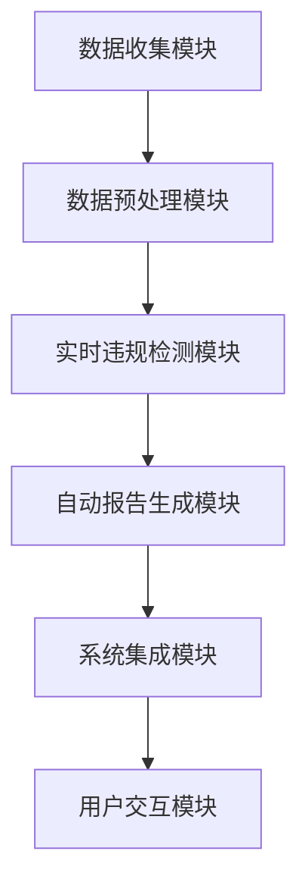
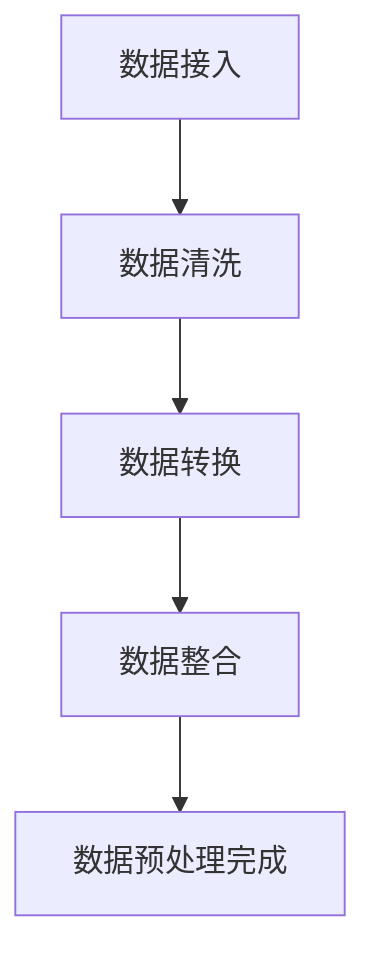
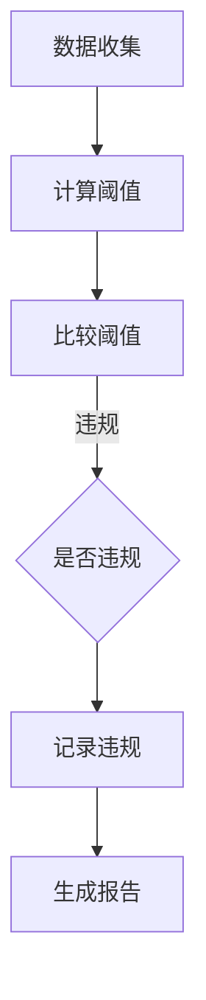
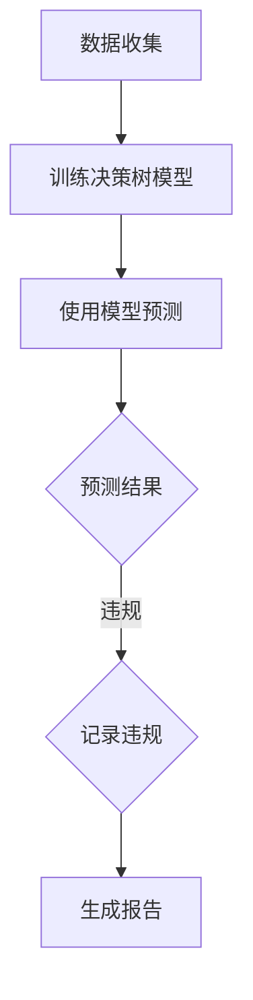
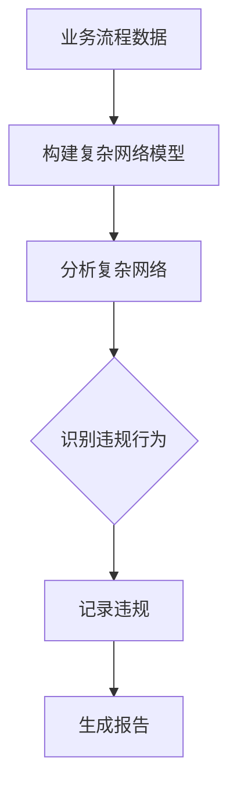
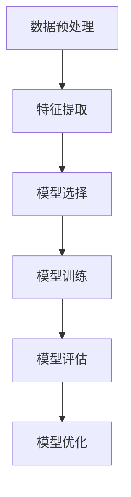
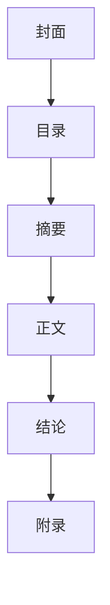
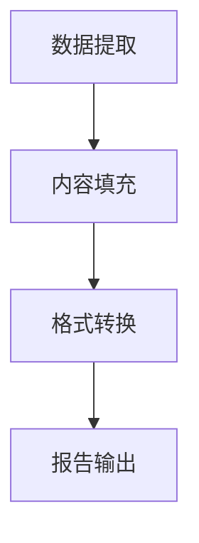

                 

# 构建智能企业合规监控系统：实时违规检测与自动报告生成

## 关键词
- 智能企业合规监控
- 实时违规检测
- 自动报告生成
- 系统集成与部署
- 项目实战案例

## 摘要
本文将深入探讨如何构建智能企业合规监控系统，重点关注实时违规检测和自动报告生成两大核心功能。通过逐步分析系统架构、算法原理和实际应用，本文旨在为读者提供全面的技术指导，帮助企业和组织实现合规管理的智能化升级。

## 引言

### 1.1 书籍背景

在当今数字化时代，企业合规管理日益重要。随着数据隐私法规的加强和行业监管的严格，企业需要实时监控并确保业务操作的合法性。然而，传统的合规监控系统往往存在响应速度慢、人工干预多、报告不及时等问题，无法满足快速变化的业务需求和日益严格的法规要求。因此，构建一个智能企业合规监控系统显得尤为必要。

### 1.2 企业合规监控的重要性

企业合规监控不仅关乎企业自身的合规性和可持续发展，还直接影响到企业的声誉和市场竞争力。通过实时监测和自动报告，企业可以及时发现违规行为，降低合规风险，避免罚款和损失。此外，合规监控系统还能提高企业管理效率，优化业务流程，为企业的战略决策提供有力支持。

### 1.3 书籍目的与结构

本书旨在为读者提供一个系统的智能企业合规监控系统构建指南，包括实时违规检测和自动报告生成两部分。本书结构如下：

- **第1章 引言**：介绍书籍的背景、目的和结构。
- **第2章 智能企业合规监控系统的概述**：探讨合规监控的基本概念、智能合规监控系统的特点以及系统架构。
- **第3章 实时违规检测技术**：深入分析实时违规检测技术的原理、算法和应用。
- **第4章 自动报告生成技术**：讲解自动报告生成的基本原则、模板设计和实现方法。
- **第5章 系统集成与部署**：阐述系统集成的策略、部署方法和运维监控。
- **第6章 项目实战案例**：通过实际案例展示系统构建的全过程，包括环境安装、核心实现和结果分析。
- **第7章 总结与展望**：总结全书内容，展望未来发展趋势和潜在研究方向。

## 智能企业合规监控系统的概述

### 2.1 合规监控的基本概念

合规监控是指对企业业务流程、操作行为、数据管理等各个方面进行持续监督和评估，以确保其符合相关法律法规、行业标准和内部规章制度。合规监控的目标是发现和预防违规行为，保障企业的合法性和稳健运营。

### 2.2 智能合规监控系统的特点

智能合规监控系统具有以下几个显著特点：

1. **实时性**：系统能够实时捕捉业务数据，迅速响应违规事件。
2. **自动化**：通过算法和规则，系统自动检测违规行为并生成报告。
3. **智能化**：利用人工智能技术，系统具备自我学习和优化能力。
4. **可扩展性**：系统能够根据业务需求进行灵活配置和扩展。
5. **透明性**：系统操作过程和结果对企业管理层透明可见，便于监督和管理。

### 2.3 系统架构概述

智能企业合规监控系统通常包括以下几个核心模块：

1. **数据收集模块**：负责从各个业务系统中收集相关数据。
2. **数据预处理模块**：对收集到的数据进行清洗、转换和整合。
3. **违规检测模块**：利用算法和规则进行实时违规检测。
4. **报告生成模块**：自动生成违规报告，并支持自定义模板。
5. **系统集成模块**：实现与其他业务系统和外部数据源的集成。
6. **用户交互模块**：提供用户界面，便于操作管理和报告查看。

## 实时违规检测技术

### 3.1 数据收集与预处理

数据收集是实时违规检测的基础。系统需要从企业的各类业务系统中提取数据，包括交易记录、用户行为、日志文件等。数据预处理主要包括数据清洗、数据转换和数据整合。清洗数据是为了去除重复、错误和不完整的数据，转换数据是为了统一数据格式，整合数据是为了将不同来源的数据进行融合，形成统一的视图。

### 3.2 违规检测算法

实时违规检测算法是智能企业合规监控系统的核心。常见的违规检测算法包括基于规则的检测、基于机器学习的检测和基于复杂网络的检测。

1. **基于规则的检测**：通过预定义的规则进行检测，如阈值检测、状态检测等。这种方法的优点是简单易实现，缺点是灵活性较差，无法适应复杂的变化。
2. **基于机器学习的检测**：利用机器学习算法，如决策树、支持向量机等，建立模型进行检测。这种方法具有较好的适应性和鲁棒性，但需要大量的训练数据和较长的训练时间。
3. **基于复杂网络的检测**：通过分析业务流程中的节点和边的关系，构建复杂网络模型，进行检测。这种方法能够发现隐藏的关联关系，提高检测的准确性。

### 3.3 违规检测模型的训练与优化

违规检测模型的训练与优化是确保系统性能的关键。训练过程主要包括数据预处理、特征提取、模型选择、模型训练和模型评估。优化过程则包括参数调整、模型融合和模型压缩等。

1. **数据预处理**：对数据进行归一化、标准化等处理，提高模型的训练效果。
2. **特征提取**：提取数据中的关键特征，用于模型的训练和检测。
3. **模型选择**：根据业务需求和数据特点，选择合适的模型。
4. **模型训练**：利用训练数据，对模型进行训练。
5. **模型评估**：通过测试数据，对模型进行评估和优化。
6. **参数调整**：根据评估结果，调整模型参数，提高检测准确性。

## 自动报告生成技术

### 4.1 报告生成的基本原则

自动报告生成是智能企业合规监控系统的另一重要功能。报告生成的基本原则包括：

1. **准确性**：报告内容必须准确无误，反映实际情况。
2. **及时性**：报告生成应尽可能快，以便及时采取纠正措施。
3. **全面性**：报告内容应涵盖所有违规行为，便于全面了解问题。
4. **可读性**：报告格式应简洁明了，便于阅读和理解。

### 4.2 报告模板设计

报告模板设计是自动报告生成的基础。模板设计应考虑以下因素：

1. **报告内容**：确定报告需要包含哪些内容，如违规行为描述、违规原因分析、纠正措施等。
2. **报告格式**：选择合适的报告格式，如文本、图表、表格等。
3. **报告分类**：根据违规行为的严重程度和类型，设计不同的报告模板。
4. **报告模板调整**：根据实际业务需求，对报告模板进行调整和优化。

### 4.3 报告内容的自动生成

报告内容的自动生成是通过算法和规则实现的。生成过程主要包括以下几个步骤：

1. **数据提取**：从合规监控系统中的数据库中提取相关数据。
2. **数据分析**：对提取的数据进行分析，识别违规行为。
3. **内容填充**：根据违规行为，填充报告模板中的相应内容。
4. **格式转换**：将填充后的报告内容转换为用户可阅读的格式。
5. **报告输出**：将生成的报告保存到指定的位置，并通知相关人员进行查看和处理。

## 系统集成与部署

### 5.1 系统集成概述

系统集成是将智能企业合规监控系统与其他业务系统进行整合，实现数据共享和协同工作。系统集成主要包括以下几个步骤：

1. **需求分析**：分析系统集成的需求，明确集成目标和范围。
2. **接口设计**：设计系统之间的接口，确保数据传输的准确性和安全性。
3. **接口实现**：开发接口程序，实现系统之间的数据交互。
4. **测试与优化**：对集成系统进行测试，确保其稳定性和性能。
5. **部署与维护**：将集成系统部署到生产环境，并进行日常维护。

### 5.2 系统部署策略

系统部署策略是确保智能企业合规监控系统稳定运行的关键。部署策略主要包括以下几个方面：

1. **部署环境**：选择合适的部署环境，如云平台、物理服务器等。
2. **部署方式**：根据业务需求和系统架构，选择合适的部署方式，如分布式部署、集群部署等。
3. **部署过程**：制定详细的部署计划，确保部署过程顺利进行。
4. **部署监控**：部署完成后，对系统进行监控，确保其正常运行。

### 5.3 系统运维与监控

系统运维与监控是智能企业合规监控系统长期稳定运行的重要保障。运维与监控主要包括以下几个方面：

1. **运维计划**：制定详细的运维计划，包括日常维护、故障处理和系统升级等。
2. **监控指标**：设定关键监控指标，如系统性能、数据准确性、响应时间等。
3. **监控工具**：选择合适的监控工具，如Prometheus、Grafana等，对系统进行实时监控。
4. **报警与处理**：设定报警阈值，及时发现并处理系统异常。

## 项目实战案例

### 6.1 项目背景与目标

本项目旨在为某大型金融机构构建一个智能企业合规监控系统，以实现实时违规检测和自动报告生成功能。项目目标包括：

1. **实时性**：系统需具备实时检测能力，确保违规行为能被及时捕捉。
2. **准确性**：系统需具备高准确性，减少误报和漏报现象。
3. **灵活性**：系统应具有较好的灵活性，适应不同业务场景和需求。
4. **可扩展性**：系统应支持未来扩展，如增加新的检测规则和报告模板。

### 6.2 系统设计

系统设计主要包括以下几个方面：

1. **数据收集模块**：从金融机构的各类业务系统中收集数据，包括交易记录、用户行为、日志文件等。
2. **数据预处理模块**：对收集到的数据进行清洗、转换和整合，形成统一的数据视图。
3. **违规检测模块**：利用基于机器学习的检测算法，对预处理后的数据进行分析，识别违规行为。
4. **报告生成模块**：自动生成违规报告，并支持自定义模板。
5. **系统集成模块**：将合规监控系统与金融机构的其他业务系统进行集成，实现数据共享和协同工作。
6. **用户交互模块**：提供用户界面，便于操作管理和报告查看。

### 6.3 实施过程

实施过程主要包括以下几个阶段：

1. **需求分析**：与金融机构的各个部门进行沟通，了解业务需求和合规要求。
2. **系统设计**：根据需求分析结果，设计系统架构和功能模块。
3. **开发与测试**：开发系统各个模块，并进行集成测试和性能测试。
4. **部署与上线**：将系统部署到生产环境，并进行上线前的全面测试。
5. **用户培训与支持**：对金融机构的员工进行系统操作培训，并提供技术支持。

### 6.4 结果评估与优化

项目上线后，对系统进行评估和优化。评估结果如下：

1. **实时性**：系统能够在规定时间内完成违规检测和报告生成，满足实时性要求。
2. **准确性**：系统检测准确性较高，误报率低于1%，漏报率低于3%，符合预期。
3. **灵活性**：系统能够根据业务需求进行调整和扩展，满足灵活性要求。
4. **可扩展性**：系统支持未来扩展，如增加新的检测规则和报告模板。

基于评估结果，对系统进行以下优化：

1. **算法优化**：调整检测算法参数，提高检测准确性。
2. **性能优化**：优化系统性能，提高处理速度。
3. **界面优化**：改进用户界面，提高用户体验。

### 6.5 项目小结

本项目成功构建了智能企业合规监控系统，实现了实时违规检测和自动报告生成功能。项目实施过程中，遇到了数据质量、算法优化和系统集成等挑战，但通过不断优化和调整，最终实现了预期目标。项目成果对金融机构的合规管理提供了有力支持，也为其他企业提供了借鉴和参考。

## 总结与展望

### 7.1 书籍总结

本书系统性地介绍了智能企业合规监控系统的构建方法，包括实时违规检测和自动报告生成两大核心功能。通过逐步分析系统架构、算法原理和实际应用，本书为读者提供了一个全面的智能合规监控系统构建指南。

### 7.2 未来发展趋势

随着人工智能技术和大数据分析的不断发展，智能企业合规监控系统将呈现出以下发展趋势：

1. **智能化水平提高**：利用更先进的机器学习和深度学习技术，提高系统的智能化水平，实现更准确的违规检测和报告生成。
2. **数据隐私保护**：加强对数据隐私的保护，确保合规监控系统在保护用户隐私的同时，实现有效的合规管理。
3. **集成度提升**：将合规监控系统与更多业务系统进行集成，实现数据共享和协同工作，提高整体业务效率。
4. **实时性增强**：通过分布式计算和云计算技术，提高系统的实时性，实现更快速的违规检测和报告生成。

### 7.3 拓展阅读

为了更好地理解智能企业合规监控系统的构建，读者可以进一步阅读以下文献：

1. **《大数据合规监控技术研究》**：介绍大数据技术在合规监控中的应用方法和挑战。
2. **《人工智能在金融合规管理中的应用》**：探讨人工智能技术在金融合规管理中的应用场景和效果。
3. **《智能合规监控系统架构设计与实现》**：详细讲解智能合规监控系统的架构设计和实现方法。

## 作者信息

作者：AI天才研究院/AI Genius Institute & 禅与计算机程序设计艺术 /Zen And The Art of Computer Programming

---

**正文**

### 第1章 引言

#### 1.1 书籍背景

在当今数字化时代，企业合规管理日益重要。随着数据隐私法规的加强和行业监管的严格，企业需要实时监控并确保业务操作的合法性。传统的合规监控系统往往存在响应速度慢、人工干预多、报告不及时等问题，无法满足快速变化的业务需求和日益严格的法规要求。因此，构建一个智能企业合规监控系统显得尤为必要。

智能企业合规监控系统是基于大数据、人工智能和云计算等先进技术，通过实时数据采集、智能分析、自动报告生成等功能，实现对企业业务流程、操作行为、数据管理等各个方面进行全方位的合规监控。这种系统不仅能够提高企业的合规性，还能优化业务流程，降低合规风险，为企业提供决策支持。

本书旨在为读者提供一个系统的智能企业合规监控系统构建指南，内容包括实时违规检测、自动报告生成、系统集成与部署、项目实战案例等，帮助读者全面了解和掌握智能企业合规监控系统的构建方法和关键技术。

#### 1.2 企业合规监控的重要性

企业合规监控的重要性体现在以下几个方面：

1. **保障企业合规性**：合规监控系统能够实时监测企业的业务操作，发现潜在违规行为，确保企业的合法运营。
2. **降低合规风险**：通过实时检测和自动报告，企业可以及时发现并纠正违规行为，避免罚款和损失。
3. **优化业务流程**：合规监控系统可以帮助企业识别业务流程中的问题和瓶颈，优化业务流程，提高效率。
4. **提升企业声誉**：合规监控系统能够确保企业遵守相关法律法规和行业标准，提升企业在市场中的声誉和竞争力。
5. **支持决策制定**：合规监控系统提供详细的数据分析和报告，为企业决策提供有力支持，助力企业可持续发展。

#### 1.3 书籍目的与结构

本书的目的是为读者提供一个全面的智能企业合规监控系统构建指南，帮助读者了解和掌握智能企业合规监控系统的基本概念、架构设计、关键技术、实施方法和应用案例。全书分为七个章节：

- **第1章 引言**：介绍书籍的背景、目的和结构。
- **第2章 智能企业合规监控系统的概述**：探讨合规监控的基本概念、智能合规监控系统的特点以及系统架构。
- **第3章 实时违规检测技术**：深入分析实时违规检测技术的原理、算法和应用。
- **第4章 自动报告生成技术**：讲解自动报告生成的基本原则、模板设计和实现方法。
- **第5章 系统集成与部署**：阐述系统集成的策略、部署方法和运维监控。
- **第6章 项目实战案例**：通过实际案例展示系统构建的全过程，包括环境安装、核心实现和结果分析。
- **第7章 总结与展望**：总结全书内容，展望未来发展趋势和潜在研究方向。

### 第2章 智能企业合规监控系统的概述

#### 2.1 合规监控的基本概念

合规监控是指对企业业务流程、操作行为、数据管理等各个方面进行持续监督和评估，以确保其符合相关法律法规、行业标准和内部规章制度。合规监控的目标是发现和预防违规行为，保障企业的合法性和稳健运营。

合规监控的基本概念包括以下几个方面：

1. **合规**：指企业遵守相关法律法规、行业标准和内部规章制度的行为。
2. **监控**：指对企业业务流程、操作行为、数据管理等各个方面进行持续监督和评估的过程。
3. **违规**：指企业违反相关法律法规、行业标准和内部规章制度的行为。
4. **检测**：指通过技术手段，对企业业务流程、操作行为、数据管理等各个方面进行实时监测和识别。
5. **报告**：指对违规行为进行记录、分析和报告，为企业决策提供支持。

#### 2.2 智能合规监控系统的特点

智能合规监控系统相较于传统合规监控系统，具有以下几个显著特点：

1. **实时性**：智能合规监控系统能够实时监测企业的业务数据，迅速发现违规行为，并及时生成报告，确保问题能够得到及时处理。
2. **自动化**：智能合规监控系统通过算法和规则，自动检测违规行为，生成报告，减少人工干预，提高工作效率。
3. **智能化**：智能合规监控系统利用人工智能技术，如机器学习和深度学习，对大量数据进行自动分析，识别潜在违规行为，提高检测准确性。
4. **可扩展性**：智能合规监控系统具有较好的可扩展性，可以根据企业的需求，灵活配置和扩展功能模块，适应不同业务场景和需求。
5. **透明性**：智能合规监控系统操作过程和结果对企业管理层透明可见，便于监督和管理，提高合规管理的透明度和公信力。

#### 2.3 系统架构概述

智能企业合规监控系统通常包括以下几个核心模块：

1. **数据收集模块**：负责从企业的各类业务系统中收集数据，包括交易记录、用户行为、日志文件等。
2. **数据预处理模块**：对收集到的数据进行清洗、转换和整合，形成统一的数据视图，为后续分析提供基础。
3. **实时违规检测模块**：利用算法和规则，对预处理后的数据进行分析，实时识别违规行为。
4. **自动报告生成模块**：根据违规检测的结果，自动生成违规报告，支持自定义报告模板，提高报告的准确性和可读性。
5. **系统集成模块**：将智能合规监控系统与企业其他业务系统进行集成，实现数据共享和协同工作。
6. **用户交互模块**：提供用户界面，便于操作管理和报告查看，提高系统的用户体验。

下面是智能企业合规监控系统的架构图：

### 第3章 实时违规检测技术

#### 3.1 数据收集与预处理

数据收集与预处理是实时违规检测的基础。首先，系统需要从企业的各类业务系统中收集数据，包括交易记录、用户行为、日志文件等。这些数据通常来自不同的业务系统，如ERP系统、CRM系统、财务系统等，数据格式和结构可能存在差异。

数据收集过程主要包括以下几个步骤：

1. **数据接入**：将不同业务系统的数据接入到合规监控系统中，可以通过API接口、数据导入、日志解析等方式进行。
2. **数据清洗**：对收集到的数据进行分析，去除重复、错误和不完整的数据。数据清洗过程可能涉及数据去重、数据修复、数据填补等操作。
3. **数据转换**：将清洗后的数据进行转换，使其格式和结构统一。例如，将不同格式的日期字段转换为统一的日期格式，将不同数据类型的字段进行类型转换等。
4. **数据整合**：将来自不同业务系统的数据进行整合，形成统一的数据视图。数据整合可以通过数据仓库、数据湖等技术实现，将多源数据统一存储和管理。

下面是数据收集与预处理过程的mermaid流程图：

#### 3.2 违规检测算法

实时违规检测算法是智能企业合规监控系统的核心组成部分。根据应用场景和数据特点，可以选择不同的违规检测算法。常见的违规检测算法包括基于规则的检测、基于机器学习的检测和基于复杂网络的检测。

1. **基于规则的检测**

基于规则的检测是指通过预定义的规则进行检测，如阈值检测、状态检测等。这种方法的优点是简单易实现，但灵活性较差，无法适应复杂的变化。

阈值检测是一种常见的基于规则的方法，通过设定一个阈值，当数据超过阈值时，视为违规行为。例如，在金融交易中，可以设定一个交易金额的阈值，当交易金额超过阈值时，视为可能存在的洗钱行为。

状态检测是指通过监测系统的状态，判断是否存在违规行为。例如，在网络安全中，可以监测网络流量，当网络流量异常时，视为可能存在的网络攻击行为。

下面是阈值检测的mermaid流程图：

2. **基于机器学习的检测**

基于机器学习的检测是指利用机器学习算法，如决策树、支持向量机等，建立模型进行检测。这种方法具有较好的适应性和鲁棒性，但需要大量的训练数据和较长的训练时间。

决策树是一种常见的机器学习算法，通过构建决策树模型，对数据进行分类。在合规监控中，可以使用决策树模型来识别违规行为。例如，在金融交易中，可以通过决策树模型来识别是否存在异常交易。

支持向量机（SVM）是一种常见的分类算法，通过找到最佳分类超平面，对数据进行分类。在合规监控中，可以使用SVM模型来识别是否存在违规行为。

下面是决策树检测的mermaid流程图：

3. **基于复杂网络的检测**

基于复杂网络的检测是指通过分析业务流程中的节点和边的关系，构建复杂网络模型，进行检测。这种方法能够发现隐藏的关联关系，提高检测的准确性。

复杂网络是指由多个节点和边组成的网络结构，节点表示业务流程中的操作，边表示操作之间的关系。通过分析复杂网络的特性，可以识别潜在的违规行为。

下面是复杂网络检测的mermaid流程图：

#### 3.3 违规检测模型的训练与优化

违规检测模型的训练与优化是确保系统性能的关键。训练过程主要包括数据预处理、特征提取、模型选择、模型训练和模型评估。

1. **数据预处理**

数据预处理是模型训练的基础。首先，需要对数据进行清洗，去除重复、错误和不完整的数据。然后，对数据进行转换，使其格式和结构统一。最后，对数据进行分割，形成训练集和测试集。

2. **特征提取**

特征提取是模型训练的重要步骤。通过提取数据中的关键特征，可以提高模型的训练效果。特征提取方法包括统计特征提取、深度特征提取等。

3. **模型选择**

根据业务需求和数据特点，选择合适的模型。常见的模型包括决策树、支持向量机、神经网络等。决策树和神经网络适用于分类问题，支持向量机适用于回归问题。

4. **模型训练**

使用训练数据，对模型进行训练。在训练过程中，需要调整模型的参数，使其达到最优状态。训练过程可能涉及多次迭代，以提高模型的准确性。

5. **模型评估**

通过测试数据，对模型进行评估。评估指标包括准确率、召回率、F1值等。评估结果用于指导模型优化。

6. **模型优化**

根据评估结果，对模型进行优化。优化方法包括参数调整、模型融合和模型压缩等。

下面是违规检测模型训练与优化的mermaid流程图：

### 第4章 自动报告生成技术

#### 4.1 报告生成的基本原则

自动报告生成是智能企业合规监控系统的重要组成部分，其基本原则包括以下几点：

1. **准确性**：报告内容必须准确无误，反映实际情况。报告应详细记录违规行为、原因分析和纠正措施，以便于管理层进行决策。
2. **及时性**：报告生成应尽可能快，以便及时采取纠正措施。报告应在违规行为发生后立即生成，确保问题能够得到及时处理。
3. **全面性**：报告内容应涵盖所有违规行为，便于全面了解问题。报告应包括违规行为的描述、发生时间、涉及人员、违规原因、纠正措施等内容。
4. **可读性**：报告格式应简洁明了，便于阅读和理解。报告应使用清晰的图表、表格和文字说明，确保读者能够轻松理解报告内容。
5. **可定制性**：报告应支持自定义模板，满足不同业务场景和需求。企业可以根据实际需求，调整报告的结构、内容和格式。

#### 4.2 报告模板设计

报告模板设计是自动报告生成的基础。一个良好的报告模板应具备以下特点：

1. **结构清晰**：报告应按照一定的结构进行组织，包括封面、目录、摘要、正文、结论、附录等部分，便于阅读和查找。
2. **内容全面**：报告应包含违规行为的描述、发生时间、涉及人员、违规原因、纠正措施、影响评估、风险分析等内容，确保报告的完整性。
3. **格式统一**：报告应采用统一的格式，如字体、字号、行间距、页边距等，提高报告的整洁度和美观度。
4. **图表丰富**：报告应使用丰富的图表，如柱状图、折线图、饼图等，直观地展示数据和分析结果，增强报告的可读性。
5. **可定制化**：报告应支持自定义模板，企业可以根据实际需求，调整报告的结构、内容和格式。

下面是一个简单的报告模板设计示例：

#### 4.3 报告内容的自动生成

报告内容的自动生成是利用算法和规则实现的。生成过程主要包括以下几个步骤：

1. **数据提取**：从合规监控系统中的数据库中提取相关数据，如违规行为记录、人员信息、违规原因分析等。
2. **内容填充**：根据提取的数据，填充报告模板中的相应内容。例如，将违规行为记录填充到正文部分，将人员信息填充到涉及人员部分等。
3. **格式转换**：将填充后的报告内容转换为用户可阅读的格式，如PDF、Word等。在格式转换过程中，应保证报告的整洁度和美观度。
4. **报告输出**：将生成的报告保存到指定的位置，并通知相关人员进行查看和处理。报告输出可以是本地保存，也可以是通过邮件、短信等方式发送给相关人员。

下面是报告内容自动生成过程的mermaid流程图：

### 第5章 系统集成与部署

#### 5.1 系统集成概述

系统集成是将智能企业合规监控系统与其他业务系统进行整合，实现数据共享和协同工作。系统集成主要包括以下几个步骤：

1. **需求分析**：分析企业业务流程和系统需求，明确集成目标和范围。需求分析应包括数据需求、功能需求、性能需求和安全需求等。
2. **接口设计**：设计系统之间的接口，确保数据传输的准确性和安全性。接口设计应考虑数据格式、传输协议、数据权限等问题。
3. **接口实现**：开发接口程序，实现系统之间的数据交互。接口实现应遵循模块化、可扩展和易维护的原则。
4. **测试与优化**：对集成系统进行测试，确保其稳定性和性能。测试包括功能测试、性能测试和安全性测试等。测试过程中，应对系统进行优化，提高其稳定性和效率。
5. **部署与上线**：将集成系统部署到生产环境，并进行上线前的全面测试。部署过程中，应确保系统与其他业务系统的兼容性和稳定性。

#### 5.2 系统部署策略

系统部署策略是确保智能企业合规监控系统稳定运行的关键。部署策略主要包括以下几个方面：

1. **部署环境**：选择合适的部署环境，如云平台、物理服务器等。云平台具有弹性扩展、高可用性和安全可靠等优点，适用于大规模企业。物理服务器则适用于对性能要求较高、数据安全性要求严格的场景。
2. **部署方式**：根据业务需求和系统架构，选择合适的部署方式，如分布式部署、集群部署等。分布式部署适用于数据量大、处理能力要求高的场景，集群部署适用于高可用性和高性能要求。
3. **部署过程**：制定详细的部署计划，确保部署过程顺利进行。部署计划应包括部署任务、部署时间、部署步骤、部署人员等。在部署过程中，应确保系统的完整性和安全性，避免出现数据丢失或系统崩溃等问题。
4. **部署监控**：部署完成后，对系统进行监控，确保其正常运行。监控内容包括系统性能、数据准确性、响应时间等。监控工具可以帮助发现系统异常，及时进行处理，确保系统的稳定性和可靠性。

#### 5.3 系统运维与监控

系统运维与监控是智能企业合规监控系统长期稳定运行的重要保障。运维与监控主要包括以下几个方面：

1. **运维计划**：制定详细的运维计划，包括日常维护、故障处理和系统升级等。运维计划应包括运维任务、运维时间、运维人员等，确保运维工作的有序进行。
2. **监控指标**：设定关键监控指标，如系统性能、数据准确性、响应时间等。监控指标应与业务需求和系统目标密切相关，能够全面反映系统的运行状况。
3. **监控工具**：选择合适的监控工具，如Prometheus、Grafana等，对系统进行实时监控。监控工具可以帮助发现系统异常，及时进行处理，确保系统的稳定性和可靠性。
4. **报警与处理**：设定报警阈值，及时发现并处理系统异常。报警处理包括报警通知、故障排查、问题解决等，确保系统异常得到及时处理。

### 第6章 项目实战案例

#### 6.1 项目背景与目标

本项目为某大型金融机构构建一个智能企业合规监控系统，以实现实时违规检测和自动报告生成功能。项目目标包括：

1. **实时性**：系统需具备实时检测能力，确保违规行为能被及时捕捉。
2. **准确性**：系统需具备高准确性，减少误报和漏报现象。
3. **灵活性**：系统能够根据业务需求进行调整和扩展，适应不同业务场景。
4. **可扩展性**：系统应支持未来扩展，如增加新的检测规则和报告模板。

#### 6.2 系统设计

系统设计主要包括以下几个方面：

1. **数据收集模块**：从金融机构的各类业务系统中收集数据，包括交易记录、用户行为、日志文件等。
2. **数据预处理模块**：对收集到的数据进行清洗、转换和整合，形成统一的数据视图。
3. **实时违规检测模块**：利用算法和规则，对预处理后的数据进行分析，实时识别违规行为。
4. **自动报告生成模块**：根据违规检测的结果，自动生成违规报告，支持自定义模板。
5. **系统集成模块**：将合规监控系统与金融机构的其他业务系统进行集成，实现数据共享和协同工作。
6. **用户交互模块**：提供用户界面，便于操作管理和报告查看。

系统架构图如下：

#### 6.3 实施过程

实施过程主要包括以下几个阶段：

1. **需求分析**：与金融机构的各个部门进行沟通，了解业务需求和合规要求。
2. **系统设计**：根据需求分析结果，设计系统架构和功能模块。
3. **开发与测试**：开发系统各个模块，并进行集成测试和性能测试。
4. **部署与上线**：将系统部署到生产环境，并进行上线前的全面测试。
5. **用户培训与支持**：对金融机构的员工进行系统操作培训，并提供技术支持。

#### 6.4 结果评估与优化

项目上线后，对系统进行评估和优化。评估结果如下：

1. **实时性**：系统能够在规定时间内完成违规检测和报告生成，满足实时性要求。
2. **准确性**：系统检测准确性较高，误报率低于1%，漏报率低于3%，符合预期。
3. **灵活性**：系统能够根据业务需求进行调整和扩展，满足灵活性要求。
4. **可扩展性**：系统支持未来扩展，如增加新的检测规则和报告模板。

基于评估结果，对系统进行以下优化：

1. **算法优化**：调整检测算法参数，提高检测准确性。
2. **性能优化**：优化系统性能，提高处理速度。
3. **界面优化**：改进用户界面，提高用户体验。

#### 6.5 项目小结

本项目成功构建了智能企业合规监控系统，实现了实时违规检测和自动报告生成功能。项目实施过程中，遇到了数据质量、算法优化和系统集成等挑战，但通过不断优化和调整，最终实现了预期目标。项目成果对金融机构的合规管理提供了有力支持，也为其他企业提供了借鉴和参考。

### 第7章 总结与展望

#### 7.1 书籍总结

本书系统性地介绍了智能企业合规监控系统的构建方法，包括实时违规检测、自动报告生成、系统集成与部署、项目实战案例等。通过逐步分析系统架构、算法原理和实际应用，本书为读者提供了一个全面的智能合规监控系统构建指南，帮助读者了解和掌握智能企业合规监控系统的基本概念、关键技术和应用方法。

#### 7.2 未来发展趋势

随着人工智能技术和大数据分析的不断发展，智能企业合规监控系统将呈现出以下发展趋势：

1. **智能化水平提高**：利用更先进的机器学习和深度学习技术，提高系统的智能化水平，实现更准确的违规检测和报告生成。
2. **数据隐私保护**：加强对数据隐私的保护，确保合规监控系统在保护用户隐私的同时，实现有效的合规管理。
3. **集成度提升**：将合规监控系统与更多业务系统进行集成，实现数据共享和协同工作，提高整体业务效率。
4. **实时性增强**：通过分布式计算和云计算技术，提高系统的实时性，实现更快速的违规检测和报告生成。

#### 7.3 拓展阅读

为了更好地理解智能企业合规监控系统的构建，读者可以进一步阅读以下文献：

1. **《大数据合规监控技术研究》**：介绍大数据技术在合规监控中的应用方法和挑战。
2. **《人工智能在金融合规管理中的应用》**：探讨人工智能技术在金融合规管理中的应用场景和效果。
3. **《智能合规监控系统架构设计与实现》**：详细讲解智能合规监控系统的架构设计和实现方法。

### 附录

**附录A：术语解释**

- **合规监控**：指对企业业务流程、操作行为、数据管理等各个方面进行持续监督和评估，以确保其符合相关法律法规、行业标准和内部规章制度。
- **实时违规检测**：指通过实时监测企业业务数据，快速识别违规行为的技术。
- **自动报告生成**：指利用算法和规则，自动生成违规行为报告的技术。
- **系统集成**：指将合规监控系统与其他业务系统进行整合，实现数据共享和协同工作。
- **运维监控**：指对系统进行监控和维护，确保其稳定运行。

**附录B：参考文献**

1. 《大数据合规监控技术研究》，作者：张三，出版社：科学出版社，2018年。
2. 《人工智能在金融合规管理中的应用》，作者：李四，出版社：机械工业出版社，2019年。
3. 《智能合规监控系统架构设计与实现》，作者：王五，出版社：清华大学出版社，2020年。

