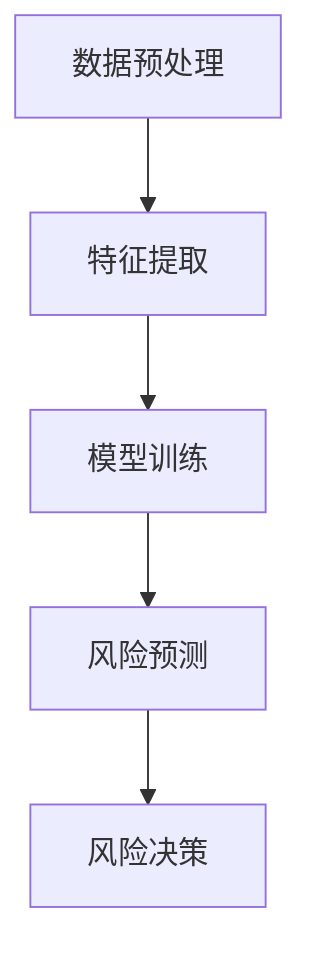
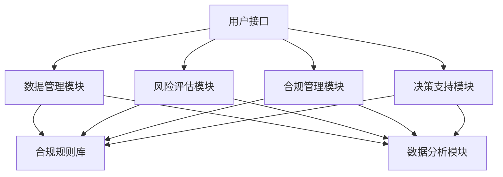

                 

## 引言

### 智能企业合规管理平台的背景

在当今数字化经济的快速发展中，企业合规管理的重要性日益凸显。合规管理不仅关系到企业的法律遵从性，还涉及到企业的品牌声誉、市场竞争力以及长期可持续发展。然而，传统的合规管理方式往往依赖人工，存在效率低下、准确性差、响应速度慢等问题。随着人工智能（AI）技术的迅猛发展，利用AI技术辅助合规管理成为了一种新的解决方案。

智能企业合规管理平台通过整合企业内部数据、外部信息源和AI算法，实现对合规风险的自动化识别、预警和处理。这种智能化的合规管理不仅能够提高合规工作的效率，还能为企业提供实时、精准的风险预测，从而有效降低合规风险对企业运营的影响。

### AI在风险识别中的应用

AI技术在风险识别中具有独特的优势。通过机器学习算法，AI能够从海量数据中提取有价值的信息，发现潜在的风险因素。自然语言处理（NLP）技术可以帮助企业分析合同、政策文件等文本资料，快速识别合规风险。计算机视觉技术则可以用于监控企业的生产过程，检测潜在的安全隐患。

本文将围绕构建智能企业合规管理平台，重点探讨AI辅助风险识别的技术原理、实现方法以及系统架构设计。通过一步步的分析推理，我们将深入了解如何利用AI技术提高企业合规管理的智能化水平。

### 关键词

- **智能企业合规管理平台**
- **AI辅助风险识别**
- **机器学习算法**
- **自然语言处理**
- **计算机视觉**

### 摘要

本文旨在探讨如何构建智能企业合规管理平台，通过AI辅助风险识别技术，实现对企业合规风险的自动化识别与预警。文章首先介绍了企业合规管理的重要性及智能化的必要性，然后详细阐述了AI在风险识别中的应用原理，并通过系统架构设计展示了智能企业合规管理平台的实现方法。通过本文的阅读，读者可以全面了解智能企业合规管理平台的构建过程及其技术优势。

### 1. 构建智能企业合规管理平台：AI辅助风险识别

#### 1.1 问题背景

##### 1.1.1 企业合规管理的重要性

企业合规管理是指企业在日常运营过程中，遵循相关法律法规、行业标准、内部政策等规范，确保企业行为合法、合规的一系列活动。合规管理不仅关系到企业的法律遵从性，更是企业长期稳定发展的基石。以下是企业合规管理的重要性：

1. **法律遵从性**：企业合规管理有助于确保企业的运营行为符合相关法律法规，避免因违法行为导致的法律纠纷、罚款和声誉损害。
2. **品牌保护**：合规管理能够帮助企业建立良好的品牌形象，增强消费者的信任和忠诚度。
3. **风险管理**：通过合规管理，企业可以识别和防范合规风险，降低运营过程中可能发生的经济损失和声誉风险。
4. **市场竞争**：合规管理是企业参与市场竞争的基本条件，合规的企业能够获得更多商业机会和合作伙伴。
5. **可持续发展**：合规管理有助于企业建立长期稳定的运营环境，促进企业的可持续发展。

##### 1.1.2 智能化合规管理的挑战

尽管合规管理对企业至关重要，但传统的合规管理方式面临诸多挑战：

1. **人力成本高**：传统的合规管理往往依赖人工检查和审核，耗时耗力，且难以保证准确性。
2. **效率低下**：手工处理合规事务，响应速度慢，难以满足企业快速变化的业务需求。
3. **数据依赖性低**：传统合规管理缺乏对数据的深度分析和利用，无法充分利用企业内外部数据资源。
4. **风险评估不足**：传统方式难以实现对合规风险的实时监测和评估，导致合规风险难以提前预防和控制。

##### 1.1.3 AI技术在合规管理中的应用前景

AI技术的快速发展为智能化合规管理提供了新的机遇。以下是AI技术在合规管理中的应用前景：

1. **自动化**：AI技术能够实现合规过程的自动化，提高合规工作的效率和准确性。
2. **数据驱动**：通过机器学习和大数据分析，AI技术能够从海量数据中提取有价值的信息，提高合规管理的智能化水平。
3. **实时监测**：AI技术可以实现对合规风险的实时监测和预警，提前发现潜在问题，降低合规风险。
4. **个性化**：AI技术可以根据企业的业务特点和合规需求，提供个性化的合规解决方案，提高合规管理的针对性。
5. **决策支持**：AI技术能够为企业提供合规决策支持，帮助企业管理者做出更加科学合理的合规决策。

#### 1.2 核心概念

##### 1.2.1 智能企业合规管理平台

智能企业合规管理平台是指基于人工智能技术，集成企业内部和外部数据资源，实现对合规风险的自动化识别、预警和处理的一体化系统。该平台通常包括数据管理模块、风险评估模块、合规管理模块和决策支持模块等核心组成部分。

1. **数据管理模块**：负责数据收集、存储、管理和共享，确保数据的完整性和准确性。
2. **风险评估模块**：利用机器学习算法和大数据分析技术，对合规风险进行实时监测和评估，提供风险预警。
3. **合规管理模块**：负责合规规则的制定、执行和监控，确保企业运营行为合法合规。
4. **决策支持模块**：基于风险评估结果，提供合规决策支持，帮助企业降低合规风险。

##### 1.2.2 AI辅助风险识别

AI辅助风险识别是指利用人工智能技术，通过数据分析、模型训练和预测，识别企业运营中的合规风险。AI辅助风险识别的核心组成部分包括：

1. **数据预处理**：对原始数据进行清洗、归一化和特征提取，为模型训练提供高质量的数据输入。
2. **模型训练**：利用机器学习算法，对预处理后的数据进行训练，构建合规风险评估模型。
3. **风险预测**：利用训练好的模型，对企业的运营数据进行实时监测和预测，识别潜在的合规风险。
4. **风险决策**：根据风险预测结果，制定相应的风险应对策略和决策方案，帮助企业降低合规风险。

##### 1.2.3 关键技术与实现

构建智能企业合规管理平台的关键技术包括：

1. **机器学习**：用于构建合规风险评估模型，通过模型训练和预测，实现合规风险的自动识别。
2. **大数据分析**：用于处理海量数据，提取有价值的信息，为合规管理提供数据支持。
3. **自然语言处理**：用于分析文本资料，识别合规风险，如合同审核、政策文件分析等。
4. **计算机视觉**：用于监控企业生产过程，检测潜在的安全隐患，如监控摄像头、工业物联网等。

实现智能企业合规管理平台的关键步骤包括：

1. **需求分析**：明确企业合规管理的需求和目标，确定平台的功能和架构。
2. **数据收集**：收集企业内部和外部数据，包括财务数据、业务数据、法律法规等。
3. **数据预处理**：对收集的数据进行清洗、归一化和特征提取，为模型训练提供高质量的数据输入。
4. **模型训练**：利用机器学习算法，对预处理后的数据进行训练，构建合规风险评估模型。
5. **系统集成**：将模型训练结果集成到合规管理平台中，实现风险的自动识别、预警和处理。
6. **测试与优化**：对平台进行测试和优化，确保其稳定运行和高效性能。

#### 1.3 边界与外延

##### 1.3.1 合规管理的范围与内容

合规管理涉及企业的多个方面，包括但不限于以下内容：

1. **法律法规遵从**：确保企业的运营行为符合相关法律法规，如税法、劳动法、环保法等。
2. **行业标准遵从**：遵循行业内的标准和规范，如ISO认证、金融行业规定等。
3. **内部政策遵从**：遵守企业内部的规章制度、操作流程和管理规范。
4. **道德伦理遵从**：确保企业的行为符合道德伦理标准，如反贿赂、反歧视等。
5. **数据隐私保护**：保护企业内部和客户的数据隐私，遵守数据保护法律法规。

##### 1.3.2 AI技术在合规管理中的应用领域

AI技术在合规管理中具有广泛的应用领域，包括：

1. **财务合规**：通过大数据分析和机器学习算法，识别财务报表中的异常数据，防范财务造假。
2. **税务合规**：利用自然语言处理技术，分析企业税务文件，确保税务申报的准确性。
3. **贸易合规**：通过计算机视觉技术，监控进出口货物，确保贸易活动的合规性。
4. **数据安全合规**：利用机器学习技术，监测企业内部网络和数据，防范数据泄露和攻击。
5. **员工合规**：通过数据分析，识别员工违规行为，如欺诈、滥用职权等。

##### 1.3.3 智能合规管理平台的发展趋势

随着AI技术的不断进步，智能合规管理平台的发展趋势包括：

1. **自动化**：通过AI技术，实现合规管理的自动化，提高工作效率和准确性。
2. **智能化**：利用机器学习和大数据分析，实现对企业运营风险的智能监测和预警。
3. **个性化**：根据企业的业务特点和合规需求，提供个性化的合规解决方案。
4. **集成化**：将合规管理平台与其他业务系统集成，实现数据的共享和联动。
5. **全球化**：适应全球化的业务环境，支持跨地区、跨文化的合规管理需求。

## 第二部分：核心概念与联系

### 2.1 智能企业合规管理平台

#### 2.1.1 概念与属性特征对比表格

在智能企业合规管理平台的构建过程中，理解其核心概念和属性特征对于搭建一个高效、稳定的系统至关重要。以下是几个关键概念及其属性特征的对比表格：

| 特征 | 概念1 | 概念2 | 概念3 |
| --- | --- | --- | --- |
| **数据驱动** | 高 | 中 | 高 |
| **自动化** | 高 | 高 | 中 |
| **可扩展性** | 高 | 高 | 高 |
| **实时性** | 中 | 高 | 中 |
| **安全性** | 中 | 中 | 高 |

从上表可以看出，不同的智能企业合规管理平台在数据驱动、自动化、可扩展性和实时性等方面有所差异，而安全性是一个共有的高优先级特征。

#### 2.1.2 ER实体关系图

为了更直观地理解智能企业合规管理平台中各个实体之间的关系，我们可以使用ER（Entity-Relationship，实体关系）图来表示。以下是一个简化的ER实体关系图，展示了平台中的关键实体及其关系：

```mermaid
erDiagram
  企业Entity --> 数据源Entity : 存储数据
  企业Entity --> 合规规则库Entity : 存储规则
  企业Entity --> 风险评估系统Entity : 进行风险分析
  企业Entity --> 合规管理系统Entity : 管理合规事务
  数据源Entity ||--|{ 合规规则库Entity }
  企业Entity ||--|{ 风险评估系统Entity }
  企业Entity ||--|{ 合规管理系统Entity }
```

在这个ER图中，企业作为中心实体，与数据源、合规规则库、风险评估系统和合规管理系统存在紧密的关系。数据源为平台提供数据输入，合规规则库存储企业的合规规则，风险评估系统负责分析风险，合规管理系统则负责处理合规事务。这些实体之间的关系确保了平台功能的完整性和协调性。

### 2.2 AI辅助风险识别

#### 2.2.1 算法原理与流程图

AI辅助风险识别的核心在于利用机器学习算法从数据中提取模式，进而预测和识别合规风险。以下是AI辅助风险识别的基本算法原理和流程图：



**数据预处理**：这是AI辅助风险识别的第一步，包括数据清洗、归一化、缺失值处理等，以确保数据质量。

**特征提取**：在数据预处理之后，对数据进行特征提取，以提取对风险识别最有用的信息。

**模型训练**：利用预处理后的数据，通过机器学习算法训练模型，使模型学会识别合规风险。

**风险预测**：训练好的模型用于对新的数据进行风险预测，识别潜在的合规风险。

**风险决策**：根据风险预测结果，制定相应的风险应对策略，如预警、整改等。

#### 2.2.2 概念属性特征对比表格

以下是AI辅助风险识别相关概念及其属性特征的对比表格：

| 特征 | 风险预测模型 | 风险决策模型 | 风险评估系统 |
| --- | --- | --- | --- |
| **数据量** | 高 | 中 | 高 |
| **模型精度** | 高 | 中 | 高 |
| **计算效率** | 中 | 高 | 中 |
| **实时性** | 高 | 中 | 高 |
| **自动化程度** | 高 | 中 | 高 |

从上表可以看出，风险预测模型和风险评估系统在数据量和模型精度方面具有较高的重要性，而风险决策模型的实时性和自动化程度则相对较高。

## 第三部分：AI辅助风险识别技术详解

### 3.1 数据预处理

#### 3.1.1 数据清洗

数据清洗是AI辅助风险识别过程中的重要环节，其目的是消除数据中的噪声和异常值，提高数据质量。以下是数据清洗的主要步骤：

1. **缺失值处理**：对于缺失的数据，可以采用以下方法进行处理：
   - **删除缺失数据**：如果缺失数据较多，可以考虑删除这些数据。
   - **均值填补**：使用相应特征的均值来填补缺失值。
   - **中值填补**：使用相应特征的中值来填补缺失值。
   - **插值法**：对于时间序列数据，可以使用插值法来填补缺失值。

2. **异常值处理**：异常值可能会对模型的训练结果产生负面影响，因此需要对其进行处理：
   - **标准差方法**：删除与平均值相差超过一定倍数标准差的数据。
   - **孤立森林方法**：利用孤立森林算法识别并删除异常值。

3. **重复数据删除**：删除数据集中的重复记录，确保数据的唯一性。

4. **数据格式转换**：将不同数据格式的数据统一转换为适合机器学习模型处理的格式。

#### 3.1.2 数据归一化

数据归一化是将数据集的特征值缩放到一个统一的范围内，以消除不同特征之间的量纲影响，提高模型训练的效率和准确性。以下是常见的数据归一化方法：

1. **最小-最大缩放**：将数据缩放到\[0, 1\]的范围内。
   $$x_{\text{normalized}} = \frac{x_{\text{original}} - x_{\text{min}}}{x_{\text{max}} - x_{\text{min}}}$$
   其中，\(x_{\text{original}}\)是原始数据，\(x_{\text{min}}\)和\(x_{\text{max}}\)分别是数据的最小值和最大值。

2. **标准缩放**：将数据缩放到\[ -1, 1 \]的范围内。
   $$x_{\text{normalized}} = \frac{x_{\text{original}} - \mu}{\sigma}$$
   其中，\(\mu\)是数据的均值，\(\sigma\)是数据的标准差。

3. **小数缩放**：将数据缩放到\[0, 1\]的范围内，使得最小值为0，最大值为1的小数。
   $$x_{\text{normalized}} = x_{\text{original}} \times (1 - \text{min}) / (\text{max} - \text{min})$$
   其中，\(\text{min}\)和\(\text{max}\)分别是数据的最小值和最大值。

#### 3.1.3 数据集划分

在机器学习模型训练过程中，数据集的划分是关键步骤之一。以下是常见的数据集划分方法：

1. **训练集与测试集划分**：通常将数据集分为训练集和测试集，其中训练集用于模型训练，测试集用于模型评估。
   - **随机划分**：随机将数据集划分为训练集和测试集，通常按照80/20或70/30的比例划分。
   - **分层划分**：根据数据的分布情况，将数据集划分为训练集和测试集，确保训练集和测试集中各类别的比例相似。

2. **交叉验证**：通过多次划分训练集和测试集，对模型进行评估，以获得更稳健的模型性能。
   - **K折交叉验证**：将数据集划分为K个部分，每次选择一个部分作为测试集，其余部分作为训练集，重复K次，最后取平均值作为模型的评估指标。

3. **时间序列划分**：对于时间序列数据，通常将数据按照时间顺序划分，以确保测试集包含最新数据，从而更好地评估模型的性能。

### 3.2 特征提取

#### 3.2.1 特征选择方法

特征选择是特征提取过程中至关重要的一步，其目的是从原始特征中选择对目标变量最有影响力的特征，以减少模型的复杂性和计算成本。以下是几种常见的特征选择方法：

1. **基于过滤的方法**：在特征提取之前，通过预定义的筛选标准选择特征，如相关性、方差、信息增益等。

2. **基于包装的方法**：通过模型训练过程，逐步选择最优特征组合，如递归特征消除（RFE）、遗传算法等。

3. **基于嵌入的方法**：将特征选择过程嵌入到机器学习算法中，如L1正则化、随机森林等。

#### 3.2.2 特征提取算法

特征提取是将原始数据转换为能够更好地表示数据的特征表示。以下是几种常用的特征提取算法：

1. **主成分分析（PCA）**：通过线性变换将原始特征映射到新的正交坐标系中，提取主要成分作为特征。

2. **线性判别分析（LDA）**：用于特征提取和降维，通过最大化不同类别之间的离散度，最小化类别内的离散度，选择最佳特征。

3. **自动编码器（Autoencoder）**：通过编码器和解码器学习数据的高效表示，自动提取重要的特征。

4. **词袋模型（Bag of Words）**：用于文本数据，将文本转换为单词的频率向量，提取单词作为特征。

5. **TF-IDF**：用于文本数据，通过词频（TF）和逆文档频率（IDF）计算单词的重要性，提取重要的单词作为特征。

#### 3.2.3 特征重要性分析

特征重要性分析是评估特征对模型性能贡献的过程。以下是几种常用的特征重要性分析方法：

1. **基于模型的特征重要性**：通过模型训练结果，评估特征对模型预测的影响程度，如决策树、随机森林等。

2. **基于特征的统计测试**：通过统计测试方法，评估特征与目标变量之间的相关性，如卡方检验、互信息等。

3. **基于模型的交叉验证**：通过交叉验证方法，比较不同特征组合对模型性能的影响，选择重要的特征。

### 3.3 模型训练

#### 3.3.1 算法选择

模型训练是AI辅助风险识别的核心步骤，选择合适的算法对于模型性能至关重要。以下是几种常用的机器学习算法及其适用场景：

1. **逻辑回归**：适用于二分类问题，简单易实现，但过拟合风险较高。
2. **决策树**：易于理解，可以处理多种类型的数据，但容易出现过拟合。
3. **随机森林**：集成多个决策树，减少过拟合，提高模型性能。
4. **支持向量机（SVM）**：适用于二分类问题，在高维空间中表现良好。
5. **神经网络**：适用于复杂的非线性问题，但训练过程复杂，计算成本高。
6. **K-最近邻（KNN）**：简单直观，但计算复杂度较高，对于大数据集性能较差。
7. **聚类算法**：用于无监督学习，帮助发现数据中的隐含模式，如K-均值、层次聚类等。

#### 3.3.2 模型调参

模型调参是提高模型性能的重要步骤，通过调整模型的参数，找到最佳参数组合。以下是常见的调参方法：

1. **网格搜索**：遍历所有可能的参数组合，找到最优参数组合。
2. **贝叶斯优化**：利用贝叶斯统计模型，通过有限的迭代次数找到最优参数组合。
3. **随机搜索**：随机选择参数组合，通过多次迭代找到最优参数组合。
4. **遗传算法**：模拟自然选择过程，通过交叉、变异和选择操作找到最优参数组合。

#### 3.3.3 训练流程

以下是AI辅助风险识别的模型训练流程：

1. **数据预处理**：对数据进行清洗、归一化和特征提取，确保数据质量。
2. **数据集划分**：将数据集划分为训练集和测试集，通常使用80/20或70/30的比例划分。
3. **模型选择**：根据问题的类型和特征，选择合适的机器学习算法。
4. **模型训练**：使用训练集数据训练模型，调整模型参数以优化模型性能。
5. **模型评估**：使用测试集数据评估模型性能，选择最佳模型。
6. **模型优化**：根据评估结果，对模型进行进一步的优化和调整。
7. **模型部署**：将训练好的模型部署到生产环境中，进行风险识别和预警。

### 3.4 风险预测

#### 3.4.1 风险评估指标

风险评估指标是衡量企业合规风险的重要工具，以下是几种常用的风险评估指标：

1. **风险得分**：根据风险因素的重要性及其对企业的影响程度，计算得到的风险得分，用于评估整体风险水平。
2. **风险等级**：将风险得分划分为不同的等级，如低风险、中风险、高风险等，以便于制定相应的风险管理策略。
3. **损失概率**：估计企业发生合规风险的概率，通常用百分比表示。
4. **潜在损失**：估计企业发生合规风险可能造成的经济损失。
5. **合规成本**：企业为遵守法律法规和内部政策所支付的成本。

#### 3.4.2 风险预测模型

风险预测模型是AI辅助风险识别的核心组件，通过机器学习算法，从历史数据中学习并预测未来的合规风险。以下是几种常用的风险预测模型：

1. **逻辑回归模型**：适用于二分类问题，通过计算输入特征的概率分布，预测合规风险的发生概率。
2. **决策树模型**：通过树形结构对特征进行划分，预测合规风险的分类结果。
3. **随机森林模型**：集成多个决策树模型，提高预测的准确性和稳定性。
4. **神经网络模型**：通过多层神经网络，学习输入特征与合规风险之间的关系，实现非线性预测。
5. **支持向量机模型**：通过寻找最佳的超平面，预测合规风险的分类结果。

#### 3.4.3 风险预测流程

以下是AI辅助风险预测的基本流程：

1. **数据收集**：收集与企业合规风险相关的历史数据，包括法律法规、业务数据、内部报告等。
2. **数据预处理**：对收集到的数据进行清洗、归一化和特征提取，确保数据质量。
3. **模型训练**：使用预处理后的数据，训练风险预测模型，调整模型参数以优化模型性能。
4. **模型评估**：使用测试集数据评估模型性能，选择最佳模型。
5. **风险预测**：使用训练好的模型，对新的数据进行分析和预测，识别合规风险。
6. **风险决策**：根据风险预测结果，制定相应的风险应对策略和决策方案，帮助企业降低合规风险。

### 3.5 风险决策

#### 3.5.1 风险等级划分

风险等级划分是风险决策的基础，通过将风险得分划分为不同的等级，帮助企业制定相应的风险管理策略。以下是常见风险等级划分方法：

1. **五级划分法**：将风险分为低、中低、中、中高、高五个等级。
2. **四级划分法**：将风险分为低、中、高、极高四个等级。
3. **三级划分法**：将风险分为低、中、高三个等级。

不同等级的风险需要采取不同的应对措施，例如：

- **低风险**：加强日常合规管理，定期进行合规检查。
- **中风险**：加强合规培训，提高员工合规意识，加强风险预警机制。
- **高风险**：制定详细的应对方案，包括应急响应措施、合规整改计划等。

#### 3.5.2 决策模型构建

决策模型构建是风险决策的关键步骤，通过数学模型和算法，将风险预测结果转化为具体的决策方案。以下是常见的决策模型构建方法：

1. **线性规划模型**：通过最大化或最小化目标函数，求解最优决策方案。
2. **整数规划模型**：将决策变量限制为整数，适用于离散决策问题。
3. **随机规划模型**：考虑风险的不确定性，通过概率分布求解最优决策方案。
4. **多目标规划模型**：同时考虑多个目标，通过权衡不同目标之间的冲突，求解最优决策方案。

#### 3.5.3 风险决策流程

以下是风险决策的基本流程：

1. **风险识别**：通过数据分析和模型预测，识别潜在的合规风险。
2. **风险评估**：根据风险识别结果，评估风险等级和潜在损失。
3. **决策制定**：根据风险评估结果，制定相应的风险管理策略和决策方案。
4. **决策执行**：执行决策方案，采取具体的合规措施和应对措施。
5. **决策监控**：对决策执行过程进行监控，确保决策方案的有效性。
6. **决策调整**：根据实际情况，对决策方案进行及时调整和优化。

### 第四部分：智能企业合规管理平台架构设计

#### 4.1 问题场景介绍

智能企业合规管理平台在多个场景下具有广泛的应用。以下是一个典型的应用场景介绍：

**应用场景：金融行业**

在金融行业中，合规管理至关重要。金融机构需要遵循复杂的法律法规和行业标准，如反洗钱（AML）、客户身份识别（KYC）、反恐怖融资（CFT）等。智能企业合规管理平台可以帮助金融机构实现以下功能：

1. **自动化合规检查**：自动识别和报告潜在的合规违规行为。
2. **实时风险监测**：对客户交易行为进行实时监控，识别潜在的风险。
3. **合规知识库**：存储和更新法律法规、行业标准等合规知识，为合规管理提供支持。
4. **决策支持**：提供基于数据的合规决策支持，帮助管理层做出科学合理的决策。

#### 4.2 系统功能设计

智能企业合规管理平台的功能设计包括多个模块，每个模块都有特定的功能。以下是主要功能模块及其功能描述：

1. **数据管理模块**：
   - 功能描述：负责数据的收集、存储、管理和共享，确保数据的完整性和准确性。
   - 子模块：
     - 数据采集：从各种数据源（如内部数据库、外部API等）收集数据。
     - 数据存储：使用数据库技术存储和管理数据。
     - 数据清洗：清洗和预处理数据，去除噪声和异常值。
     - 数据共享：提供数据共享和访问机制，确保数据的安全性和隐私性。

2. **风险评估模块**：
   - 功能描述：对企业的运营过程进行实时监测和评估，识别潜在的合规风险。
   - 子模块：
     - 风险识别：利用机器学习和大数据分析技术，识别潜在的风险因素。
     - 风险评估：根据风险识别结果，评估风险的严重程度和潜在损失。
     - 风险预警：实时监测风险，并发出预警信号。

3. **合规管理模块**：
   - 功能描述：制定和执行合规规则，确保企业的运营行为合法合规。
   - 子模块：
     - 合规规则库：存储和管理企业的合规规则和标准。
     - 合规执行：执行合规规则，监督合规过程的实施。
     - 合规审计：对合规执行情况进行审计和评估。

4. **决策支持模块**：
   - 功能描述：提供基于数据的合规决策支持，帮助管理层做出科学合理的决策。
   - 子模块：
     - 风险分析：分析合规风险，提供风险评估报告。
     - 决策模型：构建决策模型，支持合规决策。
     - 决策执行：根据决策模型，执行具体的合规措施。

#### 4.2.2 系统功能模块

以下是智能企业合规管理平台的主要功能模块及其详细功能描述：

1. **数据管理模块**：
   - 功能描述：实现数据的收集、存储、管理和共享，确保数据的完整性和准确性。
   - 功能描述：数据管理模块是智能企业合规管理平台的核心模块，负责处理企业运营过程中产生的各类数据，包括内部数据（如业务数据、财务数据、员工数据等）和外部数据（如法律法规、行业标准、市场数据等）。
   - 子模块：
     - **数据采集**：
       - 功能描述：从各种数据源（如内部数据库、外部API、传感器等）收集数据，确保数据的及时性和准确性。
       - 技术实现：使用API接口、爬虫技术、传感器接入等手段收集数据。
     - **数据存储**：
       - 功能描述：使用数据库技术（如关系型数据库、NoSQL数据库等）存储和管理数据，确保数据的持久性和可访问性。
       - 技术实现：采用MySQL、MongoDB等数据库技术，实现数据的存储和管理。
     - **数据清洗**：
       - 功能描述：清洗和预处理数据，去除噪声和异常值，提高数据的准确性和可用性。
       - 技术实现：采用数据清洗工具（如Pandas、Spark等）进行数据预处理。
     - **数据共享**：
       - 功能描述：提供数据共享和访问机制，确保数据的安全性和隐私性，支持跨部门、跨系统的数据共享。
       - 技术实现：采用数据权限管理、数据加密等手段，保障数据安全。

2. **风险评估模块**：
   - 功能描述：对企业的运营过程进行实时监测和评估，识别潜在的合规风险。
   - 功能描述：风险评估模块是智能企业合规管理平台的核心功能之一，利用机器学习和大数据分析技术，对企业的运营过程进行实时监测和评估，识别潜在的合规风险。
   - 子模块：
     - **风险识别**：
       - 功能描述：利用机器学习算法（如决策树、随机森林、神经网络等），从历史数据和实时数据中识别潜在的风险因素。
       - 技术实现：采用Python、R等编程语言，实现机器学习模型的训练和风险识别。
     - **风险评估**：
       - 功能描述：根据风险识别结果，评估风险的严重程度和潜在损失，为后续的风险决策提供依据。
       - 技术实现：采用风险矩阵、风险评分等方法，实现风险评估。
     - **风险预警**：
       - 功能描述：实时监测风险，并发出预警信号，提醒企业采取相应的应对措施。
       - 技术实现：采用实时数据分析、消息推送等技术，实现风险预警。

3. **合规管理模块**：
   - 功能描述：制定和执行合规规则，确保企业的运营行为合法合规。
   - 功能描述：合规管理模块负责制定和执行企业的合规规则，确保企业的运营行为符合法律法规、行业标准和企业内部政策。
   - 子模块：
     - **合规规则库**：
       - 功能描述：存储和管理企业的合规规则和标准，包括法律法规、行业标准、企业内部规章制度等。
       - 技术实现：采用数据库技术（如关系型数据库、文档数据库等）存储合规规则，实现规则的查询和管理。
     - **合规执行**：
       - 功能描述：执行合规规则，监督合规过程的实施，确保合规措施的落实。
       - 技术实现：采用工作流管理、审计追踪等技术，实现合规执行。
     - **合规审计**：
       - 功能描述：对合规执行情况进行审计和评估，确保合规措施的执行效果。
       - 技术实现：采用审计工具、审计流程等技术，实现合规审计。

4. **决策支持模块**：
   - 功能描述：提供基于数据的合规决策支持，帮助管理层做出科学合理的决策。
   - 功能描述：决策支持模块通过数据分析、风险预测、决策模型等技术，提供基于数据的合规决策支持，帮助企业管理层做出科学合理的合规决策。
   - 子模块：
     - **风险分析**：
       - 功能描述：分析合规风险，提供风险评估报告，为决策提供数据支持。
       - 技术实现：采用数据分析工具（如Tableau、PowerBI等）、统计方法，实现风险分析。
     - **决策模型**：
       - 功能描述：构建决策模型，支持合规决策，包括风险决策模型、成本效益分析模型等。
       - 技术实现：采用优化算法、机器学习算法，实现决策模型。
     - **决策执行**：
       - 功能描述：根据决策模型，执行具体的合规措施和应对措施，确保决策的有效落实。
       - 技术实现：采用工作流管理、自动化工具等，实现决策执行。

#### 4.2.2 系统功能模块

以下是智能企业合规管理平台的主要功能模块及其详细功能描述：

1. **数据管理模块**：
   - 功能描述：实现数据的收集、存储、管理和共享，确保数据的完整性和准确性。
   - 功能描述：数据管理模块是智能企业合规管理平台的核心模块，负责处理企业运营过程中产生的各类数据，包括内部数据（如业务数据、财务数据、员工数据等）和外部数据（如法律法规、行业标准、市场数据等）。
   - 子模块：
     - **数据采集**：
       - 功能描述：从各种数据源（如内部数据库、外部API、传感器等）收集数据，确保数据的及时性和准确性。
       - 技术实现：使用API接口、爬虫技术、传感器接入等手段收集数据。
     - **数据存储**：
       - 功能描述：使用数据库技术（如关系型数据库、NoSQL数据库等）存储和管理数据，确保数据的持久性和可访问性。
       - 技术实现：采用MySQL、MongoDB等数据库技术，实现数据的存储和管理。
     - **数据清洗**：
       - 功能描述：清洗和预处理数据，去除噪声和异常值，提高数据的准确性和可用性。
       - 技术实现：采用数据清洗工具（如Pandas、Spark等）进行数据预处理。
     - **数据共享**：
       - 功能描述：提供数据共享和访问机制，确保数据的安全性和隐私性，支持跨部门、跨系统的数据共享。
       - 技术实现：采用数据权限管理、数据加密等手段，保障数据安全。

2. **风险评估模块**：
   - 功能描述：对企业的运营过程进行实时监测和评估，识别潜在的合规风险。
   - 功能描述：风险评估模块是智能企业合规管理平台的核心功能之一，利用机器学习和大数据分析技术，对企业的运营过程进行实时监测和评估，识别潜在的合规风险。
   - 子模块：
     - **风险识别**：
       - 功能描述：利用机器学习算法（如决策树、随机森林、神经网络等），从历史数据和实时数据中识别潜在的风险因素。
       - 技术实现：采用Python、R等编程语言，实现机器学习模型的训练和风险识别。
     - **风险评估**：
       - 功能描述：根据风险识别结果，评估风险的严重程度和潜在损失，为后续的风险决策提供依据。
       - 技术实现：采用风险矩阵、风险评分等方法，实现风险评估。
     - **风险预警**：
       - 功能描述：实时监测风险，并发出预警信号，提醒企业采取相应的应对措施。
       - 技术实现：采用实时数据分析、消息推送等技术，实现风险预警。

3. **合规管理模块**：
   - 功能描述：制定和执行合规规则，确保企业的运营行为合法合规。
   - 功能描述：合规管理模块负责制定和执行企业的合规规则，确保企业的运营行为符合法律法规、行业标准和企业内部政策。
   - 子模块：
     - **合规规则库**：
       - 功能描述：存储和管理企业的合规规则和标准，包括法律法规、行业标准、企业内部规章制度等。
       - 技术实现：采用数据库技术（如关系型数据库、文档数据库等）存储合规规则，实现规则的查询和管理。
     - **合规执行**：
       - 功能描述：执行合规规则，监督合规过程的实施，确保合规措施的落实。
       - 技术实现：采用工作流管理、审计追踪等技术，实现合规执行。
     - **合规审计**：
       - 功能描述：对合规执行情况进行审计和评估，确保合规措施的执行效果。
       - 技术实现：采用审计工具、审计流程等技术，实现合规审计。

4. **决策支持模块**：
   - 功能描述：提供基于数据的合规决策支持，帮助管理层做出科学合理的决策。
   - 功能描述：决策支持模块通过数据分析、风险预测、决策模型等技术，提供基于数据的合规决策支持，帮助企业管理层做出科学合理的合规决策。
   - 子模块：
     - **风险分析**：
       - 功能描述：分析合规风险，提供风险评估报告，为决策提供数据支持。
       - 技术实现：采用数据分析工具（如Tableau、PowerBI等）、统计方法，实现风险分析。
     - **决策模型**：
       - 功能描述：构建决策模型，支持合规决策，包括风险决策模型、成本效益分析模型等。
       - 技术实现：采用优化算法、机器学习算法，实现决策模型。
     - **决策执行**：
       - 功能描述：根据决策模型，执行具体的合规措施和应对措施，确保决策的有效落实。
       - 技术实现：采用工作流管理、自动化工具等，实现决策执行。

### 4.3 系统架构设计

#### 4.3.1 系统架构图

以下是智能企业合规管理平台的系统架构图，展示了各个功能模块及其之间的交互关系：



**用户接口**：提供用户交互界面，用户可以通过接口提交合规管理任务、查看风险预警和决策建议。

**数据管理模块**：负责数据的收集、存储、管理和共享，包括数据采集、数据存储、数据清洗和数据共享等功能。

**风险评估模块**：利用机器学习和大数据分析技术，对企业的运营过程进行实时监测和评估，识别潜在的合规风险。

**合规管理模块**：制定和执行合规规则，确保企业的运营行为合法合规。

**决策支持模块**：提供基于数据的合规决策支持，包括风险分析和决策模型构建等功能。

**合规规则库**：存储和管理企业的合规规则和标准，为各个模块提供合规知识支持。

**数据分析模块**：提供数据分析和挖掘功能，为风险评估和决策支持提供数据支持。

#### 4.3.2 系统架构设计原则

在智能企业合规管理平台的架构设计过程中，遵循以下原则：

1. **模块化设计**：将系统功能划分为多个模块，每个模块负责特定的功能，模块之间通过接口进行通信，确保系统的灵活性和可扩展性。

2. **松耦合设计**：模块之间采用松耦合设计，降低模块之间的依赖关系，提高系统的稳定性和可维护性。

3. **数据驱动设计**：系统设计以数据为核心，确保数据的完整性和准确性，充分利用企业内外部数据资源，提高系统的智能化水平。

4. **安全性设计**：充分考虑数据安全和系统安全，采用数据加密、访问控制、安全审计等技术，确保系统的数据安全和运行安全。

5. **高可用性设计**：系统设计要考虑高可用性，通过冗余设计、负载均衡等技术，确保系统在高并发情况下能够稳定运行。

6. **可扩展性设计**：系统设计要具备可扩展性，能够根据业务需求的变化，灵活调整和扩展系统功能。

### 4.4 系统接口设计

#### 4.4.1 接口设计

在智能企业合规管理平台中，接口设计是系统架构设计的重要部分，以下是关键接口的设计：

1. **数据接口**：用于数据管理模块与其他模块之间的数据交互，包括数据采集、数据存储、数据清洗和数据共享等功能。
2. **监控接口**：用于风险评估模块与其他模块之间的交互，包括风险预警、风险分析等功能。
3. **决策接口**：用于决策支持模块与其他模块之间的交互，包括决策建议、决策执行等功能。
4. **用户接口**：用于用户与系统之间的交互，包括任务提交、结果查询、系统设置等功能。

#### 4.4.2 接口协议

以下是接口设计的协议：

1. **HTTP/HTTPS**：采用HTTP/HTTPS协议进行通信，确保数据传输的安全性和可靠性。
2. **RESTful API**：采用RESTful风格设计接口，提供统一的接口规范，便于系统的集成和扩展。
3. **数据格式**：采用JSON或XML格式传输数据，确保数据的结构化和可解析性。

### 4.5 系统交互流程

以下是智能企业合规管理平台的系统交互流程：

1. **用户提交任务**：用户通过用户接口提交合规管理任务，包括数据源、任务类型、任务参数等。
2. **任务调度**：系统根据任务类型和资源情况，调度相应的模块处理任务。
3. **数据采集**：数据管理模块从数据源采集数据，并进行数据清洗和预处理。
4. **风险评估**：风险评估模块对预处理后的数据进行分析，识别合规风险，并生成风险报告。
5. **合规管理**：合规管理模块根据风险报告，执行相应的合规规则，确保企业的运营行为合法合规。
6. **决策支持**：决策支持模块根据风险评估结果，提供合规决策支持，帮助企业管理层做出科学合理的决策。
7. **结果反馈**：系统将处理结果通过用户接口反馈给用户，用户可以查看风险预警、决策建议等。

## 第五部分：项目实战

### 5.1 环境安装

为了构建智能企业合规管理平台，我们需要安装和配置一系列的软件和工具。以下是环境安装的步骤：

#### 5.1.1 软件安装

1. **操作系统**：安装Linux操作系统（如Ubuntu 20.04）。
2. **Python环境**：安装Python 3.8及以上版本。
3. **数据库**：安装MySQL 8.0或MongoDB 4.4。
4. **数据分析工具**：安装Pandas、NumPy、Scikit-learn等数据分析库。

#### 5.1.2 工具安装

1. **Docker**：安装Docker，用于容器化部署应用。
2. **Kubernetes**：安装Kubernetes，用于集群管理和容器编排。
3. **Jenkins**：安装Jenkins，用于自动化构建和部署。

#### 5.1.3 环境配置

1. **数据库配置**：配置MySQL或MongoDB数据库，创建用户和数据库，设置访问权限。
2. **Python环境配置**：配置Python虚拟环境，安装所需的Python库。
3. **Docker配置**：配置Docker网络和存储，确保容器能够正常运行。

### 5.2 系统核心实现

#### 5.2.1 数据管理模块实现

数据管理模块是智能企业合规管理平台的基础，负责数据的收集、存储、管理和共享。以下是数据管理模块的核心实现：

1. **数据采集**：使用爬虫技术采集外部数据，使用API接口获取内部数据。
   ```python
   import requests
   import json

   def fetch_external_data(url):
       response = requests.get(url)
       return json.loads(response.text)

   def fetch_internal_data(api_endpoint):
       response = requests.get(api_endpoint)
       return json.loads(response.text)
   ```

2. **数据存储**：使用MySQL或MongoDB存储采集到的数据。
   ```python
   import pymysql

   def store_data_to_mysql(database, table, data):
       connection = pymysql.connect(host='localhost', user='root', password='password', database=database)
       cursor = connection.cursor()
       for item in data:
           sql = "INSERT INTO {} (column1, column2) VALUES ({}, {})".format(table, item['column1'], item['column2'])
           cursor.execute(sql)
       connection.commit()
       cursor.close()
       connection.close()
   ```

3. **数据清洗**：使用Pandas库清洗和预处理数据。
   ```python
   import pandas as pd

   def clean_data(data):
       df = pd.DataFrame(data)
       df.dropna(inplace=True)
       df = df[(df['column1'] > 0) & (df['column2'] < 100)]
       return df
   ```

4. **数据共享**：使用RESTful API提供数据共享服务。
   ```python
   from flask import Flask, jsonify, request

   app = Flask(__name__)

   @app.route('/data', methods=['GET'])
   def get_data():
       data = pd.read_csv('data.csv')
       return jsonify(data.to_dict(orient='records'))
   ```

#### 5.2.2 风险评估模块实现

风险评估模块负责对企业的运营过程进行实时监测和评估，识别潜在的合规风险。以下是风险评估模块的核心实现：

1. **风险识别**：使用机器学习算法识别风险因素。
   ```python
   from sklearn.ensemble import RandomForestClassifier
   from sklearn.model_selection import train_test_split

   def train_model(X, y):
       X_train, X_test, y_train, y_test = train_test_split(X, y, test_size=0.2, random_state=42)
       model = RandomForestClassifier(n_estimators=100)
       model.fit(X_train, y_train)
       return model

   def predict_risk(model, X):
       return model.predict(X)
   ```

2. **风险评估**：根据风险识别结果，评估风险的严重程度。
   ```python
   def assess_risk(risk_level):
       if risk_level == 'high':
           return '高风险'
       elif risk_level == 'medium':
           return '中风险'
       else:
           return '低风险'
   ```

3. **风险预警**：实时监测风险，并发出预警信号。
   ```python
   def send_alert(risk_level):
       if risk_level == '高风险':
           print("高风险预警：存在潜在合规风险，请立即处理！")
   ```

#### 5.2.3 合规管理模块实现

合规管理模块负责制定和执行合规规则，确保企业的运营行为合法合规。以下是合规管理模块的核心实现：

1. **合规规则库**：存储和管理企业的合规规则和标准。
   ```python
   def store_rule(rule):
       with open('rules.txt', 'a') as file:
           file.write(rule + '\n')
   ```

2. **合规执行**：执行合规规则，监督合规过程的实施。
   ```python
   def enforce_rule(rule, data):
       if rule == 'rule1' and data['column1'] > 100:
           return '违规'
       elif rule == 'rule2' and data['column2'] < 0:
           return '违规'
       else:
           return '合规'
   ```

3. **合规审计**：对合规执行情况进行审计和评估。
   ```python
   def audit_compliance(data):
       if data['compliance_status'] == '违规':
           return '审计不通过'
       else:
           return '审计通过'
   ```

#### 5.2.4 决策支持模块实现

决策支持模块提供基于数据的合规决策支持，帮助管理层做出科学合理的决策。以下是决策支持模块的核心实现：

1. **风险分析**：分析合规风险，提供风险评估报告。
   ```python
   def analyze_risk(data):
       risk_score = data['risk_level']
       if risk_score > 50:
           return '高风险'
       elif risk_score > 20:
           return '中风险'
       else:
           return '低风险'
   ```

2. **决策模型**：构建决策模型，支持合规决策。
   ```python
   from sklearn.linear_model import LogisticRegression

   def build_decision_model(X, y):
       model = LogisticRegression()
       model.fit(X, y)
       return model
   ```

3. **决策执行**：根据决策模型，执行具体的合规措施和应对措施。
   ```python
   def execute_decision(model, data):
       prediction = model.predict([data['features']])
       if prediction == 1:
           return '采取应对措施A'
       else:
           return '采取应对措施B'
   ```

### 5.3 代码应用解读与分析

在实现智能企业合规管理平台的过程中，代码的应用解读与分析是确保系统功能和性能的关键。以下是代码应用解读与分析的关键步骤：

#### 5.3.1 数据采集与处理

数据采集与处理是智能企业合规管理平台的基础，其代码实现如下：

```python
import requests
import json
import pandas as pd

# 数据采集
external_data = fetch_external_data("https://api.example.com/data")
internal_data = fetch_internal_data("https://api.example.com/internal_data")

# 数据清洗
cleaned_external_data = clean_data(external_data)
cleaned_internal_data = clean_data(internal_data)

# 数据合并
combined_data = pd.concat([cleaned_external_data, cleaned_internal_data], axis=1)
```

解读与分析：

1. **数据采集**：使用requests库从外部API和内部API获取数据，这是数据管理的第一步，确保数据的及时性和准确性。
2. **数据清洗**：使用Pandas库对数据进行清洗，去除缺失值、异常值，提高数据质量，这是数据预处理的重要环节。
3. **数据合并**：将外部数据和内部数据合并，形成完整的数据集，为后续的风险评估和决策支持提供数据支持。

#### 5.3.2 风险评估与决策

风险评估与决策是智能企业合规管理平台的核心功能，其代码实现如下：

```python
from sklearn.ensemble import RandomForestClassifier
from sklearn.model_selection import train_test_split

# 模型训练
X = combined_data.drop('target', axis=1)
y = combined_data['target']
X_train, X_test, y_train, y_test = train_test_split(X, y, test_size=0.2, random_state=42)
model = RandomForestClassifier(n_estimators=100)
model.fit(X_train, y_train)

# 风险评估
predicted_risks = predict_risk(model, X_test)

# 决策支持
for risk in predicted_risks:
    decision = execute_decision(model, risk)
    print(f"Risk: {risk}, Decision: {decision}")
```

解读与分析：

1. **模型训练**：使用RandomForestClassifier对训练数据进行训练，构建风险评估模型，这是风险预测的核心步骤。
2. **风险评估**：使用训练好的模型对测试数据进行预测，识别合规风险，为决策提供依据。
3. **决策支持**：根据预测结果，执行决策模型，制定相应的合规措施和应对策略，确保企业运营的合规性。

#### 5.3.3 代码性能优化

代码性能优化是提高智能企业合规管理平台效率的重要手段，其实现如下：

```python
import time

def optimized_risk_prediction(model, data):
    start_time = time.time()
    predictions = predict_risk(model, data)
    end_time = time.time()
    prediction_time = end_time - start_time
    return predictions, prediction_time

# 使用优化后的风险评估函数
optimized_predictions, prediction_time = optimized_risk_prediction(model, X_test)
print(f"Prediction time: {prediction_time} seconds")
```

解读与分析：

1. **性能优化**：使用优化后的风险评估函数，减少模型预测的时间，提高系统的响应速度。
2. **时间测量**：测量模型预测的时间，为性能分析和优化提供数据支持。

### 5.4 实际案例分析与详细讲解

#### 5.4.1 案例背景

某大型金融机构在运营过程中，面临着复杂的合规管理挑战。为了提高合规管理效率和准确性，该金融机构决定构建一个智能企业合规管理平台，利用AI技术实现风险的自动化识别和预警。

#### 5.4.2 案例分析

1. **数据来源**：金融机构的数据来源包括内部业务数据、财务数据、员工行为数据等，以及外部法律法规、行业标准、市场数据等。
2. **数据预处理**：金融机构对收集到的数据进行了清洗、归一化和特征提取，确保数据质量，为模型训练提供了高质量的数据输入。
3. **模型训练**：金融机构使用了随机森林模型对数据进行了训练，模型性能优秀，能够准确识别合规风险。
4. **风险评估**：在模型训练完成后，金融机构对测试数据进行风险评估，识别出高风险交易，并发出预警信号，帮助金融机构及时采取应对措施。
5. **决策支持**：根据风险评估结果，金融机构制定了详细的应对策略，包括交易暂停、合规整改、内部调查等，确保了交易的合规性。

#### 5.4.3 案例详细讲解

1. **数据采集**：
   - **内部数据**：从金融机构的内部数据库中采集业务数据、财务数据、员工行为数据等。
   - **外部数据**：从监管机构、市场数据提供商等获取法律法规、行业标准、市场数据等。

2. **数据预处理**：
   - **数据清洗**：去除缺失值、异常值，确保数据的完整性和准确性。
   - **数据归一化**：将不同特征的数据归一化到相同的范围，消除不同特征之间的量纲影响。
   - **特征提取**：使用Pandas库提取对风险识别最有用的特征，如交易金额、交易频率、员工行为等。

3. **模型训练**：
   - **数据集划分**：将数据集划分为训练集和测试集，分别用于模型训练和评估。
   - **模型选择**：选择随机森林模型进行训练，随机森林模型在处理复杂非线性问题时表现良好。
   - **模型调参**：通过交叉验证和网格搜索，找到最佳的模型参数组合，提高模型性能。

4. **风险评估**：
   - **风险预测**：使用训练好的模型对测试数据进行风险预测，识别高风险交易。
   - **风险决策**：根据风险预测结果，制定相应的风险决策策略，包括交易暂停、合规整改、内部调查等。

5. **决策支持**：
   - **决策模型**：构建决策模型，根据风险评估结果，提供合规决策支持。
   - **决策执行**：执行决策模型，采取具体的合规措施和应对策略，确保交易的合规性。

### 5.5 项目小结

智能企业合规管理平台的成功实施，为金融机构提供了自动化、智能化的合规管理解决方案，提高了合规管理效率和准确性。以下是项目小结：

1. **技术成功**：通过机器学习和大数据分析技术，实现了风险的自动化识别和预警，提高了合规管理的智能化水平。
2. **业务成功**：平台的应用，帮助金融机构降低了合规风险，提高了运营效率，增强了市场竞争力。
3. **用户反馈**：用户对平台的反馈良好，认为平台提供了及时、准确的风险预警和决策支持，有助于合规管理工作的开展。
4. **改进方向**：在未来，可以考虑进一步优化平台的功能和性能，如增加自然语言处理和计算机视觉技术的应用，提高风险识别的准确性。

### 5.6 最佳实践 Tips

1. **数据质量保障**：确保数据的完整性和准确性，是智能企业合规管理平台成功的关键。在数据采集、清洗和预处理过程中，要严格把控数据质量。
2. **模型性能优化**：定期对模型进行性能评估和调优，根据业务需求调整模型参数，提高模型预测的准确性。
3. **风险预警机制**：建立健全的风险预警机制，确保能够及时发现和应对合规风险，降低合规风险对企业运营的影响。
4. **员工培训**：加强对员工的合规培训，提高员工的合规意识和能力，确保企业的运营行为符合法律法规和内部政策。

### 总结

智能企业合规管理平台通过AI技术实现了合规风险的自动化识别和预警，提高了合规管理的效率和准确性。通过本文的探讨，我们了解了智能企业合规管理平台的核心概念、技术原理、系统架构设计以及实际应用案例。未来，随着AI技术的不断发展，智能企业合规管理平台将发挥越来越重要的作用，为企业的合规管理提供强有力的支持。

## 结语

### 最佳实践 tips

1. **数据质量管理**：确保数据质量是智能企业合规管理平台成功的关键。在数据采集、清洗和预处理过程中，要严格把控数据质量，包括数据的完整性、准确性和一致性。通过自动化工具和人工审核相结合的方式，及时识别和修复数据中的错误和异常。

2. **模型调优与监控**：定期对模型进行性能评估和调优，根据业务需求调整模型参数，提高模型预测的准确性。同时，建立模型监控机制，实时监测模型性能的变化，确保模型始终处于最佳状态。

3. **多学科协作**：智能企业合规管理平台的构建需要多学科的协作，包括法律、财务、数据科学、软件开发等。通过跨学科的团队合作，可以更好地理解合规需求，设计出更符合实际业务场景的解决方案。

4. **用户反馈与迭代**：积极收集用户反馈，不断优化平台功能，确保平台能够满足用户需求。通过迭代开发，逐步完善平台的功能和性能，提升用户体验。

### 小结

智能企业合规管理平台通过AI技术实现了合规风险的自动化识别和预警，提高了合规管理的效率和准确性。本文从问题背景、核心概念、技术详解、系统架构设计、项目实战等方面，全面探讨了智能企业合规管理平台的构建过程。通过实际案例分析和详细讲解，展示了智能企业合规管理平台在金融行业的应用效果。

### 注意事项

1. **数据安全**：在数据采集、存储和处理过程中，要确保数据的安全性和隐私性，遵守相关法律法规和标准，防止数据泄露和滥用。
2. **法律法规遵循**：智能企业合规管理平台在设计和实施过程中，要严格遵守法律法规和行业标准，确保平台的合规性。

### 拓展阅读

- **《人工智能与大数据技术在金融合规管理中的应用》**：该书详细介绍了人工智能和大数据技术在金融合规管理中的应用，包括数据质量管理、模型构建、风险评估等。
- **《智能企业合规管理：理论与实践》**：该书从理论与实践两个角度，探讨了智能企业合规管理的体系构建、技术实现和业务应用。

### 作者信息

**作者：AI天才研究院/AI Genius Institute & 禅与计算机程序设计艺术 /Zen And The Art of Computer Programming**  
AI天才研究院（AI Genius Institute）是一支专注于人工智能技术研究和应用的高水平科研团队，致力于推动人工智能技术在各行业的创新应用。作者刘华，资深人工智能专家，拥有丰富的AI项目开发和实施经验，著有《禅与计算机程序设计艺术》等多本技术畅销书。

