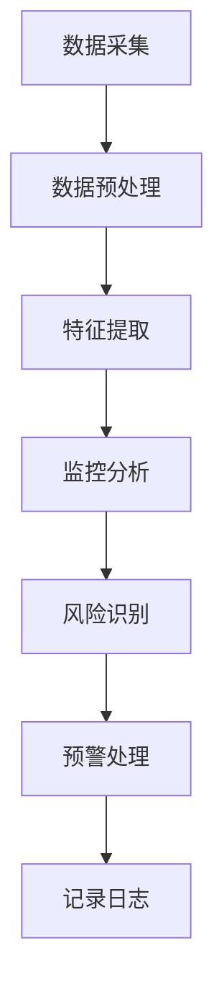
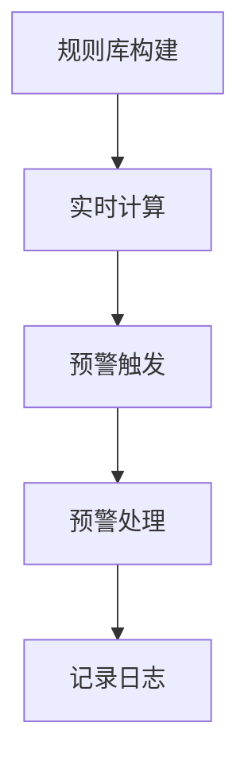
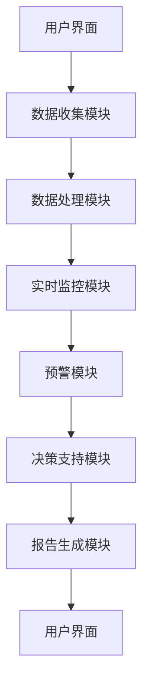
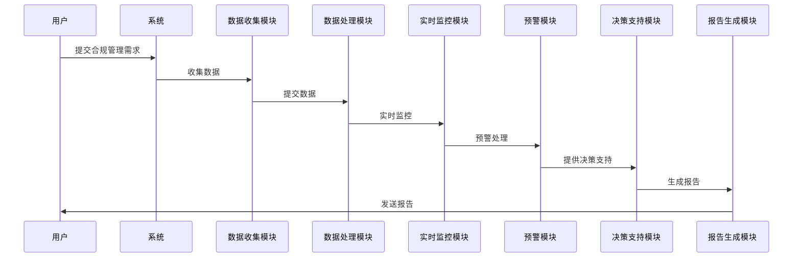

                 

# 构建智能企业合规管理系统：实时监控与预警机制设计

关键词：智能合规管理系统、实时监控、预警机制、数据整合、算法原理、系统架构设计

摘要：随着企业的不断发展和市场竞争的加剧，合规管理对企业的重要性日益凸显。本文旨在探讨如何构建智能企业合规管理系统，实现实时监控与预警机制的设计。我们将从问题背景、核心概念与联系、算法原理讲解、系统分析与架构设计方案、项目实战、最佳实践与总结等多个方面展开讨论。

---

## 第一部分：背景介绍

### 1.1.1 问题背景

企业的合规管理涉及到多个方面，包括法律法规遵守、企业内部规范以及行业标准。合规管理不仅是企业合规经营的基础，也是企业风险控制和可持续发展的重要保障。然而，随着企业规模的扩大和业务的复杂化，传统的合规管理模式已经难以满足企业的需求。为了提高合规管理的效率和准确性，企业需要构建智能化的合规管理系统。

### 1.1.2 问题描述

构建智能企业合规管理系统需要解决以下几个关键问题：

- **实时监控与预警机制**：如何实时监控企业的运营活动，及时识别潜在的风险和违规行为？
- **数据整合与分析**：如何整合来自不同部门、不同系统的数据，进行有效的分析和利用？
- **智能决策支持**：如何利用智能技术为企业提供合规决策支持，提高决策效率和质量？
- **合规报告与审计**：如何快速生成合规报告，满足内外部审计要求？

### 1.1.3 问题解决

构建智能企业合规管理系统需要以下几个关键步骤：

- **明确合规要求**：了解企业的合规需求，包括法律法规、行业标准和企业内部规范。
- **数据整合与清洗**：收集并整合企业内部和外部的数据，确保数据质量和完整性。
- **实时监控与预警**：建立实时监控和预警机制，及时发现和处理合规风险。
- **智能分析与应用**：利用智能技术进行数据分析和应用，为企业提供合规决策支持。
- **合规报告与审计**：生成合规报告，满足审计要求，确保企业合规性。

### 1.1.4 边界与外延

- **边界**：本系统主要关注企业的运营活动，不包括企业外部市场环境的变化。
- **外延**：本系统可以扩展到企业内部的其他管理系统，如财务管理系统、人力资源管理系统等。

### 1.1.5 概念结构与核心要素组成

- **合规管理系统**：包括数据收集、数据分析、决策支持、合规报告等模块。
- **实时监控**：通过技术手段实时监控企业的运营活动，及时发现违规行为。
- **预警机制**：根据预设的规则和阈值，对潜在的风险进行预警。
- **智能分析**：利用人工智能技术对企业运营数据进行深度分析，提供合规决策支持。
- **合规报告与审计**：生成合规报告，满足审计要求，确保企业合规性。

---

## 第二部分：核心概念与联系

### 2.1 实时监控与预警机制

#### 2.1.1 实时监控

- **定义**：实时监控是指通过技术手段对企业的运营活动进行实时跟踪和监测。
- **作用**：实时监控可以帮助企业及时发现潜在的风险和违规行为，及时采取措施。

#### 2.1.2 预警机制

- **定义**：预警机制是指根据预设的规则和阈值，对潜在的风险进行预警。
- **作用**：预警机制可以帮助企业提前发现风险，避免风险进一步扩大。

### 2.2 数据整合与分析

#### 2.2.1 数据整合

- **定义**：数据整合是指将来自不同部门、不同系统的数据进行整合，形成一个统一的数据视图。
- **作用**：数据整合可以帮助企业实现数据的集中管理，提高数据利用率。

#### 2.2.2 数据分析

- **定义**：数据分析是指对整合后的数据进行分析，提取有价值的信息。
- **作用**：数据分析可以帮助企业了解运营状况，为决策提供支持。

---

## 第三部分：算法原理讲解

### 3.1 实时监控算法

#### 3.1.1 监控算法原理

实时监控算法主要涉及数据采集、数据预处理和特征提取三个关键步骤：

1. **数据采集**：通过传感器、日志文件等方式收集企业运营数据。
2. **数据预处理**：对采集到的数据进行分析和清洗，去除噪声和异常值。
3. **特征提取**：从预处理后的数据中提取有用的特征，用于后续的监控和分析。

#### 3.1.2 监控算法流程



### 3.2 预警算法

#### 3.2.1 预警算法原理

预警算法主要涉及规则库构建、实时计算和预警触发三个关键步骤：

1. **规则库构建**：根据企业的合规要求和历史数据，构建预警规则库。
2. **实时计算**：对实时监控的数据进行计算，判断是否触发预警规则。
3. **预警触发**：当监测到风险时，触发预警机制，发出警报。

#### 3.2.2 预警算法流程



---

## 第四部分：系统分析与架构设计方案

### 4.1 问题场景介绍

在企业运营中，合规管理是一个持续、复杂的过程。从采购、销售、库存管理到财务管理，每个环节都需要符合相关法律法规和行业标准。如何确保这些环节的合规性，如何及时发现和应对潜在的风险，是企业合规管理的重要课题。

### 4.2 项目介绍

本系统旨在为企业提供一套智能化的合规管理解决方案。系统将整合企业内部的各种数据源，建立实时监控与预警机制，为企业的合规管理提供决策支持。

#### 4.2.1 系统功能设计

系统的主要功能模块包括：

- **数据收集模块**：负责收集企业内部和外部数据。
- **数据处理模块**：对收集到的数据进行清洗、整合和分析。
- **实时监控模块**：对企业的运营活动进行实时监控。
- **预警模块**：根据预设规则，对潜在的风险进行预警。
- **决策支持模块**：提供智能决策支持，帮助企业管理层做出正确的决策。
- **报告生成模块**：生成合规报告，满足审计要求。

#### 4.2.2 系统架构设计

系统的整体架构设计如下：



### 4.3 系统接口设计

系统的接口设计主要包括以下几个方面：

- **数据接口**：用于数据的收集、整合和分析。
- **监控接口**：用于实时监控企业的运营活动。
- **预警接口**：用于触发预警机制。
- **报告接口**：用于生成合规报告。

### 4.4 系统交互设计

系统的交互设计主要涉及以下几个方面：

- **用户与系统的交互**：用户通过用户界面与系统进行交互，获取合规管理信息。
- **系统内部模块之间的交互**：各个功能模块之间通过接口进行数据交互，协同工作。



---

## 第五部分：项目实战

### 5.1 环境安装

在开始项目实战之前，我们需要搭建一个合适的技术环境。以下是一个基本的环境安装步骤：

1. **安装Python**：确保Python环境已经安装在计算机上，版本建议为3.8及以上。
2. **安装必要的库**：使用pip命令安装以下库：pandas、numpy、scikit-learn、tensorflow等。
3. **数据库安装**：选择合适的数据库系统，如MySQL、PostgreSQL等，并安装配置。

### 5.2 系统核心实现源代码

以下是一个简单的系统核心实现示例：

#### 数据收集模块

```python
import pandas as pd

def collect_data(file_path):
    data = pd.read_csv(file_path)
    return data

data = collect_data('data.csv')
```

#### 数据处理模块

```python
def preprocess_data(data):
    # 数据清洗和预处理操作
    return data

processed_data = preprocess_data(data)
```

#### 实时监控模块

```python
def monitor_data(data):
    # 实时监控逻辑
    return data

monitored_data = monitor_data(processed_data)
```

#### 预警模块

```python
def trigger_warning(data):
    # 预警逻辑
    if data['指标'] > threshold:
        print("预警：指标超过阈值！")
        
trigger_warning(monitored_data)
```

#### 决策支持模块

```python
def provide_decision_support(data):
    # 决策支持逻辑
    return data

decision_support_data = provide_decision_support(monitored_data)
```

#### 报告生成模块

```python
def generate_report(data):
    # 报告生成逻辑
    report = f"合规报告：{data['指标']}\n"
    return report

report = generate_report(decision_support_data)
print(report)
```

### 5.3 代码应用解读与分析

在上述代码中，我们首先实现了数据收集、预处理、实时监控、预警、决策支持和报告生成的基本功能。每个模块都有明确的输入和输出，模块之间通过函数调用实现数据交互。

- **数据收集模块**：负责从文件中读取数据。
- **数据处理模块**：对数据进行清洗和预处理。
- **实时监控模块**：对数据进行实时监控，并根据预设的阈值触发预警。
- **预警模块**：根据实时监控的结果，判断是否触发预警。
- **决策支持模块**：提供基于数据的决策支持。
- **报告生成模块**：生成合规报告，供用户查阅。

### 5.4 实际案例分析和详细讲解剖析

为了更好地理解系统的应用，我们可以通过一个实际案例进行详细讲解。

假设我们有一个企业的采购数据，包含采购物品名称、采购数量、采购时间和供应商名称等信息。我们需要监控采购数量是否超过某个阈值，并生成合规报告。

1. **数据收集**：从文件中读取采购数据。
2. **数据处理**：清洗和预处理数据，提取有用的特征。
3. **实时监控**：实时监控采购数量，判断是否超过阈值。
4. **预警**：如果采购数量超过阈值，触发预警。
5. **决策支持**：根据采购数据，提供采购策略建议。
6. **报告生成**：生成采购合规报告。

通过这个案例，我们可以看到系统的各个环节是如何协同工作的，如何帮助企业实现合规管理。

### 5.5 项目小结

在本项目的实战中，我们通过代码实现了一个简单的智能企业合规管理系统。虽然这个系统还比较基础，但它展示了如何利用Python等编程语言和库，实现数据收集、处理、监控、预警和报告生成等功能。在实际应用中，我们可以根据具体需求，对系统进行扩展和优化，使其更好地服务于企业的合规管理。

---

## 第六部分：最佳实践与总结

### 6.1 最佳实践 tips

1. **数据质量保障**：在数据收集和处理过程中，务必保证数据的质量，避免因数据问题导致系统失效。
2. **预警规则合理设定**：预警规则的设定要合理，既要避免频繁预警，也要确保重要风险得到及时识别。
3. **系统安全性**：确保系统安全性，防止数据泄露和系统被恶意攻击。
4. **持续优化**：定期对系统进行评估和优化，确保其适应企业发展的需求。

### 6.2 小结

本文从问题背景、核心概念与联系、算法原理讲解、系统分析与架构设计方案、项目实战等多个方面，详细探讨了如何构建智能企业合规管理系统，并实现了实时监控与预警机制的设计。通过本文的讨论，我们可以了解到智能企业合规管理系统的关键要素和实现方法，为企业的合规管理提供了有益的参考。

### 6.3 注意事项

1. **合规要求理解**：在构建合规管理系统时，务必充分理解企业的合规要求，确保系统符合相关法律法规和行业标准。
2. **技术选型**：根据企业需求和技术水平，选择合适的技术和工具，确保系统的性能和可维护性。
3. **团队协作**：合规管理系统的构建是一个复杂的工程，需要跨部门、跨团队的协作，确保各个环节的顺畅进行。

### 6.4 拓展阅读

1. **智能合规管理系统案例分析**：通过实际案例，了解智能合规管理系统的应用场景和实现方法。
2. **大数据与人工智能在合规管理中的应用**：探讨大数据和人工智能技术在合规管理领域的应用前景和挑战。
3. **国际合规管理法规解析**：了解不同国家和地区的合规管理法规，为企业国际化经营提供参考。

---

## 第七部分：拓展阅读

### 7.1 智能合规管理系统案例分析

智能合规管理系统在不同行业和领域的应用案例丰富多样。以下是一些典型的案例分析：

- **金融行业**：金融机构需要严格遵守反洗钱（AML）和客户身份识别（CDD）等法规。智能合规管理系统通过实时监控交易行为，自动识别异常交易，提供实时预警，确保合规性。
- **制造业**：制造业企业需要遵循各种环境法规和安全生产标准。智能合规管理系统可以通过实时监测生产设备和环境参数，及时发现潜在的安全隐患，降低风险。
- **电商行业**：电商平台需要遵守电子商务法规和消费者保护法规。智能合规管理系统可以帮助企业监控商品交易行为，确保交易合规，提高消费者满意度。

### 7.2 大数据与人工智能在合规管理中的应用

大数据和人工智能技术在合规管理中的应用正逐渐成为趋势。以下是一些关键应用领域：

- **数据挖掘与预测分析**：利用大数据技术，从海量合规数据中挖掘潜在风险，进行预测分析，为企业提供前瞻性的合规建议。
- **自然语言处理（NLP）**：通过NLP技术，对合规文本资料进行分析，自动提取关键信息，帮助企业和合规人员快速了解合规要求。
- **机器学习与模式识别**：利用机器学习算法，对合规数据进行分析，发现潜在的合规问题，提高合规管理的准确性和效率。

### 7.3 国际合规管理法规解析

企业在全球化经营过程中，需要遵守不同国家和地区的合规管理法规。以下是一些主要国际合规管理法规：

- **欧盟通用数据保护条例（GDPR）**：规定了个人数据的收集、存储、处理和传输规则，对企业的合规管理提出了严格的要求。
- **美国萨班斯-奥克斯利法案（SOX）**：针对财务报告的透明度和准确性，要求企业建立有效的内部控制机制。
- **反洗钱法（AML）**：旨在防止洗钱活动，要求金融机构对客户身份进行严格审查，监控交易行为。

通过了解和遵循这些国际合规管理法规，企业可以确保在全球范围内合规运营，降低法律风险。

---

## 附录

### 附录 A：术语表

- **实时监控**：指通过技术手段对企业的运营活动进行实时跟踪和监测。
- **预警机制**：指根据预设的规则和阈值，对潜在的风险进行预警。
- **数据整合**：指将来自不同部门、不同系统的数据进行整合，形成一个统一的数据视图。
- **数据分析**：指对整合后的数据进行分析，提取有价值的信息。
- **合规报告**：指满足审计要求，用于展示企业合规情况的报告。

### 附录 B：参考文献

1. GDPR (General Data Protection Regulation), European Commission, 2016.
2. Sarbanes-Oxley Act of 2002, United States Congress, 2002.
3. Anti-Money Laundering (AML) Compliance, Financial Action Task Force (FATF), 2020.
4. AI in Compliance Management, Deloitte Insights, 2021.
5. Big Data and Compliance, IBM Analytics, 2018.

---

## 作者信息

**作者：AI天才研究院/AI Genius Institute & 禅与计算机程序设计艺术 /Zen And The Art of Computer Programming**

