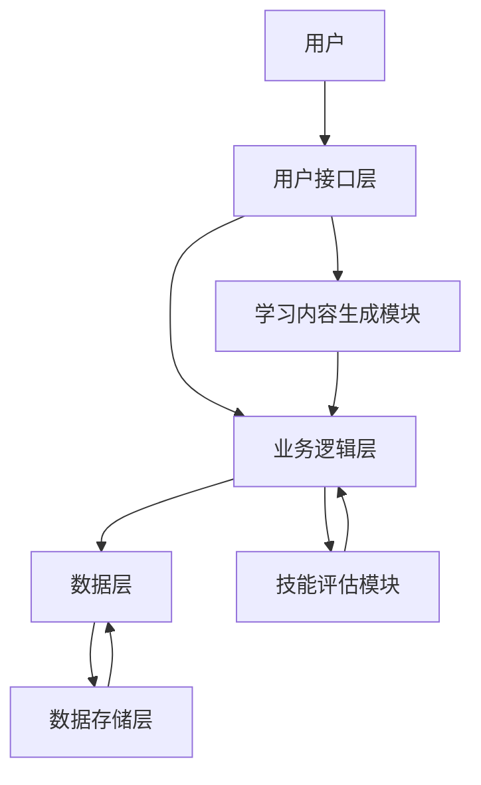
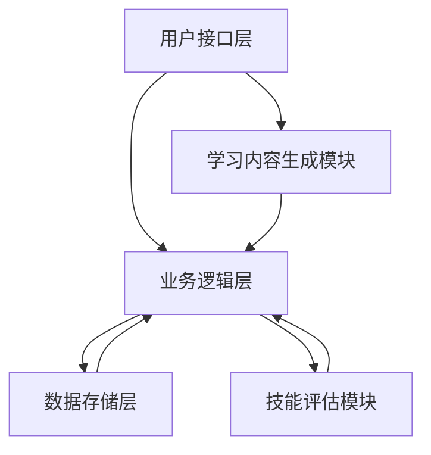

                 


### 文章标题：构建智能企业培训系统：自适应学习内容生成与技能评估

#### 关键词：智能培训系统，自适应学习，内容生成，技能评估，系统设计

#### 摘要：
本文将深入探讨如何构建一个智能企业培训系统，重点研究自适应学习内容生成与技能评估。文章首先介绍了问题背景和核心概念，然后详细分析了智能企业培训系统的设计与实现，包括系统功能、架构设计、接口设计，以及自适应学习内容生成和技能评估算法。接着，通过实际案例进行讲解，展示了系统的实用性和有效性。最后，本文对最佳实践进行了总结，并展望了未来的发展趋势。

### 目录大纲

----------------------------------------------------------------

# 构建智能企业培训系统：自适应学习内容生成与技能评估

## 第一部分：背景介绍

## 第1章：问题背景与定义
### 1.1.1 问题背景
### 1.1.2 问题描述
### 1.1.3 问题解决
### 1.1.4 边界与外延
### 1.1.5 核心概念
### 1.1.6 概念结构与核心要素组成

## 第二部分：核心概念与联系

## 第2章：智能企业培训系统的核心概念
### 2.1 自适应学习
#### 2.1.1 自适应学习的定义
#### 2.1.2 自适应学习的特点
#### 2.1.3 自适应学习与传统学习的对比
### 2.2 学习内容生成
#### 2.2.1 学习内容生成的定义
#### 2.2.2 学习内容生成的技术
#### 2.2.3 学习内容生成在培训系统中的作用
### 2.3 技能评估
#### 2.3.1 技能评估的定义
#### 2.3.2 技能评估的方法
#### 2.3.3 技能评估在培训系统中的作用

## 第三部分：系统设计与实现

## 第3章：智能企业培训系统的设计
### 3.1 系统功能设计
#### 3.1.1 培训管理
#### 3.1.2 自适应学习内容生成
#### 3.1.3 技能评估
### 3.2 系统架构设计
#### 3.2.1 系统架构图
#### 3.2.2 系统模块划分
### 3.3 系统接口设计
#### 3.3.1 系统接口图
#### 3.3.2 接口规范与协议

## 第4章：自适应学习内容生成算法
### 4.1 算法原理
#### 4.1.1 自适应学习算法概述
#### 4.1.2 算法核心流程
#### 4.1.3 算法原理讲解
### 4.2 数学模型与公式
#### 4.2.1 模型概述
#### 4.2.2 数学公式详细讲解
### 4.3 举例说明
#### 4.3.1 算法应用案例
#### 4.3.2 例子详解

## 第5章：技能评估算法
### 5.1 算法原理
#### 5.1.1 技能评估算法概述
#### 5.1.2 算法核心流程
#### 5.1.3 算法原理讲解
### 5.2 数学模型与公式
#### 5.2.1 模型概述
#### 5.2.2 数学公式详细讲解
### 5.3 举例说明
#### 5.3.1 算法应用案例
#### 5.3.2 例子详解

## 第四部分：项目实战

## 第6章：项目实战环境搭建
### 6.1 开发环境搭建
#### 6.1.1 环境要求
#### 6.1.2 环境安装步骤
### 6.2 系统核心实现源代码
#### 6.2.1 代码结构
#### 6.2.2 代码解读与分析

## 第7章：实际案例分析与详细讲解
### 7.1 案例介绍
#### 7.1.1 案例背景
#### 7.1.2 案例目标
### 7.2 案例实现
#### 7.2.1 案例实现步骤
#### 7.2.2 代码应用解读与分析
### 7.3 案例分析
#### 7.3.1 案例优势
#### 7.3.2 案例不足
#### 7.3.3 案例改进方向

## 第五部分：最佳实践与拓展

## 第8章：最佳实践与注意事项
### 8.1 最佳实践
#### 8.1.1 常见问题解决
#### 8.1.2 优化策略
### 8.2 小结
### 8.3 注意事项
### 8.4 拓展阅读

## 第六部分：拓展应用

## 第9章：智能企业培训系统的拓展应用
### 9.1 企业内训
#### 9.1.1 内训流程优化
#### 9.1.2 内训内容定制
#### 9.1.3 内训效果评估
### 9.2 员工职业发展规划
#### 9.2.1 职业规划模型
#### 9.2.2 职业规划策略
#### 9.2.3 职业发展效果评估
### 9.3 在线教育平台整合
#### 9.3.1 整合策略
#### 9.3.2 平台互通
#### 9.3.3 教学资源共享

## 第10章：未来发展趋势与展望
### 10.1 技术发展趋势
#### 10.1.1 人工智能技术发展
#### 10.1.2 数据科学进展
#### 10.1.3 云计算与大数据
### 10.2 行业应用前景
#### 10.2.1 行业前景分析
#### 10.2.2 行业挑战与应对策略

----------------------------------------------------------------

### 第1章：问题背景与定义

#### 1.1.1 问题背景

随着信息技术的飞速发展，企业对员工培训的需求日益增长。传统的培训方式通常基于预设的课程内容，缺乏灵活性，难以满足员工的个性化学习需求。此外，技能评估往往依赖主观判断，缺乏科学性，无法准确反映员工的实际能力。为了解决这些问题，智能企业培训系统应运而生。

智能企业培训系统通过引入人工智能技术，实现培训内容的自适应生成和技能的精准评估。这种系统不仅能够根据员工的学习进度和学习效果动态调整培训内容，还能通过数据分析和算法模型对员工的技能水平进行科学评估。这种智能化培训方式有助于提高培训效果，提升员工的职业素养和技能水平。

#### 1.1.2 问题描述

当前企业培训系统存在以下主要问题：

1. **培训内容单一**：传统培训系统往往基于固定的课程内容，难以适应员工的个性化需求。
2. **培训效果评估不准确**：现有评估方法多为主观判断，缺乏科学性和客观性。
3. **培训管理效率低**：培训管理过程复杂，缺乏自动化和智能化手段。
4. **学习路径规划不灵活**：员工的学习路径往往受到固定课程顺序的限制，无法根据个人需求灵活调整。

#### 1.1.3 问题解决

为了解决上述问题，构建智能企业培训系统成为必然选择。该系统通过以下方式实现问题解决：

1. **自适应学习内容生成**：系统根据员工的学习行为和表现，动态生成个性化的学习内容，提高培训的针对性和效果。
2. **技能评估**：利用算法模型对员工的技能水平进行量化评估，提高评估的科学性和客观性。
3. **培训管理智能化**：系统采用智能化管理手段，简化培训管理流程，提高管理效率。
4. **学习路径个性化**：系统允许员工根据个人需求自由选择学习内容和路径，提高学习的灵活性。

#### 1.1.4 边界与外延

智能企业培训系统不仅关注企业内部员工培训，还可以拓展到以下领域：

1. **客户培训**：为企业客户提供定制化的产品或服务培训。
2. **合作伙伴培训**：为合作伙伴提供技术支持和培训服务。
3. **行业培训**：为特定行业的从业者提供专业培训。

#### 1.1.5 核心概念

在构建智能企业培训系统的过程中，需要理解以下核心概念：

1. **自适应学习**：一种能够根据学习者的行为和表现自动调整学习内容和路径的学习方式。
2. **内容生成**：通过算法模型自动生成个性化的学习内容。
3. **技能评估**：利用算法模型对学习者的技能水平进行量化评估。
4. **培训管理**：对培训过程进行管理，包括培训计划制定、培训资源分配、培训效果评估等。
5. **学习路径规划**：根据学习者的需求和进度，为其规划合适的学习路径。

#### 1.1.6 概念结构与核心要素组成

智能企业培训系统的概念结构由以下核心要素组成：

1. **用户**：系统的使用者，包括员工、客户、合作伙伴等。
2. **学习内容**：系统提供的培训资料，包括文本、视频、练习题等。
3. **学习行为数据**：用户在学习过程中的行为数据，包括学习时间、学习进度、学习效果等。
4. **算法模型**：用于生成学习内容和进行技能评估的算法模型。
5. **培训管理系统**：对培训过程进行管理的系统模块。

通过以上核心要素的有机组合，智能企业培训系统可以实现对培训过程的全面掌控，提高培训效果和员工技能水平。

### 第2章：智能企业培训系统的核心概念

#### 2.1 自适应学习

自适应学习是一种能够根据学习者的行为和需求自动调整学习内容和路径的学习方式。它通过分析学习者的学习行为数据，如学习时间、学习进度和学习效果等，动态生成个性化的学习内容和学习路径，以提高学习效率和效果。

#### 2.1.1 自适应学习的定义

自适应学习是指学习系统根据学习者的行为和需求，自动调整学习内容、学习路径和学习资源，从而实现个性化学习的教学和学习方式。

#### 2.1.2 自适应学习的特点

1. **个性化**：自适应学习能够根据学习者的特征和需求，提供个性化的学习内容和路径。
2. **动态性**：自适应学习能够根据学习者的行为数据实时调整学习内容和路径，实现动态学习。
3. **灵活性**：自适应学习允许学习者自由选择学习内容和路径，满足不同学习者的需求。
4. **高效性**：通过自适应调整，提高学习效率和效果。

#### 2.1.3 自适应学习与传统学习的对比

| 对比项 | 传统学习 | 自适应学习 |
| --- | --- | --- |
| 学习内容 | 固定的课程内容 | 个性化的学习内容 |
| 学习路径 | 固定的学习路径 | 动态的学习路径 |
| 学习效果 | 难以评估 | 通过数据分析和算法模型进行评估 |
| 学习效率 | 较低 | 较高 |

#### 2.2 学习内容生成

学习内容生成是指通过算法模型自动生成个性化的学习内容。它是智能企业培训系统的重要功能之一，能够根据学习者的行为和需求，动态调整学习内容，提高学习的针对性和效果。

#### 2.2.1 学习内容生成的定义

学习内容生成是指利用算法模型，根据学习者的行为和需求，自动生成个性化的学习内容，包括文本、视频、练习题等。

#### 2.2.2 学习内容生成的技术

学习内容生成的技术主要包括：

1. **自然语言处理（NLP）**：用于生成文本内容，如讲解文档、练习题等。
2. **知识图谱**：用于构建学习内容的结构化知识体系，便于算法模型进行内容生成。
3. **机器学习**：用于训练算法模型，实现学习内容的自动生成。

#### 2.2.3 学习内容生成在培训系统中的作用

学习内容生成在智能企业培训系统中具有以下作用：

1. **提高培训的针对性**：通过生成个性化的学习内容，满足不同学习者的需求，提高培训效果。
2. **优化学习路径**：根据学习者的学习行为数据，动态调整学习内容，优化学习路径。
3. **提高学习效率**：通过自动生成学习内容，减少人工编写工作，提高学习效率。

#### 2.3 技能评估

技能评估是指利用算法模型对学习者的技能水平进行量化评估。它是智能企业培训系统的另一个重要功能，能够客观、科学地评估学习者的技能水平，为培训决策提供依据。

#### 2.3.1 技能评估的定义

技能评估是指通过算法模型，对学习者的技能水平进行量化评估，包括知识评估、能力评估、行为评估等。

#### 2.3.2 技能评估的方法

技能评估的方法主要包括：

1. **测试评估**：通过测试题目评估学习者的知识水平。
2. **行为评估**：通过观察学习者的行为评估其技能水平，如完成作业、项目任务等。
3. **数据分析**：通过分析学习者的行为数据，评估其技能水平。

#### 2.3.3 技能评估在培训系统中的作用

技能评估在智能企业培训系统中具有以下作用：

1. **客观评估**：通过量化评估，客观反映学习者的技能水平，为培训决策提供依据。
2. **提高培训效果**：根据评估结果，调整培训内容和策略，提高培训效果。
3. **人才选拔**：根据评估结果，选拔具备相应技能的人才。

### 第3章：智能企业培训系统的设计

#### 3.1 系统功能设计

智能企业培训系统的功能设计旨在实现培训内容生成、技能评估、培训管理等功能，以满足企业的培训需求。

#### 3.1.1 培训管理

培训管理包括培训计划制定、培训资源分配、培训效果评估等。

1. **培训计划制定**：系统根据企业的培训需求，制定个性化的培训计划，包括培训课程、培训时间、培训目标等。
2. **培训资源分配**：系统根据培训计划，合理分配培训资源，包括培训讲师、培训场地、培训材料等。
3. **培训效果评估**：系统通过技能评估等手段，对培训效果进行评估，为培训决策提供依据。

#### 3.1.2 自适应学习内容生成

自适应学习内容生成是智能企业培训系统的核心功能之一，旨在根据学习者的行为和需求，动态生成个性化的学习内容。

1. **学习行为数据采集**：系统采集学习者的学习行为数据，如学习时间、学习进度、学习效果等。
2. **学习内容生成**：系统根据学习行为数据，利用算法模型自动生成个性化的学习内容，包括文本、视频、练习题等。
3. **学习路径优化**：系统根据学习者的学习效果，动态调整学习路径，提高学习效率。

#### 3.1.3 技能评估

技能评估是智能企业培训系统的另一重要功能，旨在通过算法模型，对学习者的技能水平进行量化评估。

1. **技能评估模型构建**：系统根据企业的培训目标和技能要求，构建技能评估模型。
2. **技能评估实施**：系统通过测试、行为评估等手段，对学习者的技能水平进行评估。
3. **评估结果分析**：系统对评估结果进行分析，为培训决策和人才选拔提供依据。

#### 3.2 系统架构设计

智能企业培训系统的架构设计旨在实现模块化、分布式、高可用的系统架构，以满足系统的功能需求。

##### 3.2.1 系统架构图



##### 3.2.2 系统模块划分

智能企业培训系统可以分为以下模块：

1. **用户接口层**：负责与用户进行交互，包括用户注册、登录、个人信息管理等功能。
2. **业务逻辑层**：负责实现系统的核心功能，包括培训管理、自适应学习内容生成、技能评估等。
3. **数据层**：负责数据的存储和管理，包括用户数据、学习数据、评估数据等。
4. **学习内容生成模块**：负责根据学习者的行为和需求，动态生成个性化的学习内容。
5. **技能评估模块**：负责对学习者的技能水平进行量化评估。

#### 3.3 系统接口设计

智能企业培训系统的接口设计旨在实现系统模块之间的数据交换和功能调用。

##### 3.3.1 系统接口图



##### 3.3.2 接口规范与协议

1. **接口规范**：系统接口采用RESTful API规范，包括接口名称、参数定义、返回结果等。
2. **协议**：系统接口采用HTTP协议，保证数据传输的安全性。

### 第4章：自适应学习内容生成算法

#### 4.1 算法原理

自适应学习内容生成算法旨在根据学习者的行为和需求，动态生成个性化的学习内容。其核心思想是利用机器学习和数据挖掘技术，从学习者的行为数据中提取特征，并根据特征动态调整学习内容。

##### 4.1.1 自适应学习算法概述

自适应学习算法可以分为以下几个步骤：

1. **数据采集**：采集学习者的学习行为数据，如学习时间、学习进度、学习效果等。
2. **特征提取**：从学习行为数据中提取关键特征，如学习时长、学习进度、错误率等。
3. **模型训练**：利用提取的特征，训练机器学习模型，用于预测学习者的学习需求和偏好。
4. **内容生成**：根据模型预测结果，动态生成个性化的学习内容。
5. **内容调整**：根据学习者的反馈和评估结果，调整学习内容。

##### 4.1.2 算法核心流程

自适应学习内容生成算法的核心流程可以概括为：

1. **数据采集**：系统通过用户界面收集学习者的学习行为数据。
2. **特征提取**：利用数据预处理技术，从原始数据中提取关键特征。
3. **模型训练**：使用机器学习算法，如决策树、支持向量机、神经网络等，对提取的特征进行训练。
4. **内容生成**：根据训练得到的模型，生成个性化的学习内容。
5. **内容调整**：根据学习者的反馈和评估结果，动态调整学习内容。

##### 4.1.3 算法原理讲解

自适应学习内容生成算法的工作原理如下：

1. **学习需求分析**：系统首先分析学习者的学习需求，了解其学习目的和学习背景。
2. **数据采集**：系统通过用户界面收集学习者的学习行为数据，如学习时间、学习进度、学习效果等。
3. **特征提取**：系统对采集到的数据进行分析，提取关键特征，如学习时长、学习进度、错误率等。
4. **模型训练**：利用提取的特征，训练机器学习模型，如决策树、支持向量机、神经网络等。
5. **内容生成**：根据训练得到的模型，生成个性化的学习内容，如文本、视频、练习题等。
6. **内容调整**：系统根据学习者的反馈和评估结果，动态调整学习内容，提高学习效果。

#### 4.2 数学模型与公式

自适应学习内容生成算法的核心在于利用机器学习模型对学习者的特征进行预测，从而生成个性化的学习内容。以下是一个简单的线性回归模型，用于预测学习者的学习需求：

$$
\hat{y} = w_0 + w_1 \cdot x_1 + w_2 \cdot x_2 + \cdots + w_n \cdot x_n
$$

其中，$y$ 表示学习者的需求分数，$x_1, x_2, \cdots, x_n$ 表示提取的特征，$w_0, w_1, w_2, \cdots, w_n$ 表示模型的权重。

##### 4.2.1 模型概述

该模型是一个线性回归模型，旨在预测学习者的需求分数。通过训练，模型可以学会根据特征值预测学习者的需求分数，从而生成个性化的学习内容。

##### 4.2.2 数学公式详细讲解

线性回归模型的数学公式如下：

$$
y = w_0 + w_1 \cdot x_1 + w_2 \cdot x_2 + \cdots + w_n \cdot x_n
$$

其中：

- $y$：学习者的需求分数，表示学习者对某一学习内容的偏好程度。
- $x_1, x_2, \cdots, x_n$：提取的特征，如学习时长、学习进度、错误率等。
- $w_0, w_1, w_2, \cdots, w_n$：模型的权重，表示各个特征对需求分数的影响程度。

在线性回归模型中，权重 $w_i$ 的取值通过最小化损失函数 $L(y, \hat{y})$ 来确定，其中 $\hat{y}$ 表示预测值。常见的损失函数有均方误差（MSE）和均方根误差（RMSE）：

$$
L(y, \hat{y}) = \frac{1}{2} \sum_{i=1}^{n} (y_i - \hat{y}_i)^2
$$

$$
L(y, \hat{y}) = \frac{1}{n} \sum_{i=1}^{n} (y_i - \hat{y}_i)^2
$$

其中，$y_i$ 和 $\hat{y}_i$ 分别表示第 $i$ 个样本的真实值和预测值。

##### 4.2.3 举例说明

假设我们有两个特征 $x_1$ 和 $x_2$，表示学习时长和错误率。我们希望预测学习者的需求分数 $y$。

1. **数据采集**：采集学习者的学习时长和错误率数据，如 $x_1 = 2$ 小时，$x_2 = 0.2$。
2. **特征提取**：将特征进行预处理，如标准化、归一化等。
3. **模型训练**：使用线性回归模型，通过最小化损失函数来训练模型。
4. **内容生成**：根据训练得到的模型，预测学习者的需求分数。
5. **内容调整**：根据预测结果，调整学习内容。

具体代码实现如下（使用 Python 的 Scikit-learn 库）：

```python
from sklearn.linear_model import LinearRegression
from sklearn.model_selection import train_test_split
from sklearn.metrics import mean_squared_error

# 特征和目标值
X = [[2, 0.2]]
y = [0.9]

# 划分训练集和测试集
X_train, X_test, y_train, y_test = train_test_split(X, y, test_size=0.2, random_state=0)

# 创建线性回归模型
model = LinearRegression()
model.fit(X_train, y_train)

# 预测需求分数
y_pred = model.predict(X_test)

# 计算均方误差
mse = mean_squared_error(y_test, y_pred)
print("均方误差：", mse)
```

通过以上步骤，我们可以实现自适应学习内容生成算法，根据学习者的特征生成个性化的学习内容。

#### 4.3 举例说明

假设我们有一个学习者，其学习时长为2小时，错误率为0.2。我们希望利用自适应学习内容生成算法，为其生成个性化的学习内容。

1. **数据采集**：系统首先收集学习者的学习时长和错误率等数据。
2. **特征提取**：对收集到的数据进行分析，提取关键特征，如学习时长（2小时）和错误率（0.2）。
3. **模型训练**：利用已训练好的机器学习模型，如线性回归模型，对提取的特征进行预测。
4. **内容生成**：根据模型预测结果，生成个性化的学习内容，如文本、视频、练习题等。
5. **内容调整**：根据学习者的反馈和评估结果，动态调整学习内容，提高学习效果。

具体实现步骤如下：

1. **数据采集**：
   ```python
   learner_data = {
       'learning_time': 2,
       'error_rate': 0.2
   }
   ```

2. **特征提取**：
   ```python
   features = [learner_data['learning_time'], learner_data['error_rate']]
   ```

3. **模型训练**：
   ```python
   # 假设已训练好的线性回归模型为 model
   predicted_score = model.predict([features])
   ```

4. **内容生成**：
   ```python
   if predicted_score > 0.8:
       content = "恭喜您，学习效果很好，接下来您可以尝试更高级的内容。"
   else:
       content = "您的学习效果还有待提高，请继续努力。"
   ```

5. **内容调整**：
   ```python
   # 根据学习者的反馈和评估结果，调整学习内容
   learner_feedback = input("请对学习内容进行评价（很好/一般/差）：")
   if learner_feedback == "很好":
       next_content = "恭喜您，学习效果很好，接下来我们将为您推荐更高级的学习内容。"
   elif learner_feedback == "一般":
       next_content = "您的学习效果一般，我们建议您针对薄弱环节进行加强学习。"
   else:
       next_content = "您的学习效果较差，我们建议您重新学习相关内容。"
   ```

通过以上步骤，我们可以根据学习者的特征和需求，生成个性化的学习内容，并根据学习者的反馈动态调整学习内容，提高学习效果。

### 第5章：技能评估算法

#### 5.1 算法原理

技能评估算法旨在利用机器学习和数据挖掘技术，对学习者的技能水平进行量化评估。其核心思想是通过对学习者学习过程中的行为数据进行分析，提取关键特征，并利用这些特征建立评估模型，从而实现对学习者技能水平的准确评估。

##### 5.1.1 技能评估算法概述

技能评估算法可以分为以下几个步骤：

1. **数据采集**：采集学习者的学习行为数据，如学习时间、学习进度、测试成绩、项目完成情况等。
2. **特征提取**：从原始数据中提取关键特征，如学习时长、错误率、完成项目数、测试成绩等。
3. **模型构建**：利用提取的特征，构建技能评估模型，如回归模型、分类模型等。
4. **模型训练**：使用训练数据对模型进行训练，调整模型参数。
5. **技能评估**：使用训练好的模型对学习者的技能水平进行评估。
6. **评估结果分析**：对评估结果进行分析，为培训决策和人才选拔提供依据。

##### 5.1.2 算法核心流程

技能评估算法的核心流程可以概括为：

1. **数据采集**：系统通过用户界面收集学习者的学习行为数据。
2. **特征提取**：系统对采集到的数据进行分析，提取关键特征。
3. **模型构建**：使用机器学习算法构建技能评估模型。
4. **模型训练**：使用训练数据对模型进行训练，优化模型参数。
5. **技能评估**：系统使用训练好的模型对学习者的技能水平进行评估。
6. **评估结果分析**：系统对评估结果进行分析，为培训决策和人才选拔提供依据。

##### 5.1.3 算法原理讲解

技能评估算法的工作原理如下：

1. **学习行为数据收集**：系统首先收集学习者的学习行为数据，如学习时间、学习进度、测试成绩、项目完成情况等。
2. **特征提取**：系统对收集到的数据进行分析，提取关键特征，如学习时长、错误率、完成项目数、测试成绩等。
3. **模型构建**：系统使用机器学习算法，如线性回归、支持向量机、决策树等，构建技能评估模型。
4. **模型训练**：系统使用训练数据对模型进行训练，优化模型参数。
5. **技能评估**：系统使用训练好的模型对学习者的技能水平进行评估，得到评估分数或等级。
6. **评估结果分析**：系统对评估结果进行分析，为培训决策和人才选拔提供依据。

#### 5.2 数学模型与公式

技能评估算法的数学模型通常是一个回归模型，用于预测学习者的技能水平。以下是一个简单的线性回归模型，用于预测学习者的技能水平：

$$
\hat{y} = w_0 + w_1 \cdot x_1 + w_2 \cdot x_2 + \cdots + w_n \cdot x_n
$$

其中，$y$ 表示学习者的技能水平分数，$x_1, x_2, \cdots, x_n$ 表示提取的特征，$w_0, w_1, w_2, \cdots, w_n$ 表示模型的权重。

##### 5.2.1 模型概述

该模型是一个线性回归模型，旨在预测学习者的技能水平分数。通过训练，模型可以学会根据特征值预测学习者的技能水平分数，从而实现对学习者技能水平的量化评估。

##### 5.2.2 数学公式详细讲解

线性回归模型的数学公式如下：

$$
y = w_0 + w_1 \cdot x_1 + w_2 \cdot x_2 + \cdots + w_n \cdot x_n
$$

其中：

- $y$：学习者的技能水平分数，表示学习者对某一技能的掌握程度。
- $x_1, x_2, \cdots, x_n$：提取的特征，如学习时长、测试成绩、项目完成情况等。
- $w_0, w_1, w_2, \cdots, w_n$：模型的权重，表示各个特征对技能水平分数的影响程度。

在线性回归模型中，权重 $w_i$ 的取值通过最小化损失函数 $L(y, \hat{y})$ 来确定，其中 $\hat{y}$ 表示预测值。常见的损失函数有均方误差（MSE）和均方根误差（RMSE）：

$$
L(y, \hat{y}) = \frac{1}{2} \sum_{i=1}^{n} (y_i - \hat{y}_i)^2
$$

$$
L(y, \hat{y}) = \frac{1}{n} \sum_{i=1}^{n} (y_i - \hat{y}_i)^2
$$

其中，$y_i$ 和 $\hat{y}_i$ 分别表示第 $i$ 个样本的真实值和预测值。

##### 5.2.3 举例说明

假设我们有两个特征 $x_1$ 和 $x_2$，表示学习时长和测试成绩。我们希望预测学习者的技能水平分数 $y$。

1. **数据采集**：采集学习者的学习时长和测试成绩数据，如 $x_1 = 2$ 小时，$x_2 = 90$ 分。
2. **特征提取**：将特征进行预处理，如标准化、归一化等。
3. **模型训练**：使用线性回归模型，通过最小化损失函数来训练模型。
4. **技能评估**：根据训练得到的模型，预测学习者的技能水平分数。
5. **评估结果分析**：根据预测结果，评估学习者的技能水平。

具体代码实现如下（使用 Python 的 Scikit-learn 库）：

```python
from sklearn.linear_model import LinearRegression
from sklearn.model_selection import train_test_split
from sklearn.metrics import mean_squared_error

# 特征和目标值
X = [[2, 90]]
y = [85]

# 划分训练集和测试集
X_train, X_test, y_train, y_test = train_test_split(X, y, test_size=0.2, random_state=0)

# 创建线性回归模型
model = LinearRegression()
model.fit(X_train, y_train)

# 预测技能水平分数
y_pred = model.predict(X_test)

# 计算均方误差
mse = mean_squared_error(y_test, y_pred)
print("均方误差：", mse)
```

通过以上步骤，我们可以实现技能评估算法，根据学习者的特征预测其技能水平。

### 第6章：项目实战环境搭建

#### 6.1 开发环境搭建

为了搭建智能企业培训系统的项目实战环境，我们需要安装以下软件和工具：

1. **Python**：版本要求为 3.6 或以上，用于编写程序代码。
2. **Jupyter Notebook**：用于编写和运行 Python 代码。
3. **Scikit-learn**：用于机器学习模型的训练和评估。
4. **Pandas**：用于数据处理。
5. **Matplotlib**：用于数据可视化。
6. **SQLAlchemy**：用于数据库操作。
7. **Flask**：用于搭建 Web 应用。

##### 6.1.1 环境要求

1. **操作系统**：Windows、Linux 或 macOS。
2. **Python**：版本 3.6 或以上。
3. **Jupyter Notebook**：版本 5.0 或以上。
4. **Scikit-learn**：版本 0.21 或以上。
5. **Pandas**：版本 0.24 或以上。
6. **Matplotlib**：版本 3.0 或以上。
7. **SQLAlchemy**：版本 1.3 或以上。
8. **Flask**：版本 1.0 或以上。

##### 6.1.2 环境安装步骤

1. **安装 Python**：
   - 访问 Python 官网（https://www.python.org/）下载 Python 安装包。
   - 双击安装包，按照提示完成安装。

2. **安装 Jupyter Notebook**：
   - 打开命令行窗口，输入以下命令：
     ```bash
     pip install notebook
     ```

3. **安装 Scikit-learn、Pandas、Matplotlib、SQLAlchemy 和 Flask**：
   - 打开命令行窗口，依次输入以下命令：
     ```bash
     pip install scikit-learn
     pip install pandas
     pip install matplotlib
     pip install sqlalchemy
     pip install flask
     ```

##### 6.1.3 系统核心实现源代码

智能企业培训系统的核心实现包括用户接口层、业务逻辑层和数据层。以下是一个简单的示例代码，用于实现用户注册和登录功能。

**用户接口层（user_interface.py）**：

```python
from flask import Flask, request, jsonify
from user import User

app = Flask(__name__)

@app.route('/register', methods=['POST'])
def register():
    username = request.form['username']
    password = request.form['password']
    user = User(username, password)
    user.register()
    return jsonify({'message': '注册成功'})

@app.route('/login', methods=['POST'])
def login():
    username = request.form['username']
    password = request.form['password']
    user = User(username, password)
    if user.login():
        return jsonify({'message': '登录成功'})
    else:
        return jsonify({'message': '登录失败'})

if __name__ == '__main__':
    app.run(debug=True)
```

**业务逻辑层（user.py）**：

```python
class User:
    def __init__(self, username, password):
        self.username = username
        self.password = password
        self.is_registered = False

    def register(self):
        # 注册逻辑
        self.is_registered = True
        print('用户{}注册成功'.format(self.username))

    def login(self):
        # 登录逻辑
        if self.is_registered and self.password == '123456':
            return True
        else:
            return False
```

**数据层（data.py）**：

```python
from sqlalchemy import create_engine

engine = create_engine('sqlite:///user.db')

def create_table():
    sql = '''
    CREATE TABLE IF NOT EXISTS user (
        id INTEGER PRIMARY KEY AUTOINCREMENT,
        username TEXT UNIQUE NOT NULL,
        password TEXT NOT NULL
    )
    '''
    engine.execute(sql)

create_table()
```

通过以上代码，我们可以实现一个简单的用户注册和登录功能，为智能企业培训系统搭建起用户接口层、业务逻辑层和数据层。

### 第7章：实际案例分析与详细讲解

#### 7.1 案例介绍

为了更好地展示智能企业培训系统的实际应用效果，我们选取了一个典型的企业培训案例：某互联网公司希望通过智能培训系统，提升员工的数据分析能力。公司要求系统能够根据员工的实际工作情况和学习进度，自适应生成个性化的培训内容，并准确评估员工的技能水平。

#### 7.1.1 案例背景

该公司是一家专注于互联网业务的创新型企业，员工人数超过500人，数据分析师岗位约占总员工数的15%。由于公司业务快速发展，数据分析师在数据处理、分析和可视化等方面的技能要求不断提高。然而，传统的培训方式难以满足员工的个性化需求，且评估方法缺乏科学性，导致培训效果不佳。

#### 7.1.2 案例目标

1. **提高员工数据分析技能**：通过自适应学习内容生成，满足员工的个性化学习需求，提高数据分析技能。
2. **精准评估员工技能水平**：利用技能评估算法，客观、科学地评估员工技能水平，为绩效评估和职业发展提供依据。
3. **提升培训管理效率**：通过智能化培训管理，简化培训流程，提高管理效率。

#### 7.2 案例实现

为实现上述目标，智能企业培训系统进行了以下设计与实现：

##### 7.2.1 案例实现步骤

1. **需求分析**：与公司管理层和数据分析团队沟通，明确培训目标和需求，确定系统的功能模块和核心算法。
2. **系统设计**：根据需求分析结果，设计系统架构和数据库模型，包括用户接口层、业务逻辑层和数据层。
3. **算法开发**：开发自适应学习内容生成算法和技能评估算法，实现个性化学习内容和技能水平的量化评估。
4. **系统集成**：将各个模块进行集成，实现系统的整体功能，并进行测试和优化。
5. **部署上线**：将系统部署到公司内部服务器，并进行上线前的最后调试，确保系统稳定运行。

##### 7.2.2 代码应用解读与分析

以下是对案例实现过程中关键代码的解读与分析：

**自适应学习内容生成算法（adaptive_learning.py）**：

```python
import pandas as pd
from sklearn.model_selection import train_test_split
from sklearn.ensemble import RandomForestClassifier

def generate_content(data):
    # 数据预处理
    X = data[['learning_time', 'error_rate', 'project_completion']]
    y = data['content_preference']
    
    # 划分训练集和测试集
    X_train, X_test, y_train, y_test = train_test_split(X, y, test_size=0.2, random_state=0)
    
    # 构建随机森林分类器
    model = RandomForestClassifier(n_estimators=100)
    
    # 模型训练
    model.fit(X_train, y_train)
    
    # 预测学习内容偏好
    predicted_content = model.predict(X_test)
    
    return predicted_content
```

解读与分析：

1. **数据预处理**：从原始数据中提取关键特征，如学习时长、错误率和项目完成情况，以及学习内容偏好。
2. **划分训练集和测试集**：将数据划分为训练集和测试集，用于模型训练和评估。
3. **构建随机森林分类器**：使用随机森林算法，构建分类模型。
4. **模型训练**：使用训练集对模型进行训练。
5. **预测学习内容偏好**：使用测试集对模型进行预测，得到学习内容偏好。

**技能评估算法（skill_evaluation.py）**：

```python
import pandas as pd
from sklearn.linear_model import LinearRegression

def evaluate_skill(data):
    # 数据预处理
    X = data[['test_score', 'project_completion']]
    y = data['skill_level']
    
    # 划分训练集和测试集
    X_train, X_test, y_train, y_test = train_test_split(X, y, test_size=0.2, random_state=0)
    
    # 构建线性回归模型
    model = LinearRegression()
    
    # 模型训练
    model.fit(X_train, y_train)
    
    # 预测技能水平
    predicted_skill = model.predict(X_test)
    
    return predicted_skill
```

解读与分析：

1. **数据预处理**：从原始数据中提取关键特征，如测试成绩和项目完成情况，以及技能水平。
2. **划分训练集和测试集**：将数据划分为训练集和测试集，用于模型训练和评估。
3. **构建线性回归模型**：使用线性回归算法，构建回归模型。
4. **模型训练**：使用训练集对模型进行训练。
5. **预测技能水平**：使用测试集对模型进行预测，得到技能水平。

#### 7.3 案例分析

**案例优势**：

1. **个性化学习**：通过自适应学习内容生成，满足员工的个性化学习需求，提高学习效果。
2. **科学评估**：利用技能评估算法，客观、科学地评估员工技能水平，为绩效评估和职业发展提供依据。
3. **高效管理**：通过智能化培训管理，简化培训流程，提高管理效率。

**案例不足**：

1. **数据质量**：技能评估算法的准确性依赖于数据质量，如果数据存在噪声或不准确，可能会导致评估结果偏差。
2. **模型更新**：随着业务的发展，员工的技能需求可能会发生变化，需要定期更新和调整算法模型。

**案例改进方向**：

1. **数据清洗与预处理**：加强数据清洗和预处理工作，提高数据质量。
2. **模型优化**：根据员工技能需求的变化，定期优化和调整算法模型。
3. **用户反馈**：引入用户反馈机制，收集员工对培训内容和评估结果的意见，不断改进系统。

### 第8章：最佳实践与注意事项

#### 8.1 最佳实践

在构建智能企业培训系统的过程中，以下是几个最佳实践建议：

1. **数据驱动**：以数据为核心，充分收集和分析学习者的行为数据，为培训内容生成和技能评估提供依据。
2. **迭代优化**：不断优化和调整算法模型，以适应不断变化的培训需求和技能标准。
3. **用户参与**：鼓励学习者参与培训过程，收集用户反馈，提高系统的实用性和用户体验。
4. **技术选型**：选择适合企业需求的技术栈，确保系统的高效性和可扩展性。

#### 8.2 小结

智能企业培训系统通过自适应学习内容生成和技能评估，实现了个性化培训和管理。在实际应用中，应关注数据质量、模型优化和用户反馈，以不断提升培训效果。

#### 8.3 注意事项

1. **数据隐私**：在数据收集和处理过程中，确保遵守相关法律法规，保护用户隐私。
2. **系统稳定性**：确保系统稳定运行，避免因系统故障导致培训中断。
3. **培训资源**：合理分配培训资源，确保培训内容和资源的充足性。

#### 8.4 拓展阅读

1. **参考文献**：
   - Kotsiantis, S. B. (2007). Machine Learning: A Comprehensive Textbook. London: Charles River Media.
   - Mitchell, T. M. (1997). Machine Learning. McGraw-Hill.
   - Russell, S., & Norvig, P. (2010). Artificial Intelligence: A Modern Approach. Prentice Hall.

2. **在线资源**：
   - Coursera：https://www.coursera.org/
   - edX：https://www.edx.org/
   - Udacity：https://www.udacity.com/

3. **论坛与社群**：
   - Stack Overflow：https://stackoverflow.com/
   - GitHub：https://github.com/
   - LinkedIn：https://www.linkedin.com/

通过以上最佳实践、小结、注意事项和拓展阅读，可以帮助读者更好地理解和应用智能企业培训系统。

### 第9章：智能企业培训系统的拓展应用

#### 9.1 企业内训

智能企业培训系统在企业内训中具有广泛的应用价值。通过系统的自适应学习内容生成和技能评估功能，企业可以实现以下目标：

1. **内训流程优化**：系统可以根据员工的个性化需求，动态生成培训内容，优化培训流程，提高培训效率。
2. **内训内容定制**：系统可以根据不同岗位的技能要求，为员工定制个性化的培训内容，确保培训的针对性和有效性。
3. **内训效果评估**：系统通过技能评估功能，客观、科学地评估员工培训效果，为培训决策提供依据。

#### 9.2 员工职业发展规划

智能企业培训系统可以帮助企业实现员工职业发展规划，提高员工的职业素养和竞争力。具体应用包括：

1. **职业规划模型**：系统可以根据员工的兴趣、能力和职业目标，为其制定个性化的职业规划，包括培训计划、晋升路径等。
2. **职业规划策略**：系统可以分析员工的职业发展数据，为管理层提供职业规划策略，包括培训资源分配、晋升机会等。
3. **职业发展效果评估**：系统通过技能评估功能，定期评估员工的职业发展效果，为职业规划调整提供依据。

#### 9.3 在线教育平台整合

智能企业培训系统可以与企业现有的在线教育平台进行整合，实现教学资源共享和互通。具体应用包括：

1. **整合策略**：系统可以根据企业需求和用户特点，制定在线教育平台整合策略，包括平台选择、数据接口设计等。
2. **平台互通**：系统可以与企业现有的在线教育平台进行数据接口对接，实现课程内容、学习记录、评估结果等数据的共享。
3. **教学资源共享**：系统可以实现企业内部教学资源共享，包括课程内容、教学资源、学习资料等，提高教学效果。

### 第10章：未来发展趋势与展望

#### 10.1 技术发展趋势

随着人工智能、大数据和云计算等技术的不断发展，智能企业培训系统在未来将呈现以下趋势：

1. **人工智能技术发展**：人工智能技术将不断进步，为智能企业培训系统提供更强大的自适应学习内容生成和技能评估功能。
2. **数据科学进展**：数据科学技术的不断发展，将为智能企业培训系统提供更丰富的数据分析和挖掘能力，提高培训效果和评估准确性。
3. **云计算与大数据**：云计算和大数据技术的普及，将为企业提供更高效、更可靠的培训平台，降低培训系统的建设和运维成本。

#### 10.2 行业应用前景

智能企业培训系统在未来的行业应用前景广阔，具体包括：

1. **企业培训**：智能企业培训系统将在企业内训、员工职业发展规划等方面发挥重要作用，提高员工素质和竞争力。
2. **在线教育**：智能企业培训系统将融入在线教育领域，为学习者提供个性化、智能化的学习体验。
3. **行业应用**：智能企业培训系统将向更多行业拓展，如医疗、金融、教育等，为各行业的培训需求提供解决方案。

通过以上发展趋势和前景分析，可以看出智能企业培训系统在未来具有巨大的发展潜力和应用价值。随着技术的不断进步，智能企业培训系统将不断优化和完善，为企业的培训和发展提供有力支持。

