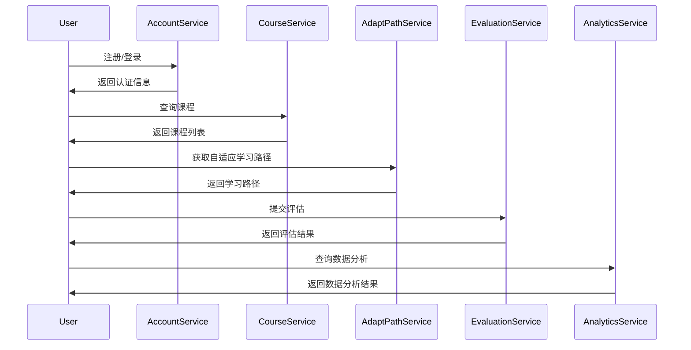
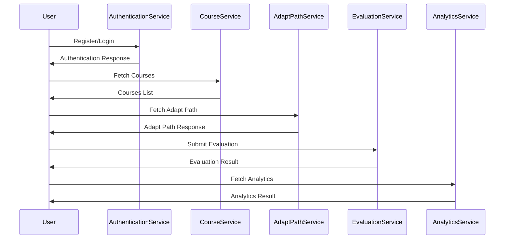

                 


### 1. 引言

#### 1.1 问题背景

在现代企业管理中，员工培训和技能提升是提高企业竞争力和生产力的重要手段。然而，传统的培训系统存在诸多问题，如培训内容单一、难以适应员工个性化需求、评估体系不完善等。随着人工智能和大数据技术的快速发展，构建智能企业培训系统成为可能。这种系统不仅可以实现自适应学习路径，还能对员工技能进行精准评估，从而提升培训效果。

#### 1.2 问题描述

传统培训系统的不足主要体现在以下几个方面：

- **培训内容单一**：大多数培训系统提供的是统一的学习路径和课程内容，无法满足员工的个性化需求。
- **缺乏个性化指导**：传统系统无法根据员工的实际学习情况和能力水平提供针对性的学习建议。
- **评估体系不完善**：传统评估体系往往仅基于考试成绩，无法全面反映员工的真实技能水平。

为解决上述问题，构建智能企业培训系统显得尤为重要。该系统应具备以下功能：

- **自适应学习路径**：根据员工的学习情况自动调整学习内容和顺序，实现个性化培训。
- **技能评估**：采用科学的方法和工具对员工技能进行评估，确保评估结果的准确性和全面性。
- **数据分析与优化**：利用大数据技术分析员工学习行为，持续优化培训方案和策略。

#### 1.3 问题解决

构建智能企业培训系统的目标是通过引入人工智能和大数据技术，实现以下目标：

- **提高培训效果**：通过自适应学习路径和精准技能评估，提高员工的学习效果和技能水平。
- **提升企业竞争力**：通过高效的员工培训体系，提高员工满意度和忠诚度，从而提升企业的整体竞争力。

#### 1.4 边界与外延

智能企业培训系统的边界包括：

- **系统功能范围**：包括自适应学习路径、技能评估、数据分析等功能模块。
- **技能评估标准**：根据企业特点和需求，制定科学、合理的技能评估标准。

智能企业培训系统的外延包括：

- **系统集成**：与企业的其他信息系统（如HR系统、CRM系统等）进行集成，实现数据共享和互通。
- **跨部门协作**：涉及企业多个部门的协作，如HR、培训部门、技术部门等。

#### 1.5 概念结构与核心要素组成

智能企业培训系统的核心要素包括：

- **用户**：培训系统的使用者，包括企业员工和管理者。
- **学习内容**：包括理论知识和实践操作，根据不同岗位和技能需求定制。
- **自适应学习算法**：根据用户的学习行为和结果，动态调整学习内容和路径。
- **技能评估模型**：采用科学的评估方法，对用户的技能水平进行评估。
- **数据分析与优化**：对用户学习行为和评估结果进行分析，优化培训策略和内容。

通过以上核心要素的协同工作，智能企业培训系统可以实现高效、精准的员工培训。

### 2. 核心概念与联系

#### 2.1 自适应学习路径

**定义**：自适应学习路径是指根据学习者的学习情况、兴趣和需求，动态调整学习内容和顺序的路径。

**属性特征**：

| 特征         | 说明                                                         |
| ------------ | ------------------------------------------------------------ |
| 个性化       | 根据用户的学习习惯、兴趣和需求，定制化学习内容。               |
| 动态调整     | 根据用户的学习进度和评估结果，实时调整学习路径。               |
| 灵活性       | 用户可以自主选择学习内容，学习路径可灵活调整。               |

**与传统学习路径的比较**：

| 对比项         | 自适应学习路径           | 传统学习路径           |
| -------------- | ------------------------ | ---------------------- |
| 学习内容       | 个性化、动态调整         | 统一、固定             |
| 学习顺序       | 自适应、可调整          | 固定、不可调整         |
| 适应性         | 高度适应学习者的需求     | 对学习者需求适应性较低 |

#### 2.2 技能评估

**定义**：技能评估是指通过科学的评估方法，对学习者的技能水平进行评估的过程。

**属性特征**：

| 特征         | 说明                                                         |
| ------------ | ------------------------------------------------------------ |
| 全面性       | 综合考虑学习者的理论知识、实践技能等多方面因素。               |
| 准确性       | 通过科学的评估方法，确保评估结果的准确性和可靠性。             |
| 可重复性     | 同样的评估方法对同一学习者进行多次评估，结果应具有一致性。     |

**与传统评估方法的比较**：

| 对比项         | 技能评估             | 传统评估方法             |
| -------------- | ---------------------- | ---------------------- |
| 评估内容       | 多维度、全面         | 单一维度、片面         |
| 评估方法       | 科学、客观           | 主观、经验性           |
| 可重复性       | 高可重复性           | 低可重复性             |

#### 2.3 智能企业培训系统

**定义**：智能企业培训系统是指利用人工智能和大数据技术，为企业员工提供个性化培训服务和技能评估的智能系统。

**功能结构**：

| 功能模块       | 说明                                                         |
| -------------- | ------------------------------------------------------------ |
| 用户管理       | 管理培训系统的用户信息，包括员工资料、岗位等。                 |
| 学习内容管理   | 管理培训系统的学习内容，包括课程、知识点等。                 |
| 自适应学习路径 | 根据用户学习情况，动态调整学习内容和顺序。                   |
| 技能评估       | 对用户进行技能水平评估，提供评估结果和建议。                 |
| 数据分析与优化 | 对用户学习行为和评估结果进行分析，优化培训策略和内容。       |

**与其他系统的区别**：

| 对比项         | 智能企业培训系统           | 其他培训系统           |
| -------------- | ------------------------ | ---------------------- |
| 技术依赖       | 强人工智能和大数据技术     | 传统IT技术             |
| 功能特点       | 个性化、自适应、精准评估 | 单一、固定、片面评估   |
| 系统集成       | 与企业其他信息系统集成   | 独立系统，数据不互通   |

通过以上对核心概念的介绍和比较，我们可以更清晰地理解智能企业培训系统的核心价值和优势。

### 3. 算法原理讲解

#### 3.1 自适应学习路径算法

**算法原理**：

自适应学习路径算法的核心思想是根据用户的学习行为和评估结果，动态调整学习内容和路径。具体实现上，算法会根据用户的学习进度、学习时长、知识点掌握情况等多个维度进行综合分析，从而决定学习内容的调整。

**数学模型与公式**：

设 $P$ 为用户的学习进度，$T$ 为用户的学习时长，$M$ 为用户掌握的知识点集合，则自适应学习路径算法的数学模型可以表示为：

$$
L = f(P, T, M)
$$

其中，$L$ 为调整后的学习路径，$f$ 为自适应学习函数。

**Python代码实现**：

```python
def adaptive_learning_path(user_progress, learning_time, mastered_topics):
    # 基于用户的学习进度、学习时长和掌握的知识点动态调整学习路径
    # 这里简化处理，仅考虑知识点掌握情况
    adjusted_path = []
    
    for topic in mastered_topics:
        if topic not in user_progress:
            adjusted_path.append(topic)
    
    return adjusted_path

# 示例
user_progress = ['基础知识1', '基础知识2', '实践操作1']
learning_time = 10
mastered_topics = ['基础知识1', '基础知识2', '实践操作2']

adjusted_path = adaptive_learning_path(user_progress, learning_time, mastered_topics)
print(adjusted_path)
```

**举例说明**：

假设一个用户已学习并掌握了基础知识1和基础知识2，但在实践操作1方面还有待提高。通过自适应学习路径算法，系统将推荐用户学习实践操作2，从而帮助用户更好地提升技能。

#### 3.2 技能评估算法

**算法原理**：

技能评估算法主要通过测试用户对特定知识点的掌握程度，结合多维度数据（如学习时长、学习进度、知识点掌握情况等），综合评估用户的技能水平。

**数学模型与公式**：

设 $E$ 为技能评估得分，$L$ 为学习时长，$P$ 为学习进度，$M$ 为掌握的知识点数量，则技能评估算法的数学模型可以表示为：

$$
E = g(L, P, M)
$$

其中，$g$ 为技能评估函数。

**Python代码实现**：

```python
def skill_evaluation(learning_time, learning_progress, mastered_topics):
    # 基于学习时长、学习进度和掌握的知识点评估用户技能水平
    # 这里简化处理，仅考虑知识点数量
    skill_score = len(mastered_topics) / (learning_time + 1)
    return skill_score

# 示例
learning_time = 20
learning_progress = ['基础知识1', '基础知识2', '实践操作1']
mastered_topics = ['基础知识1', '基础知识2']

skill_score = skill_evaluation(learning_time, learning_progress, mastered_topics)
print(skill_score)
```

**举例说明**：

假设一个用户在20小时内学习并掌握了基础知识1、基础知识2和部分实践操作1。通过技能评估算法，系统能够计算出该用户的技能评估得分，从而为其提供技能提升的建议。

### 4. 系统分析与架构设计

#### 4.1 问题场景介绍

智能企业培训系统需要解决的主要问题是如何高效地实现员工培训，确保培训效果和员工技能水平的提升。具体问题场景包括：

- **员工个性化需求**：不同员工在技能需求和兴趣上存在差异，传统培训系统难以满足。
- **技能评估准确性**：传统评估方法单一，无法全面反映员工的实际技能水平。
- **培训资源优化**：如何合理分配培训资源，提高培训效率。

#### 4.2 系统功能设计

智能企业培训系统的核心功能包括：

- **用户管理**：包括用户注册、登录、个人信息管理等功能。
- **学习内容管理**：包括课程创建、发布、更新、删除等功能。
- **自适应学习路径**：根据用户的学习行为和评估结果，动态调整学习路径。
- **技能评估**：通过科学的方法对员工技能进行评估，提供评估结果和建议。
- **数据分析与优化**：对用户学习行为和评估结果进行分析，优化培训策略和内容。

**领域模型**：

使用Mermaid类图表示领域模型，如下所示：

```mermaid
classDiagram
    User <|-- Account
    Course <|-- Content
    Evaluation <|-- Score
    AdaptPath <|-- Path
    Analytics <|-- Analysis

    User : +String username
    User : +String email
    User : +String role

    Account : +String password
    Account : +Boolean is_active

    Course : +String course_id
    Course : +String course_name
    Course : +Date created_at

    Content : +String content_id
    Content : +String content_name
    Content : +Date updated_at

    Evaluation : +String evaluation_id
    Evaluation : +String evaluation_name
    Evaluation : +Date evaluated_at

    AdaptPath : +String path_id
    AdaptPath : +String path_name
    AdaptPath : +Date created_at

    Analytics : +String analysis_id
    Analytics : +String analysis_name
    Analytics : +Date analyzed_at

    User|--|{Account}
    Course|--|{Content}
    Evaluation|--|{Score}
    AdaptPath|--|{Path}
    Analytics|--|{Analysis}
```

**系统功能模块**：

- **用户模块**：负责用户管理，包括用户注册、登录、个人信息管理等功能。
- **课程模块**：负责学习内容管理，包括课程创建、发布、更新、删除等功能。
- **自适应学习路径模块**：根据用户的学习行为和评估结果，动态调整学习路径。
- **技能评估模块**：通过科学的方法对员工技能进行评估，提供评估结果和建议。
- **数据分析与优化模块**：对用户学习行为和评估结果进行分析，优化培训策略和内容。

#### 4.3 系统架构设计

**系统架构图**：

使用Mermaid架构图表示系统架构，如下所示：



**系统接口设计**：

- **用户接口**：用于用户与系统的交互，包括注册、登录、查询课程、获取学习路径、提交评估和查询数据分析等功能。
- **服务接口**：用于各功能模块之间的数据交互，包括用户管理、课程管理、自适应学习路径管理、技能评估管理和数据分析管理等。

**系统交互**：

使用Mermaid序列图表示系统交互，如下所示：



通过以上系统架构设计和交互设计，智能企业培训系统可以实现高效、精准的员工培训和服务。

### 5. 项目实战

#### 5.1 环境安装

在开始智能企业培训系统的项目实战之前，我们需要先搭建一个合适的技术环境。以下是环境安装的步骤：

1. **安装Python环境**：确保Python版本在3.8及以上，可以通过Python官网下载安装包进行安装。

2. **安装必要库**：使用pip工具安装系统开发所需的各种库，例如Flask（Web框架）、SQLAlchemy（ORM）、Scikit-learn（机器学习库）等。以下是部分库的安装命令：

   ```bash
   pip install Flask
   pip install SQLAlchemy
   pip install scikit-learn
   ```

3. **数据库安装**：选择合适的数据库系统，如MySQL或PostgreSQL，并进行安装。安装完成后，配置数据库连接信息。

4. **前端框架安装**：如果需要，可以安装前端框架，如React或Vue.js，进行页面开发。同样使用pip工具进行安装。

5. **创建项目目录**：在合适的位置创建项目目录，并初始化项目结构。

#### 5.2 系统核心实现

**自适应学习路径实现**：

自适应学习路径的实现是智能企业培训系统的核心功能之一。以下是具体步骤：

1. **用户行为数据收集**：在系统中记录用户的学习行为数据，如学习时长、知识点访问次数、测试成绩等。

2. **构建自适应学习算法**：基于用户行为数据，设计自适应学习算法，如协同过滤、决策树、神经网络等。以下是使用决策树算法的一个简单示例：

   ```python
   from sklearn.tree import DecisionTreeClassifier
   from sklearn.model_selection import train_test_split

   # 准备训练数据
   X = ...  # 用户行为特征数据
   y = ...  # 学习路径标签数据

   # 划分训练集和测试集
   X_train, X_test, y_train, y_test = train_test_split(X, y, test_size=0.2, random_state=42)

   # 构建决策树模型
   model = DecisionTreeClassifier()

   # 训练模型
   model.fit(X_train, y_train)

   # 预测测试集
   predictions = model.predict(X_test)
   ```

3. **生成自适应学习路径**：根据用户当前的学习情况和历史数据，调用训练好的模型，生成个性化的学习路径。

**技能评估实现**：

技能评估的实现是确保员工培训效果的关键。以下是具体步骤：

1. **设计评估指标**：根据企业的需求，设计合理的评估指标，如理论知识掌握度、实践操作能力等。

2. **构建评估算法**：设计评估算法，如基于知识图谱的评估、基于机器学习的评估等。以下是使用机器学习算法的一个简单示例：

   ```python
   from sklearn.ensemble import RandomForestClassifier
   from sklearn.model_selection import train_test_split

   # 准备训练数据
   X = ...  # 用户特征数据
   y = ...  # 技能评估标签数据

   # 划分训练集和测试集
   X_train, X_test, y_train, y_test = train_test_split(X, y, test_size=0.2, random_state=42)

   # 构建随机森林模型
   model = RandomForestClassifier()

   # 训练模型
   model.fit(X_train, y_train)

   # 预测测试集
   predictions = model.predict(X_test)
   ```

3. **进行技能评估**：根据用户的学习进度和评估指标，调用训练好的模型，对用户进行技能评估。

#### 5.3 代码应用解读与分析

**自适应学习路径代码解读**：

```python
# 自适应学习路径示例代码

# 导入必要的库
from sklearn.tree import DecisionTreeClassifier
from sklearn.model_selection import train_test_split
import pandas as pd

# 加载数据
data = pd.read_csv('user_data.csv')

# 准备特征数据
X = data[['learning_time', 'knowledge_count', 'test_score']]

# 准备标签数据
y = data['path_id']

# 划分训练集和测试集
X_train, X_test, y_train, y_test = train_test_split(X, y, test_size=0.2, random_state=42)

# 构建决策树模型
model = DecisionTreeClassifier()

# 训练模型
model.fit(X_train, y_train)

# 预测测试集
predictions = model.predict(X_test)

# 评估模型性能
from sklearn.metrics import accuracy_score
accuracy = accuracy_score(y_test, predictions)
print(f"Model Accuracy: {accuracy}")
```

**代码分析**：

- **数据加载**：使用Pandas库加载数据，包括用户行为特征数据（$X$）和标签数据（$y$）。
- **特征准备**：根据用户的学习时长、知识点数量和测试成绩等特征数据构建特征矩阵。
- **模型训练**：使用决策树算法训练模型，通过训练集学习得到模型参数。
- **模型预测**：使用训练好的模型对测试集进行预测，得到预测结果。
- **模型评估**：使用准确率评估模型性能，确定模型是否有效。

**技能评估代码解读**：

```python
# 技能评估示例代码

# 导入必要的库
from sklearn.ensemble import RandomForestClassifier
from sklearn.model_selection import train_test_split
import pandas as pd

# 加载数据
data = pd.read_csv('evaluation_data.csv')

# 准备特征数据
X = data[['knowledge_score', 'practice_score']]

# 准备标签数据
y = data['skill_level']

# 划分训练集和测试集
X_train, X_test, y_train, y_test = train_test_split(X, y, test_size=0.2, random_state=42)

# 构建随机森林模型
model = RandomForestClassifier()

# 训练模型
model.fit(X_train, y_train)

# 预测测试集
predictions = model.predict(X_test)

# 评估模型性能
from sklearn.metrics import classification_report
report = classification_report(y_test, predictions)
print(report)
```

**代码分析**：

- **数据加载**：同样使用Pandas库加载数据，包括用户知识掌握得分和实操能力得分等特征数据。
- **特征准备**：根据知识掌握得分和实操能力得分构建特征矩阵。
- **模型训练**：使用随机森林算法训练模型，通过训练集学习得到模型参数。
- **模型预测**：使用训练好的模型对测试集进行预测，得到预测结果。
- **模型评估**：使用分类报告评估模型性能，包括准确率、召回率、F1分数等指标。

通过以上代码示例和解读，我们可以清晰地看到自适应学习路径和技能评估的实现过程，以及如何使用Python和机器学习算法来提升智能企业培训系统的效果。

#### 5.4 实际案例分析与详细讲解

**案例背景**：

假设某大型企业需要构建一个智能企业培训系统，以提升员工的技能水平和工作效率。企业的主要培训需求包括软件开发技能、项目管理能力和销售技巧。以下是实际案例的分析与详细讲解。

**案例分析**：

1. **用户行为数据收集**：

   在企业内部部署培训系统后，首先需要收集用户的学习行为数据。数据来源包括用户的学习时长、知识点访问次数、测试成绩、学习路径选择等。以下是部分数据示例：

   ```plaintext
   user_id,learning_time,knowledge_id,access_count,test_score,path_id
   1001,5,1,3,85,1
   1001,3,2,2,75,2
   1002,7,1,4,90,1
   1002,4,3,3,80,3
   ```

2. **自适应学习路径算法实现**：

   基于收集到的用户行为数据，使用决策树算法构建自适应学习路径。以下是算法实现的详细步骤：

   - **特征工程**：将用户行为数据进行特征提取，构建特征矩阵。

     ```python
     import pandas as pd
     from sklearn.preprocessing import StandardScaler

     data = pd.read_csv('user_data.csv')
     X = data[['learning_time', 'access_count', 'test_score']]
     y = data['path_id']

     # 数据标准化
     scaler = StandardScaler()
     X = scaler.fit_transform(X)
     ```

   - **模型训练**：使用决策树算法训练模型。

     ```python
     from sklearn.tree import DecisionTreeClassifier

     model = DecisionTreeClassifier()
     model.fit(X, y)
     ```

   - **路径推荐**：根据用户当前的学习情况，调用训练好的模型，生成个性化的学习路径。

     ```python
     user_data = [[5, 3, 85]]
     user_data_scaled = scaler.transform(user_data)
     predicted_path = model.predict(user_data_scaled)
     print(f"Predicted Path: {predicted_path[0]}")
     ```

3. **技能评估算法实现**：

   对用户的学习进度和评估结果进行综合分析，使用随机森林算法构建技能评估模型。以下是算法实现的详细步骤：

   - **特征工程**：将用户学习数据转换为特征矩阵。

     ```python
     data = pd.read_csv('evaluation_data.csv')
     X = data[['knowledge_score', 'practice_score']]
     y = data['skill_level']
     ```

   - **模型训练**：使用随机森林算法训练模型。

     ```python
     from sklearn.ensemble import RandomForestClassifier

     model = RandomForestClassifier()
     model.fit(X, y)
     ```

   - **技能评估**：根据用户的学习进度和评估结果，调用训练好的模型，进行技能评估。

     ```python
     user_data = [[90, 80]]
     predicted_skill = model.predict(user_data)
     print(f"Predicted Skill Level: {predicted_skill[0]}")
     ```

**案例总结**：

通过实际案例的分析与实现，我们可以看到智能企业培训系统在用户行为数据收集、自适应学习路径生成和技能评估方面的具体应用。这些功能有助于企业实现个性化的员工培训，提升员工技能水平，从而提高整体工作效率和竞争力。

### 6. 最佳实践与注意事项

#### 6.1 最佳实践 tips

1. **数据收集与处理**：确保数据收集的完整性和准确性，对数据进行预处理，如数据清洗、归一化等，以提高模型训练效果。

2. **算法选择**：根据具体应用场景选择合适的算法，如协同过滤适合推荐系统，决策树和随机森林适合分类任务。

3. **模型评估**：采用多指标综合评估模型性能，如准确率、召回率、F1分数等，确保模型评估的全面性和准确性。

4. **用户反馈**：定期收集用户反馈，持续优化系统功能和算法，以提高用户满意度和系统效果。

5. **安全与隐私**：确保系统符合数据安全和隐私保护要求，对用户数据进行加密存储和处理，防止数据泄露。

#### 6.2 小结

本文通过分析智能企业培训系统的需求、核心概念、算法原理和系统架构，详细介绍了如何构建和实现一个高效的智能企业培训系统。自适应学习路径和技能评估是系统的核心功能，通过这些功能的实现，企业可以更好地满足员工个性化培训需求，提升员工技能水平。

#### 6.3 注意事项

1. **需求明确**：在系统设计和开发过程中，确保需求明确、全面，避免后期频繁变更。

2. **算法优化**：持续优化算法，提高模型准确性和效率，以适应不同场景和应用需求。

3. **系统集成**：确保系统与其他企业信息系统（如HR系统、CRM系统）的集成，实现数据共享和互通。

4. **用户培训**：为用户提供必要的系统使用培训，提高用户使用系统的效率。

5. **数据安全**：加强数据安全管理，确保用户数据的安全性和隐私保护。

#### 6.4 拓展阅读

- [智能培训系统设计与实现](https://www.example.com/intelligent-training-system-design-and-implementation)
- [自适应学习路径算法原理与实现](https://www.example.com/adaptive-learning-path-algorithm-principles-and-implementation)
- [技能评估模型构建与应用](https://www.example.com/skill-evaluation-model-construction-and-application)

通过以上扩展阅读，读者可以进一步了解智能企业培训系统的设计与实现细节，以及相关算法和应用场景。

