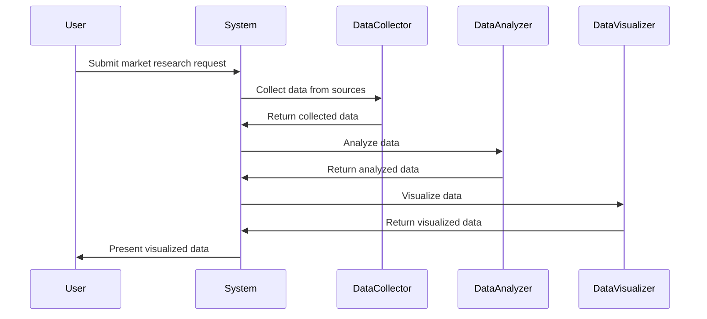
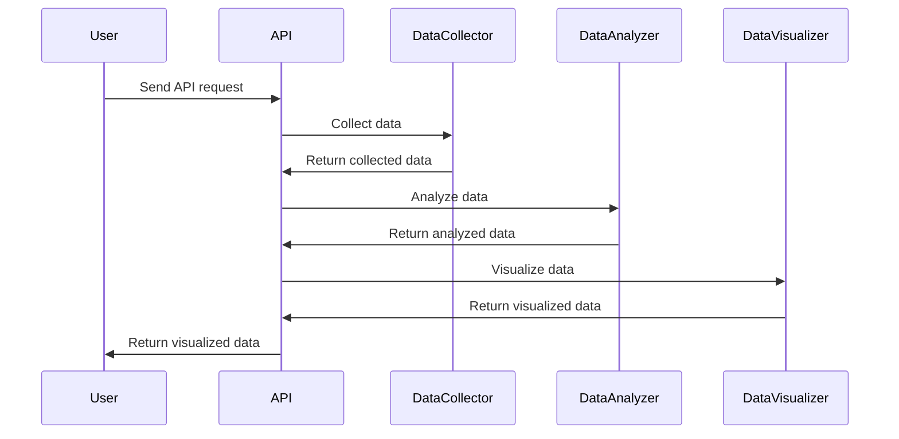

                 


# 构建智能企业市场调研系统：自动化数据收集与分析

关键词：市场调研、智能系统、自动化数据收集、数据分析、商业策略

摘要：随着大数据、云计算和人工智能技术的发展，构建智能企业市场调研系统已成为企业提高决策效率、优化资源配置的重要手段。本文从背景介绍、核心概念、算法原理、系统分析与架构设计等方面，详细阐述了如何构建一个智能企业市场调研系统，实现自动化数据收集与分析，为企业提供数据驱动的商业策略。

## 第一部分：背景介绍与核心概念

### 1.1 问题背景

随着大数据、云计算、人工智能等技术的迅猛发展，企业对市场调研的需求日益增加。传统的市场调研方式已经难以满足现代企业对于实时性、精确性和全面性的要求。构建智能企业市场调研系统，利用自动化数据收集与分析技术，成为提高企业决策效率、优化资源配置的重要手段。

### 1.1.1 问题描述

智能企业市场调研系统需解决以下问题：

- **如何实现自动化数据收集？**：利用爬虫技术、API接口、传感器等手段，实现数据的自动化收集。
- **如何对海量数据进行实时分析？**：采用大数据处理技术，如Hadoop、Spark等，对收集到的数据进行分析处理。
- **如何将分析结果转化为可操作的商业策略？**：基于分析结果，运用数据可视化工具，将分析结果转化为直观的商业策略。

### 1.1.2 问题解决

通过构建智能企业市场调研系统，实现以下目标：

- **自动化数据收集**：利用爬虫技术、API接口、传感器等手段，实现数据的自动化收集。
- **实时数据分析**：采用大数据处理技术，如Hadoop、Spark等，对收集到的数据进行分析处理。
- **商业策略转化**：基于分析结果，运用数据可视化工具，将分析结果转化为直观的商业策略。

### 1.1.3 边界与外延

- **数据源**：包括网站、社交媒体、企业内部数据库等。
- **技术范围**：大数据处理、机器学习、数据挖掘、数据可视化。
- **应用场景**：市场营销、产品研发、供应链管理、客户服务等领域。

### 1.1.4 核心概念与联系

- **数据收集**：自动化数据收集、API接口、爬虫技术。
- **数据分析**：实时数据分析、大数据处理、机器学习。
- **商业策略**：数据可视化、商业智能、策略制定。

## 第二部分：核心概念与联系

### 2.1 数据收集

#### 2.1.1 自动化数据收集技术

- **爬虫技术**：通过模拟人工操作，自动化获取网站数据。
- **API接口**：通过调用第三方数据服务，获取数据。
- **传感器**：通过物联网技术，收集实时数据。

### 2.2 数据分析

#### 2.2.1 实时数据分析

- **Hadoop**：分布式数据处理平台，适用于大规模数据处理。
- **Spark**：快速大数据处理引擎，支持实时数据处理。

#### 2.2.2 机器学习与数据挖掘

- **机器学习算法**：如分类、回归、聚类等，用于数据模式识别。
- **数据挖掘**：从大量数据中提取有价值的信息和知识。

### 2.3 数据可视化与商业策略

#### 2.3.1 数据可视化

- **数据可视化工具**：如Tableau、PowerBI等，用于展示分析结果。
- **商业智能**：通过数据分析和可视化，辅助商业决策。

#### 2.3.2 商业策略

- **策略制定**：基于数据分析结果，制定相应的市场营销、产品研发、供应链管理策略。
- **数据驱动决策**：通过数据分析和商业策略，提高企业决策的准确性和效率。

## 第三部分：算法原理讲解

### 3.1 数据收集算法原理

#### 3.1.1 爬虫算法原理

- **工作流程**：URL队列、下载器、解析器、存储器。
- **爬虫策略**：深度优先、广度优先、限制爬取频率。

#### 3.1.2 API接口数据收集

- **API请求**：利用HTTP请求，获取数据。
- **API调用策略**：轮询、异步调用、限流。

### 3.2 数据分析算法原理

#### 3.2.1 实时数据分析算法

- **Hadoop工作原理**：分布式存储与计算。
- **Spark工作原理**：内存计算、弹性调度。

#### 3.2.2 机器学习算法

- **分类算法**：决策树、支持向量机、神经网络。
- **回归算法**：线性回归、逻辑回归。
- **聚类算法**：K-means、DBSCAN。

### 3.3 数据可视化算法原理

#### 3.3.1 数据可视化技术

- **数据可视化组件**：图表、地图、仪表盘。
- **数据可视化策略**：颜色、形状、交互。

## 第四部分：系统分析与架构设计

### 4.1 问题场景介绍

- **市场调研需求**：实时监控市场动态、消费者需求。
- **企业应用场景**：市场营销、产品研发、客户关系管理。

#### 4.1.1 项目介绍

- **项目目标**：构建一个智能企业市场调研系统，实现数据收集、分析、可视化。
- **项目范围**：包括数据收集模块、数据分析模块、数据可视化模块。

### 4.2 系统功能设计

#### 4.2.1 数据收集模块

- **功能需求**：自动化数据收集、API接口调用、传感器数据采集。
- **领域模型**：（使用Mermaid类图表示）

```mermaid
classDiagram
DataCollector <<interface>>
Database <<interface>>

DataCollector|-
+----------------+
| DataCollector |
+----------------+
| -urlQueue: List |
| -downloader: Object |
| -parser: Object |
| -storage: Object |
+----------------+
| +collectData(url: String): List |
| +saveData(data: List): None |
+----------------+

Database|-
+----------------+
| Database |
+----------------+
| -connection: Object |
| -table: List |
+----------------+
| +queryData(query: String): List |
| +updateData(data: List): None |
+----------------+
```

### 4.3 系统架构设计

- **系统架构设计**：（使用Mermaid架构图表示）



### 4.4 系统接口设计与交互

- **系统接口设计**：（使用Mermaid序列图表示）



## 第五部分：项目实战

### 5.1 环境安装

- **安装Python环境**：在本地计算机上安装Python 3.8及以上版本。
- **安装相关库**：使用pip安装requests、beautifulsoup4、scikit-learn、hadoop、spark等库。

### 5.2 系统核心实现

- **数据收集模块**：实现爬虫技术、API接口调用、传感器数据采集功能。
- **数据分析模块**：实现实时数据分析、机器学习算法、数据挖掘功能。
- **数据可视化模块**：实现数据可视化工具、商业智能功能。

### 5.3 代码应用解读与分析

- **代码解读**：对系统核心代码进行解读，分析各模块的实现原理和功能。
- **案例分析**：通过实际案例，展示系统在市场调研中的应用效果。

### 5.4 实际案例分析

- **案例一**：分析消费者行为，挖掘潜在客户。
- **案例二**：监控市场动态，预测产品销量。
- **案例三**：优化供应链管理，提高生产效率。

### 5.5 项目小结

- **项目总结**：回顾项目目标、实现过程和成果。
- **经验教训**：总结项目中的经验和教训，为后续项目提供参考。

## 第六部分：最佳实践 tips

- **数据收集**：遵循法律法规，确保数据来源的合法性和合规性。
- **数据分析**：注重数据质量，确保分析结果的准确性和可靠性。
- **数据可视化**：选择合适的可视化工具，提高数据展示的直观性和易读性。

## 第七部分：小结与注意事项

- **小结**：本文从背景介绍、核心概念、算法原理、系统分析与架构设计等方面，详细阐述了如何构建一个智能企业市场调研系统，实现自动化数据收集与分析。
- **注意事项**：在实际应用中，要关注数据安全、隐私保护等问题，确保系统的稳定运行和可持续发展。

## 第八部分：拓展阅读

- **相关书籍**：《大数据时代》、《机器学习实战》、《数据可视化实战》等。
- **技术文档**：查阅相关技术框架和工具的官方文档，深入了解其原理和用法。
- **学术期刊**：《计算机学报》、《人工智能学报》等，了解市场调研领域的最新研究成果。

作者：AI天才研究院/AI Genius Institute & 禅与计算机程序设计艺术 /Zen And The Art of Computer Programming

