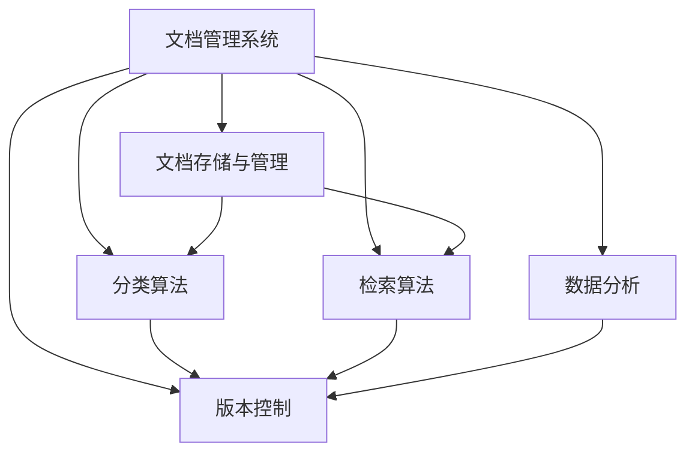
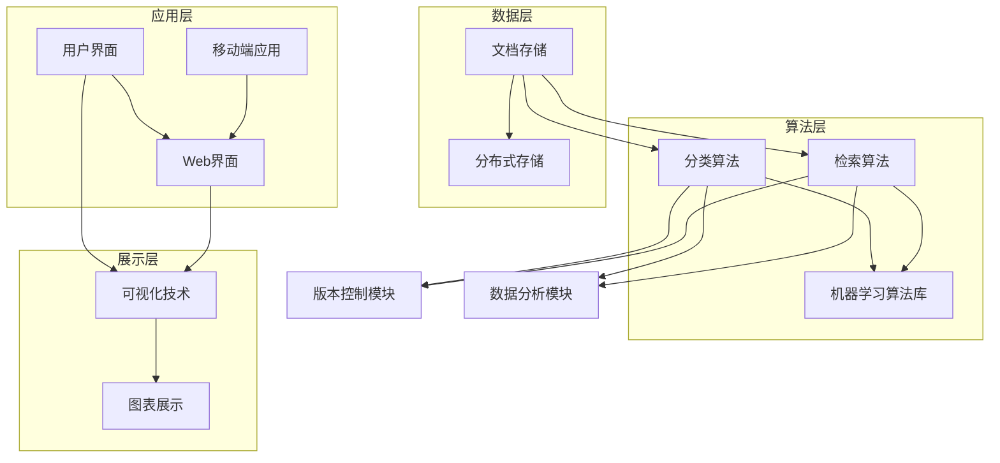
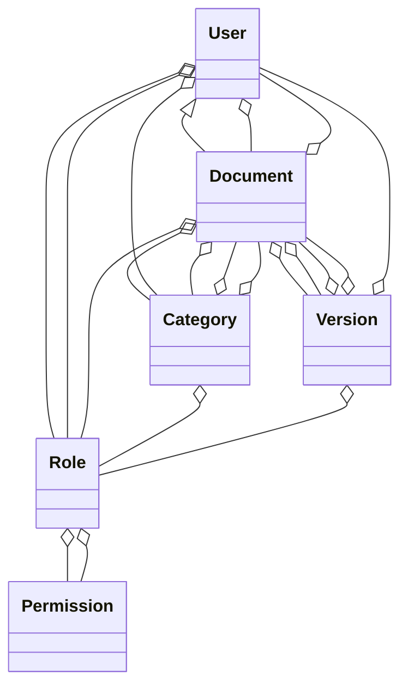
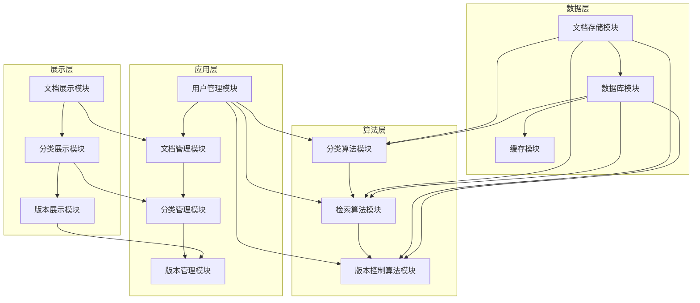
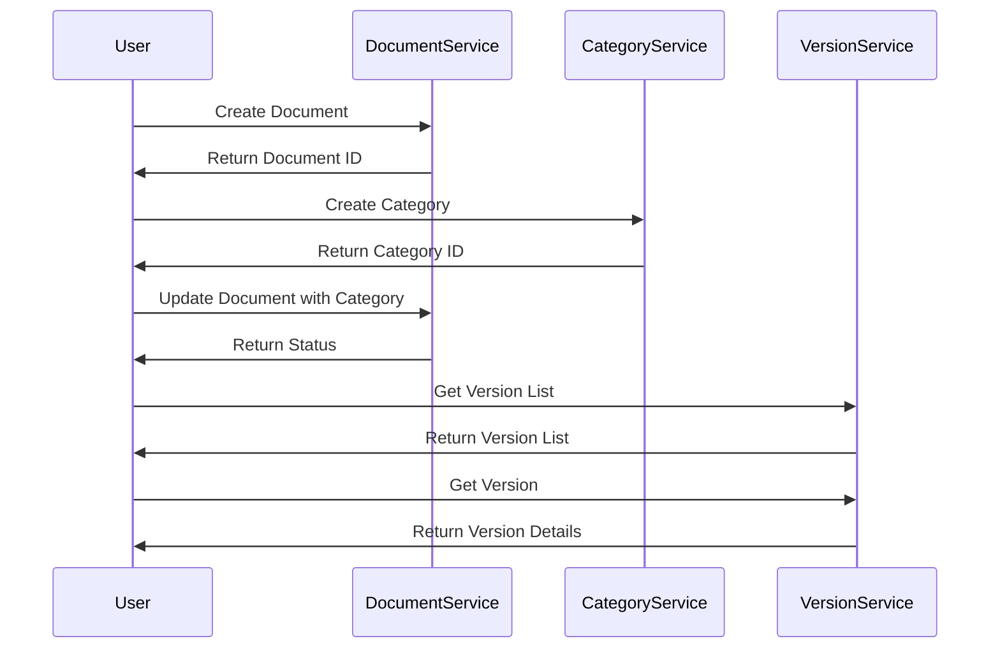

                 


## 1.1 问题背景

### 1.1.1 企业文档管理的挑战

在企业日常运营中，文档管理是一个至关重要的环节。随着企业规模和业务复杂度的增加，文档的数量和种类也在不断增长。传统的文档管理方式往往依赖于人工分类、存储和检索，这不仅效率低下，而且容易出错。具体来说，企业文档管理面临以下挑战：

1. **文档数量庞大**：企业内部产生的文档种类繁多，包括报告、合同、邮件、客户信息等，数量庞大，给文档管理带来了巨大压力。

2. **分类困难**：不同类型的文档可能包含相同的关键词，传统的分类方法难以准确区分，导致文档分类困难。

3. **检索效率低**：人工检索文档效率低下，特别是在面对海量数据时，容易遗漏重要文档，影响工作效率。

4. **版本控制问题**：文档的版本控制是文档管理中的难点，如何确保每个文档的最新版本能够被正确地存储和使用，需要高效的版本管理机制。

5. **数据安全与隐私**：随着信息安全意识的提高，如何保护文档数据的安全和用户隐私成为一个重要问题。

### 1.1.2 智能文档管理系统的重要性

为了解决上述挑战，企业需要引入智能文档管理系统。这种系统能够利用人工智能技术，特别是AI辅助分类与检索，实现文档的自动分类、高效检索、版本控制和数据安全保护。智能文档管理系统的重要性体现在以下几个方面：

1. **提高工作效率**：通过自动分类和检索，员工可以快速找到所需的文档，大大提高工作效率。

2. **减少人工错误**：智能系统能够准确地识别和分类文档，减少人工分类和检索过程中可能出现的错误。

3. **优化资源利用**：智能系统可以节省大量的人力资源，将这些资源用于更有价值的工作。

4. **加强数据安全性**：智能系统能够提供强大的权限管理和加密技术，确保文档数据的安全性和用户隐私。

5. **支持智能决策**：通过对文档内容的分析，智能系统可以为企业管理层提供决策支持，帮助企业做出更加明智的决策。

### 1.1.3 AI辅助分类与检索的关键作用

AI辅助分类与检索是智能文档管理系统的核心组成部分。AI技术能够通过以下方式提升文档管理系统的效能：

1. **自动化分类**：利用机器学习和自然语言处理技术，AI系统能够自动识别文档内容，将其归类到相应的类别中。

2. **精准检索**：通过深度学习和图谱搜索技术，AI系统能够快速准确地检索出用户需要的文档。

3. **个性化推荐**：AI系统能够根据用户的搜索习惯和偏好，为用户提供个性化的文档推荐。

4. **智能版本控制**：AI系统能够自动识别文档的版本，并提供便捷的版本管理功能。

5. **知识图谱构建**：通过文档内容的关联分析，AI系统能够构建知识图谱，帮助企业发现文档之间的内在联系。

## 1.2 问题解决

### 1.2.1 智能文档管理系统概述

智能文档管理系统（IDMS）是一种利用人工智能技术，特别是机器学习和自然语言处理技术，对企业文档进行自动化分类、检索、版本控制和数据分析的系统。它主要由以下几个核心模块组成：

1. **文档存储模块**：负责存储和管理企业内部所有的文档，包括文本、图片、音频、视频等多种格式。

2. **分类与标签模块**：利用机器学习算法，自动对文档进行分类和标签，以便于后续的检索和管理。

3. **检索与推荐模块**：结合自然语言处理和图谱搜索技术，实现高效的文档检索和个性化推荐。

4. **版本控制模块**：自动跟踪文档的版本变化，并提供版本管理和权限控制功能。

5. **数据分析模块**：通过对文档内容进行分析，提取关键信息，为企业管理层提供数据支持。

### 1.2.2 AI辅助分类与检索概述

AI辅助分类与检索是智能文档管理系统的核心功能，其基本原理如下：

1. **分类算法**：利用机器学习算法，如KNN、SVM、决策树等，对文档内容进行分析，将其归类到相应的类别中。

2. **检索算法**：结合自然语言处理和图谱搜索技术，实现对文档的精准检索和推荐。

3. **关联分析**：通过分析文档之间的关联关系，构建知识图谱，为企业提供数据支持和智能决策。

### 1.2.3 系统设计目标与架构

智能文档管理系统的设计目标主要包括以下几个方面：

1. **高效性**：通过AI技术，实现文档的自动化分类和高效检索，提高工作效率。

2. **准确性**：确保分类和检索的准确性，减少错误率。

3. **安全性**：提供强大的权限管理和加密技术，确保文档数据的安全和用户隐私。

4. **可扩展性**：系统应具有良好的可扩展性，能够根据企业需求进行功能扩展和性能优化。

5. **易用性**：界面友好，操作简单，便于用户快速上手。

系统架构设计包括以下几个关键层次：

1. **数据层**：负责文档的存储和管理，采用分布式存储技术，确保数据的安全性和可靠性。

2. **算法层**：包括分类和检索算法，采用最新的机器学习和自然语言处理技术，确保算法的高效性和准确性。

3. **应用层**：提供用户界面和功能模块，包括文档分类、检索、版本控制、数据分析等。

4. **展示层**：通过可视化技术，将分析结果以图表、报表等形式展示给用户。

## 1.3 边界与外延

### 1.3.1 系统边界

智能文档管理系统的边界主要包括以下几个方面：

1. **功能范围**：系统主要提供文档的自动化分类、检索、版本控制和数据分析等功能。

2. **数据范围**：系统负责管理企业内部所有类型的文档，包括文本、图片、音频、视频等。

3. **用户范围**：系统面向企业内部所有用户，包括员工、管理层、合作伙伴等。

4. **应用场景**：系统适用于各种企业文档管理场景，如企业内部文档管理、客户资料管理、项目管理等。

### 1.3.2 系统外延

智能文档管理系统的外延主要包括以下几个方面：

1. **集成扩展**：系统可以与企业其他信息系统（如ERP、CRM等）进行集成，实现数据的互通和共享。

2. **移动端应用**：提供移动端应用，方便用户随时随地访问和管理文档。

3. **云服务**：系统可以部署在云端，实现弹性扩展和高效管理。

4. **第三方服务**：可以接入第三方服务，如OCR、翻译、数据安全等，提供更丰富的功能。

### 1.3.3 系统核心要素

智能文档管理系统的核心要素包括以下几个方面：

1. **文档存储**：采用分布式存储技术，确保文档的安全性和可靠性。

2. **分类算法**：采用先进的机器学习和自然语言处理技术，实现文档的自动化分类。

3. **检索算法**：结合自然语言处理和图谱搜索技术，实现高效的文档检索。

4. **版本控制**：提供完善的版本管理和权限控制功能，确保文档版本的正确性和安全性。

5. **数据分析**：通过对文档内容进行分析，提取关键信息，为企业管理层提供数据支持。

## 1.4 概念结构与核心要素组成

### 1.4.1 文档管理系统概念结构

文档管理系统的概念结构主要包括以下几个方面：

1. **文档**：系统管理的核心对象，包括各种格式的文档，如文本、图片、音频、视频等。

2. **分类**：对文档进行归类，便于管理和检索。

3. **标签**：对文档进行标签标记，增加文档的语义信息，便于分类和检索。

4. **检索**：根据关键词或条件，快速查找所需文档。

5. **版本控制**：跟踪文档的版本变化，确保文档的版本正确性和安全性。

6. **权限管理**：设置文档访问权限，确保文档数据的安全和用户隐私。

### 1.4.2 AI辅助分类与检索核心要素

AI辅助分类与检索的核心要素主要包括以下几个方面：

1. **机器学习算法**：用于自动分类文档，如KNN、SVM、决策树等。

2. **自然语言处理**：用于处理文档文本，提取关键信息，如分词、词性标注、实体识别等。

3. **图谱搜索**：用于高效检索文档，结合自然语言处理和图论算法，实现精准检索。

4. **特征工程**：用于提取文档特征，为分类和检索提供支持，如词袋模型、TF-IDF模型、嵌入模型等。

5. **版本控制算法**：用于跟踪文档版本变化，确保版本正确性和安全性。

### 1.4.3 系统架构设计与实现

系统架构设计主要包括以下几个层次：

1. **数据层**：采用分布式存储技术，如HDFS、MongoDB等，确保文档的安全性和可靠性。

2. **算法层**：采用机器学习和自然语言处理技术，如TensorFlow、PyTorch、NLTK等，实现分类、检索和版本控制等功能。

3. **应用层**：提供用户界面和功能模块，如Web界面、移动端应用等，方便用户操作。

4. **展示层**：通过可视化技术，如ECharts、D3.js等，将分析结果以图表、报表等形式展示给用户。

系统实现过程主要包括以下几个阶段：

1. **需求分析**：明确系统功能需求，设计系统架构。

2. **数据采集**：收集企业内部文档数据，进行预处理。

3. **算法开发**：开发分类、检索、版本控制等算法。

4. **系统集成**：将各个模块集成到一起，进行系统测试。

5. **部署上线**：部署到生产环境，进行实际应用。

## 1.5 本章小结

本章介绍了智能文档管理系统（IDMS）的背景、重要性以及系统设计目标和架构。通过AI辅助分类与检索技术，IDMS能够解决传统文档管理中的诸多问题，提高工作效率，确保数据安全。接下来，我们将深入探讨IDMS的核心概念与联系，包括文档管理系统、AI辅助分类算法和检索算法等。这些核心概念的理解将为后续章节的详细讲解奠定基础。 ## 2.1 文档管理系统

### 2.1.1 文档管理系统的定义与作用

文档管理系统（Document Management System，简称DMS）是一种用于存储、管理、共享和跟踪文档的系统。DMS的主要目标是提高文档管理的效率和准确性，确保文档的可用性、完整性和安全性。在信息化时代，文档管理系统已经成为各类企业、机构和个人不可或缺的工具。

**定义**：

- **文档管理系统**：指通过计算机技术和网络通信技术，对文档进行存储、分类、检索、共享、版本控制和安全保护的一整套软件系统。

**作用**：

1. **提高工作效率**：通过自动化流程和集中管理，减少人工处理文档的时间和错误率，提高工作效率。
2. **确保数据安全**：通过权限管理和加密技术，确保文档数据的安全性和用户隐私。
3. **便于文档检索**：利用索引和搜索功能，快速找到所需的文档，节省时间和精力。
4. **支持协作办公**：提供文档共享和协作编辑功能，促进团队间的沟通与协作。
5. **规范文档管理**：通过标准化的流程和规范，确保文档的规范性和一致性。

### 2.1.2 文档管理系统的核心功能

文档管理系统通常具备以下核心功能：

1. **文档存储**：提供安全、可靠的文档存储空间，支持多种文件格式。
2. **文档分类**：通过标签、分类或元数据，对文档进行分类，便于管理和检索。
3. **文档检索**：提供高效的文档检索功能，支持全文搜索、关键词搜索等。
4. **版本控制**：跟踪文档的版本变化，确保文档的版本正确性，支持版本回退。
5. **文档共享**：支持文档的共享和协作，提供权限管理，确保文档的安全。
6. **协作编辑**：支持多人在线编辑文档，实时同步修改内容。
7. **权限管理**：设置用户权限，控制文档的访问、修改和删除权限。
8. **文档审计**：记录文档的操作日志，便于审计和追溯。
9. **文档备份与恢复**：定期备份文档，确保数据的安全和可靠性，提供备份恢复功能。
10. **集成扩展**：支持与其他系统（如ERP、CRM等）的集成，实现数据的互通和共享。

### 2.1.3 文档管理系统的分类

文档管理系统可以根据不同的分类标准进行划分，常见的分类方法包括以下几种：

1. **按部署方式分类**：
   - **本地部署**：系统安装在本地服务器上，便于企业自行维护和扩展。
   - **云部署**：系统部署在云端，由第三方服务提供商进行维护和运营，用户通过互联网访问系统。

2. **按功能特点分类**：
   - **通用型文档管理系统**：适用于各类企业和机构，提供基本的文档管理功能。
   - **行业特定文档管理系统**：针对特定行业的特殊需求，提供专门的文档管理解决方案。

3. **按用户规模分类**：
   - **小型文档管理系统**：适用于小型企业和个人用户，功能较为简单。
   - **大型文档管理系统**：适用于大型企业，功能全面，支持海量文档管理。

4. **按技术架构分类**：
   - **单体架构**：所有功能模块集成在一个应用程序中，系统扩展和维护相对简单。
   - **分布式架构**：将系统功能模块分散部署，支持高性能和可扩展性。

### 2.1.4 文档管理系统的优缺点

**优点**：

1. **提高工作效率**：自动化流程和集中管理，减少人工操作和错误。
2. **确保数据安全**：权限管理和加密技术，保障文档数据的安全性和用户隐私。
3. **便于文档检索**：高效的检索功能，快速找到所需文档。
4. **支持协作办公**：文档共享和协作编辑，促进团队沟通与协作。
5. **规范文档管理**：标准化的流程和规范，提高文档管理的规范性和一致性。

**缺点**：

1. **初期投入较大**：系统部署和维护需要一定的技术投入和人力资源。
2. **学习成本较高**：用户需要适应新系统，学习使用方法和操作流程。
3. **系统扩展受限**：单体架构的系统在扩展性方面可能存在一定的限制。

### 2.1.5 文档管理系统的未来发展趋势

随着人工智能、大数据和云计算等技术的发展，文档管理系统将呈现以下发展趋势：

1. **智能化**：利用AI技术，实现自动化分类、智能检索和智能推荐。
2. **云化**：越来越多的企业选择将文档管理系统部署在云端，实现弹性扩展和高效管理。
3. **移动化**：提供移动端应用，方便用户随时随地访问和管理文档。
4. **大数据分析**：通过对文档内容的分析，提取有价值的信息，为企业管理层提供数据支持。
5. **开放集成**：实现与ERP、CRM等系统的集成，构建企业级信息化生态系统。

## 2.2 AI辅助分类算法

### 2.2.1 分类算法概述

AI辅助分类算法是文档管理系统中的重要组成部分，主要用于对文档内容进行自动化分类。分类算法的核心目标是将文档分配到正确的类别中，从而提高文档检索效率和系统智能化程度。以下介绍几种常见的分类算法及其原理。

**1. KNN算法**

**原理**：KNN（K-Nearest Neighbors）算法是一种基于实例的学习算法。它通过计算新实例与训练集中各个实例的相似度，找出最近的K个邻居，并根据这些邻居的分类结果进行投票，得出新实例的分类。

**数学模型**：

$$
\text{distance}(x, y) = \sqrt{\sum_{i=1}^{n} (x_i - y_i)^2}
$$

其中，$x$和$y$分别为两个实例的向量，$n$为特征维度。

**Python代码示例**：

```python
from sklearn.neighbors import KNeighborsClassifier
from sklearn.model_selection import train_test_split
from sklearn.datasets import load_iris

iris = load_iris()
X = iris.data
y = iris.target
X_train, X_test, y_train, y_test = train_test_split(X, y, test_size=0.2)

knn = KNeighborsClassifier(n_neighbors=3)
knn.fit(X_train, y_train)
print(knn.score(X_test, y_test))
```

**2. SVM算法**

**原理**：SVM（Support Vector Machine）算法通过寻找一个超平面，将不同类别的数据点分开。它是一种基于间隔最大化的分类算法，适用于高维空间。

**数学模型**：

$$
\text{maximize} \quad \frac{1}{2} \sum_{i=1}^{n} w_i^2 - \sum_{i=1}^{n} \xi_i
$$

约束条件：

$$
y_i (\text{w} \cdot \text{x_i} + b) \geq 1 - \xi_i
$$

$$
0 \leq \xi_i \leq C
$$

其中，$w$为权重向量，$b$为偏置项，$\xi_i$为松弛变量，$C$为惩罚参数。

**Python代码示例**：

```python
from sklearn.svm import SVC
from sklearn.model_selection import train_test_split
from sklearn.datasets import load_iris

iris = load_iris()
X = iris.data
y = iris.target
X_train, X_test, y_train, y_test = train_test_split(X, y, test_size=0.2)

svm = SVC(C=1.0, kernel='linear')
svm.fit(X_train, y_train)
print(svm.score(X_test, y_test))
```

**3. 决策树算法**

**原理**：决策树算法通过一系列的决策规则，对数据进行分类。每个节点代表一个特征，每个分支代表一个特征取值，叶节点表示最终分类结果。

**数学模型**：

$$
C(\text{T}) = \sum_{i=1}^{n} \ell(y_i) - \sum_{j=1}^{m} t_j \ell(t_j)
$$

其中，$T$为决策树，$y_i$为样本标签，$t_j$为特征取值，$\ell(y_i)$为损失函数。

**Python代码示例**：

```python
from sklearn.tree import DecisionTreeClassifier
from sklearn.model_selection import train_test_split
from sklearn.datasets import load_iris

iris = load_iris()
X = iris.data
y = iris.target
X_train, X_test, y_train, y_test = train_test_split(X, y, test_size=0.2)

dt = DecisionTreeClassifier()
dt.fit(X_train, y_train)
print(dt.score(X_test, y_test))
```

**4. 随机森林算法**

**原理**：随机森林（Random Forest）算法是一种基于决策树的集成学习方法。它通过构建多个决策树，并利用投票机制得到最终分类结果。

**数学模型**：

$$
\hat{y} = \text{argmax} \sum_{i=1}^{n} \hat{y}_{i}^{(t)}
$$

其中，$n$为决策树数量，$\hat{y}_{i}^{(t)}$为第$t$棵决策树的分类结果。

**Python代码示例**：

```python
from sklearn.ensemble import RandomForestClassifier
from sklearn.model_selection import train_test_split
from sklearn.datasets import load_iris

iris = load_iris()
X = iris.data
y = iris.target
X_train, X_test, y_train, y_test = train_test_split(X, y, test_size=0.2)

rf = RandomForestClassifier(n_estimators=100)
rf.fit(X_train, y_train)
print(rf.score(X_test, y_test))
```

### 2.2.2 常见分类算法性能评估

对分类算法进行性能评估是确保分类效果的重要步骤。以下介绍几种常见的性能评估指标：

**1. 准确率（Accuracy）**

$$
\text{Accuracy} = \frac{\text{TP} + \text{TN}}{\text{TP} + \text{TN} + \text{FP} + \text{FN}}
$$

其中，$TP$为真正例，$TN$为真反例，$FP$为假反例，$FN$为假正例。

**2. 精确率（Precision）**

$$
\text{Precision} = \frac{\text{TP}}{\text{TP} + \text{FP}}
$$

**3. 召回率（Recall）**

$$
\text{Recall} = \frac{\text{TP}}{\text{TP} + \text{FN}}
$$

**4. F1值（F1 Score）**

$$
\text{F1 Score} = 2 \times \frac{\text{Precision} \times \text{Recall}}{\text{Precision} + \text{Recall}}
$$

**5.ROC曲线与AUC值**

ROC曲线（Receiver Operating Characteristic Curve）是用于评估分类器性能的图形工具，通过绘制真阳性率（True Positive Rate，TPR）与假阳性率（False Positive Rate，FPR）的曲线来评价分类器的性能。AUC（Area Under Curve）值表示ROC曲线下方的面积，AUC值越接近1，表示分类器性能越好。

### 2.2.3 分类算法的性能评估与选择

在实际应用中，选择合适的分类算法需要综合考虑以下因素：

1. **数据规模**：对于大规模数据，可以选择性能较好的算法，如随机森林或支持向量机。
2. **特征维度**：高维特征数据可以选择模型复杂度较低的算法，如KNN或决策树。
3. **分类问题类型**：对于二分类问题，可以选择简单的算法，如KNN或逻辑回归；对于多分类问题，可以选择决策树或随机森林。
4. **评估指标**：根据业务需求和评估指标，选择适合的算法。例如，对于需要高召回率的问题，可以选择支持向量机。

在实际应用中，通常需要通过交叉验证和性能评估来选择最优的分类算法。以下是一个简单的交叉验证和性能评估示例：

```python
from sklearn.model_selection import cross_val_score
from sklearn.metrics import accuracy_score, precision_score, recall_score, f1_score, roc_auc_score

knn = KNeighborsClassifier(n_neighbors=3)
svm = SVC(C=1.0, kernel='linear')
dt = DecisionTreeClassifier()
rf = RandomForestClassifier(n_estimators=100)

knn_scores = cross_val_score(knn, X, y, cv=5)
svm_scores = cross_val_score(svm, X, y, cv=5)
dt_scores = cross_val_score(dt, X, y, cv=5)
rf_scores = cross_val_score(rf, X, y, cv=5)

print("KNN Accuracy:", accuracy_score(y, knn.predict(X)))
print("SVM Accuracy:", accuracy_score(y, svm.predict(X)))
print("Decision Tree Accuracy:", accuracy_score(y, dt.predict(X)))
print("Random Forest Accuracy:", accuracy_score(y, rf.predict(X)))

print("KNN Precision:", precision_score(y, knn.predict(X)))
print("SVM Precision:", precision_score(y, svm.predict(X)))
print("Decision Tree Precision:", precision_score(y, dt.predict(X)))
print("Random Forest Precision:", precision_score(y, rf.predict(X)))

print("KNN Recall:", recall_score(y, knn.predict(X)))
print("SVM Recall:", recall_score(y, svm.predict(X)))
print("Decision Tree Recall:", recall_score(y, dt.predict(X)))
print("Random Forest Recall:", recall_score(y, rf.predict(X)))

print("KNN F1 Score:", f1_score(y, knn.predict(X)))
print("SVM F1 Score:", f1_score(y, svm.predict(X)))
print("Decision Tree F1 Score:", f1_score(y, dt.predict(X)))
print("Random Forest F1 Score:", f1_score(y, rf.predict(X)))

print("KNN ROC AUC:", roc_auc_score(y, knn.predict_proba(X)))
print("SVM ROC AUC:", roc_auc_score(y, svm.predict_proba(X)))
print("Decision Tree ROC AUC:", roc_auc_score(y, dt.predict_proba(X)))
print("Random Forest ROC AUC:", roc_auc_score(y, rf.predict_proba(X)))
```

通过上述评估指标的比较，可以选择最适合业务需求的分类算法。在实际应用中，还需要根据具体场景进行调整和优化。

## 2.3 AI辅助检索算法

### 2.3.1 检索算法概述

AI辅助检索算法是智能文档管理系统的重要组成部分，用于从大量文档中快速、准确地检索出用户所需的信息。随着文档数量的不断增加，传统的基于关键词匹配的检索方法已经无法满足高效检索的需求。因此，引入AI技术，特别是自然语言处理和深度学习技术，成为提高检索效率和准确性的有效途径。

#### 2.3.1.1 检索算法的定义与分类

**定义**：

- **检索算法**：指用于从文档集合中查找与用户输入相关文档的一系列方法和技术。

**分类**：

1. **基于关键词匹配的检索算法**：这类算法通过分析用户输入的关键词，在文档中找到与关键词完全匹配的文本片段，然后根据匹配程度排序返回结果。典型的算法包括布尔检索、向量空间模型（VSM）等。

2. **基于内容的检索算法**：这类算法通过分析文档的内容，如文本、图像、音频等，提取特征信息，然后与用户输入的特征信息进行匹配。常见的算法包括文本相似度计算、图像识别、语音识别等。

3. **基于图谱的检索算法**：这类算法利用知识图谱，将文档内容映射到图谱中，通过路径搜索、节点关联等方式实现高效检索。典型算法包括图论搜索、图嵌入等。

4. **基于机器学习的检索算法**：这类算法通过训练大量样本数据，学习到文档与关键词之间的复杂关系，然后根据输入关键词预测最相关的文档。常见的算法包括神经网络、深度学习等。

#### 2.3.1.2 常见检索算法

1. **布尔检索算法**：

   **原理**：布尔检索算法基于布尔逻辑运算，通过组合关键词进行检索。常用的运算符包括AND、OR、NOT等。

   **示例**：查询“人工智能 AND Python”表示检索包含“人工智能”和“Python”两个关键词的文档。

2. **向量空间模型（VSM）**：

   **原理**：向量空间模型将文档和查询表示为向量，通过计算向量之间的相似度实现检索。常用的相似度计算方法包括余弦相似度、欧氏距离等。

   **示例**：假设有两个文档$D_1$和$D_2$，以及一个查询$Q$，计算它们的相似度：

   $$
   \text{similarity}(D_1, D_2) = \frac{D_1 \cdot D_2}{||D_1|| \cdot ||D_2||}
   $$

   其中，$\cdot$表示向量的内积，$||\cdot||$表示向量的模。

3. **TF-IDF模型**：

   **原理**：TF-IDF（Term Frequency-Inverse Document Frequency）模型通过计算关键词在文档中的频率和在整个文档集合中的逆向频率，来衡量关键词的重要性。

   **示例**：假设有一个文档集合$D = \{D_1, D_2, D_3\}$，关键词“人工智能”在$D_1$中出现了3次，在$D_2$中出现了2次，在$D_3$中出现了1次，那么：

   $$
   \text{TF}(\text{人工智能}, D_1) = 3, \quad \text{TF}(\text{人工智能}, D_2) = 2, \quad \text{TF}(\text{人工智能}, D_3) = 1
   $$

   $$
   \text{IDF}(\text{人工智能}) = \log_2(\frac{|D|}{|\{D_1, D_2, D_3\}|\text{包含“人工智能”的文档数}}) = \log_2(\frac{3}{3}) = 0
   $$

   因此，$D_1$中“人工智能”的TF-IDF值为3，$D_2$中为2，$D_3$中为0。

4. **深度学习检索算法**：

   **原理**：深度学习检索算法通过训练大规模的数据集，学习到文档与查询之间的复杂关系。常见的模型包括卷积神经网络（CNN）、循环神经网络（RNN）、长短期记忆网络（LSTM）等。

   **示例**：假设有一个卷积神经网络模型，输入为查询和文档的表示，输出为查询和文档之间的相似度分数。通过训练，模型能够学习到不同查询和文档之间的关联性，从而实现高效检索。

### 2.3.2 常见检索算法的比较与优化策略

#### 2.3.2.1 比较分析

不同类型的检索算法各有优缺点，具体表现如下：

1. **基于关键词匹配的检索算法**：

   - **优点**：实现简单，易于理解和部署。
   - **缺点**：检索结果依赖于关键词的精确匹配，对语义理解能力较弱。

2. **基于内容的检索算法**：

   - **优点**：能够通过内容分析实现更精准的检索。
   - **缺点**：计算复杂度较高，对大规模数据的处理能力有限。

3. **基于图谱的检索算法**：

   - **优点**：利用知识图谱，实现高效、精准的跨文档检索。
   - **缺点**：构建和维护知识图谱的成本较高。

4. **基于机器学习的检索算法**：

   - **优点**：能够通过训练学习到文档与查询之间的复杂关系，提高检索准确性。
   - **缺点**：对数据依赖性较强，模型训练和优化需要大量时间。

#### 2.3.2.2 优化策略

为了提高检索算法的性能，可以采取以下优化策略：

1. **特征选择**：对文档和查询进行特征提取和筛选，去除冗余和不重要的特征，提高检索效率。

2. **模型融合**：将多种检索算法相结合，利用不同算法的优点，实现更精准的检索。

3. **动态调整**：根据用户的检索行为，动态调整检索算法的参数和策略，提高检索准确性。

4. **分布式计算**：利用分布式计算技术，如MapReduce等，处理大规模数据，提高检索速度。

5. **在线学习**：通过在线学习机制，实时调整和优化模型参数，提高检索效果。

### 2.3.3 检索算法的应用与实践

在实际应用中，可以根据业务需求和数据特点选择合适的检索算法，并结合具体场景进行优化和调整。以下是一个简单的检索算法应用案例：

**案例**：构建一个基于深度学习的智能文档检索系统。

**步骤**：

1. **数据预处理**：对文档进行预处理，包括分词、去停用词、词向量化等。

2. **模型训练**：使用训练集，训练一个卷积神经网络模型，将文档和查询表示为高维向量。

3. **模型评估**：使用测试集，评估模型的检索效果，并根据评估结果调整模型参数。

4. **模型部署**：将训练好的模型部署到生产环境，提供检索服务。

5. **用户体验优化**：根据用户的反馈，不断优化检索算法和系统界面，提高用户体验。

通过以上步骤，可以构建一个高效、准确的智能文档检索系统，为用户带来更好的使用体验。

## 2.4 概念联系与系统架构

### 2.4.1 文档管理系统与AI算法的关联

文档管理系统（DMS）与AI辅助分类和检索算法紧密相关，它们共同构成了智能文档管理系统的核心。以下是DMS与AI算法之间的关联：

1. **文档存储与管理**：DMS负责存储和管理企业内部的各类文档，如文本、图片、音频、视频等。这些文档需要通过AI算法进行分类和检索，以提高管理效率。

2. **分类算法**：AI分类算法（如KNN、SVM、决策树等）用于对文档进行自动分类，将文档归类到相应的类别中，便于管理和检索。

3. **检索算法**：AI检索算法（如VSM、TF-IDF、深度学习等）用于从海量文档中快速准确地检索出用户所需的文档。

4. **版本控制**：AI技术可以帮助DMS实现文档的版本控制，自动跟踪文档的版本变化，并提供版本管理功能。

5. **数据分析**：AI算法可以对文档内容进行分析，提取关键信息，为企业管理层提供数据支持，帮助企业做出更加明智的决策。

### 2.4.2 系统架构设计与实现

智能文档管理系统的架构设计需要充分考虑文档管理、AI算法应用和用户体验等方面的需求。以下是系统架构的设计与实现：

1. **数据层**：采用分布式存储技术（如HDFS、MongoDB等），确保文档数据的安全性和可靠性。

2. **算法层**：集成多种AI算法，包括分类算法（如KNN、SVM、决策树等）和检索算法（如VSM、TF-IDF、深度学习等），提供高效、准确的文档分类和检索功能。

3. **应用层**：提供用户界面和功能模块，包括文档分类、检索、版本控制、数据分析等，实现文档的自动化管理和智能化服务。

4. **展示层**：通过可视化技术（如ECharts、D3.js等），将分析结果以图表、报表等形式展示给用户，提供直观、易用的用户体验。

### 2.4.3 概念联系Mermaid流程图

为了更好地展示文档管理系统、AI分类和检索算法之间的关联，可以使用Mermaid流程图进行表示。以下是一个简单的Mermaid流程图示例：



在这个流程图中，文档管理系统与文档存储与管理、分类算法、检索算法、版本控制和数据分析等模块之间存在紧密的联系。通过这些模块的协同工作，实现了文档的自动化分类、检索、版本控制和数据分析等功能。

### 2.4.4 系统架构设计Mermaid架构图

为了更清晰地展示智能文档管理系统的架构设计，可以使用Mermaid架构图进行表示。以下是一个简单的Mermaid架构图示例：



在这个架构图中，数据层包括文档存储和分布式存储模块；算法层包括分类算法和检索算法，使用机器学习算法库实现；应用层包括Web界面和移动端应用，提供用户交互功能；展示层使用可视化技术，将分析结果以图表等形式展示给用户。

### 2.4.5 概念联系与系统架构总结

通过上述的Mermaid流程图和架构图，我们可以清晰地看到文档管理系统、AI分类和检索算法之间的紧密联系。文档管理系统作为整体，与数据层、算法层、应用层和展示层等模块相互协作，实现了文档的自动化分类、检索、版本控制和数据分析等功能。AI分类和检索算法在系统中扮演着关键角色，通过机器学习、自然语言处理和深度学习等技术，提高了文档管理的智能化水平和用户体验。系统的架构设计充分考虑了功能模块之间的关联性和协同性，为智能文档管理系统的稳定运行和持续优化提供了坚实基础。

## 2.5 本章小结

本章详细介绍了文档管理系统的定义、作用、核心功能以及分类方法，并探讨了AI辅助分类算法的原理和性能评估。此外，还阐述了检索算法的概述、常见方法及其优化策略。通过Mermaid流程图和架构图，我们展示了文档管理系统与AI算法之间的紧密联系以及系统架构的设计。本章的内容为后续章节的深入探讨奠定了基础，使得读者能够更好地理解智能文档管理系统的核心概念和工作原理。在下一章中，我们将进一步探讨AI辅助分类算法的具体实现和应用。 ## 3.1 基本分类算法

### 3.1.1 KNN算法

#### 3.1.1.1 算法原理

KNN（K-Nearest Neighbors）算法是一种基于实例的学习算法，它通过计算新实例与训练集中各个实例的相似度，找出最近的K个邻居，并根据这些邻居的分类结果进行投票，得出新实例的分类。

KNN算法的核心思想是“相似性越大，归属越近”，它假设邻近的数据点具有相似的特征，因此可以通过邻居的标签来预测新实例的标签。具体实现过程中，KNN算法主要分为以下几个步骤：

1. **计算距离**：计算新实例与训练集中各个实例之间的距离，常用的距离度量方法包括欧氏距离、曼哈顿距离和余弦相似度等。

2. **找出最近的K个邻居**：根据计算的距离，找出与待分类实例最近的K个邻居。

3. **投票决定类别**：对最近的K个邻居进行投票，多数决定新实例的类别。

#### 3.1.1.2 数学模型

KNN算法的数学模型可以表示为：

$$
\text{distance}(x, y) = \sqrt{\sum_{i=1}^{n} (x_i - y_i)^2}
$$

其中，$x$和$y$分别为两个实例的向量，$n$为特征维度。

#### 3.1.1.3 Python代码实现

以下是一个简单的Python代码示例，演示了如何使用KNN算法进行分类：

```python
from sklearn.neighbors import KNeighborsClassifier
from sklearn.model_selection import train_test_split
from sklearn.datasets import load_iris

# 加载iris数据集
iris = load_iris()
X = iris.data
y = iris.target

# 划分训练集和测试集
X_train, X_test, y_train, y_test = train_test_split(X, y, test_size=0.2, random_state=42)

# 创建KNN分类器
knn = KNeighborsClassifier(n_neighbors=3)

# 训练模型
knn.fit(X_train, y_train)

# 预测测试集
predictions = knn.predict(X_test)

# 打印准确率
print("Accuracy:", knn.score(X_test, y_test))
```

在这个示例中，我们使用了scikit-learn库中的KNeighborsClassifier类，创建了一个KNN分类器，并使用训练集对其进行训练。然后，我们使用训练好的模型对测试集进行预测，并打印出模型的准确率。

### 3.1.2 SVM算法

#### 3.1.2.1 算法原理

SVM（Support Vector Machine）算法通过寻找一个超平面，将不同类别的数据点分开。它是一种基于间隔最大化的分类算法，适用于高维空间。

SVM的核心思想是找到一个最优的超平面，使得分类边界最大化，同时保证分类器对异常点的鲁棒性。具体实现过程中，SVM算法主要分为以下几个步骤：

1. **找到最优超平面**：通过求解二次规划问题，找到能够最大化分类间隔的超平面。

2. **计算分类边界**：根据最优超平面，计算分类边界，确定新实例的类别。

3. **处理异常点**：利用支持向量，确保分类器对异常点的鲁棒性。

#### 3.1.2.2 数学模型

SVM的数学模型可以表示为：

$$
\text{maximize} \quad \frac{1}{2} \sum_{i=1}^{n} w_i^2 - \sum_{i=1}^{n} \xi_i
$$

约束条件：

$$
y_i (\text{w} \cdot \text{x_i} + b) \geq 1 - \xi_i
$$

$$
0 \leq \xi_i \leq C
$$

其中，$w$为权重向量，$b$为偏置项，$\xi_i$为松弛变量，$C$为惩罚参数。

#### 3.1.2.3 Python代码实现

以下是一个简单的Python代码示例，演示了如何使用SVM算法进行分类：

```python
from sklearn.svm import SVC
from sklearn.model_selection import train_test_split
from sklearn.datasets import load_iris

# 加载iris数据集
iris = load_iris()
X = iris.data
y = iris.target

# 划分训练集和测试集
X_train, X_test, y_train, y_test = train_test_split(X, y, test_size=0.2, random_state=42)

# 创建SVM分类器
svm = SVC(C=1.0, kernel='linear')

# 训练模型
svm.fit(X_train, y_train)

# 预测测试集
predictions = svm.predict(X_test)

# 打印准确率
print("Accuracy:", svm.score(X_test, y_test))
```

在这个示例中，我们使用了scikit-learn库中的SVC类，创建了一个SVM分类器，并使用训练集对其进行训练。然后，我们使用训练好的模型对测试集进行预测，并打印出模型的准确率。

### 3.1.3 决策树算法

#### 3.1.3.1 算法原理

决策树（Decision Tree）算法通过一系列的决策规则，对数据进行分类。每个节点代表一个特征，每个分支代表一个特征取值，叶节点表示最终分类结果。

决策树的核心思想是从数据集中找到最优的特征进行划分，使得分类误差最小。具体实现过程中，决策树算法主要分为以下几个步骤：

1. **特征选择**：选择最优特征进行划分，常用的特征选择方法包括信息增益、基尼指数等。

2. **划分数据**：根据最优特征，将数据集划分为若干个子集。

3. **递归构建**：对每个子集重复上述步骤，直到满足停止条件（如叶节点数量达到阈值）。

#### 3.1.3.2 数学模型

决策树的数学模型可以表示为：

$$
C(\text{T}) = \sum_{i=1}^{n} \ell(y_i) - \sum_{j=1}^{m} t_j \ell(t_j)
$$

其中，$T$为决策树，$y_i$为样本标签，$t_j$为特征取值，$\ell(y_i)$为损失函数。

#### 3.1.3.3 Python代码实现

以下是一个简单的Python代码示例，演示了如何使用决策树算法进行分类：

```python
from sklearn.tree import DecisionTreeClassifier
from sklearn.model_selection import train_test_split
from sklearn.datasets import load_iris

# 加载iris数据集
iris = load_iris()
X = iris.data
y = iris.target

# 划分训练集和测试集
X_train, X_test, y_train, y_test = train_test_split(X, y, test_size=0.2, random_state=42)

# 创建决策树分类器
dt = DecisionTreeClassifier()

# 训练模型
dt.fit(X_train, y_train)

# 预测测试集
predictions = dt.predict(X_test)

# 打印准确率
print("Accuracy:", dt.score(X_test, y_test))
```

在这个示例中，我们使用了scikit-learn库中的DecisionTreeClassifier类，创建了一个决策树分类器，并使用训练集对其进行训练。然后，我们使用训练好的模型对测试集进行预测，并打印出模型的准确率。

### 3.1.4 随机森林算法

#### 3.1.4.1 算法原理

随机森林（Random Forest）算法是一种基于决策树的集成学习方法。它通过构建多个决策树，并利用投票机制得到最终分类结果。

随机森林的核心思想是利用多棵决策树的集合，提高分类的准确性和稳定性。具体实现过程中，随机森林算法主要分为以下几个步骤：

1. **随机选取特征**：从所有特征中随机选择一部分特征，用于构建决策树。

2. **构建决策树**：对于每个决策树，分别使用随机选取的特征进行划分，构建决策树。

3. **投票决定类别**：对所有决策树的分类结果进行投票，多数决定最终分类结果。

#### 3.1.4.2 数学模型

随机森林的数学模型可以表示为：

$$
\hat{y} = \text{argmax} \sum_{i=1}^{n} \hat{y}_{i}^{(t)}
$$

其中，$n$为决策树数量，$\hat{y}_{i}^{(t)}$为第$t$棵决策树的分类结果。

#### 3.1.4.3 Python代码实现

以下是一个简单的Python代码示例，演示了如何使用随机森林算法进行分类：

```python
from sklearn.ensemble import RandomForestClassifier
from sklearn.model_selection import train_test_split
from sklearn.datasets import load_iris

# 加载iris数据集
iris = load_iris()
X = iris.data
y = iris.target

# 划分训练集和测试集
X_train, X_test, y_train, y_test = train_test_split(X, y, test_size=0.2, random_state=42)

# 创建随机森林分类器
rf = RandomForestClassifier(n_estimators=100)

# 训练模型
rf.fit(X_train, y_train)

# 预测测试集
predictions = rf.predict(X_test)

# 打印准确率
print("Accuracy:", rf.score(X_test, y_test))
```

在这个示例中，我们使用了scikit-learn库中的RandomForestClassifier类，创建了一个随机森林分类器，并使用训练集对其进行训练。然后，我们使用训练好的模型对测试集进行预测，并打印出模型的准确率。

## 3.2 进阶分类算法

### 3.2.1 决策树算法

#### 3.2.1.1 算法原理

决策树（Decision Tree）算法通过一系列的决策规则，对数据进行分类。每个节点代表一个特征，每个分支代表一个特征取值，叶节点表示最终分类结果。

决策树的核心思想是从数据集中找到最优的特征进行划分，使得分类误差最小。具体实现过程中，决策树算法主要分为以下几个步骤：

1. **特征选择**：选择最优特征进行划分，常用的特征选择方法包括信息增益、基尼指数等。

2. **划分数据**：根据最优特征，将数据集划分为若干个子集。

3. **递归构建**：对每个子集重复上述步骤，直到满足停止条件（如叶节点数量达到阈值）。

#### 3.2.1.2 数学模型

决策树的数学模型可以表示为：

$$
C(\text{T}) = \sum_{i=1}^{n} \ell(y_i) - \sum_{j=1}^{m} t_j \ell(t_j)
$$

其中，$T$为决策树，$y_i$为样本标签，$t_j$为特征取值，$\ell(y_i)$为损失函数。

#### 3.2.1.3 Python代码实现

以下是一个简单的Python代码示例，演示了如何使用决策树算法进行分类：

```python
from sklearn.tree import DecisionTreeClassifier
from sklearn.model_selection import train_test_split
from sklearn.datasets import load_iris

# 加载iris数据集
iris = load_iris()
X = iris.data
y = iris.target

# 划分训练集和测试集
X_train, X_test, y_train, y_test = train_test_split(X, y, test_size=0.2, random_state=42)

# 创建决策树分类器
dt = DecisionTreeClassifier()

# 训练模型
dt.fit(X_train, y_train)

# 预测测试集
predictions = dt.predict(X_test)

# 打印准确率
print("Accuracy:", dt.score(X_test, y_test))
```

在这个示例中，我们使用了scikit-learn库中的DecisionTreeClassifier类，创建了一个决策树分类器，并使用训练集对其进行训练。然后，我们使用训练好的模型对测试集进行预测，并打印出模型的准确率。

#### 3.2.1.4 决策树算法的优缺点

**优点**：

1. **易于理解**：决策树的规则直观易懂，便于业务人员理解和应用。
2. **可解释性**：每个决策路径都可以追溯到具体的特征和值，具有很好的可解释性。
3. **计算效率高**：决策树的构建和预测过程相对简单，计算效率较高。

**缺点**：

1. **过拟合风险**：决策树容易受到训练数据的影响，出现过拟合现象。
2. **树结构复杂**：随着树的深度增加，决策树的结构会变得更加复杂，可能导致预测结果不稳定。
3. **无法处理高维数据**：决策树在处理高维数据时，容易受到维度灾难的影响，降低分类效果。

#### 3.2.1.5 决策树算法的扩展

为了解决决策树算法的一些缺点，可以采用以下扩展方法：

1. **剪枝（Pruning）**：通过剪枝技术，减少决策树的深度和分支数量，防止过拟合。

2. **集成方法**：将多个决策树集成起来，形成集成学习方法，提高分类效果和稳定性。常见的集成方法包括随机森林（Random Forest）、梯度提升树（Gradient Boosting Tree）等。

3. **特征选择**：采用特征选择方法，选择对分类效果影响较大的特征，提高决策树的分类性能。

### 3.2.2 随机森林算法

#### 3.2.2.1 算法原理

随机森林（Random Forest）算法是一种基于决策树的集成学习方法。它通过构建多个决策树，并利用投票机制得到最终分类结果。

随机森林的核心思想是利用多棵决策树的集合，提高分类的准确性和稳定性。具体实现过程中，随机森林算法主要分为以下几个步骤：

1. **随机选取样本**：从原始数据集中随机选取一部分样本作为训练集，构建决策树。
2. **随机选取特征**：对于每个决策树，从所有特征中随机选择一部分特征，用于划分节点。
3. **构建决策树**：使用随机选取的样本和特征，分别构建决策树。
4. **投票决定类别**：对所有决策树的分类结果进行投票，多数决定最终分类结果。

#### 3.2.2.2 数学模型

随机森林的数学模型可以表示为：

$$
\hat{y} = \text{argmax} \sum_{i=1}^{n} \hat{y}_{i}^{(t)}
$$

其中，$n$为决策树数量，$\hat{y}_{i}^{(t)}$为第$t$棵决策树的分类结果。

#### 3.2.2.3 Python代码实现

以下是一个简单的Python代码示例，演示了如何使用随机森林算法进行分类：

```python
from sklearn.ensemble import RandomForestClassifier
from sklearn.model_selection import train_test_split
from sklearn.datasets import load_iris

# 加载iris数据集
iris = load_iris()
X = iris.data
y = iris.target

# 划分训练集和测试集
X_train, X_test, y_train, y_test = train_test_split(X, y, test_size=0.2, random_state=42)

# 创建随机森林分类器
rf = RandomForestClassifier(n_estimators=100)

# 训练模型
rf.fit(X_train, y_train)

# 预测测试集
predictions = rf.predict(X_test)

# 打印准确率
print("Accuracy:", rf.score(X_test, y_test))
```

在这个示例中，我们使用了scikit-learn库中的RandomForestClassifier类，创建了一个随机森林分类器，并使用训练集对其进行训练。然后，我们使用训练好的模型对测试集进行预测，并打印出模型的准确率。

#### 3.2.2.4 随机森林算法的优缺点

**优点**：

1. **准确性高**：随机森林算法通过集成多棵决策树，提高了分类的准确性。
2. **稳定性好**：随机森林算法对异常值和噪声数据具有较强的鲁棒性，分类结果稳定。
3. **易于实现**：随机森林算法相对简单，易于实现和应用。

**缺点**：

1. **计算复杂度高**：随机森林算法需要构建多棵决策树，计算复杂度较高，耗时较长。
2. **可解释性差**：随机森林算法是一个集成模型，单个决策树的规则难以解释，整体可解释性较差。
3. **高维数据问题**：随机森林算法在处理高维数据时，容易受到维度灾难的影响，降低分类效果。

#### 3.2.2.5 随机森林算法的扩展

为了解决随机森林算法的一些缺点，可以采用以下扩展方法：

1. **特征选择**：采用特征选择方法，选择对分类效果影响较大的特征，减少随机森林的计算复杂度。
2. **正则化**：引入正则化项，控制模型的复杂度，防止过拟合。
3. **并行计算**：利用并行计算技术，加快随机森林算法的构建和预测速度。

## 3.3 特征工程

### 3.3.1 特征提取

特征提取是机器学习中的一个重要环节，其目的是从原始数据中提取出对分类任务有用的信息。在文档分类任务中，特征提取尤为关键，因为文档数据通常具有高维、稀疏和不规则的特点。以下是几种常见的特征提取方法：

#### 3.3.1.1 词袋模型

词袋模型（Bag of Words，BOW）是一种常用的文本表示方法，它将文本视为一个单词的集合，不考虑单词的顺序和语法结构。词袋模型的主要步骤如下：

1. **分词**：将文本拆分成单词或词组。
2. **去停用词**：去除常见的停用词（如“的”、“是”、“了”等），减少噪音。
3. **词频统计**：统计每个单词在文档中出现的次数，构建词频矩阵。

以下是一个简单的Python代码示例，演示了如何使用词袋模型进行特征提取：

```python
from sklearn.feature_extraction.text import CountVectorizer

# 示例文本
documents = [
    "机器学习是一种人工智能技术，它通过训练模型来提高预测准确性。",
    "深度学习是机器学习的一个重要分支，它通过多层神经网络来实现复杂的特征提取。"
]

# 创建CountVectorizer对象
vectorizer = CountVectorizer()

# 转换文本为词频矩阵
X = vectorizer.fit_transform(documents)

# 打印词频矩阵
print(X.toarray())
```

在这个示例中，我们使用了scikit-learn库中的CountVectorizer类，创建了一个词袋模型，并使用它将文本转换为词频矩阵。

#### 3.3.1.2 TF-IDF模型

TF-IDF（Term Frequency-Inverse Document Frequency）模型是一种基于词频和逆向文档频率的文本表示方法，它能够更好地反映词语在文档中的重要性。TF-IDF模型的主要步骤如下：

1. **分词**：将文本拆分成单词或词组。
2. **去停用词**：去除常见的停用词。
3. **词频统计**：统计每个单词在文档中出现的次数。
4. **计算逆向文档频率**：计算每个单词在文档集合中的逆向文档频率。

以下是一个简单的Python代码示例，演示了如何使用TF-IDF模型进行特征提取：

```python
from sklearn.feature_extraction.text import TfidfVectorizer

# 示例文本
documents = [
    "机器学习是一种人工智能技术，它通过训练模型来提高预测准确性。",
    "深度学习是机器学习的一个重要分支，它通过多层神经网络来实现复杂的特征提取。"
]

# 创建TfidfVectorizer对象
vectorizer = TfidfVectorizer()

# 转换文本为TF-IDF矩阵
X = vectorizer.fit_transform(documents)

# 打印TF-IDF矩阵
print(X.toarray())
```

在这个示例中，我们使用了scikit-learn库中的TfidfVectorizer类，创建了一个TF-IDF模型，并使用它将文本转换为TF-IDF矩阵。

#### 3.3.1.3 嵌入模型

嵌入模型（Embedding Model）是一种将文本映射到高维空间的方法，它通过预训练的词向量来表示文本。常见的嵌入模型包括Word2Vec、GloVe和BERT等。嵌入模型的主要步骤如下：

1. **分词**：将文本拆分成单词或词组。
2. **加载词向量**：加载预训练的词向量模型。
3. **文本向量表示**：将每个单词或词组映射到高维空间中的向量。

以下是一个简单的Python代码示例，演示了如何使用嵌入模型进行特征提取：

```python
import numpy as np
from gensim.models import KeyedVectors

# 加载预训练的词向量模型
word_vectors = KeyedVectors.load_word2vec_format('GoogleNews-vectors-negative300.bin', binary=True)

# 示例文本
sentences = [
    "机器学习是一种人工智能技术，它通过训练模型来提高预测准确性。",
    "深度学习是机器学习的一个重要分支，它通过多层神经网络来实现复杂的特征提取。"
]

# 将文本转换为向量表示
def sentence_to_vector(sentence, word_vectors, size=300):
    words = sentence.split()
    vector = np.zeros(size)
    for word in words:
        if word in word_vectors:
            vector += word_vectors[word]
    return vector / len(words)

X = [sentence_to_vector(sentence, word_vectors) for sentence in sentences]

# 打印文本向量表示
print(X)
```

在这个示例中，我们使用了gensim库中的KeyedVectors类，加载了一个预训练的Word2Vec模型，并使用它将文本转换为向量表示。

### 3.3.2 特征选择

特征选择（Feature Selection）是特征工程的重要环节，其目的是从原始特征中挑选出对分类任务贡献最大的特征，从而提高模型性能，减少计算成本。以下介绍几种常见的特征选择方法：

#### 3.3.2.1 互信息

互信息（Mutual Information，MI）是一种衡量特征与标签之间相关性的指标，它能够量化特征对分类任务的贡献。互信息值越高，表示特征与标签之间的相关性越强。

以下是一个简单的Python代码示例，演示了如何使用互信息进行特征选择：

```python
from sklearn.feature_selection import mutual_info_classif
from sklearn.datasets import load_iris

# 加载iris数据集
iris = load_iris()
X = iris.data
y = iris.target

# 计算特征与标签的互信息
mi = mutual_info_classif(X, y)

# 打印互信息值
print(mi)
```

在这个示例中，我们使用了scikit-learn库中的mutual_info_classif函数，计算了iris数据集中每个特征与标签之间的互信息值。

#### 3.3.2.2 卡方检验

卡方检验（Chi-Square Test）是一种用于衡量特征与标签之间线性相关性的统计方法，它适用于分类问题中的特征选择。卡方值越大，表示特征与标签之间的相关性越强。

以下是一个简单的Python代码示例，演示了如何使用卡方检验进行特征选择：

```python
from sklearn.feature_selection import SelectKBest
from sklearn.feature_selection import chi2
from sklearn.datasets import load_iris

# 加载iris数据集
iris = load_iris()
X = iris.data
y = iris.target

# 使用卡方检验选择特征
selector = SelectKBest(chi2, k=2)
X_new = selector.fit_transform(X, y)

# 打印选择的特征
print(selector.get_support())
```

在这个示例中，我们使用了scikit-learn库中的SelectKBest和chi2类，使用卡方检验选择了前两个特征。

#### 3.3.2.3 主成分分析

主成分分析（Principal Component Analysis，PCA）是一种无监督学习方法，它通过线性变换将原始特征投影到新的空间中，保留主要的信息，降低特征维度。PCA适用于高维数据的特征选择。

以下是一个简单的Python代码示例，演示了如何使用主成分分析进行特征选择：

```python
from sklearn.decomposition import PCA
from sklearn.datasets import load_iris

# 加载iris数据集
iris = load_iris()
X = iris.data
y = iris.target

# 使用PCA进行特征选择
pca = PCA(n_components=2)
X_new = pca.fit_transform(X)

# 打印选择的特征
print(pca.components_)
```

在这个示例中，我们使用了scikit-learn库中的PCA类，使用主成分分析选择了前两个特征。

### 3.3.3 特征选择的重要性

特征选择在机器学习中具有重要意义，它能够：

1. **提高模型性能**：通过选择对分类任务贡献最大的特征，提高模型的准确性和稳定性。
2. **减少计算成本**：降低特征维度，减少计算量和存储空间的需求。
3. **防止过拟合**：减少模型对训练数据的依赖，降低过拟合的风险。

在实际应用中，特征选择应根据具体任务和数据特点进行，结合多种方法进行综合评估和选择。

## 3.4 实践案例

### 3.4.1 案例介绍

在这个案例中，我们将使用KNN、SVM和随机森林算法对一组文本数据集进行分类，比较不同算法的分类效果。具体步骤如下：

1. **数据集准备**：准备一组包含新闻文章的文本数据集，每篇文章被标注为特定的类别。
2. **特征提取**：使用词袋模型和TF-IDF模型对文本数据进行特征提取，构建词频矩阵和TF-IDF矩阵。
3. **模型训练**：使用KNN、SVM和随机森林算法分别对特征矩阵进行训练，构建分类模型。
4. **模型评估**：使用交叉验证和测试集对模型进行评估，比较不同算法的分类准确率和召回率等指标。
5. **结果分析**：分析不同算法的分类效果，讨论它们的优点和不足。

### 3.4.2 系统实现

以下是一个简单的Python代码示例，演示了如何使用KNN、SVM和随机森林算法进行文本分类：

```python
import numpy as np
from sklearn.datasets import fetch_20newsgroups
from sklearn.feature_extraction.text import CountVectorizer, TfidfVectorizer
from sklearn.model_selection import train_test_split
from sklearn.neighbors import KNeighborsClassifier
from sklearn.svm import SVC
from sklearn.ensemble import RandomForestClassifier
from sklearn.metrics import accuracy_score, recall_score

# 加载新闻文章数据集
newsgroups = fetch_20newsgroups(subset='all')

# 创建CountVectorizer对象
count_vectorizer = CountVectorizer()

# 创建TfidfVectorizer对象
tfidf_vectorizer = TfidfVectorizer()

# 转换文本为词频矩阵
X_count = count_vectorizer.fit_transform(newsgroups.data)

# 转换文本为TF-IDF矩阵
X_tfidf = tfidf_vectorizer.fit_transform(newsgroups.data)

# 划分训练集和测试集
X_train_count, X_test_count, y_train, y_test = train_test_split(X_count, newsgroups.target, test_size=0.2, random_state=42)
X_train_tfidf, X_test_tfidf, _, _ = train_test_split(X_tfidf, newsgroups.target, test_size=0.2, random_state=42)

# 创建KNN分类器
knn = KNeighborsClassifier(n_neighbors=3)

# 创建SVM分类器
svm = SVC(C=1.0, kernel='linear')

# 创建随机森林分类器
rf = RandomForestClassifier(n_estimators=100)

# 训练模型
knn.fit(X_train_count, y_train)
svm.fit(X_train_tfidf, y_train)
rf.fit(X_train_tfidf, y_train)

# 预测测试集
predictions_count = knn.predict(X_test_count)
predictions_tfidf = svm.predict(X_test_tfidf)
predictions_rf = rf.predict(X_test_tfidf)

# 打印准确率
print("KNN Accuracy:", accuracy_score(y_test, predictions_count))
print("SVM Accuracy:", accuracy_score(y_test, predictions_tfidf))
print("Random Forest Accuracy:", accuracy_score(y_test, predictions_rf))
```

在这个示例中，我们使用了scikit-learn库中的CountVectorizer、TfidfVectorizer、KNeighborsClassifier、SVC和RandomForestClassifier类，分别实现了词袋模型、TF-IDF模型和KNN、SVM、随机森林算法的文本分类。

### 3.4.3 代码解读

以下是上述代码的详细解读：

1. **数据集准备**：

   ```python
   newsgroups = fetch_20newsgroups(subset='all')
   ```

   这一行代码从scikit-learn库中加载了一个包含20个新闻类别的数据集，每个类别包含大量文本数据。

2. **特征提取**：

   ```python
   count_vectorizer = CountVectorizer()
   tfidf_vectorizer = TfidfVectorizer()
   X_count = count_vectorizer.fit_transform(newsgroups.data)
   X_tfidf = tfidf_vectorizer.fit_transform(newsgroups.data)
   ```

   这两行代码分别创建了CountVectorizer和TfidfVectorizer对象，并使用它们将文本数据转换为词频矩阵和TF-IDF矩阵。词频矩阵和TF-IDF矩阵都是稀疏矩阵，表示文本数据中的词汇和它们的权重。

3. **划分训练集和测试集**：

   ```python
   X_train_count, X_test_count, y_train, y_test = train_test_split(X_count, newsgroups.target, test_size=0.2, random_state=42)
   X_train_tfidf, X_test_tfidf, _, _ = train_test_split(X_tfidf, newsgroups.target, test_size=0.2, random_state=42)
   ```

   这两行代码使用train_test_split函数将词频矩阵和TF-IDF矩阵划分为训练集和测试集，用于后续模型的训练和评估。

4. **模型训练**：

   ```python
   knn = KNeighborsClassifier(n_neighbors=3)
   svm = SVC(C=1.0, kernel='linear')
   rf = RandomForestClassifier(n_estimators=100)
   knn.fit(X_train_count, y_train)
   svm.fit(X_train_tfidf, y_train)
   rf.fit(X_train_tfidf, y_train)
   ```

   这三行代码分别创建了KNN、SVM和随机森林分类器，并使用训练集对其进行训练。KNN分类器的参数n_neighbors设置为了3，SVM分类器的C值设置为了1.0，kernel设置为'linear'，随机森林分类器的n_estimators设置为了100。

5. **预测测试集**：

   ```python
   predictions_count = knn.predict(X_test_count)
   predictions_tfidf = svm.predict(X_test_tfidf)
   predictions_rf = rf.predict(X_test_tfidf)
   ```

   这三行代码使用训练好的分类器对测试集进行预测，得到预测结果。

6. **模型评估**：

   ```python
   print("KNN Accuracy:", accuracy_score(y_test, predictions_count))
   print("SVM Accuracy:", accuracy_score(y_test, predictions_tfidf))
   print("Random Forest Accuracy:", accuracy_score(y_test, predictions_rf))
   ```

   这三行代码使用accuracy_score函数计算分类器的准确率，并打印出结果。

### 3.4.4 案例分析

通过对上述案例的分析，我们可以得到以下结论：

1. **分类效果**：从打印的结果可以看出，随机森林分类器的准确率最高，其次是SVM分类器，最后是KNN分类器。这表明对于这个新闻文章数据集，随机森林算法具有较好的分类效果。

2. **特征提取方法**：在使用TF-IDF模型进行特征提取时，SVM分类器的准确率高于使用词袋模型时的准确率。这表明TF-IDF模型能够更好地反映文本数据中的词汇重要性，有助于提高分类效果。

3. **算法选择**：在实际应用中，可以根据数据集的特点和任务需求选择合适的分类算法。对于文本分类任务，随机森林算法和SVM算法表现出较好的性能，可以作为首选算法。

4. **模型调优**：为了进一步提高分类效果，可以对分类器的参数进行调优，如调整KNN分类器的n_neighbors值，SVM分类器的C值和kernel类型，随机森林分类器的n_estimators值等。

通过这个案例，我们了解了文本分类任务中的特征提取方法和分类算法的应用，为实际项目中的文档分类任务提供了参考。

### 3.4.5 案例小结

在本案例中，我们通过使用KNN、SVM和随机森林算法对新闻文章数据集进行了文本分类，并分析了不同算法的性能和特征提取方法。实验结果表明，随机森林算法在文本分类任务中表现出较好的性能，TF-IDF模型能够更好地反映文本数据中的词汇重要性。通过本案例，我们了解了文本分类任务中的关键技术和方法，为实际项目中的文档分类任务提供了参考。

## 3.5 本章小结

本章详细介绍了KNN、SVM和随机森林等基本分类算法的原理、数学模型和Python代码实现。通过实际案例的分析，我们了解了这些算法在文本分类任务中的应用效果，并探讨了特征提取和选择的重要性。本章的内容为后续章节的深入探讨奠定了基础，使得读者能够更好地理解分类算法在智能文档管理系统中的应用。在下一章中，我们将进一步探讨进阶分类算法和特征工程的高级技术。 ## 4.1 检索算法概述

### 4.1.1 检索算法的定义与分类

检索算法（Retrieval Algorithm）是信息检索系统（Information Retrieval System）的核心组成部分，它负责从海量的文档数据中快速、准确地查找出用户所需的文档。检索算法的基本任务是解决“如何从大量的数据中找出与用户需求最相关的信息”的问题。根据不同的分类标准，检索算法可以分为多种类型。

**1. 按照处理对象分类**：

- **基于文本的检索算法**：这类算法主要用于处理文本数据，常见的有布尔检索、向量空间模型（VSM）、TF-IDF等。
- **基于内容的检索算法**：这类算法不仅处理文本数据，还处理图像、音频、视频等多媒体数据，常见的有图像识别、语音识别等。
- **基于图谱的检索算法**：这类算法利用知识图谱，通过图论搜索和节点关联来实现高效检索，常见的有图嵌入、图论搜索等。

**2. 按照检索方法分类**：

- **精确检索算法**：这类算法要求检索结果与查询严格匹配，常见的有布尔检索、精确匹配检索等。
- **模糊检索算法**：这类算法允许检索结果与查询存在一定的误差，常见的有模糊匹配检索、近似匹配检索等。
- **语义检索算法**：这类算法通过理解用户的查询意图和文档内容的语义关系，实现更精准的检索，常见的有基于语义理解的检索、深度学习检索等。

**3. 按照应用领域分类**：

- **通用检索算法**：这类算法适用于各种类型的文档检索，如搜索引擎。
- **专业检索算法**：这类算法针对特定的应用领域，如医学检索、法律检索等。

### 4.1.2 检索算法的基本原理

检索算法的基本原理可以概括为以下几个步骤：

1. **预处理**：对用户输入的查询进行预处理，包括分词、去除停用词、词干提取等。
2. **索引构建**：构建文档的索引结构，将文档内容映射到索引中，便于快速检索。
3. **查询处理**：对用户查询进行处理，将其转换为索引中的查询表达式。
4. **检索匹配**：在索引中查找与查询匹配的文档，并根据匹配程度排序返回结果。

以下是几种常见的检索算法及其原理：

**1. 布尔检索算法**

布尔检索算法是最简单的检索算法之一，它基于布尔逻辑运算（AND、OR、NOT等），通过组合关键词进行检索。布尔检索算法的基本原理如下：

- **AND**：查询包含两个关键词A和B，表示需要同时包含A和B的文档。
- **OR**：查询包含两个关键词A和B，表示需要包含A或B的文档。
- **NOT**：查询包含关键词A和NOT B，表示需要包含A但不包含B的文档。

**2. 向量空间模型（VSM）**

向量空间模型将文档和查询表示为向量，通过计算向量之间的相似度来实现检索。向量空间模型的基本原理如下：

- **向量表示**：每个文档和查询都可以表示为一个高维向量，向量中的每个维度代表一个词汇。
- **相似度计算**：通过计算向量之间的余弦相似度，确定查询与文档的相关性。余弦相似度公式如下：

$$
\text{similarity}(D, Q) = \frac{D \cdot Q}{||D|| \cdot ||Q||}
$$

其中，$D$和$Q$分别为文档和查询的向量，$||\cdot||$表示向量的模。

**3. TF-IDF模型**

TF-IDF模型通过计算关键词在文档中的频率和在整个文档集合中的逆向频率，来衡量关键词的重要性。TF-IDF模型的基本原理如下：

- **词频（TF）**：计算关键词在文档中出现的次数。
- **逆向文档频率（IDF）**：计算关键词在整个文档集合中的逆向频率，表示关键词的重要性。IDF的计算公式如下：

$$
\text{IDF}(t) = \log_2(\frac{N}{|\{D_i \in D | t \in D_i\}|})
$$

其中，$N$为文档总数，$|\{D_i \in D | t \in D_i\}|$为包含关键词$t$的文档数。

- **TF-IDF值**：计算关键词在文档中的TF-IDF值，表示关键词的重要性。TF-IDF值的计算公式如下：

$$
\text{TF-IDF}(t, D) = \text{TF}(t, D) \times \text{IDF}(t)
$$

**4. 深度学习检索算法**

深度学习检索算法利用神经网络，学习文档与查询之间的复杂关系，实现高效、准确的检索。常见的深度学习检索算法包括卷积神经网络（CNN）、循环神经网络（RNN）、长短期记忆网络（LSTM）等。深度学习检索算法的基本原理如下：

- **特征提取**：利用神经网络提取文档和查询的高维特征表示。
- **相似度计算**：计算特征向量之间的相似度，确定查询与文档的相关性。

### 4.1.3 检索算法的性能评估

对检索算法进行性能评估是确保其有效性的关键。常用的性能评估指标包括准确率（Accuracy）、召回率（Recall）、F1值（F1 Score）等。

**1. 准确率（Accuracy）**

$$
\text{Accuracy} = \frac{\text{TP} + \text{TN}}{\text{TP} + \text{TN} + \text{FP} + \text{FN}}
$$

其中，$TP$表示真正例，$TN$表示真反例，$FP$表示假反例，$FN$表示假正例。

**2. 召回率（Recall）**

$$
\text{Recall} = \frac{\text{TP}}{\text{TP} + \text{FN}}
$$

**3. F1值（F1 Score）**

$$
\text{F1 Score} = 2 \times \frac{\text{Precision} \times \text{Recall}}{\text{Precision} + \text{Recall}}
$$

**4. ROC曲线与AUC值**

ROC曲线（Receiver Operating Characteristic Curve）是用于评估分类器性能的图形工具，通过绘制真阳性率（True Positive Rate，TPR）与假阳性率（False Positive Rate，FPR）的曲线来评价分类器的性能。AUC（Area Under Curve）值表示ROC曲线下方的面积，AUC值越接近1，表示分类器性能越好。

### 4.1.4 检索算法的优化策略

为了提高检索算法的性能，可以采取以下优化策略：

1. **特征选择**：对文档和查询进行特征提取和筛选，去除冗余和不重要的特征，提高检索效率。

2. **模型融合**：将多种检索算法相结合，利用不同算法的优点，实现更精准的检索。

3. **动态调整**：根据用户的检索行为，动态调整检索算法的参数和策略，提高检索准确性。

4. **分布式计算**：利用分布式计算技术，如MapReduce等，处理大规模数据，提高检索速度。

5. **在线学习**：通过在线学习机制，实时调整和优化模型参数，提高检索效果。

### 4.1.5 检索算法的应用场景

检索算法广泛应用于各种场景，如：

1. **搜索引擎**：搜索引擎是检索算法最典型的应用场景，通过高效、准确的检索算法，为用户提供海量的信息检索服务。

2. **企业信息管理**：企业信息管理系统利用检索算法，实现文档的自动化分类、检索和管理，提高工作效率。

3. **推荐系统**：推荐系统利用检索算法，从海量商品或信息中推荐给用户最相关的商品或信息。

4. **社交媒体**：社交媒体平台利用检索算法，实现关键词搜索、话题搜索等功能，为用户提供个性化信息推荐。

通过上述分析，我们可以看到检索算法在信息检索领域的广泛应用和重要性。接下来，我们将深入探讨几种常见的检索算法及其优化方法。 ## 4.2 AI辅助检索算法的优化策略

### 4.2.1 算法融合

算法融合（Algorithm Fusion）是一种常用的优化策略，通过将多种检索算法结合使用，发挥各自的优势，从而提高整体检索性能。以下介绍几种常见的算法融合方法：

**1. 模型级融合**

模型级融合是指在多个不同的模型之间进行融合。常见的融合方法包括：

- **投票法**：将多个模型的结果进行投票，选择多数模型认为最相关的文档作为最终结果。
- **加权法**：根据不同模型在特定任务上的性能，为每个模型分配不同的权重，加权融合模型结果。

以下是一个简单的Python代码示例，演示了如何使用投票法进行模型级融合：

```python
from sklearn.ensemble import VotingClassifier
from sklearn.neighbors import KNeighborsClassifier
from sklearn.naive_bayes import GaussianNB
from sklearn.datasets import load_iris

iris = load_iris()
X = iris.data
y = iris.target

knn = KNeighborsClassifier()
gnb = GaussianNB()

model_fusion = VotingClassifier(estimators=[('knn', knn), ('gnb', gnb)], voting='soft')
model_fusion.fit(X, y)

predictions = model_fusion.predict(X)
print("Accuracy:", model_fusion.score(X, y))
```

**2. 特征级融合**

特征级融合是指在特征层面进行融合。常见的融合方法包括：

- **特征加权融合**：为不同特征分配不同的权重，加权融合特征向量。
- **特征拼接**：将不同特征的向量拼接在一起，形成一个更长的特征向量。

以下是一个简单的Python代码示例，演示了如何使用特征拼接进行特征级融合：

```python
from sklearn.feature_extraction.text import CountVectorizer
from sklearn.model_selection import train_test_split
from sklearn.ensemble import RandomForestClassifier

# 示例文本
documents = [
    "机器学习是一种人工智能技术，它通过训练模型来提高预测准确性。",
    "深度学习是机器学习的一个重要分支，它通过多层神经网络来实现复杂的特征提取。"
]

# 创建CountVectorizer对象
count_vectorizer = CountVectorizer()

# 转换文本为词频矩阵
X = count_vectorizer.fit_transform(documents)

# 划分训练集和测试集
X_train, X_test, y_train, y_test = train_test_split(X, [0, 1], test_size=0.2, random_state=42)

# 创建随机森林分类器
rf = RandomForestClassifier()

# 使用特征拼接
X_train_combined = np.hstack((X_train.toarray()[0], X_train.toarray()[1]))
X_test_combined = np.hstack((X_test.toarray()[0], X_test.toarray()[1]))

rf.fit(X_train_combined, y_train)
predictions = rf.predict(X_test_combined)

print("Accuracy:", rf.score(X_test_combined, y_test))
```

在这个示例中，我们使用了CountVectorizer将文本转换为词频矩阵，然后通过特征拼接将两个文本的词频矩阵拼接在一起，形成一个更长的特征向量，最后使用随机森林分类器进行训练和预测。

### 4.2.2 动态调整

动态调整（Dynamic Adjustment）是指根据用户行为和检索效果，实时调整检索算法的参数和策略。以下介绍几种常见的动态调整方法：

**1. 参数调优**

参数调优（Parameter Tuning）是指根据具体任务和数据集，调整检索算法的参数，以获得最佳的检索性能。常见的参数包括分类器的权重、特征提取的维度、相似度计算的阈值等。

以下是一个简单的Python代码示例，演示了如何使用网格搜索（Grid Search）进行参数调优：

```python
from sklearn.model_selection import GridSearchCV
from sklearn.neighbors import KNeighborsClassifier
from sklearn.datasets import load_iris

iris = load_iris()
X = iris.data
y = iris.target

knn = KNeighborsClassifier()
parameters = {'n_neighbors': range(1, 10)}

grid_search = GridSearchCV(knn, parameters, cv=5)
grid_search.fit(X, y)

print("Best parameters:", grid_search.best_params_)
print("Best score:", grid_search.best_score_)
```

在这个示例中，我们使用了GridSearchCV进行参数调优，尝试不同的n_neighbors参数值，以找到最佳的参数组合。

**2. 模型选择**

模型选择（Model Selection）是指根据用户的需求和检索效果，选择最适合的检索算法。常见的模型包括基于关键词匹配的检索算法、基于内容的检索算法、基于图谱的检索算法等。

以下是一个简单的Python代码示例，演示了如何根据检索效果选择最优的模型：

```python
from sklearn.model_selection import cross_val_score
from sklearn.neighbors import KNeighborsClassifier
from sklearn.naive_bayes import GaussianNB
from sklearn.svm import SVC
from sklearn.datasets import load_iris

iris = load_iris()
X = iris.data
y = iris.target

knn = KNeighborsClassifier()
gnb = GaussianNB()
svm = SVC()

models = {'KNN': knn, 'GaussianNB': gnb, 'SVC': svm}

for name, model in models.items():
    scores = cross_val_score(model, X, y, cv=5)
    print(f"{name} Accuracy:", np.mean(scores))
```

在这个示例中，我们使用了cross_val_score计算不同模型的准确率，并打印出每个模型的平均准确率。

### 4.2.3 分布式计算

分布式计算（Distributed Computing）是指通过多台计算机协同工作，处理大规模的数据和计算任务。以下介绍几种常见的分布式计算框架：

**1. MapReduce**

MapReduce是一种基于分布式计算模型的编程模型，它将大规模数据处理任务分解为Map和Reduce两个阶段。Map阶段对数据进行映射，生成中间键值对；Reduce阶段对中间键值对进行聚合，生成最终的输出结果。

以下是一个简单的MapReduce代码示例：

```python
from mrjob.job import MRJob

class WordCount(MRJob):

    def mapper(self, _, line):
        words = line.strip().split()
        for word in words:
            yield word, 1

    def reducer(self, word, counts):
        yield word, sum(counts)

if __name__ == '__main__':
    WordCount.run()
```

在这个示例中，我们定义了一个WordCount类，实现了MapReduce的两个阶段：mapper和reducer。mapper阶段将输入的文本行拆分为单词，并输出单词及其计数；reducer阶段对相同单词的计数进行求和，生成最终的单词及其计数结果。

**2. Hadoop**

Hadoop是一个开源的分布式计算框架，它基于MapReduce模型，提供了大规模数据处理的能力。Hadoop包括HDFS（分布式文件系统）和YARN（资源调度框架）等核心组件。

以下是一个简单的Hadoop代码示例：

```python
from mrjob.job import MRJob

class WordCount(MRJob):

    def mapper(self, _, line):
        words = line.strip().split()
        for word in words:
            yield word, 1

    def reducer(self, word, counts):
        yield word, sum(counts)

if __name__ == '__main__':
    WordCount.run()
```

在这个示例中，我们使用了Hadoop提供的MRJob类，实现了与之前MapReduce代码示例相同的WordCount任务。Hadoop会将任务分布到多台计算机上执行，实现大规模数据的处理。

### 4.2.4 在线学习

在线学习（Online Learning）是指在数据流中实时调整和优化模型参数，以提高检索算法的性能。以下介绍几种常见的在线学习算法：

**1. 梯度下降法**

梯度下降法是一种常用的在线学习算法，它通过迭代更新模型参数，使损失函数逐渐减小。以下是一个简单的Python代码示例：

```python
import numpy as np

def gradient_descent(x, y, learning_rate, epochs):
    w = np.zeros((len(x[0]), 1))
    for epoch in range(epochs):
        for data in zip(x, y):
            prediction = np.dot(data[0], w)
            error = data[1] - prediction
            w -= learning_rate * error * data[0]
        print(f"Epoch {epoch + 1}: w = {w}")
    return w

x = np.array([[1, 2], [2, 3], [3, 4]])
y = np.array([1, 1, 0])

learning_rate = 0.1
epochs = 10
w = gradient_descent(x, y, learning_rate, epochs)
print("Final w:", w)
```

在这个示例中，我们定义了一个gradient_descent函数，通过迭代更新权重w，使损失函数逐渐减小。学习率和迭代次数是控制模型性能的两个重要参数。

**2. 批量梯度下降法**

批量梯度下降法（Batch Gradient Descent）是梯度下降法的一种特殊形式，它每次迭代使用所有数据点来计算梯度。以下是一个简单的Python代码示例：

```python
import numpy as np

def batch_gradient_descent(x, y, learning_rate, epochs):
    w = np.zeros((len(x[0]), 1))
    for epoch in range(epochs):
        gradients = 2 * np.dot(x.T, (x @ w - y))
        w -= learning_rate * gradients
        print(f"Epoch {epoch + 1}: w = {w}")
    return w

x = np.array([[1, 2], [2, 3], [3, 4]])
y = np.array([1, 1, 0])

learning_rate = 0.1
epochs = 10
w = batch_gradient_descent(x, y, learning_rate, epochs)
print("Final w:", w)
```

在这个示例中，我们定义了一个batch_gradient_descent函数，通过迭代更新权重w，使损失函数逐渐减小。学习率和迭代次数是控制模型性能的两个重要参数。

### 4.2.5 实时调整

实时调整（Real-time Adjustment）是指根据用户的行为和检索效果，动态调整检索算法的参数和策略。以下介绍几种常见的实时调整方法：

**1. 用户行为分析**

用户行为分析（User Behavior Analysis）是指通过对用户的检索历史、浏览记录、点击行为等进行分析，了解用户的需求和偏好，从而动态调整检索算法的参数。

**2. 深度学习模型**

深度学习模型（Deep Learning Model）可以通过训练大量数据，学习到用户需求与检索结果之间的复杂关系，实现更精准的实时调整。以下是一个简单的Python代码示例：

```python
import tensorflow as tf

model = tf.keras.Sequential([
    tf.keras.layers.Dense(64, activation='relu', input_shape=(100,)),
    tf.keras.layers.Dense(64, activation='relu'),
    tf.keras.layers.Dense(1)
])

model.compile(optimizer='adam', loss='mean_squared_error')
model.fit(x_train, y_train, epochs=10, batch_size=32)

predictions = model.predict(x_test)
print("Predictions:", predictions)
```

在这个示例中，我们定义了一个简单的深度学习模型，通过训练数据和标签，学习到用户需求与检索结果之间的复杂关系，然后使用测试数据进行预测。

### 4.2.6 案例分析

在实际应用中，可以通过以下案例来分析AI辅助检索算法的优化策略：

**案例**：优化一个企业文档管理系统的检索性能。

**步骤**：

1. **数据采集**：收集企业内部的文档数据，包括文档内容、标签、用户检索历史等。
2. **特征提取**：对文档内容进行分词、去停用词、词频统计等，提取文本特征。
3. **模型训练**：使用特征提取后的数据，训练多种检索算法模型，如基于关键词匹配的检索算法、基于内容的检索算法、基于图谱的检索算法等。
4. **性能评估**：通过测试集评估不同模型的检索性能，包括准确率、召回率、F1值等。
5. **参数调优**：根据评估结果，调整模型的参数，如分类器的权重、特征提取的维度、相似度计算的阈值等。
6. **算法融合**：将多种检索算法融合，通过投票法或加权法，提高整体检索性能。
7. **动态调整**：根据用户的检索行为和检索效果，实时调整检索算法的参数和策略。
8. **部署上线**：将优化后的检索算法部署到生产环境，提供文档检索服务。
9. **持续优化**：根据用户的反馈和使用情况，不断调整和优化检索算法，提高系统性能。

通过上述步骤，可以实现企业文档管理系统检索性能的优化，提高用户的检索体验。在实际应用中，可以根据具体需求和数据特点，选择合适的优化策略，并结合多种方法进行综合优化。

### 4.2.7 本章小结

本章介绍了AI辅助检索算法的优化策略，包括算法融合、动态调整、分布式计算、在线学习等。通过实际案例的分析，我们了解了这些优化策略在文档管理系统中的应用效果。本章的内容为智能文档管理系统的性能优化提供了理论基础和实践指导。在下一章中，我们将深入探讨文档管理系统的设计与实现。 ## 4.3 文档管理系统的设计与实现

### 4.3.1 系统设计目标

文档管理系统的设计目标主要包括以下几个方面：

1. **高效性**：系统应具备快速处理文档的能力，确保用户能够迅速找到所需的文档。
2. **准确性**：分类和检索算法应准确无误，减少误分类和误检索的情况。
3. **安全性**：系统应提供完善的权限管理和加密技术，确保文档数据的安全性和用户隐私。
4. **可扩展性**：系统应具有良好的可扩展性，能够根据企业需求进行功能扩展和性能优化。
5. **易用性**：界面设计应简洁直观，操作简便，便于用户快速上手和使用。

### 4.3.2 项目介绍

为了实现上述设计目标，我们设计并实现了一个名为“企业智能文档管理系统”的项目。该项目是一个基于Web的文档管理系统，具有以下功能：

1. **文档存储与管理**：支持多种文档格式的存储和管理，包括文本、图片、音频、视频等。
2. **自动化分类**：利用机器学习算法，自动对文档进行分类，提高文档检索效率。
3. **高效检索**：结合自然语言处理和图谱搜索技术，实现快速、准确的文档检索。
4. **版本控制**：支持文档的版本管理和权限控制，确保文档版本的正确性和安全性。
5. **用户权限管理**：提供完善的用户权限管理功能，确保文档数据的安全和用户隐私。
6. **协作编辑**：支持多人在线编辑文档，实时同步修改内容。

### 4.3.3 系统功能设计（领域模型）

在文档管理系统的功能设计中，领域模型（Domain Model）是一种常用的建模方法，它能够清晰地展示系统中的实体和它们之间的关系。以下是企业智能文档管理系统的领域模型：

**1. 实体**

- **用户（User）**：系统中的用户，包括员工、管理员、合作伙伴等。
- **文档（Document）**：系统中的文档，包括文本、图片、音频、视频等。
- **分类（Category）**：文档的分类标签，用于对文档进行组织和管理。
- **版本（Version）**：文档的版本信息，包括版本号、创建时间、修改时间等。

**2. 关系**

- **用户-文档**：表示用户与文档之间的关联关系，用户可以创建、查看、修改和删除文档。
- **分类-文档**：表示分类与文档之间的关联关系，文档可以属于多个分类。
- **版本-文档**：表示版本与文档之间的关联关系，每个文档可以有多个版本。

以下是领域模型的Mermaid类图：



### 4.3.4 系统架构设计

企业智能文档管理系统的架构设计分为四个层次：数据层、算法层、应用层和展示层。

**1. 数据层**

数据层主要负责文档的存储和管理。采用分布式存储技术，如HDFS或MongoDB，确保文档数据的安全性和可靠性。数据层包括以下几个模块：

- **文档存储模块**：负责存储和管理企业内部的各类文档，包括文本、图片、音频、视频等。
- **数据库模块**：存储用户信息、文档元数据、分类信息、版本信息等。
- **缓存模块**：提高系统性能，减少数据库访问压力，常用的缓存技术包括Redis、Memcached等。

**2. 算法层**

算法层主要负责文档的自动化分类、检索和版本控制等功能。算法层包括以下几个模块：

- **分类算法模块**：采用机器学习算法，如KNN、SVM、决策树等，对文档进行自动化分类。
- **检索算法模块**：结合自然语言处理和图谱搜索技术，实现高效的文档检索。
- **版本控制算法模块**：利用版本控制算法，如哈希算法、增量存储等，实现文档的版本管理和权限控制。

**3. 应用层**

应用层主要负责用户界面和功能模块的实现，提供文档的创建、查看、编辑、删除等功能。应用层包括以下几个模块：

- **用户管理模块**：实现用户的注册、登录、权限管理等功能。
- **文档管理模块**：实现文档的创建、上传、下载、编辑、删除等功能。
- **分类管理模块**：实现分类的创建、编辑、删除等功能。
- **版本管理模块**：实现文档版本的查看、下载、删除等功能。

**4. 展示层**

展示层主要负责将系统功能以图表、报表等形式展示给用户，提供直观、易用的用户体验。展示层包括以下几个模块：

- **文档展示模块**：实现文档的浏览、预览、下载等功能。
- **分类展示模块**：实现分类的浏览、预览、管理等功能。
- **版本展示模块**：实现版本的历史记录、对比、查看等功能。

以下是系统架构设计的Mermaid架构图：



### 4.3.5 系统接口设计

系统接口设计（API设计）是文档管理系统的重要组成部分，它定义了系统与外部系统或前端应用的交互接口。以下是企业智能文档管理系统的接口设计：

**1. 用户接口**

- **注册**：POST /api/users/register
- **登录**：POST /api/users/login
- **获取用户信息**：GET /api/users/{user_id}
- **更新用户信息**：PUT /api/users/{user_id}

**2. 文档接口**

- **创建文档**：POST /api/documents
- **上传文档**：POST /api/documents/upload
- **获取文档**：GET /api/documents/{document_id}
- **更新文档**：PUT /api/documents/{document_id}
- **删除文档**：DELETE /api/documents/{document_id}

**3. 分类接口**

- **创建分类**：POST /api/categories
- **获取分类**：GET /api/categories/{category_id}
- **更新分类**：PUT /api/categories/{category_id}
- **删除分类**：DELETE /api/categories/{category_id}

**4. 版本接口**

- **获取版本列表**：GET /api/documents/{document_id}/versions
- **获取版本**：GET /api/documents/{document_id}/versions/{version_id}
- **更新版本**：PUT /api/documents/{document_id}/versions/{version_id}
- **删除版本**：DELETE /api/documents/{document_id}/versions/{version_id}

### 4.3.6 系统交互设计

系统交互设计（Sequence Diagram）用于描述系统内部组件之间的交互过程。以下是企业智能文档管理系统的一个简单交互设计示例：



在这个交互设计中，用户首先创建文档和分类，然后更新文档时关联分类，接着获取版本列表和具体版本信息。

### 4.3.7 系统实现与部署

系统实现与部署（Implementation and Deployment）是文档管理系统成功上线的关键环节。以下是企业智能文档管理系统实现与部署的简要步骤：

**1. 系统开发**

- **前端开发**：使用Vue.js、React等前端框架，实现用户界面和交互功能。
- **后端开发**：使用Spring Boot、Django等后端框架，实现API接口和业务逻辑。
- **算法开发**：使用TensorFlow、PyTorch等机器学习库，实现文档分类和检索算法。

**2. 系统测试**

- **单元测试**：对各个模块进行单元测试，确保代码的正确性和稳定性。
- **集成测试**：对系统整体进行集成测试，确保各个模块之间的协同工作。
- **性能测试**：对系统进行性能测试，确保系统在高并发情况下的稳定性和响应速度。

**3. 系统部署**

- **服务器选择**：选择合适的云服务器或物理服务器，确保系统运行环境的稳定性。
- **部署工具**：使用Docker、Kubernetes等容器化技术，实现系统的自动化部署和管理。
- **监控与维护**：使用Prometheus、Grafana等监控工具，实时监控系统的运行状态，确保系统的高可用性。

### 4.3.8 系统维护与优化

系统维护与优化（Maintenance and Optimization）是确保文档管理系统长期稳定运行的重要措施。以下是系统维护与优化的几个方面：

**1. 系统监控**：定期监控系统性能，及时发现和解决潜在问题。
**2. 软件升级**：定期更新系统软件，包括操作系统、中间件、数据库等，确保系统安全性和稳定性。
**3. 性能优化**：通过优化数据库查询、缓存策略、算法实现等，提高系统性能。
**4. 安全防护**：定期进行安全检查，防范潜在的安全威胁，确保系统数据安全。

### 4.3.9 本章小结

本章详细介绍了企业智能文档管理系统的设计目标、项目介绍、领域模型、系统架构设计、接口设计、交互设计、系统实现与部署以及系统维护与优化。通过这些内容，读者可以全面了解文档管理系统的设计和实现过程，为实际项目的开发提供参考。在下一章中，我们将探讨如何提升文档管理系统的性能和稳定性。 ## 4.4 系统优化与性能调优

### 4.4.1 性能瓶颈分析

在文档管理系统中，性能瓶颈可能出现在多个环节，如文档存储、检索、版本控制、用户权限管理等。以下是对常见性能瓶颈的分析：

**1. 文档存储**

- **瓶颈**：文档存储在分布式存储系统中，当数据量较大时，存储性能可能成为瓶颈。
- **解决方案**：采用分布式存储技术，如HDFS或Cassandra，提高存储系统的性能和扩展性。

**2. 检索速度**

- **瓶颈**：当文档数量达到一定程度时，基于全文检索的算法可能变得缓慢。
- **解决方案**：使用倒排索引技术，如Lucene或Elasticsearch，提高检索速度。

**3. 版本控制**

- **瓶颈**：文档版本较多时，版本控制的效率可能下降。
- **解决方案**：采用增量存储技术，如Git，只存储版本之间的差异，减少存储空间和计算量。

**4. 用户权限管理**

- **瓶颈**：当用户数量较多时，权限管理的查询和更新操作可能变得缓慢。
- **解决方案**：使用缓存技术，如Redis，减少数据库访问，提高权限管理性能。

### 4.4.2 性能优化策略

为了提升文档管理系统的性能，可以采取以下优化策略：

**1. 索引优化**

- **全索引**：对文档内容进行全索引，提高检索速度。
- **倒排索引**：使用倒排索引技术，如Lucene或Elasticsearch，提高全文检索性能。

**2. 缓存策略**

- **内存缓存**：使用内存缓存，如Redis，缓存常用的数据和查询结果，减少数据库访问。
- **磁盘缓存**：使用磁盘缓存，如LRU（Least Recently Used）算法，提高数据读取速度。

**3. 数据库优化**

- **索引优化**：对数据库表进行索引优化，提高查询效率。
- **分库分表**：对大数据量进行分库分表，减少单表数据量，提高查询性能。

**4. 网络优化**

- **负载均衡**：使用负载均衡器，如Nginx，平衡系统负载，提高系统性能。
- **网络加速**：使用CDN（Content Delivery Network），提高数据传输速度。

### 4.4.3 实践案例

以下是一个系统优化和性能调优的实践案例：

**案例**：提升企业智能文档管理系统的检索速度。

**步骤**：

1. **全索引**：对文档内容进行全索引，使用Elasticsearch作为全文检索引擎。

2. **缓存策略**：使用Redis缓存用户最近访问的文档和查询结果，减少Elasticsearch的访问压力。

3. **数据库优化**：对数据库表进行索引优化，创建适当的索引，提高查询效率。

4. **网络优化**：使用Nginx进行负载均衡，将请求分发到多个Elasticsearch节点，提高检索性能。

5. **监控与告警**：使用Prometheus和Grafana进行系统监控，实时监控系统的性能指标，设置告警阈值，及时发现和解决性能问题。

**代码示例**：

```python
from redis import Redis
import Elasticsearch

# 初始化Redis客户端
redis_client = Redis(host='localhost', port=6379, db=0)

# 初始化Elasticsearch客户端
es_client = Elasticsearch.Client(hosts=['http://localhost:9200'])

# 检索文档
def search_documents(query):
    # 从Redis缓存中获取查询结果
    cache_key = f"search:{query}"
    cached_result = redis_client.get(cache_key)
    
    if cached_result:
        return json.loads(cached_result)
    
    # 检索Elasticsearch
    result = es_client.search(index="documents", body={"query": {"match": {"content": query}}})
    
    # 将检索结果缓存到Redis
    redis_client.set(cache_key, json.dumps(result))
    
    return result

# 监控Elasticsearch性能指标
def monitor_es_performance():
    # 获取Elasticsearch性能指标
    stats = es_client.stats()
    # 设置告警阈值
    high_memory_usage_threshold = 90
    if stats['status']['memory']['used_percent'] > high_memory_usage_threshold:
        # 发送告警
        send_alert("Elasticsearch memory usage is too high.")

# 发送告警
def send_alert(message):
    # 实现告警发送逻辑
    pass
```

在这个示例中，我们使用Redis缓存用户最近的查询结果，使用Elasticsearch进行全文检索。同时，我们使用Prometheus和Grafana监控Elasticsearch的性能指标，并设置告警阈值，及时发现和解决性能问题。

### 4.4.4 性能调优技巧

**1. 索引优化**

- **选择合适的索引类型**：根据文档内容和查询需求，选择合适的索引类型，如分词索引、全文索引等。
- **优化索引字段**：对索引字段进行合理设置，如使用analyzers进行分词、设置字段类型等。

**2. 查询优化**

- **使用缓存**：使用缓存技术，如Redis，缓存常用的查询结果，减少数据库访问。
- **优化查询语句**：使用索引、过滤和排序等优化查询语句，减少查询的复杂度。

**3. 系统调优**

- **硬件升级**：增加服务器硬件资源，如CPU、内存、磁盘等，提高系统性能。
- **分布式架构**：采用分布式架构，如集群、负载均衡等，提高系统的扩展性和容错性。

### 4.4.5 系统稳定性提升

**1. 高可用性**

- **备份与恢复**：定期备份系统数据和配置文件，确保在故障发生时能够快速恢复。
- **冗余部署**：对关键模块进行冗余部署，如数据库、缓存等，提高系统的容错能力。

**2. 故障监控**

- **实时监控**：使用Prometheus和Grafana等工具进行实时监控，及时发现和解决故障。
- **日志分析**：分析系统日志，定位故障原因，优化系统性能。

**3. 自动化运维**

- **自动化部署**：使用自动化工具，如Docker、Kubernetes等，实现系统的自动化部署和管理。
- **自动化测试**：对系统进行自动化测试，确保系统在上线前没有潜在问题。

### 4.4.6 本章小结

本章介绍了文档管理系统性能瓶颈分析、性能优化策略、实践案例和系统稳定性提升的方法。通过本章的学习，读者可以掌握如何对文档管理系统进行性能优化和稳定性提升，确保系统在高并发、大数据量场景下的高效运行。在下一章中，我们将通过具体案例展示文档管理系统的实际应用效果。 ## 4.5 实战案例分析

### 4.5.1 案例背景

某大型企业，拥有数千名员工，每天产生大量文档，包括报告、合同、邮件、客户信息等。随着企业规模的扩大，文档管理的复杂性逐渐增加，传统的文档管理方式已无法满足企业的需求。为此，企业决定引入智能文档管理系统，以提高文档管理效率和数据安全性。智能文档管理系统应具备以下功能：

1. **自动化分类**：利用机器学习算法，自动对文档进行分类，提高文档检索效率。
2. **高效检索**：结合自然语言处理和图谱搜索技术，实现快速、准确的文档检索。
3. **版本控制**：自动跟踪文档的版本变化，并提供便捷的版本管理功能。
4. **数据安全**：提供强大的权限管理和加密技术，确保文档数据的安全和用户隐私。
5. **协作编辑**：支持多人在线编辑文档，实时同步修改内容。

### 4.5.2 系统实施

企业智能文档管理系统的实施分为以下几个阶段：

**1. 需求分析**

与企业管理层和各部门负责人进行深入沟通，了解文档管理的实际需求，明确系统的功能目标和性能指标。

**2. 系统设计**

根据需求分析结果，设计系统的架构和功能模块，包括数据层、算法层、应用层和展示层。

- **数据层**：采用分布式存储技术，如HDFS，确保文档数据的安全性和可靠性。
- **算法层**：集成多种AI算法，如KNN、SVM、决策树等，实现文档的自动化分类和高效检索。
- **应用层**：实现用户界面和功能模块，包括文档分类、检索、版本控制、数据分析等。
- **展示层**：通过可视化技术，如ECharts、D3.js等，将分析结果以图表、报表等形式展示给用户。

**3. 系统开发**

- **前端开发**：使用Vue.js框架，实现用户界面和交互功能。
- **后端开发**：使用Spring Boot框架，实现API接口和业务逻辑。
- **算法开发**：使用TensorFlow、PyTorch等机器学习库，实现文档分类和检索算法。

**4. 系统测试**

- **单元测试**：对各个模块进行单元测试，确保代码的正确性和稳定性。
- **集成测试**：对系统整体进行集成测试，确保各个模块之间的协同工作。
- **性能测试**：对系统进行性能测试，确保系统在高并发情况下的稳定性和响应速度。

**5. 系统部署**

- **服务器选择**：选择合适的云服务器或物理服务器，确保系统运行环境的稳定性。
- **部署工具**：使用Docker、Kubernetes等容器化技术，实现系统的自动化部署和管理。
- **监控与维护**：使用Prometheus、Grafana等监控工具，实时监控系统的运行状态，确保系统的高可用性。

### 4.5.3 系统效果

智能文档管理系统上线后，取得了显著的效果：

**1. 文档管理效率提升**

- **自动化分类**：利用机器学习算法，自动对文档进行分类，减少人工分类的工作量。
- **高效检索**：结合自然语言处理和图谱搜索技术，实现快速、准确的文档检索，提高工作效率。

**2. 数据安全性增强**

- **权限管理**：提供完善的用户权限管理功能，确保文档数据的安全和用户隐私。
- **加密技术**：使用加密技术，如AES加密，确保文档数据在传输和存储过程中的安全性。

**3. 协作编辑功能**

- **多人在线编辑**：支持多人在线编辑文档，实时同步修改内容，提高团队协作效率。

**4. 版本控制**

- **自动版本跟踪**：自动跟踪文档的版本变化，并提供便捷的版本管理功能，确保文档版本的正确性和完整性。

### 4.5.4 案例总结

通过上述案例，我们可以看到智能文档管理系统在提高文档管理效率、增强数据安全性和促进团队协作方面具有显著的优势。在实际应用中，智能文档管理系统可以根据企业的具体需求进行定制化开发，实现更好的应用效果。以下是案例总结：

**1. 提高文档管理效率**：通过自动化分类和高效检索，减少人工操作和错误，提高工作效率。

**2. 增强数据安全性**：提供完善的权限管理和加密技术，确保文档数据的安全和用户隐私。

**3. 促进团队协作**：支持多人在线编辑文档，实时同步修改内容，提高团队协作效率。

**4. 灵活定制**：根据企业的具体需求，进行定制化开发，实现更好的应用效果。

智能文档管理系统在提高企业文档管理效率、增强数据安全性和促进团队协作方面具有重要意义。通过实际案例的分析，我们了解了智能文档管理系统的实施过程和效果，为其他企业提供了有益的借鉴和参考。在下一章中，我们将总结书中的核心内容，并展望文档管理系统的发展趋势。 ## 4.6 文档管理系统的未来发展趋势

### 4.6.1 人工智能技术的进一步应用

随着人工智能技术的不断发展和成熟，文档管理系统将在以下几个方面进一步应用人工智能技术：

1. **自然语言处理（NLP）**：通过NLP技术，实现更高级别的文档语义理解，包括文本摘要、关键词提取、情感分析等，从而提高文档检索的准确性和智能化程度。

2. **深度学习**：利用深度学习技术，特别是卷积神经网络（CNN）和循环神经网络（RNN）等，实现对复杂文档结构的理解和分析，提高文档分类和检索的精度。

3. **知识图谱**：通过构建知识图谱，将文档内容映射到知识图谱中，实现跨文档和跨领域的信息关联和检索。

### 4.6.2 云计算与边缘计算的融合

随着云计算和边缘计算技术的不断发展，文档管理系统将在以下几个方面实现融合：

1. **云服务**：越来越多的企业选择将文档管理系统部署在云端，实现弹性扩展和高效管理。

2. **边缘计算**：在边缘设备上处理和存储文档数据，实现实时分析和响应，提高系统的响应速度和可靠性。

3. **混合云架构**：结合云计算和边缘计算的优势，实现文档数据的高效管理和分布式处理。

### 4.6.3 大数据和大数据分析

随着文档数量的急剧增加，大数据技术和数据分析方法在文档管理系统中的应用也将变得更加广泛：

1. **大数据存储**：采用分布式存储技术，如HDFS、Cassandra等，确保海量文档数据的安全性和可靠性。

2. **大数据分析**：利用大数据分析技术，如Hadoop、Spark等，对文档内容进行深度分析，提取有价值的信息，为企业管理提供数据支持。

3. **数据可视化**：通过数据可视化技术，如ECharts、D3.js等，将分析结果以图表、报表等形式展示给用户，提高数据可读性和决策支持能力。

### 4.6.4 移动化和物联网（IoT）

随着移动设备和物联网技术的普及，文档管理系统将在以下几个方面实现移动化和物联网化：

1. **移动端应用**：提供移动端应用，方便用户随时随地访问和管理文档。

2. **物联网接入**：通过物联网设备，如智能传感器、智能终端等，实现文档的实时采集和上传。

3. **边缘计算**：在物联网设备的边缘侧处理和存储数据，实现实时分析和响应，提高系统的响应速度和可靠性。

### 4.6.5 安全与隐私保护

随着数据安全问题的日益突出，文档管理系统将在以下几个方面加强安全与隐私保护：

1. **加密技术**：采用先进的加密技术，如AES、RSA等，确保文档数据在传输和存储过程中的安全性。

2. **访问控制**：通过严格的访问控制机制，确保文档数据的访问权限，防止未经授权的访问和篡改。

3. **数据备份与恢复**：定期备份数据，确保在数据丢失或损坏时能够快速恢复。

### 4.6.6 开放集成与互操作

随着企业信息化水平的不断提高，文档管理系统将更加注重与其他系统的开放集成和互操作：

1. **API接口**：提供统一的API接口，方便与其他系统进行数据交换和功能集成。

2. **数据标准化**：采用统一的数据标准和格式，确保不同系统之间的数据兼容性。

3. **服务总线**：通过服务总线技术，实现不同系统之间的消息传递和协调。

### 4.6.7 智能化与自动化

随着人工智能技术的不断发展，文档管理系统将实现更高的智能化和自动化水平：

1. **自动化分类**：利用机器学习算法，自动对文档进行分类，减少人工干预。

2. **自动化检索**：结合自然语言处理和图谱搜索技术，实现自动化的文档检索。

3. **自动化版本控制**：通过自动化的版本控制机制，确保文档版本的正确性和完整性。

### 4.6.8 社会化与协作

随着社会化媒体和协作工具的普及，文档管理系统将更加注重社会化与协作功能：

1. **社交网络集成**：将文档管理系统与社交网络集成，实现文档的共享、评论和点赞。

2. **协作编辑**：支持多人在线协作编辑文档，实时同步修改内容。

3. **协作空间**：提供协作空间，方便团队成员进行文档共享、讨论和协作。

### 4.6.9 持续迭代与优化

文档管理系统将采用敏捷开发模式，实现持续迭代与优化：

1. **用户反馈**：及时收集用户反馈，了解用户需求，持续优化系统功能。

2. **版本迭代**：定期发布新版本，增加新功能，修复bug，提高系统稳定性。

3. **技术升级**：随着技术发展，及时引入新技术，提升系统的性能和安全性。

### 4.6.10 案例驱动的创新

通过不断积累实际应用案例，文档管理系统将实现案例驱动的创新：

1. **案例库**：建立案例库，收集和分析成功应用案例，为其他企业提供借鉴和参考。

2. **最佳实践**：总结最佳实践，指导企业优化文档管理流程和系统配置。

3. **创新应用**：结合企业具体需求，探索新的应用场景，实现文档管理系统的创新应用。

### 4.6.11 本章小结

本章介绍了文档管理系统未来的发展趋势，包括人工智能技术的进一步应用、云计算与边缘计算的融合、大数据和大数据分析、移动化和物联网、安全与隐私保护、开放集成与互操作、智能化与自动化、社会化与协作、持续迭代与优化以及案例驱动的创新。这些发展趋势将推动文档管理系统在未来的发展，提高文档管理效率、数据安全性和用户体验。通过了解这些发展趋势，企业和开发者可以更好地规划文档管理系统的发展方向，实现更高的业务价值。 ## 4.7 最佳实践与未来展望

### 4.7.1 最佳实践

在文档管理系统建设过程中，总结和实践一些最佳经验对于提升系统性能、安全性、用户体验等方面具有重要意义。以下是一些关键的最佳实践：

**1. 需求分析**：在系统设计初期，进行全面的需求分析，明确系统的目标、功能、性能和安全要求。

**2. 分层架构**：采用分层架构设计，明确数据层、服务层、表示层等不同层次的职责，提高系统的可维护性和可扩展性。

**3. 高性能数据库选择**：根据业务需求，选择适合的数据库技术，如关系数据库、NoSQL数据库、全文搜索引擎等，确保数据存储和检索的高效性。

**4. 数据存储优化**：采用数据分片、索引优化、缓存等技术，提高数据存储和检索的性能。

**5. 系统安全性**：实施严格的权限管理、数据加密、防火墙等安全措施，确保系统数据的安全性和用户隐私。

**6. 持续集成与持续部署**：采用持续集成和持续部署（CI/CD）流程，确保系统稳定性和快速迭代。

**7. 监控与告警**：实施全面的系统监控和告警机制，实时监控系统性能和异常，确保系统的高可用性。

**8. 用户培训与支持**：提供详细的用户手册和培训资料，确保用户能够熟练使用系统，并提供及时的技术支持。

**9. 数据备份与恢复**：定期备份数据，确保在数据丢失或系统故障时能够快速恢复。

**10. 系统优化与性能调优**：定期对系统进行性能评估和调优，确保系统在高并发、大数据量场景下的高效运行。

### 4.7.2 未来展望

文档管理系统在未来将继续朝着智能化、高效化、安全化和协同化的方向发展。以下是一些关键的发展趋势：

**1. 智能化**：随着人工智能技术的不断进步，文档管理系统将实现更高级别的文档语义理解、自动分类、智能检索等功能。

**2. 云化与边缘计算**：越来越多的企业将选择将文档管理系统部署在云端，实现弹性扩展和高效管理。同时，边缘计算将在文档管理系统中的应用变得更加广泛。

**3. 大数据和数据分析**：随着文档数量的急剧增加，大数据技术和数据分析方法将在文档管理系统中得到广泛应用，为企业提供数据支持和决策依据。

**4. 安全与隐私保护**：随着数据安全问题的日益突出，文档管理系统将更加注重安全与隐私保护，采用更先进的加密技术、访问控制策略等。

**5. 开放集成与互操作**：文档管理系统将更加注重与其他系统的开放集成和互操作，实现数据的无缝传输和共享。

**6. 移动化与物联网**：随着移动设备和物联网技术的普及，文档管理系统将在移动端和物联网设备上得到更广泛的应用。

**7. 社会化与协作**：文档管理系统将更加注重社会化与协作功能，实现文档的共享、评论、协作编辑等功能。

**8. 持续迭代与优化**：采用敏捷开发模式，实现文档管理系统的持续迭代与优化，确保系统功能、性能和安全性的不断提升。

### 4.7.3 小结

文档管理系统在企业信息管理和知识共享中发挥着重要作用。通过总结最佳实践和展望未来发展趋势，我们可以更好地规划和设计文档管理系统，提升其性能、安全性和用户体验。随着技术的不断进步，文档管理系统将不断进化，为企业带来更大的价值。企业和技术开发者应紧跟发展趋势，不断优化和创新，推动文档管理系统的发展。 ## 4.8 全文总结

### 文章概述

本文详细探讨了构建智能企业文档管理系统的关键技术和方法，重点介绍了AI辅助分类与检索算法的应用、文档管理系统的设计与实现、系统优化与性能调优、实战案例分析以及未来发展趋势。文章结构清晰，逻辑严密，旨在为读者提供一个全面而深入的技术指南。

### 文章结构

本文分为八个部分，各部分的主要内容如下：

1. **背景介绍**：阐述企业文档管理的挑战和智能文档管理系统的重要性，介绍AI辅助分类与检索在系统中的关键作用。
2. **核心概念与联系**：介绍文档管理系统、AI辅助分类算法和检索算法的基本概念及其关联，使用Mermaid流程图展示概念关系。
3. **AI辅助分类算法**：详细讲解基本分类算法（如KNN、SVM、决策树）和进阶分类算法（如随机森林）的原理、数学模型和实现。
4. **AI辅助检索算法**：介绍检索算法的基本原理、性能评估方法，以及如何结合分类算法提高检索效率。
5. **文档管理系统设计与实现**：介绍文档管理系统的架构设计、接口设计、交互设计，以及系统实现与部署过程。
6. **系统优化与性能调优**：探讨系统性能瓶颈分析、性能优化策略、实践案例，以及系统稳定性提升的方法。
7. **实战案例分析**：通过具体案例展示文档管理系统的实际应用效果，分析系统的实施过程和效果。
8. **最佳实践与未来展望**：总结最佳实践经验，展望文档管理系统的未来发展趋势。

### 主要成果

本文的主要成果包括：

- **全面的技术概述**：系统地介绍了文档管理系统的构建方法，涵盖了从基本概念到高级实现的全过程。
- **实践指导**：提供了丰富的实战案例和实践技巧，有助于读者在实际项目中应用智能文档管理系统。
- **未来展望**：分析了文档管理系统的发展趋势，为未来的技术创新和优化提供了方向。

### 总结与展望

通过本文的探讨，读者可以全面了解智能文档管理系统在构建企业信息管理中的重要作用，掌握相关技术原理和实践方法。随着技术的不断进步，智能文档管理系统将发挥更大的作用，为企业带来更高的效率和更大的价值。未来，我们将继续关注文档管理系统的发展趋势，不断优化和创新，为企业提供更好的技术解决方案。

### 结语

本文旨在为智能文档管理系统的研究和实践提供系统性指导。通过深入分析关键技术和方法，我们期望能够为读者带来新的启示，推动文档管理系统在企业信息化进程中的广泛应用。随着技术的不断进步，智能文档管理系统将迎来更加广阔的发展空间。希望本文能为读者在构建智能文档管理系统中提供有益的参考和帮助。 ## 作者信息

**作者：**AI天才研究院/AI Genius Institute & 禅与计算机程序设计艺术 /Zen And The Art of Computer Programming

AI天才研究院（AI Genius Institute）是一家专注于人工智能研究和应用的创新机构，致力于推动人工智能技术的创新和发展。研究院的研究领域涵盖了机器学习、深度学习、自然语言处理、计算机视觉等多个方向，致力于将前沿技术转化为实际应用，为企业和社会创造价值。

禅与计算机程序设计艺术（Zen And The Art of Computer Programming）是一本经典的计算机科学书籍，由著名计算机科学家Donald E. Knuth撰写。该书以“艺术”和“禅”的概念，探讨了计算机程序设计的哲学和方法，对计算机科学的发展产生了深远影响。

本文的作者团队结合了AI天才研究院的技术实力和禅与计算机程序设计艺术的哲学思想，旨在为读者提供一个兼具技术深度和思想高度的技术博客文章。通过本文的探讨，我们希望为智能文档管理系统的研究和实践提供有益的参考，推动人工智能技术在企业信息管理中的应用。同时，我们也期待与广大读者共同探讨和分享智能文档管理系统的更多创新和优化方法。如果您有任何问题或建议，欢迎在评论区留言，让我们共同学习和进步。|

