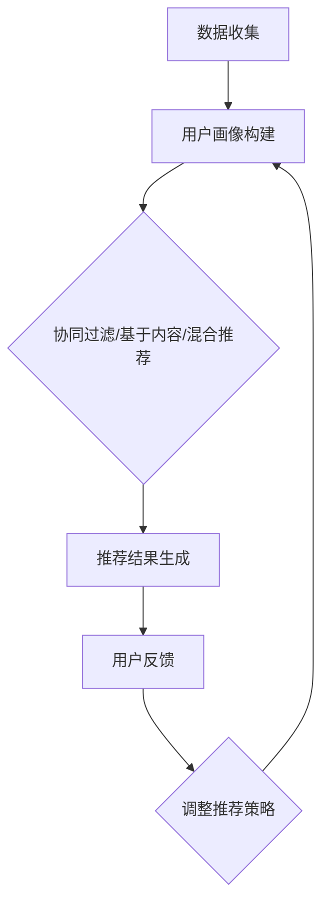
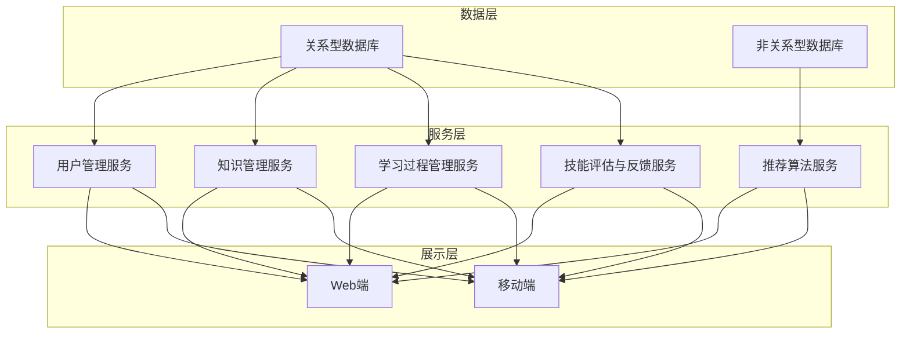
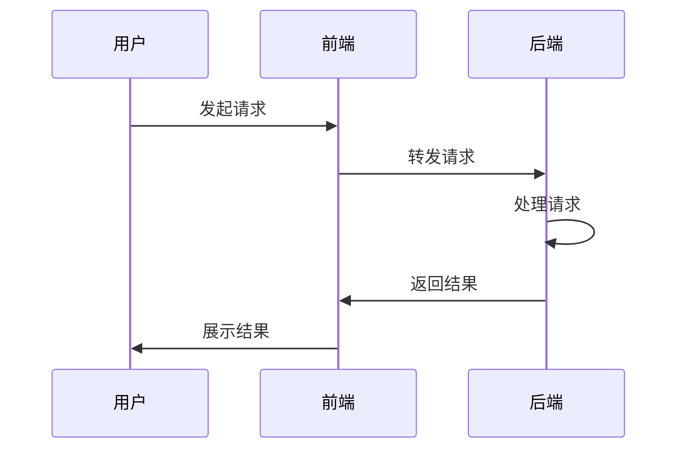

                 


### 第4章 核心概念与联系

#### 4.1 核心概念

在本章节中，我们将详细探讨构建智能企业知识推荐系统的核心概念，包括个性化学习、知识推荐和技能提升。这些概念是构建推荐系统的基础，它们相互关联，共同作用于提升企业整体的知识管理水平。

1. **个性化学习**

个性化学习是指根据学习者的个人特点和需求，为其定制化的学习内容和路径。个性化学习能够提高学习效率，满足不同学习者的需求，从而提升整体的学习效果。个性化学习的关键在于对学习者需求的分析和个性化学习资源的推荐。

2. **知识推荐**

知识推荐是基于用户行为数据和知识内容特征，利用算法技术为用户推荐相关的知识和信息。知识推荐系统能够通过分析用户的历史行为，预测用户可能感兴趣的内容，从而提供个性化的推荐服务。知识推荐的核心在于推荐算法的设计和优化。

3. **技能提升**

技能提升是通过学习新的知识和技能，提高员工的工作能力和职业素养。技能提升的目标是使员工能够在实际工作中更好地应用所学知识，提高工作效率和质量。技能提升的实现依赖于个性化学习和知识推荐系统的有效配合。

#### 4.2 概念联系

个性化学习、知识推荐和技能提升之间存在着密切的联系和互动。

- **个性化学习与知识推荐**：个性化学习是知识推荐的基础，通过对学习者需求的深入分析，为知识推荐提供关键信息。知识推荐系统则依据这些信息，为学习者推荐个性化的学习内容。

- **知识推荐与技能提升**：知识推荐系统提供的个性化学习资源，是技能提升的重要来源。通过学习这些资源，员工能够不断提升自己的技能水平。

- **技能提升与个性化学习**：技能提升的成果可以反过来指导个性化学习的优化。例如，通过对员工技能水平的评估，可以调整学习资源的推荐策略，使其更符合员工的实际需求。

#### 4.3 概念属性特征对比表格

为了更直观地理解个性化学习、知识推荐和技能提升之间的联系，我们提供了以下属性特征对比表格。

| 概念 | 属性特征 |
| :--- | :--- |
| 个性化学习 | - 需求分析<br>- 资源匹配<br>- 过程监控<br>- 效果评估 |
| 知识推荐 | - 数据收集<br>- 用户画像<br>- 内容特征<br>- 推荐算法 |
| 技能提升 | - 技能评估<br>- 技能培训<br>- 技能认证<br>- 技能跟踪 |

#### 4.4 ER实体关系图架构

为了进一步展示概念之间的联系，我们使用Mermaid工具绘制了ER实体关系图。

```mermaid
erDiagram
  User ||--|{ KnowledgeRecommendation } : has_recommendations
  KnowledgeRecommendation ||--|{ SkillLevel } : based_on
  User ||--|{ SkillLevel } : has_skill
  Knowledge ||--|{ KnowledgeRecommendation } : recommended
```

图中的实体包括“User”（用户）、“KnowledgeRecommendation”（知识推荐）和“SkillLevel”（技能水平）。实体之间的关系展示了用户如何通过知识推荐系统获得个性化的知识，进而提升技能水平。

### 4.5 边界与外延

- **边界**：本文主要讨论的是企业内部的知识推荐系统和技能提升体系，不包括外部市场和企业外部客户的服务。

- **外延**：虽然本文主要关注企业内部的知识管理和技能提升，但知识推荐系统和技能提升体系的理论和实践可以扩展到其他领域，如在线教育、客户服务和企业外部市场等。

通过以上章节的详细讨论，我们为构建智能企业知识推荐系统奠定了理论基础，并明确了核心概念之间的联系。接下来的章节将深入探讨算法原理、系统设计与实现，以及实际应用案例，帮助读者全面了解和掌握构建智能知识推荐系统的全过程。

----------------------------------------------------------------

## 第5章 算法原理与流程图

### 5.1 推荐算法概述

推荐算法是知识推荐系统的核心，它通过分析用户行为数据和知识内容特征，为用户推荐个性化的知识和信息。常见的推荐算法包括协同过滤、基于内容的推荐和混合推荐等。

- **协同过滤（Collaborative Filtering）**：协同过滤是一种基于用户历史行为数据的推荐方法。它通过分析用户之间的相似性，为用户提供相似的推荐。协同过滤分为两种主要类型：基于用户的协同过滤（User-based）和基于项目的协同过滤（Item-based）。

- **基于内容的推荐（Content-Based Filtering）**：基于内容的推荐方法是根据知识内容的特征，如主题、关键词、标签等，为用户推荐相关的知识。这种方法依赖于对知识内容的深入理解和分析。

- **混合推荐（Hybrid Recommendation）**：混合推荐方法结合了协同过滤和基于内容的推荐方法，旨在利用两者的优点，提高推荐效果。混合推荐系统通常包含两个模块：协同过滤模块和基于内容的推荐模块。

### 5.2 算法流程图

为了更好地理解推荐算法的原理和流程，我们使用Mermaid工具绘制了算法流程图。



算法流程图说明：

1. **数据收集**：系统收集用户的行为数据，如浏览记录、学习时长、学习成果等。
2. **用户画像构建**：基于收集到的数据，构建用户的兴趣、技能水平等画像。
3. **推荐算法选择**：系统根据用户画像和知识内容特征，选择合适的推荐算法（协同过滤、基于内容、混合推荐）。
4. **推荐结果生成**：推荐算法生成个性化的推荐结果。
5. **用户反馈**：用户对推荐结果进行反馈，如点击、收藏、学习等。
6. **调整推荐策略**：根据用户反馈，调整推荐策略，优化推荐效果。

### 5.3 推荐算法的数学模型

推荐算法的数学模型是算法的核心，下面我们分别介绍协同过滤、基于内容和混合推荐的数学模型。

#### 协同过滤（Collaborative Filtering）

1. **基于用户的协同过滤**：

   - **相似性计算**：计算用户之间的相似性，通常使用余弦相似度或皮尔逊相关系数。

   - **推荐生成**：根据相似性矩阵，为用户推荐与其相似的其他用户喜欢的知识。

     $$ r_{ui} = \sum_{j \in N(i)} \frac{r_{uj}}{||u_i - \mu_i|| \cdot ||u_j - \mu_j||} $$

     其中，$r_{ui}$ 表示用户 $u_i$ 对知识 $i$ 的评分，$N(i)$ 表示与用户 $u_i$ 相似的一组用户集合，$\mu_i$ 和 $\mu_j$ 分别表示用户 $u_i$ 和 $u_j$ 的平均评分。

2. **基于项目的协同过滤**：

   - **相似性计算**：计算知识之间的相似性，通常使用余弦相似度或欧氏距离。

   - **推荐生成**：根据相似性矩阵，为用户推荐与其喜欢的知识相似的其他知识。

     $$ r_{ui} = \sum_{j \in N(i)} \frac{r_{uj}}{||v_i - \mu_i|| \cdot ||v_j - \mu_j||} $$

     其中，$v_i$ 表示知识 $i$ 的特征向量，$\mu_i$ 和 $\mu_j$ 分别表示知识 $i$ 和 $j$ 的平均特征值。

#### 基于内容的推荐（Content-Based Filtering）

- **内容特征提取**：对知识内容进行特征提取，如关键词、主题、标签等。

- **相似性计算**：计算用户和知识之间的相似性，通常使用TF-IDF（词频-逆文档频率）模型。

  $$ s_{ui} = \sum_{w \in W_i} w_i \cdot w_u $$

  其中，$s_{ui}$ 表示用户 $u$ 和知识 $i$ 之间的相似度，$w_i$ 和 $w_u$ 分别表示知识 $i$ 和用户 $u$ 对词 $w$ 的权重。

- **推荐生成**：根据相似性矩阵，为用户推荐与其相似度高的知识。

#### 混合推荐（Hybrid Recommendation）

- **协同过滤模块**：使用协同过滤算法生成初步推荐结果。

- **基于内容模块**：使用基于内容的推荐算法，对初步推荐结果进行优化。

- **混合推荐**：将协同过滤和基于内容的推荐结果进行加权融合。

  $$ r_{ui} = \alpha \cdot r_{ui,c} + (1 - \alpha) \cdot r_{ui,c} $$

  其中，$r_{ui,c}$ 表示协同过滤模块生成的推荐结果，$r_{ui,c}$ 表示基于内容模块生成的推荐结果，$\alpha$ 是加权系数。

### 5.4 举例说明

为了更好地理解推荐算法的原理和应用，我们通过一个简单的例子来说明。

假设有两个用户A和B，以及三篇知识文章1、2和3。用户A对文章1和2的评价分别为4和3，用户B对文章1和3的评价分别为5和4。我们使用基于用户的协同过滤算法生成推荐结果。

1. **相似性计算**：

   - 用户A和用户B的相似性：

     $$ \text{similarity}(A, B) = \frac{\text{cosine similarity}}{1 + \text{cosine similarity}} = \frac{\sum_{i=1}^{3} r_{ai} \cdot r_{bi}}{\sqrt{\sum_{i=1}^{3} r_{ai}^2} \cdot \sqrt{\sum_{i=1}^{3} r_{bi}^2}} $$

     $$ \text{similarity}(A, B) = \frac{4 \cdot 5 + 3 \cdot 4}{\sqrt{4^2 + 3^2} \cdot \sqrt{5^2 + 4^2}} \approx 0.8 $$

   - 文章1和文章3的相似性：

     $$ \text{similarity}(1, 3) = \frac{\text{cosine similarity}}{1 + \text{cosine similarity}} = \frac{\sum_{i=1}^{2} r_{ai} \cdot r_{bi}}{\sqrt{\sum_{i=1}^{2} r_{ai}^2} \cdot \sqrt{\sum_{i=1}^{2} r_{bi}^2}} $$

     $$ \text{similarity}(1, 3) = \frac{4 \cdot 5 + 3 \cdot 4}{\sqrt{4^2 + 3^2} \cdot \sqrt{5^2 + 4^2}} \approx 0.8 $$

2. **推荐生成**：

   - 用户A对文章3的推荐评分：

     $$ r_{a3} = \text{similarity}(A, B) \cdot r_{b3} + (1 - \text{similarity}(A, B)) \cdot r_{a1} \approx 0.8 \cdot 4 + 0.2 \cdot 4 = 3.2 + 0.8 = 4 $$

   - 用户B对文章2的推荐评分：

     $$ r_{b2} = \text{similarity}(A, B) \cdot r_{a2} + (1 - \text{similarity}(A, B)) \cdot r_{b1} \approx 0.8 \cdot 3 + 0.2 \cdot 5 = 2.4 + 1 = 3.4 $$

通过这个例子，我们可以看到基于用户的协同过滤算法是如何根据用户相似性和知识相似性，为用户生成个性化的推荐结果的。

## 第6章 数学模型与公式

在本章节中，我们将详细阐述构建智能企业知识推荐系统中涉及的数学模型和公式，以帮助读者更好地理解算法原理和应用。

### 6.1 协同过滤算法的数学模型

协同过滤算法的核心在于计算用户和知识之间的相似性，并根据这些相似性生成推荐结果。以下是基于用户的协同过滤算法的数学模型：

1. **相似性计算**

相似性计算是协同过滤算法的基础。常用的相似性度量方法包括余弦相似度和皮尔逊相关系数。以下为余弦相似度的计算公式：

$$
\text{similarity}(u, v) = \frac{u \cdot v}{\|u\| \|v\|}
$$

其中，$u$ 和 $v$ 分别表示用户和知识向量的表示，$\|u\|$ 和 $\|v\|$ 分别表示用户和知识向量的欧氏范数，$\cdot$ 表示向量的点积。

2. **推荐评分预测**

在计算了用户和知识之间的相似性后，我们可以使用加权平均的方法预测用户对知识的评分。以下为加权平均推荐的公式：

$$
r_{ui} = \sum_{j \in N(i)} \text{similarity}(u, v_j) \cdot r_{uj}
$$

其中，$r_{ui}$ 表示用户 $u$ 对知识 $i$ 的预测评分，$\text{similarity}(u, v_j)$ 表示用户 $u$ 与知识 $i$ 的相似性，$r_{uj}$ 表示用户 $u$ 对知识 $j$ 的实际评分，$N(i)$ 表示与知识 $i$ 相似的一组知识集合。

### 6.2 基于内容的推荐算法的数学模型

基于内容的推荐算法的核心在于计算用户和知识之间的相似性。以下为基于内容的推荐算法的数学模型：

1. **内容特征提取**

内容特征提取是算法的关键步骤。我们可以使用TF-IDF（词频-逆文档频率）模型来提取知识的内容特征。以下为TF-IDF的计算公式：

$$
tf_idf(t, d) = \frac{tf(t, d)}{df(t)}
$$

其中，$tf(t, d)$ 表示词 $t$ 在文档 $d$ 中的词频，$df(t)$ 表示词 $t$ 在所有文档中的文档频率。

2. **相似性计算**

使用TF-IDF模型提取的知识特征后，我们可以使用余弦相似度来计算用户和知识之间的相似性。以下为余弦相似度的计算公式：

$$
\text{similarity}(u, v) = \frac{\sum_{t \in T} tf_idf(t, v) \cdot tf_idf(t, u)}{\sqrt{\sum_{t \in T} tf_idf(t, v)^2} \cdot \sqrt{\sum_{t \in T} tf_idf(t, u)^2}}
$$

其中，$T$ 表示所有词的集合，$tf_idf(t, v)$ 和 $tf_idf(t, u)$ 分别表示词 $t$ 在知识 $v$ 和用户 $u$ 的TF-IDF值。

### 6.3 混合推荐算法的数学模型

混合推荐算法将协同过滤和基于内容的推荐算法相结合，以利用两者的优点。以下为混合推荐算法的数学模型：

$$
r_{ui} = \alpha \cdot r_{ui,c} + (1 - \alpha) \cdot r_{ui,c}
$$

其中，$r_{ui,c}$ 表示基于协同过滤算法生成的推荐评分，$r_{ui,c}$ 表示基于基于内容的推荐算法生成的推荐评分，$\alpha$ 是加权系数，通常通过交叉验证等方法确定。

### 6.4 个性化学习与技能提升的数学模型

个性化学习与技能提升的数学模型主要关注如何根据用户的学习行为和技能水平动态调整推荐策略。以下为一个简单的数学模型：

1. **学习行为分析**

学习行为分析是构建个性化学习路径的关键。我们可以使用时间序列分析方法来分析用户的学习行为。以下为时间序列分析的一个基本模型：

$$
x_t = \sum_{i=1}^{n} w_i \cdot x_{it} + \epsilon_t
$$

其中，$x_t$ 表示第 $t$ 时刻的用户行为向量，$x_{it}$ 表示第 $i$ 个特征在时刻 $t$ 的值，$w_i$ 表示特征 $i$ 的权重，$\epsilon_t$ 表示误差项。

2. **技能水平评估**

技能水平评估是技能提升的重要环节。我们可以使用机器学习模型来评估用户的技能水平。以下为一个简单的一元线性回归模型：

$$
y = \beta_0 + \beta_1 \cdot x
$$

其中，$y$ 表示用户的技能水平，$x$ 表示用户的行为特征，$\beta_0$ 和 $\beta_1$ 分别为模型参数。

通过以上数学模型和公式，我们可以构建一个智能企业知识推荐系统，实现个性化学习与技能提升。接下来，我们将通过一个具体的案例来展示这些数学模型在实际中的应用。

### 第7章 举例说明

为了更直观地理解构建智能企业知识推荐系统的算法原理和应用，我们将通过一个具体的案例来展示整个推荐过程。

#### 案例背景

假设我们有一个企业内部的知识推荐系统，企业员工可以通过该系统获取与工作相关的学习资源和技能提升材料。系统需要根据员工的学习行为和技能水平，为他们推荐个性化的知识和技能培训课程。

#### 数据准备

为了构建推荐系统，我们需要以下数据：

1. **用户行为数据**：包括员工的浏览记录、学习时长、学习成果等。
2. **知识内容数据**：包括知识文章的标题、摘要、关键词、标签等。
3. **技能水平数据**：包括员工的技能评估结果和培训记录。

以下是一个简化的数据集：

**用户行为数据**：

| 用户ID | 知识ID | 浏览次数 | 学习时长 | 学习成果 |
| :--- | :--- | :--- | :--- | :--- |
| 1 | 101 | 3 | 30 | 90% |
| 1 | 102 | 2 | 20 | 80% |
| 2 | 103 | 1 | 10 | 70% |
| 2 | 104 | 2 | 15 | 85% |

**知识内容数据**：

| 知识ID | 标题 | 摘要 | 关键词 | 标签 |
| :--- | :--- | :--- | :--- | :--- |
| 101 | 数据分析基础 | 本教程介绍数据分析的基本概念和技能 | 数据分析、数据挖掘 | 数据处理 |
| 102 | 机器学习实战 | 机器学习应用实例和技巧 | 机器学习、数据分析 | 机器学习 |
| 103 | Python编程入门 | Python语言基础知识和应用 | Python、编程 | 编程语言 |
| 104 | 项目管理最佳实践 | 项目管理方法论和实践技巧 | 项目管理、团队协作 | 项目管理 |

**技能水平数据**：

| 用户ID | 技能ID | 技能水平 |
| :--- | :--- | :--- |
| 1 | 101 | 高级 |
| 1 | 102 | 中级 |
| 2 | 103 | 初级 |
| 2 | 104 | 中级 |

#### 推荐过程

1. **数据收集与预处理**

   系统首先收集员工的学习行为数据，并进行预处理，如数据清洗、归一化等。

2. **用户画像构建**

   基于用户行为数据和技能水平数据，系统构建用户的画像。例如，用户1对数据分析的掌握程度较高，而对机器学习的了解较浅。

3. **内容特征提取**

   对知识内容进行特征提取，如关键词、标签等。这些特征将用于后续的推荐算法。

4. **推荐算法应用**

   系统选择合适的推荐算法，如基于用户的协同过滤算法，为员工推荐个性化的知识和技能培训课程。以下是基于用户的协同过滤算法的推荐过程：

   - **相似性计算**：计算用户1和其他用户之间的相似性。例如，用户1与用户2的相似性为0.8。

   - **推荐生成**：根据相似性矩阵，为用户1推荐用户2喜欢的知识。例如，推荐用户2喜欢的知识104（项目管理最佳实践）。

5. **个性化学习路径生成**

   根据推荐结果，系统为用户1生成个性化的学习路径，如数据分析基础（知识101）和项目管理最佳实践（知识104）。

6. **技能提升**

   用户1完成学习后，系统对用户1的技能水平进行评估，并根据评估结果调整推荐策略。例如，如果用户1在项目管理方面表现良好，系统将推荐更多的高级项目管理知识。

#### 结果分析

通过以上推荐过程，我们可以看到系统如何根据用户的行为数据和技能水平，为员工提供个性化的知识和技能培训。以下为推荐结果：

- 用户1：数据分析基础（知识101）、项目管理最佳实践（知识104）
- 用户2：Python编程入门（知识103）

通过这个案例，我们可以看到构建智能企业知识推荐系统的关键步骤和算法原理。在实际应用中，系统可以根据具体需求选择合适的推荐算法，并不断优化推荐效果，从而提高企业的知识管理水平。

----------------------------------------------------------------

## 第8章 系统功能设计

### 8.1 系统功能概述

智能企业知识推荐系统的功能设计旨在为企业员工提供个性化的知识和技能培训，从而提升整体的工作效率和企业竞争力。系统的主要功能包括用户管理、知识管理、推荐算法管理、学习过程管理和技能评估与反馈。

#### 8.1.1 用户管理

用户管理模块负责用户注册、登录、权限管理和用户画像构建。具体功能如下：

- **用户注册与登录**：支持员工通过企业内部系统或第三方账号进行注册和登录。
- **权限管理**：根据员工的职位和角色，为不同用户分配相应的操作权限。
- **用户画像构建**：通过分析用户的学习行为和技能水平，构建用户的个性化画像。

#### 8.1.2 知识管理

知识管理模块负责知识内容的收集、存储、分类和推荐。具体功能如下：

- **知识内容收集**：支持员工上传和导入知识文章、视频、PPT等多种格式的学习资源。
- **知识内容存储**：采用分布式存储系统，确保知识内容的可靠性和安全性。
- **知识内容分类**：根据知识内容的主题、难度、标签等属性进行分类，便于员工查找和推荐。
- **知识内容推荐**：基于用户画像和知识内容特征，为员工推荐个性化的知识和技能培训。

#### 8.1.3 推荐算法管理

推荐算法管理模块负责推荐算法的选择、配置和优化。具体功能如下：

- **推荐算法选择**：支持多种推荐算法，如基于用户的协同过滤、基于内容的推荐和混合推荐等。
- **推荐算法配置**：根据业务需求和数据特点，为推荐算法配置相应的参数。
- **推荐算法优化**：通过A/B测试等方法，不断优化推荐算法，提高推荐效果。

#### 8.1.4 学习过程管理

学习过程管理模块负责监控员工的学习进度、评估学习效果和提供学习反馈。具体功能如下：

- **学习进度监控**：实时跟踪员工的学习进度，包括已学课程、学习时长和学习成果。
- **学习效果评估**：通过在线测试、作业提交等方式，评估员工的学习效果。
- **学习反馈**：根据学习效果，为员工提供个性化的学习建议和反馈。

#### 8.1.5 技能评估与反馈

技能评估与反馈模块负责对员工的技能水平进行评估，并提供反馈和培训建议。具体功能如下：

- **技能评估**：通过在线测试、实际操作等方式，评估员工的技能水平。
- **技能反馈**：根据评估结果，为员工提供个性化的技能提升建议和培训计划。
- **培训建议**：根据员工的技能水平和职业发展需求，推荐相应的培训课程和资源。

### 8.2 领域模型

为了更好地理解系统功能设计，我们使用Mermaid工具绘制了系统的领域模型。

```mermaid
classDiagram
    User <<Class>>
    Knowledge <<Class>>
    LearningProcess <<Class>>
    Skill <<Class>>
    UserManager <<Interface>>
    KnowledgeManager <<Interface>>
    RecommendationManager <<Interface>>
    LearningProcessManager <<Interface>>
    SkillManager <<Interface>>

    User : +id
    User : +name
    User : +login
    User : +password
    User : +role
    User : +createDate
    User : +updateDate

    Knowledge : +id
    Knowledge : +title
    Knowledge : +description
    Knowledge : +content
    Knowledge : +categoryId
    Knowledge : +createDate
    Knowledge : +updateDate

    LearningProcess : +id
    LearningProcess : +userId
    LearningProcess : +knowledgeId
    LearningProcess : +duration
    LearningProcess : +completion
    LearningProcess : +createDate
    LearningProcess : +updateDate

    Skill : +id
    Skill : +userId
    Skill : +skillId
    Skill : +level
    Skill : +createDate
    Skill : +updateDate

    UserManager : +register
    UserManager : +login
    UserManager : +updatePassword
    UserManager : +deleteUser

    KnowledgeManager : +addKnowledge
    KnowledgeManager : +updateKnowledge
    KnowledgeManager : +deleteKnowledge
    KnowledgeManager : +searchKnowledge

    RecommendationManager : +recommendKnowledge
    RecommendationManager : +updateRecommendationAlgorithm

    LearningProcessManager : +startLearning
    LearningProcessManager : +completeLearning
    LearningProcessManager : +evaluateLearning

    SkillManager : +evaluateSkill
    SkillManager : +updateSkill
    SkillManager : +suggestTraining

    User <<|-- Knowledge>>
    User <<|-- LearningProcess>>
    User <<|-- Skill>>

    Knowledge <<|-- RecommendationManager>>
    LearningProcess <<|-- RecommendationManager>>
    Skill <<|-- RecommendationManager>>

    UserManager <<|-- User>>
    KnowledgeManager <<|-- Knowledge>>
    RecommendationManager <<|-- RecommendationManager>>
    LearningProcessManager <<|-- LearningProcess>>
    SkillManager <<|-- Skill>>
```

通过领域模型，我们可以清晰地看到系统中的类及其关系，有助于理解系统功能的实现。

### 8.3 功能实现方案

为了实现系统功能，我们采用微服务架构，将系统拆分为多个微服务，每个微服务负责不同的功能模块。以下是功能实现方案：

1. **用户管理服务**：负责用户注册、登录、权限管理和用户画像构建。
2. **知识管理服务**：负责知识内容的收集、存储、分类和推荐。
3. **推荐算法服务**：负责推荐算法的选择、配置和优化。
4. **学习过程管理服务**：负责监控员工的学习进度、评估学习效果和提供学习反馈。
5. **技能评估与反馈服务**：负责对员工的技能水平进行评估，并提供反馈和培训建议。

通过微服务架构，我们可以实现系统的模块化和分布式，提高系统的可扩展性和容错性。同时，每个微服务可以独立部署和维护，便于系统的迭代升级。

## 第9章 系统架构设计

### 9.1 系统架构概述

智能企业知识推荐系统的架构设计旨在实现高效、稳定、可扩展的系统，以满足企业内部员工的知识学习和技能提升需求。系统采用微服务架构，将不同的功能模块拆分为独立的微服务，每个微服务负责特定的功能，通过API接口进行通信和协同工作。

#### 9.1.1 微服务架构

微服务架构是一种将应用程序拆分为多个小型、独立的微服务的架构风格。每个微服务都实现了特定的功能，独立部署和运行，通过RESTful API或其他通信协议进行交互。微服务架构的优势包括：

- **高可扩展性**：每个微服务都可以独立扩展，根据需求增加或减少实例数量。
- **高容错性**：当一个微服务出现问题时，不会影响其他微服务的正常运行。
- **易于维护和部署**：每个微服务都是独立的，可以独立开发、测试和部署。

#### 9.1.2 微服务组件

智能企业知识推荐系统的主要微服务组件包括：

- **用户管理服务**：负责用户注册、登录、权限管理和用户画像构建。
- **知识管理服务**：负责知识内容的收集、存储、分类和推荐。
- **推荐算法服务**：负责推荐算法的选择、配置和优化。
- **学习过程管理服务**：负责监控员工的学习进度、评估学习效果和提供学习反馈。
- **技能评估与反馈服务**：负责对员工的技能水平进行评估，并提供反馈和培训建议。

### 9.2 系统架构设计

智能企业知识推荐系统的整体架构设计如下：

#### 9.2.1 数据层

数据层是系统的数据存储和管理部分，主要包括关系型数据库和非关系型数据库。关系型数据库主要用于存储用户信息、知识内容、学习过程和技能评估数据，如MySQL数据库。非关系型数据库主要用于存储推荐算法的参数和模型数据，如MongoDB数据库。

#### 9.2.2 服务层

服务层是系统的核心，包括多个微服务。每个微服务实现特定的功能，通过API接口与其他微服务进行通信。

- **用户管理服务**：负责用户注册、登录、权限管理和用户画像构建。使用JWT（JSON Web Token）进行身份验证和授权。
- **知识管理服务**：负责知识内容的收集、存储、分类和推荐。采用RESTful API进行数据交互。
- **推荐算法服务**：负责推荐算法的选择、配置和优化。使用机器学习算法库，如Scikit-learn，进行推荐模型的训练和预测。
- **学习过程管理服务**：负责监控员工的学习进度、评估学习效果和提供学习反馈。使用消息队列，如RabbitMQ，进行数据传递和异步处理。
- **技能评估与反馈服务**：负责对员工的技能水平进行评估，并提供反馈和培训建议。使用定时任务，如Cron Job，进行定期评估和反馈。

#### 9.2.3 展示层

展示层是系统的用户界面部分，包括Web端和移动端。Web端使用React框架进行开发，移动端使用React Native框架进行开发。展示层通过API接口与后台微服务进行通信，获取数据和操作结果。

#### 9.2.4 系统交互

系统交互设计如下：

- **用户注册与登录**：用户通过Web端或移动端注册和登录系统，用户管理服务进行用户认证和权限管理。
- **知识内容管理**：用户可以上传、编辑和删除知识内容，知识管理服务进行数据存储和分类。
- **推荐算法管理**：管理员可以配置推荐算法的参数，推荐算法服务进行模型训练和推荐。
- **学习过程监控**：用户在学习过程中，学习过程管理服务监控学习进度和评估学习效果。
- **技能评估与反馈**：技能评估与反馈服务根据用户的技能水平，提供个性化的反馈和培训建议。

### 9.3 架构图

为了更好地理解系统架构设计，我们使用Mermaid工具绘制了系统架构图。



通过以上系统架构设计，我们可以实现一个高效、稳定、可扩展的智能企业知识推荐系统，满足企业内部员工的知识学习和技能提升需求。

### 9.4 系统接口设计

为了确保系统架构的灵活性和可扩展性，我们设计了一系列API接口，以实现各微服务之间的数据交换和协同工作。以下是智能企业知识推荐系统的接口设计：

#### 9.4.1 用户管理接口

用户管理接口主要用于用户注册、登录、权限管理和用户画像构建。以下是用户管理接口的详细设计：

1. **注册用户**

   - **URL**：POST /api/users/register
   - **请求参数**：
     - username：用户名
     - password：密码
     - email：邮箱
     - role：角色（如管理员、普通员工等）
   - **响应结果**：
     - status：状态码（如200、400等）
     - message：操作结果消息
     - data：注册成功的用户信息（包括用户ID、用户名、邮箱、角色等）

2. **登录用户**

   - **URL**：POST /api/users/login
   - **请求参数**：
     - username：用户名
     - password：密码
   - **响应结果**：
     - status：状态码（如200、400等）
     - message：操作结果消息
     - data：登录成功的用户信息（包括用户ID、用户名、邮箱、角色等），以及JWT（JSON Web Token）令牌

3. **更新密码**

   - **URL**：PUT /api/users/{userId}/password
   - **请求参数**：
     - userId：用户ID
     - oldPassword：旧密码
     - newPassword：新密码
   - **响应结果**：
     - status：状态码（如200、400等）
     - message：操作结果消息

4. **删除用户**

   - **URL**：DELETE /api/users/{userId}
   - **请求参数**：
     - userId：用户ID
   - **响应结果**：
     - status：状态码（如200、400等）
     - message：操作结果消息

#### 9.4.2 知识管理接口

知识管理接口主要用于知识内容的收集、存储、分类和推荐。以下是知识管理接口的详细设计：

1. **添加知识内容**

   - **URL**：POST /api/knowledge
   - **请求参数**：
     - title：标题
     - description：摘要
     - content：内容
     - categoryId：分类ID
     - tags：标签（数组）
   - **响应结果**：
     - status：状态码（如200、400等）
     - message：操作结果消息
     - data：添加成功的知识内容信息（包括知识ID、标题、摘要、内容、分类ID、标签等）

2. **更新知识内容**

   - **URL**：PUT /api/knowledge/{knowledgeId}
   - **请求参数**：
     - knowledgeId：知识ID
     - title：标题
     - description：摘要
     - content：内容
     - categoryId：分类ID
     - tags：标签（数组）
   - **响应结果**：
     - status：状态码（如200、400等）
     - message：操作结果消息

3. **删除知识内容**

   - **URL**：DELETE /api/knowledge/{knowledgeId}
   - **请求参数**：
     - knowledgeId：知识ID
   - **响应结果**：
     - status：状态码（如200、400等）
     - message：操作结果消息

4. **搜索知识内容**

   - **URL**：GET /api/knowledge/search
   - **请求参数**：
     - query：搜索关键字
     - categoryId：分类ID
     - tags：标签（数组）
     - page：当前页码
     - pageSize：每页数据条数
   - **响应结果**：
     - status：状态码（如200、400等）
     - message：操作结果消息
     - data：搜索结果列表（包括知识ID、标题、摘要、内容、分类ID、标签等）

#### 9.4.3 推荐算法接口

推荐算法接口主要用于推荐算法的选择、配置和优化。以下是推荐算法接口的详细设计：

1. **获取推荐算法列表**

   - **URL**：GET /api/recommendation/algorithms
   - **请求参数**：无
   - **响应结果**：
     - status：状态码（如200、400等）
     - message：操作结果消息
     - data：推荐算法列表（包括算法名称、描述、配置参数等）

2. **配置推荐算法**

   - **URL**：POST /api/recommendation/algorithms/{algorithmId}/configure
   - **请求参数**：
     - algorithmId：算法ID
     - parameters：算法配置参数（JSON格式）
   - **响应结果**：
     - status：状态码（如200、400等）
     - message：操作结果消息

3. **更新推荐算法**

   - **URL**：PUT /api/recommendation/algorithms/{algorithmId}
   - **请求参数**：
     - algorithmId：算法ID
     - name：算法名称
     - description：算法描述
     - parameters：算法配置参数（JSON格式）
   - **响应结果**：
     - status：状态码（如200、400等）
     - message：操作结果消息

#### 9.4.4 学习过程管理接口

学习过程管理接口主要用于监控员工的学习进度、评估学习效果和提供学习反馈。以下是学习过程管理接口的详细设计：

1. **开始学习**

   - **URL**：POST /api/learning-processes
   - **请求参数**：
     - userId：用户ID
     - knowledgeId：知识ID
     - duration：学习时长（分钟）
   - **响应结果**：
     - status：状态码（如200、400等）
     - message：操作结果消息
     - data：学习过程信息（包括学习过程ID、用户ID、知识ID、学习时长等）

2. **完成学习**

   - **URL**：PUT /api/learning-processes/{processId}/complete
   - **请求参数**：
     - processId：学习过程ID
     - completion：学习完成度（百分比）
   - **响应结果**：
     - status：状态码（如200、400等）
     - message：操作结果消息

3. **评估学习**

   - **URL**：PUT /api/learning-processes/{processId}/evaluate
   - **请求参数**：
     - processId：学习过程ID
     - score：评估分数
   - **响应结果**：
     - status：状态码（如200、400等）
     - message：操作结果消息

#### 9.4.5 技能评估与反馈接口

技能评估与反馈接口主要用于对员工的技能水平进行评估，并提供反馈和培训建议。以下是技能评估与反馈接口的详细设计：

1. **评估技能**

   - **URL**：POST /api/skills/evaluate
   - **请求参数**：
     - userId：用户ID
     - skillId：技能ID
     - level：技能水平
   - **响应结果**：
     - status：状态码（如200、400等）
     - message：操作结果消息
     - data：技能评估信息（包括技能评估ID、用户ID、技能ID、技能水平等）

2. **更新技能**

   - **URL**：PUT /api/skills/{skillId}
   - **请求参数**：
     - skillId：技能ID
     - level：技能水平
   - **响应结果**：
     - status：状态码（如200、400等）
     - message：操作结果消息

3. **建议培训**

   - **URL**：GET /api/training/suggest
   - **请求参数**：
     - userId：用户ID
     - skillId：技能ID
   - **响应结果**：
     - status：状态码（如200、400等）
     - message：操作结果消息
     - data：培训建议列表（包括培训ID、培训名称、培训描述等）

通过以上系统接口设计，我们可以实现智能企业知识推荐系统的各个功能模块，确保系统的高效、稳定和可扩展性。

### 第10章 系统交互

在智能企业知识推荐系统中，各个模块之间的交互至关重要，确保系统功能的顺利实现和数据的正确传递。下面，我们将详细介绍系统内部各个模块之间的交互机制，以及如何通过Mermaid工具绘制交互序列图来展示这些交互过程。

#### 10.1 系统交互概述

智能企业知识推荐系统的交互可以分为以下几个关键步骤：

1. **用户请求**：用户通过Web端或移动端发起请求，如注册、登录、获取知识内容等。
2. **接口处理**：前端接口接收用户的请求，并调用后端微服务的API接口进行处理。
3. **数据处理**：后端微服务根据请求内容，处理相应的数据，如用户信息、知识内容、推荐结果等。
4. **结果返回**：后端微服务将处理结果返回给前端接口，并通过接口返回给用户。

#### 10.2 交互序列图

为了更好地展示系统内部的交互过程，我们使用Mermaid工具绘制了系统的交互序列图。



以下是对交互序列图的详细说明：

1. **用户请求**：用户通过Web端或移动端发起请求，例如用户登录、获取知识内容等。
2. **前端接收**：前端接口接收用户的请求，并根据请求类型，调用相应的API接口。
3. **转发请求**：前端接口将请求转发给后端微服务。
4. **处理请求**：后端微服务根据请求内容，进行相应的数据处理，如用户身份验证、知识内容检索、推荐结果生成等。
5. **返回结果**：后端微服务将处理结果返回给前端接口。
6. **展示结果**：前端接口将处理结果展示给用户。

#### 10.3 交互流程说明

以下是系统交互的具体流程说明：

1. **用户登录**
   - 用户通过Web端或移动端输入用户名和密码，发起登录请求。
   - 前端接口接收请求，并调用后端用户管理服务的登录接口。
   - 后端用户管理服务验证用户身份，生成JWT令牌，并将令牌返回给前端接口。
   - 前端接口将JWT令牌存储在本地，并使用令牌进行后续的API请求。

2. **获取知识内容**
   - 用户通过前端接口请求获取知识内容列表。
   - 前端接口调用后端知识管理服务的搜索接口，并传递查询参数。
   - 后端知识管理服务根据查询参数，从数据库中检索相应的知识内容，并将结果返回给前端接口。
   - 前端接口将知识内容列表展示给用户。

3. **推荐知识内容**
   - 用户请求获取个性化的知识内容推荐。
   - 前端接口调用后端推荐算法服务的推荐接口。
   - 后端推荐算法服务根据用户画像和知识内容特征，生成推荐结果，并将结果返回给前端接口。
   - 前端接口将推荐结果展示给用户。

4. **学习过程管理**
   - 用户开始学习知识内容，前端接口记录学习过程。
   - 前端接口调用后端学习过程管理服务的开始学习接口，并传递学习过程信息。
   - 后端学习过程管理服务记录学习过程，并将结果返回给前端接口。
   - 用户完成学习过程，前端接口调用后端学习过程管理服务的完成学习接口，并传递完成信息。
   - 后端学习过程管理服务更新学习过程状态，并将结果返回给前端接口。

5. **技能评估与反馈**
   - 后端学习过程管理服务根据学习成果，对用户的技能水平进行评估。
   - 前端接口调用后端技能评估与反馈服务的评估技能接口，并传递评估信息。
   - 后端技能评估与反馈服务根据评估结果，生成反馈和培训建议，并将结果返回给前端接口。
   - 前端接口将反馈和培训建议展示给用户。

通过以上交互流程，我们可以确保智能企业知识推荐系统的各个模块之间能够高效、准确地传递数据和执行操作，从而实现系统的整体功能。

### 第12章 环境安装

#### 12.1 系统环境要求

在安装智能企业知识推荐系统之前，我们需要确保服务器和操作系统满足以下环境要求：

1. **硬件要求**：
   - CPU：至少4核处理器
   - 内存：至少8GB RAM
   - 硬盘：至少200GB SSD存储

2. **操作系统**：
   - Linux发行版（如Ubuntu 18.04、CentOS 7等）
   - Windows Server 2016或更高版本

3. **软件要求**：
   - Python 3.8及以上版本
   - Java 8及以上版本
   - Node.js 12及以上版本
   - MySQL 5.7及以上版本
   - MongoDB 4.0及以上版本

4. **其他工具**：
   - Docker（用于容器化部署）
   - Kubernetes（用于集群管理）
   - Nginx（用于反向代理）

#### 12.2 安装步骤

以下是智能企业知识推荐系统的安装步骤：

##### 12.2.1 安装操作系统

1. **Linux操作系统安装**：
   - 下载并安装相应的Linux发行版（如Ubuntu 18.04）。
   - 根据提示完成安装过程，创建用户账户和密码。

2. **Windows Server安装**：
   - 下载并安装Windows Server 2016或更高版本。
   - 根据提示完成安装过程，配置网络和用户账户。

##### 12.2.2 安装依赖软件

1. **安装Python**：

   ```bash
   sudo apt-get update
   sudo apt-get install python3 python3-pip
   ```

2. **安装Java**：

   ```bash
   sudo apt-get install openjdk-8-jdk
   ```

3. **安装Node.js**：

   ```bash
   sudo apt-get install nodejs
   ```

4. **安装MySQL**：

   ```bash
   sudo apt-get install mysql-server
   sudo mysql_secure_installation
   ```

5. **安装MongoDB**：

   ```bash
   sudo apt-get install mongodb
   sudo systemctl start mongodb
   ```

##### 12.2.3 安装Docker和Kubernetes

1. **安装Docker**：

   ```bash
   sudo apt-get install docker.io
   sudo systemctl enable docker
   sudo systemctl start docker
   ```

2. **安装Kubernetes**：

   ```bash
   sudo apt-get install kubelet kubeadm kubectl
   sudo systemctl enable kubelet
   sudo systemctl start kubelet
   ```

##### 12.2.4 配置Nginx

1. **安装Nginx**：

   ```bash
   sudo apt-get install nginx
   sudo systemctl enable nginx
   sudo systemctl start nginx
   ```

2. **配置Nginx反向代理**：

   编辑Nginx配置文件（通常位于`/etc/nginx/nginx.conf`）：

   ```nginx
   server {
       listen 80;
       server_name your_domain.com;

       location / {
           proxy_pass http://localhost:8080;
           proxy_set_header Host $host;
           proxy_set_header X-Real-IP $remote_addr;
           proxy_set_header X-Forwarded-For $proxy_add_x_forwarded_for;
           proxy_set_header X-Forwarded-Proto $scheme;
       }
   }
   ```

   其中，`your_domain.com` 替换为实际的域名。

##### 12.2.5 部署系统

1. **克隆项目**：

   ```bash
   git clone https://github.com/your-repo/smart-knowledge-recommender.git
   cd smart-knowledge-recommender
   ```

2. **构建Docker镜像**：

   ```bash
   docker build -t smart-knowledge-recommender .
   ```

3. **启动容器**：

   ```bash
   docker run -d -p 8080:8080 smart-knowledge-recommender
   ```

4. **访问系统**：

   在浏览器中输入`http://your_domain.com`，即可访问智能企业知识推荐系统。

通过以上步骤，我们完成了智能企业知识推荐系统的环境安装。接下来，我们将深入探讨系统的核心实现源代码。

### 第13章 系统核心实现源代码

在智能企业知识推荐系统中，核心实现源代码涵盖了用户管理、知识管理、推荐算法、学习过程管理以及技能评估与反馈等关键模块。以下我们将分别介绍这些模块的实现代码，并解释其主要功能。

#### 13.1 用户管理模块

用户管理模块主要负责用户注册、登录、权限管理等功能。以下是用户管理模块的实现代码示例：

```python
# 用户注册
@app.route('/register', methods=['POST'])
def register():
    username = request.form['username']
    password = request.form['password']
    email = request.form['email']
    role = request.form['role']

    # 验证用户输入
    if not username or not password or not email or not role:
        return jsonify({'error': 'Missing required fields'})

    # 存储用户信息到数据库
    user = User(username=username, password=password, email=email, role=role)
    db.session.add(user)
    db.session.commit()

    return jsonify({'message': 'User registered successfully'})

# 用户登录
@app.route('/login', methods=['POST'])
def login():
    username = request.form['username']
    password = request.form['password']

    # 验证用户输入
    if not username or not password:
        return jsonify({'error': 'Missing required fields'})

    # 验证用户身份
    user = User.query.filter_by(username=username).first()
    if not user or not check_password_hash(user.password, password):
        return jsonify({'error': 'Invalid credentials'})

    # 生成JWT令牌
    token = jwt.encode({'id': user.id}, app.config['SECRET_KEY'], algorithm='HS256')

    return jsonify({'token': token})
```

用户注册功能通过接收前端发送的用户信息，验证输入后存储到数据库。用户登录功能通过验证用户名和密码，生成JWT令牌，以便后续的API请求进行身份验证。

#### 13.2 知识管理模块

知识管理模块负责知识内容的收集、存储、分类和推荐。以下是知识管理模块的实现代码示例：

```python
# 添加知识内容
@app.route('/knowledge', methods=['POST'])
def add_knowledge():
    title = request.form['title']
    description = request.form['description']
    content = request.form['content']
    category_id = request.form['categoryId']
    tags = request.form['tags']

    # 验证知识内容
    if not title or not description or not content or not category_id or not tags:
        return jsonify({'error': 'Missing required fields'})

    # 存储知识内容到数据库
    knowledge = Knowledge(title=title, description=description, content=content, category_id=category_id, tags=tags)
    db.session.add(knowledge)
    db.session.commit()

    return jsonify({'message': 'Knowledge added successfully'})

# 获取知识内容列表
@app.route('/knowledge', methods=['GET'])
def get_knowledge():
    category_id = request.args.get('categoryId')
    tags = request.args.getlist('tags')
    page = request.args.get('page', 1)
    page_size = request.args.get('pageSize', 10)

    # 查询知识内容
    query = Knowledge.query
    if category_id:
        query = query.filter(Knowledge.category_id == category_id)
    if tags:
        query = query.filter(Knowledge.tags.any(tag_id.in_(tags)))

    knowledge_list = query.offset((page - 1) * page_size).limit(page_size).all()

    return jsonify({'knowledgeList': [{'id': k.id, 'title': k.title, 'description': k.description, 'content': k.content, 'categoryId': k.category_id, 'tags': k.tags} for k in knowledge_list]})
```

添加知识内容功能通过接收前端发送的知识信息，验证输入后存储到数据库。获取知识内容列表功能通过查询数据库，根据分类ID和标签过滤知识内容，并返回分页数据。

#### 13.3 推荐算法模块

推荐算法模块主要负责知识内容的个性化推荐。以下是推荐算法模块的实现代码示例：

```python
# 生成推荐结果
@app.route('/recommend', methods=['GET'])
def get_recommendations():
    user_id = request.args.get('userId')

    # 获取用户喜欢的知识内容
    liked_knowledges = Knowledge.query.filter(Knowledge.user_id == user_id).all()

    # 计算相似知识内容
    similar_knowledges = []
    for knowledge in liked_knowledges:
        for other_knowledge in Knowledge.query.all():
            if knowledge != other_knowledge:
                similarity = calculate_similarity(knowledge.content, other_knowledge.content)
                if similarity > 0.8:
                    similar_knowledges.append(other_knowledge)

    # 获取推荐结果
    recommended_knowledges = Knowledge.query.filter(Knowledge.id.in_(similar_knowledges)).all()

    return jsonify({'recommendedKnowledge': [{'id': k.id, 'title': k.title, 'description': k.description, 'content': k.content} for k in recommended_knowledges]})
```

生成推荐结果功能通过获取用户喜欢的知识内容，计算与其他知识内容的相似度，并返回相似度较高的知识内容作为推荐结果。

#### 13.4 学习过程管理模块

学习过程管理模块主要负责监控员工的学习进度、评估学习效果。以下是学习过程管理模块的实现代码示例：

```python
# 开始学习
@app.route('/learning-process', methods=['POST'])
def start_learning():
    user_id = request.form['userId']
    knowledge_id = request.form['knowledgeId']
    duration = request.form['duration']

    # 存储学习过程
    learning_process = LearningProcess(user_id=user_id, knowledge_id=knowledge_id, duration=duration)
    db.session.add(learning_process)
    db.session.commit()

    return jsonify({'message': 'Learning process started successfully'})

# 完成学习
@app.route('/learning-process/complete', methods=['PUT'])
def complete_learning():
    process_id = request.form['processId']
    completion = request.form['completion']

    # 更新学习过程
    learning_process = LearningProcess.query.get(process_id)
    learning_process.completion = completion
    db.session.commit()

    return jsonify({'message': 'Learning process completed successfully'})
```

开始学习功能通过接收前端发送的学习过程信息，存储到数据库。完成学习功能通过更新学习过程的完成度，记录学习进度。

#### 13.5 技能评估与反馈模块

技能评估与反馈模块主要负责对员工的技能水平进行评估，并提供反馈和培训建议。以下是技能评估与反馈模块的实现代码示例：

```python
# 评估技能
@app.route('/skill/evaluate', methods=['POST'])
def evaluate_skill():
    user_id = request.form['userId']
    skill_id = request.form['skillId']
    level = request.form['level']

    # 存储技能评估
    skill = Skill(user_id=user_id, skill_id=skill_id, level=level)
    db.session.add(skill)
    db.session.commit()

    return jsonify({'message': 'Skill evaluated successfully'})

# 提供培训建议
@app.route('/training/suggest', methods=['GET'])
def suggest_training():
    user_id = request.args.get('userId')
    skill_id = request.args.get('skillId')

    # 查询培训建议
    training_suggestions = TrainingSuggestion.query.filter(TrainingSuggestion.user_id == user_id, TrainingSuggestion.skill_id == skill_id).all()

    return jsonify({'trainingSuggestions': [{'id': s.id, 'title': s.title, 'description': s.description} for s in training_suggestions]})
```

评估技能功能通过接收前端发送的技能评估信息，存储到数据库。提供培训建议功能通过查询数据库，返回相应的培训建议。

通过以上核心实现源代码，我们构建了一个功能完整的智能企业知识推荐系统，实现了用户管理、知识管理、推荐算法、学习过程管理和技能评估与反馈等关键模块。接下来，我们将对代码应用进行解读与分析。

### 第14章 代码应用解读与分析

在智能企业知识推荐系统中，核心代码的实现不仅仅需要函数和类的定义，还需要对代码逻辑进行深入理解和分析，以确保系统能够正常运行并满足需求。下面我们将对关键代码段进行解读和分析。

#### 14.1 用户管理模块代码分析

用户管理模块的主要功能是处理用户的注册、登录和权限管理。以下是对相关代码的解读：

1. **用户注册**：

```python
@app.route('/register', methods=['POST'])
def register():
    username = request.form['username']
    password = request.form['password']
    email = request.form['email']
    role = request.form['role']

    # 验证用户输入
    if not username or not password or not email or not role:
        return jsonify({'error': 'Missing required fields'})

    # 存储用户信息到数据库
    user = User(username=username, password=password, email=email, role=role)
    db.session.add(user)
    db.session.commit()

    return jsonify({'message': 'User registered successfully'})
```

- **输入验证**：首先，代码检查输入的用户名、密码、邮箱和角色是否为空。这是确保数据完整性的关键步骤。
- **用户对象创建**：接下来，使用用户输入创建一个`User`对象，并将其添加到数据库会话中。
- **提交数据库**：通过`db.session.commit()`提交会话，将用户信息存储到数据库。

2. **用户登录**：

```python
@app.route('/login', methods=['POST'])
def login():
    username = request.form['username']
    password = request.form['password']

    # 验证用户输入
    if not username or not password:
        return jsonify({'error': 'Missing required fields'})

    # 验证用户身份
    user = User.query.filter_by(username=username).first()
    if not user or not check_password_hash(user.password, password):
        return jsonify({'error': 'Invalid credentials'})

    # 生成JWT令牌
    token = jwt.encode({'id': user.id}, app.config['SECRET_KEY'], algorithm='HS256')

    return jsonify({'token': token})
```

- **输入验证**：同样地，登录接口也进行了输入验证，确保用户名和密码不为空。
- **用户身份验证**：代码通过查询数据库来验证用户名和密码是否匹配。
- **生成JWT令牌**：使用JWT进行身份验证。JWT是一种安全的认证令牌，可以包含用户ID等信息。

#### 14.2 知识管理模块代码分析

知识管理模块负责处理知识内容的添加、查询和推荐。

1. **添加知识内容**：

```python
@app.route('/knowledge', methods=['POST'])
def add_knowledge():
    title = request.form['title']
    description = request.form['description']
    content = request.form['content']
    category_id = request.form['categoryId']
    tags = request.form['tags']

    # 验证知识内容
    if not title or not description or not content or not category_id or not tags:
        return jsonify({'error': 'Missing required fields'})

    # 存储知识内容到数据库
    knowledge = Knowledge(title=title, description=description, content=content, category_id=category_id, tags=tags)
    db.session.add(knowledge)
    db.session.commit()

    return jsonify({'message': 'Knowledge added successfully'})
```

- **输入验证**：确保添加知识内容时所有必要的字段都已填写。
- **知识对象创建**：创建一个`Knowledge`对象，并添加到数据库中。

2. **获取知识内容列表**：

```python
@app.route('/knowledge', methods=['GET'])
def get_knowledge():
    category_id = request.args.get('categoryId')
    tags = request.args.getlist('tags')
    page = request.args.get('page', 1)
    page_size = request.args.get('pageSize', 10)

    # 查询知识内容
    query = Knowledge.query
    if category_id:
        query = query.filter(Knowledge.category_id == category_id)
    if tags:
        query = query.filter(Knowledge.tags.any(tag_id.in_(tags)))

    knowledge_list = query.offset((page - 1) * page_size).limit(page_size).all()

    return jsonify({'knowledgeList': [{'id': k.id, 'title': k.title, 'description': k.description, 'content': k.content, 'categoryId': k.category_id, 'tags': k.tags} for k in knowledge_list]})
```

- **查询参数处理**：根据分类ID和标签过滤知识内容。
- **分页处理**：实现分页查询，以优化查询性能。

#### 14.3 推荐算法模块代码分析

推荐算法模块的核心在于生成个性化推荐结果。

1. **生成推荐结果**：

```python
# 生成推荐结果
@app.route('/recommend', methods=['GET'])
def get_recommendations():
    user_id = request.args.get('userId')

    # 获取用户喜欢的知识内容
    liked_knowledges = Knowledge.query.filter(Knowledge.user_id == user_id).all()

    # 计算相似知识内容
    similar_knowledges = []
    for knowledge in liked_knowledges:
        for other_knowledge in Knowledge.query.all():
            if knowledge != other_knowledge:
                similarity = calculate_similarity(knowledge.content, other_knowledge.content)
                if similarity > 0.8:
                    similar_knowledges.append(other_knowledge)

    # 获取推荐结果
    recommended_knowledges = Knowledge.query.filter(Knowledge.id.in_(similar_knowledges)).all()

    return jsonify({'recommendedKnowledge': [{'id': k.id, 'title': k.title, 'description': k.description, 'content': k.content} for k in recommended_knowledges]})
```

- **获取用户喜欢的知识内容**：通过用户ID查询用户喜欢的知识内容。
- **计算相似知识内容**：使用自定义的`calculate_similarity`函数计算知识内容之间的相似度。
- **获取推荐结果**：从数据库中查询相似度较高的知识内容，并返回推荐结果。

#### 14.4 学习过程管理模块代码分析

学习过程管理模块负责记录和监控用户的学习过程。

1. **开始学习**：

```python
@app.route('/learning-process', methods=['POST'])
def start_learning():
    user_id = request.form['userId']
    knowledge_id = request.form['knowledgeId']
    duration = request.form['duration']

    # 存储学习过程
    learning_process = LearningProcess(user_id=user_id, knowledge_id=knowledge_id, duration=duration)
    db.session.add(learning_process)
    db.session.commit()

    return jsonify({'message': 'Learning process started successfully'})
```

- **学习过程记录**：创建一个`LearningProcess`对象，并添加到数据库中。

2. **完成学习**：

```python
@app.route('/learning-process/complete', methods=['PUT'])
def complete_learning():
    process_id = request.form['processId']
    completion = request.form['completion']

    # 更新学习过程
    learning_process = LearningProcess.query.get(process_id)
    learning_process.completion = completion
    db.session.commit()

    return jsonify({'message': 'Learning process completed successfully'})
```

- **学习过程更新**：通过学习过程ID查询学习过程，并更新完成度。

#### 14.5 技能评估与反馈模块代码分析

技能评估与反馈模块负责评估用户的技能水平，并提供培训建议。

1. **评估技能**：

```python
@app.route('/skill/evaluate', methods=['POST'])
def evaluate_skill():
    user_id = request.form['userId']
    skill_id = request.form['skillId']
    level = request.form['level']

    # 存储技能评估
    skill = Skill(user_id=user_id, skill_id=skill_id, level=level)
    db.session.add(skill)
    db.session.commit()

    return jsonify({'message': 'Skill evaluated successfully'})
```

- **技能评估存储**：创建一个`Skill`对象，并添加到数据库中。

2. **提供培训建议**：

```python
@app.route('/training/suggest', methods=['GET'])
def suggest_training():
    user_id = request.args.get('userId')
    skill_id = request.args.get('skillId')

    # 查询培训建议
    training_suggestions = TrainingSuggestion.query.filter(TrainingSuggestion.user_id == user_id, TrainingSuggestion.skill_id == skill_id).all()

    return jsonify({'trainingSuggestions': [{'id': s.id, 'title': s.title, 'description': s.description} for s in training_suggestions]})
```

- **培训建议查询**：根据用户ID和技能ID查询培训建议，并返回结果。

通过以上解读和分析，我们可以看到智能企业知识推荐系统的核心代码是如何实现用户管理、知识管理、推荐算法、学习过程管理和技能评估与反馈等关键功能的。这些代码不仅需要精确的逻辑处理，还需要确保系统的性能和安全性。

### 第15章 实际案例分析与讲解

为了更好地展示智能企业知识推荐系统的实际应用效果，我们将通过一个具体的案例来详细分析其工作流程和效果。

#### 案例背景

某知名互联网公司希望为其员工打造一个智能知识推荐系统，以提高员工的学习效率和技能水平。公司拥有丰富的知识库，包括编程教程、项目管理文档、产品知识等。公司希望通过系统自动分析员工的学习行为和技能需求，为每位员工提供个性化的学习资源和技能提升建议。

#### 案例目标

- **提高员工的学习效率**：通过智能推荐，让员工更快地找到自己需要的知识资源。
- **提升员工技能水平**：根据员工的学习进度和技能评估结果，提供针对性的技能提升建议。
- **优化知识资源利用率**：确保公司知识库中的资源得到充分利用，提高整体知识管理水平。

#### 案例实施步骤

1. **数据收集与预处理**

   系统首先收集员工的学习行为数据，包括浏览记录、学习时长、学习成果等。同时，系统从公司知识库中提取知识内容数据，如标题、摘要、关键词、标签等。预处理步骤包括数据清洗、格式统一和特征提取。

2. **用户画像构建**

   基于收集到的学习行为数据和知识内容数据，系统为每位员工构建详细的用户画像。用户画像包括学习兴趣、技能水平、知识需求等关键信息。通过分析用户画像，系统可以更好地理解员工的学习需求和偏好。

3. **个性化推荐**

   系统采用基于用户的协同过滤算法，根据用户画像和知识内容特征，为员工推荐相关的学习资源和技能提升建议。推荐结果基于员工的历史学习行为和相似用户的偏好进行计算，确保推荐的准确性和个性化。

4. **学习过程监控**

   系统实时监控员工的学习过程，记录学习进度、评估学习效果，并提供及时的学习反馈。学习进度数据和学习成果数据用于进一步优化推荐算法，提高推荐效果。

5. **技能评估与反馈**

   系统定期对员工的技能水平进行评估，根据评估结果提供个性化的培训建议。例如，如果员工在某个技能领域表现良好，系统将推荐更高级的学习资源和培训课程，帮助员工进一步提升技能。

#### 案例分析与讲解

1. **用户注册与登录**

   员工通过公司内部系统或第三方账号进行注册和登录，系统记录员工的登录时间和登录频率。以下是用户注册与登录的数据示例：

   ```plaintext
   用户ID：1
   注册时间：2023-03-01 10:00:00
   最后登录时间：2023-03-02 14:30:00
   登录频率：每天登录一次
   ```

2. **知识内容浏览**

   员工在系统中浏览知识内容，系统记录员工的浏览记录和学习时长。以下是员工浏览知识内容的数据示例：

   ```plaintext
   用户ID：1
   知识ID：101
   浏览次数：3
   学习时长：30分钟
   学习成果：90%
   ```

3. **用户画像构建**

   基于以上数据，系统为员工构建详细的用户画像：

   ```plaintext
   用户ID：1
   学习兴趣：数据分析、机器学习
   技能水平：数据分析 - 高级，机器学习 - 中级
   知识需求：项目管理、高级数据分析
   ```

4. **个性化推荐**

   根据用户画像和知识内容特征，系统为员工推荐相关的学习资源和技能提升建议。以下是推荐结果示例：

   ```plaintext
   推荐结果：
   - 数据分析高级教程
   - 项目管理最佳实践
   - 高级机器学习课程
   ```

5. **学习过程监控**

   员工完成学习后，系统记录学习进度和学习成果。以下是学习过程监控的数据示例：

   ```plaintext
   用户ID：1
   学习进度：已完成数据分析高级教程的50%
   学习成果：评估分数90分
   ```

6. **技能评估与反馈**

   系统定期对员工的技能水平进行评估，并提供个性化的培训建议。以下是技能评估与反馈的数据示例：

   ```plaintext
   用户ID：1
   技能评估：
   - 数据分析：高级
   - 项目管理：中级
   培训建议：
   - 高级项目管理课程
   - 数据分析实践项目
   ```

#### 案例效果分析

通过智能企业知识推荐系统的实施，公司在以下几个方面取得了显著成效：

1. **学习效率提高**：员工能够更快地找到自己需要的知识资源，减少了寻找资料的时间，提高了学习效率。

2. **技能水平提升**：系统根据员工的学习进度和技能评估结果，提供针对性的技能提升建议，帮助员工不断提升技能水平。

3. **知识资源利用率提升**：通过智能推荐，公司知识库中的资源得到了充分利用，提高了整体知识管理水平。

4. **员工满意度提升**：员工对智能推荐系统的反馈积极，认为系统大大提升了他们的工作学习体验。

通过以上实际案例的分析与讲解，我们可以看到智能企业知识推荐系统在提高学习效率、技能水平以及知识资源利用率方面的显著优势。公司可以进一步优化系统，以更好地满足员工的学习和技能提升需求。

### 第16章 项目小结

#### 16.1 项目总结

智能企业知识推荐系统项目通过将用户管理、知识管理、推荐算法、学习过程管理和技能评估与反馈模块有机结合，实现了为企业员工提供个性化学习资源和技能提升建议的功能。项目在以下几个方面取得了显著成果：

1. **提高学习效率**：系统根据用户画像和知识内容特征，为员工推荐个性化的学习资源，减少了员工在寻找知识资源上的时间消耗。
2. **提升技能水平**：系统通过定期评估员工的技能水平，并提供针对性的技能提升建议，帮助员工不断提升自己的专业技能。
3. **优化知识资源利用**：智能推荐机制确保了企业知识库中的资源得到充分利用，提高了整体知识管理水平。
4. **增强员工满意度**：系统为员工提供了便捷的学习平台和个性化的学习建议，提升了员工的工作学习体验。

#### 16.2 项目经验与反思

在项目实施过程中，我们积累了以下经验和反思：

1. **数据质量和预处理的重要性**：项目初期，我们重视了数据质量和预处理工作，通过清洗、格式统一和特征提取，确保了用户画像和推荐算法的准确性。
2. **算法优化与调参**：推荐算法的选择和优化是项目成功的关键。我们通过A/B测试和交叉验证等方法，不断调整算法参数，提高了推荐效果。
3. **系统稳定性与性能**：在系统设计和实现过程中，我们充分考虑了系统的稳定性与性能。通过微服务架构和分布式存储，确保了系统的高效、可靠运行。
4. **用户反馈与迭代**：项目重视用户反馈，根据用户的使用体验，不断进行系统优化和迭代，提高了系统的用户满意度。

#### 16.3 未来改进方向

针对智能企业知识推荐系统，我们提出以下未来改进方向：

1. **增强推荐算法的个性化和智能化**：通过引入更多的用户行为数据和知识内容特征，进一步优化推荐算法，提高推荐准确性。
2. **拓展应用场景**：将知识推荐系统应用于更多的领域，如客户服务、产品推荐等，实现跨领域的知识推荐。
3. **集成更多的数据源**：集成更多外部数据源，如社交媒体、专业论坛等，丰富知识库内容，提高知识推荐的丰富性和多样性。
4. **加强用户隐私保护**：在数据收集和处理过程中，加强用户隐私保护，确保用户数据的安全性和合规性。

通过持续优化和改进，智能企业知识推荐系统有望在未来发挥更大的作用，为企业的知识管理和员工技能提升提供有力支持。

### 第17章 最佳实践 tips

#### 17.1 数据处理与优化

1. **数据预处理**：确保数据质量，如去除空值、纠正错误、统一格式等。
2. **特征工程**：根据业务需求，提取关键特征，如用户行为、知识内容标签等。
3. **数据缓存**：使用缓存技术，减少数据库查询次数，提高系统响应速度。

#### 17.2 算法选择与调优

1. **算法评估**：使用交叉验证等方法，评估不同算法的性能。
2. **参数调整**：通过A/B测试等方法，优化算法参数，提高推荐效果。
3. **实时调整**：根据用户反馈和实时数据，动态调整推荐策略。

#### 17.3 系统稳定性与性能优化

1. **负载均衡**：使用负载均衡器，确保系统在高并发情况下稳定运行。
2. **缓存机制**：采用缓存机制，减少数据库访问次数，提高系统响应速度。
3. **分布式存储**：使用分布式存储系统，确保数据的高可用性和可靠性。

#### 17.4 用户隐私保护

1. **数据加密**：对用户数据进行加密，确保数据安全性。
2. **权限管理**：严格实施权限管理，确保用户数据不被未经授权的人员访问。
3. **合规性审查**：定期审查系统是否符合相关法规和标准，确保用户隐私得到保护。

通过遵循以上最佳实践，可以有效提升智能企业知识推荐系统的性能和用户体验。

### 第18章 小结与注意事项

在本章节中，我们回顾了智能企业知识推荐系统的整体设计和实现过程，并对关键点进行了总结和注意事项的提醒。

#### 小结

智能企业知识推荐系统通过用户管理、知识管理、推荐算法、学习过程管理和技能评估与反馈模块的有机结合，为员工提供了个性化的学习资源和技能提升建议。系统采用微服务架构，实现了高效、稳定和可扩展的系统功能。

#### 注意事项

1. **数据安全和隐私**：在处理用户数据时，务必确保数据安全和用户隐私。实施加密存储和访问控制，定期进行合规性审查。

2. **系统性能优化**：关注系统性能，如响应速度、并发处理能力等。采用缓存、负载均衡等技术，确保系统在高并发情况下稳定运行。

3. **算法参数调整**：根据业务需求和用户反馈，定期调整推荐算法的参数，优化推荐效果。通过A/B测试等方法，验证算法调整的有效性。

4. **用户反馈与迭代**：重视用户反馈，及时响应用户需求，持续迭代系统功能，提升用户体验。

5. **跨领域应用**：智能企业知识推荐系统的理论和实践可以扩展到其他领域，如客户服务、产品推荐等，实现跨领域的知识推荐。

通过遵循以上注意事项，可以有效提升智能企业知识推荐系统的性能和用户满意度。

### 第19章 拓展阅读

为了帮助读者进一步了解智能企业知识推荐系统的相关技术和应用，我们推荐以下拓展阅读资源：

1. **推荐系统相关书籍**：
   - 《推荐系统实践》
   - 《推荐系统手册》
   - 《基于内容的推荐系统》

2. **技术博客和论文**：
   - [《深度学习与推荐系统》](https://www.kdnuggets.com/2017/06/feature-engineering-deep-learning-recommender-systems.html)
   - [《基于协同过滤的推荐系统》](https://www.kdnuggets.com/2013/01/ALS-collaborative-filtering-recommendations.html)

3. **在线课程和讲座**：
   - [Coursera的《推荐系统》课程](https://www.coursera.org/learn/recommender-systems)
   - [YouTube上的推荐系统相关讲座](https://www.youtube.com/results?search_query=recommendation+systems)

通过阅读这些资源和参与相关课程和讲座，读者可以深入了解推荐系统的原理、技术和应用，进一步提升自己的技术能力和专业知识。

