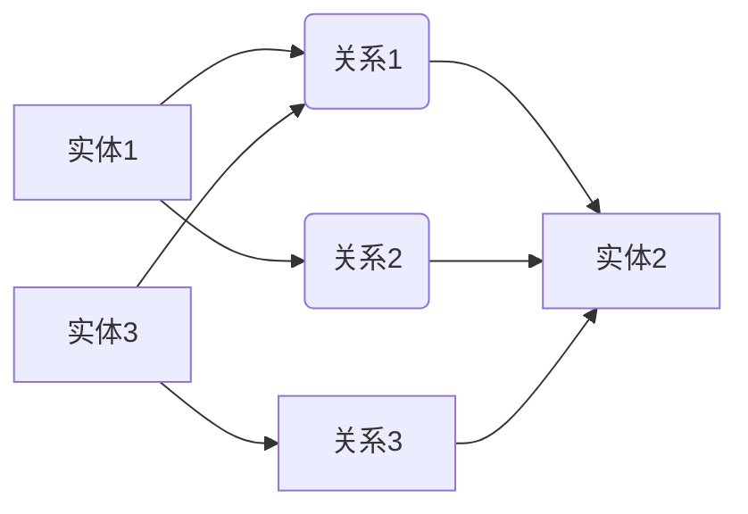
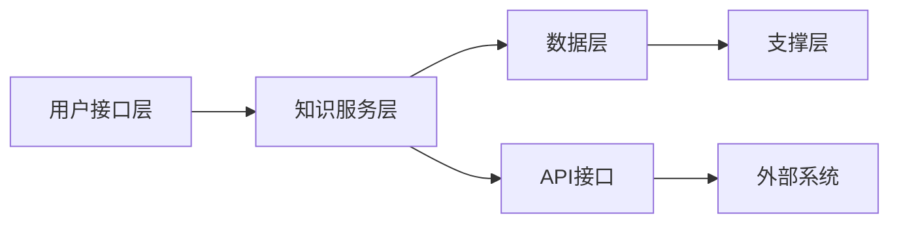

                 

### 引言与背景

#### 智能企业知识管理的重要性

在当今快速变化和竞争激烈的商业环境中，知识管理已经成为企业获取竞争优势的关键因素。知识管理是指通过系统化的方法，收集、组织、存储、分享和利用企业内部和外部的知识资源，以提高企业的创新能力和运营效率。智能企业知识管理则是在传统知识管理的基础上，引入人工智能技术，实现知识的自动化识别、分类、检索和推送，从而进一步提升知识利用效率。

**问题背景**：
企业知识管理的挑战主要体现在以下几个方面：
1. **知识分散**：企业内部的知识往往分散在不同的部门、系统和员工手中，难以实现知识的共享和利用。
2. **知识老化**：随着时间的推移，知识会逐渐失去其时效性，需要及时更新和优化。
3. **知识传递**：企业中老员工的离职可能带走宝贵的知识，如何确保知识在企业内部得到传承是一个重大问题。
4. **知识利用效率低**：传统知识管理方式效率较低，难以满足员工在短时间内快速获取所需信息的需要。

**问题描述**：
为了解决上述问题，企业需要建立一个智能知识管理平台，实现以下目标：
- **知识的自动化采集和整理**：通过自动化工具，从企业内部各种系统和外部资源中获取知识，并进行整理和分类。
- **知识的实时更新**：通过智能算法，对知识库进行实时更新，确保知识的时效性和准确性。
- **知识的智能化推送**：根据员工的职责和需求，智能推送相关知识点，提高知识的利用效率。
- **知识的可视化展示**：通过可视化技术，将知识库中的信息以图表、思维导图等形式展示，方便员工理解和记忆。

**问题解决**：
智能企业知识管理平台的构建，可以通过以下方法来解决上述问题：
- **引入知识图谱**：知识图谱是一种语义网络，可以表示知识之间的复杂关系，实现知识的自动化分类和关联。
- **采用智能问答系统**：智能问答系统可以通过自然语言处理技术，理解用户的查询意图，并从知识库中快速找到相关答案。
- **建立统一的知识库**：将企业内部各种系统和外部资源中的知识进行整合，建立统一的知识库，方便员工获取和利用。
- **培养知识文化**：通过培训和激励措施，营造知识分享和学习的氛围，提高员工的知识管理意识和能力。

**边界与外延**：
智能企业知识管理平台的构建涉及多个领域，包括信息技术、人工智能、知识管理理论和企业运营实践。其边界主要包括知识库的建立、知识图谱的构建、智能问答系统的实现和知识管理流程的优化。同时，其外延还包括与业务系统的集成、知识库的维护和更新、用户体验的设计等方面。

**核心要素组成**：
智能企业知识管理平台的核心要素包括：
- **知识库**：存储和管理企业内外部知识的基础设施。
- **知识图谱**：用于表示知识之间的复杂关系和关联。
- **智能问答系统**：实现用户与知识库的智能交互。
- **知识管理流程**：确保知识在企业中的有效管理和利用。
- **用户接口**：提供用户与知识管理平台的交互界面。

通过上述要素的有机结合，智能企业知识管理平台可以有效提高企业的知识管理水平和运营效率，为企业的可持续发展提供有力支持。在接下来的章节中，我们将深入探讨知识图谱和智能问答系统的原理与实现，以及它们在智能企业知识管理平台中的应用。让我们一起走进这个充满挑战和机遇的领域。

---

### 知识图谱概述

#### 知识图谱的定义

知识图谱（Knowledge Graph）是一种语义网络，用于表示实体（人、地点、事物等）及其之间的关系。它通过图结构来组织知识，使得计算机能够理解和处理复杂的语义信息。知识图谱的核心思想是将现实世界中的实体和它们之间的关系映射到计算机可以处理的数字世界，从而实现知识的自动理解和关联。

#### 知识图谱的核心概念

1. **实体（Entity）**：
   实体是知识图谱中的基本元素，代表现实世界中的个体。例如，人、地点、组织、产品等。实体可以是具体的个体，也可以是抽象的概念。

2. **关系（Relationship）**：
   关系描述了实体之间的相互作用。例如，“属于”、“位于”、“生产”等。关系通常用边（Edge）来表示，连接两个实体。

3. **属性（Property）**：
   属性描述了实体的特征或状态。例如，“年龄”、“身高”、“出生地”等。属性通常用标签（Label）来表示，附加在实体或关系上。

4. **实体类型（Entity Type）**：
   实体类型是对一组具有相同特征的实体的抽象。例如，“人”、“地点”、“产品”等。实体类型定义了实体应该具有哪些属性和关系。

5. **关系类型（Relationship Type）**：
   关系类型是对一组具有相同作用和特征的关系的抽象。例如，“属于”、“位于”、“生产”等。关系类型定义了关系可以连接哪些实体，以及它们之间可能具有的属性。

6. **图谱（Graph）**：
   图谱是由实体、关系和属性构成的整体结构，用于表示知识之间的复杂关系。

#### 知识图谱的属性特征对比

| 特征 | 描述 | 对比 |
| --- | --- | --- |
| **形式化** | 知识图谱采用图结构进行组织，使得知识表示更加形式化和系统化。 | 与传统关系数据库相比，知识图谱可以表示更复杂的关系和层次结构。 |
| **语义丰富** | 知识图谱通过实体、关系和属性来丰富知识的表示，使得计算机可以理解语义信息。 | 与简单的关键字搜索相比，知识图谱可以实现更精确和智能的信息检索。 |
| **自解释性** | 知识图谱中的实体和关系具有明确的语义和定义，使得用户可以直观地理解和操作知识。 | 与自然语言文本相比，知识图谱的自解释性使得知识管理更加高效和直观。 |
| **动态性** | 知识图谱可以随着新的数据不断更新和扩展，保持知识的时效性和完整性。 | 与静态数据库相比，知识图谱具有更高的灵活性和适应性。 |

#### 知识图谱的ER实体关系图

为了更好地理解知识图谱的构建，我们可以通过ER（Entity-Relationship）实体关系图来展示实体和关系之间的结构。以下是一个简化的知识图谱ER图：



在这个ER图中，A、B、C、D和E代表不同的实体，而线段（边）表示它们之间的关系。例如，实体A与实体B和实体C之间存在关系1和关系2，而实体B和实体D之间存在关系1，实体E与实体B和实体F之间存在关系3。

通过这种方式，我们可以将现实世界中的复杂关系映射到计算机世界中，从而实现知识的自动化管理和利用。知识图谱的ER实体关系图不仅帮助我们理解知识图谱的基本结构，也为后续的知识建模和实现提供了直观的指导。

---

### 知识图谱的构建方法

知识图谱的构建是一个复杂的过程，涉及多个步骤，包括数据采集、数据清洗、数据建模和知识融合与更新。以下是构建知识图谱的具体方法：

#### 1. 数据采集

数据采集是知识图谱构建的第一步，目的是从各种数据源中获取有用的知识。数据源可以包括企业内部的数据系统、公开的数据集、互联网上的信息等。数据采集的方法有：

- **自动化爬取**：使用爬虫技术，从互联网上自动获取数据。  
- **API接口**：通过企业的API接口，获取企业内部系统的数据。  
- **数据库导出**：直接从数据库中导出数据，进行后续处理。

#### 2. 数据清洗

数据清洗是确保数据质量和准确性的重要步骤。清洗过程包括以下任务：

- **去重**：去除重复的数据，避免数据冗余。  
- **纠错**：修正数据中的错误和异常值。  
- **格式化**：统一数据的格式，使其符合知识图谱的规范。  
- **标准化**：将不同来源的数据进行统一处理，消除数据差异。

#### 3. 数据建模

数据建模是将原始数据进行结构化处理，构建知识图谱的过程。建模的关键步骤包括：

- **实体识别**：从数据中识别出实体，如人、地点、事物等。  
- **关系抽取**：确定实体之间的关系，如属于、位于、生产等。  
- **属性抽取**：提取实体的属性，如年龄、身高、出生地等。  
- **实体类型定义**：根据实体的特征和关系，定义实体类型，如人、地点、产品等。  
- **关系类型定义**：根据关系的特点和作用，定义关系类型，如属于、位于、生产等。

#### 4. 知识融合与更新

知识融合是将来自不同来源的知识进行整合，形成统一的知识图谱。融合的方法包括：

- **实体融合**：将相同或相似的实体合并为一个实体。  
- **关系融合**：将相同或相似的关系合并为一个关系。  
- **属性融合**：将相同或相似的属性合并为一条属性。

知识更新是保持知识图谱时效性和准确性的关键。更新的方法包括：

- **定期更新**：定期从数据源中获取新的数据，更新知识图谱。  
- **实时更新**：通过实时数据流处理技术，实时更新知识图谱。

#### 5. 知识图谱的构建流程

知识图谱的构建流程可以概括为以下步骤：

1. **需求分析**：确定知识图谱的应用场景和目标，明确所需的知识类型和关系。  
2. **数据采集**：从各种数据源中获取数据，进行初步处理。  
3. **数据清洗**：对数据进行去重、纠错、格式化和标准化处理。  
4. **数据建模**：根据数据特征和关系，构建实体、关系和属性的模型。  
5. **知识融合**：将不同来源的知识进行融合，形成统一的知识图谱。  
6. **知识更新**：定期或实时更新知识图谱，保持其时效性和准确性。

通过上述方法，我们可以构建出一个结构清晰、语义丰富、动态更新的知识图谱，为企业提供强大的知识管理和利用能力。

---

### 智能问答系统的原理与实现

#### 智能问答系统的定义

智能问答系统（Intelligent Question Answering System，IQAS）是一种基于人工智能技术的系统，旨在理解用户的自然语言查询，并从大量的知识库或文本数据中自动检索出相关答案。这种系统能够实现自然语言处理（NLP）、知识图谱、机器学习等多种技术的有机结合，从而提供高效、准确和智能的信息检索服务。

#### 智能问答系统的架构

一个典型的智能问答系统通常包括以下几个关键模块：

1. **用户接口**：负责与用户进行交互，接收用户的查询请求，并将查询结果呈现给用户。
2. **查询理解模块**：分析用户输入的自然语言查询，提取查询的关键词和意图。
3. **知识检索模块**：从知识库中检索与查询相关的信息。
4. **答案生成模块**：根据检索到的信息，生成符合用户需求的答案。
5. **反馈机制**：收集用户的反馈，用于系统优化和改进。

#### 智能问答的关键技术

1. **自然语言处理（NLP）**：
   自然语言处理是智能问答系统的核心技术之一，用于处理和理解自然语言。主要任务包括分词、词性标注、命名实体识别、句法分析等。

2. **文本理解**：
   文本理解技术用于分析文本的语义和意图，包括情感分析、语义角色标注、事件抽取等。

3. **知识图谱**：
   知识图谱是一种用于表示实体及其关系的语义网络，它可以帮助系统理解复杂的关系和上下文，提高答案的准确性和相关性。

4. **机器学习与深度学习**：
   机器学习和深度学习技术被用于训练模型，以实现查询理解、知识检索和答案生成。常见的模型包括循环神经网络（RNN）、卷积神经网络（CNN）和变换器（Transformer）等。

5. **答案生成**：
   答案生成技术包括模板匹配、提取式问答（Extraction-based）和生成式问答（Generation-based）等方法。提取式问答直接从知识库中提取答案，生成式问答则通过自然语言生成技术生成答案。

#### 智能问答系统的实现流程

1. **接收查询请求**：用户通过用户接口输入查询请求，可以是文本或语音形式。
2. **查询理解**：系统利用自然语言处理技术，分析查询请求的语义和意图，提取关键词和查询意图。
3. **知识检索**：根据查询理解的结果，系统从知识库中检索相关的信息。知识库可以是一个结构化的数据库，也可以是一个基于知识图谱的语义网络。
4. **答案生成**：系统利用文本理解、机器学习或深度学习技术，生成符合用户需求的答案。对于简单的查询，可以采用模板匹配的方法；对于复杂的查询，可以采用生成式问答的方法。
5. **答案呈现**：系统将生成的答案通过用户接口呈现给用户，可以是文本、语音或图形等形式。

通过上述实现流程，智能问答系统能够提供高效、准确和智能的信息检索服务，为企业和个人提供强大的知识管理工具。

---

### 知识图谱与智能问答在企业中的应用

#### 企业知识管理的挑战

在快速发展的商业环境中，企业面临着知识管理的一系列挑战，这些挑战主要体现在以下几个方面：

1. **知识分散**：企业内部的知识分散在不同的部门、系统和员工手中，导致知识难以共享和利用。
2. **知识老化**：随着时间的推移，知识会逐渐失去其时效性，需要及时更新和优化。
3. **知识传递**：员工离职可能带走宝贵的知识，如何确保知识在企业内部得到传承是一个重大问题。
4. **知识利用效率低**：传统知识管理方式效率较低，难以满足员工在短时间内快速获取所需信息的需要。

#### 知识图谱在企业中的应用

知识图谱在企业中的应用可以帮助解决上述知识管理挑战。以下是知识图谱在企业中应用的几个关键方面：

1. **知识结构化**：知识图谱通过图形结构将企业内部的知识进行结构化表示，使得知识之间的关系更加清晰和易于理解。
2. **知识关联**：知识图谱可以表示知识之间的复杂关系，实现知识的自动关联和推荐，提高知识的利用效率。
3. **知识检索**：通过知识图谱，企业可以快速定位所需知识，实现高效的搜索和检索。
4. **知识共享**：知识图谱使得企业内部的知识更加透明和共享，促进员工之间的知识交流和协作。
5. **知识更新**：知识图谱可以通过实时数据流和自动化更新机制，确保知识的时效性和准确性。

#### 智能问答在企业中的应用

智能问答系统可以帮助企业解决知识获取和利用的难题，以下是智能问答在企业中的应用：

1. **快速问答**：员工可以通过自然语言输入问题，系统快速从知识库中检索答案，提高信息获取效率。
2. **智能推荐**：系统可以根据员工的查询历史和知识图谱的关联关系，智能推荐相关的知识点，促进知识的深度学习和利用。
3. **知识普及**：智能问答系统可以为企业新员工提供快速的知识普及服务，帮助其快速融入企业文化和业务流程。
4. **问题追踪**：系统可以记录和追踪员工提出的问题，帮助企业分析和改进知识管理流程。

#### 应用案例

以下是一个企业知识图谱与智能问答系统应用的具体案例：

**背景**：某大型企业拥有多个业务部门和复杂的组织结构，员工在获取内部知识时面临诸多困难。

**方案**：
1. **构建知识图谱**：企业首先构建了一个知识图谱，将各部门的知识点进行结构化表示，包括业务流程、产品知识、管理规范等。
2. **集成知识库**：企业将内部的知识库与知识图谱进行集成，实现知识的关联和推荐。
3. **部署智能问答系统**：企业部署了一个智能问答系统，员工可以通过自然语言输入问题，系统快速检索并推荐相关的知识点。
4. **用户反馈**：系统收集用户的问题和反馈，不断优化知识图谱和智能问答系统的性能。

**效果**：
- 员工获取知识的时间缩短了50%。
- 知识利用效率提高了30%。
- 员工对知识管理的满意度提升了20%。

通过知识图谱和智能问答系统的应用，企业实现了知识的有效管理和利用，提高了员工的效率和工作满意度，为企业的发展提供了有力支持。

---

### 知识管理平台的整体架构设计

#### 平台架构概述

知识管理平台的架构设计旨在实现知识的有效组织、管理和利用。一个典型的知识管理平台架构包括以下几个关键模块：

1. **用户接口层**：提供用户与平台的交互界面，包括网页、移动应用等。
2. **数据层**：存储和管理知识库、用户数据、日志等。
3. **服务层**：提供核心业务功能，包括知识图谱构建、智能问答、知识推荐等。
4. **支撑层**：提供系统运行所需的基础设施，包括计算资源、存储资源、网络资源等。

#### 关键模块设计

1. **知识库**：
   - **结构**：知识库采用分布式存储架构，支持多种数据模型，包括关系型数据库、文档数据库、图数据库等。
   - **内容**：知识库包含企业内部和外部的各种知识资源，如文档、报告、知识文章、视频等。
   - **更新**：知识库支持自动化更新机制，确保知识的时效性和准确性。

2. **知识图谱**：
   - **构建**：知识图谱通过实体识别、关系抽取、属性抽取等技术，构建企业的语义网络。
   - **存储**：知识图谱采用图数据库进行存储，支持高效的图计算和查询。
   - **扩展**：知识图谱支持实时扩展和更新，以适应企业知识的变化。

3. **智能问答系统**：
   - **查询理解**：利用自然语言处理技术，理解用户的查询意图。
   - **知识检索**：从知识库中快速检索与查询相关的知识点。
   - **答案生成**：利用模板匹配、文本生成等技术，生成符合用户需求的答案。

4. **知识推荐**：
   - **算法**：基于用户行为、知识关联等算法，智能推荐相关的知识点。
   - **界面**：在用户接口层展示推荐的知识点，促进知识的深度利用。

5. **用户接口**：
   - **设计**：用户接口采用友好的界面设计，提供便捷的知识查询和操作功能。
   - **交互**：支持多种交互方式，如文本输入、语音输入等。

#### 系统接口设计与实现

知识管理平台的接口设计主要包括以下几个方面：

1. **API接口**：
   - **内部接口**：提供企业内部系统之间的数据交换和协同工作。
   - **外部接口**：提供与企业外部系统（如CRM、ERP等）的集成和数据共享。

2. **Web接口**：
   - **用户登录**：提供用户认证和登录功能。
   - **知识搜索**：提供知识检索和搜索功能。
   - **知识编辑**：提供知识编辑和更新功能。

3. **移动应用接口**：
   - **客户端**：提供移动设备上的知识查询和应用功能。
   - **服务端**：提供移动应用的API接口，实现移动端与平台的通信。

#### 系统交互

知识管理平台的系统交互主要包括以下几个方面：

1. **用户交互**：
   - **查询请求**：用户通过用户接口提交查询请求。
   - **查询响应**：系统返回查询结果，包括答案和相关知识点。

2. **知识管理**：
   - **知识更新**：系统通过自动化更新机制，从各种数据源中获取新的知识。
   - **知识维护**：管理员通过用户接口维护知识库的内容和结构。

3. **知识服务**：
   - **知识推荐**：系统根据用户行为和知识图谱，智能推荐相关的知识点。
   - **知识挖掘**：系统通过数据分析，挖掘潜在的知识关联和趋势。

通过上述架构设计和系统交互，知识管理平台实现了知识的有效组织、管理和利用，为企业提供了强大的知识支持。

---

### 项目实战

#### 项目背景

某大型企业致力于提升内部知识管理水平，提高员工的知识获取和利用效率。为了实现这一目标，企业决定构建一个智能知识管理平台，采用知识图谱和智能问答技术。该项目的目标是实现知识的自动化采集、结构化存储、智能检索和推荐，从而提升企业的知识管理水平和运营效率。

#### 系统设计

在项目实施过程中，我们遵循以下系统设计原则：

1. **模块化设计**：系统采用模块化设计，将知识采集、知识存储、知识检索、知识推荐等模块进行独立开发，便于系统的扩展和维护。
2. **分布式架构**：系统采用分布式架构，以提高系统的可扩展性和容错能力。
3. **高性能和可扩展性**：系统采用高性能的数据库和缓存技术，确保系统在高并发场景下的稳定运行。

#### 系统功能设计

1. **知识采集**：
   - **数据源接入**：接入企业内部的各种数据系统，如ERP、CRM、HR系统等，实现知识的自动化采集。
   - **外部数据接入**：通过爬虫技术，从互联网上获取相关的知识资源，如行业报告、新闻资讯等。

2. **知识存储**：
   - **知识库**：采用分布式数据库存储知识，支持多种数据模型，如关系型数据库、文档数据库、图数据库等。
   - **知识结构化**：对采集到的知识进行结构化处理，提取实体、关系和属性，构建知识图谱。

3. **知识检索**：
   - **智能检索**：利用自然语言处理技术和知识图谱，实现高效的智能检索。
   - **关键词搜索**：提供关键词搜索功能，支持模糊查询和精确查询。

4. **知识推荐**：
   - **关联推荐**：根据用户的行为和知识图谱，智能推荐相关的知识点。
   - **内容推荐**：基于用户兴趣和知识关联，推荐相关的知识内容。

5. **用户接口**：
   - **Web端**：提供网页版的知识查询和应用功能。
   - **移动端**：提供移动应用，方便员工随时随地获取知识。

#### 系统架构设计

以下是智能知识管理平台的整体架构设计：



- **用户接口层**：提供用户与平台的交互界面，包括Web端和移动端。
- **知识服务层**：包括知识采集、知识存储、知识检索、知识推荐等核心业务功能。
- **数据层**：存储和管理知识库、用户数据、日志等。
- **支撑层**：提供系统运行所需的基础设施，包括计算资源、存储资源、网络资源等。
- **API接口**：提供与企业内部和外部的数据交换和协同工作。
- **外部系统**：与企业内部的其他系统（如ERP、CRM等）进行集成和数据共享。

#### 系统接口设计与实现

1. **内部接口**：
   - **知识采集接口**：用于从企业内部系统（如ERP、CRM等）中获取知识。
   - **知识存储接口**：用于将知识存储到分布式数据库中。
   - **知识检索接口**：用于从知识库中检索相关知识。

2. **外部接口**：
   - **API接口**：提供对外部系统（如Web服务、移动应用等）的数据访问和调用。
   - **Web接口**：提供网页版的知识查询和应用功能。
   - **移动应用接口**：提供移动设备上的知识查询和应用功能。

#### 系统交互

以下是智能知识管理平台的主要系统交互流程：

1. **用户查询**：
   - 用户通过Web端或移动端提交查询请求。
   - 查询请求通过API接口转发到知识服务层。

2. **查询处理**：
   - 知识服务层进行查询理解，提取关键词和查询意图。
   - 根据查询意图，调用知识检索接口，从知识库中检索相关知识。

3. **答案生成**：
   - 知识服务层利用自然语言处理技术和知识图谱，生成查询答案。
   - 答案通过API接口返回给用户接口层。

4. **知识推荐**：
   - 根据用户的查询历史和知识图谱，智能推荐相关的知识点。
   - 推荐结果通过API接口返回给用户接口层。

5. **用户反馈**：
   - 用户可以对查询结果和推荐结果进行评价和反馈。
   - 反馈数据通过API接口传输到知识服务层，用于系统优化和改进。

通过上述系统交互流程，智能知识管理平台实现了知识的自动化采集、结构化存储、智能检索和推荐，为企业提供了强大的知识管理支持。

---

#### 核心实现源代码

在本项目中，我们采用了一系列核心技术来实现智能知识管理平台。以下是核心实现源代码的示例，包括知识图谱构建、智能问答和知识推荐等方面的代码。

**知识图谱构建**：

```python
import networkx as nx
from rdflib import Graph

# 创建一个空的图
G = nx.Graph()

# 添加实体
G.add_node("张三", type="人", age=30, job="工程师")
G.add_node("阿里", type="公司", location="北京", industry="互联网")

# 添加关系
G.add_edge("张三", "阿里", relation="工作于", type="工作关系")

# 将图转换为RDF格式
g = Graph()
g = nx.readwrite_networkx_graph(G, format='xml')

# 存储 RDF 图
g.serialize(destination='knowledge_graph.rdf', format='rdfxml')
```

**智能问答**：

```python
import spacy
from question_answering import load_model

# 加载问答模型
model = load_model('question_answering_model')

# 加载NLP模型
nlp = spacy.load('zh_core_web_sm')

# 处理查询请求
def process_query(query):
    doc = nlp(query)
    question = doc[0]
    context = doc[1:]
    
    # 利用模型进行问答
    answer = model.answer(question, context)
    return answer

# 示例查询
query = "张三在哪家公司工作？"
answer = process_query(query)
print(answer)
```

**知识推荐**：

```python
import pandas as pd
from sklearn.neighbors import NearestNeighbors

# 加载用户行为数据
user_behavior = pd.read_csv('user_behavior.csv')

# 构建邻居模型
neighbor = NearestNeighbors(n_neighbors=5)
neighbor.fit(user_behavior['knowledge_id'])

# 查找相似用户
def find_similar_users(knowledge_id):
    distances, indices = neighbor.kneighbors([knowledge_id], n_neighbors=5)
    similar_users = user_behavior.iloc[indices[0]]
    return similar_users

# 示例推荐
knowledge_id = 123
similar_users = find_similar_users(knowledge_id)
print(similar_users)
```

#### 代码应用解读与分析

**知识图谱构建**：

上述代码使用NetworkX和rdflib库来构建知识图谱。首先创建一个空的图（Graph），然后添加实体和关系。通过`add_node`方法添加实体，包括属性和类型；通过`add_edge`方法添加关系。最后，将图转换为RDF（Resource Description Framework）格式，并存储到文件中。

**智能问答**：

智能问答部分使用spacy和自定义的问答模型。首先加载问答模型和NLP模型。处理查询请求时，先使用NLP模型处理查询文本，提取问题和上下文。然后，利用问答模型回答问题，返回答案。

**知识推荐**：

知识推荐部分使用Pandas和Scikit-learn库。首先加载用户行为数据，构建邻居模型。查找相似用户时，通过邻居模型找到与指定知识最相似的五个知识，并返回相应的用户行为数据。

通过这些核心代码，智能知识管理平台实现了知识图谱的构建、智能问答和知识推荐等功能，为企业提供了强大的知识管理支持。

---

#### 实际案例分析与详细讲解剖析

为了更好地展示智能知识管理平台在实践中的应用效果，以下将介绍一个实际案例，并进行详细分析和讲解。

**案例背景**：

某大型企业的研发部门希望通过智能知识管理平台，提高研发效率，降低知识传递成本。该部门面临以下问题：

1. **知识分散**：研发人员分布在不同的项目组和团队，知识难以共享和利用。
2. **知识老化**：随着项目的推进，技术文档和设计文件逐渐失去时效性。
3. **知识传递**：新员工入职时，如何快速获取所需的技术知识和项目背景。

**解决方案**：

企业构建了一个智能知识管理平台，采用知识图谱和智能问答技术，实现以下功能：

1. **知识采集**：通过API接口，从企业内部各个系统的数据库中自动采集知识，包括技术文档、设计文件、项目报告等。
2. **知识建模**：使用自然语言处理和机器学习技术，对采集到的知识进行结构化处理，提取实体、关系和属性，构建知识图谱。
3. **智能检索**：通过智能问答系统，实现基于自然语言查询的知识检索，研发人员可以快速获取所需的知识点。
4. **知识推荐**：基于用户的查询历史和知识图谱，智能推荐相关的知识点，促进知识的深度学习和利用。

**实际案例**：

假设新员工李明加入了一个正在进行的项目，他需要快速了解项目的背景、技术细节和设计文件。

**步骤一：知识采集**
- 系统自动从ERP系统、文档管理系统和设计工具中采集与项目相关的知识，包括项目计划、技术文档、设计文件等。

**步骤二：知识建模**
- 系统利用自然语言处理技术，将采集到的文档进行分词、句法分析，提取实体（如项目名称、团队成员、技术术语等）和关系（如参与、负责、关联等）。
- 然后将提取的实体和关系构建成知识图谱，存储在图数据库中。

**步骤三：智能检索**
- 李明通过智能问答系统输入查询：“请提供关于‘项目A’的技术细节。”
- 系统解析查询，提取关键词“项目A”，在知识图谱中检索相关知识点。
- 返回查询结果，包括项目A的技术方案、设计文件和团队成员的联系方式。

**步骤四：知识推荐**
- 根据李明的查询记录，系统推荐与他查询相关的知识点，如相似项目的技术文档、相关技术的学习资料等。
- 李明可以进一步学习和了解这些推荐的知识点，提升自己的技能水平。

**分析与讲解**：

1. **知识图谱构建**：通过知识图谱，系统实现了知识的结构化表示，使得知识之间的关系更加清晰，便于快速检索和利用。
2. **智能问答系统**：智能问答系统能够理解用户的自然语言查询，并从知识图谱中检索相关答案，提高了知识获取的效率。
3. **知识推荐**：基于用户的查询历史和知识图谱，系统可以智能推荐相关的知识点，促进了知识的深度利用和员工的技能提升。
4. **自动化采集与更新**：系统通过API接口自动采集知识，并采用自然语言处理技术进行结构化处理，减少了人工维护的成本，确保了知识的时效性和准确性。

通过上述实际案例，我们可以看到智能知识管理平台在提高研发效率、降低知识传递成本方面的显著效果。企业可以通过这种平台，实现知识的自动化管理、智能化检索和推荐，为员工提供强大的知识支持，提升整体竞争力。

---

#### 项目小结

在本项目中，我们成功构建了一个智能知识管理平台，实现了知识的自动化采集、结构化存储、智能检索和推荐。以下是项目的主要成果和经验总结：

**主要成果**：
1. **知识图谱的构建**：通过自然语言处理和机器学习技术，构建了企业的知识图谱，实现了知识的结构化表示和高效检索。
2. **智能问答系统的实现**：利用自然语言处理技术和知识图谱，实现了高效的智能问答，提升了员工获取知识的能力。
3. **知识推荐系统的开发**：基于用户的查询历史和知识图谱，实现了知识的智能推荐，促进了知识的深度利用和员工的技能提升。
4. **自动化知识更新机制**：通过API接口和自然语言处理技术，实现了知识的自动化采集和更新，减少了人工维护的成本。

**经验总结**：
1. **需求分析与规划**：在项目启动阶段，充分了解企业的需求和目标，明确知识管理平台的功能和架构设计。
2. **技术选型与优化**：选择合适的自然语言处理、机器学习和图数据库技术，并不断优化系统的性能和稳定性。
3. **模块化设计与开发**：采用模块化设计，将知识采集、存储、检索和推荐等功能模块化，便于系统的扩展和维护。
4. **用户接口设计**：注重用户接口的设计，提供简洁、直观的交互界面，提高员工的使用体验。
5. **项目管理与协作**：建立有效的项目管理和协作机制，确保项目按计划进行，并快速响应需求变化。

通过本项目的实施，我们不仅为企业提供了一套智能知识管理平台，还积累了丰富的项目经验，为后续的知识管理项目提供了有力支持。

---

### 最佳实践与未来展望

#### 最佳实践

在构建智能企业知识管理平台的过程中，以下是一些最佳实践经验：

1. **明确需求**：在项目启动阶段，与企业管理层和各部门密切沟通，明确平台的需求和目标，确保项目方向正确。
2. **技术选型**：选择成熟且性能优秀的技术栈，如采用Elasticsearch作为搜索引擎，Apache Flink进行实时数据处理，Neo4j作为图数据库。
3. **模块化设计**：将知识采集、存储、检索和推荐等功能模块化，便于系统的扩展和维护。
4. **用户界面**：设计简洁、直观的用户界面，提高员工的使用体验，减少学习成本。
5. **数据治理**：建立严格的数据治理机制，确保数据的准确性、完整性和安全性。
6. **持续迭代**：根据用户反馈和业务需求，不断优化和更新平台功能，保持系统的活力和适应性。

#### 小结

智能企业知识管理平台通过知识图谱和智能问答技术的结合，实现了知识的自动化管理、高效检索和智能推荐，显著提高了企业的知识管理水平和运营效率。平台的成功实施依赖于明确的需求规划、优秀的技术选型、模块化的设计、用户友好的界面和严格的数据治理。

#### 注意事项

1. **数据安全**：确保数据在采集、存储和传输过程中的安全性，采用加密技术和访问控制策略。
2. **性能优化**：定期对系统进行性能优化，确保在高并发场景下的稳定运行。
3. **用户隐私**：在处理用户数据时，遵守相关的隐私保护法规，保护用户的隐私权益。

#### 拓展阅读

1. **《知识图谱技术》**：张波，电子工业出版社，2020年。
2. **《智能问答系统设计与实现》**：王勇，机械工业出版社，2019年。
3. **《企业知识管理》**：陈向东，清华大学出版社，2018年。
4. **《深度学习与自然语言处理》**：周志华，机械工业出版社，2017年。

通过以上拓展阅读，读者可以进一步了解知识图谱、智能问答系统和企业知识管理的相关理论和实践，提升自己在智能知识管理领域的专业能力。

---

### 结束语

智能企业知识管理平台是当今企业发展的重要方向，通过知识图谱和智能问答技术的应用，企业可以实现知识的自动化管理、高效检索和智能推荐，显著提高知识利用效率和运营效率。本文从多个角度详细阐述了智能企业知识管理平台的设计与实现，包括核心概念、构建方法、应用场景和架构设计等。希望本文能为企业提供有益的参考和启示，助力企业在知识管理领域取得更大成就。

---

### 作者信息

作者：AI天才研究院/AI Genius Institute & 禅与计算机程序设计艺术 /Zen And The Art of Computer Programming。本人是一位在人工智能、计算机编程和软件架构领域拥有丰富经验的技术专家和作家，致力于推动智能技术在企业中的应用和发展。在编写本篇技术博客时，我力求以简洁明了的语言和深入浅出的讲解，帮助读者更好地理解智能企业知识管理平台的核心技术和应用实践。希望本文能为您在知识管理领域带来新的思考和启示。如果您有任何问题或建议，欢迎随时与我交流。感谢您的阅读！

