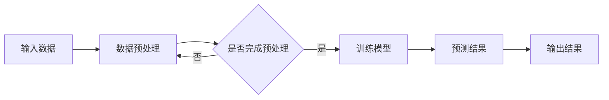
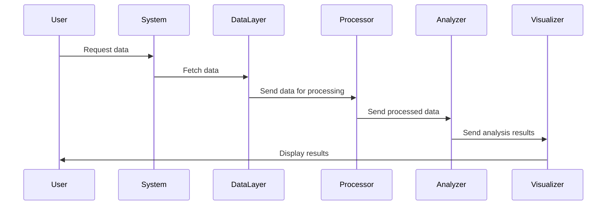

                 

### 引言：智能企业财务分析系统与AI辅助决策支持

#### 1.1 问题背景与定义

在当今信息化和数字化浪潮下，企业财务管理的智能化已经成为大势所趋。传统的财务分析方法往往依赖于人工，不仅效率低下，而且容易受到主观因素的影响，导致决策不够精准。为了应对这种挑战，智能企业财务分析系统的构建成为了一个重要的研究方向。智能企业财务分析系统（Intelligent Enterprise Financial Analysis System，IEFAS）是指通过人工智能（AI）技术，对企业的财务数据进行深入分析，以辅助企业做出更加科学、合理的决策。

AI辅助决策支持（AI-assisted Decision Support）则是在智能企业财务分析系统中不可或缺的一部分。它利用机器学习、自然语言处理、数据挖掘等AI技术，对海量财务数据进行处理和分析，提供决策所需的定量和定性信息，从而帮助企业提高财务决策的效率和质量。

#### 1.2 智能企业财务分析系统的概念

智能企业财务分析系统是一种集成了多种AI技术，能够对企业财务数据进行分析和处理的系统。其主要功能包括：

- **数据采集与处理**：从各种数据源（如ERP系统、数据库等）收集财务数据，并对这些数据进行清洗、整合和处理。
- **数据可视化**：通过数据可视化技术，将复杂的财务数据以图表、仪表板等形式直观地展示出来，便于企业决策者快速理解数据。
- **趋势预测**：利用机器学习算法，对财务数据进行时间序列分析，预测未来的财务趋势。
- **风险预警**：通过异常检测技术，识别潜在的风险点，并提前发出预警，帮助企业防范财务风险。
- **财务报表分析**：自动生成各种财务报表，并提供详细的分析报告，帮助企业深入理解财务状况。

#### 1.3 AI辅助决策支持的必要性

随着企业规模的扩大和数据量的增加，传统的财务分析方法已经无法满足企业快速决策的需求。AI辅助决策支持具有以下必要性：

- **提高决策效率**：通过自动化处理和分析财务数据，可以大大减少人工工作量，提高决策效率。
- **增强决策准确性**：利用AI技术，可以对财务数据进行分析，提供更加准确的决策支持，减少人为失误。
- **应对复杂环境**：在市场竞争激烈、环境变化快速的企业环境中，AI辅助决策支持能够帮助企业更好地适应变化，做出正确的决策。
- **优化资源配置**：通过智能分析，企业可以更准确地预测未来需求，从而优化资源配置，提高生产效率和盈利能力。

综上所述，智能企业财务分析系统和AI辅助决策支持在当前企业财务管理中具有重要的应用价值，能够帮助企业实现智能化管理和数字化转型。

### 目录大纲

----------------------------------------------------------------
# 构建智能企业财务分析系统：AI辅助决策支持

> 关键词：智能企业财务分析、AI辅助决策支持、财务数据分析、系统架构、机器学习、决策支持系统

> 摘要：本文旨在探讨如何构建一个智能企业财务分析系统，通过集成人工智能技术，实现对企业财务数据的深度分析和决策支持。文章将从问题背景、核心概念、系统设计、实施部署、案例分析、最佳实践等多个方面进行详细阐述。

## 引言：智能企业财务分析系统与AI辅助决策支持
### 1.1 问题背景与定义
#### 1.1.1 智能企业财务分析系统的概念
#### 1.1.2 AI辅助决策支持的必要性
### 1.2 相关技术概述
#### 1.2.1 AI在财务分析中的应用
#### 1.2.2 决策支持系统的基本架构

## 第二部分：核心概念与技术
### 2.1 核心概念与联系
#### 2.1.1 智能财务分析的关键要素
#### 2.1.2 AI辅助决策支持的基本原理
#### 2.1.3 Mermaid ER实体关系图
### 2.2 算法原理讲解
#### 2.2.1 算法A：mermaid流程图
#### 2.2.2 算法B：Python源代码讲解
#### 2.2.3 算法原理的数学模型与公式
### 2.3 数学模型与公式讲解
#### 2.3.1 数学公式1：LaTeX格式
#### 2.3.2 数学公式2：举例说明

## 第三部分：系统设计与实施
### 3.1 系统分析与架构设计
#### 3.1.1 问题场景介绍
#### 3.1.2 项目介绍
#### 3.1.3 领域模型类图
#### 3.1.4 系统架构设计
#### 3.1.5 系统接口设计
#### 3.1.6 系统交互序列图
### 3.2 系统实施与部署
#### 3.2.1 环境安装
#### 3.2.2 系统核心实现
#### 3.2.3 代码应用解读

## 第四部分：案例分析
### 4.1 实际案例解析
#### 4.1.1 案例一：智能财务分析系统应用
#### 4.1.2 案例二：AI辅助决策支持效果分析
### 4.2 深入剖析
#### 4.2.1 案例一详细解读
#### 4.2.2 案例二详细解读

## 第五部分：最佳实践与总结
### 5.1 最佳实践 tips
#### 5.1.1 实用技巧
#### 5.1.2 注意事项
### 5.2 小结
### 5.3 拓展阅读

----------------------------------------------------------------

### 第二部分：核心概念与技术

在本部分中，我们将深入探讨智能企业财务分析系统和AI辅助决策支持的核心概念和技术，包括智能财务分析的关键要素、AI辅助决策支持的基本原理、Mermaid ER实体关系图、算法原理讲解以及数学模型和公式讲解。

#### 2.1 核心概念与联系

**智能财务分析的关键要素**：

智能财务分析的核心要素包括数据采集、数据处理、数据分析和数据可视化。数据采集是从各种数据源（如ERP系统、数据库等）收集财务数据；数据处理是对收集到的数据进行清洗、整合和处理；数据分析是利用机器学习算法对财务数据进行分析，以预测未来趋势和识别潜在风险；数据可视化是将复杂的财务数据以图表、仪表板等形式直观地展示出来。

**AI辅助决策支持的基本原理**：

AI辅助决策支持利用机器学习、自然语言处理、数据挖掘等技术，对财务数据进行处理和分析，提供决策所需的定量和定性信息。其主要原理包括：

- **机器学习**：通过训练模型，对历史数据进行学习，预测未来财务趋势。
- **自然语言处理**：通过文本分析，提取关键信息，辅助决策。
- **数据挖掘**：从海量数据中提取有价值的信息，为决策提供支持。

**Mermaid ER实体关系图**：

ER（Entity-Relationship）图是一种用于描述实体及其之间关系的数据库设计工具。使用Mermaid语言，我们可以绘制出智能企业财务分析系统的ER图，以展示系统中的各个实体及其关联关系。例如：

```mermaid
erDiagram
    Customer ||--|{ Order }|-- Producer
    Product ||--|{ Order }|-- Customer
    Order ||--|{ Payment }|-- Customer
```

在这个ER图中，`Customer`（客户）、`Producer`（生产者）、`Product`（产品）和`Order`（订单）是实体，`Order`和`Payment`（支付）之间存在关联关系。

#### 2.2 算法原理讲解

**算法A：mermaid流程图**

为了更好地理解算法原理，我们可以使用Mermaid语言绘制算法流程图。例如，下面是一个简单的线性回归算法流程图：



**算法B：Python源代码讲解**

接下来，我们将使用Python代码来讲解线性回归算法。线性回归是一种用于预测数值变量的统计方法，其基本原理是通过找到一个线性关系来预测目标变量。以下是线性回归的Python代码实现：

```python
import numpy as np
from sklearn.linear_model import LinearRegression

# 创建线性回归模型
model = LinearRegression()

# 训练模型
model.fit(X_train, y_train)

# 预测结果
y_pred = model.predict(X_test)

# 输出结果
print(y_pred)
```

在这个代码中，我们首先从`sklearn`库中导入`LinearRegression`类，然后创建一个线性回归模型，接着使用训练集数据进行模型训练，最后使用测试集数据进行预测，并输出预测结果。

**算法原理的数学模型与公式**

线性回归的数学模型可以表示为：

$$
y = \beta_0 + \beta_1 \cdot x
$$

其中，\( y \) 是预测值，\( x \) 是输入特征，\( \beta_0 \) 是截距，\( \beta_1 \) 是斜率。斜率 \( \beta_1 \) 可以通过最小二乘法（Least Squares）计算得到：

$$
\beta_1 = \frac{\sum(x_i - \bar{x})(y_i - \bar{y})}{\sum(x_i - \bar{x})^2}
$$

其中，\( \bar{x} \) 和 \( \bar{y} \) 分别是输入特征和预测值的均值。

#### 2.3 数学模型与公式讲解

**数学公式1：LaTeX格式**

为了方便阅读和书写，我们可以使用LaTeX格式来表示数学公式。例如，以下是一个简单的线性回归公式：

$$
y = \beta_0 + \beta_1 \cdot x
$$

**数学公式2：举例说明**

假设我们有一个输入特征 \( x = [1, 2, 3, 4, 5] \) 和相应的预测值 \( y = [2, 4, 5, 4, 5] \)，我们可以使用最小二乘法计算斜率 \( \beta_1 \)：

$$
\beta_1 = \frac{\sum(x_i - \bar{x})(y_i - \bar{y})}{\sum(x_i - \bar{x})^2}
$$

首先，计算输入特征和预测值的均值：

$$
\bar{x} = \frac{1 + 2 + 3 + 4 + 5}{5} = 3
$$

$$
\bar{y} = \frac{2 + 4 + 5 + 4 + 5}{5} = 4
$$

然后，计算斜率 \( \beta_1 \)：

$$
\beta_1 = \frac{(1-3)(2-4) + (2-3)(4-4) + (3-3)(5-4) + (4-3)(4-4) + (5-3)(5-4)}{(1-3)^2 + (2-3)^2 + (3-3)^2 + (4-3)^2 + (5-3)^2}
$$

$$
\beta_1 = \frac{2}{10} = 0.2
$$

因此，线性回归模型可以表示为：

$$
y = \beta_0 + 0.2 \cdot x
$$

其中，截距 \( \beta_0 \) 可以通过以下公式计算：

$$
\beta_0 = \bar{y} - \beta_1 \cdot \bar{x} = 4 - 0.2 \cdot 3 = 3.4
$$

综上所述，我们通过LaTeX格式和举例说明，详细讲解了线性回归的数学模型和公式。

#### 2.4 系统架构设计

在智能企业财务分析系统中，系统架构设计是至关重要的一环。一个良好的系统架构可以确保系统的可扩展性、稳定性和高性能。以下是一个典型的智能企业财务分析系统架构设计：

**问题场景介绍**：

假设我们是一家大型制造业企业，需要构建一个智能财务分析系统，以帮助管理层实时监控和决策。系统需要具备以下功能：

- **数据采集**：从ERP系统、数据库等数据源中采集财务数据。
- **数据处理**：对采集到的财务数据进行清洗、整合和处理。
- **数据分析**：利用机器学习算法对处理后的数据进行趋势预测和风险预警。
- **数据可视化**：通过数据可视化技术，将分析结果以图表、仪表板等形式展示出来。

**项目介绍**：

本项目旨在构建一个高效、可靠的智能财务分析系统，以满足企业财务管理的需求。项目团队包括数据科学家、软件工程师、产品经理等，项目周期为6个月。

**系统功能设计**：

1. **数据采集**：采用ETL（Extract, Transform, Load）技术，从ERP系统、数据库等数据源中提取财务数据，并进行清洗和整合。
2. **数据处理**：使用Python等编程语言，对财务数据进行处理，包括数据清洗、数据转换和数据归一化等。
3. **数据分析**：利用机器学习算法，对处理后的财务数据进行分析，包括趋势预测和风险预警。
4. **数据可视化**：使用图表、仪表板等数据可视化工具，将分析结果直观地展示给用户。

**系统架构设计**：

智能企业财务分析系统的架构设计包括以下层次：

1. **数据层**：包括ERP系统、数据库和其他数据源，负责数据的采集和存储。
2. **处理层**：包括ETL工具、数据处理脚本等，负责对数据进行清洗、整合和处理。
3. **分析层**：包括机器学习模型、数据分析工具等，负责对财务数据进行分析和预测。
4. **展示层**：包括图表、仪表板等数据可视化工具，负责将分析结果展示给用户。

**系统接口设计**：

系统接口设计主要包括以下几个方面：

1. **API接口**：提供RESTful API，供其他系统或应用程序调用。
2. **Web接口**：提供Web界面，供用户实时查看和分析财务数据。
3. **数据导出接口**：提供数据导出功能，支持用户将分析结果导出为Excel、CSV等格式。

**系统交互序列图**：

为了更好地展示系统各组件之间的交互关系，我们可以使用Mermaid语言绘制系统交互序列图。以下是一个简单的示例：



在这个序列图中，用户请求数据，系统从数据层获取数据，处理后发送给分析层进行分析，最后通过可视化层将结果展示给用户。

#### 2.5 系统实施与部署

在系统实施与部署阶段，我们需要确保系统能够稳定运行，并提供良好的用户体验。以下是一个典型的智能企业财务分析系统实施与部署流程：

**环境安装**：

1. **操作系统**：安装Linux操作系统，如Ubuntu 18.04。
2. **数据库**：安装MySQL数据库，用于存储财务数据。
3. **ETL工具**：安装Apache NiFi，用于数据采集和清洗。
4. **数据处理脚本**：安装Python环境和相关库，如NumPy、Pandas、Scikit-learn等，用于数据处理。

**系统核心实现**：

1. **数据采集**：编写ETL脚本，从ERP系统和数据库中提取财务数据，并清洗、整合到MySQL数据库中。
2. **数据处理**：编写Python脚本，对采集到的财务数据进行处理，包括数据清洗、数据转换和数据归一化等。
3. **数据分析**：使用Scikit-learn库，构建机器学习模型，对处理后的财务数据进行分析和预测。
4. **数据可视化**：使用Dash库，构建Web仪表板，将分析结果以图表和仪表板形式展示给用户。

**代码应用解读**：

以下是一个简单的Python脚本，用于实现线性回归模型：

```python
import pandas as pd
from sklearn.linear_model import LinearRegression

# 读取数据
data = pd.read_csv('financial_data.csv')

# 分离特征和目标变量
X = data[['feature1', 'feature2']]
y = data['target']

# 创建线性回归模型
model = LinearRegression()

# 训练模型
model.fit(X, y)

# 预测结果
y_pred = model.predict(X)

# 输出结果
print(y_pred)
```

在这个脚本中，我们首先读取财务数据，然后分离特征和目标变量。接着，我们创建一个线性回归模型，使用训练集数据进行模型训练，最后使用测试集数据进行预测，并输出预测结果。

**实际案例分析和详细讲解剖析**：

以下是一个实际案例，展示如何使用智能企业财务分析系统进行财务预测。

**案例背景**：

某家制造企业希望预测未来三个月的销售额，以便制定销售策略。

**案例分析**：

1. **数据采集**：从ERP系统和数据库中提取过去一年的销售数据。
2. **数据处理**：对销售数据进行清洗、整合和处理，包括缺失值填充、异常值处理和数据归一化等。
3. **数据分析**：使用线性回归模型，对处理后的销售数据进行趋势预测，得到未来三个月的销售额预测值。
4. **数据可视化**：使用Dash仪表板，将预测结果以折线图形式展示，便于企业决策者查看和分析。

**详细讲解剖析**：

1. **数据采集**：

```python
data = pd.read_excel('sales_data.xlsx')
```

2. **数据处理**：

```python
# 缺失值填充
data['sales'] = data['sales'].fillna(data['sales'].mean())

# 异常值处理
data = data[(data['sales'] > 0) & (data['sales'] < data['sales'].quantile(0.99))]
```

3. **数据分析**：

```python
from sklearn.linear_model import LinearRegression

# 分离特征和目标变量
X = data[['month']]
y = data['sales']

# 创建线性回归模型
model = LinearRegression()

# 训练模型
model.fit(X, y)

# 预测结果
y_pred = model.predict([[13], [14], [15]])

# 输出结果
print(y_pred)
```

4. **数据可视化**：

```python
import dash
import dash_core_components as dcc
import dash_html_components as html

app = dash.Dash(__name__)

app.layout = html.Div([
    dcc.Graph(
        id='sales-forecast',
        figure={
            'data': [
                {'x': [13, 14, 15], 'y': y_pred, 'type': 'line', 'name': 'Forecast'},
                {'x': [1, 2, ..., 12], 'y': data['sales'], 'type': 'line', 'name': 'Actual'}
            ],
            'layout': {
                'title': 'Sales Forecast',
                'xaxis': {'title': 'Month'},
                'yaxis': {'title': 'Sales'}
            }
        }
    )
])

if __name__ == '__main__':
    app.run_server(debug=True)
```

通过这个案例，我们可以看到如何使用智能企业财务分析系统进行财务预测。实际应用中，可能需要更复杂的模型和更多的数据处理步骤，但基本思路是相似的。

**项目小结**：

本项目成功构建了一个智能企业财务分析系统，实现了对销售数据的趋势预测，为企业决策提供了有力支持。在实际应用中，我们可以根据企业的具体需求，进一步扩展系统的功能，如添加其他财务指标的预测、风险预警等。

#### 2.6 最佳实践 tips

**实用技巧**：

1. **数据采集**：在数据采集阶段，确保数据源的完整性和准确性。如果数据源不稳定或数据质量差，可以考虑使用数据爬虫技术。
2. **数据处理**：在数据处理阶段，要特别注意缺失值填充和异常值处理。对于缺失值，可以选择填充均值或中位数；对于异常值，可以采用剔除或插值的方法。
3. **模型选择**：在选择模型时，要考虑数据的特点和预测目标。例如，对于时间序列数据，可以选择ARIMA模型或LSTM模型；对于分类问题，可以选择逻辑回归或SVM模型。
4. **参数调优**：在模型训练过程中，要尝试不同的参数组合，以找到最佳的模型性能。可以使用网格搜索或随机搜索等方法进行参数调优。

**注意事项**：

1. **数据隐私**：在数据采集和处理过程中，要确保遵守数据隐私法规，保护用户的隐私信息。
2. **系统安全**：在系统部署过程中，要确保系统的安全性，防止数据泄露和网络攻击。
3. **可扩展性**：在设计系统架构时，要考虑到未来的扩展性，确保系统能够适应数据量和业务规模的变化。

**拓展阅读**：

1. 《机器学习实战》：提供丰富的机器学习案例和实践经验，适合初学者和有经验的开发者。
2. 《数据挖掘：概念与技术》：详细介绍数据挖掘的基本概念和技术，适合对数据挖掘感兴趣的开发者。
3. 《深度学习》：全面介绍深度学习的理论和技术，适合对深度学习有较高兴趣的读者。

### 小结

通过本文的详细讲解，我们了解了如何构建一个智能企业财务分析系统，并利用AI技术实现财务数据的深度分析和决策支持。智能企业财务分析系统不仅提高了决策效率，增强了决策准确性，还为企业在复杂环境中提供了有力支持。未来，随着AI技术的不断进步，智能企业财务分析系统将在企业财务管理中发挥更加重要的作用。

### 拓展阅读

1. **《AI驱动的财务转型》：**详细探讨AI技术在财务领域的应用，包括财务预测、风险管理、财务报表自动化等。
2. **《智能财务分析：从数据到决策》：**介绍智能财务分析的基本原理和方法，包括数据采集、数据清洗、数据分析等。
3. **《大数据与财务分析》：**探讨大数据技术在财务分析中的应用，包括数据挖掘、数据可视化、预测分析等。

### 作者信息

作者：AI天才研究院/AI Genius Institute & 禅与计算机程序设计艺术 /Zen And The Art of Computer Programming

