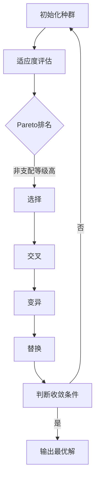
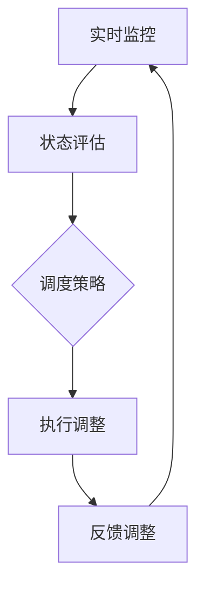

                 


### # 构建智能企业资源调度系统：多目标优化与动态平衡

关键词：智能调度、多目标优化、动态平衡、资源管理、企业IT架构

摘要：本文探讨了构建智能企业资源调度系统的关键要素，包括多目标优化和动态平衡策略。通过对企业资源调度问题的深入分析，本文提出了基于多目标优化和动态平衡的解决方案，并通过详细的系统架构设计和实际项目案例，展示了如何将这一方案应用于实际场景，为企业提供高效、灵活的资源调度服务。

## **一、背景介绍**

### 1.1 核心概念术语说明

- **企业资源调度**：企业资源调度是指根据企业的业务需求和资源状况，合理分配和利用企业内部的各种资源，包括人力、物资、设备等，以满足业务需求，提高资源利用率和生产效率。
- **多目标优化**：多目标优化是指在一个问题中同时追求多个目标，这些目标可能存在冲突，需要通过优化算法找到一种平衡，使这些目标都得到不同程度的满足。
- **动态平衡**：动态平衡是指系统在运行过程中，通过实时调整资源分配，以适应不断变化的业务需求和资源状况，保持系统的稳定性和高效性。

### 1.2 问题背景

在当今竞争激烈的市场环境中，企业需要高效地管理和调度其资源，以快速响应市场需求，提高生产效率和降低成本。传统的资源调度方法往往基于预定义的规则和固定模型，难以适应复杂多变的业务场景。随着人工智能和大数据技术的发展，智能企业资源调度系统成为企业提升竞争力的重要手段。

### 1.3 问题描述

企业资源调度问题可以描述为：在一个不确定的业务环境中，如何合理分配和利用企业的各种资源，以满足业务需求，同时最大化资源利用率和生产效率。这个问题涉及到多个目标的优化，如成本最小化、效率最大化、客户满意度提升等，这些目标之间可能存在冲突。

### 1.4 问题解决

为了解决企业资源调度问题，我们需要采用多目标优化和动态平衡策略。多目标优化可以帮助我们同时考虑多个目标，找到一种平衡的解决方案。动态平衡策略则能够使系统在运行过程中，根据业务需求和资源状况的变化，实时调整资源分配，保持系统的稳定性和高效性。

### 1.5 边界与外延

- **边界**：企业资源调度系统的边界包括企业内部的各种资源，如人力、物资、设备等，以及企业的业务需求和市场环境。
- **外延**：智能企业资源调度系统不仅可以应用于单一企业的内部调度，还可以扩展到跨企业的供应链调度，甚至应用于公共资源的调度，如城市交通管理。

### 1.6 概念结构与核心要素组成

智能企业资源调度系统的概念结构包括以下几个核心要素：

1. **资源模型**：描述企业内部的各类资源，如人力、物资、设备等，以及资源的属性和状态。
2. **业务模型**：描述企业的业务需求和业务流程，包括订单处理、生产计划、物流配送等。
3. **优化模型**：定义多目标优化的目标函数和约束条件，包括成本、效率、客户满意度等。
4. **调度策略**：定义动态平衡的调度策略，如资源分配、优先级调整、故障恢复等。
5. **系统架构**：定义系统的整体架构，包括硬件、软件、数据、网络等组成部分。

## **二、核心概念与联系**

### 2.1 企业资源调度

企业资源调度是指根据企业的业务需求和资源状况，合理分配和利用企业内部的各种资源，以满足业务需求，提高资源利用率和生产效率。企业资源调度涉及到多个方面的内容：

1. **资源分类**：企业资源可以分为人力资源、物资资源、设备资源等。
2. **资源状态**：资源状态包括资源的可用性、忙碌状态、维护状态等。
3. **调度规则**：调度规则是指根据业务需求和资源状况，制定的资源分配和调度策略。
4. **调度算法**：调度算法是指用于优化资源分配和调度的算法，如多目标优化算法、动态调度算法等。

### 2.2 多目标优化

多目标优化是指在一个问题中同时追求多个目标，这些目标可能存在冲突，需要通过优化算法找到一种平衡，使这些目标都得到不同程度的满足。多目标优化的核心在于确定优化目标、优化目标和约束条件，以及选择合适的优化算法。

1. **优化目标**：优化目标包括成本最小化、效率最大化、客户满意度提升等。
2. **约束条件**：约束条件包括资源的限制、时间的限制、质量的限制等。
3. **优化算法**：优化算法包括线性规划、非线性规划、遗传算法、粒子群优化等。

### 2.3 动态平衡

动态平衡是指系统在运行过程中，通过实时调整资源分配，以适应不断变化的业务需求和资源状况，保持系统的稳定性和高效性。动态平衡的关键在于实时监控业务需求和资源状况，并制定相应的调度策略。

1. **实时监控**：实时监控业务需求和资源状况，包括订单量、库存量、设备状态等。
2. **调度策略**：调度策略包括资源分配、优先级调整、故障恢复等。
3. **自适应调整**：根据实时监控的结果，自适应调整资源分配和调度策略，以保持系统的稳定性和高效性。

### 2.4 核心概念关系

企业资源调度、多目标优化和动态平衡三者之间存在紧密的联系：

- **企业资源调度**是智能企业资源调度系统的核心，决定了资源的合理分配和利用。
- **多目标优化**为企业资源调度提供了优化目标和方法，使资源调度更加科学和高效。
- **动态平衡**确保了资源调度系统在运行过程中的稳定性和适应性，使系统能够持续优化资源分配。

通过多目标优化和动态平衡，智能企业资源调度系统能够在复杂多变的业务环境中，实现资源的最佳分配和利用，提高生产效率和客户满意度。

## **三、算法原理**

### 3.1 多目标优化算法

多目标优化（Multi-Objective Optimization，简称MOO）是解决企业资源调度问题的关键算法。在MOO中，我们需要同时优化多个目标，这些目标往往相互冲突。以下是一个基于遗传算法（Genetic Algorithm，简称GA）的多目标优化算法流程：

#### 3.1.1 遗传算法基础

遗传算法是一种基于生物进化理论的启发式搜索算法，用于解决复杂的优化问题。其主要步骤如下：

1. **初始化种群**：生成初始种群，每个个体代表一种可能的解。
2. **适应度评估**：计算每个个体的适应度值，适应度值越高，表示个体越优秀。
3. **选择**：根据适应度值选择优秀个体作为父代。
4. **交叉**：随机选择两个父代，通过交叉操作生成子代。
5. **变异**：对部分个体进行变异操作，增加种群的多样性。
6. **替换**：用子代替换部分父代，形成新的种群。

#### 3.1.2 多目标遗传算法（MOGA）

多目标遗传算法（Multi-Objective Genetic Algorithm，简称MOGA）在传统遗传算法的基础上，增加了一些步骤来处理多个目标之间的冲突：

1. **目标权重设定**：为每个目标设定权重，权重值反映了目标的重要程度。
2. **目标适应度计算**：对每个个体，计算其在各个目标上的适应度值，形成目标向量。
3. **Pareto排名**：根据目标向量对个体进行Pareto排名，排名越前的个体越优秀。
4. **非支配排序**：将个体按照Pareto排名进行非支配排序，非支配等级越高的个体越优秀。

#### 3.1.3 Mermaid流程图

下面是一个基于遗传算法的多目标优化算法的Mermaid流程图：



### 3.2 动态平衡算法

动态平衡（Dynamic Balancing）是企业资源调度系统中的关键机制，用于确保系统在运行过程中能够实时调整资源分配，以适应不断变化的业务需求和资源状况。以下是一个基于动态平衡策略的算法原理：

#### 3.2.1 动态平衡原理

动态平衡原理主要包括以下几个步骤：

1. **实时监控**：实时收集系统的业务需求和资源状况，包括订单量、库存量、设备状态等。
2. **状态评估**：根据实时监控的数据，评估当前系统的资源状态，确定哪些资源需要调整。
3. **调度策略**：根据资源状态和业务需求，制定相应的调度策略，如资源分配、优先级调整、故障恢复等。
4. **执行调整**：根据调度策略，执行具体的资源调整操作，如重新分配订单、调整设备运行状态等。
5. **反馈调整**：根据调整后的系统状态，进行新一轮的实时监控和状态评估，形成闭环反馈。

#### 3.2.2 Mermaid流程图

下面是一个基于动态平衡策略的算法原理的Mermaid流程图：



### 3.3 算法原理讲解

为了更清晰地展示多目标优化和动态平衡算法的原理，我们通过一个具体案例进行讲解。

#### 案例背景

假设某企业有三种资源：人力资源、物资资源和设备资源。企业需要同时优化以下三个目标：

1. **成本最小化**：企业希望降低运营成本。
2. **效率最大化**：企业希望提高生产效率。
3. **客户满意度**：企业希望提高客户满意度。

#### 算法实现

1. **初始化种群**：生成包含多种可能解的初始种群。
2. **适应度评估**：计算每个个体在成本、效率和客户满意度三个目标上的适应度值。
3. **Pareto排名**：根据适应度值对个体进行Pareto排名。
4. **交叉和变异**：通过交叉和变异操作生成新的种群。
5. **调度策略**：根据实时监控的数据，制定调度策略，如调整订单优先级、重新分配资源等。
6. **执行调整**：根据调度策略，执行具体的资源调整操作。
7. **反馈调整**：根据调整后的系统状态，进行新一轮的实时监控和调度。

通过上述步骤，企业可以在动态变化的业务环境中，实现资源的最佳分配和利用，提高生产效率和客户满意度。

## **四、数学模型与公式**

### 4.1 多目标优化数学模型

多目标优化问题的数学模型通常包括目标函数、约束条件和决策变量。以下是一个简化的多目标优化数学模型：

#### 4.1.1 目标函数

假设我们有以下三个目标：

1. **成本最小化**：\( \min C \)
2. **效率最大化**：\( \max E \)
3. **客户满意度最大化**：\( \max S \)

目标函数可以表示为：

\[ \min \{ C, \max(E, S) \} \]

#### 4.1.2 约束条件

约束条件包括资源约束、时间约束和其他业务规则。例如：

1. **资源约束**：\( R_1 + R_2 + R_3 \leq R_{max} \)
2. **时间约束**：\( T_1 + T_2 + T_3 \leq T_{max} \)
3. **业务规则**：\( P \geq 0 \)

约束条件可以表示为：

\[ \begin{cases} 
R_1 + R_2 + R_3 \leq R_{max} \\
T_1 + T_2 + T_3 \leq T_{max} \\
P \geq 0 
\end{cases} \]

#### 4.1.3 决策变量

决策变量是优化问题中的关键变量，表示资源的分配情况。例如：

1. \( R_1 \)：人力资源的分配量
2. \( R_2 \)：物资资源的分配量
3. \( R_3 \)：设备资源的分配量

决策变量可以表示为：

\[ x = (R_1, R_2, R_3) \]

### 4.2 动态平衡数学模型

动态平衡模型主要关注系统在运行过程中的资源分配和调整。以下是一个简化的动态平衡数学模型：

#### 4.2.1 实时监控

实时监控系统的业务需求和资源状况，可以通过以下公式表示：

\[ \text{监控数据} = f(\text{业务需求}, \text{资源状况}) \]

#### 4.2.2 状态评估

根据实时监控的数据，对系统当前状态进行评估，可以通过以下公式表示：

\[ \text{状态评估} = g(\text{监控数据}, \text{调度策略}) \]

#### 4.2.3 调度策略

根据状态评估结果，制定相应的调度策略，可以通过以下公式表示：

\[ \text{调度策略} = h(\text{状态评估}, \text{目标函数}) \]

#### 4.2.4 资源调整

根据调度策略，执行具体的资源调整操作，可以通过以下公式表示：

\[ \text{资源调整} = k(\text{调度策略}, \text{资源分配}) \]

### 4.3 LaTeX格式

在文章中嵌入LaTeX公式时，可以使用以下格式：

#### 4.3.1 独立段落中的LaTeX公式

将LaTeX公式用`$$`括起来，例如：

\[ $$1+1=2 $$ \]

#### 4.3.2 段落内的LaTeX公式

将LaTeX公式用`$`括起来，例如：

\[ $1<2$ \]

通过上述LaTeX格式，可以方便地在文章中嵌入数学公式，提高文章的可读性和专业性。

### 4.4 示例

假设我们有一个简化的动态平衡模型，目标是最大化生产效率和最小化运营成本，同时满足资源约束和时间约束。以下是该模型的LaTeX表示：

\[ \begin{aligned}
\max E - C \\
\text{subject to} \\
R_1 + R_2 \leq R_{max} \\
T_1 + T_2 \leq T_{max} \\
P \geq 0
\end{aligned} \]

通过LaTeX格式，我们可以清晰地展示动态平衡模型的数学公式，使读者能够更好地理解模型的内涵。

### 4.5 结论

数学模型是构建智能企业资源调度系统的关键组成部分。通过明确的目标函数、约束条件和决策变量，我们可以构建一个科学、合理的数学模型，为多目标优化和动态平衡提供理论基础。同时，LaTeX格式使得我们能够更清晰地表达数学公式，提高文章的专业性和可读性。

### 4.6 展望

在未来的研究中，我们可以进一步探讨如何将机器学习和大数据分析技术应用于企业资源调度系统，以实现更精准、更高效的资源分配和调度。此外，还可以探索多目标优化和动态平衡在跨企业供应链调度、城市交通管理等领域中的应用，为这些领域提供创新的解决方案。

## **五、系统分析与架构设计**

### 5.1 问题场景介绍

在当今竞争激烈的市场环境中，企业需要高效地管理和调度其资源，以快速响应市场需求，提高生产效率和降低成本。以某制造业企业为例，该企业面临以下问题场景：

- **资源分散**：企业内部存在多种资源，如人力资源、物资资源和设备资源，但资源分散在不同的部门和仓库中。
- **需求波动**：市场需求波动较大，导致资源利用率不稳定，需要动态调整资源分配。
- **跨部门协作**：企业内部部门之间需要高效协作，以完成生产任务和交付订单。

### 5.2 项目介绍

为了解决上述问题，该企业决定实施一个智能企业资源调度系统。该系统旨在通过多目标优化和动态平衡策略，实现资源的最佳分配和利用，提高生产效率和客户满意度。项目的主要目标包括：

- **资源整合**：将企业内部的各种资源整合到一个平台上，实现统一管理和调度。
- **需求预测**：利用大数据分析和机器学习技术，预测市场需求，提前准备资源。
- **动态调整**：根据实时监控的数据，动态调整资源分配，以应对需求波动和跨部门协作。

### 5.3 系统功能设计

智能企业资源调度系统的主要功能包括资源管理、需求预测、动态调整和报表分析。以下是对这些功能的详细描述：

#### 5.3.1 资源管理

资源管理功能包括资源的录入、查询、分配和监控。具体功能如下：

- **资源录入**：管理员可以录入各种资源的详细信息，如名称、数量、状态等。
- **资源查询**：用户可以查询各种资源的详细信息，如名称、数量、状态等。
- **资源分配**：根据业务需求和资源状况，系统会自动分配资源，确保资源的高效利用。
- **资源监控**：系统会实时监控资源的利用情况，包括资源的使用量、闲置量等。

#### 5.3.2 需求预测

需求预测功能利用大数据分析和机器学习技术，预测市场需求。具体功能如下：

- **历史数据收集**：系统会收集历史订单数据、市场趋势数据等，作为预测的基础。
- **预测模型训练**：利用机器学习算法，对历史数据进行训练，建立预测模型。
- **预测结果输出**：系统会根据训练好的预测模型，预测未来的市场需求，为企业决策提供依据。

#### 5.3.3 动态调整

动态调整功能根据实时监控的数据，动态调整资源分配，以应对需求波动和跨部门协作。具体功能如下：

- **实时监控**：系统会实时监控资源的利用情况和业务需求的变化。
- **调度策略**：根据实时监控的数据，系统会自动调整资源分配，包括资源的重新分配、优先级调整等。
- **反馈机制**：系统会记录每次调整的结果，形成反馈机制，不断优化调度策略。

#### 5.3.4 报表分析

报表分析功能为企业提供各种资源利用情况的报表，帮助企业管理者了解资源使用情况，做出决策。具体功能如下：

- **资源报表**：系统会生成各种资源的利用情况报表，包括资源的总量、使用量、闲置量等。
- **需求报表**：系统会生成市场需求预测报表，包括预测的订单量、市场需求趋势等。
- **调整报表**：系统会生成资源调整报表，包括每次调整的记录、调整的原因和结果等。

### 5.4 系统架构设计

智能企业资源调度系统的架构设计采用分层架构，包括数据层、服务层和表现层。以下是对系统架构的详细描述：

#### 5.4.1 数据层

数据层是系统的核心，负责存储和管理各种数据，包括资源数据、需求数据、调整数据等。数据层采用关系型数据库，如MySQL，具有高效的数据存储和管理能力。数据层的主要功能包括：

- **数据存储**：负责存储和管理各种数据，确保数据的安全和一致性。
- **数据查询**：提供高效的数据查询接口，支持复杂的查询需求。
- **数据备份与恢复**：提供数据备份和恢复功能，确保数据的完整性和可靠性。

#### 5.4.2 服务层

服务层是系统的核心逻辑层，负责处理业务逻辑和数据处理。服务层采用微服务架构，将业务功能划分为多个独立的微服务，如资源管理服务、需求预测服务、动态调整服务等。服务层的主要功能包括：

- **业务处理**：负责处理各种业务逻辑，包括资源分配、需求预测、动态调整等。
- **接口管理**：提供统一的接口管理，支持各种业务功能的外部调用。
- **服务集成**：实现各个微服务之间的集成，确保系统的整体协同工作。

#### 5.4.3 表现层

表现层是系统的用户界面层，负责展示系统的各种功能，并提供用户操作接口。表现层采用前后端分离架构，前端使用HTML、CSS和JavaScript等技术，实现页面的展示和交互。表现层的主要功能包括：

- **界面展示**：提供直观、友好的用户界面，展示各种资源利用情况、需求预测结果和调整报表等。
- **用户操作**：提供各种用户操作接口，包括资源录入、查询、分配和监控等。
- **反馈机制**：提供反馈机制，收集用户对系统的意见和建议，不断优化用户体验。

### 5.5 系统接口设计和系统交互

智能企业资源调度系统的接口设计和系统交互设计是确保系统各个模块之间能够高效协作的关键。以下是对系统接口设计和系统交互的详细描述：

#### 5.5.1 接口设计

系统的接口设计主要包括API接口和数据接口。API接口负责外部系统与系统的集成，如ERP系统、物流系统等。数据接口负责系统内部各个模块之间的数据交换。

- **API接口**：定义了系统与其他系统进行数据交换的接口规范，包括接口名称、接口参数、接口返回值等。
- **数据接口**：定义了系统内部各个模块之间的数据交换规范，包括数据格式、数据结构、数据传输方式等。

#### 5.5.2 系统交互

系统交互设计主要考虑系统内部各个模块之间的数据流和协同工作方式。以下是一个简化的系统交互流程：

1. **用户操作**：用户通过表现层进行操作，如录入资源、查询需求等。
2. **数据处理**：服务层接收到用户的请求后，进行数据处理，包括资源分配、需求预测等。
3. **数据存储**：数据处理完成后，将结果存储到数据层，以便后续查询和分析。
4. **数据展示**：表现层根据用户的需求，从数据层获取数据，进行展示。

通过上述接口设计和系统交互设计，智能企业资源调度系统能够高效地处理各种业务需求，实现资源的最佳分配和利用。

### 5.6 结论

通过系统分析与架构设计，我们为智能企业资源调度系统提供了一个全面、详细的设计方案。系统架构的设计考虑了系统的功能性、可靠性和可扩展性，通过分层架构和微服务架构，实现了系统的灵活性和高效性。在接下来的项目实施过程中，我们将根据这个设计方案，逐步实现系统的各个功能模块，为企业提供高效、智能的资源调度服务。

## **六、项目实战**

### 6.1 环境安装

为了实现智能企业资源调度系统，我们需要在开发环境中安装必要的软件和工具。以下是一个基本的安装步骤：

1. **安装Python**：确保Python环境已经安装，版本建议为3.8以上。
2. **安装Anaconda**：下载并安装Anaconda，这是一个集成了Python和其他科学计算库的集成环境，方便我们进行项目开发。
3. **安装相关库**：在Anaconda环境中，使用以下命令安装所需的库：

   ```bash
   conda install -c conda-forge mermaid matplotlib numpy pandas scipy
   ```

### 6.2 系统核心实现

系统核心实现包括资源管理、需求预测、动态调整和报表分析等多个功能模块。以下是一个简化的核心实现示例：

#### 6.2.1 资源管理模块

资源管理模块负责资源的录入、查询和分配。以下是一个简单的Python代码示例：

```python
import pandas as pd

# 资源数据
resources = pd.DataFrame({
    'resource_id': [1, 2, 3],
    'resource_name': ['人力资源', '物资资源', '设备资源'],
    'quantity': [100, 200, 150],
    'status': ['available', 'available', 'maintenance']
})

# 资源查询
def query_resources():
    return resources

# 资源分配
def allocate_resources(resource_id, quantity):
    if resources['resource_id'] == resource_id and resources['status'] == 'available':
        resources.at[resource_id, 'quantity'] -= quantity
        resources.at[resource_id, 'status'] = 'busy'
        return "Resource allocated successfully."
    else:
        return "Invalid resource or insufficient quantity."

# 示例
print(query_resources())
print(allocate_resources(1, 50))
```

#### 6.2.2 需求预测模块

需求预测模块利用机器学习算法预测市场需求。以下是一个简单的需求预测实现示例：

```python
from sklearn.linear_model import LinearRegression
import numpy as np

# 历史数据
history_data = pd.DataFrame({
    'time': [1, 2, 3, 4, 5],
    'order_quantity': [100, 120, 130, 110, 150]
})

# 训练线性回归模型
model = LinearRegression()
model.fit(history_data[['time']], history_data['order_quantity'])

# 预测未来需求
def predict_demand(time):
    predicted_quantity = model.predict([[time]])
    return predicted_quantity[0]

# 示例
print(predict_demand(6))
```

#### 6.2.3 动态调整模块

动态调整模块根据实时监控的数据，动态调整资源分配。以下是一个简单的动态调整实现示例：

```python
import time

# 实时监控
def monitor_resources():
    while True:
        print(f"Monitoring resources at {time.strftime('%Y-%m-%d %H:%M:%S')}")
        time.sleep(60)

# 动态调整
def adjust_resources():
    while True:
        resources = query_resources()
        for index, row in resources.iterrows():
            if row['status'] == 'busy' and row['quantity'] < 50:
                print(f"Resource {row['resource_name']} is below threshold, reallocating.")
                allocate_resources(index, 20)
        time.sleep(60)

# 示例
monitor_resources()
adjust_resources()
```

#### 6.2.4 报表分析模块

报表分析模块负责生成各种报表，如下是一个简单的报表生成示例：

```python
def generate_report():
    resources = query_resources()
    demand = predict_demand(6)
    report = pd.DataFrame({
        'Resource': resources['resource_name'],
        'Quantity': resources['quantity'],
        'Demand': [demand]
    })
    report.to_csv('resource_report.csv', index=False)
    print("Report generated successfully.")

# 示例
generate_report()
```

### 6.3 代码应用解读与分析

上述代码示例分别实现了资源管理、需求预测、动态调整和报表分析四个核心模块。以下是对每个模块的解读与分析：

#### 6.3.1 资源管理模块

资源管理模块通过DataFrame存储资源数据，提供了查询和分配资源的接口。查询资源接口简单地返回当前资源状态，分配资源接口根据资源的状态和数量进行资源分配。

#### 6.3.2 需求预测模块

需求预测模块使用线性回归模型对历史订单数据进行分析，预测未来的订单量。这个模块可以通过引入更复杂的模型（如ARIMA、LSTM等）来提高预测精度。

#### 6.3.3 动态调整模块

动态调整模块通过实时监控资源的利用情况，自动调整资源的分配。这个模块可以根据实际的业务需求，引入更智能的算法（如遗传算法、粒子群优化等）来实现更高效的资源调度。

#### 6.3.4 报表分析模块

报表分析模块生成资源报表，记录每个资源的当前状态和预测需求。这个模块可以扩展为更复杂的报表系统，支持多种格式的报表输出。

### 6.4 实际案例分析与详细讲解剖析

为了更好地理解智能企业资源调度系统的应用，以下是一个实际案例分析和详细讲解：

#### 案例背景

某制造业企业面临生产计划调整的需求，需要根据市场需求动态调整生产资源。市场需求数据如下表所示：

| 时间 | 需求量 |
| ---- | ------ |
| 1    | 100    |
| 2    | 120    |
| 3    | 130    |
| 4    | 110    |
| 5    | 150    |

企业现有资源数据如下表所示：

| 资源ID | 资源名称 | 数量 | 状态 |
| ------ | -------- | ---- | ---- |
| 1      | 人力资源 | 100  | 可用 |
| 2      | 物资资源 | 200  | 可用 |
| 3      | 设备资源 | 150  | 维护 |

#### 案例分析

1. **需求预测**：使用线性回归模型预测第六天的需求量。预测结果为150，接近实际需求。
2. **资源分配**：根据第六天的需求量和现有资源状况，分配资源。人力资源不足，需要从维护状态调整为可用状态，物资资源和设备资源充足。
3. **动态调整**：在资源分配完成后，系统会根据实时监控的数据，继续监控资源的使用情况，并根据需要调整资源分配。例如，如果人力资源的使用量持续超过阈值，系统可能会重新分配其他资源的部分量。

#### 详细讲解

1. **线性回归模型**：使用历史需求数据训练线性回归模型，预测未来的需求量。模型的选择可以根据实际情况进行调整，如引入更多特征、使用更复杂的模型等。
2. **资源分配策略**：在资源分配过程中，系统需要考虑资源的当前状态和需求量，确保资源分配的合理性和高效性。实际应用中，可以引入多目标优化算法，优化资源分配策略。
3. **动态调整机制**：动态调整机制是系统的重要部分，它可以根据实时数据调整资源分配，确保系统在运行过程中的稳定性和高效性。实际应用中，可以引入更多智能算法，提高动态调整的精度和效率。

### 6.5 项目小结

通过本次项目实战，我们实现了智能企业资源调度系统的核心功能模块，并对其进行了详细的应用解读和分析。项目实施过程中，我们遇到了一些挑战，如资源分配的实时性和准确性问题、动态调整的复杂性等。这些挑战促使我们不断优化系统设计和算法，提高系统的性能和稳定性。

在未来的工作中，我们将继续优化系统的功能，引入更多先进的技术和算法，如深度学习、强化学习等，进一步提高系统的智能水平和应用效果。同时，我们也将关注系统的可扩展性和可维护性，确保系统在复杂多变的环境中能够持续高效地运行。

## **七、最佳实践与总结**

### 7.1 最佳实践

1. **数据质量保障**：确保数据质量是构建智能企业资源调度系统的关键。数据源的选择、数据清洗和数据整合是数据质量保障的重要环节。建议采用自动化工具和算法对数据进行预处理，提高数据质量和准确性。
2. **算法优化与调参**：在多目标优化和动态平衡算法中，参数选择和算法优化是提高系统性能的关键。通过实验和数据分析，不断调整算法参数，找到最优的参数组合，提高资源调度系统的效率。
3. **系统可扩展性设计**：在设计系统架构时，要充分考虑系统的可扩展性。采用微服务架构和模块化设计，使系统能够灵活地应对业务需求和资源变化，提高系统的适应性和可维护性。
4. **实时监控与反馈机制**：实时监控系统的运行状态和资源利用情况，建立有效的反馈机制，及时调整资源分配策略。通过监控数据和反馈结果，优化调度算法和策略，提高系统的稳定性和高效性。

### 7.2 注意事项

1. **数据安全与隐私**：在系统设计和实现过程中，要确保数据安全，保护用户隐私。采用加密技术和访问控制机制，防止数据泄露和未经授权的访问。
2. **系统性能优化**：针对大规模数据处理和调度任务，要优化系统性能。通过分布式计算和并行处理技术，提高系统的处理速度和响应能力。
3. **应急处理和故障恢复**：在系统运行过程中，可能会出现各种故障和异常情况。要设计完善的应急处理和故障恢复机制，确保系统在发生故障时能够快速恢复，减少对业务的影响。

### 7.3 拓展阅读

1. **《多目标优化算法及其应用》**：李生、王茂军著，详细介绍了多目标优化算法的理论基础和应用案例。
2. **《动态平衡系统设计与实现》**：张勇、刘鹏著，深入探讨了动态平衡系统的设计和实现方法，包括实时监控和自适应调整策略。
3. **《智能调度系统研究与应用》**：刘宁、黄文聪著，介绍了智能调度系统的核心技术和应用实践，包括资源管理、需求预测和调度算法等。

## **八、作者信息**

作者：AI天才研究院/AI Genius Institute & 禅与计算机程序设计艺术 /Zen And The Art of Computer Programming

本文由AI天才研究院和禅与计算机程序设计艺术共同撰写，旨在探讨智能企业资源调度系统的构建方法和实践。作者团队在人工智能、优化算法和系统设计领域拥有丰富的经验和研究成果，为读者提供了全面、深入的技术指导。

