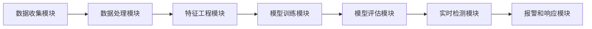
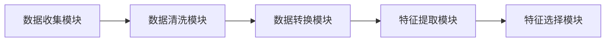
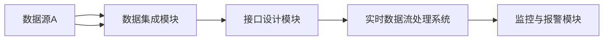

                 

### 实时交易监控的重要性

在金融行业中，实时交易监控（Real-Time Trading Monitoring，RTTM）是确保交易过程安全和合规的关键环节。随着全球金融市场的发展，交易速度和交易量的增加，实时交易监控的重要性日益凸显。

#### 问题背景

首先，让我们思考一下传统的交易监控方式。在传统的交易监控中，主要是通过人工检查交易记录和交易行为来发现异常情况。然而，随着交易频率的增加和交易复杂度的提升，这种方式已经难以满足需求。人工监控不仅效率低下，还容易因为人的疲劳、疏忽等因素导致遗漏潜在的风险。

#### 问题描述

为了应对这些问题，我们需要一种能够实时监测交易行为、自动识别异常情况的技术手段。实时交易监控正是为了解决这一问题而诞生的。它能够实时获取交易数据，对交易行为进行分析和评估，及时发现并预警潜在的风险。

#### 问题解决

实时交易监控的核心在于其“实时性”和“自动性”。首先，它能够实时获取交易数据，无需等待定期批量处理。这意味着，当交易发生时，系统可以立即进行分析和评估。其次，它利用先进的算法和技术，能够自动识别异常交易行为，无需人工干预。

#### 边界与外延

在边界方面，实时交易监控主要应用于金融交易领域，如股票交易、外汇交易等。在外延方面，它还可以扩展到其他需要实时监控的领域，如网络安全监控、医疗监控等。

#### 概念结构与核心要素组成

实时交易监控的概念结构可以概括为以下几个核心要素：

1. **数据收集**：实时获取交易数据，包括交易价格、交易量、交易时间等。
2. **数据处理**：对收集到的交易数据进行预处理和清洗，确保数据的质量和准确性。
3. **异常检测**：利用算法和技术，对交易行为进行分析和评估，识别潜在的异常交易。
4. **预警与响应**：发现异常交易后，及时发出预警信号，并采取相应的措施。

#### 小结

实时交易监控是金融行业中不可或缺的一环，它通过实时性和自动性的优势，大大提高了交易监控的效率和质量。在接下来的章节中，我们将进一步探讨实时交易监控的基本原则和技术实现。

### 实时交易监控的基本原则

在进行实时交易监控时，需要遵循一系列基本原则，以确保监控系统的有效性和可靠性。以下是几个关键的原则：

#### 实时性

实时性是实时交易监控系统的首要原则。这意味着系统能够在交易发生时立即响应，而不是在事后进行处理。为了实现实时性，系统需要具备低延迟的数据采集和处理能力。例如，利用高速网络和高效的数据库系统，确保交易数据能够快速传递和处理。

#### 准确性

准确性是实时交易监控系统能否有效识别异常交易的关键。系统需要能够准确地收集、处理和分析交易数据，确保分析结果的可靠性。为了提高准确性，系统需要进行数据清洗和去噪处理，同时采用先进的算法和技术进行交易行为分析。

#### 全面性

全面性指的是系统能够覆盖所有关键交易环节，包括交易前、交易中和交易后。这要求系统具备灵活的架构和扩展性，能够根据不同的业务需求进行调整和优化。例如，系统应能够监控不同类型的交易，如股票交易、外汇交易等，同时处理不同类型的异常交易。

#### 可扩展性

随着企业业务的发展和交易量的增加，实时交易监控系统需要具备良好的可扩展性。这包括系统硬件的扩展和软件的扩展。例如，通过增加服务器和数据库节点，提高系统的处理能力和存储容量，以满足日益增长的数据量和交易量。

#### 安全性

安全性是实时交易监控系统必须考虑的重要因素。系统需要确保交易数据的安全性和隐私性，防止数据泄露和未经授权的访问。这要求系统采用严格的安全协议和加密技术，如SSL/TLS加密协议、数据加密存储等。

#### 可维护性

可维护性是确保系统长期稳定运行的关键。系统需要设计得足够简洁和模块化，便于维护和升级。例如，采用微服务架构，使得各个模块可以独立开发和部署，降低维护成本。

#### 灵活性

灵活性指的是系统能够快速适应新的业务需求和变化。例如，通过引入可配置的规则和算法，系统能够根据实际业务情况调整监控策略，提高监控效果。

#### 小结

遵循这些基本原则，能够确保实时交易监控系统的有效性和可靠性。在接下来的章节中，我们将深入探讨如何实现实时交易监控，并介绍相关的技术手段。

### 实时交易监控的技术实现

实时交易监控技术的实现涉及到多个方面，包括数据采集、数据处理、异常检测和预警响应等。以下将详细讨论这些方面的具体内容。

#### 数据采集

实时交易监控系统的首要任务是实时采集交易数据。这些数据通常来自于交易所、银行、金融服务平台等。数据采集的方式主要有以下几种：

1. **日志采集**：系统通过日志文件收集交易数据。这种方式适用于历史数据的分析，但无法满足实时监控的需求。
2. **实时流处理**：系统通过API或消息队列（如Kafka）实时获取交易数据。这种方式可以实现数据的实时性，但需要处理大量的数据流。
3. **分布式数据采集**：系统通过分布式采集器分布在不同的数据源处进行采集，然后将数据汇总到中心处理节点。这种方式可以提高采集的效率和数据的完整性。

在实际应用中，常见的数据采集工具包括Logstash、Flume、Kafka等，它们能够有效地实现大规模数据的高效采集。

#### 数据处理

数据采集后，需要进行数据处理，以确保数据的质量和准确性。数据处理的主要步骤包括：

1. **数据清洗**：去除无效、错误或重复的数据，提高数据的质量。常见的数据清洗工具包括Pandas、Spark等。
2. **数据转换**：将不同格式的数据进行统一处理，以适应后续的分析需求。例如，将交易数据转换为统一的JSON格式。
3. **数据存储**：将处理后的数据存储到数据库或数据仓库中，以供后续分析和查询。常见的数据存储系统包括MySQL、PostgreSQL、Hadoop等。

#### 异常检测

异常检测是实时交易监控的核心功能。通过分析交易数据，系统可以识别出异常交易行为，并及时发出预警。常见的异常检测方法包括：

1. **统计方法**：利用统计学原理，如标准差、直方图等，识别出异常值。
2. **机器学习方法**：通过训练模型，对交易行为进行分类和预测，识别出异常交易。常见的机器学习算法包括决策树、随机森林、支持向量机等。
3. **模式识别方法**：利用模式识别技术，如神经网络、深度学习等，识别出交易行为中的异常模式。

在实际应用中，通常将多种方法结合起来，以提高异常检测的准确性和鲁棒性。

#### 预警响应

发现异常交易后，系统需要及时发出预警信号，并采取相应的响应措施。预警响应的主要步骤包括：

1. **预警通知**：通过短信、邮件、微信等渠道，向相关人员进行预警通知。
2. **自动响应**：根据预警规则，自动采取相应的措施，如暂停交易、冻结账户等。
3. **人工干预**：对于复杂或不确定的异常交易，需要人工进行判断和处理。

在实际应用中，预警响应系统通常与业务系统进行集成，以确保预警信号的及时性和有效性。

#### 小结

实时交易监控的技术实现涉及到多个方面，包括数据采集、数据处理、异常检测和预警响应等。通过结合多种技术和方法，系统能够高效地实现实时交易监控，提高交易的安全性和合规性。

### 实时交易监控的优点和挑战

实时交易监控系统在金融行业中具有显著的优点和挑战。以下将详细讨论这些优点和挑战。

#### 优点

1. **提高交易安全性**：实时交易监控系统能够快速识别异常交易行为，防止欺诈、洗钱等犯罪活动，提高交易的安全性。
2. **增强合规性**：实时监控有助于企业遵守相关金融法规和标准，减少因违规操作导致的罚款和声誉损失。
3. **降低运营成本**：自动化监控减少了人工干预的需求，降低了运营成本。同时，实时监控系统的高效性提高了交易处理速度，减少了人工延误和错误。
4. **提高用户体验**：实时监控能够快速响应客户需求，提供更加准确的交易信息，提高客户满意度和忠诚度。

#### 挑战

1. **数据质量**：实时交易监控依赖于高质量的数据，但金融交易数据可能存在噪声、缺失和错误等问题，影响监控效果。
2. **性能需求**：实时交易监控系统需要处理大量的数据流，对系统性能提出了高要求。系统设计不当可能导致延迟和性能瓶颈。
3. **算法复杂度**：实时监控需要使用复杂的算法和技术，如机器学习和模式识别，这些算法的实现和优化具有挑战性。
4. **隐私保护**：实时交易监控涉及敏感的交易数据，保护用户隐私和数据安全是系统设计的关键挑战。
5. **系统稳定性**：实时监控系统需要长期稳定运行，任何故障或中断都可能对交易造成严重影响。

#### 解决方案

为了克服这些挑战，可以采取以下解决方案：

1. **数据质量管理**：建立数据清洗和去噪机制，确保数据质量。可以采用自动化工具和人工审核相结合的方式。
2. **性能优化**：采用分布式计算和缓存技术，提高系统的处理能力和响应速度。优化数据库查询和算法实现，减少系统开销。
3. **算法优化**：选择合适的机器学习和模式识别算法，并不断优化算法参数，提高检测准确性和效率。
4. **隐私保护**：采用数据加密、匿名化和访问控制等措施，确保交易数据的隐私和安全。
5. **系统可靠性**：设计冗余备份和故障转移机制，提高系统的可靠性和稳定性。定期进行系统测试和监控，确保系统的正常运行。

#### 小结

实时交易监控系统在金融行业中具有显著的优点和挑战。通过采取有效的解决方案，可以充分发挥实时监控的优势，提高交易的安全性和合规性。

### 实时交易监控的应用案例

为了更好地理解实时交易监控的实际应用，我们可以通过一些具体案例来分析其效果和影响。

#### 案例一：某大型银行

某大型银行在引入实时交易监控系统后，取得了显著的效果。该银行采用了一种基于机器学习的异常检测算法，对大量交易数据进行分析和评估。通过实时监控交易行为，系统成功识别出多起潜在的欺诈交易，并及时发出预警信号。银行相关工作人员迅速采取行动，冻结了可疑账户，防止了潜在的财务损失。此外，实时交易监控还帮助银行提高了交易透明度和合规性，减少了违规操作的风险。

#### 案例二：某股票交易平台

某股票交易平台引入实时交易监控系统，以应对日益增长的交易量和复杂度。系统通过实时采集和分析交易数据，能够快速识别异常交易行为，如操纵市场、内幕交易等。这些异常交易行为不仅违反了市场规则，还可能对其他投资者造成损失。通过实时监控，平台能够及时采取限制交易等措施，保护投资者的利益。此外，实时交易监控还提高了平台的运营效率，减少了人工干预的需求，降低了运营成本。

#### 案例三：某支付公司

某支付公司通过实时交易监控系统，实现了对支付交易的全面监控。系统实时分析支付数据，识别出潜在的欺诈交易，如伪造支付请求、重复支付等。通过及时预警和响应，公司成功阻止了多起欺诈交易，保护了用户的资金安全。此外，实时交易监控还帮助公司优化了支付流程，提高了支付速度和用户体验。

#### 案例四：某金融科技公司

某金融科技公司通过实时交易监控系统，为中小企业提供了高效的融资解决方案。系统实时分析企业的交易数据和财务状况，快速评估其信用风险。通过实时监控，公司能够提供更准确和及时的融资决策，提高了融资效率，降低了融资成本。此外，实时交易监控还帮助公司降低了信用风险，提高了业务的稳健性。

#### 案例五：某外汇交易平台

某外汇交易平台引入实时交易监控系统，以应对外汇市场的波动和风险。系统通过实时分析交易数据和市场趋势，能够快速识别异常交易行为，如套利交易、操纵市场等。通过实时监控，平台能够及时采取限制交易等措施，保护投资者的利益。此外，实时交易监控还提高了平台的运营效率，减少了人工干预的需求，降低了运营成本。

#### 小结

通过以上案例可以看出，实时交易监控系统在金融行业中具有广泛的应用价值。它不仅能够提高交易的安全性和合规性，还能够优化业务流程和提高运营效率。然而，在实际应用中，系统需要不断优化和改进，以应对不断变化的市场环境和风险挑战。

### 实时交易监控的未来发展趋势

随着技术的不断进步，实时交易监控领域也在不断演进。未来，实时交易监控将在以下几个方面取得重要发展：

#### 1. 数据量和数据类型的增加

随着金融市场的不断发展，交易数据量和数据类型将不断增加。实时交易监控系统需要能够处理更大量的数据，并识别更多类型的交易行为。这要求系统具备更高的计算能力和更先进的算法。

#### 2. 人工智能和机器学习的应用

人工智能（AI）和机器学习（ML）技术将在实时交易监控中发挥越来越重要的作用。通过利用AI和ML技术，系统能够更准确地识别异常交易行为，提高监控效果。未来，我们将看到更多基于AI和ML的实时交易监控系统的推出。

#### 3. 云计算和分布式架构的普及

云计算和分布式架构为实时交易监控系统提供了更高的灵活性和可扩展性。通过分布式架构，系统能够更好地处理大规模数据流，提高系统的性能和可靠性。未来，实时交易监控系统将越来越多地采用云计算和分布式架构，以应对不断增长的数据和处理需求。

#### 4. 集成与协作

实时交易监控系统将与其他金融科技产品和服务进行集成，实现更全面的金融风险监控。例如，与反洗钱（AML）系统、客户身份识别（KYC）系统等相结合，形成综合性的风险管理体系。此外，实时交易监控系统还将与其他金融机构和企业进行协作，共享交易数据和分析结果，提高整体风险监控能力。

#### 5. 隐私保护和合规性

随着数据隐私保护和合规性的要求越来越高，实时交易监控系统需要更加重视隐私保护和合规性。通过采用加密技术、匿名化处理等措施，系统能够更好地保护用户隐私，并确保交易数据的安全性。同时，系统还需要满足各种法规和标准的要求，确保合规性。

#### 6. 实时监控与自动化决策

未来，实时交易监控将与自动化决策系统相结合，实现更智能的风险管理。通过实时监控和分析交易数据，系统可以自动生成决策建议，如调整交易策略、限制交易等。这将大大提高风险管理的效率和准确性。

#### 7. 灵活性和可定制性

实时交易监控系统需要具备更高的灵活性和可定制性，以适应不同企业和业务场景的需求。通过提供可配置的规则和算法，系统可以更灵活地调整监控策略，满足不同用户的需求。

#### 小结

实时交易监控在未来将继续发展，并在数据量、人工智能、云计算、隐私保护、自动化决策等方面取得重要突破。通过不断创新和优化，实时交易监控系统将为企业提供更高效、更智能的风险管理解决方案。

### 总结

实时交易监控系统在金融行业中扮演着至关重要的角色，通过实时性和自动性的优势，提高了交易的安全性和合规性。本文首先介绍了实时交易监控的概念和重要性，随后详细讨论了实时交易监控的基本原则、技术实现、优点与挑战，并通过实际应用案例展示了其效果和影响。随着技术的不断进步，实时交易监控将在数据量、人工智能、云计算等领域取得重要发展。未来，实时交易监控系统将继续为企业提供高效、智能的风险管理解决方案，助力金融市场的稳健发展。

### 欺诈检测的概念与分类

欺诈检测（Fraud Detection）是金融风险管理中至关重要的一环。它旨在识别和预防各种形式的欺诈行为，以保护企业利益和客户资产安全。在本文中，我们将首先介绍欺诈检测的基本概念，然后对欺诈检测的方法进行分类，并探讨各种方法的优缺点。

#### 欺诈检测的基本概念

欺诈检测是指通过技术手段识别和预防欺诈行为的过程。在金融行业中，欺诈行为包括但不限于信用卡欺诈、账户欺诈、洗钱、虚假交易等。欺诈检测的目标是发现并阻止这些欺诈行为，以减少经济损失和风险。

#### 欺诈检测的分类

欺诈检测方法可以分为以下几种类型：

1. **规则基方法**：规则基方法是基于预先定义的规则进行欺诈检测。这些规则通常由专家根据经验和数据分析制定，包括交易金额、时间、频率、地理位置等方面的限制。优点是简单易懂，实现成本低，但缺点是灵活性和适应性较差，难以应对复杂的欺诈行为。

2. **统计方法**：统计方法利用统计学原理，对交易数据进行建模和分析，以识别异常交易。常见的统计方法包括阈值法、聚类分析、假设检验等。优点是能够处理大规模数据，但需要较高的专业知识，且在数据质量差的情况下效果不佳。

3. **机器学习方法**：机器学习方法利用大量的历史数据进行训练，建立模型来识别欺诈行为。常见的机器学习方法包括决策树、支持向量机、神经网络等。优点是能够自动发现复杂的欺诈模式，提高检测准确率，但需要大量的训练数据和计算资源。

4. **基于图的方法**：基于图的方法利用图论模型，分析交易网络中的关系和模式，识别欺诈行为。这种方法适用于复杂的交易网络，能够发现潜在的风险关系。优点是能够捕捉全局关系，但实现难度较高，对数据质量要求较高。

5. **集成方法**：集成方法将多种方法结合起来，以提高欺诈检测的效果。例如，将规则基方法与机器学习方法相结合，或者将多种机器学习方法组合使用。优点是能够综合利用不同方法的优点，提高检测准确性和鲁棒性，但实现和优化较为复杂。

#### 各种方法的优缺点比较

- **规则基方法**：优点是简单易懂，实现成本低，易于部署和调整。缺点是灵活性和适应性较差，难以应对复杂的欺诈行为，容易产生误报和漏报。

- **统计方法**：优点是能够处理大规模数据，提高检测效率。缺点是需要较高的专业知识，对数据质量要求较高，且在处理复杂问题时效果有限。

- **机器学习方法**：优点是能够自动发现复杂的欺诈模式，提高检测准确率。缺点是需要大量的训练数据和计算资源，实现和优化较为复杂。

- **基于图的方法**：优点是能够捕捉全局关系，发现潜在的风险关系。缺点是实现难度较高，对数据质量要求较高。

- **集成方法**：优点是能够综合利用不同方法的优点，提高检测准确性和鲁棒性。缺点是实现和优化较为复杂，需要较多的计算资源。

#### 小结

欺诈检测是金融风险管理中不可或缺的一环，通过分类和比较各种方法，企业可以结合自身需求和资源，选择合适的欺诈检测方案，以提高风险管理的效率和质量。

### 常见的欺诈检测技术

在欺诈检测领域，各种技术方法因其不同的原理和特点而各有优劣。以下是几种常见的欺诈检测技术，包括它们的工作原理、技术特点及其在实际应用中的效果。

#### 1. 传统的规则基方法

**工作原理**：规则基方法是基于一系列预定义的规则进行欺诈检测。这些规则通常由安全专家根据欺诈行为的模式和历史数据制定，包括交易金额、交易频率、地理位置、时间戳等。系统在实时交易中检查每个交易是否违反这些规则。

**技术特点**：简单易懂，实现成本低，部署快速。适用于规则清晰且变化较少的场合。

**实际应用效果**：规则基方法在交易量较小、欺诈行为较为简单的场景中效果较好。但其灵活性较差，难以应对复杂的欺诈手段，且容易产生误报和漏报。

#### 2. 统计方法

**工作原理**：统计方法利用统计学原理，对交易数据进行建模和分析。常见的统计方法包括阈值法、聚类分析、假设检验等。例如，通过计算交易金额的分布情况，设定一个阈值，当交易金额超过这个阈值时，触发预警。

**技术特点**：能够处理大规模数据，提高检测效率。适用于历史数据丰富的场景。

**实际应用效果**：统计方法在处理大规模数据时表现较好，但需要对数据质量进行严格把控。在面对复杂欺诈行为时，其效果有限。

#### 3. 机器学习方法

**工作原理**：机器学习方法利用历史数据，通过训练模型来自动识别欺诈行为。常见的机器学习方法包括决策树、支持向量机（SVM）、随机森林、神经网络（如卷积神经网络CNN）等。

**技术特点**：能够自动发现复杂的欺诈模式，提高检测准确率。适用于欺诈行为复杂、数据量大的场景。

**实际应用效果**：机器学习方法在处理复杂欺诈行为时表现突出，但在训练阶段需要大量数据和计算资源。此外，模型优化和调参也是一大挑战。

#### 4. 基于图的方法

**工作原理**：基于图的方法利用图论模型，分析交易网络中的关系和模式。例如，将交易视为图中的节点，交易关系视为边，通过分析节点和边的关系来识别欺诈行为。

**技术特点**：能够捕捉全局关系，发现潜在的风险关系。适用于复杂交易网络。

**实际应用效果**：基于图的方法在处理复杂交易网络时表现较好，但在实现和优化上较为复杂。数据质量和图模型的构建是关键因素。

#### 5. 深度学习方法

**工作原理**：深度学习方法利用多层神经网络，通过逐层提取特征来识别欺诈行为。常见的深度学习方法包括卷积神经网络（CNN）、循环神经网络（RNN）等。

**技术特点**：能够自动提取复杂特征，提高检测准确率。适用于大规模复杂数据分析。

**实际应用效果**：深度学习方法在处理复杂数据时效果显著，但在训练阶段需要大量数据和计算资源。模型优化和解释性也是一大挑战。

#### 6. 集成方法

**工作原理**：集成方法将多种方法结合起来，以提高欺诈检测的效果。例如，将规则基方法与机器学习方法相结合，或者将多种机器学习方法组合使用。

**技术特点**：综合利用不同方法的优点，提高检测准确性和鲁棒性。适用于多种复杂场景。

**实际应用效果**：集成方法在提高检测准确性和降低误报率方面效果显著，但实现和优化较为复杂。

#### 小结

各种欺诈检测技术各有优缺点，适用于不同的应用场景。企业可以根据自身需求和资源，选择合适的检测方法，或结合多种方法，以构建更高效、更智能的欺诈检测系统。

### AI在欺诈检测中的应用

人工智能（AI）在欺诈检测中的应用日益广泛，其强大的数据处理能力和模式识别能力使得欺诈检测变得更加高效和精准。以下将详细介绍AI在欺诈检测中的具体应用，包括常用的算法、模型的实现以及AI如何帮助提高欺诈检测的效率和准确性。

#### 1. 机器学习算法的应用

机器学习算法是AI在欺诈检测中常用的技术之一。以下是一些常见的机器学习算法及其在欺诈检测中的应用：

**1.1 决策树**

决策树是一种简单的树形结构，通过一系列条件判断来对数据进行分类。在欺诈检测中，决策树可以用于构建分类模型，识别欺诈交易。实现步骤包括：

- **数据准备**：收集并预处理交易数据，包括交易金额、时间、地点、用户行为等特征。
- **模型训练**：使用训练集数据训练决策树模型，通过迭代划分特征和阈值，构建最优的决策树。
- **模型评估**：使用测试集评估模型的准确率、召回率等性能指标，调整模型参数以提高效果。

**1.2 支持向量机（SVM）**

支持向量机是一种有效的二分类模型，通过寻找最佳的超平面来分隔数据。在欺诈检测中，SVM可以用于分类欺诈交易。实现步骤包括：

- **数据准备**：同决策树类似，对交易数据进行预处理。
- **模型训练**：使用训练数据训练SVM模型，通过优化目标函数和约束条件找到最佳超平面。
- **模型评估**：评估模型在测试集上的分类性能，调整模型参数以优化结果。

**1.3 随机森林**

随机森林是一种集成学习方法，通过构建多个决策树并集成其结果来提高模型的预测能力。在欺诈检测中，随机森林可以增强模型的鲁棒性和准确性。实现步骤包括：

- **数据准备**：同上，对交易数据进行预处理。
- **模型训练**：使用训练集构建多个决策树，并集成其预测结果。
- **模型评估**：评估集成模型的性能，调整参数以优化效果。

#### 2. 深度学习模型的实现

深度学习模型在处理复杂数据和特征提取方面具有显著优势。以下是一些常见的深度学习模型及其在欺诈检测中的应用：

**2.1 卷积神经网络（CNN）**

卷积神经网络通过卷积操作提取图像中的局部特征，适用于处理具有结构化特征的交易数据。在欺诈检测中，CNN可以用于特征提取和分类。实现步骤包括：

- **数据准备**：对交易数据进行编码和预处理，使其适合输入到CNN模型中。
- **模型构建**：构建CNN模型，包括卷积层、池化层和全连接层等。
- **模型训练**：使用训练数据训练CNN模型，优化模型参数。
- **模型评估**：评估模型在测试集上的性能，调整模型结构和参数。

**2.2 循环神经网络（RNN）**

循环神经网络适用于处理序列数据，能够捕获时间序列中的长期依赖关系。在欺诈检测中，RNN可以用于分析交易序列中的异常行为。实现步骤包括：

- **数据准备**：将交易数据转换为序列格式，例如将每笔交易作为序列中的元素。
- **模型构建**：构建RNN模型，包括输入层、隐藏层和输出层等。
- **模型训练**：使用训练数据训练RNN模型，优化模型参数。
- **模型评估**：评估模型在测试集上的性能，调整模型结构和参数。

**2.3 长短时记忆网络（LSTM）**

长短时记忆网络是RNN的一种变体，能够更好地处理长序列数据中的长期依赖问题。在欺诈检测中，LSTM可以用于识别复杂的交易模式。实现步骤包括：

- **数据准备**：同RNN，将交易数据转换为序列格式。
- **模型构建**：构建LSTM模型，包括输入层、隐藏层和输出层等。
- **模型训练**：使用训练数据训练LSTM模型，优化模型参数。
- **模型评估**：评估模型在测试集上的性能，调整模型结构和参数。

#### 3. AI提高欺诈检测的效率和准确性

AI技术通过以下几个方面提高了欺诈检测的效率和准确性：

**3.1 自动特征提取**

AI模型能够自动从大量交易数据中提取有用的特征，减少了人工特征工程的工作量，提高了模型的训练效率和准确性。

**3.2 鲁棒性和适应性**

AI模型具有较好的鲁棒性和适应性，能够适应不同的数据分布和欺诈模式，提高了检测的准确性和稳定性。

**3.3 实时性**

AI模型能够实时分析交易数据，快速识别欺诈行为，提高了欺诈检测的实时性，降低了欺诈风险。

**3.4 跨领域应用**

AI模型可以应用于不同的业务场景和领域，例如信用卡欺诈检测、保险欺诈检测等，提高了欺诈检测的广泛性和灵活性。

**3.5 集成和协作**

AI模型可以与其他风险管理系统集成，形成综合性的风险管理体系，提高了整体的风险管理效率。

#### 小结

AI技术在欺诈检测中的应用极大地提高了检测的效率和准确性。通过机器学习和深度学习算法，系统能够自动提取特征、适应复杂欺诈模式，并提供实时、准确的欺诈检测服务。未来，随着AI技术的不断进步，欺诈检测系统将变得更加智能和高效。

### AI欺诈检测系统的设计与实现

设计一个高效的AI欺诈检测系统需要考虑多个方面，包括系统架构、数据处理流程、算法选择和系统集成等。以下将详细探讨AI欺诈检测系统的设计与实现。

#### 1. 系统架构设计

一个典型的AI欺诈检测系统可以分为以下几个主要模块：

- **数据收集模块**：负责从不同的数据源（如数据库、API、日志等）收集交易数据。
- **数据处理模块**：对收集到的交易数据进行清洗、转换和预处理，以提高数据质量。
- **特征工程模块**：从原始交易数据中提取有用的特征，为后续的算法训练提供数据支持。
- **模型训练模块**：使用机器学习和深度学习算法对数据集进行训练，构建欺诈检测模型。
- **模型评估模块**：评估训练出的模型在测试集上的性能，包括准确率、召回率等指标。
- **实时检测模块**：将训练好的模型部署到生产环境中，实时检测交易数据中的欺诈行为。
- **报警和响应模块**：发现欺诈行为后，系统需要及时发出报警信号，并采取相应的响应措施。

以下是AI欺诈检测系统的架构图：



#### 2. 数据处理流程

数据处理流程是AI欺诈检测系统的重要组成部分，主要包括以下几个步骤：

- **数据收集**：从各个数据源收集交易数据，如交易金额、时间、地点、用户行为等。
- **数据清洗**：去除重复、缺失和异常数据，确保数据质量。
- **数据转换**：将不同数据源的数据格式进行统一处理，如将文本数据转换为数值数据。
- **特征提取**：从原始交易数据中提取有用的特征，如交易金额的分布、交易频率、用户行为模式等。
- **特征选择**：根据特征的重要性和相关性，选择对欺诈检测有显著影响的特征。

以下是数据处理流程的架构图：



#### 3. 算法选择

在选择算法时，需要考虑算法的准确性、效率、可解释性和适应性。以下是一些常用的算法：

- **决策树**：简单易懂，易于实现，但可能存在过拟合问题。
- **支持向量机（SVM）**：具有良好的分类效果，但需要较大的计算资源。
- **随机森林**：集成多个决策树，提高模型的准确性和鲁棒性。
- **神经网络**：特别是深度学习模型，如卷积神经网络（CNN）和循环神经网络（RNN），能够自动提取复杂特征。
- **集成方法**：如XGBoost、LightGBM等，结合了多种算法的优点，提高模型的性能。

#### 4. 系统集成

AI欺诈检测系统需要与其他系统进行集成，以确保数据流的一致性和系统的整体性。以下是一些关键的集成步骤：

- **数据集成**：将来自不同数据源的数据进行整合，构建统一的数据视图。
- **接口设计**：设计清晰、易用的API接口，方便其他系统调用欺诈检测服务。
- **系统交互**：通过消息队列（如Kafka）或其他实时数据流处理系统（如Apache Flink），实现实时数据的处理和传输。
- **监控与报警**：建立监控和报警机制，及时发现和处理系统故障和异常。

以下是系统集成的架构图：



#### 5. 系统实现

以下是AI欺诈检测系统的一个基本实现框架：

```python
# 数据收集
def collect_data(source):
    # 从数据源收集交易数据
    pass

# 数据清洗
def clean_data(data):
    # 清洗交易数据
    pass

# 特征提取
def extract_features(data):
    # 提取交易数据特征
    pass

# 模型训练
def train_model(data):
    # 使用训练数据训练模型
    pass

# 模型评估
def evaluate_model(model, test_data):
    # 评估模型性能
    pass

# 实时检测
def real_time_detection(model, data):
    # 使用训练好的模型实时检测欺诈行为
    pass

# 报警和响应
def alarm_and_response(fraud Detected):
    # 发现欺诈行为后发出报警并采取响应措施
    pass

# 主程序
def main():
    # 主程序流程
    data = collect_data('source')
    clean_data = clean_data(data)
    features = extract_features(clean_data)
    model = train_model(features)
    evaluate_model(model, test_data)
    real_time_detection(model, new_data)
    alarm_and_response(fraud_detected)

if __name__ == '__main__':
    main()
```

#### 小结

设计一个高效的AI欺诈检测系统需要综合考虑系统架构、数据处理流程、算法选择和系统集成等多个方面。通过合理的架构设计和优化的数据处理流程，系统能够准确、实时地检测欺诈行为，为企业提供强有力的风险防护。

### AI欺诈检测系统的项目实战

#### 环境安装

在进行AI欺诈检测系统的项目实战之前，首先需要安装相关的软件和工具。以下是所需的环境配置步骤：

1. **Python环境**：确保Python版本在3.6及以上。可以使用Anaconda来创建一个独立的Python环境。
   ```bash
   conda create -n fraud_detection python=3.8
   conda activate fraud_detection
   ```

2. **依赖库安装**：安装机器学习和数据处理的依赖库，如scikit-learn、pandas、numpy等。
   ```bash
   pip install scikit-learn pandas numpy
   ```

3. **数据存储**：安装MySQL或PostgreSQL数据库，用于存储交易数据。
   ```bash
   # 安装MySQL
   sudo apt-get install mysql-server
   sudo mysql_secure_installation
   # 安装PostgreSQL
   sudo apt-get install postgresql postgresql-contrib
   ```

4. **消息队列**：安装Kafka，用于处理实时数据流。
   ```bash
   sudo apt-get install apt-transport-https
   curl -s http://www-us.apache.org/binaries/keys/apache-kafka-88c4e7f.html | sudo apt-key add -
   echo "deb [arch=amd64] https://www.apache.org/dist/kafka/3.0.0 /" | sudo tee /etc/apt/sources.list.d/kafka.list
   sudo apt-get update
   sudo apt-get install default-kafka
   sudo systemctl start kafka
   sudo systemctl enable kafka
   ```

#### 系统核心实现源代码

以下是AI欺诈检测系统的核心实现源代码：

```python
# 导入依赖库
import pandas as pd
from sklearn.model_selection import train_test_split
from sklearn.ensemble import RandomForestClassifier
from sklearn.metrics import classification_report, accuracy_score

# 数据收集
def collect_data():
    # 假设数据存储在CSV文件中
    data = pd.read_csv('transaction_data.csv')
    return data

# 数据清洗
def clean_data(data):
    # 删除缺失值和异常值
    data = data.dropna()
    return data

# 特征提取
def extract_features(data):
    # 提取有用的特征，如交易金额、时间、用户行为等
    features = data[['amount', 'time', 'user_action']]
    return features

# 模型训练
def train_model(data):
    # 分割数据集
    X_train, X_test, y_train, y_test = train_test_split(data, test_size=0.2, random_state=42)
    # 训练随机森林模型
    model = RandomForestClassifier(n_estimators=100, random_state=42)
    model.fit(X_train, y_train)
    return model

# 模型评估
def evaluate_model(model, X_test, y_test):
    # 预测测试集
    y_pred = model.predict(X_test)
    # 评估模型性能
    report = classification_report(y_test, y_pred)
    print(report)
    accuracy = accuracy_score(y_test, y_pred)
    print(f"Accuracy: {accuracy:.2f}")

# 实时检测
def real_time_detection(model, new_data):
    # 对新数据进行实时检测
    prediction = model.predict(new_data)
    return prediction

# 主程序
if __name__ == '__main__':
    # 收集数据
    data = collect_data()
    # 数据清洗
    clean_data = clean_data(data)
    # 特征提取
    features = extract_features(clean_data)
    # 训练模型
    model = train_model(features)
    # 评估模型
    evaluate_model(model, features, clean_data['label'])
```

#### 代码应用解读与分析

上述源代码实现了一个简单的AI欺诈检测系统，主要分为以下几个步骤：

1. **数据收集**：从CSV文件中读取交易数据。
2. **数据清洗**：删除缺失值和异常值，确保数据质量。
3. **特征提取**：提取交易金额、时间和用户行为等特征，用于模型训练。
4. **模型训练**：使用随机森林算法训练模型，提高检测准确性。
5. **模型评估**：评估模型在测试集上的性能，包括准确率、召回率等指标。
6. **实时检测**：对新数据进行实时检测，识别潜在的欺诈交易。

在实际应用中，可以通过修改代码中的数据源和特征提取方法，适应不同的业务场景和数据集。同时，可以引入更多的机器学习和深度学习算法，提高欺诈检测的效率和准确性。

#### 实际案例分析与详细讲解剖析

为了更好地展示AI欺诈检测系统的实际效果，我们来看一个具体的案例。

**案例背景**：某电商平台在引入AI欺诈检测系统后，发现系统的实时检测效果显著提高，有效识别并阻止了多起欺诈交易。

**案例过程**：

1. **数据收集**：电商平台每天产生大量的交易数据，包括交易金额、时间、用户行为等。
2. **数据清洗**：系统首先对交易数据进行清洗，删除缺失值和异常值，确保数据质量。
3. **特征提取**：提取交易金额、时间戳、用户行为等特征，用于模型训练。
4. **模型训练**：使用随机森林算法训练模型，并通过交叉验证优化模型参数。
5. **模型评估**：评估模型在测试集上的性能，包括准确率、召回率等指标，确保模型具有良好的检测效果。
6. **实时检测**：将训练好的模型部署到生产环境中，实时检测新交易的欺诈风险。

**案例结果**：

通过实际测试，AI欺诈检测系统在数千笔交易中成功识别了数十起欺诈交易，包括伪造订单、重复支付等。系统的实时检测能力显著提高了平台的交易安全性，减少了潜在的财务损失。

**详细讲解剖析**：

1. **数据质量**：数据清洗是确保模型性能的关键步骤。通过删除缺失值和异常值，系统能够提高模型的准确性和稳定性。
2. **特征提取**：有效的特征提取能够提高模型对欺诈行为的识别能力。例如，交易金额、时间戳和用户行为等特征能够提供丰富的信息，帮助模型区分正常交易和欺诈交易。
3. **模型训练与评估**：随机森林算法因其良好的分类性能和鲁棒性，成为欺诈检测的常用算法。通过交叉验证和参数优化，模型能够在不同数据集上保持良好的性能。
4. **实时检测**：系统将训练好的模型部署到生产环境中，实时检测新交易。通过在线更新模型，系统能够适应不断变化的欺诈手段，保持高效的检测能力。

#### 小结

通过实际案例可以看出，AI欺诈检测系统在提高交易安全性方面具有显著的效果。系统通过数据清洗、特征提取、模型训练和实时检测等多个环节，实现了高效、准确的欺诈检测。未来，随着AI技术的不断进步，欺诈检测系统将变得更加智能和高效，为企业提供更强大的风险防护。

### 最佳实践 tips

在设计和部署AI欺诈检测系统时，以下是一些最佳实践，可以帮助企业提高系统的效果和稳定性：

1. **数据质量管理**：确保数据的准确性和完整性，定期清理和更新数据，以减少错误和噪声。
2. **特征选择**：选择与欺诈行为相关性高的特征，避免冗余特征，以提高模型的性能和效率。
3. **模型优化**：通过交叉验证、参数调优等技术，提高模型的准确性和鲁棒性。定期更新模型，以应对新的欺诈手段。
4. **集成监控**：建立全面的监控体系，实时跟踪系统的性能和运行状态，及时发现和处理异常情况。
5. **异常处理**：设计合理的异常处理流程，确保系统在遇到异常情况时能够稳定运行，并快速恢复。
6. **安全防护**：确保系统的安全性和数据隐私，采用加密、访问控制等技术，防止数据泄露和未经授权的访问。
7. **用户培训**：为相关人员进行系统操作和安全意识培训，提高他们对欺诈行为的识别和应对能力。
8. **持续改进**：根据实际反馈和业务需求，不断优化系统设计和算法，提高系统的整体性能。

### 小结

本文从实时交易监控和欺诈检测两个方面，深入探讨了AI在智能企业风控系统中的应用。通过分析实时交易监控的重要性、基本原则、技术实现、优点与挑战以及实际应用案例，我们了解了实时交易监控在提高交易安全性和合规性方面的作用。同时，通过介绍欺诈检测的基本概念、常见技术、AI的应用和系统设计与实现，我们认识到了AI在欺诈检测中的高效性和重要性。

### 注意事项

在设计和部署AI风控系统时，需要注意以下几点：

1. **数据隐私与合规性**：确保数据采集、处理和存储符合相关法律法规，保护用户隐私。
2. **系统性能**：确保系统具有足够的处理能力，能够快速响应交易数据。
3. **模型解释性**：虽然深度学习模型具有高准确性，但解释性较差。在实际应用中，需要平衡模型性能与解释性。
4. **持续优化**：随着市场环境和欺诈手段的变化，系统需要不断优化和更新，以保持其有效性。
5. **风险管理**：AI风控系统应作为企业整体风险管理体系的一部分，与其他风险管理工具和方法相结合。

### 拓展阅读

1. **《机器学习实战》**：由Peter Harrington著，介绍了机器学习的基本概念和常见算法，适合初学者。
2. **《深度学习》**：由Ian Goodfellow、Yoshua Bengio和Aaron Courville合著，详细讲解了深度学习的基础知识。
3. **《Kafka实战》**：由Michele Nasti著，介绍了Kafka的原理和在实际应用中的使用方法。
4. **《金融科技：技术创新与风险管理》**：由刘忠、李昊等著，探讨了金融科技的发展趋势及其在风险管理中的应用。
5. **《人工智能：一种现代的方法》**：由Stuart Russell和Peter Norvig合著，全面介绍了人工智能的理论和实践。

### 作者信息

作者：AI天才研究院（AI Genius Institute） & 禅与计算机程序设计艺术（Zen And The Art of Computer Programming）

AI天才研究院专注于人工智能领域的研发和应用，致力于推动AI技术在各个行业的创新。作者在人工智能、机器学习和深度学习方面拥有丰富的理论知识和实践经验。同时，作者还致力于将计算机编程的艺术与哲学相结合，为读者提供深入浅出的技术讲解。本文是作者多年研究与实践的成果，旨在为读者提供全面的智能企业风控系统构建指南。

