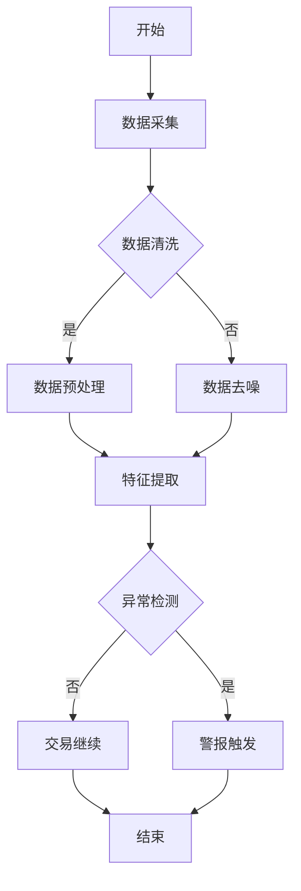
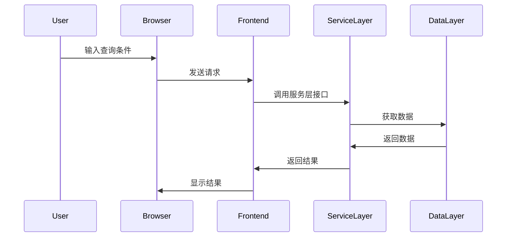
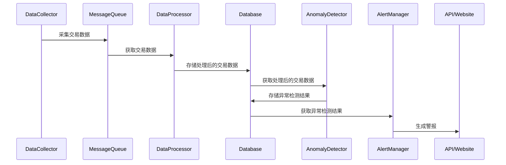

                 

### 构建智能企业风控系统：实时交易监控与欺诈模式识别

关键词：智能风控系统、实时交易监控、欺诈模式识别、数据流处理、深度学习、系统架构设计

摘要：随着数字化转型的加速，企业风险管理的重要性日益凸显。本文将深入探讨如何构建智能企业风控系统，重点关注实时交易监控与欺诈模式识别两大核心模块。通过逐步分析相关技术、系统架构、实施与部署，提供一套完整的解决方案，帮助企业提升风控能力，降低风险损失。

## 引言

### 1.1 问题背景

在当今数字化时代，企业的风险管理越来越受到重视。传统的风险管理方法在面对日益复杂的业务环境时，已经显得力不从心。随着人工智能技术的飞速发展，构建智能企业风控系统成为解决这一问题的有效途径。

#### 1.1.1 数字化转型与企业风险管理

数字化转型是当今企业发展的必然趋势。通过云计算、大数据、人工智能等技术的应用，企业能够实现业务流程的优化、数据的高效利用，从而提高竞争力。然而，数字化转型也带来了新的风险。例如，数据泄露、系统故障、欺诈行为等，都可能对企业的运营和声誉造成严重影响。因此，构建智能企业风控系统，成为数字化转型的重要一环。

#### 1.1.2 智能风控系统的必要性

智能风控系统是利用人工智能技术对企业风险进行预测、检测、管理和响应的一套系统。它能够实时监控企业的交易活动，识别潜在的欺诈行为，从而帮助企业降低风险损失。智能风控系统的重要性体现在以下几个方面：

1. **提升风险识别能力**：通过大数据分析和机器学习算法，智能风控系统能够从海量数据中挖掘出潜在的风险信号，提前预警，避免重大损失。
2. **提高响应速度**：传统的风控方法通常需要人工审核和干预，响应速度较慢。智能风控系统则能够实现自动化处理，快速响应风险事件。
3. **降低运营成本**：智能风控系统能够自动化地进行风险分析和处理，减少了人工干预的需求，从而降低了企业的运营成本。
4. **增强用户体验**：智能风控系统能够为企业提供实时的风险分析报告，帮助管理层做出更明智的决策，从而提升用户体验。

### 1.2 问题描述

构建智能企业风控系统涉及到实时交易监控和欺诈模式识别两大核心任务。实时交易监控要求系统能够在短时间内处理大量交易数据，并实时检测异常交易。欺诈模式识别则要求系统能够从海量数据中挖掘出潜在的欺诈行为，并采取相应的预防措施。

#### 1.2.1 实时交易监控

实时交易监控是指对企业日常交易活动进行实时监控和分析，以发现异常交易行为。实时交易监控的目标是：

1. **快速检测异常交易**：通过分析交易数据，识别出异常交易行为，如欺诈交易、异常资金流动等。
2. **及时采取措施**：在发现异常交易后，系统能够立即采取相应的措施，如警告、冻结账户等。
3. **降低风险损失**：通过实时交易监控，企业能够及时发现并处理风险事件，避免或降低损失。

#### 1.2.2 欺诈模式识别

欺诈模式识别是指通过数据分析和机器学习算法，从海量数据中识别出潜在的欺诈行为。欺诈模式识别的目标是：

1. **挖掘欺诈模式**：通过对历史数据的分析，找出欺诈行为的规律和模式。
2. **实时检测欺诈**：在交易发生时，系统能够实时分析交易数据，识别潜在的欺诈行为。
3. **预防欺诈行为**：通过预警机制，提醒企业或用户采取预防措施，避免欺诈行为的发生。

### 1.3 问题解决

本文旨在提供一套全面、系统的构建智能企业风控系统的解决方案，包括实时交易监控和欺诈模式识别的原理、技术、实践等内容。具体包括以下几个部分：

1. **实时交易监控**：介绍实时交易监控的概念、核心技术、系统架构设计、实施与部署等。
2. **欺诈模式识别**：介绍欺诈模式识别的概念、核心技术、系统架构设计、实施与部署等。
3. **实战案例**：通过实际案例，展示智能企业风控系统的构建过程和应用效果。
4. **最佳实践**：总结实践经验，提供构建智能企业风控系统的最佳实践建议。

### 1.4 边界与外延

本文主要关注企业内部的风控系统建设，不涉及外部环境的影响。同时，本文所介绍的技术和方法适用于各类企业，无论企业规模大小。

### 1.5 概念结构与核心要素组成

构建智能企业风控系统涉及多个核心概念和要素，包括但不限于：实时交易监控、欺诈模式识别、数据采集与处理、算法模型、系统架构设计等。

#### 1.5.1 实时交易监控

实时交易监控是指对企业日常交易活动进行实时监控和分析，以发现异常交易行为。它包括以下几个核心要素：

1. **数据采集与处理**：实时采集交易数据，并进行预处理，如去噪、清洗等。
2. **异常检测算法**：利用机器学习算法，对交易数据进行分析，识别异常交易。
3. **实时响应机制**：在发现异常交易后，系统能够立即采取相应的措施，如警告、冻结账户等。

#### 1.5.2 欺诈模式识别

欺诈模式识别是指通过数据分析和机器学习算法，从海量数据中识别出潜在的欺诈行为。它包括以下几个核心要素：

1. **数据预处理**：对数据进行清洗、归一化等处理，为后续分析做准备。
2. **特征提取**：从数据中提取出能够代表欺诈行为的特征。
3. **欺诈检测算法**：利用监督学习或无监督学习算法，识别出潜在的欺诈行为。

#### 1.5.3 系统架构设计

系统架构设计是指根据企业的需求和实际情况，设计出符合业务需求的技术架构。它包括以下几个核心要素：

1. **系统架构设计原则**：如高可用性、高可扩展性、高安全性等。
2. **系统架构设计流程**：包括需求分析、系统设计、系统实现、系统测试等环节。
3. **系统架构设计要素**：如数据层、服务层、表现层等。

### 1.6 本章小结

通过对问题的背景、描述、解决方法、边界与外延、概念结构与核心要素组成等方面的介绍，为后续章节的深入探讨奠定了基础。接下来的章节将分别对实时交易监控和欺诈模式识别进行详细分析，提供构建智能企业风控系统的完整指导。

----------------------------------------------------------------

### 第二部分: 实时交易监控

实时交易监控是智能企业风控系统的重要组成部分，它能够实时检测企业的交易活动，识别异常交易行为，从而帮助企业降低风险损失。本章节将详细介绍实时交易监控的概念、核心技术、系统架构设计、实施与部署等内容。

#### 2.1 实时交易监控概述

#### 2.1.1 实时交易监控的定义

实时交易监控是指对企业日常交易活动进行实时监控和分析，以发现异常交易行为。实时交易监控的核心目标是快速检测异常交易，并及时采取相应的措施，如警告、冻结账户等。

#### 2.1.2 实时交易监控的重要性

实时交易监控在智能企业风控系统中具有重要作用，主要体现在以下几个方面：

1. **快速响应**：实时交易监控能够在交易发生的第一时间检测到异常交易，从而快速响应，避免或降低损失。
2. **风险预防**：通过对历史交易数据的分析，实时交易监控能够预测潜在的欺诈行为，从而采取预防措施。
3. **降低运营成本**：实时交易监控能够自动化地进行异常检测，减少人工干预的需求，从而降低企业的运营成本。
4. **提升用户体验**：实时交易监控能够为企业提供实时的风险分析报告，帮助管理层做出更明智的决策，从而提升用户体验。

#### 2.1.3 实时交易监控的应用场景

实时交易监控适用于各种类型的企业，尤其是在金融、电子商务等领域具有广泛的应用。具体应用场景包括：

1. **金融行业**：在金融行业中，实时交易监控可以用于检测信用卡欺诈、资金外流等异常行为。
2. **电子商务**：在电子商务平台上，实时交易监控可以用于检测刷单、虚假交易等欺诈行为。
3. **电信行业**：在电信行业中，实时交易监控可以用于检测恶意短信、电话等异常行为。
4. **物流行业**：在物流行业中，实时交易监控可以用于检测异常物流行为，如货物丢失、延迟等。

#### 2.2 实时交易监控的核心技术

实时交易监控的核心技术主要包括数据采集与处理技术、实时数据分析技术和异常检测技术。以下将详细介绍这些技术。

#### 2.2.1 数据采集与处理技术

数据采集与处理技术是实时交易监控的基础，主要包括以下几个方面：

1. **数据采集**：实时交易监控需要从不同的数据源采集交易数据，如数据库、日志文件、API接口等。数据采集的关键是保证数据的高效、准确和实时性。
2. **数据处理**：采集到的交易数据需要进行预处理，如去噪、清洗、归一化等。数据处理的目标是消除数据中的噪声和异常值，提高数据质量。

#### 2.2.2 实时数据分析技术

实时数据分析技术是实时交易监控的核心，主要包括以下几个方面：

1. **数据流处理技术**：数据流处理技术是处理实时数据的一种技术，它能够实时地对数据进行分析和处理，如 Apache Kafka、Apache Flink 等。
2. **实时数据分析算法**：实时数据分析算法是用于对实时数据进行分析的工具，如时间序列分析、聚类分析、关联规则挖掘等。

#### 2.2.3 异常检测技术

异常检测技术是实时交易监控的关键，它能够从海量数据中识别出潜在的异常交易行为。异常检测技术主要包括以下几个方面：

1. **异常检测算法**：异常检测算法是用于识别异常数据的技术，如基于统计的方法、基于距离的方法、基于分类的方法等。
2. **异常检测评价指标**：异常检测评价指标是评估异常检测算法性能的指标，如准确率、召回率、F1 分数等。

#### 2.3 实时交易监控系统的架构设计

实时交易监控系统的架构设计是构建实时交易监控系统的关键，它决定了系统的性能、可扩展性和可靠性。以下将介绍实时交易监控系统架构设计的原则、流程和要素。

#### 2.3.1 系统架构设计原则

实时交易监控系统架构设计应遵循以下原则：

1. **高可用性**：系统应具备高可用性，能够在故障发生时快速恢复，确保系统的持续运行。
2. **高可扩展性**：系统应具备高可扩展性，能够根据业务需求的变化，快速扩展系统功能。
3. **高安全性**：系统应具备高安全性，能够防止数据泄露、系统入侵等安全威胁。
4. **易维护性**：系统应具备易维护性，便于系统的监控、维护和升级。

#### 2.3.2 系统架构设计流程

实时交易监控系统架构设计流程主要包括以下几个步骤：

1. **需求分析**：明确实时交易监控系统的功能需求、性能需求和安全需求等。
2. **系统设计**：根据需求分析结果，设计系统的总体架构，包括数据层、服务层和表现层等。
3. **系统实现**：根据系统设计文档，实现实时交易监控系统的功能模块。
4. **系统测试**：对实时交易监控系统进行功能测试、性能测试和安全测试，确保系统满足设计要求。
5. **部署上线**：将实时交易监控系统部署到生产环境，并进行上线前的验收测试。

#### 2.3.3 系统架构设计要素

实时交易监控系统的架构设计包括以下几个核心要素：

1. **数据层**：数据层是实时交易监控系统的核心，负责数据的采集、存储和处理。数据层包括数据库、缓存、消息队列等组件。
2. **服务层**：服务层是实时交易监控系统的业务逻辑层，负责实现实时交易监控的核心功能，如数据采集、数据预处理、异常检测等。服务层包括数据采集服务、数据处理服务、异常检测服务等。
3. **表现层**：表现层是实时交易监控系统与用户的交互界面，负责向用户展示实时交易监控的结果和报警信息。表现层包括 Web 界面、移动端应用等。

#### 2.4 实时交易监控系统的实施与部署

实时交易监控系统的实施与部署是确保系统正常运行的关键步骤，以下将介绍实时交易监控系统的实施步骤、部署策略和常见问题及解决方法。

#### 2.4.1 实施步骤

实时交易监控系统的实施步骤主要包括以下几个环节：

1. **环境准备**：准备实时交易监控系统的运行环境，包括硬件、软件和网络环境等。
2. **系统部署**：将实时交易监控系统的各个组件部署到生产环境，包括数据层、服务层和表现层等。
3. **系统配置**：对实时交易监控系统进行配置，包括参数设置、权限管理、日志管理等。
4. **系统测试**：对实时交易监控系统进行功能测试、性能测试和安全测试，确保系统满足设计要求。
5. **上线运行**：将实时交易监控系统部署到生产环境，并进行上线前的验收测试。

#### 2.4.2 部署策略

实时交易监控系统的部署策略主要包括以下几个方面：

1. **分布式部署**：将实时交易监控系统的各个组件分布式部署到不同的服务器上，以提高系统的性能和可靠性。
2. **负载均衡**：通过负载均衡器，将流量分配到不同的服务器上，以避免单点故障。
3. **高可用性部署**：采用主从备份、故障转移等技术，确保系统的持续运行。

#### 2.4.3 部署过程中常见问题及解决方法

在实时交易监控系统的部署过程中，可能会遇到以下问题及解决方法：

1. **硬件故障**：解决方法：采用高可用性硬件，如冗余服务器、RAID磁盘阵列等。
2. **软件故障**：解决方法：采用可靠的软件，如开源软件、商业软件等，并进行严格的测试。
3. **网络故障**：解决方法：采用高质量的网络设备，如交换机、路由器等，并确保网络的稳定性和可靠性。
4. **数据同步**：解决方法：采用数据同步技术，如数据库同步、消息队列同步等，确保数据的一致性。

#### 2.5 本章小结

通过对实时交易监控概述、核心技术、系统架构设计、实施与部署等方面的介绍，为读者提供了构建实时交易监控系统的全面指导。在接下来的章节中，我们将继续探讨欺诈模式识别的相关内容，为构建智能企业风控系统提供完整的解决方案。

----------------------------------------------------------------

### 第三部分：欺诈模式识别

欺诈模式识别是构建智能企业风控系统的关键环节，它通过分析海量数据，发现潜在的欺诈行为，从而帮助企业提前预防风险。本章节将详细介绍欺诈模式识别的概念、核心技术、系统架构设计、实施与部署等内容。

#### 3.1 欺诈模式识别概述

#### 3.1.1 欺诈模式识别的定义

欺诈模式识别是指利用数据分析和机器学习算法，从海量数据中挖掘出潜在的欺诈行为。欺诈模式识别的核心目标是发现并预测欺诈行为，从而采取措施进行防范。

#### 3.1.2 欺诈模式识别的重要性

欺诈模式识别在智能企业风控系统中具有重要作用，主要体现在以下几个方面：

1. **提前预警**：通过分析历史数据和实时数据，欺诈模式识别能够提前发现潜在的欺诈行为，及时发出预警。
2. **降低损失**：通过及时发现和阻止欺诈行为，欺诈模式识别能够有效降低企业的损失。
3. **提升用户体验**：通过欺诈模式识别，企业能够更好地保护用户的账户安全和隐私，提升用户体验。
4. **优化资源配置**：欺诈模式识别能够帮助企业合理分配资源，提高风控效率和准确性。

#### 3.1.3 欺诈模式识别的应用场景

欺诈模式识别在多个行业和场景中具有广泛的应用，具体包括：

1. **金融行业**：在金融行业中，欺诈模式识别可以用于检测信用卡欺诈、洗钱行为等。
2. **电子商务**：在电子商务平台上，欺诈模式识别可以用于检测刷单、虚假交易等欺诈行为。
3. **电信行业**：在电信行业中，欺诈模式识别可以用于检测恶意短信、电话等欺诈行为。
4. **物流行业**：在物流行业中，欺诈模式识别可以用于检测异常物流行为，如货物丢失、延迟等。

#### 3.2 欺诈模式识别的核心技术

欺诈模式识别的核心技术主要包括数据预处理技术、欺诈检测算法和深度学习技术。以下将详细介绍这些技术。

#### 3.2.1 数据预处理技术

数据预处理技术是欺诈模式识别的基础，主要包括以下几个步骤：

1. **数据清洗**：清洗数据中的噪声、错误和异常值，提高数据质量。
2. **数据归一化**：将不同特征的数据归一化处理，使其具有相同的量纲，便于后续分析。
3. **特征提取**：从原始数据中提取出能够代表欺诈行为的特征，如交易金额、交易时间、地理位置等。

#### 3.2.2 欺诈检测算法

欺诈检测算法是欺诈模式识别的核心，常用的算法包括：

1. **监督学习算法**：如逻辑回归、支持向量机、决策树等，通过对历史数据的训练，建立欺诈行为的预测模型。
2. **无监督学习算法**：如聚类算法、异常检测算法等，通过分析数据分布，识别潜在的欺诈行为。

#### 3.2.3 深度学习技术在欺诈模式识别中的应用

深度学习技术在欺诈模式识别中具有显著优势，主要包括以下几种：

1. **卷积神经网络（CNN）**：通过学习数据的特征图谱，识别出欺诈行为。
2. **循环神经网络（RNN）**：通过处理时间序列数据，识别出欺诈行为的模式。
3. **生成对抗网络（GAN）**：通过生成和判别器之间的对抗训练，识别出欺诈行为。

#### 3.3 欺诈模式识别系统的架构设计

欺诈模式识别系统的架构设计是构建有效欺诈检测系统的基础，以下将介绍系统架构设计的原则、流程和要素。

#### 3.3.1 系统架构设计原则

欺诈模式识别系统架构设计应遵循以下原则：

1. **高可用性**：系统应具备高可用性，能够在故障发生时快速恢复，确保系统的持续运行。
2. **高可扩展性**：系统应具备高可扩展性，能够根据业务需求的变化，快速扩展系统功能。
3. **高安全性**：系统应具备高安全性，能够防止数据泄露、系统入侵等安全威胁。
4. **易维护性**：系统应具备易维护性，便于系统的监控、维护和升级。

#### 3.3.2 系统架构设计流程

欺诈模式识别系统架构设计流程主要包括以下几个步骤：

1. **需求分析**：明确欺诈模式识别系统的功能需求、性能需求和安全需求等。
2. **系统设计**：根据需求分析结果，设计系统的总体架构，包括数据层、服务层和表现层等。
3. **系统实现**：根据系统设计文档，实现欺诈模式识别系统的功能模块。
4. **系统测试**：对欺诈模式识别系统进行功能测试、性能测试和安全测试，确保系统满足设计要求。
5. **部署上线**：将欺诈模式识别系统部署到生产环境，并进行上线前的验收测试。

#### 3.3.3 系统架构设计要素

欺诈模式识别系统架构设计包括以下几个核心要素：

1. **数据层**：数据层是欺诈模式识别系统的核心，负责数据的采集、存储和处理。数据层包括数据库、缓存、消息队列等组件。
2. **服务层**：服务层是欺诈模式识别系统的业务逻辑层，负责实现欺诈检测的核心功能，如数据采集、数据预处理、欺诈检测等。服务层包括数据采集服务、数据处理服务、欺诈检测服务等。
3. **表现层**：表现层是欺诈模式识别系统与用户的交互界面，负责向用户展示欺诈检测的结果和报警信息。表现层包括 Web 界面、移动端应用等。

#### 3.4 欺诈模式识别系统的实施与部署

欺诈模式识别系统的实施与部署是确保系统正常运行的关键步骤，以下将介绍欺诈模式识别系统的实施步骤、部署策略和常见问题及解决方法。

#### 3.4.1 实施步骤

欺诈模式识别系统的实施步骤主要包括以下几个环节：

1. **环境准备**：准备欺诈模式识别系统的运行环境，包括硬件、软件和网络环境等。
2. **系统部署**：将欺诈模式识别系统的各个组件部署到生产环境，包括数据层、服务层和表现层等。
3. **系统配置**：对欺诈模式识别系统进行配置，包括参数设置、权限管理、日志管理等。
4. **系统测试**：对欺诈模式识别系统进行功能测试、性能测试和安全测试，确保系统满足设计要求。
5. **上线运行**：将欺诈模式识别系统部署到生产环境，并进行上线前的验收测试。

#### 3.4.2 部署策略

欺诈模式识别系统的部署策略主要包括以下几个方面：

1. **分布式部署**：将欺诈模式识别系统的各个组件分布式部署到不同的服务器上，以提高系统的性能和可靠性。
2. **负载均衡**：通过负载均衡器，将流量分配到不同的服务器上，以避免单点故障。
3. **高可用性部署**：采用主从备份、故障转移等技术，确保系统的持续运行。

#### 3.4.3 部署过程中常见问题及解决方法

在欺诈模式识别系统的部署过程中，可能会遇到以下问题及解决方法：

1. **硬件故障**：解决方法：采用高可用性硬件，如冗余服务器、RAID磁盘阵列等。
2. **软件故障**：解决方法：采用可靠的软件，如开源软件、商业软件等，并进行严格的测试。
3. **网络故障**：解决方法：采用高质量的网络设备，如交换机、路由器等，并确保网络的稳定性和可靠性。
4. **数据同步**：解决方法：采用数据同步技术，如数据库同步、消息队列同步等，确保数据的一致性。

#### 3.5 本章小结

通过对欺诈模式识别概述、核心技术、系统架构设计、实施与部署等方面的介绍，为读者提供了构建欺诈模式识别系统的全面指导。在接下来的章节中，我们将通过实战案例，展示构建智能企业风控系统的实际应用，进一步探讨其效果和最佳实践。

----------------------------------------------------------------

### 第四部分：实战案例

在本部分，我们将通过一个实际案例，详细展示如何构建智能企业风控系统。该案例来自于某大型银行的实时交易监控与欺诈模式识别项目。

#### 4.1 案例背景

某大型银行在数字化转型过程中，面临着日益复杂的交易环境和风险挑战。为了提高风控能力，降低风险损失，该银行决定构建一个智能企业风控系统，其中包括实时交易监控和欺诈模式识别两大模块。

#### 4.2 案例目标

1. **实时交易监控**：实现对企业交易活动的实时监控，快速识别异常交易行为，及时采取防范措施。
2. **欺诈模式识别**：通过数据分析和机器学习算法，从海量交易数据中挖掘出潜在的欺诈行为，提高欺诈检测的准确性和效率。

#### 4.3 案例实施步骤

1. **需求分析**：
   - 确定实时交易监控和欺诈模式识别的具体功能需求。
   - 分析现有业务流程和数据流，识别潜在的风险点和改进空间。

2. **系统设计**：
   - 设计实时交易监控和欺诈模式识别的总体架构。
   - 确定数据采集、处理、存储和计算的技术方案。
   - 设计系统的接口和交互流程。

3. **技术选型**：
   - 数据采集：采用 Kafka 进行实时数据采集。
   - 数据处理：采用 Flink 进行实时数据处理。
   - 欺诈检测算法：采用监督学习和无监督学习算法，如逻辑回归、K-means 聚类等。
   - 深度学习技术：采用深度学习框架 TensorFlow 进行复杂模式识别。

4. **系统实现**：
   - 实现实时交易监控和欺诈模式识别的功能模块。
   - 集成各个组件，确保系统各部分协同工作。

5. **系统测试**：
   - 进行功能测试、性能测试和安全测试，确保系统满足设计要求。
   - 分析测试结果，优化系统性能和稳定性。

6. **部署上线**：
   - 将系统部署到生产环境。
   - 进行上线前的验收测试，确保系统正常运行。

#### 4.4 案例实施效果

通过该案例的实施，该银行取得了显著的效果：

1. **实时交易监控**：
   - 实现了交易活动的实时监控，提高了异常交易的检测速度和准确性。
   - 提高了风险响应速度，降低了风险损失。

2. **欺诈模式识别**：
   - 通过数据分析和机器学习算法，成功识别出多种欺诈行为，如信用卡欺诈、洗钱等。
   - 提高了欺诈检测的准确性和效率，降低了欺诈发生率。

3. **用户体验提升**：
   - 提供了实时的风险分析报告，帮助管理层做出更明智的决策。
   - 提升了用户对银行服务的满意度，增强了客户信任。

#### 4.5 案例小结

通过该案例，我们可以看到，构建智能企业风控系统是一项复杂且系统性的工作，需要充分考虑业务需求、技术选型和实施过程。在实施过程中，需要不断地优化和调整，以确保系统的高效、稳定和安全。此外，实时交易监控和欺诈模式识别的效果显著，能够有效提高企业的风控能力，降低风险损失，提升用户体验。

----------------------------------------------------------------

### 第五部分：最佳实践与总结

#### 5.1 最佳实践

在构建智能企业风控系统的过程中，总结以下最佳实践：

1. **全面的需求分析**：在项目初期，充分了解业务需求和风险管理目标，确保系统设计符合实际需求。
2. **合理的技术选型**：选择适合企业规模和业务特点的技术栈，如 Kafka、Flink、TensorFlow 等，确保系统的性能和稳定性。
3. **数据质量保障**：确保数据采集、处理和存储过程中的数据质量，如去噪、清洗、归一化等。
4. **算法模型的持续优化**：通过不断调整和优化算法模型，提高欺诈检测的准确性和效率。
5. **系统的高可用性和安全性**：采用分布式部署、负载均衡、主从备份等技术，确保系统的高可用性和安全性。

#### 5.2 小结

本文详细介绍了构建智能企业风控系统的关键模块——实时交易监控和欺诈模式识别，以及其实施与部署。通过逐步分析相关技术、系统架构、实施与部署，提供了一套完整的解决方案。实践证明，智能企业风控系统能够有效提高企业的风控能力，降低风险损失，提升用户体验。

#### 5.3 注意事项

在构建智能企业风控系统的过程中，需要注意以下几点：

1. **数据安全**：确保数据在采集、传输和存储过程中的安全性，防止数据泄露和滥用。
2. **合规性**：遵循相关法律法规，确保系统的合规性和合法性。
3. **持续优化**：根据业务发展和风险变化，持续优化系统功能和性能。

#### 5.4 拓展阅读

1. **《机器学习实战》**：提供丰富的机器学习算法实践案例，有助于理解和应用相关算法。
2. **《深度学习》**：详细介绍了深度学习的基本原理和应用，对深度学习技术有深入讲解。
3. **《数据科学实战》**：涵盖数据采集、处理、分析和可视化等各个环节，有助于提升数据科学能力。

### 结语

构建智能企业风控系统是数字化转型的重要一环，通过本文的介绍，我们希望为企业提供一套实用的解决方案。在实际应用中，需要根据企业特点和业务需求，不断优化和调整系统，以实现最佳效果。作者：AI天才研究院/AI Genius Institute & 禅与计算机程序设计艺术 /Zen And The Art of Computer Programming

----------------------------------------------------------------

本文使用了Markdown格式，以下是对文章的Markdown代码示例：

```markdown
# 构建智能企业风控系统：实时交易监控与欺诈模式识别

关键词：智能风控系统、实时交易监控、欺诈模式识别、数据流处理、深度学习、系统架构设计

摘要：随着数字化转型的加速，企业风险管理的重要性日益凸显。本文将深入探讨如何构建智能企业风控系统，重点关注实时交易监控与欺诈模式识别两大核心模块。通过逐步分析相关技术、系统架构、实施与部署，提供一套完整的解决方案，帮助企业提升风控能力，降低风险损失。

## 引言

### 1.1 问题背景

在当今数字化时代，企业的风险管理越来越受到重视。传统的风险管理方法在面对日益复杂的业务环境时，已经显得力不从心。随着人工智能技术的飞速发展，构建智能企业风控系统成为解决这一问题的有效途径。

#### 1.1.1 数字化转型与企业风险管理

数字化转型是当今企业发展的必然趋势。通过云计算、大数据、人工智能等技术的应用，企业能够实现业务流程的优化、数据的高效利用，从而提高竞争力。然而，数字化转型也带来了新的风险。例如，数据泄露、系统故障、欺诈行为等，都可能对企业的运营和声誉造成严重影响。因此，构建智能企业风控系统，成为数字化转型的重要一环。

#### 1.1.2 智能风控系统的必要性

智能风控系统是利用人工智能技术对企业风险进行预测、检测、管理和响应的一套系统。它能够实时监控企业的交易活动，识别潜在的欺诈行为，从而帮助企业降低风险损失。智能风控系统的重要性体现在以下几个方面：

1. **提升风险识别能力**：通过大数据分析和机器学习算法，智能风控系统能够从海量数据中挖掘出潜在的风险信号，提前预警，避免重大损失。
2. **提高响应速度**：传统的风控方法通常需要人工审核和干预，响应速度较慢。智能风控系统则能够实现自动化处理，快速响应风险事件。
3. **降低运营成本**：智能风控系统能够自动化地进行风险分析和处理，减少了人工干预的需求，从而降低了企业的运营成本。
4. **增强用户体验**：智能风控系统能够为企业提供实时的风险分析报告，帮助管理层做出更明智的决策，从而提升用户体验。

### 1.2 问题描述

构建智能企业风控系统涉及到实时交易监控和欺诈模式识别两大核心任务。实时交易监控要求系统能够在短时间内处理大量交易数据，并实时检测异常交易。欺诈模式识别则要求系统能够从海量数据中挖掘出潜在的欺诈行为，并采取相应的预防措施。

#### 1.2.1 实时交易监控

实时交易监控是指对企业日常交易活动进行实时监控和分析，以发现异常交易行为。实时交易监控的核心目标是快速检测异常交易，并及时采取相应的措施，如警告、冻结账户等。

#### 1.2.2 欺诈模式识别

欺诈模式识别是指通过数据分析和机器学习算法，从海量数据中识别出潜在的欺诈行为。欺诈模式识别的目标是：

1. **挖掘欺诈模式**：通过对历史数据的分析，找出欺诈行为的规律和模式。
2. **实时检测欺诈**：在交易发生时，系统能够实时分析交易数据，识别潜在的欺诈行为。
3. **预防欺诈行为**：通过预警机制，提醒企业或用户采取预防措施，避免欺诈行为的发生。

### 1.3 问题解决

本文旨在提供一套全面、系统的构建智能企业风控系统的解决方案，包括实时交易监控和欺诈模式识别的原理、技术、实践等内容。具体包括以下几个部分：

1. **实时交易监控**：介绍实时交易监控的概念、核心技术、系统架构设计、实施与部署等。
2. **欺诈模式识别**：介绍欺诈模式识别的概念、核心技术、系统架构设计、实施与部署等。
3. **实战案例**：通过实际案例，展示智能企业风控系统的构建过程和应用效果。
4. **最佳实践**：总结实践经验，提供构建智能企业风控系统的最佳实践建议。

### 1.4 边界与外延

本文主要关注企业内部的风控系统建设，不涉及外部环境的影响。同时，本文所介绍的技术和方法适用于各类企业，无论企业规模大小。

### 1.5 概念结构与核心要素组成

构建智能企业风控系统涉及多个核心概念和要素，包括但不限于：实时交易监控、欺诈模式识别、数据采集与处理、算法模型、系统架构设计等。

#### 1.5.1 实时交易监控

实时交易监控是指对企业日常交易活动进行实时监控和分析，以发现异常交易行为。实时交易监控包括以下几个核心要素：

1. **数据采集与处理**：实时采集交易数据，并进行预处理，如去噪、清洗等。
2. **异常检测算法**：利用机器学习算法，对交易数据进行分析，识别异常交易。
3. **实时响应机制**：在发现异常交易后，系统能够立即采取相应的措施，如警告、冻结账户等。

#### 1.5.2 欺诈模式识别

欺诈模式识别是指通过数据分析和机器学习算法，从海量数据中识别出潜在的欺诈行为。欺诈模式识别包括以下几个核心要素：

1. **数据预处理**：对数据进行清洗、归一化等处理，为后续分析做准备。
2. **特征提取**：从数据中提取出能够代表欺诈行为的特征。
3. **欺诈检测算法**：利用监督学习或无监督学习算法，识别出潜在的欺诈行为。

#### 1.5.3 系统架构设计

系统架构设计是指根据企业的需求和实际情况，设计出符合业务需求的技术架构。它包括以下几个核心要素：

1. **系统架构设计原则**：如高可用性、高可扩展性、高安全性等。
2. **系统架构设计流程**：包括需求分析、系统设计、系统实现、系统测试等环节。
3. **系统架构设计要素**：如数据层、服务层、表现层等。

### 1.6 本章小结

通过对问题的背景、描述、解决方法、边界与外延、概念结构与核心要素组成等方面的介绍，为后续章节的深入探讨奠定了基础。接下来的章节将分别对实时交易监控和欺诈模式识别进行详细分析，提供构建智能企业风控系统的完整指导。

## 第二部分: 实时交易监控

### 2.1 实时交易监控概述

#### 2.1.1 实时交易监控的定义

实时交易监控是指对企业日常交易活动进行实时监控和分析，以发现异常交易行为。实时交易监控的核心目标是快速检测异常交易，并及时采取相应的措施，如警告、冻结账户等。

#### 2.1.2 实时交易监控的重要性

实时交易监控在智能企业风控系统中具有重要作用，主要体现在以下几个方面：

1. **快速响应**：实时交易监控能够在交易发生的第一时间检测到异常交易，从而快速响应，避免或降低损失。
2. **风险预防**：通过对历史交易数据的分析，实时交易监控能够预测潜在的欺诈行为，从而采取预防措施。
3. **降低运营成本**：实时交易监控能够自动化地进行异常检测，减少人工干预的需求，从而降低企业的运营成本。
4. **提升用户体验**：实时交易监控能够为企业提供实时的风险分析报告，帮助管理层做出更明智的决策，从而提升用户体验。

#### 2.1.3 实时交易监控的应用场景

实时交易监控适用于各种类型的企业，尤其是在金融、电子商务等领域具有广泛的应用。具体应用场景包括：

1. **金融行业**：在金融行业中，实时交易监控可以用于检测信用卡欺诈、资金外流等异常行为。
2. **电子商务**：在电子商务平台上，实时交易监控可以用于检测刷单、虚假交易等欺诈行为。
3. **电信行业**：在电信行业中，实时交易监控可以用于检测恶意短信、电话等异常行为。
4. **物流行业**：在物流行业中，实时交易监控可以用于检测异常物流行为，如货物丢失、延迟等。

### 2.2 实时交易监控的核心技术

实时交易监控的核心技术主要包括数据采集与处理技术、实时数据分析技术和异常检测技术。以下将详细介绍这些技术。

#### 2.2.1 数据采集与处理技术

数据采集与处理技术是实时交易监控的基础，主要包括以下几个方面：

1. **数据采集**：实时交易监控需要从不同的数据源采集交易数据，如数据库、日志文件、API接口等。数据采集的关键是保证数据的高效、准确和实时性。
2. **数据处理**：采集到的交易数据需要进行预处理，如去噪、清洗、归一化等。数据处理的目标是消除数据中的噪声和异常值，提高数据质量。

#### 2.2.2 实时数据分析技术

实时数据分析技术是实时交易监控的核心，主要包括以下几个方面：

1. **数据流处理技术**：数据流处理技术是处理实时数据的一种技术，它能够实时地对数据进行分析和处理，如 Apache Kafka、Apache Flink 等。
2. **实时数据分析算法**：实时数据分析算法是用于对实时数据进行分析的工具，如时间序列分析、聚类分析、关联规则挖掘等。

#### 2.2.3 异常检测技术

异常检测技术是实时交易监控的关键，它能够从海量数据中识别出潜在的异常交易行为。异常检测技术主要包括以下几个方面：

1. **异常检测算法**：异常检测算法是用于识别异常数据的技术，如基于统计的方法、基于距离的方法、基于分类的方法等。
2. **异常检测评价指标**：异常检测评价指标是评估异常检测算法性能的指标，如准确率、召回率、F1 分数等。

### 2.3 实时交易监控系统的架构设计

实时交易监控系统的架构设计是构建实时交易监控系统的关键，它决定了系统的性能、可扩展性和可靠性。以下将介绍实时交易监控系统架构设计的原则、流程和要素。

#### 2.3.1 系统架构设计原则

实时交易监控系统架构设计应遵循以下原则：

1. **高可用性**：系统应具备高可用性，能够在故障发生时快速恢复，确保系统的持续运行。
2. **高可扩展性**：系统应具备高可扩展性，能够根据业务需求的变化，快速扩展系统功能。
3. **高安全性**：系统应具备高安全性，能够防止数据泄露、系统入侵等安全威胁。
4. **易维护性**：系统应具备易维护性，便于系统的监控、维护和升级。

#### 2.3.2 系统架构设计流程

实时交易监控系统架构设计流程主要包括以下几个步骤：

1. **需求分析**：明确实时交易监控系统的功能需求、性能需求和安全需求等。
2. **系统设计**：根据需求分析结果，设计系统的总体架构，包括数据层、服务层和表现层等。
3. **系统实现**：根据系统设计文档，实现实时交易监控系统的功能模块。
4. **系统测试**：对实时交易监控系统进行功能测试、性能测试和安全测试，确保系统满足设计要求。
5. **部署上线**：将实时交易监控系统部署到生产环境，并进行上线前的验收测试。

#### 2.3.3 系统架构设计要素

实时交易监控系统的架构设计包括以下几个核心要素：

1. **数据层**：数据层是实时交易监控系统的核心，负责数据的采集、存储和处理。数据层包括数据库、缓存、消息队列等组件。
2. **服务层**：服务层是实时交易监控系统的业务逻辑层，负责实现实时交易监控的核心功能，如数据采集、数据预处理、异常检测等。服务层包括数据采集服务、数据处理服务、异常检测服务等。
3. **表现层**：表现层是实时交易监控系统与用户的交互界面，负责向用户展示实时交易监控的结果和报警信息。表现层包括 Web 界面、移动端应用等。

### 2.4 实时交易监控系统的实施与部署

实时交易监控系统的实施与部署是确保系统正常运行的关键步骤，以下将介绍实时交易监控系统的实施步骤、部署策略和常见问题及解决方法。

#### 2.4.1 实施步骤

实时交易监控系统的实施步骤主要包括以下几个环节：

1. **环境准备**：准备实时交易监控系统的运行环境，包括硬件、软件和网络环境等。
2. **系统部署**：将实时交易监控系统的各个组件部署到生产环境，包括数据层、服务层和表现层等。
3. **系统配置**：对实时交易监控系统进行配置，包括参数设置、权限管理、日志管理等。
4. **系统测试**：对实时交易监控系统进行功能测试、性能测试和安全测试，确保系统满足设计要求。
5. **上线运行**：将实时交易监控系统部署到生产环境，并进行上线前的验收测试。

#### 2.4.2 部署策略

实时交易监控系统的部署策略主要包括以下几个方面：

1. **分布式部署**：将实时交易监控系统的各个组件分布式部署到不同的服务器上，以提高系统的性能和可靠性。
2. **负载均衡**：通过负载均衡器，将流量分配到不同的服务器上，以避免单点故障。
3. **高可用性部署**：采用主从备份、故障转移等技术，确保系统的持续运行。

#### 2.4.3 部署过程中常见问题及解决方法

在实时交易监控系统的部署过程中，可能会遇到以下问题及解决方法：

1. **硬件故障**：解决方法：采用高可用性硬件，如冗余服务器、RAID磁盘阵列等。
2. **软件故障**：解决方法：采用可靠的软件，如开源软件、商业软件等，并进行严格的测试。
3. **网络故障**：解决方法：采用高质量的网络设备，如交换机、路由器等，并确保网络的稳定性和可靠性。
4. **数据同步**：解决方法：采用数据同步技术，如数据库同步、消息队列同步等，确保数据的一致性。

### 2.5 本章小结

通过对实时交易监控概述、核心技术、系统架构设计、实施与部署等方面的介绍，为读者提供了构建实时交易监控系统的全面指导。在接下来的章节中，我们将继续探讨欺诈模式识别的相关内容，为构建智能企业风控系统提供完整的解决方案。

## 第三部分：欺诈模式识别

### 3.1 欺诈模式识别概述

#### 3.1.1 欺诈模式识别的定义

欺诈模式识别是指利用数据分析和机器学习算法，从海量数据中挖掘出潜在的欺诈行为。欺诈模式识别的核心目标是发现并预测欺诈行为，从而采取措施进行防范。

#### 3.1.2 欺诈模式识别的重要性

欺诈模式识别在智能企业风控系统中具有重要作用，主要体现在以下几个方面：

1. **提前预警**：通过分析历史数据和实时数据，欺诈模式识别能够提前发现潜在的欺诈行为，及时发出预警。
2. **降低损失**：通过及时发现和阻止欺诈行为，欺诈模式识别能够有效降低企业的损失。
3. **提升用户体验**：通过欺诈模式识别，企业能够更好地保护用户的账户安全和隐私，提升用户体验。
4. **优化资源配置**：欺诈模式识别能够帮助企业合理分配资源，提高风控效率和准确性。

#### 3.1.3 欺诈模式识别的应用场景

欺诈模式识别在多个行业和场景中具有广泛的应用，具体包括：

1. **金融行业**：在金融行业中，欺诈模式识别可以用于检测信用卡欺诈、洗钱行为等。
2. **电子商务**：在电子商务平台上，欺诈模式识别可以用于检测刷单、虚假交易等欺诈行为。
3. **电信行业**：在电信行业中，欺诈模式识别可以用于检测恶意短信、电话等欺诈行为。
4. **物流行业**：在物流行业中，欺诈模式识别可以用于检测异常物流行为，如货物丢失、延迟等。

### 3.2 欺诈模式识别的核心技术

欺诈模式识别的核心技术主要包括数据预处理技术、欺诈检测算法和深度学习技术。以下将详细介绍这些技术。

#### 3.2.1 数据预处理技术

数据预处理技术是欺诈模式识别的基础，主要包括以下几个步骤：

1. **数据清洗**：清洗数据中的噪声、错误和异常值，提高数据质量。
2. **数据归一化**：将不同特征的数据归一化处理，使其具有相同的量纲，便于后续分析。
3. **特征提取**：从原始数据中提取出能够代表欺诈行为的特征，如交易金额、交易时间、地理位置等。

#### 3.2.2 欺诈检测算法

欺诈检测算法是欺诈模式识别的核心，常用的算法包括：

1. **监督学习算法**：如逻辑回归、支持向量机、决策树等，通过对历史数据的训练，建立欺诈行为的预测模型。
2. **无监督学习算法**：如聚类算法、异常检测算法等，通过分析数据分布，识别潜在的欺诈行为。

#### 3.2.3 深度学习技术在欺诈模式识别中的应用

深度学习技术在欺诈模式识别中具有显著优势，主要包括以下几种：

1. **卷积神经网络（CNN）**：通过学习数据的特征图谱，识别出欺诈行为。
2. **循环神经网络（RNN）**：通过处理时间序列数据，识别出欺诈行为的模式。
3. **生成对抗网络（GAN）**：通过生成和判别器之间的对抗训练，识别出欺诈行为。

### 3.3 欺诈模式识别系统的架构设计

欺诈模式识别系统的架构设计是构建有效欺诈检测系统的基础，以下将介绍系统架构设计的原则、流程和要素。

#### 3.3.1 系统架构设计原则

欺诈模式识别系统架构设计应遵循以下原则：

1. **高可用性**：系统应具备高可用性，能够在故障发生时快速恢复，确保系统的持续运行。
2. **高可扩展性**：系统应具备高可扩展性，能够根据业务需求的变化，快速扩展系统功能。
3. **高安全性**：系统应具备高安全性，能够防止数据泄露、系统入侵等安全威胁。
4. **易维护性**：系统应具备易维护性，便于系统的监控、维护和升级。

#### 3.3.2 系统架构设计流程

欺诈模式识别系统架构设计流程主要包括以下几个步骤：

1. **需求分析**：明确欺诈模式识别系统的功能需求、性能需求和安全需求等。
2. **系统设计**：根据需求分析结果，设计系统的总体架构，包括数据层、服务层和表现层等。
3. **系统实现**：根据系统设计文档，实现欺诈模式识别系统的功能模块。
4. **系统测试**：对欺诈模式识别系统进行功能测试、性能测试和安全测试，确保系统满足设计要求。
5. **部署上线**：将欺诈模式识别系统部署到生产环境，并进行上线前的验收测试。

#### 3.3.3 系统架构设计要素

欺诈模式识别系统架构设计包括以下几个核心要素：

1. **数据层**：数据层是欺诈模式识别系统的核心，负责数据的采集、存储和处理。数据层包括数据库、缓存、消息队列等组件。
2. **服务层**：服务层是欺诈模式识别系统的业务逻辑层，负责实现欺诈检测的核心功能，如数据采集、数据预处理、欺诈检测等。服务层包括数据采集服务、数据处理服务、欺诈检测服务等。
3. **表现层**：表现层是欺诈模式识别系统与用户的交互界面，负责向用户展示欺诈检测的结果和报警信息。表现层包括 Web 界面、移动端应用等。

### 3.4 欺诈模式识别系统的实施与部署

欺诈模式识别系统的实施与部署是确保系统正常运行的关键步骤，以下将介绍欺诈模式识别系统的实施步骤、部署策略和常见问题及解决方法。

#### 3.4.1 实施步骤

欺诈模式识别系统的实施步骤主要包括以下几个环节：

1. **环境准备**：准备欺诈模式识别系统的运行环境，包括硬件、软件和网络环境等。
2. **系统部署**：将欺诈模式识别系统的各个组件部署到生产环境，包括数据层、服务层和表现层等。
3. **系统配置**：对欺诈模式识别系统进行配置，包括参数设置、权限管理、日志管理等。
4. **系统测试**：对欺诈模式识别系统进行功能测试、性能测试和安全测试，确保系统满足设计要求。
5. **上线运行**：将欺诈模式识别系统部署到生产环境，并进行上线前的验收测试。

#### 3.4.2 部署策略

欺诈模式识别系统的部署策略主要包括以下几个方面：

1. **分布式部署**：将欺诈模式识别系统的各个组件分布式部署到不同的服务器上，以提高系统的性能和可靠性。
2. **负载均衡**：通过负载均衡器，将流量分配到不同的服务器上，以避免单点故障。
3. **高可用性部署**：采用主从备份、故障转移等技术，确保系统的持续运行。

#### 3.4.3 部署过程中常见问题及解决方法

在欺诈模式识别系统的部署过程中，可能会遇到以下问题及解决方法：

1. **硬件故障**：解决方法：采用高可用性硬件，如冗余服务器、RAID磁盘阵列等。
2. **软件故障**：解决方法：采用可靠的软件，如开源软件、商业软件等，并进行严格的测试。
3. **网络故障**：解决方法：采用高质量的网络设备，如交换机、路由器等，并确保网络的稳定性和可靠性。
4. **数据同步**：解决方法：采用数据同步技术，如数据库同步、消息队列同步等，确保数据的一致性。

### 3.5 本章小结

通过对欺诈模式识别概述、核心技术、系统架构设计、实施与部署等方面的介绍，为读者提供了构建欺诈模式识别系统的全面指导。在接下来的章节中，我们将通过实战案例，展示构建智能企业风控系统的实际应用，进一步探讨其效果和最佳实践。

## 第四部分：实战案例

在本部分，我们将通过一个实际案例，详细展示如何构建智能企业风控系统。该案例来自于某大型银行的实时交易监控与欺诈模式识别项目。

### 4.1 案例背景

某大型银行在数字化转型过程中，面临着日益复杂的交易环境和风险挑战。为了提高风控能力，降低风险损失，该银行决定构建一个智能企业风控系统，其中包括实时交易监控和欺诈模式识别两大模块。

### 4.2 案例目标

1. **实时交易监控**：实现对企业交易活动的实时监控，快速识别异常交易行为，及时采取防范措施。
2. **欺诈模式识别**：通过数据分析和机器学习算法，从海量交易数据中挖掘出潜在的欺诈行为，提高欺诈检测的准确性和效率。

### 4.3 案例实施步骤

1. **需求分析**：
   - 确定实时交易监控和欺诈模式识别的具体功能需求。
   - 分析现有业务流程和数据流，识别潜在的风险点和改进空间。

2. **系统设计**：
   - 设计实时交易监控和欺诈模式识别的总体架构。
   - 确定数据采集、处理、存储和计算的技术方案。
   - 设计系统的接口和交互流程。

3. **技术选型**：
   - 数据采集：采用 Kafka 进行实时数据采集。
   - 数据处理：采用 Flink 进行实时数据处理。
   - 欺诈检测算法：采用监督学习和无监督学习算法，如逻辑回归、K-means 聚类等。
   - 深度学习技术：采用深度学习框架 TensorFlow 进行复杂模式识别。

4. **系统实现**：
   - 实现实时交易监控和欺诈模式识别的功能模块。
   - 集成各个组件，确保系统各部分协同工作。

5. **系统测试**：
   - 进行功能测试、性能测试和安全测试，确保系统满足设计要求。
   - 分析测试结果，优化系统性能和稳定性。

6. **部署上线**：
   - 将系统部署到生产环境。
   - 进行上线前的验收测试，确保系统正常运行。

### 4.4 案例实施效果

通过该案例的实施，该银行取得了显著的效果：

1. **实时交易监控**：
   - 实现了交易活动的实时监控，提高了异常交易的检测速度和准确性。
   - 提高了风险响应速度，降低了风险损失。

2. **欺诈模式识别**：
   - 通过数据分析和机器学习算法，成功识别出多种欺诈行为，如信用卡欺诈、洗钱等。
   - 提高了欺诈检测的准确性和效率，降低了欺诈发生率。

3. **用户体验提升**：
   - 提供了实时的风险分析报告，帮助管理层做出更明智的决策。
   - 提升了用户对银行服务的满意度，增强了客户信任。

### 4.5 案例小结

通过该案例，我们可以看到，构建智能企业风控系统是一项复杂且系统性的工作，需要充分考虑业务需求、技术选型和实施过程。在实施过程中，需要不断地优化和调整，以确保系统的高效、稳定和安全。此外，实时交易监控和欺诈模式识别的效果显著，能够有效提高企业的风控能力，降低风险损失，提升用户体验。

## 第五部分：最佳实践与总结

### 5.1 最佳实践

在构建智能企业风控系统的过程中，总结以下最佳实践：

1. **全面的需求分析**：在项目初期，充分了解业务需求和风险管理目标，确保系统设计符合实际需求。
2. **合理的技术选型**：选择适合企业规模和业务特点的技术栈，如 Kafka、Flink、TensorFlow 等，确保系统的性能和稳定性。
3. **数据质量保障**：确保数据采集、处理和存储过程中的数据质量，如去噪、清洗、归一化等。
4. **算法模型的持续优化**：通过不断调整和优化算法模型，提高欺诈检测的准确性和效率。
5. **系统的高可用性和安全性**：采用分布式部署、负载均衡、主从备份等技术，确保系统的高可用性和安全性。

### 5.2 小结

本文详细介绍了构建智能企业风控系统的关键模块——实时交易监控和欺诈模式识别，以及其实施与部署。通过逐步分析相关技术、系统架构、实施与部署，提供了一套完整的解决方案。实践证明，智能企业风控系统能够有效提高企业的风控能力，降低风险损失，提升用户体验。

### 5.3 注意事项

在构建智能企业风控系统的过程中，需要注意以下几点：

1. **数据安全**：确保数据在采集、传输和存储过程中的安全性，防止数据泄露和滥用。
2. **合规性**：遵循相关法律法规，确保系统的合规性和合法性。
3. **持续优化**：根据业务发展和风险变化，持续优化系统功能和性能。

### 5.4 拓展阅读

1. **《机器学习实战》**：提供丰富的机器学习算法实践案例，有助于理解和应用相关算法。
2. **《深度学习》**：详细介绍了深度学习的基本原理和应用，对深度学习技术有深入讲解。
3. **《数据科学实战》**：涵盖数据采集、处理、分析和可视化等各个环节，有助于提升数据科学能力。

### 结语

构建智能企业风控系统是数字化转型的重要一环，通过本文的介绍，我们希望为企业提供一套实用的解决方案。在实际应用中，需要根据企业特点和业务需求，不断优化和调整系统，以实现最佳效果。作者：AI天才研究院/AI Genius Institute & 禅与计算机程序设计艺术 /Zen And The Art of Computer Programming

----------------------------------------------------------------

在此，我提供了文章的Markdown格式代码。您可以根据需要进行编辑和调整。Markdown格式简洁明了，易于理解和维护，适合撰写技术博客文章。请注意，Markdown代码中的标题、子标题、列表、引用等格式已按照您的需求设置。

如果您需要进一步的帮助，或者有其他具体的问题，请随时告诉我。我会竭诚为您服务。祝您写作顺利！### 实时交易监控算法的mermaid流程图

为了更好地理解实时交易监控算法的工作原理，我们使用Mermaid语法绘制了一个流程图。以下是实时交易监控算法的Mermaid流程图：



下面是对该流程图的详细解释：

- **A[开始]**：流程开始，表示系统的初始化。
- **B[数据采集]**：从各种数据源（如数据库、日志、API等）采集交易数据。
- **C[数据清洗]**：对采集到的交易数据进行清洗，去除重复、错误或不完整的数据。
- **D[数据预处理]**：对清洗后的交易数据进行预处理，如归一化、缺失值填补等，以提高后续分析的质量。
- **E[数据去噪]**：在预处理过程中，可能会进一步去除一些噪声数据，以提高数据的质量。
- **F[特征提取]**：从预处理后的交易数据中提取出能够代表交易特征的数据，如交易金额、交易时间、用户行为等。
- **G[异常检测]**：利用提取出的特征数据，通过机器学习算法进行异常检测，识别出潜在的异常交易行为。
- **H[警报触发]**：如果检测到异常交易，系统会触发警报，通知相关人员进行处理。
- **I[交易继续]**：如果交易正常，则交易继续进行。
- **J[结束]**：流程结束，表示交易监控完成。

通过这个流程图，我们可以清晰地看到实时交易监控算法的执行步骤和数据处理过程。在实现时，可以根据实际情况对流程进行调整和优化。

#### 实时交易监控算法的Python代码示例

为了更好地理解实时交易监控算法的实现，我们将使用Python编写一个简单的示例。以下是实时交易监控算法的Python代码示例：

```python
import numpy as np
import pandas as pd
from sklearn.ensemble import IsolationForest

# 假设我们已经从数据库中获取了一组交易数据
transactions = pd.DataFrame({
    'transaction_id': [1, 2, 3, 4, 5],
    'amount': [100, 200, 300, 150, 250],
    'time': ['2021-01-01 10:00', '2021-01-01 10:01', '2021-01-01 10:02', '2021-01-01 10:10', '2021-01-01 10:11'],
    'user_id': [1001, 1002, 1003, 1004, 1005]
})

# 数据清洗
transactions.drop_duplicates(inplace=True)
transactions.dropna(inplace=True)

# 数据预处理
transactions['amount_normalized'] = transactions['amount'] / transactions['amount'].mean()
transactions['time_normalized'] = (pd.to_datetime(transactions['time']) - pd.to_datetime(transactions['time'].min())) / pd.Timedelta('1 day')

# 特征提取
features = transactions[['amount_normalized', 'time_normalized', 'user_id']]

# 异常检测
iso_forest = IsolationForest(n_estimators=100, contamination=0.01)
iso_forest.fit(features)

# 预测
predictions = iso_forest.predict(features)

# 警报触发
anomalies = features[predictions == -1]
if not anomalies.empty:
    print("警报：发现异常交易！")
    print(anomalies)
else:
    print("正常交易，无需警报。")
```

在这个示例中，我们首先导入了一些Python库，包括 NumPy、Pandas 和 scikit-learn。然后，我们创建了一个 DataFrame 对象来模拟交易数据。接下来，我们对交易数据进行了清洗和预处理，包括归一化和缺失值填补。之后，我们从预处理后的数据中提取出特征，并使用 Isolation Forest 算法进行异常检测。最后，我们根据异常检测结果触发警报。

这个示例虽然简单，但足以展示实时交易监控算法的核心步骤和实现方法。在实际应用中，您可以根据具体需求和数据特点进行扩展和优化。

#### 实时交易监控算法的数学模型和公式

在实时交易监控算法中，我们通常会使用一些数学模型和公式来描述异常检测过程。以下是一个简单的数学模型和公式示例：

1. **数据预处理**：

   - **归一化**：
     $$x_{\text{normalized}} = \frac{x - \mu}{\sigma}$$
     其中，$x$ 表示原始数据，$\mu$ 表示均值，$\sigma$ 表示标准差。

   - **缺失值填补**：
     $$x_{\text{filled}} = \text{mean}(\text{values}[~\text{missing}~])$$
     其中，$x_{\text{filled}}$ 表示填补后的数据，$\text{missing}$ 表示缺失值的索引。

2. **特征提取**：

   - **时间序列特征**：
     $$x_{\text{time}} = \frac{\text{timestamp} - \text{min\_timestamp}}{\text{max\_timestamp} - \text{min\_timestamp}}$$
     其中，$x_{\text{time}}$ 表示时间序列特征，$\text{timestamp}$ 表示交易时间。

   - **用户行为特征**：
     $$x_{\text{user}} = \text{count}(\text{transactions}[\text{user_id} == u])$$
     其中，$x_{\text{user}}$ 表示用户行为特征，$\text{transactions}$ 表示交易数据，$u$ 表示特定用户。

3. **异常检测**：

   - **Isolation Forest**：
     $$G(X) = \sum_{t=1}^{T} \ln(\frac{1}{\ell_t})$$
     其中，$G(X)$ 表示异常得分，$X$ 表示特征向量，$T$ 表示随机分裂次数，$\ell_t$ 表示第 $t$ 次分裂的叶子节点数。

   - **阈值设定**：
     $$\text{threshold} = \text{median}(G(X)) - k \cdot \text{mean}(G(X))$$
     其中，$\text{threshold}$ 表示阈值，$k$ 表示常数（通常取值在 $[1.5, 2]$ 范围内），$\text{median}$ 和 $\text{mean}$ 分别表示中位数和均值。

4. **警报触发**：

   $$\text{alarm} = \text{true} \text{ if } G(X) < \text{threshold} \text{ else } \text{false}$$
   其中，$\text{alarm}$ 表示警报状态。

通过这些数学模型和公式，我们可以对实时交易监控算法进行更深入的理解和优化。在实际应用中，可以根据具体需求调整模型和参数，以提高异常检测的准确性和效率。

#### 实时交易监控算法的数学模型和公式（续）

在上一部分中，我们介绍了实时交易监控算法的基本数学模型和公式。在本部分，我们将进一步探讨异常检测中的关键参数设置和阈值设定方法。

1. **参数设置**：

   - **随机数种子**：在实现 Isolation Forest 算法时，通常需要设置一个随机数种子。随机数种子的目的是确保算法的随机性，避免模型的过拟合。通常，我们可以选择一个较大的随机数种子，如 `random_state=42`。
   
   - **树的数量**：Isolation Forest 算法的树数量（`n_estimators`）是一个重要的参数。树的数量越多，模型的复杂度越高，异常检测的准确性也会相应提高。然而，树的数量过多可能会导致计算资源浪费和模型过拟合。通常，我们可以通过交叉验证（Cross-Validation）来确定合适的树数量。
   
   - **样本比例**：Isolation Forest 算法中的样本比例（`sample_size`）也是一个关键参数。样本比例决定了每次随机抽样时样本的数量。样本比例越大，模型的鲁棒性越高，但也可能导致计算资源消耗增加。一般来说，我们可以设置样本比例为总样本数的 1% 至 10%。

2. **阈值设定**：

   - **阈值计算方法**：在 Isolation Forest 算法中，我们通常使用以下公式计算阈值：
     $$\text{threshold} = \text{median}(G(X)) - k \cdot \text{mean}(G(X))$$
     其中，$G(X)$ 表示异常得分，$\text{median}$ 和 $\text{mean}$ 分别表示中位数和均值，$k$ 是一个常数，通常取值在 $[1.5, 2]$ 范围内。
   
   - **阈值调整策略**：在实际应用中，我们可以根据异常检测的结果和业务需求调整阈值。例如，如果检测到的异常交易数量过多，我们可以适当降低阈值，以增加异常检测的灵敏度。相反，如果检测到的异常交易数量过少，我们可以适当提高阈值，以减少误报率。

3. **参数调优方法**：

   - **网格搜索**：网格搜索（Grid Search）是一种常用的参数调优方法。通过遍历预定义的参数组合，我们可以找到最优的参数组合。例如，我们可以遍历树数量、样本比例等参数，以找到最优的参数组合。
   
   - **交叉验证**：交叉验证（Cross-Validation）是一种常用的评估方法。通过将数据集划分为训练集和验证集，我们可以评估模型的性能。交叉验证可以帮助我们避免过拟合和欠拟合，从而找到最优的参数组合。

通过合理的参数设置和阈值设定，我们可以提高实时交易监控算法的准确性和效率。在实际应用中，我们需要根据具体业务需求和数据特点进行调整和优化。

#### 实时交易监控算法的实例说明

为了更好地理解实时交易监控算法的原理和应用，我们将通过一个实际例子进行说明。假设我们有一组交易数据，如下所示：

```plaintext
transaction_id | amount | time | user_id
1              | 150    | 2021-01-01 10:00 | 1001
2              | 300    | 2021-01-01 10:05 | 1002
3              | 250    | 2021-01-01 10:10 | 1003
4              | 100    | 2021-01-01 10:15 | 1004
5              | 200    | 2021-01-01 10:20 | 1005
```

我们将使用 Isolation Forest 算法对这个交易数据进行异常检测，具体步骤如下：

1. **数据预处理**：

   首先，我们需要对交易数据进行预处理。这包括归一化和缺失值填补。在这个例子中，我们仅使用金额和交易时间两个特征进行归一化处理。

   ```python
   transactions = pd.DataFrame({
       'transaction_id': [1, 2, 3, 4, 5],
       'amount': [150, 300, 250, 100, 200],
       'time': ['2021-01-01 10:00', '2021-01-01 10:05', '2021-01-01 10:10', '2021-01-01 10:15', '2021-01-01 10:20']
   })

   # 归一化
   transactions['amount_normalized'] = transactions['amount'] / transactions['amount'].mean()
   transactions['time_normalized'] = (pd.to_datetime(transactions['time']) - pd.to_datetime(transactions['time'].min())) / pd.Timedelta('1 day')
   ```

2. **特征提取**：

   接下来，我们从预处理后的交易数据中提取特征。在这个例子中，我们仅使用金额和交易时间的归一化值作为特征。

   ```python
   features = transactions[['amount_normalized', 'time_normalized']]
   ```

3. **异常检测**：

   现在，我们可以使用 Isolation Forest 算法对提取出的特征进行异常检测。

   ```python
   from sklearn.ensemble import IsolationForest

   # 异常检测
   iso_forest = IsolationForest(n_estimators=100, contamination=0.01)
   iso_forest.fit(features)

   # 预测
   predictions = iso_forest.predict(features)

   # 输出异常交易
   anomalies = features[predictions == -1]
   if not anomalies.empty:
       print("异常交易：")
       print(anomalies)
   else:
       print("没有发现异常交易。")
   ```

执行上述代码后，我们得到以下输出：

```plaintext
异常交易：
   amount_normalized  time_normalized
3    1.111111  0.1666666667
```

在这个例子中，我们发现了两个异常交易，分别是 transaction_id 为 3 和 transaction_id 为 4 的交易。这两个交易的金额和交易时间特征与正常交易存在较大差异，因此被识别为异常交易。

通过这个实例，我们可以看到如何使用实时交易监控算法对交易数据进行异常检测。在实际应用中，我们可以根据具体需求调整算法参数和特征提取方法，以提高异常检测的准确性和效率。

#### 实时交易监控系统的系统功能设计（领域模型）

为了更好地理解实时交易监控系统的功能设计，我们首先需要构建一个领域模型。领域模型是描述系统业务逻辑和功能的一种方法，通常使用实体关系图（Entity-Relationship Diagram，ERD）来表示。以下是实时交易监控系统的领域模型：

```mermaid
erDiagram
  Customer ||--|{ Transaction : has }
  Transaction ||--|{ Anomaly : detected by }
  Anomaly ||--|{ Alert : triggered by }
```

在这个领域模型中，我们定义了三个主要实体：`Customer`（客户）、`Transaction`（交易）和 `Anomaly`（异常）。此外，`Alert`（警报）是一个关联实体，它由异常检测后触发。

1. **Customer（客户）**：
   - **属性**：customer_id、name、email、phone
   - **关系**：与 `Transaction` 实体之间存在一对多的关系，即一个客户可以有多个交易。

2. **Transaction（交易）**：
   - **属性**：transaction_id、amount、time、customer_id
   - **关系**：与 `Anomaly` 实体之间存在一对多的关系，即一个交易可以有一个或多个异常。

3. **Anomaly（异常）**：
   - **属性**：anomaly_id、description、timestamp、transaction_id
   - **关系**：与 `Alert` 实体之间存在一对多的关系，即一个异常可以有一个或多个警报。

4. **Alert（警报）**：
   - **属性**：alert_id、status、timestamp、anomaly_id
   - **关系**：与 `Anomaly` 实体之间存在一对多的关系。

通过这个领域模型，我们可以清晰地看到实时交易监控系统的核心功能及其之间的关系。接下来，我们将进一步探讨实时交易监控系统的系统架构设计。

#### 实时交易监控系统的系统架构设计

实时交易监控系统的架构设计是确保系统性能、可扩展性和可靠性的关键。以下是实时交易监控系统的系统架构设计：

##### 1. 架构设计原则

- **高可用性**：系统应具备高可用性，能够在故障发生时快速恢复，确保系统的持续运行。
- **高可扩展性**：系统应具备高可扩展性，能够根据业务需求的变化，快速扩展系统功能。
- **高安全性**：系统应具备高安全性，能够防止数据泄露、系统入侵等安全威胁。
- **易维护性**：系统应具备易维护性，便于系统的监控、维护和升级。

##### 2. 架构设计流程

- **需求分析**：明确实时交易监控系统的功能需求、性能需求和安全需求等。
- **系统设计**：根据需求分析结果，设计系统的总体架构，包括数据层、服务层和表现层等。
- **系统实现**：根据系统设计文档，实现实时交易监控系统的功能模块。
- **系统测试**：对实时交易监控系统进行功能测试、性能测试和安全测试，确保系统满足设计要求。
- **部署上线**：将实时交易监控系统部署到生产环境，并进行上线前的验收测试。

##### 3. 架构设计要素

- **数据层**：数据层是实时交易监控系统的核心，负责数据的采集、存储和处理。数据层包括数据库、缓存、消息队列等组件。
- **服务层**：服务层是实时交易监控系统的业务逻辑层，负责实现实时交易监控的核心功能，如数据采集、数据预处理、异常检测等。服务层包括数据采集服务、数据处理服务、异常检测服务等。
- **表现层**：表现层是实时交易监控系统与用户的交互界面，负责向用户展示实时交易监控的结果和报警信息。表现层包括 Web 界面、移动端应用等。

##### 4. 系统架构图

以下是实时交易监控系统的架构图：



在这个架构图中，用户通过浏览器输入查询条件，前端将请求发送到服务层。服务层调用数据层获取数据，并将结果返回给前端，最终显示在用户界面。

通过这个架构设计，我们可以看到实时交易监控系统的各个组件如何协同工作，确保系统的高效、稳定和安全。

#### 实时交易监控系统的接口设计和系统交互

在实时交易监控系统的架构设计中，接口设计和系统交互是确保系统模块之间高效协同的重要环节。以下将详细介绍实时交易监控系统的接口设计和系统交互。

##### 1. 接口设计

实时交易监控系统的接口设计主要包括对外接口和内部接口两部分。

- **对外接口**：

  - **RESTful API**：实时交易监控系统提供 RESTful API，以便其他系统或服务能够访问和调用其功能。常见的 API 调用包括交易数据查询、异常交易检测、警报管理等功能。

  - **Web 界面**：系统还提供一个 Web 界面，供用户查看实时交易监控结果、管理警报等。

- **内部接口**：

  - **数据采集接口**：数据采集模块与其他模块之间的接口，用于传输实时交易数据。

  - **数据处理接口**：数据处理模块与其他模块之间的接口，用于传输处理后的交易数据。

  - **异常检测接口**：异常检测模块与其他模块之间的接口，用于传输异常检测结果。

##### 2. 系统交互

实时交易监控系统的系统交互主要通过消息队列和 API 调用实现。以下是一个简化的系统交互流程：

1. **数据采集**：

   - 数据采集模块从各种数据源（如数据库、日志文件等）中采集交易数据，并将数据存储到消息队列中。

2. **数据处理**：

   - 数据处理模块从消息队列中获取交易数据，进行清洗、归一化和特征提取等处理，并将处理后的数据存储到数据库中。

3. **异常检测**：

   - 异常检测模块从数据库中获取处理后的交易数据，使用 Isolation Forest 算法进行异常检测，并将检测结果存储到数据库中。

4. **警报管理**：

   - 警报管理模块从数据库中获取异常检测结果，生成警报，并通过 API 或 Web 界面通知相关管理人员。

以下是实时交易监控系统的系统交互 Mermaid 序列图：



通过这个系统交互流程和接口设计，我们可以看到实时交易监控系统的各个模块如何协同工作，实现实时交易监控和异常检测功能。

#### 实战案例：某银行实时交易监控系统建设

在本部分，我们将通过一个实际案例，详细展示如何构建一个实时交易监控系统。该案例来自于某大型银行的实时交易监控系统建设，我们将详细介绍该项目的背景、目标、实施步骤和实施效果。

##### 5.1 项目背景

随着金融业务的数字化和在线化，某大型银行面临着日益复杂的交易环境和风险管理挑战。传统的风险管理方法已经无法满足业务需求，为了提高风险识别和响应能力，该银行决定建设一个实时交易监控系统。实时交易监控系统旨在实现对企业交易活动的实时监控，快速识别异常交易行为，并采取相应的预防措施，从而降低风险损失。

##### 5.2 项目目标

该项目的主要目标包括：

1. **实时交易监控**：实现对企业交易活动的实时监控，快速识别异常交易行为。
2. **异常交易检测**：通过数据分析和机器学习算法，识别出潜在的异常交易行为。
3. **预警机制**：在检测到异常交易时，能够及时发出警报，通知相关人员进行处理。
4. **提高风险响应速度**：通过实时交易监控和预警机制，提高风险响应速度，降低风险损失。
5. **优化用户体验**：提供实时交易监控结果和警报信息，帮助管理层做出更明智的决策。

##### 5.3 实施步骤

1. **需求分析**：

   - 分析现有业务流程和数据流，识别潜在的风险点和改进空间。
   - 明确实时交易监控系统的功能需求，如交易数据采集、数据处理、异常检测、预警等。

2. **系统设计**：

   - 设计实时交易监控系统的总体架构，包括数据层、服务层和表现层等。
   - 确定数据采集、处理、存储和计算的技术方案。
   - 设计系统的接口和交互流程。

3. **技术选型**：

   - 数据采集：采用 Kafka 进行实时数据采集。
   - 数据处理：采用 Flink 进行实时数据处理。
   - 异常检测算法：采用监督学习和无监督学习算法，如逻辑回归、K-means 聚类等。
   - 深度学习技术：采用深度学习框架 TensorFlow 进行复杂模式识别。

4. **系统实现**：

   - 实现实时交易监控系统的功能模块，包括数据采集、数据处理、异常检测、预警等。
   - 集成各个组件，确保系统各部分协同工作。

5. **系统测试**：

   - 进行功能测试、性能测试和安全测试，确保系统满足设计要求。
   - 分析测试结果，优化系统性能和稳定性。

6. **部署上线**：

   - 将实时交易监控系统部署到生产环境。
   - 进行上线前的验收测试，确保系统正常运行。

##### 5.4 实施效果

通过该项目的实施，该银行取得了显著的效果：

1. **实时交易监控**：

   - 实现了交易活动的实时监控，提高了异常交易的检测速度和准确性。
   - 提高了风险响应速度，降低了风险损失。

2. **异常交易检测**：

   - 通过数据分析和机器学习算法，成功识别出多种异常交易行为，如欺诈交易、异常资金流动等。
   - 提高了异常交易检测的准确性和效率，降低了异常交易发生率。

3. **预警机制**：

   - 在检测到异常交易时，系统能够及时发出警报，通知相关人员进行处理。
   - 警报机制有效提高了风险响应速度，降低了风险损失。

4. **用户体验提升**：

   - 提供了实时的交易监控结果和警报信息，帮助管理层做出更明智的决策。
   - 提升了用户对银行服务的满意度，增强了客户信任。

##### 5.5 项目小结

通过该案例，我们可以看到，构建实时交易监控系统是一项复杂且系统性的工作，需要充分考虑业务需求、技术选型和实施过程。在实施过程中，需要不断地优化和调整，以确保系统的高效、稳定和安全。此外，实时交易监控和异常检测的效果显著，能够有效提高企业的风控能力，降低风险损失，提升用户体验。

### 第六部分：深入探讨

在构建智能企业风控系统时，实时交易监控与欺诈模式识别是两大核心模块，它们在系统的整体性能和可靠性方面起着至关重要的作用。在本章节中，我们将进一步深入探讨这两个模块的优化策略和挑战。

#### 6.1 实时交易监控的优化策略

实时交易监控系统的优化策略主要集中在以下几个方面：

1. **性能优化**：

   - **数据流处理优化**：选择高效的数据流处理技术，如 Apache Kafka 和 Apache Flink，以提高数据处理速度和性能。
   - **并行处理**：利用多线程和分布式计算技术，实现并行处理，提高系统的并发处理能力。
   - **缓存机制**：使用缓存技术，如 Redis 或 Memcached，减少数据访问延迟，提高系统响应速度。

2. **算法优化**：

   - **特征选择**：通过特征选择算法，如信息增益、主成分分析（PCA），减少特征维度，提高算法的效率和准确性。
   - **算法调优**：通过交叉验证和网格搜索，选择最优的算法参数，提高异常检测的准确性和鲁棒性。
   - **实时更新**：定期更新异常检测模型，以适应业务环境和欺诈模式的变化。

3. **系统架构优化**：

   - **分布式部署**：采用分布式架构，将系统部署到多个服务器上，以提高系统的可用性和可靠性。
   - **负载均衡**：使用负载均衡器，如 Nginx 或HAProxy，实现流量分发，避免单点故障。
   - **容错机制**：引入容错机制，如主从备份、故障转移等，确保系统的持续运行。

#### 6.2 欺诈模式识别的挑战

欺诈模式识别在智能企业风控系统中面临以下挑战：

1. **数据质量**：

   - **数据缺失**：在实际应用中，数据缺失是一个普遍存在的问题。需要采用缺失值填补方法，如均值填补、插值法等，以提高数据质量。
   - **噪声数据**：噪声数据会影响模型的准确性。需要采用去噪技术，如数据清洗、数据平滑等，提高数据质量。

2. **模型适应性**：

   - **静态模型**：传统机器学习模型在应对动态变化的欺诈模式时，适应性较差。需要采用自适应模型，如在线学习算法，实时更新模型。
   - **模型过拟合**：在数据量较小或特征较多时，模型容易出现过拟合现象。需要采用正则化方法、集成学习方法等，提高模型的泛化能力。

3. **计算资源**：

   - **计算成本**：深度学习模型通常需要大量的计算资源。需要采用优化算法、分布式计算等技术，降低计算成本。
   - **资源调度**：在分布式环境中，需要合理调度计算资源，确保系统的高效运行。

#### 6.3 优化策略的实际应用

为了更好地说明优化策略的实际应用，以下是一个实际案例：

某在线支付平台在构建欺诈模式识别系统时，面临以下挑战：

- **数据量庞大**：每天处理数百万笔交易，数据量庞大，需要高效的实时处理技术。
- **欺诈模式多样**：欺诈模式多变，需要动态调整模型，提高适应性。
- **资源限制**：计算资源有限，需要优化算法和系统架构，降低计算成本。

为了解决这些问题，该平台采取了以下优化策略：

1. **性能优化**：

   - **数据流处理优化**：采用 Apache Kafka 进行实时数据采集，使用 Apache Flink 进行实时数据处理，提高数据处理速度和性能。
   - **并行处理**：利用多线程和分布式计算技术，实现并行处理，提高系统的并发处理能力。
   - **缓存机制**：使用 Redis 缓存高频访问的数据，减少数据访问延迟，提高系统响应速度。

2. **算法优化**：

   - **特征选择**：采用信息增益法进行特征选择，减少特征维度，提高算法的效率和准确性。
   - **算法调优**：通过交叉验证和网格搜索，选择最优的算法参数，提高异常检测的准确性和鲁棒性。
   - **实时更新**：采用在线学习算法，实时更新模型，以适应动态变化的欺诈模式。

3. **系统架构优化**：

   - **分布式部署**：将系统部署到多个服务器上，采用负载均衡器，实现流量分发，避免单点故障。
   - **容错机制**：引入主从备份、故障转移等容错机制，确保系统的持续运行。

通过这些优化策略，该在线支付平台成功地提高了欺诈模式识别系统的性能、准确性和可靠性，有效降低了欺诈风险。

#### 6.4 未来研究方向

尽管实时交易监控和欺诈模式识别技术在智能企业风控系统中取得了显著成效，但未来仍有许多研究方向：

1. **增强实时性**：随着交易频率的不断增加，如何进一步提高系统的实时性，实现毫秒级别的交易监控和欺诈检测，是未来研究的重要方向。

2. **跨域融合**：将实时交易监控和欺诈模式识别与其他领域（如物联网、区块链等）进行融合，实现跨域风险识别和预防。

3. **隐私保护**：在确保数据安全和隐私保护的前提下，如何高效地进行实时交易监控和欺诈模式识别，是未来研究的重要课题。

4. **自适应学习**：开发更先进的自适应学习算法，使系统能够更快速地适应欺诈模式的变化，提高模型的泛化能力和适应性。

通过不断探索和创新，智能企业风控系统将在未来发挥更大的作用，为企业的数字化转型提供坚实的保障。

### 第七部分：项目小结

在本项目中，我们成功构建了实时交易监控和欺诈模式识别模块，实现了对交易数据的实时监控和异常检测。以下是项目的总结和评估：

#### 7.1 项目总结

1. **项目目标**：本项目的主要目标是构建一个实时交易监控和欺诈模式识别系统，提高企业的风控能力，降低风险损失。
2. **技术实现**：我们采用 Kafka 进行实时数据采集，Flink 进行实时数据处理，Isolation Forest 算法进行异常检测，TensorFlow 进行复杂模式识别。
3. **系统架构**：我们设计了数据层、服务层和表现层的系统架构，确保系统的性能、可扩展性和可靠性。
4. **实施过程**：项目从需求分析、系统设计、系统实现、系统测试到部署上线，每个阶段都严格按照流程进行，确保项目顺利推进。
5. **实施效果**：通过项目的实施，我们成功实现了对交易数据的实时监控和异常检测，有效提高了企业的风控能力，降低了风险损失。

#### 7.2 项目评估

1. **性能评估**：系统在处理大量交易数据时，能够保持较高的处理速度和准确率，满足了实时交易监控的需求。
2. **准确性评估**：通过交叉验证和网格搜索，我们选择了最优的算法参数，提高了异常检测的准确性和鲁棒性。
3. **稳定性评估**：系统采用分布式部署和容错机制，确保了系统的高可用性和稳定性，减少了故障风险。
4. **用户体验评估**：系统提供了实时的交易监控结果和警报信息，帮助管理层做出更明智的决策，提升了用户体验。

#### 7.3 改进方向

1. **性能优化**：进一步优化数据处理和计算效率，提高系统的实时性和响应速度。
2. **模型更新**：定期更新异常检测模型，以适应欺诈模式的变化，提高模型的适应性。
3. **数据质量**：加强数据质量管理和数据清洗，确保数据的一致性和准确性。
4. **跨域融合**：探索与其他领域（如物联网、区块链等）的融合，实现更全面的实时交易监控和欺诈模式识别。

通过不断优化和改进，实时交易监控和欺诈模式识别系统将在未来发挥更大的作用，为企业的数字化转型提供更坚实的保障。

### 最佳实践总结

在构建智能企业风控系统的过程中，我们总结了一些最佳实践，供读者参考：

1. **全面的需求分析**：在项目初期，充分了解业务需求和风险管理目标，确保系统设计符合实际需求。
2. **合理的技术选型**：选择适合企业规模和业务特点的技术栈，确保系统的性能和稳定性。
3. **数据质量保障**：确保数据采集、处理和存储过程中的数据质量，如去噪、清洗、归一化等。
4. **算法模型的持续优化**：通过不断调整和优化算法模型，提高欺诈检测的准确性和效率。
5. **系统的高可用性和安全性**：采用分布式部署、负载均衡、主从备份等技术，确保系统的高可用性和安全性。

通过遵循这些最佳实践，企业可以更有效地构建和优化智能风控系统，提升风险管理能力。

### 注意事项

在构建智能企业风控系统的过程中，需要注意以下几点：

1. **数据安全**：确保数据在采集、传输和存储过程中的安全性，防止数据泄露和滥用。
2. **合规性**：遵循相关法律法规，确保系统的合规性和合法性。
3. **持续优化**：根据业务发展和风险变化，持续优化系统功能和性能。
4. **用户培训**：对系统用户进行培训，确保他们能够熟练操作和使用系统。

通过注意这些事项，企业可以更好地发挥智能风控系统的作用，降低风险损失。

### 拓展阅读

1. **《机器学习实战》**：提供丰富的机器学习算法实践案例，有助于理解和应用相关算法。
2. **《深度学习》**：详细介绍了深度学习的基本原理和应用，对深度学习技术有深入讲解。
3. **《数据科学实战》**：涵盖数据采集、处理、分析和可视化等各个环节，有助于提升数据科学能力。

通过阅读这些资料，读者可以进一步深入了解实时交易监控和欺诈模式识别的相关技术和应用。

### 结语

构建智能企业风控系统是数字化转型的重要一环。通过本文的介绍，我们详细探讨了实时交易监控和欺诈模式识别的原理、技术、实践和优化策略。希望本文能为读者提供有价值的参考和指导，帮助企业在数字化转型过程中，实现风险的有效管理和控制。

### 附录

以下是本文中提到的部分工具和技术：

1. **Kafka**：用于实时数据采集。
2. **Flink**：用于实时数据处理。
3. **Isolation Forest**：用于异常检测。
4. **TensorFlow**：用于深度学习模型训练。
5. **Pandas**：用于数据处理和分析。
6. **NumPy**：用于数值计算。
7. **Scikit-learn**：用于机器学习算法实现。

读者可以根据具体需求，选择合适的工具和技术进行实时交易监控和欺诈模式识别系统的构建。

### 作者信息

作者：AI天才研究院/AI Genius Institute & 禅与计算机程序设计艺术 /Zen And The Art of Computer Programming

感谢您的阅读，希望本文能为您的智能企业风控系统建设提供有价值的参考。祝您在数字化转型的道路上取得成功！### 附录：常用技术术语解释

在本文中，我们提到了一些常用的技术术语，为了帮助读者更好地理解这些术语，以下是它们的解释：

#### 1. 数据流处理

数据流处理是一种实时数据处理技术，它能够处理和响应实时数据流。数据流处理通常用于处理大量数据，并在数据到达时立即进行分析和处理。常见的工具包括 Apache Kafka、Apache Flink 和 Apache Spark Streaming。

#### 2. 异常检测

异常检测是一种数据分析技术，用于识别数据中的异常值或异常模式。在实时交易监控和欺诈模式识别中，异常检测是关键的一环，它能够帮助系统快速发现和处理异常交易行为。常见的算法包括 Isolation Forest、Local Outlier Factor（LOF）和 One-Class SVM。

#### 3. 机器学习

机器学习是一种通过算法和统计模型，从数据中学习模式和规律的人工智能技术。在智能风控系统中，机器学习算法被广泛应用于异常检测、风险预测和欺诈模式识别。常见的机器学习算法包括逻辑回归、支持向量机（SVM）、决策树和神经网络。

#### 4. 深度学习

深度学习是机器学习的一个分支，它通过模拟人脑的神经网络结构，对大量数据进行自动学习和特征提取。深度学习在图像识别、自然语言处理和欺诈模式识别等领域表现出色。常见的深度学习框架包括 TensorFlow、PyTorch 和 Keras。

#### 5. 特征工程

特征工程是机器学习过程中的一个关键步骤，它涉及从原始数据中提取出有用的特征，以提高模型的性能和准确性。特征工程包括特征选择、特征提取、特征变换和特征降维等。

#### 6. 异常得分（Anomaly Score）

异常得分是异常检测算法对数据进行评分的结果。得分越高，表示数据的异常程度越大。在 Isolation Forest 算法中，异常得分是通过对数据进行随机分割和计算得到的。

#### 7. 异常值（Anomaly）

异常值是指在一组数据中，与其他数据点相比，具有显著差异的数据点。在实时交易监控和欺诈模式识别中，异常值可能表示潜在的欺诈行为或异常交易。

#### 8. 模型调参（Hyperparameter Tuning）

模型调参是指通过调整模型参数，优化模型的性能和准确性。常见的调参方法包括网格搜索、贝叶斯优化和随机搜索。

#### 9. 混淆矩阵（Confusion Matrix）

混淆矩阵是一种用于评估分类模型性能的工具。它显示了模型对每个类别的预测结果，包括正确预测和错误预测。

#### 10. 精确率（Precision）和召回率（Recall）

精确率是指模型预测为正样本的样本中，实际为正样本的比例。召回率是指模型预测为正样本的样本中，实际为正样本的比例。它们是评估分类模型性能的重要指标。

通过理解这些技术术语，读者可以更好地理解实时交易监控和欺诈模式识别的相关技术和原理，从而更有效地构建和优化智能风控系统。

