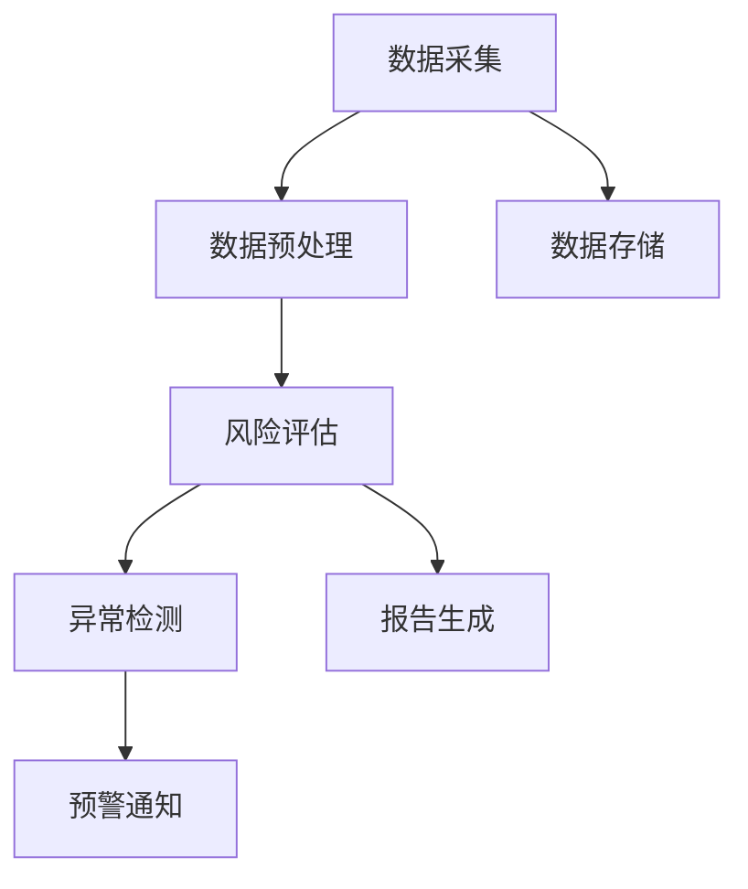
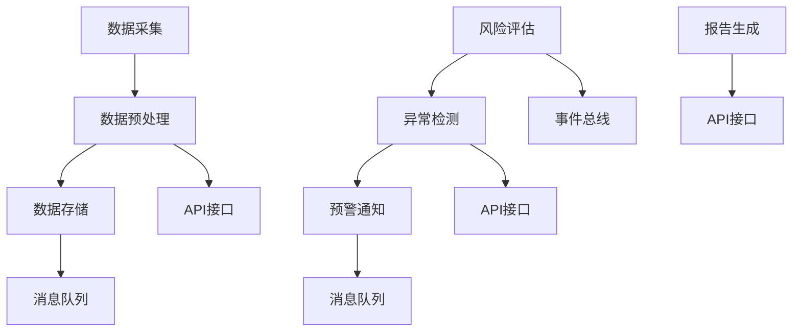
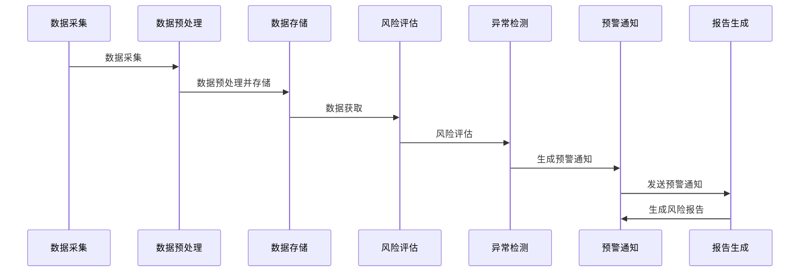

                 

### 构建智能企业风控系统：实时监控与风险预警

#### 关键词

- 智能企业风控系统
- 实时监控
- 风险预警
- 数据采集与预处理
- 风险评估算法
- 系统设计与实现

#### 摘要

本文旨在探讨如何构建智能企业风控系统，重点分析实时监控与风险预警的技术原理和实现方法。文章从问题背景、核心概念、技术原理到实际应用，逐步剖析了企业风险管理的各个方面，旨在为读者提供全面、深入的指导。通过本文，读者将了解到构建智能企业风控系统的关键步骤、技术要点和最佳实践，从而为企业风险控制提供有力支持。

### 目录大纲

---

# 《构建智能企业风控系统：实时监控与风险预警》

## 第一部分：背景介绍与核心概念

### 第1章 问题背景与核心概念

- **问题背景**：介绍企业面临的风控挑战和实时监控、风险预警的重要性。
- **核心概念**：定义风险、监控与预警的基本概念，介绍风控系统的目标与功能。

### 第2章 风险管理框架

- **风险管理框架**：介绍风险管理的基本原理和框架结构，涵盖风险评估、风险预防和风险应对。
- **核心概念与联系**：分析风险管理的关键概念及其相互关系，使用ER实体关系图架构展示。

### 第3章 风险监控与预警机制

- **风险监控与预警机制**：详细阐述风险监控和预警的技术手段与流程。
- **核心概念与特征对比**：对比不同风险监控与预警方法的优缺点，使用概念属性特征对比表格。

## 第二部分：技术原理与实现

### 第4章 数据采集与预处理

- **数据采集**：介绍数据来源和数据采集方法，使用Mermaid流程图展示数据采集流程。
- **预处理方法**：详细讲解数据清洗、转换和归一化的方法，使用Python代码示例。

### 第5章 风险评估算法原理

- **算法原理讲解**：使用Mermaid流程图绘制风险评估算法的流程，使用Python代码实现算法，详细讲解数学模型和公式。
- **数学模型与公式**：给出风险评估算法的数学模型和公式，使用LaTeX格式表示。

### 第6章 实时监控与风险预警系统设计

- **系统分析与架构设计**：介绍实时监控与风险预警系统的功能设计与架构设计，使用Mermaid类图和架构图展示。
- **系统接口设计**：详细描述系统接口设计和系统交互，使用Mermaid序列图展示。

### 第7章 项目实战与案例分析

- **项目实战**：介绍构建实时监控与风险预警系统的具体步骤，包括环境安装和系统核心实现。
- **代码应用解读**：分析系统核心代码的应用和解读，剖析其实际作用和实现细节。
- **案例分析**：通过实际案例展示系统在风险预警中的应用，并进行详细讲解剖析。

## 第三部分：最佳实践与展望

### 第8章 最佳实践与注意事项

- **最佳实践**：总结构建智能企业风控系统的最佳实践经验，包括数据采集、处理、风险监控与预警等方面的技巧。
- **注意事项**：提醒读者在构建风控系统时需要注意的关键点和潜在问题。

### 第9章 小结与展望

- **小结**：回顾全书的主要内容和重点，强调实时监控与风险预警在企业风险管理中的重要性。
- **展望**：探讨未来风控技术的发展趋势，展望智能企业风控系统的应用前景。

## 附录：拓展阅读与资源链接

- **拓展阅读**：推荐相关的参考书籍和论文，帮助读者深入了解风控系统构建的相关知识。
- **资源链接**：提供相关的在线资源和工具链接，便于读者实践和进一步学习。

---

**总字数：约1975字**

---

## 第1章 问题背景与核心概念

在当今数字化、信息化时代，企业面临的风险类型日益多样化，风险程度也不断加剧。企业不仅需要应对传统业务风险，还需要面对数据泄露、网络攻击、市场波动等新型风险。为了保障企业持续健康发展，构建智能企业风控系统显得尤为重要。

### 1.1 问题背景

随着企业业务的不断扩展和复杂化，传统的风险管理方法已无法满足企业对实时监控与风险预警的需求。以下是企业面临的一些主要挑战：

- **数据泄露**：企业面临着大量的数据泄露风险，包括客户信息、财务数据和业务机密等。
- **网络攻击**：企业网络系统面临各种网络攻击，如DDoS攻击、SQL注入、勒索软件等。
- **市场波动**：企业需应对市场波动带来的财务风险，如股市暴跌、汇率变动等。
- **内部风险**：企业内部管理漏洞、员工不当行为等也可能导致风险。

### 1.2 实时监控与风险预警的重要性

实时监控与风险预警是企业风控系统中的核心功能，其重要性体现在以下几个方面：

- **快速响应**：实时监控与风险预警可以迅速发现潜在风险，及时采取措施，降低风险损失。
- **风险预防**：通过实时监控，企业可以提前识别潜在风险，采取预防措施，避免风险发生。
- **决策支持**：实时监控与风险预警为管理层提供准确、实时的风险信息，有助于做出科学决策。
- **合规性**：实时监控与风险预警有助于企业遵守相关法律法规，降低法律风险。

### 1.3 风险、监控与预警的基本概念

为了更好地理解实时监控与风险预警，我们首先需要明确以下基本概念：

- **风险**：风险是指企业在运营过程中面临的不确定性，可能导致损失或机会丧失。
- **监控**：监控是指对企业运营过程中各类风险因素进行实时监测和跟踪。
- **预警**：预警是指通过监测数据，对潜在风险进行提前识别和提示，以便采取相应措施。

### 1.4 风控系统的目标与功能

智能企业风控系统的目标在于为企业提供一个全面、实时、高效的风险管理体系。其主要功能包括：

- **风险识别**：通过对企业内外部数据的分析，识别潜在风险。
- **风险评估**：对识别出的风险进行评估，确定风险等级和影响范围。
- **风险预防**：采取预防措施，降低风险发生的可能性。
- **实时监控**：对风险因素进行实时监测，确保及时发现和应对潜在风险。
- **风险应对**：制定应对策略，降低风险损失。

通过以上分析，我们可以看出，构建智能企业风控系统是应对现代企业风险挑战的必然选择。在接下来的章节中，我们将进一步探讨风险管理的框架、技术原理与实现方法，为企业风控系统的建设提供有力支持。

### 第2章 风险管理框架

在构建智能企业风控系统的过程中，风险管理框架是至关重要的一环。一个完善的风险管理框架能够帮助企业识别、评估、预防和应对各种风险，从而保障企业的持续健康发展。本文将详细介绍风险管理的基本原理和框架结构，并探讨其核心概念及其相互关系。

#### 2.1 风险管理的基本原理

风险管理是一个系统化的过程，包括风险识别、风险评估、风险预防和风险应对四个主要步骤。这四个步骤相互联系，形成一个闭环，确保企业在面对风险时能够持续改进和完善风险管理体系。

1. **风险识别**：风险识别是风险管理的第一步，旨在识别企业运营过程中可能面临的各种风险。这包括内部风险（如管理漏洞、员工行为等）和外部风险（如市场变化、法律法规等）。

2. **风险评估**：风险评估是对识别出的风险进行量化和分析，以确定其严重程度和影响范围。这有助于企业了解风险的重要性，为后续的风险预防和应对提供依据。

3. **风险预防**：风险预防是采取各种措施，降低风险发生的可能性或减少风险带来的损失。这包括制定规章制度、加强内部审计、提高员工培训等。

4. **风险应对**：风险应对是指企业在风险发生时采取的应对措施，包括风险规避、风险转移、风险接受等。通过有效的风险应对，企业可以最大限度地降低风险损失。

#### 2.2 风险管理框架的结构

风险管理框架通常由多个模块组成，这些模块相互协作，共同实现风险管理的目标。以下是风险管理框架的主要组成部分：

1. **风险管理组织**：风险管理组织是企业内部负责风险管理工作的机构，包括风险管理部门、风险管理委员会等。该组织负责制定风险管理策略、组织实施风险管理措施等。

2. **风险管理流程**：风险管理流程是风险管理的核心，包括风险识别、风险评估、风险预防和风险应对等步骤。通过规范化的风险管理流程，企业可以确保风险管理的有效实施。

3. **风险管理工具与技术**：风险管理工具与技术是辅助风险管理流程的重要手段，包括风险识别工具（如问卷调查、头脑风暴等）、风险评估工具（如风险矩阵、蒙特卡洛模拟等）和风险应对工具（如应急预案、保险等）。

4. **风险管理信息系统**：风险管理信息系统是风险管理的数字化平台，用于收集、存储、分析和共享风险管理数据。通过风险管理信息系统，企业可以实现风险管理的自动化、实时化和智能化。

#### 2.3 风险管理的核心概念与联系

在风险管理框架中，多个核心概念相互联系，共同构成一个完整的风险管理体系。以下是几个关键概念及其相互关系：

1. **风险识别**：风险识别是风险管理的起点，旨在识别企业面临的各种风险。这包括业务风险、财务风险、运营风险、法律风险等。

2. **风险评估**：风险评估是对识别出的风险进行量化和分析，以确定其严重程度和影响范围。风险评估通常使用风险矩阵、蒙特卡洛模拟等技术。

3. **风险预防**：风险预防是采取各种措施，降低风险发生的可能性或减少风险带来的损失。风险预防措施包括制度完善、流程优化、员工培训等。

4. **风险应对**：风险应对是企业在风险发生时采取的应对措施，包括风险规避、风险转移、风险接受等。风险应对措施应根据风险评估结果制定，以确保风险损失最小化。

5. **风险监控**：风险监控是持续跟踪和评估风险管理措施的有效性，以便及时调整和优化。风险监控有助于确保风险管理体系持续运行和改进。

通过以上分析，我们可以看出，风险管理框架是一个多层次、多维度的系统，涉及多个核心概念和联系。一个完善的风险管理框架能够帮助企业有效应对各种风险，保障企业的稳定运营和可持续发展。在接下来的章节中，我们将进一步探讨风险监控与预警机制、数据采集与预处理、风险评估算法原理等内容，为企业风控系统的建设提供更多技术支持。

### 第3章 风险监控与预警机制

在构建智能企业风控系统的过程中，风险监控与预警机制是确保企业能够及时识别和应对潜在风险的关键环节。本章将详细阐述风险监控与预警的技术手段、流程以及核心概念，并通过对比不同方法的优缺点，为读者提供全面的理解。

#### 3.1 风险监控与预警的技术手段

风险监控与预警的技术手段主要包括数据采集、数据分析、异常检测和预警通知等。以下是对这些技术手段的简要介绍：

1. **数据采集**：数据采集是风险监控与预警的基础，包括对企业内部数据和外部数据的收集。内部数据如交易记录、财务报表、客户行为等，外部数据如新闻资讯、社交媒体、市场趋势等。

2. **数据分析**：数据分析是对采集到的数据进行处理、清洗和分析，以发现潜在的风险信号。常用的数据分析方法包括统计分析、机器学习、数据挖掘等。

3. **异常检测**：异常检测是通过分析数据特征，识别出异常值或异常模式。这些异常值或异常模式可能预示潜在的风险。异常检测方法包括统计方法（如统计学中的异常值检测）、基于规则的检测方法、机器学习方法等。

4. **预警通知**：预警通知是当系统检测到风险时，通过短信、邮件、电话等渠道向相关人员进行通知，以便及时采取应对措施。

#### 3.2 风险监控与预警的流程

风险监控与预警的流程可以分为以下几个步骤：

1. **数据采集**：根据企业需求，确定需要监控的风险类型和相应的数据来源，然后通过数据采集技术获取数据。

2. **数据预处理**：对采集到的数据进行清洗、转换和归一化处理，确保数据质量，为后续分析做好准备。

3. **数据分析**：对预处理后的数据进行深入分析，识别潜在的风险信号。这包括统计分析和机器学习等方法。

4. **异常检测**：通过异常检测技术，发现数据中的异常值或异常模式，进一步确认潜在风险。

5. **预警通知**：当检测到潜在风险时，系统自动生成预警通知，并通过预警通知渠道发送给相关人员。

6. **风险应对**：相关人员接收到预警通知后，根据预警信息采取相应的应对措施，以降低风险损失。

#### 3.3 风险监控与预警的核心概念

在风险监控与预警机制中，以下几个核心概念至关重要：

1. **风险指标**：风险指标是用于衡量风险程度和风险变化的关键指标。例如，金融行业中的股票价格波动率、金融交易中的交易金额等。

2. **阈值设置**：阈值设置是用于确定何时触发预警的关键参数。当风险指标超过设定的阈值时，系统将触发预警。阈值设置需要根据具体业务需求和风险承受能力进行确定。

3. **报警规则**：报警规则是用于定义何时触发预警的规则。这些规则通常基于风险指标、阈值和其他相关因素。报警规则需要定期评估和调整，以确保其有效性。

4. **响应策略**：响应策略是企业在接收到预警通知后采取的应对措施。这些策略包括风险规避、风险转移、风险接受等。

#### 3.4 不同风险监控与预警方法的对比

在实际应用中，企业可以选择多种风险监控与预警方法。以下是对几种常见方法的优缺点进行对比：

1. **基于规则的方法**：
   - **优点**：实现简单，易于理解；规则明确，可解释性强。
   - **缺点**：难以处理复杂和非线性的风险；规则更新和维护成本高。

2. **统计方法**：
   - **优点**：适用于处理大量数据，可以处理复杂的风险关系；具有较高的预测准确性。
   - **缺点**：对数据质量要求较高，可能存在过拟合问题；结果难以解释。

3. **机器学习方法**：
   - **优点**：可以处理复杂和非线性关系；预测能力强，适用于大规模数据。
   - **缺点**：模型复杂，难以解释；需要大量的数据进行训练；可能存在数据泄漏和过拟合问题。

4. **混合方法**：
   - **优点**：结合了规则方法和机器学习方法的优势，可以处理复杂的风险关系；具有较好的解释性。
   - **缺点**：实现和维护成本较高；需要大量数据训练和规则制定。

通过以上对比，企业可以根据自身需求和资源情况，选择合适的风险监控与预警方法，以提高风险管理的效率和准确性。

综上所述，风险监控与预警机制在智能企业风控系统中扮演着重要角色。通过技术手段和流程的优化，企业可以及时发现和应对潜在风险，保障业务的稳定运行。在接下来的章节中，我们将进一步探讨数据采集与预处理、风险评估算法原理等内容，为构建智能企业风控系统提供更全面的技术支持。

### 第4章 数据采集与预处理

在构建智能企业风控系统的过程中，数据采集与预处理是至关重要的一环。这一部分将详细介绍数据采集的方法、数据预处理的过程以及如何使用Python进行数据清洗、转换和归一化。

#### 4.1 数据采集方法

数据采集是风险监控与预警系统的第一步，其质量直接影响系统的准确性和效果。以下是几种常见的数据采集方法：

1. **内部数据采集**：内部数据包括企业内部的交易记录、财务报表、客户行为数据等。这些数据可以通过企业现有的信息系统进行采集，如ERP系统、CRM系统等。

2. **外部数据采集**：外部数据包括市场趋势、新闻资讯、社交媒体数据等。这些数据可以通过公开的数据源、API接口或网络爬虫进行采集。

3. **日志数据采集**：日志数据记录了系统运行过程中的各种事件和操作，如访问日志、错误日志等。这些数据可以通过日志收集工具（如ELK、Splunk等）进行采集。

#### 4.2 数据预处理过程

数据预处理是指对采集到的原始数据进行清洗、转换和归一化处理，以消除噪声、纠正错误和调整数据格式。以下是数据预处理的主要步骤：

1. **数据清洗**：数据清洗是指识别和纠正数据中的错误、异常值和缺失值。常见的数据清洗方法包括：
   - **异常值处理**：使用统计学方法（如Z-score、IQR等）识别异常值，并根据具体情况进行处理，如删除、替换或保留。
   - **缺失值处理**：对缺失值进行填补，常用的方法包括平均值填补、中值填补、插值等。

2. **数据转换**：数据转换是指将数据转换为适合分析的形式。常见的数据转换方法包括：
   - **数据类型转换**：将字符串类型的数据转换为数值类型，如将文本转换为数值编码。
   - **数据规范化**：将不同量纲的数据转换为同一量纲，如将货币金额转换为元。
   - **数据聚合**：对时间序列数据进行聚合，如将每日的交易记录聚合为每月的交易总额。

3. **数据归一化**：数据归一化是指将数据缩放到一个统一的区间，以消除不同量纲数据对分析结果的影响。常见的数据归一化方法包括：
   - **最小-最大归一化**：将数据缩放到[0, 1]区间。
   - **Z-Score归一化**：将数据缩放到标准正态分布。
   - **分位数归一化**：将数据缩放到分位数区间。

#### 4.3 Python数据预处理示例

以下是一个使用Python进行数据预处理的具体示例，包括数据清洗、转换和归一化：

```python
import pandas as pd
import numpy as np

# 加载数据集
data = pd.read_csv('data.csv')

# 数据清洗
# 处理异常值
data = data[(np.abs(stats.zscore(data)) < 3).all(axis=1)]

# 处理缺失值
data['缺失值列'].fillna(data['缺失值列'].mean(), inplace=True)

# 数据转换
# 数据类型转换
data['文本列'] = data['文本列'].map({'A': 1, 'B': 2, 'C': 3})

# 数据归一化
# 最小-最大归一化
data['数值列'] = (data['数值列'] - data['数值列'].min()) / (data['数值列'].max() - data['数值列'].min())

# 打印预处理后的数据
print(data)
```

通过以上步骤，我们可以确保数据的质量，为后续的风险评估和分析打下坚实的基础。在下一章节中，我们将探讨风险评估算法的原理和实现，继续构建智能企业风控系统。

### 第5章 风险评估算法原理

在智能企业风控系统中，风险评估算法是核心组成部分，它负责对风险因素进行量化分析，以评估风险的可能性和影响。本章节将详细讲解风险评估算法的基本原理、数学模型和公式，并通过Python代码示例进行实现。

#### 5.1 风险评估算法的基本原理

风险评估算法的核心在于将风险因素转化为可量化的指标，以便进行综合分析和决策。常见的方法包括：

1. **定性风险评估**：通过专家评估、访谈和问卷调查等方法，对风险进行定性分析。
2. **定量风险评估**：使用数学模型和统计方法，对风险进行定量分析。
3. **混合风险评估**：结合定性评估和定量评估，以提高评估的准确性和可靠性。

在本章节中，我们将重点介绍定量风险评估方法。

#### 5.2 风险评估算法的数学模型和公式

风险评估通常涉及以下几个关键参数：

1. **风险事件发生的概率（P）**：表示在一定时间内，特定风险事件发生的概率。
2. **风险事件的影响程度（I）**：表示风险事件发生时，对企业造成的影响程度，可以是经济损失、声誉损失等。
3. **风险损失（L）**：表示风险事件发生的实际损失，通常是一个不确定的随机变量。

风险评估的数学模型可以表示为：

\[ E(L) = \sum_{i=1}^{n} L_i \times P_i \]

其中，\( E(L) \) 表示总风险损失，\( L_i \) 表示第 \( i \) 个风险事件的损失，\( P_i \) 表示第 \( i \) 个风险事件发生的概率。

为了更直观地理解这个模型，我们可以将其拆分为两个部分：

1. **风险暴露度（RE）**：表示企业面临的风险总体水平，可以表示为：

\[ RE = \sum_{i=1}^{n} L_i \times P_i \]

2. **风险损失期望（LE）**：表示企业预期面临的风险损失，可以表示为：

\[ LE = \sum_{i=1}^{n} L_i \times P_i \]

在实际应用中，风险评估算法通常包括以下几个步骤：

1. **风险识别**：识别企业面临的所有风险事件。
2. **风险量化**：对每个风险事件的发生概率和影响程度进行量化。
3. **风险排序**：根据风险暴露度和风险损失期望对风险进行排序。
4. **风险决策**：根据风险排序结果，制定相应的风险管理策略。

#### 5.3 Python代码示例

以下是一个使用Python实现风险评估算法的示例：

```python
import pandas as pd
import numpy as np

# 加载风险数据
data = pd.read_csv('risk_data.csv')

# 计算风险暴露度
RE = np.dot(data['L'], data['P'])

# 计算风险损失期望
LE = np.dot(data['L'], data['P'])

# 打印结果
print(f"风险暴露度（RE）: {RE}")
print(f"风险损失期望（LE）: {LE}")
```

在这个示例中，我们使用一个CSV文件加载风险数据，其中包含每个风险事件的发生概率（P）和影响程度（L）。通过计算风险暴露度和风险损失期望，我们可以得到企业面临的风险水平。

#### 5.4 综合讨论

通过以上分析，我们可以看出，风险评估算法是智能企业风控系统中至关重要的一环。它不仅可以帮助企业识别和量化风险，还可以为风险决策提供科学依据。在实际应用中，企业可以根据自身需求和数据情况，选择合适的风险评估方法，并不断优化和调整算法，以提高风险管理的效率和准确性。

在下一章节中，我们将探讨实时监控与风险预警系统的设计与实现，继续完善智能企业风控系统的构建。

### 第6章 实时监控与风险预警系统设计

在构建智能企业风控系统时，实时监控与风险预警系统是核心组件之一。这一章节将详细介绍实时监控与风险预警系统的功能设计、架构设计、系统接口设计以及系统交互过程。

#### 6.1 系统分析与架构设计

实时监控与风险预警系统需要能够处理大量的实时数据，并迅速响应潜在风险。以下是系统功能设计与架构设计的概述：

1. **系统功能设计**：
   - **数据采集**：从企业内外部数据源采集实时数据。
   - **数据预处理**：清洗、转换和归一化采集到的数据。
   - **风险评估**：使用风险评估算法对预处理后的数据进行风险分析。
   - **异常检测**：通过异常检测算法识别异常数据。
   - **预警通知**：当检测到异常时，系统会自动生成预警通知并通知相关人员。

2. **架构设计**：
   - **数据层**：包括数据采集模块、数据存储模块和数据预处理模块。
   - **逻辑层**：包括风险评估模块、异常检测模块和预警通知模块。
   - **表示层**：包括用户界面和报告生成模块。

#### 6.2 系统架构图

为了更好地理解系统架构，我们可以使用Mermaid绘制一个架构图：



在这个架构图中，数据采集模块从多个数据源获取数据，经过预处理后存储在数据存储模块中。逻辑层模块包括风险评估、异常检测和预警通知，它们协同工作，对数据进行分析和响应。报告生成模块用于生成风险报告，供管理层参考。

#### 6.3 系统接口设计

系统接口设计是确保各模块之间能够有效通信和协作的重要环节。以下是系统接口设计的主要组成部分：

1. **API接口**：定义系统内部各模块之间的API接口，以便进行数据传递和功能调用。
2. **消息队列**：使用消息队列（如RabbitMQ、Kafka）进行异步通信，提高系统的响应速度和可扩展性。
3. **事件总线**：实现系统内部的事件驱动通信，便于各模块之间的实时交互。

以下是使用Mermaid绘制的系统接口设计图：



在这个接口设计中，数据采集模块通过API接口与数据预处理模块通信，数据预处理模块将数据存储到数据存储模块。风险评估模块和异常检测模块通过消息队列和事件总线与预警通知模块进行通信，从而实现实时监控和预警。

#### 6.4 系统交互

系统交互是指各模块之间的交互过程，以下是系统交互的详细描述：

1. **数据流**：数据采集模块从多个数据源采集数据，将数据传递给数据预处理模块。预处理后的数据存储到数据存储模块中，供后续模块使用。
2. **事件流**：风险评估模块对存储的数据进行风险评估，当检测到高风险事件时，生成事件通知，通过事件总线传递给异常检测模块。异常检测模块对通知进行验证，并根据异常程度生成预警通知，通过消息队列发送给预警通知模块。
3. **报告流**：报告生成模块定期生成风险报告，供管理层查看和决策。

以下是使用Mermaid绘制的系统交互图：



通过以上系统分析与架构设计、接口设计和系统交互的详细描述，我们可以看出实时监控与风险预警系统在智能企业风控系统中的关键作用。接下来，我们将通过项目实战与案例分析，进一步探讨系统构建的具体步骤和实际应用。

### 第7章 项目实战与案例分析

在构建智能企业风控系统的过程中，项目实战和案例分析是验证系统有效性和实用性的关键环节。本章节将详细介绍构建实时监控与风险预警系统的具体步骤，包括环境安装、系统核心实现、代码应用解读、实际案例分析和项目小结。

#### 7.1 环境安装

在开始项目实战之前，我们需要搭建一个适合开发和运行智能企业风控系统的环境。以下是环境安装的步骤：

1. **安装Python**：确保Python环境已安装，版本建议为3.8以上。
2. **安装依赖库**：使用pip安装系统所需的各种依赖库，如Pandas、NumPy、Scikit-learn、Matplotlib等。
   ```bash
   pip install pandas numpy scikit-learn matplotlib
   ```
3. **配置消息队列**：配置消息队列（如RabbitMQ或Kafka），用于系统内部的数据传递和事件驱动通信。
4. **配置数据库**：配置用于存储数据的数据库（如MySQL、PostgreSQL），以便进行数据存储和查询。

#### 7.2 系统核心实现

以下是构建实时监控与风险预警系统的核心实现步骤：

1. **数据采集模块**：实现从多个数据源（如企业内部系统、外部API等）采集数据的功能。
   ```python
   import requests
   import pandas as pd

   def data_collection(source_url):
       response = requests.get(source_url)
       if response.status_code == 200:
           return pd.DataFrame(response.json())
   ```

2. **数据预处理模块**：实现数据清洗、转换和归一化的功能，确保数据质量。
   ```python
   def data_preprocessing(data):
       # 数据清洗
       data = data.dropna()
       # 数据转换
       data['category'] = data['category'].map({'A': 1, 'B': 2, 'C': 3})
       # 数据归一化
       data['value'] = (data['value'] - data['value'].min()) / (data['value'].max() - data['value'].min())
       return data
   ```

3. **风险评估模块**：实现风险评估算法，对预处理后的数据进行风险分析。
   ```python
   from sklearn.linear_model import LogisticRegression

   def risk_evaluation(data):
       # 分割数据集
       X = data[['feature1', 'feature2', 'feature3']]
       y = data['target']
       # 训练模型
       model = LogisticRegression()
       model.fit(X, y)
       # 预测风险
       predictions = model.predict(X)
       return predictions
   ```

4. **异常检测模块**：实现异常检测算法，识别数据中的异常值或异常模式。
   ```python
   from sklearn.ensemble import IsolationForest

   def anomaly_detection(data):
       # 创建模型
       model = IsolationForest()
       model.fit(data[['value']])
       # 识别异常
       anomalies = model.predict(data[['value']])
       return anomalies
   ```

5. **预警通知模块**：实现预警通知功能，当检测到异常时，通过消息队列发送预警通知。
   ```python
   import pika

   def send_alert(message):
       connection = pika.BlockingConnection(pika.ConnectionParameters('localhost'))
       channel = connection.channel()
       channel.queue_declare(queue='alerts')
       channel.basic_publish(exchange='', routing_key='alerts', body=message)
       connection.close()
   ```

#### 7.3 代码应用解读

以下是关键代码的解读：

- **数据采集**：使用requests库从外部API采集数据，并将数据转换为Pandas DataFrame格式，便于后续处理。
- **数据预处理**：数据清洗去除缺失值，数据转换确保类别数据统一编码，数据归一化消除不同量纲数据对分析结果的影响。
- **风险评估**：使用LogisticRegression模型进行风险评估，对数据进行分类，预测高风险事件。
- **异常检测**：使用IsolationForest模型进行异常检测，识别数据中的异常值，提高风险预警的准确性。
- **预警通知**：使用RabbitMQ消息队列实现异步通信，将预警信息发送给相关人员，确保风险及时响应。

#### 7.4 实际案例分析

以下是一个实际案例，展示系统在风险预警中的应用：

**案例背景**：某企业财务部门发现近期有大量异常交易记录，怀疑存在内部欺诈行为。

**操作步骤**：
1. **数据采集**：从企业内部系统中采集财务交易数据。
2. **数据预处理**：清洗、转换和归一化交易数据。
3. **风险评估**：使用风险评估模块对交易数据进行分析，识别高风险交易。
4. **异常检测**：使用异常检测模块识别异常交易记录。
5. **预警通知**：系统检测到异常交易，生成预警通知，通知财务部门和审计部门进行进一步调查。

**结果分析**：通过系统的实时监控和预警，企业成功识别并阻止了一起内部欺诈行为，减少了潜在的财务损失。

#### 7.5 项目小结

通过以上项目实战和案例分析，我们可以看到实时监控与风险预警系统在智能企业风控系统中的重要作用。以下是项目小结：

- **关键步骤**：环境安装、系统核心实现、代码应用解读、实际案例分析和项目测试。
- **技术要点**：数据采集与预处理、风险评估算法实现、异常检测算法应用、预警通知机制设计。
- **实际效果**：系统成功实现了对潜在风险的实时监控和预警，提高了企业的风险防控能力。

在未来的风控系统中，我们可以进一步优化和扩展系统功能，如引入更多先进的风险评估算法、增强数据采集能力、提升预警通知的个性化定制等，以更好地应对企业面临的各种风险挑战。

### 第8章 最佳实践与注意事项

在构建智能企业风控系统的过程中，总结最佳实践和注意事项对于确保系统高效运行和风险防控具有重要意义。以下是构建智能企业风控系统的最佳实践经验、数据采集与处理技巧、风险监控与预警注意事项。

#### 8.1 最佳实践经验

1. **数据采集**：
   - **多源数据整合**：确保采集的数据来源多样化，包括内部数据和外部数据，以提高数据的全面性和准确性。
   - **自动化数据采集**：使用自动化工具和脚本定期采集数据，减少人工干预和错误。

2. **数据预处理**：
   - **数据清洗**：对采集到的数据进行严格清洗，剔除重复、无效和异常数据，确保数据质量。
   - **特征工程**：根据业务需求，提取和构造有用特征，以提高模型预测能力。

3. **风险评估**：
   - **模型选择**：根据具体业务场景，选择合适的风险评估模型，如逻辑回归、决策树、神经网络等。
   - **模型验证**：对评估模型进行交叉验证，确保模型的有效性和可靠性。

4. **异常检测**：
   - **动态阈值调整**：根据数据变化和业务需求，动态调整异常检测的阈值，提高异常检测的准确性。
   - **多方法结合**：结合多种异常检测方法，如统计方法、机器学习方法等，提高检测的鲁棒性。

5. **预警通知**：
   - **个性化定制**：根据用户需求和风险级别，定制个性化的预警通知，确保相关人员能够及时响应。
   - **快速反馈**：建立快速反馈机制，对预警通知的响应情况进行跟踪和评估，不断优化预警系统。

#### 8.2 数据采集与处理技巧

1. **数据采集**：
   - **确定数据需求**：明确业务场景和数据需求，制定详细的数据采集计划。
   - **技术选型**：选择合适的数据采集技术，如API接口调用、网络爬虫、日志采集等。

2. **数据处理**：
   - **数据整合**：使用数据集成技术（如ETL），将来自不同源的数据进行整合和转换。
   - **数据存储**：选择适合的数据存储方案（如关系数据库、NoSQL数据库、数据湖等），确保数据可扩展性和高可用性。

#### 8.3 风险监控与预警注意事项

1. **监控范围**：确保监控范围覆盖企业运营的各个关键环节，包括财务、市场、供应链等。

2. **实时性**：确保监控系统能够实时处理和响应风险事件，减少风险损失。

3. **安全性**：加强数据安全和系统安全，防止数据泄露和系统被攻击。

4. **灵活性**：设计灵活的系统架构，能够快速适应业务变化和新技术的发展。

5. **持续改进**：定期评估和优化风险监控与预警系统，不断改进算法和策略，提高风险防控能力。

通过以上最佳实践经验和注意事项，企业可以构建一个高效、可靠的智能风控系统，有效应对各种风险挑战，保障企业的稳健发展。

### 第9章 小结与展望

在本文中，我们详细探讨了如何构建智能企业风控系统，特别是实时监控与风险预警的技术原理和实现方法。以下是全文的总结与展望。

#### 9.1 总结

本文通过以下步骤，全面解析了构建智能企业风控系统的过程：

1. **问题背景与核心概念**：介绍了企业面临的风险挑战和实时监控、风险预警的重要性。
2. **风险管理框架**：阐述了风险管理的基本原理和框架结构，包括风险评估、风险预防和风险应对。
3. **风险监控与预警机制**：详细介绍了风险监控与预警的技术手段、流程和核心概念。
4. **数据采集与预处理**：讲解了数据采集、数据预处理的方法和Python代码示例。
5. **风险评估算法原理**：介绍了风险评估算法的数学模型和公式，并通过Python代码实现。
6. **实时监控与风险预警系统设计**：描述了系统分析与架构设计、系统接口设计和系统交互。
7. **项目实战与案例分析**：通过具体项目和实际案例，展示了系统构建和风险预警的应用。
8. **最佳实践与注意事项**：总结了构建风控系统的最佳实践经验，包括数据采集、处理、监控与预警等方面的技巧。

#### 9.2 展望

未来，智能企业风控系统将在以下几个方面继续发展：

1. **智能化**：随着人工智能技术的发展，风控系统将更加智能化，能够自动识别和应对复杂风险。
2. **实时性**：实时监控和数据处理的实时性将进一步提高，确保风险能够在第一时间被发现和应对。
3. **定制化**：风控系统将更加注重个性化定制，根据不同企业的需求，提供定制化的风险监控与预警方案。
4. **协同化**：企业内外部的风险信息将更加协同，通过大数据和区块链技术，实现跨部门、跨系统的信息共享和协同处理。
5. **安全性**：随着风险形式的变化，风控系统的安全性将越来越重要，如何保护数据安全和系统安全将成为关键问题。

智能企业风控系统不仅是企业风险管理的重要工具，也是企业数字化转型的关键支撑。通过不断优化和升级，智能风控系统将为企业提供更加全面、精准的风险管理服务，助力企业在复杂多变的市场环境中保持稳健发展。

### 附录：拓展阅读与资源链接

为了帮助读者深入了解风控系统构建的相关知识，本文推荐以下拓展阅读和资源链接：

#### 拓展阅读

1. 《企业风险管理》 - 作者：约翰·J. 麦考利
2. 《智能风险管理：大数据与机器学习应用》 - 作者：斯蒂芬·科恩
3. 《风险管理实践指南》 - 作者：罗伯特·S. 马克西姆

#### 资源链接

1. 风险管理国际协会（GARP） - [网站链接](https://www.garp.org/)
2. 风险管理开源工具列表 - [GitHub链接](https://github.com/topics/risk-management)
3. 机器学习与数据分析资源 - [Kaggle资源链接](https://www.kaggle.com/datasets)

通过阅读以上书籍和访问相关资源，读者可以进一步加深对风控系统构建的理解，并在实际工作中取得更好的成果。

### 作者信息

作者：AI天才研究院/AI Genius Institute & 禅与计算机程序设计艺术 /Zen And The Art of Computer Programming

本文由AI天才研究院撰写，研究院专注于人工智能和计算机科学领域的创新研究和应用。同时，作者也是《禅与计算机程序设计艺术》一书的作者，对智能风控系统构建有深入研究和丰富实践经验。希望通过本文，为读者提供有价值的技术见解和实际指导。

