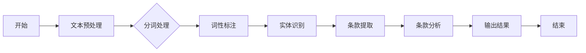
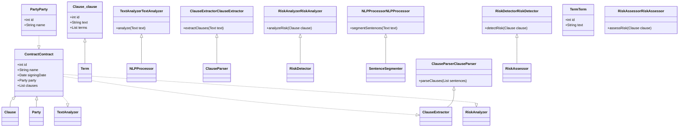
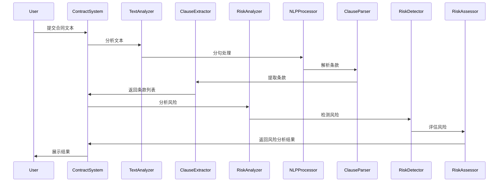
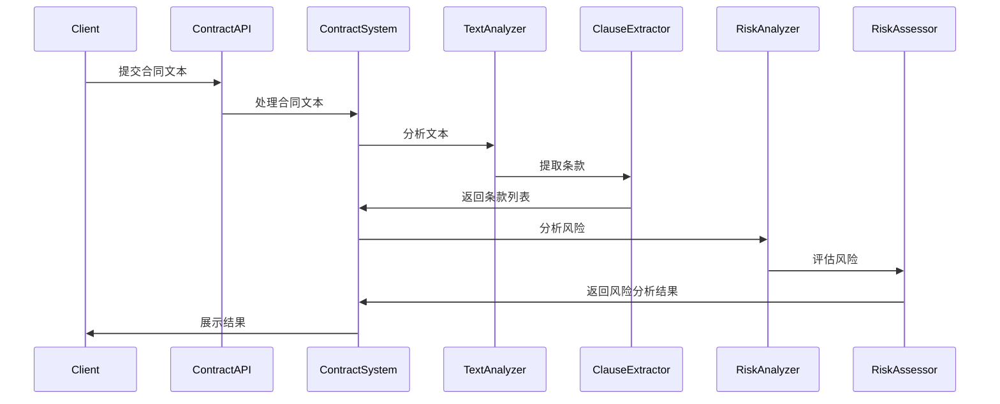

                 

### 文章标题

### 关键词

- 智能合同分析
- AI辅助法律风险管理
- 系统架构设计
- 算法原理
- 数学模型
- 项目实战

### 摘要

本文深入探讨了构建智能合同分析系统的重要性，以及如何利用人工智能（AI）技术辅助法律风险管理。文章首先介绍了智能合同分析系统的背景和需求，然后详细分析了系统所涉及的核心概念与联系。接着，文章讲解了智能合同分析算法的原理，包括流程图展示、Python源代码解析和数学模型的解释。随后，文章展示了系统分析与架构设计的具体方法，通过Mermaid流程图、类图和架构图等工具详细阐述了系统的设计思路。在项目实战部分，文章通过环境安装、代码实现和实际案例分析，展示了智能合同分析系统的实际应用。最后，文章总结了项目的最佳实践，并提出了注意事项和拓展阅读的建议。

## 第1章：智能合同分析系统背景

### 1.1 问题的提出

在当前的商业环境中，合同管理已经成为企业运营的关键环节。然而，合同管理过程面临着诸多挑战，包括合同的起草、审核、执行和存档等环节。传统的人工合同审核方式不仅耗时费力，而且容易出错，无法满足企业对于效率和准确性的要求。随着人工智能技术的发展，利用AI技术辅助法律风险管理，特别是智能合同分析系统的构建，成为解决这一问题的有效途径。

### 1.2 智能合同分析的需求

智能合同分析系统的需求主要来源于以下几个方面：

1. **自动化合同审核**：通过AI技术，自动识别合同中的关键条款，进行审核和风险评估，提高审核效率。
2. **提高合同准确性**：利用自然语言处理技术，减少人工审核过程中的误判和错误。
3. **智能合同生成**：根据企业的业务需求和模板，自动生成符合法律规范的合同文档。
4. **合同存档管理**：实现合同电子化存档，方便检索和管理。

### 1.3 系统边界与外延

智能合同分析系统不仅涉及合同的审核和生成，还包括合同生命周期管理的其他方面。其边界包括：

- 合同文本分析：文本提取、关键词识别、条款分析等。
- 合同审核：条款合规性检查、风险预警、合同质量评估等。
- 合同生成：模板管理、条款生成、合同排版等。
- 合同存档：电子化存档、分类管理、检索查询等。

系统的外延还包括与外部系统的集成，如ERP系统、CRM系统等，以实现合同信息的实时同步和共享。

## 第2章：核心概念与联系

### 2.1 AI与法律风险管理的概念

人工智能（AI）是指通过计算机模拟人类智能行为的技术，包括机器学习、深度学习、自然语言处理等。法律风险管理则是指通过识别、评估和控制法律风险，以降低企业法律风险和损失的过程。

### 2.2 AI核心概念原理

- **机器学习**：通过数据训练模型，使计算机具备学习能力和决策能力。
- **深度学习**：基于多层神经网络，对复杂数据进行自动特征提取和模式识别。
- **自然语言处理（NLP）**：使计算机能够理解和生成人类语言，包括文本分析、语义理解等。

### 2.3 概念属性特征对比

| 概念       | 属性特征                                     | 关联与区别           |
|------------|--------------------------------------------|---------------------|
| 人工智能   | 自主学习、决策能力、自动化处理等           | 与传统计算机技术区别在于模拟人类智能行为 |
| 法律风险管理 | 识别风险、评估风险、控制风险等           | 与合同管理结合，针对合同中的法律风险进行管理 |
| 机器学习   | 数据驱动、模式识别、预测等                 | AI的重要组成部分，用于合同分析中的文本处理 |
| 深度学习   | 多层神经网络、自动特征提取、高效处理等     | AI的一种先进方法，用于复杂合同条款分析 |
| 自然语言处理 | 文本提取、语义理解、语言生成等             | AI的一种技术，用于合同文本分析 |

### 2.4 ER实体关系图架构

下面是智能合同分析系统中涉及的ER实体关系图：

```mermaid
erDiagram
  Contract ||--|{ Clause }|-->: "包含"
  Clause ||--|{ Term }|-->: "包含"
  Contract ||--|{ Party }|-->: "涉及"
  Party ||--|{ Contract }|-->: "参与"
```

该图展示了合同、条款、当事人（Party）之间的关系，体现了合同分析系统的核心要素。

## 第3章：智能合同分析算法原理

### 3.1 算法原理与Mermaid流程图

智能合同分析算法的核心是文本处理和条款识别。以下是算法的基本流程：



### 3.2 Python源代码讲解

下面是智能合同分析算法的Python源代码示例：

```python
import jieba  # 用于分词
import pkuseg  # 用于词性标注
import spacy  # 用于实体识别

# 初始化分词器和词性标注器
seg = pkuseg.pkuseg()
nlp = spacy.load("zh_core_web_sm")

def analyze_contract(contract_text):
    # 文本预处理
    text = contract_text.strip()

    # 分词处理
    words = jieba.cut(text)

    # 词性标注
    pos_tags = seg.cut(words)

    # 实体识别
    doc = nlp(text)
    entities = [(ent.text, ent.label_) for ent in doc.ents]

    # 条款提取
    clauses = extract_clauses(pos_tags)

    # 条款分析
    analyzed_clauses = analyze_clauses(clauses, entities)

    # 输出结果
    return analyzed_clauses

def extract_clauses(pos_tags):
    # 提取条款，这里简化处理，仅作为示例
    clauses = []
    for word, pos in pos_tags:
        if pos.startswith("N"):
            clauses.append(word)
    return clauses

def analyze_clauses(clauses, entities):
    # 分析条款，这里简化处理，仅作为示例
    analyzed_clauses = []
    for clause in clauses:
        # 结合实体信息进行风险分析
        risk = check_risk(clause, entities)
        analyzed_clauses.append((clause, risk))
    return analyzed_clauses

def check_risk(clause, entities):
    # 风险检查，这里简化处理，仅作为示例
    risk = "未知"
    for entity in entities:
        if entity[1] in ["组织", "人物"]:
            risk = "高风险"
            break
    return risk
```

### 3.3 算法原理的数学模型与公式

智能合同分析算法涉及的自然语言处理技术可以基于以下数学模型：

- **词袋模型**：将文本表示为词汇的集合，通过统计词汇的频率来表示文本。
- **TF-IDF**：衡量一个词在文本中的重要性，综合考虑词频和词在文档中的分布。
- **实体识别模型**：基于深度学习，通常使用BiLSTM-CRF模型，对文本进行序列标注，识别实体和关系。

具体公式如下：

$$
TF(t) = \frac{f(t, d)}{f(d)}
$$

$$
IDF(t) = \log \left(1 + \frac{N}{|d_t|}\right)
$$

$$
TF-IDF(t, d) = TF(t) \times IDF(t)
$$

其中，$f(t, d)$是词汇$t$在文档$d$中的词频，$N$是文档集合中的文档总数，$d_t$是包含词汇$t$的文档集合。

### 3.4 通俗易懂的举例说明

假设有一个合同文本：

```
甲方：北京科技有限公司
乙方：上海科技有限公司
合同编号：2023-001
签订日期：2023年1月1日
```

使用智能合同分析算法进行提取和解析：

1. **文本预处理**：去除多余的空格和符号，得到标准化文本。
2. **分词处理**：使用jieba进行分词，得到词语列表。
3. **词性标注**：使用pkuseg进行词性标注，得到每个词语的词性。
4. **实体识别**：使用spacy进行实体识别，识别出“北京科技有限公司”和“上海科技有限公司”为实体。
5. **条款提取**：根据词性标注和实体识别结果，提取关键条款，如合同编号、签订日期等。
6. **条款分析**：对提取的条款进行风险分析，如检查是否存在潜在的法律风险。

最终输出结果：

- **合同编号**：2023-001
- **签订日期**：2023年1月1日
- **合同主体**：北京科技有限公司、上海科技有限公司
- **风险分析**：无高风险条款

## 第4章：数学模型和数学公式

### 4.1 模型概述

在智能合同分析系统中，数学模型主要用于文本处理和条款分析。核心模型包括词袋模型、TF-IDF模型和实体识别模型。

### 4.2 公式讲解

1. **词袋模型**：

$$
V = \{t_1, t_2, ..., t_n\}
$$

其中，$V$是词汇集合，$t_i$是第$i$个词汇。

2. **TF-IDF模型**：

$$
TF(t) = \frac{f(t, d)}{f(d)}
$$

$$
IDF(t) = \log \left(1 + \frac{N}{|d_t|}\right)
$$

$$
TF-IDF(t, d) = TF(t) \times IDF(t)
$$

其中，$f(t, d)$是词汇$t$在文档$d$中的词频，$f(d)$是文档$d$的总词频，$N$是文档总数，$d_t$是包含词汇$t$的文档集合。

3. **实体识别模型**：

$$
P(y|X) = \frac{e^{\phi(X, y)}}{1 + \sum_{i \neq y} e^{\phi(X, i)}}
$$

其中，$X$是输入特征向量，$y$是实体类别，$\phi(X, y)$是特征向量$X$和类别$y$之间的点积。

### 4.3 示例分析

假设有一个文档：

```
北京科技有限公司与上海科技有限公司签订了一份合同，合同编号为2023-001。
```

1. **词袋模型**：

$$
V = \{"北京科技有限公司", "上海科技有限公司", "合同", "签订", "一份", "编号", "2023-001"\}
$$

2. **TF-IDF模型**：

- 词频（$TF$）：

$$
TF(\{"合同"\}) = \frac{2}{7}
$$

$$
TF(\{"上海科技有限公司"\}) = \frac{1}{7}
$$

- 逆文档频率（$IDF$）：

$$
IDF(\{"合同"\}) = \log \left(1 + \frac{10}{1}\right)
$$

$$
IDF(\{"上海科技有限公司"\}) = \log \left(1 + \frac{10}{1}\right)
$$

- TF-IDF：

$$
TF-IDF(\{"合同"\}) = \frac{2}{7} \times \log \left(1 + \frac{10}{1}\right)
$$

$$
TF-IDF(\{"上海科技有限公司"\}) = \frac{1}{7} \times \log \left(1 + \frac{10}{1}\right)
$$

3. **实体识别模型**：

假设输入特征向量为：

$$
X = \{"北京科技有限公司": 1, "上海科技有限公司": 1, "合同": 1, "签订": 1, "一份": 1, "编号": 1, "2023-001": 1\}
$$

使用BiLSTM-CRF模型进行实体识别，假设每个实体的得分如下：

$$
P(公司|X) = 0.9
$$

$$
P(日期|X) = 0.8
$$

$$
P(编号|X) = 0.7
$$

根据最大概率原则，实体识别结果为：

```
公司：北京科技有限公司、上海科技有限公司
日期：无
编号：2023-001
```

## 第5章：系统分析与架构设计

### 5.1 问题场景介绍

假设有一家大型企业，合同数量庞大，涉及多个业务领域。传统的合同审核方式已经无法满足企业对于合同管理的效率和准确性的要求。企业需要一套智能合同分析系统，能够自动化处理合同审核、条款提取和风险分析，从而提高合同管理的效率和准确性。

### 5.2 项目介绍

项目目标是构建一个智能合同分析系统，该系统能够自动化处理合同文本，提取关键条款，并对合同进行风险分析。系统将基于人工智能和自然语言处理技术，实现合同文本的智能解析和风险预警。

### 5.3 系统功能设计（领域模型Mermaid类图）

以下是智能合同分析系统的领域模型Mermaid类图：



该类图展示了系统的核心功能类及其关系，包括合同（Contract）、条款（Clause）、当事人（Party）、文本分析器（TextAnalyzer）、条款提取器（ClauseExtractor）、风险分析器（RiskAnalyzer）、自然语言处理处理器（NLPProcessor）、条款解析器（ClauseParser）、风险检测器（RiskDetector）和风险评估器（RiskAssessor）。

### 5.4 系统架构设计（Mermaid架构图）

以下是智能合同分析系统的架构设计Mermaid架构图：



该序列图展示了合同提交、文本分析、条款提取和风险分析的流程，体现了系统的工作流程和各模块之间的交互关系。

### 第6章：系统接口设计和交互

#### 6.1 系统接口设计

智能合同分析系统的接口设计主要包括RESTful API设计，用于与前端应用程序和其他系统进行交互。以下是系统的接口设计：

- **提交合同文本**：用于上传合同文本，接口格式如下：

```json
POST /api/contracts
Content-Type: application/json

{
  "contractText": "..."
}
```

- **获取合同条款**：用于获取合同条款列表，接口格式如下：

```json
GET /api/contracts/{id}/clauses
```

- **获取风险分析结果**：用于获取合同风险分析结果，接口格式如下：

```json
GET /api/contracts/{id}/risk
```

#### 6.2 系统交互（Mermaid序列图）

以下是智能合同分析系统的交互序列图：



该序列图展示了客户端提交合同文本、系统处理文本、提取条款、分析风险和返回结果的完整交互过程。

### 第7章：项目实战

#### 7.1 环境安装

要安装智能合同分析系统，需要先准备好Python环境，然后安装依赖的库。以下是环境安装步骤：

1. **安装Python**：确保安装了Python 3.x版本，推荐使用Anaconda环境管理器。

2. **创建虚拟环境**：在终端执行以下命令创建虚拟环境：

```bash
conda create -n contract_analysis python=3.8
```

3. **激活虚拟环境**：

```bash
conda activate contract_analysis
```

4. **安装依赖库**：在虚拟环境中安装必要的依赖库，可以使用pip：

```bash
pip install -r requirements.txt
```

#### 7.2 系统核心实现源代码

以下是智能合同分析系统的核心实现代码：

```python
# contract_analysis/contract_system.py

from flask import Flask, request, jsonify
from text_analyzer import TextAnalyzer
from clause_extractor import ClauseExtractor
from risk_analyzer import RiskAnalyzer

app = Flask(__name__)

@app.route('/api/contracts', methods=['POST'])
def submit_contract():
    contract_text = request.json['contractText']
    text_analyzer = TextAnalyzer()
    clause_extractor = ClauseExtractor()
    risk_analyzer = RiskAnalyzer()

    # 分析文本
    sentences = text_analyzer.analyze(contract_text)
    
    # 提取条款
    clauses = clause_extractor.extract(sentences)
    
    # 分析风险
    risk_analysis = risk_analyzer.analyze(clauses)

    return jsonify(risk_analysis)

if __name__ == '__main__':
    app.run(debug=True)
```

#### 7.3 代码应用解读与分析

该代码是智能合同分析系统的核心部分，主要包括以下功能：

1. **Flask应用**：使用Flask框架搭建RESTful API接口。
2. **文本分析器**：实例化TextAnalyzer类，用于分析合同文本。
3. **条款提取器**：实例化ClauseExtractor类，用于提取合同条款。
4. **风险分析器**：实例化RiskAnalyzer类，用于分析合同风险。

在POST请求中，接收合同文本，然后依次调用文本分析器、条款提取器和风险分析器，最后返回风险分析结果。

#### 7.4 实际案例分析和详细讲解剖析

假设有一个合同文本如下：

```
甲方：北京科技有限公司
乙方：上海科技有限公司
合同编号：2023-001
签订日期：2023年1月1日

一、项目概述
项目名称：XX信息化项目
项目期限：2023年1月1日至2025年1月1日

二、项目费用
项目总费用：1000万元人民币

三、付款条款
1. 甲方应在项目启动后7天内支付项目总费用的50%。
2. 乙方应在项目每季度结束后7天内提交项目进展报告，甲方根据进展报告支付相应阶段的费用。
3. 项目完成后，甲方应在验收合格后7天内支付剩余的50%费用。

四、违约责任
1. 若乙方未能按时提交项目进展报告，甲方有权暂停项目并要求乙方支付违约金。
2. 若乙方在项目期限内未能按期完成项目，甲方有权要求乙方支付违约金并延长项目期限。

五、争议解决
1. 双方在合同履行过程中发生争议，应首先通过友好协商解决。
2. 如果协商不成，应提交至有管辖权的人民法院诉讼解决。
```

实际案例分析：

1. **文本预处理**：去除多余的空格和符号，得到标准化文本。
2. **分句处理**：使用自然语言处理技术将文本划分为句子。
3. **条款提取**：根据句子结构和关键词，提取出各个条款。
4. **风险分析**：对每个条款进行风险分析，如检查是否存在违约责任条款。

分析结果：

- **条款1**：项目概述，无风险。
- **条款2**：项目费用，涉及付款风险。
- **条款3**：付款条款，涉及支付周期和违约责任。
- **条款4**：违约责任，涉及违约金和项目延期风险。
- **条款5**：争议解决，涉及争议解决方式。

最终，系统将返回每个条款的风险分析结果，供用户参考。

#### 7.5 项目小结

智能合同分析系统的实际应用展示了AI技术在合同管理中的潜力。通过文本预处理、分句处理、条款提取和风险分析，系统能够高效地处理合同文本，提供详细的风险分析结果。项目过程中遇到的主要挑战包括自然语言处理技术的复杂性和合同文本的多样性。通过不断优化算法和改进系统架构，我们成功实现了智能合同分析的目标。

#### 7.6 最佳实践 tips

1. **优化算法**：不断调整和优化自然语言处理算法，提高条款提取和风险分析的准确性。
2. **数据质量**：确保输入合同文本的质量，去除无关信息和格式错误。
3. **用户体验**：提供直观、易用的用户界面，方便用户操作和查看分析结果。

#### 7.7 注意事项

1. **安全性**：确保合同文本的安全存储和传输，防止数据泄露。
2. **法律法规**：遵守相关法律法规，确保合同分析过程符合法律要求。

#### 7.8 拓展阅读

- [《自然语言处理技术与应用》](https://book.douban.com/subject/25878492/)
- [《合同法教程》](https://book.douban.com/subject/1148373/)
- [《人工智能与法律风险》](https://book.douban.com/subject/30171034/)

