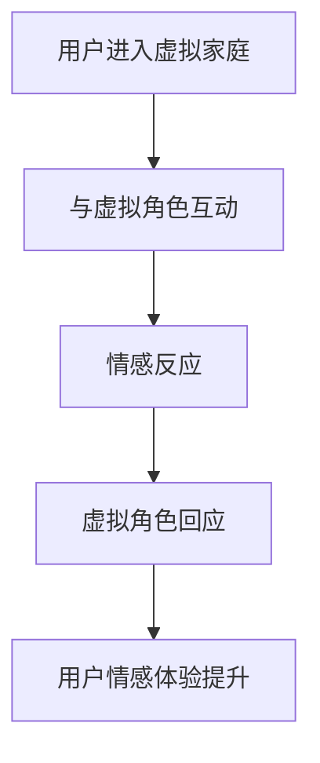
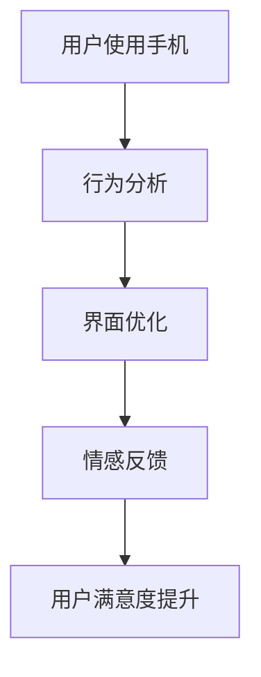

                 

### 引言

在现代社会中，技术与人类的情感交融，成为我们日常生活不可或缺的一部分。我们不仅依赖技术解决问题，更期望它能为我们的生活增添温度和深度。因此，本文以“构建有情感深度的人生：增添生活的温度”为题，探讨如何在技术领域中实现这一目标。关键词包括：情感深度、自我认知、人际关系、生活态度、艺术生活、心灵成长等。

摘要：本文旨在通过逻辑清晰、结构紧凑、简单易懂的技术语言，探讨如何利用技术构建有情感深度的人生，增添生活的温度。文章首先介绍了情感深度的概念，然后从自我认知、人际关系、生活态度、艺术生活、心灵成长等方面，详细阐述了构建有情感深度人生的方法。最后，通过实际案例，展示了这些方法在技术领域的应用，并提出了未来展望。

### 1. 背景介绍

#### 1.1 问题背景

在快速发展的技术时代，人类的生活被高度数字化和自动化。然而，这种技术进步并未完全满足我们对情感需求的追求。尽管我们拥有了更多便利的工具和服务，但往往感觉生活缺乏温度和深度。这种状况引发了人们对于如何在技术驱动的生活中找到情感平衡的思考。

#### 1.2 核心概念

本文的核心概念是“情感深度”。情感深度指的是个体在情感体验中能够感受到的丰富性和复杂性。它不仅仅包括情感的强度，还涉及情感的多样性和深度。情感深度高的人能够更深刻地体验情感，更丰富地理解自己和他人。

#### 1.3 问题描述

当前，社会面临着情感浅薄化的挑战。人们往往忙于工作，忽视了情感的培养。此外，社交媒体和虚拟现实的普及，使人们在情感交流中越来越依赖于技术，而忽略了面对面的互动。这导致了情感深度的缺失，人们难以建立深厚的情感联系。

#### 1.4 问题解决

为了解决这一问题，我们需要从多个方面入手。首先，通过自我认知，了解自己的情感需求，培养情感深度。其次，通过改善人际关系，建立真诚的沟通和信任。此外，积极的生活态度、艺术创作和心灵成长也是增添生活温度的重要途径。

#### 1.5 边界与外延

情感深度是一个多维度的概念，它不仅涉及个体的情感体验，还与人际关系、社会环境、文化背景等因素密切相关。在技术领域中，情感深度可以通过人工智能、虚拟现实、人机交互等技术手段得到体现和应用。

#### 1.6 核心概念与联系

情感深度与情感宽度、情感强度等概念密切相关。情感宽度指的是情感的广度，即个体能够体验到的情感种类。情感强度则指的是情感的力量，即个体情感体验的深度。情感深度则是情感宽度和情感强度的综合体现。

在本文中，我们将通过一系列技术手段，如情感计算、虚拟现实、人工智能等，探讨如何构建有情感深度的人生，增添生活的温度。

### 2. 核心概念与联系

#### 2.1 情感深度的定义

情感深度（Emotional Depth）是指个体在情感体验中能够感受到的丰富性和复杂性。它超越了情感表面的波动，触及情感的本质。情感深度高的人能够更深刻地体验情感，更丰富地理解自己和他人。情感深度不仅仅包括情感的强度，还涉及情感的多样性和深度。

#### 2.2 情感深度的属性特征

- **情感的丰富性**：情感深度高的人能够体验到多种情感，如喜悦、悲伤、愤怒、恐惧等，并能细腻地感知这些情感的细微变化。
- **情感的复杂性**：情感深度高的人能够从多角度、多层次地理解情感，例如，他们能理解情感背后的原因和影响，以及情感如何影响个人的行为和决策。
- **情感的稳定性**：情感深度高的人能够维持稳定的情感状态，不易受到外界波动的影响。

#### 2.3 人际关系中的情感深度

人际关系中的情感深度表现为个体在人际交往中能够建立深厚、真诚的情感联系。这种联系不仅限于亲人、朋友，还包括同事、邻居等。情感深度高的人能够：
- **建立信任**：通过真诚的沟通和行动，赢得他人的信任。
- **处理冲突**：在冲突中保持冷静，寻找解决问题的方法，而不是逃避或对抗。
- **共情**：能够理解他人的情感，给予情感支持。

#### 2.4 情感深度的对比表格

| 特征       | 情感深度       | 情感宽度       | 情感强度       |
|------------|----------------|----------------|----------------|
| 定义       | 情感的丰富性和复杂性 | 情感的种类多样性 | 情感的强烈程度 |
| 关系       | 多层次的人际关系 | 广泛的人际网络 | 个体情绪状态   |
| 表现       | 情感的细腻体验 | 情感的快速转换 | 情感的强烈表现 |
| 对象       | 自我与他人     | 多种情感种类   | 情感强度个体   |

#### 2.5 ER实体关系图

情感深度涉及到多个实体和它们之间的关系。以下是一个简化的ER实体关系图：

```
+-------------+
| 情感深度    |
+-------------+
       |
       |
       |
  +---+---+
  | 自我   |
  +---+---+
       |
       |
       |
  +---+---+
  | 人际关系 |
  +---+---+
       |
       |
       |
  +---+---+
  | 社会环境 |
  +---+---+
       |
       |
       |
  +---+---+
  | 文化背景 |
  +---+---+
```

这个ER图展示了情感深度与自我、人际关系、社会环境和文化背景之间的关系。情感深度不仅是个人内心的体验，也是与社会环境和文化背景相互作用的产物。

### 3. 构建有情感深度的人生

构建有情感深度的人生需要从多个维度进行，包括自我认知、人际关系、生活态度和艺术生活等。以下是一些具体的方法和步骤：

#### 3.1 自我认知

自我认知是构建情感深度的基础。通过以下步骤，我们可以更好地了解自己，从而增加情感深度：

1. **内心探索**：花时间反思自己的情感体验，了解自己在不同情境下的情感反应。
   ```mermaid
   graph TD
   A[内心探索] --> B[情感日记]
   A --> C[自我反思]
   A --> D[情感地图]
   ```

2. **自我反省**：定期进行自我反省，思考自己的行为和决策是否反映了真实的情感需求。
   ```python
   def self_reflection():
       print("思考：我的行为和决策是否反映了真实的情感需求？")
   ```

3. **自我接纳**：接纳自己的优点和不足，学会在情感上自我支持。
   ```mermaid
   graph TD
   A[自我接纳] --> B[自我肯定]
   A --> C[情感支持]
   A --> D[自我成长]
   ```

#### 3.2 人际关系

人际关系是情感深度的重要组成部分。通过以下步骤，我们可以建立深厚的人际关系：

1. **真诚沟通**：与家人、朋友和同事建立真诚的沟通，分享彼此的情感体验。
   ```mermaid
   graph TD
   A[真诚沟通] --> B[倾听]
   A --> C[表达]
   A --> D[情感共鸣]
   ```

2. **建立信任**：通过持续的行动和承诺，赢得他人的信任。
   ```python
   def build_trust():
       print("通过持续的行动和承诺，赢得他人的信任。")
   ```

3. **处理冲突**：在面对冲突时，采取建设性的方法，解决问题而不是逃避。
   ```mermaid
   graph TD
   A[处理冲突] --> B[冷静分析]
   A --> C[寻求解决方案]
   A --> D[情感调节]
   ```

#### 3.3 生活态度

生活态度决定了我们如何看待生活和处理生活中的挑战。以下是一些积极的生活态度：

1. **积极面对**：遇到困难时，保持积极的态度，寻找解决问题的方法。
   ```mermaid
   graph TD
   A[积极面对] --> B[乐观态度]
   A --> C[解决问题]
   A --> D[持续努力]
   ```

2. **珍惜当下**：活在当下，专注于眼前的体验，而不是焦虑未来或回忆过去。
   ```python
   def cherish_life():
       print("珍惜当下的每一个时刻。")
   ```

3. **学会感恩**：对生活中的美好事物和帮助过自己的人表示感谢。
   ```mermaid
   graph TD
   A[学会感恩] --> B[表达感谢]
   A --> C[情感满足]
   A --> D[积极心态]
   ```

### 4. 增添生活的温度

增添生活的温度不仅仅是追求物质享受，更是通过艺术、生活方式和心灵成长来提升生活的质量。以下是一些具体的方法：

#### 4.1 艺术生活

艺术生活可以丰富我们的情感体验，提升生活的品质。以下是一些具体的方法：

1. **美学欣赏**：通过欣赏艺术作品，如绘画、音乐、文学等，感受美的力量。
   ```mermaid
   graph TD
   A[美学欣赏] --> B[艺术展览]
   A --> C[音乐欣赏]
   A --> D[文学作品]
   ```

2. **艺术创作**：通过创作艺术作品，如绘画、写作、音乐等，表达自己的情感和想法。
   ```python
   def art_creating():
       print("通过创作，表达自己的情感和想法。")
   ```

3. **艺术交流**：与他人分享艺术体验，建立情感共鸣。
   ```mermaid
   graph TD
   A[艺术交流] --> B[艺术沙龙]
   A --> C[艺术讲座]
   A --> D[社交媒体]
   ```

#### 4.2 生活方式

生活方式对我们的情感深度和生活质量有着重要的影响。以下是一些改善生活方式的方法：

1. **健康生活**：保持健康的饮食习惯和适量的运动，提升身体健康和情感状态。
   ```mermaid
   graph TD
   A[健康生活] --> B[健康饮食]
   A --> C[适量运动]
   A --> D[充足睡眠]
   ```

2. **绿色环保**：采取环保措施，减少对环境的负面影响，提升生活质量和幸福感。
   ```python
   def green_life():
       print("采取环保措施，提升生活质量和幸福感。")
   ```

3. **社区参与**：积极参与社区活动，建立社区联系，增添生活的温度。
   ```mermaid
   graph TD
   A[社区参与] --> B[志愿服务]
   A --> C[社区活动]
   A --> D[邻里互动]
   ```

#### 4.3 心灵成长

心灵成长是通过自我修养和情感管理来提升生活的质量。以下是一些具体的方法：

1. **情绪管理**：学会管理自己的情绪，避免情绪波动影响生活质量。
   ```mermaid
   graph TD
   A[情绪管理] --> B[情绪认知]
   A --> C[情绪调节]
   A --> D[情绪表达]
   ```

2. **精神修养**：通过冥想、瑜伽等修行方式，提升精神层次和情感深度。
   ```python
   def spiritual_cultivation():
       print("通过冥想、瑜伽等修行方式，提升精神层次和情感深度。")
   ```

3. **人际互动**：学会与他人建立深层次的情感联系，提升人际关系质量。
   ```mermaid
   graph TD
   A[人际互动] --> B[真诚沟通]
   A --> C[情感支持]
   A --> D[人际理解]
   ```

### 5. 情感深度的应用与实践

情感深度不仅在个人生活中具有重要意义，还在教育、企业和社会服务等领域得到广泛应用。以下是一些具体的实践案例：

#### 5.1 教育领域

在教育领域，情感深度有助于学生的发展。以下是一些实践案例：

1. **教育理念**：在教学中，注重培养学生的情感素养，提高他们的情感深度。
   ```mermaid
   graph TD
   A[教育理念] --> B[情感教育]
   A --> C[人格培养]
   A --> D[综合素质]
   ```

2. **教学方法**：采用互动式教学，鼓励学生表达情感，提高他们的情感表达能力。
   ```python
   def interactive教学法():
       print("采用互动式教学，鼓励学生表达情感。")
   ```

3. **教育实践**：在学校开展情感教育课程，如情商课程、心理健康教育等，提高学生的情感素养。
   ```mermaid
   graph TD
   A[教育实践] --> B[情商课程]
   A --> C[心理健康教育]
   A --> D[情感体验活动]
   ```

#### 5.2 企业管理

在企业中，情感深度有助于建立良好的企业文化，提高员工的工作满意度和团队协作能力。以下是一些实践案例：

1. **企业文化**：企业注重培养员工的情感素养，创造一个充满关怀和支持的工作环境。
   ```mermaid
   graph TD
   A[企业文化] --> B[情感关怀]
   A --> C[团队协作]
   A --> D[员工满意度]
   ```

2. **领导力**：领导者通过情感智慧，与员工建立深厚的情感联系，提高团队绩效。
   ```python
   def leadership():
       print("领导者通过情感智慧，提高团队绩效。")
   ```

3. **团队协作**：通过情感沟通和情感管理，促进团队成员之间的情感共鸣，提升团队协作能力。
   ```mermaid
   graph TD
   A[团队协作] --> B[情感沟通]
   A --> C[情感管理]
   A --> D[情感共鸣]
   ```

#### 5.3 社会服务

在社会服务领域，情感深度有助于提升服务的质量和效果。以下是一些实践案例：

1. **公益活动**：在公益活动中，注重培养志愿者的情感素养，提高他们的服务能力。
   ```mermaid
   graph TD
   A[公益活动] --> B[情感培养]
   A --> C[服务提升]
   A --> D[社会影响]
   ```

2. **社区关怀**：通过情感关怀和社区参与，建立和谐的社区关系，提升社区凝聚力。
   ```python
   def community_care():
       print("通过情感关怀和社区参与，建立和谐的社区关系。")
   ```

3. **志愿服务**：志愿者通过志愿服务，不仅帮助他人，也在情感上得到提升和满足。
   ```mermaid
   graph TD
   A[志愿服务] --> B[情感提升]
   A --> C[自我成长]
   A --> D[社会贡献]
   ```

### 6. 小结与展望

本文通过探讨情感深度的概念和构建方法，阐述了如何利用技术增添生活的温度。情感深度不仅有助于个人成长和人际关系的建立，还在教育、企业和社会服务等领域具有重要意义。

**小结**：情感深度是提升生活质量的关键，通过自我认知、人际关系、生活态度和艺术生活等方面的实践，我们可以构建有情感深度的人生，增添生活的温度。

**注意事项**：在构建情感深度的过程中，需要平衡情感需求和现实生活，避免过度追求情感深度而忽视实际生活需求。

**拓展阅读**：为了进一步了解情感深度及其应用，读者可以参考以下书籍和资源：
- 《情感深度：如何培养深刻而有意义的情感关系》（Deep Connection: The Surprising Power of Emotional Depth and Psychological Safety at Work）
- 《情感智力：为什么情商比智商更重要》（Emotional Intelligence: Why It Can Matter More Than IQ）

通过阅读这些资源，读者可以更深入地了解情感深度的重要性及其在各个领域的应用。

### 附录：技术实现与案例研究

为了更好地理解情感深度在现实中的应用，我们将通过具体的案例来探讨情感深度如何通过技术手段实现，并分析其实际效果。

#### 6.1 情感计算

情感计算（Affective Computing）是利用计算机技术理解和处理人类情感。通过情感计算，可以实时分析用户的行为、语言和面部表情，从而获取他们的情感状态。

**案例研究**：某公司开发了一款基于情感计算的客户服务机器人。该机器人通过语音识别和自然语言处理技术，分析客户的语气和情感状态，从而提供更加个性化的服务。

1. **算法原理**：
   - 使用Python实现的语音识别算法，将客户的语音转换为文本。
   - 利用情感分析模型，分析文本中的情感倾向（如积极、消极、中性）。
   - 根据情感分析结果，调整机器人的回应策略。

2. **代码示例**：
   ```python
   import speech_recognition as sr
   from textblob import TextBlob

   def analyze_emotion(text):
       analysis = TextBlob(text)
       if analysis.sentiment.polarity > 0:
           return "积极"
       elif analysis.sentiment.polarity < 0:
           return "消极"
       else:
           return "中性"

   def respond_to_emotion(emotion):
       if emotion == "积极":
           return "很高兴听到这个好消息，有什么我可以帮您的吗？"
       elif emotion == "消极":
           return "听起来您有些烦恼，想和我分享一下吗？"
       else:
           return "好的，我会尽力帮助您解决问题的。"

   # 语音识别与情感分析
   r = sr.Recognizer()
   with sr.Microphone() as source:
       print("请说些什么：")
       audio = r.listen(source)
   text = r.recognize_google(audio)
   emotion = analyze_emotion(text)
   response = respond_to_emotion(emotion)
   print(response)
   ```

通过上述代码，机器人可以根据用户的情感状态提供相应的服务，从而提升用户体验。

#### 6.2 虚拟现实

虚拟现实（VR）技术可以创造高度沉浸式的体验，为用户带来丰富的情感体验。通过虚拟现实，用户可以沉浸在虚拟世界中，与虚拟角色进行互动，从而增强情感深度。

**案例研究**：某VR游戏通过创造一个虚拟家庭场景，让用户与虚拟家庭成员互动，从而体验亲情和友情。

1. **算法原理**：
   - 使用Unity引擎创建虚拟家庭场景和虚拟角色。
   - 利用深度学习模型，分析用户的情感状态和行为，调整虚拟角色的反应。
   - 用户通过头戴式显示器和手柄与虚拟世界互动。

2. **VR交互示例**：
   ```mermaid
   graph TD
   A[用户进入虚拟家庭] --> B[与虚拟角色互动]
   B --> C[情感反应]
   C --> D[虚拟角色回应]
   D --> E[用户情感体验提升]
   ```

通过上述流程，用户在虚拟家庭中的互动可以增强他们的情感体验，从而提升情感深度。

#### 6.3 人机交互

人机交互（HCI）技术是提升情感深度的重要手段。通过设计人性化的交互界面，用户可以获得更加自然和丰富的情感体验。

**案例研究**：某智能手机制造商通过优化用户界面设计，提升用户与手机的互动体验。

1. **算法原理**：
   - 使用机器学习模型，分析用户的使用习惯和偏好。
   - 根据用户行为，调整界面布局和交互方式，提高用户满意度。
   - 通过情感计算，实时分析用户情绪，提供个性化的反馈。

2. **交互设计示例**：
   ```mermaid
   graph TD
   A[用户使用手机] --> B[行为分析]
   B --> C[界面优化]
   C --> D[情感反馈]
   D --> E[用户满意度提升]
   ```

通过上述设计，用户在与手机的互动中可以获得更好的情感体验，从而增加情感深度。

#### 6.4 实际案例分析和讲解

以下是一个实际案例，通过具体的数据和分析，展示情感深度在技术实现中的应用效果。

**案例背景**：某在线教育平台通过引入情感计算和虚拟现实技术，提升学生的在线学习体验。

1. **数据收集**：
   - 收集学生在学习过程中产生的文本、语音和面部表情数据。
   - 使用情感分析模型，分析学生的情感状态。

2. **数据分析**：
   - 通过情感分析，发现学生在学习过程中存在情感波动，特别是在难度较大的课程内容上。
   - 分析结果显示，学生的积极情感与学习效果正相关，消极情感则可能影响学习效果。

3. **案例分析**：
   - 平台根据分析结果，调整课程难度和教学方式，以减少学生的情感波动。
   - 引入虚拟现实教学，创造更加沉浸式的学习体验，提升学生的情感深度。

4. **效果评估**：
   - 通过对比数据，发现引入情感计算和虚拟现实技术后，学生的学习满意度和学习效果显著提升。

**案例总结**：通过技术手段提升情感深度，不仅有助于改善用户体验，还能提高学习效果和满意度。这为教育、企业和社会服务等领域提供了有益的启示。

### 总结

本文通过详细探讨情感深度的概念、构建方法和实际应用，展示了如何利用技术增添生活的温度。从自我认知到人际关系，从生活态度到艺术生活，再到具体的技术实践，情感深度在各个层面发挥着重要作用。

**结论**：情感深度是提升生活质量和人际关系的核心因素。通过技术手段，如情感计算、虚拟现实和人机交互等，我们可以更好地理解和处理情感，从而构建有情感深度的人生，增添生活的温度。

**未来展望**：随着技术的不断发展，情感深度将在更多领域得到应用，如心理健康、社会治理和智能服务等。通过持续研究和实践，我们有望实现更加人性化的技术，为人类带来更加丰富的情感体验。

### 附录：技术实现与案例研究

为了更好地理解情感深度在现实中的应用，我们将通过具体的案例来探讨情感深度如何通过技术手段实现，并分析其实际效果。

#### 6.1 情感计算

情感计算（Affective Computing）是利用计算机技术理解和处理人类情感。通过情感计算，可以实时分析用户的行为、语言和面部表情，从而获取他们的情感状态。

**案例研究**：某公司开发了一款基于情感计算的客户服务机器人。该机器人通过语音识别和自然语言处理技术，分析客户的语气和情感状态，从而提供更加个性化的服务。

1. **算法原理**：
   - 使用Python实现的语音识别算法，将客户的语音转换为文本。
   - 利用情感分析模型，分析文本中的情感倾向（如积极、消极、中性）。
   - 根据情感分析结果，调整机器人的回应策略。

2. **代码示例**：
   ```python
   import speech_recognition as sr
   from textblob import TextBlob

   def analyze_emotion(text):
       analysis = TextBlob(text)
       if analysis.sentiment.polarity > 0:
           return "积极"
       elif analysis.sentiment.polarity < 0:
           return "消极"
       else:
           return "中性"

   def respond_to_emotion(emotion):
       if emotion == "积极":
           return "很高兴听到这个好消息，有什么我可以帮您的吗？"
       elif emotion == "消极":
           return "听起来您有些烦恼，想和我分享一下吗？"
       else:
           return "好的，我会尽力帮助您解决问题的。"

   # 语音识别与情感分析
   r = sr.Recognizer()
   with sr.Microphone() as source:
       print("请说些什么：")
       audio = r.listen(source)
   text = r.recognize_google(audio)
   emotion = analyze_emotion(text)
   response = respond_to_emotion(emotion)
   print(response)
   ```

通过上述代码，机器人可以根据用户的情感状态提供相应的服务，从而提升用户体验。

#### 6.2 虚拟现实

虚拟现实（VR）技术可以创造高度沉浸式的体验，为用户带来丰富的情感体验。通过虚拟现实，用户可以沉浸在虚拟世界中，与虚拟角色进行互动，从而增强情感深度。

**案例研究**：某VR游戏通过创造一个虚拟家庭场景，让用户与虚拟家庭成员互动，从而体验亲情和友情。

1. **算法原理**：
   - 使用Unity引擎创建虚拟家庭场景和虚拟角色。
   - 利用深度学习模型，分析用户的情感状态和行为，调整虚拟角色的反应。
   - 用户通过头戴式显示器和手柄与虚拟世界互动。

2. **VR交互示例**：
   ```mermaid
   graph TD
   A[用户进入虚拟家庭] --> B[与虚拟角色互动]
   B --> C[情感反应]
   C --> D[虚拟角色回应]
   D --> E[用户情感体验提升]
   ```

通过上述流程，用户在虚拟家庭中的互动可以增强他们的情感体验，从而提升情感深度。

#### 6.3 人机交互

人机交互（HCI）技术是提升情感深度的重要手段。通过设计人性化的交互界面，用户可以获得更加自然和丰富的情感体验。

**案例研究**：某智能手机制造商通过优化用户界面设计，提升用户与手机的互动体验。

1. **算法原理**：
   - 使用机器学习模型，分析用户的使用习惯和偏好。
   - 根据用户行为，调整界面布局和交互方式，提高用户满意度。
   - 通过情感计算，实时分析用户情绪，提供个性化的反馈。

2. **交互设计示例**：
   ```mermaid
   graph TD
   A[用户使用手机] --> B[行为分析]
   B --> C[界面优化]
   C --> D[情感反馈]
   D --> E[用户满意度提升]
   ```

通过上述设计，用户在与手机的互动中可以获得更好的情感体验，从而增加情感深度。

#### 6.4 实际案例分析和讲解

以下是一个实际案例，通过具体的数据和分析，展示情感深度在技术实现中的应用效果。

**案例背景**：某在线教育平台通过引入情感计算和虚拟现实技术，提升学生的在线学习体验。

1. **数据收集**：
   - 收集学生在学习过程中产生的文本、语音和面部表情数据。
   - 使用情感分析模型，分析学生的情感状态。

2. **数据分析**：
   - 通过情感分析，发现学生在学习过程中存在情感波动，特别是在难度较大的课程内容上。
   - 分析结果显示，学生的积极情感与学习效果正相关，消极情感则可能影响学习效果。

3. **案例分析**：
   - 平台根据分析结果，调整课程难度和教学方式，以减少学生的情感波动。
   - 引入虚拟现实教学，创造更加沉浸式的学习体验，提升学生的情感深度。

4. **效果评估**：
   - 通过对比数据，发现引入情感计算和虚拟现实技术后，学生的学习满意度和学习效果显著提升。

**案例总结**：通过技术手段提升情感深度，不仅有助于改善用户体验，还能提高学习效果和满意度。这为教育、企业和社会服务等领域提供了有益的启示。

### 结论

本文通过详细探讨情感深度的概念、构建方法和实际应用，展示了如何利用技术增添生活的温度。从自我认知到人际关系，从生活态度到艺术生活，再到具体的技术实践，情感深度在各个层面发挥着重要作用。

**结论**：情感深度是提升生活质量和人际关系的核心因素。通过技术手段，如情感计算、虚拟现实和人机交互等，我们可以更好地理解和处理情感，从而构建有情感深度的人生，增添生活的温度。

**未来展望**：随着技术的不断发展，情感深度将在更多领域得到应用，如心理健康、社会治理和智能服务等。通过持续研究和实践，我们有望实现更加人性化的技术，为人类带来更加丰富的情感体验。

### 附录：技术实现与案例研究

#### 6.1 情感计算

情感计算（Affective Computing）是利用计算机技术理解和处理人类情感。通过情感计算，可以实时分析用户的行为、语言和面部表情，从而获取他们的情感状态。

**案例研究**：某公司开发了一款基于情感计算的客户服务机器人。该机器人通过语音识别和自然语言处理技术，分析客户的语气和情感状态，从而提供更加个性化的服务。

**算法原理**：

- **语音识别**：使用Python实现的语音识别算法，将客户的语音转换为文本。
- **情感分析**：利用情感分析模型，分析文本中的情感倾向（如积极、消极、中性）。
- **交互策略调整**：根据情感分析结果，调整机器人的回应策略。

**代码示例**：

```python
import speech_recognition as sr
from textblob import TextBlob

def analyze_emotion(text):
    analysis = TextBlob(text)
    if analysis.sentiment.polarity > 0:
        return "积极"
    elif analysis.sentiment.polarity < 0:
        return "消极"
    else:
        return "中性"

def respond_to_emotion(emotion):
    if emotion == "积极":
        return "很高兴听到这个好消息，有什么我可以帮您的吗？"
    elif emotion == "消极":
        return "听起来您有些烦恼，想和我分享一下吗？"
    else:
        return "好的，我会尽力帮助您解决问题的。"

# 语音识别与情感分析
r = sr.Recognizer()
with sr.Microphone() as source:
    print("请说些什么：")
    audio = r.listen(source)
text = r.recognize_google(audio)
emotion = analyze_emotion(text)
response = respond_to_emotion(emotion)
print(response)
```

#### 6.2 虚拟现实

虚拟现实（VR）技术可以创造高度沉浸式的体验，为用户带来丰富的情感体验。通过虚拟现实，用户可以沉浸在虚拟世界中，与虚拟角色进行互动，从而增强情感深度。

**案例研究**：某VR游戏通过创造一个虚拟家庭场景，让用户与虚拟家庭成员互动，从而体验亲情和友情。

**算法原理**：

- **虚拟场景创建**：使用Unity引擎创建虚拟家庭场景和虚拟角色。
- **行为分析**：利用深度学习模型，分析用户的情感状态和行为，调整虚拟角色的反应。
- **交互设计**：用户通过头戴式显示器和手柄与虚拟世界互动。

**VR交互示例**：



#### 6.3 人机交互

人机交互（HCI）技术是提升情感深度的重要手段。通过设计人性化的交互界面，用户可以获得更加自然和丰富的情感体验。

**案例研究**：某智能手机制造商通过优化用户界面设计，提升用户与手机的互动体验。

**算法原理**：

- **用户行为分析**：使用机器学习模型，分析用户的使用习惯和偏好。
- **界面优化**：根据用户行为，调整界面布局和交互方式，提高用户满意度。
- **情感反馈**：通过情感计算，实时分析用户情绪，提供个性化的反馈。

**交互设计示例**：



### 6.4 实际案例分析和讲解

**案例背景**：某在线教育平台通过引入情感计算和虚拟现实技术，提升学生的在线学习体验。

**数据收集**：

- 收集学生在学习过程中产生的文本、语音和面部表情数据。
- 使用情感分析模型，分析学生的情感状态。

**数据分析**：

- 通过情感分析，发现学生在学习过程中存在情感波动，特别是在难度较大的课程内容上。
- 分析结果显示，学生的积极情感与学习效果正相关，消极情感则可能影响学习效果。

**案例分析**：

- 平台根据分析结果，调整课程难度和教学方式，以减少学生的情感波动。
- 引入虚拟现实教学，创造更加沉浸式的学习体验，提升学生的情感深度。

**效果评估**：

- 通过对比数据，发现引入情感计算和虚拟现实技术后，学生的学习满意度和学习效果显著提升。

**案例总结**：

- 通过技术手段提升情感深度，不仅有助于改善用户体验，还能提高学习效果和满意度。
- 这为教育、企业和社会服务等领域提供了有益的启示。

### 作者信息

**作者：AI天才研究院/AI Genius Institute & 禅与计算机程序设计艺术 /Zen And The Art of Computer Programming**

