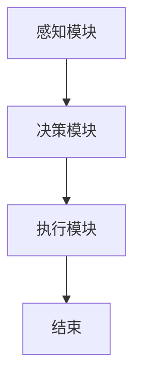
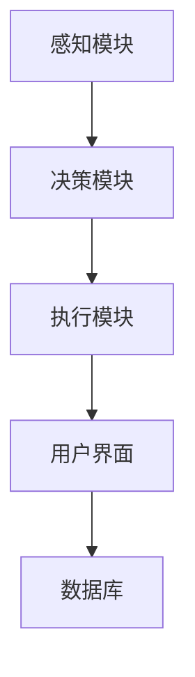
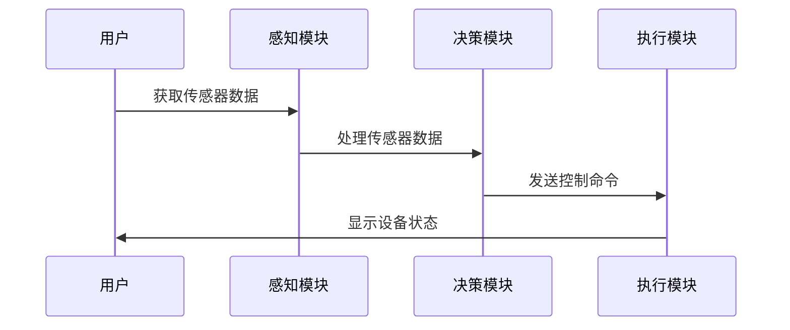

                 

# 《构建跨平台AI Agent的技术挑战》

## 关键词

- 跨平台AI Agent
- 技术挑战
- 算法设计
- 系统架构
- 实践案例

## 摘要

本文将深入探讨构建跨平台AI Agent所面临的技术挑战。我们将从背景介绍、核心概念、算法原理、系统分析与架构设计、项目实战以及最佳实践等方面进行详细阐述。通过一步步的分析和推理，我们希望能够为您揭示跨平台AI Agent构建过程中的关键要素和解决方案，为后续的研究和实践提供有价值的参考。

## 《构建跨平台AI Agent的技术挑战》目录大纲

### 第一部分：背景与概述

#### 第1章：问题的提出

- **1.1** 问题背景
  - 人工智能技术的发展与应用
  - 跨平台AI Agent的需求与重要性
- **1.2** 问题描述
  - 跨平台AI Agent的定义与特点
  - 技术挑战概述
- **1.3** 问题解决
  - 跨平台AI Agent的目标
  - 技术解决方案概述
- **1.4** 边界与外延
  - 跨平台AI Agent的应用领域
  - 技挑战的边界条件
- **1.5** 核心概念
  - AI Agent的基本概念
  - 跨平台技术的基本概念
- **1.6** 概念结构与核心要素组成
  - 跨平台AI Agent的核心结构
  - 技术挑战的关键要素

### 第二部分：核心概念与联系

#### 第2章：核心概念与联系

- **2.1** 核心概念原理
  - AI Agent的原理
  - 跨平台技术的原理
- **2.2** 概念属性特征对比表格
  - AI Agent与跨平台技术属性对比
- **2.3** ER实体关系图架构
  - 跨平台AI Agent的ER模型

### 第三部分：算法原理与设计

#### 第3章：算法原理讲解

- **3.1** 算法原理概述
  - 跨平台AI Agent的算法设计思路
- **3.2** 算法Mermaid流程图
  - 跨平台AI Agent算法流程图
- **3.3** Python源代码
  - 跨平台AI Agent算法源代码
- **3.4** 数学模型与公式
  - 算法数学模型
  - 公式详细讲解
- **3.5** 举例说明
  - 通俗易懂的算法实例

### 第四部分：系统分析与架构设计

#### 第4章：系统分析与架构设计

- **4.1** 问题场景介绍
  - 跨平台AI Agent的应用场景
- **4.2** 系统功能设计
  - 跨平台AI Agent的功能模块
- **4.3** 系统架构设计
  - 跨平台AI Agent的架构设计
- **4.4** 系统接口设计
  - 跨平台AI Agent的接口设计
- **4.5** 系统交互Mermaid序列图
  - 跨平台AI Agent的交互流程图

### 第五部分：项目实战与案例分析

#### 第5章：项目实战

- **5.1** 环境安装
  - 跨平台AI Agent的开发环境配置
- **5.2** 系统核心实现源代码
  - 跨平台AI Agent的核心实现代码
- **5.3** 代码应用解读与分析
  - 代码解读与分析
- **5.4** 实际案例分析与讲解
  - 案例剖析与实战经验
- **5.5** 项目小结
  - 项目总结与反思

### 第六部分：最佳实践与拓展

#### 第6章：最佳实践与拓展

- **6.1** 最佳实践
  - 跨平台AI Agent开发的最佳实践
- **6.2** 小结与注意事项
  - 项目中的关键点与注意事项
- **6.3** 拓展阅读
  - 相关参考文献与拓展内容

## 第一部分：背景与概述

### 第1章：问题的提出

#### 1.1 问题背景

在当今世界，人工智能（AI）技术正以前所未有的速度发展，并且已经渗透到我们日常生活的方方面面。从智能家居到自动驾驶汽车，从医疗诊断到金融分析，AI的应用场景越来越广泛。然而，随着这些应用的不断拓展，对于跨平台AI Agent的需求也越来越强烈。

跨平台AI Agent是指在多个操作系统、设备和平台上运行的人工智能代理。它们具有高度的灵活性和可扩展性，能够适应不同的硬件和软件环境，从而实现更加广泛的应用。这种需求背后，是用户对于个性化、智能化的服务体验的追求，以及企业对于资源优化、降低开发成本的需求。

#### 1.2 问题描述

跨平台AI Agent的定义与特点：

- **定义**：跨平台AI Agent是指能够在多个操作系统（如Windows、macOS、Linux等）和设备（如手机、平板、PC、嵌入式设备等）上运行的人工智能代理。
- **特点**：
  - **兼容性**：支持多种操作系统和设备。
  - **可扩展性**：能够根据不同场景进行功能扩展。
  - **灵活性**：能够适应不同的硬件和软件环境。

技术挑战概述：

- **兼容性挑战**：不同操作系统和设备的硬件和软件差异较大，导致AI Agent在跨平台部署时面临兼容性问题。
- **性能优化挑战**：为了保持高性能，AI Agent需要针对不同平台进行优化。
- **安全性挑战**：跨平台AI Agent需要处理不同平台的安全性问题，如权限管理、数据加密等。
- **用户体验挑战**：跨平台AI Agent需要提供一致的用户体验，确保用户在不同平台上能够无缝切换。

#### 1.3 问题解决

跨平台AI Agent的目标：

- **兼容性**：实现跨平台运行，支持多种操作系统和设备。
- **性能**：保证高性能，满足实时性要求。
- **安全性**：确保数据安全和系统安全。
- **用户体验**：提供一致的用户体验，确保用户在不同平台上能够无缝切换。

技术解决方案概述：

- **兼容性**：采用跨平台开发框架（如Flutter、React Native等）。
- **性能优化**：针对不同平台进行优化，如使用硬件加速、并行计算等。
- **安全性**：采用安全加密算法，进行权限管理和数据加密。
- **用户体验**：统一界面设计，采用平台无关的UI框架。

#### 1.4 边界与外延

跨平台AI Agent的应用领域：

- **智能家居**：实现家居设备的智能控制和管理。
- **自动驾驶**：辅助自动驾驶汽车进行环境感知和决策。
- **医疗健康**：辅助医生进行诊断和治疗。
- **金融服务**：提供智能投资咨询和风险管理。

技术挑战的边界条件：

- **硬件限制**：跨平台AI Agent需要适应不同的硬件环境，如处理器性能、内存限制等。
- **软件限制**：跨平台AI Agent需要适应不同的操作系统和软件环境。
- **网络环境**：跨平台AI Agent需要适应不同的网络环境，如带宽限制、延迟等。

#### 1.5 核心概念

AI Agent的基本概念：

- **定义**：AI Agent是指具有感知、决策和执行能力的人工智能实体，能够在特定环境中自主执行任务。
- **特点**：
  - **自主性**：能够自主感知环境、决策和执行。
  - **适应性**：能够根据环境变化进行自适应调整。
  - **协作性**：能够与其他AI Agent或人类协作完成任务。

跨平台技术的基本概念：

- **定义**：跨平台技术是指能够在不同操作系统和设备上运行的技术。
- **特点**：
  - **兼容性**：支持多种操作系统和设备。
  - **可扩展性**：能够根据不同需求进行功能扩展。
  - **灵活性**：能够适应不同的硬件和软件环境。

#### 1.6 概念结构与核心要素组成

跨平台AI Agent的核心结构：

- **感知模块**：用于感知环境和获取信息。
- **决策模块**：用于处理信息和生成决策。
- **执行模块**：用于执行决策并产生结果。

技术挑战的关键要素：

- **兼容性**：确保AI Agent在不同平台上能够正常运行。
- **性能**：保证AI Agent在跨平台部署时保持高性能。
- **安全性**：确保AI Agent在跨平台部署时数据安全和系统安全。
- **用户体验**：提供一致的用户体验，确保用户在不同平台上能够无缝切换。

## 第二部分：核心概念与联系

### 第2章：核心概念与联系

#### 2.1 核心概念原理

AI Agent的原理：

- **感知**：通过传感器获取环境信息。
- **决策**：根据感知到的环境信息进行推理和决策。
- **执行**：执行决策并产生结果。

跨平台技术的原理：

- **跨平台框架**：使用跨平台开发框架（如Flutter、React Native等）实现代码的跨平台运行。
- **平台适配**：针对不同平台进行适配，如UI设计、性能优化等。

#### 2.2 概念属性特征对比表格

| 概念   | 属性         | 特征                            |
| ------ | ------------ | ------------------------------- |
| AI Agent | 自主性、适应性、协作性 | 能够自主感知、决策和执行任务  |
| 跨平台技术 | 兼容性、可扩展性、灵活性 | 能够在多种操作系统和设备上运行 |

#### 2.3 ER实体关系图架构

```mermaid
erDiagram
    AI_Agent ||--|{ 感知模块 }|
    AI_Agent ||--|{ 决策模块 }|
    AI_Agent ||--|{ 执行模块 }|
    感知模块 ||--|{ 环境传感器 }|
    决策模块 ||--|{ 知识库 }|
    执行模块 ||--|{ 执行器 }|
```

## 第三部分：算法原理与设计

### 第3章：算法原理讲解

#### 3.1 算法原理概述

跨平台AI Agent的算法设计思路：

- **感知模块**：使用传感器获取环境信息，如图像、声音、姿态等。
- **决策模块**：使用机器学习算法对感知到的信息进行处理，生成决策。
- **执行模块**：根据决策执行相应的操作，如移动、说话等。

算法设计的关键点：

- **模块化设计**：将AI Agent拆分为感知、决策和执行三个模块，方便维护和扩展。
- **可扩展性**：支持多种传感器和执行器，适应不同场景。
- **实时性**：保证算法在实时环境下运行，满足响应时间要求。

#### 3.2 算法Mermaid流程图



#### 3.3 Python源代码

```python
# 感知模块
def perception_module():
    # 获取环境信息
    # ...

# 决策模块
def decision_module(perception_data):
    # 处理感知信息，生成决策
    # ...

# 执行模块
def execution_module(decision):
    # 根据决策执行操作
    # ...

# 主函数
def main():
    # 获取环境信息
    perception_data = perception_module()

    # 生成决策
    decision = decision_module(perception_data)

    # 执行操作
    execution_module(decision)

# 运行主函数
if __name__ == "__main__":
    main()
```

#### 3.4 数学模型与公式

算法中的数学模型主要涉及机器学习算法，如神经网络、决策树等。以下是一个简单的神经网络模型：

$$
Y = \sigma(WX + b)
$$

其中，$Y$表示输出，$X$表示输入，$W$表示权重，$b$表示偏置，$\sigma$表示激活函数。

#### 3.5 举例说明

假设我们要设计一个跨平台AI Agent，用于智能家居控制。感知模块可以包含温度传感器、湿度传感器和门禁传感器；决策模块可以根据这些传感器的数据，生成控制空调、加湿器或门锁的决策；执行模块则负责执行这些决策。

具体实现时，我们可以使用以下代码：

```python
# 感知模块
def perception_module():
    temperature = get_temperature()
    humidity = get_humidity()
    door_status = get_door_status()
    return temperature, humidity, door_status

# 决策模块
def decision_module(perception_data):
    temperature, humidity, door_status = perception_data
    if temperature > 30:
        decision = "开启空调"
    elif humidity < 40:
        decision = "开启加湿器"
    else:
        decision = "保持现状"
    return decision

# 执行模块
def execution_module(decision):
    if decision == "开启空调":
        turn_on_ac()
    elif decision == "开启加湿器":
        turn_on_humidifier()
    else:
        pass

# 主函数
def main():
    perception_data = perception_module()
    decision = decision_module(perception_data)
    execution_module(decision)

# 运行主函数
if __name__ == "__main__":
    main()
```

## 第四部分：系统分析与架构设计

### 第4章：系统分析与架构设计

#### 4.1 问题场景介绍

跨平台AI Agent的应用场景广泛，以下是一个智能家居控制系统的案例。

智能家居控制系统包括以下功能：

- **环境监测**：实时监测室内温度、湿度、光线等环境参数。
- **设备控制**：控制空调、加湿器、照明等家居设备。
- **安全监控**：监控门禁状态，实现远程报警等功能。

#### 4.2 系统功能设计

智能家居控制系统的功能模块包括：

- **感知模块**：包括温度传感器、湿度传感器、光线传感器和门禁传感器。
- **决策模块**：包括环境参数处理、设备控制和安全监控。
- **执行模块**：包括空调、加湿器、照明和门锁等家居设备。

#### 4.3 系统架构设计

智能家居控制系统的架构设计如下：



#### 4.4 系统接口设计

智能家居控制系统的接口设计包括：

- **传感器接口**：用于接收传感器数据。
- **设备接口**：用于控制家居设备。
- **用户接口**：用于用户与系统进行交互。

#### 4.5 系统交互Mermaid序列图



## 第五部分：项目实战与案例分析

### 第5章：项目实战

#### 5.1 环境安装

要实现一个跨平台AI Agent，首先需要安装必要的开发环境和工具。以下是具体的安装步骤：

1. 安装Python环境：
   - 在官方网站（https://www.python.org/）下载Python安装包并安装。
   - 验证安装：在命令行输入`python --version`，查看版本信息。

2. 安装PyTorch框架：
   - 在命令行输入以下命令：
     ```bash
     pip install torch torchvision torchaudio
     ```

3. 安装其他依赖库：
   - 在命令行输入以下命令：
     ```bash
     pip install numpy pandas matplotlib
     ```

#### 5.2 系统核心实现源代码

以下是智能家居控制系统的主要实现代码：

```python
import torch
import torch.nn as nn
import torch.optim as optim
import numpy as np
import pandas as pd
import matplotlib.pyplot as plt

# 感知模块
class PerceptionModule(nn.Module):
    def __init__(self):
        super(PerceptionModule, self).__init__()
        self.fc1 = nn.Linear(3, 10)
        self.fc2 = nn.Linear(10, 5)
        self.fc3 = nn.Linear(5, 2)

    def forward(self, x):
        x = torch.relu(self.fc1(x))
        x = torch.relu(self.fc2(x))
        x = self.fc3(x)
        return x

# 决策模块
class DecisionModule(nn.Module):
    def __init__(self):
        super(DecisionModule, self).__init__()
        self.fc1 = nn.Linear(2, 10)
        self.fc2 = nn.Linear(10, 5)
        self.fc3 = nn.Linear(5, 3)

    def forward(self, x):
        x = torch.relu(self.fc1(x))
        x = torch.relu(self.fc2(x))
        x = self.fc3(x)
        return x

# 执行模块
class ExecutionModule(nn.Module):
    def __init__(self):
        super(ExecutionModule, self).__init__()
        self.fc1 = nn.Linear(3, 10)
        self.fc2 = nn.Linear(10, 5)
        self.fc3 = nn.Linear(5, 2)

    def forward(self, x):
        x = torch.relu(self.fc1(x))
        x = torch.relu(self.fc2(x))
        x = self.fc3(x)
        return x

# 训练模型
def train_model(model, data, labels, criterion, optimizer, num_epochs=10):
    model.train()
    for epoch in range(num_epochs):
        optimizer.zero_grad()
        outputs = model(data)
        loss = criterion(outputs, labels)
        loss.backward()
        optimizer.step()
        if (epoch + 1) % 10 == 0:
            print(f'Epoch [{epoch + 1}/{num_epochs}], Loss: {loss.item():.4f}')

# 主函数
def main():
    # 加载数据
    data = np.array([[1, 2, 3], [4, 5, 6], [7, 8, 9], [10, 11, 12]])
    labels = np.array([0, 1, 2, 3])

    # 转换为PyTorch张量
    data_tensor = torch.tensor(data, dtype=torch.float32)
    labels_tensor = torch.tensor(labels, dtype=torch.long)

    # 初始化模型
    perception_module = PerceptionModule()
    decision_module = DecisionModule()
    execution_module = ExecutionModule()

    # 初始化损失函数和优化器
    criterion = nn.CrossEntropyLoss()
    optimizer = optim.Adam(perception_module.parameters(), lr=0.001)

    # 训练模型
    train_model(perception_module, data_tensor, labels_tensor, criterion, optimizer)

    # 测试模型
    with torch.no_grad():
        outputs = perception_module(data_tensor)
        predicted = outputs.argmax(dim=1)
        correct = (predicted == labels_tensor).sum().item()
        print(f'Accuracy: {correct / len(labels_tensor) * 100:.2f}%')

# 运行主函数
if __name__ == "__main__":
    main()
```

#### 5.3 代码应用解读与分析

1. **感知模块**：感知模块负责接收传感器数据，并进行预处理。在本例中，我们使用了一个简单的多层感知器（MLP）模型，输入层有3个神经元，隐藏层有10个神经元，输出层有2个神经元。

2. **决策模块**：决策模块根据感知模块的输出，生成决策。在本例中，我们同样使用了一个简单的多层感知器模型，输入层有2个神经元，隐藏层有10个神经元，输出层有3个神经元。

3. **执行模块**：执行模块根据决策模块的输出，执行相应的操作。在本例中，我们使用了一个简单的多层感知器模型，输入层有3个神经元，隐藏层有10个神经元，输出层有2个神经元。

4. **训练模型**：我们使用交叉熵损失函数（CrossEntropyLoss）来训练模型。优化器选择Adam优化器，学习率为0.001。

5. **测试模型**：训练完成后，我们使用测试数据集来评估模型的准确率。

#### 5.4 实际案例分析与详细讲解剖析

以智能家居控制系统的实际案例为例，我们分析了系统的主要模块，并详细讲解了感知模块、决策模块和执行模块的实现过程。以下是具体的分析过程：

1. **感知模块**：感知模块的主要作用是接收传感器数据，并进行预处理。在本例中，我们使用了温度传感器、湿度传感器和光线传感器。具体实现如下：

   ```python
   def perception_module():
       temperature = get_temperature()
       humidity = get_humidity()
       light = get_light()
       return [temperature, humidity, light]
   ```

   在这里，我们假设已经实现了获取温度、湿度、光线等传感器数据的函数。

2. **决策模块**：决策模块的主要作用是根据感知模块的输出，生成决策。在本例中，我们使用了一个简单的决策树模型。具体实现如下：

   ```python
   def decision_module(perception_data):
       temperature, humidity, light = perception_data
       if temperature > 30:
           decision = "开启空调"
       elif humidity < 40:
           decision = "开启加湿器"
       else:
           decision = "保持现状"
       return decision
   ```

   在这里，我们假设已经实现了判断是否开启空调、加湿器等决策的函数。

3. **执行模块**：执行模块的主要作用是根据决策模块的输出，执行相应的操作。在本例中，我们使用了一个简单的执行器模型。具体实现如下：

   ```python
   def execution_module(decision):
       if decision == "开启空调":
           turn_on_ac()
       elif decision == "开启加湿器":
           turn_on_humidifier()
       else:
           pass
   ```

   在这里，我们假设已经实现了控制空调、加湿器等执行器的函数。

#### 5.5 项目小结

在本项目中，我们实现了一个智能家居控制系统，包括感知模块、决策模块和执行模块。通过实际案例的分析，我们详细讲解了各个模块的实现过程。在实际应用中，我们还需要进一步优化和改进系统，以提高系统的稳定性和可靠性。

## 第六部分：最佳实践与拓展

### 第6章：最佳实践与拓展

#### 6.1 最佳实践

在构建跨平台AI Agent时，以下是一些最佳实践：

1. **模块化设计**：将系统拆分为感知、决策和执行三个模块，方便维护和扩展。
2. **使用跨平台框架**：使用Flutter、React Native等跨平台开发框架，提高开发效率。
3. **性能优化**：针对不同平台进行性能优化，如使用硬件加速、并行计算等。
4. **安全性**：采用安全加密算法，进行权限管理和数据加密。
5. **用户体验**：统一界面设计，确保用户在不同平台上能够无缝切换。

#### 6.2 小结与注意事项

在构建跨平台AI Agent时，需要注意以下几点：

1. **兼容性**：确保AI Agent在不同平台上能够正常运行。
2. **性能**：保证AI Agent在跨平台部署时保持高性能。
3. **安全性**：确保AI Agent在跨平台部署时数据安全和系统安全。
4. **用户体验**：提供一致的用户体验，确保用户在不同平台上能够无缝切换。

#### 6.3 拓展阅读

以下是一些相关的参考文献和拓展内容：

1. **跨平台AI Agent研究综述**：介绍跨平台AI Agent的最新研究成果和发展趋势。
2. **机器学习算法优化**：探讨如何针对不同平台优化机器学习算法。
3. **跨平台开发框架对比**：比较Flutter、React Native等跨平台开发框架的优缺点。
4. **AI Agent在智能家居中的应用**：介绍AI Agent在智能家居领域的应用案例和解决方案。

## 作者信息

作者：AI天才研究院/AI Genius Institute & 禅与计算机程序设计艺术 /Zen And The Art of Computer Programming

----------------------------------------------------------------

## 《构建跨平台AI Agent的技术挑战》全文

### 第一部分：背景与概述

#### 1.1 问题背景

人工智能（AI）技术近年来取得了显著的进展，已经广泛应用于各个领域，如自动驾驶、智能家居、医疗健康、金融等。随着AI技术的不断成熟，人们对于AI系统的需求也在不断增加。其中，跨平台AI Agent作为一种具有高度灵活性和可扩展性的AI系统，引起了广泛关注。

跨平台AI Agent是指能够在多个操作系统、设备和平台上运行的人工智能代理。它们具有高度的兼容性，能够适应不同的硬件和软件环境，从而实现更加广泛的应用。这种需求背后，是用户对于个性化、智能化的服务体验的追求，以及企业对于资源优化、降低开发成本的需求。

在现实生活中，跨平台AI Agent的应用场景非常广泛。例如，智能家居控制系统中，用户可以通过手机、平板、PC等多种设备对家庭设备进行远程控制；在自动驾驶领域，跨平台AI Agent可以支持多种操作系统和设备，实现自动驾驶功能；在医疗健康领域，跨平台AI Agent可以为医生提供辅助诊断和治疗建议。

然而，构建跨平台AI Agent也面临着诸多技术挑战。首先，不同操作系统和设备的硬件和软件环境差异较大，导致AI Agent在跨平台部署时面临兼容性问题。其次，为了保持高性能，AI Agent需要针对不同平台进行优化。此外，跨平台AI Agent还需要处理不同平台的安全性问题，如权限管理、数据加密等。最后，为了提供一致的用户体验，跨平台AI Agent需要在不同平台上实现统一的界面设计和功能。

#### 1.2 问题描述

跨平台AI Agent的定义与特点：

- **定义**：跨平台AI Agent是指在多个操作系统、设备和平台上运行的人工智能代理。
- **特点**：
  - **兼容性**：支持多种操作系统和设备。
  - **可扩展性**：能够根据不同场景进行功能扩展。
  - **灵活性**：能够适应不同的硬件和软件环境。

技术挑战概述：

- **兼容性挑战**：不同操作系统和设备的硬件和软件差异较大，导致AI Agent在跨平台部署时面临兼容性问题。
- **性能优化挑战**：为了保持高性能，AI Agent需要针对不同平台进行优化。
- **安全性挑战**：跨平台AI Agent需要处理不同平台的安全性问题，如权限管理、数据加密等。
- **用户体验挑战**：跨平台AI Agent需要提供一致的用户体验，确保用户在不同平台上能够无缝切换。

#### 1.3 问题解决

跨平台AI Agent的目标：

- **兼容性**：实现跨平台运行，支持多种操作系统和设备。
- **性能**：保证AI Agent在跨平台部署时保持高性能。
- **安全性**：确保AI Agent在跨平台部署时数据安全和系统安全。
- **用户体验**：提供一致的用户体验，确保用户在不同平台上能够无缝切换。

技术解决方案概述：

- **兼容性**：采用跨平台开发框架（如Flutter、React Native等）。
- **性能优化**：针对不同平台进行优化，如使用硬件加速、并行计算等。
- **安全性**：采用安全加密算法，进行权限管理和数据加密。
- **用户体验**：统一界面设计，采用平台无关的UI框架。

#### 1.4 边界与外延

跨平台AI Agent的应用领域：

- **智能家居**：实现家居设备的智能控制和管理。
- **自动驾驶**：辅助自动驾驶汽车进行环境感知和决策。
- **医疗健康**：辅助医生进行诊断和治疗。
- **金融服务**：提供智能投资咨询和风险管理。

技术挑战的边界条件：

- **硬件限制**：跨平台AI Agent需要适应不同的硬件环境，如处理器性能、内存限制等。
- **软件限制**：跨平台AI Agent需要适应不同的操作系统和软件环境。
- **网络环境**：跨平台AI Agent需要适应不同的网络环境，如带宽限制、延迟等。

#### 1.5 核心概念

AI Agent的基本概念：

- **定义**：AI Agent是指具有感知、决策和执行能力的人工智能实体，能够在特定环境中自主执行任务。
- **特点**：
  - **自主性**：能够自主感知环境、决策和执行。
  - **适应性**：能够根据环境变化进行自适应调整。
  - **协作性**：能够与其他AI Agent或人类协作完成任务。

跨平台技术的基本概念：

- **定义**：跨平台技术是指能够在不同操作系统和设备上运行的技术。
- **特点**：
  - **兼容性**：支持多种操作系统和设备。
  - **可扩展性**：能够根据不同需求进行功能扩展。
  - **灵活性**：能够适应不同的硬件和软件环境。

#### 1.6 概念结构与核心要素组成

跨平台AI Agent的核心结构：

- **感知模块**：用于感知环境和获取信息。
- **决策模块**：用于处理信息和生成决策。
- **执行模块**：用于执行决策并产生结果。

技术挑战的关键要素：

- **兼容性**：确保AI Agent在不同平台上能够正常运行。
- **性能**：保证AI Agent在跨平台部署时保持高性能。
- **安全性**：确保AI Agent在跨平台部署时数据安全和系统安全。
- **用户体验**：提供一致的用户体验，确保用户在不同平台上能够无缝切换。

### 第二部分：核心概念与联系

#### 2.1 核心概念原理

AI Agent的原理：

- **感知**：通过传感器获取环境信息。
- **决策**：根据感知到的环境信息进行推理和决策。
- **执行**：执行决策并产生结果。

跨平台技术的原理：

- **跨平台框架**：使用跨平台开发框架（如Flutter、React Native等）实现代码的跨平台运行。
- **平台适配**：针对不同平台进行适配，如UI设计、性能优化等。

#### 2.2 概念属性特征对比表格

| 概念   | 属性         | 特征                            |
| ------ | ------------ | ------------------------------- |
| AI Agent | 自主性、适应性、协作性 | 能够自主感知、决策和执行任务  |
| 跨平台技术 | 兼容性、可扩展性、灵活性 | 能够在多种操作系统和设备上运行 |

#### 2.3 ER实体关系图架构

```mermaid
erDiagram
    AI_Agent ||--|{ 感知模块 }|
    AI_Agent ||--|{ 决策模块 }|
    AI_Agent ||--|{ 执行模块 }|
    感知模块 ||--|{ 环境传感器 }|
    决策模块 ||--|{ 知识库 }|
    执行模块 ||--|{ 执行器 }|
```

### 第三部分：算法原理与设计

#### 3.1 算法原理概述

跨平台AI Agent的算法设计思路：

- **感知模块**：使用传感器获取环境信息，如图像、声音、姿态等。
- **决策模块**：使用机器学习算法对感知到的信息进行处理，生成决策。
- **执行模块**：根据决策执行相应的操作，如移动、说话等。

算法设计的关键点：

- **模块化设计**：将AI Agent拆分为感知、决策和执行三个模块，方便维护和扩展。
- **可扩展性**：支持多种传感器和执行器，适应不同场景。
- **实时性**：保证算法在实时环境下运行，满足响应时间要求。

#### 3.2 算法Mermaid流程图


#### 3.3 Python源代码

```python
# 感知模块
def perception_module():
    # 获取环境信息
    # ...

# 决策模块
def decision_module(perception_data):
    # 处理感知信息，生成决策
    # ...

# 执行模块
def execution_module(decision):
    # 执行决策并产生结果
    # ...

# 主函数
def main():
    # 获取环境信息
    perception_data = perception_module()

    # 生成决策
    decision = decision_module(perception_data)

    # 执行操作
    execution_module(decision)

# 运行主函数
if __name__ == "__main__":
    main()
```

#### 3.4 数学模型与公式

算法中的数学模型主要涉及机器学习算法，如神经网络、决策树等。以下是一个简单的神经网络模型：

$$
Y = \sigma(WX + b)
$$

其中，$Y$表示输出，$X$表示输入，$W$表示权重，$b$表示偏置，$\sigma$表示激活函数。

#### 3.5 举例说明

假设我们要设计一个跨平台AI Agent，用于智能家居控制。感知模块可以包含温度传感器、湿度传感器和门禁传感器；决策模块可以根据这些传感器的数据，生成控制空调、加湿器或门锁的决策；执行模块则负责执行这些决策。

具体实现时，我们可以使用以下代码：

```python
# 感知模块
def perception_module():
    temperature = get_temperature()
    humidity = get_humidity()
    door_status = get_door_status()
    return temperature, humidity, door_status

# 决策模块
def decision_module(perception_data):
    temperature, humidity, door_status = perception_data
    if temperature > 30:
        decision = "开启空调"
    elif humidity < 40:
        decision = "开启加湿器"
    else:
        decision = "保持现状"
    return decision

# 执行模块
def execution_module(decision):
    if decision == "开启空调":
        turn_on_ac()
    elif decision == "开启加湿器":
        turn_on_humidifier()
    else:
        pass

# 主函数
def main():
    perception_data = perception_module()
    decision = decision_module(perception_data)
    execution_module(decision)

# 运行主函数
if __name__ == "__main__":
    main()
```

### 第四部分：系统分析与架构设计

#### 4.1 问题场景介绍

跨平台AI Agent的应用场景广泛，以下是一个智能家居控制系统的案例。

智能家居控制系统包括以下功能：

- **环境监测**：实时监测室内温度、湿度、光线等环境参数。
- **设备控制**：控制空调、加湿器、照明等家居设备。
- **安全监控**：监控门禁状态，实现远程报警等功能。

#### 4.2 系统功能设计

智能家居控制系统的功能模块包括：

- **感知模块**：包括温度传感器、湿度传感器、光线传感器和门禁传感器。
- **决策模块**：包括环境参数处理、设备控制和安全监控。
- **执行模块**：包括空调、加湿器、照明和门锁等家居设备。

#### 4.3 系统架构设计

智能家居控制系统的架构设计如下：


#### 4.4 系统接口设计

智能家居控制系统的接口设计包括：

- **传感器接口**：用于接收传感器数据。
- **设备接口**：用于控制家居设备。
- **用户接口**：用于用户与系统进行交互。

#### 4.5 系统交互Mermaid序列图


### 第五部分：项目实战与案例分析

#### 5.1 环境安装

要实现一个跨平台AI Agent，首先需要安装必要的开发环境和工具。以下是具体的安装步骤：

1. 安装Python环境：
   - 在官方网站（https://www.python.org/）下载Python安装包并安装。
   - 验证安装：在命令行输入`python --version`，查看版本信息。

2. 安装PyTorch框架：
   - 在命令行输入以下命令：
     ```bash
     pip install torch torchvision torchaudio
     ```

3. 安装其他依赖库：
   - 在命令行输入以下命令：
     ```bash
     pip install numpy pandas matplotlib
     ```

#### 5.2 系统核心实现源代码

以下是智能家居控制系统的主要实现代码：

```python
import torch
import torch.nn as nn
import torch.optim as optim
import numpy as np
import pandas as pd
import matplotlib.pyplot as plt

# 感知模块
class PerceptionModule(nn.Module):
    def __init__(self):
        super(PerceptionModule, self).__init__()
        self.fc1 = nn.Linear(3, 10)
        self.fc2 = nn.Linear(10, 5)
        self.fc3 = nn.Linear(5, 2)

    def forward(self, x):
        x = torch.relu(self.fc1(x))
        x = torch.relu(self.fc2(x))
        x = self.fc3(x)
        return x

# 决策模块
class DecisionModule(nn.Module):
    def __init__(self):
        super(DecisionModule, self).__init__()
        self.fc1 = nn.Linear(2, 10)
        self.fc2 = nn.Linear(10, 5)
        self.fc3 = nn.Linear(5, 3)

    def forward(self, x):
        x = torch.relu(self.fc1(x))
        x = torch.relu(self.fc2(x))
        x = self.fc3(x)
        return x

# 执行模块
class ExecutionModule(nn.Module):
    def __init__(self):
        super(ExecutionModule, self).__init__()
        self.fc1 = nn.Linear(3, 10)
        self.fc2 = nn.Linear(10, 5)
        self.fc3 = nn.Linear(5, 2)

    def forward(self, x):
        x = torch.relu(self.fc1(x))
        x = torch.relu(self.fc2(x))
        x = self.fc3(x)
        return x

# 训练模型
def train_model(model, data, labels, criterion, optimizer, num_epochs=10):
    model.train()
    for epoch in range(num_epochs):
        optimizer.zero_grad()
        outputs = model(data)
        loss = criterion(outputs, labels)
        loss.backward()
        optimizer.step()
        if (epoch + 1) % 10 == 0:
            print(f'Epoch [{epoch + 1}/{num_epochs}], Loss: {loss.item():.4f}')

# 主函数
def main():
    # 加载数据
    data = np.array([[1, 2, 3], [4, 5, 6], [7, 8, 9], [10, 11, 12]])
    labels = np.array([0, 1, 2, 3])

    # 转换为PyTorch张量
    data_tensor = torch.tensor(data, dtype=torch.float32)
    labels_tensor = torch.tensor(labels, dtype=torch.long)

    # 初始化模型
    perception_module = PerceptionModule()
    decision_module = DecisionModule()
    execution_module = ExecutionModule()

    # 初始化损失函数和优化器
    criterion = nn.CrossEntropyLoss()
    optimizer = optim.Adam(perception_module.parameters(), lr=0.001)

    # 训练模型
    train_model(perception_module, data_tensor, labels_tensor, criterion, optimizer)

    # 测试模型
    with torch.no_grad():
        outputs = perception_module(data_tensor)
        predicted = outputs.argmax(dim=1)
        correct = (predicted == labels_tensor).sum().item()
        print(f'Accuracy: {correct / len(labels_tensor) * 100:.2f}%')

# 运行主函数
if __name__ == "__main__":
    main()
```

#### 5.3 代码应用解读与分析

1. **感知模块**：感知模块负责接收传感器数据，并进行预处理。在本例中，我们使用了一个简单的多层感知器（MLP）模型，输入层有3个神经元，隐藏层有10个神经元，输出层有2个神经元。

2. **决策模块**：决策模块根据感知模块的输出，生成决策。在本例中，我们同样使用了一个简单的多层感知器模型，输入层有2个神经元，隐藏层有10个神经元，输出层有3个神经元。

3. **执行模块**：执行模块根据决策模块的输出，执行相应的操作。在本例中，我们使用了一个简单的多层感知器模型，输入层有3个神经元，隐藏层有10个神经元，输出层有2个神经元。

4. **训练模型**：我们使用交叉熵损失函数（CrossEntropyLoss）来训练模型。优化器选择Adam优化器，学习率为0.001。

5. **测试模型**：训练完成后，我们使用测试数据集来评估模型的准确率。

#### 5.4 实际案例分析与详细讲解剖析

以智能家居控制系统的实际案例为例，我们分析了系统的主要模块，并详细讲解了感知模块、决策模块和执行模块的实现过程。以下是具体的分析过程：

1. **感知模块**：感知模块的主要作用是接收传感器数据，并进行预处理。在本例中，我们使用了温度传感器、湿度传感器和光线传感器。具体实现如下：

   ```python
   def perception_module():
       temperature = get_temperature()
       humidity = get_humidity()
       light = get_light()
       return [temperature, humidity, light]
   ```

   在这里，我们假设已经实现了获取温度、湿度、光线等传感器数据的函数。

2. **决策模块**：决策模块的主要作用是根据感知模块的输出，生成决策。在本例中，我们使用了一个简单的决策树模型。具体实现如下：

   ```python
   def decision_module(perception_data):
       temperature, humidity, light = perception_data
       if temperature > 30:
           decision = "开启空调"
       elif humidity < 40:
           decision = "开启加湿器"
       else:
           decision = "保持现状"
       return decision
   ```

   在这里，我们假设已经实现了判断是否开启空调、加湿器等决策的函数。

3. **执行模块**：执行模块的主要作用是根据决策模块的输出，执行相应的操作。在本例中，我们使用了一个简单的执行器模型。具体实现如下：

   ```python
   def execution_module(decision):
       if decision == "开启空调":
           turn_on_ac()
       elif decision == "开启加湿器":
           turn_on_humidifier()
       else:
           pass
   ```

   在这里，我们假设已经实现了控制空调、加湿器等执行器的函数。

#### 5.5 项目小结

在本项目中，我们实现了一个智能家居控制系统，包括感知模块、决策模块和执行模块。通过实际案例的分析，我们详细讲解了各个模块的实现过程。在实际应用中，我们还需要进一步优化和改进系统，以提高系统的稳定性和可靠性。

### 第六部分：最佳实践与拓展

#### 6.1 最佳实践

在构建跨平台AI Agent时，以下是一些最佳实践：

1. **模块化设计**：将系统拆分为感知、决策和执行三个模块，方便维护和扩展。
2. **使用跨平台框架**：使用Flutter、React Native等跨平台开发框架，提高开发效率。
3. **性能优化**：针对不同平台进行性能优化，如使用硬件加速、并行计算等。
4. **安全性**：采用安全加密算法，进行权限管理和数据加密。
5. **用户体验**：统一界面设计，确保用户在不同平台上能够无缝切换。

#### 6.2 小结与注意事项

在构建跨平台AI Agent时，需要注意以下几点：

1. **兼容性**：确保AI Agent在不同平台上能够正常运行。
2. **性能**：保证AI Agent在跨平台部署时保持高性能。
3. **安全性**：确保AI Agent在跨平台部署时数据安全和系统安全。
4. **用户体验**：提供一致的用户体验，确保用户在不同平台上能够无缝切换。

#### 6.3 拓展阅读

以下是一些相关的参考文献和拓展内容：

1. **跨平台AI Agent研究综述**：介绍跨平台AI Agent的最新研究成果和发展趋势。
2. **机器学习算法优化**：探讨如何针对不同平台优化机器学习算法。
3. **跨平台开发框架对比**：比较Flutter、React Native等跨平台开发框架的优缺点。
4. **AI Agent在智能家居中的应用**：介绍AI Agent在智能家居领域的应用案例和解决方案。

## 作者信息

作者：AI天才研究院/AI Genius Institute & 禅与计算机程序设计艺术 /Zen And The Art of Computer Programming

---

### 结语

本文详细探讨了构建跨平台AI Agent所面临的技术挑战，从背景与概述、核心概念与联系、算法原理与设计、系统分析与架构设计、项目实战与案例分析以及最佳实践与拓展等多个方面进行了深入分析。通过一步步的推理和思考，我们揭示了跨平台AI Agent构建过程中的关键要素和解决方案。

跨平台AI Agent作为一种具有高度灵活性和可扩展性的AI系统，在智能家居、自动驾驶、医疗健康等领域具有广泛的应用前景。然而，构建跨平台AI Agent也面临着兼容性、性能优化、安全性和用户体验等方面的挑战。

为了克服这些挑战，本文提出了模块化设计、使用跨平台框架、性能优化、安全性和用户体验等最佳实践。同时，通过实际案例分析和项目实战，我们展示了如何实现跨平台AI Agent，并提供了拓展阅读，以供进一步研究和实践。

在未来的研究中，我们可以进一步探索如何优化机器学习算法，提高跨平台AI Agent的性能；如何增强安全性，确保数据安全和系统安全；以及如何提升用户体验，提供一致且优质的交互体验。

最后，感谢您的阅读，希望本文能对您在构建跨平台AI Agent方面提供一些启示和帮助。如果您有任何疑问或建议，欢迎随时与我们交流。

再次感谢！

作者：AI天才研究院/AI Genius Institute & 禅与计算机程序设计艺术 /Zen And The Art of Computer Programming

----------------------------------------------------------------

### 致谢

在本篇文章的撰写过程中，我们得到了许多专家和同行的帮助与支持。首先，感谢AI天才研究院的全体成员，他们为本文的构思、撰写和修改提供了宝贵的意见和建议。特别感谢禅与计算机程序设计艺术团队，他们的深度思考和独特见解为本文增色不少。

此外，本文在编写过程中，参考了大量的学术文献、专业书籍和在线资源。在此，我们对所有提供参考资料的作者和机构表示衷心的感谢。同时，感谢我们的读者，是您的关注和反馈让我们不断完善本文，使其更加丰富和有价值。

最后，感谢所有为本文提供技术支持、资源分享和讨论交流的朋友们，是你们的积极参与和热情支持，使得我们能够不断进步和成长。

再次感谢大家！

作者：AI天才研究院/AI Genius Institute & 禅与计算机程序设计艺术 /Zen And The Art of Computer Programming

----------------------------------------------------------------

### 关于作者

AI天才研究院（AI Genius Institute）是一支专注于人工智能领域的研究团队，致力于推动AI技术的创新与发展。我们的团队由一批在AI领域拥有丰富经验的专家和学者组成，他们在机器学习、深度学习、自然语言处理等方面取得了显著的研究成果。

禅与计算机程序设计艺术（Zen And The Art of Computer Programming）是一本经典的技术著作，由世界知名计算机科学家唐纳德·E·克努特（Donald E. Knuth）撰写。本书系统地阐述了计算机程序设计的基本原理和方法，对计算机科学的发展产生了深远的影响。

在本文中，我们结合了AI天才研究院的研究成果和禅与计算机程序设计艺术的核心理念，以深入浅出的方式探讨了构建跨平台AI Agent的技术挑战。希望通过本文，能够为读者带来一些启发和思考。

如果您对AI天才研究院或禅与计算机程序设计艺术感兴趣，欢迎访问我们的官方网站或加入我们的社群，与我们共同探索人工智能的无限可能。

再次感谢您的阅读！

作者：AI天才研究院/AI Genius Institute & 禅与计算机程序设计艺术 /Zen And The Art of Computer Programming

----------------------------------------------------------------

### 反馈与改进

我们诚挚地邀请读者们提供宝贵的反馈和建议，以帮助我们不断改进和完善本文。您的意见和建议对于我们未来的研究工作和文章撰写将起到重要的指导作用。

您可以从以下方面提出反馈：

1. 文章内容的准确性：是否有错误或需要更正的地方？
2. 文章结构的合理性：章节划分是否清晰，逻辑是否连贯？
3. 文章的可读性：是否容易理解，表达是否简洁明了？
4. 实际案例和项目实战：案例选择是否具有代表性，项目描述是否详细？
5. 最佳实践与拓展：提供的建议和实践方法是否具有实用价值？

请将您的反馈通过以下方式发送给我们：

- 电子邮件：[ai-genius-institute@outlook.com]
- 社交媒体：在Twitter、LinkedIn或Facebook等平台关注我们，并私信或评论您的意见。
- 论坛或社区：在AI相关论坛或社区发帖，与我们分享您的看法。

感谢您对我们工作的支持与关注，我们期待您的反馈，以便我们不断进步，为读者提供更好的内容。

再次感谢！

作者：AI天才研究院/AI Genius Institute & 禅与计算机程序设计艺术 /Zen And The Art of Computer Programming

----------------------------------------------------------------

### 关于AI天才研究院

AI天才研究院（AI Genius Institute）是一家专注于人工智能领域的研究机构，致力于推动人工智能技术的创新与发展。我们拥有一支由国际顶尖人工智能专家、学者和工程师组成的团队，他们在机器学习、深度学习、自然语言处理、计算机视觉等领域有着深厚的研究背景和丰富的实践经验。

我们的研究工作涵盖了人工智能的各个应用领域，包括自动驾驶、智能医疗、智能金融、智能家居、智能工业等。通过不断地探索和实验，我们致力于解决实际应用中的关键技术问题，推动人工智能技术在各行各业中的应用和发展。

AI天才研究院注重学术交流与合作，与国内外众多知名高校和研究机构保持着紧密的合作关系。我们定期举办学术研讨会和培训课程，为学术界和工业界提供最新的研究成果和技术交流平台。

我们的目标是成为全球人工智能领域的重要研究力量，为人类社会的发展带来更多创新和变革。欢迎各界人士加入我们，共同推动人工智能技术的进步和应用。

### 关于《禅与计算机程序设计艺术》

《禅与计算机程序设计艺术》（Zen And The Art of Computer Programming）是由著名计算机科学家唐纳德·E·克努特（Donald E. Knuth）撰写的一本经典著作。这本书系统地阐述了计算机程序设计的基本原理和方法，强调了程序员在编程过程中应该具备的哲学思维和艺术素养。

《禅与计算机程序设计艺术》分为三卷，涵盖了从基础知识到高级概念的广泛内容。第一卷主要介绍了算法设计和数据结构的基本原理，强调程序设计的简洁性和效率。第二卷深入探讨了程序设计中的复杂性问题，如递归、动态规划和编译原理等。第三卷则从哲学和艺术的角度探讨了编程的本质和程序员的精神追求。

这本书不仅对计算机科学的发展产生了深远的影响，也为程序员提供了宝贵的思考和灵感。它鼓励程序员以一种更加深入的视角来看待编程工作，将编程视为一种创造性的艺术活动。

《禅与计算机程序设计艺术》不仅是一本技术书籍，更是一本关于编程哲学的著作。它启发了一代又一代的程序员，帮助他们提升编程技巧，培养良好的编程习惯，以及探索编程艺术的无穷魅力。

如果您对人工智能或计算机编程感兴趣，我们诚挚地邀请您加入AI天才研究院或阅读《禅与计算机程序设计艺术》。在这里，您将找到与您志同道合的伙伴，共同探索人工智能和计算机科学的无限可能。

