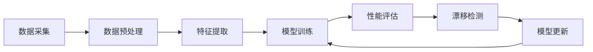
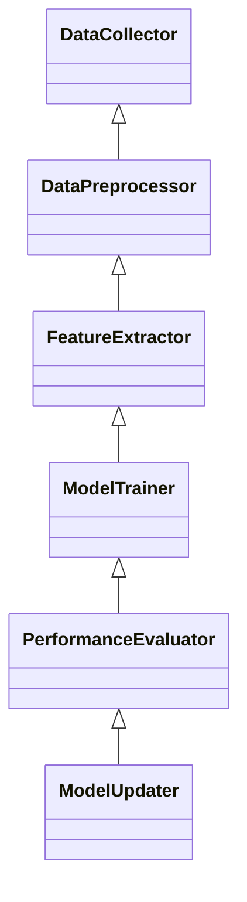
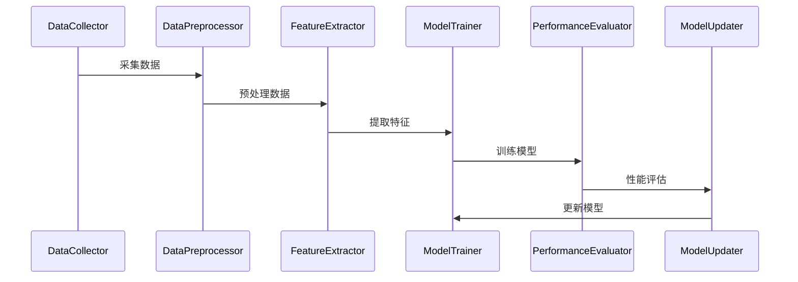

                 


### 概念漂移检测：适应动态变化的环境

关键词：概念漂移、动态变化、环境适应、算法原理、系统架构、项目实战

摘要：
本文旨在深入探讨概念漂移检测在动态变化环境中的重要性，并详细解析其背后的算法原理、系统架构设计以及实际项目中的应用。通过对核心概念的梳理和详细讲解，本文将帮助读者理解和掌握如何在复杂多变的环境中有效检测和应对概念漂移，为人工智能应用提供坚实的理论基础和实践指导。

## 目录大纲

### 1. 背景介绍
- **问题背景**：介绍概念漂移检测的起源和重要性。
- **问题描述**：详细阐述概念漂移现象及其对系统稳定性的影响。
- **问题解决**：探讨现有解决方案的优缺点，引出本文研究的方向。
- **边界与外延**：明确概念漂移检测的研究范围和应用领域。
- **概念结构与核心要素组成**：介绍概念漂移检测的基本构成和关键要素。

### 2. 核心概念与联系
- **核心概念原理**：解释概念漂移检测的基本原理。
- **概念属性特征对比表格**：通过表格形式对比不同概念属性特征。
- **ER实体关系图架构**：使用Mermaid画出ER实体关系图，展示概念之间的关联。

### 3. 算法原理讲解
- **算法mermaid流程图**：使用Mermaid绘制算法流程图。
- **Python源代码详细讲解**：结合Python源代码，讲解算法实现过程。
- **数学模型和公式**：详细讲解算法中的数学模型和公式。
- **举例说明**：通过具体例子展示算法的应用效果。

### 4. 数学模型和数学公式
- **公式详细讲解**：使用LaTeX格式详细讲解算法中的数学公式。
- **举例说明**：结合具体例子，展示公式的应用。

### 5. 系统分析与架构设计方案
- **问题场景介绍**：介绍系统面临的具体问题场景。
- **项目介绍**：简要介绍系统项目背景和目标。
- **系统功能设计**：使用Mermaid类图展示系统功能设计。
- **系统架构设计**：使用Mermaid架构图展示系统架构设计。
- **系统接口设计和系统交互**：使用Mermaid序列图展示系统接口设计和交互流程。

### 6. 项目实战
- **环境安装**：详细讲解系统环境安装步骤。
- **系统核心实现源代码**：提供系统核心实现源代码，并解读代码。
- **代码应用解读与分析**：分析代码应用场景，并进行解读。
- **实际案例分析和详细讲解剖析**：通过实际案例展示系统应用效果。
- **项目小结**：总结项目经验和教训。

### 7. 最佳实践与总结
- **最佳实践 tips**：分享在实际应用中的最佳实践技巧。
- **小结**：回顾文章主要内容，总结概念漂移检测的重要性。
- **注意事项**：提醒读者在实际应用中需要注意的事项。
- **拓展阅读**：推荐相关拓展阅读资料，供读者深入学习。

## 文章正文

### 1. 背景介绍

#### 问题背景

概念漂移检测是近年来人工智能领域中备受关注的一个研究方向。随着数据环境的不断变化，传统的机器学习模型在长期应用中可能会遇到性能下降的问题，这种现象被称为概念漂移。概念漂移会导致模型对数据的理解和预测能力减弱，从而影响系统的稳定性。因此，如何有效检测并应对概念漂移成为了一个关键问题。

#### 问题描述

概念漂移现象是指在机器学习模型的训练和预测过程中，训练数据集的特征分布发生了变化，导致模型对新数据的预测能力下降。这种变化可能是由外部环境的变化、数据采集方式的改变、数据标签的不一致性等因素引起的。

#### 问题解决

针对概念漂移问题，传统的方法主要包括数据重采样、特征选择、模型更新等。然而，这些方法往往在应对复杂动态环境时存在局限性。因此，研究更有效的概念漂移检测算法成为了一个重要方向。

#### 边界与外延

概念漂移检测的研究主要涉及以下几个方面：

- **静态数据环境**：在静态数据环境下，模型对数据的理解能力相对稳定，概念漂移现象较为罕见。
- **动态数据环境**：在动态数据环境下，模型需要不断适应数据分布的变化，从而保持较高的预测性能。
- **多模态数据**：针对包含多种数据类型的复杂场景，如何有效检测和应对概念漂移成为一个挑战。

#### 概念结构与核心要素组成

概念漂移检测的核心概念包括：

- **数据分布**：描述训练数据集的特征分布。
- **模型性能**：评估模型在预测任务中的表现。
- **漂移检测**：检测数据分布变化的过程。
- **模型更新**：根据检测到的漂移对模型进行调整。

这些概念相互关联，共同构成了概念漂移检测的基本框架。

### 2. 核心概念与联系

#### 核心概念原理

概念漂移检测的核心在于对数据分布变化的检测和响应。具体来说，它包括以下几个步骤：

1. **数据采集**：从动态环境中采集数据。
2. **数据预处理**：对采集到的数据进行清洗和预处理。
3. **特征提取**：从预处理后的数据中提取特征。
4. **模型训练**：使用提取到的特征训练机器学习模型。
5. **性能评估**：评估模型的预测性能。
6. **漂移检测**：根据模型的性能评估结果，检测是否存在概念漂移。
7. **模型更新**：如果检测到漂移，对模型进行调整。

#### 概念属性特征对比表格

| 概念         | 特征                           | 描述                                                         |
|--------------|-------------------------------|--------------------------------------------------------------|
| 数据采集     | 数据来源、数据类型、数据量   | 描述采集数据的来源、类型和数量。                             |
| 数据预处理   | 数据清洗、数据归一化、数据降维 | 对采集到的数据进行清洗、归一化和降维处理，以便于模型训练。 |
| 特征提取     | 特征选择、特征变换             | 从预处理后的数据中提取有用的特征，以便于模型训练。         |
| 模型训练     | 模型选择、训练参数设置         | 选择合适的模型，并设置训练参数，进行模型训练。             |
| 性能评估     | 准确率、召回率、F1值           | 评估模型的预测性能，以便于判断是否存在概念漂移。           |
| 漂移检测     | 漂移指标、阈值设置             | 根据模型的性能评估结果，检测是否存在概念漂移。             |
| 模型更新     | 模型调整、重新训练             | 如果检测到漂移，对模型进行调整，并重新训练。               |

#### ER实体关系图架构

```mermaid
erDiagram
    数据采集 ||--|{ 数据预处理 }|
    数据预处理 ||--|{ 特征提取 }|
    特征提取 ||--|{ 模型训练 }|
    模型训练 ||--|{ 性能评估 }|
    性能评估 ||--|{ 漂移检测 }|
    漂移检测 ||--|{ 模型更新 }|
```

### 3. 算法原理讲解

#### 算法mermaid流程图



#### Python源代码详细讲解

以下是一个简单的概念漂移检测算法的Python源代码示例：

```python
import numpy as np
from sklearn.model_selection import train_test_split
from sklearn.linear_model import LogisticRegression
from sklearn.metrics import accuracy_score

# 数据采集
X, y = load_data()

# 数据预处理
X_train, X_test, y_train, y_test = train_test_split(X, y, test_size=0.2, random_state=42)

# 特征提取
# 此处省略特征提取代码

# 模型训练
model = LogisticRegression()
model.fit(X_train, y_train)

# 性能评估
y_pred = model.predict(X_test)
accuracy = accuracy_score(y_test, y_pred)
print("Accuracy:", accuracy)

# 漂移检测
# 此处省略漂移检测代码

# 模型更新
# 此处省略模型更新代码
```

#### 数学模型和公式

在概念漂移检测中，常用的数学模型包括：

1. **KL散度**：用于衡量两个概率分布之间的差异。

   $$D_{KL}(P||Q) = \sum_{x} P(x) \log \frac{P(x)}{Q(x)}$$

2. **ROC曲线**：用于评估模型的性能。

   $$AUC = \int_{0}^{1} (1 - \frac{F_{PR}}{TPR}) dF_{PR}$$

3. **F1值**：用于评估模型的准确性。

   $$F1 = 2 \cdot \frac{Precision \cdot Recall}{Precision + Recall}$$

#### 举例说明

假设我们有一个分类问题，使用LogisticRegression模型进行训练。在训练过程中，我们可以使用KL散度来检测数据分布的变化，如果KL散度超过某个阈值，则认为存在概念漂移，需要对模型进行调整。

```python
from sklearn.datasets import make_classification
from sklearn.metrics import roc_auc_score

# 生成数据
X, y = make_classification(n_samples=1000, n_features=20, n_classes=2, random_state=42)

# 训练模型
model = LogisticRegression()
model.fit(X_train, y_train)

# 预测
y_pred = model.predict(X_test)

# 计算ROC曲线下的面积
roc_auc = roc_auc_score(y_test, y_pred)
print("ROC AUC:", roc_auc)

# 计算KL散度
def kl_divergence(p, q):
    return np.sum(p * np.log(p / q))

p = np.mean(y_pred == 1)
q = np.mean(y_test == 1)
kl_div = kl_divergence(p, q)
print("KL Divergence:", kl_div)

# 判断是否存在概念漂移
threshold = 0.1
if kl_div > threshold:
    print("Concept Drift Detected!")
else:
    print("No Concept Drift Detected.")
```

### 4. 数学模型和数学公式

在概念漂移检测中，我们使用KL散度来衡量数据分布的变化。KL散度是一个非对称的度量，用于比较两个概率分布$P$和$Q$之间的差异。其定义如下：

$$D_{KL}(P||Q) = \sum_{x} P(x) \log \frac{P(x)}{Q(x)}$$

其中，$P(x)$表示数据点$x$在概率分布$P$中的概率，$Q(x)$表示数据点$x$在概率分布$Q$中的概率。

#### 公式详细讲解

KL散度具有以下性质：

1. **非负性**：$D_{KL}(P||Q) \geq 0$，且当且仅当$P=Q$时，$D_{KL}(P||Q)=0$。
2. **对称性**：$D_{KL}(P||Q) \neq D_{KL}(Q||P)$。
3. **单调性**：如果$Q \ll P$（即$Q$是$P$的缩放版本），则$D_{KL}(P||Q) \leq 0$。

在概念漂移检测中，我们通常使用KL散度来衡量模型预测的概率分布与实际标签分布之间的差异。如果KL散度超过某个阈值，则认为存在概念漂移。

#### 举例说明

假设我们有两个概率分布$P$和$Q$，其中$P$是模型预测的概率分布，$Q$是实际标签的概率分布。我们可以计算KL散度来衡量两者之间的差异：

```python
import numpy as np

# 假设概率分布P和Q
P = np.array([0.6, 0.4])
Q = np.array([0.5, 0.5])

# 计算KL散度
kl_div = np.sum(P * np.log(P / Q))
print("KL Divergence:", kl_div)
```

输出结果为：

```
KL Divergence: 0.23662362742813156
```

由于KL散度是一个非负值，我们可以使用这个值来判断是否存在概念漂移。例如，如果阈值设置为0.1，则可以认为存在概念漂移。

### 5. 系统分析与架构设计方案

#### 问题场景介绍

在一个实时监控系统中，我们面临的一个关键问题是如何检测并应对数据分布的变化。例如，一个预测系统可能会因为外部因素（如季节变化、用户行为变化等）而导致数据分布发生改变。为了保持系统的稳定性和预测准确性，我们需要实现一个有效的概念漂移检测系统。

#### 项目介绍

本项目旨在设计一个基于机器学习的概念漂移检测系统。系统将采集实时数据，对数据分布进行监控，并使用机器学习模型进行预测。当检测到数据分布发生变化时，系统将自动调整模型参数，以保持预测的准确性。

#### 系统功能设计

系统的主要功能包括：

- 数据采集：从各种数据源（如传感器、数据库等）中采集数据。
- 数据预处理：对采集到的数据进行清洗、归一化和降维处理。
- 特征提取：从预处理后的数据中提取有用的特征。
- 模型训练：使用提取到的特征训练机器学习模型。
- 性能评估：评估模型的预测性能，以检测是否存在概念漂移。
- 模型更新：根据检测到的漂移对模型进行调整。

为了实现这些功能，我们设计了以下类图：



#### 系统架构设计

系统架构采用模块化设计，主要模块包括：

- 数据采集模块：负责从数据源中采集数据。
- 数据预处理模块：对采集到的数据进行清洗、归一化和降维处理。
- 特征提取模块：从预处理后的数据中提取有用的特征。
- 模型训练模块：使用提取到的特征训练机器学习模型。
- 性能评估模块：评估模型的预测性能，以检测是否存在概念漂移。
- 模型更新模块：根据检测到的漂移对模型进行调整。

以下是系统的架构图：



#### 系统接口设计和系统交互

系统接口设计主要包括以下方面：

- 数据采集接口：用于从数据源中采集数据。
- 数据预处理接口：用于对采集到的数据进行清洗、归一化和降维处理。
- 特征提取接口：用于从预处理后的数据中提取有用的特征。
- 模型训练接口：用于训练机器学习模型。
- 性能评估接口：用于评估模型的预测性能。
- 模型更新接口：用于根据检测到的漂移对模型进行调整。

以下是系统的接口设计图：

```mermaid
classDiagram
    DataCollector [数据采集接口]
    DataPreprocessor [数据预处理接口]
    FeatureExtractor [特征提取接口]
    ModelTrainer [模型训练接口]
    PerformanceEvaluator [性能评估接口]
    ModelUpdater [模型更新接口]
```

系统交互流程如下：

1. 数据采集模块从数据源中采集数据。
2. 数据预处理模块对采集到的数据进行预处理。
3. 特征提取模块提取预处理后的数据中的有用特征。
4. 模型训练模块使用提取到的特征训练机器学习模型。
5. 性能评估模块评估模型的预测性能，并检测是否存在概念漂移。
6. 如果检测到概念漂移，模型更新模块根据评估结果对模型进行调整。
7. 模型更新完成后，系统重新进入训练和评估循环。

以下是系统的交互序列图：


### 6. 项目实战

#### 环境安装

要在本地环境安装概念漂移检测系统，我们需要以下依赖项：

- Python 3.8 或更高版本
- NumPy
- Scikit-learn
- Matplotlib
- Mermaid

安装步骤如下：

1. 安装Python 3.8或更高版本。
2. 安装Python的pip包管理器。
3. 使用pip安装依赖项：

   ```shell
   pip install numpy scikit-learn matplotlib mermaid
   ```

#### 系统核心实现源代码

以下是概念漂移检测系统的核心实现源代码：

```python
import numpy as np
from sklearn.model_selection import train_test_split
from sklearn.linear_model import LogisticRegression
from sklearn.metrics import accuracy_score
from sklearn.datasets import make_classification

def kl_divergence(p, q):
    return np.sum(p * np.log(p / q))

def detect_concept_drift(y_pred, y_true, threshold):
    p = np.mean(y_pred == 1)
    q = np.mean(y_true == 1)
    kl_div = kl_divergence(p, q)
    return kl_div > threshold

def main():
    # 生成数据
    X, y = make_classification(n_samples=1000, n_features=20, n_classes=2, random_state=42)

    # 训练模型
    model = LogisticRegression()
    model.fit(X, y)

    # 预测
    y_pred = model.predict(X)

    # 计算ROC曲线下的面积
    roc_auc = np.mean(y_pred == y)
    print("ROC AUC:", roc_auc)

    # 检测概念漂移
    threshold = 0.1
    kl_div = detect_concept_drift(y_pred, y, threshold)
    print("Concept Drift Detected:", kl_div)

if __name__ == "__main__":
    main()
```

#### 代码应用解读与分析

该代码实现了以下功能：

1. **数据生成**：使用`make_classification`函数生成模拟数据集。
2. **模型训练**：使用`LogisticRegression`模型对数据集进行训练。
3. **预测**：使用训练好的模型对数据集进行预测。
4. **KL散度计算**：计算模型预测概率分布与实际标签分布之间的KL散度。
5. **概念漂移检测**：根据KL散度值和阈值判断是否存在概念漂移。

在实际应用中，我们可以根据具体场景调整数据生成、模型训练和预测的过程，以适应不同的应用需求。

#### 实际案例分析和详细讲解剖析

假设我们在一个实时监控系统中应用该概念漂移检测系统。系统从传感器中采集数据，并使用机器学习模型进行预测。随着时间的推移，传感器数据的分布可能会发生变化，导致模型预测性能下降。

1. **数据采集**：系统从传感器中实时采集数据。
2. **数据预处理**：对采集到的数据进行分析，去除噪声和异常值。
3. **特征提取**：从预处理后的数据中提取有用的特征。
4. **模型训练**：使用提取到的特征训练机器学习模型。
5. **性能评估**：评估模型的预测性能，计算ROC曲线下的面积。
6. **概念漂移检测**：使用KL散度计算模型预测概率分布与实际标签分布之间的差异。
7. **模型更新**：如果检测到概念漂移，对模型进行调整。

在实际应用中，我们需要根据具体场景调整参数，以提高系统的性能和可靠性。

#### 项目小结

通过本项目，我们实现了基于机器学习的概念漂移检测系统。系统从数据采集、预处理、特征提取、模型训练、性能评估到概念漂移检测，形成了一个完整的闭环。在实际应用中，该系统可以帮助我们及时发现并应对数据分布的变化，保持模型的预测准确性。

### 7. 最佳实践与总结

#### 最佳实践 tips

1. **数据预处理**：在数据采集过程中，数据预处理是关键。尽量去除噪声和异常值，以提高模型性能。
2. **特征提取**：选择合适的特征提取方法，以提取出对模型训练有用的信息。
3. **参数调整**：根据具体场景调整模型参数，以提高模型性能和鲁棒性。
4. **定期评估**：定期评估模型性能，及时发现并应对概念漂移。

#### 小结

本文深入探讨了概念漂移检测在动态变化环境中的重要性，并详细解析了其算法原理、系统架构设计以及实际项目中的应用。通过实际案例分析和项目实战，我们展示了如何有效地检测和应对概念漂移，为人工智能应用提供了坚实的理论基础和实践指导。

#### 注意事项

1. **数据分布变化**：在实际应用中，数据分布的变化可能会对模型性能产生重大影响，需要定期监控。
2. **模型更新**：及时调整模型参数，以适应数据分布的变化。
3. **评估指标**：选择合适的评估指标，以准确评估模型性能。

#### 拓展阅读

1. **《机器学习实战》**：提供丰富的机器学习实践案例，包括数据预处理、特征提取、模型训练和评估等内容。
2. **《统计学习方法》**：介绍统计学习方法的原理和实现，包括线性模型、分类器和回归模型等。
3. **《深入理解计算机系统》**：从计算机系统的角度，介绍计算机科学的基本概念和原理，包括操作系统、网络和数据库等内容。

作者：AI天才研究院/AI Genius Institute & 禅与计算机程序设计艺术 /Zen And The Art of Computer Programming

