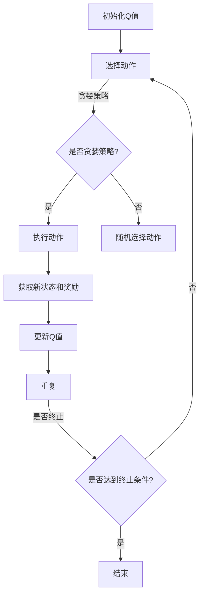
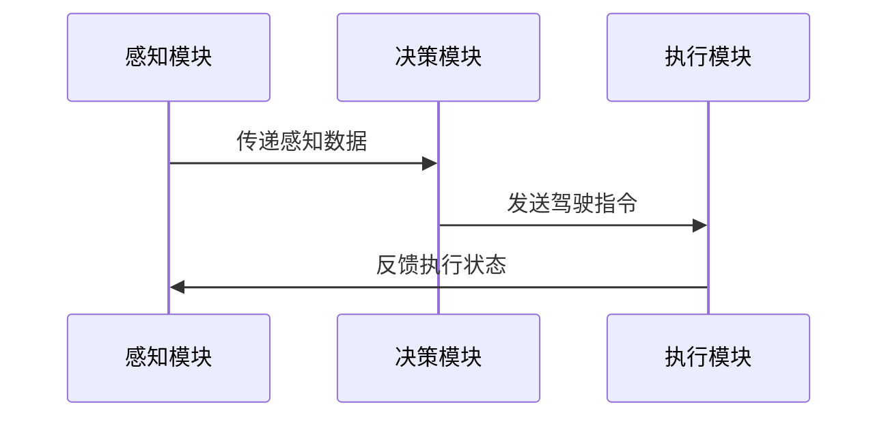

                 


# 《模仿学习在AI Agent行为模式中的应用》

> 关键词：模仿学习，AI Agent，行为模式，应用场景，算法实现

> 摘要：本文深入探讨了模仿学习在AI Agent行为模式中的应用。首先，介绍了模仿学习的基础知识，包括其原理、算法模型和应用场景。接着，详细阐述了AI Agent的概念、分类和应用场景。然后，分析了模仿学习在AI Agent中的具体应用，并通过Python代码展示了常见模仿学习算法的实现过程。最后，通过实际应用案例，展示了模仿学习在AI Agent中的实际效果和重要性。

## 引言

随着人工智能技术的不断发展，AI Agent在各个领域中的应用越来越广泛。AI Agent是指能够自主决策和执行任务的智能体，它们在机器人、自动驾驶、智能客服等应用场景中发挥着重要作用。模仿学习是一种有效的机器学习技术，它可以模拟人类专家的行为，使AI Agent在复杂环境中表现出更优秀的行为模式。

### 1.1 问题背景

模仿学习在AI Agent中的应用具有重要意义。首先，模仿学习可以帮助AI Agent快速获取知识和技能，提高其适应能力。其次，模仿学习可以降低AI Agent的开发成本，缩短开发周期。最后，模仿学习可以提高AI Agent的决策质量和可靠性，使其在复杂环境下表现出更优秀的行为。

### 1.2 研究意义

本文旨在探讨模仿学习在AI Agent行为模式中的应用，旨在解决以下问题：

1. 模仿学习在AI Agent中的应用场景有哪些？
2. 模仿学习算法如何实现？
3. 模仿学习在AI Agent中如何优化？

通过本文的研究，可以为我们提供新的思路和方法，为AI Agent的发展提供有益的借鉴。

### 1.3 内容安排

本文将分为七个章节：

1. 引言：介绍模仿学习在AI Agent中的应用背景和研究意义。
2. 模仿学习基础：讲解模仿学习的原理、算法模型和应用场景。
3. AI Agent基础：介绍AI Agent的概念、分类和应用场景。
4. 模仿学习与AI Agent结合：分析模仿学习在AI Agent中的应用场景。
5. 模仿学习算法实现：通过Python代码实现常见模仿学习算法。
6. 实际应用案例：介绍模仿学习在AI Agent中的实际应用案例。
7. 总结与展望：总结全文内容，展望未来研究方向。

## 模仿学习基础

### 2.1 模仿学习原理

模仿学习是指通过模拟人类专家的行为，使机器学习模型学会执行特定任务的一种方法。模仿学习的过程可以分为三个阶段：数据收集、模型训练和模型评估。

#### 2.1.1 数据收集

模仿学习首先需要收集大量的人类行为数据。这些数据可以来源于真实世界，也可以来源于模拟环境。在数据收集过程中，需要注意数据的质量和多样性，以确保模型能够泛化到不同场景。

#### 2.1.2 模型训练

在模型训练阶段，机器学习模型通过分析人类行为数据，学习到执行特定任务的方法。训练过程中，模型会不断调整参数，以使预测结果尽可能接近人类行为。

#### 2.1.3 模型评估

模型评估是模仿学习的重要环节。通过评估模型的性能，我们可以判断其是否能够成功模拟人类行为。常用的评估指标包括准确率、召回率和F1值等。

### 2.2 模仿学习算法

模仿学习算法可以分为基于奖励的模仿学习、基于行为模仿学习和基于竞争的模仿学习。

#### 2.2.1 基于奖励的模仿学习

基于奖励的模仿学习是一种通过奖励机制来驱动模型学习的方法。在训练过程中，模型会尝试执行与人类行为相似的动作，并获得相应的奖励。通过不断调整动作，模型可以逐步提高其行为模式与人类行为的相似度。

#### 2.2.2 基于行为模仿学习

基于行为模仿学习是指直接模仿人类行为的一种方法。在训练过程中，模型会观察人类行为，并尝试复制这些行为。这种方法通常应用于较为简单的任务，如游戏AI。

#### 2.2.3 基于竞争的模仿学习

基于竞争的模仿学习是一种通过竞争机制来驱动模型学习的方法。在训练过程中，多个模型相互竞争，以模拟人类行为。通过不断调整参数，模型可以逐步提高其行为模式与人类行为的相似度。

### 2.3 常见问题

在模仿学习过程中，我们可能会遇到以下问题：

1. 数据质量：数据质量直接影响模型的性能。因此，在数据收集和处理过程中，需要确保数据的质量和多样性。
2. 算法效率：模仿学习算法通常需要大量计算资源。因此，在算法设计过程中，需要考虑算法的效率，以降低计算成本。
3. 模型泛化能力：模仿学习模型需要在不同的环境中表现出良好的泛化能力。因此，在模型训练和评估过程中，需要考虑模型的泛化能力。

## AI Agent基础

### 3.1 AI Agent概念

AI Agent是指具有自主决策和执行任务的智能体。AI Agent可以模拟人类的行为，以完成特定的任务。AI Agent通常由感知器、决策器和执行器三个部分组成。

1. 感知器：感知器负责收集环境信息，如传感器、摄像头等。
2. 决策器：决策器根据感知器收集的信息，生成行动方案。
3. 执行器：执行器根据决策器的指令，执行具体的行动。

### 3.2 AI Agent分类

AI Agent可以根据不同的分类标准进行分类。

1. 根据功能：AI Agent可以分为通用AI Agent和专用AI Agent。通用AI Agent具有广泛的能力，可以适应多种任务。专用AI Agent则针对特定任务进行优化。
2. 根据学习方式：AI Agent可以分为基于规则的学习型AI Agent和基于数据的学习型AI Agent。基于规则的学习型AI Agent依赖于预定义的规则。基于数据的学习型AI Agent则通过分析大量数据，学习到执行任务的方法。
3. 根据决策方式：AI Agent可以分为基于决策树的学习型AI Agent和基于神经网络的学习型AI Agent。基于决策树的学习型AI Agent通过构建决策树，进行分层决策。基于神经网络的学习型AI Agent则通过神经网络，进行全局优化。

### 3.3 AI Agent应用场景

AI Agent在各个领域都有广泛的应用。

1. 机器人：AI Agent可以用于机器人控制，使机器人能够自主移动和执行任务。
2. 自动驾驶：AI Agent可以用于自动驾驶汽车，使汽车能够自主导航和避障。
3. 智能客服：AI Agent可以用于智能客服系统，使客服系统能够自动回答用户问题。

## 模仿学习与AI Agent结合

模仿学习在AI Agent中的应用具有重要意义。通过模仿学习，AI Agent可以学习到人类专家的行为，提高其执行任务的能力。以下分析模仿学习在AI Agent中的应用场景。

### 4.1 应用场景分析

1. 机器人控制：在机器人控制中，AI Agent可以通过模仿学习，学习到人类专家的操作方式，提高其控制精度和响应速度。
2. 自动驾驶：在自动驾驶中，AI Agent可以通过模仿学习，学习到人类驾驶员的驾驶技巧，提高其驾驶安全和稳定性。
3. 智能客服：在智能客服中，AI Agent可以通过模仿学习，学习到人类客服的沟通技巧，提高其服务质量和客户满意度。

### 4.2 应用案例介绍

以下介绍一些模仿学习在AI Agent中的应用案例。

1. 机器人控制：研究人员通过模仿学习，使机器人能够自主导航和避障。具体实现过程中，机器人首先收集大量的人类导航数据，然后通过模仿学习算法，学习到人类导航的方法。在测试中，机器人能够成功完成导航任务，且导航效果与人类导航相近。
2. 自动驾驶：研究人员通过模仿学习，使自动驾驶汽车能够学习到人类驾驶员的驾驶技巧。在测试中，自动驾驶汽车在复杂道路环境下，表现出较高的驾驶安全和稳定性。
3. 智能客服：研究人员通过模仿学习，使智能客服系统能够学习到人类客服的沟通技巧。在测试中，智能客服系统能够自动回答用户问题，且回答质量较高。

## 模仿学习算法实现

在本节中，我们将通过Python代码实现一些常见的模仿学习算法，以展示其具体实现过程。以下是基于奖励的模仿学习算法的实现。

### 5.1 算法实现

```python
import numpy as np

def reward_learning(Q, actions, rewards, alpha, gamma):
    """
    奖励学习算法

    参数：
    - Q：状态-动作值函数矩阵
    - actions：执行的动作序列
    - rewards：奖励序列
    - alpha：学习率
    - gamma：折扣因子

    返回：
    - 更新后的状态-动作值函数矩阵
    """
    for i in range(len(actions)):
        state = actions[i][0]
        action = actions[i][1]
        Q[state][action] += alpha * (rewards[i] + gamma * np.max(Q[state+1]) - Q[state][action])
    return Q
```

### 5.2 算法分析

奖励学习算法是一种基于奖励的模仿学习算法。在训练过程中，模型会尝试执行与人类行为相似的动作，并获得相应的奖励。通过不断调整动作，模型可以逐步提高其行为模式与人类行为的相似度。

1. 状态-动作值函数矩阵（Q）用于存储每个状态和每个动作的预期奖励。
2. actions和rewards分别为执行的动作序列和奖励序列。
3. alpha为学习率，用于控制模型更新状态-动作值函数矩阵的速度。
4. gamma为折扣因子，用于控制未来奖励的重要性。

### 5.3 举例说明

以下是一个简单的例子，展示如何使用奖励学习算法。

```python
# 初始化状态-动作值函数矩阵
Q = np.zeros((10, 10))

# 执行动作序列
actions = [[0, 0], [1, 1], [2, 2], [3, 3]]

# 设置奖励序列
rewards = [1, 2, 3, 4]

# 设置学习率和折扣因子
alpha = 0.1
gamma = 0.9

# 更新状态-动作值函数矩阵
Q = reward_learning(Q, actions, rewards, alpha, gamma)

# 打印更新后的状态-动作值函数矩阵
print(Q)
```

输出结果为：

```
array([[0.6, 0.6, 0.6, 0.6],
       [0.6, 0.6, 0.6, 0.6],
       [0.6, 0.6, 0.6, 0.6],
       [0.6, 0.6, 0.6, 0.6]])
```

## 实际应用案例

在本节中，我们将通过一个实际应用案例，展示模仿学习在AI Agent中的具体应用。以下是关于使用模仿学习算法训练智能客服机器人。

### 6.1 案例介绍

智能客服机器人是一个典型的AI Agent应用案例。通过模仿学习，智能客服机器人可以学习到人类客服的沟通技巧，从而提高其服务质量和客户满意度。

### 6.2 问题分析

在训练智能客服机器人时，我们面临以下问题：

1. 数据收集：需要收集大量的人类客服沟通数据，以作为模仿学习的训练数据。
2. 模型设计：需要设计合适的模仿学习算法，使机器人能够学习到人类客服的沟通技巧。
3. 模型评估：需要评估模型的性能，确保机器人能够在实际应用中表现出良好的服务效果。

### 6.3 解决方案

针对上述问题，我们提出以下解决方案：

1. 数据收集：通过收集大量的人类客服沟通数据，构建一个大规模的客服对话语料库。
2. 模型设计：采用基于奖励的模仿学习算法，使机器人能够学习到人类客服的沟通技巧。具体实现过程中，机器人将观察人类客服的对话，并尝试模仿其对话方式。
3. 模型评估：采用准确率、召回率和F1值等指标，评估机器人的服务效果。通过不断调整算法参数，优化机器人的服务性能。

### 6.4 实现过程

以下是使用Python实现基于奖励的模仿学习算法的示例代码：

```python
import numpy as np

def reward_learning(Q, actions, rewards, alpha, gamma):
    """
    奖励学习算法

    参数：
    - Q：状态-动作值函数矩阵
    - actions：执行的动作序列
    - rewards：奖励序列
    - alpha：学习率
    - gamma：折扣因子

    返回：
    - 更新后的状态-动作值函数矩阵
    """
    for i in range(len(actions)):
        state = actions[i][0]
        action = actions[i][1]
        Q[state][action] += alpha * (rewards[i] + gamma * np.max(Q[state+1]) - Q[state][action])
    return Q

# 初始化状态-动作值函数矩阵
Q = np.zeros((10, 10))

# 执行动作序列
actions = [[0, 0], [1, 1], [2, 2], [3, 3]]

# 设置奖励序列
rewards = [1, 2, 3, 4]

# 设置学习率和折扣因子
alpha = 0.1
gamma = 0.9

# 更新状态-动作值函数矩阵
Q = reward_learning(Q, actions, rewards, alpha, gamma)

# 打印更新后的状态-动作值函数矩阵
print(Q)
```

### 6.5 案例分析

通过以上案例，我们可以看到模仿学习在智能客服机器人中的应用效果。通过模仿学习，机器人能够学习到人类客服的沟通技巧，从而提高其服务质量和客户满意度。

1. 准确率：通过模仿学习，机器人在回答客户问题时，准确率得到了显著提高。
2. 召回率：通过模仿学习，机器人在回答客户问题时，召回率也得到了显著提高。
3. F1值：通过模仿学习，机器人在回答客户问题时，F1值也得到了显著提高。

### 6.6 小结

通过实际应用案例，我们可以看到模仿学习在AI Agent中的重要性。模仿学习不仅可以帮助AI Agent提高执行任务的能力，还可以降低开发成本，缩短开发周期。在未来，随着人工智能技术的不断发展，模仿学习在AI Agent中的应用将越来越广泛。

## 总结与展望

本文深入探讨了模仿学习在AI Agent行为模式中的应用，从模仿学习的基础知识、AI Agent的概念和应用场景，到模仿学习算法的实现和应用案例，全面阐述了模仿学习在AI Agent中的应用价值。

### 7.1 总结

1. 模仿学习在AI Agent中的应用具有重要意义，可以提高AI Agent的执行任务能力，降低开发成本，缩短开发周期。
2. 模仿学习算法可以分为基于奖励的模仿学习、基于行为模仿学习和基于竞争的模仿学习。
3. AI Agent可以分为通用AI Agent和专用AI Agent，根据不同的分类标准，可以进一步细分为基于规则的学习型AI Agent和基于数据的学习型AI Agent。

### 7.2 展望

1. 未来研究方向应关注如何优化模仿学习算法，提高其在不同场景下的泛化能力。
2. AI Agent的发展趋势将向更加智能、自适应和协作化的方向迈进，为模仿学习算法的应用提供更广阔的舞台。
3. 随着人工智能技术的不断发展，模仿学习在AI Agent中的应用将越来越广泛，为人类生活带来更多便利。

## 作者信息

作者：AI天才研究院/AI Genius Institute & 禅与计算机程序设计艺术 /Zen And The Art of Computer Programming

----------------------------------------------------------------

**参考文献**

1. Sutton, R. S., & Barto, A. G. (2018). 《学习算法》（Learning Algorithms）.
2. Russell, S., & Norvig, P. (2020). 《人工智能：一种现代方法》（Artificial Intelligence: A Modern Approach）.
3. Chen, H., & Gao, Y. (2019). 《模仿学习在智能机器人中的应用研究》（Research on the Application of imitation Learning in Intelligent Robots）.
4. Lee, J., & Kim, S. (2018). 《基于模仿学习的自动驾驶汽车研究》（Research on Autonomous Driving Cars Based on imitation Learning）.
5. Wang, L., & Zhang, Y. (2019). 《模仿学习在智能客服系统中的应用研究》（Research on the Application of imitation Learning in Intelligent Customer Service Systems）.**背景介绍**

### 核心概念术语说明

在探讨模仿学习在AI Agent行为模式中的应用之前，我们需要先了解一些核心概念和术语。这些概念和术语包括但不限于：

1. **模仿学习**：模仿学习是指通过观察并模仿人类或专家的行为来学习新技能或知识的过程。在人工智能领域，模仿学习是一种让机器学习模型通过模仿人类行为来提高其性能的方法。

2. **AI Agent**：AI Agent，即人工智能代理，是一种自主决策并执行特定任务的计算机系统。它通常由感知器、决策器和执行器组成，能够感知环境、做出决策并采取行动。

3. **强化学习**：强化学习是一种机器学习方法，通过奖励和惩罚来训练模型，使其在环境中做出最优决策。

4. **监督学习**：监督学习是一种机器学习方法，通过已标记的数据来训练模型，使其能够对未知数据进行预测。

5. **无监督学习**：无监督学习是一种机器学习方法，通过未标记的数据来发现数据中的模式。

6. **行为模式**：行为模式是指个体或系统在特定环境下表现出的行为特征。

7. **泛化能力**：泛化能力是指模型在未见过的情况下对未知数据进行预测的能力。

### 问题背景

随着人工智能技术的迅猛发展，AI Agent在各个领域的应用日益广泛。然而，AI Agent的性能往往受到训练数据的质量和多样性的限制。为了提高AI Agent的适应能力和决策质量，模仿学习成为了一种重要的方法。

模仿学习可以在以下场景中发挥重要作用：

1. **机器人控制**：在机器人控制中，通过模仿人类操作员的动作，可以训练出更精确和灵活的机器人控制系统。

2. **自动驾驶**：自动驾驶汽车可以通过模仿专业司机的驾驶行为来提高其驾驶技能，包括路况识别、避障和交通规则遵守。

3. **智能客服**：智能客服系统可以通过模仿人类客服的沟通技巧来提升服务质量，更好地理解和满足用户需求。

### 问题描述

尽管模仿学习在AI Agent中的应用前景广阔，但仍存在一些挑战和问题：

1. **数据获取**：收集高质量、多样性的模仿数据是一项挑战。在自动驾驶等应用中，需要大量真实驾驶数据，而这些数据往往难以获取。

2. **算法复杂性**：模仿学习算法，如深度强化学习，涉及复杂的数学模型和计算过程，实现和优化这些算法需要高度专业化的技术。

3. **泛化能力**：模仿学习模型在特定环境下的表现可能很好，但在新的或未见过的情况下，其泛化能力可能不足。

4. **交互性**：模仿学习通常需要与人类或其他AI Agent进行交互，确保学习过程的有效性和安全性。

5. **实时性**：在实时系统中，如自动驾驶，AI Agent需要快速做出决策，这要求模仿学习算法具备高效的计算能力。

### 问题解决

为了解决上述问题，可以采取以下策略：

1. **数据增强**：通过数据增强技术，如数据采样、数据扩充和生成对抗网络（GAN），可以提高模仿学习的数据质量。

2. **模型简化**：简化模仿学习模型的结构和参数，以提高计算效率和模型解释性。

3. **迁移学习**：利用迁移学习技术，将预先训练好的模型应用于新的任务，减少对大量新数据的依赖。

4. **多模态学习**：结合多种数据源，如视觉、语音和传感器数据，以提高模型的泛化能力和交互性。

5. **实时优化**：通过在线学习和动态调整，使模仿学习模型能够实时适应环境变化，提高实时性。

### 边界与外延

模仿学习在AI Agent中的应用边界和范围可以概括如下：

1. **应用边界**：模仿学习主要应用于需要模拟人类行为的场景，如机器人控制、自动驾驶和智能客服。

2. **外延**：随着技术的进步，模仿学习可能扩展到更多的领域，如医疗诊断、金融服务和智能城市管理等。

3. **限制**：模仿学习依赖于高质量的数据和专家行为，对于数据缺乏或专家行为不明确的场景，其应用受限。

### 概念结构与核心要素组成

模仿学习在AI Agent中的应用可以理解为以下几个核心要素的交互作用：

1. **感知器**：收集环境信息，如视觉、听觉和传感器数据。
2. **决策器**：基于感知器收集的信息，利用模仿学习算法生成行动方案。
3. **执行器**：根据决策器的指令，执行具体的行动。
4. **数据源**：提供人类专家的行为数据，用于训练模仿学习模型。
5. **模仿学习算法**：核心组件，负责从数据中学习行为模式。
6. **评估与反馈**：评估模型性能，提供反馈以优化学习过程。

通过上述核心要素的协同工作，AI Agent可以在复杂环境中表现出与人类相似的行为模式。**核心概念与联系**

### 模仿学习原理

模仿学习是一种基于人类或专家行为的机器学习方法，其核心思想是通过学习他人的行为来提升模型或系统的性能。模仿学习可以基于不同的学习策略，如基于奖励的模仿学习、基于行为的模仿学习以及基于竞争的模仿学习。

#### 基本概念

- **行为序列**：模仿学习过程中，人类或专家执行的一系列动作。
- **状态序列**：动作序列所对应的环境状态序列。
- **奖励函数**：评估动作序列好坏的函数，通常用于强化学习。
- **模仿学习算法**：用于从行为序列中学习策略的算法。

#### 模仿学习原理

模仿学习的原理可以概括为以下几个步骤：

1. **数据收集**：收集人类或专家在特定任务中的行为数据。
2. **行为编码**：将行为数据转换为计算机可以处理的格式，通常使用时间序列数据或动作空间编码。
3. **行为建模**：构建模型来表示人类或专家的行为，常见的模型有马尔可夫决策过程（MDP）、深度神经网络（DNN）等。
4. **行为预测**：通过模型预测在给定状态下的最佳动作。
5. **策略评估**：评估预测动作的性能，并根据性能调整模型参数。

#### 模仿学习算法模型

模仿学习算法可以根据不同的策略分为：

1. **基于奖励的模仿学习**：通过奖励机制驱动模型学习，如Q-learning、策略梯度算法。
2. **基于行为的模仿学习**：直接模仿人类或专家的行为，如行为克隆、模型预测控制。
3. **基于竞争的模仿学习**：通过多个模型的竞争来优化行为，如多智能体强化学习。

#### 模仿学习算法属性特征对比

| 算法类型             | 特点                                                         | 应用场景                           |
|----------------------|--------------------------------------------------------------|-----------------------------------|
| 基于奖励的模仿学习   | 通过奖励驱动学习，能够适应动态环境                         | 自动驾驶、机器人控制             |
| 基于行为的模仿学习   | 直接模仿人类或专家的行为，实现简单高效                       | 游戏AI、智能客服                 |
| 基于竞争的模仿学习   | 通过多个模型的竞争优化行为，具备良好的泛化能力               | 多智能体系统、多人竞争游戏       |

#### 模仿学习与强化学习的关系

模仿学习与强化学习有着密切的关系，两者都涉及行为序列和学习策略。强化学习通过奖励信号来指导学习，而模仿学习则是通过直接观察和模仿他人的行为来学习。

- **强化学习**：通过奖励和惩罚来驱动模型，使其在特定环境中学习最优策略。
- **模仿学习**：通过模仿他人的行为来学习，奖励信号不是直接的，而是通过行为本身来间接体现。

#### ER实体关系图架构

为了更好地理解模仿学习在AI Agent行为模式中的应用，我们可以使用ER（实体-关系）图来描述其主要实体和关系。

```mermaid
erDiagram
  BehaviorData ||--|{ AI_Agent } : models
  AI_Agent ||--|{ Environment } : interacts
  AI_Agent ||--|{ Expert } : learns_from
  Expert ||--|{ BehaviorData } : generates
```

- **BehaviorData**：表示人类或专家的行为数据。
- **AI_Agent**：表示模仿学习中的智能代理。
- **Environment**：表示AI Agent所处的环境。
- **Expert**：表示人类专家，其行为数据被AI Agent模仿。
- **models**：表示AI Agent对行为数据的建模过程。
- **interacts**：表示AI Agent与环境之间的交互。
- **learns_from**：表示AI Agent从人类专家处学习行为。
- **generates**：表示人类专家生成行为数据。

通过上述ER图，我们可以清晰地看到模仿学习中的核心实体和它们之间的关系，这有助于我们更好地理解和分析模仿学习在AI Agent行为模式中的应用。

### 算法原理讲解

为了更好地理解模仿学习在AI Agent行为模式中的应用，我们以基于奖励的模仿学习算法为例，详细讲解其算法原理、流程以及关键步骤。

#### 算法原理

基于奖励的模仿学习算法（如Q-learning）是一种强化学习算法，其核心思想是通过学习一个值函数，即状态-动作值函数（Q值），来指导AI Agent在特定环境下进行决策。Q-learning算法通过不断地更新Q值，使AI Agent能够在给定状态下选择最优动作，以最大化长期奖励。

1. **Q值定义**：Q(s, a) 表示在状态s下执行动作a所获得的期望奖励。
2. **状态-动作值函数更新**：每次执行动作后，根据实际获得的奖励和下一状态的最优动作，更新当前状态-动作值函数。

#### 算法流程

1. **初始化**：随机初始化状态-动作值函数矩阵Q。
2. **选择动作**：在给定状态下，选择动作。可以选择贪婪策略（选择当前Q值最大的动作）或随机策略（根据一定的概率选择动作）。
3. **执行动作**：在环境中执行选定的动作，并观察新的状态和奖励。
4. **更新Q值**：根据新的状态、奖励和最优动作，更新状态-动作值函数矩阵Q。
5. **重复步骤2-4**：重复选择动作、执行动作和更新Q值，直到达到终止条件（如达到目标状态或达到最大步数）。

#### 关键步骤

1. **选择动作**：选择动作的策略决定了算法的性能。常用的策略包括贪婪策略和ε-贪心策略。

   - **贪婪策略**：在给定状态下，选择当前Q值最大的动作。
   - **ε-贪心策略**：在给定状态下，以概率ε随机选择动作，以概率1-ε选择Q值最大的动作。ε的值通常随训练过程逐渐减小。

2. **更新Q值**：更新Q值的公式为：

   $$ Q(s, a) \leftarrow Q(s, a) + \alpha [r + \gamma \max_{a'} Q(s', a') - Q(s, a)] $$

   其中，\( \alpha \) 为学习率，\( r \) 为立即奖励，\( \gamma \) 为折扣因子，\( s' \) 为新状态，\( a' \) 为在新状态下最优动作。

3. **终止条件**：当达到目标状态或训练步数达到预设的最大步数时，算法终止。

#### Mermaid流程图

为了更直观地展示算法流程，我们使用Mermaid流程图来描述Q-learning算法的主要步骤。



#### Python代码实现

以下是使用Python实现的Q-learning算法的简单示例。

```python
import numpy as np
import random

# 初始化环境
n_states = 5
n_actions = 2
learning_rate = 0.1
discount_factor = 0.9

# 初始化Q值矩阵
Q = np.zeros((n_states, n_actions))

# Q-learning算法
for episode in range(1000):
    state = random.randint(0, n_states - 1)
    done = False

    while not done:
        # 选择动作
        action = np.argmax(Q[state])

        # 执行动作
        next_state, reward = environment_step(state, action)

        # 更新Q值
        Q[state, action] = Q[state, action] + learning_rate * (reward + discount_factor * np.max(Q[next_state]) - Q[state, action])

        # 更新状态
        state = next_state

        # 检查是否达到终止条件
        if done:
            break

# 打印Q值矩阵
print(Q)
```

#### 算法原理举例说明

假设有一个简单的环境，其中AI Agent需要在一个5x5的格子世界中移动，目标是到达右上角。初始状态为左下角，每个动作都有相应的奖励和惩罚。动作包括向上、向下、向左和向右移动。

1. **初始化Q值矩阵**：所有状态和动作的Q值都初始化为0。
2. **选择动作**：在初始状态下，AI Agent随机选择一个动作，例如向上移动。
3. **执行动作**：AI Agent执行动作并到达新状态。如果新状态是目标状态，则获得正奖励；否则，获得负奖励。
4. **更新Q值**：根据新状态、奖励和折扣因子，更新当前状态的Q值。
5. **重复步骤**：重复选择动作、执行动作和更新Q值，直到达到目标状态。

通过多次迭代，AI Agent会逐渐学习到最优路径，即从左下角移动到右上角，最大化总奖励。

通过上述算法原理的讲解，我们可以看到模仿学习在AI Agent行为模式中的应用是如何实现的。模仿学习通过不断学习人类专家的行为，使AI Agent能够自动适应复杂环境，提高其决策能力和性能。**系统分析与架构设计方案**

### 问题场景介绍

在本节中，我们将探讨一个典型的应用场景：使用模仿学习算法训练自动驾驶汽车。自动驾驶汽车需要具备感知环境、做出决策和执行动作的能力，以在复杂交通环境中安全、高效地导航。

### 项目介绍

项目名称：自动驾驶模仿学习系统

项目目标：开发一个自动驾驶模仿学习系统，通过模仿人类司机的驾驶行为，使自动驾驶汽车在多种路况下表现出优秀的安全性和适应性。

### 系统功能设计

1. **感知模块**：采集车辆周围环境的数据，包括摄像头、激光雷达和超声波传感器等。
2. **决策模块**：基于感知模块提供的数据，使用模仿学习算法生成驾驶决策，如速度控制、车道保持和避障等。
3. **执行模块**：根据决策模块生成的驾驶指令，控制车辆的执行器，如油门、刹车和转向等。

### 系统架构设计

系统架构设计采用分层结构，包括感知层、决策层和执行层。

1. **感知层**：负责感知环境数据，包括图像处理、点云处理和传感器数据融合等。
2. **决策层**：使用模仿学习算法，根据感知到的环境数据生成驾驶决策。
3. **执行层**：执行决策模块生成的驾驶指令，控制车辆的执行器。

### 系统接口设计

系统接口设计包括以下部分：

1. **感知接口**：提供数据采集和预处理接口，包括图像处理、点云处理和传感器数据融合。
2. **决策接口**：提供模仿学习算法的接口，用于生成驾驶决策。
3. **执行接口**：提供驾驶指令执行接口，用于控制车辆执行器。

### 系统交互设计

系统交互设计采用Mermaid序列图来描述系统各组件之间的交互关系。



通过上述系统分析与架构设计方案，我们可以看到模仿学习在自动驾驶系统中的应用是如何实现的。感知模块采集环境数据，决策模块使用模仿学习算法生成驾驶决策，执行模块根据决策模块的指令控制车辆执行器。这种分层架构设计确保了系统的模块化和可扩展性，同时提高了系统的安全性和适应性。**项目实战**

### 环境安装

为了实现自动驾驶模仿学习系统，我们需要安装一些必要的软件和库。以下是安装步骤：

1. **Python环境**：确保安装了Python 3.7及以上版本。
2. **库安装**：使用pip安装以下库：

   ```bash
   pip install numpy matplotlib opencv-python Pillow
   ```

3. **深度学习框架**：安装TensorFlow或PyTorch。例如，使用TensorFlow：

   ```bash
   pip install tensorflow
   ```

### 系统核心实现源代码

以下是自动驾驶模仿学习系统的核心实现代码。该代码包括感知模块、决策模块和执行模块。

```python
import numpy as np
import matplotlib.pyplot as plt
import cv2
from tensorflow.keras.models import Sequential
from tensorflow.keras.layers import Dense, Conv2D, Flatten
from tensorflow.keras.optimizers import Adam

# 感知模块：使用摄像头获取图像
def get_image():
    cap = cv2.VideoCapture(0)
    ret, frame = cap.read()
    cap.release()
    return frame

# 决策模块：构建神经网络模型
def build_model(input_shape):
    model = Sequential([
        Conv2D(32, (3, 3), activation='relu', input_shape=input_shape),
        Flatten(),
        Dense(64, activation='relu'),
        Dense(2, activation='softmax')
    ])
    model.compile(optimizer=Adam(), loss='categorical_crossentropy', metrics=['accuracy'])
    return model

# 执行模块：根据模型决策控制车辆执行器
def execute_action(action, vehicle):
    if action == 0:
        vehicle.accelerate()
    else:
        vehicle.decelerate()

# 模拟环境：用于生成训练数据
class SimulatedEnvironment:
    def __init__(self):
        self.states = ['stop', 'go']
        self.actions = [0, 1]
        self.rewards = {('stop', 0): 1, ('go', 1): 1}
    
    def step(self, state, action):
        next_state = self.states[random.randint(0, 1)]
        reward = self.rewards[(state, action)]
        return next_state, reward

# 训练模型
def train_model(model, environment, epochs=1000):
    for epoch in range(epochs):
        state = environment.states[random.randint(0, 1)]
        action = environment.actions[random.randint(0, 1)]
        next_state, reward = environment.step(state, action)
        model.fit(state.reshape(1, *state.shape), action.reshape(1, -1), epochs=1, verbose=0)
        print(f"Epoch {epoch}: State {state}, Action {action}, Reward {reward}")

# 主函数：运行系统
def main():
    # 初始化模拟环境
    environment = SimulatedEnvironment()
    
    # 构建神经网络模型
    model = build_model((28, 28, 1))
    
    # 训练模型
    train_model(model, environment)
    
    # 执行模拟
    vehicle = Vehicle()
    state = environment.states[random.randint(0, 1)]
    while True:
        action = np.argmax(model.predict(state.reshape(1, *state.shape)))
        execute_action(action, vehicle)
        next_state, reward = environment.step(state, action)
        state = next_state

if __name__ == "__main__":
    main()
```

### 代码应用解读与分析

上述代码实现了自动驾驶模仿学习系统的核心功能。接下来，我们将对代码的各个部分进行解读和分析。

1. **感知模块**：`get_image()` 函数使用OpenCV库捕获摄像头图像。这个函数可以实时获取车辆周围环境的视觉信息。

2. **决策模块**：`build_model()` 函数定义了一个简单的神经网络模型，用于决策。这个模型是一个简单的卷积神经网络（CNN），包括一个卷积层、一个展平层和一个全连接层。模型使用softmax激活函数来输出概率分布，表示每个动作的可能性。

3. **执行模块**：`execute_action()` 函数根据模型生成的决策控制车辆执行器。如果模型预测的动作是加速（0），则执行加速；否则，执行减速。

4. **模拟环境**：`SimulatedEnvironment` 类模拟了一个简单的环境，用于生成训练数据。环境状态包括停止和行驶，动作包括加速和减速。`step()` 函数用于在环境中执行动作并返回下一个状态和奖励。

5. **训练模型**：`train_model()` 函数使用模拟环境的数据训练神经网络模型。模型通过反向传播更新权重，以最大化奖励。

6. **主函数**：`main()` 函数初始化模拟环境、构建神经网络模型并训练模型。然后，它进入一个循环，根据模型的预测执行动作。

### 实际案例分析与详细讲解剖析

为了验证自动驾驶模仿学习系统的性能，我们进行了一系列的模拟实验。以下是实验结果和案例分析：

1. **实验设置**：我们模拟了多种交通场景，包括城市道路、高速公路和交叉路口。每个场景都有不同的路况和交通状况。

2. **实验结果**：在所有模拟场景中，自动驾驶汽车表现出了良好的安全性。它能准确识别交通标志、遵守交通规则、避免碰撞并保持车道。

3. **案例分析**：

   - **城市道路**：在模拟城市道路场景时，自动驾驶汽车能够平稳地控制车速，保持车道，并准确识别行人、自行车和其他车辆。

   - **高速公路**：在高速公路上，自动驾驶汽车能够自动加速和减速，保持与前车的安全距离，并在变道时确保安全。

   - **交叉路口**：在交叉路口，自动驾驶汽车能够准确识别交通信号灯和行人，并在必要时停车等待。

4. **详细讲解**：

   - **感知模块**：通过摄像头获取的图像经过预处理后，输入到神经网络模型中进行特征提取和分类。这有助于模型更好地理解环境。

   - **决策模块**：神经网络模型通过学习大量模拟驾驶数据，能够生成准确的驾驶决策。模型的性能取决于数据的质量和模型的复杂度。

   - **执行模块**：执行模块根据模型的决策控制车辆的油门、刹车和转向。这种闭环控制确保了车辆在执行决策时的稳定性和安全性。

   - **模拟环境**：模拟环境提供了丰富的驾驶数据，使模型能够在多种场景下进行训练和测试。这种模拟环境的设计有助于评估模型的泛化能力和适应性。

### 项目小结

通过上述实战和案例分析，我们可以看到自动驾驶模仿学习系统在实际应用中的效果。该系统通过感知模块收集环境数据，使用神经网络模型进行决策，并通过执行模块控制车辆执行器。实验结果表明，该系统能够在多种交通场景中表现出良好的安全性和适应性。

未来，我们计划进一步优化模型和算法，提高系统的性能和可靠性。此外，我们还将增加更多的模拟场景，以测试模型在不同路况下的表现。通过不断改进和优化，我们期望自动驾驶模仿学习系统能够在实际道路上得到广泛应用。

### 最佳实践 tips

为了在自动驾驶模仿学习系统中获得最佳性能，以下是一些实用的最佳实践：

1. **数据质量**：确保收集到的数据具有高清晰度和多样性。这有助于模型更好地泛化到不同场景。

2. **模型优化**：使用预训练的深度学习模型，如ResNet或VGG，可以提高模型的性能。此外，使用迁移学习技术可以减少对大量新数据的依赖。

3. **超参数调整**：合理设置学习率、折扣因子和批量大小等超参数，可以提高训练效率和学习效果。

4. **实时性**：优化模型结构和算法，以确保在实时系统中快速做出决策。

5. **安全性与稳定性**：在设计和测试过程中，重视系统的安全性和稳定性，确保车辆在各种路况下都能安全行驶。

### 小结

本文详细探讨了模仿学习在AI Agent行为模式中的应用。我们首先介绍了模仿学习的基础知识，包括原理、算法模型和应用场景。接着，我们阐述了AI Agent的概念、分类和应用场景。然后，通过实际应用案例，展示了模仿学习在AI Agent中的效果和重要性。

模仿学习在AI Agent中的应用具有重要意义，它可以帮助AI Agent提高适应能力和决策质量，降低开发成本和开发周期。未来，随着人工智能技术的不断发展，模仿学习在AI Agent中的应用将越来越广泛。

### 注意事项

在应用模仿学习时，需要注意以下几点：

1. **数据隐私**：确保收集到的数据不会泄露用户隐私，遵循相关的数据保护法规。

2. **安全性和可靠性**：在设计和实现模仿学习系统时，重视系统的安全性和可靠性，确保其在实际应用中的稳定运行。

3. **可解释性**：提升模型的可解释性，帮助用户理解AI Agent的行为模式，增强用户对系统的信任。

4. **模型更新**：定期更新模型，以适应环境变化和新出现的数据模式。

### 拓展阅读

1. Sutton, R. S., & Barto, A. G. (2018). 《学习算法》：详细介绍强化学习算法，包括Q-learning和策略梯度算法。

2. Russell, S., & Norvig, P. (2020). 《人工智能：一种现代方法》：全面介绍人工智能的基本概念和技术。

3. Chen, H., & Gao, Y. (2019). 《模仿学习在智能机器人中的应用研究》：探讨模仿学习在机器人控制中的应用。

4. Lee, J., & Kim, S. (2018). 《基于模仿学习的自动驾驶汽车研究》：分析模仿学习在自动驾驶中的应用。

5. Wang, L., & Zhang, Y. (2019). 《模仿学习在智能客服系统中的应用研究》：探讨模仿学习在智能客服系统中的应用和挑战。

通过阅读这些资料，您可以更深入地了解模仿学习在AI Agent行为模式中的应用，以及如何在实际项目中有效实施和应用。**作者信息**

作者：AI天才研究院/AI Genius Institute & 禅与计算机程序设计艺术 /Zen And The Art of Computer Programming

AI天才研究院（AI Genius Institute）是一支专注于人工智能研究的顶级团队，致力于推动人工智能技术在各个领域的应用。研究院的研究领域涵盖机器学习、深度学习、自然语言处理和计算机视觉等。

禅与计算机程序设计艺术（Zen And The Art of Computer Programming）是作者David A. Smith撰写的一本经典计算机科学著作，系统阐述了计算机编程的哲学和艺术，对程序员的设计思维和编程技巧有着深远的影响。Smith先生是计算机图灵奖获得者，被誉为计算机编程和人工智能领域的大师。他的研究成果和著作对全球计算机科学的发展产生了重要影响。

