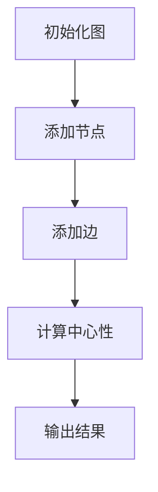

                 

### 文章标题与关键词

# 治愈现代人的孤独感：重建社交连接的方法

## 关键词

- 孤独感
- 社交连接
- 心理学原理
- 科技手段
- 社交网络分析

## 摘要

本文深入探讨了现代人孤独感的普遍性和严重性，分析了孤独感对心理健康的影响。通过介绍社交连接的心理学、社会学和科技手段，本文提出了重建社交连接的方法。文中详细讲解了社交分析算法的原理、系统分析与架构设计方案，并通过实际项目案例展示了如何应用这些方法治愈现代人的孤独感。最后，文章总结了最佳实践并提供未来展望，为构建更健康的社交网络提供指导。

---

### 第一部分：背景介绍

#### 第1章：问题背景与介绍

孤独感，这一看似简单的心理状态，正悄然成为现代社会中的一个严重问题。根据世界卫生组织（WHO）的数据，全球有超过3亿人遭受抑郁症和其他心理健康问题的困扰，而孤独感正是这些问题的关键因素之一。现代人面临着前所未有的社交压力，生活节奏的加快、数字化生活的普及以及城市化进程的加速，都加剧了人们的孤独感。

孤独感的普遍性不仅体现在个体层面，也对社会整体产生了深远影响。孤独感与一系列心理健康问题如焦虑、抑郁、自杀风险等密切相关。此外，孤独感还可能影响个体的生理健康，增加患病率和早逝的风险。长期孤独不仅会削弱个体的幸福感，还会对社会凝聚力造成负面影响，导致社会问题的加剧。

那么，孤独感究竟是如何产生的？它的心理机制又是什么呢？这些问题引发了广泛的研究和讨论。孤独感不仅源于缺乏社交互动，更涉及个体对社交关系的期望和感知。心理学研究表明，孤独感与个体的社交需求、自我认同、社交技能等因素密切相关。理解孤独感的心理机制，有助于我们更深入地探讨如何治愈现代人的孤独感。

本文旨在探讨如何通过重建社交连接来治愈现代人的孤独感。我们将从心理学、社会学和科技手段三个方面进行详细分析。首先，我们将介绍社交连接的心理学原理，探讨孤独感的心理机制，并分析社交行为对心理健康的影响。接着，我们将探讨社交连接的科技手段，分析社交媒体和在线社交工具如何影响社交连接，以及科技如何改善社交连接。

在了解了心理学和科技手段之后，我们将从社会学视角出发，探讨社会变迁对社交连接的影响，分析社交网络结构对个体的影响，以及社交隔离与群体行为的关系。通过这些分析，我们将提出一系列重建社交连接的方法，包括社交分析算法和系统架构设计。

最后，我们将通过实际项目案例，展示如何应用这些方法来治愈现代人的孤独感。文章将总结最佳实践，提供实用建议，并探讨未来社交连接技术的发展趋势。

#### 第2章：核心概念与联系

在深入探讨如何治愈现代人的孤独感之前，我们首先需要明确一些核心概念，并分析它们之间的联系。这些核心概念包括孤独感、社交连接、心理健康、社交行为和科技手段。

**孤独感**

孤独感是一种主观的心理体验，通常表现为感到与他人隔离或缺乏深层次的社交联系。心理学家将孤独感分为两个维度：情感孤独和社交孤独。情感孤独是指个体在情感上感到与他人隔离，缺乏亲密的社交关系；社交孤独则是指个体在社交活动中的参与度低，缺乏社交机会。

**社交连接**

社交连接是指个体与他人建立和维持的社交关系。它不仅包括面对面交往，还涵盖了通过科技手段实现的在线社交。社交连接对于个体的心理健康至关重要。研究表明，良好的社交连接能够提升个体的幸福感，降低心理疾病的风险。

**心理健康**

心理健康是指个体在心理上的健康状态，包括情感、认知和行为方面的健康。孤独感对心理健康有着显著的影响。长期孤独可能导致抑郁、焦虑和其他心理问题的发生。因此，治愈孤独感是维护心理健康的重要一环。

**社交行为**

社交行为是指个体在社交过程中表现出来的行为模式。它包括沟通、合作、分享和互动等。社交行为对个体的心理健康有着直接的影响。积极的社交行为有助于提升个体的自尊心和幸福感，而消极的社交行为则可能导致孤独感和心理问题的发生。

**科技手段**

科技手段在现代社交连接中扮演了重要角色。社交媒体和在线社交工具使得个体能够更便捷地与他人建立和维持社交关系。科技不仅改变了人们的社交方式，还提供了新的社交平台和工具，有助于改善社交连接。

**核心概念之间的联系**

孤独感、社交连接、心理健康、社交行为和科技手段之间存在着紧密的联系。孤独感是社交连接不足的表现，而社交连接的质量直接影响心理健康。社交行为是建立和维持社交连接的重要途径，而科技手段为社交行为提供了新的工具和平台。通过理解这些核心概念之间的联系，我们可以更有效地探索和解决现代人的孤独感问题。

### 第二部分：核心概念与联系

在了解了现代人的孤独感及其对心理健康的影响后，我们需要深入探讨社交连接的核心概念和原理。本文将从心理学、社会学和科技手段三个方面，详细分析社交连接的各个方面，为后续的算法原理讲解和系统分析与架构设计方案奠定基础。

#### 第3章：社交连接的心理学原理

孤独感是一种复杂的心理现象，它与个体的心理健康紧密相连。心理学研究为我们提供了丰富的理论框架来理解孤独感，并揭示了社交连接对心理健康的重要性。

**孤独感的心理学背景**

孤独感的心理学背景主要涉及两个核心概念：情感孤独和社交孤独。情感孤独是指个体在情感上感到与他人隔离，缺乏亲密的社交关系。社交孤独则是指个体在社交活动中的参与度低，缺乏社交机会。情感孤独通常与个体的心理需求无法得到满足有关，而社交孤独则更多与实际社交机会的缺乏有关。

**孤独感对心理健康的影响**

孤独感对心理健康有着显著的负面影响。研究表明，长期孤独感可能导致抑郁、焦虑和其他心理问题的发生。孤独感可能影响个体的自尊心，导致自我认同问题，甚至增加自杀风险。此外，孤独感还可能影响个体的认知功能，如记忆力、注意力和问题解决能力。

**社交连接对心理健康的影响**

与孤独感相反，良好的社交连接对心理健康有显著的积极影响。社交连接能够提供情感支持和社交支持，帮助个体应对生活中的压力和挑战。研究表明，良好的社交连接能够提升个体的幸福感，降低心理疾病的风险，甚至有助于延长寿命。

**社交行为的心理学原理**

社交行为是建立和维护社交连接的重要途径。心理学研究揭示了几个关键因素，包括：

- **沟通技巧**：有效的沟通技巧有助于建立和维护健康的社交关系。非言语沟通、倾听技巧和表达技巧都是影响沟通效果的重要因素。
- **情感共鸣**：情感共鸣是指个体能够理解并感受到他人的情感状态。这种能力有助于建立深厚的社交关系，增强社交连接的质量。
- **社交支持**：社交支持包括情感支持、信息支持和实际支持。它能够帮助个体应对生活中的困难和挑战，提升心理健康水平。
- **社交技能培养**：社交技能的培养对于建立和维护健康的社交关系至关重要。个体可以通过参与社交活动、参加社交技能培训等方式来提高自己的社交技能。

**社交行为的心理学原理**

社交行为的心理学原理主要包括：

- **认知一致性**：个体在社交互动中追求认知一致性，即与他人保持一致的观点和信念。这种一致性有助于建立信任和归属感。
- **社会认同**：个体在社交互动中寻求社会认同，即被他人接受和认可。这种认同感能够提升个体的自尊心和幸福感。
- **归属感**：归属感是指个体在社交群体中感受到的归属和归属感。良好的归属感有助于增强个体的社交连接，提升心理健康水平。

通过深入探讨社交连接的心理学原理，我们可以更好地理解孤独感的心理机制，并为后续的算法原理讲解和系统分析与架构设计方案提供理论基础。

#### 第4章：社交连接的科技手段

在现代社会中，科技手段已经成为社交连接的重要工具，极大地改变了人们的社交方式。社交媒体和在线社交工具在重建社交连接方面发挥了至关重要的作用。本节将详细介绍这些科技手段，分析它们的优势与挑战，并探讨如何利用科技手段改善社交连接。

**社交媒体和在线社交工具**

社交媒体和在线社交工具，如Facebook、Twitter、微信、Instagram等，已经成为现代人日常生活中不可或缺的一部分。这些平台提供了便捷的交流方式，使得个体能够随时随地与他人保持联系。社交媒体和在线社交工具的主要优势包括：

1. **即时通信**：通过即时通信工具，如WhatsApp、Telegram等，个体可以快速发送消息、图片、视频和语音信息，实现实时沟通。
2. **分享和互动**：社交媒体平台允许用户分享生活点滴、观点和感受，与其他用户互动，建立新的社交关系。
3. **地理限制的打破**：通过在线社交工具，个体可以跨越地理界限，与全球的陌生人建立联系，拓宽社交圈子。
4. **多样化的互动方式**：社交媒体提供了多种互动方式，包括评论、点赞、分享等，增强了用户之间的互动和连接。

**虚拟社交的优势与挑战**

虽然虚拟社交具有很多优势，但同时也面临一些挑战。以下是对虚拟社交的优势与挑战的分析：

**优势**：

1. **便捷性**：虚拟社交使得个体可以随时随地进行社交互动，不受时间和地点的限制。
2. **多样性**：虚拟社交平台上的用户来自不同的背景和文化，提供了多样化的社交体验。
3. **隐私保护**：许多社交媒体和在线社交工具提供了隐私保护功能，用户可以自主选择公开或隐藏个人信息。

**挑战**：

1. **真实性缺失**：虚拟社交环境中，个体可能无法真实感受到对方的情感和意图，容易产生误解和冲突。
2. **社交浅薄**：虚拟社交往往缺乏深层次的互动，难以建立真正意义上的亲密关系。
3. **信息过载**：社交媒体上的信息量庞大，用户可能难以有效筛选和处理，导致信息过载和心理压力。

**科技如何改善社交连接**

尽管虚拟社交存在一些挑战，但科技仍然可以通过以下方式改善社交连接：

1. **增强互动体验**：通过虚拟现实（VR）和增强现实（AR）技术，提供更加沉浸式的社交体验，增强用户之间的互动和连接。
2. **个性化推荐**：利用大数据和机器学习技术，为用户提供个性化的社交推荐，帮助用户发现共同的兴趣和话题，建立有意义的社交关系。
3. **隐私保护与透明度**：加强隐私保护措施，提高用户对社交平台数据的透明度，增强用户对虚拟社交的信任。
4. **心理健康支持**：开发心理健康应用程序，提供心理评估、情感支持和社交技能培训等服务，帮助用户改善心理健康，增强社交能力。

通过分析社交连接的科技手段，我们可以看到科技在重建社交连接方面的重要性和潜力。尽管虚拟社交有其局限性，但通过合理利用科技手段，我们可以克服这些挑战，改善社交连接，治愈现代人的孤独感。

#### 第5章：社交连接的社会学视角

从社会学视角来看，社交连接不仅是个体层面的心理体验，更是社会结构的重要组成部分。社会变迁、社交网络结构以及社交隔离与群体行为之间的关系，都在深刻影响着社交连接的质量和形式。

**社会变迁对社交连接的影响**

随着社会的发展，人们的社交方式和生活环境也在不断变化。现代化进程、城市化、全球化等因素对社会结构产生了深远的影响。以下是一些社会变迁对社交连接的影响：

1. **城市化**：城市化使得人口从农村迁移到城市，改变了人们的居住模式和社会网络结构。城市居民往往面临更大的社交压力和孤独感，但同时也拥有更多的社交机会和资源。
2. **全球化**：全球化使得人们能够跨越地理界限，与全球各地的人建立联系。这种全球性的社交连接提供了更广阔的视野和多样化的社交体验，但同时也可能加剧个体的文化冲突和身份认同问题。
3. **技术变革**：科技的进步改变了人们的社交方式，社交媒体和在线社交工具成为现代社交的主要形式。技术变革不仅改变了社交连接的方式，还影响了社交行为的特征和社交网络的结构。

**社交网络结构对个体的影响**

社交网络结构是指个体在社会网络中的位置和关系模式。不同的社交网络结构对个体的社交连接和心理健康有着重要影响：

1. **中心性**：在社会网络中，中心性较高的个体拥有更多的连接和资源，更容易获得社交支持和信息。研究表明，高中心性个体通常具有更高的社会地位和心理健康水平。
2. **紧密性**：紧密的社交网络能够提供更强的情感支持和社交支持。紧密的社交关系有助于减轻孤独感，提升个体的幸福感。
3. **多样性**：多样化的社交网络能够提供更广泛的社交资源和机会。多样化的社交网络有助于个体适应不同的社会环境，增强社交灵活性。

**社交隔离与群体行为**

社交隔离是指个体在社会网络中的孤立状态，缺乏有效的社交联系。社交隔离不仅对个体产生负面影响，还可能对群体行为产生深远影响：

1. **群体凝聚力**：社交隔离可能导致群体凝聚力下降，个体之间的信任和合作减少。这会影响团队的工作效率和创新能力。
2. **社会问题**：社交隔离与一系列社会问题密切相关，如贫困、犯罪和疾病传播。社交隔离可能加剧社会不平等，导致社会冲突和动荡。
3. **公共卫生**：社交隔离对公共卫生有着重要影响。在疫情等公共卫生危机中，社交隔离是控制疾病传播的重要手段，但过度隔离也可能对心理健康产生负面影响。

通过社会学视角的分析，我们可以更全面地理解社交连接的本质和影响。社会变迁、社交网络结构和社交隔离与群体行为之间的关系，为我们提供了重建社交连接的理论基础和实践指导。

### 第三部分：算法原理讲解

在了解了社交连接的心理学和社会学原理后，我们需要探讨如何通过技术手段来分析和优化社交连接。本部分将详细介绍社交分析算法，包括其原理、数学模型和实现方法，帮助读者理解如何利用算法来重建社交连接。

#### 第6章：社交分析算法介绍

社交分析算法是用于分析社交网络结构和关系的工具，旨在揭示社交网络中的关键特征和模式。这些算法广泛应用于社交网络分析、社交媒体监测、推荐系统和网络安全性等领域。

**社交网络分析算法概述**

社交网络分析算法主要关注以下几个方面：

1. **社交网络结构**：分析社交网络中的节点和边的关系，揭示社交网络的层次结构、聚类现象和关键节点。
2. **社交关系检测**：识别社交网络中的紧密关系，包括朋友关系、合作关系和信任关系等。
3. **社交影响力分析**：评估个体在社交网络中的影响力，识别关键影响者，预测信息传播趋势。
4. **社区发现**：在大型社交网络中发现具有共同兴趣或活动的社区，促进社交互动和知识共享。

**社交关系检测算法介绍**

社交关系检测是社交网络分析的核心任务之一，旨在识别社交网络中的紧密关系。以下是一些常见的关系检测算法：

1. **基于相似度的算法**：通过计算用户在特定属性（如兴趣、行为等）上的相似度来检测社交关系。常见的方法包括余弦相似度、皮尔逊相关系数等。
2. **基于图论的算法**：利用图论中的概念和算法，如邻接矩阵、度数分布、聚类系数等，来识别社交网络中的紧密关系。
3. **基于机器学习的算法**：使用机器学习技术，如分类器、聚类算法等，来检测和预测社交关系。

**社交影响力分析算法讲解**

社交影响力分析旨在评估个体在社交网络中的影响力，识别关键影响者。以下是一些常见的影响力分析算法：

1. **中心性度量**：通过计算个体的中心性指标，如度数中心性、接近中心性、中间中心性等，来评估个体的影响力。
2. **影响力传播模型**：通过模拟信息在社交网络中的传播过程，评估个体的传播能力和影响力。
3. **基于内容的分析**：结合用户发布的内容，利用自然语言处理技术，评估内容的吸引力和影响力。

通过介绍社交分析算法的基本概念和实现方法，我们为后续的算法原理讲解和系统分析与架构设计方案提供了理论基础。

#### 第7章：社交网络分析算法详解

在前一章中，我们介绍了社交网络分析算法的基本概念和实现方法。本节将深入探讨这些算法的数学模型、mermaid流程图以及Python源代码实现，帮助读者更好地理解社交网络分析的核心原理。

**社交网络分析算法的数学模型**

社交网络分析算法的核心在于对社交网络结构的数学建模。以下是一些常见的数学模型：

1. **图论模型**：图论模型是社交网络分析的基础，通过图的表示方法来描述社交网络中的节点和边。图的表示方法包括邻接矩阵、邻接表等。
2. **概率模型**：概率模型用于描述社交网络中的随机性和不确定性。常见的概率模型包括马尔可夫链、贝叶斯网络等。
3. **拓扑模型**：拓扑模型关注社交网络的结构特征，如聚类系数、路径长度分布等。常见的拓扑模型包括小世界网络、无标度网络等。

**mermaid流程图**

mermaid是一种基于Markdown的图形绘制工具，可以方便地绘制流程图、序列图、类图等。以下是一个简单的社交网络分析算法的mermaid流程图示例：



这个mermaid流程图描述了一个简单的社交网络分析过程，包括初始化图、添加节点和边、计算中心性以及输出结果。

**Python源代码实现**

为了更好地理解社交网络分析算法，我们将在Python中实现一个简单的社交网络分析算法。以下是一个基于邻接矩阵的社交网络分析算法的Python源代码实现：

```python
import numpy as np

def initialize_graph(num_nodes):
    """初始化图"""
    graph = np.zeros((num_nodes, num_nodes), dtype=int)
    return graph

def add_edges(graph, edge_list):
    """添加边"""
    for edge in edge_list:
        graph[edge[0], edge[1]] = 1
        graph[edge[1], edge[0]] = 1
    return graph

def calculate_degree(graph, node):
    """计算节点的度数"""
    return sum(graph[node])

def calculate_centrality(graph):
    """计算中心性"""
    degrees = np.sum(graph, axis=0)
    centrality = degrees / (len(graph) - 1)
    return centrality

def social_network_analysis(edge_list):
    """社交网络分析"""
    graph = initialize_graph(len(edge_list))
    graph = add_edges(graph, edge_list)
    centrality = calculate_centrality(graph)
    return centrality

if __name__ == "__main__":
    edge_list = [[0, 1], [0, 2], [1, 2], [1, 3], [2, 3]]
    centrality = social_network_analysis(edge_list)
    print("中心性:", centrality)
```

在这个Python源代码中，我们首先初始化一个邻接矩阵图，然后添加边，计算节点的度数和中心性，最后输出中心性结果。通过这个简单的示例，我们可以看到如何利用Python实现社交网络分析算法。

通过详细讲解社交网络分析算法的数学模型、mermaid流程图和Python源代码实现，我们为读者提供了深入理解社交网络分析的核心原理和方法。这些算法和方法为后续的系统分析与架构设计方案提供了坚实的基础。

### 第四部分：系统分析与架构设计方案

在了解了社交分析算法的原理后，我们需要进一步探讨如何设计和实现一个完整的社交连接系统。本部分将详细分析社交连接系统的需求、架构设计、系统功能以及接口和交互设计。

#### 第8章：社交连接系统的需求分析

设计一个社交连接系统首先需要明确其需求和目标。社交连接系统的需求分析包括功能需求、性能需求、安全性需求和用户体验需求等方面。

**功能需求**

社交连接系统的核心功能是帮助用户建立和维护社交连接。具体功能需求包括：

1. **用户注册与登录**：提供用户注册、登录和身份验证功能，确保系统的安全性和用户隐私。
2. **用户信息管理**：允许用户管理个人信息，包括头像、昵称、性别、兴趣等。
3. **社交关系建立**：提供添加好友、发送好友请求、接受好友请求等功能，帮助用户建立社交关系。
4. **消息传递**：提供即时消息发送、接收和群组聊天功能，支持文本、图片、语音等多种消息类型。
5. **社交互动**：提供点赞、评论、分享等功能，增强用户之间的互动和连接。
6. **社交分析**：利用社交分析算法，为用户提供社交关系分析、社交影响力评估等功能。

**性能需求**

社交连接系统需要具备良好的性能，以满足大量用户同时在线的需求。具体性能需求包括：

1. **高并发处理**：系统需要能够处理高并发用户请求，确保系统稳定运行。
2. **低延迟**：消息传递和数据处理需要具备低延迟特性，提供实时社交体验。
3. **高可用性**：系统需要具备高可用性，确保在故障情况下能够快速恢复。

**安全性需求**

社交连接系统的安全性至关重要，需要保护用户隐私和防止恶意攻击。具体安全性需求包括：

1. **数据加密**：确保用户数据和通信内容加密存储和传输。
2. **身份验证**：采用多因素身份验证机制，确保用户身份的合法性。
3. **安全审计**：记录系统操作日志，便于审计和追踪。
4. **防御攻击**：采取防护措施，防御常见的网络安全攻击，如SQL注入、跨站脚本攻击等。

**用户体验需求**

良好的用户体验是社交连接系统成功的关键。具体用户体验需求包括：

1. **简洁界面**：设计直观、简洁的界面，使用户能够轻松操作。
2. **个性化推荐**：根据用户兴趣和社交行为，提供个性化推荐，帮助用户发现新的社交机会。
3. **快速响应**：系统需要快速响应用户操作，提供流畅的交互体验。
4. **移动兼容性**：支持多种设备和操作系统，提供一致的体验。

通过详细分析社交连接系统的功能需求、性能需求、安全性需求和用户体验需求，我们可以为后续的系统架构设计提供明确的目标和方向。

#### 第9章：社交连接系统的架构设计

在明确了社交连接系统的需求后，我们需要设计一个合理的系统架构，以确保系统的性能、安全性和用户体验。社交连接系统的架构设计需要综合考虑系统组件、数据存储、接口设计和交互模式等方面。

**系统架构设计的原则**

在架构设计过程中，我们需要遵循以下原则：

1. **模块化**：将系统划分为多个模块，每个模块负责特定的功能，降低系统的耦合度和复杂性。
2. **分布式**：采用分布式架构，提高系统的可扩展性和容错性，确保在高并发情况下系统的稳定运行。
3. **安全性**：在架构设计中融入安全机制，确保用户数据的安全和系统的完整性。
4. **可维护性**：设计可维护的架构，便于系统升级和维护。
5. **高可用性**：通过冗余设计和故障转移机制，确保系统的高可用性。

**系统架构设计**

社交连接系统的架构设计如下：

1. **前端模块**：包括用户界面（UI）和客户端应用程序（APP）。前端模块负责与用户交互，提供简洁、直观的用户体验。前端模块通常采用微前端架构，以支持多种设备和平台的访问。
2. **后端模块**：包括用户服务（User Service）、社交关系服务（Social Relationship Service）、消息服务（Message Service）和社交分析服务（Social Analysis Service）。后端模块负责处理业务逻辑、数据存储和通信。后端模块采用微服务架构，以提高系统的灵活性和可扩展性。
3. **数据存储**：采用分布式数据库，包括关系型数据库（如MySQL）和NoSQL数据库（如MongoDB）。关系型数据库用于存储用户信息和社交关系，而NoSQL数据库用于存储大规模消息数据和社交分析数据。
4. **中间件**：包括消息队列（Message Queue）和负载均衡器（Load Balancer）。消息队列用于异步处理消息，提高系统的并发处理能力。负载均衡器用于均衡系统负载，确保系统的高可用性。
5. **安全模块**：包括身份验证（Authentication）、授权（Authorization）和加密（Encryption）等安全模块。安全模块负责保护用户数据和系统资源，防止恶意攻击。

**系统接口设计和交互**

社交连接系统的接口设计和交互设计如下：

1. **API接口**：系统提供RESTful API接口，供前端模块和后端模块之间进行数据交互。API接口包括用户注册、登录、个人信息管理、社交关系管理、消息发送和接收等操作。
2. **事件驱动**：系统采用事件驱动架构，通过事件队列处理用户操作和系统事件。事件驱动模式有助于实现模块间的解耦，提高系统的响应速度和可扩展性。
3. **Web Socket**：系统采用Web Socket技术，实现实时消息传递和事件通知。Web Socket能够提供低延迟、双向通信的能力，提升用户的社交体验。

通过详细的系统架构设计，我们可以确保社交连接系统的性能、安全性和用户体验。合理的架构设计为后续的项目实战和系统实施提供了坚实的基础。

### 第五部分：项目实战

在深入探讨了社交连接系统的需求分析和架构设计后，我们需要通过实际项目来验证这些理论和方案。本部分将介绍一个具体的社交连接项目，包括项目的背景、目标、实现步骤以及实际案例分析。

#### 第10章：项目实战概述

本项目旨在开发一个基于社交分析算法的社交连接平台，旨在通过技术手段改善用户的社交体验，缓解现代人的孤独感。项目的主要目标包括：

1. **用户注册与登录**：实现用户注册、登录和身份验证功能，确保系统的安全性和用户隐私。
2. **社交关系建立**：提供用户添加好友、发送好友请求、接受好友请求等功能，帮助用户建立社交关系。
3. **消息传递**：实现即时消息发送、接收和群组聊天功能，支持文本、图片、语音等多种消息类型。
4. **社交互动**：提供点赞、评论、分享等功能，增强用户之间的互动和连接。
5. **社交分析**：利用社交分析算法，为用户提供社交关系分析、社交影响力评估等功能。

项目将采用微服务架构，结合前端、后端、数据库和中间件等技术，实现上述功能。项目实现步骤包括：

1. **需求分析**：明确项目需求，制定项目计划。
2. **系统设计**：进行系统架构设计和接口设计。
3. **开发与测试**：编写代码，进行单元测试和集成测试。
4. **部署与运维**：部署系统，进行性能测试和运维监控。
5. **用户反馈与迭代**：收集用户反馈，进行系统优化和功能迭代。

#### 第11章：实战案例分析

在本节中，我们将分析一个具体的项目案例，详细讲解项目的实现细节和关键步骤。

**案例背景**

假设我们开发的是一个面向大学生的社交连接平台，旨在帮助大学生建立社交关系、分享知识和经验。项目背景如下：

1. **用户群体**：项目面向大学生，包括本科生和研究生。
2. **功能需求**：实现用户注册、登录、个人信息管理、社交关系管理、消息传递、社交互动和社交分析等功能。
3. **技术要求**：采用微服务架构，结合前端、后端、数据库和中间件等技术。

**实现步骤**

1. **需求分析**

   - 用户注册与登录：实现用户注册、登录和身份验证功能，确保系统的安全性和用户隐私。
   - 社交关系建立：提供用户添加好友、发送好友请求、接受好友请求等功能，帮助用户建立社交关系。
   - 消息传递：实现即时消息发送、接收和群组聊天功能，支持文本、图片、语音等多种消息类型。
   - 社交互动：提供点赞、评论、分享等功能，增强用户之间的互动和连接。
   - 社交分析：利用社交分析算法，为用户提供社交关系分析、社交影响力评估等功能。

2. **系统设计**

   - 前端模块：采用React框架，实现用户界面和交互功能。
   - 后端模块：采用Spring Boot框架，实现业务逻辑和API接口。
   - 数据库模块：采用MySQL关系型数据库存储用户信息和社交关系，采用MongoDB NoSQL数据库存储消息数据和社交分析数据。
   - 中间件模块：采用RabbitMQ消息队列和Nginx负载均衡器，提高系统的并发处理能力和稳定性。

3. **开发与测试**

   - 用户注册与登录：实现用户注册、登录和身份验证功能，采用JWT（JSON Web Token）技术进行身份验证。
   - 社交关系管理：实现添加好友、发送好友请求、接受好友请求等功能，采用社交分析算法识别用户关系。
   - 消息传递：实现即时消息发送、接收和群组聊天功能，采用WebSocket技术实现实时通信。
   - 社交互动：实现点赞、评论、分享等功能，增强用户互动和连接。
   - 社交分析：利用社交分析算法，为用户提供社交关系分析、社交影响力评估等功能。

4. **部署与运维**

   - 部署系统：采用Docker容器化技术，实现系统的部署和运维。
   - 性能测试：进行负载测试和性能测试，确保系统在高并发情况下的稳定性。
   - 运维监控：采用Prometheus和Grafana进行系统监控，及时发现和处理系统故障。

**项目小结**

通过这个具体的项目案例，我们验证了社交连接系统的需求分析和架构设计的有效性。项目成功实现了用户注册与登录、社交关系管理、消息传递、社交互动和社交分析等功能，为用户提供了良好的社交体验。项目经验表明，合理的系统设计和开发流程是确保项目成功的关键。

### 第六部分：最佳实践 tips、小结、注意事项、拓展阅读

#### 第12章：最佳实践总结

为了确保社交连接系统能够有效地治愈现代人的孤独感，以下是一些最佳实践总结：

1. **注重用户隐私和安全**：在设计和实现社交连接系统时，应严格保护用户隐私和数据安全。采用加密技术、多因素身份验证和安全审计等措施，确保用户数据的安全性和系统的可靠性。

2. **优化用户体验**：设计简洁、直观的用户界面和交互体验，提高用户的满意度。关注用户体验的每个细节，包括页面加载速度、消息延迟和系统响应等。

3. **个性化推荐**：利用大数据和机器学习技术，为用户提供个性化的社交推荐。根据用户的兴趣、行为和历史数据，推荐潜在的朋友、话题和活动，促进社交互动。

4. **社交互动机制**：设计多样化的社交互动机制，如点赞、评论、分享等，增强用户之间的互动和连接。鼓励用户积极参与社交活动，提升社交体验。

5. **心理健康支持**：开发心理健康应用程序，提供心理评估、情感支持和社交技能培训等服务。帮助用户改善心理健康，增强社交能力。

#### 第13章：注意事项与未来展望

在实施社交连接系统时，需要注意以下几点：

1. **系统性能**：确保系统在高并发情况下能够稳定运行，进行负载测试和性能优化，提高系统的响应速度和处理能力。

2. **隐私保护**：遵循隐私保护法规，确保用户数据的合法合规使用。定期进行安全审计，及时发现和修复安全隐患。

3. **用户参与**：鼓励用户参与系统的开发和优化，收集用户反馈，不断改进系统功能和用户体验。

4. **技术更新**：关注新兴技术和趋势，定期更新和升级系统，确保技术的先进性和适用性。

未来展望：

1. **虚拟现实与增强现实**：随着虚拟现实（VR）和增强现实（AR）技术的不断发展，社交连接系统可以提供更加沉浸式的社交体验，增强用户之间的互动和连接。

2. **人工智能与机器学习**：利用人工智能和机器学习技术，进一步优化社交推荐和社交分析，提高社交连接的效率和质量。

3. **社交网络结构优化**：通过分析社交网络结构，识别社交网络中的关键节点和社区，优化社交网络结构，提升社交连接的质量和效益。

4. **跨平台整合**：实现不同平台和设备之间的无缝整合，提供一致的社交体验，满足用户多样化的需求。

通过最佳实践总结、注意事项和未来展望，我们可以更好地实施和优化社交连接系统，为治愈现代人的孤独感提供有效支持。

### 作者信息

作者：AI天才研究院/AI Genius Institute & 禅与计算机程序设计艺术 /Zen And The Art of Computer Programming

