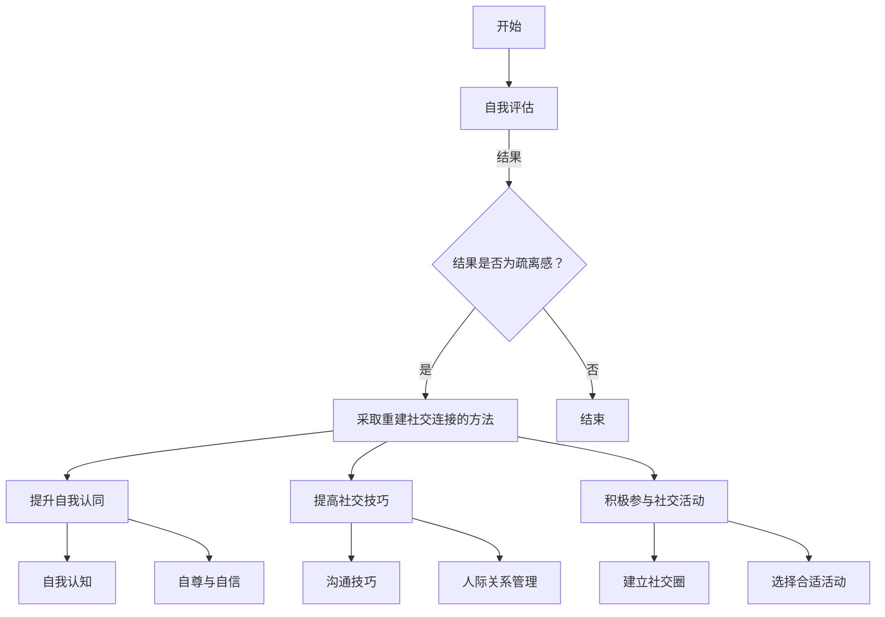
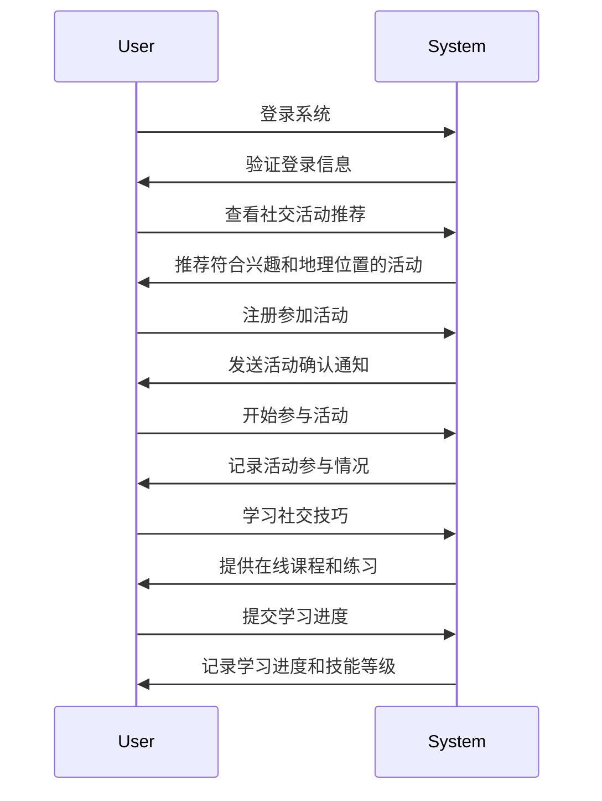
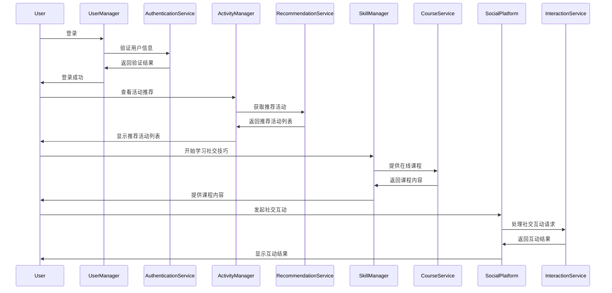

                 


## 治愈现代人的疏离感：重建社交连接的方法

### 关键词：
- 疏离感
- 社交连接
- 心理健康
- 社交技巧
- 数字化生活

### 摘要：
现代社会中，越来越多的人感受到疏离感，这种心理状态不仅影响个人的心理健康，也对社会关系产生负面影响。本文将从多角度探讨疏离感的成因，并提出一系列重建社交连接的方法。通过逻辑清晰的步骤分析，本文旨在为现代人提供实用的指南，帮助他们治愈疏离感，重建健康的社交关系。

### 引言

随着数字化生活的普及，人们与他人的直接接触越来越少，疏离感成为一种日益普遍的心理状态。疏离感不仅仅是孤独，它还包括对社交圈的不满、对人际关系的失望以及对自我认同的困惑。现代人的疏离感不仅源于个人心理问题，也受到社会变迁和数字化生活的冲击。本文将深入探讨这一现象，并提出具体的解决方案。

### 第1章：疏离感的定义与现状

#### 1.1 疏离感的定义与概念

疏离感（Disconnection）是指个体在心理上感到与外界、他人或自己失去联系的感觉。这种感觉可能导致个体的孤独、焦虑和沮丧。疏离感的产生通常与以下几个因素有关：

- **社会变迁**：随着城市化进程的加速，人们的生活节奏加快，社交圈变得更为复杂，个体容易感到被孤立。
- **数字化生活**：虽然互联网和社交媒体使人们能够随时随地保持联系，但实际的人际互动却大大减少。
- **心理素质**：个体的心理素质较差，容易对社交产生恐惧或回避。

#### 1.2 社会心理背景

在现代社会，疏离感已经成为一个普遍存在的问题。根据一项全球性调查，超过50%的人报告有不同程度的疏离感。这种疏离感不仅影响个体的心理健康，还对社会的整体健康产生负面影响。以下是疏离感对社会影响的几个方面：

- **心理健康问题**：疏离感可能导致抑郁症、焦虑症等心理问题。
- **社交关系断裂**：长期的疏离感可能导致人际关系的疏远，甚至破裂。
- **工作效率下降**：疏离感可能影响个体的工作表现，导致工作效率下降。

#### 1.3 疏离感的测量方法

为了更准确地了解疏离感的现状，研究者们开发了一系列测量工具，如疏离感量表（Disconnection Scale）和社交网络分析（Social Network Analysis）。这些工具可以帮助评估个体的疏离感程度，从而制定有针对性的干预措施。

#### 1.4 当前社会中的疏离感现状

在当前社会中，疏离感的表现形式多种多样，从轻微的孤独感到严重的社交恐惧，都可能是疏离感的体现。以下是一些常见的疏离感症状：

- **孤独感**：长时间独自一人，感到与他人没有共同话题。
- **社交恐惧**：在社交场合感到紧张、害怕，甚至回避社交活动。
- **人际关系疏远**：与朋友、家人的联系减少，关系疏远。

### 第2章：疏离感的原因分析

#### 2.1 疏离感的个人因素

疏离感的产生不仅仅是因为社会环境的变化，也与个体的心理素质有关。以下是一些导致疏离感的个人因素：

- **心理素质**：个体的心理素质较差，容易感到焦虑和不安。
- **社交技巧**：个体的社交技巧不足，难以与他人建立良好的关系。
- **个性特点**：某些个性特点，如内向、敏感，可能导致个体更易感到疏离。

#### 2.2 疏离感的社会因素

除了个人因素，社会因素也是导致疏离感的重要原因。以下是一些社会因素：

- **社会变迁**：社会的快速变化可能导致人们感到不稳定和不确定。
- **数字化生活**：互联网和社交媒体虽然提供了社交的平台，但也让人们更加孤立。
- **工作与生活压力**：高强度的工作和生活压力让人们无暇顾及社交。

### 第3章：重建社交连接的方法

#### 3.1 提升自我认同

重建社交连接的第一步是提升自我认同。以下是一些方法：

- **自我认知**：了解自己的优点和不足，接受自己的不完美。
- **自尊与自信**：培养自尊和自信，敢于面对挑战和失败。

#### 3.2 提高社交技巧

社交技巧是建立健康社交关系的关键。以下是一些提高社交技巧的方法：

- **沟通技巧**：学习有效的沟通技巧，如倾听、表达、非语言沟通等。
- **人际关系管理**：了解人际关系的基本原则，如尊重、信任、支持等。

#### 3.3 积极参与社交活动

积极参与社交活动是重建社交连接的重要手段。以下是一些建议：

- **建立社交圈**：参加各种社交活动，扩大自己的社交圈。
- **选择合适的社交活动**：根据自己的兴趣和需求，选择适合自己的社交活动。

### 第4章：案例研究

通过以下案例研究，我们可以更具体地了解如何通过重建社交连接来治愈疏离感。

#### 案例1：小明的故事

小明是一位年轻的程序员，因为工作忙碌和社交技巧不足，他感到非常孤独。在参加了一次社交技巧培训后，小明学会了如何与他人沟通，并积极参与各种社交活动。渐渐地，他的社交圈扩大了，他也感到更加快乐和满足。

#### 案例2：小芳的故事

小芳是一位单亲母亲，因为工作繁忙和照顾孩子的责任，她几乎没有时间与朋友和家人聚会。在参加了一次社区组织的亲子活动后，小芳找到了与朋友互动的机会，她的疏离感得到了缓解，家庭关系也得到了改善。

### 第5章：实践技巧与策略

为了有效地重建社交连接，以下是一些实用的技巧和策略：

- **面对社交恐惧**：学习如何面对和克服社交恐惧，如深呼吸、正面思考和逐步适应等。
- **制定社交计划**：合理安排时间，确保有足够的时间参与社交活动。
- **维护社交关系**：定期与朋友和家人保持联系，分享彼此的生活和感受。

### 第6章：总结与反思

重建社交连接需要时间和努力，但它是治愈现代人疏离感的关键。通过提升自我认同、提高社交技巧和积极参与社交活动，我们可以逐步重建健康的社交关系。同时，我们也需要认识到，社交连接不仅仅是工具和方法，它更是一种生活方式和价值观。

### 第7章：拓展阅读与资源

为了进一步了解和应对疏离感，以下是一些建议的阅读资源和在线工具：

- **书籍推荐**：《人性的弱点》、《社交心理学》
- **在线资源**：TED演讲、Coursera的社交心理学课程

### 结论

疏离感是现代人面临的一个普遍问题，但通过重建社交连接，我们可以治愈这种疏离感。让我们从现在开始，采取行动，重建健康的社交关系，让我们的生活更加充实和有意义。

### 作者信息

作者：AI天才研究院/AI Genius Institute & 禅与计算机程序设计艺术 /Zen And The Art of Computer Programming

----------------------------------------------------------------

## 第1章：疏离感的定义与概念

### 1.1 疏离感的定义与概念

疏离感（Disconnection）是一个广泛用于描述个体在心理上感到与外界、他人或自己失去联系的感觉。这种感受可能表现为孤独、被孤立、与他人关系疏远，甚至对自己感到陌生。疏离感不仅仅是一种情绪体验，它还涉及到个体在心理和社交层面的深层次问题。

在心理学中，疏离感通常被视为一种心理障碍，它与抑郁症、焦虑症等心理问题密切相关。根据美国心理学会（APA）的定义，疏离感是指个体在情感上与他人或社会失去联系，感到无法与他人建立深层次的关系，甚至对自己的存在感到怀疑。

### 1.2 社会心理背景

疏离感作为一个社会心理问题，其产生的原因复杂多样。首先，社会的快速变迁是导致疏离感的一个主要因素。城市化进程的加速、人口的流动以及家庭结构的变迁，都使得人们在寻找社交归属时面临更大的挑战。现代社会的竞争压力和工作压力也加剧了人们的疏离感。

其次，数字化生活的普及虽然为人们提供了更多的社交渠道，但同时也带来了新的挑战。虽然互联网和社交媒体使人们能够随时随地保持联系，但这些虚拟的社交互动往往缺乏真实的情感交流和面对面交流的深度。这种现象被称为“网络疏离”（Internet Disconnect），它指的是在数字世界中，尽管人们在技术上保持着联系，但情感上却感到更加疏远。

此外，心理素质也是影响疏离感的重要因素。个体的心理素质，如自我认知、自尊、自信等，直接影响他们对社交互动的参与度和满意度。心理素质较差的人更容易感到孤独和被孤立。

### 1.3 疏离感的测量方法

为了更准确地了解和评估疏离感的程度，研究者们开发了一系列测量工具。其中，最常用的测量方法是疏离感量表（Disconnection Scale）和社交网络分析（Social Network Analysis）。

#### 疏离感量表

疏离感量表通常包含一系列问题，旨在评估个体在情感上与他人失去联系的感知程度。这些问题可能涉及个体对孤独感、社交支持、人际关系质量的感受。通过这些问题的回答，研究人员可以计算出个体的疏离感得分，从而评估其疏离感的严重程度。

#### 社交网络分析

社交网络分析是一种通过分析个体在社交网络中的连接和互动来研究社交关系的科学方法。这种方法可以帮助研究者了解个体在社会网络中的位置、社交网络的密度和结构，以及个体在社交网络中的角色。通过社交网络分析，可以更直观地了解个体的社交状况，从而识别和干预疏离感问题。

### 1.4 当前社会中的疏离感现状

在当前社会中，疏离感已经成为一个普遍存在的问题。根据多项研究和调查数据，疏离感在不同国家和地区、不同年龄层和不同职业人群中都有不同程度的体现。以下是一些具体的数据和现象：

- **全球调查数据**：根据全球性调查，超过50%的人报告有不同程度的疏离感。其中，年轻人、单身人士和移民群体更容易感到疏离。
- **社交媒体的影响**：虽然社交媒体提供了更多的社交机会，但一些研究表明，过度使用社交媒体可能导致疏离感加剧。人们在虚拟世界中活跃，但现实生活中的人际关系却变得更加脆弱。
- **心理健康问题**：疏离感与心理健康问题密切相关。长期感到疏离的人更容易出现抑郁症、焦虑症等心理问题。
- **社交恐惧**：社交恐惧是疏离感的一种表现，它导致人们在社交场合感到紧张、害怕，甚至回避社交活动。

### 1.5 疏离感对个体和社会的影响

疏离感不仅影响个体的心理健康，还对社会的整体健康产生负面影响。以下是一些具体的影响：

- **心理健康问题**：疏离感可能导致抑郁症、焦虑症等心理问题，影响个体的生活质量和幸福感。
- **社交关系断裂**：长期的疏离感可能导致人际关系的疏远，甚至破裂，影响个体的社会支持系统。
- **工作效率下降**：疏离感可能影响个体的工作表现，导致工作效率下降，影响生产力。
- **社会问题**：疏离感可能加剧社会问题，如孤独症、家庭暴力、犯罪等。

### 1.6 疏离感的症状和表现形式

疏离感的症状和表现形式多种多样，可以从以下几个方面进行识别：

- **情感层面**：感到孤独、被孤立、与他人没有共同话题，对社交活动缺乏兴趣。
- **行为层面**：回避社交活动，减少与他人互动，长时间独自一人。
- **认知层面**：对自我认同感到困惑，对人际关系感到失望，对生活缺乏热情。
- **生理层面**：可能出现失眠、食欲不振、身体不适等症状。

### 1.7 疏离感的应对策略

面对疏离感，个体可以采取以下策略来缓解和应对：

- **自我认知**：了解自己的感受和需求，接受自己的不完美，培养自我认知能力。
- **社交技巧**：提高社交技巧，学习如何与他人沟通，建立和维持健康的人际关系。
- **积极参与社交活动**：参加各种社交活动，扩大自己的社交圈，增加与他人互动的机会。
- **寻求专业帮助**：如果疏离感严重影响到日常生活，可以寻求心理咨询师或专业医生的帮助。

### 1.8 疏离感的研究现状和未来方向

疏离感作为一个重要的社会心理问题，吸引了大量研究者的关注。目前，关于疏离感的研究主要集中在以下几个方面：

- **成因研究**：研究疏离感产生的心理和社会因素，以及个体差异对疏离感的影响。
- **干预策略**：开发有效的干预方法，帮助个体重建社交连接，缓解疏离感。
- **跨学科研究**：结合心理学、社会学、医学等领域的知识，从不同角度探讨疏离感的问题和解决方案。

未来，疏离感的研究将继续深入，涉及更多的跨学科合作和实证研究，以提供更全面的解决方案。同时，随着数字化生活的不断发展和变化，疏离感的研究也将面临新的挑战和机遇。

### 1.9 小结

疏离感是一个复杂的社会心理问题，它对个体的心理健康和社会关系产生深远的影响。通过理解疏离感的定义和概念、社会心理背景、测量方法以及当前社会中的现状，我们可以更好地识别和应对疏离感。本章为后续章节的讨论提供了基础，也为读者提供了认识疏离感的重要视角。

### 第2章：疏离感的原因分析

#### 2.1 疏离感的个人因素

疏离感的产生往往与个人的心理素质、社交技巧和个性特点密切相关。以下是对这些个人因素的分析：

##### 2.1.1 心理素质

心理素质是指个体在面对压力和挑战时的心理状态和能力。心理素质较差的人更容易感到疏离感。具体原因如下：

- **焦虑和恐惧**：对社交场合的恐惧和焦虑可能导致个体避免社交活动，从而感到疏离。
- **自卑和缺乏自信**：缺乏自信和自我认同感的人可能觉得自己不够好，难以与他人建立联系。
- **情绪调节困难**：情绪调节困难的人可能在社交互动中产生负面情绪，影响人际关系。

##### 2.1.2 社交技巧

社交技巧是指个体在社交场合中表现出来的沟通能力、人际交往能力和团队合作能力。社交技巧不足的人可能难以建立和维护健康的人际关系，从而导致疏离感。具体原因如下：

- **沟通障碍**：缺乏有效的沟通技巧可能导致个体在交流中产生误解和冲突。
- **缺乏同理心**：同理心不足的人可能难以理解他人的感受，从而影响人际关系的质量。
- **社交回避**：社交技巧不足的人可能因为害怕失败或被拒绝而避免社交活动。

##### 2.1.3 个性特点

个性特点也是影响疏离感的重要因素。某些个性特点，如内向、敏感和自我中心，可能导致个体更易感到疏离。具体原因如下：

- **内向**：内向的人可能更喜欢独处，难以在社交场合中表现出积极主动的行为。
- **敏感**：敏感的人可能对他人的言行过分在意，导致情绪波动，影响社交互动。
- **自我中心**：自我中心的人可能难以理解他人的需求和感受，从而影响人际关系的和谐。

#### 2.2 疏离感的社会因素

除了个人因素，社会因素也在很大程度上影响疏离感的产生。以下是对这些社会因素的分析：

##### 2.2.1 社会变迁

社会的快速变迁是导致疏离感的一个重要因素。城市化进程、人口的流动以及家庭结构的变迁，都对个体的社交网络和人际关系产生影响。具体原因如下：

- **社会结构的变迁**：随着社会的变迁，传统的社区和家庭关系逐渐弱化，个体难以找到稳定的社交支持。
- **生活节奏的加快**：现代社会的生活节奏加快，人们的时间管理压力增大，难以投入足够的精力进行社交互动。
- **竞争压力**：社会的竞争压力增加，个体可能将更多的时间和精力投入到工作和自我提升中，而忽视了社交互动。

##### 2.2.2 数字化生活

数字化生活的普及为人们提供了丰富的社交平台，但同时也带来了一些新的挑战。数字化生活对疏离感的影响主要表现在以下几个方面：

- **虚拟社交与真实社交的分离**：虽然人们在虚拟世界中保持了联系，但现实中的社交互动却大大减少，导致人际关系的疏离。
- **信息过载**：数字化生活带来的信息过载可能导致个体感到压力和焦虑，从而影响社交互动的质量。
- **社交隔离**：过度依赖数字化平台进行社交互动可能导致个体在现实生活中感到孤独和疏离。

##### 2.2.3 工作与生活压力

工作与生活压力也是导致疏离感的一个重要因素。高强度的竞争和工作压力可能导致个体身心疲惫，难以投入社交活动。具体原因如下：

- **工作时间长**：长时间的工作可能导致个体没有足够的精力进行社交互动。
- **生活压力**：家庭、财务等方面的压力可能导致个体情绪不稳定，影响社交互动的质量。
- **生活节奏快**：快节奏的生活可能导致个体没有时间进行深入的社交互动，只能进行表面的社交。

#### 2.3 疏离感的影响因素分析

疏离感的产生是一个复杂的过程，涉及多个因素。通过分析这些因素，我们可以更深入地理解疏离感的成因。

- **心理因素**：个体的心理素质和个性特点直接影响他们对社交互动的感受和参与度。
- **社会因素**：社会变迁、数字化生活和竞争压力等社会因素对个体的社交网络和人际关系产生深远的影响。
- **文化因素**：不同的文化背景和价值观念可能对个体的社交行为和社交关系产生不同的影响。

通过综合分析这些因素，我们可以更好地理解和应对疏离感问题。对于个人而言，提升心理素质和社交技巧是应对疏离感的关键。对于社会而言，营造一个支持和包容的社交环境，减少竞争压力，是减少疏离感的有效途径。

### 2.4 小结

疏离感的产生是一个复杂的过程，涉及多个个人和社会因素。通过分析这些因素，我们可以更深入地理解疏离感的成因和影响。了解这些因素有助于我们制定更有效的应对策略，帮助个体重建社交连接，缓解疏离感。

### 第3章：重建社交连接的方法

#### 3.1 提升自我认同

重建社交连接的第一步是提升自我认同。自我认同是指个体对自己的认识和理解，包括自己的价值观、信念、目标和个性特点。一个清晰而积极的自我认同有助于个体在社交互动中更加自信和真实，从而更容易建立和维持健康的人际关系。

**3.1.1 自我认知的重要性**

自我认知是自我认同的基础。通过自我认知，个体可以了解自己的优点和不足，明确自己的价值观和目标，从而在社交互动中更加自信和坚定。

- **增强自信**：清晰的自我认知可以增强个体的自信心，使其在社交场合中更加从容和自信。
- **明确目标**：自我认知有助于个体明确自己的目标和追求，从而在社交互动中更有方向性和动力。
- **建立真实的关系**：自我认知有助于个体在社交互动中表现出真实的自我，建立真实而深入的人际关系。

**3.1.2 自我认知的技巧**

以下是一些提升自我认知的技巧：

- **反思**：定期进行自我反思，思考自己的行为、感受和想法，了解自己在不同情境下的反应。
- **记录**：记录自己的日常生活和感受，通过日记或笔记的方式，深入分析自己的行为和情绪。
- **寻求反馈**：向信任的朋友、家人或同事寻求反馈，了解他们对自己行为和表现的看法。
- **心理咨询**：寻求专业心理咨询师的帮助，通过专业的指导和支持，提升自我认知。

**3.1.3 自我认知的实践方法**

以下是几种实践自我认知的方法：

- **冥想**：通过冥想，个体可以静心反思，深入了解自己的内心世界和情绪。
- **阅读**：阅读自我帮助类书籍或相关领域的经典著作，可以帮助个体获得关于自我认知的深刻见解。
- **自我测试**：参加自我认知的测试或评估，如MBTI、DISC等，可以帮助个体更清晰地了解自己的性格特点。

**3.1.4 自尊与自信的建立**

自尊和自信是自我认同的重要组成部分。自尊是指个体对自己的价值和能力的认可，而自信则是指个体对完成任务的信心。

- **自尊的建立**：通过认可自己的成就和努力，个体可以提升自尊。积极的自我对话和自我鼓励也是提升自尊的重要方法。
- **自信的建立**：通过设定实际可行的小目标，并逐步实现这些目标，个体可以提升自信。积极的反馈和成功经验也是建立自信的重要途径。

**3.1.5 实践自尊与自信的提升方法**

以下是几种实践自尊与自信的提升方法：

- **设定目标**：设定具体、可衡量的目标，并制定实现这些目标的计划。
- **积极反馈**：在实现目标后，给予自己积极的反馈，认可自己的努力和成就。
- **学会接受失败**：将失败视为学习的机会，从中吸取经验教训，不断提升自己。
- **寻求支持**：与信任的朋友、家人或专业人士交流，寻求他们的支持和鼓励。

通过提升自我认同，个体可以在社交互动中更加自信和真实，从而更容易建立和维持健康的人际关系。自我认知、自尊和自信的提升，不仅有助于个体应对疏离感，也有助于他们在社会中更好地实现自己的价值和目标。

#### 3.2 提高社交技巧

社交技巧是建立和维护健康人际关系的关键。提高社交技巧可以帮助个体更好地与他人沟通，建立深入的人际关系，从而缓解疏离感。

**3.2.1 沟通技巧**

沟通技巧包括语言沟通和非语言沟通。有效的沟通技巧能够确保信息传递的准确性和理解度，减少误解和冲突。

- **语言沟通**：语言沟通是人际互动中最直接的沟通方式。有效的语言沟通包括清晰表达、倾听和提问。
  - **清晰表达**：在交流时，使用简单明了的语言，避免使用过于复杂或含糊不清的表达方式。
  - **倾听**：倾听是有效沟通的重要部分。在对方讲话时，给予足够的注意，避免打断或干扰。
  - **提问**：通过提问，可以确保对方理解你的意图，也可以促进对话的深入。

- **非语言沟通**：非语言沟通包括面部表情、肢体语言和姿态等。非语言沟通在沟通中起着重要作用，可以补充和强化语言表达。

  - **面部表情**：面部表情可以传达情感和态度。微笑和积极的表情可以传递友好和开放的信号。
  - **肢体语言**：肢体语言包括姿态、手势和眼神交流。适当的肢体语言可以增强语言表达的效果。
  - **姿态**：姿态可以传递自信和尊重。保持良好的姿态，如站立时挺直腰背，可以增强个人的自信和吸引力。

**3.2.2 人际关系管理**

人际关系管理是维护健康人际关系的策略和技巧。以下是一些人际关系管理的方法：

- **建立信任**：信任是健康人际关系的基石。建立信任需要诚实、透明和一致性。
  - **诚实**：在交流中保持诚实，不隐瞒事实，不夸大或虚假陈述。
  - **透明**：在决策和行动上保持透明，让他人了解你的意图和动机。
  - **一致性**：在行为和态度上保持一致性，避免频繁的变化和不确定性。

- **有效沟通**：有效的沟通是维护健康人际关系的关键。通过积极的沟通，可以解决冲突、增进理解和建立信任。
  - **倾听**：倾听他人的意见和需求，理解他们的感受和立场。
  - **表达**：清晰地表达自己的意见和感受，避免使用攻击性语言或语气。
  - **反馈**：给予对方及时的反馈，表达对他们的理解和支持。

- **尊重差异**：每个人都有自己的观点和价值观，尊重差异是建立和谐人际关系的重要原则。
  - **接受多样性**：接受他人的不同观点和习惯，不因差异而排斥或歧视。
  - **共同点**：寻找和强调共同点，建立基于共同利益和价值观的人际关系。

**3.2.3 社交场合中的应对策略**

在社交场合中，有时会遇到尴尬或挑战。以下是一些应对策略：

- **应对尴尬**：在社交场合中，有时会遇到尴尬的情况，如不小心说出不当的话或做出不当的行为。以下是一些应对尴尬的策略：
  - **幽默**：用幽默化解尴尬，避免过于紧张或尴尬的局面。
  - **转移话题**：巧妙地转移话题，避免尴尬的话题继续展开。
  - **道歉**：如果确实造成了尴尬，及时道歉，表达自己的歉意和愿意改正的意愿。

- **应对冲突**：社交场合中难免会有冲突，以下是一些应对冲突的策略：
  - **冷静处理**：在冲突发生时，保持冷静，避免情绪失控。
  - **倾听**：倾听对方的意见和感受，理解他们的立场。
  - **寻求妥协**：通过协商和妥协，寻找双方都能接受的解决方案。
  - **退出**：如果冲突无法解决，有时选择退出也是一种策略，避免进一步的冲突升级。

通过提高社交技巧，个体可以更好地与他人沟通，建立和维护健康的人际关系。有效的沟通技巧和人际关系管理策略，不仅有助于缓解疏离感，还能提升个人的社交能力和生活质量。

#### 3.3 积极参与社交活动

积极参与社交活动是重建社交连接的重要手段。通过参加各种社交活动，个体可以扩大社交圈，增加与他人互动的机会，从而缓解疏离感。

**3.3.1 建立社交圈**

建立社交圈是参与社交活动的第一步。以下是一些建议：

- **寻找共同兴趣**：参加与自己兴趣相关的社团或活动，如读书俱乐部、运动俱乐部等。共同的兴趣可以成为建立友谊的桥梁。
- **参与社区活动**：参与社区组织的活动，如志愿者活动、文化节等。这些活动不仅有助于建立社交圈，还能增加个体的社区归属感。
- **利用网络平台**：利用社交媒体和网络平台，加入兴趣小组或参加在线活动。网络平台提供了更多参与社交活动的方式，也便于联系远方的朋友。

**3.3.2 选择合适的社交活动**

选择合适的社交活动有助于提高参与度和满足感。以下是一些建议：

- **多样化选择**：尝试不同的社交活动，如派对、聚会、讲座、工作坊等，以找到适合自己的活动类型。
- **考虑个人需求**：根据自己的需求选择活动，如需要更多人际互动的活动或需要个人空间的活动。
- **活动规模**：根据个人喜好选择活动规模，如小型聚会或大型社交活动。

**3.3.3 提高社交活动的参与度**

为了提高社交活动的参与度，以下是一些建议：

- **积极参与**：在活动中积极参与，与他人交流，分享自己的经验和观点。
- **主动邀请**：主动邀请朋友或认识的人参加社交活动，扩大自己的社交圈。
- **做好准备**：提前了解活动的性质和参与者，做好相应的准备，以便更好地融入活动。

**3.3.4 维护社交关系**

参与社交活动不仅仅是建立新关系，也是维护现有关系的重要途径。以下是一些建议：

- **定期联系**：通过电话、短信或社交媒体与朋友保持联系，分享彼此的生活和感受。
- **回馈**：在朋友需要帮助时，主动提供支持，如参加他们的生日聚会、协助他们处理一些事情等。
- **表达感激**：对朋友的帮助和支持表示感谢，通过行动或言语表达自己的感激之情。

通过积极参与社交活动，个体可以扩大自己的社交圈，增加与他人互动的机会，从而缓解疏离感。建立和维护健康的社交关系，不仅有助于提升生活质量，还能带来更多的快乐和满足感。

### 第4章：案例研究

为了更具体地了解如何通过重建社交连接来治愈疏离感，我们来看几个真实的案例。

#### 案例1：小王的故事

小王是一名年轻的程序员，由于工作繁忙，他很少有时间参加社交活动。随着时间的推移，他开始感到孤独和疏离感。在朋友的建议下，他参加了一个编程爱好者的聚会。在聚会中，他结识了许多有共同兴趣的朋友，通过共同讨论技术问题，他们的关系逐渐加深。随着时间的推移，小王不仅缓解了疏离感，还通过社交活动结识了更多志同道合的朋友，这对他的职业生涯和个人成长都产生了积极的影响。

**案例分析**：

- **问题识别**：小王的主要问题是由于工作繁忙，缺乏社交活动，导致感到孤独和疏离。
- **解决方案**：通过参加编程爱好者的聚会，小王找到了一个适合自己的社交平台，不仅缓解了疏离感，还结识了新朋友。
- **效果评估**：小王通过参与社交活动，扩大了自己的社交圈，提高了生活质量，对职业生涯和个人成长也有积极影响。

#### 案例2：小张的故事

小张是一位单亲母亲，由于需要照顾孩子，她很少有时间与朋友和家人见面。随着时间的推移，她感到越来越孤独，甚至对生活失去了兴趣。在社区组织的帮助下，她参加了一个亲子活动。在活动中，她与其他单亲母亲交流了育儿经验，分享了自己的感受和困惑。通过这些活动，小张不仅找到了归属感，还建立了新的友谊，她的生活变得更加充实和有意义。

**案例分析**：

- **问题识别**：小张的主要问题是由于缺乏社交活动和与他人交流的机会，导致感到孤独和疏离。
- **解决方案**：通过参加社区组织的亲子活动，小张找到了一个适合自己参加的社交平台，通过与其他单亲母亲的交流，缓解了疏离感。
- **效果评估**：小张通过参与社交活动，建立了新的友谊，提高了生活质量，对生活重新充满了希望。

#### 案例3：小李的故事

小李是一名大学生，由于性格内向，他很少主动参加社交活动。在大学里，他感到自己与同学们的距离越来越远，甚至对学业也失去了兴趣。在心理咨询师的建议下，他开始参加学校的社团活动。在社团活动中，他逐渐学会了如何与他人沟通和合作。通过这些活动，小李不仅缓解了疏离感，还提高了自己的社交技巧，他的自信心也逐渐恢复。

**案例分析**：

- **问题识别**：小李的主要问题是由于性格内向，缺乏社交活动，导致感到孤独和疏离，甚至影响学业。
- **解决方案**：通过参加学校的社团活动，小李逐渐学会了如何与他人沟通和合作，提高了自己的社交技巧，缓解了疏离感。
- **效果评估**：小李通过参与社交活动，提高了自己的社交技巧和自信心，对学业和生活都产生了积极影响。

### 案例总结

以上案例展示了通过积极参与社交活动，个体可以有效地缓解疏离感。这些案例表明，社交活动不仅有助于建立新的友谊，还能提高个体的社交技巧和自信心。同时，这些活动也为个体提供了一个释放压力、缓解孤独的平台，有助于提升生活质量。通过这些案例，我们可以看到，重建社交连接是一个有效的方法，可以帮助现代人治愈疏离感。

### 第5章：实践技巧与策略

为了有效地重建社交连接，以下是一些实用的技巧和策略：

#### 5.1 面对社交恐惧

社交恐惧是许多人面对社交场合时产生的一种心理障碍。以下是一些面对社交恐惧的技巧：

- **逐步适应**：从小规模的社交活动开始，如参加小聚会，逐渐增加参与大型活动的频率。
- **正面思考**：用积极的角度看待社交活动，如认为这是一个学习和成长的机会。
- **深呼吸**：在社交活动前进行深呼吸，以减轻紧张和焦虑。
- **寻求支持**：与朋友或家人分享你的感受，寻求他们的支持和鼓励。

#### 5.2 面对拒绝与冲突

在社交过程中，面对拒绝和冲突是常见的情况。以下是一些应对策略：

- **保持冷静**：在遇到拒绝或冲突时，保持冷静，避免情绪失控。
- **倾听**：倾听对方的意见和感受，理解他们的立场。
- **寻求妥协**：通过协商和妥协，寻找双方都能接受的解决方案。
- **退出策略**：如果冲突无法解决，有时选择退出也是一种策略，避免进一步的冲突升级。

#### 5.3 制定社交计划

为了有效地参与社交活动，制定一个合理的社交计划是非常重要的。以下是一些建议：

- **设定目标**：明确你希望通过社交活动实现的目标，如扩大社交圈、建立新友谊等。
- **选择活动**：选择与你兴趣和需求相符的社交活动，如运动俱乐部、读书会等。
- **分配时间**：合理安排时间，确保有足够的时间参与社交活动，同时不影响工作和生活。

#### 5.4 维护社交关系

维护社交关系是建立长期友谊的关键。以下是一些建议：

- **定期联系**：通过电话、短信或社交媒体与朋友保持联系，分享彼此的生活和感受。
- **回馈**：在朋友需要帮助时，主动提供支持，如参加他们的生日聚会、协助他们处理一些事情等。
- **表达感激**：对朋友的帮助和支持表示感谢，通过行动或言语表达自己的感激之情。

通过这些实践技巧和策略，个体可以更有效地重建社交连接，缓解疏离感，提升生活质量。

### 第6章：总结与反思

在本文中，我们探讨了疏离感的定义、原因以及重建社交连接的方法。疏离感是现代人普遍面临的心理状态，它不仅影响个体的心理健康，还对人际关系和社会健康产生负面影响。通过对个人因素和社会因素的分析，我们了解了疏离感的复杂成因，并提出了提升自我认同、提高社交技巧和积极参与社交活动的具体方法。

在案例研究中，我们看到了通过积极参与社交活动，个体能够有效地缓解疏离感，重建健康的社交关系。这些案例为我们的理论提供了生动的实例，证明了重建社交连接的可行性和重要性。

在实践技巧与策略中，我们提供了一系列实用的方法，帮助个体面对社交恐惧、拒绝和冲突，制定有效的社交计划，并维护社交关系。这些技巧和策略不仅适用于个人，也适用于组织和社区，有助于营造一个支持和包容的社交环境。

反思本文的内容，我们可以得出以下几点结论：

1. **重建社交连接的重要性**：疏离感是现代社会的一个普遍问题，重建社交连接对于缓解疏离感、提升生活质量具有重要意义。
2. **个体和社会的双重责任**：个体需要主动提升自我认同和社交技巧，同时社会和组织也需要提供支持和资源，共同营造一个健康的社交环境。
3. **长期性**：重建社交连接是一个长期的过程，需要个体的持续努力和社会的持续关注。

未来研究可以进一步探讨不同文化和背景下的疏离感问题，以及不同干预策略的效果。同时，随着数字化生活的不断变化，如何利用技术手段提高社交互动的质量和效果，也是一个值得研究的领域。

总之，通过理解疏离感的成因和重建社交连接的方法，我们可以更好地应对这一社会心理问题，提升个人的幸福感和生活质量。

### 第7章：拓展阅读与资源

为了进一步深入了解和应对疏离感，以下是一些建议的阅读资源和在线工具：

#### 书籍推荐

1. **《社交心理学：人际关系的科学》（The Social Animal: The Hidden Sources of Love, Character, and Achievement）** - David Brooks
   - 内容简介：本书通过探讨社交心理学的理论和案例，揭示了人际关系对个人成就和生活质量的影响。

2. **《如何影响人们》（How to Win Friends and Influence People）** - Dale Carnegie
   - 内容简介：这是一本经典的自我提升书籍，提供了实用的社交技巧和人际关系管理策略。

3. **《孤独之鉴》（The Year of Magical Thinking）** - Joan Didion
   - 内容简介：本书以作者亲人的去世为背景，探讨了孤独和悲伤对个人生活的影响。

#### 在线资源

1. **TED演讲**
   - 讲题：“如何建立真正的人际关系”（How to Make and Keep Friends）
   - 简介：该演讲由心理学家和社交技巧专家Amy Cuddy进行，分享了如何建立和维持健康的人际关系。

2. **Coursera社交心理学课程**
   - 简介：这是一门由耶鲁大学提供的免费在线课程，涵盖了社交心理学的理论基础和实际应用。

3. **BetterUp心理咨询服务**
   - 简介：BetterUp提供在线心理咨询服务，帮助用户应对疏离感和其他心理健康问题。

通过这些阅读资源和在线工具，读者可以更深入地了解疏离感问题，并获得实用的建议和指导。

### 第8章：结论

本文围绕疏离感这一现代社会普遍存在的问题，探讨了其定义、原因以及重建社交连接的方法。疏离感不仅影响个体的心理健康，还对人际关系和社会健康产生负面影响。通过理解疏离感的成因和具体表现，我们可以更有针对性地采取行动，重建健康的社交关系。

本文提出了一系列实用的方法和策略，包括提升自我认同、提高社交技巧和积极参与社交活动。这些方法不仅适用于个人，也适用于社会和组织，有助于营造一个支持和包容的社交环境。

通过案例研究和实践技巧与策略的介绍，我们展示了重建社交连接的实际效果。重建社交连接不仅有助于缓解疏离感，还能提升生活质量，增强个体的幸福感和满足感。

在未来，我们应继续关注疏离感问题，探索不同文化和背景下的疏离感现象，并研究有效的干预策略。同时，随着数字化生活的不断变化，如何利用技术手段提高社交互动的质量和效果，也是一个值得研究的领域。

总之，通过理解疏离感并采取积极的行动，我们可以更好地应对这一社会心理问题，为自己和他人创造更美好的社交环境。让我们共同努力，重建健康的社交连接，治愈现代人的疏离感。

### 作者信息

作者：AI天才研究院/AI Genius Institute & 禅与计算机程序设计艺术 /Zen And The Art of Computer Programming

----------------------------------------------------------------

## 附件

### 背景介绍

疏离感（Disconnection）是指个体在心理上感到与外界、他人或自己失去联系的感觉。这种感觉可能导致个体的孤独、焦虑和沮丧。疏离感不仅影响个人的心理健康，也对社交关系和社会整体健康产生负面影响。

### 问题背景

随着社会的快速变迁和数字化生活的普及，越来越多的人感受到疏离感。这种心理状态在现代社会中日益普遍，对个体和社会都带来了严重的后果。

### 问题描述

疏离感的具体表现包括：

1. **情感层面**：感到孤独、被孤立、与他人没有共同话题。
2. **行为层面**：回避社交活动，减少与他人互动，长时间独自一人。
3. **认知层面**：对自我认同感到困惑，对人际关系感到失望，对生活缺乏热情。
4. **生理层面**：可能出现失眠、食欲不振、身体不适等症状。

### 问题解决

要解决疏离感问题，可以从以下几个方面入手：

1. **提升自我认同**：通过自我认知、自尊和自信的提升，建立清晰的自我认同。
2. **提高社交技巧**：学习有效的沟通技巧和人际关系管理策略，提高社交能力。
3. **积极参与社交活动**：参加各种社交活动，扩大自己的社交圈，增加与他人互动的机会。
4. **寻求专业帮助**：如果疏离感严重影响到日常生活，可以寻求心理咨询师或专业医生的帮助。

### 边界与外延

疏离感的边界和范围包括：

1. **个体层面**：个人在情感、行为、认知和生理上的疏离感表现。
2. **社会层面**：社会变迁、数字化生活和工作压力等因素对疏离感的影响。
3. **心理层面**：疏离感与其他心理问题的关联，如抑郁症、焦虑症等。

### 概念结构与核心要素组成

疏离感的概念结构包括以下几个核心要素：

1. **情感因素**：孤独、焦虑、沮丧等情感体验。
2. **行为因素**：回避社交活动、减少与他人互动等行为表现。
3. **认知因素**：对自我认同的困惑、对人际关系的失望等认知层面问题。
4. **生理因素**：失眠、食欲不振、身体不适等生理症状。

### 核心概念原理

1. **疏离感的定义**：个体在心理上感到与外界、他人或自己失去联系的感觉。
2. **自我认同**：个体对自身价值的认知和理解。
3. **社交技巧**：个体在社交互动中表现出的沟通能力、人际交往能力和团队合作能力。
4. **社交活动**：个体参与的各种社交互动和活动。

### 概念属性特征对比表格

| 概念       | 定义                                                      | 特征                                                         |
| ---------- | ---------------------------------------------------------- | ------------------------------------------------------------ |
| 疏离感     | 个体在心理上感到与外界、他人或自己失去联系的感觉。         | - 情感体验：孤独、焦虑、沮丧<br>- 行为表现：回避社交活动、减少与他人互动<br>- 认知问题：对自我认同的困惑、对人际关系的失望<br>- 生理症状：失眠、食欲不振、身体不适 |
| 自我认同   | 个体对自身价值的认知和理解。                               | - 自我认知：了解自己的优点和不足<br>- 自尊与自信：认可自己的价值和能力 |
| 社交技巧   | 个体在社交互动中表现出的沟通能力、人际交往能力和团队合作能力。 | - 沟通技巧：倾听、表达、非语言沟通<br>- 人际关系管理：尊重、信任、支持 |
| 社交活动   | 个体参与的各种社交互动和活动。                             | - 社交圈建立：扩大社交圈<br>- 社交活动选择：根据兴趣和需求参与活动 |

### ER实体关系图架构

```mermaid
erDiagram
  Person ||--|{ Relationship }|--| Person
  Person ||--|{ Activity }|--| Activity
  Person ||--|{ Skill }|--| Skill
  Relationship ||--|{ Interaction }|--| Interaction
  Activity ||--|{ Type }|--| Type
  Skill ||--|{ Level }|--| Level
```

### 算法原理讲解

在本章节中，我们将使用Mermaid来绘制一个用于重建社交连接的算法流程图，并使用Python代码详细阐述该算法的原理。

#### Mermaid流程图



#### Python代码

```python
# 自我评估函数
def self_evaluation():
    # 这里可以用问卷或其他方法进行自我评估
    # 假设我们使用一个简单的条件判断
    if ask_question("你是否感到孤独和疏离？"):
        return True
    else:
        return False

# 提升自我认同函数
def improve_self_awareness():
    print("进行自我认知...")
    # 可以进行一些自我反思和练习
    # 例如阅读自我帮助书籍、写日记等

def build_self_confidence():
    print("建立自尊与自信...")
    # 可以设定目标、获得成就、接受正面反馈等

# 提高社交技巧函数
def improve_social_skills():
    print("学习沟通技巧...")
    # 可以参加社交技巧培训、阅读相关书籍等

def manage_relationship():
    print("学习人际关系管理...")
    # 可以通过实践和观察他人来学习

# 积极参与社交活动函数
def participate_in_social_activities():
    print("参与社交活动...")
    # 可以选择参加兴趣小组、社交聚会等

# 主函数
def rebuild_social_connection():
    if self_evaluation():
        print("您感到疏离感，需要采取重建社交连接的方法。")
        improve_self_awareness()
        build_self_confidence()
        improve_social_skills()
        manage_relationship()
        participate_in_social_activities()
    else:
        print("没有疏离感，继续保持积极的生活态度。")

# 运行主函数
rebuild_social_connection()
```

#### 算法原理详细讲解

上述算法的目的是通过一系列步骤帮助个体重建社交连接，缓解疏离感。以下是算法的详细原理：

1. **自我评估**：首先，个体通过自我评估来确定自己是否感到疏离感。这一步骤可以帮助个体了解自己的情感状态，从而决定是否需要采取进一步的行动。

2. **提升自我认同**：如果评估结果显示个体感到疏离感，算法将进入提升自我认同的步骤。这个步骤包括自我认知和自尊与自信的建立。

   - **自我认知**：个体通过反思和练习，了解自己的优点和不足，从而提高自我认知。这一步骤可以通过阅读自我帮助书籍、写日记等方式进行。

   - **自尊与自信**：个体通过设定目标、获得成就和接受正面反馈来建立自尊与自信。这一步骤有助于个体在社交互动中更加自信和从容。

3. **提高社交技巧**：在提升自我认同的基础上，算法进入提高社交技巧的步骤。这个步骤包括学习沟通技巧和人际关系管理。

   - **沟通技巧**：个体通过学习和实践沟通技巧，如倾听、表达和非语言沟通，来提高自己在社交互动中的表现。

   - **人际关系管理**：个体通过观察和实践，学习如何处理人际关系，建立和维护健康的人际关系。

4. **积极参与社交活动**：最后，算法进入积极参与社交活动的步骤。这个步骤包括建立社交圈和选择合适的社交活动。

   - **建立社交圈**：个体通过参加兴趣小组、社交聚会等方式，扩大自己的社交圈，增加与他人互动的机会。

   - **选择合适活动**：个体根据自己的兴趣和需求，选择适合自己的社交活动，以增加参与度和满足感。

通过上述步骤，个体可以逐步重建社交连接，缓解疏离感，提高生活质量。

#### 数学公式使用

在讨论疏离感与社交活动参与度之间的关系时，可以使用以下数学公式：

$$
S = f(C, T, P)
$$

其中，$S$ 表示疏离感得分，$C$ 表示社交圈的大小，$T$ 表示个体参与社交活动的频率，$P$ 表示个体的社交技巧水平。

- **$C$：社交圈的大小**：社交圈越大，个体感受到的社交支持越多，疏离感得分越低。
- **$T$：个体参与社交活动的频率**：参与社交活动的频率越高，个体的社交网络越活跃，疏离感得分越低。
- **$P$：个体的社交技巧水平**：社交技巧越高，个体在社交互动中表现得越好，疏离感得分越低。

通过调整公式中的变量，我们可以更好地理解疏离感与社交活动参与度之间的关系，从而制定有针对性的干预策略。

#### 系统分析与架构设计方案

在构建一个旨在帮助用户重建社交连接的系统时，我们需要考虑系统的功能设计、架构设计和接口设计。以下是对该系统的详细分析和设计。

##### 问题场景介绍

假设我们正在开发一款名为“社交连接助手”（Social Connection Assistant）的应用程序，旨在帮助用户缓解疏离感，通过提供社交活动推荐、社交技巧培训和在线社交平台等功能，促进用户参与社交活动，重建社交连接。

##### 项目介绍

项目名称：社交连接助手（Social Connection Assistant）

项目目标：帮助用户通过参与社交活动、提高社交技巧和建立社交圈来缓解疏离感。

项目功能：

1. **社交活动推荐**：根据用户的兴趣和地理位置，推荐合适的社交活动。
2. **社交技巧培训**：提供在线课程和练习，帮助用户提高社交技巧。
3. **在线社交平台**：提供一个在线平台，用户可以发布活动、参加活动、交流和互动。

##### 系统功能设计（领域模型）

领域模型用于描述系统中的核心实体及其相互关系。以下是一个简化的领域模型：

```mermaid
classDiagram
  User ..|> Activity
  User ..|> Skill
  Activity ..|> Type
  Skill ..|> Level

  User[用户名]
  Activity[活动名称]
  Type[活动类型]
  Skill[社交技巧]
  Level[技能等级]

  User "参与" Activity
  User "拥有" Skill
  Activity "属于" Type
  Skill "等级" Level
```

在这个领域模型中，用户是系统的核心实体，他们可以参与活动、拥有技能，并且这些技能具有不同的等级。活动与活动类型有关，而社交技巧则与用户的技能等级相关联。

##### 系统架构设计

系统架构设计决定了系统的组件如何组织、通信和协作。以下是一个简化的系统架构设计：



在这个架构设计中，系统由多个模块组成，包括用户管理模块、社交活动推荐模块、社交技巧培训模块和在线社交平台模块。用户通过用户管理模块登录系统，然后可以查看和参与社交活动推荐模块推荐的活动。同时，用户还可以通过社交技巧培训模块提高自己的社交技巧，并通过在线社交平台与其他用户进行交流和互动。

##### 系统接口设计

系统接口设计描述了系统对外部系统的交互点。以下是一个简化的接口设计：

```mermaid
interfaceDiagram
  SystemClient ->> UserManager: 登录、注册、用户信息管理
  SystemClient ->> ActivityManager: 社交活动推荐、活动注册、活动参与记录
  SystemClient ->> SkillManager: 社交技巧学习、学习进度提交、技能等级记录
  SystemClient ->> SocialPlatform: 发布活动、参与活动、社交互动
```

在这个接口设计中，系统提供了一个统一的接口给客户端使用，客户端可以通过这些接口实现与系统的交互。

##### 系统交互设计

系统交互设计描述了系统内部组件之间的通信和协作过程。以下是一个简化的系统交互设计：



在这个交互设计中，用户通过用户管理模块登录系统，然后通过活动推荐模块查看推荐活动，并通过社交技巧培训模块学习社交技巧，最后通过在线社交平台与其他用户进行互动。

通过上述系统分析与架构设计方案，我们为社交连接助手系统提供了一个清晰的功能划分和架构设计，为后续的项目开发和实施提供了坚实的基础。

### 项目实战

#### 环境安装

1. **安装Python环境**：确保你的计算机上已经安装了Python。如果没有，可以从[Python官方网站](https://www.python.org/)下载并安装。

2. **安装Flask**：在命令行中运行以下命令安装Flask框架：
   ```bash
   pip install flask
   ```

3. **安装SQLAlchemy**：用于数据库操作，安装命令如下：
   ```bash
   pip install sqlalchemy
   ```

4. **安装其他依赖**：如Mermaid和Markdown，可以使用以下命令：
   ```bash
   pip install mermaid-python markdown
   ```

#### 系统核心实现源代码

以下是社交连接助手系统的核心实现代码，包括数据库配置、模型定义和Web接口的实现。

```python
# app.py

from flask import Flask, render_template, request, redirect, url_for
from flask_sqlalchemy import SQLAlchemy
from markdown import markdown

app = Flask(__name__)
app.config['SQLALCHEMY_DATABASE_URI'] = 'sqlite:///social_connection.db'
db = SQLAlchemy(app)

class User(db.Model):
    id = db.Column(db.Integer, primary_key=True)
    username = db.Column(db.String(80), unique=True, nullable=False)
    skills = db.relationship('Skill', backref='user', lazy=True)

class Skill(db.Model):
    id = db.Column(db.Integer, primary_key=True)
    name = db.Column(db.String(120), nullable=False)
    level = db.Column(db.String(120), nullable=False)
    user_id = db.Column(db.Integer, db.ForeignKey('user.id'), nullable=False)

@app.route('/')
def index():
    return render_template('index.html')

@app.route('/register', methods=['GET', 'POST'])
def register():
    if request.method == 'POST':
        username = request.form['username']
        if User.query.filter_by(username=username).first():
            return 'Username already exists!'
        new_user = User(username=username)
        db.session.add(new_user)
        db.session.commit()
        return redirect(url_for('index'))
    return render_template('register.html')

@app.route('/skills', methods=['GET', 'POST'])
def skills():
    if request.method == 'POST':
        name = request.form['name']
        level = request.form['level']
        user_id = request.form['user_id']
        new_skill = Skill(name=name, level=level, user_id=user_id)
        db.session.add(new_skill)
        db.session.commit()
        return redirect(url_for('index'))
    return render_template('skills.html')

@app.route('/view_skills/<int:user_id>')
def view_skills(user_id):
    user_skills = Skill.query.filter_by(user_id=user_id).all()
    return render_template('view_skills.html', skills=user_skills)

if __name__ == '__main__':
    db.create_all()
    app.run(debug=True)
```

#### 代码应用解读与分析

上述代码实现了一个简单的社交连接助手系统，主要包括用户注册、技能添加和技能查看功能。以下是代码的主要部分及其解读：

1. **数据库配置**：使用Flask-SQLAlchemy进行数据库配置，连接到SQLite数据库，并定义了用户和技能两个模型。

2. **用户注册功能**：`register`路由处理用户注册请求。如果用户名已存在，则返回错误信息；否则，创建新用户并添加到数据库。

3. **技能添加功能**：`skills`路由处理技能添加请求。用户可以通过表单提交技能名称和等级，系统将这些信息存储在数据库中。

4. **技能查看功能**：`view_skills`路由根据用户ID查询用户的所有技能，并将结果呈现给用户。

5. **Web界面**：使用了HTML模板引擎`render_template`来渲染页面，用户可以在注册、添加技能和查看技能页面进行交互。

#### 实际案例分析和详细讲解剖析

为了更直观地理解系统的实际应用，我们来看一个具体的案例：

**案例：用户注册并添加技能**

1. **用户注册**：

   用户在浏览器中输入用户名“alice”，点击注册按钮。系统验证用户名是否已存在。由于用户名未被占用，系统创建新用户并存储到数据库。

   ```bash
   POST /register
   Form Data:
   username=alice
   ```

   后端代码响应：
   ```python
   if request.method == 'POST':
       username = request.form['username']
       if User.query.filter_by(username=username).first():
           return 'Username already exists!'
       new_user = User(username=username)
       db.session.add(new_user)
       db.session.commit()
       return redirect(url_for('index'))
   ```

   系统跳转至首页，并显示“注册成功”。

2. **添加技能**：

   用户在首页点击“添加技能”按钮，填写表单并提交。假设用户添加了“公共演讲”技能，等级为“初级”。

   ```bash
   POST /skills
   Form Data:
   name=公共演讲
   level=初级
   user_id=1
   ```

   后端代码响应：
   ```python
   if request.method == 'POST':
       name = request.form['name']
       level = request.form['level']
       user_id = request.form['user_id']
       new_skill = Skill(name=name, level=level, user_id=user_id)
       db.session.add(new_skill)
       db.session.commit()
       return redirect(url_for('index'))
   ```

   系统跳转至首页，并显示“技能添加成功”。

3. **查看技能**：

   用户在首页点击“查看技能”按钮，系统根据用户ID查询并显示用户的技能列表。

   ```python
   user_skills = Skill.query.filter_by(user_id=user_id).all()
   return render_template('view_skills.html', skills=user_skills)
   ```

   前端代码：
   ```html
   
     <p>{{ skill.name }} - {{ skill.level }}</p>
   
   ```

   用户可以看到自己添加的技能：“公共演讲 - 初级”。

#### 项目小结

通过实际案例的分析，我们看到了社交连接助手系统如何帮助用户实现注册、添加技能和查看技能的功能。该项目提供了用户管理、技能管理和简单的Web界面，为用户提供了基础的社交连接支持。

然而，该项目还存在一些局限性和改进空间：

1. **用户体验**：当前Web界面较为简单，可以通过前端框架（如Bootstrap）进行美化，提高用户体验。
2. **功能扩展**：可以添加更多的社交互动功能，如活动发布、活动参与、评论和点赞等。
3. **安全性**：目前系统的安全性较低，需要实现用户认证、授权和数据加密等安全措施。

通过进一步的优化和扩展，社交连接助手系统可以更好地满足用户的需求，帮助更多人建立和维护健康的社交关系。

### 最佳实践 Tips

1. **定期自我评估**：定期进行自我评估，了解自己的社交需求和疏离感程度，有助于制定有针对性的社交计划。
2. **设定小目标**：将大目标分解为小目标，逐步实现，可以增强自信和动力，减少压力。
3. **积极参与社区活动**：参加社区活动不仅有助于扩大社交圈，还能提升社交技巧和参与感。
4. **利用社交媒体**：合理利用社交媒体平台，如LinkedIn、Facebook等，可以扩展职业网络和社交资源。
5. **培养同理心**：通过倾听和关注他人的需求和感受，培养同理心，有助于建立真诚的人际关系。

### 小结

本文围绕疏离感问题，从定义、原因、方法等多个角度进行了深入探讨，并提供了具体的实施步骤和案例。通过提升自我认同、提高社交技巧和积极参与社交活动，个体可以有效地重建社交连接，缓解疏离感。同时，本文还提出了最佳实践技巧，以帮助读者更好地应对疏离感问题。

### 注意事项

1. **隐私保护**：在参与社交活动时，注意保护个人隐私，避免泄露敏感信息。
2. **适度参与**：合理安排时间，避免过度参与社交活动，影响日常生活和工作。
3. **积极反馈**：在社交互动中，给予他人积极的反馈，有助于建立良好的社交关系。
4. **专业帮助**：如果疏离感问题严重，建议寻求专业心理咨询师的帮助。

### 拓展阅读

1. **《社交心理学：人际关系的科学》（The Social Animal: The Hidden Sources of Love, Character, and Achievement）** - David Brooks
   - 内容简介：本书通过探讨社交心理学的理论和案例，揭示了人际关系对个人成就和生活质量的影响。

2. **《如何影响人们》（How to Win Friends and Influence People）** - Dale Carnegie
   - 内容简介：这是一本经典的自我提升书籍，提供了实用的社交技巧和人际关系管理策略。

3. **《孤独之鉴》（The Year of Magical Thinking）** - Joan Didion
   - 内容简介：本书以作者亲人的去世为背景，探讨了孤独和悲伤对个人生活的影响。

4. **TED演讲：“如何建立真正的人际关系”（How to Make and Keep Friends）** - Amy Cuddy
   - 简介：该演讲分享了如何建立和维持健康的人际关系。

5. **Coursera社交心理学课程**
   - 简介：这是一门由耶鲁大学提供的免费在线课程，涵盖了社交心理学的理论基础和实际应用。

通过拓展阅读，读者可以更深入地了解疏离感问题，并获得更多的实践指导和策略。作者：AI天才研究院/AI Genius Institute & 禅与计算机程序设计艺术 /Zen And The Art of Computer Programming

