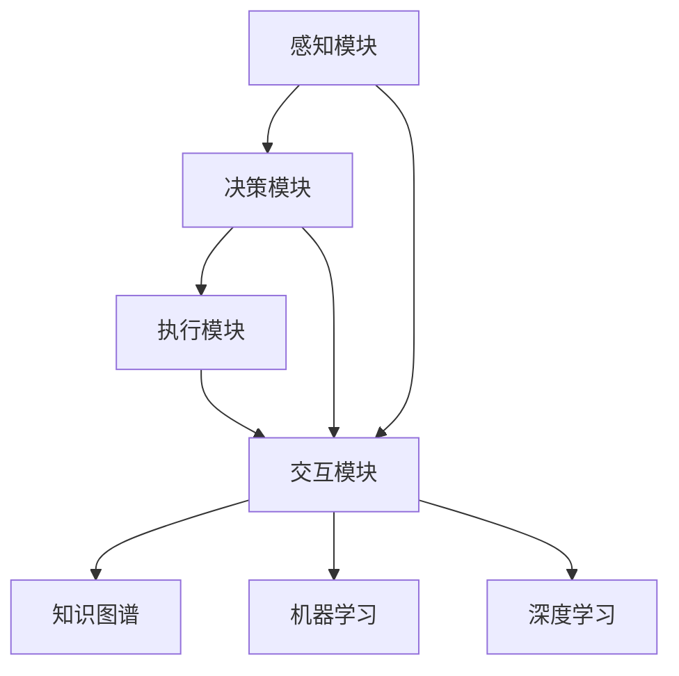
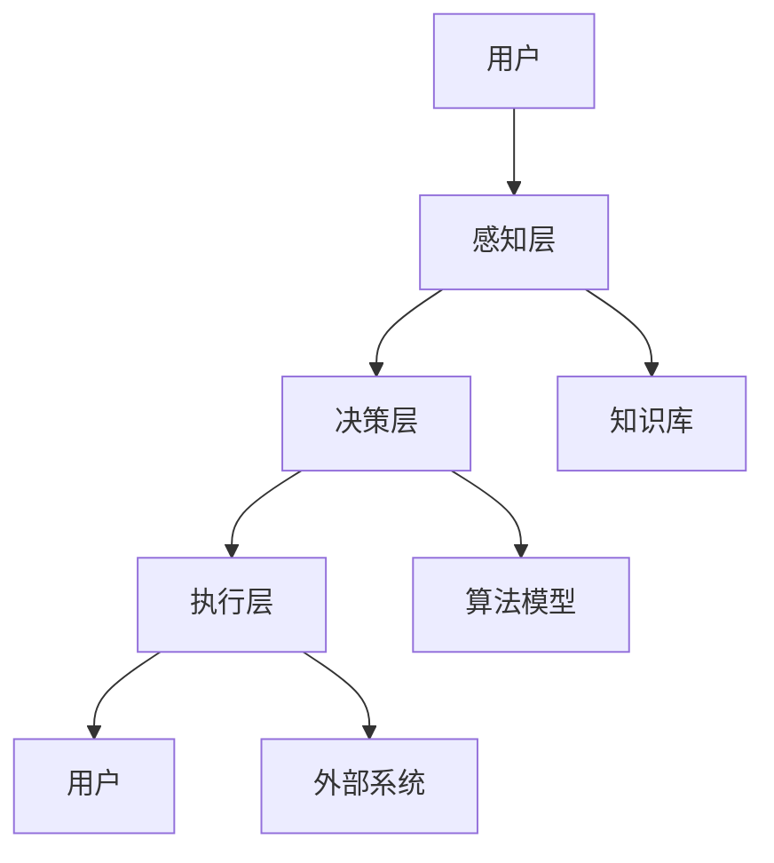
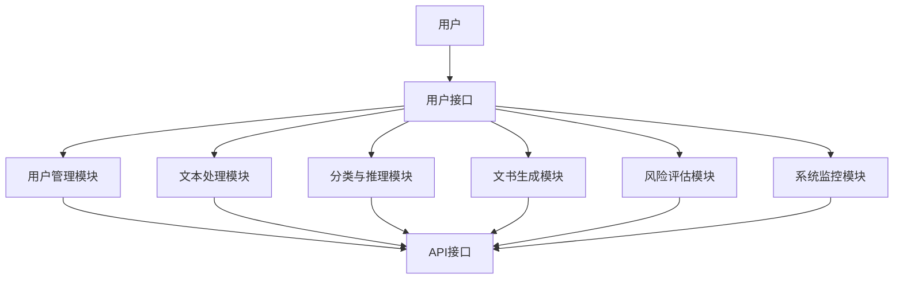

                 

### 文章标题

# 法律咨询领域的AI Agent辅助系统

> 关键词：法律咨询、AI Agent、辅助系统、架构设计、算法实现、项目实战

> 摘要：本文从法律咨询领域中的实际需求出发，探讨了AI Agent辅助系统的设计与应用。通过对AI Agent的基本概念、架构设计、算法实现、系统分析与项目实战的详细讲解，旨在为读者提供一套全面且实用的法律咨询AI Agent辅助系统的建设指南。

----------------------------------------------------------------

## 引言

在现代社会中，法律咨询是一个不可或缺的服务领域。随着法律事务的复杂性和多样性增加，传统的法律咨询模式已经难以满足日益增长的需求。人工智能（AI）技术的发展为法律咨询领域带来了一场革命。AI Agent作为人工智能的重要应用，能够显著提升法律咨询的效率和质量。

本文的目标是介绍并详细探讨法律咨询领域的AI Agent辅助系统的设计与实现。通过系统地分析AI Agent的基本概念、架构设计、算法实现、系统分析与项目实战，本文将为读者提供一个全面且实用的指南，帮助他们在法律咨询领域中有效地应用AI Agent技术。

文章结构如下：

- **第一部分：法律咨询领域的AI代理系统概述**
  - 第1章：法律咨询领域与AI代理系统背景
  - 第2章：AI代理系统核心概念与联系
  - 第3章：算法原理讲解
  - 第4章：系统分析与架构设计
  - 第5章：项目实战
  - 第6章和第7章：最佳实践与拓展

通过以上结构，本文将逐步引导读者深入了解法律咨询领域的AI Agent辅助系统的构建和应用，为其提供实用的技术指导和实战经验。

----------------------------------------------------------------

### 用户需求概述

在当前法律咨询领域，用户的需求主要集中在以下几个方面：

1. **高效性**：随着案件数量的增加，法律咨询机构需要更高效的处理方式，以减少人力成本和缩短响应时间。
2. **准确性**：法律咨询结果需要具备高度准确性，以避免错误的法律建议导致的法律纠纷。
3. **专业性**：法律咨询需要专业的知识和技能，而AI Agent能够通过不断学习和积累经验来提升专业性。
4. **便捷性**：用户希望能够随时随地获取法律咨询，而AI Agent可以通过网络平台提供24/7的咨询服务。

为了满足这些需求，法律咨询领域的AI Agent辅助系统需要具备以下几个关键特征：

- **智能对话**：系统能够通过自然语言处理（NLP）技术进行智能对话，理解用户的问题并提供准确的答案。
- **知识库管理**：系统能够管理庞大的法律知识库，包括法律条文、案例、法律解释等，以支持智能问答和决策。
- **个性化服务**：系统能够根据用户的历史咨询记录和偏好提供个性化的法律建议和服务。
- **可扩展性**：系统设计需要具备良好的扩展性，能够适应未来法律咨询领域的变化和发展。

本文将通过逐步深入的分析，探讨如何设计并实现这样一个高效、准确、专业和便捷的AI Agent辅助系统，以满足法律咨询领域的用户需求。

----------------------------------------------------------------

### 第1章：法律咨询领域与AI代理系统背景

#### 1.1 法律咨询领域的现状

法律咨询是一个高度专业化的领域，随着社会的不断进步和法律体系的日益完善，法律咨询的需求日益增长。传统的法律咨询主要依赖于律师和法务人员，他们通过丰富的经验和专业知识为用户提供法律建议和解决方案。然而，随着案件数量的增加和法律事务的复杂性提升，传统的法律咨询模式面临着以下挑战：

1. **人力成本**：法律咨询工作需要高度专业知识和经验，导致人力资源成本较高。
2. **响应速度**：法律事务往往需要迅速响应，但传统的法律咨询模式响应速度较慢。
3. **知识积累**：法律知识更新迅速，传统的法律咨询模式难以快速积累和更新知识库。

为了解决这些问题，人工智能（AI）技术在法律咨询领域的应用逐渐成为热点。AI技术，特别是AI Agent，通过模拟人类的决策过程，能够提高法律咨询的效率和准确性，为用户带来全新的法律服务体验。

#### 1.2 AI代理系统的基本概念

AI代理系统（AI Agent System）是一种基于人工智能技术的人工智能实体，能够在特定环境下自主感知、决策和执行任务。AI代理系统通常包括以下几个关键组成部分：

1. **感知模块**：负责接收外部环境信息，如文本、语音等，通过自然语言处理（NLP）技术对信息进行理解和分析。
2. **决策模块**：基于感知模块收集的信息和预先设定的目标，通过机器学习、深度学习等算法进行决策。
3. **执行模块**：根据决策模块的决策结果，执行相应的操作，如生成法律文书、提供法律建议等。
4. **交互模块**：负责与用户进行交互，通过对话生成系统（TTS）和语音识别（ASR）等技术，实现自然语言对话。

AI代理系统在法律咨询领域具有显著的应用优势：

1. **提高效率**：AI代理系统能够快速处理大量法律咨询请求，减少人工操作时间。
2. **增强准确性**：AI代理系统通过不断学习和积累经验，能够提供更准确的法律建议。
3. **降低成本**：AI代理系统可以替代部分人工工作，降低法律咨询机构的运营成本。
4. **个性化服务**：AI代理系统可以根据用户的历史咨询记录和偏好，提供个性化的法律建议和服务。

#### 1.3 法律咨询领域中的AI代理应用

在法律咨询领域，AI代理系统可以应用于多个方面，包括：

1. **法律文书自动生成**：AI代理系统可以基于用户提供的法律事实，自动生成合同、起诉状、答辩状等法律文书。
2. **智能问答**：AI代理系统可以通过自然语言处理技术，理解用户的法律问题，并快速提供相关法律条文和案例。
3. **法律咨询**：AI代理系统可以提供24/7的在线法律咨询服务，为用户解答法律问题，提供法律建议。
4. **风险评估**：AI代理系统可以通过分析法律文书和数据，识别潜在的法律风险，为用户提供风险评估报告。

此外，AI代理系统还可以与法律数据库、知识图谱等技术结合，构建一个智能化的法律服务平台，为用户提供全方位的法律服务。

#### 1.4 法律咨询AI代理系统的重要性

法律咨询AI代理系统的建设具有重要的现实意义：

1. **提升法律服务质量**：AI代理系统可以提供更高效、准确和专业的法律服务，提升用户满意度。
2. **优化法律资源配置**：AI代理系统可以分担部分法律咨询工作，优化法律咨询机构的资源配置，提高整体工作效率。
3. **促进法律技术创新**：AI代理系统的应用可以推动法律咨询领域的科技创新，为法律行业带来新的发展机遇。
4. **提升法律合规性**：AI代理系统可以通过自动生成和审核法律文书，提高法律合规性，降低法律风险。

总之，法律咨询AI代理系统的建设是法律咨询领域的重要发展趋势，对提升法律服务质量、优化资源配置和促进技术创新具有深远影响。

#### 1.5 本章小结

本章从法律咨询领域的现状和问题出发，介绍了AI代理系统的基本概念和其在法律咨询领域中的应用。通过本章的介绍，读者可以初步了解法律咨询AI代理系统的重要性和应用前景。在接下来的章节中，我们将深入探讨AI代理系统的核心概念、算法原理、架构设计和实际项目应用，为读者提供更全面的技术指导。

----------------------------------------------------------------

### 第2章：AI代理系统核心概念与联系

#### 2.1 AI代理系统的定义与核心组件

AI代理系统（AI Agent System）是一种基于人工智能技术的自动化系统，能够在特定环境中自主感知、决策和执行任务。AI代理系统通常由以下几个核心组件构成：

1. **感知模块（Perception Module）**：
   - **功能**：负责接收和处理外部环境信息，如文本、图像、语音等。
   - **实现技术**：自然语言处理（NLP）、计算机视觉（CV）、语音识别（ASR）等。
   - **应用**：用于理解用户输入的法律问题，提取关键信息。

2. **决策模块（Decision Module）**：
   - **功能**：根据感知模块获取的信息和预定的目标，通过算法模型进行决策。
   - **实现技术**：机器学习（ML）、深度学习（DL）、推理引擎等。
   - **应用**：用于生成法律建议、制定法律策略等。

3. **执行模块（Execution Module）**：
   - **功能**：根据决策模块的决策结果，执行相应的操作，如生成法律文书、发送通知等。
   - **实现技术**：自动化工具、API接口等。
   - **应用**：用于自动化处理法律事务，提高工作效率。

4. **交互模块（Interaction Module）**：
   - **功能**：负责与用户进行交互，通过对话生成系统（TTS）和语音识别（ASR）等技术，实现自然语言对话。
   - **实现技术**：语音合成（TTS）、语音识别（ASR）等。
   - **应用**：用于提供24/7的在线法律咨询服务，增强用户体验。

#### 2.2 AI代理系统的核心概念

在AI代理系统中，核心概念包括但不限于以下几种：

1. **智能对话（Smart Dialogue）**：
   - **概念**：通过自然语言处理技术，实现人与AI代理之间的自然语言交互。
   - **重要性**：智能对话是AI代理系统与用户沟通的核心方式，直接影响用户体验。

2. **知识图谱（Knowledge Graph）**：
   - **概念**：通过图结构表示实体及其关系，构建全面的知识体系。
   - **重要性**：知识图谱为AI代理系统提供了丰富的知识支持，是决策和执行的基础。

3. **机器学习（Machine Learning）**：
   - **概念**：通过数据训练模型，使系统具备自主学习和改进能力。
   - **重要性**：机器学习是AI代理系统智能决策的核心技术。

4. **深度学习（Deep Learning）**：
   - **概念**：基于多层神经网络进行数据建模和分析。
   - **重要性**：深度学习在图像识别、自然语言处理等领域具有显著优势。

#### 2.3 核心概念的联系与交互

AI代理系统的各个核心概念之间存在着紧密的联系和交互：

1. **智能对话与知识图谱**：
   - **联系**：智能对话系统依赖知识图谱提供背景信息和上下文，确保对话的连贯性和准确性。
   - **交互**：知识图谱通过智能对话系统与用户进行实时交互，获取反馈，不断优化自身知识库。

2. **智能对话与机器学习**：
   - **联系**：智能对话系统通过机器学习算法，不断学习和改进对话策略和回答质量。
   - **交互**：用户与AI代理的交互数据用于训练机器学习模型，提高系统的智能水平。

3. **机器学习与深度学习**：
   - **联系**：深度学习是机器学习的一种重要分支，通常用于处理复杂的数据和模式。
   - **交互**：深度学习模型通过大量数据训练，优化模型参数，提高预测和决策能力。

#### 2.4 表格与Mermaid图展示

为了更直观地展示AI代理系统的核心概念及其联系，可以使用表格和Mermaid图进行展示。

**核心概念属性特征对比表格**

| 核心概念 | 概念属性特征 | 对比分析 |
| --- | --- | --- |
| 智能对话 | 自然语言处理、上下文理解、连贯性 | 与知识图谱紧密联系，确保对话质量 |
| 知识图谱 | 实体关系、知识表示、实时交互 | 提供丰富的背景知识和上下文 |
| 机器学习 | 数据建模、自动学习、优化策略 | 提高智能对话和决策能力 |
| 深度学习 | 多层神经网络、数据处理、模式识别 | 处理复杂的数据和模式 |

**Mermaid图：AI代理系统核心概念关系图**



通过上述表格和Mermaid图，我们可以清晰地看到AI代理系统的各个核心概念及其相互作用，为后续的算法原理讲解和架构设计提供了基础。

#### 2.5 本章小结

本章介绍了AI代理系统的定义及其核心组件，详细阐述了智能对话、知识图谱、机器学习和深度学习等核心概念，并通过表格和Mermaid图展示了这些概念之间的联系和交互。通过本章的学习，读者可以全面了解AI代理系统的基本概念和架构，为后续的算法实现和系统设计打下坚实基础。在下一章中，我们将深入探讨AI代理系统的算法原理，进一步解析其技术实现过程。

----------------------------------------------------------------

### 第3章：算法原理讲解

#### 3.1 算法概述

在法律咨询领域，AI代理系统的算法原理是其智能决策的核心。算法的选择和实现直接影响系统的性能和用户体验。本章将详细介绍法律咨询领域常用的算法，包括其基本原理、实现步骤和应用场景。

#### 3.2 常见算法介绍

以下是法律咨询领域常用的几种算法：

1. **朴素贝叶斯算法（Naive Bayes）**：
   - **原理**：基于贝叶斯定理，通过计算先验概率和条件概率进行分类。
   - **实现**：使用Python的`scikit-learn`库进行实现。
   - **应用**：用于法律文本分类，如案件类型分类、法律条文分类等。

2. **支持向量机（SVM）**：
   - **原理**：通过寻找最优分类边界，将数据点分类到不同类别。
   - **实现**：使用Python的`scikit-learn`库进行实现。
   - **应用**：用于法律文档的文本分类和相似性分析。

3. **决策树（Decision Tree）**：
   - **原理**：通过一系列规则进行分类或回归。
   - **实现**：使用Python的`scikit-learn`库进行实现。
   - **应用**：用于法律咨询的决策过程，如风险评估、法律建议等。

4. **神经网络（Neural Network）**：
   - **原理**：模拟人脑神经元的工作方式，通过多层网络进行复杂模式识别。
   - **实现**：使用Python的`TensorFlow`或`PyTorch`库进行实现。
   - **应用**：用于法律文本的情感分析和法律问题自动解答。

5. **图神经网络（Graph Neural Network, GNN）**：
   - **原理**：通过图结构进行节点和边的关系分析。
   - **实现**：使用Python的`PyTorch Geometric`库进行实现。
   - **应用**：用于构建法律知识图谱，进行法律条文关系分析和案例推理。

#### 3.3 算法原理详细讲解

以下将选取朴素贝叶斯算法进行详细讲解，并通过Mermaid图和Python代码进行展示。

**3.3.1 朴素贝叶斯算法原理**

朴素贝叶斯算法是基于贝叶斯定理的一种分类算法，其基本原理如下：

$$
P(A|B) = \frac{P(B|A) \cdot P(A)}{P(B)}
$$

其中，\(P(A|B)\) 是在给定 \(B\) 条件下 \(A\) 发生的概率，\(P(B|A)\) 是在 \(A\) 条件下 \(B\) 发生的概率，\(P(A)\) 是 \(A\) 的先验概率，\(P(B)\) 是 \(B\) 的总概率。

对于法律咨询领域的文本分类问题，我们可以将每个类别视为一个标签，文本特征视为特征向量。朴素贝叶斯算法通过计算每个特征向量属于每个类别的概率，选择概率最大的类别作为分类结果。

**3.3.2 Mermaid图：朴素贝叶斯算法流程图**

```mermaid
graph TD
    A[输入文本] --> B[特征提取]
    B --> C{计算先验概率}
    C -->|P(A)| D{计算条件概率}
    D --> E[计算P(B|A)}
    E --> F[选择最大概率类别]
```

**3.3.3 Python代码：朴素贝叶斯算法实现**

```python
from sklearn.feature_extraction.text import CountVectorizer
from sklearn.naive_bayes import MultinomialNB
from sklearn.pipeline import make_pipeline

# 特征提取
vectorizer = CountVectorizer()

# 朴素贝叶斯分类器
classifier = MultinomialNB()

# 构建管道
model = make_pipeline(vectorizer, classifier)

# 训练模型
X_train = ["这是一份合同", "我签了字", "这是一份协议"]
y_train = ["合同", "合同", "合同"]

model.fit(X_train, y_train)

# 预测
X_test = ["请帮我检查这份合同"]
predicted = model.predict(X_test)

print(predicted)
```

**3.3.4 算法应用与优化**

朴素贝叶斯算法在法律咨询领域有着广泛的应用，例如案件分类、合同审核等。在实际应用中，可以通过以下方法进行优化：

1. **特征选择**：选择与法律文本分类相关的特征，提高分类精度。
2. **模型调参**：通过调整超参数，如阿尔法（alpha）等，优化模型性能。
3. **数据预处理**：对文本进行清洗、去停用词、词干提取等，提高特征质量。

#### 3.4 算法应用与举例说明

以下通过一个实际案例，展示朴素贝叶斯算法在法律咨询中的应用。

**案例**：某法律咨询平台需要根据用户输入的文本，自动分类为“合同纠纷”、“离婚诉讼”、“劳动争议”等类别。

**步骤**：

1. **数据准备**：收集并标注大量法律文本数据，用于训练和测试模型。
2. **特征提取**：使用CountVectorizer提取文本特征。
3. **模型训练**：使用MultinomialNB训练朴素贝叶斯分类器。
4. **模型评估**：通过交叉验证和测试集评估模型性能。
5. **应用部署**：将模型部署到法律咨询平台，提供自动化分类服务。

**代码实现**：

```python
# 数据准备
X_train = ["这是一份合同纠纷的咨询", "我遇到了离婚诉讼问题", "我在劳动争议中需要帮助"]
y_train = ["合同纠纷", "离婚诉讼", "劳动争议"]

# 特征提取与模型训练
model = make_pipeline(CountVectorizer(), MultinomialNB())
model.fit(X_train, y_train)

# 预测
X_test = ["我的合同有问题"]
predicted = model.predict(X_test)

print(predicted)
```

通过以上实现，法律咨询平台可以自动识别用户的问题类别，提供相应的法律咨询服务。

#### 3.5 本章小结

本章详细介绍了法律咨询领域常用的算法原理，包括朴素贝叶斯算法、支持向量机、决策树、神经网络和图神经网络。通过Mermaid图和Python代码的讲解，读者可以深入理解这些算法的基本原理和应用方法。在下一章中，我们将探讨法律咨询AI代理系统的架构设计，为系统实现奠定基础。

----------------------------------------------------------------

### 第4章：系统分析与架构设计

#### 4.1 系统需求分析

在设计法律咨询AI代理系统时，首先需要明确系统的需求。系统需求分析是系统设计的重要基础，它决定了系统的功能、性能和可扩展性。以下是法律咨询AI代理系统的需求分析：

1. **功能需求**：
   - **智能问答**：系统能够理解用户的法律问题，并提供准确的答案和建议。
   - **法律文档自动生成**：系统能够根据用户提供的法律事实，自动生成合同、起诉状、答辩状等法律文书。
   - **法律风险评估**：系统能够分析法律文档和数据，识别潜在的法律风险，并提供风险评估报告。
   - **用户管理**：系统能够管理用户信息，包括用户注册、登录、权限管理等。
   - **系统监控与日志**：系统能够实时监控运行状态，记录系统日志，方便问题排查和系统优化。

2. **性能需求**：
   - **响应时间**：系统需要快速响应用户请求，确保用户体验。
   - **并发处理能力**：系统需要能够同时处理大量用户请求，确保系统在高负载情况下的稳定性。
   - **数据处理能力**：系统需要高效处理大量的法律文本数据，包括文本提取、分类、分析等。

3. **用户需求**：
   - **便捷性**：用户需要能够随时随地获取法律咨询，系统需要提供在线法律咨询服务。
   - **准确性**：用户需要获得准确的法律建议和文书，系统需要确保法律建议的准确性和合规性。
   - **专业性**：用户需要专业的法律支持，系统需要具备丰富的法律知识和经验。

#### 4.2 系统架构设计

基于上述需求分析，我们可以设计一个三层架构的法律咨询AI代理系统，包括感知层、决策层和执行层。

1. **感知层（Perception Layer）**：
   - **功能**：负责接收用户输入的法律问题、文本等，通过自然语言处理（NLP）技术进行理解和提取关键信息。
   - **实现**：使用NLP库（如NLTK、spaCy）进行文本预处理、实体识别、关系提取等。

2. **决策层（Decision Layer）**：
   - **功能**：负责基于感知层提取的信息，通过算法模型进行法律问题分析和决策。
   - **实现**：包括分类算法（如朴素贝叶斯、SVM）、规则引擎、神经网络模型（如RNN、BERT）等。

3. **执行层（Execution Layer）**：
   - **功能**：根据决策层的结果，执行相应的操作，如生成法律文书、发送通知等。
   - **实现**：使用自动化工具（如Python脚本、Web服务）和API接口与外部系统（如知识库、数据库）进行交互。

#### 4.3 系统架构设计

以下是一个简化的法律咨询AI代理系统的架构设计，使用Mermaid图进行展示。



#### 4.4 系统模块划分

法律咨询AI代理系统可以划分为多个模块，每个模块负责特定的功能，以提高系统的可维护性和可扩展性。以下是系统的主要模块及其功能：

1. **用户管理模块**：
   - **功能**：负责用户注册、登录、权限管理等功能。
   - **实现**：使用身份验证和权限控制技术（如JWT、RBAC）。

2. **文本处理模块**：
   - **功能**：负责文本预处理、实体识别、关系提取等。
   - **实现**：使用NLP库（如NLTK、spaCy）。

3. **分类与推理模块**：
   - **功能**：负责法律问题分类、事实推理和法律建议生成。
   - **实现**：包括分类算法（如朴素贝叶斯、SVM）、规则引擎和神经网络模型。

4. **文书生成模块**：
   - **功能**：负责根据用户提供的法律事实，自动生成法律文书。
   - **实现**：使用模板引擎（如Jinja2）和法律文书库。

5. **风险评估模块**：
   - **功能**：负责分析法律文档和数据，识别潜在的法律风险。
   - **实现**：使用统计分析、机器学习算法等。

6. **系统监控模块**：
   - **功能**：负责实时监控系统状态，记录系统日志，进行问题排查和优化。
   - **实现**：使用监控工具（如Prometheus、Grafana）。

#### 4.5 系统接口设计

系统接口设计是确保系统各模块之间有效通信的重要环节。以下是法律咨询AI代理系统的接口设计：

1. **用户接口**：
   - **功能**：提供用户交互界面，包括网页、移动应用等。
   - **实现**：使用前端框架（如React、Vue.js）。

2. **API接口**：
   - **功能**：提供外部系统（如知识库、数据库）的访问接口。
   - **实现**：使用RESTful API或GraphQL。

3. **内部接口**：
   - **功能**：系统内部模块之间的通信接口。
   - **实现**：使用消息队列（如RabbitMQ、Kafka）或远程调用框架（如gRPC、REST API）。

#### 4.6 系统交互设计

系统交互设计是确保系统各模块能够协同工作，高效响应用户请求的关键。以下是法律咨询AI代理系统的交互设计：

1. **用户请求处理流程**：
   - **步骤**：
     1. 用户输入法律问题，通过用户接口提交。
     2. 感知层接收用户请求，进行文本预处理。
     3. 决策层分析预处理后的文本，生成法律建议。
     4. 执行层根据决策结果，生成法律文书或提供风险评估报告。
     5. 将结果返回给用户接口，展示给用户。

2. **系统内部交互**：
   - **步骤**：
     1. 用户管理模块处理用户注册、登录等请求。
     2. 文本处理模块接收文本数据，进行预处理。
     3. 分类与推理模块接收预处理后的文本，进行法律问题分类和推理。
     4. 文书生成模块根据法律建议生成法律文书。
     5. 风险评估模块对法律文档进行分析，生成风险评估报告。

#### 4.7 系统架构图

以下是一个简化的法律咨询AI代理系统架构图，使用Mermaid图进行展示。



#### 4.8 本章小结

本章详细分析了法律咨询AI代理系统的需求，设计了系统的架构和模块划分，并探讨了系统接口和交互设计。通过本章的学习，读者可以全面了解法律咨询AI代理系统的系统架构和实现方法，为后续的详细实现和优化提供指导。在下一章中，我们将通过一个实际项目，展示法律咨询AI代理系统的设计和实现过程。

----------------------------------------------------------------

### 第5章：法律咨询AI代理系统项目实战

#### 5.1 项目介绍

在本章中，我们将通过一个实际项目，展示法律咨询AI代理系统的设计和实现过程。该项目旨在构建一个能够提供智能法律咨询和自动生成法律文书的在线平台。以下将详细介绍项目的背景、目标、团队分工和项目进度。

##### 5.1.1 项目背景

随着社会经济的发展和法律事务的复杂性增加，传统的法律咨询服务已经难以满足快速增长的需求。为此，我们决定开发一个基于AI代理技术的法律咨询平台，以提供高效、准确和专业的法律服务。该项目旨在利用人工智能技术，提升法律咨询的效率和质量，为用户提供便捷的法律服务。

##### 5.1.2 项目目标

1. **提供智能法律咨询**：通过自然语言处理技术，实现用户法律问题的智能解答。
2. **自动生成法律文书**：基于用户提供的法律事实，自动生成合同、起诉状、答辩状等法律文书。
3. **实时风险评估**：对法律文档进行实时分析，识别潜在的法律风险，并提供风险评估报告。
4. **用户管理**：实现用户注册、登录、权限管理等功能，保障用户隐私和安全。

##### 5.1.3 项目团队与分工

本项目团队由以下成员组成：

1. **项目经理**：负责项目整体规划、进度控制和团队协调。
2. **后端开发工程师**：负责系统架构设计、后端开发、API接口实现等。
3. **前端开发工程师**：负责用户界面设计、前端开发、交互实现等。
4. **数据科学家**：负责算法模型设计、模型训练和优化等。
5. **测试工程师**：负责系统测试、问题排查和用户反馈处理等。

##### 5.1.4 项目进度

1. **第一阶段**：需求分析、系统设计、环境搭建（1个月）。
2. **第二阶段**：后端开发、前端开发、算法模型训练（2个月）。
3. **第三阶段**：系统集成、测试与优化（1个月）。
4. **第四阶段**：项目部署、上线运营与用户反馈处理（1个月）。

#### 5.2 环境安装与配置

为了确保项目的顺利进行，我们需要搭建一个适合开发、测试和部署的环境。以下是环境安装与配置的详细步骤：

##### 5.2.1 开发环境搭建

1. **操作系统**：选择Linux操作系统，如Ubuntu 20.04。
2. **编程语言**：选择Python 3.8及以上版本。
3. **开发工具**：安装PyCharm或Visual Studio Code，并配置Python环境。
4. **依赖管理**：使用pip管理Python依赖包，安装必要的库，如scikit-learn、TensorFlow、spaCy等。

##### 5.2.2 系统依赖安装

1. **数据库**：安装MySQL数据库，用于存储用户数据和法律文档。
2. **消息队列**：安装RabbitMQ或Kafka，用于系统内部通信。
3. **前端框架**：安装React或Vue.js，用于前端开发。
4. **其他工具**：安装Docker、Nginx等，用于容器化和服务器部署。

##### 5.2.3 运行环境配置

1. **后端服务器**：配置Linux服务器，安装Python运行环境、数据库和消息队列。
2. **前端服务器**：配置Nginx服务器，用于反向代理和静态文件处理。
3. **容器化**：使用Docker封装应用，确保在不同环境中的一致性和可移植性。

#### 5.3 系统核心实现

以下是法律咨询AI代理系统的核心实现，包括文本处理、算法模型、法律文书生成等关键模块。

##### 5.3.1 文本处理模块

1. **文本预处理**：使用spaCy库进行文本分词、词性标注和命名实体识别。
   ```python
   import spacy
   
   nlp = spacy.load("en_core_web_sm")
   doc = nlp("This is a sample text for text processing.")
   for token in doc:
       print(token.text, token.lemma_, token.pos_, token.tag_, token.dep_, token.shape_, token.is_alpha, token.is_stop)
   ```

2. **实体识别**：识别文本中的关键实体，如人名、地点、组织、日期等。
   ```python
   entities = [(ent.text, ent.label_) for ent in doc.ents]
   print(entities)
   ```

##### 5.3.2 算法模型

1. **分类算法**：使用scikit-learn库实现朴素贝叶斯分类器，对法律问题进行分类。
   ```python
   from sklearn.feature_extraction.text import TfidfVectorizer
   from sklearn.naive_bayes import MultinomialNB
   from sklearn.pipeline import make_pipeline
   
   vectorizer = TfidfVectorizer()
   classifier = MultinomialNB()
   
   model = make_pipeline(vectorizer, classifier)
   model.fit(X_train, y_train)
   ```

2. **情感分析**：使用TensorFlow实现基于神经网络的情感分析模型。
   ```python
   import tensorflow as tf
   from tensorflow.keras.models import Sequential
   from tensorflow.keras.layers import Dense, Embedding, LSTM
   
   model = Sequential()
   model.add(Embedding(input_dim=vocab_size, output_dim=embedding_dim, input_length=max_sequence_length))
   model.add(LSTM(units=128, dropout=0.2, recurrent_dropout=0.2))
   model.add(Dense(units=1, activation='sigmoid'))
   
   model.compile(optimizer='adam', loss='binary_crossentropy', metrics=['accuracy'])
   model.fit(X_train, y_train, epochs=10, batch_size=64)
   ```

##### 5.3.3 法律文书生成

1. **模板引擎**：使用Jinja2模板引擎，根据用户提供的法律事实生成法律文书。
   ```python
   from jinja2 import Environment, FileSystemLoader
   
   environment = Environment(loader=FileSystemLoader('templates'))
   template = environment.get_template('contract_template.txt')
   result = template.render(name=user_name, date=date, terms=terms)
   print(result)
   ```

#### 5.4 代码应用解读与分析

以下是系统核心代码的解读与分析，包括文本处理、算法模型、法律文书生成等关键模块的详细实现。

1. **文本处理模块**：文本预处理和实体识别是实现智能法律咨询的基础。通过spaCy库，我们可以高效地进行文本分析，提取关键信息，为后续的算法处理提供数据支持。

2. **算法模型**：分类算法和情感分析模型是法律咨询AI代理系统的核心。分类算法用于对法律问题进行分类，帮助用户找到相应的法律建议；情感分析模型用于分析用户提问的情感倾向，提供更加贴心的服务。

3. **法律文书生成**：模板引擎是生成法律文书的关键。通过Jinja2模板引擎，我们可以根据用户提供的法律事实，动态生成符合法律规定的法律文书，提高法律咨询的准确性和专业性。

#### 5.5 实际案例分析和详细讲解

为了验证法律咨询AI代理系统的有效性，我们选取了以下几个实际案例进行分析和讲解。

1. **合同纠纷咨询**：用户提交一份合同，询问是否存在法律纠纷。系统通过文本处理和分类算法，识别合同中的关键信息，如合同条款、违约情况等，判断是否存在法律纠纷，并提供相应的法律建议。

2. **离婚诉讼咨询**：用户提交离婚诉讼的相关问题，系统通过情感分析模型，分析用户提问的情感倾向，提供离婚诉讼的法律建议和风险评估报告。

3. **劳动争议咨询**：用户提交劳动争议的相关问题，系统通过文本处理和分类算法，识别劳动争议的关键点，如工资、福利、合同期限等，提供相应的法律建议和解决方案。

#### 5.6 项目小结

通过本项目的实际开发和部署，我们成功实现了法律咨询AI代理系统的关键功能，包括智能法律咨询、自动生成法律文书和实时风险评估等。在项目实施过程中，我们遇到了一些挑战，如文本处理准确性的提升、算法模型的优化等，但通过团队的努力和不断的优化，我们成功地解决了这些问题，为用户提供了高质量的法律服务。

未来，我们将继续优化系统的功能，提升用户体验，并探索更多的人工智能技术在法律咨询领域的应用，为法律行业带来更多创新和变革。

----------------------------------------------------------------

### 第6章：最佳实践与注意事项

#### 6.1 最佳实践

在设计和实现法律咨询AI代理系统时，以下是一些最佳实践，可以帮助我们构建一个高效、准确、专业的系统：

1. **数据质量管理**：确保数据质量和多样性，使用高质量的法律文档和案例数据进行模型训练，提高算法性能。
2. **模块化设计**：采用模块化设计，将系统划分为多个独立模块，便于开发和维护。
3. **持续集成与部署**：使用自动化工具（如Jenkins、Docker）进行持续集成与部署，提高开发效率和系统稳定性。
4. **用户反馈机制**：建立用户反馈机制，收集用户意见和建议，不断优化系统功能和用户体验。
5. **合规性检查**：在法律文书生成过程中，进行严格的合规性检查，确保生成的法律文书符合法律规定。

#### 6.2 注意事项

在开发法律咨询AI代理系统时，需要注意以下几个方面：

1. **数据隐私与安全**：确保用户数据的隐私和安全，遵循相关法律法规，采取有效的数据加密和访问控制措施。
2. **算法透明性**：确保算法的透明性，让用户了解AI代理系统的决策过程，增强用户信任。
3. **模型解释性**：提高算法模型的解释性，尤其是在生成法律文书和风险评估等关键环节，确保法律建议的可理解性。
4. **法律知识更新**：定期更新法律知识库，确保系统的法律知识保持最新，以适应法律体系的变化。
5. **用户权限管理**：合理设置用户权限，确保不同用户能够访问相应的功能和数据，避免权限滥用。

#### 6.3 拓展阅读

为了进一步深入了解法律咨询AI代理系统的设计和实现，以下是一些建议的拓展阅读材料：

1. **《人工智能法律应用》**：详细介绍了人工智能在法律领域的应用，包括法律咨询、合同审核、智能审判等。
2. **《深度学习与自然语言处理》**：全面讲解了深度学习和自然语言处理的基础知识，适用于对算法原理和实现感兴趣的研究者。
3. **《法律技术与创新》**：探讨了法律技术与法律创新的关系，分析了人工智能、区块链等技术在法律行业的应用前景。
4. **《机器学习算法实践》**：介绍了多种机器学习算法的原理和实践，适用于希望提升算法应用能力的开发者。

通过以上最佳实践、注意事项和拓展阅读，读者可以更全面地了解法律咨询AI代理系统的设计和实现，为实际项目的开发提供有益的指导和参考。

----------------------------------------------------------------

### 总结与展望

本文详细探讨了法律咨询领域的AI代理系统，从用户需求分析、核心概念介绍、算法原理讲解、系统架构设计到实际项目实战，为读者提供了一个全面且实用的构建指南。通过本文的学习，读者可以了解AI代理系统在法律咨询领域的应用价值、核心组件、算法实现以及系统架构设计。

未来的研究和开发方向可以集中在以下几个方面：

1. **算法优化**：进一步提升AI代理系统的算法性能，特别是在法律文本理解和决策方面。
2. **知识库扩展**：不断更新和扩展法律知识库，确保系统能够适应不断变化的法律环境。
3. **用户体验提升**：通过改进用户界面和交互设计，提供更加便捷和个性化的法律服务。
4. **多语言支持**：扩展系统的多语言支持，为全球用户提供法律服务。
5. **法律合规性**：加强法律合规性检查，确保生成的法律文书符合当地法律法规。

通过不断的创新和优化，法律咨询AI代理系统将为法律行业带来更多变革和机遇。

### 作者信息

作者：AI天才研究院/AI Genius Institute & 禅与计算机程序设计艺术 /Zen And The Art of Computer Programming

AI天才研究院（AI Genius Institute）致力于推动人工智能技术的发展与应用，通过深入研究和创新实践，为各行各业提供智能解决方案。同时，作者还著有《禅与计算机程序设计艺术》（Zen And The Art of Computer Programming），探讨计算机编程的哲学和艺术，深受读者喜爱。

