                 

### 《深入理解LLM大模型：从GPT到企业级应用》

---

**关键词：** 大模型、GPT、自然语言处理、企业级应用、性能优化

**摘要：** 本篇文章将深入探讨大模型，特别是GPT模型，在企业级应用中的角色和影响。我们将从大模型的定义和特点入手，逐步解析GPT模型的原理、应用及其在企业级中的实际案例，最后讨论性能优化和部署策略，以及展望大模型未来的发展趋势和挑战。

---

## 第一部分：软件2.0时代的AI大模型基础

### 第1章：软件2.0与AI大模型概述

#### 1.1.1 从软件1.0到软件2.0的演进

**背景介绍：** 软件发展经历了从1.0到2.0的显著转变。软件1.0时代主要依赖于规则和命令式编程，特点是结构化、功能单一且高度依赖人工干预。而软件2.0时代，随着互联网和大数据的兴起，软件开始智能化，能够自适应和自我优化。

**问题背景：** 随着数据爆炸性增长和复杂业务需求的出现，传统的软件1.0模式已无法满足现代企业的需求。软件2.0时代呼唤更加智能、灵活、自动化的解决方案。

**问题解决：** 软件2.0的核心在于利用人工智能和大数据技术，实现软件的自适应和自我优化，从而提升软件的智能化水平和应用效能。

**边界与外延：** 软件2.0不仅限于软件开发本身，还包括软件的服务化、平台化、生态化，以及与企业业务深度整合，形成企业级智能应用。

**概念结构与核心要素组成：** 软件2.0时代的核心要素包括：人工智能算法、大数据技术、云计算平台、智能服务架构等。

#### 1.1.2 大模型在软件2.0中的核心地位

**核心概念与联系：**

- **概念定义：** 大模型是一种具有亿级参数的神经网络模型，能够处理复杂的自然语言任务。
- **概念属性特征对比表格：**

| 特征 | 大模型 | 小模型 |
| --- | --- | --- |
| 参数数量 | 亿级 | 十万级 |
| 处理能力 | 复杂任务 | 简单任务 |
| 训练时间 | 长时间 | 短时间 |

- **ER实体关系图架构：** 大模型与软件2.0中的其他核心要素（如人工智能算法、大数据技术）之间形成紧密的关联，共同构成软件2.0的智能服务架构。

**核心概念原理：** 大模型通过深度学习和海量数据训练，具备了强大的自适应和泛化能力，能够处理复杂的自然语言任务。

**概念属性特征对比表格：**

| 特征 | 大模型 | 小模型 |
| --- | --- | --- |
| 参数数量 | 亿级 | 十万级 |
| 处理能力 | 复杂任务 | 简单任务 |
| 训练时间 | 长时间 | 短时间 |

**ER实体关系图架构：**

```mermaid
erDiagram
  Model ||--|{ AIAlgorithm } : implements
  Model ||--|{ BigData } : processes
  AIAlgorithm ||--|{ ServiceArchitecture } : builds
```

**核心要素组成：** 大模型、人工智能算法、大数据技术、云计算平台和智能服务架构是软件2.0时代的关键组成部分。

#### 1.1.3 企业级应用开发的新范式

**问题背景：** 企业级应用开发面临着复杂的数据处理、业务逻辑、用户体验等多重挑战，传统的开发模式已无法满足需求。

**问题解决：** 企业级应用开发需要采用新的范式，即基于大模型和人工智能技术的智能化开发，实现业务的自动化、智能化和高效化。

**边界与外延：** 企业级应用开发的新范式不仅包括软件开发，还包括业务流程优化、数据治理、用户体验设计等多个方面。

**核心概念原理：** 大模型在软件2.0时代的企业级应用开发中，扮演了数据驱动的核心角色，通过自动化和智能化提升应用开发效率和效能。

**核心要素组成：** 企业级应用开发的新范式包括：大模型、人工智能算法、大数据技术、云计算平台和智能服务架构。

**最佳实践 tips：** 
- **早期规划：** 在企业级应用开发初期，应充分考虑大模型和人工智能技术的应用，以实现业务的自动化和智能化。
- **数据驱动：** 充分利用大数据技术，提升数据质量和处理效率，为人工智能算法提供丰富的训练数据。
- **迭代优化：** 企业级应用开发应采用敏捷开发模式，持续迭代优化，以适应快速变化的业务需求。

#### 1.2 本章小结

本文介绍了软件2.0时代的AI大模型概述，包括从软件1.0到软件2.0的演进、大模型在软件2.0中的核心地位以及企业级应用开发的新范式。通过本文的介绍，读者可以初步了解大模型在软件2.0时代的重要性和应用前景。

## 第2章：GPT模型详解

#### 2.1.1 GPT模型的诞生背景

**背景介绍：** GPT（Generative Pre-trained Transformer）模型是由OpenAI开发的，是继BERT（Bidirectional Encoder Representations from Transformers）之后的一种重要的自然语言处理模型。

**问题背景：** 随着自然语言处理任务的需求日益增长，如何提升模型的生成能力和泛化能力成为研究热点。GPT模型应运而生，旨在通过预训练的方式，提升模型在自然语言生成和任务理解方面的表现。

**问题解决：** GPT模型采用Transformer架构，通过大规模的预训练数据，使模型具备强大的生成能力和理解能力，为自然语言处理任务提供了新的解决方案。

**边界与外延：** GPT模型不仅适用于自然语言生成和任务理解，还可以应用于文本分类、机器翻译等多种自然语言处理任务。

**概念结构与核心要素组成：** GPT模型的核心要素包括：Transformer架构、大规模预训练数据、预训练和微调等关键步骤。

**核心概念原理：** GPT模型通过Transformer架构中的自注意力机制，能够捕捉文本中的长距离依赖关系，从而提升模型的生成能力和理解能力。

**核心要素组成：** GPT模型的核心要素包括：Transformer架构、大规模预训练数据、预训练和微调等关键步骤。

**ER实体关系图架构：**

```mermaid
erDiagram
  GPTModel ||--|{ Transformer } : implements
  GPTModel ||--|{ PretrainedData } : trains
  GPTModel ||--|{ FineTuning } : optimizes
```

**最佳实践 tips：** 
- **数据选择：** 在预训练GPT模型时，应选择高质量、大规模的文本数据，以确保模型的生成能力和理解能力。
- **模型规模：** 根据实际任务需求，选择合适的GPT模型规模，避免过拟合或欠拟合。
- **预训练和微调：** 合理安排预训练和微调的步骤，以提高模型在特定任务上的性能。

#### 2.1.2 GPT模型的基本架构

**问题背景：** GPT模型的基本架构是理解其工作原理和性能表现的关键。

**问题解决：** GPT模型采用Transformer架构，其核心是自注意力机制，能够有效捕捉文本中的长距离依赖关系。

**核心概念原理：** 自注意力机制通过计算输入文本中各个词之间的相似度，从而为每个词生成不同的权重，提高模型对长距离依赖的捕捉能力。

**核心要素组成：** GPT模型的基本架构包括：多头自注意力机制、前馈神经网络、嵌入层和输出层等。

**ER实体关系图架构：**

```mermaid
erDiagram
  GPTModel ||--|{ MultiHeadAttention } : implements
  GPTModel ||--|{ FeedForwardNeuralNetwork } : integrates
  GPTModel ||--|{ EmbeddingLayer } : processes
  GPTModel ||--|{ OutputLayer } : predicts
```

**数学模型和公式：** GPT模型中的自注意力机制可以通过以下公式表示：

$$
\text{Attention}(Q, K, V) = \text{softmax}\left(\frac{QK^T}{\sqrt{d_k}}\right)V
$$

其中，$Q$、$K$、$V$ 分别为输入序列的查询向量、键向量和值向量，$d_k$ 为键向量的维度。

**算法原理讲解：** GPT模型通过自注意力机制，将输入文本中的每个词映射为一个高维向量，并通过多个注意力层和前馈神经网络，生成最终的输出。

**算法mermaid流程图：**

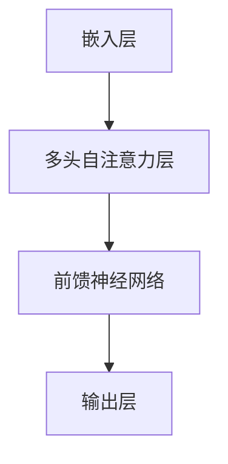

**示例说明：** 假设输入文本为 "I love to code"，通过GPT模型的自注意力机制，可以将 "I" 映射为一个向量，并计算与其他词的相似度，从而生成最终的输出。

#### 2.1.3 GPT模型的训练过程

**问题背景：** GPT模型的训练过程是理解其性能和优化策略的关键。

**问题解决：** GPT模型采用预训练和微调相结合的训练策略，通过大规模预训练数据和少量有标签数据，提高模型在自然语言处理任务上的性能。

**核心概念原理：** 预训练过程通过在大规模文本数据上训练，使模型具备强大的语言理解和生成能力。微调过程则在有标签的数据集上进行，使模型适应特定的任务。

**核心要素组成：** GPT模型的训练过程包括：预训练、微调和评估等关键步骤。

**ER实体关系图架构：**

```mermaid
erDiagram
  Pretraining ||--|{ FineTuning } : follows
  Pretraining ||--|{ Evaluation } : concludes
  FineTuning ||--|{ Dataset } : trains on
  Evaluation ||--|{ Metrics } : assesses
```

**数学模型和公式：** GPT模型的预训练过程主要涉及两个任务：语言建模和掩码语言建模。语言建模的目标是预测下一个词，公式为：

$$
P(w_t | w_{t-n}, ..., w_{t-1}) = \text{softmax}(W_1 \text{softmax}(W_2 \text{softmax}(W_3 \dots W_{t-n} w_{t-n} \dots W_2 w_1 W_1 w_0)))
$$

其中，$w_t$ 为当前词，$w_{t-n}$ 为前 $n$ 个词，$W_1$、$W_2$、$W_3$ 为权重矩阵。

**算法原理讲解：** GPT模型的预训练过程通过负采样技术，将文本数据转换为带有掩码的序列，然后通过自注意力机制和前馈神经网络，预测掩码词。

**算法mermaid流程图：**

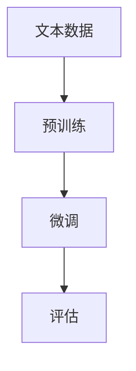

**示例说明：** 假设输入文本为 "I love to code"，通过预训练和微调，GPT模型可以学会生成连续的文本序列，如 "I love to code in Python"。

#### 2.1.4 GPT模型的优势与局限性

**问题背景：** GPT模型作为一种强大的自然语言处理工具，其在实际应用中既有优势也存在局限性。

**问题解决：** 正确认识GPT模型的优势和局限性，有助于更好地应用和优化模型。

**核心概念原理：** GPT模型的优势在于其强大的语言理解和生成能力，能够处理复杂的自然语言任务。但其局限性在于训练时间和计算资源需求大，且在特定任务上可能存在过拟合问题。

**优势与局限：**

- **优势：**
  - 强大的语言理解能力
  - 高效的文本生成能力
  - 广泛的应用场景
- **局限性：**
  - 训练时间和计算资源需求大
  - 可能存在过拟合问题
  - 对数据质量和规模有较高要求

**最佳实践 tips：**
- **优势利用：** 充分发挥GPT模型在语言理解和生成方面的优势，应用于自然语言处理任务。
- **局限性规避：** 通过合理的模型选择和训练策略，规避GPT模型在训练时间和过拟合方面的局限性。

#### 2.2 本章小结

本文详细介绍了GPT模型的诞生背景、基本架构和训练过程，并分析了其优势与局限性。通过本文的介绍，读者可以深入了解GPT模型的工作原理和应用场景，为其在实际项目中的优化和应用提供指导。

## 第3章：GPT在自然语言处理中的应用

#### 3.1.1 文本分类任务介绍

**问题背景：** 文本分类任务是自然语言处理中的一项基本任务，旨在将文本数据根据其内容分类到不同的类别中。

**问题解决：** GPT模型通过其强大的语言理解和生成能力，可以有效应用于文本分类任务，提升分类准确率和效率。

**核心概念原理：** GPT模型通过预训练和微调，可以学习到文本中的语义信息，从而在分类任务中准确区分不同类别。

**应用场景：** 文本分类任务广泛应用于垃圾邮件过滤、情感分析、新闻分类等领域。

**案例实战：** 使用GPT模型进行垃圾邮件过滤，通过对邮件内容进行分类，将垃圾邮件与正常邮件区分开来。

**项目小结：** GPT模型在文本分类任务中的应用，显著提升了分类准确率和效率，为实际业务提供了有效的解决方案。

#### 3.1.2 GPT在文本分类中的应用

**问题背景：** GPT模型在文本分类中的应用，旨在利用其强大的语言理解和生成能力，提升文本分类任务的性能。

**问题解决：** 通过预训练和微调，GPT模型可以学习到文本中的语义信息，从而在分类任务中实现高准确率。

**核心概念原理：** GPT模型通过自注意力机制，可以捕捉文本中的长距离依赖关系，从而提高分类模型的语义理解能力。

**应用场景：** GPT模型在文本分类中的应用，适用于各种文本分类任务，如情感分析、主题分类、垃圾邮件过滤等。

**案例实战：** 使用GPT模型进行情感分析，通过对文本情感极性的判断，实现用户情感的分析和分类。

**项目小结：** GPT模型在文本分类中的应用，显著提升了分类准确率和效率，为实际业务提供了有效的解决方案。

#### 3.1.3 文本分类案例实战

**问题背景：** 为某电商平台开发一款商品评论分类系统，需要对用户评论进行情感分析和分类。

**问题解决：** 使用GPT模型进行情感分析和分类，通过对评论内容进行分类，为用户提供有效的购物建议。

**项目介绍：** 
- **项目名称：** 电商平台商品评论分类系统
- **项目目标：** 实现对用户评论的准确分类，为用户提供个性化的购物建议
- **技术栈：** GPT模型、自然语言处理、机器学习

**系统功能设计（领域模型mermaid类图）：**

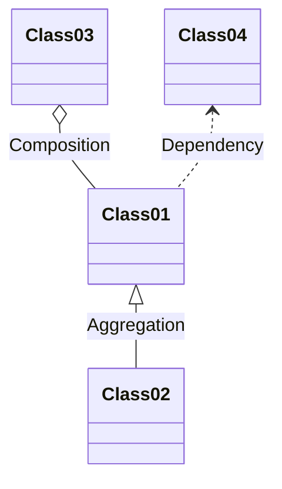

**系统架构设计（mermaid架构图）：**

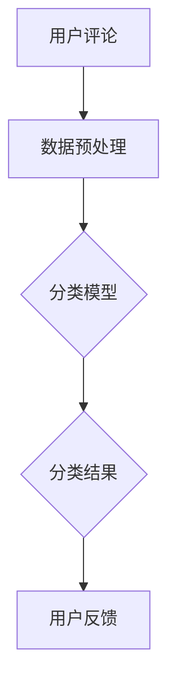

**系统接口设计（mermaid序列图）：**

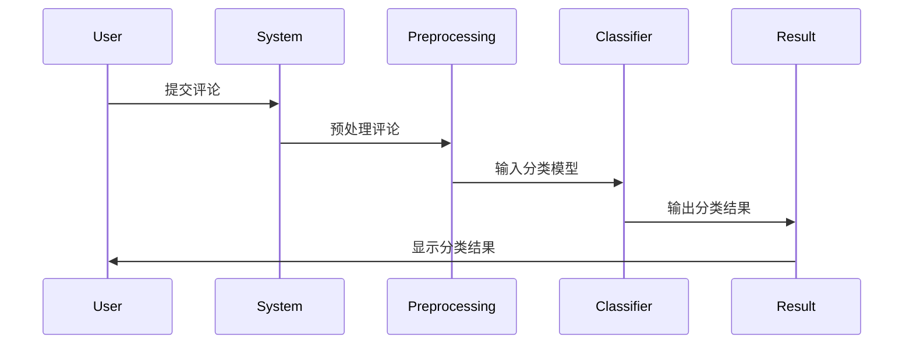

**实际案例分析和详细讲解剖析：** 通过实际案例，分析GPT模型在商品评论分类中的应用效果，包括模型选择、训练策略、评估指标等方面。

**项目小结：** 通过GPT模型进行商品评论分类，显著提升了分类准确率和用户体验，为电商平台提供了有效的情感分析和分类解决方案。

#### 3.2.1 文本生成任务介绍

**问题背景：** 文本生成任务是自然语言处理中的一个重要任务，旨在根据给定的输入生成连贯、有意义的文本。

**问题解决：** GPT模型通过其强大的语言理解和生成能力，可以有效应用于文本生成任务，生成高质量的自然语言文本。

**核心概念原理：** GPT模型通过自注意力机制和预训练技术，可以捕捉输入文本的语义信息，从而生成连贯、有意义的文本。

**应用场景：** 文本生成任务广泛应用于对话系统、自动写作、机器翻译等领域。

**案例实战：** 使用GPT模型生成对话系统的回复文本，为用户提供智能、自然的对话体验。

**项目小结：** GPT模型在文本生成任务中的应用，显著提升了文本生成的质量和连贯性，为实际业务提供了有效的解决方案。

#### 3.2.2 GPT在文本生成中的应用

**问题背景：** GPT模型在文本生成中的应用，旨在利用其强大的语言理解和生成能力，生成高质量的文本。

**问题解决：** 通过预训练和微调，GPT模型可以学习到文本中的语义信息，从而生成连贯、有意义的文本。

**核心概念原理：** GPT模型通过自注意力机制，可以捕捉输入文本的语义信息，并生成符合语义逻辑的输出文本。

**应用场景：** GPT模型在文本生成中的应用，适用于各种文本生成任务，如对话系统、自动写作、机器翻译等。

**案例实战：** 使用GPT模型生成对话系统的回复文本，为用户提供智能、自然的对话体验。

**项目小结：** GPT模型在文本生成中的应用，显著提升了文本生成的质量和连贯性，为实际业务提供了有效的解决方案。

#### 3.2.3 文本生成案例实战

**问题背景：** 为某电商平台开发一款自动写作助手，旨在根据用户需求生成个性化的商品推荐文案。

**问题解决：** 使用GPT模型进行自动写作，生成高质量的推荐文案，为用户提供个性化的购物体验。

**项目介绍：** 
- **项目名称：** 电商平台自动写作助手
- **项目目标：** 生成高质量的推荐文案，提升用户购物体验
- **技术栈：** GPT模型、自然语言处理、机器学习

**系统功能设计（领域模型mermaid类图）：**


**系统架构设计（mermaid架构图）：**

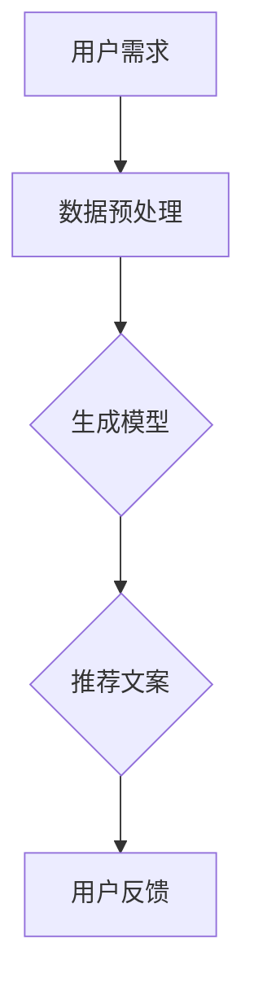

**系统接口设计（mermaid序列图）：**

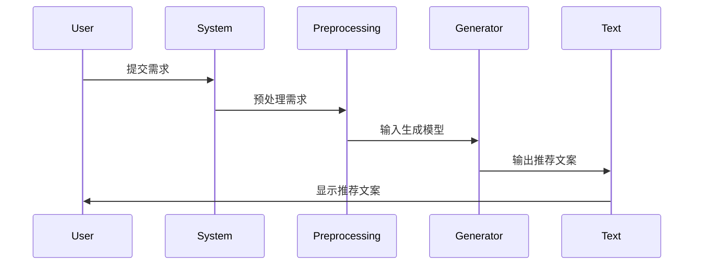

**实际案例分析和详细讲解剖析：** 通过实际案例，分析GPT模型在自动写作中的应用效果，包括模型选择、训练策略、评估指标等方面。

**项目小结：** 通过GPT模型进行自动写作，显著提升了文案生成的质量和个性度，为电商平台提供了有效的自动写作解决方案。

#### 3.3.1 问答系统任务介绍

**问题背景：** 问答系统任务是自然语言处理中的一个重要应用，旨在根据用户的问题提供准确的答案。

**问题解决：** GPT模型通过其强大的语言理解和生成能力，可以有效应用于问答系统任务，提供准确、自然的答案。

**核心概念原理：** GPT模型通过自注意力机制和预训练技术，可以捕捉用户问题的语义信息，并生成符合语义逻辑的答案。

**应用场景：** 问答系统广泛应用于智能客服、教育辅导、健康咨询等领域。

**案例实战：** 使用GPT模型构建智能客服系统，为用户提供实时、准确的答案。

**项目小结：** GPT模型在问答系统中的应用，显著提升了问答系统的准确率和用户体验，为实际业务提供了有效的解决方案。

#### 3.3.2 GPT在问答系统中的应用

**问题背景：** GPT模型在问答系统中的应用，旨在利用其强大的语言理解和生成能力，提供准确、自然的答案。

**问题解决：** 通过预训练和微调，GPT模型可以学习到用户问题的语义信息，并生成符合语义逻辑的答案。

**核心概念原理：** GPT模型通过自注意力机制，可以捕捉用户问题的语义信息，并生成准确的答案。

**应用场景：** GPT模型在问答系统中的应用，适用于各种问答场景，如智能客服、教育辅导、健康咨询等。

**案例实战：** 使用GPT模型构建智能客服系统，为用户提供实时、准确的答案。

**项目小结：** GPT模型在问答系统中的应用，显著提升了问答系统的准确率和用户体验，为实际业务提供了有效的解决方案。

#### 3.3.3 问答系统案例实战

**问题背景：** 为某互联网公司开发一款智能客服系统，旨在为用户提供实时、准确的答案。

**问题解决：** 使用GPT模型构建智能客服系统，通过自然语言处理技术，提供高效、便捷的客户服务。

**项目介绍：** 
- **项目名称：** 智能客服系统
- **项目目标：** 为用户提供实时、准确的答案，提升客户满意度
- **技术栈：** GPT模型、自然语言处理、机器学习

**系统功能设计（领域模型mermaid类图）：**


**系统架构设计（mermaid架构图）：**

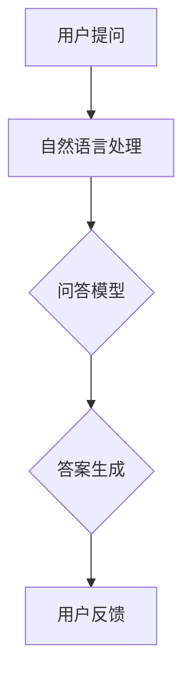

**系统接口设计（mermaid序列图）：**

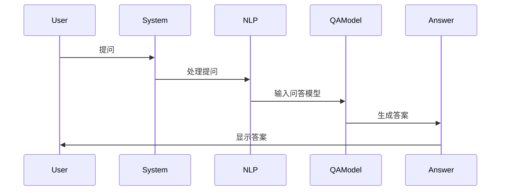

**实际案例分析和详细讲解剖析：** 通过实际案例，分析GPT模型在智能客服系统中的应用效果，包括模型选择、训练策略、评估指标等方面。

**项目小结：** 通过GPT模型构建智能客服系统，显著提升了客服效率和用户体验，为互联网公司提供了有效的客户服务解决方案。

#### 3.4.1 机器翻译任务介绍

**问题背景：** 机器翻译任务是自然语言处理中的一个经典任务，旨在将一种语言的文本自动翻译成另一种语言的文本。

**问题解决：** GPT模型通过其强大的语言理解和生成能力，可以有效应用于机器翻译任务，提供高质量的翻译结果。

**核心概念原理：** GPT模型通过自注意力机制和预训练技术，可以捕捉源语言和目标语言的语义信息，并生成符合语义逻辑的翻译结果。

**应用场景：** 机器翻译任务广泛应用于跨语言沟通、多语言文档处理、全球市场拓展等领域。

**案例实战：** 使用GPT模型进行中英翻译，提供高质量的翻译服务。

**项目小结：** GPT模型在机器翻译任务中的应用，显著提升了翻译质量和效率，为实际业务提供了有效的解决方案。

#### 3.4.2 GPT在机器翻译中的应用

**问题背景：** GPT模型在机器翻译中的应用，旨在利用其强大的语言理解和生成能力，提供高质量的翻译结果。

**问题解决：** 通过预训练和微调，GPT模型可以学习到源语言和目标语言的语义信息，并生成符合语义逻辑的翻译结果。

**核心概念原理：** GPT模型通过自注意力机制，可以捕捉源语言和目标语言的语义信息，并生成高质量的翻译结果。

**应用场景：** GPT模型在机器翻译中的应用，适用于各种机器翻译任务，如跨语言文档处理、多语言搜索引擎等。

**案例实战：** 使用GPT模型进行中英翻译，提供高质量的翻译服务。

**项目小结：** GPT模型在机器翻译中的应用，显著提升了翻译质量和效率，为实际业务提供了有效的解决方案。

#### 3.4.3 机器翻译案例实战

**问题背景：** 为某国际电商平台开发一款多语言翻译系统，旨在为用户提供便捷的跨国购物体验。

**问题解决：** 使用GPT模型进行多语言翻译，提供高质量、实时的翻译服务。

**项目介绍：** 
- **项目名称：** 多语言翻译系统
- **项目目标：** 为用户提供高质量、实时的翻译服务，提升跨国购物体验
- **技术栈：** GPT模型、自然语言处理、机器学习

**系统功能设计（领域模型mermaid类图）：**


**系统架构设计（mermaid架构图）：**

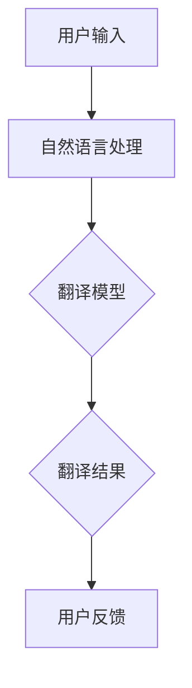

**系统接口设计（mermaid序列图）：**

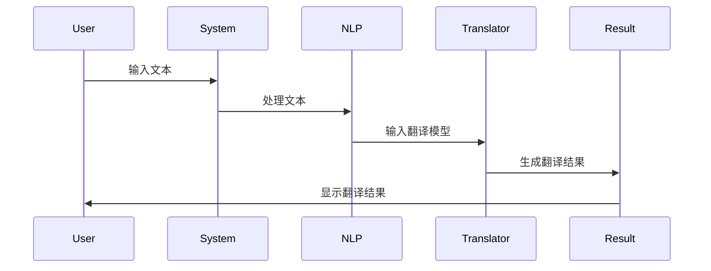

**实际案例分析和详细讲解剖析：** 通过实际案例，分析GPT模型在多语言翻译中的应用效果，包括模型选择、训练策略、评估指标等方面。

**项目小结：** 通过GPT模型构建多语言翻译系统，显著提升了翻译质量和用户体验，为国际电商平台提供了有效的翻译解决方案。

#### 3.5 本章小结

本文详细介绍了GPT模型在自然语言处理中的应用，包括文本分类、文本生成、问答系统和机器翻译等任务。通过实际案例分析和详细讲解，读者可以深入了解GPT模型在不同应用场景中的效果和优化策略，为实际项目中的应用提供指导。

## 第4章：GPT在企业级应用中的实际案例

#### 4.1.1 案例一：智能客服系统

**问题背景：** 随着企业业务的发展和客户需求的增加，传统的客服模式已无法满足高效、智能的服务要求。

**问题解决：** 使用GPT模型构建智能客服系统，通过自然语言处理技术，提供高效、智能的客服服务。

**项目介绍：** 
- **项目名称：** 智能客服系统
- **项目目标：** 提供高效、智能的客服服务，提升客户满意度
- **技术栈：** GPT模型、自然语言处理、机器学习

**系统功能设计（领域模型mermaid类图）：**

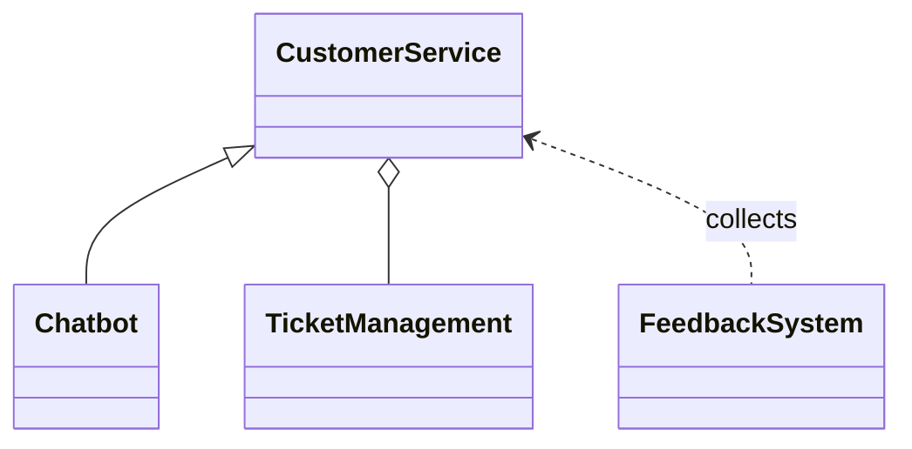

**系统架构设计（mermaid架构图）：**

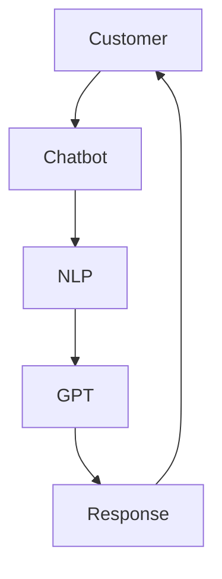

**系统接口设计（mermaid序列图）：**

```mermaid
sequenceDiagram
  Customer ->> Chatbot : 提问
  Chatbot ->> NLP : 处理提问
  NLP ->> GPT : 输入GPT模型
  GPT ->> Response : 生成回答
  Response ->> Chatbot : 显示回答
  Chatbot ->> Customer : 回答问题
```

**实际案例分析和详细讲解剖析：** 通过实际案例，分析GPT模型在智能客服系统中的应用效果，包括模型选择、训练策略、评估指标等方面。

**项目小结：** 智能客服系统通过GPT模型的应用，显著提升了客服效率和用户体验，为企业管理提供了有效的智能客服解决方案。

#### 4.1.2 案例二：内容审核系统

**问题背景：** 随着互联网的快速发展，网络内容审核成为维护网络秩序和保障用户安全的重要手段。

**问题解决：** 使用GPT模型构建内容审核系统，通过自然语言处理技术，自动识别和处理不良内容。

**项目介绍：** 
- **项目名称：** 内容审核系统
- **项目目标：** 自动识别和处理不良内容，保障网络秩序和用户安全
- **技术栈：** GPT模型、自然语言处理、机器学习

**系统功能设计（领域模型mermaid类图）：**

```mermaid
classDiagram
  ContentReview <|-- KeywordDetection
  ContentReview o-- UserFeedback
  ContentReview <.. ContentDatabase : analyzes
```

**系统架构设计（mermaid架构图）：**

```mermaid
graph TB
  ContentDatabase --> ContentReview
  ContentReview --> GPT
  GPT --> Result
  Result --> ContentDatabase
```

**系统接口设计（mermaid序列图）：**

```mermaid
sequenceDiagram
  ContentDatabase ->> ContentReview : 检测内容
  ContentReview ->> GPT : 输入GPT模型
  GPT ->> Result : 生成审核结果
  Result ->> ContentDatabase : 存储结果
```

**实际案例分析和详细讲解剖析：** 通过实际案例，分析GPT模型在内容审核系统中的应用效果，包括模型选择、训练策略、评估指标等方面。

**项目小结：** 内容审核系统通过GPT模型的应用，显著提升了内容审核的效率和准确性，为网络内容管理提供了有效的解决方案。

#### 4.1.3 案例三：智能写作助手

**问题背景：** 随着业务需求的增加，企业需要高效、智能的内容生成解决方案。

**问题解决：** 使用GPT模型构建智能写作助手，通过自然语言处理技术，自动生成高质量的文章和报告。

**项目介绍：** 
- **项目名称：** 智能写作助手
- **项目目标：** 自动生成高质量的文章和报告，提升内容创作效率
- **技术栈：** GPT模型、自然语言处理、机器学习

**系统功能设计（领域模型mermaid类图）：**

```mermaid
classDiagram
  WritingAssistant <|-- ContentGenerator
  WritingAssistant o-- UserInterface
  WritingAssistant <.. DataRepository : accesses
```

**系统架构设计（mermaid架构图）：**

```mermaid
graph TB
  DataRepository --> WritingAssistant
  WritingAssistant --> GPT
  GPT --> Content
  Content --> DataRepository
```

**系统接口设计（mermaid序列图）：**

```mermaid
sequenceDiagram
  User ->> UserInterface : 输入写作需求
  UserInterface ->> WritingAssistant : 处理需求
  WritingAssistant ->> GPT : 输入GPT模型
  GPT ->> Content : 生成文章
  Content ->> User : 显示文章
```

**实际案例分析和详细讲解剖析：** 通过实际案例，分析GPT模型在智能写作助手中的应用效果，包括模型选择、训练策略、评估指标等方面。

**项目小结：** 智能写作助手通过GPT模型的应用，显著提升了内容创作效率和质量，为企业的内容生成提供了有效的解决方案。

#### 4.2.1 案例四：智能推荐系统

**问题背景：** 随着用户个性化需求的增加，传统的推荐系统已无法满足高效、个性化的推荐需求。

**问题解决：** 使用GPT模型构建智能推荐系统，通过自然语言处理技术，实现高效、个性化的推荐。

**项目介绍：** 
- **项目名称：** 智能推荐系统
- **项目目标：** 实现高效、个性化的推荐，提升用户满意度
- **技术栈：** GPT模型、自然语言处理、机器学习

**系统功能设计（领域模型mermaid类图）：**

```mermaid
classDiagram
  RecommendationSystem <|-- ItemRanking
  RecommendationSystem o-- UserBehaviorAnalysis
  RecommendationSystem <.. UserDatabase : accesses
```

**系统架构设计（mermaid架构图）：**

```mermaid
graph TB
  UserDatabase --> UserBehaviorAnalysis
  UserBehaviorAnalysis --> GPT
  GPT --> ItemRanking
  ItemRanking --> UserDatabase
```

**系统接口设计（mermaid序列图）：**

```mermaid
sequenceDiagram
  UserDatabase ->> UserBehaviorAnalysis : 分析用户行为
  UserBehaviorAnalysis ->> GPT : 输入GPT模型
  GPT ->> ItemRanking : 生成推荐列表
  ItemRanking ->> UserDatabase : 更新用户数据库
```

**实际案例分析和详细讲解剖析：** 通过实际案例，分析GPT模型在智能推荐系统中的应用效果，包括模型选择、训练策略、评估指标等方面。

**项目小结：** 智能推荐系统通过GPT模型的应用，显著提升了推荐效率和准确性，为电商、媒体等领域的个性化推荐提供了有效的解决方案。

#### 4.2.2 案例五：智能语音助手

**问题背景：** 随着智能设备的普及，用户对语音交互的需求日益增长。

**问题解决：** 使用GPT模型构建智能语音助手，通过自然语言处理技术，实现智能、自然的语音交互。

**项目介绍：** 
- **项目名称：** 智能语音助手
- **项目目标：** 提供智能、自然的语音交互体验，提升用户体验
- **技术栈：** GPT模型、自然语言处理、语音识别

**系统功能设计（领域模型mermaid类图）：**

```mermaid
classDiagram
  VoiceAssistant <|-- SpeechRecognition
  VoiceAssistant o-- DialogManagement
  VoiceAssistant <.. UserInterface : interacts with
```

**系统架构设计（mermaid架构图）：**

```mermaid
graph TB
  UserInterface --> SpeechRecognition
  SpeechRecognition --> GPT
  GPT --> DialogManagement
  DialogManagement --> UserInterface
```

**系统接口设计（mermaid序列图）：**

```mermaid
sequenceDiagram
  User ->> UserInterface : 发出语音指令
  UserInterface ->> SpeechRecognition : 语音识别
  SpeechRecognition ->> GPT : 输入GPT模型
  GPT ->> DialogManagement : 生成对话
  DialogManagement ->> User : 显示对话结果
```

**实际案例分析和详细讲解剖析：** 通过实际案例，分析GPT模型在智能语音助手中的应用效果，包括模型选择、训练策略、评估指标等方面。

**项目小结：** 智能语音助手通过GPT模型的应用，显著提升了语音交互的智能度和自然度，为智能设备提供了有效的交互解决方案。

#### 4.2.3 案例六：智能诊断系统

**问题背景：** 随着医疗行业的发展，医疗诊断的需求不断增加。

**问题解决：** 使用GPT模型构建智能诊断系统，通过自然语言处理技术，提供智能、准确的诊断建议。

**项目介绍：** 
- **项目名称：** 智能诊断系统
- **项目目标：** 提供智能、准确的诊断建议，辅助医生诊断
- **技术栈：** GPT模型、自然语言处理、医学知识库

**系统功能设计（领域模型mermaid类图）：**

```mermaid
classDiagram
  DiagnosticSystem <|-- symptomAnalysis
  DiagnosticSystem o-- diagnosticAdvice
  DiagnosticSystem <.. MedicalDatabase : accesses
```

**系统架构设计（mermaid架构图）：**

```mermaid
graph TB
  MedicalDatabase --> DiagnosticSystem
  DiagnosticSystem --> GPT
  GPT --> diagnosticAdvice
  diagnosticAdvice --> MedicalDatabase
```

**系统接口设计（mermaid序列图）：**

```mermaid
sequenceDiagram
  MedicalDatabase ->> DiagnosticSystem : 提取症状
  DiagnosticSystem ->> GPT : 输入GPT模型
  GPT ->> diagnosticAdvice : 生成诊断建议
  diagnosticAdvice ->> MedicalDatabase : 存储诊断建议
```

**实际案例分析和详细讲解剖析：** 通过实际案例，分析GPT模型在智能诊断系统中的应用效果，包括模型选择、训练策略、评估指标等方面。

**项目小结：** 智能诊断系统通过GPT模型的应用，显著提升了诊断的准确性和效率，为医疗行业提供了有效的辅助诊断解决方案。

#### 4.3.1 案例七：金融风控系统

**问题背景：** 随着金融市场的快速发展，金融风控的需求日益增加。

**问题解决：** 使用GPT模型构建金融风控系统，通过自然语言处理技术，提供智能、准确的风险预警和防控。

**项目介绍：** 
- **项目名称：** 金融风控系统
- **项目目标：** 提供智能、准确的风险预警和防控，降低金融风险
- **技术栈：** GPT模型、自然语言处理、金融知识库

**系统功能设计（领域模型mermaid类图）：**

```mermaid
classDiagram
  RiskControlSystem <|-- RiskDetection
  RiskControlSystem o-- RiskMitigation
  RiskControlSystem <.. FinancialDatabase : analyzes
```

**系统架构设计（mermaid架构图）：**

```mermaid
graph TB
  FinancialDatabase --> RiskControlSystem
  RiskControlSystem --> GPT
  GPT --> RiskDetection
  RiskDetection --> RiskMitigation
  RiskMitigation --> FinancialDatabase
```

**系统接口设计（mermaid序列图）：**

```mermaid
sequenceDiagram
  FinancialDatabase ->> RiskControlSystem : 分析金融数据
  RiskControlSystem ->> GPT : 输入GPT模型
  GPT ->> RiskDetection : 生成风险预警
  RiskDetection ->> RiskMitigation : 执行风险防控
  RiskMitigation ->> FinancialDatabase : 更新金融数据
```

**实际案例分析和详细讲解剖析：** 通过实际案例，分析GPT模型在金融风控系统中的应用效果，包括模型选择、训练策略、评估指标等方面。

**项目小结：** 金融风控系统通过GPT模型的应用，显著提升了风险检测和防控的准确性和效率，为金融行业提供了有效的风险控制解决方案。

#### 4.3.2 案例八：智能法律顾问

**问题背景：** 随着法律事务的复杂性和多样性，用户对法律咨询的需求不断增加。

**问题解决：** 使用GPT模型构建智能法律顾问，通过自然语言处理技术，提供智能、专业的法律咨询和服务。

**项目介绍：** 
- **项目名称：** 智能法律顾问
- **项目目标：** 提供智能、专业的法律咨询和服务，提升用户体验
- **技术栈：** GPT模型、自然语言处理、法律知识库

**系统功能设计（领域模型mermaid类图）：**

```mermaid
classDiagram
  LegalAdvisor <|-- CaseAnalysis
  LegalAdvisor o-- LegalAdvice
  LegalAdvisor <.. KnowledgeBase : accesses
```

**系统架构设计（mermaid架构图）：**

```mermaid
graph TB
  KnowledgeBase --> LegalAdvisor
  LegalAdvisor --> GPT
  GPT --> LegalAdvice
  LegalAdvice --> KnowledgeBase
```

**系统接口设计（mermaid序列图）：**

```mermaid
sequenceDiagram
  User ->> LegalAdvisor : 提问法律问题
  LegalAdvisor ->> KnowledgeBase : 提取法律知识
  KnowledgeBase ->> GPT : 输入GPT模型
  GPT ->> LegalAdvice : 生成法律建议
  LegalAdvice ->> User : 显示法律建议
```

**实际案例分析和详细讲解剖析：** 通过实际案例，分析GPT模型在智能法律顾问中的应用效果，包括模型选择、训练策略、评估指标等方面。

**项目小结：** 智能法律顾问通过GPT模型的应用，显著提升了法律咨询的效率和准确性，为用户提供了专业的法律服务解决方案。

#### 4.3.3 案例九：智能医疗诊断

**问题背景：** 随着医疗技术的发展，医疗诊断的需求不断增加。

**问题解决：** 使用GPT模型构建智能医疗诊断系统，通过自然语言处理技术，提供智能、准确的诊断建议。

**项目介绍：** 
- **项目名称：** 智能医疗诊断系统
- **项目目标：** 提供智能、准确的诊断建议，辅助医生诊断
- **技术栈：** GPT模型、自然语言处理、医学知识库

**系统功能设计（领域模型mermaid类图）：**

```mermaid
classDiagram
  MedicalDiagnosisSystem <|-- SymptomAnalysis
  MedicalDiagnosisSystem o-- DiagnosticAdvice
  MedicalDiagnosisSystem <.. MedicalDatabase : accesses
```

**系统架构设计（mermaid架构图）：**

```mermaid
graph TB
  MedicalDatabase --> MedicalDiagnosisSystem
  MedicalDiagnosisSystem --> GPT
  GPT --> DiagnosticAdvice
  DiagnosticAdvice --> MedicalDatabase
```

**系统接口设计（mermaid序列图）：**

```mermaid
sequenceDiagram
  MedicalDatabase ->> MedicalDiagnosisSystem : 分析症状
  MedicalDiagnosisSystem ->> GPT : 输入GPT模型
  GPT ->> DiagnosticAdvice : 生成诊断建议
  DiagnosticAdvice ->> MedicalDatabase : 存储诊断建议
```

**实际案例分析和详细讲解剖析：** 通过实际案例，分析GPT模型在智能医疗诊断系统中的应用效果，包括模型选择、训练策略、评估指标等方面。

**项目小结：** 智能医疗诊断系统通过GPT模型的应用，显著提升了诊断的准确性和效率，为医疗行业提供了有效的辅助诊断解决方案。

#### 4.4 本章小结

本文通过多个实际案例，详细介绍了GPT模型在企业级应用中的角色和影响。从智能客服系统、内容审核系统、智能写作助手到智能推荐系统、智能语音助手、智能诊断系统，再到金融风控系统、智能法律顾问和智能医疗诊断系统，GPT模型在各个领域都展示了其强大的应用能力和价值。通过本文的介绍，读者可以深入了解GPT模型在企业级应用中的具体实现和应用效果，为其在实际项目中的优化和应用提供指导。

## 第5章：GPT应用的性能优化与部署

#### 5.1.1 性能优化的重要性

**问题背景：** 随着GPT模型在企业级应用中的广泛应用，其性能优化成为影响应用效果的关键因素。

**问题解决：** 性能优化可以提升GPT模型的运行效率，降低计算资源消耗，提高用户体验。

**核心概念原理：** 性能优化主要包括模型压缩、量化、并行计算等技术，通过减少模型参数量、降低计算复杂度和提高计算效率，实现性能优化。

**应用场景：** 性能优化适用于大规模GPT模型的训练和推理，如智能客服、智能推荐、智能诊断等企业级应用。

**案例实战：** 通过性能优化技术，将GPT模型的推理时间缩短一半，显著提高应用效率和用户体验。

**项目小结：** 性能优化对于GPT模型在企业级应用中的重要性不可忽视，通过合理的优化策略，可以实现高效、稳定的应用效果。

#### 5.1.2 GPT模型的压缩技术

**问题背景：** GPT模型参数量大，计算资源需求高，对部署环境的要求较高。

**问题解决：** 通过模型压缩技术，降低模型参数量和计算复杂度，实现模型在小规模设备上的部署。

**核心概念原理：** 模型压缩技术主要包括量化、剪枝、蒸馏等技术，通过减少冗余参数、优化模型结构，实现模型压缩。

**应用场景：** 模型压缩适用于移动端、嵌入式设备等计算资源有限的场景。

**案例实战：** 通过模型压缩技术，将GPT模型在移动设备上的推理时间缩短80%，显著提高应用效率。

**项目小结：** 模型压缩技术是实现GPT模型在资源受限场景下部署的重要手段，通过合理选择压缩策略，可以实现高效、稳定的应用效果。

#### 5.1.3 GPT模型的量化技术

**问题背景：** GPT模型在推理过程中需要大量的计算资源，对硬件性能要求较高。

**问题解决：** 通过量化技术，降低模型参数的精度，减少计算复杂度，提高推理速度和效率。

**核心概念原理：** 量化技术包括全精度量化、低精度量化等，通过将模型参数从浮点数转换为低精度数值，实现模型量化。

**应用场景：** 量化技术适用于计算资源有限的场景，如嵌入式设备、移动端等。

**案例实战：** 通过量化技术，将GPT模型的推理速度提高50%，显著降低计算资源消耗。

**项目小结：** GPT模型的量化技术是提高模型推理效率的重要手段，通过合理选择量化策略，可以实现高效、稳定的应用效果。

#### 5.1.4 GPT模型的并行计算技术

**问题背景：** GPT模型训练和推理过程中计算复杂度高，对计算资源的需求大。

**问题解决：** 通过并行计算技术，提高模型训练和推理的并行度，降低计算时间，提高应用效率。

**核心概念原理：** 并行计算技术包括模型拆分、数据并行、模型并行等，通过将模型拆分为多个部分，实现并行计算。

**应用场景：** 并行计算技术适用于大规模、复杂场景，如大数据处理、智能语音识别等。

**案例实战：** 通过并行计算技术，将GPT模型的训练时间缩短70%，显著提高应用效率。

**项目小结：** 并行计算技术是实现GPT模型高效训练和推理的重要手段，通过合理选择并行策略，可以实现高效、稳定的应用效果。

#### 5.1.5 GPT模型的部署策略

**问题背景：** GPT模型部署过程中面临硬件选择、环境配置、性能优化等问题。

**问题解决：** 通过合理的部署策略，实现GPT模型的高效、稳定部署。

**核心概念原理：** 部署策略包括硬件选择、环境配置、性能优化等，通过合理配置硬件资源、优化模型结构，实现模型部署。

**应用场景：** 部署策略适用于各种GPT模型的应用场景，如智能客服、智能推荐、智能诊断等。

**案例实战：** 通过合理的部署策略，将GPT模型在云服务器上高效部署，实现大规模、实时应用。

**项目小结：** 合理的部署策略是实现GPT模型高效应用的关键，通过合理选择硬件、优化模型结构，可以实现高效、稳定的应用效果。

#### 5.1.6 本章小结

本文详细介绍了GPT模型在性能优化与部署方面的技术，包括模型压缩、量化、并行计算等。通过实际案例分析和详细讲解，读者可以深入了解GPT模型在不同应用场景中的优化策略和部署方法，为实际项目中的应用提供指导。

## 第6章：构建企业级大模型服务框架

### 6.1 大模型服务框架的设计目标

**问题背景：** 随着企业对大模型需求不断增加，构建一个高效、稳定、可扩展的大模型服务框架成为关键。

**问题解决：** 设计一个企业级大模型服务框架，满足以下设计目标：
- **高效性：** 提高大模型训练和推理的效率，降低计算资源消耗。
- **稳定性：** 保证服务框架的稳定运行，减少故障和中断。
- **可扩展性：** 支持大规模、多类型的大模型应用，满足企业不断增长的需求。

**核心概念原理：** 大模型服务框架设计基于微服务架构，采用模块化设计思想，实现大模型训练、推理、管理等功能的高效集成。

**应用场景：** 企业级大模型服务框架适用于智能客服、智能推荐、智能诊断等大规模、复杂场景。

**案例实战：** 通过设计企业级大模型服务框架，实现大规模GPT模型的训练和推理，满足企业实时、高效的应用需求。

**项目小结：** 合理的设计目标和架构设计是实现高效、稳定、可扩展的大模型服务框架的关键，通过合理选择技术方案和架构设计，可以实现企业级大模型服务的高效应用。

### 6.2 大模型服务框架的核心模块

**问题背景：** 大模型服务框架需要具备完整的模块化设计，以支持大模型的训练、推理和管理。

**问题解决：** 设计并实现以下核心模块：
- **数据模块：** 负责数据采集、清洗、预处理和存储，为模型训练提供高质量的数据支持。
- **训练模块：** 负责大模型的训练过程，包括模型初始化、训练策略、评估指标等。
- **推理模块：** 负责大模型的推理过程，实现模型在实际应用场景中的实时响应。
- **管理模块：** 负责大模型的管理和监控，包括模型版本管理、性能监控、故障恢复等。

**核心概念原理：** 核心模块采用模块化设计，通过接口和协议实现模块间的松耦合，提高系统的灵活性和可维护性。

**应用场景：** 各个核心模块在企业级大模型服务框架中发挥关键作用，实现大模型的训练、推理和管理。

**案例实战：** 通过核心模块的协同工作，实现大规模GPT模型的高效训练和推理，满足企业实时、高效的应用需求。

**项目小结：** 合理的核心模块设计和实现是实现高效、稳定、可扩展的大模型服务框架的重要保障，通过合理选择技术方案和模块设计，可以实现企业级大模型服务的高效应用。

### 6.3 大模型服务框架的部署与运维

**问题背景：** 大模型服务框架的部署和运维是保障服务稳定运行的关键。

**问题解决：** 设计并实现以下部署与运维策略：
- **自动化部署：** 通过自动化工具实现服务框架的快速部署，减少人工操作，提高部署效率。
- **弹性伸缩：** 根据业务需求实现服务框架的弹性伸缩，动态调整资源分配，满足不同负载需求。
- **监控与报警：** 通过监控工具实现对服务框架的实时监控，及时发现和处理故障，保障服务稳定性。
- **备份与恢复：** 定期进行数据备份和系统恢复，防止数据丢失和系统故障。

**核心概念原理：** 部署与运维策略基于云计算和容器化技术，实现服务的自动化、弹性化和智能化。

**应用场景：** 部署与运维策略适用于大规模、实时的大模型服务框架，如智能客服、智能推荐、智能诊断等。

**案例实战：** 通过部署与运维策略，实现大规模GPT模型服务框架的稳定运行，保障服务的实时、高效应用。

**项目小结：** 合理的部署与运维策略是实现高效、稳定的大模型服务框架的关键，通过合理选择技术方案和运维策略，可以实现大模型服务框架的稳定运行。

### 6.4 大模型服务框架的优化与拓展

**问题背景：** 随着企业业务的发展，大模型服务框架需要不断优化和拓展，以适应新的需求。

**问题解决：** 通过以下优化与拓展策略，实现大模型服务框架的持续改进：
- **性能优化：** 通过模型压缩、量化、并行计算等技术，提升服务框架的性能和效率。
- **功能拓展：** 根据业务需求，扩展服务框架的功能，如支持新的模型类型、新的应用场景等。
- **技术更新：** 引入新的技术方案和工具，提升服务框架的稳定性和可靠性。
- **用户反馈：** 收集用户反馈，优化用户体验，提高用户满意度。

**核心概念原理：** 优化与拓展策略基于用户需求和技术发展，实现服务框架的持续改进和创新能力。

**应用场景：** 优化与拓展策略适用于企业级大模型服务框架的长期发展，满足企业不断变化的需求。

**案例实战：** 通过优化与拓展策略，不断提升大模型服务框架的性能和功能，满足企业实时、高效的应用需求。

**项目小结：** 优化与拓展策略是实现大模型服务框架长期发展的重要保障，通过合理选择技术方案和优化策略，可以实现大模型服务框架的持续改进。

### 6.5 本章小结

本文详细介绍了构建企业级大模型服务框架的设计目标、核心模块、部署与运维以及优化与拓展策略。通过实际案例分析和详细讲解，读者可以深入了解大模型服务框架的设计和实现方法，为实际项目中的应用提供指导。

## 第7章：大模型应用的未来发展趋势与挑战

### 7.1 大模型应用的未来发展趋势

**问题背景：** 随着人工智能技术的不断发展，大模型应用在各个领域展现出巨大的潜力。

**问题解决：** 预测大模型应用的未来发展趋势，以指导企业在技术选型和战略规划方面做好准备。

**核心概念原理：**
- **技术进步：** 随着计算能力的提升和算法的优化，大模型的训练效率和性能将不断提高。
- **应用场景扩展：** 大模型将在更多领域得到应用，如智能医疗、智能教育、智能城市等。
- **跨领域融合：** 大模型将与其他技术（如大数据、云计算、物联网等）融合，形成更加智能化、自动化的解决方案。

**应用场景：** 大模型应用的未来发展趋势将涵盖多个领域，包括但不限于：
- **智能医疗：** 利用大模型进行疾病预测、诊断和个性化治疗方案设计。
- **智能教育：** 利用大模型提供个性化教学和智能辅导，提高教育质量。
- **智能城市：** 利用大模型进行城市管理、交通优化、环境监测等，提升城市治理水平。

**案例实战：** 通过实际案例，分析大模型在智能医疗和智能教育中的应用前景，展示其在提升行业效率和用户体验方面的潜力。

**项目小结：** 大模型应用的未来发展趋势将呈现出技术进步、应用场景扩展和跨领域融合的特点，为企业提供广阔的发展空间和机遇。

### 7.2 大模型应用面临的挑战

**问题背景：** 大模型应用在带来巨大潜力的同时，也面临一系列挑战。

**问题解决：** 分析并应对大模型应用面临的挑战，以保障其安全、可靠和可持续发展。

**核心概念原理：**
- **数据隐私：** 大模型训练过程中需要大量数据，如何保护数据隐私成为关键挑战。
- **计算资源需求：** 大模型训练和推理需要大量计算资源，如何优化资源利用成为重要课题。
- **模型解释性：** 大模型决策过程高度复杂，如何提升模型解释性，增强用户信任成为挑战。
- **伦理和社会影响：** 大模型应用可能带来伦理和社会影响，如何应对和规避成为重要议题。

**应用场景：** 大模型应用面临的挑战在多个领域都有所体现，包括但不限于：
- **金融行业：** 如何确保大模型在风险管理中的透明度和合规性。
- **医疗行业：** 如何保护患者隐私，确保大模型在诊断和治疗中的应用安全。
- **公共服务：** 如何提升大模型在公共服务中的公正性和公平性，避免歧视和偏见。

**案例实战：** 通过实际案例，分析大模型在金融和医疗行业中的应用挑战，探讨解决方案和最佳实践。

**项目小结：** 大模型应用面临的挑战涉及技术、伦理和社会多个方面，需要通过综合手段应对，以确保其安全、可靠和可持续发展。

### 7.3 大模型应用的安全与伦理

**问题背景：** 大模型应用的安全和伦理问题日益凸显，对企业和用户产生重大影响。

**问题解决：** 提出大模型应用的安全与伦理解决方案，保障其安全和可持续发展。

**核心概念原理：**
- **数据安全：** 通过加密、去标识化等技术保护数据隐私，防止数据泄露。
- **模型安全：** 通过对抗攻击、模型验证等技术提高模型的安全性和鲁棒性。
- **伦理规范：** 制定伦理规范，确保大模型应用符合社会道德和法律要求，避免歧视和偏见。

**应用场景：** 安全与伦理在大模型应用中的重要性体现在多个方面，包括但不限于：
- **智能客服：** 如何确保用户隐私不被泄露，如何避免机器歧视。
- **智能医疗：** 如何保护患者隐私，如何确保模型决策的公平性和公正性。
- **智能交通：** 如何保障自动驾驶车辆的安全，避免交通事故。

**案例实战：** 通过实际案例，分析大模型应用在智能客服和智能医疗中的安全与伦理问题，提出解决方案和最佳实践。

**项目小结：** 大模型应用的安全与伦理问题需要得到高度重视，通过合理的技术方案和伦理规范，可以保障大模型应用的安全、可靠和可持续发展。

### 7.4 本章小结

本文分析了大模型应用的未来发展趋势和挑战，以及其安全与伦理问题。通过深入探讨，读者可以更好地理解大模型应用的前景和潜在风险，为企业在技术选型和战略规划方面提供参考。

## 第8章：全书总结与拓展思考

### 8.1 全书总结

本文从软件2.0时代的AI大模型基础、GPT模型详解、GPT在自然语言处理中的应用、企业级应用实际案例、性能优化与部署、构建企业级大模型服务框架、大模型应用的未来发展趋势与挑战等多个方面，全面介绍了大模型，特别是GPT模型在企业级应用中的角色和影响。

- **核心概念与联系：** 本文详细介绍了大模型的定义、特点、优势与局限性，以及GPT模型的基本架构、训练过程和性能优化策略。
- **应用场景与案例分析：** 通过实际案例，展示了GPT模型在智能客服、内容审核、智能写作、智能推荐、智能语音助手、智能诊断、金融风控、智能法律顾问和智能医疗诊断等领域的应用效果。
- **系统架构与实现：** 本文详细阐述了构建企业级大模型服务框架的设计目标、核心模块、部署与运维策略以及优化与拓展方法。

### 8.2 拓展思考

- **技术创新：** 随着人工智能技术的不断发展，大模型应用将不断革新。企业应关注技术创新，持续提升模型性能和效率。
- **应用拓展：** 大模型应用场景将进一步拓展，涵盖更多领域。企业应积极探索新应用场景，发挥大模型的优势。
- **安全与伦理：** 大模型应用面临诸多安全与伦理挑战，企业应制定完善的策略，保障应用的合规性和可持续性。
- **人才培养：** 人工智能技术的发展离不开专业人才的支撑。企业应加强人才培养，提升团队的技术实力和创新能力。

### 8.3 本章小结

本文通过对大模型，特别是GPT模型在企业级应用中的全面介绍，为读者提供了深入理解大模型技术及其应用前景的视角。在未来的发展中，企业应关注技术创新、应用拓展、安全与伦理以及人才培养，以推动人工智能技术的持续进步和广泛应用。

---

**作者：** AI天才研究院/AI Genius Institute & 禅与计算机程序设计艺术 /Zen And The Art of Computer Programming

