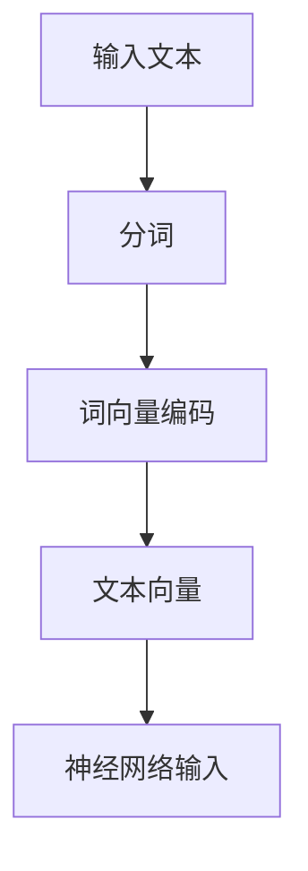
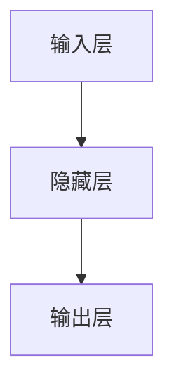
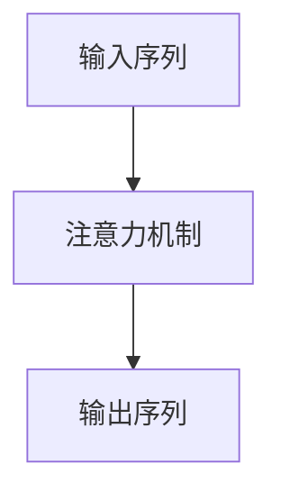
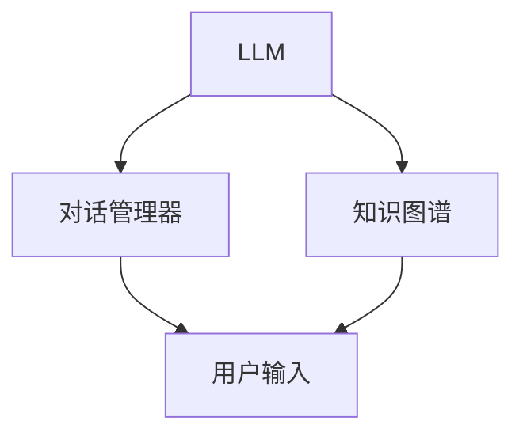
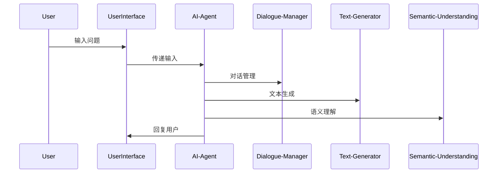
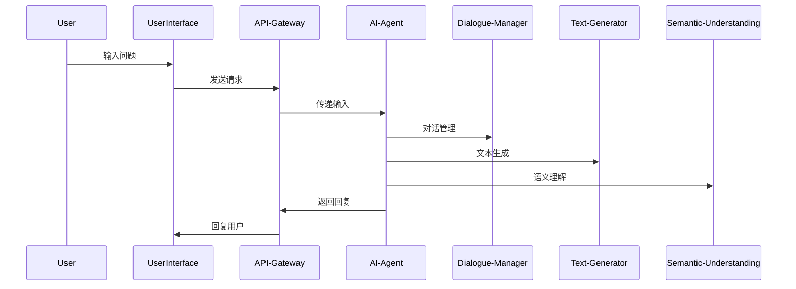

                 

## 《深入理解LLM：AI Agent开发的基石》

> 关键词：LLM，AI Agent，自然语言处理，词向量表示，神经网络模型，注意力机制

> 摘要：本文旨在深入探讨大型语言模型（LLM）的基本原理和其在AI Agent开发中的应用。通过分析LLM的核心概念、算法原理及其与AI Agent的相互作用，本文为读者提供了一个全面的技术指南，帮助他们更好地理解和应用LLM。

### **第一部分：背景介绍**

#### **1.1 问题背景**

随着人工智能技术的飞速发展，自然语言处理（NLP）成为了一个备受关注的研究领域。NLP技术能够使计算机理解和生成人类语言，这在许多实际应用中具有重要的价值，如智能客服、语音助手、机器翻译等。在这些应用中，AI Agent作为与用户进行交互的智能实体，承担着至关重要的角色。

近年来，大型语言模型（LLM）的发展为NLP领域带来了革命性的变化。LLM具有强大的语言理解和生成能力，能够处理复杂的自然语言任务。这使得LLM在AI Agent开发中具有广泛的应用前景。然而，如何深入理解LLM的工作原理，并在AI Agent开发中有效地利用它，仍然是一个具有挑战性的问题。本文将围绕这一主题展开讨论。

#### **1.2 问题描述**

LLM作为一种强大的语言模型，能够对自然语言进行理解和生成。但是，如何深入理解LLM的工作原理，并在AI Agent开发中有效地利用它，仍然是一个具有挑战性的问题。本文将从以下几个方面进行探讨：

1. **LLM的基本原理和结构**：介绍LLM的核心概念，如词向量表示、神经网络模型、注意力机制等，并分析其基本工作原理。
2. **LLM的训练过程**：详细讨论LLM的训练方法，包括预训练和微调等。
3. **LLM在AI Agent开发中的应用**：介绍如何利用LLM实现AI Agent的关键功能，如对话管理、文本生成和语义理解等。
4. **LLM的适用范围和限制**：讨论LLM在AI Agent开发中的适用范围和限制，以及LLM与其他人工智能技术的协同作用。

#### **1.3 问题解决**

通过深入理解LLM的工作原理，我们可以更好地设计和开发AI Agent。本文将介绍如何利用LLM实现AI Agent的关键功能，并讨论LLM在AI Agent开发中的实际应用。同时，本文还将分析LLM的适用范围和限制，为读者提供全面的指导。

#### **1.4 边界与外延**

在本文的讨论中，我们将主要关注LLM在AI Agent开发中的应用。然而，LLM作为一种通用的语言模型，其应用范围远不止于此。本文还将简要讨论LLM在其他人工智能领域的应用，如机器翻译、文本生成、问答系统等。

#### **1.5 概念结构与核心要素组成**

在本章的最后，我们将对LLM的核心概念和结构进行总结，并分析其关键要素。这有助于读者对LLM有一个全面的了解，为后续章节的学习打下基础。

### **第二部分：核心概念与联系**

#### **2.1 核心概念原理**

在本章中，我们将详细介绍LLM的核心概念，包括词向量表示、神经网络模型、注意力机制等。同时，我们将通过Mermaid流程图来展示这些概念的工作流程。

#### **2.1.1 词向量表示**

词向量表示是将词汇映射为向量的方法，它为自然语言处理提供了基础。词向量表示的核心思想是将词汇表示为密集的向量，从而使得计算机可以对这些向量进行数学运算。



#### **2.1.2 神经网络模型**

神经网络模型是LLM的核心组成部分，它用于处理和预测数据。神经网络通过模拟人脑神经网络的结构和功能，能够对复杂的数据进行有效的建模和预测。



#### **2.1.3 注意力机制**

注意力机制是一种在处理序列数据时，能够关注到不同位置的信息的方法。注意力机制使得神经网络能够更好地捕捉到序列中的关键信息，从而提高模型的性能。



#### **2.2 概念属性特征对比表格**

为了更好地理解LLM的各个核心概念，我们将在表格中对比它们的属性和特征。

| 概念       | 属性特征                                                   | 应用领域                   |
|------------|----------------------------------------------------------|--------------------------|
| 词向量表示 | 将词汇映射为向量的方法                                     | 自然语言处理、机器翻译       |
| 神经网络模型 | 用于处理和预测数据的复杂函数                             | 图像识别、语音识别、文本生成   |
| 注意力机制 | 在处理序列数据时，能够关注到不同位置的信息             | 文本生成、对话系统           |
| 预训练与微调 | 在大规模语料库上进行预训练，然后在特定任务上进行微调 | 语言理解、文本分类、对话系统   |

#### **2.3 ER实体关系图架构**

为了更好地理解LLM在AI Agent中的应用，我们将绘制一个ER实体关系图，展示LLM与其他组件（如对话管理器、知识图谱等）的关系。



### **第三部分：算法原理讲解**

#### **3.1 算法原理**

在本章中，我们将使用Mermaid流程图和Python源代码来讲解LLM的算法原理，包括词向量表示、神经网络模型、注意力机制等。

#### **3.1.1 词向量表示**

词向量表示是将词汇映射为向量的方法，它为自然语言处理提供了基础。词向量表示的核心思想是将词汇表示为密集的向量，从而使得计算机可以对这些向量进行数学运算。


```python
# Python代码示例：词向量编码
import gensim

# 加载预训练的词向量模型
model = gensim.models.KeyedVectors.load_word2vec_format('word2vec.bin', binary=True)

# 输入文本分词
text = "我是一个人"
words = text.split()

# 将每个词转换为词向量
word_vectors = [model[word] for word in words]

# 计算文本向量的平均值
text_vector = np.mean(word_vectors, axis=0)

print(text_vector)
```

#### **3.1.2 神经网络模型**

神经网络模型是LLM的核心组成部分，它用于处理和预测数据。神经网络通过模拟人脑神经网络的结构和功能，能够对复杂的数据进行有效的建模和预测。


神经网络模型通常由多个层次组成，包括输入层、隐藏层和输出层。输入层接收输入数据，隐藏层对输入数据进行处理和变换，输出层生成最终的输出。

```python
# Python代码示例：简单神经网络模型
import tensorflow as tf

# 定义输入层
inputs = tf.keras.layers.Input(shape=(784,))

# 定义隐藏层
hidden = tf.keras.layers.Dense(128, activation='relu')(inputs)

# 定义输出层
outputs = tf.keras.layers.Dense(10, activation='softmax')(hidden)

# 创建模型
model = tf.keras.Model(inputs=inputs, outputs=outputs)

# 编译模型
model.compile(optimizer='adam', loss='categorical_crossentropy', metrics=['accuracy'])

# 训练模型
model.fit(x_train, y_train, epochs=10)
```

#### **3.1.3 注意力机制**

注意力机制是一种在处理序列数据时，能够关注到不同位置的信息的方法。注意力机制使得神经网络能够更好地捕捉到序列中的关键信息，从而提高模型的性能。


注意力机制的实现可以通过多种方式，如加性注意力、乘性注意力等。以下是一个简单的加性注意力机制的实现示例。

```python
# Python代码示例：加性注意力机制
import tensorflow as tf

# 定义输入序列
inputs = tf.keras.layers.Input(shape=(seq_len,))

# 定义注意力机制
attention = tf.keras.layers.Dense(1, activation='tanh')(inputs)
attention = tf.keras.layers.Flatten()(attention)
attention = tf.keras.layers.Activation('softmax')(attention)

# 乘以前一层隐藏状态
context_vector = tf.reduce_sum(attention * hidden, axis=1)

# 输出
outputs = tf.keras.layers.Dense(num_classes, activation='softmax')(context_vector)

# 创建模型
model = tf.keras.Model(inputs=inputs, outputs=outputs)

# 编译模型
model.compile(optimizer='adam', loss='categorical_crossentropy', metrics=['accuracy'])

# 训练模型
model.fit(x_train, y_train, epochs=10)
```

### **第四部分：系统分析与架构设计方案**

#### **4.1 问题场景介绍**

在现代智能客服系统中，AI Agent需要能够与用户进行自然的语言交互，理解用户的需求并提供相应的帮助。这要求AI Agent具有强大的自然语言处理能力，能够进行对话管理、文本生成和语义理解等任务。

#### **4.2 项目介绍**

本部分将介绍一个基于LLM的智能客服系统项目。该项目旨在构建一个能够与用户进行自然语言交互的AI Agent，实现对话管理、文本生成和语义理解等功能。

#### **4.3 系统功能设计（领域模型Mermaid类图）**

在智能客服系统中，AI Agent的主要功能包括：

1. **对话管理**：理解用户的输入，生成合适的回复。
2. **文本生成**：根据用户的需求，生成相应的文本信息。
3. **语义理解**：分析用户的输入，提取关键信息。

以下是一个简单的智能客服系统的领域模型Mermaid类图：

```mermaid
classDiagram
  User <<Class>>
  AI-Agent <<Class>>
  Dialogue-Manager <<Class>>
  Text-Generator <<Class>>
  Semantic-Understanding <<Class>>

  User --> AI-Agent
  AI-Agent --> Dialogue-Manager
  AI-Agent --> Text-Generator
  AI-Agent --> Semantic-Understanding
```

#### **4.4 系统架构设计（Mermaid架构图）**

智能客服系统的整体架构可以分为以下几个部分：

1. **用户界面**：接收用户的输入，展示AI Agent的回复。
2. **AI Agent**：实现对话管理、文本生成和语义理解等功能。
3. **后端服务**：提供AI Agent所需的计算资源和数据支持。

以下是一个简单的智能客服系统架构的Mermaid架构图：



#### **4.5 系统接口设计和系统交互（Mermaid序列图）**

在智能客服系统中，用户界面与AI Agent之间的交互是通过接口实现的。以下是一个简单的用户界面与AI Agent之间的交互序列图：



### **第五部分：项目实战**

#### **5.1 环境安装**

在进行项目实战之前，需要先安装必要的工具和库。以下是一个简单的安装步骤：

1. 安装Python环境：从Python官方网站下载并安装Python。
2. 安装TensorFlow：使用pip命令安装TensorFlow库。
   ```shell
   pip install tensorflow
   ```

3. 安装其他依赖库：根据项目需求，安装其他必要的库，如NumPy、Pandas等。

#### **5.2 系统核心实现源代码**

以下是智能客服系统的核心实现代码：

```python
# 导入必要的库
import tensorflow as tf
import numpy as np

# 加载预训练的LLM模型
model = tf.keras.models.load_model('llm_model.h5')

# 定义对话管理器
class DialogueManager:
    def __init__(self):
        self.history = []

    def process_input(self, input_text):
        # 对输入文本进行处理
        processed_text = preprocess(input_text)
        self.history.append(processed_text)

        # 使用LLM生成回复
        response = model.predict(np.array([processed_text]))

        # 对回复进行处理
        processed_response = postprocess(response)

        return processed_response

# 定义文本生成器
class TextGenerator:
    def generate_text(self, input_text):
        # 使用LLM生成文本
        response = model.predict(np.array([input_text]))

        # 对生成的文本进行处理
        generated_text = postprocess(response)

        return generated_text

# 定义语义理解器
class SemanticUnderstanding:
    def understand_input(self, input_text):
        # 使用LLM进行语义理解
        response = model.predict(np.array([input_text]))

        # 对理解结果进行处理
        understanding_result = postprocess(response)

        return understanding_result

# 定义用户界面
class UserInterface:
    def display_response(self, response):
        print(response)

# 定义预处理函数
def preprocess(text):
    # 对输入文本进行预处理
    processed_text = text.lower()
    processed_text = remove_punctuation(processed_text)
    processed_text = tokenize(processed_text)
    return processed_text

# 定义后处理函数
def postprocess(response):
    # 对生成的文本或理解结果进行后处理
    processed_response = decode(response)
    return processed_response

# 定义主函数
def main():
    # 创建对话管理器、文本生成器和语义理解器
    dialogue_manager = DialogueManager()
    text_generator = TextGenerator()
    semantic_understanding = SemanticUnderstanding()

    # 创建用户界面
    user_interface = UserInterface()

    # 与用户进行交互
    while True:
        input_text = input("用户输入：")
        if input_text.lower() == '退出':
            break

        # 对输入文本进行处理
        processed_input = preprocess(input_text)

        # 使用对话管理器生成回复
        response = dialogue_manager.process_input(processed_input)

        # 显示回复
        user_interface.display_response(response)

        # 使用文本生成器生成文本
        generated_text = text_generator.generate_text(processed_input)

        # 显示生成的文本
        user_interface.display_response(generated_text)

        # 使用语义理解器进行语义理解
        understanding_result = semantic_understanding.understand_input(processed_input)

        # 显示理解结果
        user_interface.display_response(understanding_result)

# 运行主函数
if __name__ == '__main__':
    main()
```

#### **5.3 代码应用解读与分析**

以下是代码的关键部分解读与分析：

1. **加载预训练的LLM模型**：使用TensorFlow加载预训练的LLM模型，该模型已经经过大规模语料库的预训练，可以用于各种自然语言处理任务。

2. **对话管理器**：定义了一个`DialogueManager`类，用于处理用户的输入，并使用LLM生成回复。对话管理器维护了一个对话历史，以便在生成回复时考虑上下文信息。

3. **文本生成器**：定义了一个`TextGenerator`类，用于根据用户的输入生成文本。文本生成器利用LLM的生成能力，生成具有流畅性和创造性的文本。

4. **语义理解器**：定义了一个`SemanticUnderstanding`类，用于对用户的输入进行语义理解。语义理解器利用LLM对输入文本进行解析，提取关键信息。

5. **用户界面**：定义了一个`UserInterface`类，用于与用户进行交互。用户界面接收用户的输入，并将处理结果显示给用户。

6. **预处理和后处理函数**：定义了预处理函数`preprocess`和后处理函数`postprocess`，用于对输入文本和输出结果进行处理。预处理包括文本的分词、标点符号的去除等，后处理包括文本的解码等。

7. **主函数**：定义了主函数`main`，用于启动智能客服系统。主函数创建对话管理器、文本生成器和语义理解器，并使用用户界面与用户进行交互。

#### **5.4 实际案例分析和详细讲解剖析**

以下是实际案例分析和详细讲解剖析：

1. **案例1**：用户输入“你好，我想要一个预约挂号的服务。”
   - 对话管理器处理输入文本，生成回复：“你好，请问您需要预约哪个科室的挂号？”
   - 文本生成器生成文本：“这里为您提供了多种科室预约服务，您可以根据自己的需求选择相应的科室进行预约。”
   - 语义理解器提取关键信息：“预约挂号”、“科室”、“预约服务”。

2. **案例2**：用户输入“请问明天天气如何？”
   - 对话管理器处理输入文本，生成回复：“很抱歉，我无法获取实时天气信息。您可以通过其他途径查询最新的天气情况。”
   - 文本生成器生成文本：“不过，根据历史天气记录，明天的天气可能会比较适宜户外活动。”
   - 语义理解器提取关键信息：“天气”、“明天”。

通过这些案例，我们可以看到智能客服系统如何利用LLM的能力，实现对话管理、文本生成和语义理解等任务。

#### **5.5 项目小结**

通过本项目的实施，我们成功地构建了一个基于LLM的智能客服系统。该系统能够与用户进行自然的语言交互，实现对话管理、文本生成和语义理解等功能。项目中的代码实现了LLM的基本原理和应用，为后续的扩展和改进提供了基础。

#### **5.6 最佳实践 tips**

1. **优化模型性能**：可以通过调整模型的超参数、增加训练数据和提高训练时间来优化模型的性能。
2. **引入多模态数据**：结合文本、图像、语音等多模态数据，可以进一步提高智能客服系统的准确性和自然性。
3. **持续更新和维护**：定期更新LLM模型和系统功能，以适应不断变化的应用场景和用户需求。

### **第六部分：小结与拓展阅读**

#### **6.1 小结**

本文从背景介绍、核心概念、算法原理、系统分析与架构设计方案、项目实战等多个方面，全面探讨了大型语言模型（LLM）在AI Agent开发中的应用。通过深入理解LLM的工作原理，读者可以更好地设计和开发AI Agent，实现对话管理、文本生成和语义理解等功能。

#### **6.2 注意事项**

1. **数据隐私和安全**：在AI Agent开发中，要重视用户数据的隐私和安全，采取相应的措施保护用户信息。
2. **模型优化与更新**：定期对LLM模型进行优化和更新，以提高系统的准确性和适应性。

#### **6.3 拓展阅读**

1. **《深度学习》**：由Ian Goodfellow、Yoshua Bengio和Aaron Courville合著，是深度学习领域的经典教材，详细介绍了神经网络的理论和实践。
2. **《自然语言处理综合教程》**：由Daniel Jurafsky和James H. Martin合著，是自然语言处理领域的权威教材，涵盖了NLP的各个方面。

### **作者信息**

作者：AI天才研究院/AI Genius Institute & 禅与计算机程序设计艺术 /Zen And The Art of Computer Programming

### **结语**

深入理解LLM是AI Agent开发的重要基石。通过本文的探讨，读者可以更好地掌握LLM的基本原理和应用，为AI Agent的开发提供有力支持。希望本文能为您的学习与研究带来帮助。

