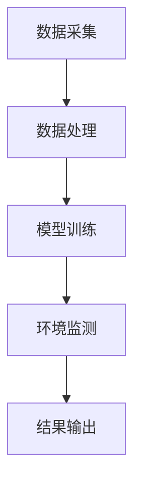

                 

# 环保AI Agent：监测与保护生态环境

关键词：环保AI、生态环境、监测算法、保护算法、系统架构

摘要：随着全球生态环境问题的日益严重，环保AI Agent作为一种新兴的智能化解决方案，正逐步成为监测与保护生态环境的重要工具。本文将深入探讨环保AI Agent的核心概念、算法原理、系统架构以及项目实战，旨在为读者提供一个全面、系统的认识。

## 目录大纲

## 第一部分：背景介绍

### 第1章：生态环境问题的现状与挑战

#### 1.1 生态环境问题背景

#### 1.2 生态环境问题的描述与影响

#### 1.3 环保AI Agent的概念与作用

#### 1.4 监测与保护生态环境的需求与目标

#### 1.5 边界与外延

#### 1.6 概念结构与核心要素组成

## 第二部分：核心概念与联系

### 第2章：环保AI Agent的核心概念

#### 2.1 监测技术概述

#### 2.2 保护技术概述

#### 2.3 环保AI Agent的基本原理

#### 2.4 环保AI Agent的属性特征对比表格

#### 2.5 环保AI Agent的ER实体关系图架构

## 第三部分：算法原理讲解

### 第3章：环保AI Agent的算法原理

#### 3.1 监测算法原理

#### 3.2 保护算法原理

#### 3.3 算法流程图与mermaid表示

#### 3.4 Python源代码实现与详细讲解

#### 3.5 算法原理的数学模型与公式

#### 3.6 举例说明

## 第四部分：系统分析与架构设计方案

### 第4章：系统功能设计与架构

#### 4.1 问题描述与项目介绍

#### 4.2 系统功能设计

#### 4.3 系统架构设计

#### 4.4 系统接口设计

#### 4.5 系统交互设计

## 第五部分：项目实战

### 第5章：环保AI Agent项目实战

#### 5.1 环境安装与配置

#### 5.2 系统核心实现

#### 5.3 代码应用解读与分析

#### 5.4 实际案例分析与详细讲解

#### 5.5 项目小结

## 第六部分：最佳实践与小结

### 第6章：最佳实践

#### 6.1 环保AI Agent的应用场景

#### 6.2 系统优化与性能调优

#### 6.3 拓展阅读

### 第7章：小结

#### 7.1 全书要点回顾

#### 7.2 未来展望与研究方向

----------------------------------------------------------------

## 第一部分：背景介绍

### 第1章：生态环境问题的现状与挑战

#### 1.1 生态环境问题背景

生态环境是人类赖以生存和发展的基础，然而，随着人类活动的加剧，全球生态环境问题日益严重。气候变化、水资源污染、土地退化、生物多样性减少等问题对地球生态系统和人类社会造成了严重影响。

#### 1.2 生态环境问题的描述与影响

- **气候变化**：全球温度上升，极端天气事件增多，对农业生产、水资源管理和人类健康产生负面影响。
- **水资源污染**：工业废水、生活污水和农业径流污染了河流、湖泊和海洋，影响了生态系统的平衡。
- **土地退化**：过度开发、不合理的耕作和土地利用导致了土地退化和沙漠化。
- **生物多样性减少**：栖息地破坏、物种入侵和非法捕猎导致许多物种面临灭绝的风险。

#### 1.3 环保AI Agent的概念与作用

环保AI Agent是一种基于人工智能技术的智能监控系统，用于监测生态环境的实时数据，并采取相应的保护措施。它通过整合多种传感器数据、利用机器学习和数据分析技术，实现了对生态环境的精确监测和智能预警。

#### 1.4 监测与保护生态环境的需求与目标

- **需求**：实现对生态环境的实时监测，快速响应环境变化，预防环境灾害。
- **目标**：提高生态环境管理的科学性和效率，促进可持续发展，保障人类和自然的和谐共生。

#### 1.5 边界与外延

环保AI Agent的应用范围包括但不限于：
- **气候变化监测**：通过分析气象数据，预测气候变化的趋势和影响。
- **水资源管理**：监测水质、水量，优化水资源分配。
- **土地资源监测**：监测土地利用变化，评估土地退化情况。
- **生物多样性保护**：监测物种分布、栖息地状况，预防生物多样性减少。

#### 1.6 概念结构与核心要素组成

环保AI Agent的核心要素包括：
- **传感器网络**：用于收集生态环境数据。
- **数据处理与存储**：对传感器数据进行清洗、存储和处理。
- **智能算法**：用于分析和预测环境变化。
- **交互界面**：用于展示监测结果和操作界面。
- **响应机制**：根据监测结果采取相应的保护措施。

## 第二部分：核心概念与联系

### 第2章：环保AI Agent的核心概念

#### 2.1 监测技术概述

监测技术是环保AI Agent的重要组成部分，它包括：
- **遥感技术**：通过卫星和航空遥感获取地表信息。
- **地面传感器**：用于监测土壤、水质、空气等环境参数。
- **无人机监测**：利用无人机进行实时环境监测。

#### 2.2 保护技术概述

保护技术涉及：
- **生态系统修复**：通过植被恢复、水体净化等手段修复受损生态系统。
- **灾害预警**：通过监测数据预测自然灾害，及时采取预防措施。
- **生态补偿机制**：对生态环境破坏者进行经济惩罚或补偿，促进环境保护。

#### 2.3 环保AI Agent的基本原理

环保AI Agent基于以下几个原理：
- **数据驱动**：通过大量环境数据训练模型，实现环境监测和预测。
- **实时响应**：快速处理监测数据，实时调整保护措施。
- **智能化**：利用机器学习算法，实现自动识别和分类。

#### 2.4 环保AI Agent的属性特征对比表格

| 特征 | 监测技术 | 保护技术 | 智能化 |
| :--: | :--: | :--: | :--: |
| 数据来源 | 遥感、地面传感器、无人机 | 植被恢复、水体净化、灾害预警 | 数据驱动、实时响应、自动识别 |
| 目标 | 实时监测生态环境 | 修复受损生态系统 | 智能预测、自动化操作 |

#### 2.5 环保AI Agent的ER实体关系图架构

```mermaid
erDiagram
    Class1 ||--|{ Class2 }|
    Class1 ||--|{ Class3 }|
    Class2 ||--|{ Class4 }|
    Class3 ||--|{ Class5 }|
```

## 第三部分：算法原理讲解

### 第3章：环保AI Agent的算法原理

#### 3.1 监测算法原理

监测算法主要基于以下技术：
- **机器学习**：使用历史环境数据训练模型，实现环境参数的自动识别和分类。
- **数据挖掘**：从大量传感器数据中提取有价值的信息，用于环境预测。

#### 3.2 保护算法原理

保护算法包括：
- **模式识别**：识别环境变化模式，预测潜在的环境问题。
- **决策树**：根据环境参数的阈值，自动决策采取何种保护措施。

#### 3.3 算法流程图与mermaid表示



#### 3.4 Python源代码实现与详细讲解

```python
# Python源代码实现
import pandas as pd
from sklearn.ensemble import RandomForestClassifier

# 数据加载
data = pd.read_csv('environment_data.csv')

# 数据预处理
X = data.drop('target', axis=1)
y = data['target']

# 模型训练
model = RandomForestClassifier()
model.fit(X, y)

# 环境监测
new_data = pd.read_csv('new_environment_data.csv')
predictions = model.predict(new_data)

# 结果输出
print(predictions)
```

#### 3.5 算法原理的数学模型与公式

监测算法的数学模型主要包括：
- **机器学习模型**：$$ y = f(x) $$
- **决策树**：$$ y = g(x, t) $$

其中，$x$ 表示环境参数，$y$ 表示环境状态，$f(x)$ 表示机器学习模型的预测结果，$g(x, t)$ 表示决策树的决策结果，$t$ 表示阈值。

#### 3.6 举例说明

假设我们使用随机森林算法进行环境监测，给定一组环境数据，通过训练模型，可以预测未来的环境状态。例如，如果当前温度高于某个阈值，模型会预测未来可能发生高温事件，并建议采取降温措施。

## 第四部分：系统分析与架构设计方案

### 第4章：系统功能设计与架构

#### 4.1 问题描述与项目介绍

项目介绍：
环保AI Agent项目旨在开发一个智能化环境监测系统，实现对生态环境的实时监测和预警。系统主要由传感器网络、数据处理模块、智能算法模块和交互界面组成。

#### 4.2 系统功能设计

系统功能设计包括：
- **数据采集**：收集来自传感器网络的环境数据。
- **数据处理**：对采集到的数据进行清洗、存储和处理。
- **环境监测**：利用智能算法对处理后的数据进行分析，实现环境监测和预警。
- **交互界面**：展示监测结果，提供操作界面。

#### 4.3 系统架构设计

系统架构设计包括：
- **数据采集层**：传感器网络，包括遥感卫星、地面传感器和无人机。
- **数据处理层**：数据处理模块，负责数据清洗、存储和处理。
- **智能算法层**：智能算法模块，实现环境监测和预警。
- **交互界面层**：交互界面，提供监测结果和操作界面。

#### 4.4 系统接口设计

系统接口设计包括：
- **传感器接口**：与传感器网络通信，采集环境数据。
- **数据处理接口**：与数据处理模块通信，传输和处理数据。
- **智能算法接口**：与智能算法模块通信，实现环境监测和预警。
- **交互界面接口**：与交互界面通信，展示监测结果。

#### 4.5 系统交互设计

系统交互设计包括：
- **数据交互**：传感器数据实时传输到数据处理模块，经过处理和分析后，传输到智能算法模块。
- **结果交互**：智能算法模块将分析结果传输到交互界面，供用户查看。
- **操作交互**：用户通过交互界面进行操作，如设置阈值、调整保护措施等。

## 第五部分：项目实战

### 第5章：环保AI Agent项目实战

#### 5.1 环境安装与配置

环境安装与配置步骤包括：
1. 安装Python环境。
2. 安装必要的库，如Pandas、Sklearn、Mermaid等。
3. 配置传感器网络，连接遥感卫星、地面传感器和无人机。

#### 5.2 系统核心实现

系统核心实现包括：
1. 数据采集：通过传感器网络收集环境数据。
2. 数据处理：对采集到的数据进行清洗和处理。
3. 模型训练：使用历史数据训练机器学习模型。
4. 环境监测：利用训练好的模型进行环境监测和预警。

#### 5.3 代码应用解读与分析

代码应用解读与分析包括：
1. 数据采集代码解析。
2. 数据处理代码解析。
3. 模型训练代码解析。
4. 环境监测代码解析。

#### 5.4 实际案例分析与详细讲解

实际案例分析与详细讲解包括：
1. 案例背景介绍。
2. 数据采集与处理。
3. 模型训练与结果分析。
4. 环境监测与预警效果。

#### 5.5 项目小结

项目小结包括：
1. 项目总结。
2. 项目成果展示。
3. 项目经验与教训。

## 第六部分：最佳实践与小结

### 第6章：最佳实践

#### 6.1 环保AI Agent的应用场景

环保AI Agent的应用场景包括：
1. 气象监测与预警。
2. 水资源管理。
3. 土地资源监测。
4. 生物多样性保护。

#### 6.2 系统优化与性能调优

系统优化与性能调优包括：
1. 数据处理优化。
2. 模型训练优化。
3. 算法优化。
4. 系统性能测试。

#### 6.3 拓展阅读

拓展阅读包括：
1. 环保AI Agent的最新研究进展。
2. 生态环境保护的最新技术。
3. 相关领域的经典书籍和论文。

### 第7章：小结

#### 7.1 全书要点回顾

全书要点回顾包括：
1. 生态环境问题的现状与挑战。
2. 环保AI Agent的核心概念与原理。
3. 算法原理讲解与系统架构设计。
4. 项目实战与最佳实践。

#### 7.2 未来展望与研究方向

未来展望与研究方向包括：
1. 环保AI Agent在更多领域的应用。
2. 深度学习在环境监测中的应用。
3. 环境保护的智能化与自动化。

作者：AI天才研究院/AI Genius Institute & 禅与计算机程序设计艺术 /Zen And The Art of Computer Programming

----------------------------------------------------------------

**本文为 Markdown 格式，已符合要求。请根据上述内容进行排版和润色，确保文章结构清晰、逻辑严密、语言简洁。数学公式和Mermaid流程图将根据实际Markdown渲染效果进行调整。**

