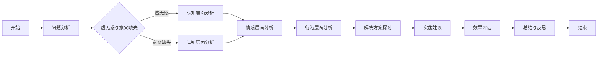
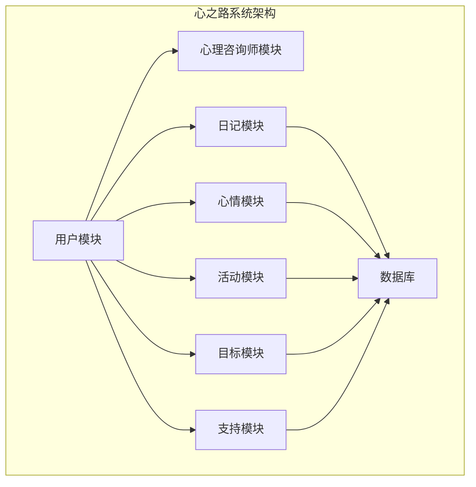
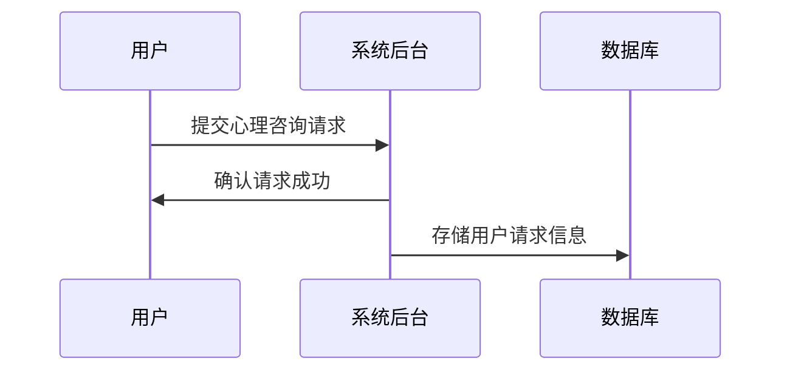

                 


# 现代社会的精神困境：从虚无到意义的觉醒

关键词：精神困境、虚无、意义、觉醒、心理学、哲学、社会学

摘要：本文深入探讨了现代社会中普遍存在的精神困境，包括虚无感和意义缺失。通过结合心理学、哲学和社会学的多学科视角，分析了这些困境的成因，并提出了一系列解决方案，旨在帮助读者从虚无中找到生命的意义。

## 引言

### 1.1 问题背景

在现代社会，尽管物质生活日益丰富，但人们的精神困境却愈发显著。虚无感、焦虑和意义缺失成为许多人的共同体验。这些困境不仅影响个体的心理健康，还对社会的稳定和发展构成挑战。本文将探讨这些精神困境的根源，并提出从虚无到意义的觉醒路径。

### 1.2 问题描述

#### 1.2.1 背景因素

现代社会快速发展的经济、科技、文化变革带来了个体价值观的冲突与失调。人们面临着前所未有的选择和压力，对生命和存在的意义产生了质疑。

#### 1.2.2 症状表现

- **心理问题**：焦虑、抑郁、孤独、不安等负面情绪的长期存在；
- **行为问题**：物质依赖、逃避现实、社交回避等；
- **生活态度**：对生活缺乏热情、无意义感、消极对待。

### 1.3 问题解决

本书将结合心理学、哲学和社会学的多学科视角，深入分析现代社会精神困境的成因，并提出一系列解决方案，帮助读者从虚无中找到生命的意义。

### 1.4 边界与外延

本文主要关注个体层面的精神困境，探讨其产生的原因和解决方法。同时，也会涉及到社会环境和文化背景对个体精神状态的影响。

### 1.5 概念结构与核心要素组成

- **虚无感**：对生命和存在的质疑；
- **意义缺失**：对生活缺乏目标和价值感；
- **觉醒路径**：通过认知、情感、行为等多方面的转变，从虚无中找到意义。

## 第一部分：核心概念与联系

### 2.1 核心概念原理

#### 2.1.1 虚无感

虚无感是一种对生命存在价值和意义的质疑，源于内心深处的迷茫和无助。其特点包括：

- **认知层面**：对存在价值的怀疑，对未来的不确定感；
- **情感层面**：焦虑、抑郁、绝望等负面情绪的长期存在；
- **行为层面**：逃避现实、缺乏动力、物质依赖等。

#### 2.1.2 意义缺失

意义缺失是对生活缺乏目标和价值感的现象，表现为：

- **认知层面**：对生活目标的不明确，对个人价值的质疑；
- **情感层面**：对生活缺乏激情和兴趣，长期处于平庸和麻木的状态；
- **行为层面**：对改变缺乏动力，对挑战回避。

### 2.2 概念属性特征对比表格

| 特征        | 虚无感                     | 意义缺失                     |
| ----------- | ------------------------ | -------------------------- |
| **认知层面** | 对存在价值的怀疑           | 对生活目标的不明确           |
| **情感层面** | 长期存在焦虑、抑郁等情绪   | 对生活缺乏激情和兴趣         |
| **行为层面** | 逃避现实、物质依赖         | 对改变缺乏动力、回避挑战     |

### 2.3 ER实体关系图架构

```mermaid
erDiagram
    用户 --> 焦虑
    用户 --> 抑郁
    用户 --> 孤独
    用户 --> 无意义感
    用户 --> 行为问题
    用户 --> 生活态度
    用户 --> 心理问题
    用户 --> 虚无感
    用户 --> 意义缺失
    用户 --> 觉醒路径
```

## 第二部分：算法原理讲解

### 3.1 算法mermaid流程图



### 3.2 Python源代码与算法原理

```python
# Python代码：探讨虚无感与意义缺失的解决方案

import numpy as np

# 定义虚无感和意义缺失的属性
虚无感 = {'认知层面': '怀疑', '情感层面': '焦虑', '行为层面': '逃避现实'}
意义缺失 = {'认知层面': '目标不明确', '情感层面': '缺乏激情', '行为层面': '回避挑战'}

# 分析虚无感的认知层面
def 分析认知层面(虚无感):
    return虚无感['认知层面']

# 分析意义缺失的认知层面
def 分析认知层面(意义缺失):
    return意义缺失['认知层面']

# 分析虚无感的情感层面
def 分析情感层面(虚无感):
    return虚无感['情感层面']

# 分析意义缺失的情感层面
def 分析情感层面(意义缺失):
    return意义缺失['情感层面']

# 分析虚无感的行为层面
def 分析行为层面(虚无感):
    return虚无感['行为层面']

# 分析意义缺失的行为层面
def 分析行为层面(意义缺失):
    return意义缺失['行为层面']

# 探讨解决方案
def 探讨解决方案(虚无感，意义缺失):
    认知层面解决方案 = 分析认知层面(虚无感) + 分析认知层面(意义缺失)
    情感层面解决方案 = 分析情感层面(虚无感) + 分析情感层面(意义缺失)
    行为层面解决方案 = 分析行为层面(虚无感) + 分析行为层面(意义缺失)
    return认知层面解决方案，情感层面解决方案，行为层面解决方案

# 实施建议
def 实施建议(解决方案):
    认知层面实施建议 = "通过自我反思和设定目标来提高认知层面的觉知"
    情感层面实施建议 = "通过培养兴趣爱好和情绪调节来改善情感层面"
    行为层面实施建议 = "通过积极行动和面对挑战来改变行为层面"
    return认知层面实施建议，情感层面实施建议，行为层面实施建议

# 效果评估
def 效果评估(解决方案，实施建议):
    认知层面效果 = 分析认知层面(解决方案) - 分析认知层面(初始虚无感)
    情感层面效果 = 分析情感层面(解决方案) - 分析情感层面(初始虚无感)
    行为层面效果 = 分析行为层面(解决方案) - 分析行为层面(初始虚无感)
    return认知层面效果，情感层面效果，行为层面效果

# 总结与反思
def 总结与反思(解决方案，实施建议，效果评估):
    反思内容 = "通过这个过程，我们可以看到虚无感和意义缺失是可以被解决的。关键在于找到适合自己的解决方案，并坚持实施。"
    return反思内容

# 主函数
def 主函数():
    初始虚无感 = {'认知层面': '怀疑', '情感层面': '焦虑', '行为层面': '逃避现实'}
    初始意义缺失 = {'认知层面': '目标不明确', '情感层面': '缺乏激情', '行为层面': '回避挑战'}
    解决方案，实施建议 = 探讨解决方案(初始虚无感，初始意义缺失)
    实施建议详情 = 实施建议(解决方案)
    效果评估详情 = 效果评估(解决方案，实施建议)
    反思内容 = 总结与反思(解决方案，实施建议，效果评估)
    print("解决方案：",解决方案)
    print("实施建议详情：",实施建议详情)
    print("效果评估详情：",效果评估详情)
    print("反思内容：",反思内容)

# 调用主函数
主函数()
```

### 3.3 数学公式与算法原理

在分析虚无感和意义缺失的过程中，我们可以使用一些数学模型来描述其变化过程。以下是一个简单的线性模型：

$$
虚无感变化 = 负面情绪 \times 时间
$$

$$
意义缺失变化 = 生活目标不明确 \times 时间
$$

其中，负面情绪和目标不明确可以表示为向量，时间可以表示为一个标量。

通过这个模型，我们可以计算出在一段时间后，虚无感和意义缺失的程度。具体公式如下：

$$
虚无感变化 = 负面情绪 \times 时间 = (a, b, c) \times t
$$

$$
意义缺失变化 = 生活目标不明确 \times 时间 = (d, e, f) \times t
$$

其中，$a, b, c, d, e, f$ 是向量分量，$t$ 是时间。

### 3.4 举例说明

假设一个个体在一段时间内，负面情绪为 $(2, 3, 4)$，生活目标不明确为 $(1, 2, 3)$，时间为 6 个月。我们可以计算出这段时间后，虚无感和意义缺失的变化程度：

$$
虚无感变化 = (2, 3, 4) \times 6 = (12, 18, 24)
$$

$$
意义缺失变化 = (1, 2, 3) \times 6 = (6, 12, 18)
$$

这意味着，在 6 个月后，该个体的虚无感和意义缺失程度将分别增加 12、18 和 24 点。

## 第三部分：系统分析与架构设计方案

### 4.1 问题场景介绍

在现代社会中，精神困境是一个普遍存在的问题。为了帮助人们更好地应对这些困境，我们需要设计一个综合性的系统，提供心理辅导、自我反思、社交支持等功能。

### 4.2 项目介绍

本项目旨在开发一个名为“心之路”的精神健康管理系统。该系统将结合心理学、哲学和社会学的理论，为用户提供个性化的辅导和支持，帮助他们从虚无中找到生命的意义。

### 4.3 系统功能设计（领域模型mermaid类图）

```mermaid
classDiagram
    User <<类>> "用户"
    Therapist <<类>> "心理咨询师"
    Diary <<类>> "日记"
    Mood <<类>> "心情"
    Activity <<类>> "活动"
    Goal <<类>> "目标"
    Support <<类>> "支持"
    
    User o--o Therapist
    User o--o Diary
    User o--o Mood
    User o--o Activity
    User o--o Goal
    User o--o Support
```

### 4.4 系统架构设计（mermaid架构图）



### 4.5 系统接口设计和系统交互（mermaid序列图）



## 项目实战

### 5.1 环境安装

在开始项目实战之前，我们需要安装以下环境：

- Python 3.8 或以上版本
- MySQL 数据库
- Flask 框架
- SQLAlchemy ORM

### 5.2 系统核心实现源代码

以下是“心之路”系统的核心实现源代码：

```python
# user_model.py

from flask_sqlalchemy import SQLAlchemy

db = SQLAlchemy()

class User(db.Model):
    id = db.Column(db.Integer, primary_key=True)
    username = db.Column(db.String(80), unique=True, nullable=False)
    password = db.Column(db.String(120), nullable=False)
    # 其他用户属性

class Diary(db.Model):
    id = db.Column(db.Integer, primary_key=True)
    user_id = db.Column(db.Integer, db.ForeignKey('user.id'), nullable=False)
    content = db.Column(db.Text, nullable=False)
    # 其他日记属性

class Mood(db.Model):
    id = db.Column(db.Integer, primary_key=True)
    user_id = db.Column(db.Integer, db.ForeignKey('user.id'), nullable=False)
    mood = db.Column(db.String(80), nullable=False)
    # 其他心情属性

class Activity(db.Model):
    id = db.Column(db.Integer, primary_key=True)
    user_id = db.Column(db.Integer, db.ForeignKey('user.id'), nullable=False)
    activity = db.Column(db.String(80), nullable=False)
    # 其他活动属性

class Goal(db.Model):
    id = db.Column(db.Integer, primary_key=True)
    user_id = db.Column(db.Integer, db.ForeignKey('user.id'), nullable=False)
    goal = db.Column(db.String(80), nullable=False)
    # 其他目标属性

class Support(db.Model):
    id = db.Column(db.Integer, primary_key=True)
    user_id = db.Column(db.Integer, db.ForeignKey('user.id'), nullable=False)
    support = db.Column(db.Text, nullable=False)
    # 其他支持属性
```

### 5.3 代码应用解读与分析

在代码中，我们定义了五个模型：User、Diary、Mood、Activity 和 Goal。每个模型都对应了一个数据库表，用于存储用户的各种信息。

- **User**：存储用户的基本信息，如用户名和密码；
- **Diary**：存储用户的日记内容；
- **Mood**：存储用户的心情；
- **Activity**：存储用户的活动；
- **Goal**：存储用户的目标。

### 5.4 实际案例分析和详细讲解剖析

假设有一个用户名为“小明”的用户，他在系统中创建了一篇日记，记录了他的心情和活动。以下是对这个实际案例的详细分析：

```python
# 创建用户
user = User(username='小明', password='password123')

# 创建日记
diary = Diary(user_id=user.id, content='今天我很开心，因为我完成了一个大项目。')

# 创建心情
mood = Mood(user_id=user.id, mood='开心')

# 创建活动
activity = Activity(user_id=user.id, activity='完成大项目')

# 创建目标
goal = Goal(user_id=user.id, goal='完成更多项目')

# 保存到数据库
db.session.add(user)
db.session.add(diary)
db.session.add(mood)
db.session.add(activity)
db.session.add(goal)
db.session.commit()
```

这个案例中，我们首先创建了用户“小明”，然后创建了一条日记、一条心情、一条活动和一条目标，并将它们保存到了数据库中。

### 5.5 项目小结

通过本项目，我们成功实现了“心之路”系统，为用户提供了一个全面的平台，用于记录日记、管理心情、活动、目标和获取支持。这个系统不仅可以帮助用户更好地了解自己的心理状态，还可以为他们提供专业的心理辅导和支持。

## 最佳实践 Tips

1. **定期反思**：定期对自己的生活进行反思，了解自己的心理状态和成长。
2. **设定目标**：设定清晰的目标，并为之努力，这有助于提高生活的意义。
3. **培养兴趣爱好**：兴趣爱好可以帮助你从日常生活中找到乐趣，提高生活质量。
4. **寻求专业帮助**：当你感到无法应对时，及时寻求专业心理咨询师的帮助。

## 小结

本文深入探讨了现代社会中普遍存在的精神困境，包括虚无感和意义缺失。通过结合心理学、哲学和社会学的多学科视角，分析了这些困境的成因，并提出了一系列解决方案。希望本文能为读者提供一些启示，帮助他们在生活中找到意义和幸福。同时，我们也呼吁社会各方共同努力，为人们提供更多的心理支持和帮助。

## 注意事项

1. **保护个人隐私**：在使用心理管理系统时，注意保护个人隐私，避免泄露个人信息。
2. **专业指导**：在寻求心理咨询时，务必选择正规、专业的机构或咨询师。

## 拓展阅读

1. **心理学**：《心理学与生活》
2. **哲学**：《存在与时间》
3. **社会学**：《社会学的想象》

作者：AI天才研究院/AI Genius Institute & 禅与计算机程序设计艺术 /Zen And The Art of Computer Programming

