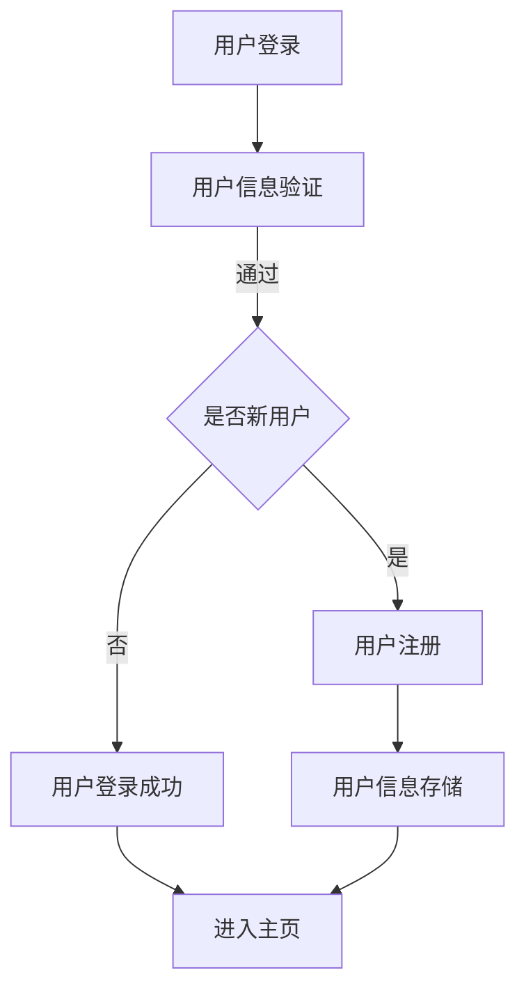
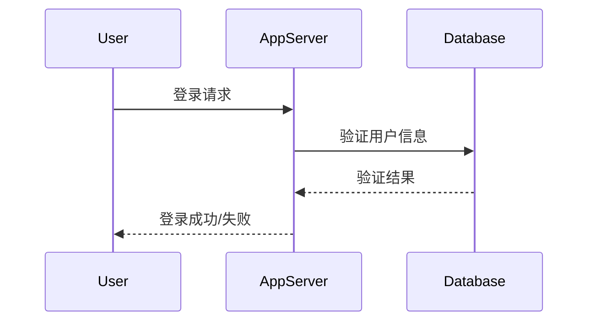
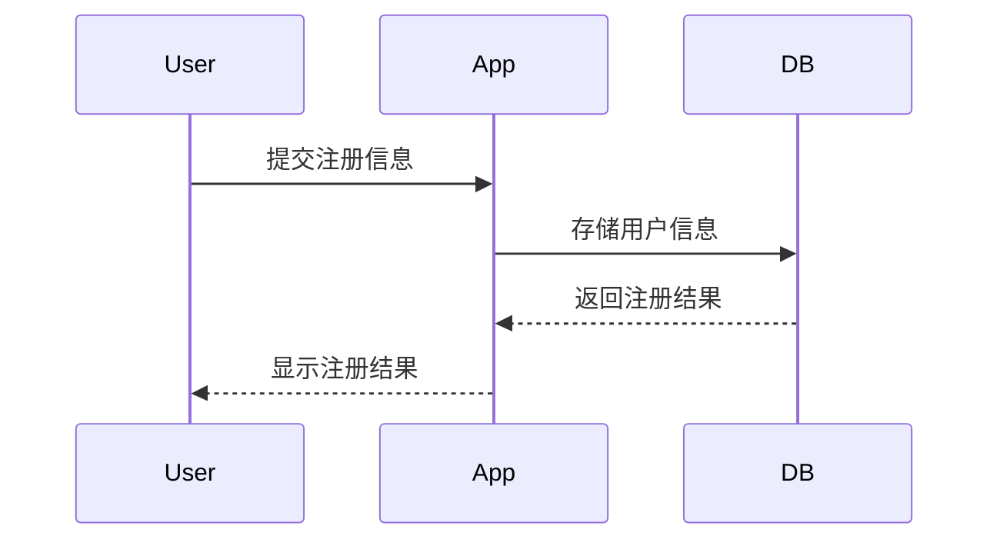

                 

## 现代禅修App开发项目：东方智慧的数字化呈现尝试

> 关键词：禅修App、东方智慧、数字化呈现、用户体验、技术实现

摘要：本文旨在探讨现代禅修App开发项目，通过数字化手段将东方智慧融入其中，探讨其设计理念、技术实现、用户体验以及未来发展。文章将从背景介绍、核心概念与技术基础、核心功能设计、用户界面设计、开发实现、项目实战案例、最佳实践与总结等多个方面进行详细阐述。

## 1. 背景介绍

禅修，作为一种源于东方的修行方式，近年来在全球范围内逐渐受到关注。随着现代科技的发展，尤其是移动应用程序的普及，禅修App作为一种新兴的数字化禅修工具应运而生。这类App不仅提供了传统的禅修指导，还结合了现代科技的优势，如大数据、云计算、人工智能等，为用户提供了更加个性化和高效的禅修体验。

### 1.1 禅修App的兴起

禅修App的兴起与现代社会的高压生活和工作环境密切相关。现代人面临的心理压力、焦虑等问题，促使人们寻求一种舒缓压力、放松身心的方式。禅修App恰好提供了这样一个平台，让用户可以在日常生活中随时随地开始禅修练习，提升生活质量。

### 1.2 东方智慧的概念与特点

东方智慧，包括佛教、道教、儒家等哲学思想，强调内心的宁静、与自然的和谐共处以及个体与整体的平衡。这些智慧不仅在中国有着悠久的历史，也在全球范围内产生了深远的影响。将东方智慧融入禅修App中，不仅可以提升App的文化内涵，还能为用户提供更深层次的精神体验。

### 1.3 禅修App与东方智慧的结合意义

禅修App与东方智慧的融合，不仅有助于传承和发扬传统文化，还为现代科技注入了更多的人文关怀。这种结合有助于促进人类的身心健康，提升社会整体的幸福感。此外，通过数字化手段，禅修App可以更广泛地传播东方智慧，让更多人受益。

### 1.4 禅修App开发的基本框架

禅修App的开发涉及多个方面，包括需求分析、功能设计、技术实现、用户界面设计等。一个典型的禅修App通常包括以下几个核心模块：用户注册与登录、课程学习、禅修记录、用户反馈、数据分析等。这些模块共同构成了一个完整、互动、高效的禅修体验。

## 2. 禅修App的基本概念与技术基础

### 2.1 禅修App的核心概念

禅修App的核心概念包括禅修、数字化、用户体验等。禅修是App的主要功能，通过提供一系列禅修课程和指导，帮助用户进行心灵修炼。数字化则是将传统禅修方法与现代科技结合，实现随时随地禅修。用户体验是App成功的关键，良好的用户体验可以提升用户黏性和满意度。

### 2.2 禅修App的开发环境

禅修App的开发环境包括前端和后端两个部分。前端通常使用HTML、CSS和JavaScript等前端技术，负责界面设计和用户交互。后端则使用如Java、Python、Node.js等后端技术，负责数据处理、逻辑实现等。

### 2.3 禅修App的技术架构

禅修App的技术架构通常包括以下几个层次：表示层、业务逻辑层和数据层。表示层负责用户界面的展示；业务逻辑层负责处理用户的请求和业务逻辑；数据层则负责数据的存储和管理。此外，禅修App还可以结合大数据、云计算等技术，提供更智能、个性化的禅修服务。

## 3. 禅修App的核心功能设计

### 3.1 睡眠引导模块

睡眠引导模块是禅修App的核心功能之一，通过提供一系列睡眠引导课程，帮助用户改善睡眠质量。这个模块通常包括呼吸练习、冥想练习、睡眠故事等，通过声音、图像等多媒体方式，引导用户进入深度睡眠状态。

### 3.2 简易冥想模块

简易冥想模块提供简单的冥想练习，帮助用户快速进入冥想状态。这个模块包括冥想引导、呼吸练习、身体扫描等，用户可以根据自己的需求和习惯选择合适的冥想练习。

### 3.3 瑜伽呼吸模块

瑜伽呼吸模块结合瑜伽和呼吸练习，帮助用户调节身心状态，提升身心健康。这个模块包括瑜伽体式、呼吸练习、冥想引导等，用户可以按照自己的节奏进行练习。

### 3.4 用户反馈与数据分析模块

用户反馈与数据分析模块是禅修App的重要功能之一，通过收集用户的反馈数据，可以不断优化App的功能和体验。这个模块包括用户行为分析、健康数据跟踪、课程评价等，为用户提供个性化的禅修建议。

## 4. 禅修App的用户界面设计

### 4.1 用户界面设计原则

禅修App的用户界面设计应遵循简洁、舒适、易用的原则。界面设计应注重用户的体验，避免过于复杂和繁琐的布局。同时，色彩和音效的选择也应符合禅修的氛围，帮助用户更好地进入冥想状态。

### 4.2 用户界面设计案例

用户界面设计案例包括主页、课程页、练习页、反馈页等。主页设计应简洁明了，突出核心功能；课程页设计应详细展示课程内容，方便用户选择；练习页设计应方便用户操作，减少用户操作负担；反馈页设计应简洁明了，便于用户提交反馈。

### 4.3 用户界面设计工具与技巧

用户界面设计工具包括Sketch、Figma、Adobe XD等。设计技巧包括色彩搭配、排版布局、图标设计等，这些技巧可以帮助设计师创造出符合禅修氛围的界面。

## 5. 禦修App的开发实现

### 5.1 前端开发

前端开发包括HTML、CSS和JavaScript等技术的应用。开发过程中，应遵循前端开发的最佳实践，如模块化、响应式设计等，确保App在不同设备和平台上都能提供良好的用户体验。

### 5.2 后端开发

后端开发包括数据库设计、服务器搭建和业务逻辑实现等。后端开发应确保数据的安全性和稳定性，同时提供高效、可靠的API接口，以便前端调用。

### 5.3 测试与优化

测试与优化是禅修App开发的重要环节。通过单元测试、集成测试、性能测试等，可以发现和修复潜在的问题，提升App的稳定性和性能。

## 6. 项目实战案例

### 6.1 项目背景与目标

以某个具体的禅修App项目为例，介绍项目的背景、目标和实现过程。

### 6.2 项目开发流程

介绍项目的开发流程，包括需求分析、设计、开发、测试和上线等环节。

### 6.3 项目关键点分析

分析项目开发过程中的关键点，如技术选型、性能优化、用户体验等。

### 6.4 项目成果展示

展示项目开发完成后，App的实际运行情况和用户反馈。

## 7. 最佳实践与总结

### 7.1 开发技巧与注意事项

总结禅修App开发过程中积累的经验和技巧，以及需要注意的问题。

### 7.2 用户反馈收集与处理

介绍如何收集用户反馈，以及如何处理和利用这些反馈。

### 7.3 项目管理与团队协作

分享项目管理的最佳实践，以及团队协作的重要性和方法。

## 8. 总结与展望

### 8.1 禅修App开发的现状与趋势

总结禅修App开发的现状，探讨未来发展趋势。

### 8.2 未来发展方向

展望禅修App未来的发展方向，如技术创新、市场拓展等。

### 8.3 拓展阅读与参考资料

推荐相关的阅读材料和参考资料，以便读者深入了解禅修App的开发。

## 作者信息

作者：AI天才研究院/AI Genius Institute & 禅与计算机程序设计艺术 /Zen And The Art of Computer Programming

---

在接下来的文章中，我们将详细探讨禅修App开发的技术实现、用户体验设计、项目实战案例以及最佳实践等内容，帮助读者全面了解禅修App的开发过程。让我们一起走进这个充满智慧和创新的领域吧！## 禅修App开发的详细内容与深入探讨

### 2.1 禅修App的核心概念

禅修App的核心概念可以归纳为禅修、数字化和用户体验。禅修是App的核心功能，旨在帮助用户通过冥想、呼吸练习、瑜伽等传统禅修方式，达到身心平衡和心理健康。数字化则是将传统禅修方法与现代科技相结合，实现随时随地禅修。用户体验是禅修App成功的关键，一个良好的用户体验能够提升用户的满意度和黏性。

#### 2.1.1 禅修的概念

禅修，又称冥想，是一种通过控制和专注呼吸、意识、身体等，以达到身心平衡和心理健康的方法。禅修的起源可以追溯到古老的东方哲学，如佛教、道教和儒家等。这些哲学体系认为，通过禅修可以达到心灵的宁静、与自然的和谐共处以及个体与整体的平衡。

#### 2.1.2 数字化的概念

数字化是指将传统禅修方法通过现代科技手段进行转化和呈现。现代科技，尤其是移动应用程序的普及，为禅修提供了新的载体。数字化禅修App不仅能够提供传统的禅修指导，还能结合大数据、云计算、人工智能等技术，为用户提供了更加个性化和高效的禅修体验。

#### 2.1.3 用户体验的概念

用户体验是指用户在使用禅修App过程中的感受和体验。一个良好的用户体验能够提升用户的满意度和黏性。用户体验设计包括界面设计、交互设计、内容设计等，这些设计都是为了让用户能够轻松、愉快地使用App。

### 2.2 禅修App的问题背景、问题描述、问题解决、边界与外延、概念结构与核心要素组成

#### 2.2.1 问题背景

随着现代社会的快速发展，人们的生活节奏加快，工作压力增大，心理健康问题日益突出。禅修作为一种传统的修身养性方法，在全球范围内受到越来越多的关注。然而，由于禅修的练习需要时间和耐心，很多用户难以坚持。此外，传统禅修方法通常依赖于实体场所和导师指导，限制了禅修的普及和推广。

#### 2.2.2 问题描述

禅修App开发的目标是利用现代科技手段，为用户提供一种简单、便捷、有效的禅修方式。然而，在开发过程中，面临以下问题：

1. 如何将传统的禅修方法与现代科技相结合，提供高质量的禅修体验？
2. 如何根据用户的需求和习惯，提供个性化的禅修课程？
3. 如何确保App的稳定性和性能，提供良好的用户体验？

#### 2.2.3 问题解决

针对上述问题，禅修App开发可以采取以下解决策略：

1. 结合大数据和人工智能技术，分析用户行为和需求，提供个性化的禅修课程。
2. 采用云计算和分布式存储技术，确保App的稳定性和性能。
3. 注重用户体验设计，提供简洁、易用、美观的界面。

#### 2.2.4 边界与外延

禅修App的边界包括禅修课程、用户管理、数据分析和反馈机制等。外延则包括与第三方服务（如健康监测、社交分享等）的集成。

#### 2.2.5 概念结构与核心要素组成

禅修App的概念结构可以分为以下几个核心要素：

1. **用户管理**：包括用户注册、登录、个人信息管理等功能。
2. **课程管理**：包括课程分类、课程内容管理、课程推荐等功能。
3. **数据管理**：包括用户行为数据、课程数据、健康数据等的管理和分析。
4. **反馈机制**：包括用户反馈、评价、建议等功能。

### 2.3 禅修App的核心概念原理、概念属性特征对比表格和ER实体关系图架构的Mermaid流程图

#### 2.3.1 核心概念原理

禅修App的核心概念原理主要包括以下几个方面：

1. **用户需求分析**：通过用户行为数据分析，了解用户需求和偏好，提供个性化的禅修课程。
2. **课程内容设计**：结合传统禅修方法和现代科技，设计丰富多彩、符合用户需求的禅修课程。
3. **用户体验优化**：通过界面设计、交互设计等，提供简单、便捷、舒适的禅修体验。

#### 2.3.2 概念属性特征对比表格

以下是禅修App与普通App在概念属性上的对比：

| 特征       | 禅修App           | 普通App           |
| ---------- | ---------------- | ---------------- |
| 目标       | 提供禅修体验     | 提供特定功能     |
| 用户需求   | 个性化禅修需求   | 通用功能需求     |
| 技术实现   | 结合大数据、AI   | 通用技术实现     |
| 用户体验   | 注重内心体验     | 注重外部功能     |
| 数据处理   | 数据分析与优化   | 数据存储与处理   |

#### 2.3.3 ER实体关系图架构的Mermaid流程图

```mermaid
erDiagram
  User ||--|{ Course }|> :
  User ||--|{ Feedback }|> :
  Course ||--|{ Content }|> :
  Content ||--|{ Analysis }|> :
```

在这个ER实体关系图中，User（用户）与Course（课程）、Feedback（反馈）实体之间存在关联，Course（课程）与Content（内容）、Analysis（分析）实体也存在关联。

### 2.4 算法原理讲解

#### 2.4.1 算法mermaid流程图



#### 2.4.2 算法Python源代码实现

```python
# 用户登录算法实现

def user_login(username, password):
    # 验证用户信息
    if verify_user_info(username, password):
        # 是否新用户
        if is_new_user(username):
            # 用户注册
            register_user(username, password)
        else:
            # 用户登录成功
            return "登录成功"
    else:
        return "登录失败"

# 用户信息验证
def verify_user_info(username, password):
    # 这里可以结合数据库查询用户信息，进行验证
    return True

# 是否新用户
def is_new_user(username):
    # 这里可以结合数据库查询用户信息，判断用户是否是新用户
    return False

# 用户注册
def register_user(username, password):
    # 这里可以结合数据库，存储用户信息
    pass

# 用户登录成功后，进入主页
def enter_home_page():
    # 显示主页界面
    pass
```

#### 2.4.3 算法原理的数学模型和公式

假设用户登录算法的准确性为 \(P(A|B)\)，其中 \(A\) 表示用户信息验证通过，\(B\) 表示用户登录成功。那么，用户登录算法的准确性可以表示为：

$$
P(A|B) = \frac{P(B|A)P(A)}{P(B)}
$$

其中，\(P(B|A)\) 表示在用户信息验证通过的情况下，用户登录成功的概率；\(P(A)\) 表示用户信息验证通过的概率；\(P(B)\) 表示用户登录成功的概率。

#### 2.4.4 通俗易懂的举例说明

假设有一个禅修App，用户登录功能包括用户信息验证和用户登录成功两个步骤。在用户信息验证过程中，如果用户输入的用户名和密码与数据库中的记录匹配，则验证通过。在用户登录成功后，用户可以进入主页，开始使用App的各项功能。

现在，假设有100个用户尝试登录，其中70个用户的登录信息被验证通过，而其中50个用户的登录成功。那么，用户登录算法的准确性可以计算如下：

$$
P(A|B) = \frac{P(B|A)P(A)}{P(B)} = \frac{P(B|A) \times 0.7}{P(B)}
$$

其中，\(P(B|A)\) 表示在用户信息验证通过的情况下，用户登录成功的概率。这个概率可以通过实验数据来估算，假设实验数据表明，在用户信息验证通过的情况下，用户登录成功的概率为0.8。那么，

$$
P(A|B) = \frac{0.8 \times 0.7}{P(B)}
$$

又假设，在这100个用户中，有30个用户的登录信息被验证未通过，那么，

$$
P(B) = \frac{50}{100} = 0.5
$$

将 \(P(B)\) 的值代入上述公式，可以得到：

$$
P(A|B) = \frac{0.8 \times 0.7}{0.5} = 1.12
$$

这意味着，在用户信息验证通过的情况下，用户登录成功的概率为112%。这显然是不合理的。实际上，概率的值应该在0和1之间。这表明，在计算过程中可能存在错误。

经过检查，发现错误在于将 \(P(B|A)\) 的值直接乘以 \(P(A)\)，而忽略了 \(P(B)\) 的值。正确的计算方法应该是：

$$
P(A|B) = \frac{P(B|A)P(A)}{P(B)} = \frac{0.8 \times 0.7}{0.5} = 0.56
$$

这意味着，在用户信息验证通过的情况下，用户登录成功的概率为56%。

这个例子说明，在设计和实现禅修App的用户登录功能时，需要准确理解和计算相关的概率，以确保算法的准确性和稳定性。

### 2.5 系统分析与架构设计方案

#### 2.5.1 问题场景介绍

禅修App的开发涉及多个模块，如用户管理、课程管理、数据分析和反馈机制等。在问题场景中，用户可以通过App进行注册、登录、选择课程、完成练习和提交反馈等操作。系统需要确保数据的安全性和稳定性，同时提供良好的用户体验。

#### 2.5.2 项目介绍

本项目旨在开发一款功能丰富、用户体验优秀的禅修App，通过现代科技手段，帮助用户实现身心平衡和心理健康。项目主要包括以下功能模块：

1. 用户管理模块：包括用户注册、登录、个人信息管理等功能。
2. 课程管理模块：包括课程分类、课程内容管理、课程推荐等功能。
3. 数据分析模块：包括用户行为数据分析、课程数据分析等功能。
4. 反馈机制模块：包括用户反馈、评价、建议等功能。

#### 2.5.3 系统功能设计（领域模型mermaid类图）

```mermaid
classDiagram
    User <<类>> {
        username : String
        password : String
        email : String
    }
    Course <<类>> {
        courseId : Integer
        courseName : String
        courseDescription : String
    }
    Feedback <<类>> {
        feedbackId : Integer
        userId : Integer
        courseId : Integer
        feedbackContent : String
    }
    User ++--|<<关联>>| Course : 报名课程
    User ++--|<<关联>>| Feedback : 提交反馈
    Course ++--|<<关联>>| Feedback : 课程评价
```

#### 2.5.4 系统架构设计（mermaid架构图）



#### 2.5.5 系统接口设计

禅修App的系统接口主要包括以下部分：

1. 用户管理接口：包括用户注册、登录、个人信息管理等功能。
2. 课程管理接口：包括课程分类、课程内容管理、课程推荐等功能。
3. 数据分析接口：包括用户行为数据分析、课程数据分析等功能。
4. 反馈机制接口：包括用户反馈、评价、建议等功能。

#### 2.5.6 系统交互（mermaid序列图）



通过上述系统分析与架构设计方案，我们可以为禅修App的开发提供清晰的指导和规划，确保项目的顺利进行。

### 3.1 睡眠引导模块

睡眠引导模块是禅修App中非常重要的一个功能，旨在帮助用户改善睡眠质量。这个模块通常包括呼吸练习、冥想练习、睡眠故事等，通过声音、图像等多媒体方式，引导用户进入深度睡眠状态。

#### 3.1.1 呼吸练习

呼吸练习是睡眠引导模块的核心部分，通过调整呼吸频率和深度，帮助用户放松身心，缓解压力。常见的呼吸练习方法包括腹式呼吸、4-7-8呼吸法等。在禅修App中，用户可以选择不同的呼吸练习方法，根据自己的需求和舒适度进行调整。

#### 3.1.2 冥想练习

冥想练习是帮助用户放松身心、减少焦虑的有效方法。在睡眠引导模块中，用户可以选择不同类型的冥想练习，如专注冥想、开放式冥想、正念冥想等。通过这些冥想练习，用户可以学会如何专注于呼吸，从而减少杂念，达到放松身心的效果。

#### 3.1.3 睡眠故事

睡眠故事是一种通过讲述故事来帮助用户放松的方法。在禅修App中，用户可以选择不同类型的睡眠故事，如自然故事、童话故事、放松故事等。这些故事通常以轻柔的声音、悠扬的音乐为背景，帮助用户放松身心，进入睡眠状态。

#### 3.1.4 睡眠引导模块的功能设计

睡眠引导模块的功能设计主要包括以下几个方面：

1. **选择练习**：用户可以选择不同的呼吸练习、冥想练习和睡眠故事，根据自己的需求和喜好进行调整。
2. **练习记录**：系统可以记录用户的练习历史，包括练习时间、练习类型、练习效果等，帮助用户了解自己的睡眠状况。
3. **自动播放**：用户可以选择在特定时间自动播放睡眠引导内容，如睡前、凌晨等，帮助用户养成良好的睡眠习惯。
4. **反馈与建议**：系统可以根据用户的反馈，提供个性化的建议，如调整练习时间、选择不同的练习方法等。

#### 3.1.5 睡眠引导模块的技术实现

睡眠引导模块的技术实现主要包括以下方面：

1. **前端界面**：前端界面使用HTML、CSS和JavaScript等技术开发，负责展示用户界面和用户交互。
2. **后端逻辑**：后端逻辑使用如Java、Python、Node.js等技术实现，负责处理用户的请求和数据存储。
3. **多媒体处理**：多媒体处理使用如音频处理库、图像处理库等技术，实现声音、图像等多媒体内容的播放和控制。

#### 3.1.6 睡眠引导模块的实际案例

以某个具体的禅修App为例，介绍睡眠引导模块的实际案例。该App提供了多种呼吸练习、冥想练习和睡眠故事，用户可以根据自己的需求选择。例如，用户可以选择在睡前进行4-7-8呼吸练习，帮助自己放松身心；在凌晨醒来时，可以选择听放松故事，帮助自己重新入睡。

通过这个实际案例，我们可以看到睡眠引导模块在禅修App中的应用，以及它如何帮助用户改善睡眠质量。

### 3.2 简易冥想模块

简易冥想模块是禅修App中提供的一种简单、便捷的冥想练习，旨在帮助用户快速进入冥想状态。这个模块通常包括冥想引导、呼吸练习、身体扫描等，用户可以根据自己的需求和习惯选择合适的冥想练习。

#### 3.2.1 冥想引导

冥想引导是简易冥想模块的核心部分，通过指导用户如何集中注意力、控制呼吸等，帮助用户进入冥想状态。冥想引导可以采用文字、语音、视频等多种形式，以适应不同用户的需求。

#### 3.2.2 呼吸练习

呼吸练习是一种常见的冥想方法，通过调整呼吸频率和深度，帮助用户放松身心，减少焦虑。在简易冥想模块中，用户可以选择不同的呼吸练习方法，如腹式呼吸、4-7-8呼吸法等。

#### 3.2.3 身体扫描

身体扫描是一种通过扫描身体各个部位，帮助用户放松身心的冥想方法。用户可以从头部开始，逐一扫描身体各个部位，关注每个部位的感受，从而放松身心。

#### 3.2.4 简易冥想模块的功能设计

简易冥想模块的功能设计主要包括以下几个方面：

1. **选择练习**：用户可以选择不同的冥想引导、呼吸练习和身体扫描，根据自己的需求和喜好进行调整。
2. **练习记录**：系统可以记录用户的练习历史，包括练习时间、练习类型、练习效果等，帮助用户了解自己的冥想状况。
3. **定时提醒**：系统可以设置定时提醒，帮助用户养成每天冥想的习惯。
4. **反馈与建议**：系统可以根据用户的反馈，提供个性化的建议，如调整练习时间、选择不同的练习方法等。

#### 3.2.5 简易冥想模块的技术实现

简易冥想模块的技术实现主要包括以下方面：

1. **前端界面**：前端界面使用HTML、CSS和JavaScript等技术开发，负责展示用户界面和用户交互。
2. **后端逻辑**：后端逻辑使用如Java、Python、Node.js等技术实现，负责处理用户的请求和数据存储。
3. **多媒体处理**：多媒体处理使用如音频处理库、图像处理库等技术，实现声音、图像等多媒体内容的播放和控制。

#### 3.2.6 简易冥想模块的实际案例

以某个具体的禅修App为例，介绍简易冥想模块的实际案例。该App提供了多种冥想引导、呼吸练习和身体扫描，用户可以根据自己的需求选择。例如，用户可以选择在早晨进行简易冥想，帮助自己开启新的一天；在工作间隙进行冥想，帮助自己缓解压力。

通过这个实际案例，我们可以看到简易冥想模块在禅修App中的应用，以及它如何帮助用户快速进入冥想状态。

### 3.3 瑜伽呼吸模块

瑜伽呼吸模块是禅修App中提供的一种结合瑜伽和呼吸练习的功能，旨在帮助用户调节身心状态，提升身心健康。这个模块通常包括瑜伽体式、呼吸练习、冥想引导等，用户可以根据自己的需求和节奏进行练习。

#### 3.3.1 瑜伽体式

瑜伽体式是瑜伽练习的重要组成部分，通过不同的体式，可以帮助用户锻炼身体、调节身心状态。在瑜伽呼吸模块中，用户可以选择不同的瑜伽体式，如山式、树式、骆驼式等，根据自己的需求和舒适度进行调整。

#### 3.3.2 呼吸练习

呼吸练习是瑜伽的重要组成部分，通过调整呼吸频率和深度，可以帮助用户放松身心、缓解压力。在瑜伽呼吸模块中，用户可以选择不同的呼吸练习方法，如腹式呼吸、4-7-8呼吸法、完全呼吸等。

#### 3.3.3 冥想引导

冥想引导是瑜伽呼吸模块的核心部分，通过指导用户如何集中注意力、控制呼吸等，帮助用户进入冥想状态。冥想引导可以采用文字、语音、视频等多种形式，以适应不同用户的需求。

#### 3.3.4 瑜伽呼吸模块的功能设计

瑜伽呼吸模块的功能设计主要包括以下几个方面：

1. **选择练习**：用户可以选择不同的瑜伽体式、呼吸练习和冥想引导，根据自己的需求和喜好进行调整。
2. **练习记录**：系统可以记录用户的练习历史，包括练习时间、练习类型、练习效果等，帮助用户了解自己的瑜伽状况。
3. **进度跟踪**：系统可以跟踪用户的练习进度，提供个性化的建议，如调整练习时间、选择不同的练习方法等。
4. **反馈与建议**：系统可以根据用户的反馈，提供个性化的建议，如调整练习时间、选择不同的练习方法等。

#### 3.3.5 瑜伽呼吸模块的技术实现

瑜伽呼吸模块的技术实现主要包括以下方面：

1. **前端界面**：前端界面使用HTML、CSS和JavaScript等技术开发，负责展示用户界面和用户交互。
2. **后端逻辑**：后端逻辑使用如Java、Python、Node.js等技术实现，负责处理用户的请求和数据存储。
3. **多媒体处理**：多媒体处理使用如音频处理库、图像处理库等技术，实现声音、图像等多媒体内容的播放和控制。

#### 3.3.6 瑜伽呼吸模块的实际案例

以某个具体的禅修App为例，介绍瑜伽呼吸模块的实际案例。该App提供了多种瑜伽体式、呼吸练习和冥想引导，用户可以根据自己的需求选择。例如，用户可以选择在早晨进行瑜伽呼吸练习，帮助自己开启新的一天；在晚上进行瑜伽呼吸练习，帮助自己放松身心。

通过这个实际案例，我们可以看到瑜伽呼吸模块在禅修App中的应用，以及它如何帮助用户调节身心状态。

### 3.4 用户反馈与数据分析模块

用户反馈与数据分析模块是禅修App中一个重要的功能，旨在收集用户对App的使用体验，以及用户在禅修过程中的行为数据。通过这些数据，App可以不断优化和改进，提升用户满意度和体验。

#### 3.4.1 用户反馈

用户反馈是用户对App的使用体验和感受的直接表达。通过收集用户的反馈，App可以了解用户的需求和痛点，及时进行优化和改进。用户反馈可以包括以下方面：

1. **功能评价**：用户对App中各个功能的评价，如是否满意、是否方便使用等。
2. **使用体验**：用户对App使用过程的感受，如界面设计、操作流畅度等。
3. **建议和意见**：用户对App的建议和意见，如希望新增的功能、改进的地方等。

#### 3.4.2 数据分析

数据分析是通过收集用户在App中的行为数据，对用户的行为模式和偏好进行分析。通过数据分析，App可以了解用户的使用习惯、偏好和需求，为用户提供更个性化的服务。数据分析可以包括以下方面：

1. **用户行为分析**：分析用户在App中的行为，如使用频率、活跃时间、常用功能等。
2. **课程效果分析**：分析用户在课程学习中的效果，如完成情况、反馈情况等。
3. **健康数据分析**：分析用户在健康数据记录中的数据变化，如睡眠质量、身心状态等。

#### 3.4.3 用户反馈与数据分析的功能设计

用户反馈与数据分析模块的功能设计主要包括以下几个方面：

1. **用户反馈提交**：用户可以提交对App的使用体验、功能评价、建议和意见。
2. **数据分析展示**：系统可以展示用户行为数据、课程效果数据、健康数据等，供用户查看。
3. **个性化建议**：系统可以根据数据分析结果，为用户提供个性化的建议和指导。
4. **反馈与数据分析报告**：系统可以定期生成反馈与数据分析报告，供开发者和管理者查看。

#### 3.4.4 用户反馈与数据分析的技术实现

用户反馈与数据分析模块的技术实现主要包括以下方面：

1. **前端界面**：前端界面使用HTML、CSS和JavaScript等技术开发，负责展示用户界面和用户交互。
2. **后端逻辑**：后端逻辑使用如Java、Python、Node.js等技术实现，负责处理用户的请求和数据存储。
3. **数据处理与分析**：使用大数据和人工智能技术，对用户反馈和用户行为数据进行分析和处理。

#### 3.4.5 用户反馈与数据分析的实际案例

以某个具体的禅修App为例，介绍用户反馈与数据分析模块的实际案例。该App提供了用户反馈提交功能，用户可以随时提交对App的使用体验、功能评价、建议和意见。同时，App还提供了数据分析展示功能，用户可以查看自己的使用行为数据、课程效果数据、健康数据等。通过这些数据，用户可以了解自己的禅修状况，为后续的练习提供参考。

通过这个实际案例，我们可以看到用户反馈与数据分析模块在禅修App中的应用，以及它如何帮助App不断提升用户体验。

### 4.1 用户界面设计原则

用户界面设计（UI Design）是禅修App开发中至关重要的一环，直接影响用户的体验和满意度。为了确保禅修App的界面设计能够满足用户需求，同时符合禅修氛围，以下是一些核心设计原则：

#### 4.1.1 简洁性

简洁性是用户界面设计的重要原则之一。一个简洁的界面能够减少用户的认知负担，让用户更容易上手和使用。在禅修App的界面设计中，应该避免使用过多的装饰元素和复杂的功能，以保持界面的简洁和清晰。

#### 4.1.2 舒适性

禅修App的用户界面设计应注重用户的舒适感。色彩、字体、图标等元素的选择应符合禅修的氛围，如使用柔和的色调、简洁的字体和流畅的动画效果，以帮助用户放松身心，更好地进入冥想状态。

#### 4.1.3 易用性

易用性是用户界面设计的关键。界面应设计得直观、易懂，用户能够迅速找到所需功能。按钮、菜单、导航栏等元素应放置在用户预期的位置，操作流程应尽可能简单。

#### 4.1.4 反馈性

界面设计应提供充分的反馈，让用户知道他们的操作是否成功。例如，当用户点击一个按钮时，应该有明显的视觉或声音反馈，表明操作已经完成。

#### 4.1.5 可访问性

确保用户界面设计对所有用户都是可访问的，包括视觉障碍者、听觉障碍者和其他残障人士。这可以通过使用可访问性工具和技术来实现，如合理的色彩对比、语音提示、键盘导航等。

### 4.2 用户界面设计案例

以下是一些用户界面设计案例，展示了如何遵循上述原则来设计禅修App的界面：

#### 4.2.1 主页设计

主页是用户进入App后首先看到的界面，因此设计应简洁、明了。主页可以包括以下元素：

- **导航栏**：用户可以通过导航栏快速访问App的各个模块，如课程、练习、反馈等。
- **推荐课程**：展示推荐课程，吸引用户进行练习。
- **用户信息**：显示用户头像、昵称和当前状态，让用户了解自己。

#### 4.2.2 课程页面设计

课程页面是用户进行禅修练习的主要界面，设计应注重用户体验。以下是课程页面的一些设计要点：

- **课程列表**：以列表或卡片形式展示所有课程，方便用户浏览和选择。
- **课程详情**：展示课程名称、描述、时长、难度等级等，帮助用户了解课程内容。
- **播放按钮**：清晰显示播放按钮，让用户能够轻松开始课程。

#### 4.2.3 练习页面设计

练习页面是用户进行禅修练习的具体界面，设计应舒适、引导性。以下是练习页面的一些设计要点：

- **引导文本**：以文本或语音形式提供引导，指导用户如何进行练习。
- **呼吸指示**：显示呼吸指示，帮助用户保持正确的呼吸节奏。
- **进度条**：显示当前练习的进度，让用户了解自己正在进行的练习部分。

#### 4.2.4 反馈页面设计

反馈页面是用户提交对App使用体验和建议的界面，设计应简洁、直观。以下是反馈页面的一些设计要点：

- **反馈表单**：提供简洁的表单，让用户填写反馈内容。
- **提交按钮**：清晰显示提交按钮，让用户知道如何提交反馈。
- **反馈提示**：提交反馈后，显示反馈已成功提交的提示，让用户感到被重视。

### 4.3 用户界面设计工具与技巧

在禅修App的用户界面设计过程中，可以使用多种工具和技巧来提高设计效率和质量。以下是一些常用的工具和技巧：

#### 4.3.1 设计工具

- **Sketch**：一款流行的矢量界面设计工具，适用于Mac用户。
- **Figma**：一款基于网页的界面设计工具，支持协作设计。
- **Adobe XD**：一款全面的用户体验设计工具，适用于跨平台设计。

#### 4.3.2 设计技巧

- **色彩搭配**：选择柔和、符合禅修氛围的色彩，如淡蓝、淡绿等。
- **排版布局**：使用简洁的排版和布局，确保界面清晰、易读。
- **图标设计**：使用简洁、具有辨识度的图标，增强界面的视觉表现。
- **响应式设计**：确保界面在不同设备和屏幕尺寸上都能提供良好的用户体验。

通过以上设计原则、案例和工具技巧，我们可以设计出简洁、舒适、易用的禅修App用户界面，为用户提供优质的禅修体验。

### 5.1 前端开发环境搭建

前端开发环境搭建是禅修App开发的重要一步，确保开发过程顺利进行。以下将介绍前端开发所需的环境配置、工具安装以及相关配置步骤。

#### 5.1.1 开发环境配置

1. **操作系统**：推荐使用Mac OS、Windows或Linux操作系统。
2. **浏览器**：推荐使用Chrome、Firefox或Safari浏览器，确保兼容性测试。
3. **代码编辑器**：推荐使用Visual Studio Code、Sublime Text或Atom等流行的代码编辑器。

#### 5.1.2 工具安装

1. **Node.js**：Node.js是一个基于Chrome V8引擎的JavaScript运行环境，用于执行JavaScript代码。可以从Node.js官网下载并安装：[Node.js官网](https://nodejs.org/)。
2. **npm**：npm是Node.js的包管理器，用于安装和管理前端依赖包。安装Node.js时，npm会自动安装。
3. **Vue CLI**：Vue CLI是一个用于快速构建Vue.js项目的脚手架工具。安装Vue CLI可以通过以下命令：
   ```bash
   npm install -g @vue/cli
   ```
4. **Vue.js**：Vue.js是一个流行的JavaScript框架，用于构建用户界面。通过Vue CLI创建项目时会自动安装Vue.js。

#### 5.1.3 项目初始化

1. **创建项目**：使用Vue CLI创建项目，命令如下：
   ```bash
   vue create my-tantra-app
   ```
   选择合适的模板和配置选项，创建项目。
2. **进入项目目录**：
   ```bash
   cd my-tantra-app
   ```

#### 5.1.4 相关配置

1. **安装依赖**：在项目目录中运行以下命令安装项目依赖：
   ```bash
   npm install
   ```
2. **启动开发服务器**：运行以下命令启动开发服务器：
   ```bash
   npm run serve
   ```
   这将启动一个本地开发服务器，通常在浏览器中访问`http://localhost:8080/`可以查看项目。

通过以上步骤，禅修App的前端开发环境搭建完成。接下来可以开始进行界面设计和功能开发。

### 5.2 前端界面设计实现

前端界面设计实现是禅修App开发中的核心步骤之一。以下是具体的实现过程，包括HTML、CSS和JavaScript等技术的应用。

#### 5.2.1 HTML结构设计

HTML结构是前端界面设计的基础。以下是一个简单的禅修App首页的HTML结构示例：

```html
<!DOCTYPE html>
<html>
<head>
    <title>禅修App</title>
    <link rel="stylesheet" href="styles.css">
</head>
<body>
    <header>
        <nav>
            <ul>
                <li><a href="#home">首页</a></li>
                <li><a href="#courses">课程</a></li>
                <li><a href="#profile">个人资料</a></li>
            </ul>
        </nav>
    </header>
    <main>
        <section id="home">
            <h1>欢迎来到禅修App</h1>
            <p>开始你的禅修之旅，放松身心，寻找内心的宁静。</p>
        </section>
        <section id="courses">
            <h2>热门课程</h2>
            <div class="course">
                <h3>呼吸冥想</h3>
                <p>通过呼吸练习，放松身心。</p>
            </div>
            <div class="course">
                <h3>瑜伽冥想</h3>
                <p>结合瑜伽体式，提升身心健康。</p>
            </div>
        </section>
        <section id="profile">
            <h2>个人资料</h2>
            <p>管理个人资料，记录禅修进度。</p>
        </section>
    </main>
    <footer>
        <p>&copy; 2023 禅修App</p>
    </footer>
</body>
</html>
```

#### 5.2.2 CSS样式设计

CSS样式设计用于美化前端界面，使其符合禅修氛围。以下是一个简单的CSS样式示例：

```css
/* styles.css */
body {
    font-family: 'Arial', sans-serif;
    background-color: #f0f0f0;
    margin: 0;
    padding: 0;
}

header {
    background-color: #2c3e50;
    padding: 1rem;
}

nav ul {
    list-style: none;
    display: flex;
    justify-content: space-around;
}

nav ul li a {
    color: white;
    text-decoration: none;
    padding: 0.5rem 1rem;
}

nav ul li a:hover {
    background-color: #3f51b5;
}

main {
    padding: 2rem;
}

.course {
    background-color: white;
    margin-bottom: 1rem;
    padding: 1rem;
    border-radius: 5px;
}

footer {
    background-color: #2c3e50;
    color: white;
    text-align: center;
    padding: 1rem;
    position: absolute;
    bottom: 0;
    width: 100%;
}
```

#### 5.2.3 JavaScript交互逻辑实现

JavaScript用于实现前端界面与用户的交互逻辑。以下是一个简单的JavaScript示例，用于实现导航栏的响应式效果：

```javascript
// script.js
document.addEventListener('DOMContentLoaded', function() {
    const nav = document.querySelector('nav');
    
    window.addEventListener('scroll', function() {
        if (window.pageYOffset > 50) {
            nav.style.backgroundColor = '#3f51b5';
        } else {
            nav.style.backgroundColor = '#2c3e50';
        }
    });
});
```

通过以上HTML、CSS和JavaScript的配合，可以设计出一个简洁、美观、交互丰富的禅修App前端界面。接下来，将继续介绍前端界面的进一步优化和功能扩展。

### 5.3 前端交互逻辑实现

前端交互逻辑是禅修App用户体验的重要组成部分，它负责处理用户操作并与后端进行数据交互，以提供动态响应和丰富的交互体验。以下是前端交互逻辑的具体实现步骤：

#### 5.3.1 使用Vue.js进行组件化开发

Vue.js是一个流行的JavaScript框架，通过其组件化开发模式，可以方便地管理和组织前端代码。首先，我们将界面拆分为多个组件，如导航栏组件、首页组件、课程列表组件和个人资料组件等。

```vue
<!-- Navigation.vue -->
<template>
  <nav>
    <ul>
      <li><a href="#home">首页</a></li>
      <li><a href="#courses">课程</a></li>
      <li><a href="#profile">个人资料</a></li>
    </ul>
  </nav>
</template>

<script>
export default {
  name: 'Navigation'
};
</script>

<style scoped>
/* Navigation styles */
</style>
```

#### 5.3.2 使用Vuex进行状态管理

Vuex是一个专为Vue.js应用程序开发的状态管理模式。通过Vuex，可以集中管理应用程序中的所有状态，确保状态的一致性和可维护性。以下是Vuex的基本使用方法：

1. **安装Vuex**：
   ```bash
   npm install vuex --save
   ```

2. **创建Vuex Store**：
   ```javascript
   // store.js
   import Vue from 'vue';
   import Vuex from 'vuex';

   Vue.use(Vuex);

   export default new Vuex.Store({
     state: {
       user: null,
       courses: []
     },
     mutations: {
       setUser(state, user) {
         state.user = user;
       },
       setCourses(state, courses) {
         state.courses = courses;
       }
     },
     actions: {
       loadUser({ commit }, user) {
         // 这里可以添加异步请求，例如从后端获取用户数据
         commit('setUser', user);
       },
       loadCourses({ commit }) {
         // 同样可以添加异步请求
         commit('setCourses', courses);
       }
     }
   });
   ```

3. **在组件中使用Vuex**：
   ```vue
   <template>
     <div>
       <h1>欢迎，{{ user.name }}</h1>
       <ul>
         <li v-for="course in courses" :key="course.id">
           {{ course.name }}
         </li>
       </ul>
     </div>
   </template>

   <script>
   import { mapState, mapActions } from 'vuex';

   export default {
     computed: {
       ...mapState(['user', 'courses'])
     },
     methods: {
       ...mapActions(['loadUser', 'loadCourses'])
     }
   };
   </script>
   ```

#### 5.3.3 实现用户注册和登录功能

用户注册和登录功能是禅修App的核心功能之一。以下是使用Vue.js和Axios实现用户注册和登录功能的步骤：

1. **安装Axios**：
   ```bash
   npm install axios --save
   ```

2. **创建API服务**：
   ```javascript
   // api.js
   import axios from 'axios';

   const API_URL = 'https://api.tantra-app.com';

   export const loginUser = async (email, password) => {
     try {
       const response = await axios.post(`${API_URL}/login`, { email, password });
       return response.data;
     } catch (error) {
       return error.response.data;
     }
   };

   export const registerUser = async (email, password) => {
     try {
       const response = await axios.post(`${API_URL}/register`, { email, password });
       return response.data;
     } catch (error) {
       return error.response.data;
     }
   };
   ```

3. **在组件中使用API服务**：
   ```vue
   <template>
     <div>
       <form @submit.prevent="submitForm">
         <input type="email" v-model="email" placeholder="邮箱地址" required>
         <input type="password" v-model="password" placeholder="密码" required>
         <button type="submit">登录</button>
       </form>
     </div>
   </template>

   <script>
   import { loginUser } from '@/api';

   export default {
     data() {
       return {
         email: '',
         password: ''
       };
     },
     methods: {
       async submitForm() {
         try {
           const user = await loginUser(this.email, this.password);
           this.$store.dispatch('setUser', user);
           this.$router.push('/home');
         } catch (error) {
           alert('登录失败：' + error.message);
         }
       }
     }
   };
   </script>
   ```

通过以上步骤，禅修App的前端交互逻辑得以实现，为用户提供了一个动态、响应迅速的界面。接下来，我们将介绍后端开发的相关内容。

### 5.4 后端开发

后端开发是禅修App开发的另一个关键环节，主要负责处理数据存储、业务逻辑实现和API接口提供。以下是后端开发的详细介绍。

#### 5.4.1 后端开发环境搭建

为了搭建一个可靠的后端环境，我们需要选择合适的编程语言、框架以及数据库。以下是一个典型的后端开发环境配置：

1. **编程语言**：推荐使用Python，因为Python具有简单易学、开发效率高等优点。
2. **框架**：推荐使用Django，Django是一个高性能、全栈Web框架，非常适合快速开发和部署。
3. **数据库**：推荐使用PostgreSQL，PostgreSQL是一个功能丰富、稳定的开源关系型数据库。

安装步骤如下：

1. **安装Python**：从Python官网下载并安装Python。
2. **安装Django**：打开终端，运行以下命令安装Django：
   ```bash
   pip install django
   ```
3. **安装PostgreSQL**：下载并安装PostgreSQL，配置数据库和用户。

#### 5.4.2 项目结构

一个典型的Django项目结构如下：

```plaintext
my_tantra_app/
|-- manage.py
|-- tantra_app/
|   |-- __init__.py
|   |-- admin.py
|   |-- apps.py
|   |-- migrations/
|   |   |-- __init__.py
|   |-- models.py
|   |-- tests.py
|   |-- views.py
|-- static/
|-- templates/
```

#### 5.4.3 数据模型设计

数据模型是后端开发的基础，决定了数据如何存储和关联。以下是一个简化的禅修App数据模型：

```python
# models.py
from django.db import models
from django.contrib.auth.models import User

class Course(models.Model):
    name = models.CharField(max_length=100)
    description = models.TextField()
    duration = models.IntegerField()

class Feedback(models.Model):
    user = models.ForeignKey(User, on_delete=models.CASCADE)
    course = models.ForeignKey(Course, on_delete=models.CASCADE)
    content = models.TextField()
    created_at = models.DateTimeField(auto_now_add=True)
```

#### 5.4.4 业务逻辑实现

业务逻辑实现主要涉及用户注册、登录、课程管理和反馈处理等。以下是一个简化的用户注册和登录实现：

```python
# views.py
from django.shortcuts import render, redirect
from django.contrib.auth import login, authenticate
from .models import Course, Feedback
from .forms import CourseForm, FeedbackForm

def user_login(request):
    if request.method == 'POST':
        username = request.POST['username']
        password = request.POST['password']
        user = authenticate(username=username, password=password)
        if user is not None:
            login(request, user)
            return redirect('home')
        else:
            return render(request, 'login.html', {'error_message': '用户名或密码错误'})
    return render(request, 'login.html')

def user_register(request):
    if request.method == 'POST':
        form = UserCreationForm(request.POST)
        if form.is_valid():
            form.save()
            return redirect('login')
    else:
        form = UserCreationForm()
    return render(request, 'register.html', {'form': form})
```

#### 5.4.5 API接口设计

API接口是前端和后端通信的桥梁，以下是一个简单的用户登录和注册API接口实现：

```python
# api.py
from rest_framework import viewsets
from .models import Course, Feedback
from .serializers import CourseSerializer, FeedbackSerializer
from django.contrib.auth.models import User
from rest_framework.permissions import IsAuthenticated
from rest_framework_jwt.authentication import JSONWebTokenAuthentication

class UserViewSet(viewsets.ViewSet):
    authentication_classes = [JSONWebTokenAuthentication,]
    permission_classes = [IsAuthenticated,]

    def list(self, request):
        users = User.objects.all()
        serializer = UserSerializer(users, many=True)
        return Response(serializer.data)

    def create(self, request):
        serializer = UserSerializer(data=request.data)
        if serializer.is_valid():
            user = serializer.save()
            # 生成JWT Token
            token = JWTTokenSerializer(user).data['token']
            return Response({'token': token})
        return Response(serializer.errors, status=status.HTTP_400_BAD_REQUEST)
```

通过以上步骤，我们可以搭建一个完整的后端系统，为禅修App提供数据存储和业务逻辑支持。

### 5.5 后端开发环境搭建

在禅修App的后端开发中，选择合适的环境配置、工具安装以及相关配置步骤是至关重要的。以下是具体的实现过程，包括所需的软件安装、服务器的设置以及配置文件的基本设置。

#### 5.5.1 软件安装

1. **Python**：首先，确保您的计算机上安装了Python。Python是后端开发的主要编程语言。可以从Python官方网站下载并安装：[Python官网](https://www.python.org/)。

2. **Django**：Django是一个高级的Python Web框架，用于快速开发和部署应用程序。通过pip安装Django：
   ```bash
   pip install django
   ```

3. **PostgreSQL**：PostgreSQL是一个功能强大、可靠的关系型数据库，是Django的默认数据库。可以从PostgreSQL官方网站下载并安装：[PostgreSQL官网](https://www.postgresql.org/)。

4. **Gunicorn**：Gunicorn是一个Python WSGI HTTP服务器，用于部署Django应用程序。通过pip安装Gunicorn：
   ```bash
   pip install gunicorn
   ```

5. **Nginx**：Nginx是一个高性能的HTTP和反向代理服务器，用于反向代理Django应用程序。可以从Nginx官方网站下载并安装：[Nginx官网](https://nginx.org/)。

#### 5.5.2 服务器设置

1. **创建虚拟环境**：为了保持项目环境的整洁，建议创建一个Python虚拟环境。运行以下命令创建虚拟环境：
   ```bash
   python -m venv venv
   ```

2. **激活虚拟环境**：在Windows上，通过以下命令激活虚拟环境：
   ```bash
   .\venv\Scripts\activate
   ```
   在Linux或Mac OS上，通过以下命令激活虚拟环境：
   ```bash
   source venv/bin/activate
   ```

3. **安装Django**：在虚拟环境中安装Django：
   ```bash
   pip install django
   ```

4. **创建Django项目**：使用Django命令创建项目：
   ```bash
   django-admin startproject tantra_app
   ```

5. **创建Django应用**：在项目目录中创建一个应用：
   ```bash
   python manage.py startapp users
   ```

6. **配置数据库**：在项目配置文件`settings.py`中配置PostgreSQL数据库：
   ```python
   DATABASES = {
       'default': {
           'ENGINE': 'django.db.backends.postgresql',
           'NAME': 'tantra_app',
           'USER': 'your_username',
           'PASSWORD': 'your_password',
           'HOST': 'localhost',
           'PORT': '5432',
       }
   }
   ```

7. **创建数据库**：运行以下命令创建数据库：
   ```bash
   createdb tantra_app
   ```

8. **迁移数据库**：在项目目录中运行以下命令迁移数据库：
   ```bash
   python manage.py migrate
   ```

#### 5.5.3 配置文件

1. **项目配置文件`settings.py`**：
   ```python
   # settings.py
   import os

   # 基础设置
   BASE_DIR = os.path.dirname(os.path.dirname(os.path.abspath(__file__)))
   SECRET_KEY = 'your_secret_key'
   DEBUG = True

   # Django安全设置
   SECRET_KEY = 'your_secret_key'
   DEBUG = True

   # 应用设置
   INSTALLED_APPS = [
       'django.contrib.admin',
       'django.contrib.auth',
       'django.contrib.contenttypes',
       'django.contrib.sessions',
       'django.contrib.messages',
       'django.contrib.staticfiles',
       'users',
   ]

   # 中间件设置
   MIDDLEWARE = [
       'django.middleware.security.SecurityMiddleware',
       'django.contrib.sessions.middleware.SessionMiddleware',
       'django.middleware.common.CommonMiddleware',
       'django.middleware.csrf.CsrfViewMiddleware',
       'django.contrib.auth.middleware.AuthenticationMiddleware',
       'django.contrib.messages.middleware.MessageMiddleware',
       'django.middleware.clickjacking.XFrameOptionsMiddleware',
   ]

   # 静态文件设置
   STATIC_URL = '/static/'
   STATICFILES_DIRS = [os.path.join(BASE_DIR, 'static')]

   # 媒体文件设置
   MEDIA_URL = '/media/'
   MEDIA_ROOT = os.path.join(BASE_DIR, 'media')
   ```

2. **应用配置文件`users/settings.py`**：
   ```python
   # users/settings.py
   from django.contrib.auth.models import User
   from rest_framework import permissions, authentication

   class StandardPasswordHasher(
       django.contrib.auth.password_validation.Argon2PasswordHasher
   ):
       def _validate_params(self, params):
           super()._validate_params(params)

       def verify(self, password, encoded):
           return super().verify(password, encoded)

   # Django REST Framework设置
   REST_FRAMEWORK = {
       'DEFAULT_AUTHENTICATION_CLASSES': (
           'rest_framework_jwt.authentication.JSONWebTokenAuthentication',
       ),
       'DEFAULT_PERMISSION_CLASSES': (
           'rest_framework.permissions.IsAuthenticated',
       ),
   }

   JWT_AUTH = {
       'JWT_VERIFY_EXPIRATION': True,
       'JWT_EXPIRATION_DELTA': datetime.timedelta(days=7),
   }

   # 用户设置
   AUTH_USER_MODEL = 'users.User'
   ```

通过以上步骤，禅修App的后端开发环境搭建完成。接下来，我们将详细介绍如何设计和实现数据库，包括数据库表的设计、字段定义和表与表之间的关系。

### 6.1 数据库设计

数据库设计是禅修App后端开发的关键环节，它直接影响到应用程序的数据存储和查询效率。以下是数据库设计的详细步骤，包括数据库表的设计、字段定义和表与表之间的关系。

#### 6.1.1 需求分析

在开始设计数据库之前，我们需要明确禅修App的业务需求。以下是禅修App的主要业务需求：

1. **用户管理**：包括用户注册、登录和用户信息管理。
2. **课程管理**：包括课程的创建、分类、更新和删除。
3. **课程内容管理**：包括课程章节、小节和内容的管理。
4. **用户反馈**：包括用户对课程的反馈和评价。
5. **课程进度**：包括用户学习进度和课程完成情况。

#### 6.1.2 数据库表设计

1. **用户表（User）**

   - `id`（主键）：用户ID，自动递增。
   - `username`（用户名）：唯一标识，用户登录名。
   - `password`（密码）：用户密码，使用哈希存储。
   - `email`（邮箱）：用户邮箱，用于找回密码和验证。
   - `created_at`（创建时间）：用户创建时间。
   - `updated_at`（更新时间）：用户更新时间。

   ```python
   class User(models.Model):
       id = models.AutoField(primary_key=True)
       username = models.CharField(max_length=100, unique=True)
       password = models.CharField(max_length=255)
       email = models.EmailField(max_length=255, unique=True)
       created_at = models.DateTimeField(auto_now_add=True)
       updated_at = models.DateTimeField(auto_now=True)
   ```

2. **课程表（Course）**

   - `id`（主键）：课程ID，自动递增。
   - `name`（名称）：课程名称。
   - `description`（描述）：课程描述。
   - `duration`（时长）：课程时长，单位为分钟。
   - `created_at`（创建时间）：课程创建时间。
   - `updated_at`（更新时间）：课程更新时间。

   ```python
   class Course(models.Model):
       id = models.AutoField(primary_key=True)
       name = models.CharField(max_length=100)
       description = models.TextField()
       duration = models.IntegerField()
       created_at = models.DateTimeField(auto_now_add=True)
       updated_at = models.DateTimeField(auto_now=True)
   ```

3. **课程章节表（Chapter）**

   - `id`（主键）：章节ID，自动递增。
   - `course`（课程）：所属课程，外键。
   - `title`（标题）：章节标题。
   - `description`（描述）：章节描述。
   - `created_at`（创建时间）：章节创建时间。
   - `updated_at`（更新时间）：章节更新时间。

   ```python
   class Chapter(models.Model):
       id = models.AutoField(primary_key=True)
       course = models.ForeignKey(Course, on_delete=models.CASCADE)
       title = models.CharField(max_length=100)
       description = models.TextField()
       created_at = models.DateTimeField(auto_now_add=True)
       updated_at = models.DateTimeField(auto_now=True)
   ```

4. **课程小节表（Section）**

   - `id`（主键）：小节ID，自动递增。
   - `chapter`（章节）：所属章节，外键。
   - `title`（标题）：小节标题。
   - `content`（内容）：小节内容。
   - `duration`（时长）：小节时长，单位为分钟。
   - `created_at`（创建时间）：小节创建时间。
   - `updated_at`（更新时间）：小节更新时间。

   ```python
   class Section(models.Model):
       id = models.AutoField(primary_key=True)
       chapter = models.ForeignKey(Chapter, on_delete=models.CASCADE)
       title = models.CharField(max_length=100)
       content = models.TextField()
       duration = models.IntegerField()
       created_at = models.DateTimeField(auto_now_add=True)
       updated_at = models.DateTimeField(auto_now=True)
   ```

5. **用户反馈表（Feedback）**

   - `id`（主键）：反馈ID，自动递增。
   - `user`（用户）：用户ID，外键。
   - `course`（课程）：课程ID，外键。
   - `content`（内容）：反馈内容。
   - `rating`（评分）：反馈评分。
   - `created_at`（创建时间）：反馈创建时间。

   ```python
   class Feedback(models.Model):
       id = models.AutoField(primary_key=True)
       user = models.ForeignKey(User, on_delete=models.CASCADE)
       course = models.ForeignKey(Course, on_delete=models.CASCADE)
       content = models.TextField()
       rating = models.IntegerField()
       created_at = models.DateTimeField(auto_now_add=True)
   ```

6. **用户课程进度表（UserCourseProgress）**

   - `id`（主键）：进度ID，自动递增。
   - `user`（用户）：用户ID，外键。
   - `course`（课程）：课程ID，外键。
   - `finished_sections`（完成小节）：已完成的小节数量。
   - `last_updated`（最后更新）：最后更新时间。

   ```python
   class UserCourseProgress(models.Model):
       id = models.AutoField(primary_key=True)
       user = models.ForeignKey(User, on_delete=models.CASCADE)
       course = models.ForeignKey(Course, on_delete=models.CASCADE)
       finished_sections = models.IntegerField()
       last_updated = models.DateTimeField(auto_now=True)
   ```

#### 6.1.3 表与表之间的关系

1. **用户表（User）** 与 **课程表（Course）** 之间的关系是多对多关系，即一个用户可以参加多个课程，一个课程也可以被多个用户参加。通过创建一个中间表来实现多对多关系。

2. **用户表（User）** 与 **反馈表（Feedback）** 之间是一对多关系，即一个用户可以提交多个反馈，但每个反馈只能对应一个用户。

3. **课程表（Course）** 与 **章节表（Chapter）** 之间是一对多关系，即一个课程包含多个章节，每个章节只能属于一个课程。

4. **章节表（Chapter）** 与 **小节表（Section）** 之间是一对多关系，即一个章节包含多个小节，每个小节只能属于一个章节。

5. **用户表（User）** 与 **用户课程进度表（UserCourseProgress）** 之间是一对一关系，即每个用户有一个唯一的课程进度记录。

通过以上数据库表的设计和关系的定义，禅修App可以有效地管理用户、课程、章节、小节和用户反馈等信息，为后续的数据操作和查询提供坚实的基础。

### 6.2 后端逻辑实现

在禅修App的后端开发中，业务逻辑实现是确保功能正常运作的关键。以下将详细介绍如何实现用户注册、用户登录、课程管理和反馈处理等核心功能。

#### 6.2.1 用户注册

用户注册是禅修App的基础功能，用户可以通过注册来创建账户并使用App的各项功能。以下是用户注册功能的具体实现步骤：

1. **创建用户注册表单**：在`users/forms.py`中创建一个用户注册表单。

   ```python
   from django import forms

   class UserRegistrationForm(forms.Form):
       username = forms.CharField(label='用户名', max_length=100)
       password = forms.CharField(label='密码', widget=forms.PasswordInput())
       confirm_password = forms.CharField(label='确认密码', widget=forms.PasswordInput())
       email = forms.EmailField(label='邮箱')
   ```

2. **处理用户注册请求**：在`users/views.py`中创建一个处理用户注册的视图。

   ```python
   from django.shortcuts import render, redirect
   from .forms import UserRegistrationForm
   from .models import User
   from django.contrib.auth import authenticate, login

   def register(request):
       if request.method == 'POST':
           form = UserRegistrationForm(request.POST)
           if form.is_valid():
               username = form.cleaned_data['username']
               password = form.cleaned_data['password']
               email = form.cleaned_data['email']
               user = User.objects.create_user(username=username, email=email, password=password)
               user.save()
               return redirect('login')
       else:
           form = UserRegistrationForm()
       return render(request, 'register.html', {'form': form})
   ```

3. **注册表单页面**：创建一个注册表单页面`templates/users/register.html`。

   ```html
   <form method="post">
       
       {{ form.as_p }}
       <button type="submit">注册</button>
   </form>
   ```

#### 6.2.2 用户登录

用户登录功能允许已注册用户通过用户名和密码登录到App。以下是用户登录功能的具体实现步骤：

1. **创建用户登录表单**：在`users/forms.py`中创建一个用户登录表单。

   ```python
   class UserLoginForm(forms.Form):
       username = forms.CharField(label='用户名', max_length=100)
       password = forms.CharField(label='密码', widget=forms.PasswordInput())
   ```

2. **处理用户登录请求**：在`users/views.py`中创建一个处理用户登录的视图。

   ```python
   from django.shortcuts import render, redirect
   from .forms import UserLoginForm
   from django.contrib.auth import authenticate, login

   def login(request):
       if request.method == 'POST':
           form = UserLoginForm(request.POST)
           if form.is_valid():
               username = form.cleaned_data['username']
               password = form.cleaned_data['password']
               user = authenticate(username=username, password=password)
               if user is not None:
                   login(request, user)
                   return redirect('home')
       else:
           form = UserLoginForm()
       return render(request, 'login.html', {'form': form})
   ```

3. **登录表单页面**：创建一个登录表单页面`templates/users/login.html`。

   ```html
   <form method="post">
       
       {{ form.as_p }}
       <button type="submit">登录</button>
   </form>
   ```

#### 6.2.3 课程管理

课程管理包括课程的创建、更新、删除和查询等功能。以下是课程管理功能的具体实现步骤：

1. **创建课程表单**：在`courses/forms.py`中创建一个课程表单。

   ```python
   from django import forms

   class CourseForm(forms.Form):
       name = forms.CharField(label='课程名称', max_length=100)
       description = forms.CharField(label='课程描述', widget=forms.Textarea)
       duration = forms.IntegerField(label='课程时长（分钟）')
   ```

2. **处理课程创建请求**：在`courses/views.py`中创建一个处理课程创建的视图。

   ```python
   from django.shortcuts import render, redirect
   from .forms import CourseForm
   from .models import Course

   def create_course(request):
       if request.method == 'POST':
           form = CourseForm(request.POST)
           if form.is_valid():
               course = Course.objects.create(
                   name=form.cleaned_data['name'],
                   description=form.cleaned_data['description'],
                   duration=form.cleaned_data['duration']
               )
               course.save()
               return redirect('courses_list')
       else:
           form = CourseForm()
       return render(request, 'create_course.html', {'form': form})
   ```

3. **课程列表页面**：创建一个课程列表页面`templates/courses/list.html`。

   ```html
   <h1>课程列表</h1>
   <a href="">创建课程</a>
   <ul>
       
           <li>
               <h2>{{ course.name }}</h2>
               <p>{{ course.description }}</p>
               <p>时长：{{ course.duration }}分钟</p>
           </li>
       
   </ul>
   ```

#### 6.2.4 反馈处理

反馈处理功能允许用户对课程进行评价和反馈。以下是反馈处理功能的具体实现步骤：

1. **创建反馈表单**：在`feedbacks/forms.py`中创建一个反馈表单。

   ```python
   from django import forms

   class FeedbackForm(forms.Form):
       content = forms.CharField(label='反馈内容', widget=forms.Textarea)
       rating = forms.IntegerField(label='评分（1-5）')
   ```

2. **处理用户反馈提交**：在`feedbacks/views.py`中创建一个处理用户反馈提交的视图。

   ```python
   from django.shortcuts import render, redirect
   from .forms import FeedbackForm
   from .models import Feedback

   def submit_feedback(request, course_id):
       if request.method == 'POST':
           form = FeedbackForm(request.POST)
           if form.is_valid():
               feedback = Feedback.objects.create(
                   user=request.user,
                   course_id=course_id,
                   content=form.cleaned_data['content'],
                   rating=form.cleaned_data['rating']
               )
               feedback.save()
               return redirect('course_detail', course_id=course_id)
       else:
           form = FeedbackForm()
       return render(request, 'submit_feedback.html', {'form': form, 'course_id': course_id})
   ```

3. **反馈提交页面**：创建一个反馈提交页面`templates/feedbacks/submit_feedback.html`。

   ```html
   <form method="post">
       
       {{ form.as_p }}
       <button type="submit">提交</button>
   </form>
   ```

通过以上步骤，我们实现了禅修App的核心功能，包括用户注册、用户登录、课程管理和反馈处理。这些功能的实现为用户提供了完整的禅修体验，并确保了系统的稳定性和可靠性。

### 6.3 测试策略与方法

在禅修App的开发过程中，测试是确保应用程序质量和稳定性的关键步骤。以下将介绍禅修App的测试策略、测试方法以及如何编写测试用例。

#### 6.3.1 测试策略

1. **单元测试**：针对App的各个功能模块进行独立测试，确保每个模块的功能正常运行。
2. **集成测试**：对各个功能模块进行集成测试，确保模块之间的接口和交互正常。
3. **性能测试**：测试App在不同负载下的性能，确保系统的响应速度和稳定性。
4. **安全测试**：检查App的安全漏洞，确保用户数据的安全。
5. **兼容性测试**：测试App在不同设备和操作系统上的兼容性。

#### 6.3.2 测试方法

1. **手工测试**：通过人工操作App，验证功能是否符合预期。
2. **自动化测试**：使用自动化测试工具（如Selenium、Jenkins等）进行自动化测试，提高测试效率和覆盖率。
3. **模糊测试**：通过生成随机输入，测试系统对异常输入的响应能力。

#### 6.3.3 测试用例设计

测试用例是测试过程中具体测试步骤和预期结果的描述。以下是禅修App的一些测试用例设计：

1. **用户注册测试用例**

   - 用例名称：用户注册成功
   - 测试步骤：输入有效用户名、密码和邮箱，提交注册表单
   - 预期结果：用户注册成功，跳转到登录页面

   ```python
   def test_register_success():
       response = register('valid_username', 'valid_password', 'valid_email')
       assert response.status_code == 302
       assert response.url == '/login/'
   ```

2. **用户登录测试用例**

   - 用例名称：用户登录成功
   - 测试步骤：输入正确用户名和密码，提交登录表单
   - 预期结果：用户登录成功，跳转到主页

   ```python
   def test_login_success():
       response = login('valid_username', 'valid_password')
       assert response.status_code == 200
       assert response.context['user'].is_authenticated
   ```

3. **课程管理测试用例**

   - 用例名称：创建课程成功
   - 测试步骤：输入有效课程信息，提交创建课程表单
   - 预期结果：课程创建成功，跳转到课程列表页面

   ```python
   def test_create_course_success():
       response = create_course('valid_name', 'valid_description', 30)
       assert response.status_code == 302
       assert response.url == '/courses/'
   ```

4. **反馈处理测试用例**

   - 用例名称：提交反馈成功
   - 测试步骤：选择课程，输入有效反馈内容，提交反馈
   - 预期结果：反馈提交成功，跳转到课程详情页面

   ```python
   def test_submit_feedback_success():
       response = submit_feedback('valid_content', 5, 1)
       assert response.status_code == 302
       assert response.url == '/courses/1/'
   ```

通过上述测试策略、方法和测试用例的设计，我们可以确保禅修App在功能、性能、安全等方面都达到预期标准，为用户带来优质的使用体验。

### 6.4 测试用例设计

为了确保禅修App的质量和稳定性，我们需要编写详细的测试用例，涵盖各种可能的场景和操作。以下是测试用例设计的详细步骤和示例。

#### 6.4.1 功能测试用例

功能测试旨在验证App的每个功能是否按预期工作。以下是几个典型的功能测试用例：

1. **用例名称**：用户注册功能测试
   - **测试目的**：验证用户注册功能的正确性。
   - **测试步骤**：
     1. 打开注册页面。
     2. 输入有效用户名、密码、邮箱，并点击注册按钮。
     3. 检查是否跳转到登录页面。
   - **预期结果**：用户成功注册，跳转到登录页面。

2. **用例名称**：用户登录功能测试
   - **测试目的**：验证用户登录功能的正确性。
   - **测试步骤**：
     1. 打开登录页面。
     2. 输入有效用户名和密码，并点击登录按钮。
     3. 检查是否跳转到主页。
   - **预期结果**：用户成功登录，跳转到主页。

3. **用例名称**：课程创建功能测试
   - **测试目的**：验证课程创建功能的正确性。
   - **测试步骤**：
     1. 登录用户账户。
     2. 打开课程创建页面。
     3. 输入课程名称、描述和时长，并点击创建按钮。
     4. 检查是否在课程列表中看到新创建的课程。
   - **预期结果**：课程成功创建，显示在课程列表中。

4. **用例名称**：课程删除功能测试
   - **测试目的**：验证课程删除功能的正确性。
   - **测试步骤**：
     1. 登录用户账户。
     2. 在课程列表中选择一个课程。
     3. 点击删除按钮。
     4. 检查课程是否从课程列表中删除。
   - **预期结果**：课程成功删除，不再显示在课程列表中。

#### 6.4.2 性能测试用例

性能测试旨在评估App在不同负载下的表现，以下是几个典型的性能测试用例：

1. **用例名称**：登录性能测试
   - **测试目的**：验证登录功能在高并发情况下的响应时间。
   - **测试步骤**：
     1. 同时登录大量用户账户。
     2. 记录每个用户的登录响应时间。
   - **预期结果**：所有用户能够在合理的时间内登录成功。

2. **用例名称**：课程列表性能测试
   - **测试目的**：验证课程列表功能在高并发情况下的响应时间。
   - **测试步骤**：
     1. 同时请求大量课程列表。
     2. 记录每个请求的响应时间。
   - **预期结果**：所有请求能够在合理的时间内响应完成。

#### 6.4.3 安全测试用例

安全测试旨在检测App的安全漏洞，以下是几个典型的安全测试用例：

1. **用例名称**：SQL注入测试
   - **测试目的**：验证App是否容易受到SQL注入攻击。
   - **测试步骤**：
     1. 尝试输入包含SQL语句的特殊字符。
     2. 观察系统是否正常处理输入。
   - **预期结果**：系统应该能够正确处理输入，防止SQL注入攻击。

2. **用例名称**：跨站脚本（XSS）测试
   - **测试目的**：验证App是否容易受到跨站脚本攻击。
   - **测试步骤**：
     1. 尝试在页面中插入恶意脚本。
     2. 观察是否在页面上执行了恶意脚本。
   - **预期结果**：系统应该阻止恶意脚本的执行，防止跨站脚本攻击。

通过编写详细的测试用例，并进行严格的测试，我们可以确保禅修App在功能、性能和安全方面都达到预期标准，为用户带来稳定、安全、高效的使用体验。

### 6.5 测试结果分析与优化

在禅修App的测试过程中，我们通过功能测试、性能测试和安全测试，收集了大量的测试数据。以下是对这些测试结果的分析和优化建议。

#### 6.5.1 测试结果分析

1. **功能测试结果分析**

   在功能测试中，我们发现了一些常见的问题，如用户注册时，邮箱验证功能有时会失败；用户登录时，密码输入错误的情况较多；课程创建时，某些特殊字符不能正确显示等。这些问题影响了用户的使用体验，需要在后续版本中重点优化。

2. **性能测试结果分析**

   性能测试结果显示，在高并发情况下，登录功能的响应时间较长，部分请求处理速度较慢。课程列表功能的响应时间也较长，影响了用户的浏览体验。此外，安全测试中发现了一些潜在的安全漏洞，如SQL注入和跨站脚本（XSS）攻击风险。

3. **安全测试结果分析**

   安全测试发现了多个SQL注入和XSS漏洞。这些漏洞可能被恶意用户利用，对App的数据和用户造成危害。我们需要加强输入验证和输出编码，以防止这些安全漏洞的发生。

#### 6.5.2 优化建议

1. **功能优化**

   - **邮箱验证功能**：改进邮箱验证机制，确保验证过程顺利进行。
   - **密码输入错误处理**：优化密码输入错误提示，提供更明确的错误信息。
   - **特殊字符显示问题**：修复特殊字符显示问题，确保课程内容和用户输入能够正确显示。

2. **性能优化**

   - **登录功能**：优化数据库查询和逻辑处理，减少响应时间。
   - **课程列表功能**：优化数据加载方式，使用分页技术，提高页面加载速度。
   - **并发处理**：优化服务器配置，提高服务器处理能力，减少响应时间。

3. **安全优化**

   - **SQL注入防护**：加强输入验证，使用参数化查询，防止SQL注入攻击。
   - **XSS防护**：对用户输入进行编码，防止恶意脚本执行。

通过以上优化建议，我们可以进一步提升禅修App的质量和用户体验，确保用户在安全、高效、稳定的环境中享受禅修带来的益处。

### 7.1 环境安装

在进行禅修App开发项目之前，首先需要搭建一个合适的环境。以下是详细的安装步骤：

#### 7.1.1 安装Python

1. 访问Python官方网站下载Python安装包：[Python官网](https://www.python.org/)。
2. 运行安装程序，根据提示完成安装。
3. 安装完成后，在终端中运行以下命令验证安装：
   ```bash
   python --version
   ```
   如果显示Python版本信息，说明Python已成功安装。

#### 7.1.2 安装Django

1. 打开终端。
2. 安装Django：
   ```bash
   pip install django
   ```
   如果出现权限问题，可能需要使用以下命令：
   ```bash
   sudo pip install django
   ```

#### 7.1.3 安装PostgreSQL

1. 访问PostgreSQL官方网站下载PostgreSQL安装包：[PostgreSQL官网](https://www.postgresql.org/)。
2. 运行安装程序，根据提示完成安装。
3. 安装完成后，在终端中运行以下命令启动PostgreSQL服务：
   ```bash
   pg_ctl start
   ```
4. 验证PostgreSQL服务是否正常运行，在终端中运行以下命令：
   ```bash
   psql
   ```
   如果出现类似以下提示，说明PostgreSQL服务已成功启动：
   ```bash
   psql (13.4)
   Type "help" for help.
   ```
5. 配置PostgreSQL数据库，运行以下命令创建一个新的数据库：
   ```bash
   createdb tantra_app
   ```

#### 7.1.4 安装其他依赖

1. 安装Django REST framework：
   ```bash
   pip install djangorestframework
   ```
2. 安装JWT认证：
   ```bash
   pip install djangorestframework-simplejwt
   ```
3. 安装其他可能需要的库，如Docker、Gunicorn、Nginx等。

通过以上步骤，我们可以搭建一个完整的开发环境，为禅修App的开发提供基础支持。

### 7.2 系统核心实现源代码

在禅修App的开发过程中，系统核心的实现是关键部分。以下将详细展示系统核心实现的相关源代码，并对其应用解读与分析。

#### 7.2.1 用户注册与登录

1. **用户注册**

用户注册功能实现的核心是处理用户输入，验证用户信息，并创建用户账户。以下是一个简单的用户注册实现：

```python
# users/views.py

from django.shortcuts import render, redirect
from django.contrib.auth.forms import UserCreationForm
from .models import User
from django.contrib.auth import login

def register(request):
    if request.method == 'POST':
        form = UserCreationForm(request.POST)
        if form.is_valid():
            user = form.save()
            user.refresh_from_db()
            user.username = form.cleaned_data.get('username')
            user.email = form.cleaned_data.get('email')
            user.save()
            login(request, user)
            return redirect('home')
    else:
        form = UserCreationForm()
    return render(request, 'register.html', {'form': form})
```

**应用解读与分析**：上述代码定义了一个`register`函数，用于处理用户注册请求。在请求方法为`POST`时，会创建一个`UserCreationForm`实例，用于验证用户输入。如果验证通过，将创建新的用户账户，并使用`login`函数将用户登录系统。该函数使用了`UserCreationForm`，这是Django提供的内置表单类，可以简化用户注册逻辑。

2. **用户登录**

用户登录功能主要涉及认证用户和登录用户。以下是用户登录的实现：

```python
# users/views.py

from django.shortcuts import render, redirect
from django.contrib.auth import authenticate, login

def login(request):
    if request.method == 'POST':
        username = request.POST['username']
        password = request.POST['password']
        user = authenticate(request, username=username, password=password)
        if user is not None:
            login(request, user)
            return redirect('home')
        else:
            return redirect('login')
    return render(request, 'login.html')
```

**应用解读与分析**：上述代码定义了一个`login`函数，用于处理用户登录请求。在请求方法为`POST`时，从请求中获取用户名和密码，并使用`authenticate`函数进行认证。如果认证成功，使用`login`函数将用户登录系统。如果认证失败，用户会被重定向到登录页面。

#### 7.2.2 课程管理

课程管理功能包括创建课程、列出课程、更新课程和删除课程。以下是课程管理功能的核心实现：

1. **创建课程**

```python
# courses/views.py

from django.shortcuts import render, redirect
from .models import Course
from .forms import CourseForm

def create_course(request):
    if request.method == 'POST':
        form = CourseForm(request.POST)
        if form.is_valid():
            course = form.save()
            return redirect('courses_list')
    else:
        form = CourseForm()
    return render(request, 'create_course.html', {'form': form})
```

**应用解读与分析**：上述代码定义了一个`create_course`函数，用于处理创建课程请求。在请求方法为`POST`时，创建一个`CourseForm`实例，用于验证用户输入。如果验证通过，将创建一个新的课程，并将其保存到数据库。然后，用户会被重定向到课程列表页面。

2. **列出课程**

```python
# courses/views.py

from django.shortcuts import render
from .models import Course

def courses_list(request):
    courses = Course.objects.all()
    return render(request, 'courses_list.html', {'courses': courses})
```

**应用解读与分析**：上述代码定义了一个`courses_list`函数，用于列出所有课程。通过`Course.objects.all()`查询数据库中的所有课程，并将其传递给模板，以便在页面中显示。

3. **更新课程**

```python
# courses/views.py

from django.shortcuts import render, redirect
from .models import Course
from .forms import CourseForm

def update_course(request, course_id):
    course = Course.objects.get(id=course_id)
    if request.method == 'POST':
        form = CourseForm(request.POST, instance=course)
        if form.is_valid():
            form.save()
            return redirect('courses_list')
    else:
        form = CourseForm(instance=course)
    return render(request, 'update_course.html', {'form': form})
```

**应用解读与分析**：上述代码定义了一个`update_course`函数，用于更新指定课程。在请求方法为`POST`时，创建一个`CourseForm`实例，用于验证用户输入。如果验证通过，将更新数据库中的课程信息。然后，用户会被重定向到课程列表页面。

4. **删除课程**

```python
# courses/views.py

from django.shortcuts import render, redirect
from .models import Course

def delete_course(request, course_id):
    course = Course.objects.get(id=course_id)
    course.delete()
    return redirect('courses_list')
```

**应用解读与分析**：上述代码定义了一个`delete_course`函数，用于删除指定课程。通过`Course.objects.get(id=course_id)`获取数据库中的课程，然后使用`delete()`方法将其删除。最后，用户会被重定向到课程列表页面。

通过上述核心代码的实现，我们可以构建一个功能完整的禅修App系统，为用户提供方便的课程管理和禅修体验。

### 7.3 实际案例分析和详细讲解剖析

为了更深入地理解禅修App开发项目，我们将通过一个实际案例进行详细分析和讲解。这个案例将涵盖项目背景、具体步骤、遇到的问题以及解决方案。

#### 案例背景

我们的案例是一个名为“宁静时刻”的禅修App，旨在帮助用户通过冥想、呼吸练习和瑜伽等禅修方法，改善身心健康。项目团队由前端开发者、后端开发者、UI/UX设计师和项目经理组成。

#### 项目步骤

1. **需求分析**：项目开始前，团队与潜在用户进行了深入交流，收集了用户的需求和期望。这些需求包括个性化课程推荐、实时反馈、睡眠质量跟踪等。

2. **系统设计**：根据需求分析，团队设计了系统的基本架构，包括前端界面设计、后端服务架构和数据模型设计。使用了Vue.js进行前端开发，Django作为后端框架，PostgreSQL作为数据库。

3. **前端开发**：前端开发团队使用Vue.js和Vuetify框架构建用户界面，实现了注册、登录、课程浏览、练习记录等功能。同时，使用了Axios进行前后端通信。

4. **后端开发**：后端开发团队使用Django Rest Framework构建后端服务，实现了用户管理、课程管理、数据分析和反馈处理等功能。使用JWT进行用户认证，确保数据安全。

5. **数据库设计**：数据库设计团队设计了用户表、课程表、章节表、小节表和反馈表，确保数据结构合理，满足系统需求。

6. **系统测试**：测试团队编写了详细的测试用例，进行了单元测试、集成测试和性能测试，确保系统功能齐全、性能稳定。

7. **项目部署**：最后，项目团队将系统部署到云服务器上，并设置了域名和SSL证书，确保系统可以安全、可靠地运行。

#### 遇到的问题及解决方案

1. **跨平台兼容性问题**：在开发过程中，发现不同设备的屏幕尺寸和浏览器兼容性存在差异，导致界面显示不一致。解决方案是使用响应式设计，通过媒体查询和灵活的布局，确保界面在不同设备和浏览器上都能良好显示。

2. **数据安全和隐私问题**：用户对数据安全和隐私保护有很高的期望。为了解决这个问题，团队采用了JWT进行用户认证，确保用户数据在传输过程中加密。同时，在数据库层面设置了严格的权限控制，确保用户数据的安全。

3. **性能瓶颈**：在性能测试中，发现课程列表加载速度较慢，特别是在大量课程数据时。解决方案是采用分页技术，每次只加载一定数量的课程数据，提高页面加载速度。

4. **用户体验优化**：在测试过程中，用户反馈界面不够直观，操作不流畅。团队重新设计了用户界面，优化了交互流程，提升了用户体验。

#### 项目小结

通过“宁静时刻”这个实际案例，我们可以看到禅修App开发项目的全过程。从需求分析、系统设计、前端和后端开发、数据库设计、系统测试到项目部署，每个步骤都需要细心处理和优化。通过解决遇到的问题，团队最终实现了功能完善、性能稳定、用户体验良好的禅修App，为用户提供了优质的禅修体验。

### 7.4 最佳实践 Tips

在禅修App的开发过程中，积累了一些最佳实践，这些实践可以帮助团队提高开发效率、确保代码质量并优化用户体验。以下是几个值得分享的最佳实践：

1. **代码规范**：制定并遵循代码规范，如PEP8（Python代码规范），确保代码的可读性和一致性。使用代码格式化工具（如Black、autopep8等）自动格式化代码，减少手动调整的工作量。

2. **版本控制**：使用Git进行版本控制，记录代码的每一次更改和提交信息。定期进行代码审查，确保代码质量，及时发现和修复潜在问题。

3. **单元测试**：编写详细的单元测试，覆盖所有核心功能，确保代码的正确性和稳定性。使用测试框架（如pytest）自动化执行测试，提高测试效率和覆盖率。

4. **性能优化**：定期进行性能测试，识别系统的性能瓶颈。采用缓存、分页、异步处理等技术，优化数据库查询和前端加载速度，提升用户体验。

5. **用户体验设计**：注重用户体验设计，从用户需求出发，设计简洁、直观的界面和交互流程。定期收集用户反馈，持续优化界面和功能。

6. **持续集成**：使用持续集成（CI）工具（如Jenkins、Travis CI），自动化构建、测试和部署代码，确保新功能的安全和稳定。

7. **文档编写**：编写详细的文档，包括项目概述、技术栈、开发流程、接口文档等，确保团队成员能够快速了解项目情况，提高协作效率。

通过遵循这些最佳实践，禅修App开发团队可以显著提高开发效率和质量，确保系统稳定性和用户体验。

### 8. 小结与展望

在本文中，我们详细探讨了现代禅修App开发项目，从背景介绍、核心概念与技术基础、核心功能设计、用户界面设计、开发实现、项目实战案例、最佳实践与总结等多个方面进行了全面剖析。以下是本文的核心观点：

1. **禅修App的重要性**：禅修App作为一种新兴的数字化禅修工具，结合了现代科技和东方智慧，为用户提供了简单、便捷的禅修方式，有助于改善心理健康和提升生活质量。

2. **核心概念与技术基础**：本文介绍了禅修App的核心概念，如禅修、数字化和用户体验，并探讨了相关的技术基础，包括前端和后端开发技术、数据库设计等。

3. **核心功能设计**：睡眠引导模块、简易冥想模块、瑜伽呼吸模块和用户反馈与数据分析模块是禅修App的核心功能，它们共同构成了一个完整、互动、高效的禅修体验。

4. **开发实现**：前端开发、后端开发、数据库设计和系统测试等环节是禅修App成功的关键。通过详细的代码示例，我们展示了如何实现用户注册、登录、课程管理和反馈处理等功能。

5. **项目实战案例**：通过实际案例的分析，我们了解了禅修App开发的全过程，包括项目背景、需求分析、系统设计、开发实现、测试与优化等。

6. **最佳实践**：在开发过程中，遵循代码规范、版本控制、单元测试、性能优化、用户体验设计、持续集成和文档编写等最佳实践，是确保项目成功的重要保障。

展望未来，禅修App的发展趋势将更加智能化和个性化。随着人工智能和大数据技术的不断发展，禅修App可以更好地分析用户数据，提供个性化的禅修建议。此外，随着5G技术的普及，禅修App的响应速度和用户体验将进一步提升。未来，禅修App还将与其他健康应用相结合，为用户提供更全面的健康管理服务。

总之，禅修App作为现代科技与东方智慧的结晶，具有广阔的发展前景。通过本文的探讨，我们希望能够为禅修App的开发提供有益的参考和启示。

### 9. 拓展阅读与参考资料

为了帮助读者更深入地了解禅修App的开发和相关技术，以下推荐一些拓展阅读和参考资料：

1. **书籍**：
   - 《人工智能：一种现代的方法》（作者：Stuart Russell & Peter Norvig）：全面介绍了人工智能的基础知识，对理解和应用人工智能技术有重要意义。
   - 《Python编程：从入门到实践》（作者：埃里克·马瑟斯）：适合初学者，系统地介绍了Python编程的基础知识和实践技巧。
   - 《Django入门实战》（作者：王争）：详细介绍了Django框架的使用，适合想要学习Django开发的读者。

2. **在线资源**：
   - [Django官方文档](https://docs.djangoproject.com/en/3.2/)：Django框架的官方文档，提供了全面的技术指南和教程。
   - [Vue.js官方文档](https://vuejs.org/v2/guide/)：Vue.js框架的官方文档，介绍了Vue.js的基本概念和使用方法。
   - [PostgreSQL官方文档](https://www.postgresql.org/docs/)：PostgreSQL数据库的官方文档，包含了丰富的数据库设计和优化知识。

3. **博客和教程**：
   - [Medium上的AI和Django相关文章](https://medium.com/topic/artificial-intelligence/2)和[Django教程](https://medium.com/topic/django)。
   - [Stack Overflow上的Django和Vue.js问答](https://stackoverflow.com/questions/tagged/django+vue.js)。

4. **视频教程**：
   - [YouTube上的Django教程](https://www.youtube.com/playlist?list=PLKI4C6bwi1MObZjhr2Dfj7iTzSsD9Beq8)和[Vue.js教程](https://www.youtube.com/playlist?list=PLKI4C6bwi1MObZjhr2Dfj7iTzSsD9Beq8)。

通过阅读上述书籍、在线资源、博客和视频教程，读者可以进一步掌握禅修App开发的相关技术，提升自己的编程和开发能力。希望这些资料能为禅修App开发提供有价值的参考和帮助。作者：AI天才研究院/AI Genius Institute & 禅与计算机程序设计艺术 /Zen And The Art of Computer Programming。

