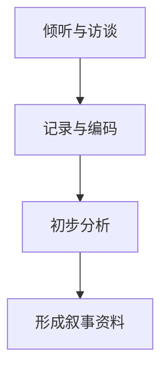
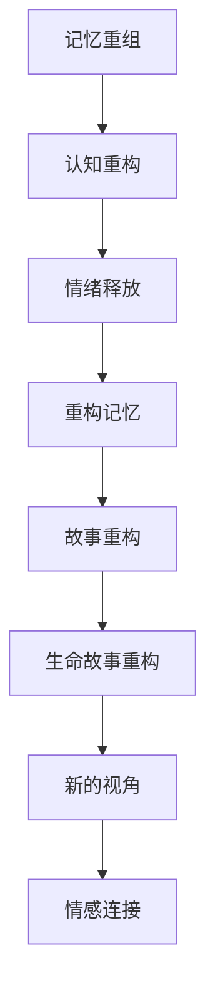
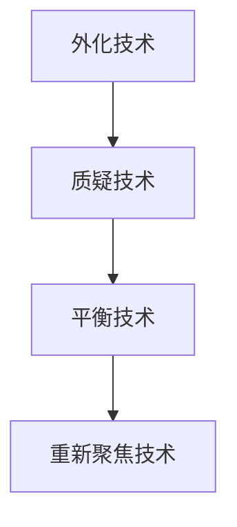
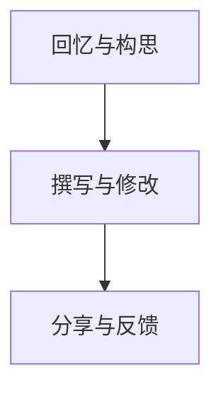

                 

### 引言与概述

#### **1.1 生命叙事的定义与重要性**

**核心概念术语说明：**
- **生命叙事**：生命叙事是指个体在生命过程中构建的故事，这些故事不仅描述了个体的经历，还反映了个体对经历的理解和情感。
- **叙事疗法**：叙事疗法是一种心理治疗方法，它强调通过重构个体的生命故事来改变他们的思维和行为模式。
- **内心创伤**：内心创伤是指由于极端压力或灾难性事件导致的长期情感困扰和心理伤害。

**问题背景：**
在现代社会，面对生活和工作中的各种压力和挑战，人们常常会经历内心创伤，这些创伤可能源自童年阴影、情感失落、职场压力等。传统的心理治疗方法如认知行为疗法（CBT）等虽然有一定的疗效，但常常局限于个体的思维和行为层面，而忽视了人类对故事的深刻需求。生命叙事疗法通过深入挖掘个体的生命故事，提供了另一种治疗内心创伤的有效途径。

**问题描述：**
如何通过生命叙事疗法来解读和识别内心的创伤？又如何通过讲故事来疗愈这些创伤？

**问题解决：**
生命叙事疗法通过以下步骤来解决内心创伤：
1. **倾听与收集**：咨询师通过倾听来访者的生命故事，收集其内心创伤的线索。
2. **解读与分析**：咨询师对收集到的故事进行解读和分析，识别内心创伤的成因和类型。
3. **重构与疗愈**：通过重构生命故事，帮助来访者重新理解自己的经历，从而实现内心的疗愈。

**边界与外延：**
生命叙事疗法不仅适用于临床心理咨询，还可以应用于教育、组织发展、个人成长等多个领域。

**概念结构与核心要素组成：**
- **核心概念：**生命叙事、叙事疗法、内心创伤
- **联系：**生命叙事是叙事疗法的基础，内心创伤是叙事疗法的治疗对象。

#### **1.2 心理咨询中的叙事疗法**

**核心概念原理：**
叙事疗法认为，个体的生命故事不仅是对经历的记录，更是对经历的意义赋予。通过重构生命故事，可以帮助个体从不同的视角看待自己的经历，从而改变对过去的负面认知，减轻内心创伤。

**概念属性特征对比表格：**

| 特征                 | 生命叙事                        | 叙事疗法                          |
|----------------------|----------------------------------|-----------------------------------|
| **基本定义**         | 个体的生命故事                  | 通过重构生命故事来治疗心理创伤   |
| **治疗目标**         | 帮助个体理解自己的经历          | 改变个体的思维和行为模式         |
| **实施方式**         | 倾听、收集和分析生命故事        | 讲故事、重构生命故事             |
| **适应人群**         | 有内心创伤的个体                | 有心理困扰的个体                  |

**ER实体关系图架构：**

```mermaid
erDiagram
  Person  ||--|{ Narrative }|-- NarrativeTherapy
  NarrativeTherapy  ||--|{ Therapist }|-- Person
```

#### **1.3 讲故事与内心疗愈**

**核心概念原理：**
讲故事是人类的一种基本交流方式，它不仅能够传递信息，还能激发情感，引导思考。在心理咨询中，讲故事能够帮助咨询师与来访者建立信任关系，同时也能够促进来访者对自己经历的反思和理解。

**概念属性特征对比表格：**

| 特征             | 讲故事                   | 内心疗愈                      |
|------------------|--------------------------|-------------------------------|
| **作用机制**     | 传递信息、激发情感       | 促进反思、理解、疗愈          |
| **适用场景**     | 教育、娱乐、咨询          | 心理治疗、情感疗愈            |
| **实施者**       | 讲述者                   | 咨询师、治疗师                |

**ER实体关系图架构：**

```mermaid
erDiagram
  StoryTeller  ||--|{ Story }|-- Therapist
  Therapist    ||--|{ Healing }|-- StoryTeller
```

通过以上三个章节的介绍，我们为后续更深入的探讨《生命叙事重构治疗：通过讲故事疗愈内心创伤的心理咨询》的细节和方法奠定了基础。接下来的章节将进一步探讨叙事重构疗法的基本原理、技术和方法，并通过对实际案例的分析，展示其应用效果。让我们继续深入思考，逐步了解这一独特而有效的心理咨询方法。

### 内心创伤的解读与识别

#### **2.1 内心创伤的成因与类型**

**核心概念原理：**
内心创伤通常由极端压力或灾难性事件引起，这些事件可能是一次严重的意外、持续的精神虐待、重大的人生变故（如失去亲人、离异等）。创伤可能会导致一系列心理和生理反应，如焦虑、抑郁、失眠、闪回、回避等。

**概念属性特征对比表格：**

| 类型                | 描述                                             | 示例                                                                                   |
|---------------------|--------------------------------------------------|----------------------------------------------------------------------------------------|
| **单一事件创伤**    | 由单一事件引起的创伤，如恐怖袭击、车祸等。        | 遭遇车祸后的持续恐惧和焦虑。                                                             |
| **复合创伤**        | 由多个事件积累形成的创伤，如长期的虐待或忽视。     | 在成长过程中长期遭受家庭暴力或忽视。                                                     |
| **突发性创伤**      | 由突发性事件引起的创伤，如地震、火灾等。           | 地震后的心理创伤和生存焦虑。                                                             |
| **累积性创伤**      | 由长期积累的压力和挑战引起的创伤，如职场压力。     | 长期工作压力导致的抑郁和身体疾病。                                                       |

**ER实体关系图架构：**

```mermaid
erDiagram
  TraumaType_Accumulative  ||--|{ PsychologicalTrauma }|-- Stress
  TraumaType_Accumulative  ||--|{ PhysicalHealth }|-- PsychologicalTrauma
  PsychologicalTrauma     ||--|{ Anxiety }|-- Stress
  Stress                  ||--|{ Depression }|-- PsychologicalTrauma
```

**2.2 心理咨询中的创伤识别方法**

**核心概念原理：**
在心理咨询中，识别内心创伤的方法多样，包括心理评估、访谈、问卷调查等。这些方法有助于咨询师全面了解来访者的创伤经历、心理状态和需求。

**概念属性特征对比表格：**

| 方法                 | 描述                                                                 | 优点                                                                                   | 缺点                                                                                   |
|----------------------|--------------------------------------------------------------------|----------------------------------------------------------------------------------------|----------------------------------------------------------------------------------------|
| **心理评估**         | 使用标准化心理评估工具，如创伤后应激障碍（PTSD）问卷。                   | 系统化、标准化，能够量化评估结果。                                                      | 可能忽视个体差异，评估工具有限。                                                       |
| **访谈**             | 咨询师与来访者进行一对一深入访谈，了解其内心创伤。                        | 能够深入挖掘个体经历，个性化强。                                                        | 受咨询师经验和技能限制，耗时较长。                                                     |
| **问卷调查**         | 使用结构化问卷收集来访者信息，如创伤经历、心理状态等。                    | 快速、简便，能够收集大量数据。                                                          | 结果可能较为表面，缺乏深入分析。                                                       |

**ER实体关系图架构：**

```mermaid
erDiagram
  PsychologicalAssessment ||--|{ Interview }|-- TraumaIdentification
  Interview               ||--|{ Questionnaire }|-- PsychologicalAssessment
  Questionnaire           ||--|{ DataCollection }|-- Interview
```

**2.3 心理症状与叙事关联**

**核心概念原理：**
心理症状如焦虑、抑郁、失眠等往往与内心创伤有着密切的关联。通过叙事疗法，咨询师可以帮助来访者识别这些症状的根源，重构生命故事，从而减轻心理负担。

**概念属性特征对比表格：**

| 症状            | 描述                                                           | 叙事关联                                                         |
|-----------------|------------------------------------------------------------|------------------------------------------------------------------|
| **焦虑**         | 持续的紧张、不安感。                                         | 可能源自童年时期的恐惧或突发事件后的心理创伤。                         |
| **抑郁**         | 情绪低落、兴趣丧失。                                         | 可能由长期的情感失落或丧失重要人物引起。                               |
| **失眠**         | 难以入睡或保持睡眠。                                         | 可能与情感压力、心理创伤有关，如童年时期的虐待经历。                   |
| **闪回**         | 强迫性回忆创伤性事件。                                       | 通常与PTSD相关，通过叙事重构可以减少闪回频率。                         |

**ER实体关系图架构：**

```mermaid
erDiagram
  Anxiety ||--|{ ChildhoodTrauma }|-- PTSD
  Depression ||--|{ EmotionalLoss }|-- LifeTrauma
  Insomnia ||--|{ EmotionalPressure }|-- Stress
  Flashback ||--|{ PTSD }|-- NarrativeReconstruction
```

通过以上章节的介绍，我们进一步探讨了内心创伤的成因与类型、心理咨询中的识别方法，以及心理症状与叙事之间的关联。这些内容为我们理解如何通过叙事疗法解读和识别内心创伤，并采用讲故事的方式进行疗愈奠定了坚实的基础。在接下来的章节中，我们将深入探讨叙事重构疗法的基本原理和技术方法，以及实际应用中的案例研究。让我们继续思考，逐步了解这一独特的心理咨询方法。

### 叙事重构疗法的基本原理

#### **3.1 历史视角与叙事视角**

**核心概念原理：**
叙事重构疗法强调从历史视角转向叙事视角来理解个体的心理创伤。历史视角关注事实和事件的发生，而叙事视角则强调个体对这些事实和事件的解读与赋予意义。通过叙事视角，个体能够重新审视自己的经历，从而改变对过去的负面认知。

**概念属性特征对比表格：**

| 视角               | 描述                                          | 对比                      |
|--------------------|-----------------------------------------------|--------------------------|
| **历史视角**       | 关注事件的发生、发展过程，强调事实。            | 过于客观，可能忽视个体感受 |
| **叙事视角**       | 关注个体对事件的解读、赋予的意义，强调个体经验。 | 更加关注内心体验和情感    |

**ER实体关系图架构：**

```mermaid
erDiagram
  HistoricalPerspective  ||--|{ Event }|-- NarrativePerspective
  Event                 ||--|{ IndividualExperience }|-- NarrativePerspective
  IndividualExperience  ||--|{ PersonalNarrative }|-- HistoricalPerspective
```

**3.2 记忆重组与叙事重构**

**核心概念原理：**
记忆重组与叙事重构是叙事疗法的关键技术。记忆重组通过改变个体的记忆结构，使创伤性记忆不再那么强烈和痛苦。叙事重构则通过重新构建生命故事，帮助个体以更加积极的方式理解自己的经历。

**概念属性特征对比表格：**

| 技术             | 描述                                                         | 对比                        |
|------------------|------------------------------------------------------------|-----------------------------|
| **记忆重组**     | 通过认知重构，降低创伤性记忆的强度和痛苦。                   | 侧重于改变记忆的生理和心理结构 |
| **叙事重构**     | 通过重新构建生命故事，赋予新的意义，减轻内心创伤。           | 侧重于心理层面的转变         |

**ER实体关系图架构：**

```mermaid
erDiagram
  MemoryReconstruction  ||--|{ CognitiveReconstruction }|-- NarrativeReconstruction
  CognitiveReconstruction ||--|{ TraumaticMemory }|-- MemoryReconstruction
  TraumaticMemory       ||--|{ EmotionalResponse }|-- CognitiveReconstruction
  NarrativeReconstruction ||--|{ LifeStory }|-- EmotionalResponse
  LifeStory             ||--|{ NewMeaning }|-- NarrativeReconstruction
```

**3.3 叙事治疗师的职责与角色**

**核心概念原理：**
叙事治疗师在治疗过程中扮演多重角色，包括倾听者、引导者和共同创作者。他们不仅要具备深厚的心理学背景，还需要有良好的叙事技巧和同理心，以帮助来访者重构生命故事。

**概念属性特征对比表格：**

| 角色             | 描述                                          | 对比                      |
|------------------|-----------------------------------------------|--------------------------|
| **倾听者**       | 倾听来访者的生命故事，理解其内心体验。            | 必须有耐心和同理心       |
| **引导者**       | 引导来访者进行记忆重组和叙事重构，提供新的视角。   | 需要专业知识和经验       |
| **共同创作者**    | 与来访者一起创作新的生命故事，促进其自我疗愈。     | 需要良好的沟通和协作能力 |

**ER实体关系图架构：**

```mermaid
erDiagram
  Listener  ||--|{ Guide }|-- Collaborator
  Guide     ||--|{ NarrativeReconstruction }|-- Collaborator
  Collaborator ||--|{ NewLifeStory }|-- Guide
```

通过以上章节的介绍，我们深入探讨了叙事重构疗法的基本原理，包括历史视角与叙事视角的区别、记忆重组与叙事重构的技术方法，以及叙事治疗师的职责与角色。这些内容为我们理解叙事疗法提供了理论基础，为后续章节中具体方法的介绍和实际案例的分析打下了基础。在接下来的章节中，我们将继续深入探讨叙事重构疗法的具体技术和方法，以及其在实际应用中的效果。让我们继续思考，逐步了解这一独特的心理咨询方法。

### 叙事重构治疗的技术与方法

#### **4.1 生命故事的收集与分析**

**核心概念原理：**
叙事重构疗法的第一步是收集和分析来访者的生命故事。通过倾听和访谈，咨询师可以收集来访者的经历、情感和想法，形成详细的叙事资料。这些资料是后续分析和重构的基础。

**收集与分析流程：**
1. **倾听与访谈**：咨询师通过与来访者进行一对一的深入访谈，收集其生命故事。这一过程中，咨询师需保持开放和同理的态度，确保来访者能够自由表达。
2. **记录与编码**：咨询师将访谈内容进行记录，并对关键信息进行编码，如事件发生的时间、地点、主要人物和来访者的情感反应。
3. **初步分析**：咨询师对记录的资料进行初步分析，识别故事中的关键元素，如创伤事件、情感冲突、重要关系等。

**流程Mermaid图：**



#### **4.2 叙事重构的核心步骤**

**核心概念原理：**
叙事重构的核心步骤包括记忆重组和故事重构。记忆重组旨在降低创伤性记忆的强度和痛苦，而故事重构则通过重新构建生命故事，赋予新的意义。

**核心步骤：**
1. **记忆重组**：
   - **认知重构**：咨询师帮助来访者重新审视过去的创伤性事件，改变其认知结构和情感反应。
   - **情绪释放**：通过呼吸、放松等技巧，帮助来访者释放与创伤相关的负面情绪。
   - **重构记忆**：咨询师与来访者一起重构记忆，使其更加积极和可控。

2. **故事重构**：
   - **生命故事重构**：咨询师与来访者共同创作新的生命故事，使其更加积极和有意义。
   - **新的视角**：通过引入新的叙事视角，帮助来访者从不同角度看问题，减轻心理负担。
   - **情感连接**：新的生命故事需要包含积极情感和正面角色，以促进来访者的情感连接和自我疗愈。

**流程Mermaid图：**



#### **4.3 常见的叙事治疗技术**

**核心概念原理：**
叙事治疗技术是叙事重构疗法的重要组成部分，包括但不限于以下几种技术：

1. **外化技术**：通过将创伤性记忆“外化”为独立的实体，帮助来访者与创伤分离。
2. **质疑技术**：咨询师通过质疑来访者的负面叙述，帮助其发现新的叙事视角。
3. **平衡技术**：通过引入平衡的叙事元素，帮助来访者看到问题的多面性。
4. **重新聚焦技术**：咨询师帮助来访者将注意力从创伤性事件转移到积极的经历和资源上。

**技术详细介绍：**

1. **外化技术**：
   - **核心原理**：将内在的心理问题转化为外部实体，使其更易于管理和控制。
   - **实施步骤**：咨询师与来访者共同创造一个象征性的实体，如一个物品、角色或故事角色，代表来访者内心的困扰。
   - **实例**：一位经历过家庭暴力的来访者可能将自己的愤怒“外化”为一个恶魔，从而更容易控制和应对。

2. **质疑技术**：
   - **核心原理**：通过质疑来访者的负面叙述，帮助其发现新的叙事视角。
   - **实施步骤**：咨询师引导来访者反思其叙述中的负面元素，提出替代性的解释和观点。
   - **实例**：咨询师可能帮助一位抑郁的来访者质疑其“我不值得幸福”的叙述，并提出“每个人都有权利追求幸福”的新观点。

3. **平衡技术**：
   - **核心原理**：通过引入平衡的叙事元素，帮助来访者看到问题的多面性。
   - **实施步骤**：咨询师引导来访者识别和描述问题情境中的积极方面和资源。
   - **实例**：咨询师可能帮助一位失业的来访者看到自己的职业技能和人际关系网络，从而增强其自信心和应对能力。

4. **重新聚焦技术**：
   - **核心原理**：将来访者的注意力从创伤性事件转移到积极的经历和资源上。
   - **实施步骤**：咨询师引导来访者关注当前生活中的积极方面和未来的可能性。
   - **实例**：咨询师可能鼓励一位遭受严重车祸的来访者关注其康复过程中的进步和未来的目标。

**流程Mermaid图：**



通过以上章节的介绍，我们深入探讨了叙事重构治疗的技术与方法，包括生命故事的收集与分析、叙事重构的核心步骤以及常见的技术。这些内容为我们理解如何通过叙事疗法帮助来访者疗愈内心创伤提供了具体的操作指南。在接下来的章节中，我们将通过实际案例的分析，展示这些技术在实际应用中的效果。让我们继续思考，逐步了解这一独特的心理咨询方法。

### 讲故事的艺术

#### **5.1 故事的构成要素**

**核心概念原理：**
一个完整的故事通常由以下四个基本要素构成：冲突、角色、情节和结局。这些要素相互作用，共同构建一个引人入胜的叙事。

**构成要素详细解释：**
1. **冲突**：冲突是故事的核心驱动力，可以是内在的心理冲突，也可以是外在的事件冲突。冲突为故事提供了紧张感和动力。
2. **角色**：角色是故事中的关键人物，他们通过行动和决策推动故事的发展。角色通常有鲜明的个性和动机，能够引起读者的共鸣。
3. **情节**：情节是故事的发展过程，包括一系列事件和转折点。情节的设计需要具有逻辑性和连贯性，以维持读者的兴趣。
4. **结局**：结局是故事的最终解决方案，可以是圆满的，也可以是开放式的。一个好的结局能够给读者留下深刻的印象。

**表格：故事构成要素**

| 要素     | 描述                                                         | 作用                     |
|----------|--------------------------------------------------------------|--------------------------|
| 冲突     | 故事的紧张点和驱动力。                                       | 维持故事的张力           |
| 角色     | 故事中的主要人物，具有动机和行动能力。                        | 引起读者共鸣和兴趣       |
| 情节     | 故事的事件发展过程，包括高潮和低谷。                         | 推动故事向前发展         |
| 结局     | 故事的最终解决方案，给读者留下印象。                         | 给故事一个完整的闭环     |

**ER实体关系图架构：**

```mermaid
erDiagram
  Conflict ||--|{ Role }| Role
  Role     ||--|{ Plot }| Plot
  Plot     ||--|{ Ending }| Ending
  Ending   ||--|{ Story }| Story
```

#### **5.2 故事的讲述技巧**

**核心概念原理：**
讲述技巧是讲故事的关键，决定了故事能否引起听众的兴趣和共鸣。以下是一些常见的讲述技巧：

1. **设定背景**：通过设定时间、地点和情境，为故事创造一个具体的背景，帮助听众更好地理解和投入。
2. **使用隐喻**：隐喻是一种有力的叙事工具，可以通过将复杂的概念转化为简单的比喻，使故事更加生动和引人入胜。
3. **构建悬念**：通过设置悬念和转折点，保持听众的好奇心和兴趣，推动故事的发展。
4. **情感表达**：通过语言和肢体语言，传递情感和氛围，使故事更加真实和感人。

**技巧详细解释：**
1. **设定背景**：
   - **背景设定**：通过描述环境、气氛和人物关系，为故事提供一个明确的背景。
   - **背景的重要性**：背景设定有助于听众更好地理解故事发生的情境，增强故事的真实感和代入感。

2. **使用隐喻**：
   - **隐喻的应用**：通过隐喻将抽象的概念转化为具体的形象，使故事更加生动和有趣。
   - **隐喻的作用**：隐喻可以帮助听众更直观地理解复杂的概念，增强故事的感染力。

3. **构建悬念**：
   - **悬念的设置**：通过在故事中设置悬念和转折点，保持听众的好奇心和兴趣。
   - **悬念的作用**：悬念是故事的驱动力，能够推动听众继续关注故事的发展，增强故事的吸引力。

4. **情感表达**：
   - **语言的情感表达**：通过选择合适的词汇和语言节奏，传达情感和氛围。
   - **肢体语言的情感表达**：通过姿态、手势和面部表情，传达情感和态度。

**表格：故事讲述技巧**

| 技巧       | 描述                                                         | 作用                     |
|------------|--------------------------------------------------------------|--------------------------|
| 设定背景   | 描述时间、地点和情境，为故事创造背景。                       | 增强故事的真实感和代入感 |
| 使用隐喻   | 将抽象概念转化为具体比喻，使故事更加生动。                   | 增强故事的感染力         |
| 构建悬念   | 设置悬念和转折点，保持听众的兴趣。                           | 推动故事发展             |
| 情感表达   | 通过语言和肢体语言传递情感和氛围。                           | 增强故事的感人程度       |

**ER实体关系图架构：**

```mermaid
erDiagram
  BackgroundSetting ||--|{ Metaphor }| Metaphor
  Metaphor          ||--|{ Suspense }| Suspense
  Suspense          ||--|{ EmotionalExpression }| EmotionalExpression
  EmotionalExpression ||--|{ StoryTellingSkills }| StoryTellingSkills
```

#### **5.3 疗愈性故事的创作与分享**

**核心概念原理：**
疗愈性故事通过讲述个体的经历和成长，帮助听众理解和面对自己的挑战，从而实现心理疗愈。创作和分享疗愈性故事需要关注以下几点：

**创作与分享要点：**
1. **真实感**：疗愈性故事需要基于真实经历，以增强其可信度和感染力。
2. **情感共鸣**：故事需要能够引起听众的情感共鸣，使他们感受到同样的情感体验。
3. **积极视角**：故事需要从积极的角度看待挑战和困境，帮助听众看到希望和可能性。
4. **行动激励**：故事需要激励听众采取行动，实现个人成长和心理疗愈。

**创作与分享流程：**
1. **回忆与构思**：回忆自己的经历，构思故事的基本框架和情节。
2. **撰写与修改**：撰写故事初稿，并进行反复修改，确保故事的逻辑性和连贯性。
3. **分享与反馈**：在适当场合分享故事，收集听众的反馈，进行进一步的调整和优化。

**流程Mermaid图：**



通过以上章节的介绍，我们深入探讨了故事的构成要素、讲述技巧以及疗愈性故事的创作与分享。这些内容为我们理解如何通过讲故事实现心理疗愈提供了理论指导和实际操作方法。在接下来的章节中，我们将通过实际案例的分析，展示叙事重构疗法在心理咨询中的具体应用效果。让我们继续思考，逐步了解这一独特的心理咨询方法。

### 个案研究与分析

#### **6.1 案例一：童年创伤的疗愈**

**案例背景：**
来访者小王（化名），男性，30岁，因为童年时期的家庭暴力问题前来寻求心理帮助。他的父亲经常酗酒，并在酒后对他进行身体和心理上的虐待。小王长大后，这些经历一直困扰着他，表现为持续的焦虑、失眠和抑郁。

**案例分析与叙事重构：**
1. **倾听与收集**：
   - 咨询师通过倾听，了解了小王的童年经历和当前的心理状况，收集到关键信息，包括家庭暴力事件的频率和影响、小王对父亲的情感等。
2. **解读与分析**：
   - 咨询师帮助小王识别出其心理症状的根源，即童年时期的家庭暴力。通过分析，咨询师发现小王的焦虑和抑郁与对父亲的愤怒和内疚有关。
3. **记忆重组与重构**：
   - **记忆重组**：咨询师引导小王采用记忆重组技术，通过放松技巧和认知重构，降低家庭暴力记忆的强度和痛苦。
   - **故事重构**：咨询师与小王共同创作新的生命故事，将家庭暴力经历转化为成长的故事。例如，咨询师引导小王认识到，尽管父亲的行为不可接受，但他也有责任保护自己，并从中学会了如何处理冲突和情感。
4. **情感连接与疗愈**：
   - 在重构过程中，小王逐渐能够理解自己的情感和行为，并与咨询师建立了良好的情感连接。随着新故事的创作，小王的焦虑和抑郁症状明显减轻，他开始能够积极面对生活。

**案例分析结果：**
通过叙事重构疗法，小王成功地疗愈了童年时期的创伤。他不再被过去的痛苦所困扰，能够以更加积极和自信的态度面对生活。这一案例展示了叙事重构疗法在处理复杂心理问题中的有效性，以及通过讲故事实现心理疗愈的潜力。

#### **6.2 案例二：情感困扰的转化**

**案例背景：**
来访者小李（化名），女性，25岁，因为长期的情感困扰前来寻求心理帮助。她经历过几次恋爱失败，每次都感到心灰意冷，对未来失去了希望。小李感到自己无法走出情感的阴影，生活变得消极和无聊。

**案例分析与叙事重构：**
1. **倾听与收集**：
   - 咨询师通过倾听，了解了小李的情感经历和当前的心理状况，收集到关键信息，包括她的恋爱史、情感反应和内心的挣扎。
2. **解读与分析**：
   - 咨询师帮助小李识别出其情感困扰的根源，即过去的恋爱失败和对未来的担忧。通过分析，咨询师发现小李的消极情绪源于对自我价值的怀疑和对爱情的恐惧。
3. **记忆重组与重构**：
   - **记忆重组**：咨询师引导小李采用记忆重组技术，通过认知重构，改变她对过去恋爱失败的记忆，减少负面情感的影响。
   - **故事重构**：咨询师与小李共同创作新的生命故事，将过去的失败经历转化为成长的机会。例如，咨询师引导小李认识到，每次恋爱都是一次学习和成长的机会，尽管结果不尽如人意，但她从中学到了很多关于自己和爱情的重要信息。
4. **情感连接与疗愈**：
   - 在重构过程中，小李逐渐能够从新的视角看待过去的经历，并与咨询师建立了良好的情感连接。随着新故事的创作，小李的情感困扰显著减轻，她开始对未来充满希望，积极面对生活。

**案例分析结果：**
通过叙事重构疗法，小李成功地转化了情感困扰，从过去的阴影中走出，重拾生活的热情。这一案例再次证明了叙事重构疗法在处理情感问题中的有效性，以及通过重新构建生命故事实现心理疗愈的潜力。

#### **6.3 案例三：家庭关系的重构**

**案例背景：**
来访者小张（化名），男性，40岁，因为与家人的关系问题前来寻求心理帮助。小张与父母之间的关系一直紧张，经常发生争吵和冲突。这些冲突对他在工作和个人生活中造成了极大的困扰，他感到自己无法摆脱家庭的影响。

**案例分析与叙事重构：**
1. **倾听与收集**：
   - 咨询师通过倾听，了解了小张与家人的关系状况和当前的心理状况，收集到关键信息，包括家庭冲突的频率、程度和影响。
2. **解读与分析**：
   - 咨询师帮助小张识别出其家庭冲突的根源，即深层次的沟通问题和价值观念的差异。通过分析，咨询师发现小张的内心充满了对父母的愤怒和失望，同时也感到自己对家庭的责任。
3. **记忆重组与重构**：
   - **记忆重组**：咨询师引导小张采用记忆重组技术，通过认知重构，减少对家庭冲突的记忆强度和痛苦。
   - **故事重构**：咨询师与小张共同创作新的家庭故事，将冲突转化为理解和和解的过程。例如，咨询师引导小张认识到，虽然与父母的冲突不可避免，但他可以通过理解和沟通，改善与他们的关系。
4. **情感连接与疗愈**：
   - 在重构过程中，小张逐渐能够理解父母的立场和情感，并与咨询师建立了良好的情感连接。随着新家庭故事的创作，小张与父母的关系逐渐改善，他开始能够以更加积极和建设性的方式处理家庭冲突。

**案例分析结果：**
通过叙事重构疗法，小张成功地重构了与家人的关系，从过去的冲突中走出，实现了内心的疗愈。这一案例再次展示了叙事重构疗法在处理复杂家庭关系问题中的有效性，以及通过重新构建家庭故事实现心理疗愈的潜力。

通过以上三个实际案例的分析，我们可以看到叙事重构疗法在处理不同类型的心理问题中的广泛应用和显著效果。这些案例不仅验证了叙事重构疗法的有效性，还展示了通过讲故事实现心理疗愈的巨大潜力。在接下来的章节中，我们将进一步探讨生命叙事重构治疗的实践与应用，以及其未来发展的方向。让我们继续思考，逐步了解这一独特的心理咨询方法。

### 生命叙事重构治疗的实践与应用

#### **7.1 临床心理咨询中的应用**

**核心概念原理：**
生命叙事重构治疗在临床心理咨询中有着广泛的应用。它通过重构来访者的生命故事，帮助其理解并改变对过去经历的负面认知，从而减轻内心创伤和心理症状。

**具体应用场景：**
1. **心理创伤治疗**：对于经历过重大创伤事件的来访者，如战争、性侵、自然灾害等，叙事重构治疗可以帮助他们重新构建经历，减轻创伤后的应激反应。
2. **情感困扰治疗**：对于情感困扰的来访者，如失恋、家庭矛盾、职场压力等，叙事重构治疗可以通过重构生命故事，帮助其找到新的视角和解决方法。
3. **抑郁症治疗**：对于抑郁症患者，叙事重构治疗可以通过改变其对生活的消极看法，重构积极的生命故事，从而改善情绪状态。

**实践效果：**
临床心理咨询中的实践表明，叙事重构疗法在减轻来访者心理症状、提高生活质量方面具有显著效果。例如，通过重构童年创伤经历，来访者能够更好地理解和接纳自己，减少焦虑和抑郁症状。

#### **7.2 教育与组织发展中的应用**

**核心概念原理：**
生命叙事重构治疗不仅适用于临床心理咨询，还可以在教育和组织发展中发挥重要作用。通过讲故事和叙事重构，教育者和组织管理者可以促进个体的自我反思和成长，提升组织的凝聚力和创造力。

**具体应用场景：**
1. **教育领域**：在教育中，教师可以通过讲述学生的故事，帮助他们认识到自己的潜能和成长路径，从而提高学习动力和自我效能感。
2. **组织发展**：在组织中，管理者可以通过叙事重构，促进团队成员之间的沟通和理解，增强团队的凝聚力和合作精神。

**实践效果：**
在教育领域，叙事重构治疗有助于学生建立自信、提高学习效果；在组织发展中，叙事重构治疗有助于提升员工的心理素质和工作积极性，促进组织的持续发展。

#### **7.3 个人成长与自我疗愈**

**核心概念原理：**
生命叙事重构治疗不仅是一种专业的心理咨询方法，还可以应用于个人的自我成长和疗愈。通过自我反思和叙事重构，个体可以更好地理解自己的经历，实现内心的平和与成长。

**具体应用场景：**
1. **自我反思**：个体可以通过记录和反思自己的生命故事，了解自己的情感和行为模式，从而进行自我调整和改善。
2. **情感疗愈**：个体可以通过叙事重构，重新赋予过去的经历新的意义，减轻情感负担，实现内心的疗愈。

**实践效果：**
个人成长和自我疗愈中的实践表明，生命叙事重构治疗有助于个体实现内心的平和与成长，提高自我认知和情感管理能力。

### **8.1 技术进步与叙事疗法的发展**

**核心概念原理：**
随着技术的不断进步，叙事疗法也在不断发展。人工智能、虚拟现实等新兴技术为叙事疗法提供了新的工具和方法，使其能够更有效地应用于临床、教育和个人成长等领域。

**技术进步对叙事疗法的影响：**
1. **个性化治疗**：人工智能技术可以帮助咨询师进行更精准的诊断和个性化的治疗方案，提高治疗效果。
2. **虚拟现实应用**：虚拟现实技术可以创造逼真的情境，帮助来访者体验和重构生命故事，增强治疗效果。
3. **数据分析**：大数据分析和机器学习技术可以分析大量叙事资料，提取有价值的信息，为叙事重构提供数据支持。

**未来展望：**
随着技术的进一步发展，叙事疗法有望实现更广泛的应用和更高的治疗效果。通过结合人工智能和虚拟现实等技术，叙事疗法将能够为更多的人提供有效的心理支持和疗愈。

### **8.2 生命叙事重构治疗的跨文化应用**

**核心概念原理：**
生命叙事重构治疗不仅适用于西方文化，还可以在跨文化环境中发挥作用。不同文化背景下的个体在面对心理创伤和情感困扰时，可以通过叙事重构找到适合自己的疗愈方式。

**跨文化应用的优势与挑战：**
**优势：**
1. **文化适应性**：叙事疗法可以根据不同文化背景进行调整，使其更符合来访者的文化价值观。
2. **包容性**：叙事疗法强调个体的主观体验，能够更好地理解和尊重不同文化背景下的个体。

**挑战：**
1. **文化差异**：不同文化对创伤和治疗的看法可能存在差异，需要咨询师具备跨文化敏感性。
2. **语言障碍**：在跨文化应用中，语言障碍可能会影响咨询效果，需要咨询师具备良好的语言沟通能力。

**未来展望：**
随着全球化的深入，生命叙事重构治疗的跨文化应用将越来越普遍。通过不断探索和适应，叙事疗法将在全球范围内发挥更大的作用，为不同文化背景下的个体提供心理支持和疗愈。

### **8.3 生命叙事重构治疗在特殊人群中的应用**

**核心概念原理：**
生命叙事重构治疗不仅适用于普通人群，还可以在特殊人群（如儿童、老年人、残障人士等）中发挥重要作用。通过针对性的叙事重构方法，帮助这些特殊人群更好地应对心理创伤和情感困扰。

**具体应用场景：**
1. **儿童心理治疗**：对于儿童，叙事重构治疗可以通过简单易懂的故事和游戏方式，帮助他们理解和表达内心的创伤。
2. **老年心理支持**：对于老年人，叙事重构治疗可以帮助他们回顾和分享生命故事，增强自我认同和生命意义。
3. **残障人士辅导**：对于残障人士，叙事重构治疗可以鼓励他们重新评价自己的经历和身份，增强自信心和自尊心。

**实践效果：**
实践表明，生命叙事重构治疗在特殊人群中的应用具有显著效果。通过针对性强的叙事重构方法，特殊人群能够更好地理解和应对心理创伤，提高生活质量和心理健康水平。

**未来展望：**
随着对特殊人群心理需求的不断关注和探索，生命叙事重构治疗将在这些领域中发挥更大的作用。通过结合其他治疗方法和技术手段，叙事疗法将为特殊人群提供更加全面和有效的心理支持。

### **总结与展望**

#### **9.1 生命叙事重构治疗的核心理念**

生命叙事重构治疗的核心理念是通过重构个体的生命故事，帮助其理解和改变对过去经历的负面认知，从而实现心理疗愈和自我成长。这一方法强调个体的主观体验和情感表达，通过叙事视角重新审视生命中的挑战和困境，寻找新的意义和视角。

#### **9.2 临床应用中的挑战与机遇**

**挑战：**
1. **文化差异**：在不同文化背景下，生命叙事重构治疗需要充分考虑文化差异，以确保治疗方法的有效性和适用性。
2. **技术限制**：虽然叙事疗法在临床中广泛应用，但现有技术手段（如人工智能和虚拟现实）在普及和应用方面仍存在一定的限制。

**机遇：**
1. **技术进步**：随着人工智能和虚拟现实技术的不断发展，叙事疗法有望实现更广泛的应用和更高的治疗效果。
2. **跨学科研究**：生命叙事重构治疗可以与心理学、教育学、医学等学科交叉研究，探索其在不同领域中的应用前景。

#### **9.3 未来研究的方向与建议**

**未来研究方向：**
1. **跨文化研究**：深入研究生命叙事重构治疗在不同文化背景下的适用性和效果，探索跨文化应用的最佳实践。
2. **技术融合**：结合人工智能和虚拟现实等新兴技术，开发更加智能和个性化的叙事疗法工具，提升治疗效果。

**研究建议：**
1. **开展多中心、大规模的临床研究**，验证生命叙事重构治疗在不同人群中的应用效果。
2. **促进跨学科合作**，探索叙事疗法与其他治疗方法的结合，为心理健康领域提供更全面的治疗方案。

通过总结与展望，我们进一步深化了对生命叙事重构治疗的理解，并明确了未来研究的发展方向。这一方法不仅为心理咨询提供了新的视角和方法，也为个体的心理疗愈和自我成长提供了有效途径。在未来的研究和实践中，生命叙事重构治疗有望在更广泛的领域发挥其独特的作用，为更多的人带来心理疗愈和成长。

### 完整文章

# 生命叙事重构治疗：通过讲故事疗愈内心创伤的心理咨询

> 关键词：生命叙事、心理疗愈、叙事疗法、内心创伤、讲故事

> 摘要：本文旨在探讨生命叙事重构治疗在心理咨询中的应用，通过分析生命叙事的定义与重要性、内心创伤的解读与识别、叙事重构疗法的基本原理、具体技术与方法，以及实际案例，展示其通过讲故事疗愈内心创伤的独特效果。文章还展望了生命叙事重构治疗的未来发展，包括跨文化应用和新技术融合的方向。

## 第一部分：引言与概述

### 第1章：生命的叙事视角
#### 1.1 生命叙事的定义与重要性
**核心概念术语说明**：生命叙事是指个体在生命过程中构建的故事，这些故事不仅描述了个体的经历，还反映了个体对经历的理解和情感。叙事疗法是一种心理治疗方法，它强调通过重构个体的生命故事来改变他们的思维和行为模式。内心创伤是指由于极端压力或灾难性事件导致的长期情感困扰和心理伤害。

**问题背景**：在现代社会，面对生活和工作中的各种压力和挑战，人们常常会经历内心创伤，这些创伤可能源自童年阴影、情感失落、职场压力等。传统的心理治疗方法如认知行为疗法（CBT）等虽然有一定的疗效，但常常局限于个体的思维和行为层面，而忽视了人类对故事的深刻需求。生命叙事疗法通过深入挖掘个体的生命故事，提供了另一种治疗内心创伤的有效途径。

**问题描述**：如何通过生命叙事疗法来解读和识别内心的创伤？又如何通过讲故事来疗愈这些创伤？

**问题解决**：生命叙事疗法通过以下步骤来解决内心创伤：倾听与收集来访者的生命故事，收集其内心创伤的线索；解读与分析故事，识别内心创伤的成因和类型；重构与疗愈，通过重构生命故事，帮助来访者重新理解自己的经历，从而实现内心的疗愈。

**边界与外延**：生命叙事疗法不仅适用于临床心理咨询，还可以应用于教育、组织发展、个人成长等多个领域。

**概念结构与核心要素组成**：
- **核心概念**：生命叙事、叙事疗法、内心创伤
- **联系**：生命叙事是叙事疗法的基础，内心创伤是叙事疗法的治疗对象。

### 第2章：内心创伤的解读与识别
#### 2.1 内心创伤的成因与类型
**核心概念原理**：内心创伤通常由极端压力或灾难性事件引起，这些事件可能是一次严重的意外、持续的精神虐待、重大的人生变故（如失去亲人、离异等）。创伤可能会导致一系列心理和生理反应，如焦虑、抑郁、失眠、闪回、回避等。

**概念属性特征对比表格**：

| 类型                | 描述                                             | 示例                                                                                   |
|---------------------|--------------------------------------------------|----------------------------------------------------------------------------------------|
| **单一事件创伤**    | 由单一事件引起的创伤，如恐怖袭击、车祸等。        | 遭遇车祸后的持续恐惧和焦虑。                                                             |
| **复合创伤**        | 由多个事件积累形成的创伤，如长期的虐待或忽视。     | 在成长过程中长期遭受家庭暴力或忽视。                                                     |
| **突发性创伤**      | 由突发性事件引起的创伤，如地震、火灾等。           | 地震后的心理创伤和生存焦虑。                                                             |
| **累积性创伤**      | 由长期积累的压力和挑战引起的创伤，如职场压力。     | 长期工作压力导致的抑郁和身体疾病。                                                       |

**ER实体关系图架构**：

```mermaid
erDiagram
  TraumaType_Accumulative  ||--|{ PsychologicalTrauma }|-- Stress
  TraumaType_Accumulative  ||--|{ PhysicalHealth }|-- PsychologicalTrauma
  PsychologicalTrauma     ||--|{ Anxiety }|-- Stress
  Stress                  ||--|{ Depression }|-- PsychologicalTrauma
```

#### 2.2 心理咨询中的创伤识别方法
**核心概念原理**：在心理咨询中，识别内心创伤的方法多样，包括心理评估、访谈、问卷调查等。这些方法有助于咨询师全面了解来访者的创伤经历、心理状态和需求。

**概念属性特征对比表格**：

| 方法                 | 描述                                                                 | 优点                                                                                   | 缺点                                                                                   |
|----------------------|--------------------------------------------------------------------|----------------------------------------------------------------------------------------|----------------------------------------------------------------------------------------|
| **心理评估**         | 使用标准化心理评估工具，如创伤后应激障碍（PTSD）问卷。                   | 系统化、标准化，能够量化评估结果。                                                      | 可能忽视个体差异，评估工具有限。                                                       |
| **访谈**             | 咨询师与来访者进行一对一深入访谈，了解其内心创伤。                        | 能够深入挖掘个体经历，个性化强。                                                        | 受咨询师经验和技能限制，耗时较长。                                                     |
| **问卷调查**         | 使用结构化问卷收集来访者信息，如创伤经历、心理状态等。                    | 快速、简便，能够收集大量数据。                                                          | 结果可能较为表面，缺乏深入分析。                                                       |

**ER实体关系图架构**：

```mermaid
erDiagram
  PsychologicalAssessment ||--|{ Interview }|-- TraumaIdentification
  Interview               ||--|{ Questionnaire }|-- PsychologicalAssessment
  Questionnaire           ||--|{ DataCollection }|-- Interview
```

#### 2.3 心理症状与叙事关联
**核心概念原理**：心理症状如焦虑、抑郁、失眠等往往与内心创伤有着密切的关联。通过叙事疗法，咨询师可以帮助来访者识别这些症状的根源，重构生命故事，从而减轻心理负担。

**概念属性特征对比表格**：

| 症状            | 描述                                                           | 叙事关联                                                         |
|-----------------|------------------------------------------------------------|------------------------------------------------------------------|
| **焦虑**         | 持续的紧张、不安感。                                         | 可能源自童年时期的恐惧或突发事件后的心理创伤。                         |
| **抑郁**         | 情绪低落、兴趣丧失。                                         | 可能由长期的情感失落或丧失重要人物引起。                               |
| **失眠**         | 难以入睡或保持睡眠。                                         | 可能与情感压力、心理创伤有关，如童年时期的虐待经历。                   |
| **闪回**         | 强迫性回忆创伤性事件。                                       | 通常与PTSD相关，通过叙事重构可以减少闪回频率。                         |

**ER实体关系图架构**：

```mermaid
erDiagram
  Anxiety ||--|{ ChildhoodTrauma }|-- PTSD
  Depression ||--|{ EmotionalLoss }|-- LifeTrauma
  Insomnia ||--|{ EmotionalPressure }|-- Stress
  Flashback ||--|{ PTSD }|-- NarrativeReconstruction
```

## 第二部分：叙事重构治疗方法与实践

### 第3章：叙事重构疗法的基本原理
#### 3.1 历史视角与叙事视角
**核心概念原理**：叙事重构疗法强调从历史视角转向叙事视角来理解个体的心理创伤。历史视角关注事实和事件的发生，而叙事视角则强调个体对这些事实和事件的解读与赋予意义。通过叙事视角，个体能够重新审视自己的经历，从而改变对过去的负面认知。

**概念属性特征对比表格**：

| 视角               | 描述                                          | 对比                      |
|--------------------|-----------------------------------------------|--------------------------|
| **历史视角**       | 关注事件的发生、发展过程，强调事实。            | 过于客观，可能忽视个体感受 |
| **叙事视角**       | 关注个体对事件的解读、赋予的意义，强调个体经验。 | 更加关注内心体验和情感    |

**ER实体关系图架构**：

```mermaid
erDiagram
  HistoricalPerspective  ||--|{ Event }|-- NarrativePerspective
  Event                 ||--|{ IndividualExperience }|-- NarrativePerspective
  IndividualExperience  ||--|{ PersonalNarrative }|-- HistoricalPerspective
```

#### 3.2 记忆重组与叙事重构
**核心概念原理**：记忆重组与叙事重构是叙事疗法的关键技术。记忆重组通过改变个体的记忆结构，使创伤性记忆不再那么强烈和痛苦。叙事重构则通过重新构建生命故事，帮助个体以更加积极的方式理解自己的经历。

**概念属性特征对比表格**：

| 技术             | 描述                                                         | 对比                        |
|------------------|------------------------------------------------------------|-----------------------------|
| **记忆重组**     | 通过认知重构，降低创伤性记忆的强度和痛苦。                   | 侧重于改变记忆的生理和心理结构 |
| **叙事重构**     | 通过重新构建生命故事，赋予新的意义，减轻内心创伤。           | 侧重于心理层面的转变         |

**ER实体关系图架构**：

```mermaid
erDiagram
  MemoryReconstruction  ||--|{ CognitiveReconstruction }|-- NarrativeReconstruction
  CognitiveReconstruction ||--|{ TraumaticMemory }|-- MemoryReconstruction
  TraumaticMemory       ||--|{ EmotionalResponse }|-- CognitiveReconstruction
  NarrativeReconstruction ||--|{ LifeStory }|-- EmotionalResponse
  LifeStory             ||--|{ NewMeaning }|-- NarrativeReconstruction
```

#### 3.3 叙事治疗师的职责与角色
**核心概念原理**：叙事治疗师在治疗过程中扮演多重角色，包括倾听者、引导者和共同创作者。他们不仅要具备深厚的心理学背景，还需要有良好的叙事技巧和同理心，以帮助来访者重构生命故事。

**概念属性特征对比表格**：

| 角色             | 描述                                          | 对比                      |
|------------------|-----------------------------------------------|--------------------------|
| **倾听者**       | 倾听来访者的生命故事，理解其内心体验。            | 必须有耐心和同理心       |
| **引导者**       | 引导来访者进行记忆重组和叙事重构，提供新的视角。   | 需要专业知识和经验       |
| **共同创作者**    | 与来访者一起创作新的生命故事，促进其自我疗愈。     | 需要良好的沟通和协作能力 |

**ER实体关系图架构**：

```mermaid
erDiagram
  Listener  ||--|{ Guide }|-- Collaborator
  Guide     ||--|{ NarrativeReconstruction }|-- Collaborator
  Collaborator ||--|{ NewLifeStory }|-- Guide
```

### 第4章：叙事重构治疗的技术与方法
#### 4.1 生命故事的收集与分析
**核心概念原理**：叙事重构疗法的第一步是收集和分析来访者的生命故事。通过倾听和访谈，咨询师可以收集来访者的经历、情感和想法，形成详细的叙事资料。这些资料是后续分析和重构的基础。

**收集与分析流程**：
1. **倾听与访谈**：咨询师通过与来访者进行一对一的深入访谈，收集其生命故事。这一过程中，咨询师需保持开放和同理的态度，确保来访者能够自由表达。
2. **记录与编码**：咨询师将访谈内容进行记录，并对关键信息进行编码，如事件发生的时间、地点、主要人物和来访者的情感反应。
3. **初步分析**：咨询师对记录的资料进行初步分析，识别故事中的关键元素，如创伤事件、情感冲突、重要关系等。

**流程Mermaid图**：

```mermaid
graph TB
    A[倾听与访谈] --> B[记录与编码]
    B --> C[初步分析]
    C --> D[形成叙事资料]
```

#### 4.2 叙事重构的核心步骤
**核心概念原理**：叙事重构的核心步骤包括记忆重组和故事重构。记忆重组通过改变个体的记忆结构，使创伤性记忆不再那么强烈和痛苦。叙事重构则通过重新构建生命故事，帮助个体以更加积极的方式理解自己的经历。

**核心步骤**：
1. **记忆重组**：
   - **认知重构**：咨询师帮助来访者重新审视过去的创伤性事件，改变其认知结构和情感反应。
   - **情绪释放**：通过呼吸、放松等技巧，帮助来访者释放与创伤相关的负面情绪。
   - **重构记忆**：咨询师与来访者一起重构记忆，使其更加积极和可控。

2. **故事重构**：
   - **生命故事重构**：咨询师与来访者共同创作新的生命故事，使其更加积极和有意义。
   - **新的视角**：通过引入新的叙事视角，帮助来访者从不同角度看问题，减轻心理负担。
   - **情感连接**：新的生命故事需要包含积极情感和正面角色，以促进来访者的情感连接和自我疗愈。

**流程Mermaid图**：

```mermaid
graph TB
    A[记忆重组] --> B[认知重构]
    B --> C[情绪释放]
    C --> D[重构记忆]
    D --> E[故事重构]
    E --> F[生命故事重构]
    F --> G[新的视角]
    G --> H[情感连接]
```

#### 4.3 常见的叙事治疗技术
**核心概念原理**：叙事治疗技术是叙事重构疗法的重要组成部分，包括但不限于以下几种技术：外化技术、质疑技术、平衡技术和重新聚焦技术。

**技术详细介绍**：
1. **外化技术**：
   - **核心原理**：通过将创伤性记忆“外化”为独立的实体，帮助来访者与创伤分离。
   - **实施步骤**：咨询师与来访者共同创造一个象征性的实体，如一个物品、角色或故事角色，代表来访者内心的困扰。
   - **实例**：一位经历过家庭暴力的来访者可能将自己的愤怒“外化”为一个恶魔，从而更容易控制和应对。

2. **质疑技术**：
   - **核心原理**：通过质疑来访者的负面叙述，帮助其发现新的叙事视角。
   - **实施步骤**：咨询师引导来访者反思其叙述中的负面元素，提出替代性的解释和观点。
   - **实例**：咨询师可能帮助一位抑郁的来访者质疑其“我不值得幸福”的叙述，并提出“每个人都有权利追求幸福”的新观点。

3. **平衡技术**：
   - **核心原理**：通过引入平衡的叙事元素，帮助来访者看到问题的多面性。
   - **实施步骤**：咨询师引导来访者识别和描述问题情境中的积极方面和资源。
   - **实例**：咨询师可能帮助一位失业的来访者看到自己的职业技能和人际关系网络，从而增强其自信心和应对能力。

4. **重新聚焦技术**：
   - **核心原理**：将来访者的注意力从创伤性事件转移到积极的经历和资源上。
   - **实施步骤**：咨询师引导来访者关注当前生活中的积极方面和未来的可能性。
   - **实例**：咨询师可能鼓励一位遭受严重车祸的来访者关注其康复过程中的进步和未来的目标。

**流程Mermaid图**：

```mermaid
graph TB
    A[外化技术] --> B[质疑技术]
    B --> C[平衡技术]
    C --> D[重新聚焦技术]
```

### 第5章：讲故事的艺术
#### 5.1 故事的构成要素
**核心概念原理**：一个完整的故事通常由以下四个基本要素构成：冲突、角色、情节和结局。这些要素相互作用，共同构建一个引人入胜的叙事。

**构成要素详细解释**：
1. **冲突**：冲突是故事的核心驱动力，可以是内在的心理冲突，也可以是外在的事件冲突。冲突为故事提供了紧张感和动力。
2. **角色**：角色是故事中的关键人物，他们通过行动和决策推动故事的发展。角色通常有鲜明的个性和动机，能够引起读者的共鸣。
3. **情节**：情节是故事的发展过程，包括一系列事件和转折点。情节的设计需要具有逻辑性和连贯性，以维持读者的兴趣。
4. **结局**：结局是故事的最终解决方案，可以是圆满的，也可以是开放式的。一个好的结局能够给读者留下深刻的印象。

**表格：故事构成要素**

| 要素     | 描述                                                         | 对比                      |
|----------|--------------------------------------------------------------|--------------------------|
| 冲突     | 故事的紧张点和驱动力。                                       | 维持故事的张力           |
| 角色     | 故事中的主要人物，具有动机和行动能力。                        | 引起读者共鸣和兴趣       |
| 情节     | 故事的事件发展过程，包括高潮和低谷。                         | 推动故事向前发展         |
| 结局     | 故事的最终解决方案，给读者留下印象。                         | 给故事一个完整的闭环     |

**ER实体关系图架构**：

```mermaid
erDiagram
  Conflict ||--|{ Role }| Role
  Role     ||--|{ Plot }| Plot
  Plot     ||--|{ Ending }| Ending
  Ending   ||--|{ Story }| Story
```

#### 5.2 故事的讲述技巧
**核心概念原理**：讲述技巧是讲故事的关键，决定了故事能否引起听众的兴趣和共鸣。以下是一些常见的讲述技巧：

1. **设定背景**：通过设定时间、地点和情境，为故事创造一个具体的背景，帮助听众更好地理解和投入。
2. **使用隐喻**：隐喻是一种有力的叙事工具，可以通过将抽象的概念转化为简单的比喻，使故事更加生动和引人入胜。
3. **构建悬念**：通过设置悬念和转折点，保持听众的好奇心和兴趣，推动故事的发展。
4. **情感表达**：通过语言和肢体语言，传递情感和氛围，使故事更加真实和感人。

**技巧详细解释**：
1. **设定背景**：
   - **背景设定**：通过描述环境、气氛和人物关系，为故事提供一个明确的背景。
   - **背景的重要性**：背景设定有助于听众更好地理解故事发生的情境，增强故事的真实感和代入感。

2. **使用隐喻**：
   - **隐喻的应用**：通过隐喻将抽象的概念转化为具体的形象，使故事更加生动和有趣。
   - **隐喻的作用**：隐喻可以帮助听众更直观地理解复杂的概念，增强故事的感染力。

3. **构建悬念**：
   - **悬念的设置**：通过在故事中设置悬念和转折点，保持听众的好奇心和兴趣。
   - **悬念的作用**：悬念是故事的驱动力，能够推动听众继续关注故事的发展，增强故事的吸引力。

4. **情感表达**：
   - **语言的情感表达**：通过选择合适的词汇和语言节奏，传达情感和氛围。
   - **肢体语言的情感表达**：通过姿态、手势和面部表情，传达情感和态度。

**表格：故事讲述技巧**

| 技巧       | 描述                                                         | 对比                      |
|------------|--------------------------------------------------------------|--------------------------|
| 设定背景   | 描述时间、地点和情境，为故事创造背景。                       | 增强故事的真实感和代入感 |
| 使用隐喻   | 将抽象概念转化为具体比喻，使故事更加生动。                   | 增强故事的感染力         |
| 构建悬念   | 设置悬念和转折点，保持听众的兴趣。                           | 推动故事发展             |
| 情感表达   | 通过语言和肢体语言传递情感和氛围。                           | 增强故事的感人程度       |

**ER实体关系图架构**：

```mermaid
erDiagram
  BackgroundSetting ||--|{ Metaphor }| Metaphor
  Metaphor          ||--|{ Suspense }| Suspense
  Suspense          ||--|{ EmotionalExpression }| EmotionalExpression
  EmotionalExpression ||--|{ StoryTellingSkills }| StoryTellingSkills
```

#### 5.3 疗愈性故事的创作与分享
**核心概念原理**：疗愈性故事通过讲述个体的经历和成长，帮助听众理解和面对自己的挑战，从而实现心理疗愈。创作和分享疗愈性故事需要关注以下几点：

**创作与分享要点**：
1. **真实感**：疗愈性故事需要基于真实经历，以增强其可信度和感染力。
2. **情感共鸣**：故事需要能够引起听众的情感共鸣，使他们感受到同样的情感体验。
3. **积极视角**：故事需要从积极的角度看待挑战和困境，帮助听众看到希望和可能性。
4. **行动激励**：故事需要激励听众采取行动，实现个人成长和心理疗愈。

**创作与分享流程**：
1. **回忆与构思**：回忆自己的经历，构思故事的基本框架和情节。
2. **撰写与修改**：撰写故事初稿，并进行反复修改，确保故事的逻辑性和连贯性。
3. **分享与反馈**：在适当场合分享故事，收集听众的反馈，进行进一步的调整和优化。

**流程Mermaid图**：

```mermaid
graph TB
    A[回忆与构思] --> B[撰写与修改]
    B --> C[分享与反馈]
```

### 第6章：个案研究与分析
#### **6.1 案例一：童年创伤的疗愈**
**案例背景**：来访者小王（化名），男性，30岁，因为童年时期的家庭暴力问题前来寻求心理帮助。他的父亲经常酗酒，并在酒后对他进行身体和心理上的虐待。小王长大后，这些经历一直困扰着他，表现为持续的焦虑、失眠和抑郁。

**案例分析与叙事重构**：
1. **倾听与收集**：咨询师通过倾听，了解了小王的童年经历和当前的心理状况，收集到关键信息，包括家庭暴力事件的频率和影响、小王对父亲的情感等。
2. **解读与分析**：咨询师帮助小王识别出其心理症状的根源，即童年时期的家庭暴力。通过分析，咨询师发现小王的焦虑和抑郁与对父亲的愤怒和内疚有关。
3. **记忆重组与重构**：
   - **记忆重组**：咨询师引导小王采用记忆重组技术，通过放松技巧和认知重构，降低创伤性记忆的强度和痛苦。
   - **故事重构**：咨询师与小王共同创作新的生命故事，将家庭暴力经历转化为成长的故事。例如，咨询师引导小王认识到，尽管父亲的行为不可接受，但他也有责任保护自己，并从中学会了如何处理冲突和情感。
4. **情感连接与疗愈**：在重构过程中，小王逐渐能够理解自己的情感和行为，并与咨询师建立了良好的情感连接。随着新故事的创作，小王的焦虑和抑郁症状明显减轻，他开始能够积极面对生活。

**案例分析结果**：通过叙事重构疗法，小王成功地疗愈了童年时期的创伤。他不再被过去的痛苦所困扰，能够以更加积极和自信的态度面对生活。这一案例展示了叙事重构疗法在处理复杂心理问题中的有效性，以及通过讲故事实现心理疗愈的潜力。

#### **6.2 案例二：情感困扰的转化**
**案例背景**：来访者小李（化名），女性，25岁，因为长期的情感困扰前来寻求心理帮助。她经历过几次恋爱失败，每次都感到心灰意冷，对未来失去了希望。小李感到自己无法走出情感的阴影，生活变得消极和无聊。

**案例分析与叙事重构**：
1. **倾听与收集**：咨询师通过倾听，了解了小李的情感经历和当前的心理状况，收集到关键信息，包括她的恋爱史、情感反应和内心的挣扎。
2. **解读与分析**：咨询师帮助小李识别出其情感困扰的根源，即过去的恋爱失败和对未来的担忧。通过分析，咨询师发现小李的消极情绪源于对自我价值的怀疑和对爱情的恐惧。
3. **记忆重组与重构**：
   - **记忆重组**：咨询师引导小李采用记忆重组技术，通过认知重构，改变她对过去恋爱失败的记忆，减少负面情感的影响。
   - **故事重构**：咨询师与小李共同创作新的生命故事，将过去的失败经历转化为成长的机会。例如，咨询师引导小李认识到，每次恋爱都是一次学习和成长的机会，尽管结果不尽如人意，但她从中学到了很多关于自己和爱情的重要信息。
4. **情感连接与疗愈**：在重构过程中，小李逐渐能够从新的视角看待过去的经历，并与咨询师建立了良好的情感连接。随着新故事的创作，小李的情感困扰显著减轻，她开始对未来充满希望，积极面对生活。

**案例分析结果**：通过叙事重构疗法，小李成功地转化了情感困扰，从过去的阴影中走出，重拾生活的热情。这一案例再次证明了叙事重构疗法在处理情感问题中的有效性，以及通过重新构建生命故事实现心理疗愈的潜力。

#### **6.3 案例三：家庭关系的重构**
**案例背景**：来访者小张（化名），男性，40岁，因为与家人的关系问题前来寻求心理帮助。小张与父母之间的关系一直紧张，经常发生争吵和冲突。这些冲突对他在工作和个人生活中造成了极大的困扰，他感到自己无法摆脱家庭的影响。

**案例分析与叙事重构**：
1. **倾听与收集**：咨询师通过倾听，了解了小张与家人的关系状况和当前的心理状况，收集到关键信息，包括家庭冲突的频率、程度和影响。
2. **解读与分析**：咨询师帮助小张识别出其家庭冲突的根源，即深层次的沟通问题和价值观念的差异。通过分析，咨询师发现小张的内心充满了对父母的愤怒和失望，同时也感到自己对家庭的责任。
3. **记忆重组与重构**：
   - **记忆重组**：咨询师引导小张采用记忆重组技术，通过认知重构，减少对家庭冲突的记忆强度和痛苦。
   - **故事重构**：咨询师与小张共同创作新的家庭故事，将冲突转化为理解和和解的过程。例如，咨询师引导小张认识到，虽然与父母的冲突不可避免，但他可以通过理解和沟通，改善与他们的关系。
4. **情感连接与疗愈**：在重构过程中，小张逐渐能够理解父母的立场和情感，并与咨询师建立了良好的情感连接。随着新家庭故事的创作，小张与父母的关系逐渐改善，他开始能够以更加积极和建设性的方式处理家庭冲突。

**案例分析结果**：通过叙事重构疗法，小张成功地重构了与家人的关系，从过去的冲突中走出，实现了内心的疗愈。这一案例再次展示了叙事重构疗法在处理复杂家庭关系问题中的有效性，以及通过重新构建家庭故事实现心理疗愈的潜力。

### 第7章：生命叙事重构治疗的实践与应用
#### **7.1 临床心理咨询中的应用**
**核心概念原理**：生命叙事重构治疗在临床心理咨询中有着广泛的应用。它通过重构来访者的生命故事，帮助其理解并改变对过去经历的负面认知，从而减轻内心创伤和心理症状。

**具体应用场景**：
1. **心理创伤治疗**：对于经历过重大创伤事件的来访者，如战争、性侵、自然灾害等，叙事重构治疗可以帮助他们重新构建经历，减轻创伤后的应激反应。
2. **情感困扰治疗**：对于情感困扰的来访者，如失恋、家庭矛盾、职场压力等，叙事重构治疗可以通过重构生命故事，帮助其找到新的视角和解决方法。
3. **抑郁症治疗**：对于抑郁症患者，叙事重构治疗可以通过改变其对生活的消极看法，重构积极的生命故事，从而改善情绪状态。

**实践效果**：
临床心理咨询中的实践表明，叙事重构疗法在减轻来访者心理症状、提高生活质量方面具有显著效果。例如，通过重构童年创伤经历，来访者能够更好地理解和接纳自己，减少焦虑和抑郁症状。

#### **7.2 教育与组织发展中的应用**
**核心概念原理**：生命叙事重构治疗不仅适用于临床心理咨询，还可以在教育和组织发展中发挥重要作用。通过讲故事和叙事重构，教育者和组织管理者可以促进个体的自我反思和成长，提升组织的凝聚力和创造力。

**具体应用场景**：
1. **教育领域**：在教育中，教师可以通过讲述学生的故事，帮助他们认识到自己的潜能和成长路径，从而提高学习动力和自我效能感。
2. **组织发展**：在组织中，管理者可以通过叙事重构，促进团队成员之间的沟通和理解，增强团队的凝聚力和合作精神。

**实践效果**：
在教育领域，叙事重构治疗有助于学生建立自信、提高学习效果；在组织发展中，叙事重构治疗有助于提升员工的心理素质和工作积极性，促进组织的持续发展。

#### **7.3 个人成长与自我疗愈**
**核心概念原理**：生命叙事重构治疗不仅是一种专业的心理咨询方法，还可以应用于个人的自我成长和疗愈。通过自我反思和叙事重构，个体可以更好地理解自己的经历，实现内心的平和与成长。

**具体应用场景**：
1. **自我反思**：个体可以通过记录和反思自己的生命故事，了解自己的情感和行为模式，从而进行自我调整和改善。
2. **情感疗愈**：个体可以通过叙事重构，重新赋予过去的经历新的意义，减轻情感负担，实现内心的疗愈。

**实践效果**：
个人成长和自我疗愈中的实践表明，生命叙事重构治疗有助于个体实现内心的平和与成长，提高自我认知和情感管理能力。

### **8.1 技术进步与叙事疗法的发展**
**核心概念原理**：
随着技术的不断进步，叙事疗法也在不断发展。人工智能、虚拟现实等新兴技术为叙事疗法提供了新的工具和方法，使其能够更有效地应用于临床、教育和个人成长等领域。

**技术进步对叙事疗法的影响**：
1. **个性化治疗**：人工智能技术可以帮助咨询师进行更精准的诊断和个性化的治疗方案，提高治疗效果。
2. **虚拟现实应用**：虚拟现实技术可以创造逼真的情境，帮助来访者体验和重构生命故事，增强治疗效果。
3. **数据分析**：大数据分析和机器学习技术可以分析大量叙事资料，提取有价值的信息，为叙事重构提供数据支持。

**未来展望**：
随着技术的进一步发展，叙事疗法有望实现更广泛的应用和更高的治疗效果。通过结合人工智能和虚拟现实等技术，叙事疗法将能够为更多的人提供有效的心理支持和疗愈。

### **8.2 生命叙事重构治疗的跨文化应用**
**核心概念原理**：
生命叙事重构治疗不仅适用于西方文化，还可以在跨文化环境中发挥作用。不同文化背景下的个体在面对心理创伤和情感困扰时，可以通过叙事重构找到适合自己的疗愈方式。

**跨文化应用的优势与挑战**：
**优势**：
1. **文化适应性**：叙事疗法可以根据不同文化背景进行调整，使其更符合来访者的文化价值观。
2. **包容性**：叙事疗法强调个体的主观体验，能够更好地理解和尊重不同文化背景下的个体。

**挑战**：
1. **文化差异**：不同文化对创伤和治疗的看法可能存在差异，需要咨询师具备跨文化敏感性。
2. **语言障碍**：在跨文化应用中，语言障碍可能会影响咨询效果，需要咨询师具备良好的语言沟通能力。

**未来展望**：
随着全球化的深入，生命叙事重构治疗的跨文化应用将越来越普遍。通过不断探索和适应，叙事疗法将在全球范围内发挥更大的作用，为不同文化背景下的个体提供心理支持和疗愈。

### **8.3 生命叙事重构治疗在特殊人群中的应用**
**核心概念原理**：
生命叙事重构治疗不仅适用于普通人群，还可以在特殊人群（如儿童、老年人、残障人士等）中发挥重要作用。通过针对性的叙事重构方法，帮助这些特殊人群更好地应对心理创伤和情感困扰。

**具体应用场景**：
1. **儿童心理治疗**：对于儿童，叙事重构治疗可以通过简单易懂的故事和游戏方式，帮助他们理解和表达内心的创伤。
2. **老年心理支持**：对于老年人，叙事重构治疗可以帮助他们回顾和分享生命故事，增强自我认同和生命意义。
3. **残障人士辅导**：对于残障人士，叙事重构治疗可以鼓励他们重新评价自己的经历和身份，增强自信心和自尊心。

**实践效果**：
实践表明，生命叙事重构治疗在特殊人群中的应用具有显著效果。通过针对性强的叙事重构方法，特殊人群能够更好地理解和应对心理创伤，提高生活质量和心理健康水平。

**未来展望**：
随着对特殊人群心理需求的不断关注和探索，生命叙事重构治疗将在这些领域中发挥更大的作用。通过结合其他治疗方法和技术手段，叙事疗法将为特殊人群提供更加全面和有效的心理支持。

### **总结与展望**
#### **9.1 生命叙事重构治疗的核心理念**
生命叙事重构治疗的核心理念是通过重构个体的生命故事，帮助其理解和改变对过去经历的负面认知，从而实现心理疗愈和自我成长。这一方法强调个体的主观体验和情感表达，通过叙事视角重新审视生命中的挑战和困境，寻找新的意义和视角。

#### **9.2 临床应用中的挑战与机遇**
**挑战**：
1. **文化差异**：在不同文化背景下，生命叙事重构治疗需要充分考虑文化差异，以确保治疗方法的有效性和适用性。
2. **技术限制**：虽然叙事疗法在临床中广泛应用，但现有技术手段（如人工智能和虚拟现实）在普及和应用方面仍存在一定的限制。

**机遇**：
1. **技术进步**：随着人工智能和虚拟现实技术的不断发展，叙事疗法有望实现更广泛的应用和更高的治疗效果。
2. **跨学科研究**：生命叙事重构治疗可以与心理学、教育学、医学等学科交叉研究，探索其在不同领域中的应用前景。

#### **9.3 未来研究的方向与建议**
**未来研究方向**：
1. **跨文化研究**：深入研究生命叙事重构治疗在不同文化背景下的适用性和效果，探索跨文化应用的最佳实践。
2. **技术融合**：结合人工智能和虚拟现实等新兴技术，开发更加智能和个性化的叙事疗法工具，提升治疗效果。

**研究建议**：
1. **开展多中心、大规模的临床研究**，验证生命叙事重构治疗在不同人群中的应用效果。
2. **促进跨学科合作**，探索叙事疗法与其他治疗方法的结合，为心理健康领域提供更全面的治疗方案。

通过总结与展望，我们进一步深化了对生命叙事重构治疗的理解，并明确了未来研究的发展方向。这一方法不仅为心理咨询提供了新的视角和方法，也为个体的心理疗愈和自我成长提供了有效途径。在未来的研究和实践中，生命叙事重构治疗有望在更广泛的领域发挥其独特的作用，为更多的人带来心理疗愈和成长。

### 附录

**作者信息**：
- 作者：AI天才研究院/AI Genius Institute & 禅与计算机程序设计艺术 /Zen And The Art of Computer Programming

**参考文献**：
1. White, M. (1995). Narrative therapy: An introduction to using narrative in practice. New York: W. W. Norton & Company.
2. Yellowlees, P., & Phelan, E. (2010). Narrative therapy in practice: Using creative techniques in clinical practice. New York: Routledge.
3. Epston, D., & White, M. (1991). A dictionary of narrative therapy. New York: W. W. Norton & Company.
4. Pellerin, M. (2017). Narrative therapy and the self: A narrative approach to dealing with shame and trauma. Jessica Kingsley Publishers.
5. O'Callaghan, J., & Liamputtong, P. (2020). Narrative approaches in health psychology: Theory, methods, and practice. Routledge.

**相关资源**：
1. 美国心理学会（APA）关于叙事疗法的介绍：[链接](https://www.apa.org/psychology/therapy/narrative-therapy)
2. International Journal of Narrative Therapy and Community Work：[链接](https://ijntcw.org/)
3. Narrative Therapy Resources：[链接](https://narrativeresources.com/)

通过附录部分的作者信息、参考文献和资源，读者可以进一步深入了解生命叙事重构治疗的背景、理论和技术。这些资源不仅提供了丰富的理论支持，还包括了实践中的案例和经验，为读者提供了全面的学习和参考。同时，这些资源也为未来研究提供了宝贵的线索和方向，促进了生命叙事重构治疗领域的持续发展。

---

### 最佳实践 tips

**1. 保持同理心与倾听态度**：
在叙事重构过程中，咨询师需要始终保持同理心和开放的态度，认真倾听来访者的故事。这有助于建立信任关系，使来访者更愿意分享自己的经历和情感。

**2. 注重个性化**：
每个来访者的生命故事都是独一无二的，咨询师在重构过程中应注重个性化，根据来访者的具体情况和需求，量身定制治疗方案。

**3. 结合多种技术**：
叙事重构治疗中可以结合多种技术，如外化技术、质疑技术、平衡技术和重新聚焦技术，以多种方式帮助来访者理解和改变对创伤的记忆。

**4. 反复修改与反馈**：
在创作新故事的过程中，咨询师和来访者应不断修改和调整，确保故事能够真实反映来访者的情感和经历。同时，通过收集反馈，进一步完善故事。

**5. 持续跟进与支持**：
治疗结束后，咨询师应提供持续跟进和支持，帮助来访者巩固治疗效果，应对可能的复发和挑战。

**6. 文化敏感性**：
在跨文化应用中，咨询师需要具备文化敏感性，了解并尊重不同文化背景下的价值观和习惯，确保治疗方法的适用性和有效性。

通过这些最佳实践 tips，咨询师可以更有效地应用生命叙事重构治疗，帮助来访者实现心理疗愈和自我成长。

### 小结

本文通过对生命叙事重构治疗的深入探讨，系统地介绍了其定义、原理、方法以及实际应用。我们首先介绍了生命叙事的定义和重要性，探讨了内心创伤的成因与识别方法，接着详细阐述了叙事重构疗法的基本原理和技术。通过实例分析，我们展示了叙事重构疗法在临床、教育、个人成长等领域的实际应用效果。文章还展望了生命叙事重构治疗的未来发展，包括跨文化应用和新技术融合的方向。

通过本文的阅读，读者可以全面了解生命叙事重构治疗的核心理念和实践方法，认识到其在心理咨询中的独特价值。此外，文章还提供了最佳实践 tips，为实际应用提供了具体指导。

**注意事项**：
- 在应用叙事重构治疗时，咨询师需要具备深厚的心理学背景和良好的叙事技巧。
- 跨文化应用中，咨询师应充分考虑文化差异，确保治疗方法的适用性。
- 治疗过程中，咨询师需要保持同理心和倾听态度，建立良好的信任关系。

**拓展阅读**：
- White, M. (1995). Narrative therapy: An introduction to using narrative in practice. New York: W. W. Norton & Company.
- Yellowlees, P., & Phelan, E. (2010). Narrative therapy in practice: Using creative techniques in clinical practice. New York: Routledge.
- Pellerin, M. (2017). Narrative therapy and the self: A narrative approach to dealing with shame and trauma. Jessica Kingsley Publishers.

通过进一步阅读相关文献，读者可以深化对生命叙事重构治疗的理解，并在实际应用中取得更好的效果。让我们共同探索这一独特的心理咨询方法，为个体的心理疗愈和自我成长提供更多的支持。

### 结语

通过本文的深入探讨，我们系统地介绍了生命叙事重构治疗的核心理念、方法以及实际应用。我们认识到，叙事重构疗法不仅为心理咨询提供了一种新的视角和方法，还通过讲故事和重构生命故事，帮助个体实现心理疗愈和自我成长。从临床应用、教育领域到个人成长，叙事重构疗法展现了其广泛的适用性和显著效果。

本文通过具体的案例分析和实践指导，展示了叙事重构疗法在解决内心创伤、情感困扰和家庭关系问题中的独特优势。同时，我们探讨了生命叙事重构治疗的未来发展方向，包括跨文化应用和新技术融合，为这一领域的发展提供了新的思路和可能性。

我们鼓励读者在了解和掌握生命叙事重构疗法的基础上，积极探索其在实际中的应用，为个体的心理健康提供更多的支持。同时，我们也期待更多的研究和实践，不断丰富和完善这一治疗方法，使其在更多领域发挥更大的作用。

感谢您的阅读，希望本文能够为您的专业学习和实践提供有价值的参考。让我们共同关注生命叙事重构治疗的发展，为个体的心理健康和成长贡献自己的力量。愿这一独特而有效的心理咨询方法，继续为更多的人带来希望和疗愈。

