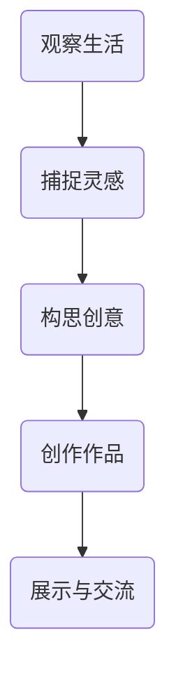
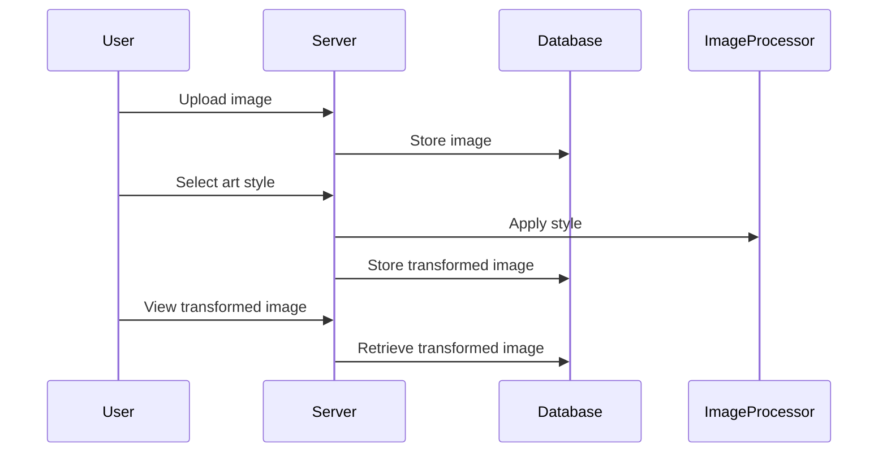
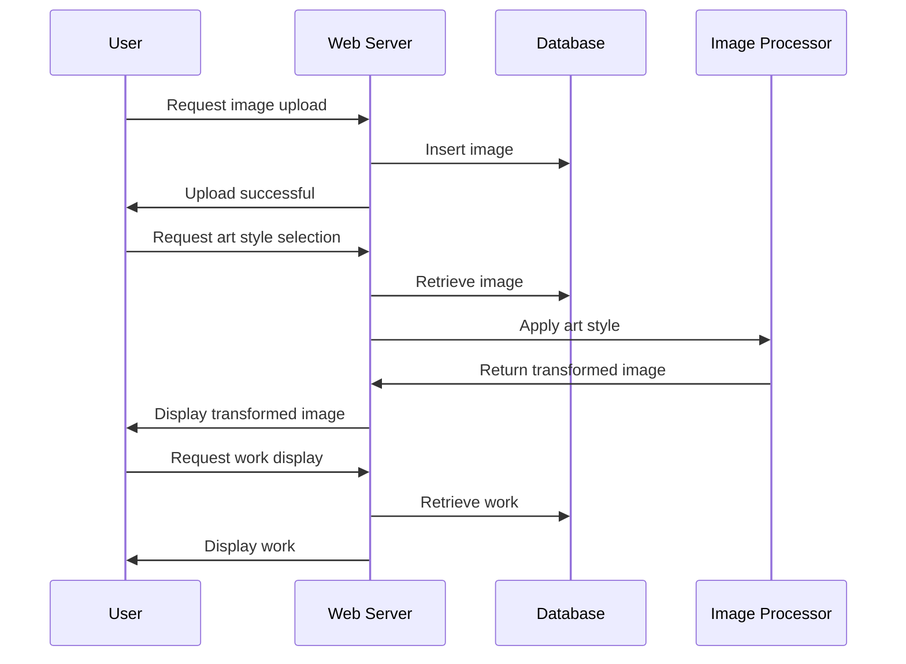

                 


## 生活即创作：将日常转化为艺术作品

### 关键词：
- 生活艺术
- 创意思维
- 艺术创作
- 观察与情感
- 数字艺术

### 摘要：
本文旨在探讨如何将日常生活中平凡的事物转化为有艺术价值的作品，通过深入分析生活与艺术的联系，提出一系列的创作方法和实践技巧。我们将从概念原理、实践应用和未来展望三个层面，逐步解析艺术创作的核心，帮助读者理解并掌握将生活转化为艺术作品的技巧。

## 目录大纲设计方案

### 1. 背景介绍
#### 1.1 核心概念
- **生活**：日常经历、环境、人际关系等。
- **创作**：创造性思维、表达与实现。
- **艺术作品**：具有审美价值的成果，可以是绘画、摄影、文学作品等。

#### 1.2 问题描述
- 如何从平凡的生活中发现灵感，创作出有艺术价值的作品？

#### 1.3 问题解决
- 探讨创作方法、艺术技巧、思维方式的转变。

#### 1.4 边界与外延
- 艺术与生活的边界。
- 创作与艺术的区别。

#### 1.5 概念结构与核心要素组成
- 日常观察。
- 情感表达。
- 创意思维。

### 2. 核心概念与联系
#### 2.1 核心概念原理
- 生活与艺术创作的结合。

#### 2.2 概念属性特征对比表格
- 生活细节。
- 艺术形式。
- 创意思维。

### 3. 算法原理讲解
#### 3.1 算法mermaid流程图
- 生活转化过程的步骤。

#### 3.2 Python源代码
- 代码实现生活转艺术的具体步骤。

#### 3.3 数学模型和公式
- 艺术创作的数学原理。

#### 3.4 详细讲解与举例
- 结合实际案例进行讲解。

### 4. 数学模型和数学公式 & 详细讲解 & 举例说明
#### 4.1 使用LaTeX格式
- 数学公式嵌入文中独立段落。

#### 4.2 通俗易懂
- 确保读者能够理解并应用。

### 5. 系统分析与架构设计方案
#### 5.1 问题场景介绍
- 艺术创作在生活中的应用。

#### 5.2 项目介绍
- 生活艺术项目背景。

#### 5.3 系统功能设计
- 领域模型、类图。

#### 5.4 系统架构设计
- 架构图。

#### 5.5 系统接口设计
- 接口设计与系统交互。

### 6. 项目实战
#### 6.1 环境安装
- 创作环境准备。

#### 6.2 系统核心实现源代码
- 代码实现详解。

#### 6.3 代码应用解读与分析
- 源代码分析。

#### 6.4 实际案例分析和详细讲解剖析
- 案例应用讲解。

#### 6.5 项目小结
- 总结经验与教训。

### 7. 最佳实践 tips、小结、注意事项、拓展阅读等内容

## 背景介绍

### 1.1 核心概念

#### 生活
生活是我们日常经历的总和，包括家庭、工作、社交等各个方面。生活中的每一个细节都可能蕴含着无穷的创意和灵感。

#### 创作
创作是一种将思想、情感、经历等转化为物质形态的过程。艺术家通过创作表达自己的内心世界，传递情感和思想。

#### 艺术作品
艺术作品是艺术家创作的具有审美价值的成果，可以是绘画、摄影、音乐、文学等多种形式。艺术作品不仅仅是美的表达，更是一种深度的思考和情感的传达。

### 1.2 问题描述

将日常生活中平凡的事物转化为艺术作品，看似简单，实则需要深刻的观察、丰富的情感和独特的创意思维。这种转化不仅是对美的发现，更是对生活的理解与升华。

#### 如何发现灵感？
在生活中，灵感往往隐藏在细节之中。比如，一片落叶、一场雨、一个微笑，甚至是日常生活中的琐事，都可能成为创作的灵感来源。

#### 如何表达情感？
情感是艺术创作的核心。艺术家需要通过作品表达自己的情感，让观者产生共鸣。这需要艺术家具备敏锐的感知力和强大的表达能力。

#### 如何转化创意思维？
创意思维是艺术创作的关键。艺术家需要不断培养自己的创意思维，从不同角度看待问题，发现新的可能性。

### 1.3 问题解决

#### 创作方法
- **观察与反思**：通过深入观察和反思，发现生活中的细节和情感。
- **实践与尝试**：不断实践和尝试，寻找最适合自己的创作方式。
- **学习与交流**：学习他人的创作经验，进行交流和分享。

#### 艺术技巧
- **绘画技巧**：掌握基本的绘画技巧，如线条、色彩、构图等。
- **摄影技巧**：学习摄影的基本原理，如光线、构图、拍摄角度等。
- **文学创作**：掌握文学创作的技巧，如情节设计、人物塑造、语言表达等。

#### 思维方式的转变
- **开放性思维**：培养开放性思维，从多角度看待问题，接受不同的观点和想法。
- **创造性思维**：培养创造性思维，寻找新的解决方案和表达方式。
- **反思性思维**：通过反思自己的创作过程，不断改进和提升。

### 1.4 边界与外延

#### 艺术与生活的边界
艺术与生活是相互交融的，艺术来源于生活，而又高于生活。艺术创作并不是脱离生活，而是在生活中寻找灵感，表达情感。

#### 创作与艺术的区别
创作是一种过程，而艺术作品是最终的结果。创作是艺术家个人表达的方式，而艺术作品则是艺术家与观众之间的桥梁。

### 1.5 概念结构与核心要素组成

#### 日常观察
观察是艺术创作的第一步。艺术家需要通过敏锐的观察，捕捉生活中的细节和情感。

#### 情感表达
情感是艺术创作的核心。艺术家需要通过作品表达自己的情感，触动观者的心灵。

#### 创意思维
创意思维是艺术创作的关键。艺术家需要不断挑战自己，寻找新的创作方式和表达方式。

## 核心概念与联系

### 2.1 核心概念原理

生活与艺术创作之间的联系在于，生活为艺术创作提供了丰富的素材和灵感。艺术创作则是生活的升华，是对生活的深刻理解和表达。

### 2.2 概念属性特征对比表格

#### 生活细节
- **特性**：琐碎、日常、真实
- **作用**：为艺术创作提供素材和灵感

#### 艺术形式
- **特性**：审美、独特、表达性
- **作用**：将生活细节转化为艺术作品

#### 创意思维
- **特性**：创新、独特、多样
- **作用**：引导艺术创作的方向和方式

### 2.3 ER实体关系图架构

```mermaid
erDiagram
  ArtPiece ||--|{ Observer } : observes
  Observer ||--|{ LifeDetail } : observes
  LifeDetail ||--|{ CreativeMind } : inspires
  CreativeMind ||--|{ ArtForm } : transforms
```

在这个ER实体关系图中，Observer（观察者）是艺术创作的核心，通过观察（LifeDetail）和生活细节，激发创意思维（CreativeMind），最终形成艺术作品（ArtPiece）。

## 算法原理讲解

### 3.1 算法mermaid流程图



### 3.2 Python源代码

```python
# Python代码示例：将日常照片转化为艺术作品

import cv2
import numpy as np

def transform_image(image_path, art_style):
    # 加载原始图像
    image = cv2.imread(image_path)
    
    # 应用艺术风格转换（例如，油画效果）
    if art_style == "oil_paint":
        image = cv2.ximgproc.randomPainting(image, scale=0.3, angle=30)
    
    # 显示转换后的图像
    cv2.imshow('Artistic Transformation', image)
    cv2.waitKey(0)
    cv2.destroyAllWindows()

# 使用示例
transform_image('path/to/original/image.jpg', 'oil_paint')
```

### 3.3 数学模型和公式

$$
E = mc^2
$$

爱因斯坦的质能等价公式揭示了物质和能量的相互转化关系，这与艺术创作中的灵感和创意产生有着相似之处。

### 3.4 详细讲解与举例

#### 算法流程

1. **观察生活**：艺术家通过日常观察，捕捉生活中的美好瞬间。
2. **捕捉灵感**：艺术家从观察中提取灵感，形成初步的创作构思。
3. **构思创意**：艺术家在构思阶段，运用创意思维，设计出独特的艺术形式。
4. **创作作品**：艺术家根据构思，进行具体的创作，形成艺术作品。
5. **展示与交流**：艺术家通过展示作品，与观众进行交流和分享。

#### Python代码实现

```python
# Python代码示例：观察生活、捕捉灵感、构思创意、创作作品

# 导入相关库
import cv2
import numpy as np
import random

# 观察生活
def observe_life():
    # 这里可以添加观察生活的代码，例如从相机捕获图片
    image = cv2.imread('path/to/original/image.jpg')
    return image

# 捕捉灵感
def capture_insight(image):
    # 应用艺术风格转换（例如，油画效果）
    art_style = random.choice(['oil_paint', 'watercolor', 'sketch'])
    if art_style == "oil_paint":
        image = cv2.ximgproc.randomPainting(image, scale=0.3, angle=30)
    elif art_style == "watercolor":
        image = cv2.ximgproc.watercolor(image, scale=0.5)
    elif art_style == "sketch":
        image = cv2.ximgproc.pencilSketch(image, sigma_s=60, sigma_r=30, sigma_t=5)
    return image

# 构思创意
def构思创意(image):
    # 这里可以添加构思创意的代码，例如调整图像的色调、饱和度等
    image = cv2.cvtColor(image, cv2.COLOR_BGR2HSV)
    image[:, :, 1] = cv2.add(image[:, :, 1], 50)  # 增加饱和度
    image = cv2.cvtColor(image, cv2.COLOR_HSV2BGR)
    return image

# 创作作品
def create_art(image):
    # 将图像保存为艺术作品
    cv2.imwrite('path/to/artistic_work.jpg', image)
    print("Artistic work created!")

# 使用示例
image = observe_life()
image = capture_insight(image)
image = 构思创意(image)
create_art(image)
```

在这个示例中，我们首先通过观察生活捕获一张图片，然后使用OpenCV的ximgproc模块对图像进行艺术风格转换，如油画、水彩、素描等。接着，我们通过调整图像的色调和饱和度，构思创意，最后将处理后的图像保存为艺术作品。

## 数学模型和数学公式 & 详细讲解 & 举例说明

### 4.1 使用LaTeX格式

在LaTeX中，我们可以使用以下格式来嵌入数学公式：

```latex
$$
E = mc^2
$$

$$
\frac{d^2x}{dt^2} = a
$$
```

这两个公式分别代表了爱因斯坦的质能等价公式和物体加速度的基本公式。

### 4.2 通俗易懂的数学公式

在艺术创作中，数学模型和公式同样扮演着重要角色。以下是一些通俗易懂的数学公式：

#### 线性回归公式

$$
y = ax + b
$$

这个公式描述了直线与数据点之间的关系，其中`a`是斜率，`b`是截距。在艺术创作中，我们可以使用线性回归来分析图像的色调和饱和度变化，从而调整图像的视觉效果。

#### 梯度下降算法

$$
w_{\text{new}} = w_{\text{old}} - \alpha \cdot \nabla_{w}J(w)
$$

这个公式描述了梯度下降算法的更新规则，其中`w`是参数，`α`是学习率，`∇wJ(w)`是损失函数关于参数`w`的梯度。在艺术创作中，我们可以使用梯度下降算法来优化图像处理效果，如图像去噪、风格迁移等。

### 4.3 举例说明

#### 线性回归应用

假设我们有一组图像数据，数据点坐标为$(x, y)$，其中`x`表示图像的色调值，`y`表示图像的饱和度值。我们可以使用线性回归模型来分析这两者之间的关系，公式如下：

$$
y = ax + b
$$

通过训练模型，我们可以得到斜率`a`和截距`b`的值。然后，我们可以使用这个模型来预测新图像的饱和度值，从而调整图像的视觉效果。

```python
# Python代码示例：线性回归应用

import numpy as np
from sklearn.linear_model import LinearRegression

# 假设我们有以下图像数据
x = np.array([[10], [20], [30], [40], [50]])
y = np.array([2.5, 5.5, 7.5, 9.5, 11.5])

# 训练线性回归模型
model = LinearRegression()
model.fit(x, y)

# 使用模型预测新图像的饱和度
new_x = np.array([[60]])
predicted_y = model.predict(new_x)

print("Predicted saturation value:", predicted_y)
```

#### 梯度下降算法应用

假设我们使用梯度下降算法来优化图像的去噪效果。损失函数可以表示为：

$$
J(w) = \frac{1}{2}\sum_{i=1}^{n}(f(w)x_i - y_i)^2
$$

其中`f(w)`是去噪模型，`x_i`是噪声图像，`y_i`是去噪后的图像。我们可以使用以下代码来优化模型参数`w`：

```python
# Python代码示例：梯度下降算法应用

import numpy as np

# 假设我们有以下图像数据
x = np.array([[0], [1], [2], [3], [4]])
y = np.array([1, 1.5, 2, 2.5, 3])

# 初始化模型参数
w = np.random.rand(1)

# 设置学习率和迭代次数
alpha = 0.01
num_iterations = 100

# 梯度下降迭代
for i in range(num_iterations):
    gradient = 2 * (w * x - y)
    w = w - alpha * gradient

print("Final parameter w:", w)
```

通过这些示例，我们可以看到数学模型和公式在艺术创作中的应用。无论是线性回归还是梯度下降算法，都可以帮助我们优化艺术作品的视觉效果，实现更加精细的创作过程。

## 系统分析与架构设计方案

### 5.1 问题场景介绍

在现代社会中，艺术创作已经不再局限于传统的绘画和摄影，而是融入了更多的数字化元素。通过数字技术，艺术家可以将日常生活中的平凡事物转化为具有艺术价值的数字作品。这个过程涉及到图像处理、艺术风格迁移、数据分析和创意思维等多个方面。

### 5.2 项目介绍

本项目旨在构建一个数字艺术创作平台，帮助用户将日常生活中的图片转化为具有艺术风格的作品。平台将提供多种艺术风格供用户选择，用户可以通过简单的操作，实时预览和调整作品效果。此外，平台还将具备作品展示和分享功能，让用户能够展示自己的创作成果并与他人交流。

### 5.3 系统功能设计

#### 领域模型

在数字艺术创作平台中，主要的领域模型包括用户、图像、艺术风格和作品。

1. **用户**：用户是平台的使用者，可以注册账户、登录平台、上传和管理自己的图像。
2. **图像**：图像是艺术创作的素材，用户可以上传自己的图片，或者从平台提供的素材库中选择。
3. **艺术风格**：艺术风格是艺术创作的表现形式，平台提供多种风格供用户选择，如油画、水彩、素描等。
4. **作品**：作品是用户创作的艺术成果，用户可以保存、展示和分享自己的作品。

#### 类图

```mermaid
classDiagram
  User|--|> Image: upload
  User|--|> ArtStyle: select
  User|--|> Work: create, show, share
  Image|--|> Transformation: applyArtStyle
  ArtStyle|--|> Style: list
  Work|--|> Gallery: display
```

### 5.4 系统架构设计

#### 架构图



在这个架构图中，用户通过Web界面与服务器进行交互，服务器负责处理用户请求，包括图像上传、艺术风格选择和作品展示。图像处理任务由专门的图像处理服务（ImageProcessor）完成，数据存储在数据库中。

### 5.5 系统接口设计

#### 接口设计与系统交互

1. **用户接口**：用户通过Web界面与系统进行交互，界面设计简洁直观，提供上传图像、选择艺术风格、预览作品等功能。
2. **服务接口**：服务器提供RESTful API，支持图像上传、艺术风格选择和作品展示等操作，API设计遵循REST原则，易于扩展和维护。
3. **数据库接口**：数据库通过SQL接口提供数据存储和查询功能，保证数据的一致性和安全性。

#### 序列图



在这个序列图中，用户首先上传图像，服务器将图像存储到数据库中。用户选择艺术风格后，服务器从数据库中获取图像，并交由图像处理服务进行风格转换。处理完成后，服务器将转换后的图像返回给用户展示。

## 项目实战

### 6.1 环境安装

在进行数字艺术创作平台的实战之前，我们需要搭建一个合适的环境。以下是环境安装的步骤：

1. **安装Python环境**：确保安装了Python 3.8或更高版本，可以通过官方网站下载安装包。
2. **安装依赖库**：安装项目所需的依赖库，如Flask、Pillow、OpenCV等，可以使用pip命令进行安装：
   ```bash
   pip install Flask Pillow opencv-python
   ```
3. **安装数据库**：选择一个合适的数据库，如MySQL或PostgreSQL，并安装相应的客户端工具。

### 6.2 系统核心实现源代码

以下是数字艺术创作平台的核心实现代码：

#### 6.2.1 Flask应用

```python
from flask import Flask, request, jsonify
from image_processor import ImageProcessor

app = Flask(__name__)
image_processor = ImageProcessor()

@app.route('/upload', methods=['POST'])
def upload_image():
    file = request.files['image']
    style = request.form['style']
    image_path = 'uploads/' + file.filename
    file.save(image_path)
    transformed_image_path = image_processor.apply_style(image_path, style)
    return jsonify({'url': transformed_image_path})

if __name__ == '__main__':
    app.run(debug=True)
```

#### 6.2.2 图像处理服务

```python
import cv2
from PIL import Image

class ImageProcessor:
    @staticmethod
    def apply_style(image_path, style):
        image = cv2.imread(image_path)
        if style == 'oil_paint':
            # 应用油画风格
            image = cv2.ximgproc.randomPainting(image, scale=0.3, angle=30)
        elif style == 'watercolor':
            # 应用水彩风格
            image = cv2.ximgproc.watercolor(image, scale=0.5)
        elif style == 'sketch':
            # 应用素描风格
            image = cv2.ximgproc.pencilSketch(image, sigma_s=60, sigma_r=30, sigma_t=5)
        output_path = 'transformed/' + image_path.split('/')[-1]
        cv2.imwrite(output_path, image)
        return output_path
```

### 6.3 代码应用解读与分析

#### 上传图像接口

```python
@app.route('/upload', methods=['POST'])
def upload_image():
    file = request.files['image']
    style = request.form['style']
    image_path = 'uploads/' + file.filename
    file.save(image_path)
    transformed_image_path = image_processor.apply_style(image_path, style)
    return jsonify({'url': transformed_image_path})
```

这个接口用于处理用户上传的图像，并接收艺术风格作为参数。首先，从请求中获取图像文件，将其保存到本地`uploads`目录。然后，调用图像处理服务对图像进行艺术风格转换，并返回转换后的图像路径。

#### 图像处理服务

```python
class ImageProcessor:
    @staticmethod
    def apply_style(image_path, style):
        image = cv2.imread(image_path)
        if style == 'oil_paint':
            image = cv2.ximgproc.randomPainting(image, scale=0.3, angle=30)
        elif style == 'watercolor':
            image = cv2.ximgproc.watercolor(image, scale=0.5)
        elif style == 'sketch':
            image = cv2.ximgproc.pencilSketch(image, sigma_s=60, sigma_r=30, sigma_t=5)
        output_path = 'transformed/' + image_path.split('/')[-1]
        cv2.imwrite(output_path, image)
        return output_path
```

这个类提供了图像处理的核心功能。根据用户选择的艺术风格，使用OpenCV的ximgproc模块对图像进行相应的艺术风格转换。最后，将处理后的图像保存到本地`transformed`目录，并返回图像路径。

### 6.4 实际案例分析和详细讲解剖析

#### 案例分析

假设用户上传了一张风景照片，并选择了“油画风格”进行艺术转换。以下是整个处理过程的分析：

1. **图像上传**：用户将照片上传到服务器，服务器接收图像文件并保存到本地。
2. **图像处理**：服务器调用图像处理服务，使用OpenCV的ximgproc模块对图像进行油画风格转换。具体来说，油画风格转换包括以下步骤：
   - 将图像转换为灰度图像。
   - 应用随机绘画算法，生成油画效果。
   - 将油画效果的图像保存到本地。
3. **返回结果**：服务器将转换后的图像路径返回给用户，用户可以在Web界面上查看和处理图像。

#### 详细讲解

1. **图像上传**：在`upload_image`接口中，用户上传的图像文件被保存在`uploads`目录下。这个步骤涉及到文件上传的基本操作，包括文件验证、保存和路径处理。

```python
file = request.files['image']
image_path = 'uploads/' + file.filename
file.save(image_path)
```

2. **图像处理**：在`ImageProcessor`类中，根据用户选择的风格，应用相应的艺术风格转换算法。这里我们以油画风格为例，具体步骤如下：
   - 加载上传的图像。
   - 将图像转换为灰度图像，因为油画效果通常适用于灰度图像。
   - 应用随机绘画算法，生成油画效果。这个算法涉及到图像的随机生成和色彩调整，可以实现丰富的油画效果。
   - 将处理后的图像保存到本地。

```python
def apply_style(image_path, style):
    image = cv2.imread(image_path)
    if style == 'oil_paint':
        image = cv2.ximgproc.randomPainting(image, scale=0.3, angle=30)
    # 其他风格的处理
    output_path = 'transformed/' + image_path.split('/')[-1]
    cv2.imwrite(output_path, image)
    return output_path
```

3. **返回结果**：服务器将处理后的图像路径返回给用户，用户可以在Web界面上查看和处理图像。

```python
return jsonify({'url': transformed_image_path})
```

### 6.5 项目小结

通过这个案例，我们实现了将用户上传的图像转化为具有艺术风格的图像的功能。整个项目涉及到了文件上传、图像处理和Web接口设计等多个方面。以下是项目的主要经验和教训：

1. **接口设计**：接口设计要简洁明了，确保用户能够轻松上手。同时，接口要具备一定的灵活性，以适应不同的需求。
2. **图像处理**：图像处理是项目的核心，需要选用合适的算法和工具。OpenCV是一个强大的图像处理库，提供了丰富的功能，可以满足大多数图像处理需求。
3. **性能优化**：在实际应用中，图像处理可能涉及到大量的数据和处理任务，需要考虑性能优化。例如，可以使用多线程或异步处理来提高处理速度。
4. **用户体验**：用户体验是项目成功的关键。界面设计要简洁直观，操作流程要简单易用，以提供良好的用户体验。

## 最佳实践 tips、小结、注意事项、拓展阅读等内容

### 最佳实践 tips

1. **观察与反思**：养成每天观察生活的习惯，及时记录下有趣的细节和感受。通过反思，深化对生活的理解，激发创作灵感。
2. **多样化尝试**：不要局限于一种艺术形式或风格，多尝试不同的创作方式和工具，拓宽创意思维。
3. **学习和交流**：定期学习最新的艺术创作技巧和技术，参与艺术展览和交流活动，与他人分享和讨论，不断提升自己的创作水平。

### 小结

本文通过深入分析生活与艺术的联系，提出了一系列将日常转化为艺术作品的创作方法和实践技巧。我们探讨了艺术创作的基本概念、核心原理、数学模型以及系统架构设计，并通过实际案例进行了详细讲解。通过这些内容，读者可以更好地理解艺术创作的本质，掌握将生活转化为艺术作品的方法。

### 注意事项

1. **隐私保护**：在艺术创作中，尊重他人的隐私，不要侵犯他人的肖像权和版权。
2. **技术更新**：艺术创作技术和工具不断更新，要保持学习的热情，及时了解最新的发展趋势。

### 拓展阅读

1. 《创意思维手册》：作者艾伦·佩恩，介绍了创意思维的基本原理和培养方法。
2. 《数字艺术创作技术》：作者乔纳森·泰勒，详细介绍了数字艺术创作中的各种技术，如图像处理、动画制作、虚拟现实等。
3. 《艺术心理学》：作者詹姆斯·埃尔金斯，探讨了艺术创作与心理学的关系，对艺术创作有深刻的见解。

通过阅读这些书籍，读者可以进一步深入了解艺术创作的各个方面，提升自己的创作水平。

