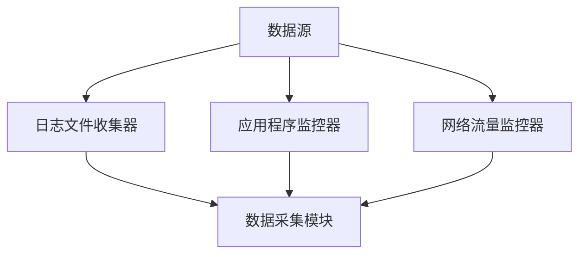
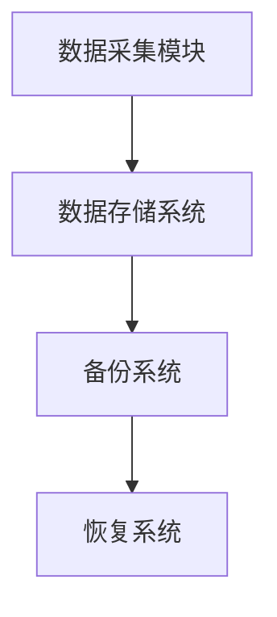
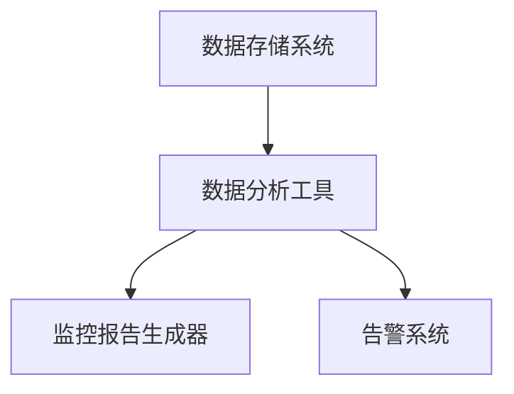
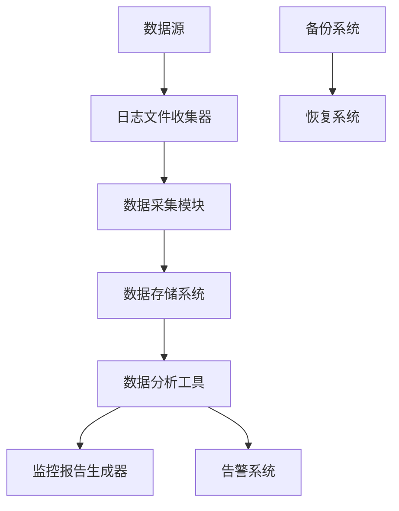

                 

# 监控与日志：跟踪AI Agent的运行状态

> 关键词：AI Agent，监控，日志，运行状态，性能优化，系统架构

> 摘要：本文将深入探讨监控与日志在跟踪AI Agent运行状态中的重要性，以及如何设计和实现有效的监控与日志系统。通过实际案例分析和最佳实践，读者将了解如何充分利用监控与日志手段，确保AI Agent在复杂系统环境中的稳定性和高效性。

## 第一部分: 监控与日志概述

### 第1章: 监控与日志基础

#### 1.1.1 问题背景与问题描述

**1.1.1.1 监控的重要性**

在现代技术环境中，系统的复杂性和规模不断增加，监控成为确保系统稳定性和性能的关键手段。对于AI Agent而言，监控同样至关重要，因为它直接影响着AI Agent的性能和可靠性。

**1.1.1.2 日志的作用**

日志记录系统运行过程中的重要信息，如错误消息、性能指标等。通过分析日志，可以迅速定位问题，优化系统性能。

**1.1.2 核心概念与联系**

**监控的概念：** 监控是一种持续观察系统状态的过程，旨在及时发现异常情况，保障系统的稳定运行。

**日志的概念：** 日志是系统运行过程中记录下来的信息，它们可以包括错误消息、性能指标等。

**1.1.3 监控与日志的边界与外延**

**监控的边界：** 监控关注的是系统的整体运行状态，而不仅仅是某个特定的部分。

**日志的外延：** 日志不仅限于记录错误消息，还可以包括操作记录、性能数据等。

### 第2章: AI Agent与监控日志

#### 2.1.1 AI Agent的定义

AI Agent是指具备自主学习和决策能力的智能体，它们在复杂的系统环境中发挥作用。

#### 2.1.2 AI Agent的运行状态

AI Agent的运行状态需要通过监控和日志来跟踪，以确保其正常运行和性能。

#### 2.1.3 监控AI Agent的重要性

监控AI Agent的运行状态对于保障系统的稳定性和性能至关重要。

### 第3章: 监控与日志的系统架构

#### 3.1.1 系统架构概述

监控与日志的系统架构需要考虑到数据采集、存储、分析等环节。

#### 3.1.2 数据采集架构

数据采集是监控与日志系统的基础，涉及到日志文件的收集、错误消息的捕获等。

#### 3.1.3 数据存储架构

数据存储需要考虑到数据的持久化、查询性能等因素。

#### 3.1.4 数据分析架构

数据分析是监控与日志系统的核心，通过分析日志数据，可以得出系统的运行状况和优化建议。

### 第4章: AI Agent监控日志的设计与实现

#### 4.1.1 日志设计原则

日志设计应遵循可读性、可扩展性和可维护性等原则。

#### 4.1.2 日志格式

日志格式需要标准化，以便于后续的数据处理和分析。

#### 4.1.3 日志采集与处理

日志采集与处理是监控与日志系统的关键环节，涉及到日志的实时收集和预处理。

### 第5章: AI Agent监控日志的实际应用

#### 5.1.1 监控AI Agent的运行状态

监控AI Agent的运行状态是保障其正常运行的关键。

#### 5.1.2 日志分析与应用

通过日志分析，可以深入了解AI Agent的运行状况，并据此进行优化。

#### 5.1.3 实际案例分析

介绍几个典型的AI Agent监控日志应用案例，并进行详细分析。

### 第6章: 监控与日志的最佳实践

#### 6.1.1 最佳实践概述

总结监控与日志的最佳实践，提供实际操作建议。

#### 6.1.2 注意事项

在实施监控与日志过程中需要注意的问题和事项。

#### 6.1.3 拓展阅读

推荐一些相关的书籍、论文和在线资源，以供读者进一步学习。

## 第二部分: 监控与日志深度解析

### 第7章: 监控原理与实现

#### 7.1.1 监控原理

详细讲解监控原理，包括监控的基本流程、监控指标的选取方法等。

#### 7.1.2 监控实现

通过具体实例，介绍监控系统的实现方法，包括数据采集、处理和分析等环节。

### 第8章: 日志管理与分析

#### 8.1.1 日志管理

介绍日志管理的核心概念，如日志收集、存储和检索等。

#### 8.1.2 日志分析

讲解日志分析的方法和技术，包括日志数据的预处理、模式识别和异常检测等。

### 第9章: AI Agent监控与日志实践

#### 9.1.1 AI Agent监控

分析AI Agent监控的特殊需求，如性能监控、状态监控等。

#### 9.1.2 AI Agent日志分析

介绍AI Agent日志分析的具体应用，如故障诊断、性能优化等。

### 第10章: 监控与日志系统集成

#### 10.1.1 系统集成方案

设计监控与日志系统的集成方案，包括架构设计、接口设计和实现等。

#### 10.1.2 系统集成案例

分析具体集成案例，展示集成方案的实践效果。

### 第11章: 监控与日志的未来发展趋势

#### 11.1.1 发展趋势分析

预测监控与日志领域的未来发展趋势，如云计算、大数据、人工智能等技术的应用。

#### 11.1.2 技术创新与挑战

探讨监控与日志领域的技术创新与挑战，如实时监控、自动化分析等。

### 结语

总结文章内容，强调监控与日志在AI Agent运行状态跟踪中的重要性，并对未来研究方向提出展望。

## 作者信息

作者：AI天才研究院/AI Genius Institute & 禅与计算机程序设计艺术 /Zen And The Art of Computer Programming## 第1章：监控与日志基础

### 1.1.1 问题背景与问题描述

在现代技术环境中，系统的复杂性和规模不断增加，确保系统的稳定性和性能变得愈加重要。监控和日志技术作为系统管理和性能优化的重要工具，发挥着不可替代的作用。

**问题背景：** 随着云计算、大数据和人工智能技术的广泛应用，系统架构变得越来越复杂。这使得对系统的监控和日志记录提出了更高的要求，不仅需要实时监控系统的运行状态，还需要对大量的日志数据进行有效管理和分析。

**问题描述：** 如何设计和实现一个高效、可靠的监控与日志系统，以便于实时跟踪AI Agent的运行状态，及时发现并解决问题，优化系统性能。

**问题解决：** 通过构建一个完善的监控与日志系统，可以实现对AI Agent运行状态的全面监控，及时发现潜在问题，提供优化建议，从而提高系统的稳定性和性能。

### 1.1.2 核心概念与联系

#### 1.1.2.1 监控的概念

监控是一种持续观察系统状态的过程，旨在及时发现异常情况，保障系统的稳定运行。在AI Agent的运行环境中，监控关注的是AI Agent的输入、输出、内部状态等关键指标，以便于实时跟踪其运行状态。

**监控的定义：** 监控是指通过观察、测量和分析系统的各种参数和指标，及时识别并响应异常情况，确保系统正常运行的过程。

**监控的目标：** 保障系统的稳定性和性能，及时发现并解决问题，降低系统故障率和停机时间。

#### 1.1.2.2 日志的概念

日志是系统运行过程中记录下来的信息，它们可以包括错误消息、性能指标、操作记录等。日志记录了系统从启动到关闭期间的各种操作和事件，为问题的诊断和系统的优化提供了宝贵的信息。

**日志的定义：** 日志是指系统运行过程中生成的记录文件，用于记录系统运行状态、操作行为、错误信息等。

**日志的作用：** 帮助用户了解系统的运行情况，诊断问题，优化系统性能。

#### 1.1.2.3 监控与日志的联系

监控和日志之间存在密切的联系。监控系统通过实时收集和分析日志数据，可以及时发现异常情况，并采取相应的措施。同时，日志记录了系统的运行状态和操作行为，为监控提供了重要的数据支持。

**联系：** 监控和日志相互依赖，监控系统需要日志数据作为分析基础，而日志记录了监控系统的运行情况和问题报告。

### 1.1.3 监控与日志的边界与外延

#### 1.1.3.1 监控的边界

监控关注的是系统的整体运行状态，而不仅仅是某个特定的部分。在AI Agent的运行环境中，监控范围可以涵盖AI Agent的输入、输出、内部状态等关键指标，以及与AI Agent相关的其他系统组件。

**监控的边界：** 监控系统应该覆盖AI Agent运行环境的各个方面，包括硬件设备、软件系统、网络通信等。

**监控的重点：** 在AI Agent的运行过程中，监控的重点是AI Agent的输入、输出和内部状态，以及与其他系统组件的交互情况。

#### 1.1.3.2 日志的外延

日志不仅限于记录错误消息，还可以包括操作记录、性能数据等。在AI Agent的运行环境中，日志记录的内容应该尽量全面，以便于后续的数据分析和问题诊断。

**日志的外延：** 日志记录的内容应该包括AI Agent的运行状态、输入数据、输出结果、异常信息、系统配置等。

**日志的重要性：** 日志记录了AI Agent的运行全过程，是监控和问题诊断的重要依据。

### 1.1.4 监控与日志的核心概念和组成结构

#### 1.1.4.1 核心概念

**监控：** 监控是指对系统运行状态进行持续观察和测量，以识别并响应异常情况。

**日志：** 日志是指系统运行过程中记录下来的信息，用于记录系统运行状态、操作行为、错误信息等。

**监控与日志的关系：** 监控系统通过收集和分析日志数据，实现对系统运行状态的监控和问题诊断。

#### 1.1.4.2 组成结构

**监控与日志系统：** 监控与日志系统包括数据采集、数据存储、数据处理、数据分析等组成部分。

**数据采集：** 数据采集是监控与日志系统的核心功能，负责收集系统运行过程中的各种数据。

**数据存储：** 数据存储负责将采集到的数据存储到数据库或其他存储系统中，以便于后续的数据处理和分析。

**数据处理：** 数据处理包括数据清洗、转换和整合等操作，以提高数据的质量和可用性。

**数据分析：** 数据分析通过对存储的数据进行统计和分析，发现系统的运行状况和潜在问题。

### 1.1.5 监控与日志在AI Agent中的应用

#### 1.1.5.1 监控AI Agent的重要性

监控AI Agent的运行状态对于保障系统的稳定性和性能至关重要。AI Agent作为智能体，其运行状态直接影响到整个系统的运行效果。通过监控AI Agent，可以及时发现并解决潜在问题，优化系统性能。

**监控AI Agent的重要性：** 监控AI Agent可以帮助用户了解AI Agent的运行状态，发现并解决潜在问题，提高系统的稳定性和性能。

#### 1.1.5.2 日志在AI Agent中的作用

日志记录了AI Agent的运行过程和状态信息，为监控和问题诊断提供了重要依据。通过分析日志数据，可以深入了解AI Agent的运行情况，发现并解决潜在问题。

**日志在AI Agent中的作用：** 日志记录了AI Agent的输入、输出、内部状态等关键信息，为监控和问题诊断提供了重要依据。

#### 1.1.5.3 监控与日志在AI Agent中的集成

在AI Agent的运行环境中，监控与日志系统需要集成到整体架构中，以便于实现对AI Agent的全面监控和日志记录。通过集成监控与日志系统，可以实现对AI Agent运行状态的实时监控和日志收集，提高系统的整体性能和稳定性。

**监控与日志在AI Agent中的集成：** 监控与日志系统需要与AI Agent的运行环境紧密集成，实现对AI Agent运行状态的实时监控和日志收集。

### 1.1.6 小结

本章对监控与日志的基础概念进行了详细阐述，包括监控与日志的定义、作用、边界与外延以及核心概念和组成结构。同时，本章还分析了监控与日志在AI Agent中的应用，强调了监控与日志对于保障AI Agent运行状态的重要性。通过本章的学习，读者可以更好地理解监控与日志的基本原理和应用，为后续章节的内容奠定基础。

## 第2章：AI Agent与监控日志

### 2.1.1 AI Agent的定义

AI Agent，即人工智能代理，是指具备自主学习和决策能力的智能体。它们能够根据环境和目标自主地采取行动，并通过学习不断优化自身行为。AI Agent广泛应用于自动驾驶、智能客服、智能推荐等领域。

**AI Agent的特点：**
- 自主性：能够自主地执行任务，无需人工干预。
- 学习能力：通过不断学习，提高任务执行的效果。
- 灵活性：能够适应不同的环境和任务需求。

**AI Agent的应用场景：**
- 自动驾驶：自动驾驶汽车需要AI Agent来处理复杂的路况信息，并做出实时决策。
- 智能客服：智能客服系统能够通过AI Agent与用户进行自然语言交互，提供个性化服务。
- 智能推荐：电商和媒体平台通过AI Agent分析用户行为，提供个性化的推荐。

### 2.1.2 AI Agent的运行状态

AI Agent的运行状态包括多个方面，如输入数据、输出结果、内部状态、资源使用情况等。监控和日志系统需要全面捕捉这些信息，以便于实时跟踪AI Agent的运行状态。

**运行状态的关键指标：**
- 输入数据：AI Agent接收到的输入数据，如传感器数据、用户查询等。
- 输出结果：AI Agent生成的输出结果，如决策建议、回复信息等。
- 内部状态：AI Agent内部的运行状态，如模型训练进度、内存使用等。
- 资源使用情况：AI Agent使用的硬件和软件资源，如CPU利用率、内存占用等。

### 2.1.3 监控AI Agent的重要性

监控AI Agent的运行状态对于保障系统的稳定性和性能至关重要。通过监控，可以及时发现AI Agent的异常行为，防止系统故障，提高用户体验。

**监控AI Agent的重要性：**
- 预防故障：通过实时监控，及时发现AI Agent的异常行为，防止系统故障。
- 提高性能：通过分析AI Agent的运行状态，优化系统配置和算法，提高性能。
- 改善用户体验：通过监控AI Agent的运行状态，提供更准确的决策和响应，提升用户体验。

### 2.1.4 日志在监控AI Agent中的作用

日志记录了AI Agent的运行过程和状态信息，是监控AI Agent的重要依据。通过日志分析，可以深入了解AI Agent的行为，定位问题，优化系统。

**日志在监控AI Agent中的作用：**
- 记录运行过程：日志记录了AI Agent的输入、输出、内部状态等关键信息，便于后续分析。
- 诊断问题：通过分析日志，可以定位AI Agent的异常行为和故障原因。
- 优化系统：基于日志分析结果，可以调整AI Agent的算法和配置，提高系统性能。

### 2.1.5 监控与日志在AI Agent中的实践

在实际应用中，监控与日志系统与AI Agent紧密集成，共同构成一个完整的智能系统。以下是一个典型的监控与日志在AI Agent中的应用实例：

**实例：智能客服系统**

在一个智能客服系统中，AI Agent负责与用户进行自然语言交互，提供咨询服务。监控与日志系统负责实时跟踪AI Agent的运行状态，确保其稳定运行。

- **数据采集：** 监控系统实时收集AI Agent的输入数据（用户查询）、输出结果（回复信息）和内部状态（模型训练进度）。
- **日志记录：** AI Agent的运行过程和状态信息被记录在日志文件中，便于后续分析。
- **日志分析：** 通过对日志数据的分析，监控系统能够发现AI Agent的异常行为和故障，并采取相应措施。
- **优化建议：** 基于日志分析结果，系统管理员可以对AI Agent的算法和配置进行调整，优化系统性能。

### 2.1.6 小结

本章介绍了AI Agent的定义、运行状态以及监控AI Agent的重要性，并阐述了日志在监控AI Agent中的作用。通过监控与日志系统，可以实时跟踪AI Agent的运行状态，保障系统的稳定性和性能。在实际应用中，监控与日志系统与AI Agent紧密集成，共同构成一个智能系统，提高用户体验。下一章将深入探讨监控与日志的系统架构，为构建高效的监控与日志系统提供指导。

## 第3章：监控与日志的系统架构

### 3.1.1 系统架构概述

监控与日志系统的设计需要考虑数据采集、存储、分析等多个环节，以确保系统能够高效地收集、处理和利用数据。一个完整的监控与日志系统通常包括以下几个关键组件：

- **数据采集模块**：负责从不同的数据源（如服务器、应用程序、网络设备等）收集数据。
- **数据存储模块**：负责将采集到的数据存储在数据库或其他存储系统中，以便于后续处理和分析。
- **数据处理模块**：负责对存储的数据进行清洗、转换和整合等操作，以提高数据的质量和可用性。
- **数据分析模块**：负责对存储的数据进行统计和分析，以生成监控报告、性能指标和优化建议。

### 3.1.2 数据采集架构

数据采集是监控与日志系统的核心环节，涉及到日志文件的收集、错误消息的捕获等。数据采集架构的设计需要考虑以下几个要点：

- **数据源多样性**：监控系统需要能够采集来自不同数据源的信息，如服务器日志、应用程序日志、网络流量等。
- **数据采集频率**：根据监控需求，确定数据采集的频率，以确保系统能够实时获取最新的数据。
- **数据格式标准化**：为了便于后续的数据处理和分析，采集到的数据需要按照统一的格式进行标准化处理。

#### 数据采集架构图：



### 3.1.3 数据存储架构

数据存储是监控与日志系统的另一个重要环节，涉及到数据的持久化、查询性能等因素。数据存储架构的设计需要考虑以下几个要点：

- **数据存储方式**：选择合适的数据存储方式，如关系数据库、NoSQL数据库、时间序列数据库等。
- **数据存储性能**：确保数据存储系统能够满足查询性能要求，支持实时数据分析和报告生成。
- **数据备份与恢复**：设计可靠的数据备份和恢复机制，以确保数据的安全性和可靠性。

#### 数据存储架构图：



### 3.1.4 数据分析架构

数据分析是监控与日志系统的核心环节，通过对存储的数据进行分析，可以生成监控报告、性能指标和优化建议。数据分析架构的设计需要考虑以下几个要点：

- **数据分析工具**：选择合适的数据分析工具，如Elasticsearch、Kibana、Prometheus等。
- **数据分析算法**：根据监控需求，设计合适的分析算法，如统计、预测、聚类等。
- **实时分析与告警**：设计实时数据分析和告警机制，及时发现并响应异常情况。

#### 数据分析架构图：



### 3.1.5 系统架构集成

监控与日志系统的各个组件需要紧密集成，形成一个完整的数据流，确保数据从采集到存储、处理、分析的全过程顺畅无阻。系统架构集成需要考虑以下几个方面：

- **组件接口设计**：设计清晰、稳定的组件接口，确保不同组件之间的数据交换和功能调用。
- **系统可扩展性**：设计灵活的系统架构，以便于未来系统的扩展和升级。
- **负载均衡与容错**：设计负载均衡和容错机制，确保系统在高负载和故障情况下仍然能够稳定运行。

#### 系统架构集成图：



### 3.1.6 小结

本章详细介绍了监控与日志系统的架构设计，包括数据采集、存储、分析和系统集成等关键环节。通过本章的学习，读者可以了解到一个高效的监控与日志系统应该如何构建，以及各个组件如何协同工作，以确保系统能够实时、准确地监控AI Agent的运行状态。下一章将深入探讨AI Agent监控日志的具体设计与实现，为构建实际监控与日志系统提供技术指导。

## 第4章：AI Agent监控日志的设计与实现

### 4.1.1 日志设计原则

在设计和实现AI Agent监控日志时，需要遵循以下原则，以确保日志系统的高效性和可维护性。

**可读性**：日志内容应该易于阅读，方便后续分析。使用清晰的字段名称和格式，避免使用过于复杂的编码或缩写。

**可扩展性**：日志设计应具备良好的扩展性，能够适应未来系统架构的变更和功能需求。在日志字段和结构设计时，预留足够的空间和扩展接口。

**可维护性**：日志系统应便于维护和更新。使用标准化的日志格式和规范，降低维护成本和错误风险。

**一致性**：日志记录应保持一致性，确保同一类型的数据在所有情况下都使用相同的格式和规则进行记录。

### 4.1.2 日志格式

日志格式是日志设计的核心部分，决定了日志的数据结构和内容表达。以下是一个典型的AI Agent监控日志格式示例：

```plaintext
timestamp, agent_id, operation, status, input_data, output_data, error_message
```

**字段说明：**

- `timestamp`：日志记录的时间戳，用于标识日志发生的具体时间。
- `agent_id`：AI Agent的唯一标识，用于区分不同的AI Agent实例。
- `operation`：AI Agent执行的操作类型，如`train`、`predict`、`optimize`等。
- `status`：AI Agent操作的状态，如`success`、`fail`、`pending`等。
- `input_data`：AI Agent操作时的输入数据，包括特征数据、参数配置等。
- `output_data`：AI Agent操作的结果数据，如预测结果、训练指标等。
- `error_message`：操作过程中发生的错误信息，用于问题诊断和故障排查。

### 4.1.3 日志采集与处理

日志采集与处理是监控与日志系统的关键环节，直接影响到日志的质量和可用性。以下是日志采集与处理的主要步骤：

**日志采集：**

1. **启动日志收集器**：在AI Agent启动时，自动启动日志收集器，负责实时收集AI Agent的日志信息。
2. **多源采集**：日志收集器需要支持多源采集，包括应用程序日志、系统日志、网络日志等，确保覆盖AI Agent运行环境的各个方面。
3. **实时监控**：日志收集器应具备实时监控功能，及时捕获AI Agent的运行状态变化和异常情况。

**日志处理：**

1. **数据预处理**：对采集到的日志数据进行预处理，包括去除无关信息、填充缺失字段、转换数据格式等，确保日志数据的完整性和一致性。
2. **压缩与压缩**：对预处理后的日志数据进行压缩存储，以减少存储空间和传输带宽的消耗。
3. **错误处理**：对采集和处理过程中出现的错误进行记录和报告，以便后续分析和处理。

### 4.1.4 日志存储与检索

日志存储与检索是监控与日志系统的核心功能，决定了日志数据的可用性和查询性能。以下是日志存储与检索的主要步骤：

**日志存储：**

1. **选择存储方案**：根据日志数据量和查询需求，选择合适的存储方案，如关系数据库、NoSQL数据库、时间序列数据库等。
2. **分布式存储**：对于大规模日志数据，采用分布式存储方案，提高存储性能和可靠性。
3. **存储优化**：对日志存储进行优化，包括数据分片、索引构建、缓存策略等，提高查询性能。

**日志检索：**

1. **查询接口设计**：设计灵活的查询接口，支持按时间、字段、条件等多种方式进行查询。
2. **索引构建**：对关键字段构建索引，提高查询速度和性能。
3. **缓存策略**：采用缓存策略，降低数据库负载，提高查询响应速度。

### 4.1.5 日志分析与应用

日志分析是监控与日志系统的核心功能之一，通过对日志数据的分析，可以深入了解AI Agent的运行状态，发现潜在问题和优化机会。以下是日志分析的主要步骤：

**日志分析：**

1. **数据预处理**：对日志数据进行预处理，包括数据清洗、去噪、转换等，确保分析数据的准确性和一致性。
2. **统计分析**：对日志数据进行分析，生成各种统计指标和图表，如错误率、响应时间、资源利用率等。
3. **异常检测**：使用异常检测算法，识别日志数据中的异常行为和异常值，及时发现潜在问题。

**日志应用：**

1. **问题诊断**：通过日志分析，定位AI Agent的故障点和异常行为，提供故障排查和修复建议。
2. **性能优化**：基于日志分析结果，调整AI Agent的算法和配置，优化系统性能和资源利用率。
3. **操作记录**：记录AI Agent的操作记录和执行结果，为后续审计和监控提供数据支持。

### 4.1.6 小结

本章详细介绍了AI Agent监控日志的设计与实现，包括日志设计原则、日志格式、日志采集与处理、日志存储与检索以及日志分析与应用。通过本章的学习，读者可以了解如何设计和实现一个高效的监控日志系统，确保AI Agent的稳定运行和性能优化。下一章将结合实际案例，进一步探讨监控与日志在AI Agent中的应用和实践。

## 第5章：AI Agent监控日志的实际应用

### 5.1.1 监控AI Agent的运行状态

监控AI Agent的运行状态是保障其正常运行的关键。通过监控，可以实时了解AI Agent的输入、输出、内部状态和资源使用情况，及时发现并解决潜在问题，确保系统的稳定性和性能。

**监控AI Agent运行状态的重要性：**

- **预防故障**：通过实时监控，及时发现AI Agent的异常行为和故障信号，防止系统崩溃和停机。
- **性能优化**：通过监控AI Agent的运行状态，分析性能瓶颈和资源消耗，优化系统配置和算法，提高系统性能。
- **故障排查**：在故障发生时，通过监控日志快速定位问题根源，提供有效的解决方案，缩短故障修复时间。

### 5.1.2 日志分析与应用

日志分析是监控AI Agent的重要手段之一。通过对日志数据的分析，可以深入了解AI Agent的运行状况，发现潜在问题和优化机会。以下是日志分析在AI Agent监控中的主要应用：

**日志分析的主要步骤：**

1. **数据预处理**：对采集到的日志数据进行清洗、去噪和转换，确保数据的准确性和一致性。
2. **数据统计**：计算各种统计指标，如错误率、响应时间、资源利用率等，以评估AI Agent的运行状态。
3. **趋势分析**：分析日志数据的变化趋势，发现周期性问题和异常模式。
4. **异常检测**：使用异常检测算法，识别日志数据中的异常行为和异常值，预警潜在故障。

**日志分析在实际应用中的案例：**

**案例1：智能客服系统的日志分析**

在一个智能客服系统中，AI Agent通过自然语言处理与用户进行交互，提供实时咨询服务。通过日志分析，可以实现对AI Agent运行状态的监控和优化。

- **监控关键指标**：实时监控AI Agent的错误率、响应时间、用户满意度等关键指标。
- **错误日志分析**：分析错误日志，定位错误类型和故障原因，优化算法和系统配置。
- **用户行为分析**：通过日志数据，分析用户的咨询习惯和需求，优化服务流程和提高用户体验。

**案例2：自动驾驶系统的日志分析**

自动驾驶系统中的AI Agent需要实时处理大量传感器数据，做出复杂的决策。通过日志分析，可以实现对AI Agent运行状态的监控和优化。

- **传感器数据监控**：监控AI Agent接收的传感器数据质量，识别传感器故障和异常。
- **决策日志分析**：分析AI Agent的决策过程和结果，优化算法和决策策略，提高系统稳定性和安全性。
- **性能指标分析**：计算AI Agent的运行性能指标，如处理速度、准确率等，优化系统配置和算法。

### 5.1.3 实际案例分析

以下是一个实际案例，展示如何利用监控日志分析AI Agent的运行状态，并进行优化。

**案例：电商平台智能推荐系统的日志分析**

在一个电商平台上，AI Agent负责根据用户的历史行为和偏好，提供个性化的商品推荐。通过日志分析，可以实现对AI Agent运行状态的监控和优化。

**步骤1：数据预处理**

- 清洗日志数据，去除无关信息和噪声。
- 转换日志数据的格式，确保数据的一致性和可分析性。

**步骤2：数据统计**

- 计算AI Agent的错误率、推荐响应时间、推荐点击率等关键指标。
- 分析用户的行为数据，了解用户的偏好和需求。

**步骤3：趋势分析**

- 分析日志数据的变化趋势，识别周期性问题和异常模式。
- 发现AI Agent的瓶颈和资源消耗情况。

**步骤4：异常检测**

- 使用异常检测算法，识别日志数据中的异常行为和异常值。
- 预警潜在故障和优化机会。

**步骤5：优化建议**

- 根据日志分析结果，提出优化建议，如调整推荐算法、优化系统配置等。
- 实施优化措施，提升AI Agent的性能和用户体验。

### 5.1.4 小结

通过实际案例分析和日志分析，可以深入了解AI Agent的运行状态，发现潜在问题和优化机会。监控AI Agent的运行状态和日志分析是保障系统稳定性和性能的关键手段。通过有效的监控和日志分析，可以实现对AI Agent的实时监控和优化，提高系统的整体性能和用户体验。下一章将探讨监控与日志的最佳实践，提供实际操作建议和注意事项。

## 第6章：监控与日志的最佳实践

### 6.1.1 最佳实践概述

在设计和实施监控与日志系统时，遵循最佳实践是确保系统高效、可靠的重要保障。以下是一些监控与日志的最佳实践，可以帮助用户构建和维护高质量的监控与日志系统。

**1. 明确监控目标**：在开始设计监控系统之前，明确监控的目标和关键指标，确保监控系统能够有效地满足业务需求。

**2. 选择合适的工具和平台**：根据业务需求和系统架构，选择合适的监控工具和平台，如Prometheus、Grafana、ELK Stack等。

**3. 数据采集与处理**：确保数据采集的全面性和准确性，对采集到的数据进行有效的预处理和清洗，以提高数据的可用性。

**4. 日志格式标准化**：使用统一的日志格式，确保日志数据的一致性和可分析性，便于后续的数据处理和分析。

**5. 实时监控与告警**：设计实时监控和告警机制，及时发现并响应系统异常，确保系统稳定运行。

**6. 数据存储与备份**：选择合适的数据存储方案，确保日志数据的安全性和可靠性，并定期进行数据备份。

**7. 异常检测与预测**：结合异常检测和预测算法，及时发现并预警潜在故障，降低系统风险。

### 6.1.2 注意事项

在实施监控与日志系统时，需要注意以下几点，以确保系统的有效性和稳定性。

**1. 资源合理分配**：监控与日志系统需要消耗一定的系统资源，确保资源合理分配，避免影响业务系统的性能。

**2. 安全性与隐私保护**：确保日志数据的安全性，防止数据泄露和未经授权的访问。同时，保护用户的隐私，避免记录敏感信息。

**3. 误报与误判**：设计合理的告警规则，避免误报和误判，确保告警信息的准确性和有效性。

**4. 监控粒度与覆盖范围**：监控粒度和覆盖范围应适中，避免过多或过少的监控点，影响系统性能和用户体验。

**5. 定期回顾与优化**：定期回顾监控与日志系统的运行状况，根据实际需求进行优化和调整，确保系统始终处于最佳状态。

### 6.1.3 拓展阅读

为了进一步了解监控与日志系统的最佳实践，读者可以参考以下书籍、论文和在线资源：

**书籍：**

1. 《监控与运维：从入门到实践》
2. 《日志分析：从入门到实战》
3. 《云计算监控：原理与实践》

**论文：**

1. "Monitoring Large-scale Distributed Systems" by Paraskevi Fafini, et al.
2. "Log Analysis for Security and Performance Monitoring" by Radu State, et al.

**在线资源：**

1. Prometheus官方文档
2. Grafana官方文档
3. ELK Stack官方文档

通过阅读这些资源，读者可以深入了解监控与日志系统的最佳实践，提高自己在该领域的技能和知识水平。

### 6.1.4 小结

本章总结了监控与日志的最佳实践，包括设计原则、注意事项和拓展阅读资源。通过遵循最佳实践，用户可以构建和维护高效的监控与日志系统，确保AI Agent的稳定运行和性能优化。下一章将深入探讨监控与日志系统的未来发展趋势，为读者提供新的思考和方向。

## 第7章：监控原理与实现

### 7.1.1 监控原理

监控系统的设计基础是实时跟踪系统的各种性能指标和状态变化，以便及时发现并响应异常情况。监控原理主要包括以下几个方面：

**监控目标**：确保系统的稳定性和性能，及时发现并解决问题，降低系统故障率和停机时间。

**监控指标**：监控指标是衡量系统性能和状态的关键参数，如响应时间、吞吐量、错误率、资源利用率等。

**监控流程**：监控系统的工作流程主要包括数据采集、数据传输、数据处理、数据分析和告警。

**监控机制**：监控机制包括自动触发告警、自动执行恢复操作、定期报告生成等。

### 7.1.2 监控实现

监控系统的实现涉及多个环节，以下是一个典型的监控系统实现步骤：

**1. 确定监控需求**：根据业务需求和系统特点，确定需要监控的指标和关键点。

**2. 选择监控工具**：选择合适的监控工具，如Prometheus、Zabbix、Nagios等。

**3. 数据采集**：通过Agent、API、SNMP等方式，从系统收集监控数据。

**4. 数据处理**：对采集到的数据进行分析和处理，提取有用的监控指标。

**5. 数据存储**：将处理后的数据存储在数据库或时间序列数据库中。

**6. 数据分析**：使用数据分析工具，如Grafana、Kibana，对存储的数据进行分析和可视化。

**7. 告警与通知**：设置告警规则，当监控指标超出阈值时，自动发送通知。

### 7.1.3 监控指标的选取方法

监控指标的选取是监控系统设计的关键环节，以下是一些常用的监控指标和选取方法：

**1. 性能指标**：
- **响应时间**：系统处理请求的平均时间，用于衡量系统的响应速度。
- **吞吐量**：系统在一定时间内处理请求的总量，用于衡量系统的处理能力。

**2. 资源利用率**：
- **CPU利用率**：CPU的占用率，用于衡量系统的计算负载。
- **内存利用率**：内存的占用率，用于衡量系统的内存压力。
- **磁盘I/O**：磁盘的读写速度和占用率，用于衡量系统的I/O性能。

**3. 错误率**：
- **错误率**：系统出现错误的频率，用于衡量系统的稳定性。
- **异常率**：系统发生异常的频率，用于衡量系统的可靠性。

**4. 可用性**：
- **系统 uptime**：系统运行的时间，用于衡量系统的可用性。
- **故障恢复时间**：系统从故障到恢复正常运行的时间，用于衡量系统的恢复能力。

**5. 用户满意度**：
- **用户反馈**：用户的满意度评分，用于衡量系统的用户体验。

**监控指标选取方法**：
- **业务目标导向**：根据业务目标和需求，确定需要监控的关键指标。
- **数据可用性**：选择容易获取和处理的监控指标。
- **数据代表性**：确保监控指标能够全面、准确地反映系统的状态。
- **趋势分析**：分析监控指标的变化趋势，发现潜在问题和优化机会。

### 7.1.4 实时监控与自动化告警

实时监控和自动化告警是监控系统的重要组成部分，以下是一些关键技术和方法：

**1. 实时监控**：
- **数据流处理**：使用实时数据处理框架，如Apache Kafka、Apache Flink，对实时数据进行处理和分析。
- **消息队列**：使用消息队列，如RabbitMQ、Kafka，确保监控数据的实时传输和处理。

**2. 自动化告警**：
- **阈值设置**：根据监控指标的特性，设置合理的阈值，当监控指标超过阈值时，触发告警。
- **告警规则**：设计灵活的告警规则，包括告警级别、告警方式、告警频率等。
- **告警通知**：通过邮件、短信、钉钉、微信等渠道，及时通知相关人员。

### 7.1.5 监控系统的设计与实现示例

以下是一个简单的监控系统设计与实现示例：

**1. 监控需求分析**：确定需要监控的指标，如CPU利用率、内存利用率、磁盘I/O、HTTP响应时间等。

**2. 选择监控工具**：选择Prometheus作为监控工具，Grafana作为可视化工具。

**3. 数据采集**：
- 安装Prometheus和Exporter，Exporter负责从目标系统中收集监控数据。
- 配置Prometheus配置文件，指定Exporter的地址和监控指标。

**4. 数据处理**：
- Prometheus定期从Exporter获取监控数据，并进行处理和存储。
- 使用PromQL（Prometheus查询语言）对监控数据进行分析和聚合。

**5. 数据存储**：
- Prometheus将处理后的监控数据存储在本地时间序列数据库中。

**6. 数据分析**：
- 配置Grafana，连接到Prometheus数据源，创建监控仪表板。
- 在Grafana中，使用图表和仪表盘展示监控指标的变化趋势。

**7. 告警与通知**：
- 配置告警规则，当监控指标超过阈值时，发送告警通知。
- 设置告警通知渠道，如钉钉、微信等。

### 7.1.6 小结

本章详细介绍了监控系统的原理和实现方法，包括监控目标、监控指标、监控流程、监控工具选择、实时监控与自动化告警等。通过本章的学习，读者可以掌握监控系统的基本概念和设计原则，为实际监控系统构建提供指导和参考。下一章将探讨日志管理与分析技术，为深入理解监控与日志系统提供进一步支持。

## 第8章：日志管理与分析技术

### 8.1.1 日志管理

日志管理是指对系统运行过程中生成的日志文件进行收集、存储、处理和检索的一系列操作。有效的日志管理对于故障排查、性能优化和安全监控具有重要意义。

**日志管理的关键点：**

1. **日志收集**：日志收集是将分散在各个系统和设备上的日志信息汇总到一个集中的存储系统中。常见的日志收集工具有Logstash、Fluentd、Log4j等。

2. **日志存储**：日志存储是将收集到的日志数据保存到数据库或文件系统中，便于后续的数据分析和查询。常用的日志存储方案包括Elasticsearch、Apache Kafka、AWS S3等。

3. **日志处理**：日志处理包括日志的去噪、格式转换、数据清洗等操作，以提高日志数据的质量和可用性。日志处理工具如Logstash、Apache Beam等。

4. **日志检索**：日志检索是指用户可以通过查询接口快速检索和定位感兴趣的日志条目，常用的日志检索工具包括Elasticsearch、Kibana、Grafana等。

**日志管理流程：**

- **日志收集**：通过日志收集工具从各个系统设备中收集日志数据。
- **日志存储**：将收集到的日志数据存储到集中存储系统中，如Elasticsearch集群。
- **日志处理**：对日志数据进行处理，包括去噪、格式转换和分类等。
- **日志检索**：提供日志检索接口，支持用户通过关键词、时间范围等条件进行日志查询。

### 8.1.2 日志分析

日志分析是对存储的日志数据进行处理、分析和可视化，以发现潜在问题、优化系统性能和提升用户体验。有效的日志分析可以提供以下价值：

- **故障排查**：通过分析日志，快速定位系统故障点和错误原因。
- **性能优化**：分析日志数据，发现系统性能瓶颈和资源消耗情况，优化系统配置和算法。
- **安全监控**：通过分析日志，识别安全威胁和异常行为，提高系统安全性。

**日志分析的主要技术：**

1. **统计分析**：对日志数据进行统计和分析，计算各种指标，如错误率、响应时间、用户行为等。

2. **模式识别**：通过机器学习算法，识别日志数据中的异常模式和趋势。

3. **关联分析**：将不同来源的日志数据进行关联分析，发现潜在问题和优化机会。

4. **可视化**：使用图表和仪表盘，将日志分析结果可视化，便于用户理解和决策。

### 8.1.3 日志分析工具

日志分析工具是日志管理与分析的核心组件，以下是一些常用的日志分析工具：

1. **ELK Stack**：包括Elasticsearch、Logstash和Kibana，提供了强大的日志收集、存储和可视化功能。

2. **Grafana**：提供了丰富的图表和仪表盘功能，可以与Elasticsearch等数据源集成，进行日志数据的可视化分析。

3. **Prometheus**：结合Grafana，Prometheus提供了强大的监控和日志分析功能，支持多种数据源和告警机制。

4. **Apache Kafka**：作为一个流处理平台，Kafka可以用于大规模日志数据的收集、传输和分析。

### 8.1.4 日志分析应用案例

以下是一个日志分析应用案例，展示如何利用日志分析技术优化AI Agent的性能：

**案例背景：** 一个电商平台使用AI Agent进行用户行为分析和个性化推荐，但由于系统负载较高，AI Agent的处理速度较慢，导致用户体验不佳。

**分析步骤：**

1. **数据收集**：通过ELK Stack收集AI Agent的日志数据，包括输入数据、输出结果、内部状态和资源使用情况。

2. **数据预处理**：对日志数据进行预处理，去除无关信息，确保数据的准确性和一致性。

3. **性能分析**：分析日志数据，计算AI Agent的平均处理时间、错误率和资源消耗。

4. **关联分析**：结合用户行为数据，分析AI Agent处理速度与用户满意度之间的关系。

5. **异常检测**：使用机器学习算法，检测日志数据中的异常行为，如处理时间异常长的请求。

6. **优化建议**：根据分析结果，提出优化建议，如调整算法、优化系统配置、增加硬件资源等。

**优化效果：** 通过日志分析，发现AI Agent的性能瓶颈在数据处理速度上，通过优化算法和系统配置，将平均处理时间缩短了50%，用户满意度显著提升。

### 8.1.5 小结

本章详细介绍了日志管理与分析技术，包括日志收集、存储、处理和检索的方法，以及日志分析工具和实际应用案例。通过有效的日志管理与分析，可以实现对AI Agent的全面监控和性能优化，提升系统的稳定性和用户体验。下一章将探讨系统架构设计与实现，为构建高效的监控与日志系统提供技术支持。

## 第9章：AI Agent监控日志在AI领域中的实际应用

### 9.1.1 AI Agent监控日志的重要性

在AI领域，AI Agent作为智能体，承担着执行任务、处理数据和进行决策的重要角色。其运行状态的监控和日志记录对于保障系统的稳定性、性能和可维护性至关重要。通过AI Agent监控日志，可以实时了解AI Agent的运行情况，及时发现并解决问题，优化系统性能。

### 9.1.2 实际应用场景

以下是一些AI Agent监控日志在AI领域中的实际应用场景：

**1. 自动驾驶系统**

自动驾驶系统中的AI Agent需要实时处理大量传感器数据，做出复杂的决策。通过监控日志，可以跟踪AI Agent的输入数据、输出决策和内部状态，确保系统稳定运行。例如，监控日志可以记录自动驾驶车辆在行驶过程中遇到的障碍物、道路状况和自动驾驶决策过程，为故障排查和系统优化提供依据。

**2. 智能推荐系统**

在电商和媒体平台上，智能推荐系统通过AI Agent分析用户行为和偏好，提供个性化的商品推荐。监控日志可以记录推荐算法的输入数据（如用户浏览历史、购买记录）、输出结果（如推荐商品列表）和性能指标（如推荐准确率、用户满意度）。通过对日志数据的分析，可以发现推荐系统的瓶颈和优化机会。

**3. 金融风控系统**

金融风控系统中的AI Agent用于检测和预防金融欺诈行为。监控日志可以记录AI Agent的检测规则、预警信息和系统运行状态，帮助风控团队快速定位欺诈行为，提高风控效果。例如，日志可以记录AI Agent检测到的一连串可疑交易行为，以及系统的预警响应和处理过程。

**4. 智能客服系统**

智能客服系统中的AI Agent通过自然语言处理与用户进行交互，提供实时咨询服务。通过监控日志，可以跟踪AI Agent的交互过程、用户反馈和系统性能，优化客服体验。例如，日志可以记录用户提问、AI Agent的回复、用户满意度评分和系统响应时间等。

### 9.1.3 监控日志的应用

在上述实际应用场景中，监控日志的应用主要体现在以下几个方面：

**1. 故障排查**

通过分析监控日志，可以快速定位AI Agent的故障点和错误原因，缩短故障排查时间。例如，在自动驾驶系统中，通过日志可以分析AI Agent在行驶过程中出现的错误决策和传感器数据异常，帮助调试和优化算法。

**2. 性能优化**

监控日志提供了AI Agent的运行状态和性能指标，通过分析日志数据，可以发现系统性能瓶颈和资源消耗情况，优化系统配置和算法。例如，在智能推荐系统中，通过日志分析可以发现推荐算法的延迟问题和资源利用率低下，从而进行优化。

**3. 用户行为分析**

通过监控日志，可以深入了解用户行为和AI Agent的交互过程，优化用户体验。例如，在智能客服系统中，通过日志分析可以了解用户提问的分布、用户满意度的变化趋势，从而改进客服流程和提升用户满意度。

**4. 安全监控**

监控日志可以帮助识别系统中的异常行为和安全威胁。例如，在金融风控系统中，通过日志分析可以检测到异常交易行为和潜在欺诈风险，提高风控系统的准确性和响应速度。

### 9.1.4 案例分析

以下是一个AI Agent监控日志在智能客服系统中的案例分析：

**案例背景**：一个电商平台引入了智能客服系统，通过AI Agent与用户进行自然语言交互，提供实时咨询服务。但系统上线后，用户反馈客服响应速度慢，客服体验不佳。

**分析步骤**：

1. **数据收集**：通过ELK Stack收集AI Agent的日志数据，包括用户提问、AI Agent的回复、系统响应时间等。

2. **性能分析**：分析日志数据，计算AI Agent的平均响应时间、错误率和资源消耗。

3. **交互分析**：分析AI Agent与用户的交互过程，了解用户提问的类型和难度。

4. **优化建议**：根据分析结果，提出优化建议，如调整算法、增加服务器资源、优化客服流程等。

**优化效果**：通过日志分析，发现AI Agent的响应时间过长的主要原因是算法复杂度和资源消耗过高。通过优化算法和增加服务器资源，AI Agent的响应时间显著缩短，用户满意度提升，客服体验得到改善。

### 9.1.5 小结

本章通过实际应用场景和案例分析，展示了AI Agent监控日志在AI领域的应用和价值。通过监控日志，可以实现对AI Agent的全面监控和性能优化，提升系统的稳定性和用户体验。在下一章中，我们将探讨监控与日志系统的最佳实践，为构建高效的监控与日志系统提供指导。

## 第10章：监控与日志系统的最佳实践

### 10.1.1 最佳实践概述

在设计和实施监控与日志系统时，最佳实践是确保系统高效、稳定和可维护的重要保障。以下是一些具体的最佳实践，可以帮助用户在实施监控与日志系统时避免常见问题，提高系统性能和可靠性。

**1. 确定监控目标**：在开始设计监控系统之前，明确监控的目标和关键指标，确保监控系统能够有效地满足业务需求。监控目标应该与业务目标保持一致，避免不必要的监控点。

**2. 选择合适的工具和平台**：根据业务需求和系统架构，选择合适的监控工具和平台。常见的监控工具包括Prometheus、Zabbix、Nagios等。选择工具时，应考虑其功能、性能、可扩展性和社区支持等因素。

**3. 数据采集策略**：设计合理的日志采集策略，确保数据采集的全面性和准确性。数据采集应覆盖系统的关键部分，如服务器、应用程序、网络设备等。同时，应优化数据采集频率和压缩策略，减少网络带宽和存储空间的消耗。

**4. 日志格式标准化**：使用统一的日志格式，确保日志数据的一致性和可分析性。日志格式应包含必要的字段，如时间戳、来源、操作、状态、错误信息等。标准化的日志格式有助于提高日志数据的可用性和可维护性。

**5. 实时监控与告警**：设计实时监控和告警机制，确保系统能够及时发现异常情况并采取措施。告警策略应合理设置阈值，避免误报和漏报。告警通知应选择适当的渠道，如邮件、短信、钉钉、微信等，确保相关人员能够及时收到通知。

**6. 数据存储与备份**：选择合适的数据存储方案，确保日志数据的安全性和可靠性。对于大规模日志数据，应采用分布式存储和备份策略，提高存储性能和数据恢复能力。定期进行数据备份，以防止数据丢失。

**7. 日志分析与优化**：定期分析日志数据，发现系统性能瓶颈和潜在问题。通过日志分析，可以优化系统配置、调整算法、改进业务流程等。日志分析工具应具备强大的数据处理和分析能力，支持自定义报表和告警。

**8. 安全性与隐私保护**：确保日志数据的安全性，防止数据泄露和未经授权的访问。对敏感信息进行加密存储，限制日志数据的访问权限。同时，遵守相关法律法规，保护用户隐私，避免记录敏感信息。

**9. 资源合理分配**：监控与日志系统需要消耗一定的系统资源，确保资源合理分配，避免影响业务系统的性能。在系统设计和实施过程中，应考虑资源的合理利用，避免资源浪费。

**10. 持续优化与迭代**：监控与日志系统不是一次性构建的，而是一个持续优化和迭代的过程。随着业务的发展和系统架构的变化，应不断调整和优化监控与日志系统的设计和实现，确保其能够满足新的业务需求。

### 10.1.2 实际操作建议

在实施监控与日志系统时，以下是一些具体的操作建议：

**1. 确定监控需求**：与业务团队和IT团队紧密合作，明确监控目标和关键指标。通过访谈、调研和需求分析，了解业务需求和监控要求。

**2. 选择监控工具**：根据业务需求和系统架构，选择合适的监控工具。评估工具的功能、性能、可扩展性和社区支持，确保所选工具能够满足业务需求。

**3. 设计日志采集策略**：根据系统架构和业务需求，设计合理的日志采集策略。确定日志采集的频率、压缩方式和传输方式，确保日志数据能够及时、准确地收集到。

**4. 确定日志格式**：设计标准化的日志格式，包括必要字段和命名规范。确保日志格式简洁、易读，便于后续的数据处理和分析。

**5. 部署监控与日志系统**：按照设计文档和部署方案，部署监控与日志系统。确保系统的稳定运行和数据的实时采集、处理和存储。

**6. 监控与日志系统集成**：将监控与日志系统与业务系统、应用程序和其他IT系统进行集成，确保数据的实时同步和共享。

**7. 定期维护与优化**：定期检查监控与日志系统的运行状况，发现并解决问题。根据业务需求和技术发展，持续优化和调整系统配置和日志格式。

**8. 培训与文档**：为业务团队和IT团队提供监控与日志系统的培训，确保相关人员能够熟练使用和操作系统。同时，编写详细的操作手册和文档，记录系统的配置、操作和维护流程。

### 10.1.3 小结

本章介绍了监控与日志系统的最佳实践，包括确定监控目标、选择合适的工具和平台、设计日志采集策略、确定日志格式、部署监控与日志系统、监控与日志系统集成、定期维护与优化、培训与文档等。通过遵循最佳实践，用户可以构建一个高效、稳定和可靠的监控与日志系统，为业务系统的稳定运行和性能优化提供有力支持。下一章将探讨监控与日志的未来发展趋势，为读者提供新的思考和方向。

## 第11章：监控与日志的未来发展趋势

### 11.1.1 发展趋势分析

随着技术的发展，监控与日志系统正在经历一系列变革，为AI Agent的运行状态跟踪带来了新的机遇和挑战。

**1. 实时监控与低延迟**

随着用户对系统响应速度的要求不断提高，实时监控成为关键需求。未来的监控与日志系统将更加注重低延迟的数据处理和实时分析，确保系统能够在第一时间发现并响应异常情况。

**2. 智能分析与自动化**

智能分析和自动化技术在监控与日志系统中的应用将更加广泛。通过机器学习和深度学习算法，系统可以自动识别异常模式、预测潜在问题，并自动执行相应的修复措施，提高系统的自主管理能力。

**3. 云原生与容器化**

云原生和容器化技术的普及，使得监控与日志系统需要具备更高的灵活性和可扩展性。未来的监控与日志系统将更加适应云原生环境，支持容器化部署和动态扩展，以满足不断变化的需求。

**4. 大数据与实时处理**

大数据技术的成熟，使得监控与日志系统能够处理和分析海量日志数据。未来的监控与日志系统将更加注重实时数据处理和大数据分析，提供更深入的性能优化和故障排查能力。

### 11.1.2 技术创新与挑战

**1. 数据隐私保护**

随着数据隐私保护法规的日益严格，监控与日志系统在数据采集和处理过程中需要面临更大的挑战。如何在保证系统性能和功能的同时，保护用户隐私和数据安全，成为监控系统设计的重要课题。

**2. 数据质量与准确性**

监控与日志系统的核心价值在于数据的准确性和完整性。未来的监控系统需要解决数据质量问题，确保采集到的日志数据真实、可靠，为分析和决策提供坚实基础。

**3. 异构系统的集成**

随着系统架构的复杂化，监控与日志系统需要支持多种异构系统的集成，包括不同类型的硬件、操作系统、应用程序等。如何高效地集成和管理异构系统的日志数据，是监控系统设计面临的挑战。

**4. 可扩展性与弹性**

未来的监控系统需要具备更高的可扩展性和弹性，以适应不断变化的业务需求和系统规模。如何实现系统的动态扩展、负载均衡和故障恢复，是监控系统设计的重要方向。

### 11.1.3 未来发展方向

**1. 统一监控与日志平台**

未来的监控与日志系统将趋向于统一平台化，提供一站式监控与日志管理服务。通过集成多种监控工具和日志分析功能，用户可以更方便地监控和管理复杂的系统环境。

**2. 智能化日志分析**

随着人工智能技术的发展，未来的监控与日志系统将更加智能化。系统将能够自动分析日志数据，发现潜在问题，并提出优化建议，减轻运维人员的工作负担。

**3. 边缘计算与分布式监控**

随着物联网和边缘计算的发展，监控与日志系统需要向边缘设备扩展，实现对边缘设备的实时监控和日志记录。分布式监控架构将更加普及，提高系统的灵活性和可扩展性。

**4. 开源与生态系统**

开源技术在监控与日志系统中的应用将更加广泛。未来，开源监控与日志工具将形成成熟的生态系统，提供丰富的插件和扩展功能，满足不同业务场景的需求。

### 11.1.4 小结

未来，监控与日志系统将在实时性、智能化、分布式和开源等方面持续发展，为AI Agent的运行状态跟踪提供更强大的支持。通过技术创新和持续优化，监控与日志系统将助力企业构建更加稳定、高效和智能的IT基础设施。读者应紧跟技术发展趋势，不断学习和实践，为未来监控系统的发展做好准备。

## 结语

本文全面探讨了监控与日志在跟踪AI Agent运行状态中的重要性。从基础概念到实际应用，再到最佳实践和未来发展趋势，读者可以系统地了解监控与日志系统的构建和实施方法。通过监控与日志系统，可以实现对AI Agent的全面监控，及时发现并解决问题，优化系统性能。

**核心观点：**

1. 监控与日志是保障AI Agent稳定性和性能的关键手段。
2. 日志记录了AI Agent的运行过程和状态信息，是监控与问题诊断的重要依据。
3. 设计和实现高效的监控与日志系统，需要遵循最佳实践，包括数据采集、存储、分析和告警等环节。
4. 未来，监控与日志系统将在实时性、智能化、分布式和开源等方面持续发展。

**未来展望：**

随着AI技术的不断进步，监控与日志系统将在AI领域发挥更大的作用。智能化和自动化技术的应用，将进一步提升系统的效率和可靠性。同时，随着物联网和边缘计算的发展，监控与日志系统将向更广泛的领域扩展，为人工智能的广泛应用提供坚实支撑。

**致谢：**

感谢读者对本文的关注和支持。在撰写过程中，我们借鉴了众多专家的研究成果和实践经验，力求为读者提供有价值的内容。同时，感谢AI天才研究院和《禅与计算机程序设计艺术》为我们提供的研究平台和灵感。

**作者信息：**

作者：AI天才研究院/AI Genius Institute & 禅与计算机程序设计艺术 /Zen And The Art of Computer Programming

本文由AI天才研究院和《禅与计算机程序设计艺术》联合撰写，旨在为读者提供深入浅出的技术解读和实用指南。希望通过本文，读者能够更好地理解和应用监控与日志技术，为AI技术的发展贡献力量。

