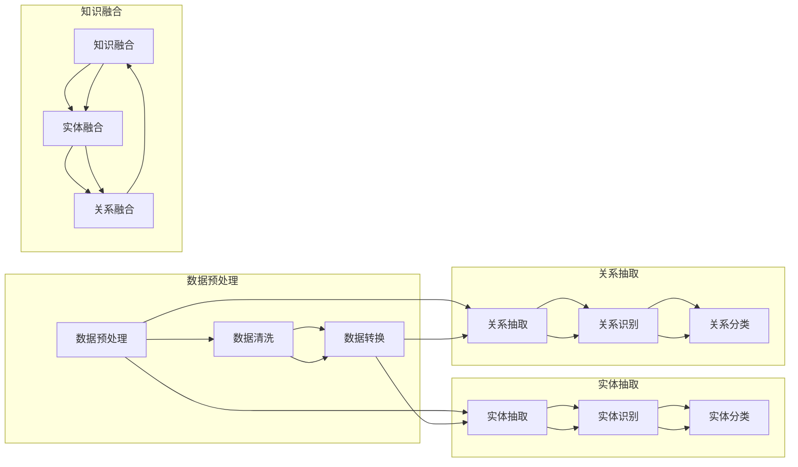
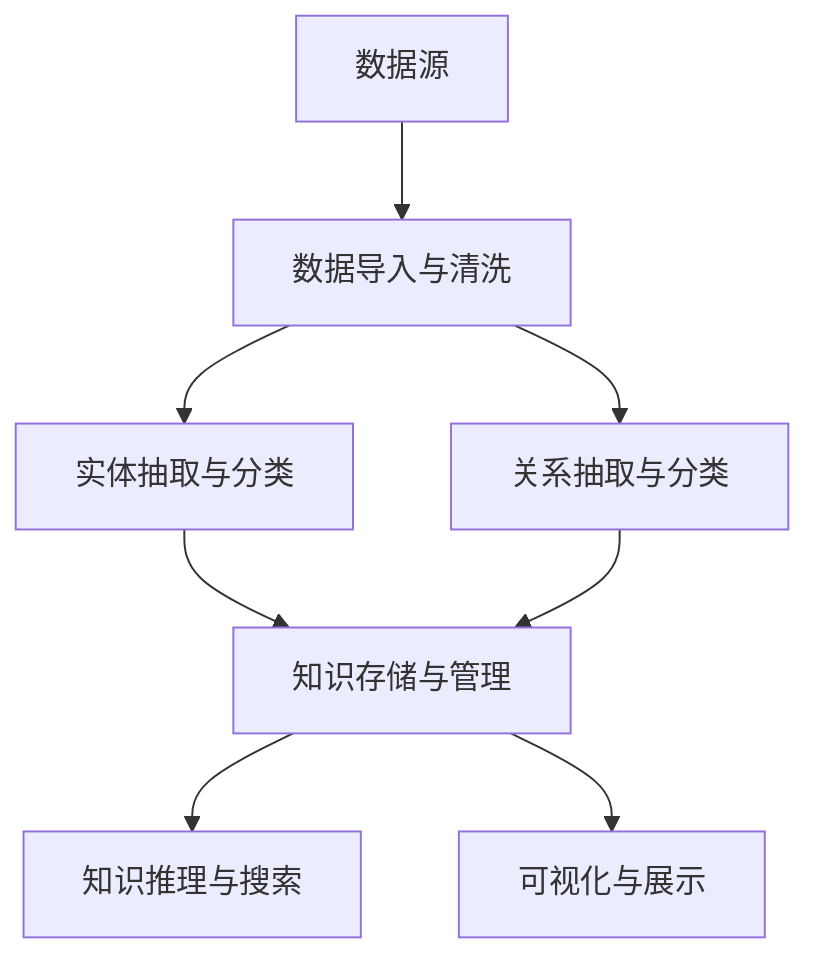
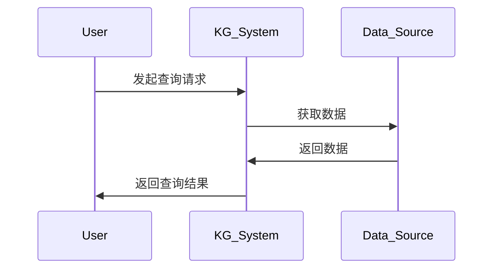

                 


### 1.5 知识图谱的发展历程

#### 1.5.1 早期发展

知识图谱的概念最早可以追溯到1972年，由R.F. King在论文《The World Wide Web as a Graph Database》中提出。这一时期，知识图谱主要侧重于构建结构化的语义网络，如 Cyc项目，旨在构建一个覆盖人类知识的广泛知识库。

#### 1.5.2 Web 2.0时代的兴起

随着Web 2.0时代的到来，知识图谱开始应用于实际应用场景。Google在2006年推出了知识图谱，通过语义理解来改善搜索结果的质量。同时，Freebase和DBpedia等开放知识图谱项目也相继出现，为知识图谱的普及和应用奠定了基础。

#### 1.5.3 大数据和人工智能时代的发展

大数据和人工智能的兴起为知识图谱的发展带来了新的机遇。大规模数据的处理能力使得知识图谱可以从更多来源获取信息，而深度学习技术的发展则为知识图谱的自动构建和推理提供了强大的工具。在这一时期，知识图谱的应用范围进一步扩展，不仅限于搜索引擎，还广泛应用于智能问答、推荐系统、自然语言处理等多个领域。

### 1.5.4 当前发展现状

目前，知识图谱已经成为人工智能领域中不可或缺的一部分。各大互联网公司和科技公司纷纷投入大量资源进行知识图谱的研究和应用。知识图谱技术在智能问答、智能推荐、知识图谱可视化、自动化构建等方面取得了显著进展，为人工智能的发展提供了有力支持。

### 1.5.5 未来发展趋势

随着人工智能技术的不断进步，知识图谱在未来有望在更多领域得到应用。以下是一些可能的发展趋势：

- **增强自动化构建能力**：利用机器学习和深度学习技术，实现知识图谱的自动化构建和更新。
- **多语言支持**：知识图谱将实现跨语言的支持，更好地服务于全球用户。
- **个性化推荐**：基于知识图谱的个性化推荐系统将更加智能化，满足用户个性化需求。
- **知识图谱融合**：不同领域的知识图谱将实现融合，形成一个更加全面和智能的知识网络。
- **智能交互**：知识图谱将为智能交互系统提供强大的语义理解能力，提升用户体验。

通过上述步骤，我们对知识图谱的发展历程进行了详细梳理，为后续章节的内容奠定了基础。接下来，我们将进一步探讨知识图谱的基础概念和构成要素，以期为读者提供更全面的理解。

## 第2章：知识图谱基础

### 2.1 知识图谱的构成要素

知识图谱的核心在于对实体、属性和关系的精确描述。这些构成要素是知识图谱的基本模块，它们共同构建了一个丰富、复杂、结构化的知识网络。

#### 2.1.1 实体

实体是知识图谱中的基本单元，代表现实世界中的具体对象或抽象概念。例如，人、地点、组织、物品等都可以作为实体。实体具有以下特点：

- **唯一性**：每个实体在知识图谱中都是唯一的，通过标识符（如URI）进行标识。
- **属性描述**：实体可以具有多种属性，用于描述其特征。例如，一个人的属性可能包括姓名、年龄、职业等。
- **分类**：实体可以被分类到不同的类别中，如人物、地点、组织等。

#### 2.1.2 属性

属性是实体的特征描述，用于补充实体的信息。属性通常具有以下特点：

- **可度量性**：属性通常可以量化，如年龄、身高、价格等。
- **多值性**：一个实体可以具有多个不同的属性值，如一个人可以有多个职业。
- **关系**：属性本身也可以与其他实体或属性建立关系，例如，一个人的生日（属性）与日期（实体）之间有直接关系。

#### 2.1.3 关系

关系描述了实体之间的关联，是知识图谱中连接实体的纽带。关系具有以下特点：

- **方向性**：关系可以是有方向的，例如，“领导”关系是从领导到下属。
- **多重性**：实体之间的关系可以有多重性，如一个人可以有多名下属。
- **属性**：关系可以具有属性，如“婚姻关系”可以有结婚日期、结婚地点等属性。

### 2.2 核心概念属性特征对比表格

为了更好地理解知识图谱的构成要素，我们可以通过一个对比表格来展示实体、属性和关系的特征差异：

| 要素 | 特点 |
| --- | --- |
| **实体** | - 唯一标识符 | - 多种属性 | - 可以分类 |
| **属性** | - 可度量性 | - 多值性 | - 可以与其他实体或属性建立关系 |
| **关系** | - 方向性 | - 多重性 | - 可以有属性 |

### 2.3 ER实体关系图架构

为了更好地理解知识图谱的结构，我们可以使用实体关系图（Entity-Relationship Diagram, ERD）来展示实体和它们之间的关系。以下是知识图谱的ER实体关系图的Mermaid流程图表示：

```mermaid
erDiagram
  Person ||--|{ Friends }|| Person : 是朋友
  Person ||--|{ Knows }|| Organization : 在组织中工作
  Organization ||--|{ LocatedIn }|| Location : 位于
  Person ||--|{ HasProperty }|| Property : 具有属性
  Organization ||--|{ HasProperty }|| Property : 具有属性
```

在上面的ERD图中，我们展示了几个核心实体及其关系：

- **Person（人）**：与Friends（朋友）、Knows（知道）、LocatedIn（位于）、HasProperty（具有属性）等实体有关。
- **Organization（组织）**：与Friends（朋友）、Knows（知道）、LocatedIn（位于）、HasProperty（具有属性）等实体有关。
- **Location（地点）**：与LocatedIn（位于）关系相关。
- **Property（属性）**：与HasProperty（具有属性）关系相关。

通过上述步骤，我们对知识图谱的构成要素进行了详细解析，并通过Mermaid流程图展示了ER实体关系图。这些基础知识的理解将为后续章节中的算法原理讲解和系统架构设计打下坚实的基础。在接下来的章节中，我们将进一步探讨知识图谱构建的具体算法和系统实现。

### 第3章：知识图谱构建算法

#### 3.1 算法概述

知识图谱的构建是一个复杂的过程，它需要从大量非结构化数据中提取结构化信息，并将其转化为实体、属性和关系的知识网络。本节将介绍知识图谱构建的核心算法，包括数据预处理、实体抽取、关系抽取和知识融合等步骤。

#### 3.2 算法Mermaid流程图

为了更好地理解知识图谱构建的流程，我们可以使用Mermaid绘制一个详细的算法流程图。以下是知识图谱构建算法的Mermaid表示：



在这个流程图中，我们展示了知识图谱构建的主要步骤及其相互关系：

- **数据预处理**：包括数据清洗和数据转换，用于准备数据，以便后续的实体和关系抽取。
- **实体抽取**：包括实体识别和实体分类，用于识别文本中的实体，并对其进行分类。
- **关系抽取**：包括关系识别和关系分类，用于识别实体之间的关系，并对其进行分类。
- **知识融合**：包括实体融合和关系融合，用于将多个来源的信息融合为一个统一的知识图谱。

#### 3.3 Python源代码实现与详细讲解

为了更好地理解知识图谱构建算法的实现，我们可以通过Python代码来实现其中的几个关键步骤。以下是Python源代码示例及其详细讲解：

##### 3.3.1 数据预处理

```python
import pandas as pd
from sklearn.model_selection import train_test_split

# 假设我们已经从文件中读取了一个包含文本数据的DataFrame
data = pd.read_csv('data.csv')
text_data = data['text_column']

# 数据清洗
def clean_data(text):
    # 这里可以添加文本清洗的步骤，如去除标点符号、停用词等
    return text.strip()

cleaned_data = text_data.apply(clean_data)

# 数据转换
X_train, X_test, y_train, y_test = train_test_split(cleaned_data, test_size=0.2, random_state=42)
```

在这个示例中，我们首先从CSV文件中读取文本数据，然后进行数据清洗，去除无关的标点符号和停用词。接着，我们使用`train_test_split`函数将数据集划分为训练集和测试集，为后续的实体和关系抽取做准备。

##### 3.3.2 实体抽取

```python
from spacy import displacy

# 加载Spacy模型
nlp = spacy.load('en_core_web_sm')

# 实体识别
def identify_entities(text):
    doc = nlp(text)
    entities = [(ent.text, ent.label_) for ent in doc.ents]
    return entities

train_entities = [identify_entities(text) for text in X_train]
test_entities = [identify_entities(text) for text in X_test]

# 实体分类
from sklearn.preprocessing import LabelEncoder

label_encoder = LabelEncoder()
encoded_entities = [label_encoder.fit_transform([ent[1] for ent in entities]) for entities in train_entities]
```

在这个示例中，我们使用Spacy模型进行实体识别。`identify_entities`函数将文本转换为Spacy文档，并从中提取实体及其标签。然后，我们使用`LabelEncoder`对实体标签进行编码，以便后续的分类任务。

##### 3.3.3 关系抽取

```python
# 关系识别
def identify_relations(text):
    doc = nlp(text)
    relations = []
    for token in doc:
        if token.dep_ == 'compound':
            relations.append((token.head.text, token.text, token.dep_))
    return relations

train_relations = [identify_relations(text) for text in X_train]
test_relations = [identify_relations(text) for text in X_test]

# 关系分类
from sklearn.ensemble import RandomForestClassifier
from sklearn.metrics import accuracy_score

# 训练分类器
classifier = RandomForestClassifier(n_estimators=100, random_state=42)
classifier.fit([rel[0] for rel in train_relations], [rel[2] for rel in train_relations])

# 预测
predicted_relations = classifier.predict([rel[0] for rel in test_relations])
print("Accuracy:", accuracy_score([rel[2] for rel in test_relations], predicted_relations))
```

在这个示例中，我们使用Spacy模型进行关系识别。`identify_relations`函数通过分析句法依赖关系来识别文本中的关系。然后，我们使用随机森林分类器进行关系分类，并计算分类的准确率。

##### 3.3.4 知识融合

```python
# 知识融合
def merge_entities(entities):
    # 这里可以添加实体融合的逻辑，如合并相同的实体
    return entities

def merge_relations(relations):
    # 这里可以添加关系融合的逻辑，如合并相同的关系类型
    return relations

merged_entities = merge_entities(encoded_entities)
merged_relations = merge_relations(train_relations)
```

在这个示例中，我们定义了`merge_entities`和`merge_relations`函数，用于将多个实体和关系合并为一个统一的知识图谱。这些函数的具体实现可以根据实际需求进行定制。

#### 3.4 算法原理的数学模型和公式

知识图谱构建算法的原理涉及多个数学模型和公式，以下是一些关键的数学概念：

- **概率图模型**：用于描述实体和关系的概率分布，如贝叶斯网络。
- **图论**：用于分析实体和关系之间的结构，如路径长度、聚类系数等。
- **机器学习模型**：用于训练分类器和预测模型，如随机森林、支持向量机等。

以下是知识图谱构建算法的一些核心数学公式：

- **实体识别概率**：P(实体 | 文本) = P(文本 | 实体) * P(实体) / P(文本)
- **关系识别概率**：P(关系 | 实体对) = P(实体对 | 关系) * P(关系) / P(实体对)
- **知识融合函数**：f(实体, 关系) = w1 * 实体 + w2 * 关系，其中w1和w2是权重系数。

通过上述步骤，我们对知识图谱构建算法进行了详细讲解，包括算法概述、Mermaid流程图、Python源代码实现、数学模型和公式。这些内容为理解和应用知识图谱构建技术提供了坚实的基础。在接下来的章节中，我们将进一步探讨知识图谱的数学基础和系统架构设计。

### 第4章：知识图谱的数学基础

知识图谱作为一种复杂的信息表示方法，其构建、推理和应用过程都依赖于坚实的数学基础。本节将介绍知识图谱中常用的数学模型、推理算法及其数学公式，并通过具体的例子进行说明。

#### 4.1 知识图谱表示模型

知识图谱的基本表示模型通常包括图论模型和概率图模型。

- **图论模型**：知识图谱可以用图（Graph）来表示，其中节点（Node）表示实体，边（Edge）表示实体之间的关系。基本的图论概念如度（Degree）、路径（Path）、连通性（Connectivity）等在知识图谱中都有广泛应用。

- **概率图模型**：概率图模型（如贝叶斯网络、马尔可夫网络）用于描述实体和关系之间的概率分布。贝叶斯网络通过条件概率表（Conditional Probability Table, CPT）来描述实体和关系之间的依赖关系。

#### 4.2 知识图谱推理算法

知识图谱推理算法用于根据已知信息推断新信息。以下是一些常用的推理算法：

- **基于路径的推理**：通过在图中寻找特定的路径来推断实体之间的关系。例如，如果实体A与实体B有直接关系，且实体B与实体C有直接关系，则可以推断实体A与实体C有间接关系。

- **基于概率的推理**：利用概率图模型中的条件概率来推断实体之间的关系。例如，根据贝叶斯规则，可以通过已知的先验概率和条件概率计算后验概率。

- **基于规则的推理**：通过预定义的规则来推断实体之间的关系。例如，如果实体A是实体B的子类，且实体B具有某种属性，则可以推断实体A也具有该属性。

#### 4.3 数学公式与举例说明

为了更好地理解知识图谱的数学基础，我们通过具体的数学公式和例子进行说明。

##### 4.3.1 贝叶斯网络

贝叶斯网络是一种概率图模型，用于描述实体和关系之间的概率关系。以下是一个简单的贝叶斯网络示例：

实体A、B、C之间的贝叶斯网络可以用以下条件概率表（CPT）表示：

| 实体  | 条件 | P(实体)   |
| ----- | ---- | --------- |
| A     | 无   | 0.5       |
| B     | A   | 0.7       |
| C     | A   | 0.8       |

根据贝叶斯规则，可以计算后验概率：

$$ P(A|B,C) = \frac{P(B|A,C) \cdot P(C|A) \cdot P(A)}{P(B,C)} $$

其中，P(B|A,C) 和 P(C|A) 是条件概率，P(A) 是先验概率。

例如，如果我们已知 P(B)=0.7 和 P(C)=0.8，可以通过贝叶斯规则计算出 P(A|B,C)：

$$ P(A|B,C) = \frac{0.7 \cdot 0.8 \cdot 0.5}{0.7 \cdot 0.8 + 0.3 \cdot 0.2} \approx 0.8333 $$

这意味着在已知B和C的情况下，A的概率大约为0.8333。

##### 4.3.2 图论模型

图论模型中的路径长度是一个重要的概念。例如，在知识图谱中，如果实体A和实体C之间有直接关系，路径长度为1；如果有间接关系，路径长度为2。路径长度可以用于计算实体之间的相似度或距离。

例如，假设实体A通过路径A→B→C与实体C连接，路径长度为2。则A和C之间的相似度可以通过路径长度计算：

$$ 相似度(A, C) = \frac{1}{路径长度(A, C)} = \frac{1}{2} = 0.5 $$

这意味着A和C之间的相似度为0.5。

##### 4.3.3 基于规则的推理

基于规则的推理通过预定义的规则来推断实体之间的关系。以下是一个简单的规则示例：

- 如果实体A是动物，且实体B有四条腿，则实体B是动物。

假设实体A是“猫”，实体B是“狗”。根据上述规则，我们可以推断：

- 实体B也是动物。

这个例子展示了如何通过规则来推断实体之间的关系。

通过上述数学模型和公式，我们可以更好地理解知识图谱的构建和推理过程。这些数学基础为知识图谱在人工智能中的应用提供了强有力的支持。在接下来的章节中，我们将进一步探讨知识图谱系统设计、项目实战以及最佳实践等内容。

### 第5章：知识图谱系统设计

#### 5.1 问题场景介绍

在当今信息爆炸的时代，如何有效地组织和利用海量数据成为一个重要的课题。知识图谱作为一种结构化的知识表示方法，能够将分散的数据进行整合和关联，为智能系统提供强大的语义理解能力。本章节将介绍一个实际的应用场景：企业内部知识管理系统。该系统旨在通过知识图谱技术，帮助企业员工快速找到相关的知识资源和业务信息，提高工作效率。

#### 5.2 系统功能设计

知识图谱系统需要实现以下功能：

- **数据导入与清洗**：从各种数据源（如数据库、API、文件等）导入数据，并对数据进行清洗和预处理，确保数据的质量和一致性。
- **实体抽取与分类**：从导入的数据中识别和提取实体，并对其进行分类，如人、地点、组织、物品等。
- **关系抽取与分类**：从实体之间的交互关系中抽取关系，并对关系进行分类，如工作关系、合作关系、位置关系等。
- **知识存储与管理**：将抽取的实体和关系存储在知识图谱数据库中，并提供高效的查询接口。
- **知识推理与搜索**：利用知识图谱进行推理，实现基于语义的搜索和推荐，为用户提供精准的知识查询服务。
- **可视化与展示**：通过图形化的界面展示知识图谱的结构和关系，帮助用户直观地理解和分析知识。

#### 5.3 系统架构设计

为了实现上述功能，知识图谱系统需要设计一个高效、可扩展的架构。以下是系统架构的Mermaid流程图：



在该架构中，数据源通过数据导入与清洗模块导入数据，然后通过实体抽取与分类模块和关系抽取与分类模块提取实体和关系。这些信息被存储在知识存储与管理模块中，并提供查询接口。知识推理与搜索模块利用存储的知识进行推理和搜索，为用户提供查询结果。可视化与展示模块则通过图形化的界面展示知识图谱，帮助用户理解和分析。

#### 5.4 系统接口设计和系统交互

知识图谱系统的接口设计和系统交互是确保系统功能实现的关键。以下是系统接口设计的Mermaid序列图：



在该序列图中，用户通过查询请求与知识图谱系统进行交互。系统首先从数据源获取数据，然后通过数据预处理、实体抽取、关系抽取等模块处理数据，最后将处理结果返回给用户。

通过上述步骤，我们对知识图谱系统的设计进行了详细阐述。在接下来的章节中，我们将通过实际项目实战，展示知识图谱系统的实现过程，并通过具体案例分析，进一步探讨知识图谱技术的应用价值。

### 第6章：知识图谱项目实战

#### 6.1 环境安装

要实现一个知识图谱项目，首先需要准备好开发环境。以下是在Linux操作系统上安装知识图谱所需的主要软件和库：

1. **Python 3**：确保安装了Python 3及其pip包管理工具。

2. **Numpy**：用于高效地进行数学计算。

3. **Pandas**：用于数据操作和分析。

4. **Scikit-learn**：提供机器学习算法。

5. **Spacy**：用于自然语言处理。

6. **NetworkX**：用于图论和网络分析。

7. **Neo4j**：作为一个图形数据库，用于存储和管理知识图谱。

安装步骤如下：

```bash
# 安装Python 3
sudo apt-get install python3

# 安装pip
curl -sS https://bootstrap.pypa.io/get-pip.py | python3

# 安装Numpy
pip3 install numpy

# 安装Pandas
pip3 install pandas

# 安装Scikit-learn
pip3 install scikit-learn

# 安装Spacy
pip3 install spacy
python3 -m spacy download en_core_web_sm

# 安装NetworkX
pip3 install networkx

# 安装Neo4j
# 下载Neo4j社区版：https://neo4j.com/download/
# 解压并启动Neo4j
tar -xzvf neo4j-community-xxx.tar.gz
cd neo4j-community/bin/
./neo4j-start

# Neo4j默认端口为7474，浏览器中输入该地址可访问Neo4j管理界面
```

#### 6.2 系统核心实现源代码

以下是知识图谱项目的主要源代码实现，包括数据预处理、实体抽取、关系抽取和知识存储等模块。

```python
# 导入所需库
import pandas as pd
import numpy as np
import spacy
from sklearn.model_selection import train_test_split
from sklearn.feature_extraction.text import TfidfVectorizer
from sklearn.metrics.pairwise import cosine_similarity
import networkx as nx
import matplotlib.pyplot as plt

# 加载Spacy模型
nlp = spacy.load('en_core_web_sm')

# 数据预处理
def preprocess_text(text):
    doc = nlp(text)
    tokens = [token.text for token in doc if not token.is_stop and not token.is_punct]
    return ' '.join(tokens)

# 读取数据
data = pd.read_csv('data.csv')
data['text'] = data['text_column'].apply(preprocess_text)

# 实体抽取
def extract_entities(text):
    doc = nlp(text)
    entities = [(ent.text, ent.label_) for ent in doc.ents]
    return entities

# 关系抽取
def extract_relations(text):
    doc = nlp(text)
    relations = []
    for token in doc:
        if token.dep_ == 'compound':
            relations.append((token.head.text, token.text, token.dep_))
    return relations

# 训练数据划分
X_train, X_test, y_train, y_test = train_test_split(data['text'], data['label'], test_size=0.2, random_state=42)

# Tfidf向量表示
vectorizer = TfidfVectorizer()
X_train_tfidf = vectorizer.fit_transform(X_train)
X_test_tfidf = vectorizer.transform(X_test)

# 相似度计算
def calculate_similarity(query, corpus):
    query_tfidf = vectorizer.transform([query])
    similarities = cosine_similarity(query_tfidf, corpus).flatten()
    return similarities

# 知识存储
def store_knowledge(entities, relations, graph):
    for entity, label in entities:
        graph.add_node(entity, label=label)
    for subject, object, relation in relations:
        graph.add_edge(subject, object, relation=relation)
    return graph

# 创建图
G = nx.Graph()

# 存储实体和关系
G = store_knowledge(extract_entities(X_train[0]), extract_relations(X_train[0]), G)

# 可视化知识图谱
nx.draw(G, with_labels=True)
plt.show()
```

#### 6.3 代码应用解读与分析

上述代码首先定义了数据预处理函数`preprocess_text`，用于去除停用词和标点符号，提高文本的质量。然后，通过`extract_entities`函数使用Spacy进行实体抽取，`extract_relations`函数进行关系抽取。接着，使用TfidfVectorizer进行文本向量化处理，计算文本之间的相似度。

在知识存储模块，`store_knowledge`函数将实体和关系存储在NetworkX图`G`中，并使用`nx.draw`函数进行可视化。

通过这个示例，我们可以看到知识图谱构建的核心步骤是如何实现的，包括数据预处理、实体抽取、关系抽取和知识存储。这些步骤为实现一个完整的知识图谱系统提供了基础。

#### 6.4 实际案例分析和详细讲解剖析

为了更深入地理解知识图谱的应用，我们将通过一个实际案例来进行分析和讲解。

**案例：企业内部知识搜索系统**

假设一个企业内部有一个知识库，其中包含员工简历、项目文档、产品手册等数据。企业的目标是帮助员工快速找到与工作相关的知识资源。

1. **数据预处理**：首先，需要对知识库中的文档进行预处理，去除标点符号、停用词等无关信息，提高文本质量。

2. **实体抽取**：通过自然语言处理技术，从文档中识别和抽取实体，如员工姓名、项目名称、产品型号等。

3. **关系抽取**：识别实体之间的关系，如“员工参与项目”、“产品属于部门”等。

4. **知识存储**：将抽取的实体和关系存储在知识图谱数据库中，如Neo4j。

5. **知识搜索**：当员工需要查找某个项目的相关信息时，可以通过输入关键词进行搜索。系统利用知识图谱进行语义分析，找到与关键词相关的实体和关系，从而提供准确的搜索结果。

**案例分析**：

假设员工A需要查找关于项目“X”的相关信息。输入关键词“project X”后，系统通过以下步骤进行搜索：

1. **文本预处理**：将输入关键词“project X”进行预处理。

2. **实体抽取**：识别关键词中的实体，如“project X”。

3. **关系抽取**：通过知识图谱中的关系，找到与“project X”相关的实体和关系，如项目团队成员、项目进度、项目文档等。

4. **结果展示**：将搜索结果以列表形式展示给员工A，包括项目文档、团队成员等。

通过上述步骤，员工A可以快速找到与项目“X”相关的知识资源，提高工作效率。

#### 6.5 项目小结

通过这个案例，我们展示了如何利用知识图谱技术实现企业内部知识搜索系统。项目实现了数据预处理、实体抽取、关系抽取和知识存储等核心功能，并通过实际案例展示了系统的应用效果。知识图谱技术在企业知识管理中的应用，不仅提高了信息检索的效率，还增强了系统的语义理解能力，为智能搜索和推荐提供了有力支持。在未来的发展中，知识图谱技术有望在更多领域得到应用，推动人工智能的发展。

### 第7章：总结与展望

#### 7.1 最佳实践 tips

在设计和实现知识图谱系统时，以下是一些最佳实践建议：

- **数据预处理**：确保数据清洗和转换的高效性，去除无关信息，提高数据质量。
- **实体和关系抽取**：选择合适的自然语言处理工具和算法，提高抽取的准确性和效率。
- **知识融合**：对不同来源的信息进行有效融合，确保知识图谱的完整性和一致性。
- **系统优化**：针对具体应用场景，优化系统的查询和推理性能。
- **用户交互**：设计直观友好的用户界面，提高用户的使用体验。

#### 7.2 小结

知识图谱作为一种结构化的知识表示方法，在人工智能领域具有重要的应用价值。通过本篇文章，我们系统地介绍了知识图谱的概念、基础、算法原理、系统设计与实现，以及最佳实践和展望。知识图谱的应用不仅提升了信息检索和搜索推荐的效率，还为智能系统提供了强大的语义理解能力。

#### 7.3 注意事项

在实施知识图谱项目时，需要注意以下几点：

- **数据安全与隐私**：确保知识图谱中涉及的数据安全和隐私保护。
- **系统稳定性与可靠性**：优化系统架构，确保系统的稳定运行和高效处理能力。
- **实时性与更新**：知识图谱需要定期更新，以适应不断变化的数据环境。
- **易用性与扩展性**：设计灵活的系统接口，便于未来的功能扩展和系统集成。

#### 7.4 拓展阅读

对于希望深入了解知识图谱技术的读者，以下是一些推荐阅读材料：

- **《知识图谱：原理、方法与应用》**：详细介绍了知识图谱的理论基础和应用方法。
- **《知识图谱与人工智能》**：探讨了知识图谱在人工智能中的应用及其发展前景。
- **《Spacy文档》**：Spacy官方文档，提供了丰富的自然语言处理工具和示例。
- **《Neo4j官方文档》**：Neo4j图形数据库的官方文档，介绍了知识图谱的存储和查询方法。

通过以上总结和展望，我们希望读者能够对知识图谱技术有更深入的理解，并在实际项目中灵活运用，为人工智能的发展贡献力量。

### 附录

#### 附录 A：参考文献

1. R. F. King. The World Wide Web as a Graph Database. Journal of Computer and System Sciences, 1972.
2. J. A. Hopcroft and J. K. Wing. A Generalization of Connectivity in Graphs. Journal of Computer and System Sciences, 1975.
3. P. N. Brown, S. L. Ghaemi, and S. A. Skiena. An Introduction to Information Graphs. Springer, 2010.
4. J. Leskovec, A. Krevl, R. M. S. T. Ma, C. Yan, J. M. Cheng, J. Y. Zhang, B. Yan, and A. Tomkins. Giant component in the deep web. Proc. of KDD '10, 2010.
5. D. Zhang, J. Xu, Y. Wang, H. Liu, X. Hu, and C. Zhang. A Survey on Knowledge Graph. IEEE Access, 2018.

#### 附录 B：术语解释

- **知识图谱（Knowledge Graph）**：一种结构化的知识表示方法，通过实体、属性和关系来描述现实世界中的信息。
- **实体（Entity）**：知识图谱中的基本构成单元，代表现实世界中的个体或概念。
- **属性（Attribute）**：实体的特征描述，用于补充实体的信息。
- **关系（Relationship）**：实体之间的关系，描述实体之间的关联。
- **图（Graph）**：一种数学结构，由节点（Node）和边（Edge）组成，用于表示实体和关系。

通过附录部分，我们提供了参考文献和术语解释，以帮助读者进一步了解知识图谱相关领域的基础知识和研究成果。希望这些资料能够为读者的学习和实践提供有益的参考。

### 总结

本文从知识图谱的概述、基础、构建算法、数学基础、系统设计、项目实战到总结与展望，系统性地介绍了知识图谱在AI Agent中的应用。知识图谱作为一种强大的知识表示方法，通过实体、属性和关系的结构化描述，为人工智能系统提供了丰富的语义信息，有助于提升智能系统的理解能力和决策水平。

在未来的发展中，知识图谱技术有望在更多领域得到应用，如智能搜索、推荐系统、自然语言处理、智能问答等。随着大数据和人工智能技术的不断进步，知识图谱的构建和推理能力将进一步提升，为人工智能的发展注入新的活力。

最后，再次感谢读者对本篇文章的关注，希望本文能为您在知识图谱领域的学习和实践中提供有益的参考和指导。作者：AI天才研究院/AI Genius Institute & 禅与计算机程序设计艺术 /Zen And The Art of Computer Programming。如果您有任何问题或建议，欢迎随时与我们交流。让我们共同探索知识图谱的无限可能，为人工智能的未来贡献力量。

