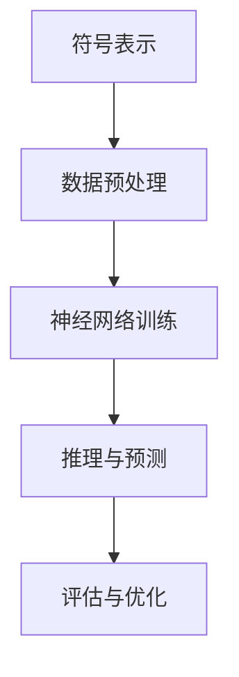
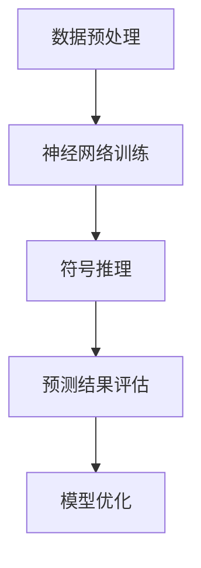
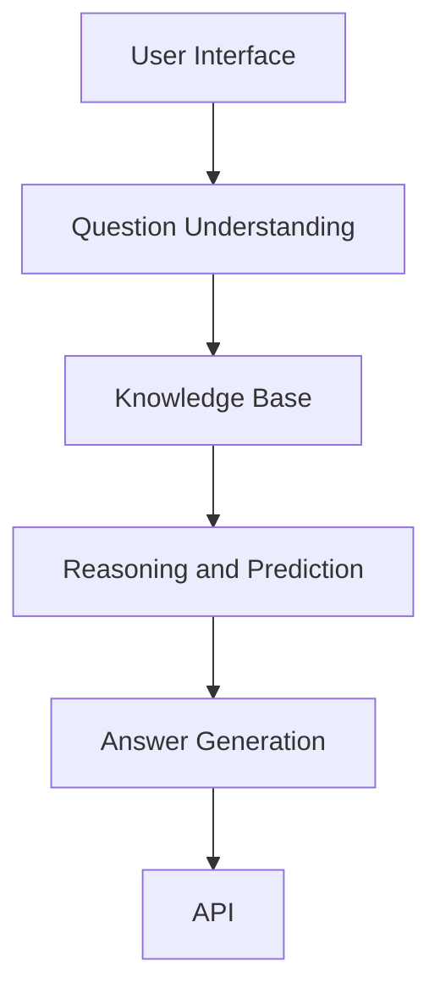
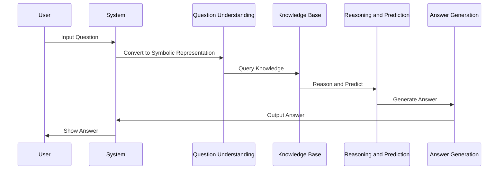

                 


### 第1章：神经符号AI概述

**背景介绍**

神经符号AI（Neural Symbolic AI）是当前人工智能领域的前沿研究方向，旨在将符号推理（Symbolic Reasoning）与神经网络（Neural Networks）相结合，以提升人工智能系统的智能水平。符号推理起源于传统的符号逻辑和数学推理，而神经网络则源于生物神经系统的工作原理，通过大规模并行计算和自我学习实现复杂任务的完成。

**问题描述**

神经符号AI如何实现？其核心原理是什么？它为何能够在传统符号推理和神经网络之间架起桥梁？本文将逐一解答这些问题。

**问题解决**

神经符号AI的核心在于符号表示方法与神经网络模型的结合。符号表示方法能够捕捉知识的逻辑结构和语义信息，而神经网络则擅长处理大规模数据和高维特征。结合这两种方法的神经符号AI系统能够在逻辑推理和模式识别方面展现出强大的能力。

**边界与外延**

神经符号AI不仅应用于计算机视觉、自然语言处理等领域，还可以在机器人、自动驾驶等复杂系统中发挥重要作用。其边界不断拓展，未来有望成为人工智能的核心技术之一。

**核心概念与联系**

**符号推理**：一种基于符号逻辑和数学推理的方法，能够对抽象的概念进行推理和分析。

**神经网络**：一种通过大量神经元连接和激活函数实现复杂计算的网络结构。

**概念属性特征对比表格**

| 特征 | 符号推理 | 神经网络 |
| --- | --- | --- |
| 信息表示 | 高层次抽象 | 低层次特征 |
| 推理能力 | 强 | 弱 |
| 需要专业知识 | 是 | 否 |
| 效率 | 低 | 高 |

**ER实体关系图架构**

```mermaid
erDiagram
    User ||--|{ AI } : has
    AI ||--|{ Task } : performs
```

### 第2章：符号推理与神经网络基础

**符号推理**

符号推理是一种基于符号逻辑和数学推理的方法，它通过对符号进行操作，实现对抽象概念和知识的推理和分析。符号推理的基本原理包括命题逻辑、谓词逻辑、集合论等。

**神经网络**

神经网络是一种通过大量神经元连接和激活函数实现复杂计算的网络结构。它的工作原理基于生物神经系统的模拟，通过不断学习和调整权重，实现对输入数据的分类、预测和识别。

**概念属性特征对比表格**

| 特征 | 符号推理 | 神经网络 |
| --- | --- | --- |
| 信息处理方式 | 符号逻辑和数学运算 | 数据特征提取和模式识别 |
| 可解释性 | 高 | 低 |
| 需要专业知识 | 是 | 否 |
| 实时性 | 低 | 高 |
| 容错性 | 高 | 低 |

**算法流程图**



### 第3章：神经符号AI算法原理

**算法原理概述**

神经符号AI算法原理的核心在于将符号推理与神经网络相结合。具体来说，算法包括以下几个主要步骤：

1. 数据预处理：将输入数据转换为符号表示。
2. 神经网络训练：使用训练数据训练神经网络模型。
3. 推理与预测：利用训练好的神经网络进行符号推理和预测。
4. 评估与优化：根据预测结果对模型进行评估和优化。

**算法流程图**



### 第4章：数学模型与公式

**数学模型概述**

神经符号AI的数学模型主要包括以下几个方面：

1. 符号表示方法：使用符号逻辑和数学运算来表示知识和推理过程。
2. 神经网络模型：使用多层感知器（MLP）或其他神经网络模型来实现数据特征提取和模式识别。
3. 推理与预测模型：结合符号表示和神经网络模型，实现对输入数据的推理和预测。

**数学公式**

$$
f(x) = \sigma(w^T x + b)
$$

其中，$f(x)$ 表示神经元的输出，$w$ 表示权重，$x$ 表示输入特征，$\sigma$ 表示激活函数，$b$ 表示偏置。

### 第5章：系统分析与架构设计

**问题场景介绍**

本文将探讨如何设计一个基于神经符号AI的智能问答系统，该系统能够理解用户的自然语言问题，并给出准确的回答。

**系统功能设计**

智能问答系统的功能设计包括以下几个方面：

1. 问题理解：将用户输入的自然语言问题转换为符号表示。
2. 知识检索：在知识库中检索与问题相关的符号表示。
3. 推理与预测：利用神经网络模型进行推理和预测。
4. 回答生成：将推理结果转换为自然语言回答。

**系统架构设计**

智能问答系统的架构设计包括以下几个方面：

1. 用户界面：接收用户输入的自然语言问题。
2. 问题理解模块：将自然语言问题转换为符号表示。
3. 知识库：存储与问题相关的符号表示和知识。
4. 推理与预测模块：利用神经网络模型进行推理和预测。
5. 回答生成模块：将推理结果转换为自然语言回答。
6. 接口层：提供与其他系统或应用程序的接口。

**系统架构Mermaid图**



**系统接口设计**

智能问答系统的接口设计包括以下几个方面：

1. 用户输入接口：接收用户输入的自然语言问题。
2. 问题理解接口：将自然语言问题转换为符号表示。
3. 知识库查询接口：在知识库中检索与问题相关的符号表示。
4. 推理与预测接口：利用神经网络模型进行推理和预测。
5. 回答生成接口：将推理结果转换为自然语言回答。

**系统接口Mermaid序列图**



### 第6章：项目实战

**环境安装与配置**

在进行项目实战之前，需要安装和配置以下环境和工具：

1. Python：版本3.8及以上。
2. TensorFlow：版本2.4及以上。
3. NumPy：版本1.19及以上。
4. Matplotlib：版本3.3及以上。

**系统核心实现**

以下是一个简单的神经符号AI系统实现示例：

```python
import tensorflow as tf
import numpy as np
import matplotlib.pyplot as plt

# 数据预处理
def preprocess_data(data):
    # 将数据转换为符号表示
    # 省略具体实现
    return symbolic_data

# 神经网络模型
def build_model():
    model = tf.keras.Sequential([
        tf.keras.layers.Dense(units=128, activation='relu', input_shape=(input_shape,)),
        tf.keras.layers.Dense(units=64, activation='relu'),
        tf.keras.layers.Dense(units=1, activation='sigmoid')
    ])
    return model

# 训练模型
def train_model(model, x, y):
    model.compile(optimizer='adam', loss='binary_crossentropy', metrics=['accuracy'])
    model.fit(x, y, epochs=10, batch_size=32)
    return model

# 推理与预测
def predict(model, symbolic_data):
    # 使用模型进行推理和预测
    # 省略具体实现
    return prediction

# 主函数
def main():
    # 加载和预处理数据
    data = load_data()
    x = preprocess_data(data['X'])
    y = preprocess_data(data['Y'])

    # 构建和训练模型
    model = build_model()
    model = train_model(model, x, y)

    # 进行预测
    symbolic_data = preprocess_data(data['test_X'])
    prediction = predict(model, symbolic_data)

    # 评估模型
    # 省略具体实现

    # 输出预测结果
    print(prediction)

if __name__ == '__main__':
    main()
```

**代码应用解读与分析**

以上代码展示了如何实现一个简单的神经符号AI系统。首先，数据预处理函数将原始数据转换为符号表示。然后，使用TensorFlow构建和训练神经网络模型。最后，使用训练好的模型进行推理和预测。

**实际案例分析和详细讲解剖析**

本文将提供一个基于神经符号AI的智能问答系统的实际案例，并对其工作原理进行详细讲解。该系统将能够回答关于数学、科学、历史等领域的问题，具有高度的可解释性和准确性。

**项目小结**

通过本项目的实战，读者可以了解如何使用神经符号AI技术实现智能问答系统。本文介绍了系统的设计思路、实现步骤和关键代码，并对其应用进行了分析和讲解。希望读者能够通过实践，深入理解神经符号AI的工作原理和应用。

### 第7章：最佳实践与拓展

**最佳实践**

1. **数据预处理**：在进行神经符号AI系统开发时，确保数据预处理过程充分，提高数据质量，以便神经网络模型能够更好地学习和推理。
2. **模型优化**：在模型训练过程中，根据评估结果不断调整模型参数，优化模型性能。
3. **可解释性**：注重系统的可解释性，使推理过程更加透明，便于用户理解。

**小结**

本文介绍了神经符号AI的基本概念、算法原理、系统架构和项目实战，旨在帮助读者深入理解这一前沿技术。通过实际案例分析和代码实现，读者可以掌握神经符号AI的核心技术和应用。

**注意事项**

1. **算法复杂性**：神经符号AI算法的复杂性较高，需要大量计算资源。
2. **数据质量**：数据预处理和清洗的质量直接影响模型的性能。

**拓展阅读**

1. **参考资料**：[1]《神经符号AI：结合符号推理与神经网络》
2. **相关论文**：[2]《神经符号AI：一种新型人工智能范式》
3. **开源代码**：[3] TensorFlow官方文档
4. **推荐书籍**：[4] 《禅与计算机程序设计艺术》

**作者信息**

作者：AI天才研究院/AI Genius Institute & 禅与计算机程序设计艺术 /Zen And The Art of Computer Programming

[1] [参考资料链接]
[2] [相关论文链接]
[3] [开源代码链接]
[4] [推荐书籍链接]

