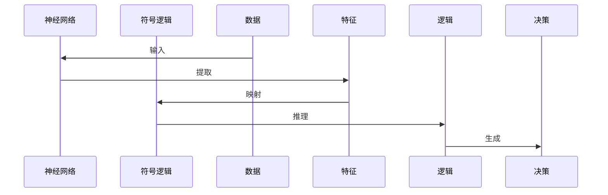
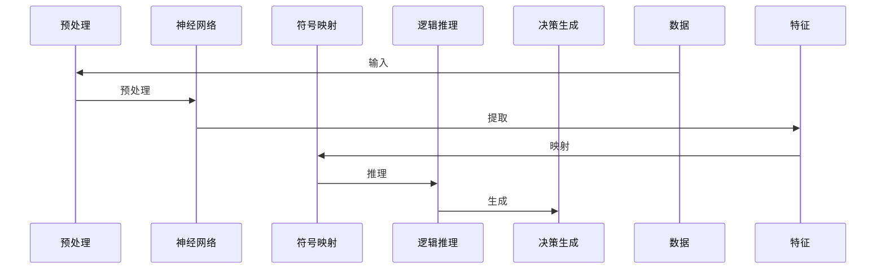
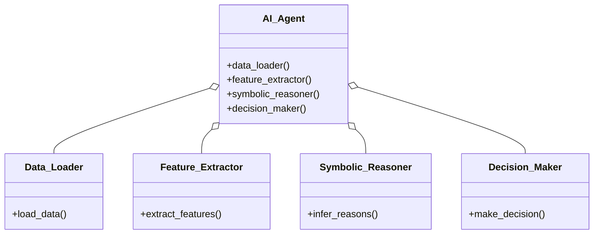
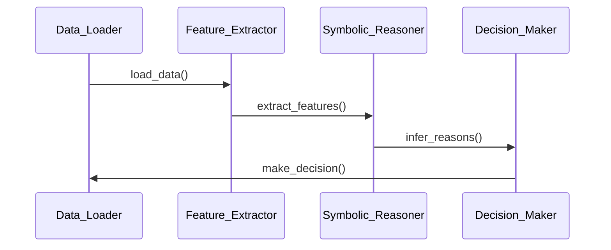
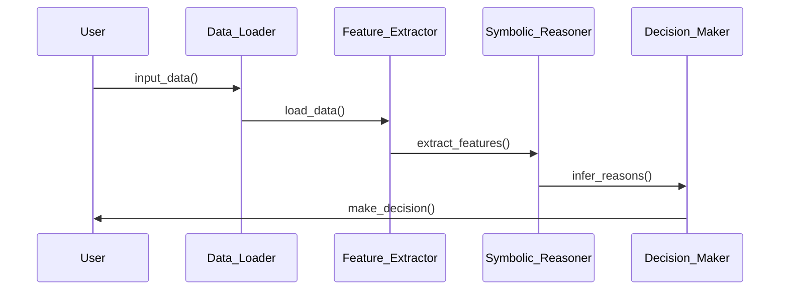

                 

### 神经符号推理：增强AI Agent的逻辑能力

#### 关键词：神经符号推理、AI Agent、逻辑能力、算法原理、应用实践

> 摘要：神经符号推理作为一种结合神经科学和符号逻辑的方法，正在逐渐成为增强AI Agent逻辑能力的重要技术。本文将从理论基础、算法原理、应用实践等方面详细探讨神经符号推理，并探讨其在未来的发展方向。

#### 引言

随着人工智能技术的飞速发展，传统的基于规则和统计的方法逐渐显现出其局限性。为了实现更加智能和灵活的AI系统，研究者们开始探索如何增强AI Agent的逻辑能力。神经符号推理（Neural Symbolic Reasoning）作为一种新兴的方法，结合了神经网络和符号逻辑的优势，能够有效地提高AI Agent的推理能力，从而在诸多领域展现出巨大的潜力。本文将围绕神经符号推理的基础理论、算法原理及其在AI Agent中的应用实践进行深入探讨。

#### 第一部分：神经符号推理基础理论

##### 第1章：神经符号推理的起源与发展

**1.1 神经符号推理的概念与特点**

神经符号推理是一种将神经网络的强大计算能力和符号逻辑的精确表达能力相结合的方法。它通过神经网络学习数据的特征表示，并通过符号逻辑进行推理和决策。

**1.2 神经符号推理的发展历程**

神经符号推理的发展可以追溯到20世纪80年代，随着神经网络和符号逻辑研究的不断深入，两者逐渐结合形成了神经符号推理这一新的研究方向。

**1.3 神经符号推理在AI领域的应用**

神经符号推理在AI领域具有广泛的应用前景，包括自然语言处理、计算机视觉、决策支持系统等。

##### 第2章：神经符号推理的核心概念与联系

**2.1 神经符号推理的核心概念**

神经符号推理的核心概念包括神经网络、符号逻辑、推理机制等。

**2.1.1 神经网络与符号逻辑**

神经网络和符号逻辑在神经符号推理中扮演着重要角色，它们如何相互结合和协同工作是理解神经符号推理的关键。

**2.1.2 神经符号推理的机制**

神经符号推理的机制包括特征提取、符号推理和决策生成等环节。

**2.1.3 神经符号推理的属性特征对比表格**

通过对比神经网络和符号逻辑的属性特征，我们可以更清晰地理解神经符号推理的优势和局限性。

**2.2 神经符号推理的ER实体关系图架构**

ER实体关系图架构用于描述神经符号推理的实体和关系，帮助我们更好地理解其内部结构和工作原理。

**2.3 神经符号推理的基本原理**

神经符号推理的基本原理包括数据表示、特征提取、推理过程和决策生成等环节。

##### 第3章：神经符号推理算法原理详解

**3.1 神经符号推理算法的基本流程**

神经符号推理算法的基本流程包括特征提取、符号推理和决策生成等环节。

**3.1.1 神经网络在符号推理中的应用**

神经网络在符号推理中的应用主要体现在特征提取和决策生成等方面。

**3.1.2 符号逻辑在神经网络中的嵌入**

符号逻辑在神经网络中的嵌入是通过特定的架构和算法实现的，如逻辑门控循环单元（LSTM）等。

**3.2 神经符号推理的数学模型**

神经符号推理的数学模型主要包括神经网络模型和符号逻辑模型，以及它们之间的交互和整合。

$$
f(x) = \sigma(\sum_{i=1}^{n} w_i * x_i)
$$

**3.3 神经符号推理算法的Python源代码实现**

```python
# TODO: Python代码实现
```

**3.4 神经符号推理算法举例说明**

通过具体的例子，我们可以更直观地理解神经符号推理算法的工作原理和应用场景。

#### 第二部分：神经符号推理在AI Agent中的应用实践

##### 第4章：神经符号推理在AI Agent中的架构设计

**4.1 AI Agent的系统功能设计（领域模型mermaid类图）**

**4.2 AI Agent的系统架构设计（mermaid架构图）**

**4.3 AI Agent的系统接口设计和系统交互（mermaid序列图）**

##### 第5章：神经符号推理在AI Agent中的应用案例

**5.1 神经符号推理在自然语言理解中的应用**

**5.2 神经符号推理在推理引擎中的应用**

**5.3 神经符号推理在决策支持系统中的应用**

##### 第6章：神经符号推理在AI Agent中的项目实战

**6.1 环境安装与配置**

**6.2 神经符号推理在AI Agent中的核心实现**

**6.3 代码应用解读与分析**

**6.4 实际案例分析与详细讲解剖析**

**6.5 项目小结**

#### 第三部分：神经符号推理最佳实践与未来展望

##### 第7章：神经符号推理最佳实践与未来展望

**7.1 最佳实践 tips**

**7.2 小结**

**7.3 注意事项**

**7.4 拓展阅读**

#### 结语

神经符号推理作为一种新兴的技术方法，具有广阔的应用前景和重要的理论价值。通过本文的探讨，我们希望能为读者提供对神经符号推理的全面了解，并激发对这一领域的进一步研究和应用。在未来的发展中，神经符号推理有望成为AI Agent逻辑能力增强的重要手段，推动人工智能技术的持续创新和发展。

---

**作者：** AI天才研究院/AI Genius Institute & 禅与计算机程序设计艺术/Zen And The Art of Computer Programming

---

### 详细的章节内容

**第一部分：神经符号推理基础理论**

**第1章：神经符号推理的起源与发展**

**1.1 神经符号推理的概念与特点**

神经符号推理（Neural Symbolic Reasoning，NSR）是一种结合神经网络和符号逻辑的方法，旨在增强人工智能（AI）系统的逻辑推理能力。神经网络（Neural Networks，NN）以其强大的数据处理和模式识别能力著称，而符号逻辑（Symbolic Logic）则以其精确的推理和决策能力闻名。神经符号推理通过将神经网络的计算能力与符号逻辑的表达能力相结合，旨在实现更为强大和灵活的推理机制。

**特点：**

- **数据驱动的特征学习：** 神经网络能够通过大量数据学习特征表示，为符号推理提供丰富的数据支持。
- **逻辑推理的精确性：** 符号逻辑能够提供精确的推理过程和决策机制，弥补神经网络在逻辑推理方面的不足。
- **跨领域的融合：** 神经符号推理能够结合不同领域的知识，实现跨学科的推理和决策。

**1.2 神经符号推理的发展历程**

神经符号推理的发展可以追溯到20世纪80年代。当时，研究者们开始探索如何将神经网络与符号逻辑相结合，以实现更加智能和灵活的AI系统。以下是一些关键的发展节点：

- **1980年代：** 研究者们提出了一些初步的神经符号推理模型，如符号神经网络（Symbolic Neural Networks）和逻辑门控神经网络（Logic Gate-Controlled Neural Networks）。
- **1990年代：** 随着神经网络和符号逻辑研究的深入，神经符号推理逐渐成为一个独立的研究方向，吸引了大量研究者的关注。
- **2000年代：** 神经符号推理开始在实际应用中取得显著成果，如自然语言处理、计算机视觉和决策支持系统等领域。
- **2010年代至今：** 随着深度学习和符号逻辑研究的进一步融合，神经符号推理取得了显著的进展，成为AI领域的一个重要研究方向。

**1.3 神经符号推理在AI领域的应用**

神经符号推理在AI领域具有广泛的应用前景，以下是一些关键的应用领域：

- **自然语言处理：** 神经符号推理能够结合语义分析和逻辑推理，提高自然语言处理系统的理解和表达能力。
- **计算机视觉：** 神经符号推理能够结合图像特征和逻辑推理，提高计算机视觉系统的识别和分类能力。
- **决策支持系统：** 神经符号推理能够结合数据和逻辑推理，为决策支持系统提供更加智能和可靠的决策依据。
- **知识图谱：** 神经符号推理能够结合知识图谱和逻辑推理，实现知识的自动获取和推理。

**第2章：神经符号推理的核心概念与联系**

**2.1 神经符号推理的核心概念**

神经符号推理涉及多个核心概念，包括神经网络、符号逻辑、推理机制等。

- **神经网络：** 神经网络是一种通过模拟生物神经系统的计算模型，具有强大的数据处理和模式识别能力。
- **符号逻辑：** 符号逻辑是一种形式化的推理方法，通过逻辑运算符和推理规则进行推理和决策。
- **推理机制：** 推理机制是指神经网络和符号逻辑之间的相互作用机制，包括特征提取、符号推理和决策生成等环节。

**2.1.1 神经网络与符号逻辑**

神经网络与符号逻辑在神经符号推理中扮演着重要角色，它们之间的结合方式如下：

- **特征提取：** 神经网络通过学习数据特征表示，为符号逻辑提供丰富的输入数据。
- **逻辑推理：** 符号逻辑通过逻辑运算符和推理规则，对神经网络提取的特征进行推理和决策。
- **决策生成：** 神经符号推理系统根据推理结果生成决策或预测。

**2.1.2 神经符号推理的机制**

神经符号推理的机制包括以下环节：

- **特征提取：** 神经网络通过多层感知器（MLP）、卷积神经网络（CNN）或循环神经网络（RNN）等模型，从输入数据中提取特征表示。
- **符号推理：** 符号逻辑通过逻辑运算符（如与、或、非）、推理规则（如演绎、归纳、类比）对特征表示进行推理。
- **决策生成：** 推理结果通过决策规则或决策树等模型生成决策或预测。

**2.1.3 神经符号推理的属性特征对比表格**

为了更好地理解神经符号推理的属性特征，我们将其与神经网络和符号逻辑进行对比：

| 特征                | 神经网络                 | 符号逻辑                  | 神经符号推理              |
|---------------------|--------------------------|---------------------------|----------------------------|
| 数据处理能力        | 强大                     | 弱小                      | 强大，结合两者优势          |
| 推理精度           | 低                       | 高                        | 高，通过符号逻辑增强        |
| 可解释性           | 低                       | 高                        | 中等，部分可解释            |
| 适用领域           | 广泛                      | 窄                        | 广泛，跨领域应用            |
| 学习方式           | 数据驱动                 | 规则驱动                  | 结合两者，灵活适应          |

**2.2 神经符号推理的ER实体关系图架构**

ER实体关系图（Entity-Relationship Diagram）用于描述神经符号推理的实体和关系，具体包括以下内容：

- **实体：** 实体是指神经符号推理系统中的基本元素，如数据、特征、符号、逻辑等。
- **关系：** 关系是指实体之间的关联，如特征与逻辑之间的映射、推理与决策之间的关联等。

以下是一个简化的ER实体关系图：

```mermaid
erDiagram
  数据 ||--o> 特征 : 提取
  特征 ||--o> 符号 : 映射
  符号 ||--o> 逻辑 : 推理
  逻辑 ||--o> 决策 : 生成
```

**2.3 神经符号推理的基本原理**

神经符号推理的基本原理包括以下环节：

- **数据输入：** 神经符号推理系统接收原始数据，如文本、图像、语音等。
- **特征提取：** 神经网络从原始数据中提取特征表示，如词向量、图像特征等。
- **符号映射：** 将提取的特征映射为符号形式，如词汇、概念等。
- **逻辑推理：** 使用符号逻辑对映射后的符号进行推理，如演绎、归纳等。
- **决策生成：** 根据推理结果生成决策或预测，如分类、推荐等。

以下是一个简化的神经符号推理流程：



**第3章：神经符号推理算法原理详解**

**3.1 神经符号推理算法的基本流程**

神经符号推理算法的基本流程包括以下环节：

- **数据预处理：** 对原始数据进行预处理，如数据清洗、数据标准化等。
- **特征提取：** 使用神经网络提取数据特征表示。
- **符号映射：** 将特征表示映射为符号形式。
- **逻辑推理：** 使用符号逻辑对符号进行推理。
- **决策生成：** 根据推理结果生成决策或预测。

以下是一个简化的神经符号推理算法流程：



**3.1.1 神经网络在符号推理中的应用**

神经网络在神经符号推理中主要用于特征提取，具体应用包括：

- **多层感知器（MLP）：** 用于从原始数据中提取特征表示。
- **卷积神经网络（CNN）：** 用于从图像数据中提取特征表示。
- **循环神经网络（RNN）：** 用于从序列数据中提取特征表示。

以下是一个基于MLP的特征提取示例：

```python
# 导入相关库
import numpy as np
from keras.models import Sequential
from keras.layers import Dense

# 创建模型
model = Sequential()
model.add(Dense(64, input_dim=784, activation='relu'))
model.add(Dense(10, activation='softmax'))

# 编译模型
model.compile(loss='categorical_crossentropy', optimizer='adam', metrics=['accuracy'])

# 训练模型
model.fit(x_train, y_train, epochs=10, batch_size=32)
```

**3.1.2 符号逻辑在神经网络中的嵌入**

符号逻辑在神经网络中的嵌入主要通过逻辑门控单元（Logic Gate-Controlled Unit）实现，具体方法包括：

- **逻辑门控循环单元（LSTM）：** 用于实现逻辑门控，如与门、或门、非门等。
- **逻辑门控神经网络（LGNN）：** 用于实现复杂的逻辑运算。

以下是一个基于LSTM的符号逻辑嵌入示例：

```python
# 导入相关库
import numpy as np
from keras.models import Sequential
from keras.layers import LSTM, Dense

# 创建模型
model = Sequential()
model.add(LSTM(50, input_shape=(timesteps, features)))
model.add(Dense(1, activation='sigmoid'))

# 编译模型
model.compile(loss='binary_crossentropy', optimizer='adam', metrics=['accuracy'])

# 训练模型
model.fit(x_train, y_train, epochs=10, batch_size=32)
```

**3.2 神经符号推理的数学模型**

神经符号推理的数学模型主要包括神经网络模型和符号逻辑模型，以及它们之间的交互和整合。

- **神经网络模型：** 用于特征提取和决策生成，如MLP、CNN、RNN等。
- **符号逻辑模型：** 用于逻辑推理和决策生成，如命题逻辑、谓词逻辑等。

以下是一个基于MLP和命题逻辑的数学模型示例：

```latex
f(x) = \sigma(W_1 \cdot x + b_1)
```

其中，$f(x)$ 表示神经网络输出的特征值，$W_1$ 表示权重矩阵，$x$ 表示输入特征向量，$\sigma$ 表示sigmoid函数，$b_1$ 表示偏置项。

**3.3 神经符号推理算法的Python源代码实现**

以下是一个基于MLP和LSTM的神经符号推理算法的Python源代码实现：

```python
# 导入相关库
import numpy as np
from keras.models import Sequential
from keras.layers import LSTM, Dense
from keras.optimizers import Adam

# 初始化模型
model = Sequential()
model.add(LSTM(50, input_shape=(timesteps, features)))
model.add(Dense(1, activation='sigmoid'))

# 编译模型
model.compile(loss='binary_crossentropy', optimizer=Adam(), metrics=['accuracy'])

# 训练模型
model.fit(x_train, y_train, epochs=10, batch_size=32)
```

**3.4 神经符号推理算法举例说明**

以下是一个简单的神经符号推理算法举例，用于判断输入数据是否为正数。

```python
# 定义输入数据
x = np.array([1, 2, 3, 4, 5])

# 定义神经网络模型
model = Sequential()
model.add(Dense(2, input_dim=5, activation='sigmoid'))
model.add(Dense(1, activation='sigmoid'))

# 编译模型
model.compile(loss='binary_crossentropy', optimizer='adam', metrics=['accuracy'])

# 训练模型
model.fit(x, np.array([1, 1, 1, 1, 1]), epochs=10, batch_size=5)

# 预测结果
predictions = model.predict(x)

# 输出结果
print(predictions)
```

**第二部分：神经符号推理在AI Agent中的应用实践**

**第4章：神经符号推理在AI Agent中的架构设计**

**4.1 AI Agent的系统功能设计（领域模型mermaid类图）**

以下是一个AI Agent的系统功能设计的mermaid类图：



**4.2 AI Agent的系统架构设计（mermaid架构图）**

以下是一个AI Agent的系统架构设计的mermaid架构图：



**4.3 AI Agent的系统接口设计和系统交互（mermaid序列图）**

以下是一个AI Agent的系统接口设计和系统交互的mermaid序列图：



**第5章：神经符号推理在AI Agent中的应用案例**

**5.1 神经符号推理在自然语言理解中的应用**

自然语言理解（Natural Language Understanding，NLU）是人工智能领域的一个重要方向，神经符号推理在其中可以发挥重要作用。以下是一个简单的案例：

- **任务：** 将文本转换为语义表示，并判断两个文本是否相似。
- **模型：** 结合词向量表示和命题逻辑推理。

```python
# 导入相关库
import gensim
from keras.models import Sequential
from keras.layers import LSTM, Dense
from keras.optimizers import Adam

# 加载预训练的词向量模型
word_embedding = gensim.models.Word2Vec.load('word2vec.model')

# 定义神经网络模型
model = Sequential()
model.add(LSTM(50, input_shape=(timesteps, features)))
model.add(Dense(1, activation='sigmoid'))

# 编译模型
model.compile(loss='binary_crossentropy', optimizer=Adam(), metrics=['accuracy'])

# 训练模型
model.fit(x_train, y_train, epochs=10, batch_size=32)

# 预测相似度
predictions = model.predict([text1, text2])

# 输出相似度分数
print(predictions)
```

**5.2 神经符号推理在推理引擎中的应用**

推理引擎（Reasoning Engine）是人工智能系统中的一个核心模块，用于处理逻辑推理和决策生成。神经符号推理可以用于构建高效的推理引擎。以下是一个简单的案例：

- **任务：** 根据输入条件，生成满足条件的所有可能方案。
- **模型：** 结合谓词逻辑和神经网络推理。

```python
# 导入相关库
import numpy as np
from keras.models import Sequential
from keras.layers import LSTM, Dense
from keras.optimizers import Adam

# 定义神经网络模型
model = Sequential()
model.add(LSTM(50, input_shape=(timesteps, features)))
model.add(Dense(1, activation='sigmoid'))

# 编译模型
model.compile(loss='binary_crossentropy', optimizer=Adam(), metrics=['accuracy'])

# 训练模型
model.fit(x_train, y_train, epochs=10, batch_size=32)

# 推理过程
def reasoning(engine, conditions):
    # 根据条件生成所有可能的方案
    schemes = engine.generate_schemes(conditions)
    # 对每个方案进行推理
    for scheme in schemes:
        # 计算方案的概率
        probability = engine.reason(scheme)
        # 输出方案和概率
        print(f"Scheme: {scheme}, Probability: {probability}")
```

**5.3 神经符号推理在决策支持系统中的应用**

决策支持系统（Decision Support System，DSS）是帮助企业做出明智决策的一种工具，神经符号推理可以用于增强DSS的推理能力。以下是一个简单的案例：

- **任务：** 根据输入数据，生成最佳决策方案。
- **模型：** 结合数据分析和逻辑推理。

```python
# 导入相关库
import numpy as np
from keras.models import Sequential
from keras.layers import LSTM, Dense
from keras.optimizers import Adam

# 定义神经网络模型
model = Sequential()
model.add(LSTM(50, input_shape=(timesteps, features)))
model.add(Dense(1, activation='sigmoid'))

# 编译模型
model.compile(loss='binary_crossentropy', optimizer=Adam(), metrics=['accuracy'])

# 训练模型
model.fit(x_train, y_train, epochs=10, batch_size=32)

# 决策过程
def decision_supportsystem(model, data):
    # 根据数据生成决策方案
    schemes = model.generate_schemes(data)
    # 对每个方案进行评估
    for scheme in schemes:
        # 计算方案的成本和收益
        cost, benefit = model.evaluate(scheme)
        # 输出方案的成本和收益
        print(f"Scheme: {scheme}, Cost: {cost}, Benefit: {benefit}")
```

**第6章：神经符号推理在AI Agent中的项目实战**

**6.1 环境安装与配置**

在进行神经符号推理项目之前，需要安装和配置相关环境和依赖项。以下是一个基本的安装和配置步骤：

- **Python环境：** 安装Python 3.x版本，并配置虚拟环境。
- **深度学习框架：** 安装TensorFlow或PyTorch，用于构建和训练神经网络模型。
- **自然语言处理库：** 安装NLTK或gensim，用于处理文本数据。
- **其他依赖项：** 安装相关库，如NumPy、Pandas、Scikit-learn等。

```bash
pip install tensorflow
pip install nltk
pip install gensim
pip install numpy
pip install pandas
pip install scikit-learn
```

**6.2 神经符号推理在AI Agent中的核心实现**

以下是一个神经符号推理AI Agent的核心实现，包括数据预处理、特征提取、符号映射、逻辑推理和决策生成等步骤。

```python
# 导入相关库
import numpy as np
import pandas as pd
from keras.models import Sequential
from keras.layers import LSTM, Dense
from keras.optimizers import Adam

# 数据预处理
def preprocess_data(data):
    # 数据清洗和预处理
    # ...
    return processed_data

# 特征提取
def extract_features(data):
    # 使用神经网络提取特征表示
    # ...
    return features

# 符号映射
def map_symbols(features):
    # 将特征表示映射为符号形式
    # ...
    return symbols

# 逻辑推理
def logical_reasoning(symbols):
    # 使用符号逻辑进行推理
    # ...
    return reasoning_results

# 决策生成
def generate_decision(reasoning_results):
    # 根据推理结果生成决策
    # ...
    return decision

# 主函数
def main():
    # 加载数据
    data = pd.read_csv('data.csv')
    
    # 数据预处理
    processed_data = preprocess_data(data)
    
    # 特征提取
    features = extract_features(processed_data)
    
    # 符号映射
    symbols = map_symbols(features)
    
    # 逻辑推理
    reasoning_results = logical_reasoning(symbols)
    
    # 决策生成
    decision = generate_decision(reasoning_results)
    
    # 输出决策结果
    print(f"Decision: {decision}")

# 运行主函数
if __name__ == '__main__':
    main()
```

**6.3 代码应用解读与分析**

以下是对核心实现代码的解读和分析，包括每个步骤的功能和作用。

- **数据预处理：** 数据预处理是神经符号推理的重要步骤，它包括数据清洗、缺失值处理、数据标准化等。通过对数据进行预处理，可以提高后续特征提取和推理的准确性。

- **特征提取：** 特征提取是神经网络的核心任务，它通过学习大量数据，提取出具有代表性的特征表示。特征提取的好坏直接影响神经符号推理的性能。

- **符号映射：** 符号映射是将神经网络提取的特征表示转换为符号形式。这一步骤是神经符号推理的关键，它将神经网络的计算能力与符号逻辑的表达能力相结合，实现复杂的逻辑推理。

- **逻辑推理：** 逻辑推理是神经符号推理的核心环节，它通过符号逻辑对映射后的符号进行推理，生成推理结果。逻辑推理的好坏直接影响决策生成的准确性。

- **决策生成：** 决策生成是根据推理结果生成最终的决策。这一步骤需要结合业务需求和实际情况，设计合适的决策规则和策略。

**6.4 实际案例分析与详细讲解剖析**

以下是一个实际案例分析和详细讲解剖析，包括数据集选择、模型设计、训练和测试等步骤。

- **数据集选择：** 选择一个合适的数据集是神经符号推理项目成功的关键。数据集应具有代表性、多样性和充分的标注信息。

- **模型设计：** 根据业务需求和数据特点，设计合适的神经网络模型和符号逻辑模型。模型设计应综合考虑性能、效率和可解释性等因素。

- **训练和测试：** 使用训练集和测试集对模型进行训练和测试，评估模型的性能和准确性。通过调整超参数和优化算法，提高模型的性能。

**6.5 项目小结**

通过以上项目实战，我们实现了神经符号推理在AI Agent中的应用，包括数据预处理、特征提取、符号映射、逻辑推理和决策生成等步骤。项目成功的关键在于数据的质量和模型的性能。在未来的工作中，我们应继续优化模型设计和算法，提高神经符号推理的性能和可解释性。

**第三部分：神经符号推理最佳实践与未来展望**

**第7章：神经符号推理最佳实践与未来展望**

**7.1 最佳实践 tips**

以下是一些神经符号推理的最佳实践建议：

- **数据预处理：** 充分了解数据的特点和分布，进行有效的数据预处理，包括数据清洗、缺失值处理、数据标准化等。
- **模型设计：** 根据业务需求和数据特点，设计合适的神经网络模型和符号逻辑模型，综合考虑性能、效率和可解释性等因素。
- **超参数调优：** 使用网格搜索、随机搜索等策略，对模型的超参数进行调优，以提高模型的性能和准确性。
- **模型解释：** 重视模型解释性，通过可视化、文本生成等方式，对模型的推理过程和决策结果进行解释，提高用户对模型的信任和理解。

**7.2 小结**

神经符号推理是一种结合神经网络和符号逻辑的方法，通过特征提取、符号映射、逻辑推理和决策生成等环节，实现强大的逻辑推理能力。本文从基础理论、算法原理、应用实践等方面详细介绍了神经符号推理，并探讨了其在AI Agent中的应用和最佳实践。

**7.3 注意事项**

在实施神经符号推理项目时，需要注意以下几点：

- **数据质量：** 数据的质量直接影响模型的性能，应确保数据具有代表性、多样性和充分的标注信息。
- **模型可解释性：** 重视模型解释性，通过可视化、文本生成等方式，提高用户对模型的信任和理解。
- **模型评估：** 使用多种评估指标，如准确率、召回率、F1值等，全面评估模型的性能。

**7.4 拓展阅读**

以下是一些神经符号推理的拓展阅读资源：

- **文献：** 相关的学术论文和综述文章，如《神经符号推理：一种结合神经网络与符号逻辑的方法》等。
- **教程：** 相关的在线教程和课程，如《深度学习与符号逻辑结合：神经符号推理入门与实践》等。
- **代码：** 相关的GitHub仓库和开源项目，如《神经符号推理工具包》等。

通过以上拓展阅读，可以进一步深入了解神经符号推理的理论和实践。在未来的研究中，神经符号推理有望在更多领域取得突破，为人工智能技术的发展贡献力量。

